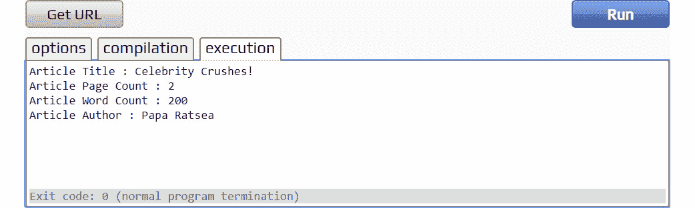
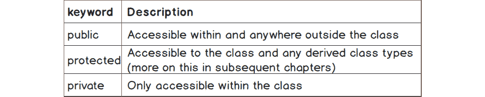
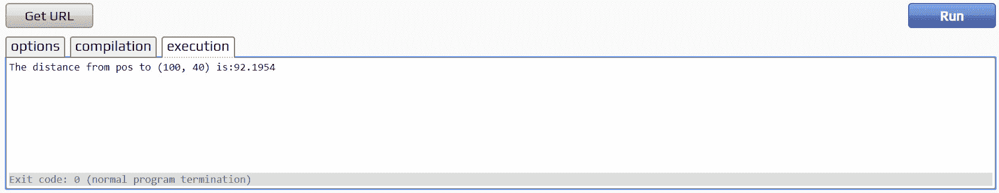
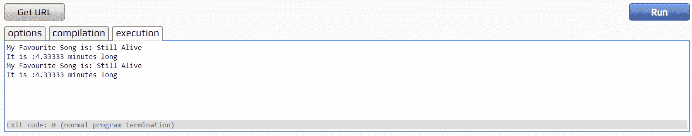
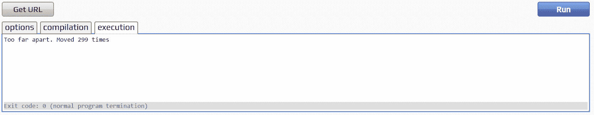
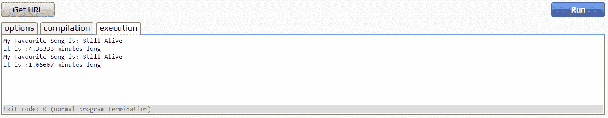
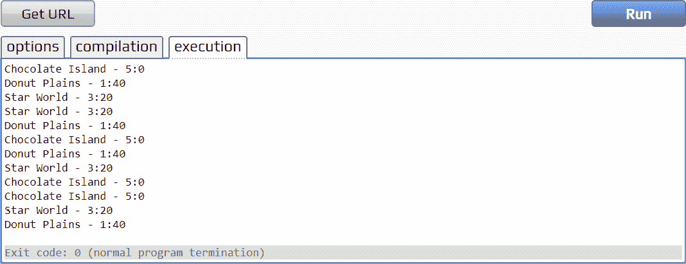

# 9\. 创建 API 服务

概述

在现代软件开发中，大多数逻辑通过不同的 Web 服务提供。这对于作为开发人员能够调用和创建新的 Web 服务至关重要。

在本章中，您将使用 ASP.NET Core Web API 模板创建自己的 RESTful Web 服务。您将学习如何做以及一些设计和构建 Web API 的最佳实践。您还将学习如何使用 Azure Active Directory（AAD）保护 API，集中处理错误，排除错误，生成文档等。

在本章结束时，您将能够创建受 Azure Active Directory（AAD）保护、托管在云上、可扩展并能够为数千用户提供服务的专业 Web API。

# 介绍

ASP.NET Core 是.NET Core 框架的一部分，旨在创建 Web 应用程序。使用它，您可以创建前端（如 Razor 或 Blazor）和后端（如 Web API 或 gRPC）应用程序。但是，在本章中，您将专注于创建 RESTful Web API。首次创建新的 Web 服务可能听起来像是一项艰巨的任务，但不要太担心；对于大多数情况，都有一个模板可以帮助您入门。在本章中，您将使用 ASP.NET Core 6.0 创建一些 Web API。

# ASP.NET Core Web API

在*第八章*中，*创建和使用 Web API 客户端*，您学习了如何调用 RESTful API。在本章中，您将创建一个。Web API 是用于在.NET 中创建 RESTful Web API 的模板。它包含路由、依赖注入（DI）、示例控制器、日志记录和其他有用的组件，以帮助您入门。

## 创建一个新项目

要创建新的 Web API，请按照以下步骤操作：

1.  创建一个新目录。

1.  以您想要创建的项目命名它。

1.  使用`cd`命令导航到该目录。

1.  在命令行中执行以下操作：

```cpp
    dotnet new webapi
    ```

这就是开始所需的全部。

1.  要查看是否按预期执行，请运行以下命令并查看您的应用程序启动（*图 9.1*）：

```cpp
    dotnet run --urls=https://localhost:7021/
    ```



图 9.1：终端窗口显示应用程序托管的端口

在*图 9.1*中，您将看到应用程序`https`版本的端口 7021。可能会有多个端口，特别是如果您同时托管`HTTP`和`HTTPs`版本的应用程序。但是，要记住的关键事情是您可以在哪个端口运行应用程序（例如，通过命令行）。

端口是通过它允许其他所有应用程序调用某个特定应用程序的通道。它是一个出现在基本 URL 之后的数字，它允许一个单一的应用程序通过。这些应用程序不一定是外部应用程序；相同的规则也适用于内部通信。

本地主机指的是本地托管的应用程序。在本章后期，您将配置服务绑定到您想要的任何端口。

注意

单台计算机上有 65,535 个可用端口。端口 0 到 1023 被称为众所周知的端口，因为通常系统的相同部分会监听它们。通常情况下，如果一台计算机上托管了单个应用程序，端口将为`http`的 80 端口和`https`的 443 端口。如果托管多个应用程序，端口将会有很大的变化（通常从端口 1024 开始）。

### Web API 项目结构

每个 Web API 至少由两个类组成—`Program`和一个或多个控制器（在本例中为`WeatherForecastController`）：

+   程序：这是应用程序的**起点**。它作为应用程序的低级运行程序，并管理依赖关系。

+   控制器：这是一个`[Model]Controller`。在这个例子中，`WeatherForecastController`将使用`/weatherforecast`端点进行调用。



图 9.2：在 VS Code 中新创建的 MyProject 结构，并突出显示了关键部分

### WeatherForecastController 的深入了解

默认模板中的控制器之前有两个属性：

+   `[ApiController]`：此属性添加了常见、方便（但是有主观意见）的 Web API 功能。

+   `[Route("[controller]")]`：此属性用于提供给定控制器的路由模式。

例如，在这些属性缺失或请求复杂的情况下，您需要自行验证传入的 HTTP 请求，而不是使用现成的路由：

```cpp
[ApiController]
[Route("[controller]")]
public class WeatherForecastController : ControllerBase
{
```

该控制器的路由为`/WeatherForecast`。路由通常由单词`Controller`之前的单词组成，除非另有规定。在专业开发 API 或者在客户端和服务器端应用程序时，建议在路由前添加`/api`，使其成为`[Route("api/[controller]")]`。

接下来，您将了解控制器类声明。常见的控制器函数来自派生的`ControllerBase`类和一些组件（通常是记录器）和服务。这里唯一有趣的部分是，您使用的不是`Ilogger`，而是`ILogger<WeatherForecastController>`：

```cpp
    private readonly ILogger<WeatherForecastController> _logger;
    public WeatherForecastController(ILogger<WeatherForecastController> logger)
    {
        _logger = logger;
    }
```

使用通用部分的原因仅仅是为了从调用日志的地方获取上下文。使用记录器的通用版本，您使用作为通用参数提供的类的完全限定名称。调用`logger.Log`将在上下文前加上一个前缀；在这种情况下，它将是`Chapter09.Service.Controllers.WeatherForecastController[0]`。

最后，查看以下控制器方法：

```cpp
    [HttpGet]
    public IEnumerable<WeatherForecast> Get()
    {
        return new List<WeatherForecast>(){new WeatherForecast()};
    }
}
```

`[HttpGet]`属性将`Get`方法与根控制器端点（`/WeatherForecast`）的 HTTP GET 方法绑定。每种 HTTP 方法都有一个版本的该属性，它们是`HttpGet`、`HttpPost`、`HttpPatch`、`HttpPut`和`HttpDelete`。要检查服务是否正常工作，请使用以下命令运行应用程序：

```cpp
dotnet run --urls=https://localhost:7021/
```

这里，`-urls=https://localhost:7021/`参数不是必需的。该参数只是确保.NET 选择的端口与执行期间在本示例中指示的端口相同。

要查看输出，请在浏览器中导航到`https://localhost:7021/weatherforecast/`。这将在调用 HTTP GET 时返回一个默认的`WeatherForecast`：

`[{"date":"0001-01-01T00:00:00","temperatureC":0,"temperatureF":32,"summary":null}]。`

注意

当`https://localhost:7021/weatherforecast/`显示错误消息（`本地主机拒绝连接`）时，这意味着应用程序可能正在运行，但在不同的端口上。因此，请始终记住在*创建新项目*部分（*第 5 步*）中描述的指定端口。

### 使用不同的状态码进行响应

找出`public IEnumerable<WeatherForecast> Get()`可以响应的状态码。使用以下步骤，您可以尝试并检查浏览器中发生的情况：

1.  在浏览器中导航到`https://localhost:7021/weatherforecast/`。

1.  点击“更多工具”。

1.  选择“开发人员工具”选项。或者，您可以使用`F12`键启动开发人员工具。

1.  接下来，点击“网络”选项卡。

1.  点击“标头”选项卡。您会看到`https://localhost:7021/weatherforecast/`响应为`200`“状态码”：


图 9.3：开发工具网络选项卡-检查成功响应的响应标头

1.  创建一个名为`GetError`的新端点，如果程序运行时出现罕见情况，则会引发异常：

```cpp
            [HttpGet("error")]
            public IEnumerable<WeatherForecast> GetError()
            {
                throw new Exception("Something went wrong");
            }
    ```

1.  现在，调用`https://localhost:7021/weatherforecast/error`。它响应状态码为`500`：



图 9.4：开发工具网络选项卡-检查带有异常的响应

如果您想要返回不同的状态代码，您应该怎么做？为此，`BaseController`类包含用于返回所需任何类型的状态代码的实用方法。例如，如果您想要明确返回一个 OK 响应，而不是立即返回一个值，您可以返回`Ok(value)`。但是，如果您尝试更改代码，您将收到以下错误：

```cpp
Cannot implicitly convert type 'Microsoft.AspNetCore.Mvc.OkObjectResult' to 'Chapter09.Service.Models.WeatherForecast'
```

这不起作用，因为控制器不返回 HTTP 状态代码；您要么返回某个值，要么抛出某个错误。要返回您选择的任何状态代码，您需要更改返回类型。因此，控制器永远不应该有某个值的返回类型。它应该始终返回`IActionResult`类型 - 一种支持所有状态代码的类型。

为任何一周的天气添加一个方法。如果未找到该天（小于`1`或大于`7`的值），您将明确返回`404 - 未找到`：

```cpp
[HttpGet("weekday/{day}")]
public IActionResult GetWeekday(int day)
{
    if (day < 1 || day > 7)
    {
        return NotFound($"'{day}' is not a valid day of a week.");
    }
    return Ok(new WeatherForecast());
}
```

在这里，您在端点的末尾添加了一个新的`{day}`。这是一个占位符值，来自匹配函数参数（在本例中为`day`）。重新运行服务并导航到`https://localhost:7021/weatherforecast/weekday/8`将导致`404 - 未找到`状态代码，因为它超过了允许的最大天数值，即`7`：



图 9.5：查找不存在的一周天气预报的响应

注意

您可以在[`packt.link/SCudR`](https://packt.link/SCudR)找到此示例使用的代码。

这结束了本主题的理论部分。在接下来的部分中，您将通过练习将其付诸实践。

## 练习 9.01：.NET Core 当前时间服务

一旦您成功运行了 Web API 一次，添加新的控制器应该是微不足道的。通常，无论服务是否正在运行，都会使用最基本的逻辑进行检查；它是返回 OK 还是获取当前的`DateTime`值。在这个练习中，您将创建一个简单的当前时间服务，返回 ISO 标准的当前时间。执行以下步骤来完成：

1.  创建一个名为`TimeController`的新控制器，以获取本地时间，并进一步添加用于测试目的的功能：

```cpp
        [ApiController]
        [Route("[controller]")]
        public class TimeController : ControllerBase
        {
    ```

这里显示的控制器不仅用于测试；它也充当业务逻辑。

1.  添加一个名为`GetCurrentTime`的 HTTP GET 端点，指向`time/current`路由。您将用它来获取当前时间：

```cpp
            [HttpGet("current")]
            public IActionResult GetCurrentTime()
            {
    ```

1.  返回当前的`DateTime`转换为 ISO 格式的字符串：

```cpp
                return Ok(DateTime.Now.ToString("o"));
            }
        }
    ```

1.  导航到`https://localhost:7021/time/current`，您应该看到以下响应：

```cpp
    2022-07-30T15:06:28.4924356+03:00
    ```

如*Web API 项目结构*部分所述，您可以使用端点来确定服务是否正在运行。如果正在运行，那么您将获得`DateTime`值，就像您在前面的输出中看到的那样。如果没有运行，那么您将获得一个带有`404 - 未找到`状态代码的响应。如果正在运行但出现问题，那么您将获得`500`状态代码。

注意

您可以在[`packt.link/OzaTd`](https://packt.link/OzaTd)找到此练习使用的代码。

到目前为止，您的重点都在控制器上。现在是时候将注意力转移到 Web API 的另一个关键部分 - `Program`类了。

## 引导 Web API

`Program`类将整个 API 连接在一起。通俗地说，您为控制器注册了所有抽象的实现，并添加了所有必要的中间件。

### 依赖注入

在 *第二章* *构建高质量的面向对象的代码* 中，您探讨了 DI 的概念。在 *第七章* *使用 ASP.NET 创建现代 Web 应用程序* 中，您看到了一个关于日志服务的 DI 示例。在本章中，您将亲身体验 DI 和控制反转（IoC）容器 - 用于在一个中心位置连接和解析所有依赖关系的组件。在 .NET Core 及以后版本中，默认容器是 `Microsoft.Extensions.DependencyInjection`。稍后您将更多地了解它。

### Program.cs 和 Minimal API

.NET 6 中最简单的 Web API 如下所示：

```cpp
// Inject dependencies (DI)
var builder = WebApplication.CreateBuilder(args);
builder.Services.AddControllers();
// Add middleware
var app = builder.Build();
if (builder.Environment.IsDevelopment())
{
    app.UseDeveloperExceptionPage();
}
app.MapControllers();
app.Run();
```

这是一个最小的 API，因为它利用了顶级语句功能。在 .NET 6 之前，您会在 `Startup` 类（`Configure` 和 `ConfigureService`）和 `Program` 类中有两个方法。现在，您只有一个文件 `Program.cs`，没有类或方法。您仍然可以使用旧的启动应用程序的方式。实际上，.NET 6 将在幕后生成类似的类。但是，如果您在 .NET 6 中创建新应用程序，那么最好使用最小的 API。 

分解上述代码片段。要启动应用程序，首先需要构建它。因此，您将使用以下代码行创建一个构建器：

```cpp
var builder = WebApplication.CreateBuilder(args);
```

`builder.Services` 指定要注入的服务。在这种情况下，您注册了控制器的实现。所以，这里只有一个控制器调用 - 即 `WeatherForecastController`：

```cpp
builder.Services.AddControllers();
```

当您使用 `builder.Build()` 时，您可以访问 `app` 对象，并通过添加中间件进一步配置应用程序。例如，要添加控制器路由，请调用以下方法：

```cpp
app.MapControllers();
```

最后，`builder.Environment.IsDevelopment()` 检查环境是否为开发环境。如果是开发环境，它将调用 `app.UseDeveloperExceptionPage();`，在发生错误时添加详细错误信息。

日志没有在任何地方提及；但您仍在使用它。一个常见的模式是将所有相关的注入分组到同一个 `IServiceCollection` 的扩展方法下。包括日志记录在内的所有控制器相关功能的扩展方法的示例是 `AddControllers` 方法。

您已经看到了在运行 API 后通过控制台记录器发送的日志消息。在幕后，调用了 `builder.Services.AddLogging` 方法。该方法清除了所有记录提供程序：

```cpp
builder.Services.AddLogging(builder =>
{
    builder.ClearProviders();
});
```

如果您现在运行应用程序，您将看不到任何东西出现在控制台上（*图 9.6*）：



图 9.6：运行应用程序时不显示任何日志

然而，如果以以下方式修改 `AddLogging` 来包括 `Console` 和 `Debug` 日志，你将会看到日志，如 *图 9.7* 所示：

```cpp
builder.Services.AddLogging(builder =>
{
    builder.ClearProviders();
    builder.AddConsole();
    builder.AddDebug();
});
```

现在，将错误日志功能添加到 `WeatherForecastController` 的错误端点。当程序运行时出现罕见情况时，这将引发异常：

```cpp
[HttpGet("error")]
public IEnumerable<WeatherForecast> GetError()
{
    _logger.LogError("Whoops");
    throw new Exception("Something went wrong");
}
```

使用以下命令重新启动 API：

```cpp
dotnet run --urls=https://localhost:7021/
```

现在，调用 `https://localhost:7021/weatherforecast/error`，这将显示已记录的消息（比较 *图 9.6* 和 *图 9.7*）：


图 9.7：终端上显示的错误消息“Whoops”

## `AddLogging` 方法的内部工作

`AddLogging` 方法是如何工作的？`AddLogging` 方法的反编译代码如下：

```cpp
services.AddSingleton<ILoggerFactory, LoggerFactory>();
```

最好的做法是不要自己初始化记录器。 `ILoggerFactory` 提供了这个功能，作为一个可以创建记录器的单一位置。虽然 `ILoggerFactory` 是一个接口，`LoggerFactory` 是该接口的实现。`AddSingleton` 是一个方法，指定将创建和使用 `LoggerFactory` 的单个实例，每当引用 `ILoggerFactory` 时。

现在问题出现了：为什么在控制器中没有使用 `ILoggerFactory`？当解析控制器的实现时，`ILoggerFactory` 在幕后使用。当公开控制器依赖项（如 `logger`）时，您不再需要关心它是如何初始化的。这是一个很大的好处，因为它使持有依赖项的类更简单、更灵活。

如果您确实想使用 `ILoggerFactory` 而不是 `Ilogger`，您可以有一个接受工厂的构造函数，如下所示：

```cpp
public WeatherForecastController(ILoggerFactory logger)
```

然后可以使用它创建一个 `logger`，如下所示：

```cpp
_logger = logger.CreateLogger(typeof(WeatherForecastController).FullName);
```

后者的 `logger` 与前者的功能相同。

本节涉及 `AddSingleton` 方法，用于在一个中心位置管理服务依赖项。继续下一节，解决依赖关系复杂性与 DI。

### 注入组件的生命周期

`AddSingleton` 方法非常有用，因为复杂的应用程序通常有数百甚至数千个依赖项，这些依赖项经常在不同的组件之间共享。要管理每个初始化将是一个相当大的挑战。DI 通过提供一个管理依赖项及其生命周期的中心位置来解决这个问题。在继续之前，您需要了解更多关于 DI 生命周期的知识。

.NET 中有三种注入的对象生命周期：

+   Singleton：应用程序生命周期内每次初始化一次的对象

+   Scoped：对象每个请求初始化一次

+   Transient：每次引用时初始化的对象

为了更好地说明 DI 和不同的服务生命周期，下一节将重构现有的 `WeatherForecastController` 代码。

## 服务中的 DI 示例

服务是逻辑的最高级别的持有者。控制器本身不应执行任何业务逻辑，只需将请求委托给能够处理它的其他对象。应用这一原则，并使用 DI 重构 `GetWeekday` 方法。

首先，为您将要移动所有逻辑的服务创建一个接口。这样做是为了创建一个抽象，以便稍后提供实现。需要抽象是因为您希望尽可能多地将逻辑从控制器移出到其他组件中：

```cpp
public interface IWeatherForecastService
{
    WeatherForecast GetWeekday(int day);
}
```

当您将一部分移出控制器时，您还希望处理错误场景。在这种情况下，如果提供的日期不在 `1` 和 `7` 之间，您将返回 `404 - 未找到` 错误。但是，在服务级别上，没有 HTTP 状态代码的概念。因此，您将抛出一个异常，而不是返回一个 HTTP 消息。为了正确处理异常，您将创建一个名为 `NoSuchWeekdayException` 的自定义异常：

```cpp
public class NoSuchWeekdayException : Exception
{
    public NoSuchWeekdayException(int day) 
        : base($"'{day}' is not a valid day of a week.") { }
}
```

接下来，创建一个实现服务的类。您将把代码移到这里：

```cpp
public class WeatherForecastService : IWeatherForecastService
{
    public WeatherForecast GetWeekday(int day)
    {
        if (day < 1 || day > 7)
        {
            throw new NoSuchWeekdayException(day);
        }
        return new WeatherForecast();
    }
}
```

与之前的代码相比，唯一的区别是，您使用了 `throw new NoSuchWeekdayException`，而不是返回 `NotFound`。

现在，将服务注入到控制器中：

```cpp
private readonly IWeatherForecastService _weatherForecastService;
private readonly Ilogger _logger;
public WeatherForecastController(IloggerFactory logger, IWeatherForecastService weatherForecastService)
{
    _weatherForecastService = weatherForecastService;
    _logger = logger.CreateLogger(typeof(WeatherForecastController).FullName);
}
```

在 *使用不同状态代码响应* 部分中，经过清理的控制器方法，现在看起来是这样的，业务逻辑最少：

```cpp
[HttpGet("weekday/{day}")]
public IActionResult GetWeekday(int day)
{
    try
    {
        var result = _weatherForecastService.GetWeekday(day);
        return Ok(result);
    }
    catch(NoSuchWeekdayException exception)
    {
        return NotFound(exception.Message);
    }
}
```

它可能看起来仍然是相同的代码；但是，这里的关键点是控制器不再执行任何业务逻辑。它只是将服务的结果映射回 HTTP 响应。

注意

在 *错误处理* 部分，您将返回到这里，并进一步从控制器中删除代码，使其尽可能轻量化。

如果您运行此代码，在调用控制器的任何端点时，将会收到以下异常：

```cpp
Unable to resolve service for type 'Chapter09.Service.Examples.TemplateApi.Services.IweatherForecastService' while attempting to activate 'Chapter09.Service.Examples.TemplateApi.Controllers.WeatherForecastController'
```

此异常显示 `WeatherForecastController` 无法找出 `IWeatherForecastService` 的实现方式。因此，您需要指定哪个实现适合所需的抽象。例如，这是在 `Program` 类内部完成的，如下所示：

```cpp
builder.Services.AddSingleton<IWeatherForecastService, WeatherForecastService>();
```

`AddSingleton` 方法读取此处的 `IWeatherForecastService`，`WeatherForecastService` **实现**。在接下来的段营中，您将学习它的确切工作原理。

现在您有一个要注入的服务，您可以探索每次注入对服务调用的影响。在调用以下控制器方法时，您将略微修改`WeatherForecastService`和`WeatherForecastController`。

在`WeatherForecastService`中，执行以下操作：

1.  注入一个`logger`：

```cpp
            private readonly ILogger<WeatherForecastService> _logger;
            public WeatherForecastService(ILogger<WeatherForecastService> logger)
            {
                _logger = logger;
            }
    ```

1.  当服务初始化时，记录一个随机的`Guid`，将构造函数修改为如下所示：

```cpp
            public WeatherForecastService(ILogger<WeatherForecastService> logger)
            {
                _logger = logger;
                _logger.LogInformation(Guid.NewGuid().ToString());
            }
    ```

在`WeatherForecastController`中，执行以下操作：

1.  注入`WeatherForecastService`的第二个实例：

```cpp
        public class WeatherForecastController : ControllerBase
        {
            private readonly IWeatherForecastService _weatherForecastService1;
            private readonly IWeatherForecastService _weatherForecastService2;
            private readonly ILogger _logger;
            public WeatherForecastController(ILoggerFactory logger, IWeatherForecastService weatherForecastService1, IWeatherForecastService weatherForecastService2)
            {
                _weatherForecastService1 = weatherForecastService1;
                _weatherForecastService2 = weatherForecastService2;
                _logger = logger.CreateLogger(typeof(WeatherForecastController).FullName);
            }
    ```

1.  在获取工作日时同时调用两个实例：

```cpp
            [HttpGet("weekday/{day}")]
            public IActionResult GetWeekday(int day)
            {
                try
                {
                    var result = _weatherForecastService1.GetWeekday(day);
                    result = _weatherForecastService1.GetWeekday(day);
                    return Ok(result);
                }
                catch (NoSuchWeekdayException exception)
                {
                    return NotFound(exception.Message);
                }
            }
    ```

`GetWeekday`方法被调用两次，因为它将有助于更好地说明 DI 的生命周期。现在是时候探索不同的 DI 生命周期了。

## 单例

在`Program.cs`中将服务注册为单例的方式如下：

```cpp
builder.Services.AddSingleton<IWeatherForecastService, WeatherForecastService>();
```

调用应用程序后，您将看到在运行代码时生成的以下日志：

```cpp
info: Chapter09.Service.Services.WeatherForecastService[0]
      2b0c4e0c-97ff-4472-862a-b6326992d9a6
info: Chapter09.Service.Services.WeatherForecastService[0]
      2b0c4e0c-97ff-4472-862a-b6326992d9a6
```

如果再次调用应用程序，您将看到相同的 GUID 被记录：

```cpp
info: Chapter09.Service.Services.WeatherForecastService[0]
      2b0c4e0c-97ff-4472-862a-b6326992d9a6
info: Chapter09.Service.Services.WeatherForecastService[0]
      2b0c4e0c-97ff-4472-862a-b6326992d9a6
```

这证明服务只初始化了一次。

## 作用域

在`Program.cs`中将服务注册为作用域的方式如下：

```cpp
builder.Services.AddScoped<IWeatherForecastService, WeatherForecastService>();
```

调用应用程序后，您将看到在运行代码时生成的以下日志：

```cpp
info: Chapter09.Service.Services.WeatherForecastService[0]
      921a29e8-8f39-4651-9ffa-2e83d2289f29
info: Chapter09.Service.Services.WeatherForecastService[0]
      921a29e8-8f39-4651-9ffa-2e83d2289f29
```

再次调用`WeatherForecastService`时，您将看到以下内容：

```cpp
info: Chapter09.Service.Services.WeatherForecastService[0]
      974e082d-1ff5-4727-93dc-fde9f61d3762
info: Chapter09.Service.Services.WeatherForecastService[0]
      974e082d-1ff5-4727-93dc-fde9f61d3762
```

这是一个不同的 GUID 被记录。这证明服务在每个请求中只初始化一次，但在新请求中会初始化一个新实例。

## 瞬态

在`Program.cs`中将服务注册为瞬态的方式如下：

```cpp
builder.Services.AddTransient<IWeatherForecastService, WeatherForecastService>();
```

调用应用程序后，您将看到在运行代码时生成的以下日志：

```cpp
info: Chapter09.Service.Services.WeatherForecastService[0]
      6335a0aa-f565-4673-a5c4-0590a5d0aead
info: Chapter09.Service.Services.WeatherForecastService[0]
      4074f4d3-5e50-4748-9d6f-15fb6a782000
```

记录了两个不同的 GUID 证明了两个服务是使用不同的实例初始化的。可以在 Web API 之外使用 DI 和 IoC。通过 IoC 进行 DI 只是另一个库，Web API 模板提供了一些额外的功能。

注意

如果要在 ASP.NET Core 之外使用 IoC，请安装以下 NuGet（或其他 IoC 容器）：`Microsoft.Extensions.DependencyInjection`。

### TryAdd

到目前为止，您已经使用`Add[Lifetime]`函数将实现与其抽象连接起来。然而，在大多数情况下，这并不是最佳实践。通常，您希望一个单一的实现与一个单一的抽象连接起来。但是，如果您重复调用`Add[Lifetime]`，例如`AddSingleton`函数，您将在其下创建一组实现实例（重复项）。这很少是意图，因此您应该保护自己免受这种情况的影响。

通过`TryAdd[Lifetime]`方法，最干净的方式来连接依赖关系。在重复依赖的情况下，它将简单地不添加重复。为了说明两个版本的 DI 之间的区别，比较使用不同方法注入服务的数量。在这里，您将作为单例注入两个相同的服务。

在这里，您正在使用`Add[Lifetime]`服务作为单例：

```cpp
builder.Services.AddSingleton<IWeatherForecastService, WeatherForecastService>();
Debug.WriteLine("Services count: " + services.Count);
builder.services.AddSingleton<IWeatherForecastService, WeatherForecastService>();
Debug.WriteLine("Services count: " + services.Count);
```

该命令将显示以下输出：

```cpp
Services count: 156
Services count: 157
```

在这里，您正在使用`TryAdd[Lifetime]`服务作为单例：

```cpp
builder.Services.TryAddSingleton<IWeatherForecastService, WeatherForecastService>();
Debug.WriteLine("Services count: " + services.Count);
builder.Services.TryAddSingleton<IWeatherForecastService, WeatherForecastService>();
Debug.WriteLine("Services count: " + services.Count);
```

该命令将显示以下输出：

```cpp
Services count: 156
Services count: 156
```

注意`Add[Lifetime]`在输出中添加了重复项，而`TryAdd[Lifetime]`没有。由于您不希望有重复的依赖关系，建议您使用`TryAdd[Lifetime]`版本。

您也可以为具体类进行注入。调用`builder.Services.AddSingleton<WeatherForecastService, WeatherForecastService>();`是有效的 C#代码；但是，这并没有太多意义。DI 用于将实现注入到抽象中。当引导服务时，这将无法工作，因为将显示以下错误：

```cpp
Unable to resolve a controller
```

错误发生是因为仍然需要提供抽象-实现绑定。只有在控制器的构造函数中公开具体实现而不是抽象时才能工作。在实践中，这种情况很少被使用。

您已经学会了通过`TryAdd[Lifetime]`方法将依赖项连接起来的最干净的方法。现在，您将创建一个接受原始参数（`int`和`string`）的服务，并查看它如何在 IoC 容器中管理其非原始依赖项。

### 手动使用 IoC 容器进行注入

有时您需要在注入之前创建服务的实例。一个示例用例可能是构造函数中带有原始参数的服务，换句话说，是为特定城市配置了天气预报刷新间隔的天气预报服务。因此，在这种情况下，您无法注入一个字符串或整数，但可以创建一个带有整数和字符串的服务并注入该服务。

修改`WeatherForecastService`以具有上述功能：

```cpp
public class WeatherForecastServiceV2 : IWeatherForecastService
{
    private readonly string _city;
    private readonly int _refreshInterval;
    public WeatherForecastService(string city, int refreshInterval)
    {
        _city = city;
        _refreshInterval = refreshInterval;
    }
```

返回到`Program`类，并尝试为`纽约`注入一个刷新间隔为`5`（小时）的服务：

```cpp
builder.Services.AddSingleton<IWeatherForecastService, WeatherForecastService>(BuildWeatherForecastService);
static WeatherForecastServiceV2 BuildWeatherForecastService(IServiceProvider _)
{
    return new WeatherForecastServiceV2("New York", 5);
}
```

为了注入服务，您始终使用`builder.Services.Add[Lifetime]`方法的一个版本。但是，除此之外，您还提供了一个参数-指定服务应如何创建的委托。可以通过在`IServiceCollection`上调用`BuildServices`方法来访问服务提供程序。此委托以`IServiceProvider`作为输入，并使用它来构建一个新服务。

在这种情况下，您没有使用它，因此将参数命名为丢弃运算符(`_`)。函数的其余内容只是简单地返回前一段的值（为简洁起见，您不会添加任何额外的逻辑来使用新值）。如果您有一个更复杂的服务，例如需要另一个服务的服务，您可以从`IServiceProvider`调用`.GetService<ServiceType>`方法。

`Build`和`Create`是两个常见的方法名称。但是，它们不应该互换使用。当构建单个专用对象时使用`Build`，而当意图是生成多个不同类型的对象时使用`Create`。

注意

您可以在[`packt.link/fBFRQ`](https://packt.link/fBFRQ)找到此示例使用的代码。

## 练习 9.02：在国家 API 时区中显示当前时间

在这个练习中，您的任务是创建一个 Web API，该 API 提供 UTC 不同时区的日期和时间。通过 URL，您将传递一个介于`-12`和`+12`之间的数字，并返回该时区的时间。

执行以下步骤：

1.  创建一个名为`ICurrentTimeProvider`的接口，其中包含一个名为`DateTime GetTime(string timezone)`的方法：

```cpp
    public interface ICurrentTimeProvider
    {
        DateTime GetTime(string timezoneId);
    }
    ```

1.  创建一个名为`CurrentTimeUtcProvider`的类，实现`ICurrentTimeProvider`接口，以实现应用程序所需的逻辑：

```cpp
    public class CurrentTimeUtcProvider : ICurrentTimeProvider
    {
    ```

1.  实现将当前`DateTime`转换为`Utc`，然后根据传递的时区进行偏移的方法：

```cpp
        public DateTime GetTime(string timezoneId)
        {
            var timezoneInfo = TimeZoneInfo.FindSystemTimeZoneById(timezoneId);
            var time = TimeZoneInfo.ConvertTimeFromUtc(DateTime.UtcNow, timezoneInfo);
            return time;
        }
    }
    ```

1.  创建一个`CurrentTimeProviderController`控制器，以确保它在构造函数中接受`ICurrentTimeProvider`：

```cpp
    [ApiController]
    [Route("[controller]")]
    public class CurrentTimeController : ControllerBase
    {
        private readonly ICurrentTimeProvider _currentTimeProvider;
        public CurrentTimeController(ICurrentTimeProvider currentTimeProvider)
        {
            _currentTimeProvider = currentTimeProvider;
        }
    ```

1.  创建一个名为`IActionResult Get(string timezoneId)`的`HttpGet`端点，该端点调用当前时间提供程序并返回当前时间：

```cpp
        [HttpGet]
        public IActionResult Get(string timezoneId)
        {
            var time = _currentTimeProvider.GetTime(timezoneId);
            return Ok(time);
        }
    }
    ```

请注意，`{timezoneId}`没有在`HttpGet`属性中指定。这是因为该模式用于端点上的 REST 部分；但是，在这种情况下，它作为查询字符串的参数传递。如果字符串包含空格或其他特殊字符，则应在传递之前对其进行编码。您可以使用此工具对字符串进行 URL 编码：[`meyerweb.com/eric/tools/dencoder/`](https://meyerweb.com/eric/tools/dencoder/)。

1.  在`Program`类中注入服务：

```cpp
    builder.Services.AddSingleton<ICurrentTimeProvider, CurrentTimeUtcProvider>();
    ```

在这里，您将服务作为单例注入，因为它是无状态的。

1.  使用您选择的`timezoneid`值调用`https://localhost:7021/CurrentTime?timezone=[yourtimezone]`端点。例如，您可以调用以下端点：`https://localhost:7021/CurrentTime?timezoneid=Central%20Europe%20Standard%20Time`。

您将获得显示该时区的日期和时间的响应：

```cpp
"2021-09-18T20:32:29.1619999"
```

注意

您可以在[`packt.link/iqGJL`](https://packt.link/iqGJL)找到用于此练习的代码。

## OpenAPI 和 Swagger

OpenAPI 是一种**REST API**描述格式。它是一个 API 的规范，包括它具有的端点、支持的身份验证方法、它接受的参数以及它通知的示例请求和响应。REST API 可以使用 JSON 和 XML 格式；但是，通常选择 JSON。Swagger 是实现 OpenAPI 标准的一组工具和库。Swagger 生成两个东西：

+   一个用于调用 API 的网页

+   生成客户端代码

在.NET 中，有两个用于使用 Swagger 的库：

+   `NSwag`

+   `Swashbuckle`

### 使用 Swagger Swashbuckle

在本节中，您将使用`Swashbuckle`来演示测试 API 和生成 API 文档的一种方法。因此，通过运行以下命令安装`Swashbuckle.AspNetCore`包：

```cpp
dotnet add package Swashbuckle.AspNetCore
```

在`Program.cs`中的`builder.Build()`调用之前，添加以下代码行：

```cpp
builder.Services.AddSwaggerGen();
```

这将注入生成 Swagger 模式和文档测试页面所需的 Swagger 服务。

在`Program.cs`中的`builder.Build()`之后，添加以下内容：

```cpp
app.UseSwagger();
app.UseSwaggerUI(c => { c.SwaggerEndpoint("/swagger/v1/swagger.json", "My API V1"); }); 
```

第一行支持访问 OpenAPI Swagger 规范，第二行允许在用户友好的网页上访问规范。

现在，按以下方式运行程序：

```cpp
dotnet run --urls=https://localhost:7021/
```

当您导航到`https://localhost:7021/swagger/`时，您将看到以下屏幕：



图 9.8：用户友好的 Swagger 端点

单击任何端点都将允许您向其发送 HTTP 请求。此页面可以配置为包含有关项目的常见信息，例如联系信息、许可证、描述、服务条款等。

Swagger 的好处并不止于此。如果您有注释，您也可以在此页面上包含它们。您还可以包含端点产生的所有可能的响应类型。甚至可以包含示例请求并在调用 API 时将它们设置为默认值。

创建一个新的端点来保存天气预报，然后创建另一个端点来检索它。逐个记录这两种方法。因此，首先更新`IWeatherForecastService`接口以包括两个新方法`GetWeekday`和`GetWeatherForecast`，如下所示：

```cpp
    public interface IWeatherForecastService
    {
        WeatherForecast GetWeekday(int day);
        void SaveWeatherForecast(WeatherForecast forecast);
        WeatherForecast GetWeatherForecast(DateTime date);
    }
```

接下来，在`WeatherForecastService`中添加这些方法的实现。为了保存天气预报，您将需要存储，最简单的存储将是`IMemoryCache`。在这里，您将需要一个新的`IMemoryCache`字段：

```cpp
private readonly IMemoryCache _cache;
```

现在，更新构造函数以注入`IMemoryCache`：

```cpp
public WeatherForecastService(ILogger<WeatherForecastService> logger, string city, int refreshInterval, IMemoryCache cache)
        {
            _logger = logger;
            _city = city;
            _refreshInterval = refreshInterval;
            _serviceIdentifier = Guid.NewGuid();
            _cache = cache;
        }
```

然后，创建`SaveWeatherForecast`方法来保存天气预报：

```cpp
        public void SaveWeatherForecast(WeatherForecast forecast)
        {
            _cache.Set(forecast.Date.ToShortDateString(), forecast);
        }
```

创建一个`GetWeatherForecast`方法来获取天气预报：

```cpp
        public WeatherForecast GetWeatherForecast(DateTime date)
        {
            var shortDateString = date.ToShortDateString();
            var contains = _cache.TryGetValue(shortDateString, out var entry);
            return !contains ? null : (WeatherForecast) entry;
        }
```

现在，回到`WeatherForecastController`，为每个方法创建一个端点，以便您可以使用 HTTP 请求进行测试：

```cpp
        [HttpGet("{date}")]
        public IActionResult GetWeatherForecast(DateTime date)
        {
            var weatherForecast = _weatherForecastService1.GetWeatherForecast(date);
            if (weatherForecast == null) return NotFound();
            return Ok(weatherForecast);
        }
        [HttpPost]
        public IActionResult SaveWeatherForecast(WeatherForecast weatherForecast)
        {
            _weatherForecastService1.SaveWeatherForecast(weatherForecast);
            return CreatedAtAction("GetWeatherForecast", new { date = weatherForecast.Date.ToShortDateString()}, weatherForecast);
        }
```

请注意，当创建新的天气预报时，您将返回`CreatedAtAction`结果。这将返回 HTTP 状态代码`201`和用于获取创建的资源的 URI。指定了，为了以后获取创建的预报，您可以使用`GetWeatherForecast`。匿名的`new { date = weatherForecast.Date.ToShortDateString()}`对象指定了调用该操作所需的参数。您传递了`Date.ToShortDateString()`而不仅仅是一个日期，因为完整的`DateTime`包含了比您需要的更多内容。在这里，您只需要一个日期；因此，您明确地去掉了您不需要的部分。

通过描述每个方法的功能和它可能返回的状态代码来记录每个方法。然后，在每个端点上方添加这些信息：

```cpp
        /// <summary>
        /// Gets weather forecast at a specified date.
        /// </summary>
        /// <param name="date">Date of a forecast.</param>
        /// <returns>
        /// A forecast at a specified date.
        /// If not found - 404.
        /// </returns>
        [HttpGet("{date}")]
        [ProducesResponseType(StatusCodes.Status404NotFound)]
        [ProducesResponseType(StatusCodes.Status200OK)]
        public IActionResult GetWeatherForecast(DateTime date)
        /// <summary>
        /// Saves a forecast at forecast date.
        /// </summary>
        /// <param name="weatherForecast">Date which identifies a forecast. Using short date time string for identity.</param>
        /// <returns>201 with a link to an action to fetch a created forecast.</returns>
        [HttpPost]
        [ProducesResponseType(StatusCodes.Status201Created)]
        public IActionResult SaveWeatherForecast(WeatherForecast weatherForecast)
```

现在您已经为这两个端点添加了 XML 文档。使用`ProducesResponseType`，您指定了端点可能返回的状态代码。如果刷新 Swagger 页面，您将在 Swagger 中看到`SaveWeatherForecast`端点：


图 9.9：在 Swagger 中保存 WeatherForecast 端点

如果刷新 Swagger 页面，您将在 Swagger 中看到`GetWeatherForecast`端点：


图 9.10：Swagger 中的 GetWeatherForecast 端点

您可以看到状态码的添加，但注释去哪了？默认情况下，Swagger 不会选择 XML 文档。您需要通过配置项目文件来指定它的操作。为此，请在目标框架的属性组下方的`<Project>`内添加以下代码片段：

```cpp
  <PropertyGroup>
    <GenerateDocumentationFile>true</GenerateDocumentationFile>
    <NoWarn>$(NoWarn);1591</NoWarn>
  </PropertyGroup>
```



图 9.11：包括 XML 文档的 Swagger 配置

最后，转到`Program.cs`文件，并用以下内容替换`service.AddSwaggerGen()`：

```cpp
            builder.Services.AddSwaggerGen(cfg =>
            {
                var xmlFile = $"{Assembly.GetExecutingAssembly().GetName().Name}.xml";
                var xmlPath = Path.Combine(AppContext.BaseDirectory, xmlFile);
                cfg.IncludeXmlComments(xmlPath);
            });
```

这是包含 XML 注释的 Swagger 文档所需的最后一段代码。现在，刷新页面，您应该看到包含的注释：


图 9.12：包括 XML 文档的 WeatherForecast Swagger 文档

注意

您可以在以下链接找到此示例使用的代码[`packt.link/iQK5X`](https://packt.link/iQK5X)。

Swagger 还有很多其他功能；您可以包括示例请求和响应，并为参数提供默认值。您甚至可以创建自己的 API 规范标准，并装饰项目命名空间以将相同的约定应用于每个控制器及其端点，但这超出了本书的范围。

最后要提到的是能够从 Swagger 文档中生成客户端的能力。要这样做，请按照以下步骤操作：

1.  为了下载`swagger.json` OpenAPI 文档文件，导航到`https://localhost:7021/swagger/v1/swagger.json`。

1.  在页面任意位置右键单击，然后选择“另存为”选项。

1.  然后，按`Enter`键。

1.  接下来，您将使用此 JSON 生成客户端代码。因此，请注册并登录到[`app.swaggerhub.com/home`](https://app.swaggerhub.com/home)（您可以使用 GitHub 帐户）。

1.  在新窗口中，单击“创建新”按钮（`1`）：


图 9.13：SwaggerHub 和导入 API 窗口

1.  选择“导入和记录 API”选项。

1.  通过单击“浏览”按钮（`2`）选择刚下载的 Swagger 文件。

1.  然后，点击`UPLOAD FILE`按钮：

注意

当您选择文件时，“导入”按钮（*图 9.13*中的`3`）会更改为“上传文件”按钮（*图 9.14*中的`3`）。


图 9.14：SwaggerHub IMPORT 按钮更改为 UPLOAD FILE 按钮

1.  在下一个屏幕上，保留服务的名称和默认值的版本。

1.  接下来，单击“导入定义”按钮：


图 9.15：SwaggerHub 导入 Swagger 服务定义

1.  现在导入了`Swagger.json`API 方案，您可以使用它来生成强类型的 C#客户端代码来调用 API。因此，单击“导出”选项（`1`）。

1.  然后，单击`Client SDK`选项（`2`）。

1.  选择`csharp`选项（`3`）：

图 9.16：从 SwaggerHub 导出新的 C#客户端

将下载一个`csharp-client-generated.zip`文件。

1.  提取`csharp-client-generated.zip`文件。

1.  导航到提取的文件夹并打开`IO.Swagger.sln`文件。您应该会看到以下内容：


图 9.17：使用 SwaggerHub 为客户端生成的文件

生成的客户端代码不仅具有强类型的 HTTP 客户端，还包括测试。它还有一个关于如何调用客户端和许多常见开发场景的`README.md`文件。

现在，出现的问题是，当您已经有了 Postman 时，是否应该使用 Swagger。虽然 Postman 是用于测试不同类型的 Web API 的最流行工具之一，但 Swagger 不仅仅是一个用于测试 API 是否有效的客户端。主要是 Swagger 是一个用于记录 API 的工具。从传统代码中，它允许您生成所有可能需要的内容：

+   测试页面

+   测试客户端代码

+   测试文档页面

到目前为止，您已经了解到 Swagger 是实现 OpenAPI 标准的一组工具和库，对于测试和记录 API 非常有帮助。现在，您可以继续了解错误处理。

## 错误处理

您已经了解到，控制器内的代码应尽可能简约，因为它是代码中的最高级别（直接调用）。特定的错误处理不应包含在控制器代码中，因为它会给已经复杂的代码增加复杂性。幸运的是，有一种方法可以将异常映射到 HTTP 状态代码并在一个地方设置它们，即通过`Hellang.Middleware.ProblemDetails`包。要这样做，首先通过运行以下命令安装该包：

```cpp
dotnet add package Hellang.Middleware.ProblemDetails
```

将`NoSuchWeekdayException`映射到 HTTP 状态代码`404`。在`Program.cs`文件中，在`builder.Build()`之前，添加以下代码：

```cpp
            builder.Services.AddProblemDetails(opt =>
            {
                opt.MapToStatusCode<NoSuchWeekdayException>(404);
                opt.IncludeExceptionDetails = (context, exception) => false;
            });
```

这不仅将异常转换为正确的状态代码，还使用`ProblemDetails`——基于 RFC 7807 的标准响应模型——提供 HTTP 响应中的故障。此外，这还在错误消息中排除了异常详细信息。

在本地开发服务时，了解出了什么问题是非常宝贵的。然而，暴露堆栈跟踪和其他确定错误所需的信息可能会暴露您的 Web API 的漏洞。因此，在向发布阶段迈进时最好隐藏它。默认情况下，`Hellang`库已经在高级环境中排除了异常详细信息，因此最好不要包含该行。出于演示目的和简化的响应消息，这里包含了它。

在构建演示之前，您还需要关闭默认的开发人员异常页面，因为它会覆盖`ProblemDetails`中的异常。只需从`Configure`方法中删除以下代码块：

```cpp
        if (builder.Environment.IsDevelopment())
        {
            app.UseDeveloperExceptionPage();
        }
```

由于您已经有一个处理`NoSuchWeekdayException`的中央位置，您可以简化控制器方法，以获取给定日期的`WeatherForecast`：

```cpp
        [HttpGet("weekday/{day}")]
        public IActionResult GetWeekday(int day)
        {
            var result = _weatherForecastService.GetWeekday(day);
            return Ok(result);
        }
```

当使用无效的日期值（例如`9`）调用端点时，您将获得以下响应：

```cpp
{
    "type": "/weatherforecast/weekday/9",
    "title": "Not Found",
    "status": 404,
    "traceId": "|41dee286-4c5efb72e344ee2d."
}
```

这种集中的错误处理方法允许控制器摆脱所有的`try-catch`块。

注意

您可以在[`packt.link/CntW6`](https://packt.link/CntW6)找到此示例使用的代码。

现在，您可以将异常映射到 HTTP 状态代码，并在一个地方设置它们。接下来的部分将介绍 API 的另一个补充，即请求验证。

## 请求验证

API 的另一个有用的补充是请求验证。默认情况下，ASP.NET Core 具有基于必需属性的请求验证器。但是，在可能导致无效请求的属性组合或需要自定义错误消息的复杂场景中，可能需要验证。

.NET 有一个很棒的 NuGet 包：`FluentValidation.AspNetCore`。执行以下步骤来学习如何进行请求验证。在继续之前，通过运行以下命令安装该包：

```cpp
dotnet add package FluentValidation.AspNetCore
```

该包允许为每个模型注册自定义验证器。它利用现有的 ASP.NET Core 中间件，因此您所需做的就是注入一个新的验证器。为`WeatherForecast`创建一个验证器。

验证器应该继承`AbstractValidator`类。这不是强制性的，但强烈建议，因为它实现了功能的常见方法，并且对于通用验证有默认实现：

```cpp
public class WeatherForecastValidator : AbstractValidator<WeatherForecast>
```

通过通用参数，您指定了这是`WeatherForecast`的验证器。

接下来是验证本身。这是在验证器的构造函数中完成的：

```cpp
        public WeatherForecastValidator()
        {
            RuleFor(p => p.Date)
                .LessThan(DateTime.Now.AddMonths(1))
                .WithMessage("Weather forecasts in more than 1 month of future are not supported");
            RuleFor(p => p.TemperatureC)
                .InclusiveBetween(-100, 100)
                .WithMessage("A temperature must be between -100 and +100 C.");
        }
```

`FluentValidation`是一个.NET 库，完全是关于流畅 API，具有自解释的方法。在这里，您需要将天气预报日期限制在未来一个月内。下一个验证是将温度限制在`-100 C`和`100 C`之间。

如果通过 Swagger 对 API 进行 ping 测试，则会显示以下请求：

```cpp
{
  "date": "2022-09-19T19:34:34.511Z",
  "temperatureC": -111,
  "summary": "string"
}
```

响应将显示如下：

```cpp
{
  "type": "https://tools.ietf.org/html/rfc7231#section-6.5.1",
  "title": "One or more validation errors occurred.",
  "status": 400,
  "traceId": "|ade14b9-443aaaf79026feec.",
  "errors": {
    "Date": [
      "Weather forecasts in more than 1 month of future are not supported"
    ],
    "TemperatureC": [
      "A temperature must be between -100 and +100 C."
    ]
  }
}
```

您不必使用`FluentValidation`，特别是如果您的 API 很简单，没有复杂的规则。但在企业环境中，强烈建议您使用它，因为您可以为验证添加的细节级别是无限的。

您了解了`FluentValidation`及其有用的场景。下一节将涉及 ASP.NET 中读取配置的两种选项。

注意

您可以在[`packt.link/uOGOe`](https://packt.link/uOGOe)找到此示例中使用的代码。

## 配置

在 ASP.NET Core Web API 中，您有两种读取配置的选项：

+   `IConfiguration`：这是一个全局配置容器。尽管它允许访问所有配置属性，但直接将其注入到其他组件中是低效的。这是因为它是弱类型的，并且存在尝试获取不存在的配置属性的风险。

+   `IOptions`：这是强类型的，方便的，因为配置被分成了组件需要的部分。

您可以选择两种选项中的任何一种。在 ASP.NET Core 中最佳实践是使用`IOptions`，因为配置示例将基于它。无论您选择哪个选项，都需要将配置存储在`appsettings.json`文件中。

将硬编码的配置（天气预报城市和刷新间隔）从构造函数中移动，并将其移到`appsettings.json`文件中的配置部分中：

```cpp
  "WeatherForecastConfig": {
    "City": "New York",
    "RefreshInterval":  5 
  }
```

创建一个表示此配置部分的模型：

```cpp
    public class WeatherForecastConfig
    {
        public string City { get; set; }
        public int RefreshInterval { get; set; }
    }
```

您不再需要将两个原始值注入到组件中。相反，您将注入`IOptions<WeatherForecastConfig>`：

```cpp
public WeatherForecastService(Ilogger<WeatherForecastService> logger, Ioptions<WeatherForecastConfig> config, ImemoryCache cache)
```

在 JSON 部分可用之前，您需要将其绑定。这可以通过通过`IConfiguration`（通过`builder.Configuration`属性）找到该部分来完成：

```cpp
builder.Services.Configure<WeatherForecastConfig>(builder.Configuration.GetSection(nameof(WeatherForecastConfig)));
```

在这种情况下，`WeatherForecastConfig`在配置文件中有一个匹配的部分。因此，使用了`nameof`。因此，当使用替代的`string`类型时，应优先使用`nameof`。这样，如果类型的名称更改，配置将保持一致（否则代码将无法编译）。

还记得之前使用的`BuildWeatherForecastService`方法吗？所有这一切的美妙之处在于，该方法可以完全删除，因为服务可以在不需要自定义初始化的情况下创建。如果编译并运行代码，您将获得相同的响应。

注意

您可以在[`packt.link/xoB0K`](https://packt.link/xoB0K)找到此示例中使用的代码。

ASP.NET Core Web API 只是.NET Core 框架之上的一组库。您也可以在其他类型的应用程序中使用`appsettings.json`。无论您选择的项目类型如何，最好使用单独的库。要通过 JSON 使用配置，您只需要安装以下 NuGet 包：

+   `Microsoft.Extensions.Configuration`

+   `Microsoft.Extensions.Configuration.EnvironmentVariables`

+   `Microsoft.Extensions.Configuration.FileExtensions`

+   `Microsoft.Extensions.Configuration.Json`

+   `Microsoft.Extensions.Options`

在本节中，您学习了如何使用`IConfiguration`和`IOptions`。您的 API 现在已经准备就绪，并且已经包含了典型 Web API 的许多标准组件。下一节将详细介绍如何在代码中处理这种复杂性。

### 开发环境和配置

应用程序通常需要两个环境——生产和开发。您希望应用程序开发环境具有预制设置，更详细的错误消息（如果可能的话），更详细的日志记录，最后，启用调试。所有这些对于生产环境都是不需要的，您希望保持它干净。

除了构建配置之外，您还可以通过不同的配置文件管理环境。`appsettings.json`文件是一个基本配置文件，适用于所有环境。该配置文件应包含您希望用于生产的配置。

`Appsettings.development.json`文件是一个配置文件，在调试模式下构建应用程序时将应用该文件。在这里，`appsettings.json`仍将与开发设置一起使用，覆盖匹配部分。这里描述了一个常见的例子。

说`appsettings.json`有以下内容：

```cpp
{
  "Logging": {
    "LogLevel": {
      "Default": "Information",
      "Microsoft": "Information",
      "Microsoft.Hosting.Lifetime": "Information"
    }
  },
  "AllowedHosts": "*",
  "WeatherForecastConfig": {
    "City": "New York",
    "RefreshInterval": 5
  },
  "WeatherForecastProviderUrl": "https://community-open-weather-map.p.rapidapi.com/",
  "AzureAd": {
    "Instance": "https://login.microsoftonline.com/",
    "ClientId": "2d8834d3-6a27-47c9-84f1-0c9db3eeb4bb",
    "TenantId": "ddd0fd18-f056-4b33-88cc-088c47b81f3e",
    "Audience": "api://2d8834d3-6a27-47c9-84f1-0c9db3eeb4bb"
  }
}
```

而`appsettings.development.json`有以下内容：

```cpp
{
  "Logging": {
    "LogLevel": {
      "Default": "Trace",
      "Microsoft": "Trace",
      "Microsoft.Hosting.Lifetime": "Trace"
    }
  }
}
```

然后，使用的设置将是合并文件，覆盖匹配部分，如下所示：

```cpp
{
  "Logging": {
    "LogLevel": {
      "Default": "Trace",
      "Microsoft": "Trace",
      "Microsoft.Hosting.Lifetime": "Trace"
    }
  },
  "AllowedHosts": "*",
  "WeatherForecastConfig": {
    "City": "New York",
    "RefreshInterval": 5
  },
  "WeatherForecastProviderUrl": "https://community-open-weather-map.p.rapidapi.com/",
  "AzureAd": {
    "Instance": "https://login.microsoftonline.com/",
    "ClientId": "2d8834d3-6a27-47c9-84f1-0c9db3eeb4bb",
    "TenantId": "ddd0fd18-f056-4b33-88cc-088c47b81f3e",
    "Audience": "api://2d8834d3-6a27-47c9-84f1-0c9db3eeb4bb"
  }
}
```

在下一节中，您将学习如何更清晰地管理 DI。

## 引导

需要处理的复杂性，这里指的是`Program`类。您需要将其拆分成更小的部分，并形成一个引导目录，指定服务所包含的组件。

在`Program.cs`中分解代码时，建议使用流畅的 API 模式。这是一种模式，您可以从单个根对象链式调用多个函数调用。在这种情况下，您将为`IServiceCollection`类型创建几个扩展方法，并依次链式注入所有模块。

为了减少`Program`类的复杂性，将不同逻辑部分的 DI 移动到不同的文件中。接下来的每一步都将做到这一点。因此，将控制器和 API 基线设置拆分到一个名为`ControllersConfigurationSetup.cs`的新文件中：

```cpp
    public static class ControllersConfigurationSetup
    {
        public static IserviceCollection AddControllersConfiguration(this IserviceCollection services)
        {
            services
                .AddControllers()
                .AddFluentValidation();
            return services;
        }
    }
```

现在，将日志记录的代码移动到一个名为`LoggingSetup.cs`的新文件中：

```cpp
    public static class LoggingSetup
    {
        public static IServiceCollection AddLoggingConfiguration(this IServiceCollection services)
        {
            services.AddLogging(builder =>
            {
                builder.ClearProviders();
                builder.AddConsole();
                builder.AddDebug();
            });
            return services;
        }
    }
```

接下来，将请求验证逻辑移动到一个名为`RequestValidatorsSetup.cs`的新文件中：

```cpp
    public static class RequestValidatorsSetup
    {
        public static IServiceCollection AddRequestValidators(this IServiceCollection services)
        {
            services.AddTransient<Ivalidator<WeatherForecast>, WeatherForecastValidator>();
            return services;
        }
    }
```

将 Swagger 设置逻辑移动到一个名为`SwaggerSetup.cs`的新文件中：

```cpp
    public static class SwaggerSetup
    {
        public static IServiceCollection AddSwagger(this IServiceCollection services)
        {
            services.AddSwaggerGen(cfg =>
            {
                var xmlFile = $"{Assembly.GetExecutingAssembly().GetName().Name}.xml";
                var xmlPath = Path.Combine(AppContext.BaseDirectory, xmlFile);
                cfg.IncludeXmlComments(xmlPath);
            });
            return services;
        }
    }
```

将`WeatherForecast`相关类的注入代码移动到一个名为`WeatherServiceSetup.cs`的新文件中：

```cpp
    public static class WeatherServiceSetup
    {
        public static IServiceCollection AddWeatherService(this IServiceCollection services, IConfiguration configuration)
        {
            services.AddScoped<IWeatherForecastService, WeatherForecastService>(BuildWeatherForecastService);
            services.AddSingleton<ICurrentTimeProvider, CurrentTimeUtcProvider>();
            services.AddSingleton<ImemoryCache, MemoryCache>();
            services.Configure<WeatherForecastConfig>(configuration.GetSection(nameof(WeatherForecastConfig)));
            return services;
        }
        private static WeatherForecastService BuildWeatherForecastService(IserviceProvider provider)
        {
            var logger = provider
                .GetService<IloggerFactory>()
                .CreateLogger<WeatherForecastService>();
            var options = provider.GetService<Ioptions<WeatherForecastConfig>>();
            return new WeatherForecastService(logger, options, provider.GetService<ImemoryCache>());
        }
    }
```

最后，将 HTTP 状态代码的异常映射移动到一个名为`ExceptionMappingSetup.cs`的新文件中：

```cpp
    public static class ExceptionMappingSetup
    {
        public static IServiceCollection AddExceptionMappings(this IServiceCollection services)
        {
            services.AddProblemDetails(opt =>
            {
                opt.MapToStatusCode<NoSuchWeekdayException>(404);
            });
            return services;
        }
    }
```

现在将所有新类移动到`/Bootstrap`文件夹下：


图 9.18：Bootstrap 文件夹与分段服务注入

*图 9.18*显示了`Bootstrap`文件夹。这个项目结构本身展示了 API 的组成。因此，DI 变得像下面这样简单：

```cpp
builder.Services
    .AddControllersConfiguration()
    .AddLoggingConfiguration()
    .AddRequestValidators()
    .AddSwagger()
    .AddWeatherService(builder.Configuration)
    .AddExceptionMappings();
```

在某些情况下，您可能希望将配置或环境从构建器传递到其他引导方法或应用程序方法多次。如果您发现自己反复调用`builder.X`，那么请考虑将每个属性存储在一个本地变量中，如下所示：

```cpp
var services = builder.Services;
var configuration = builder.Configuration;
var environment = builder.Environment;
```

有了这个，您将不再重复访问构建器，而是能够直接使用所需的构建器属性。如果您从.NET Core 迁移到.NET 6，这将特别有用。`Environment`和`Configuration`曾经是`Program`类的属性，而`Services`将被注入到`ConfigureServices`方法中。在.NET 6 中，`Services`通过`builder`对象访问。但是，通过这种方法，您仍然可以像以前一样使用这些属性或参数。

从现在开始，当涉及到服务、环境或配置时，您将假定正在从`builder.Services`、`builder.Environment`和`builder.Configuration`中访问它们。

注意

您可以在[`packt.link/iQK5X`](https://packt.link/iQK5X)找到此示例中使用的代码。

## 调用另一个 API

一个有效的产品通常由许多相互通信的 API 组成。为了有效地进行通信，一个 Web 服务通常需要调用另一个服务。例如，医院可能有一个调用 Web API（后端）的网站（前端）。这个 Web API 通过调用预订 Web API、结算 Web API 和员工 Web API 来协调事务。员工 Web API 可能会调用库存 API、假期 API 等。

### RapidAPI

如*第八章*中所讨论的，*创建和使用 Web API 客户端*，有各种方法可以调用其他服务（尽管 HTTP 不是调用另一个服务的唯一方式）。这一次，您将尝试从现有 API 获取天气预报并以您的方式格式化它。为此，您将使用 RapidAPI 天气 API，该 API 可以在[`rapidapi.com/visual-crossing-corporation-visual-crossing-corporation-default/api/visual-crossing-weather/`](https://rapidapi.com/visual-crossing-corporation-visual-crossing-corporation-default/api/visual-crossing-weather/)找到。

注意

RapidAPI 是一个支持许多 API 的平台。该网站[`rapidapi.com/visual-crossing-corporation-visual-crossing-corporation-default/api/visual-crossing-weather/`](https://rapidapi.com/visual-crossing-corporation-visual-crossing-corporation-default/api/visual-crossing-weather/)只是一个例子。那里提供的许多 API 是免费的；但是，请注意，今天免费的 API 可能明天就变成付费的。如果在您阅读本章时发生了这种情况，请查看示例，并在[`rapidapi.com/category/Weather`](https://rapidapi.com/category/Weather)的*Weather APIs*部分探索类似的替代方案。

该 API 需要使用 GitHub 账户。执行以下步骤来使用 RapidAPI 天气 API：

1.  登录到[`rapidapi.com/community/api/open-weather-map/`](https://rapidapi.com/community/api/open-weather-map/)网站。

注意

只有在登录后才能转到[`rapidapi.com/community/api/open-weather-map/`](https://rapidapi.com/community/api/open-weather-map/)。因此，请在[`rapidapi.com/`](https://rapidapi.com/)注册并创建一个账户。如果您需要 API 密钥，则需要这样做。接下来登录并选择`Weather`类别，然后选择`Open Weather`链接。

登录到网站后，您将看到以下窗口：


图 9.19：在 rapidapi.com 上未订阅的 Visual Crossing Weather API 测试页面

1.  单击“订阅测试”按钮以免费访问 Web API。将打开一个新窗口。

1.  选择`Basic`选项，这将允许您每月对该 API 进行 500 次调用。出于教育目的，基本计划应该足够了：


图 9.20：突出显示了免费基本计划的 RapidAPI 订阅费用

您将被重定向到测试页面，其中将提供“测试端点”按钮（而不是“订阅测试”按钮）。

1.  现在，配置请求。第一个配置要求您输入获取天气预报的间隔。您想要每小时的预报，所以在`aggregateHours`旁边输入`1`小时（`1`）。

1.  接下来是`location`地址（`2`）。

在*图 9.21*中，您可以观察到指定了城市、州和国家。这些字段要求您输入您的地址。但是，输入您的城市名称也可以起作用。

1.  选择此 API 的默认`contentType`选项为`csv`（`3`）：


图 9.21：获取天气预报数据请求配置

这个 API 很有趣，因为它允许以不同的格式返回数据—JSON、XML 和 CSV。它仍然是一个 Web API，而不是 RESTful，因为数据响应类型本质上是 CSV。如果选择 JSON，它看起来会很不自然，并且更难处理。

1.  在下一个屏幕上，点击“代码片段”（`1`），然后点击“（C#）HttpClient”（`2`）以查看为您生成的示例客户端代码。

1.  接下来，点击“测试端点”（`3`）发送请求。

1.  点击“结果”选项卡（`4`）以查看响应（在*图 9.22*中，其他端点已折叠）：


图 9.22：rapidapi.com 上的测试请求页面和用于发出请求的 C#示例代码

该窗口提供了一个不错的 API。这也是学习如何通过提供使用各种语言和技术创建客户端的多个示例来调用它的好方法。

与往常一样，您不会直接在客户端中初始化此客户端，而是以某种方式注入客户端。在*第八章*，*创建和使用 Web API 客户端*中提到，拥有一个静态的`HttpClient`而不是一个不断处置的`HttpClient`是一种有效的做法。但是，对于 Web API 来说，有一个更好的选择—`HttpClientFactory`。

1.  在做所有这些之前，您需要准备一些东西。首先，更新`appsettings.json`文件，包括 API 的基本 URL：

```cpp
    "WeatherForecastProviderUrl": "https://visual-crossing-weather.p.rapidapi.com/"
    ```

接下来，您需要为从所述 API 获取天气详情创建另一个类。为此，您将需要一个 API 密钥。您可以在 API 网站的示例代码片段中找到它：


图 9.23：示例代码片段中的 RapidAPI API 密钥

1.  将 API 密钥保存为环境变量，因为它是一个秘密，将秘密存储在代码中是不好的做法。因此，将其命名为`x-rapidapi-key`。

1.  最后，返回的天气预报可能与您的天气预报有很大不同。您可以通过点击“测试端点”按钮来查看示例响应：


图 9.24：从 GET 当前天气数据端点获取的 RapidAPI 示例响应

1.  复制点击“测试端点”按钮后收到的结果。

1.  将结果粘贴到[`toolslick.com/generation/code/class-from-csv`](https://toolslick.com/generation/code/class-from-csv)。

1.  将类名命名为`WeatherForecast`，并将其余设置保留为默认设置。

1.  最后，按下“生成”按钮：


图 9.25：响应内容粘贴到[`toolslick.com/generation/code/class-from-csv`](https://toolslick.com/generation/code/class-from-csv)

这将创建两个类，`WeatherForecast`和`WeatherForecastClassMap`：


图 9.26：生成的数据模型和映射类（简化以节省篇幅）

`WeatherForecast`表示将从该 API 获取的数据加载到的对象。

1.  在`Dtos`文件夹下创建一个名为`WeatherForecast.cs`的文件（DTO 将在*使用 AutoMapper 进行 DTO 和映射*部分详细描述），并将类粘贴在那里。

1.  删除与已存在的`WeatherForecast`模型无关的部分。清理后的模型将如下所示：

```cpp
    public class WeatherForecast
    {
        public DateTime Datetime { get; set; }
        public string Temperature { get; set; }
        public string Conditions { get; set; }
    }
    ```

您应该知道，`WeatherForecastClassMap`是一个特殊的类。它被`CsvHelper`库使用，该库用于解析 CSV 文件。您可以自己解析 CSV 文件；但是，`CsvHelper`使解析变得更加容易。

1.  要使用`CsvHelper`，请安装其 NuGet 包：

```cpp
    dotnet add package CsvHelper
    ```

`WeatherForecastCsv`表示从 CSV 到 C#对象的映射。

1.  现在，在`ClassMaps`文件夹下创建一个名为`WeatherForecastClassMap.cs`的文件，并将类粘贴在那里。

1.  仅保留与*步骤 17*中编辑的`WeatherForecast`类匹配的映射：

```cpp
    public class WeatherForecastClassMap : ClassMap<WeatherForecast>
    {
        public WeatherForecastClassMap()
        {
            Map(m => m.Datetime).Name("Date time");
            Map(m => m.Temperature).Name("Temperature");
            Map(m => m.Conditions).Name("Conditions");
        }
    }
    ```

注意

您可以在[`packt.link/dV6wX`](https://packt.link/dV6wX)和[`packt.link/mGJMW`](https://packt.link/mGJMW)找到此示例使用的代码。

在上一节中，您学会了如何从现有 API 获取天气预报，并使用 RapidAPI 天气 API 按照自己的方式格式化它们。现在是时候继续进行服务客户端，并使用创建的模型以及设置，解析 API 响应，并返回当前时间的天气。

### 服务客户端

现在，您已经拥有创建提供程序类所需的所有要素。您在*第八章*中学到，当与另一个 API 通信时，最好为其创建一个单独的组件。因此，在这里，您将从一个接口抽象`IWeatherForecastProvider`开始：

```cpp
    public interface IWeatherForecastProvider
    {
        Task<WeatherForecast> GetCurrent(string location);
    }
```

接下来，创建该接口的实现-即，使用`HttpClient`进行 DI 的类：

```cpp
public class WeatherForecastProvider : IWeatherForecastProvider
    {
        private readonly HttpClient _client;
        public WeatherForecastProvider(HttpClient client)
        {
            _client = client;
        }
```

要实现一个接口，首先编写一个用于获取当前天气的方法定义：

```cpp
public async Task<WeatherForecast> GetCurrent(string location)
{
```

接下来，创建一个请求，使用相对 URI 调用 HTTP GET 来获取给定位置的 CSV 类型的预测：

```cpp
var request = new HttpRequestMessage
{
    	Method = HttpMethod.Get,
    	RequestUri = new Uri($"forecast?aggregateHours=1&location={location}&contentType=csv", UriKind.Relative),
};
```

现在，发送一个请求并验证它是否成功：

```cpp
using var response = await _client.SendAsync(request);
response.EnsureSuccessStatusCode();
```

如果状态码不在`200-300`范围内，则`response.EnsureSuccessStatusCode();`会引发异常。设置 CSV 读取器以准备反序列化天气预报：

```cpp
var body = await response.Content.ReadAsStringAsync();
using var reader = new StringReader(body);
using var csv = new CsvReader(reader, CultureInfo.InvariantCulture);
csv.Context.RegisterClassMap<WeatherForecastClassMap>();
```

您正在向`StringReader`和`CsvReader`添加`using`语句，因为两者都实现了`IDisposable`接口，用于处理非托管资源。当您在函数中使用`using`语句在返回后发生时。

最后，反序列化预测：

```cpp
var forecasts = csv.GetRecords<WeatherForecast>();
```

这样，您请求 API 从今天开始返回预测，并在未来的几天内以 1 小时的间隔停止。第一个返回的预测是当前小时的预测-也就是您需要的预测：

```cpp
return forecasts.First();
}
```

现在，您将使用`Newtonsoft.Json`进行反序列化。安装以下软件包以执行此操作：

```cpp
dotnet add package Microsoft.AspNetCore.Mvc.NewtonsoftJson
```

通过在 services 对象上附加以下行来更新`AddControllersConfiguration`方法：

```cpp
.AddNewtonsoftJson();
```

此行用`Newtonsoft.Json`替换了默认序列化程序。现在，不一定要使用`Newtonsoft.Json`；但是，与默认序列化程序相比，它是一个更受欢迎和完整的序列化库。

注意

您可以在[`packt.link/jmSwi`](https://packt.link/jmSwi)找到此示例使用的代码。

到目前为止，您已经学会了如何创建服务客户端并使用它进行基本的 HTTP 调用。这对于掌握基础知识是有效的；但是，API 使用的类应该与其消耗的 API 的类耦合。在下一节中，您将学习如何使用 DTO 和通过`AutoMapper`进行映射来解耦第三方 API 模型。

### 使用 AutoMapper 进行 DTO 和映射

RapidAPI 的天气预报模型是一个数据传输对象（DTO）- 一个仅用于传输数据和方便序列化的模型。RapidAPI 可能会更改其数据模型，如果发生这种情况，DTO 也将发生变化。如果您只是呈现您收到的数据并且不需要对其执行任何逻辑操作，那么任何更改都可能是可以的。

但是，您通常会对数据模型应用业务逻辑。您已经知道数据模型的引用分散在多个类中。对 DTO 的每次更改，类可能也必须更改。例如，以前称为`weather`的 DTO 属性现在已更改为`weathers`。另一个例子是以前称为`description`的属性现在将被称为`message`。因此，像这样重命名 DTO 属性将需要您在引用它们的所有地方进行更改。项目越大，这个问题就会变得越糟糕。

SOLID 原则建议避免这样的更改（参见*第二章*，*构建高质量面向对象的代码*）。实现这一点的一种方法是拥有两种类型的模型——一种用于领域，另一种用于外部调用。这将需要在外部对象（来自外部 API）和您自己之间进行映射。

映射可以手动完成，也可以使用一些流行的库。最流行的映射库之一是 AutoMapper。它允许您使用属性名称将一个对象映射到另一个对象。您还可以创建自己的映射。现在，您将使用此库来配置天气预报 DTO 和天气预报模型之间的映射。

首先安装 NuGet：

```cpp
dotnet add package AutoMapper.Extensions.Microsoft.DependencyInjection
```

此库允许您将`AutoMapper`注入到`ServiceCollection`中。在这里，`AutoMapper`使用`Profile`类来定义映射。

新映射应继承`Profile`类。因此，在新配置文件的构造函数中，使用`CreateMap`方法提供映射：

```cpp
    public class WeatherForecastProfile : Profile
    {
        public WeatherForecastProfile()
        {
            CreateMap<Dtos.WeatherForecast, Models.WeatherForecast>()
```

接下来，为了从`CreateMap`方法映射每个属性，调用`ForMember`方法并指定如何进行映射：

```cpp
                .ForMember(to => to.TemperatureC, opt => opt.MapFrom(from => from.main.temp));
```

这里的`TemperatureC`值来自 DTO 中的`main.temp`。

对于其他属性，您将所有天气描述连接成一个字符串，并称之为摘要（`BuildDescription`）：

```cpp
        private static string BuildDescription(Dtos.WeatherForecast forecast)
        {
            return string.Join(",",
                forecast.weather.Select(w => w.description));
        }
```

现在，在构建天气预报摘要映射时，使用 lambda 方法`ForMember`：

```cpp
.ForMember(to => to.Summary, opt => opt.MapFrom(from => BuildDescription(from)))
```

创建一个`MapperSetup`类，并从`AddModelMappings`方法中注入`AutoMapper`，以提供不同的映射配置文件：

```cpp
public static class MapperSetup
{
    public static IServiceCollection AddModelMappings(this IServiceCollection services)
    {
        services.AddAutoMapper(cfg =>
        {
            cfg.AddProfile<WeatherForecastProfile>();
        });
        return services;
    }
}
```

在`services`对象调用中添加`.AddModelMappings()`。通过这样做，您可以调用`mapper.Map<Model.WeatherForecast>(dtoForecast);`。

注意

您可以在[`packt.link/fEfdw`](https://packt.link/fEfdw)和[`packt.link/wDqK6`](https://packt.link/wDqK6)找到此示例的代码。

`AutoMapper`映射库允许您通过默认映射匹配属性名称从一个对象映射到另一个对象。下一节将详细介绍如何使用 DI 来重用`HttpClient`。

### HttpClient DI

继续使用 DI，现在您希望养成使用分段的`ConfigureServices`方法的习惯。因此，首先创建一个名为`HttpClientsSetup`的类，然后创建一个用于添加配置的`HttpClients`的方法：

```cpp
    public static class HttpClientsSetup
    {
        public static IServiceCollection AddHttpClients(IServiceCollection services)
        {
```

接下来，对于注入本身，请使用`AddHttpClient`方法：

```cpp
services.AddHttpClient<IWeatherForecastProvider, WeatherForecastProvider>((provider, client) =>
            {
```

在前面的部分中提到，应该隐藏密钥并将其存储在环境变量中。要设置每次调用的默认起始 URI，请设置`BaseAddress`（在*RapidAPI*部分的*步骤 10*中使用的`WeatherForecastProviderUrl`）。

要在每个请求中附加 API 密钥，请获取存储在环境变量中的 API 密钥，并将其分配给默认标头，如`x-rapidapi-key`：

```cpp
                client.BaseAddress = new Uri(config["WeatherForecastProviderUrl"]);
                var apiKey = Environment.GetEnvironmentVariable("x-rapidapi-key", EnvironmentVariableTarget.User);
                client.DefaultRequestHeaders.Add("x-rapidapi-key", apiKey);
            });
```

要完成注入构建器模式，您需要返回`services`对象，如下所示：

```cpp
return services;
```

现在，回到`Program`中的`services`并追加以下内容：

```cpp
.AddHttpClients(Configuration)
```

要集成刚刚设置的客户端，请转到`WeatherForecastService`，并注入`mapper`和`provider`组件：

```cpp
public WeatherForecastService(..., IWeatherForecastProvider provider, IMapper mapper)
```

更改`GetWeatherForecast`方法，以获取此小时的缓存预测或从 API 获取新的预测：

```cpp
        public async Task<WeatherForecast> GetWeatherForecast(DateTime date)
        {
            const string DateFormat = "yyyy-MM-ddthh";
            var contains = _cache.TryGetValue(date.ToString(DateFormat), out var entry);
            if(contains){return (WeatherForecast)entry;}

            var forecastDto = await _provider.GetCurrent(_city);
            var forecast = _mapper.Map<WeatherForecast>(forecastDto);
            forecast.Date = DateTime.UtcNow;
            _cache.Set(DateTime.UtcNow.ToString(DateFormat), forecast);
            return forecast;
        }
```

这个方法，就像前面的方法一样，首先尝试从缓存中获取值。如果值存在，则方法返回一个值。但是，如果值不存在，方法将调用预配置的城市的 API，将 DTO 预测映射到模型预测，并将其保存在缓存中。

如果向`https://localhost:7021/WeatherForecast/`发送 HTTP GET 请求，您应该看到以下响应：

```cpp
{"date":"2021-09-21T20:17:47.410549Z","temperatureC":25,"temperatureF":76,"summary":"clear sky"}
```

调用相同的端点会导致相同的响应。然而，由于使用了缓存而不是重复调用预测 API，响应时间显着更快。

注意

您可以在[`packt.link/GMFmm`](https://packt.link/GMFmm)找到此示例的代码。

这结束了本主题的理论部分。在接下来的部分中，您将通过练习将其付诸实践。

## 练习 9.03：通过调用 Azure Blob 存储执行文件操作

Web API 的一个常见任务是对文件执行各种操作，如下载、上传或删除。在这个练习中，您将重用*第八章*的*Activity 8.04*中的`FilesClient`的一部分，*构建高质量的面向对象的代码*，作为调用 Azure Blob 存储的基线客户端，并通过 REST 端点调用其方法来执行以下操作：

+   下载文件。

+   获取一个带有过期时间的可共享链接。

+   上传一个文件。

+   删除文件。

执行以下步骤来实现：

1.  为`FilesClient`提取一个接口，并将其命名为`IFilesService`：

```cpp
    public interface IFilesService
        {
            Task Delete(string name);
            Task Upload(string name, Stream content);
            Task<byte[]> Download(string filename);
            Uri GetDownloadLink(string filename);
        }
    ```

新接口简化了，因为你将在一个单一的容器上工作。但是，根据要求，你已经添加了一些新方法：`Delete`、`Upload`、`Download`和`GetDownloadLink`。`Download`方法用于以原始形式下载文件，即字节。

1.  创建一个名为`Exercises/Exercise03/FilesService.cs`的新类。

1.  复制[`packt.link/XC9qG`](https://packt.link/XC9qG%20)的以下部分。

1.  将`Client`重命名为`Service`。

1.  还要将`Exercise04`的引用（在*第八章*，*构建高质量的面向对象的代码*中使用）更改为`Exercise03`（在本章中要使用的新引用）：

```cpp
    FilesService.cs
    public class FilesService : IFilesService
        {
            private readonly BlobServiceClient _blobServiceClient;
            private readonly BlobContainerClient _defaultContainerClient;
            public FilesClient()
            {
                var endpoint = "https://packtstorage2.blob.core.windows.net/";
                var account = "packtstorage2";
                var key = Environment.GetEnvironmentVariable("BlobStorageKey", EnvironmentVariableTarget.User);
                var storageEndpoint = new Uri(endpoint);
                var storageCredentials = new StorageSharedKeyCredential(account, key);
                _blobServiceClient = new BlobServiceClient(storageEndpoint, storageCredentials);
                _defaultContainerClient = CreateContainerIfNotExists("Exercise03).Result;
            }
            private async Task<BlobContainerClient> CreateContainerIfNotExists(string container)
    ```

```cpp
You can find the complete code here: https://packt.link/fNQAX.
```

构造函数初始化`blobServiceClient`以获取`blobClient`，它允许您在 Azure Blob 存储帐户的*Exercice03*目录中执行操作。如果文件夹不存在，`blobServiceClient`将为您创建它：

```cpp
        {
            var lowerCaseContainer = container.ToLower();
            var containerClient = _blobServiceClient.GetBlobContainerClient(lowerCaseContainer);
            if (!await containerClient.ExistsAsync())
            {
                containerClient = await _blobServiceClient.CreateBlobContainerAsync(lowerCaseContainer);
            }
            return containerClient;
        }
```

注意

为了使上述步骤生效，您需要一个 Azure 存储帐户。因此，请参考*第八章*的*Activity 8.04*，*构建高质量的面向对象的代码*。

1.  创建`ValidateFileExists`方法来验证存储中是否存在文件，否则抛出异常（一个之前不存在的小帮助方法）：

```cpp
    private static void ValidateFileExists(BlobClient blobClient)
    {
        if (!blobClient.Exists())
        {
            throw new FileNotFoundException($"File {blobClient.Name} in default blob storage not found.");
        }
    }
    ```

1.  现在，创建`Delete`方法来删除文件：

```cpp
    public Task Delete(string name)
    {
        var blobClient = _defaultContainerClient.GetBlobClient(name);
        ValidateFileExists(blobClient);
        return blobClient.DeleteAsync();
    }
    ```

在这里，你首先会得到一个文件的客户端，然后检查文件是否存在。如果不存在，那么你将抛出一个`FileNotFoundException`异常。如果文件存在，那么你将删除文件。

1.  创建`UploadFile`方法来上传文件：

```cpp
    public Task UploadFile(string name, Stream content)
    {
        var blobClient = _defaultContainerClient.GetBlobClient(name);
        return blobClient.UploadAsync(content, headers);
    }
    ```

再次，首先获取一个允许您对文件执行操作的客户端。然后，将内容和标头提供给它以上传。

1.  创建`Download`方法以字节形式下载文件：

```cpp
            public async Task<byte[]> Download(string filename)
            {
                var blobClient = _defaultContainerClient.GetBlobClient(filename);
                var stream = new MemoryStream();
                await blobClient.DownloadToAsync(stream);
                return stream.ToArray();
            }
    ```

这个方法创建一个内存流并将文件下载到其中。请注意，这不适用于大文件。

注意

如果您想了解如何处理大文件的更多信息，请参考[`docs.microsoft.com/en-us/aspnet/core/mvc/models/file-uploads?view=aspnetcore-6.0#upload-large-files-with-streaming`](https://docs.microsoft.com/en-us/aspnet/core/mvc/models/file-uploads?view=aspnetcore-6.0#upload-large-files-with-streaming)。

有一种方法可以将原始下载的字节呈现为图像或 JSON，而不是通用可下载内容。通过 HTTP 请求或响应，您可以发送一个指定内容应该如何被解释的标头。这个标头叫做 Content-Type。每个应用程序都会以不同的方式处理这个标头。在 Swagger 的上下文中，`image/png`将显示为图像，而`application/json`将显示为 JSON。

1.  创建一个`GetUri`方法来获取`blobClient`的 URI：

```cpp
            private Uri GetUri(BlobClient blobClient)
            {
                var sasBuilder = new BlobSasBuilder
                {
                    BlobContainerName = _defaultContainerClient.Name,
                    BlobName = blobClient.Name,
                    Resource = "b",
                    ExpiresOn = DateTimeOffset.UtcNow.AddHours(1)
                };
                sasBuilder.SetPermissions(BlobSasPermissions.Read);
                var sasUri = blobClient.GenerateSasUri(sasBuilder);
                return sasUri;
            }
    ```

获取 URI 需要使用`BlobSasBuilder`，通过它可以生成一个可共享的 blob URL。通过构建器，指定您要共享的资源类型（`"b"`代表 blob）和过期时间。您需要设置权限（读取）并将`sasBuilder`构建器传递给`blobClient`客户端以生成`sasUri`。

1.  现在，使用文件名创建一个文件下载链接：

```cpp
            public Uri GetDownloadLink(string filename)
            {
                var blobClient = _defaultContainerClient.GetBlobClient(filename);
                var url = GetUri(blobClient);
                return url;
            }
    ```

1.  在`ExceptionMappingSetup`类和`AddExceptionMappings`方法中，添加以下映射：

```cpp
    opt.MapToStatusCode<FileNotFoundException>(404);
    ```

1.  创建一个扩展方法来注入`FileUploadService`模块：

```cpp
    public static class FileUploadServiceSetup
    {
        public static IServiceCollection AddFileUploadService(this IServiceCollection services)
        {
            services.AddScoped<IFilesService, FilesService>();
            return services;
        }
    }
    ```

扩展方法是向现有接口展示新方法的简化方式。

1.  将其附加到`Program.cs`中的`services`中，以使用`FileUploadService`模块：

```cpp
    .AddFileUploadService();
    ```

1.  现在，为文件创建一个控制器：

```cpp
        [Route("api/[controller]")]
        [ApiController]
        public class FileController : ControllerBase
        {
    ```

控制器的创建在 MVC 架构上是标准的，这允许用户通过 HTTP 请求访问`FileService`。

1.  然后，注入`IFilesService`以提供一个接口，通过该接口可以访问与文件相关的功能：

```cpp
            private readonly IFilesService _filesService;
            public FileController(IFilesService filesService)
            {
                _filesService = filesService;
            }
    ```

1.  接下来，创建一个端点来删除文件：

```cpp
            [HttpDelete("{file}")]
            public async Task<IActionResult> Delete(string file)
            {
                await _filesService.Delete(file);
                return Ok();
            }
    ```

1.  创建一个端点来下载文件：

```cpp
      [HttpGet("Download/{file}")]
            public async Task<IActionResult> Download(string file)
            {
                var content = await _filesService.Download(file);
                return new FileContentResult(content, "application/octet-stream ");
            }
    ```

1.  创建一个端点来获取可共享的文件下载链接：

```cpp
            [HttpGet("Link")]
            public IActionResult GetDownloadLink(string file)
            {
                var link = _filesService.GetDownloadLink(file);
                return Ok(link);
            }
    ```

1.  创建一个端点来上传文件：

```cpp
            [HttpPost("upload")]
            public async Task<IActionResult> Upload(IFormFile file)
            {
                await _filesService.UploadFile(file.FileName, file.OpenReadStream());
                return Ok();
            }
    ```

`IFormFile`是将小文件传递给控制器的常用方式。但是，从`IFormFile`中，您需要文件内容作为流。您可以使用`OpenReadStream`方法来获取这个。Swagger 允许您使用文件资源管理器窗口选择要上传的文件。

1.  现在运行 API。

您的 Swagger 文档将有一个新的部分，其中包含控制器方法的响应。以下是每个的响应：

+   上传文件请求：


图 9.27：Swagger 中的上传文件请求

+   上传文件响应：


图 9.28：Swagger 中的上传文件响应

+   获取下载链接请求：


图 9.29：在 Swagger 中获取下载链接请求

+   获取下载链接响应：


图 9.30：Swagger 中的获取下载链接响应

+   下载文件请求：


图 9.31：Swagger 中的下载文件请求

+   下载文件响应：


图 9.32：Swagger 中的下载文件响应

+   删除文件请求：


图 9.33：Swagger 中的删除文件请求

+   删除文件响应：


图 9.34：Swagger 中的删除文件响应

这个练习展示了 Web API 的其余方面。

注意

您可以在[`packt.link/cTa4a`](https://packt.link/cTa4a)找到用于此练习的代码。

您可以通过网络提供的功能量是巨大的。然而，这也带来了自己的大问题。您如何确保您的 API 只被预期的身份消耗？在下一节中，您将探讨如何保护 Web API。

## 保护 Web API

时不时地，您会在新闻中听到重大的安全漏洞。在本节中，您将学习如何使用 AAD 保护公共 API。

### Azure Active Directory

Azure Active Directory（AAD）是微软的云身份和访问管理服务，用于登录知名应用程序，如 Visual Studio、Office 365 和 Azure，以及内部资源。AAD 使用 OpenID 通过 JavaScript Web Token 提供用户身份。

### JWT

JavaScript Web Token（JWT）是编码和发送个人数据的集合，作为身份验证机制。在 JWT 中编码的单个字段称为声明。

### OpenID Connect

OpenID Connect（OIDC）是用于获取 ID 令牌的协议，它提供用户身份或访问令牌。它是在 OAuth 2 之上的一层，用于获取身份。

OAuth 作为一种手段，代表某个用户获取访问令牌。使用 OIDC，您获得一个身份；这个身份有一个角色，访问权限来自于这个角色。当用户想要登录网站时，OpenID 可能要求他们输入他们的凭据。这听起来可能与 OAuth 完全相同；然而，不要混淆这两者。OpenID 主要是获取和验证用户的身份，并授予与角色相关的访问权限。另一方面，OAuth 为用户提供对有限功能集的访问权限。

一个现实生活的类比如下：

+   OpenID：您来到机场，出示由政府签发的护照（证实您的角色（乘客）和身份）。您被授予乘客角色，并被允许登机。

+   OAuth：您来到机场，工作人员要求您参加情绪状态跟踪活动。在您的同意下，机场的工作人员（他人）现在可以跟踪更多您的个人数据。

以下是摘要：

+   OpenID 提供身份验证并验证您的身份。

+   OAuth 是授权，允许他人代表您执行操作。

## 应用程序注册

使用 Azure 保护 Web API 的第一步是在 AAD 中创建应用程序注册。执行以下步骤：

1.  通过在搜索栏中键入`active dir`导航到“Azure 活动目录”：


图 9.35：在 portal.azure 中搜索 Azure 活动目录

1.  在新窗口中，点击“应用注册”选项（`1`）。

1.  然后，点击“新注册”按钮（`2`）：


图 9.36：Azure 应用注册

1.  在新窗口中，输入`Chapter09WebApi`作为名称。

1.  保持其他设置为默认值，然后点击“注册”按钮：


图 9.37：名为 Chapter09WebApi 的新应用注册

1.  要访问 API，您至少需要一个范围或角色。在本例中，您将创建一个名为`access_as_user`的范围。

1.  通常情况下，范围可用于控制对 API 的哪一部分是可访问的。为了使范围对所有用户可用，您需要选择“管理员和用户”。

1.  在这个简单的例子中，假设令牌有效，您将允许访问所有内容。因此，选择“作为用户访问所有内容”选项。其他字段的确切值并不重要：


图 9.38：`access_as_user`范围对所有用户可用

使用 Azure 保护 Web API 的第一步是在 AAD 中创建应用程序注册。下一个主题将介绍如何在.NET 中实现 Web API 的安全性。

## 实现 Web API 安全性

本节将重点介绍如何以编程方式获取令牌并处理它的详细信息。因此，首先安装使用 Microsoft 身份平台进行 JWT 验证的 NuGet：

```cpp
dotnet add package Microsoft.Identity.Web
```

在 Bootstrap 文件夹中，创建`SecuritySetup`类：

```cpp
    public static class SecuritySetup
    {
        public static IServiceCollection AddSecurity(this IServiceCollection services, IConfiguration configuration, IWebHostEnvironment env)
        {
            services.AddMicrosoftIdentityWebApiAuthentication(configuration);
            return services;
        }
    }
```

然后，在`Program.cs`中，将此附加到`services`：

```cpp
.AddSecurity()
```

授权中间件需要注入的服务。因此，添加以下内容到`app`以添加授权中间件：

```cpp
    app.UseAuthentication();
    app.UseAuthorization();
```

这将在所有带有`[Authorize]`属性的端点上触发。确保前两行放置在`app.MapControllers();`之前，否则中间件将无法与您的控制器连接。

在`appsettings.json`中，添加以下配置以链接到您的`AzureAd`安全配置：

```cpp
  "AzureAd": {
    "Instance": "https://login.microsoftonline.com/",
    "ClientId": "2d8834d3-6a27-47c9-84f1-0c9db3eeb4ba",
    "TenantId": "ddd0fd18-f056-4b33-88cc-088c47b81f3e",
    "Audience": "api://2d8834d3-6a27-47c9-84f1-0c9db3eeb4bb"
  }
```

最后，在每个控制器上方添加`Authorize`属性，以选择任何类型的安全性：

```cpp
    [Authorize]
    [ApiController]
    [RequiredScope("access_as_user")]
    [Route("[controller]")]
    public class WeatherForecastController : ControllerBase
```

`Authorize`属性对于任何类型的安全性实现都是必不可少的。该属性将执行通用令牌验证，而`[RequiredScope("access_as_user")]`将检查`access_as_user`范围是否已包含。现在您拥有了一个安全的 API。如果尝试调用`WeatherForecast`端点，将收到`401 - 未经授权`错误。

注意

您可以在[`packt.link/ruj9o`](https://packt.link/ruj9o)找到此示例使用的代码。

在下一节中，您将学习如何通过令牌生成器应用程序生成令牌，并使用它安全地访问您的 API。

### 令牌生成器应用程序

要调用 API，您需要通过创建一个控制台应用程序来生成一个令牌。但是，在这之前，您需要在应用程序注册中配置另一件事。您的控制台应用程序被视为桌面应用程序。因此，在登录时，您需要一个重定向 URI。返回的此 URI 与代码一起用于获取访问令牌。为此，请执行以下步骤：

1.  从 AAD 的左窗格中，选择`身份验证`选项（`1`）以查看所有与外部应用程序的配置。

1.  接下来，点击“添加平台”按钮（`2`）配置一个新应用程序（令牌生成器）：


图 9.39：带有配置新应用程序选项的身份验证窗口

1.  在“配置平台”部分，选择“移动和桌面应用程序”按钮（`3`）注册控制台应用程序令牌生成器：


图 9.40：选择移动和桌面应用程序平台进行身份验证

屏幕上会打开一个新窗口。

1.  输入您的“自定义重定向 URI”，指定成功登录到 AAD 后请求令牌时将返回的位置。在这种情况下，这并不那么重要。所以，输入任何 URL。

1.  然后，点击“配置”按钮（`4`）：


图 9.41：配置重定向 URI

这样就完成了 AAD 的配置。现在您已经拥有了安全的所有基础设施，可以构建一个控制台应用程序来从 AAD 生成访问令牌：

1.  首先，创建一个名为`Chapter09.TokenGenerator`的新项目。它将允许您生成调用 API 所需的授权令牌。

1.  然后，将其设置为.NET Core 上的控制台应用程序，以保持简单并显示生成的令牌。

1.  通过运行以下命令添加`Microsoft.Identity.Client`：

```cpp
    dotnet add package Microsoft.Identity.Client
    ```

这将允许您以后请求令牌。

1.  接下来，在`Program.cs`中创建一个方法来初始化 AAD 应用程序客户端。这将用于提示浏览器登录，就好像您要登录到 Azure 门户一样：

```cpp
    static IPublicClientApplication BuildAadClientApplication()
    {
        const string clientId = "2d8834d3-6a27-47c9-84f1-0c9db3eeb4bb"; // Service
        const string tenantId = "ddd0fd18-f056-4b33-88cc-088c47b81f3e";
        const string redirectUri = "http://localhost:7022/token";
        string authority = string.Concat("https://login.microsoftonline.com/", tenantId);
        var application = PublicClientApplicationBuilder.Create(clientId)
            .WithAuthority(authority)
            .WithRedirectUri(redirectUri)
            .Build();
        return application;
    }
    ```

注意

前面代码中使用的值将根据 AAD 订阅而异。

正如您所看到的，应用程序使用了在 AAD 中配置的`clientId`和`tenantId`。

1.  创建另一个方法来使用需要在 Azure 上进行用户登录以获取身份验证令牌的应用程序：

```cpp
    static async Task<string> GetTokenUsingAzurePortalAuth(IPublicClientApplication application)
    {
    ```

1.  现在，定义您需要的范围：

```cpp
                var scopes = new[] { $"api://{clientId}/{scope}" };
    ```

用您自己的应用程序 ID URI 替换`api://{clientId}/{scope}`，如果您没有使用默认值。

1.  然后，尝试获取缓存的令牌：

```cpp
                AuthenticationResult result;
                try
                {
                    var accounts = await application.GetAccountsAsync();
                    result = await application.AcquireTokenSilent(scopes, accounts.FirstOrDefault()).ExecuteAsync();
                }
    ```

如果之前已经登录，则需要缓存令牌检索。如果您以前没有登录以获取令牌，您将需要登录到 Azure AD：

```cpp
            catch (MsalUiRequiredException ex)
            {
                result = await application.AcquireTokenInteractive(scopes)
                    .WithClaims(ex.Claims)
                    .ExecuteAsync();
            }
```

1.  将访问令牌作为已登录用户的结果返回，以便以后可以使用它来访问您的 API：

```cpp
                return result.AccessToken;
    ```

1.  现在，调用这两个方法并打印结果（使用最小 API）：

```cpp
    var application = BuildAadClientApplication();
    var token = await GetTokenUsingAzurePortalAuth(application);
    Console.WriteLine($"Bearer {token}");
    ```

1.  最后，当您运行令牌应用程序时，它会要求您登录：


图 9.42：来自 Azure 的登录请求

成功的登录将重定向您到配置的重定向 URI，并显示以下消息：

```cpp
Authentication complete. You can return to the application. Feel free to close this browser tab.
```

您会看到令牌将在控制台窗口中返回：


图 9.43：来自控制台应用程序中应用程序注册的生成令牌

现在，您可以使用[`jwt.io/`](https://jwt.io/)网站检查令牌。显示以下屏幕，显示两个部分：`Encoded`和`Decoded`。`Decoded`部分分为以下几个部分：

+   `HEADER`：这包含了令牌的类型和用于加密令牌的算法。

+   `PAYLOAD`：令牌中编码的声明包含信息，例如谁请求了令牌以及授予了什么访问权限：


图 9.44：在 jwt.io 网站上使用您的应用注册的编码和解码 JWT 版本

在本节中，您学习了如何保护一个不安全的 API。安全性不仅限于授权令牌。作为专业开发人员，您必须了解 API 中最常见的漏洞。根据行业趋势，每四年更新一次的前 10 个最常见的安全问题列表。此列表称为开放网络应用安全项目（OWASP），网址为[`owasp.org/www-project-top-ten/`](https://owasp.org/www-project-top-ten/)。

在下一节中，您将应用 Swagger 与授权令牌一起工作所需的更改。

### 配置 Swagger Auth

要通过 Swagger 传递授权标头，您需要添加一些配置。按照以下步骤进行操作：

1.  为了呈现授权按钮，请在`SwaggerSetup`类、`AddSwagger`方法和`services.AddSwaggerGen(cfg =>`部分内添加以下代码块：

```cpp
                    cfg.AddSecurityDefinition("Bearer", new OpenApiSecurityScheme()
                    {
                        Name = "Authorization",
                        Type = SecuritySchemeType.ApiKey,
                        Scheme = "Bearer",
                        BearerFormat = "JWT",
                        In = ParameterLocation.Header,
                        Description = $"Example: \"Bearer YOUR_TOKEN>\"",
                    });
    ```

1.  为了通过授权标头转发令牌的值，请添加以下代码片段：

```cpp
                    cfg.AddSecurityRequirement(new OpenApiSecurityRequirement
                    {
                        {
                            new OpenApiSecurityScheme
                            {
                                Reference = new OpenApiReference
                                {
                                    Type = ReferenceType.SecurityScheme,
                                    Id = "Bearer"
                                }
                            },
                            new string[] {}
                        }
                    });
    ```

1.  当您导航到[`localhost:7021/index.html`](https://localhost:7021/index.html)时，您会看到它现在包含`授权`按钮：


图 9.45：Swagger 文档带有授权按钮

1.  单击`授权`按钮以允许您输入令牌：


图 9.46：单击授权按钮后的令牌输入

1.  现在，发送一个请求：


图 9.47：Swagger 生成的响应中生成的状态为 200 的请求

您将看到授权标头已添加，并返回`ok`响应（HTTP 状态码`200`）。

在本节中，您添加了一些配置以通过 Swagger 传递授权标头。

注意

您可以在[`packt.link/hMc2t`](https://packt.link/hMc2t)找到此示例使用的代码。

如果您犯了一个错误，您的令牌验证失败，您将收到一个`401-未经授权`或`403-禁止`状态代码返回（通常没有任何详细信息）。修复此错误可能会让人头痛。但是，获取有关出了什么问题的更多信息并不太困难。下一节提供了更多细节。

### 故障排除令牌验证错误

为了模拟这种情况，请尝试通过更改`appsettings.json`中的客户端 ID 的任何单个符号（例如，将最后一个字母更改为`b`）来使其无效。运行请求，看看响应显示为`401`，日志中没有其他内容。

所有验证和传入和传出的请求都可以通过管道进行跟踪。您所需做的就是将默认的最低记录级别从`info`更改为`Trace`。您可以通过用以下内容替换`appsettings.development.json`文件内容来实现这一点：

```cpp
{
  "Logging": {
    "LogLevel": {
      "Default": "Trace",
      "Microsoft": "Trace",
      "Microsoft.Hosting.Lifetime": "Trace"
    }
  }
}
```

不要混淆`appsettings.development.json`和`appsettings.json`。前者用于整体配置，后者仅在某些环境（本地开发）中覆盖配置。

如果您再次运行相同的请求，您现在将在控制台中看到详细的日志：

```cpp
Audience validation failed. Audiences: 'api://2d8834d3-6a27-47c9-84f1-0c9db3eeb4bb'. Did not match: validationParameters.ValidAudience: 'api://2d8834d3-6a27-47c9-84f1-0c9db3eeb4bc' or validationParameters.ValidAudiences: 'null'.
```

深入检查后，发现错误如下：

`受众验证失败；受众：'api://2d8834d3-6a27-47c9-84f1-0c9db3eeb4bb'。未匹配验证参数`

此错误指示 JWT 中配置的受众不匹配：


图 9.48：令牌验证错误，错误已突出显示

现在是时候学习 SOA 架构了，其中系统的组件作为单独的服务托管。

## 面向服务的架构

软件架构已经走过了很长的路——从单片到面向服务的架构（SOA）。SOA 是一种架构，应用程序的主要层被托管为独立的服务。例如，可能会有一个或多个用于数据访问的 Web API，一个或多个用于业务逻辑的 Web API，以及一个或多个客户端应用程序来消费它们。流程将是这样的：客户端应用程序调用业务 Web API，该业务 Web API 调用另一个业务 Web API 或数据访问 Web API。

然而，现代软件架构更进一步，引入了一种更进化的架构，称为微服务架构。

### 微服务架构

微服务架构是应用了单一责任原则的 SOA。这意味着，现在你有托管的自包含模块，每个模块都有一个单一的责任，而不是作为一个层的服务。自包含服务既有数据访问层，也有业务逻辑层。在这种方法中，你不是每层有多个服务，而是每个模块有多个服务。

这些自包含模块的目的是允许多个团队同时在同一系统的不同部分上工作，而不会互相干扰。此外，系统中的部分可以独立扩展和托管，并且没有单一故障点。此外，每个团队都可以自由使用他们最熟悉的技术栈，因为所有通信都是通过 HTTP 调用进行的。

这结束了这个主题的理论部分。在接下来的部分中，您将把所学到的知识付诸实践。

## 活动 9.01：使用微服务架构实现文件上传服务

微服务应该是自包含的，只做一件事。在这个活动中，您将总结提取代码到一个微服务中所需的步骤，该微服务通过网络管理文件的工作（删除、上传和下载）。这应该作为创建新微服务时需要完成的有效清单。

执行以下步骤：

1.  创建一个新项目。在这种情况下，它将是.NET 6.0 框架上的`.NET Core Web API`项目。

1.  将其命名为`Chapter09.Activity.9.01`。

1.  现在，添加常用的 NuGet 包：

+   `AutoMapper.Extensions.Microsoft.DependencyInjection`

+   `FluentValidation.AspNetCore`

+   `Hellang.Middleware.ProblemDetails`

+   `Microsoft.AspNetCore.Mvc.NewtonsoftJson`

+   `Microsoft.Identity.Web`

+   `Swashbuckle.AspNetCore`

1.  接下来，将 Azure Blobs Client 包含为`Azure.Storage.Blobs`。

1.  为与 Web API 通信创建一个或多个控制器。在这种情况下，您将`FileController`移动到`Controllers`文件夹。

1.  为了为业务逻辑创建一个或多个服务，将`FilesService`移动到`Services`文件夹，将`FileServiceSetup`移动到`Bootstrap`文件夹。

1.  然后使用 XML 文档和 Swagger 文档 API。

1.  更新`csproj`文件以包括 XML 文档。

1.  将`SwaggerSetup`复制到`Bootstrap`文件夹。

1.  配置`Controllers`。在这种情况下，它将是`ControllersConfigurationSetup`类下的一个简单的一行`services.AddControllers()`，以及`AddControllersConfiguration`方法。

1.  配置问题详细错误映射。在这种情况下，没有异常需要显式处理。因此，您将在`ExceptionMappingSetup`类和`AddExceptionMappings`以及`services.AddProblemDetails()`方法中将其保留为一行。

1.  保护 API。

1.  为新服务创建 AAD 应用程序注册。参考*Securing the Web API*部分中的*Application Registration*子部分。

1.  根据 Azure AD 应用程序注册客户端、`tenant`和`app` ID 更新新服务的配置。

1.  注入所需的服务并配置 API 管道。

1.  复制`Program`类。

1.  由于`ConfigureServices`方法包含额外的服务，您不需要删除它们。保持`Configure`方法不变。

1.  通过 Swagger 运行服务并上传一个测试文件。不要忘记首先使用之前学到的更新值从令牌生成器应用程序生成一个令牌。

1.  之后，尝试获取刚上传的测试文件。您应该看到状态码`200`：

+   获取下载链接请求：


图 9.49：在 Swagger 中获取下载链接请求

+   获取下载链接响应：


图 9.50：在 Swagger 中获取下载链接响应

注意

此活动的解决方案可在[`packt.link/qclbF`](https://packt.link/qclbF)找到。

到目前为止，所有已创建的服务都需要考虑托管、扩展和可用性等因素。在接下来的部分，您将了解无服务器和 Azure Functions。

## Azure Functions

在前面的部分中，您了解到微服务架构是一个具有数据访问和业务逻辑层的独立服务。通过这种方法，每个模块有许多服务。然而，尤其是在开始阶段，使用微服务可能会显得很麻烦。它可能会引发以下疑问：

+   不够大是什么意思？

+   您应该在不同的服务器上托管还是在同一台机器上托管？

+   另一个云托管模型更好吗？

这些问题可能会让人不知所措。因此，通过 HTTP 调用代码的简单方法是使用 Azure Functions。Azure Functions 是一种无服务器解决方案，允许您在云上调用函数。无服务器并不意味着没有服务器；您只是不需要自己管理它。在本节中，您将尝试将*练习 9.02*中的`CurrentTimeController`移植到 Azure Function 中。

注意

在进行下一步之前，首先按照这里的说明安装 Azure Functions Core Tools。Azure Functions Core Tools 还需要安装 Azure CLI（如果您想要发布 Azure Functions 应用程序而不是在服务器上）。请按照这里的说明操作：[`docs.microsoft.com/en-us/cli/azure/install-azure-cli-windows?tabs=azure-cli`](https://docs.microsoft.com/en-us/cli/azure/install-azure-cli-windows?tabs=azure-cli)。

执行以下步骤：

1.  在 VS Code 中，点击“扩展”图标（`1`）。

1.  然后在搜索文本框（`2`）中搜索`azure function`。

1.  然后，安装`Azure Functions`扩展（`3`）：


图 9.51：在 VS Code 中搜索 Azure Functions 扩展

左侧将出现一个新的 Azure 选项卡。

1.  点击新的 Azure 选项卡。

1.  在新页面上，点击“添加”按钮（`1`）。

1.  选择“创建函数…”选项（`2`）：


图 9.52：在 VS Code 中的新 Azure Functions 扩展与“创建函数…”按钮

1.  在“创建函数”窗口中，选择“HTTP 触发器”。

1.  输入名称`GetCurrentTime.Get`。

1.  将项目命名为`Pact.AzFunction`。

1.  在最后一个屏幕上，选择“匿名”。

在这一点上，没有必要过多地讨论这个配置。这里需要考虑的关键点是，该函数将通过 HTTP 请求公开访问。通过这些步骤创建的新项目将包括新的 Azure Function。

1.  现在，转到新项目文件夹的根目录运行项目。

1.  接下来，按下`F5`或点击“开始调试以更新此列表…”消息：


图 9.53：待构建项目的 Azure 扩展窗口

您会注意到，在成功构建后，消息会更改为函数名称：


图 9.54：构建后项目的 Azure 扩展窗口

在 VS Code 底部显示的终端输出窗口中，显示了以下细节：


图 9.55：成功构建后的终端输出

1.  接下来，在 VS Code 资源管理器中打开`GetCurrentTime.cs`：

1.  请注意，在*练习 9.01*中，您使用了`GetCurrentTime`代码。您将在这里重用相同的代码：

```cpp
    namespace Pact.Function
    {
        public static class GetCurrentTime
        {
            [Function("GetCurrentTime")]
            public static HttpResponseData Run([HttpTrigger(AuthorizationLevel.Anonymous, "get", "post")] HttpRequestData request,
                FunctionContext executionContext)
    ```

模板名称是根据之前的配置生成的。Azure Function 通过`[Function("GetCurrentTime")]`属性绑定到 HTTP 端点。

在继续之前，您可能已经注意到，即使用于获取当前时间的函数使用了`timezoneid`变量，但这里（还）没有这样的变量。与之前创建用于将参数传递给 Azure Function 的 REST API 不同，在这里，您通过请求正文或查询变量传递它。唯一的问题是您将不得不自己解析它，因为没有像控制器方法那样通过属性进行绑定。您需要的参数只是一个简单的字符串，可以作为查询参数传递。此行从请求中解析 URI 并从查询字符串中获取`timezoneId`变量。

1.  使用`timezoneId`变量获取特定时区的当前时间：

```cpp
            {
                var timezoneId = HttpUtility.ParseQueryString(request.Url.Query).Get("timezoneId");
    ```

1.  接下来是业务逻辑。因此，使用`timezoneId`变量获取指定时区的当前时间：

```cpp
    var timezoneInfo = TimeZoneInfo.FindSystemTimeZoneById(timezoneId);
                var time = TimeZoneInfo.ConvertTimeFromUtc(DateTime.UtcNow, timezoneInfo);
    ```

1.  最后，将结果序列化为`HTTP 200 Ok`，内容类型为`text/plain`：

```cpp
    var response = request.CreateResponse(HttpStatusCode.OK);
                response.Headers.Add("Content-Type", "text/plain; charset=utf-8");
                response.WriteString(time.ToString());
                return response;
    }
    ```

1.  运行此代码，并导航至`http://localhost:7071/api/GetCurrentTime?timezoneId=Central%20European%20Standard%20Time`。

您将获得该时区的当前时间，如下所示：

```cpp
2022-08-07 16:02:03
```

您现在已经掌握了 Azure Functions 的工作原理——在云上调用函数的无服务器解决方案。

通过本书的长篇历程，随着最终活动的结束，您已经掌握了创建自己的现代 C#应用程序所需的所有概念和技能。

# 摘要

在本章中，您学习了如何使用 ASP.NET Core Web API 模板构建自己的 REST Web API。您学会了如何使用引导类来解决配置日益复杂的问题。您还了解了 OpenAPI 标准和 Swagger，这是一个用于调用 API 以查看其是否成功呈现文档的工具。您还深入研究了将异常映射到特定 HTTP 状态代码的方法，以及如何将 DTO 映射到域对象，反之亦然。在本章的下半部分，您练习了使用 AAD 保护 Web API，学习了微服务的概念，并通过新的专用 Web API 和 Azure Function 创建了一个微服务。

了解如何创建和使用 Web API 很重要，因为这是大多数软件开发的关键。您在某个时候要么使用要么创建 Web API。即使您不必自己创建一个，了解其内部工作将有助于您作为专业开发人员。

这就结束了*The C# Workshop*。在本书中，您学会了使用 C#进行编程的基础知识，从使用算术和逻辑运算符的简单程序开始，然后是越来越复杂的概念，如清晰的编码、委托和 Lambda、多线程、客户端和服务器 Web API 以及 Razor Pages 应用程序。

这就结束了本书的印刷版，但这并不是您旅程的终点。访问 GitHub 存储库[`packt.link/sezEm`](https://packt.link/sezEm)获取额外章节——*第十章*，*自动化测试*，和*第十一章*，*生产就绪的 C#：从开发到部署*——涵盖了在深入研究使用 Nunit 进行单元测试之前进行不同形式的测试，Nunit 是 C#最流行的第三方测试库，熟悉 Git 并使用 GitHub 保留代码的远程备份，启用持续部署（CD）并从代码部署到云端，学习使用 Microsoft Azure 的云，以及学习如何使用 GitHub Actions 执行 CI 和 CD 以将应用程序更改推送到生产环境。


**Jason Hales**


**Almantas Karpavicius**


**Mateus Viegas**

## 嘿！

我们是 Jason Hales，Almantas Karpavicius 和 Mateus Viegas，是本书的作者。我们真诚地希望您喜欢阅读我们的书，并发现它对学习 C#很有帮助。

如果您能在亚马逊上留下评论，分享您对*The C# Workshop*的想法，这将对我们（以及其他潜在读者！）非常有帮助。

访问链接[`packt.link/r/1800566492`](https://packt.link/r/1800566492)。

或者

扫描 QR 码留下您的评论。


您的评论将帮助我们了解本书的优点和未来版本可以改进的地方，因此我们真的很感激。

祝一切顺利，

Jason Hales，Almantas Karpavicius 和 Mateus Viegas


