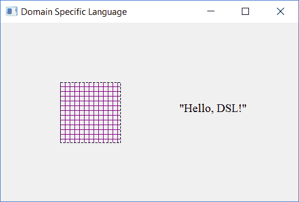

# 第九章：领域特定语言

在前面的章节中，我们使用 Qt 库开发了 Othello 和井字棋游戏。在本章中，我们将开始开发一个**领域特定语言（DSL**），这是一种针对特定领域的语言。更具体地说，我们将开发一种用于在 Qt 小部件中编写图形对象的语言。该语言允许我们绘制线条、矩形、椭圆，并写入文本。此外，它还允许我们为图形对象选择颜色以及笔和画笔样式。它还允许我们为文本选择字体和对齐方式。

本章我们将涵盖的主题包括：

+   首先，我们将通过查看一个示例来非正式地研究我们的领域特定语言（DSL）的源代码。我们将绘制图形对象并设置它们的颜色、样式和字体。

+   我们将使用语法正式定义我们的语言。

+   当我们定义了语法后，我们编写扫描器。扫描器读取源代码并识别有意义的字符序列，称为**标记**。

+   当我们编写了扫描器后，我们编写解析器。解析器可以被认为是我们的领域特定语言（DSL）的核心。当需要时，它会从扫描器请求新的标记。它检查源代码是否符合语法，并生成一系列动作。每个动作都包含一个指令，例如设置颜色或绘制线条。

+   最后，我们编写一个查看器，该查看器读取解析器生成的动作序列，并在 Qt 小部件中显示图形对象。

# 介绍源语言——一个简单的例子

我们的领域特定语言（DSL）的源语言由一系列指令组成。有用于绘制图形对象的指令，如线条、矩形、椭圆和文本。我们还有设置对象颜色和样式以及文本字体和对齐方式的指令。最后，还有为名称分配值的指令。

让我们来看一个例子。以下代码绘制了一个矩形并写入了文本。请注意，该语言不区分大小写，也就是说，我们代码中使用小写或大写字母无关紧要。我们首先定义矩形的左上角：

```cpp
  topLeft = point(100, 100); 
```

我们使用坐标运算符来提取左上点的*x*和*y*坐标，并定义右下角：

```cpp
  left = xCoordinate(topleft); 
  top = yCoordinate(topLeft); 
  bottomRight = point(left + 100, top + 100); 
```

我们使用预定义的值`DashLine`和`CrossPatterns`来设置笔和画笔的样式：

```cpp
  SetPenStyle(DashLine); 
  SetBrushStyle(CrossPattern); 
```

我们使用预定义的颜色`Black`作为笔的颜色，并为画笔创建自己的颜色`Purple`。我们可以使用三个值来创建一个新颜色，这三个值分别对应它们的红色、绿色和蓝色分量。每个分量可以持有介于 0 到 255 之间的值，包括：

```cpp
  SetPenColor(Black); 
  PurpleColor = color(128, 0, 128); 
  SetBrushColor(PurpleColor); 
  DrawRectangle(topLeft, bottomRight); 
```

我们继续添加文本，包括字体和对齐方式。我们选择`12`点的`Times New Roman`字体，左对齐水平方向和顶对齐垂直方向：

```cpp
  SetFont(font("Times New Roman", 12)); 
  SetHorizontalAlignment(AlignLeft); 
  SetVerticalAlignment(AlignTop); 
  DrawText(point(300, 150), "Hello, DSL!");
```

此示例中的指令将由扫描器分成有意义的部分；解析器将检查指令是否符合语法，并生成一系列由观众读取的动作，并显示以下 Qt 小部件：



# 源语言的语法

我们需要精确地定义我们的领域特定语言（DSL）的源语言。我们通过定义语言的语法来实现这一点。语法由规则（以 *斜体* 风格呈现）、关键字（以 **粗体* 风格呈现）、分隔符和标点符号组成。

`program` 规则是起始规则。箭头 (`->`) 表示程序由指令列表组成。箭头可以读作：

```cpp
program -> instructionList 
```

在语法中，星号 (`*`) 表示 **零个或多个**。因此，指令列表由零个或多个指令组成：

```cpp
instructionList -> instruction* 
```

赋值指令包含一个名称后跟赋值运算符 (`=`)，一个表达式和一个分号。设置笔和画笔颜色和样式的指令以及字体和对齐的设置都只需要一个表达式。绘制线条、矩形和文本的指令需要两个表达式。请注意，每个指令都以分号 (`;`) 结尾。

竖线 (`|`) 可以读作 **或**。指令是一个赋值或设置笔色、设置画笔色等：

```cpp
instruction -> name = expression; 
             | SetPenColor(expression); 
             | SetPenStyle(expression); 
             | SetBrushColor(expression); 
             | SetBrushStyle(expression); 
             | SetFont(expression); 
             | SetHorizontalAlignment(expression); 
             | SetVerticalAlignment(expression); 
             | DrawLine(expression, expression); 
             | DrawRectangle(expression, expression); 
             | DrawEllipse(expression, expression); 
             | DrawText(expression, expression); 
```

下一步要定义的是表达式。首先，我们查看表达式的运算符。我们还需要考虑运算符的优先级。例如，乘法和除法的优先级高于加法和减法。语法中的运算符具有以下优先级：

| **表达式** | **运算符** | **优先级** |
| --- | --- | --- |
| 加减 | `+ -` | 最低 |
| 乘除 | `* /` |  |
| 基本表达式 | `point` `xCoordinate` `yCoordinate` `color` `font` `(expression)` `name` `value` | 最高 |

我们为加法和减法、乘法和除法各自定义了两条规则。我们首先从优先级最低的开始，即加法和减法。在 `expression` 规则中，我们调用 `mulDivExpression` 规则来处理乘除表达式，并调用 `expressionRest` 规则来检查表达式的其余部分：

```cpp
expression -> mulDivExpression expressionRest 
```

在 `expressionRest` 规则中，我们查看下一个标记。如果它是加号或减号，我们有一个加法或减法表达式。我们调用 `mulDivExpression` 来处理优先级更高的表达式。最后，如果还有另一个加号或减号，我们再次调用 `expressionRest` 规则。然而，如果第一个标记既不是加号也不是减号，我们就不做任何事情：

```cpp
expressionRest -> + mulDivExpression expressionRest 
                | - mulDivExpression expressionRest 
                | /* empty */ 
```

`mulDivExpression` 和 `mulDivExpressionRest` 的工作方式与之前展示的 `expression` 和 `expressionRest` 相同：

```cpp
mulDivExpression -> primaryExpression mulDivExpressionRest 
mulDivExpressionRest -> * primaryExpression mulDivExpressionRest 
                      | / primaryExpression mulDivExpressionRest 
                      | /* empty */ 
```

基本表达式是一个点，一个 *x* 或 *y* 坐标，一个颜色，一个字体，一个名字或一个值。一个点由两个表达式组成，分别持有点的 *x* 和 *y* 坐标。一个坐标接受一个包含点的表达式，并给它一个 *x* 或 *y* 坐标：

```cpp
primaryExpression -> point(expression, expression) 
                   | xCoordinate(expression) 
                   | yCoordinate(expression) 
```

颜色表达式由其红色、绿色和蓝色分量组成，而字体表达式由字体名称和大小组成：

```cpp
                   | color(expression, expression, expression) 
                   | font(expression, expression) 
```

表达式可以用括号括起来以改变表达式的优先级。例如，在表达式 2 + 3 x 4 中，乘法比加法有更高的优先级，但在表达式 (2 + 3) x 4 中，加法比乘法有更高的优先级：

```cpp
                   | (expression) 
```

最后，一个表达式可以是一个之前与值关联的名字，或者简单地是一个值：

```cpp
                   | name 
                   | value
```

# 目标语言

目标语言由一系列动作定义。非正式地说，动作对应于语法的指令。我们有设置画笔或刷子的颜色或样式的动作，以及设置文本的水平或垂直对齐，以及实际绘制线条、矩形、椭圆和绘图文本的动作。在本章的后面，我们将编写一个生成一系列动作的解析器，以及一个读取动作并在 Qt 小部件中显示图形对象的查看器。

一个 `Action` 对象持有动作的标识符（由 `Token` 类中的 `TokenId` 枚举定义，如下所示）以及最多两个值。

**Action.h:** 

```cpp
#ifndef ACTION_H 
#define ACTION_H 

#include "Token.h" 
#include "Value.h" 

class Action { 
  public: 
    Action(TokenId actionId, const Value& value1 = Value(), 
           const Value& value2 = Value()); 

    Action(const Action& action); 
    Action operator=(const Action& action); 

    TokenId id() const {return m_actionId;} 
    const Value& value1() const {return m_value1;} 
    const Value& value2() const {return m_value2;} 

  private: 
    TokenId m_actionId; 
    Value m_value1, m_value2; 
}; 

#endif // ACTION_H 
```

`Action.cpp` 文件包含了 `Action` 类的方法定义。

**Action.cpp:** 

```cpp
#include "Action.h"
```

构造函数接受动作标识符和最多两个值：

```cpp
Action::Action(TokenId actionId, 
               const Value& value1 /*= Value()*/, 
               const Value& value2 /*= Value()*/ ) 
  :m_actionId(actionId), 
   m_value1(value1), 
   m_value2(value2) { 
  // Empty. 
}  
```

# 颜色

当设置画笔或刷子的颜色时，我们需要提交带有指令的颜色。我们可以使用前面语法中的颜色规则来创建自己的颜色。然而，Qt 类 `QColor` 有一个预定义的颜色集。以下扫描器定义了一个预定义的 `QColor` 对象集（`Aqua`、`Black`、...）并将它们映射到它们的名称。例如，用户可以在源代码中编写以下指令：

```cpp
SetPenColor(Aqua); 
```

在那种情况下，由于名字 `Aqua` 与 `QColor` 对象 `Aqua` 相关联，画笔颜色被设置为 `Aqua`。

**Colors.h:** 

```cpp
#ifndef COLOR_H 
#define COLOR_H 

#include <QWidget> 

extern QColor 
  Aqua, Black, Blue, Brown, Cyan, Gray, Green, Lime, Magenta, 
  Navyblue, Orange, Orchid, Pink, Purple, Red, Silver, Snow, 
  SteelBlue, SystemColor, Turquoise, Violet, White, Yellow; 

#endif // COLOR_H 
```

`Colors.cpp` 文件包含了 `Colors.h` 文件中颜色的定义。

**Colors.cpp:** 

```cpp
#include "Colors.h"
```

每个颜色由其红色、绿色和蓝色分量定义。每个分量持有从 0 到 255 的值，包括 255。例如，`Blue` 颜色持有蓝色分量的最大值和其它分量的零值，而 `Yellow` 是红色和绿色的混合：

```cpp
QColor 
  Aqua(0, 255, 255), Black(0, 0, 0), Blue(0, 0, 255), 
  Brown(165, 42, 42), Cyan(0, 255, 255), Gray(127, 127, 127), 
  Green(0, 128, 0), Lime(0, 255, 0), Magenta(255, 0, 255), 
  Navyblue(159, 175, 223), Orange(255, 165, 0), 
  Orchid(218, 112, 214), Pink(255, 192, 203), 
  Purple(128, 0, 128), Red(255, 0, 0), Silver(192, 192, 192), 
  Snow(255, 250, 250),  SteelBlue(70, 130, 180), 
  SystemColor(0, 0, 0), Turquoise(64, 224, 208), 
  Violet(238, 130, 238), White(255, 255, 255), 
  Yellow(255, 255, 0); 
```

# 错误处理

存在一些用于错误处理的函数：`check` 检查一个条件是否为真，如果不为真则报告错误。`syntaxError` 和 `semanticError` 函数报告语法和语义错误，而 `error` 抛出一个异常，该异常被 `main` 函数捕获并报告。

**Error.h:** 

```cpp
#ifndef ERROR_H 
#define ERROR_H 

#include <QString> 

void error(const QString& message); 
void syntaxError(); 
void syntaxError(const QString& message); 
void semanticError(const QString& message); 
void check(bool condition, const QString& message); 

#endif // ERROR_H 
```

`Error.cpp` 文件包含了 `Error.h` 文件的定义。

**Error.cpp:** 

```cpp
#include <SStream> 
#include <Exception> 
using namespace std; 

#include "Error.h" 

extern int g_lineNo = 1; 

void error(const QString& message) { 
  throw exception(message.toStdString().c_str()); 
} 
```

我们使用 C++的`stringstream`标准类来组合错误信息：

```cpp
void syntaxError() { 
  stringstream stringStream; 
  stringStream << "Syntax error at line " << g_lineNo << "."; 
```

`str`方法返回 C++ `string`标准类的一个对象，而`c_str`返回一个字符指针，在`error`调用中转换为`QString`对象：

```cpp
  error(stringStream.str().c_str()); 
} 
```

当扫描器发现不构成标记的字符序列，或者当解析器检测到标记序列不符合语法时，会发生语法错误。我们将在不久的将来介绍这个主题；现在，只需记住扫描器也可以报告错误：

```cpp
void syntaxError(const QString& message) { 
  stringstream stringStream; 
  stringStream << "Syntax error at line " << g_lineNo 
               << ": " << message.toStdString() << "."; 
  error(stringStream.str().c_str()); 
} 
```

当发现未知名称，或者当表达式的类型不匹配时，会发生语义错误：

```cpp
void semanticError(const QString& message) { 
  stringstream stringStream; 
  stringStream << "Sematic error: " 
               << message.toStdString() << "."; 
  error(stringStream.str().c_str()); 
}
```

`check`方法与`assert`宏有类似的效果。它检查条件是否为真。如果不为真，则调用`semanticError`，最终抛出错误异常：

```cpp
void check(bool condition, const QString& message) { 
  if (!condition) { 
    semanticError(message); 
  } 
} 
```

# 值

语言中有几种类型的值，用于设置画笔或画刷的颜色或样式，或设置线的端点，或设置字体名称，或文本的对齐方式：数值（`double`）、字符串（`QString`）、颜色（`QColor`）、字体（`QFont`）、点（`QPoint`）、画笔样式（`Qt::PenStyle`）、画刷样式（`Qt`::`BrushStyle`）以及水平或垂直对齐（`Qt`::`AlignmentFlag`）。

**Value.h**：

```cpp
#ifndef VALUE_H 
#define VALUE_H 

#include <IOStream> 
using namespace std; 

#include <QtWidgets> 

enum TypeId {NumericalTypeId, StringTypeId, ColorTypeId, 
             PenStyleTypeId, BrushStyleId, AlignmentTypeId, 
             FontTypeId, PointTypeId}; 

class Value { 
  public: 
    Value(); 
    Value(double numericalValue); 
    Value(const QString& stringValue); 
    Value(const QPoint& pointValue); 
    Value(const QColor& colorValue); 
    Value(const QFont& fontValue); 
    Value(const Qt::PenStyle& penStyleValue); 
    Value(const Qt::BrushStyle& brushStyleValue); 
    Value(const Qt::AlignmentFlag& alignment); 

    Value(const Value& value); 
    Value& operator=(const Value& value); 

    bool isNumerical() const {return (m_typeId==NumericalTypeId);} 
    bool isString() const { return (m_typeId == StringTypeId); } 
    bool isColor() const { return (m_typeId == ColorTypeId); } 
    bool isFont() const { return (m_typeId == FontTypeId); } 
    bool isPoint() const { return (m_typeId == PointTypeId); } 
    bool isPenStyle() const {return (m_typeId == PenStyleTypeId);} 
    bool isBrushStyle() const {return (m_typeId == BrushStyleId);} 
    bool isAlignment() const {return (m_typeId==AlignmentTypeId);} 

    double numericalValue() const { return m_numericalValue; } 
    const QString& stringValue() const { return m_stringValue; } 
    const QColor& colorValue() const { return m_colorValue; } 
    const QFont& fontValue() const { return m_fontValue; } 
    const QPoint& pointValue() const { return m_pointValue; } 
    const Qt::PenStyle& penStyleValue() const 
                        { return m_penStyleValue; } 
    const Qt::BrushStyle& brushStyleValue() const 
                          { return m_brushStyleValue; } 
    const Qt::AlignmentFlag& alignmentValue() const 
                             { return m_alignmentValue; } 

  private: 
    TypeId m_typeId; 
    double m_numericalValue; 
    QString m_stringValue; 
    QPoint m_pointValue; 
    QColor m_colorValue; 
    QFont m_fontValue; 
    Qt::PenStyle m_penStyleValue; 
    Qt::BrushStyle m_brushStyleValue; 
    Qt::AlignmentFlag m_alignmentValue; 
}; 

#endif // VALUE_H 
```

`Value.cpp`文件包含了`Value`类的定义方法。

**Value.cpp**：

```cpp
#include <CAssert> 
using namespace std; 

#include "Value.h" 

Value::Value() { 
  // Empty. 
} 
```

非默认构造函数使用适当的值初始化`Value`对象：

```cpp
Value::Value(double numericalValue) 
 :m_typeId(NumericalTypeId), 
  m_numericalValue(numericalValue) { 
  // Empty. 
} 

Value::Value(const QPoint& pointValue) 
 :m_typeId(PointTypeId), 
  m_pointValue(pointValue) { 
  // Empty. 
} 
```

# 扫描器

**扫描器**是应用程序的一部分，它接受源代码并生成一系列标记。**标记**是源代码中最小的有意义的部分。例如，字符**f**、**o**、**n**和**t**组成了关键字**font**，而字符**1**、**2**和**3**构成了数值**123**。

然而，首先我们需要`Token`类来跟踪标记。`m_tokenId`字段被设置为枚举`TokenId`的值。在名称的情况下，`m_name`字段包含名称，而在值的情况下，`m_value`字段包含值。

**Token.h**：

```cpp
#ifndef TOKEN_H 
#define TOKEN_H 

#include <QWidget> 
#include "Value.h" 
```

`TokenId`枚举包含了扫描器的所有标记。它们被分为关键字、运算符、标点符号和分隔符，以及名称和值。为了避免在不同枚举之间进行转换，扫描器、解析器和查看器都使用`TokenId`枚举。`TokenId`枚举由扫描器在类型检查和评估表达式时区分不同的标记，由`Action`类区分不同的操作。

第一部分（从`ColorId`到`YCoordinateId`）是语言的关键字：

```cpp
enum TokenId {ColorId, DrawEllipseId, DrawLineId, 
              DrawRectangleId, DrawTextId, FontId,  
              PointId, SetBrushColorId, SetBrushStyleId, 
              SetFontId, SetHorizontalAlignmentId, 
              SetPenColorId, SetPenStyleId, 
              SetVerticalAlignmentId, 
              XCoordinateId, YCoordinateId, 
```

第二部分（从`AddId`到`DivideId`）是运算符：

```cpp
              AddId, SubtractId, MultiplyId, DivideId, 
```

下一个部分是括号、赋值（`=`）、逗号和分号：

```cpp
              LeftParenthesisId, RightParenthesisId, 
              AssignId, CommaId, SemicolonId, 
```

最后，最后一部分是名称、值和文件结束标记：

```cpp
              NameId, ValueId, EndOfFileId}; 

class Token{ 
  public: 
    Token(); 
    Token(TokenId tokenId); 
    Token(TokenId tokenId, const QString& name); 
    Token(TokenId tokenId, const Value& value); 
```

每个标记都可以用名称或值进行标注：

```cpp
    TokenId id() const {return m_tokenId;} 
    const QString& name() const { return m_name; } 
    const Value& value() const { return m_value; } 

  private: 
    TokenId m_tokenId; 
    QString m_name; 
    Value m_value; 
}; 

#endif // TOKEN_H
```

`Token.cpp` 文件包含 `Token` 类的方法定义。

**Token.cpp:**

```cpp
#include "Token.h" 
```

默认标记使用文件结束标记初始化：

```cpp
Token::Token() 
 :m_tokenId(EndOfFileId) { 
  // Empty. 
} 
```

大多数标记只包含 `TokenId` 枚举的值：

```cpp
Token::Token(TokenId tokenId) 
 :m_tokenId(tokenId) { 
  // Empty. 
} 
```

标记也可以包含名称或值：

```cpp
Token::Token(TokenId tokenId, const QString& name) 
 :m_tokenId(tokenId), 
  m_name(name) { 
  // Empty. 
} 

Token::Token(TokenId tokenId, const Value& value) 
 :m_tokenId(tokenId), 
  m_value(value) { 
  // Empty. 
} 
```

`Scanner` 类接收源代码并将其划分为标记。标记也可以通过名称或值关联。

**Scanner.h:**

```cpp
#ifndef SCANNER_H 
#define SCANNER_H 

#include "Token.h" 
#include "Colors.h"
```

`init` 方法初始化关键字和操作符的名称：

```cpp
class Scanner { 
  public: 
    static void init(); 
    Scanner(QString& buffer); 
```

`nextToken` 方法扫描缓冲区并返回下一个标记。如果没有可识别的标记，则会抛出一个错误异常，该异常随后被 `main` 函数捕获：

```cpp
  public: 
    Token nextToken(); 
```

`m_buffer` 字段包含源代码；`m_bufferIndex` 包含要检查的缓冲区中下一个字符的索引（索引初始化为零）；`m_keywordMap` 包含关键字的名称；`m_valueMap` 包含颜色、对齐、笔和画笔样式值的映射，`m_operatorList` 包含操作符列表：

```cpp
  private: 
    QString m_buffer; 
    int m_bufferIndex = 0; 
```

在前面的章节中，我们使用了 C++ 标准类 `map`、`set`、`list`、`vector` 和 `stack`。在本章中，我们将使用 Qt 类 `QMap`、`QSet`、`QList`、`QVector` 和 `QStack` 代替。它们的工作方式大致相同：

```cpp
    static QMap<QString,TokenId> m_keywordMap; 
    static QMap<QString,Value> m_valueMap; 
    static QList<pair<QString,TokenId>> m_operatorList; 
}; 

#endif // SCANNER_H 
```

`Scanner.cpp` 文件包含 `Scanner` 类的方法定义。

**Scanner.cpp:**

```cpp
#include <SStream> 
#include <IOStream> 
#include <Exception> 
using namespace std; 

#include "Error.h" 
#include "Scanner.h" 

QMap<QString,Value> Scanner::m_valueMap; 
QMap<QString,TokenId> Scanner::m_keywordMap; 
QList<pair<QString, TokenId>> Scanner::m_operatorList; 
```

`g_lineNo` 全局字段跟踪源代码中的当前行，以便错误消息可以显示行号：

```cpp
extern int g_lineNo; 
```

`ADD_TO_OPERATOR_LIST` 宏将标记添加到操作符列表中。例如，`ADD_TO_OPERATOR_LIST("+", AddId)` 将 `"+"` 和 `AddId` 对添加到列表中：

```cpp
#define ADD_TO_OPERATOR_LIST(text, token)                      
  m_operatorList.push_back(pair<QString,TokenId>(text, token)); 

void Scanner::init() { 
  ADD_TO_OPERATOR_LIST("+", AddId) 
  ADD_TO_OPERATOR_LIST("-", SubtractId) 
  ADD_TO_OPERATOR_LIST("*", MultiplyId) 
  ADD_TO_OPERATOR_LIST("/", DivideId) 
  ADD_TO_OPERATOR_LIST("(", LeftParenthesisId) 
  ADD_TO_OPERATOR_LIST(")", RightParenthesisId) 
  ADD_TO_OPERATOR_LIST("=", AssignId) 
  ADD_TO_OPERATOR_LIST(",", CommaId) 
  ADD_TO_OPERATOR_LIST(";", SemicolonId) 
```

`ADD_TO_KEYWORD_MAP` 宏将关键字添加到关键字映射中。例如，`ADD_TO_KEYWORD_MAP(ColorId)` 将 `Color` 和 `ColorId` 对添加到映射中。请注意，关键字的部分（最后两个字符）的文本被移除：

```cpp
#define ADD_TO_KEYWORD_MAP(x) {                        
  QString s(#x);                                       
  m_keywordMap[s.toLower().left(s.length() - 2)] = x; } 

  ADD_TO_KEYWORD_MAP(ColorId) 
  ADD_TO_KEYWORD_MAP(DrawEllipseId) 
  ADD_TO_KEYWORD_MAP(DrawLineId) 
  ADD_TO_KEYWORD_MAP(DrawRectangleId) 
  ADD_TO_KEYWORD_MAP(DrawTextId) 
  ADD_TO_KEYWORD_MAP(FontId) 
  ADD_TO_KEYWORD_MAP(PointId) 
  ADD_TO_KEYWORD_MAP(SetBrushColorId) 
  ADD_TO_KEYWORD_MAP(SetBrushStyleId) 
  ADD_TO_KEYWORD_MAP(SetFontId) 
  ADD_TO_KEYWORD_MAP(SetHorizontalAlignmentId) 
  ADD_TO_KEYWORD_MAP(SetPenColorId) 
  ADD_TO_KEYWORD_MAP(SetPenStyleId) 
  ADD_TO_KEYWORD_MAP(SetVerticalAlignmentId) 
  ADD_TO_KEYWORD_MAP(XCoordinateId) 
  ADD_TO_KEYWORD_MAP(YCoordinateId) 
```

`ADD_TO_VALUE_MAP` 宏将值添加到值映射中。例如，`ADD_TO_VALUE_MAP(Aqua)` 将 aqua 和 `QColor` 对象 Aqua 对添加到映射中。请注意，文本被转换为小写。另外请注意，只包括最后一个可能的对冒号 (`::`) 的最后一个部分：

```cpp
#define ADD_TO_VALUE_MAP(x) {                           
  QString s(#x);                                        
  QString t = s.toLower();                              
  int i = t.lastIndexOf("::");                          
  m_valueMap[(i == -1) ? t : t.mid(i + 2)] = Value(x); } 
```

`ADD_TO_VALUE_MAP(Qt::AlignLeft)` 将对齐左和 `Qt::PenStyle` 值对添加到映射中。再次注意，只有值名称的最后一个部分被存储为文本：

```cpp
  ADD_TO_VALUE_MAP(Qt::AlignLeft) 
  ADD_TO_VALUE_MAP(Qt::AlignTop) 

  ADD_TO_VALUE_MAP(Qt::PenStyle::NoPen) 
  ADD_TO_VALUE_MAP(Qt::PenStyle::SolidLine) 

  ADD_TO_VALUE_MAP(Qt::BrushStyle::NoBrush) 
  ADD_TO_VALUE_MAP(Qt::BrushStyle::SolidPattern) 

  ADD_TO_VALUE_MAP(Aqua) 
  ADD_TO_VALUE_MAP(Black) 
} 
```

在构造函数中，我们将缓冲区加载到 `m_buffer` 字段中。我们还添加了空字符 (`''`)，以便更容易地找到缓冲区的末尾：

```cpp
Scanner::Scanner(QString& buffer) 
 :m_buffer(buffer) { 
  m_buffer.append(''); 
} 
```

`nextToken` 方法扫描缓冲区并返回找到的标记。首先，我们迭代，直到找到新行、空白或行注释。如果遇到新行，则增加行数：

```cpp
Token Scanner::nextToken() { 
  while (true) { 
    if (m_buffer[m_bufferIndex] == 'n') { 
      ++g_lineNo; 
      ++m_bufferIndex; 
    } 
```

空白是常规空格、水平或垂直制表符、回车符或新行。我们使用 `isSpace` 方法检查字符是否为空白：

```cpp
    else if (m_buffer[m_bufferIndex].isSpace()) { 
      ++m_bufferIndex; 
    } 
```

如果我们遇到行注释的开始（`//`），我们继续直到找到行尾（`'n'`）或缓冲区结束（`''`）：

```cpp
    else if (m_buffer.indexOf("//", m_bufferIndex) == 
             m_bufferIndex) { 
      while ((m_buffer[m_bufferIndex] != QChar('n')) && 
             (m_buffer[m_bufferIndex] != QChar(''))) { 
        ++m_bufferIndex; 
      } 
    } 
```

如果我们没有找到新行、空白或行注释，我们中断迭代并继续寻找下一个标记：

```cpp
    else { 
      break; 
    } 
  } 
```

当我们扫描过潜在的空白和注释后，我们开始寻找真正的标记。我们首先检查缓冲区中的下一个字符是否是空字符（`''`）。如果是空字符，我们就找到了源代码的结尾并返回文件结束。记住，我们在构造函数中添加了一个空字符到缓冲区末尾，只是为了能够识别文件结束：

```cpp
  if (m_buffer[m_bufferIndex] == QChar('')) { 
    return Token(EndOfFileId); 
  } 
```

如果下一个标记不是文件结束，我们检查它是否是一个运算符。我们遍历运算符列表，并检查缓冲区是否以任何运算符的文本开头。例如，加法运算符包含文本 `+`：

```cpp
  for (const pair<QString,TokenId>& pair : m_operatorList) { 
    const QString& operatorText = pair.first; 
    TokenId tokenId = pair.second;
```

当我们找到运算符时，我们增加缓冲区索引，并返回标记：

```cpp
    if (m_buffer.indexOf(operatorText, m_bufferIndex) == 
        m_bufferIndex) { 
      m_bufferIndex += operatorText.length(); 
      return Token(tokenId); 
    } 
  } 
```

如果缓冲区不以运算符开头，我们寻找代表关键字、值或简单名称的名称。我们首先检查缓冲区是否以字母或下划线字符（`'_'`）开头，因为名称可以以字母或下划线开头。然而，除了字母和下划线之外，剩余的字符可以是数字：

```cpp
  if (m_buffer[m_bufferIndex].isLetter() || 
      (m_buffer[m_bufferIndex] == '_')) { 
    int index = m_bufferIndex; 
```

我们遍历直到找到一个不是字母、数字或下划线的字符：

```cpp
    while (m_buffer[index].isLetterOrNumber() || 
           (m_buffer[index] == '_')) { 
      ++index; 
    } 
```

我们提取文本并增加缓冲区索引：

```cpp
    int size = index - m_bufferIndex; 
    QString text = m_buffer.mid(m_bufferIndex, size).toLower(); 
    m_bufferIndex += size; 
```

文本可以包含一个关键字、一个值或一个名称。首先，我们检查文本是否存在于关键字映射中。如果存在，我们只需返回与关键字文本关联的标记：

```cpp
    if (m_keywordMap.contains(text)) { 
      return Token(m_keywordMap[text]); 
    } 
```

然后我们检查文本是否存在于值映射中。如果存在，我们返回一个带有值注释的值标记。值可以在稍后由解析器获取：

```cpp
    else if (m_valueMap.contains(text)) { 
      return Token(ValueId, m_valueMap[text]); 
    }
```

如果文本既不是关键字也不是值，我们假设它是一个名称，并返回一个带有名称注释的名称标记。名称可以在稍后由解析器获取：

```cpp
    else { 
      return Token(NameId, text); 
    } 
  } 
```

当我们没有找到名称时，我们开始寻找字符串。字符串是由双引号（`'"'`）包围的文本。如果缓冲区中的下一个字符是双引号，那么它是文本的开始。我们从缓冲区中移除双引号，并遍历直到找到文本的结束引号：

```cpp
  if (m_buffer[m_bufferIndex] == '"') { 
    int index = m_bufferIndex + 1; 

    while (m_buffer[index] != '"') { 
```

如果我们在文本结束之前找到空字符，由于我们在文本中找到了文件结束，所以报告语法错误：

```cpp
      if (m_buffer[index] == QChar('')) { 
        syntaxError("unfinished string"); 
      } 

      ++index; 
    } 
```

当我们找到结束引号时，我们增加缓冲区索引，并返回一个带有文本作为其注释值的值标记。文本可以在稍后由解析器获取：

```cpp
    int size = index - m_bufferIndex + 1; 
    QString text = m_buffer.mid(m_bufferIndex, size); 
    m_bufferIndex += size; 
    return Token(ValueId, Value(text)); 
  } 
```

如果缓冲区中的下一个字符是数字，我们就找到了一个数值，可能带有小数点。首先，我们遍历缓冲区，直到找到数字：

```cpp
  if (m_buffer[m_bufferIndex].isDigit()) { 
    int index = m_bufferIndex; 

    while (m_buffer[index].isDigit()) { 
      ++index; 
    }
```

当我们不再找到任何数字时，我们检查缓冲区中的下一个字符是否是点（`'.'`）。如果是点，只要我们找到数字，我们就继续迭代：

```cpp
    if (m_buffer[index] == '.') { 
      ++index; 

      while (m_buffer[index].isDigit()) { 
        ++index; 
      } 
    } 
```

当我们不再找到任何数字时，我们增加缓冲区索引，并返回一个带有注释值的值标记。该值可以稍后被解析器获取：

```cpp
    int size = index - m_bufferIndex; 
    QString text = m_buffer.mid(m_bufferIndex, size); 
    m_bufferIndex += size; 
    return Token(ValueId, Value(text.toDouble())); 
  } 
```

最后，如果前面的任何情况都不适用，源代码在语法上是错误的，我们报告一个语法错误：

```cpp
  syntaxError(); 
```

我们返回一个文件结束标记，仅仅是因为我们必须返回一个值。然而，我们永远不会到达代码的这个点，因为`syntaxError`调用抛出了一个异常：

```cpp
  return Token(EndOfFileId); 
} 
```

现在我们已经了解了扫描器，我们将在下一节继续了解解析器。

# 构建解析器

现在我们已经了解了扫描器，是时候转向解析器了。解析器检查源代码是否符合语法。它还执行类型检查并生成动作列表，该列表稍后由查看器显示，如下所示。`Parser` 类以这种方式反映了语法，即它为每个语法规则持有一个方法。

**Parser.h:** 

```cpp
#ifndef PARSER_H 
#define PARSER_H 

#include "Action.h" 
#include "Scanner.h" 
```

构造函数接受一个语法对象和动作列表，动作列表最初为空。解析器每次需要新标记时都会调用扫描器：

```cpp
class Parser { 
  public: 
    Parser(Scanner& m_scanner, QList<Action>& actionList); 
```

`match` 方法检查给定的标记是否等于扫描器获取的下一个标记。如果不相等，则报告语法错误：

```cpp
  private: 
    void match(TokenId tokenId); 
```

`Parser`类的其余方法分为语法中的指令和表达式的方法，以及类型检查和表达式评估的方法：

```cpp
    void instructionList(); 
    void instruction(); 
```

我们还为语法中的每个表达式规则添加了一个解析器方法：

```cpp
    Value expression(); 
    Value expressionRest(Value leftValue); 
    Value mulDivExpression(); 
    Value mulDivExpressionRest(Value leftValue); 
    Value primaryExpression(); 
    Value primaryExpression(); 
```

在评估表达式的值时，我们需要检查值的类型。例如，当添加两个值时，两个操作数都应该是数值：

```cpp
    void checkType(TokenId operatorId, const Value& value); 
    void checkType(TokenId operatorId, const Value& leftValue, 
                   const Value& rightValue); 
    Value evaluate(TokenId operatorId, const Value& value); 
    Value evaluate(TokenId operatorId, const Value& leftValue, 
                   const Value& rightValue);
```

`m_lookAhead`字段持有扫描器获取的下一个标记，`m_scanner`持有扫描器本身。`m_actionList`字段持有构造函数中给出的动作列表的引用。最后，`m_assignMap`持有由赋值规则分配给值的映射：

```cpp
  private: 
    Token m_lookAHead; 
    Scanner& m_scanner; 
    QList<Action>& m_actionList; 
    QMap<QString,Value> m_assignMap;                                                                                                                                                                                                            }; 

#endif // PARSER_H 
```

`Parser.cpp`文件包含`Parser`类的定义方法。

**Parser.cpp:** 

```cpp
#include <CAssert> 
using namespace std; 

#include "Value.h" 
#include "Token.h" 
#include "Scanner.h" 
#include "Parser.h" 
#include "Error.h" 
```

构造函数初始化对扫描器和动作列表的引用，并将`m_lookAHead`字段设置为扫描器获取的第一个标记。然后通过调用`instructionList`开始解析过程。当指令列表被解析后，唯一剩下的标记应该是文件结束标记：

```cpp
Parser::Parser(Scanner& m_scanner, QList<Action>& actionList) 
 :m_scanner(m_scanner), 
  m_actionList(actionList) { 
  m_lookAHead = m_scanner.nextToken(); 
  instructionList(); 
  match(EndOfFileId); 
} 
```

`g_lineNo`字段跟踪源代码的当前行，以便可以报告带有正确行号的语法错误：

```cpp
extern int g_lineNo;
```

`instructionList`方法会一直迭代，直到遇到文件结束标记：

```cpp
void Parser::instructionList() { 
  while (m_lookAHead.id() != EndOfFileId) { 
    instruction(); 
  } 
} 
```

`match`方法比较扫描器获取的下一个标记与给定的标记。如果不一致，则报告语法错误。如果一致，则通过扫描器获取下一个标记：

```cpp
void Parser::match(TokenId tokenId) { 
  if (m_lookAHead.id() != tokenId) { 
    syntaxError(); 
  } 

  m_lookAHead = m_scanner.nextToken(); 
} 
```

# 解析语言的指令

`instruction` 方法包含一系列的 switch 案例序列，每个案例对应于指令的一个类别。我们将查看扫描器获得的下一个标记：

```cpp
void Parser::instruction() { 
  TokenId tokenId = m_lookAHead.id(); 
```

在名称的情况下，我们解析名称、赋值运算符（`=`）、后面的表达式和分号：

```cpp
  switch (tokenId) { 
    case NameId: { 
        QString assignName = m_lookAHead.name(); 
        match(NameId); 
        match(AssignId); 
        Value assignValue = expression(); 
        match(SemicolonId); 
```

如果名称已经与一个值相关联，则会报告语义错误：

```cpp
        check(!m_assignMap.contains(assignName), 
              "the name "" + assignName + "" defined twiced"); 
        m_assignMap[assignName] = assignValue; 
      } 
      break;
```

笔和刷的颜色和样式设置，以及字体和对齐方式，稍微复杂一些。我们调用 `expression` 来解析和评估表达式的值。检查表达式的类型，并将 `Action` 对象添加到动作列表中：

```cpp
    case SetPenColorId: 
    case SetPenStyleId: 
    case SetBrushColorId: 
    case SetBrushStyleId: 
    case SetFontId: 
    case SetHorizontalAlignmentId: 
    case SetVerticalAlignmentId: { 
        match(tokenId); 
        match(LeftParenthesisId); 
        Value value = expression(); 
        match(RightParenthesisId); 
        match(SemicolonId); 
        checkType(tokenId, value); 
        m_actionList.push_back(Action(tokenId, value)); 
      } 
      break; 
```

绘制线条、矩形、椭圆和文本需要两种表达式，其值将被评估和类型检查：

```cpp
    case DrawLineId: 
    case DrawRectangleId: 
    case DrawEllipseId: 
    case DrawTextId: { 
        match(tokenId); 
        match(LeftParenthesisId); 
        Value firstValue = expression(); 
        match(CommaId); 
        Value secondValue = expression(); 
        match(RightParenthesisId); 
        match(SemicolonId); 
        checkType(tokenId, firstValue, secondValue); 
        m_actionList.push_back(Action(tokenId, firstValue, 
                                      secondValue)); 
      } 
      break; 
```

如果前面的任何标记都不适用，则报告语法错误：

```cpp
    default: 
      syntaxError(); 
  } 
} 
```

# 解析语言的表达式

在最低优先级上，一个表达式由两个乘法或除法表达式组成。首先，我们调用 `mulDivExpression`，这是按优先级顺序的下一个表达式，以获得可能的加法或减法表达式的左值，然后调用 `expressionRest`，以检查实际上是否存在这样的表达式：

```cpp
Value Parser::expression() { 
  Value leftValue = mulDivExpression (); 
  return expressionRest(leftValue); 
} 
```

`expressionRest` 方法检查下一个标记是否为加号或减号。在这种情况下，我们有一个加法或减法表达式，匹配标记，检查左右值的类型，然后评估并返回结果表达式：

```cpp
Value Parser::expressionRest(Value leftValue) { 
  TokenId tokenId = m_lookAHead.id(); 

  switch (tokenId) { 
    case AddId: 
    case SubtractId: { 
        match(tokenId); 
        Value rightValue = mulDivExpression(); 
        check(leftValue.isNumerical() && rightValue.isNumerical(), 
              "non-numerical values in arithmetic expression"); 
        Value resultValue = 
          evaluate(tokenId, leftValue, rightValue); 
        return expressionRest(resultValue); 
      } 

    default: 
      return leftValue; 
  } 
}
```

`mulDivExpression` 方法的工作方式与之前展示的 `expression` 类似。它调用 `primaryExpression` 和 `mulDivExpressionRest`，寻找乘法和除法。乘法和除法的优先级高于加法和减法。正如之前在 *源语言语法* 部分所述，我们需要在语法中添加一对新规则，在解析器中有两对方法用于加法/减法和乘法/除法表达式：

```cpp
Value Parser::mulDivExpression() { 
  Value leftValue = primaryExpression(); 
  return mulDivExpressionRest(leftValue); 
} 

Value Parser::mulDivExpressionRest(Value leftValue) { 
  TokenId tokenId = m_lookAHead.id(); 

  switch (tokenId) { 
    case MultiplyId: 
    case DivideId: { 
        match(tokenId); 
        Value rightValue = primaryExpression(); 
        check(leftValue.isNumerical() && rightValue.isNumerical(), 
              "non-numerical values in arithmetic expression"); 
        Value resultValue = 
          evaluate(tokenId, leftValue, rightValue); 
        return mulDivExpressionRest (resultValue); 
      } 

    default: 
      return leftValue; 
  } 
} 
```

最后，主表达式由一个点、坐标、颜色或字体表达式组成。它也可以由括号内的表达式、一个名称（在这种情况下我们查找其值）或一个值组成：

```cpp
Value Parser::primaryExpression() { 
  TokenId tokenId = m_lookAHead.id(); 
```

坐标表达式接受一个点并返回其 x 或 y 坐标。我们匹配关键字和括号，并调用括号之间的表达式。然后我们检查表达式的值是否为点，最后调用 `evaluate` 以提取 *x* 或 *y* 坐标：

```cpp
  switch (tokenId) { 
    case XCoordinateId: 
    case YCoordinateId: { 
        match(tokenId); 
        match(LeftParenthesisId); 
        Value value = expression(); 
        match(RightParenthesisId); 
        check(value.isPoint(), 
              "not a point in coordinate expression"); 
        checkType(tokenId, value); 
        return evaluate(tokenId, value); 
      } 
      break; 
```

点表达式由关键字 `point` 和两个数值表达式组成：*x* 和 *y* 坐标：

```cpp
    case PointId: { 
        match(PointId); 
        match(LeftParenthesisId); 
        Value xValue = expression(); 
        match(CommaId); 
        Value yValue = expression(); 
        match(RightParenthesisId); 
        check(xValue.isNumerical() && yValue.isNumerical(), 
              "non-numerical values in point expression"); 
        return Value(QPoint(xValue.numericalValue(), 
                            yValue.numericalValue())); 
    } 
```

颜色表达式由关键字 `color` 和三个数值表达式组成：红色、绿色和蓝色成分：

```cpp
    case ColorId: { 
        match(ColorId); 
        match(LeftParenthesisId); 
        Value redValue = expression(); 
        match(CommaId); 
        Value greenValue = expression(); 
        match(CommaId); 
        Value blueValue = expression(); 
        match(RightParenthesisId); 
        check(redValue.isNumerical() && greenValue.isNumerical() 
              && blueValue.isNumerical(), 
              "non-numerical values in color expression"); 
        return Value(QColor(redValue.numericalValue(), 
                            greenValue.numericalValue(), 
                            blueValue.numericalValue())); 
      } 
```

字体表达式由关键字 `font` 和两个表达式组成：字体的名称（字符串）和其大小（数值）：

```cpp
    case FontId: { 
        match(FontId); 
        match(LeftParenthesisId); 
        Value nameValue = expression(); 
        match(CommaId); 
        Value sizeValue = expression(); 
        match(RightParenthesisId); 
        check(nameValue.isString() && sizeValue.isNumerical(), 
              "invalid types in font expression"); 
        return Value(QFont(nameValue.stringValue(), 
                           sizeValue.numericalValue())); 
      } 
```

表达式可以被括号包围。在这种情况下，我们匹配括号，并在其中调用 `expression` 以获得表达式的值：

```cpp
    case LeftParenthesisId: { 
        match(LeftParenthesisId); 
        Value value = expression(); 
        match(RightParenthesisId); 
        return value; 
      } 
```

在名称的情况下，我们在赋值映射中查找其值并返回该值。如果没有值，则报告语义错误：

```cpp
    case NameId: { 
        QString lookupName = m_lookAHead.name(); 
        match(NameId); 
        check(m_assignMap.contains(lookupName ), 
              "unknown name: "" + lookupName + ""."); 
        return m_assignMap[lookupName ]; 
      } 
```

在值的情况下，我们直接返回该值：

```cpp
    case ValueId: { 
        Value value = m_lookAHead.value(); 
        match(ValueId); 
        return value; 
      } 
```

在任何其他情况下，都会报告语法错误：

```cpp
    default: 
      syntaxError(); 
      return Value(); 
  } 
} 
```

# 表达式类型检查

第一个 `checkType` 方法检查具有一个值的表达式的类型。当设置笔或画刷样式时，类型必须是笔或画刷样式：

```cpp
void Parser::checkType(TokenId codeId, const Value& value) { 
  switch (codeId) { 
    case SetPenStyleId: 
      check(value.isPenStyle(), "not a pen-style value"); 
      break; 

    case SetBrushStyleId: 
      check(value.isBrushStyle(), "not a brush-style value"); 
      break; 
```

当设置颜色或字体时，值必须是颜色或字体：

```cpp
    case SetPenColorId: 
    case SetBrushColorId: 
      check(value.isColor(), "not a color value"); 
      break; 

    case SetFontId: 
      check(value.isFont(), "not a font value"); 
      break; 
```

当设置对齐方式时，值必须是对齐方式：

```cpp
    case SetHorizontalAlignmentId: 
    case SetVerticalAlignmentId: 
      check(value.isAlignment(), "not an alignment value"); 
      break; 
```

当从一个点中提取 *x* 或 *y* 坐标时，值必须是一个点：

```cpp
    case XCoordinateId: 
    case YCoordinateId: 
      check(value.isPoint(), "not a point value"); 
      break; 
  } 
} 
```

第二个 `checkType` 方法接受两个值。绘图指令必须接受两个点：

```cpp
void Parser::checkType(TokenId codeId, const Value& leftValue, 
                       const Value& rightValue) { 
  switch (codeId) { 
    case DrawLineId: 
    case DrawRectangleId: 
    case DrawEllipseId: 
      check(leftValue.isPoint() && rightValue.isPoint(), 
            "non-point values in draw expression"); 
      break; 
```

文本绘图指令必须接受一个点和字符串：

```cpp
    case DrawTextId: 
      check(leftValue.isPoint() && rightValue.isString(), 
            "invalid values in text-drawing expression"); 
      break; 
  } 
} 
```

# 评估表达式的值

第一个 `evaluate` 方法返回具有一个值的表达式的值。*x* 和 *y* 坐标运算符返回点的 *x* 或 *y* 坐标：

```cpp
Value Parser::evaluate(TokenId codeId, const Value& value) { 
  switch (codeId) { 
    case XCoordinateId: 
      return Value((double) value.pointValue().x()); 

    case YCoordinateId: 
      return Value((double) value.pointValue().y()); 
```

断言仅用于调试目的，我们返回 false 仅因为该方法必须返回一个值：

```cpp
    default: 
      assert(false); 
      return false; 
  } 
} 
```

最后，第二个 `evaluate` 方法评估具有两个值的表达式的值。首先，我们提取数值并评估算术表达式：

```cpp
Value Parser::evaluate(TokenId codeId, const Value& leftValue, 
                          const Value& rightValue) { 
  double leftNumericalValue = leftValue.numericalValue(), 
         rightNumericalValue = rightValue.numericalValue(); 

  switch (codeId) { 
    case AddId: 
      return Value(leftNumericalValue + rightNumericalValue); 

    case SubtractId: 
      return Value(leftNumericalValue - rightNumericalValue); 

    case MultiplyId: 
      return Value(leftNumericalValue * rightNumericalValue); 
```

在除以零的情况下，报告语义错误：

```cpp
    case DivideId: 
      if (rightNumericalValue == 0) { 
        semanticError("division by zero"); 
      } 

      return Value(leftNumericalValue / rightNumericalValue); 
```

最后，在点表达式中，我们返回一个包含其 *x* 和 *y* 坐标两个数值的点值：

```cpp
    case PointId: 
      return Value(QPoint(leftNumericalValue, 
                          rightNumericalValue)); 
```

如前所述的第一个评估情况，断言仅用于调试目的，我们返回 false 仅因为该方法必须返回一个值：

```cpp
    default: 
      assert(false); 
      return Value(); 
  } 
} 
```

# 查看器

最后，是时候编写查看器，我们 DSL 的最后一部分。查看器遍历动作并显示图形对象。`ViewerWidget` 类继承自 Qt 类 `QWidget`，它在屏幕上显示小部件。

**ViewerWidget.h:** 

```cpp
#ifndef MAINWIDGET_H 
#define MAINWIDGET_H 

#include <QWidget> 
#include <QtWidgets> 
#include "Value.h" 
#include "Colors.h" 
#include "Action.h" 

class ViewerWidget : public QWidget { 
  Q_OBJECT 
```

构造函数调用基类 `QWidget` 的构造函数，并存储动作列表的引用：

```cpp
  public: 
    ViewerWidget(const QList<Action>& actionList, 
                 QWidget *parentWidget = nullptr); 
```

类的主要部分是 `paintEvent` 方法。每当窗口需要重绘时，它都会被调用，并遍历动作列表：

```cpp
    void paintEvent(QPaintEvent *eventPtr); 
```

调用 `QFont` 的默认构造函数，将字体初始化为合适的系统字体。水平和垂直对齐都是居中的。最后，`m_actionList` 持有由解析器生成的动作列表的引用：

```cpp
  private: 
    Qt::Alignment m_horizontalAlignment = Qt::AlignHCenter, 
                  m_verticalAlignment = Qt::AlignVCenter; 
    const QList<Action>& m_actionList; 
}; 

#endif // MAINWIDGET_H 
```

`ViewerWidget.cpp` 文件包含 `ViewerWidget` 类的方法定义。

**ViewerWidget.cpp:** 

```cpp
#include <QtWidgets> 
#include "ViewerWidget.h" 
```

构造函数调用基类 `QWidget` 的构造函数，并传入父窗口小部件，初始化 `m_actionList` 引用，设置窗口标题，并设置一个合适的尺寸：

```cpp
ViewerWidget::ViewerWidget(const QList<Action>& actionList, 
                           QWidget *parentWidget) 
 :QWidget(parentWidget), 
  m_actionList(actionList) { 
  setWindowTitle(tr("Domain Specific Language")); 
  resize(500, 300); 
} 
```

每次小部件需要重新绘制时，都会调用 `paintEvent` 方法。首先定义 `QPainter` 对象 `painter`，然后遍历动作列表：

```cpp
void ViewerWidget::paintEvent(QPaintEvent* /*event*/) { 
  QPainter painter(this); 

  for (const Action& action : m_actionList) { 
    switch (action.id()) { 
```

`SetPenColor` 动作创建了一个带有新颜色和当前样式的笔，并将其添加到 `painter` 中。同样，`SetPenStyle` 动作创建了一个带有新样式和当前颜色的笔：

```cpp
      case SetPenColorId: { 
          QColor penColor = action.value1().colorValue(); 
          QPen pen(penColor); 
          pen.setStyle(painter.pen().style()); 
          painter.setPen(pen); 
        } 
        break; 

      case SetPenStyleId: { 
          Qt::PenStyle penStyle = action.value1().penStyleValue(); 
          QPen pen(penStyle); 
          pen.setColor(painter.pen().color()); 
          painter.setPen(pen); 
        } 
        break; 
```

我们以与之前设置笔颜色和样式相同的方式设置画刷的颜色和样式。唯一的区别是我们创建了一个画刷而不是笔：

```cpp
      case SetBrushColorId: { 
          QColor brushColor = action.value1().colorValue(); 
          QBrush brush(brushColor); 
          brush.setStyle(painter.brush().style()); 
          painter.setBrush(brush); 
        } 
        break; 

      case SetBrushStyleId: { 
          Qt::BrushStyle brushStyle = 
            action.value1().brushStyleValue(); 
          QBrush brush(brushStyle); 
          brush.setColor(painter.brush().color()); 
          painter.setBrush(brush); 
        } 
        break; 
```

在字体的情况下，我们在 `painter` 上调用 `setFont`。之后，字体与 `painter` 关联，并在写入文本时使用：

```cpp
      case SetFontId: { 
          QFont font = action.value1().fontValue(); 
          painter.setFont(font); 
        } 
        break; 
```

水平和垂直对齐方式存储在 `m_horizontalAlignment` 和 `m_verticalAlignment` 中，这些值在写入文本时会被使用：

```cpp
      case SetHorizontalAlignmentId: 
        m_horizontalAlignment = action.value1().alignmentValue(); 
        break; 

      case SetVerticalAlignmentId: 
        m_verticalAlignment = action.value1().alignmentValue(); 
        break; 
```

现在，是时候实际绘制一些图形对象了。一条线简单地画在两个点之间，而矩形或椭圆有上左和下右角，这些角被放置在一个矩形中，该矩形用作 `drawRect` 和 `drawEllipse` 调用的参数：

```cpp
      case DrawLineId: 
        painter.drawLine(action.value1().pointValue(), 
                         action.value2().pointValue()); 
        break; 

      case DrawRectangleId: { 
          QRect rect(action.value1().pointValue(), 
                     action.value2().pointValue()); 

          painter.drawRect(rect); 
        } 
        break; 

      case DrawEllipseId: { 
          QRect rect(action.value1().pointValue(), 
                     action.value2().pointValue()); 

          painter.drawEllipse(rect); 
        } 
        break; 
```

最后，我们写入文本。我们首先提取点以围绕文本中心进行绘制，然后使用 Qt 的 `QFontMetrics` 类获取文本的大小（以像素为单位）：

```cpp
      case DrawTextId:  { 
          QPoint point = action.value1().pointValue(); 
          const QString& text = action.value2().stringValue(); 
          QFontMetrics metrics(painter.font()); 
          QSize size = metrics.size(0, text); 
```

在左对齐的情况下，文本的左侧是点的 *x* 坐标。在居中对齐的情况下，文本的左侧会向左移动半个文本宽度，而在右对齐的情况下，文本的左侧会向左移动整个文本宽度：

```cpp
          switch (m_horizontalAlignment) { 
            case Qt::AlignHCenter: 
              point.rx() -= size.width() / 2; 
              break; 

            case Qt::AlignRight: 
              point.rx() -= size.width(); 
              break; 
          } 
```

同样：在顶部垂直对齐的情况下，文本的顶部是点的 *y* 坐标。在居中对齐的情况下，文本的顶部向上移动半个文本高度，而在底部对齐的情况下，文本的顶部向上移动整个文本高度：

```cpp
          switch (m_verticalAlignment) { 
            case Qt::AlignVCenter: 
              point.ry() -= size.height() / 2; 
              break; 

            case Qt::AlignBottom: 
              point.ry() -= size.height(); 
              break; 
          } 

          painter.drawText(point, text); 
        } 
        break; 
    } 
  } 
} 
```

# 主函数

最后，主函数调用扫描器的 `init` 静态方法以初始化其标记、关键字和值。创建了一个 `QApplication` 对象，读取并解析源代码，并创建了查看器小部件。它执行动作列表并显示图形对象。应用程序会一直执行，直到用户按下右上角的关闭按钮。

**Main.cpp:**

```cpp
#include <QApplication> 
#include <QMessageBox> 

#include "Action.h" 
#include "Error.h" 
#include "Scanner.h" 
#include "Parser.h" 
#include "ViewerWidget.h" 

int main(int argc, char *argv[]) { 
  Scanner::init(); 
  QApplication application(argc, argv); 

  try { 
    QString path = "C:\Input.dsl"; 
    QFile file(path); 
    if (!file.open(QIODevice::ReadOnly)) { 
      error("Cannot open file "" + path + "" for reading."); 
    } 

    QString buffer(file.readAll()); 
    Scanner scanner(buffer); 

    QList<Action> actionList; 
    Parser(scanner, actionList); 

    ViewerWidget mainWidget(actionList); 
    mainWidget.show(); 
    return application.exec(); 
  } 
```

在出现语法或语义错误的情况下，其消息会在消息框中显示：

```cpp
  catch (exception e) { 
    QMessageBox messageBox(QMessageBox::Information, 
                           QString("Error"), QString(e.what())); 
    messageBox.exec(); 
  } 
} 
```

# 摘要

在本章中，我们开始开发一个 DSL，该 DSL 生成一系列创建图形对象的动作，这些对象在窗口小部件中查看。我们的 DSL 支持绘制图形对象（如线条、矩形、椭圆和文本）的指令，以及设置对象的颜色、样式和对齐方式。它还支持带有算术运算符的表达式。

我们领域特定语言（DSL）的语法由语法规则定义，并由一个扫描器组成，该扫描器扫描文本以查找有意义的部分，解析器检查源代码是否符合语法，并生成一系列动作，这些动作由查看器读取并执行。

在下一章中，我们将继续开发我们的 DSL。本章的 DSL 仅支持按顺序执行的代码。然而，在下一章中，我们将添加函数调用以及选择和迭代（`if`和`while`指令）。
