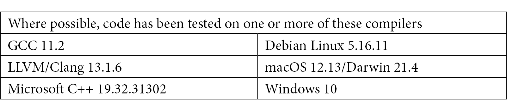

# 前言

# 关于本书

《*C++20 STL 烹饪书*》提供了食谱，帮助你充分利用 C++ STL（标准模板库），包括 C++20 中引入的新特性。

C++ 是一种丰富而强大的语言。建立在 C 的基础上，通过类型安全、泛型编程和面向对象编程的语法扩展，C++ 实质上是一种低级语言。STL 提供了一组高级类、函数和算法，使你的编程工作更轻松、更有效，且更不容易出错。

我经常说 C++ 是五种语言拼凑在一起的一种。正式规范包括 1) 整个 *C 语言*，2) C 的神秘而强大的 *宏预处理器*，3) 功能丰富的 *类/对象* 模型，4) 一种称为 *模板* 的 *泛型编程* 模型，最后，建立在 C++ 类和模板之上，5) *STL*。

## 前置知识

本书假设你已具备 C++ 的基本理解，包括语法、结构、数据类型、类和对象、模板以及 STL。

本书中的食谱和示例假设你理解了需要 `#include` 某些头文件以使用库函数的需要。食谱通常不会列出所有必要的头文件，而是更专注于手头的技巧。鼓励你下载示例代码，其中包含所有必要的 `#include` 指令和其他前置内容。

你可以从 GitHub 下载示例代码：[`github.com/PacktPublishing/CPP-20-STL-Cookbook`](https://github.com/PacktPublishing/CPP-20-STL-Cookbook)。

这些假设意味着当你看到这样的代码片段时：

```cpp
cout << "hello, world\n";
```

你应该已经知道，你需要将此代码放入 `main()` 函数中，你需要 `#include` `<iostream>` 头文件，而 `cout` 是 `std::` 命名空间中的一个对象：

```cpp
#include <iostream>
int main() {
    std::cout << "hello, world\n";
}
```

## STL 的力量来源于模板（简要入门）

*模板* 是 C++ 进行 *泛型编程* 的方式，代码独立于类型同时保持类型安全。C++ 模板允许你使用标记作为类型和类的占位符，如下所示：

```cpp
template<typename T>
T add_em_up(T& lhs, T& rhs) {
    return lhs + rhs;
}
```

模板可用于类和/或函数。在这个模板函数中，`T` 代表一个 *泛型类型*，这使得此代码可以在任何兼容的类或类型的上下文中使用：

```cpp
int a{ 72 };  // see braced initialization below
int b{ 47 };
cout << add_em_up<int>(a, b) << "\n";
```

这将使用 `int` 类型调用模板函数。相同的代码可以用于任何支持 `+` 操作符的类型或类。

当编译器看到 *模板调用*，例如 `add_em_up<int>(a, b)`，它会创建一个 *特化*。这就是使代码类型安全的原因。当你用 `int` 类型调用 `add_em_up()` 时，特化将类似于以下这样：

```cpp
int add_em_up(int& lhs, int& rhs) {
    return lhs + rhs;
}
```

特化将模板替换为 `T` 占位符的所有实例，在这个例子中，是 `int`。每次用不同类型调用模板时，编译器都会为模板创建一个单独的特化。

STL *容器*，如 `vector`、`stack` 或 `map`，以及它们的 *迭代器* 和其他支持函数和算法，都是使用模板构建的，这样它们可以在保持类型安全的同时通用。这就是 STL 如此灵活的原因。模板是 STL 中的 *T*。

## 本书使用 C++20 标准

C++ 语言由国际标准化组织（ISO）大约每三年标准化一次。当前的标准称为 C++20（在此之前是 C++17、C++14 和 C++11）。C++20 于 2020 年 9 月获得批准。

C++20 为语言和 STL 添加了许多重要特性。新的特性如 *格式*、*模块*、*范围*等将对使用 STL 的方式产生重大影响。

同时也有一些便利的更改。例如，如果你想从 `vector` 中删除所有匹配的元素，你可能一直使用这样的 *erase-remove 习语*：

```cpp
auto it = std::remove(vec1.begin(), vec1.end(), value);
vec1.erase(it, vec1.end());
```

从 C++20 开始，你可以使用新的 `std::erase` 函数，并在一个简单的、优化的函数调用中完成所有这些操作：

```cpp
std::erase(vec1, value);
```

C++20 有许多改进，既有细微之处，也有实质性的改进。在本书中，我们将涵盖其中很多内容，特别是与 STL 相关的部分。

## 带括号的初始化

你可能会注意到，本书中的配方经常使用 *带括号的初始化* 而不是更熟悉的 *复制初始化*。

```cpp
std::string name{ "Jimi Hendrix" };  // braced initialization
std::string name = "Jimi Hendrix";   // copy initialization
```

`=` 运算符既是赋值运算符也是复制运算符。它既常见又熟悉，而且它有效，所以我们一直都在使用它。

`=` 运算符的缺点是它也是一个复制构造函数，这通常意味着*隐式类型转换*。这既低效又可能导致意外的类型转换，这可能会很难调试。

带括号的初始化使用列表初始化运算符 `{}`（自 C++11 引入）来避免这些副作用。养成这样的习惯是好的，你会在本书中看到很多。

值得注意的是，`T{}` 的特殊情况保证为零初始化。

```cpp
int x;      // uninitialized            bad  :(
int x = 0;  // zero (copy constructed)  good :)
int x{};    // zero (zero-initialized)  best :D
```

空括号的零初始化为初始化新变量提供了一个有用的快捷方式。

## 隐藏 std:: 命名空间

在本书的大多数情况下，练习将隐藏 `std::` 命名空间。这主要是出于页面空间和可读性考虑。我们都知道大多数 STL 标识符都在 `std::` 命名空间中。我通常会使用某种形式的 `using` 声明来避免在示例中重复前缀。例如，当使用 `cout` 时，你可以假设我已经包含了这样的 `using` 声明：

```cpp
using std::cout;    // cout is now sans prefix
cout << "Hello, Jimi!\n"; 
```

我通常*不会显示*配方列表中的 `using` 声明。这使我们能够专注于示例的目的。

在你的代码中导入整个 `std::` 命名空间是一种不好的做法。你应该*避免*使用这样的 `using namespace` 声明：

```cpp
using namespace std;    // bad. don't do that. 
cout << "Hello, Jimi!\n"; 
```

`std::`命名空间包含成千上万的标识符，没有很好的理由在你的命名空间中用它们来造成混乱。冲突的可能性不是微不足道的，而且可能很难追踪。当你想要使用不带`std::`前缀的名称时，首选的方法是像上面那样一次导入一个名称。

为了进一步避免命名空间冲突，我经常为将要重用的类使用一个单独的命名空间。我倾向于使用`namespace bw`作为我的个人命名空间。你也可以使用对你来说有效的方法。

## 使用`using`声明类型别名

本书使用`using`指令而不是`typedef`来声明类型别名。

STL 类和类型有时可能会很冗长。例如，一个模板迭代器类可能看起来像这样：

```cpp
std::vector<std::pair<int,std::string>>::iterator
```

长类型名不仅难以输入，而且容易出错。

一种常见的技巧是使用`typedef`来缩短长类型名：

```cpp
typedef std::vector<std::pair<int,std::string>>::iterator vecit_t
```

这为我们的笨拙迭代器类型声明了一个别名。`typedef`是从 C 继承的，其语法反映了这一点。

从 C+11 开始，可以使用`using`关键字来创建类型别名：

```cpp
using vecit_t = std::vector<std::pair<int,std::string>>::iterator;
```

在大多数情况下，`using`别名等同于`typedef`。最显著的区别是`using`别名可能是模板化的：

```cpp
template<typename T>
using v = std::vector<T>;
v<int> x{};
```

由于这些原因，为了清晰起见，本书更倾向于使用`using`指令来声明类型别名。

## 简化的函数模板

从 C++20 开始，可以指定没有模板头的*简化的函数模板*。例如：

```cpp
void printc(const auto& c) {
    for (auto i : c) {
        std::cout << i << '\n';
    }
}
```

参数列表中的`auto`类型就像一个匿名模板`typename`，它等同于：

```cpp
template<typename C>
void printc(const C& c) {
    for (auto i : c) {
        std::cout << i << '\n';
    }
}
```

虽然 C++20 中才引入，但简化的函数模板已经被主要的编译器支持了一段时间。本书将在许多示例中使用简化的函数模板。

## C++20 的`format()`函数

直到 C++20，我们可以在使用传统的`printf()`或 STL 的`cout`进行文本格式化之间进行选择。两者都有严重的缺陷，但我们使用它们是因为它们有效。从 C++20 开始，`format()`函数提供了受 Python 3 格式化程序启发的文本格式化。

本课程大量使用了新的 STL `format()`函数。请参阅*第一章*，*新 C++20 特性*，以获取更全面的描述。

## 使用 STL 解决实际问题

本书中的食谱使用 STL 为实际问题提供实际解决方案。它们被设计为仅依赖于 STL 和 C++标准库，不使用任何外部库。这应该使你能够轻松地进行实验和学习，而不会受到安装和配置第三方代码的干扰。

现在，让我们用 STL（标准模板库）来享受一些乐趣吧。*快乐学习！*

# 本书面向的对象

本书是为希望从 C++20 标准模板库中获得更多内容的*中级到高级*C++程序员而编写的。为了充分利用本书，需要具备基本的编码知识和 C++概念。

# 本书涵盖的内容

*第一章*, *新 C++20 特性*, 介绍了 C++20 中的新 STL 特性。目的是让您熟悉这些新语言特性，以便您可以在 STL 中使用它们。

*第二章*, *通用 STL 特性*, 讨论了最近 C++版本中添加的现代 STL 特性。

*第三章*, *STL 容器*, 讨论了 STL 的全面容器库。

*第四章*, *兼容迭代器*, 展示了如何使用和创建与 STL 兼容的迭代器。

*第五章*, *Lambda 表达式*, 讨论了与 STL 函数和算法一起使用 Lambda 的方法。

*第六章*, *STL 算法*, 提供了使用和创建与 STL 兼容的算法的食谱。

*第七章*, *字符串、流和格式化*, 描述了 STL 的字符串和格式化类。

*第八章*, *实用类*, 讨论了 STL 的日期和时间、智能指针、optionals 等实用类。

*第九章*, *并发与并行性*, 描述了对并发性的支持，包括线程、async、原子类型等。

*第十章*, *使用文件系统*, 讨论了`std::filesystem`类以及如何利用 C++20 带来的最新进展来使用它们。

*第十一章*, *更多想法*, 提供了一些额外的解决方案，包括 trie 类、字符串分割等。这提供了如何将 STL 应用于实际问题的先进示例。

## 本书中的食谱使用 GCC 编译器

除非另有说明，本书中的大多数食谱都是使用 GCC 编译器，版本 11.2，截至本书撰写时的最新稳定版本开发的。

当我写这篇文章时，C++20 仍然很新，并且任何可用的编译器都没有完全实现。在三个主要编译器中，*GCC*（GNU）、*MSVC*（Microsoft）和*Clang*（Apple）中，MSVC 编译器在实现新标准方面进展最快。偶尔，我们可能会遇到在 MSVC 或其他编译器上实现但在 GCC 上未实现的功能，在这种情况下，我会注明我使用了哪个编译器。如果一个功能在任何可用的编译器上尚未实现，我会解释我无法对其进行测试。



我强烈建议您安装 GCC 以跟随本书中的食谱。GCC 在 GNU 通用公共许可证（GPL）下免费提供。获取 GCC 最新版本的最简单方法是安装*Debian Linux*（也是 GPL），并使用`apt`和`testing`仓库。

**如果您正在使用本书的数字版，我们建议您自己输入代码或从 GitHub 仓库（下一节中的链接）下载代码。这将避免从电子书复制粘贴格式化代码时产生的错误。**

## 下载示例代码文件

您可以从 GitHub（https://github.com/PacktPublishing/CPP-20-STL-Cookbook）下载本书的示例代码文件。在更新和勘误的情况下，代码将在 GitHub 仓库中更新。

我们还有其他来自我们丰富的图书和视频目录的代码包可供选择，请访问[`github.com/PacktPublishing/`](https://github.com/PacktPublishing/)。查看它们！

# 使用的约定

本书使用了多种文本约定。

`文本中的代码`：表示文本中的代码单词、数据库表名、文件夹名、文件名、文件扩展名、路径名、虚拟 URL、用户输入和 Twitter 昵称。以下是一个示例：“`insert()`方法接受一个`initializer_list`并调用私有函数`_insert()`：”

代码块设置如下：

```cpp
int main() {
    Frac f{ 5, 3 };
    cout << format("Frac: {}\n", f);
}
```

当我们希望您注意代码块中的特定部分时，相关的行或项目将以粗体显示：

```cpp
for(uint64_t i{ 2 }; i < n / 2; ++i) {
    if(n % i == 0) return false;
}
```

任何命令行输入或输出都按以下方式编写：

```cpp
$ ./producer-consumer
Got 0 from the queue
Got 1 from the queue
Got 2 from the queue
finished!
```

**粗体**：表示新术语、重要单词或您在屏幕上看到的单词。例如，菜单或对话框中的单词在文本中显示如下。以下是一个示例：“从**管理**面板中选择**系统信息**。”

小贴士或重要注意事项

显示如下。

# 部分

在本书中，您将找到一些经常出现的标题（*如何做…*、*它是如何工作的…*、*更多内容…*和*另请参阅…*）。

为了清楚地说明如何完成食谱，请按照以下方式使用这些部分：

## 如何做…

本节包含遵循食谱所需的步骤。

## 它是如何工作的…

本节通常包含对前节发生事件的详细解释。

## 更多内容…

本节包含有关食谱的附加信息，以便您对食谱有更深入的了解。

## 另请参阅…

本节提供了对其他有用信息的链接，以帮助您了解食谱。

# 联系我们

欢迎读者反馈。

**一般反馈**：如果您对本书的任何方面有疑问，请在邮件主题中提及书名，并通过[customercare@packtpub.com](http://customercare@packtpub.com)给我们发邮件。

**勘误**：尽管我们已经尽最大努力确保内容的准确性，但错误仍然可能发生。如果您在这本书中发现了错误，如果您能向我们报告，我们将不胜感激。请访问[www.packtpub.com/support/errata](http://www.packtpub.com/support/errata)，选择您的书籍，点击勘误提交表单链接，并输入详细信息。

**盗版**：如果您在互联网上遇到任何形式的我们作品的非法副本，如果您能提供位置地址或网站名称，我们将不胜感激。请通过[copyright@packt.com](http://copyright@packt.com)与我们联系，并提供材料的链接。

**如果您有兴趣成为作者**：如果您在某个领域有专业知识，并且对撰写或参与书籍感兴趣，请访问[authors.packtpub.com](http://authors.packtpub.com)。

# 分享您的想法

一旦您阅读了《C++20 STL 烹饪秘籍》，我们非常乐意听取您的想法！[请点击此处直接进入此书的亚马逊评论页面](https://packt.link/r/1803248718)并分享您的反馈。

您的评论对我们和科技社区都非常重要，并将帮助我们确保我们提供高质量的内容。

前言
