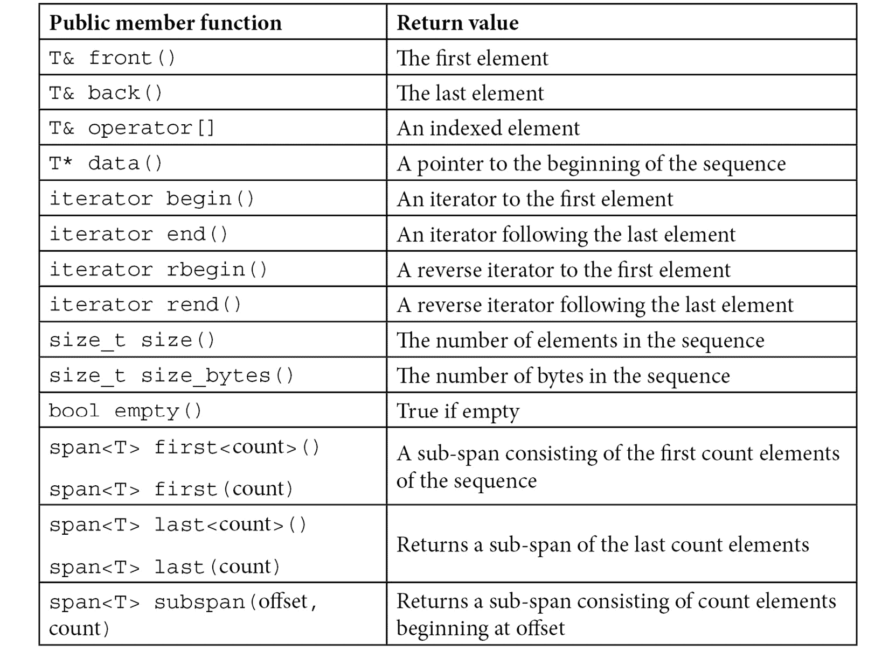

# 第二章：*第二章*：通用 STL 功能

本章是 STL 功能和技术的综合。这些大多是过去几年中引入的新功能，可能尚未得到广泛应用。这些有用的技术将提高你代码的简洁性和可读性。

在本章中，我们将介绍以下食谱：

+   使用新的`span`类使你的 C 数组更安全

+   使用结构化绑定返回多个值

+   在`if`和`switch`语句中初始化变量

+   使用模板参数推导以简化并清晰

+   使用`if constexpr`简化编译时决策

# 技术要求

你可以在 GitHub 上找到本章的代码：[`github.com/PacktPublishing/CPP-20-STL-Cookbook/tree/main/chap02`](https://github.com/PacktPublishing/CPP-20-STL-Cookbook/tree/main/chap02)。

# 使用新的`span`类使你的 C 数组更安全

C++20 新增的`std::span`类是一个简单的包装器，它创建了对连续对象序列的视图。`span`不拥有自己的数据，它引用底层结构中的数据。将其视为 C 数组的`string_view`。底层结构可能是一个*C 数组*、一个`vector`或 STL 的`array`。

## 如何做到这一点...

你可以从任何兼容的连续存储结构创建`span`。最常见的情况将涉及 C 数组。例如，如果你尝试直接将 C 数组传递给一个函数，数组将被降级为指针，函数没有简单的方法知道数组的大小：

```cpp
void parray(int * a);  // loses size information
```

如果你使用`span`参数定义你的函数，你可以传递一个 C 数组，它将被提升为`span`。以下是一个模板函数，它接受一个`span`并打印出元素数量和字节数：

```cpp
template<typename T>
void pspan(span<T> s) {
    cout << format("number of elements: {}\n", s.size());
    cout << format("size of span: {}\n", s.size_bytes());
    for(auto e : s) cout << format("{} ", e);
    cout << "\n";
}
```

你可以将 C 数组传递给这个函数，它将自动提升为`span`：

```cpp
int main() {
    int carray[] { 1, 2, 3, 4, 5, 6, 7, 8, 9, 10 };
    pspan<int>(carray);
}
```

输出：

```cpp
number of elements: 10
number of bytes: 40
1 2 3 4 5 6 7 8 9 10 
```

`span`的目的在于封装原始数据，以提供一定程度的保护和实用性，同时最小化开销。

## 它是如何工作的...

`span`类本身不拥有任何数据。数据属于底层数据结构。`span`本质上是对底层数据的视图。它还提供了一些有用的成员函数。

定义在`<span>`头文件中，`span`类看起来像这样：

```cpp
template<typename T, size_t Extent = std::dynamic_extent>
class span {
    T * data;
    size_t count;
public:
    ... 
};
```

`Extent`参数是一个`constexpr size_t`类型的常量，它在编译时计算。它要么是底层数据中的元素数量，要么是`std::dynamic_extent`常量，表示大小是可变的。这允许`span`使用底层结构，如`vector`，其大小可能不是固定的。

所有成员函数都是`constexpr`和`const`修饰的。成员函数包括：



重要提示

`span`类只是一个简单的包装器，不执行边界检查。所以，如果你尝试在包含*n*个元素的`span`中访问第*n*+1 个元素，结果是未定义的，这在技术上意味着“不好。不要这样做。”

# 使用结构化绑定返回多个值

*结构化绑定*使将结构值解包到单独的变量变得容易，从而提高了代码的可读性。

使用结构化绑定，你可以直接将成员值赋给变量，如下所示：

```cpp
things_pair<int,int> { 47, 9 };
auto [this, that] = things_pair;
cout << format("{} {}\n", this, that);
```

输出：

```cpp
47 9
```

## 如何做到这一点...

+   *结构化绑定*与`pair`、`tuple`、`array`和`struct`一起工作。从 C++20 开始，这包括位域。此示例使用 C 数组：

    ```cpp
    int nums[] { 1, 2, 3, 4, 5 };
    auto [ a, b, c, d, e ] = nums;
    cout << format("{} {} {} {} {}\n", a, b, c, d, e);
    ```

输出：

```cpp
1 2 3 4 5
```

因为结构化绑定使用*自动类型推导*，它的类型必须是`auto`。个别变量的名称位于方括号内，`[ a, b, c, d, e ]`。

在这个例子中，`int` C 数组`nums`包含五个值。这五个值使用*结构化绑定*分配给变量（`a`、`b`、`c`、`d`和`e`）。

+   这也适用于 STL `array`对象：

    ```cpp
    array<int,5> nums { 1, 2, 3, 4, 5 };
    auto [ a, b, c, d, e ] = nums;
    cout << format("{} {} {} {} {}\n", a, b, c, d, e);
    ```

输出：

```cpp
1 2 3 4 5
```

+   或者，你可以用它与`tuple`一起使用：

    ```cpp
    tuple<int, double, string> nums{ 1, 2.7, "three" };
    auto [ a, b, c ] = nums;
    cout << format("{} {} {}\n", a, b, c);
    ```

输出：

```cpp
1 2.7 three
```

+   当你与`struct`一起使用时，它将按照定义的顺序获取变量：

    ```cpp
    struct Things { int i{}; double d{}; string s{}; };
    Things nums{ 1, 2.7, "three" };
    auto [ a, b, c ] = nums;
    cout << format("{} {} {}\n", a, b, c);
    ```

输出：

```cpp
1 2.7 three
```

+   你可以使用引用与结构化绑定一起使用，这允许你修改绑定容器中的值，同时避免数据重复：

    ```cpp
    array<int,5> nums { 1, 2, 3, 4, 5 };
    auto& [ a, b, c, d, e ] = nums;
    cout << format("{} {}\n", nums[2], c);
    c = 47;
    cout << format("{} {}\n", nums[2], c);
    ```

输出：

```cpp
3 3
47 47
```

因为变量作为引用绑定，你可以将值赋给`c`，这将改变数组中的值（`nums[2]`）。

+   你可以声明数组为`const`以防止值被更改：

    ```cpp
    const array<int,5> nums { 1, 2, 3, 4, 5 };
    auto& [ a, b, c, d, e ] = nums;
    c = 47;    // this is now an error 
    ```

或者，你可以声明绑定为`const`以获得相同的效果，同时允许在其他地方更改数组，并且仍然避免复制数据：

```cpp
array<int,5> nums { 1, 2, 3, 4, 5 };
const auto& [ a, b, c, d, e ] = nums;
c = 47;    // this is also an error 
```

## 它是如何工作的...

结构化绑定使用*自动类型推导*将结构解包到你的变量中。它独立确定每个值的类型，并为每个变量分配相应的类型。

+   因为结构化绑定使用自动类型推导，你不能为绑定指定类型。你必须使用`auto`。如果你尝试为绑定使用类型，你应该会得到一个合理的错误信息：

    ```cpp
    array<int,5> nums { 1, 2, 3, 4, 5 };
    int [ a, b, c, d, e ] = nums;
    ```

输出：

```cpp
error: structured binding declaration cannot have type 'int'
note: type must be cv-qualified 'auto' or reference to cv-qualified 'auto'
```

上面是当我尝试使用`int`与结构化绑定声明时 GCC 产生的错误。

+   使用结构化绑定作为函数的返回类型很常见：

    ```cpp
    struct div_result {
        long quo;
        long rem;
    };
    div_result int_div(const long & num, const long & denom) {
        struct div_result r{};
        r.quo = num / denom;
        r.rem = num % denom;
        return r;
    }
    int main() {
        auto [quo, rem] = int_div(47, 5);
        cout << format("quotient: {}, remainder {}\n",
          quo, rem);
    }
    ```

输出：

```cpp
quotient: 9, remainder 2
```

+   因为`map`容器类为每个元素返回一个对，所以使用结构化绑定检索键/值对很方便：

    ```cpp
    map<string, uint64_t> inhabitants {
        { "humans",   7000000000 },
        { "pokemon", 17863376 },
        { "klingons",   24246291 },
        { "cats",    1086881528 }
    };
    // I like commas
    string make_commas(const uint64_t num) {
        string s{ std::to_string(num) };
        for(int l = s.length() - 3; l > 0; l -= 3) {
            s.insert(l, ",");
        }
        return s;
    }
    int main() {
        for(const auto & [creature, pop] : inhabitants) {
            cout << format("there are {} {}\n", 
                make_commas(pop), creature);
        }
    }
    ```

输出：

```cpp
there are 1,086,881,528 cats
there are 7,000,000,000 humans
there are 24,246,291 klingons
there are 17,863,376 pokemon
```

使用结构化绑定解包结构可以使你的代码更清晰且易于维护。

# 在 if 和 switch 语句中初始化变量

从 C++17 开始，`if`和`switch`现在有了初始化语法，就像 C99 以来的`for`循环一样。这允许你限制条件内使用的变量的作用域。

## 如何做到这一点...

你可能习惯于这样的代码：

```cpp
const string artist{ "Jimi Hendrix" };
size_t pos{ artist.find("Jimi") };
if(pos != string::npos) {
    cout << "found\n";
} else {
    cout << "not found\n";
}
```

这使得变量`pos`暴露在条件语句的作用域之外，需要在这里进行管理，或者它可能与其他尝试使用相同符号的尝试发生冲突。

现在，你可以在`if`条件中放置初始化表达式：

```cpp
if(size_t pos{ artist.find("Jimi") }; pos != string::npos) {
    cout << "found\n";
} else {
    cout << "not found\n";
}
```

现在`pos`变量的作用域被限制在条件的作用域内。这保持了你的命名空间干净且易于管理。

## 它是如何工作的...

初始化器表达式可以用于 `if` 或 `switch` 语句。以下是每个的示例。

+   使用 `if` 语句的初始化器表达式：

    ```cpp
    if(auto var{ init_value }; condition) {
        // var is visible 
    } else {
        // var is visible 
    } 
    // var is NOT visible 
    ```

在初始化器表达式中定义的变量在整个 `if` 语句的作用域内可见，包括 `else` 子句。一旦控制流离开 `if` 语句的作用域，该变量将不再可见，并且将调用任何相关的析构函数。

+   使用 `switch` 语句的初始化器表达式：

    ```cpp
    switch(auto var{ init_value }; var) {
    case 1: ...
    case 2: ...
    case 3: ...
    ...
    Default: ...
    }
    // var is NOT visible 
    ```

在初始化器表达式中定义的变量在整个 `switch` 语句的作用域内可见，包括所有的 `case` 子句和可选的 `default` 子句。一旦控制流离开 `switch` 语句的作用域，该变量将不再可见，并且将调用任何相关的析构函数。

## 还有更多...

一个有趣的用例是限制锁定互斥锁的 `lock_guard` 的作用域。使用初始化器表达式可以使这变得简单：

```cpp
if (lock_guard<mutex> lg{ my_mutex }; condition) { 
    // interesting things happen here 
}
```

`lock_guard` 在其构造函数中锁定互斥锁，并在析构函数中解锁。现在，当 `lock_guard` 超出 `if` 语句的作用域时，它将被自动销毁。在过去，你可能需要删除它或将整个 `if` 语句包围在一个额外的花括号块中。

另一个用例可能是使用使用输出参数的遗留接口，例如 SQLite 中的这个：

```cpp
if(
    sqlite3_stmt** stmt, 
    auto rc = sqlite3_prepare_v2(db, sql, -1, &_stmt,
        nullptr);
    !rc) {
          // do SQL things
} else {  // handle the error 
    // use the error code 
    return 0;
}
```

在这里，我可以将语句句柄和错误代码局部化到 `if` 语句的作用域内。否则，我需要全局管理这些对象。

使用初始化器表达式将有助于使你的代码紧凑且无杂乱，更紧凑，更容易阅读。重构和管理你的代码也将变得更加容易。

# 使用模板参数推导以简化并清晰

模板参数推导发生在模板函数的参数类型或类模板构造函数（从 C++17 开始）的类型足够清晰，以至于编译器无需使用模板参数就能理解时。这个特性有一些规则，但主要是直观的。

## 如何实现...

通常，当你使用与模板明显兼容的参数的模板时，模板参数推导会自动发生。让我们考虑一些例子。

+   在函数模板中，参数推导通常看起来像这样：

    ```cpp
    template<typename T>
    const char * f(const T a) {
        return typeid(T).name();
    }
    int main() {
        cout << format("T is {}\n", f(47));
        cout << format("T is {}\n", f(47L));
        cout << format("T is {}\n", f(47.0));
        cout << format("T is {}\n", f("47"));
        cout << format("T is {}\n", f("47"s));
    }
    ```

输出：

```cpp
T is int
T is long
T is double
T is char const *
T is class std::basic_string<char...
```

因为类型很容易识别，所以在函数调用中不需要指定模板参数，例如 `f<int>(47)`。编译器可以从参数中推导出 `<int>` 类型。

注意

上述输出显示了大多数编译器将使用缩写的有意义类型名称，例如 `int` 的 `i` 和 `const char *` 的 `PKc` 等。

+   这同样适用于多个模板参数：

    ```cpp
    template<typename T1, typename T2>
    string f(const T1 a, const T2 b) {
        return format("{} {}", typeid(T1).name(), 
            typeid(T2).name());
    }
    int main() {
        cout << format("T1 T2: {}\n", f(47, 47L));
        cout << format("T1 T2: {}\n", f(47L, 47.0));
        cout << format("T1 T2: {}\n", f(47.0, "47"));
    }
    ```

输出：

```cpp
T1 T2: int long
T1 T2: long double
T1 T2: double char const *
```

在这里，编译器正在推断 `T1` 和 `T2` 的类型。

+   注意，类型必须与模板兼容。例如，你不能从字面量中取引用：

    ```cpp
    template<typename T>
    const char * f(const T& a) {
        return typeid(T).name();
    }
    int main() {
        int x{47};
        f(47);  // this will not compile 
        f(x);   // but this will 
    }
    ```

+   从 C++17 开始，你也可以使用模板参数推导与类。所以现在这将工作：

    ```cpp
    pair p(47, 47.0);     // deduces to pair<int, double>
    tuple t(9, 17, 2.5);  // deduces to tuple<int, int, double>
    ```

这消除了对 `std::make_pair()` 和 `std::make_tuple()` 的需要，因为你现在可以直接初始化这些类，而无需显式模板参数。`std::make_*` 辅助函数将保持可用，以保持向后兼容性。

## 它是如何工作的…

让我们定义一个类，这样我们就可以看到它是如何工作的：

```cpp
template<typename T1, typename T2, typename T3>
class Thing {
    T1 v1{};
    T2 v2{};
    T3 v3{};
public:
    explicit Thing(T1 p1, T2 p2, T3 p3)
    : v1{p1}, v2{p2}, v3{p3} {}
    string print() {
        return format("{}, {}, {}\n",
            typeid(v1).name(),
            typeid(v2).name(),
            typeid(v3).name()
        );
    }
};
```

这是一个具有三种类型和三个相应数据成员的模板类。它有一个 `print()` 函数，该函数返回包含三个类型名称的格式化字符串。

没有模板参数推导的情况下，我必须这样实例化这个类型的对象：

```cpp
Things<int, double, string> thing1{1, 47.0, "three" }
```

现在我可以这样做：

```cpp
Things thing1{1, 47.0, "three" }
```

这既简单又不易出错。

当我在 `thing1` 对象上调用 `print()` 函数时，我得到这个结果：

```cpp
cout << thing1.print();
```

输出：

```cpp
int, double, char const *
```

当然，你的编译器可能会报告类似的内容。

在 C++17 之前，模板参数推导不适用于类，因此你需要一个辅助函数，它可能看起来像这样：

```cpp
template<typename T1, typename T2, typename T3>
Things<T1, T2, T3> make_things(T1 p1, T2 p2, T3 p3) {
    return Things<T1, T2, T3>(p1, p2, p3);
}
...
auto thing1(make_things(1, 47.0, "three"));
cout << thing1.print();
```

输出：

```cpp
int, double, char const *
```

STL 包含了一些这些辅助函数，例如 `make_pair()` 和 `make_tuple()` 等。这些函数现在已过时，但为了与旧代码保持兼容性，将会继续维护。

## 还有更多…

考虑具有参数包的构造函数的情况：

```cpp
template <typename T>
class Sum {
    T v{};
public:
    template <typename... Ts>
    Sum(Ts&& ... values) : v{ (values + ...) } {}
    const T& value() const { return v; }
};
```

注意构造函数中的 *折叠表达式* `(values + ...)`。这是一个 C++17 特性，它将运算符应用于参数包的所有成员。在这种情况下，它将 `v` 初始化为参数包的总和。

这个类的构造函数接受任意数量的参数，其中每个参数可能属于不同的类。例如，我可以这样调用它：

```cpp
Sum s1 { 1u, 2.0, 3, 4.0f };  // unsigned, double, int, 
                              // float
Sum s2 { "abc"s, "def" };     // std::sring, c-string
```

当然，这无法编译。模板参数推导未能为所有这些不同的参数找到一个共同类型。我们得到一个类似以下错误信息的消息：

```cpp
cannot deduce template arguments for 'Sum'
```

我们可以通过一个 *模板推导指南* 来解决这个问题。推导指南是一种辅助模式，用于帮助编译器处理复杂的推导。这是我们的构造函数的指南：

```cpp
template <typename... Ts>
Sum(Ts&& ... ts) -> Sum<std::common_type_t<Ts...>>;
```

这告诉编译器使用 `std::common_type_t` 特性，它试图为包中的所有参数找到一个共同类型。现在我们的参数推导工作正常，我们可以看到它选择了哪些类型：

```cpp
Sum s1 { 1u, 2.0, 3, 4.0f };  // unsigned, double, int, 
                              // float
Sum s2 { "abc"s, "def" };     // std::sring, c-string
auto v1 = s1.value();
auto v2 = s2.value();
cout << format("s1 is {} {}, s2 is {} {}",
        typeid(v1).name(), v1, typeid(v2).name(), v2);
```

输出：

```cpp
s1 is double 10, s2 is class std::string abcdef
```

# 使用 `if constexpr` 简化编译时决策

在需要根据编译时条件执行代码的地方使用 `if constexpr(`*条件*)` 语句。*条件* 可以是任何类型为 `bool` 的 `constexpr` 表达式。

## 如何去做…

考虑这样一个情况，你有一个需要根据模板参数类型执行不同操作的模板函数。

```cpp
template<typename T>
auto value_of(const T v) {
    if constexpr (std::is_pointer_v<T>) {
        return *v;  // dereference the pointer
    } else {
        return v;   // return the value
    }
}
int main() {
    int x{47};
    int* y{&x};
    cout << format("value is {}\n", value_of(x));  // value
    cout << format("value is {}\n", value_of(y));  
                                                // pointer
    return 0;
}
```

输出：

```cpp
value is 47
value is 47
```

模板参数 `T` 的类型在编译时是可用的。`constexpr if` 语句允许代码轻松区分指针和值。

## 它是如何工作的…

`constexpr if`语句的工作方式与普通的`if`语句类似，除了它在*编译时*进行评估。*运行时代码*将不会包含来自`constexpr if`语句的任何分支语句。考虑我们上面的分支语句：

```cpp
if constexpr (std::is_pointer_v<T>) {
    return *v;  // dereference the pointer
} else {
        return v;   // return the value
    }
```

条件`is_pointer_v<T>`测试一个模板参数，该参数在运行时不可用。`constexpr`关键字告诉编译器这个`if`语句需要在编译时评估，而模板参数`<T>`是可用的。

这应该会使许多元编程场景变得更加简单。`if constexpr`语句在 C++17 及以后的版本中可用。
