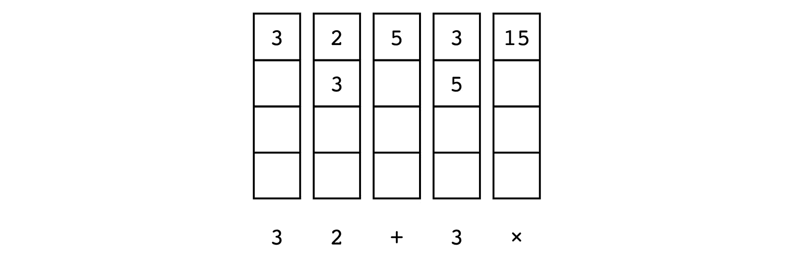
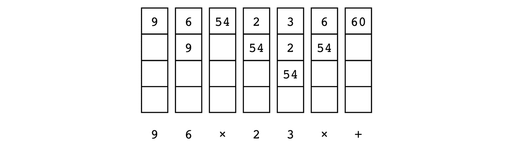

# 第三章：*第三章*：STL 容器

在本章中，我们将关注 STL 中的容器类。简而言之，*容器* 是一个包含其他对象集合或 *元素* 的对象。STL 提供了一套完整的容器类型，这些类型构成了 STL 本身的基础。

# STL 容器类型的快速概述

STL 提供了一套全面的容器类型，包括 *顺序容器*、*关联容器* 和 *容器适配器*。以下是简要概述：

## 顺序容器

顺序容器提供了一个接口，其中元素按顺序排列。虽然您可能按顺序使用元素，但其中一些容器使用连续存储，而另一些则不使用。STL 包括以下顺序容器：

+   `array` 是一个固定大小的序列，在连续存储中持有特定数量的元素。一旦分配，它就不能改变大小。这是最简单且最快的连续存储容器。

+   `vector` 类似于可以收缩和扩展的数组。其元素连续存储，因此改变大小可能涉及分配内存和移动数据的开销。`vector` 可以保留额外的空间以减轻这种成本。从 `vector` 的 *末尾* 之外的位置插入或删除元素将触发元素的重新排列，以保持连续存储。

+   `list` 是一种双向链表结构，允许在常数 (*O(1)*) 时间内插入和删除元素。遍历列表发生在线性 *O(n)* 时间。有一个单链表变体，称为 `forward_list`，它只能向前迭代。`forward_list` 使用更少的空间，并且比双向链表 `list` 更有效率，但缺乏一些功能。

+   `deque`（通常发音为 *deck*）允许随机访问其元素，类似于 `vector`，但不保证连续存储。

## 关联容器

关联容器将键与每个元素关联。元素通过其键而不是在容器中的位置进行引用。STL 关联容器包括以下容器：

+   `set` 是一个关联容器，其中每个元素也是它自己的键。元素按某种二叉树排序。`set` 中的元素是不可变的，不能修改，但可以插入和删除。`set` 中的元素是 *唯一的*，不允许重复。`set` 按照其排序运算符的顺序迭代。

+   `multiset` 与 `set` 类似，具有非唯一的键，允许重复。

+   `unordered_set` 类似于不按顺序迭代的 `set`，元素不按任何特定顺序排序，而是根据它们的哈希值组织以实现快速访问。

+   `unordered_multiset` 类似于具有非唯一键的 `unordered_set`，允许重复。

+   `map` 是一个关联容器，用于键值对，其中每个 *键* 都映射到一个特定的 *值*（或 *有效负载*）。键和值的类型可能不同。键是唯一的，但值不是。映射根据其排序运算符按键的顺序迭代。

+   `multimap` 类似于 `map`，但键不是唯一的，允许重复键。

+   `unordered_map` 类似于不按顺序迭代的映射。

+   `unordered_multimap` 类似于 `unordered_map`，但键不是唯一的，允许重复。

## 容器适配器

容器适配器是一个封装底层容器的类。容器类提供一组特定的成员函数来访问底层容器元素。STL 提供以下容器适配器：

+   `stack` 提供了 `vector`、`deque` 或 `list`。如果没有指定底层容器，默认是 `deque`。

+   `queue` 提供了 `deque` 或 `list`。如果没有指定底层容器，默认是 `deque`。

+   `priority_queue` 根据严格的弱排序将最大值元素放在顶部。它以对数时间插入和提取为代价，提供对最大值元素的常数时间查找。底层容器可能是 `vector` 或 `deque`。如果没有指定底层容器，默认是 `vector`。

在本章中，我们将介绍以下食谱：

+   使用统一的删除函数从容器中删除项目

+   在常数时间内从无序向量中删除项目

+   直接且安全地访问向量元素

+   保持向量元素排序

+   高效地将元素插入到映射中

+   高效修改映射项的键

+   使用自定义键的 `unordered_map`

+   使用集合对用户输入进行排序和过滤

+   使用 deque 实现一个简单的 RPN 计算器

+   使用映射实现单词频率计数器

+   使用向量数组查找长句子

+   使用多映射的待办事项列表

# 技术要求

你可以在 GitHub 上找到本章的代码：[`github.com/PacktPublishing/CPP-20-STL-Cookbook/tree/main/chap03`](https://github.com/PacktPublishing/CPP-20-STL-Cookbook/tree/main/chap03)。

# 使用统一的删除函数从容器中删除项目

在 C++20 之前，*erase-remove 习语* 通常用于高效地从 STL 容器中删除元素。这有点繁琐，但并不算太大的负担。通常使用如下这样的函数来完成这项任务：

```cpp
template<typename Tc, typename Tv>
void remove_value(Tc & c, const Tv v) {
    auto remove_it = std::remove(c.begin(), c.end(), v);
    c.erase(remove_it, c.end());
}
```

`std::remove()` 函数来自 `<algorithms>` 头文件。`std::remove()` 搜索指定的值，并通过从容器末尾向前移动元素来删除它。它不会改变容器的大小。它返回一个指向移动范围末尾之后的迭代器。然后我们调用容器的 `erase()` 函数来删除剩余的元素。

这个两步过程现在通过新的统一删除函数简化为一步：

```cpp
std::erase(c, 5);   // same as remove_value() function
```

这个函数调用与上面我们编写的 `remove_value()` 函数做的是同样的事情。

也有一个使用谓词函数的版本。例如，从数值容器中移除所有偶数编号的值：

```cpp
std::erase_if(c, [](auto x) { return x % 2 == 0; });
```

让我们更详细地看看统一擦除函数。

## 如何做到这一点...

统一擦除函数有两种形式。第一种形式，称为 `erase()`，接受两个参数，一个容器和一个值：

```cpp
erase(container, value); 
```

容器可以是任何顺序容器（`vector`、`list`、`forward_list`、`deque`），但不能是 `array`，因为 `array` 不能改变大小。

第二种形式，称为 `erase_if()`，接受一个容器和一个谓词函数：

```cpp
erase_if(container, predicate); 
```

这种形式与任何可以与 `erase()` 一起工作的容器以及关联容器 `set`、`map` 及其多键和无序变体一起工作。

函数 `erase()` 和 `erase_if()` 作为非成员函数定义在相应容器的头文件中。不需要包含另一个头文件。

让我们看看一些例子：

+   首先，让我们定义一个简单的函数来打印顺序容器的尺寸和元素：

    ```cpp
    void printc(auto & r) {
        cout << format("size({}) ", r.size());
        for( auto & e : r ) cout << format("{} ", e);
        cout << "\n";
    }
    ```

`printc()` 函数使用 C++20 的 `format()` 函数来格式化字符串以供 `cout` 使用。

+   这是一个包含 10 个整数元素的 `vector`，使用我们的 `printc()` 函数打印：

    ```cpp
    vector v{ 1, 2, 3, 4, 5, 6, 7, 8, 9 };
    printc(v);
    ```

输出：

```cpp
size: 10: 0 1 2 3 4 5 6 7 8 9
```

我们可以看到向量有 10 个元素。现在我们可以使用 `erase()` 来移除所有具有值 `5` 的元素：

```cpp
erase(v, 5);
printc(v);
```

输出：

```cpp
size: 9: 0 1 2 3 4 6 7 8 9
```

`std::erase()` 函数的 `vector` 版本定义在 `<vector>` 头文件中。在 `erase()` 调用之后，值为 5 的元素已被移除，并且向量中有 9 个元素。

+   这与 `list` 容器一样有效：

    ```cpp
    list l{ 0, 1, 2, 3, 4, 5, 6, 7, 8, 9 };
    printc(l);
    erase(l, 5);
    printc(l);
    ```

输出：

```cpp
size: 10: 0 1 2 3 4 5 6 7 8 9
size: 9: 0 1 2 3 4 6 7 8 9
```

`std::erase()` 函数的 `list` 版本定义在 `<list>` 头文件中。在 `erase()` 调用之后，具有值 `5` 的元素已被移除，并且列表中有 9 个元素。

+   我们可以使用 `erase_if()` 通过简单的谓词函数来移除所有偶数编号的元素：

    ```cpp
    vector v{ 0, 1, 2, 3, 4, 5, 6, 7, 8, 9 };
    printc(v);
    erase_if(v, [](auto x) { return x % 2 == 0; });
    printc(v);
    ```

输出：

```cpp
size: 10: 0 1 2 3 4 5 6 7 8 9
size: 5: 1 3 5 7 9
```

+   `erase_if()` 函数也可以与关联容器（如 `map`）一起使用：

    ```cpp
    void print_assoc(auto& r) {
        cout << format("size: {}: ", r.size());
        for( auto& [k, v] : r ) cout << format("{}:{} ",
            k, v);
        cout << "\n";
    }
    int main() {
        map<int, string> m{ {1, "uno"}, {2, "dos"},
            {3, "tres"}, {4, "quatro"}, {5, "cinco"} };
        print_assoc(m);
        erase_if(m, 
            [](auto& p) { auto& [k, v] = p;
            return k % 2 == 0; }
        );
        print_assoc(m);
    }
    ```

输出：

```cpp
size: 5: 1:uno 2:dos 3:tres 4:quatro 5:cinco
size: 3: 1:uno 3:tres 5:cinco
```

因为 `map` 的每个元素都作为 `pair` 返回，所以我们需要一个不同的函数来打印它们。`print_assoc()` 函数在 `for` 循环中使用 *结构化绑定* 来解包 `pair` 元素。我们还在 `erase_if()` 的谓词函数中使用结构化绑定来隔离键以过滤偶数编号的元素。

## 它是如何工作的...

`erase()` 和 `erase_if()` 函数只是执行 *erase-remove 习语* 的包装器，一步完成。它们执行与函数相同的操作，如下所示：

```cpp
template<typename Tc, typename Tv>
void remove_value(Tc & c, const Tv v) {
    auto remove_it = std::remove(c.begin(), c.end(), v);
    c.erase(remove_it, c.end());
}
```

如果我们考虑一个简单的 `int` 类型的 `vector`，称为 `vec`，具有以下值：

```cpp
vector vec{ 0, 1, 2, 3, 4, 5, 6, 7, 8, 9 };
```

我们可以将 `vec` 可视化为一个包含 `int` 值的单行表：


图 3.1 – begin() 和 end() 迭代器

`begin()` 迭代器指向第一个元素，而 `end()` 迭代器指向最后一个元素之后。这种配置是所有 STL 顺序容器的标准配置。

当我们调用 `remove(c.begin(), c.end(), 5)` 时，算法从 `begin()` 迭代器开始搜索匹配的元素。对于它找到的每个匹配元素，它将下一个元素移入其位置。它继续搜索和移动，直到达到 `end()` 迭代器。结果是容器，其中所有剩余的元素都在开头，没有删除的元素，并且保持原始顺序。`end()` 迭代器保持不变，剩余的元素是 *未定义* 的。我们可以这样可视化操作：


图 3.2 – 移除一个元素

`remove()` 函数返回一个迭代器 (`remove_it`)，它指向移除元素后第一个元素。`end()` 迭代器保持 `remove()` 操作前的状态。为了进一步说明，如果我们使用 `remove_if()` 移除所有偶数元素，我们的结果将如下所示：

![图 3.3 – 移除偶数元素后的结果

![图 3.3 – 移除偶数元素后的结果

图 3.3 – 移除偶数元素后的结果

在这种情况下，剩下的只有五个奇数元素，然后是五个 *未定义* 值的元素。

然后调用容器的 `erase()` 函数来擦除剩余的元素：

```cpp
c.erase(remove_it, c.end());
```

容器的 `erase()` 函数使用 `remove_it` 和 `end()` 迭代器调用，以删除所有未定义的元素。

`erase()` 和 `erase_if()` 函数调用 `remove()` 函数和容器的 `erase()` 函数，以便在一步中执行 *erase-remove 习语*。

# 在常数时间内从无序向量中删除项目

使用统一的擦除函数（或 *erase-remove 习语*）从向量中间删除项目需要 *O(n)*（线性）时间。这是因为必须将向量末尾的元素移动以关闭被删除项目留下的空隙。如果向量中项目的顺序不重要，我们可以优化此过程以在 *O(1)*（常数）时间内完成。下面是如何做到这一点。

## 如何做到这一点…

这个方法利用了从向量末尾移除元素既快又简单的事实。

+   让我们首先定义一个函数来打印向量：

    ```cpp
    void printc(auto & r) {
        cout << format("size({}) ", r.size());
        for( auto & e : r ) cout << format("{} ", e);
        cout << '\n';
    }
    ```

+   在我们的 `main()` 函数中，我们定义一个 `int` 类型的向量并使用 `printc()` 打印它：

    ```cpp
    int main() {
        vector v{ 0, 1, 2, 3, 4, 5, 6, 7, 8, 9 };
        printc(v);
    }
    ```

输出：

```cpp
size(10) 0 1 2 3 4 5 6 7 8 9
```

+   现在我们将编写一个函数来从向量中删除一个元素：

    ```cpp
    template<typename T>
    void quick_delete(T& v, size_t idx) {
        if (idx < v.size()) {
            v[idx] = move(v.back());
            v.pop_back();
        }
    }
    ```

`quick_delete()` 函数接受两个参数，一个向量 `v` 和一个索引 `idx`。我们首先检查确保我们的索引在边界内。然后我们调用 `<algorithms>` 头文件中的 `move()` 函数，将向量的最后一个元素移动到我们的索引位置。最后，调用 `v.pop_back()` 函数从后面缩短向量。

+   让我们还包括一个 `quick_delete()` 的版本，用于使用迭代器而不是索引。

    ```cpp
    template<typename T>
    void quick_delete(T& v, typename T::iterator it) {
        if (it < v.end()) {
            *it = move(v.back());
            v.pop_back();
        }
    }
    ```

这个版本的 `quick_delete()` 从迭代器而不是索引开始操作。否则，它的工作方式与索引版本相同。

+   现在我们可以从我们的`main()`函数中调用它：

    ```cpp
    int main() {
        vector v{ 12, 196, 47, 38, 19 };
        printc(v);
        auto it = std::ranges::find(v, 47);
        quick_delete(v, it);
        printc(v);
        quick_delete(v, 1);
        printc(v);
    }
    ```

输出将看起来像这样：

```cpp
size(5) 12 196 47 38 19
size(4) 12 196 19 38
size(3) 12 38 19
```

`quick_delete()`的第一个调用使用`std::ranges::find()`算法的迭代器。这将从向量中删除值`47`。注意向量末尾的值(`19`)取而代之。`quick_delete()`的第二次调用使用索引(`1`)从向量中删除第二个元素(`196`)。同样，向量末尾的值取而代之。

## 它是如何工作的…

`quick_delete()`函数使用一个简单的技巧来快速有效地从向量中删除元素。向量末尾的元素被移动(*不是复制*)到要删除的元素的位置。在这个过程中，被删除的元素被丢弃。然后，`pop_back()`函数从末尾缩短向量一个元素。

这利用了删除向量末尾元素特别便宜的事实。`pop_back()`函数以常数复杂度运行，因为它只需要更改`end()`迭代器。

此图显示了`quick_delete()`操作前后向量的状态：

![图 3.4 – quick_delete()前后]

![img/B18267_03_04.jpg]

图 3.4 – quick_delete()前后

`quick_remove()`操作简单地将向量末尾的元素移动到迭代器(`it`)的位置，然后通过缩短向量来减少一个元素。使用`std::move()`而不是赋值来移动元素是很重要的。移动操作比复制赋值快得多，尤其是对于大对象。

如果你不需要有序元素，这是一个非常高效的技巧。它发生在常数时间(*O(1)*)，并且不触及任何其他元素。

# 直接且安全地访问向量元素

`vector`是 STL 中最广泛使用的容器之一，原因很好。它使用起来与`array`一样方便，但功能更强大，更灵活。通常的做法是使用`[]`运算符以这种方式访问向量中的元素：

```cpp
vector v{ 19, 71, 47, 192, 4004 };
auto & i = v[2];
```

`vector`类还提供了一个用于相同目的的成员函数：

```cpp
auto & i = v.at(2);
```

结果相同，但有一个重要的区别。`at()`函数会进行边界检查，而`[]`运算符则不会。这是故意的，因为它允许`[]`运算符与原始 C 数组保持兼容。让我们更详细地考察一下这一点。

## 如何做到这一点…

访问向量中具有索引的元素有两种方式。`at()`成员函数会进行边界检查，而`[]`运算符则不会。

+   这里有一个简单的`main()`函数，它初始化一个向量并访问一个元素：

    ```cpp
    int main() {
        vector v{ 19, 71, 47, 192, 4004 };
        auto & i = v[2];
        cout << format("element is {}\n", i);
    }
    ```

输出：

```cpp
element is 47
```

在这里，我使用了`[]`运算符直接访问向量的第三个元素。与 C++中大多数顺序对象一样，索引从`0`开始，所以第三个元素是数字`2`。

+   向量有五个元素，编号从`0`到`4`。如果尝试访问编号为`5`的元素，这将超出向量的边界：

    ```cpp
    vector v{ 19, 71, 47, 192, 4004 };
    auto & i = v[5];
    cout << format("element is {}\n", i);
    element is 0
    ```

这个结果极具误导性。这是一个常见的错误，因为人类倾向于从 1 开始计数，而不是从 0 开始。但是，无法保证向量的末尾之后的元素有任何特定的值。

+   更糟糕的是，`[]` 操作符会静默地允许你向向量的末尾之后的位置 *写入*：

    ```cpp
    vector v{ 19, 71, 47, 192, 4004 };
    v[5] = 2001;
    auto & i = v[5];
    cout << format("element is {}\n", i);
    element is 2001
    ```

我现在已经写入了我无法控制的内存，编译器 *静默地* 允许了它，没有任何错误信息或崩溃。但不要被骗——这是一段极其危险的代码，*将会* 在未来的某个时刻引起问题。越界内存访问是安全漏洞的主要原因之一。

+   解决方案是在可能的情况下使用 `at()` 成员函数，而不是使用 `[]` 操作符：

    ```cpp
    vector v{ 19, 71, 47, 192, 4004 };
    auto & i = v.at(5);
    cout << format("element is {}\n", i);
    ```

现在我们得到了一个运行时异常：

```cpp
terminate called after throwing an instance of 'std::out_of_range'
  what():  vector::_M_range_check: __n (which is 5) >= this->size() (which is 5)
Aborted
```

代码编译没有错误，但 `at()` 函数会检查容器的边界，并在你尝试访问这些边界之外的内存时抛出一个 *运行时异常*。这是使用 GCC 编译器编译的代码的异常信息。在不同的环境中，信息可能会有所不同。

## 它是如何工作的…

`[]` 操作符和 `at()` 成员函数执行相同的工作；它们根据索引位置提供对容器元素的直接访问。`[]` 操作符不进行边界检查，因此在某些密集迭代的程序中可能会稍微快一点。

话虽如此，`at()` 函数 *应该是你的默认选择*。虽然边界检查可能会占用几个 CPU 周期，但这是一种低成本的保险。对于大多数应用程序来说，这种好处远远值得这种成本。

虽然 `vector` 类通常用作直接访问容器，但 `array` 和 `deque` 容器也支持 `[]` 操作符和 `at()` 成员函数。这些注意事项同样适用。

## 还有更多…

在某些应用中，你可能不希望当遇到越界条件时，你的应用程序只是 *崩溃*。在这种情况下，你可以 *捕获* 这个异常，如下所示：

```cpp
int main() {
    vector v{ 19, 71, 47, 192, 4004 };
    try {
        v.at(5) = 2001;
    } catch (const std::out_of_range & e) {
        std::cout <<
            format("Ouch!\n{}\n", e.what());
    }
    cout << format("end element is {}\n", v.back());
}
```

输出：

```cpp
Ouch!
vector::_M_range_check: __n (which is 5) >= this->size() (which is 5)
end element is 4004
```

`try` 块捕获了 `catch` 子句中指定的异常，在这种情况下，异常是 `std::out_of_range`。`e.what()` 函数返回一个包含 STL 库错误信息的 C 字符串。每个库都会有不同的信息。

请记住，这也适用于 `array` 和 `deque` 容器。

# 保持向量元素排序

`vector` 是一个顺序容器，它按照元素插入的顺序保持元素。它不会对元素进行排序，也不会以任何方式改变它们的顺序。其他容器，如 `set` 和 `map`，会保持元素排序，但这些容器不是随机访问的，可能没有你需要的功能。然而，你可以保持你的向量排序。这只需要一点管理。

## 如何做到这一点…

这个菜谱的想法是创建一个简单的函数，`insert_sorted()`，将元素插入到向量中的正确位置以保持向量排序。

+   为了方便，我们将从一个字符串向量的 `type alias` 开始：

    ```cpp
    using Vstr = std::vector<std::string>;
    ```

我喜欢在这里使用类型别名，因为向量的具体细节并不那么重要，重要的是它的应用。

+   然后，我们可以定义几个辅助函数：

    ```cpp
    // print a vector
    void printv(const auto& v) {
        for(const auto& e : v) {
            cout << format("{} ", e);
        }
        cout << "\n";
    }
    // is it sorted? 
    void psorted(const Vstr& v) {
        if(std::ranges::is_sorted(v)) cout<< "sorted: ";
        else cout << "unsorted: ";
        printv(v);
    }
    ```

`printv()` 函数很简单；它在一行上打印向量的元素。

`psorted()` 函数使用 `is_sorted()` 算法的 *ranges* 版本来告诉我们向量是否已排序。然后它调用 `printv()` 来打印向量。

+   现在，我们可以在 `main()` 函数中初始化一个 `Vstr` 向量：

    ```cpp
    int main() {
        Vstr v{ 
            "Miles",
            "Hendrix",
            "Beatles",
            "Zappa",
            "Shostakovich"
        };
        psorted(v);
    }
    ```

输出：

```cpp
unsorted: Miles Hendrix Beatles Zappa Shostakovich
```

在这一点上，我们有一个包含一些有趣音乐家名字的 `Vstr` 向量，没有任何特定的顺序。

+   让我们使用 `sort()` 算法的 ranges 版本来排序我们的向量。

    ```cpp
    std::ranges::sort(v);
    psorted(v);
    ```

输出：

```cpp
sorted: Beatles Hendrix Miles Shostakovich Zappa
```

+   在这一点上，我们希望能够在向量中插入项目，使它们已经按顺序排列。`insert_sorted()` 函数为我们做到了这一点：

    ```cpp
    void insert_sorted(Vstr& v, const string& s) {
        const auto pos{ std::ranges::lower_bound(v, s) };
        v.insert(pos, s);
    }
    ```

`insert_sorted()` 函数使用 `lower_bound()` 算法的 *ranges* 版本来获取 `insert()` 函数的迭代器，以保持向量排序。

+   现在，我们可以使用 `insert_sorted()` 函数将更多音乐家插入到向量中：

    ```cpp
    insert_sorted(v, "Ella");
    insert_sorted(v, "Stones");
    ```

输出：

```cpp
sorted: Beatles Ella Hendrix Miles Shostakovich Stones Zappa
```

## 它是如何工作的…

`insert_sorted()` 函数用于在保持其顺序的同时将元素插入到有序向量中：

```cpp
void insert_sorted(Vstr& v, const string& s) {
    const auto pos{ std::ranges::lower_bound(v, s) };
    v.insert(pos, s);
}
```

`lower_bound()` 算法找到第一个不小于参数的元素。然后我们使用 `lower_bound()` 返回的迭代器在正确的位置插入一个元素。

在这种情况下，我们使用 `lower_bound()` 的 ranges 版本，但两种版本都可以工作。

## 更多内容…

使用模板可以使 `insert_sorted()` 函数更加通用。这个版本将支持其他容器类型，例如 `set`、`deque` 和 `list`。

```cpp
template<typename C, typename E>
void insert_sorted(C& c, const E& e) {
    const auto pos{ std::ranges::lower_bound(c, e) };
    c.insert(pos, e);
}
```

请记住，`std::sort()` 算法（及其衍生算法）需要一个支持随机访问的容器。并非所有 STL 容器都满足此要求。值得注意的是，`std::list` 不满足。

# 高效地将元素插入到映射中

`map` 类是一个关联容器，它包含 *键值对*，其中键必须在容器内是唯一的。

有多种方法可以填充映射容器。考虑一个如下定义的 `map`：

```cpp
map<string, string> m;
```

您可以使用 `[]` 操作符添加一个元素：

```cpp
m["Miles"] = "Trumpet"
```

您可以使用 `insert()` 成员函数：

```cpp
m.insert(pair<string,string>("Hendrix", "Guitar"));
```

或者，您也可以使用 `emplace()` 成员函数：

```cpp
m.emplace("Krupa", "Drums");
```

我倾向于使用 `emplace()` 函数。自 C++11 引入以来，`emplace()` 使用 **完美转发** 来 **emplace**（就地创建）容器中的新元素。参数直接转发到元素构造函数。这既快又高效，且易于编码。

虽然这确实比其他选项有所改进，但 `emplace()` 的问题在于即使不需要也会构造一个对象。这涉及到调用构造函数、分配内存以及移动数据，然后丢弃这个临时对象。

为了解决这个问题，C++17 提供了新的`try_emplace()`函数，它只有在需要时才构造值对象。这对于大型对象或许多插入操作尤为重要。

注意

映射的每个元素都是一个键值对。在键值对结构中，元素被命名为`first`和`second`，但它们在映射中的目的是键和值。我倾向于将值对象视为有效载荷，因为这通常是映射的目的。为了搜索现有的键，`try_emplace()`函数必须构造键对象；这是不可避免的。但除非需要将其插入映射中，否则它不需要构造有效载荷对象。

## 如何实现…

新的`try_emplace()`函数避免了在不需要时构造有效载荷对象的开销。这在键冲突的情况下特别有用，尤其是对于大型有效载荷。让我们看看：

+   首先，我们创建一个有效载荷类。为了演示目的，这个类有一个简单的`std::string`有效载荷，并在构造时显示一条消息：

    ```cpp
    struct BigThing {
        string v_;
        BigThing(const char * v) : v_(v) {
            cout << format("BigThing constructed {}\n", v_);
        }
    };
    using Mymap = map<string, BigThing>;
    ```

这个`BigThing`类只有一个成员函数，即一个在对象构造时显示消息的构造函数。我们将使用这个来跟踪`BigThing`对象被构造的频率。当然，在实际应用中，这个类会更大，并使用更多资源。

每个映射元素将包含一对对象，一个用于键的`std::string`和一个用于有效载荷的`BigThing`对象。`Mymap`只是一个便利别名。这允许我们关注函数而不是形式。

+   我们还将创建一个`printm()`函数来打印映射的内容：

    ```cpp
    void printm(Mymap& m) {
        for(auto& [k, v] : m) {
            cout << format("[{}:{}] ", k, v.v_);
        }
        cout << "\n";
    }
    ```

这使用了 C++20 的`format()`函数来打印映射，这样我们可以在插入元素时跟踪它们。

+   在我们的`main()`函数中，我们创建映射对象并插入一些元素：

    ```cpp
    int main() {
        Mymap m;
        m.emplace("Miles", "Trumpet");
        m.emplace("Hendrix", "Guitar");
        m.emplace("Krupa", "Drums");
        m.emplace("Zappa", "Guitar");
        m.emplace("Liszt", "Piano");
        printm(m);
    } 
    ```

输出：

```cpp
BigThing constructed Trumpet
BigThing constructed Guitar
BigThing constructed Drums
BigThing constructed Guitar
BigThing constructed Piano
[Hendrix:Guitar] [Krupa:Drums] [Liszt:Piano] [Miles:Trumpet] [Zappa:Guitar]
```

我们的输出显示了每个有效载荷对象的构造，然后是`printm()`函数调用的输出。

+   我使用了`emplace()`函数将元素添加到映射中，并且每个有效载荷元素只构造了一次。我们可以使用`try_emplace()`函数，结果将相同：

    ```cpp
    Mymap m;
    m.try_emplace("Miles", "Trumpet");
    m.try_emplace("Hendrix", "Guitar");
    m.try_emplace("Krupa", "Drums");
    m.try_emplace("Zappa", "Guitar");
    m.try_emplace("Liszt", "Piano");
    printm(m);
    ```

输出：

```cpp
BigThing constructed Trumpet
BigThing constructed Guitar
BigThing constructed Drums
BigThing constructed Guitar
BigThing constructed Piano
[Hendrix:Guitar] [Krupa:Drums] [Liszt:Piano] [Miles:Trumpet] [Zappa:Guitar]
```

+   当我们尝试插入具有重复键的新元素时，`emplace()`和`try_emplace()`之间的区别就显现出来了：

    ```cpp
    cout << "emplace(Hendrix)\n";
    m.emplace("Hendrix", "Singer");
    cout << "try_emplace(Zappa)\n";
    m.try_emplace("Zappa", "Composer"); 
    printm(m); 
    ```

输出：

```cpp
emplace(Hendrix)
BigThing constructed Singer
try_emplace(Zappa)
[Hendrix:Guitar] [Krupa:Drums] [Liszt:Piano] [Miles:Trumpet] [Zappa:Guitar] 
```

`emplace()`函数尝试添加一个具有重复键（`"Hendrix"`）的元素。它失败了，但仍然构造了有效载荷对象（`"Singer"`）。`try_emplace()`函数也尝试添加一个具有重复键（`"Zappa"`）的元素。它失败了，但没有构造有效载荷对象。

这个例子演示了`emplace()`和`try_emplace()`之间的区别。

## 它是如何工作的…

`try_emplace()`函数签名与`emplace()`类似，因此应该很容易对旧代码进行改造。以下是`try_emplace()`函数签名：

```cpp
pair<iterator, bool> try_emplace( const Key& k, Args&&... args );
```

乍一看，这与`emplace()`签名不同：

```cpp
pair<iterator,bool> emplace( Args&&... args );
```

区别在于`try_emplace()`使用一个单独的参数用于*键*参数，这使得它可以独立构建。功能上，如果你使用*模板参数推导*，`try_emplace()`可以作为一个直接替换：

```cpp
m.emplace("Miles", "Trumpet");
m.try_emplace("Miles", "Trumpet");
```

`try_emplace()`的返回值与`emplace()`相同，是一个表示迭代器和布尔值的对：

```cpp
const char * key{"Zappa"};
const char * payload{"Composer"};
if(auto [it, success] = m.try_emplace(key, payload);
        !success) {
    cout << "update\n";
    it->second = payload;
}
printm(m);
```

输出：

```cpp
update
BigThing constructed Composer
[Hendrix:Guitar] [Krupa:Drums] [Liszt:Piano] [Miles:Trumpet] [Zappa:Composer]
```

在这里，我使用了*结构化绑定*（`auto [it, success] =`）和`if` *初始化语句*来测试返回值并条件性地更新有效载荷。请注意，它仍然只构建一次有效载荷对象。

值得注意的是，`try_emplace()`函数也可以与`unordered_map`一起使用。我们更改别名，除了无序之外，一切正常：

```cpp
using Mymap = unordered_map<string, BigThing>; 
```

`try_emplace()`的优势在于它仅在准备好将其存储在映射中时才构建有效载荷对象。在实践中，这应该在运行时节省大量资源。你应该始终优先考虑`try_emplace()`而不是`emplace()`。

# 高效修改映射项的键

`map`是一个关联容器，存储键值对。容器按键排序。键必须是唯一的，并且它们是`const`限定的，因此不能更改。

例如，如果我填充一个`map`并尝试更改键，我将在编译时得到一个错误：

```cpp
map<int, string> mymap {
    {1, "foo"}, {2, "bar"}, {3, "baz"}
};
auto it = mymap.begin(); 
it->first = 47;
```

输出：

```cpp
error: assignment of read-only member ...
    5 |     it->first = 47;
      |     ~~~~~~~~~~^~~~
```

如果你需要重新排序映射容器，你可以通过使用`extract()`方法交换键来实现。

新增于 C++17，`extract()`是`map`类及其派生类的一个成员函数。它允许从序列中提取映射的元素，而不接触有效载荷。一旦提取，键就不再`const`限定，可以修改。

让我们看看一个例子。

## 如何做到这一点...

在这个例子中，我们将定义一个表示比赛中参赛者的映射。在比赛过程中，某个时刻顺序发生变化，我们需要修改映射的键。

+   我们将首先为`map`类型定义一个别名：

    ```cpp
    using Racermap = map<unsigned int, string>;
    ```

这允许我们在整个代码中一致地使用类型。

+   我们将编写一个打印映射的函数：

    ```cpp
    void printm(const Racermap &m)
    {
        cout << "Rank:\n";
        for (const auto& [rank, racer] : m) {
            cout << format("{}:{}\n", rank, racer);
        }
    }
    ```

我们可以在任何时候将映射传递给这个函数，以打印出我们参赛者的当前排名。

+   在我们的`main()`函数中，我们定义一个`map`，其中包含我们参赛者的初始状态：

    ```cpp
    int main() {
        Racermap racers {
            {1, "Mario"}, {2, "Luigi"}, {3, "Bowser"},
            {4, "Peach"}, {5, "Donkey Kong Jr"}
        };
        printm(racers);
        node_swap(racers, 3, 5);
        printm(racers);
    }
    ```

键是一个`int`，表示参赛者的排名。值是一个包含参赛者名字的`string`。

然后我们调用`printm()`来打印当前的排名。`node_swap()`的调用将交换两个参赛者的键，然后我们再次打印。

+   在某个时刻，一名参赛者落后了，另一名参赛者抓住机会提升排名。`node_swap()`函数将交换两名参赛者的排名：

    ```cpp
    template<typename M, typename K>
    bool node_swap(M & m, K k1, K k2) {
        auto node1{ m.extract(k1) };
        auto node2{ m.extract(k2) };
        if(node1.empty() || node2.empty()) {
            return false;
        }
        swap(node1.key(), node2.key());
        m.insert(move(node1));
        m.insert(move(node2));
        return true;
    }
    ```

这个函数使用`map.extract()`方法从映射中提取指定的元素。这些提取的元素被称为*节点*。

*节点* 是从 C++17 开始的一个新概念。这允许从一个映射类型结构中提取一个元素，而不需要触及该元素本身。节点被解链，并返回一个 *节点句柄*。一旦提取，节点句柄通过节点的 `key()` 函数提供了对键的 *可写* 访问。然后我们可以交换键并将它们重新插入映射中，而无需复制或操作有效负载。

+   当我们运行此代码时，我们会得到在节点交换前后的映射打印输出：

输出：

```cpp
Rank:
1:Mario
2:Luigi
3:Bowser
4:Peach
5:Donkey Kong Jr
Rank:
1:Mario
2:Luigi
3:Donkey Kong Jr
4:Peach
5:Bowser
```

这一切都是由 `extract()` 方法和新 `node_handle` 类实现的。让我们更仔细地看看它是如何工作的。

## 它是如何工作的...

这种技术使用了新的 `extract()` 函数，它返回一个 `node_handle` 对象。正如其名所示，`node_handle` 是对 *节点* 的引用，节点由一个关联元素及其相关结构组成。提取函数在保持节点位置的同时 *解关联* 节点，并返回一个 `node_handle` 对象。这相当于在不触及数据本身的情况下从关联容器中移除节点。`node_handle` 允许你访问解关联的节点。

`node_handle` 有一个成员函数 `key()`，它返回对节点键的 *可写* 引用。这允许你在键与容器解关联时更改键。

## 还有更多...

在使用 `extract()` 和 `node_handle` 时，有几个要点需要注意：

+   如果找不到键，`extract()` 函数返回一个 *空的* 节点句柄。你可以使用 `empty()` 函数测试节点句柄是否为空：

    ```cpp
    auto node{ mapthing.extract(key) };
    if(node.empty()) {
        // node handle is empty
    }
    ```

+   `exract()` 函数有两个重载：

    ```cpp
    node_type extract(const key_type& x);
    node_type extract(const_iterator position);
    ```

我们使用了第一种形式，通过传递一个键。你也可以使用一个迭代器，这通常不需要查找。

+   请记住，你不能从字面量创建引用，所以像 `extract(1)` 这样的调用通常会因段错误而崩溃。

+   当插入到 `map` 中时，键必须保持唯一。

例如，如果我尝试将一个键更改为映射中已经存在的值：

```cpp
auto node_x{ racers.extract(racers.begin()) };
node_x.key() = 5;  // 5 is Donkey Kong Jr
auto status = racers.insert(move(node_x));
if(!status.inserted) {
    cout << format("insert failed, dup key: {}",
        status.position->second);
    exit(1);
}
```

插入失败，我们得到了错误信息：

```cpp
insert failed, dup key: Donkey Kong Jr
```

在这个例子中，我将 `begin()` 迭代器传递给了 `extract()`。然后我给键分配了一个已经使用的值（5，*Donkey Kong Jr*）。插入失败，并且 `status.inserted` 的结果是 false。`status.position` 是找到的键的迭代器。在 `if()` 块中，我使用了 `format()` 来打印找到的键的值。

# 使用带自定义键的 unordered_map

对于有序的 `map`，键的类型必须是可排序的，这意味着它至少必须支持小于 `<` 比较运算符。假设你想使用一个自定义类型且不可排序的关联容器。例如，一个向量 `(0, 1)` 不比 `(1, 0)` 小或大，它只是指向不同的方向。在这种情况下，你仍然可以使用 `unordered_map` 类型。让我们看看如何做到这一点。

## 如何操作...

对于这个配方，我们将创建一个使用 *x*/*y* 坐标作为键的 `unordered_map` 对象。为此，我们需要一些支持函数。

+   首先，我们将定义一个坐标的结构：

    ```cpp
    struct Coord {
        int x{};
        int y{};
    };
    ```

这是一个简单的结构，包含两个成员，`x` 和 `y`，用于坐标。

+   我们的映射将使用 `Coord` 结构作为键，并使用 `int` 作为值：

    ```cpp
    using Coordmap = unordered_map<Coord, int>;
    ```

我们使用 `using` 别名来方便地使用我们的映射。

+   要使用 `Coord` 结构作为键，我们需要几个重载。这些是用于 `unordered_map` 的必需项。首先，我们将定义一个相等比较运算符：

    ```cpp
    bool operator==(const Coord& lhs, const Coord& rhs) {
        return lhs.x == rhs.x && lhs.y == rhs.y;
    }
    ```

这是一个简单的函数，它比较 `x` 成员之间的值，以及 `y` 成员之间的值。

+   我们还需要一个 `std::hash` 类的特殊化。这使得使用键检索映射元素成为可能：

    ```cpp
    namespace std {
        template<>
        struct hash<Coord> {
            size_t operator()(const Coord& c) const {
                return static_cast<size_t>(c.x)
                     + static_cast<size_t>(c.y);
            }
        };
    }
    ```

这为 `std::unordered_map` 类使用的默认 `hash` 类提供了一个特殊化。它必须在 `std` 命名空间中。

+   我们还将编写一个打印函数来打印 `Coordmap` 对象：

    ```cpp
    void print_Coordmap(const Coordmap& m) {
        for (const auto& [key, value] : m) {
            cout << format("{{ ({}, {}): {} }} ",
                key.x, key.y, value);
        }
        cout << '\n';
    }
    ```

这使用 C++20 的 `format()` 函数来打印 *x*/*y* 键和值。注意使用双大括号 `{{` 和 `}}` 来打印单大括号。

+   现在我们已经定义了所有支持函数，我们可以编写 `main()` 函数。

    ```cpp
    int main() {
        Coordmap m {
            { {0, 0}, 1 },
            { {0, 1}, 2 },
            { {2, 1}, 3 } 
        };
        print_Coordmap(m);
    }
    ```

输出：

```cpp
{ (2, 1): 3 } { (0, 1): 2 } { (0, 0): 1 }
```

到目前为止，我们已经定义了一个 `Coordmap` 对象，它接受 `Coord` 对象作为键并将它们映射到任意值。

+   我们还可以根据 `Coord` 键访问单个成员：

    ```cpp
    Coord k{ 0, 1 };
    cout << format("{{ ({}, {}): {} }}\n", k.x, k.y, m.at(k));
    ```

输出：

```cpp
{ (0, 1): 2 }
```

在这里，我们定义了一个名为 `k` 的 `Coord` 对象，并使用它与 `at()` 函数从 `unordered_map` 中检索值。

## 它是如何工作的…

`unordered_map` 类依赖于一个哈希类来从键中查找元素。我们通常以这种方式实例化一个对象：

```cpp
std::unordered_map<key_type, value_type> my_map;
```

这里不明显的是，因为我们没有定义一个，它正在使用一个 *默认哈希类*。`unordered_map` 类的完整模板类型定义如下所示：

```cpp
template<
    class Key,
    class T,
    class Hash = std::hash<Key>,
    class KeyEqual = std::equal_to<Key>,
    class Allocator = std::allocator< std::pair<const Key, 
      T> >
> class unordered_map;
```

模板为 `Hash`、`KeyEqual` 和 `Allocator` 提供了默认值，所以我们通常不在我们的定义中包含它们。在我们的例子中，我们为默认的 `std::hash` 类提供了一个特殊化。

STL 包含了 `std::hash` 的大多数标准类型的特殊化，如 `string`、`int` 等。为了与我们的类一起工作，它需要一个特殊化。

我们可以将一个函数传递给模板参数，如下所示：

```cpp
std::unordered_map<coord, value_type, my_hash_type> my_map;
```

这当然可以工作。在我看来，特殊化更通用。

# 使用集合对用户输入进行排序和过滤

`set` 容器是一个关联容器，其中每个元素都是一个 *单个值*，用作键。`set` 中的元素按顺序维护，不允许重复键。

`set` 容器通常被误解，它确实比 `vector` 和 `map` 等更通用的容器有更少和更具体的用途。`set` 的一个常见用途是从值集中过滤重复项。

## 如何做到这一点…

在这个配方中，我们将从 *标准输入* 读取单词并过滤掉重复项。

+   我们将首先定义一个 `istream` 迭代器的别名。我们将使用它从命令行获取输入。

    ```cpp
    using input_it = istream_iterator<string>;
    ```

+   在 `main()` 函数中，我们将为我们的单词定义一个 `set`：

    ```cpp
    int main() {
        set<string> words;
    ```

`set` 被定义为 `string` 元素的集合。

+   我们定义了一对迭代器，用于与 `inserter()` 函数一起使用：

    ```cpp
    input_it it{ cin };
    input_it end{};
    ```

`end` 迭代器使用其默认构造函数进行初始化。这被称为 *流结束* 迭代器。当我们的输入结束时，这个迭代器将与 `cin` 迭代器相等。

+   `inserter()` 函数用于将元素插入到 `set` 容器中：

    ```cpp
    copy(it, end, inserter(words, words.end()));
    ```

我们使用 `std::copy()` 来方便地从输入流中复制单词。

+   现在我们可以打印出我们的 `set` 来查看结果：

    ```cpp
    for(const string & w : words) {
        cout << format("{} ", w);
    }
    cout << '\n';
    ```

+   我们可以通过将一些单词管道到其输入来运行程序：

    ```cpp
    $ echo "a a a b c this that this foo foo foo" | ./set-words
    a b c foo that this
    ```

`set` 已经消除了重复项，并保留了一个排序后的单词列表。

## 它是如何工作的…

`set` 容器是这个菜谱的核心。它只包含唯一的元素。当你插入一个重复项时，该插入操作将失败。因此，你最终会得到一个包含每个唯一元素的排序列表。

但这并不是这个菜谱的唯一有趣部分。

`istream_iterator` 是一个输入迭代器，它从流中读取对象。我们这样实例化了输入迭代器：

```cpp
istream_iterator<string> it{ cin };
```

现在我们有一个来自 `cin` 流的 `string` 类型的输入迭代器。每次我们解引用这个迭代器时，它将返回输入流中的一个单词。

我们还实例化了另一个 `istream_iterator`：

```cpp
istream_iterator<string> end{};
```

这调用默认构造函数，它给我们一个特殊的 *流结束* 迭代器。当输入迭代器到达流的末尾时，它将等于 *流结束* 迭代器。这对于结束循环很有用，例如 `copy()` 算法创建的循环。

`copy()` 算法接受三个迭代器，即要复制的范围的开始和结束迭代器，以及一个目标迭代器：

```cpp
copy(it, end, inserter(words, words.end()));
```

`inserter()` 函数接受一个容器和一个插入点的迭代器，并返回一个适合容器及其元素的 `insert_iterator`。

这种 `copy()` 和 `inserter()` 的组合使得从流中复制元素到 `set` 容器变得容易。

# 一个简单的基于 deque 的逆波兰表达式（RPN）计算器

一个 **逆波兰表达式（RPN**）计算器是一个基于栈的计算器，它使用后缀表示法，其中运算符位于操作数之后。它在打印计算器中很常见，尤其是在 HP 12C 上，这是有史以来最受欢迎的电子计算器。

在熟悉其操作模式后，许多人更喜欢使用逆波兰表达式（RPN）计算器。（自从它们在 20 世纪 80 年代初首次推出以来，我一直使用 HP 12C 和 16C。）例如，使用传统的代数符号，要加 1 和 2，你会输入 `1 + 2`。使用逆波兰表达式，你会输入 `1 2 +`。运算符位于操作数之后。

使用代数计算器时，你需要按下`=`键来表示你想要一个结果。而在逆波兰表达式（RPN）计算器中，这并不是必需的，因为操作符会立即处理，起到双重作用。另一方面，逆波兰表达式计算器通常需要按下*Enter*键来将操作数推入栈中。

我们可以轻松地使用基于栈的数据结构实现逆波兰表达式计算器。例如，考虑一个具有四个位置的逆波兰表达式计算器：


图 3.5 – 逆波兰表达式加法操作

每个操作数在输入时都会被推入栈中。当输入操作符时，操作数会被弹出，进行操作，并将结果推回栈中。然后结果可以用于下一个操作。例如，考虑`(3+2)×3`的情况：



图 3.6 – 逆波兰表达式栈操作

逆波兰表达式的一个优点是你可以将操作数留在栈上以供未来的计算，从而减少对单独内存寄存器的需求。考虑`(9×6)+(2×3)`的情况：



图 3.7 – 逆波兰表达式多栈操作

注意，我们首先执行括号内的操作，然后对中间结果执行最终操作。一开始这可能看起来更复杂，但一旦习惯了，就会觉得非常有道理。

现在，让我们使用 STL 的`deque`容器构建一个简单的逆波兰表达式计算器。

## 如何做到这一点…

对于这个实现，我们将使用`deque`容器作为我们的栈。为什么不使用`stack`容器呢？`stack`类是一个容器适配器，它使用另一个容器（通常是`deque`）来存储。对于我们的目的，`stack`并没有比`deque`提供任何实质性的优势。而且`deque`允许我们像纸带计算器一样迭代和显示逆波兰表达式栈。

+   我们将把我们的逆波兰表达式计算器封装在一个类中。在这里使用类有几个优点。*封装*提供了*安全性*、*可重用性*、*可扩展性*和*清晰的接口*。我们将把这个类命名为`RPN`：

    ```cpp
    class RPN {
        deque<double> deq_{};
        constexpr static double zero_{0.0};
        constexpr static double inf_ 
            { std::numeric_limits<double>::infinity() };
    ...  // public and private members go here
    };
    ```

数据存储`deque`，命名为`deq_`，位于类的私有区域，以保护它。这是我们存储逆波兰表达式栈的地方。

`zero_`常量在整个类中被使用，既作为返回值也作为比较操作数。`inf_`常量用于除以零错误。这些常量被声明为`constexpr static`，因此它们不会在每个实例中占用空间。

我喜欢用尾随下划线来命名私有数据成员，以提醒自己它们是私有的。

+   我们不需要显式的构造函数或析构函数，因为`deque`类管理自己的资源。因此，我们的公共接口只包含三个函数：

    ```cpp
    public:
        // process an operand/operator
        double op(const string & s) {
            if(is_numeric(s)) {
                double v{stod(s, nullptr)};
                deq_.push_front(v);
                return v;
            }
            else return optor(s);
        }
        // empty the stack
        void clear() {
            deq_.clear();
        }
        // print the stack
        string get_stack_string() const {
            string s{};
            for(auto v : deq_) {
                s += format("{} ", v);
            }
            return s;
        }
    ```

`double op()`函数是`RPN`类的主要入口点。它接受一个包含数字或操作符的`string`。如果是数字，则将其转换为`double`并压入栈中。如果是操作符，我们调用`optor()`来执行操作。这是类的主要逻辑。

`void clear()`函数简单地调用`deque`的`clear()`来清空栈。

最后，`string get_stack_string()`函数返回栈的内容，以`string`形式。

+   在`private`部分，我们有支持接口工作的辅助工具。`pop_get2()`函数从栈中弹出两个操作数，并将它们作为一对返回。我们将其用作操作数的操作符：

    ```cpp
        pair<double, double> pop_get2() {
            if(deq_.size() < 2) return {zero_, zero_};
            double v1{deq_.front()};
            deq_.pop_front();
            double v2{deq_.front()};
            deq_.pop_front();
            return {v2, v1};
        }
    ```

+   `is_numeric()`函数检查字符串是否完全是数字。我们还允许小数点`.`字符。

    ```cpp
        bool is_numeric(const string& s) {
            for(const char c : s) {
                if(c != '.' && !std::isdigit(c)) return 
                  false;
            }
            return true;
        }
    ```

+   `optor()`函数执行操作符。我们使用`map`容器将操作符映射到相应的 lambda 函数。

    ```cpp
    double optor(const string& op) {
        map<string, double (*)(double, double)> opmap {
            {"+", [](double l, double r){ return l + r; }},
            {"-", [](double l, double r){ return l - r; }},
            {"*", [](double l, double r){ return l * r; }},
            {"/", [](double l, double r){ return l / r; }},
            {"^", [](double l, double r)
                { return pow(l, r); }},
            {"%", [](double l, double r)
                { return fmod(l, r); }}
        };
        if(opmap.find(op) == m.end()) return zero_;
        auto [l, r] = pop_get2();
        // don’t divide by zero
        if(op == "/" && r == zero_) deq_.push_front(inf_);
        else deq_.push_front(opmap.at(op)(l, r));
        return deq_.front();
    }
    ```

带有 lambda 函数的`map`容器创建了一个快速且简单的跳转表。

我们在`map`中使用`find()`函数来测试我们是否有有效的操作符。

在除以零的测试之后，对`map`进行解引用，并调用操作符。

操作的结果被推入栈中并返回。

+   这些都是`RPN`类的函数成员。现在我们可以在`main()`函数中使用它：

    ```cpp
    int main() {
        RPN rpn;
        for(string o{}; cin >> o; ) {
            rpn.op(o);
            auto stack_str{rpn.get_stack_string()};
            cout << format("{}: {}\n", o, stack_str);
        }
    }
    ```

我们将通过从命令行将字符串管道输入程序来测试这一点。我们使用`for`循环从`cin`流中获取每个单词，并将其传递给`rpn.op()`。我喜欢这里的`for`循环，因为它很容易包含`o`变量的作用域。然后我们使用`get_stack_string()`函数在每条命令行项之后打印栈。

+   我们可以通过输入这样的表达式来运行程序：

    ```cpp
    $ echo "9 6 * 2 3 * +" | ./rpn
    9: 9
    6: 6 9
    *: 54
    2: 2 54
    3: 3 2 54
    *: 6 54
    +: 60
    ```

这看起来像很多编码，但实际上相当简单。有了注释，`RPN`类只有不到 70 行代码。完整的`rpn.cpp`源代码在 GitHub 仓库中。

## 它是如何工作的...

`RPN`类通过首先确定每个输入块的性质来操作。如果是数字，我们将其推入栈中。如果是操作符，我们从栈顶弹出两个操作数，应用操作，并将结果推回栈中。如果我们不识别输入，我们只需忽略它。

`deque`类是一个双端队列。要将其用作栈，我们选择一个端点，并从该端点同时进行压栈和出栈操作。我选择了 deque 的`front`端，但也可以从`back`端工作。我们只需要从同一端进行所有操作。

如果我们确定输入是数字，我们将其转换为`double`并使用`push_front()`将其推入 deque 的前端。

```cpp
    if(is_numeric(s)) {
        double v{stod(s, nullptr)};
        deq_.push_front(v);
        return v;
    }
```

当我们需要使用栈中的值时，我们从 deque 的前端弹出它们。我们使用`front()`获取值，然后使用`pop_front()`将其从栈中弹出。

```cpp
    pair<double, double> pop_get2() {
        if(deq_.size() < 2) return {zero_, zero_};
        double v1{deq_.front()};
        deq_.pop_front();
        double v2{deq_.front()};
        deq_.pop_front();
        return {v2, v1};
    }
```

使用`map`为我们操作符，使得检查操作符是否有效以及执行操作变得容易。

```cpp
    map<string, double (*)(double, double)> opmap {
        {"+", [](double l, double r){ return l + r; }},
        {"-", [](double l, double r){ return l - r; }},
        {"*", [](double l, double r){ return l * r; }},
        {"/", [](double l, double r){ return l / r; }},
        {"^", [](double l, double r){ return pow(l, r); }},
        {"%", [](double l, double r){ return fmod(l, r); }}
    };
```

我们可以通过使用 `find()` 函数来测试操作符的有效性：

```cpp
    if(opmap.find(op) == opmap.end()) return zero_;
```

我们可以通过使用 `at()` 函数解引用 `map` 来调用操作符：

```cpp
    opmap.at(op)(l, r)
```

我们在一次语句中调用操作符 lambda 并将结果推送到 `deque` 中：

```cpp
    deq_.push_front(opmap.at(op)(l, r));
```

## 还有更多…

在这个菜谱中，我们使用 `cin` 流将操作传递给 RPN 计算器。用 STL 容器做这件事也同样简单。

```cpp
int main() {
    RPN rpn;
    vector<string> opv{ "9", "6", "*", "2", "3", "*", "+" 
      };
    for(auto o : opv) {
        rpn.op(o);
        auto stack_str{rpn.get_stack_string()};
        cout << format("{}: {}\n", o, stack_str);
    }
}
```

输出：

```cpp
9: 9
6: 6 9
*: 54
2: 2 54
3: 3 2 54
*: 6 54
+: 60
```

通过将 RPN 计算器放入一个具有干净接口的类中，我们创建了一个灵活的工具，可以在许多不同的环境中使用。

# 使用 map 的单词频率计数器

这个菜谱使用 `map` 容器的唯一键属性来计算文本流中重复单词的数量。

STL 的 `map` 容器是一个 *关联* 容器。它由组织成 *键值对* 的元素组成。键用于查找，并且必须是唯一的。

在这个菜谱中，我们将利用 STL `map` 容器的唯一键要求来计算文本文件中每个单词的出现次数。

## 如何做到这一点…

这个任务有几个部分我们可以单独解决：

1.  我们需要从文件中获取文本。我们将使用 `cin` 流来完成这项任务。

1.  我们需要将单词与非单词内容（如标点符号）分开。我们将使用 `regex`（正则表达式）库来完成这项任务。

1.  我们需要计算每个单词的频率。这是本菜谱的主要目标。我们将使用 STL 的 `map` 容器来完成这项任务。

1.  最后，我们需要按频率和字母顺序对结果进行排序。为此，我们将使用 STL 的 `sort` 算法和 `vector` 容器。

即使有所有这些任务，生成的代码相对较短，大约有 70 行，包括头文件在内。让我们开始吧：

+   我们将开始使用一些别名以方便起见：

    ```cpp
    namespace ranges = std::ranges;
    namespace regex_constants = std::regex_constants;
    ```

对于 `std::` 空间内的命名空间，我喜欢创建更短的别名，但仍然让我知道我正在使用特定命名空间中的标记。特别是对于经常重用现有算法名称的 `ranges` 命名空间。

+   我们将正则表达式存储在一个常量中。我不喜欢让全局命名空间变得杂乱，因为这可能导致冲突。我倾向于为这类事情使用基于我首字母的命名空间：

    ```cpp
    namespace bw {
        constexpr const char * re{"(\\w+)"};
    }
    ```

使用 `bw::re` 获取它很容易，这告诉我它确切是什么。

+   在 `main()` 的顶部，我们定义我们的数据结构：

    ```cpp
    int main() {
        map<string, int> wordmap{};    
        vector<pair<string, int>> wordvec{};
        regex word_re(bw::re);
        size_t total_words{};
    ```

我们的主要 `map` 被称为 `wordmap`。我们有一个名为 `wordvec` 的 `vector`，我们将使用它作为排序容器。最后，我们的 `regex` 类，`word_re`。

+   `for` 循环是大部分工作发生的地方。我们从 `cin` 流中读取文本，应用正则表达式，并将单词存储在 `map` 中：

    ```cpp
    for(string s{}; cin >> s; ) {
        auto words_begin{
            sregex_iterator(s.begin(), s.end(), word_re) };
        auto words_end{ sregex_iterator() };
        for(auto r_it{words_begin}; r_it != words_end; 
          ++r_it) {
            smatch match{ *r_it };
            auto word_str{match.str()};
            ranges::transform(word_str, word_str.begin(),
                [](unsigned char c){ return tolower(c); });
            auto [map_it, result] =
                wordmap.try_emplace(word_str, 0);
            auto & [w, count] = *map_it;
            ++total_words;
            ++count;
        }
    }
    ```

我喜欢使用 `for` 循环，因为它允许我将 `s` 变量的作用域包含在内。

我们首先为 `regex` 结果定义迭代器。这允许我们在只有标点符号的情况下区分多个单词。`for(r_it...)` 循环从 `cin` 字符串中返回单个单词。

`smatch`类型是`regex`字符串匹配类的特化。它给我们提供了下一个单词从我们的`regex`。

然后，我们使用`transform`算法将单词转换为小写——这样我们就可以不计较大小写来计数单词。（例如，“The”和“the”是同一个单词。）

接下来，我们使用`try_emplace()`将单词添加到 map 中。如果它已经存在，它不会被替换。

最后，我们使用`++count`来增加`map`中单词的计数。

+   现在，我们在`map`中有单词及其频率计数。但它们是按字母顺序排列的，我们希望它们按频率降序排列。为此，我们将它们放入一个向量中并排序：

    ```cpp
        auto unique_words = wordmap.size();
        wordvec.reserve(unique_words);
        ranges::move(wordmap, back_inserter(wordvec));
        ranges::sort(wordvec, [](const auto& a, const 
          auto& b) { 
            if(a.second != b.second)
                return (a.second > b.second);
            return (a.first < b.first);
        });
        cout << format("unique word count: {}\n", 
          total_words);
        cout << format("unique word count: {}\n", 
          unique_words);
    ```

`wordvec`是一个包含单词和频率计数的对向量。我们使用`ranges::move()`算法填充`vector`，然后使用`ranges::sort()`算法对`vector`进行排序。注意，*谓词 lambda 函数*首先按计数（降序）排序，然后按单词（升序）排序。

+   最后，我们打印出结果：

    ```cpp
        for(int limit{20}; auto& [w, count] : wordvec) {
            cout << format("{}: {}\n", count, w);
            if(--limit == 0) break;
        }
    }
    ```

我设置了一个限制，只打印前 20 个条目。你可以取消注释`if(--limit == 0) break;`行来打印整个列表。

+   在示例文件中，我包含了一个包含埃德加·爱伦·坡的《乌鸦》副本的文本文件。这首诗是公有领域的。我们可以用它来测试程序：

    ```cpp
    $ ./word-count < the-raven.txt
    total word count: 1098
    unique word count: 439
    56: the
    38: and
    32: i
    24: my
    21: of
    17: that
    17: this
    15: a
    14: door
    11: chamber
    11: is
    11: nevermore
    10: bird
    10: on
    10: raven
    9: me
    8: at
    8: from
    8: in
    8: lenore
    ```

这首诗总共有 1,098 个单词，其中 439 个是独特的。

## 它是如何工作的……

菜单的核心是使用`map`对象来计数重复的单词。但还有其他部分值得考虑。

我们使用`cin`流从*标准输入*读取文本。默认情况下，`cin`在读取到`string`对象时会跳过*空白字符*。通过将一个字符串对象放在`>>`操作符的右侧（`cin >> s`），我们可以得到由空白字符分隔的文本块。这对于许多目的来说已经足够定义一个单词一次，但我们需要语言学上的单词。为此，我们将使用正则表达式。

`regex`类提供了正则表达式*语法*的选择，默认为*ECMA*语法。在 ECMA 语法中，正则表达式`"(\w+)"`是`"([A-Za-z0-9_]+)"`的快捷方式。这将选择包含这些字符的单词。

正则表达式是一种语言。要了解更多关于正则表达式的信息，我推荐 Jeffrey Friedl 的书籍《精通正则表达式》。

当我们从`regex`引擎获取每个单词时，我们使用 map 对象的`try_emplace()`方法有条件地将单词添加到我们的`wordmap`中。如果单词不在 map 中，我们将其添加，计数为`0`。如果单词已经在 map 中，计数保持不变。我们在循环的后面增加计数，所以它总是正确的。

在将文件中的所有唯一单词填充到 map 之后，我们使用 `ranges::move()` 算法将其转移到 `vector` 中。`move()` 算法使这种转移快速高效。然后我们可以使用 `ranges::sort()` 在 `vector` 中对其进行排序。排序的 *谓词 lambda 函数* 包括对 pair 两边的比较，所以我们最终得到一个按单词计数（降序）和单词排序的结果。

# 使用 vector of vectors 查找长句子

对于作家来说，确保他们使用不同长度的句子，或者确保他们的句子没有太长，这可能很有用。让我们构建一个工具来评估文本文件的句子长度。

在使用 STL 时，选择合适的容器是关键。如果你需要有序的容器，通常最好使用关联容器，如 `map` 或 `multimap`。然而，在这种情况下，由于我们需要自定义排序，对 `vector` 进行排序更容易。

`vector` 通常是最灵活的 STL 容器。当另一个容器类型似乎合适，但缺少一个重要功能时，`vector` 常常是一个有效的解决方案。在这种情况下，由于我们需要自定义排序，`vector` 工作得很好。

这个配方使用了一个 *vector of vectors*。内部的 `vector` 存储句子的单词，外部的 `vector` 存储内部的 `vector`s。正如你将看到的，这提供了很多灵活性，同时保留了所有相关的数据。

## 如何实现...

这个程序需要读取单词，找到句子的结尾，存储和排序句子，然后打印结果。

+   我们首先编写一个简单的函数来告诉我们何时到达句子的结尾：

    ```cpp
    bool is_eos(const string_view & str) {
        constexpr const char * end_punct{ ".!?" };
        for(auto c : str) {
            if(strchr(end_punct, c) != nullptr) return 
              true;
        }
        return false;
    }
    ```

`is_eos()` 函数使用 `string_view`，因为它效率高，我们不需要更多。然后我们使用 `strchr()` 库函数来检查单词是否包含句号、感叹号或问号等句子结尾标点符号。这些是英语中结束句子的三种可能字符。

+   在 `main()` 函数中，我们首先定义了 *vector of vectors*：

    ```cpp
    vector<vector<string>> vv_sentences{vector<string>{}};
    ```

这定义了一个名为 `vv_sentences` 的 `vector`，其元素类型为 `vector<string>`。`vv_sentences` 对象初始化为一个空的 `vector`，用于第一个句子。

这创建了一个包含其他 `vector` 的 `vector`。内部的 `vector` 将各自包含一个单词句子。

+   现在我们可以处理单词流了：

    ```cpp
    for(string s{}; cin >> s; ) {
        vv_sentences.back().emplace_back(s);
        if(is_eos(s)) {
          vv_sentences.emplace_back(vector<string>{});
        }
    }
    ```

`for` 循环每次从输入流中返回一个单词。`vv_sentences` 对象上的 `back()` 方法用于访问当前的单词 `vector`，当前单词使用 `emplace_back()` 添加。然后我们调用 `is_eos()` 来查看这是否是句子的结尾。如果是，我们在 `vv_sentences` 中添加一个新的空 `vector` 以开始下一个句子。

+   由于我们总是在 `vv_sentences` 的末尾添加一个新的空 `vector`，在每个句号后，我们通常会得到一个空的句子 `vector`。在这里我们检查这一点，并在必要时删除它：

    ```cpp
        // delete back if empty
        if(vv_sentences.back().empty()) 
            vv_sentences.pop_back();
    ```

+   现在我们可以按句子的长度对 `vv_sentences` 向量进行排序：

    ```cpp
        sort(vv_sentences, [](const auto& l, 
            const auto& r) {
                return l.size() > r.size();
            });
    ```

这就是为什么 `vector` 对于这个项目来说如此方便。使用 `ranges::sort()` 算法和简单的 *谓词* 按大小降序排序非常快速和简单。

+   现在我们可以打印我们的结果：

    ```cpp
        constexpr int WLIMIT{10};
        for(auto& v : vv_sentences) {
            size_t size = v.size();
            size_t limit{WLIMIT};
            cout << format("{}: ", size);
            for(auto& s : v) {
                cout << format("{} ", s);
                if(--limit == 0) {
                    if(size > WLIMIT) cout << "...";
                    break;
                }
            }
            cout << '\n';
        }
        cout << '\n';
    }
    ```

外部循环和内部循环对应于外部和内部向量。我们只需遍历向量，并使用 `format("{}: ", size)` 打印内部向量的大小，然后使用 `format("{} ", s)` 打印每个单词。我们不想打印完整的非常长的句子，所以我们定义了一个 10 个单词的限制，并在有更多单词时打印省略号。

+   输出看起来像这样，使用这个菜谱的前几段作为输入：

    ```cpp
    $ ./sentences < sentences.txt
    27: It can be useful for a writer to make sure ...
    19: Whenever another container type seems appropriate, but is missing one ...
    18: If you need something ordered, it's often best to use ...
    17: The inner vector stores the words of a sentence, and ...
    16: In this case, however, since we need a descending sort, ...
    16: In this case, where we need our output sorted in ...
    15: As you'll see, this affords a lot of flexibility while ...
    12: Let's build a tool that evaluates a text file for ...
    11: The vector is generally the most flexible of the STL ...
    9: Choosing the appropriate container key when using the STL.
    7: This recipe uses a vector of vectors.
    ```

## 它是如何工作的...

使用 C 标准库中的 `strchr()` 函数查找标点符号很简单。记住，C 及其标准库都包含在 C++ 语言的定义中。在适当的地方使用它是没有理由不做的。

```cpp
bool is_eos(const string_view & str) {
    constexpr const char * end_punct{ ".!?" };
    for(auto c : str) {
        if(strchr(end_punct, c) != nullptr) return true;
    }
    return false;
}
```

如果单词中间有标点符号，此函数将无法正确分隔句子。这可能在某些形式的诗歌或格式不良的文本文件中发生。我见过使用 `std::string` 迭代器和正则表达式这样做，但就我们的目的而言，这是快速且简单的方法。

我们使用 `cin` 逐词读取文本文件：

```cpp
for(string s{}; cin >> s; ) {
    ...
}
```

这避免了将大文件一次性读入内存的开销。`vector` 已经很大了，包含了文件中的所有单词。没有必要也在内存中保留整个文本文件。在极少数情况下，如果文件太大，就需要找到另一种策略或使用数据库。

*向量数组* 可能一开始看起来很复杂，但它并不比使用两个单独的向量更复杂。

```cpp
vector<vector<string>> vv_sentences{vector<string>{}};
```

这声明了一个 *外部* `vector`，其 *内部* 元素类型为 `vector<string>`。*外部* 向量命名为 `vv_sentences`。*内部* 向量是匿名的；它们不需要名称。此定义使用一个元素初始化 `vv_sentences` 对象，即一个空的 `vector<string>` 对象。

当前内部向量始终可用，作为 `vv_sentences.back()`：

```cpp
vv_sentences.back().emplace_back(s);
```

当我们完成一个内部向量后，我们只需创建一个新的：

```cpp
vv_sentences.emplace_back(vector<string>{});
```

这创建了一个新的匿名 `vector<string>` 对象，并将其 *放置* 在 `vv_sentences` 对象的末尾。

# 使用 multimap 的待办事项列表

有序任务列表（或 *待办事项列表*）是一种常见的计算应用。正式地说，它是一系列与优先级相关的任务，按逆数值顺序排序。

你可能会想使用 `priority_queue` 来做这件事，因为正如其名所示，它已经按优先级（逆数值）顺序排序。`priority_queue` 的缺点是它没有迭代器，因此在不向队列中推入和弹出项目的情况下操作它很困难。

对于这个食谱，我们将使用一个`multimap`来存储有序列表。这个`multimap` *关联容器*按顺序保存项目，并且可以使用*反向迭代器*以正确的排序顺序访问。

## 如何做到这一点...

这是一个简短且简单的食谱，它初始化一个`multimap`并按反向顺序打印它。

+   我们从一个`multimap`的类型别名开始：

    ```cpp
    using todomap = multimap<int, string>;
    ```

我们的`todomap`是一个具有`int`键和`string`负载的`multimap`。

+   我们有一个用于在反向顺序中打印`todomap`的小工具函数：

    ```cpp
    void rprint(todomap& todo) {
        for(auto it = todo.rbegin(); it != todo.rend(); 
          ++it) {
            cout << format("{}: {}\n", it->first, 
              it->second);
        }
        cout << '\n';
    }
    ```

这使用反向迭代器来打印`todomap`。

+   `main()`函数简短而甜蜜：

    ```cpp
    int main()
    {
        todomap todo {
            {1, "wash dishes"},
            {0, "watch teevee"},
            {2, "do homework"},
            {0, "read comics"}
        };
        rprint(todo);
    }
    ```

我们用任务初始化`todomap`。注意，任务没有特定的顺序，但它们在键中确实有优先级。`rprint()`函数将按优先级顺序打印它们。

+   输出看起来像这样：

    ```cpp
    $ ./todo
    2: do homework
    1: wash dishes
    0: read comics
    0: watch teevee
    ```

待办事项列表按优先级顺序打印出来，正如我们所需要的。

## 它是如何工作的...

这是一个简短且简单的食谱。它使用`multimap`容器来保存优先级列表中的项目。

唯一的技巧在于`rprint()`函数：

```cpp
void rprint(todomap& todo) {
    for(auto it = todo.rbegin(); it != todo.rend(); ++it) {
        cout << format("{}: {}\n", it->first, it->second);
    }
    cout << '\n';
}
```

注意反向迭代器，`rbegin()`和`rend()`。无法更改`multimap`的排序顺序，但它确实提供了反向迭代器。这使得`multimap`的行为正好符合我们为优先级列表所需的方式。
