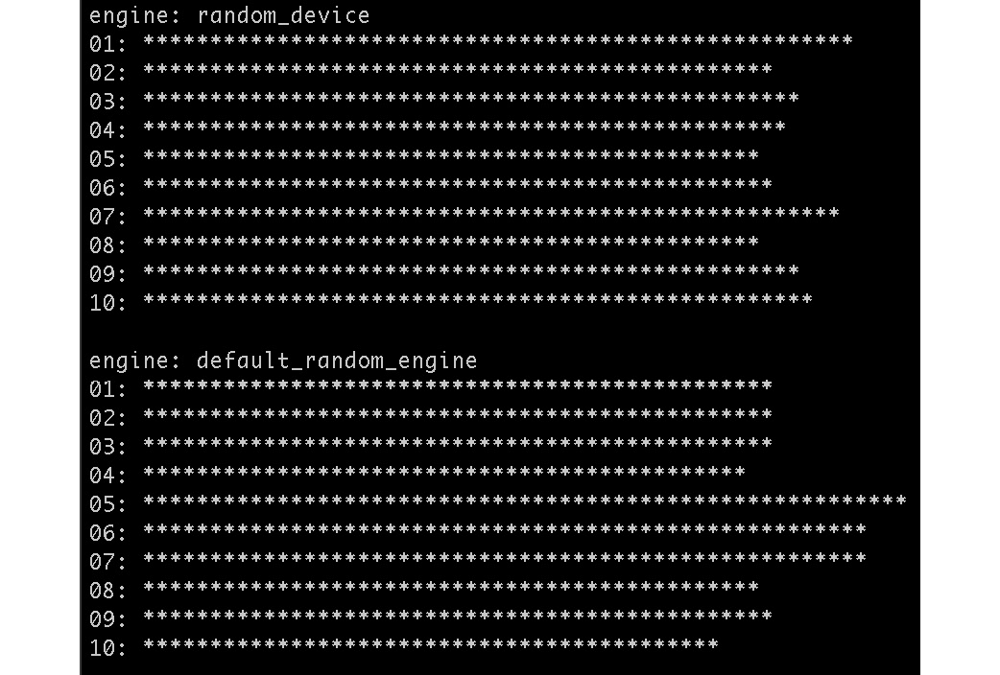
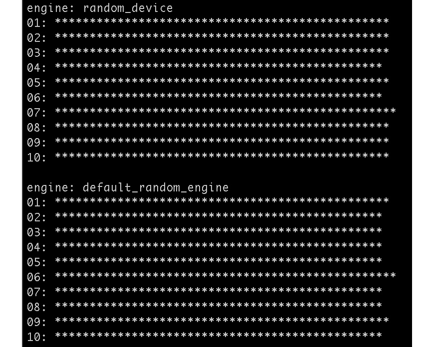

# 第八章：*第八章*：实用类

C++标准库包含了一系列为特定任务设计的实用类。其中一些是常见的，您可能已经在本书的其他食谱中看到了这些类。

本章涵盖了广泛的功能，包括时间测量、泛型类型、智能指针等，以下是一些食谱：

+   使用`std::optional`管理可选值

+   使用`std::any`进行类型安全

+   使用`std::variant`存储不同类型

+   使用`std::chrono`进行时间事件

+   使用折叠表达式处理可变参数元组

+   使用`std::unique_ptr`管理分配的内存

+   使用`std::shared_ptr`共享对象

+   使用弱指针与共享对象一起使用

+   共享托管对象成员

+   比较随机数生成器

+   比较随机数分布生成器

# 技术要求

本章的代码文件可以在 GitHub 上找到，链接为[`github.com/PacktPublishing/CPP-20-STL-Cookbook/tree/main/chap08`](https://github.com/PacktPublishing/CPP-20-STL-Cookbook/tree/main/chap08)。

# 使用`std::optional`管理可选值

随着 C++17 的引入，`std::optional`类包含一个*可选值*。

考虑这种情况，您有一个可能返回或不返回值的函数——例如，一个检查数字是否为*素数*但如果有第一个因子则返回它的函数。这个函数应该返回一个值或一个`bool`状态。我们可以创建一个`struct`来携带值和状态：

```cpp
struct factor_t {
    bool is_prime;
    long factor;
};
factor_t factor(long n) {
    factor_t r{};
    for(long i = 2; i <= n / 2; ++i) {
        if (n % i == 0) {
            r.is_prime = false;
            r.factor = i;
            return r;
        }
    }
    r.is_prime = true;
    return r;
}
```

这是一个笨拙的解决方案，但它有效，而且并不罕见。

使用`optional`类可以使它变得更加简单：

```cpp
optional<long> factor(long n) {
    for (long i = 2; i <= n / 2; ++i) {
        if (n % i == 0) return {i};
    }
    return {};
}
```

使用`optional`，我们可以返回一个值或非值。

我们可以这样调用它：

```cpp
long a{ 42 };
long b{ 73 };
auto x = factor(a);
auto y = factor(b);
if(x) cout << format("lowest factor of {} is {}\n", a, *x);
else cout << format("{} is prime\n", a);
if(y) cout << format("lowest factor of {} is {}\n", b, *y);
else cout << format("{} is prime\n", b);
```

我们的输出是：

```cpp
lowest factor of 42 is 2
73 is prime
```

`optional`类允许我们轻松返回可选值并轻松测试值。

## 如何做到这一点…

在本食谱中，我们将查看一些如何使用`optional`类的示例：

+   `optional`类相当简单。我们使用标准模板符号构造一个可选值：

    ```cpp
    optional<int> a{ 42 };
    cout << *a << '\n';
    ```

我们使用`*`指针解引用操作符访问`optional`的值。

输出：

```cpp
42
```

+   我们使用`optional`的`bool`操作符测试它是否有值：

如果`a`没有值被构造：

```cpp
optional<int> a{};
```

输出将反映`else`条件：

```cpp
no value
```

+   我们可以通过声明一个*类型别名*来进一步简化：

    ```cpp
    using oint = std::optional<int>;
    oint a{ 42 };
    oint b{ 73 };
    ```

+   如果我们想在`oint`对象上操作，并且结果也是`oint`对象，我们可以提供操作符重载：

    ```cpp
    oint operator+(const oint& a, const oint& b) {
        if(a && b) return *a + *b;
        else return {};
    }
    oint operator+(const oint& a, const int b) {
        if(a) return *a + b;
        else return {};
    }
    ```

现在，我们可以直接操作`oint`对象：

```cpp
auto sum{ a + b };
if(sum) {
    cout << format("{} + {} = {}\n", *a, *b, *sum);
} else {
    cout << "NAN\n";
}
```

输出：

```cpp
42 + 73 = 115
```

+   假设我们使用默认构造函数声明`b`：

    ```cpp
    oint b{};
    ```

现在，我们得到`else`分支的输出：

```cpp
NAN
```

## 它是如何工作的…

`std::optional`类是为了简洁而设计的。它为许多常见函数提供了操作符重载。它还包括用于进一步灵活性的成员函数。

`optional`类提供了一个`operator bool`重载，用于确定对象是否有值：

```cpp
optional<int> n{ 42 };
if(n) ... // has a value
```

或者，您可以使用`has_value()`成员函数：

```cpp
if(n.has_value()) ... // has a value
```

要访问值，您可以使用`operator*`重载：

```cpp
x = *n;  // * retruns the value
```

或者，您可以使用`value()`成员函数：

```cpp
x = n.value();  // * retruns the value
```

`reset()`成员函数销毁值并重置`optional`对象的状态：

```cpp
n.reset();      // no longer has a value
```

## 还有更多…

`optional`类通过`value()`方法提供异常支持：

```cpp
b.reset();
try {
    cout << b.value() << '\n';
} catch(const std::bad_optional_access& e) {
    cout << format("b.value(): {}\n", e.what());
}
```

输出：

```cpp
b.value(): bad optional access
```

重要提示

只有`value()`方法会抛出异常。对于无效值，`*`运算符的行为是未定义的。

# 使用`std::any`进行类型安全

C++17 引入的`std::any`类提供了一个类型安全的容器，用于存储任何类型的单个对象。

例如，这是一个默认构造的`any`对象：

```cpp
any x{};
```

此对象没有值。我们可以使用`has_value()`方法来测试这一点：

```cpp
if(x.has_value()) cout << "have value\n";
else cout << "no value\n";
```

输出：

```cpp
no value
```

我们使用赋值运算符给`any`对象赋值：

```cpp
x = 42;
```

现在，`any`对象有一个值和一个类型：

```cpp
if(x.has_value()) {
    cout << format("x has type: {}\n", x.type().name());
    cout << format("x has value: {}\n", any_cast<int>(x));
} else {
    cout << "no value\n";
}
```

输出：

```cpp
x has type: i
x has value: 42
```

`type()`方法返回一个`type_info`对象。`type_info::name()`方法返回一个 C 字符串中类型的实现定义名称。在这种情况下，对于 GCC，`i`表示`int`。

我们使用`any_cast<`*type*`>()`非成员函数来转换值以供使用。

我们可以用不同类型的不同值重新赋值`any`对象：

```cpp
x = "abc"s;
cout << format("x is type {} with value {}\n", 
    x.type().name(), any_cast<string>(x))
```

输出：

```cpp
x is type NSt7__cxx1112basic_string... with value abc
```

我已经将 GCC 中的长类型名缩写了，但你应该明白这个意思。曾经包含`int`的同一个`any`对象现在包含了一个 STL `string`对象。

`any`类的主要用途在于创建多态函数。让我们在这个菜谱中看看如何做到这一点：

## 如何做到这一点…

在这个菜谱中，我们将使用`any`类构建一个多态函数。多态函数是指可以接受不同类型参数的对象：

+   我们的多态函数接受一个`any`对象并打印其类型和值：

    ```cpp
    void p_any(const any& a) {
        if (!a.has_value()) {
            cout << "None.\n";
        } else if (a.type() == typeid(int)) {
            cout << format("int: {}\n", any_cast<int>(a));
        } else if (a.type() == typeid(string)) {
            cout << format("string: \"{}\"\n", 
                any_cast<const string&>(a));
        } else if (a.type() == typeid(list<int>)) {
            cout << "list<int>: ";
            for(auto& i : any_cast<const list<int>&>(a)) 
                cout << format("{} ", i);
            cout << '\n';
        } else {
            cout << format("something else: {}\n", 
                a.type().name());
        }
    }
    ```

`p_any()`函数首先检查对象是否有值。然后它将`type()`方法与各种类型进行比较，并为每种类型采取适当的行动。

在`any`类之前，我们不得不为这个函数编写四个不同的特殊化版本，而且我们仍然无法轻松处理默认情况。

+   我们像这样从`main()`函数中调用此函数：

    ```cpp
    p_any({});
    p_any(47);
    p_any("abc"s);
    p_any(any(list{ 1, 2, 3 }));
    p_any(any(vector{ 1, 2, 3 }));
    ```

输出：

```cpp
None.
int: 47
string: "abc"
list<int>: 1 2 3
something else: St6vectorIiSaIiEE
```

我们的多态函数以最少的代码处理各种类型。

## 它是如何工作的…

`std::any`的拷贝构造函数和赋值运算符使用*直接初始化*来创建目标对象的非`const`拷贝作为*包含*对象。包含对象的类型作为`typeid`对象单独存储。

一旦初始化，`any`对象具有以下方法：

+   `emplace()`替换包含的对象，在原地构造新对象。

+   `reset()`销毁包含的对象。

+   `has_value()`如果存在包含对象则返回`true`。

+   `type()`返回一个`typeid`对象，表示包含对象的类型。

+   `operator=()`通过*拷贝*或*移动*操作替换包含的对象。

`any`类还支持以下非成员函数：

+   `any_cast<T>()`，一个模板函数，提供了对包含对象的类型安全访问。

请记住，`any_cast<T>()`函数返回包含对象的副本。您可以使用`any_cast<T&>()`来返回引用。

+   `std::swap()`专门化了`std::swap`算法。

如果您尝试使用错误类型转换`any`对象，它将抛出`bad_any_cast`异常：

```cpp
try {
    cout << any_cast<int>(x) << '\n';
} catch(std::bad_any_cast& e) {
    cout << format("any: {}\n", e.what());
}
```

输出：

```cpp
any: bad any_cast
```

# 使用 std::variant 存储不同类型

C++17 中引入的`std::variant`类可以一次持有不同的值，每个值必须适应相同的分配内存空间。它在用于单个上下文中的替代类型持有方面很有用。

## 与原始联合结构的区别

`variant`类是一个*标记联合*。它与原始的`union`结构不同，因为在任何给定时间只能有一个类型有效。

从 C 继承而来的原始`union`类型是一种结构，其中相同的数可以以不同的类型访问。例如：

```cpp
union ipv4 {
    struct {
        uint8_t a; uint8_t b; uint8_t c; uint8_t d;
    } quad;
    uint32_t int32;
} addr;
addr.int32 = 0x2A05A8C0;
cout << format("ip addr dotted quad: {}.{}.{}.{}\n", 
    addr.quad.a, addr.quad.b, addr.quad.c, addr.quad.d);
cout << format("ip addr int32 (LE): {:08X}\n", addr.int32);
```

输出：

```cpp
ip addr dotted quad: 192.168.5.42
ip addr int32 (LE): 2A05A8C0
```

在这个例子中，`union`有两个成员，类型为`struct`和`uint32_t`，其中`struct`有四个`uint8_t`成员。这为我们提供了对相同的 32 位内存空间的两种不同视角。我们可以将相同的`ipv4`地址视为 32 位无符号整数（**小端**或**LE**）或四个 8 位无符号整数，使用常见的*点分十进制*表示法。这提供了一种在系统级别有用的位操作多态性。

`variant`的行为并不像那样。`variant`类是一个*标记联合*，其中每个数据都带有其类型的标记。如果我们存储一个值为`uint32_t`，我们只能将其作为`uint32_t`访问。这使得`variant`类型安全，但不是`union`的替代品。

## 如何做到这一点...

在这个菜谱中，我们展示了使用`std::variant`与各种物种的家庭宠物的小目录。

+   我们将从包含`Animal`的简单类开始：

    ```cpp
    class Animal {
        string_view _name{};
        string_view _sound{};
        Animal();
    public:
        Animal(string_view n, string_view s) 
            : _name{ n }, _sound{ s } {}
        void speak() const {
            cout << format("{} says {}\n", _name, _sound);
        }
        void sound(string_view s) {
            _sound = s;
        }
    };
    ```

动物的名称和动物发出的声音通过构造函数传入。

+   单个物种类从`Animal`继承：

    ```cpp
    class Cat : public Animal {
    public:
        Cat(string_view n) : Animal(n, "meow") {}
    };
    class Dog : public Animal {
    public:
        Dog(string_view n) : Animal(n, "arf!") {}
    };
    class Wookie : public Animal {
    public:
        Wookie(string_view n) : Animal(n, "grrraarrgghh!") {}
    };
    ```

这些类中的每一个都通过调用父构造函数来为其特定物种设置声音。

+   现在，我们可以在别名中定义我们的`variant`类型：

    ```cpp
    using v_animal = std::variant<Cat, Dog, Wookie>;
    ```

这个`variant`可以持有任何类型，`Cat`、`Dog`或`Wookie`。

+   在`main()`中，我们使用我们的`v_animal`别名作为类型创建一个`list`：

    ```cpp
    int main() {
        list<v_animal> pets{ 
            Cat{"Hobbes"}, Dog{"Fido"}, Cat{"Max"}, 
            Wookie{"Chewie"}
        };
        ...
    ```

列表中的每个元素都是`variant`定义中包含的类型。

+   `variant`类提供了几种不同的方式来访问元素。首先，我们将查看`visit()`函数。

`visit()`调用包含在`variant`中的对象的*函数对象*。首先，让我们定义一个接受我们任何宠物的函数对象：

```cpp
struct animal_speaks {
    void operator()(const Dog& d) const { d.speak(); }
    void operator()(const Cat& c) const { c.speak(); }
    void operator()(const Wookie& w) const { 
      w.speak(); }
};
```

这是一个简单的函数对象类，为每个`Animal`子类提供了重载。我们用`visit()`调用它，每个我们的`list`元素：

```cpp
for (const v_animal& a : pets) {
    visit(animal_speaks{}, a);
}
```

我们得到这个输出：

```cpp
Hobbes says meow
Fido says arf!
Max says meow
Chewie says grrraarrgghh!
```

+   `variant`类还提供了一个`index()`方法：

    ```cpp
    for(const v_animal &a : pets) {
        auto idx{ a.index() };
        if(idx == 0) get<Cat>(a).speak();
        if(idx == 1) get<Dog>(a).speak();
        if(idx == 2) get<Wookie>(a).speak();
    }
    ```

输出：

```cpp
Hobbes says meow
Fido says arf!
Max says meow
Chewie says grrraarrgghh!
```

每个`variant`对象都是基于模板参数中声明的类型顺序进行索引的。我们的`v_animal`类型是用`std::variant<Cat, Dog, Wookie>`定义的，这些类型按顺序索引为`0` – `2`。

+   `get_if<T>()` 函数测试给定元素与一个类型是否匹配：

    ```cpp
    for (const v_animal& a : pets) {
        if(const auto c{ get_if<Cat>(&a) }; c) {
            c->speak();
        } else if(const auto d{ get_if<Dog>(&a) }; d) {
            d->speak();
        } else if(const auto w{ get_if<Wookie>(&a) }; w) {
            w->speak();
        }
    }
    ```

输出结果：

```cpp
Hobbes says meow
Fido says arf!
Max says meow
Chewie says grrraarrgghh!
```

`get_if<T>()` 函数在元素类型匹配 `T` 时返回一个指针；否则，返回 `nullptr`。

+   最后，`holds_alternative<T>()` 函数返回 `true` 或 `false`。我们可以使用这个函数来测试一个类型与一个元素是否匹配，而不返回该元素：

    ```cpp
    size_t n_cats{}, n_dogs{}, n_wookies{};
    for(const v_animal& a : pets) {
        if(holds_alternative<Cat>(a)) ++n_cats;
        if(holds_alternative<Dog>(a)) ++n_dogs;
        if(holds_alternative<Wookie>(a)) ++n_wookies;
    }
    cout << format("there are {} cat(s), "
                   "{} dog(s), "
                   "and {} wookie(s)\n",
                   n_cats, n_dogs, n_wookies);
    ```

输出结果：

```cpp
there are 2 cat(s), 1 dog(s), and 1 wookie(s)
```

## 它是如何工作的…

`std::variant` 类是一个单对象容器。`variant<X, Y, Z>` 的实例必须恰好包含一个 `X`、`Y` 或 `Z` 类型的对象。它同时包含其当前对象的值和类型。

`index()` 方法告诉我们当前对象的类型：

```cpp
if(v.index() == 0) // if variant is type X
```

`holds_alternative<T>()` 非成员函数如果 `T` 是当前对象的类型，则返回 `true`：

```cpp
if(holds_alternative<X>(v))  // if current variant obj is type X
```

我们可以使用 `get()` 非成员函数来检索当前对象：

```cpp
auto o{ get<X>(v) };  // current variant obj must be type X
```

我们可以使用 `get_if()` 非成员函数将类型测试和检索结合起来：

```cpp
auto* p{ get_if<X>(v) };  // nullptr if current obj not type X
```

`visit()` 非成员函数使用当前 `variant` 对象作为其单个参数调用一个可调用对象：

```cpp
visit(f, v);  // calls f(v) with current variant obj
```

`visit()` 函数是检索对象而不测试其类型的唯一方法。结合一个可以处理每种类型的函数对象，这可以非常灵活：

```cpp
struct animal_speaks {
    void operator()(const Dog& d) const { d.speak(); }
    void operator()(const Cat& c) const { c.speak(); }
    void operator()(const Wookie& v) const { v.speak(); }
};
main() {
    for (const v_animal& a : pets) {
        visit(animal_speaks{}, a);
    } 
}
```

输出结果：

```cpp
Hobbes says meow
Fido says arf!
Max says meow
Chewie says grrraarrgghh!
```

# 使用 std::chrono 计时事件

`std::chrono` 库提供了测量和报告时间和间隔的工具。

许多这些类和函数是在 C++11 中引入的。C++20 有显著的变化和更新，但在撰写本文时，许多这些更新在我测试的系统上尚未实现。

使用 `chrono` 库，本食谱探讨了计时事件的技巧。

## 如何做到这一点…

`system_clock` 类用于报告当前日期和时间。`steady_clock` 和 `high_resolution_clock` 类用于计时事件。让我们看看这些时钟之间的区别：

+   由于这些名称可能很长且难以处理，我们将在整个过程中使用一些类型别名：

    ```cpp
    using std::chrono::system_clock;
    using std::chrono::steady_clock;
    using std::chrono::high_resolution_clock;
    using std::chrono::duration;
    using seconds = duration<double>;
    using milliseconds = duration<double, std::milli>;
    using microseconds = duration<double, std::micro>;
    using fps24 = duration<unsigned long, std::ratio<1, 24>>;
    ```

`duration` 类表示两个时间点之间的间隔。这些别名方便使用不同的间隔。

+   我们可以使用 `system_clock` 类来获取当前时间和日期：

    ```cpp
    auto t = system_clock::now();
    cout << format("system_clock::now is {:%F %T}\n", t);
    ```

`system_clock::now()` 函数返回一个 `time_point` 对象。`<chrono>` 库为 `time_point` 提供了一个 `format()` 特化，它使用 `strftime()` 格式说明符。

输出结果为：

```cpp
system_clock::now is 2022-02-05 13:52:15
```

`<iomanip>` 头文件包括 `put_time()`，它类似于 `strftime()` 用于 `ostream`：

```cpp
std::time_t now_t = system_clock::to_time_t(t);
cout << "system_clock::now is " 
     << std::put_time(std::localtime(&now_t), "%F %T") 
     << '\n';
```

`put_time()` 接受一个指向 C 风格 `time_t*` 值的指针。`system_clock::to_time_t` 将 `time_point` 对象转换为 `time_t`。

这与我们的 `format()` 示例输出相同：

```cpp
system_clock::now is 2022-02-05 13:52:15
```

+   我们也可以使用 `system_clock` 来计时一个事件。首先，我们需要一个可以计时的东西。这里有一个计算素数的函数：

    ```cpp
    constexpr uint64_t MAX_PRIME{ 0x1FFFF }
    uint64_t count_primes() {
        constexpr auto is_prime = [](const uint64_t n) {
            for(uint64_t i{ 2 }; i < n / 2; ++i) {
                if(n % i == 0) return false;
            }
            return true;
        };
        uint64_t count{ 0 };
        uint64_t start{ 2 };
        uint64_t end{ MAX_PRIME };
        for(uint64_t i{ start }; i <= end ; ++i) {
            if(is_prime(i)) ++count;
       }
       return count;
    }
    ```

此函数计算 2 到 `0x1FFFF`（131,071）之间的素数，这在大多数现代系统上应该需要几秒钟。

+   现在，我们编写一个 `timer` 函数来计时我们的 `count_primes()`：

    ```cpp
    seconds timer(uint64_t(*f)()) {
        auto t1{ system_clock::now() };
        uint64_t count{ f() };
        auto t2{ system_clock::now() };
        seconds secs{ t2 - t1 };
        cout << format("there are {} primes in range\n", 
          count);
        return secs;
    }
    ```

此函数接受一个函数 `f` 并返回 `duration<double>`。我们使用 `system_clock::now()` 标记 `f()` 调用之前和之后的时间。我们取两个时间之间的差值，并以 `duration` 对象的形式返回它。

+   我们可以从 `main()` 中调用我们的 `timer()`，如下所示：

    ```cpp
    int main() {
        auto secs{ timer(count_primes) };
        cout << format("time elapsed: {:.3f} seconds\n", 
            secs.count());
        ...
    ```

这将 `count_primes()` 函数传递给 `timer()` 并将 `duration` 对象存储在 `secs` 中。

输出：

```cpp
there are 12252 primes in range
time elapsed: 3.573 seconds
```

`duration` 对象上的 `count()` 方法返回指定单位内的持续时间 – 在这种情况下，`double`，表示持续时间的 *秒*。

这是在运行 *Debian* 和 GCC 的虚拟机上运行的。确切时间会因不同系统而异。

+   `system_clock` 类旨在提供当前的 *系统时钟* 时间。虽然其分辨率可能支持计时目的，但它不保证是 *单调的*。换句话说，它可能不会始终提供一致的 *滴答*（计时间隔）。

`chrono` 库在 `steady_clock` 中提供了一个更合适的时钟。它具有与 `system_clock` 相同的接口，但提供了更可靠的滴答，适用于计时目的：

```cpp
seconds timer(uint64_t(*f)()) {
    auto t1{ steady_clock::now() };
    uint64_t count{ f() };
    auto t2{ steady_clock::now() };
    seconds secs{ t2 - t1 };
    cout << format("there are {} primes in range\n", 
      count);
    return secs;
}
```

`steady_clock` 是为了提供可靠一致的单调滴答而设计的，适用于计时事件。它使用相对时间参考，因此对于系统时钟时间来说没有用。虽然 `system_clock` 从固定的时间点（1970 年 1 月 1 日，00:00 UTC）开始测量，但 `steady_clock` 使用相对时间。

另一个选项是 `high_resolution_clock`，它提供了给定系统上可用的最短滴答周期，但不是在不同实现中一致实现的。它可能是 `system_clock` 或 `steady_clock` 的别名，并且可能或可能不是单调的。`high_resolution_clock` 不建议用于通用用途。

+   我们的 `timer()` 函数返回 `seconds`，它是 `duration<double>` 的别名：

    ```cpp
    using seconds = duration<double>;
    ```

持续时间类接受一个可选的第二模板参数，一个 `std::ratio` 类：

```cpp
template<class Rep, class Period = std::ratio<1>>
class duration;
```

`<chrono>` 头文件提供了许多十进制比率的便利类型，包括 `milli` 和 `micro`：

```cpp
using milliseconds = duration<double, std::milli>;
using microseconds = duration<double, std::micro>;
```

如果我们需要其他东西，我们可以提供自己的：

```cpp
using fps24 = duration<unsigned long, std::ratio<1, 24>>;
```

`fps24` 表示以每秒 24 帧的标准拍摄的电影帧数。该比率是秒的 1/24。

这使我们能够轻松地在不同的持续时间范围内进行转换：

```cpp
cout << format("time elapsed: {:.3f} sec\n", secs.count());
cout << format("time elapsed: {:.3f} ms\n", 
    milliseconds(secs).count());
cout << format("time elapsed: {:.3e} μs\n", 
    microseconds(secs).count());
cout << format("time elapsed: {} frames at 24 fps\n", 
    floor<fps24>(secs).count());
```

输出：

```cpp
time elapsed: 3.573 sec
time elapsed: 3573.077 ms
time elapsed: 3.573e+06 μs
time elapsed: 85 frames at 24 fps
```

由于 `fps24` 别名使用 `unsigned long` 而不是 `double`，需要进行类型转换。`floor` 函数通过丢弃小数部分来实现这一点。在此上下文中，`round()` 和 `ceil()` 函数也是可用的。

+   为了方便，`chrono` 库为标准的 `duration` 比率提供了 `format()` 特殊化：

    ```cpp
    cout << format("time elapsed: {:.3}\n", secs);
    cout << format("time elapsed: {:.3}\n", milliseconds(secs));
    cout << format("time elapsed: {:.3}\n", microseconds(secs));
    ```

输出：

```cpp
time elapsed: 3.573s
time elapsed: 3573.077ms
time elapsed: 3573076.564μs
```

这些结果将因不同的实现而异。

## 它是如何工作的...

`chrono` 库有两个主要部分，*时钟* 类和 `duration` 类。

### 时钟类

时钟类包括：

+   `system_clock` – 提供系统时钟时间。

+   `steady_clock` – 提供了保证单调的持续时间测量滴答。

+   `high_resolution_clock`——提供最短的可用滴答周期。在某些系统上可能是`system_clock`或`steady_clock`的别名。

我们使用`system_clock`来显示当前时间和日期。我们使用`steady_clock`来测量间隔。

每个时钟类都有一个`now()`方法，它返回`time_point`，表示时钟的当前值。`now()`是一个静态成员函数，因此不需要实例化对象就可以调用：

```cpp
auto t1{ steady_clock::now() };
```

### `std::duration`类

`duration`类用于存储时间间隔——即两个`time_point`对象之间的差异。它通常使用`time_point`对象的减法运算符（`-`）构造。

```cpp
duration<double> secs{ t2 - t1 };
```

`time_point`减法运算符同时是`duration`的构造函数：

```cpp
template<class C, class D1, class D2>
constexpr duration<D1,D2>
operator-( const time_point<C,D1>& pt_lhs,
    const time_point<C,D2>& pt_rhs );
```

`duration`类有用于类型表示的模板参数和一个`ratio`对象：

```cpp
template<class Rep, class Period = std::ratio<1>>
class duration;
```

`Period`模板参数默认为 1:1 的`ratio`，即秒。

该库提供了`ratio`别名（如`micro`和`milli`），用于从`atto`（1/1,000,000,000,000,000,000）到`exa`（1,000,000,000,000,000,000/1）的 10 的幂。这允许我们创建标准持续时间，就像我们在示例中所做的那样：

```cpp
using milliseconds = duration<double, std::milli>;
using microseconds = duration<double, std::micro>;
```

`count()`方法给我们的是`Rep`类型的持续时间：

```cpp
constexpr Rep count() const;
```

这使我们能够轻松访问持续时间以进行显示或其他目的：

```cpp
cout << format("duration: {}\n", secs.count());
```

# 使用折叠表达式处理可变元组

`std::tuple`类本质上是一个更复杂、不太方便的`struct`。`tuple`的接口很繁琐，尽管*类模板参数推导*和*结构化绑定*使其变得稍微容易一些。

我倾向于在大多数应用中使用`struct`而不是`tuple`，有一个显著的例外：`tuple`的一个真正优势是它可以在可变上下文中与*折叠表达式*一起使用。

## 折叠表达式

设计目的是为了使扩展可变参数包更容易，*折叠表达式*是 C++17 的一个新特性。在折叠表达式之前，扩展参数包需要一个递归函数：

```cpp
template<typename T>
void f(T final) {
    cout << final << '\n';
}
template<typename T, typename... Args>
void f(T first, Args... args) {
    cout << first;
    f(args...);
}
int main() {
    f("hello", ' ', 47, ' ', "world");
}
```

输出：

```cpp
hello 47 world
```

使用折叠表达式，这要简单得多：

```cpp
template<typename... Args>
void f(Args... args) {
    (cout << ... << args);
    cout << '\n';
}
```

输出：

```cpp
hello 47 world
```

有四种类型的折叠表达式：

+   一元右折叠：`(args op ...)`

+   一元左折叠：`(... op args)`

+   二元右折叠：`(args op ... op init)`

+   二元左折叠：`(init op ... op args)`

上面示例中的表达式是一个*二元左折叠*：

```cpp
(cout << ... << args);
```

这将展开为：

```cpp
cout << "hello" << ' ' << 47 << ' ' << "world";
```

折叠表达式在许多用途中都非常方便。让我们看看我们如何使用它们与元组一起。

## 如何做到这一点...

在这个菜谱中，我们将创建一个模板函数，它对一个具有不同数量和类型的元素元组进行操作：

+   这个菜谱的核心是一个函数，它接受一个未知大小和类型的元组，并使用`format()`打印每个元素：

    ```cpp
    template<typename... T>
    constexpr void print_t(const tuple<T...>& tup) {
        auto lpt =
            [&tup] <size_t... I> 
              (std::index_sequence<I...>)
                constexpr {
                (..., ( cout <<
                    format((I? ", {}" : "{}"), 
                      get<I>(tup))
                ));
                cout << '\n';
            };
        lpt(std::make_index_sequence<sizeof...(T)>());
    }
    ```

这个函数的核心在于 lambda 表达式。它使用`index_sequence`对象生成一个索引值的参数包。然后我们使用折叠表达式调用每个索引值的`get<I>`。模板 lambda 需要 C++20。

你可以用一个单独的函数来代替 lambda 表达式，但我喜欢将其保持在单个作用域内。

+   我们现在可以从`main()`函数中用各种元组来调用这个函数：

    ```cpp
    int main() {
        tuple lables{ "ID", "Name", "Scale" };
        tuple employee{ 123456, "John Doe", 3.7 };
        tuple nums{ 1, 7, "forty-two", 47, 73L, -111.11 };

        print_t(lables);
        print_t(employee);
        print_t(nums);
    }
    ```

输出：

```cpp
ID, Name, Scale
123456, John Doe, 3.7
1, 7, forty-two, 47, 73, -111.11
```

## 它是如何工作的…

`tuple`的挑战在于其限制性的接口。你可以使用`std::tie()`、结构化绑定或`std::get<>`函数来检索元素。如果你不知道`tuple`中元素的数量和类型，这些技术都没有用。

我们通过使用`index_sequence`类来克服这个限制。`index_sequence`是`integer_sequence`的一个特化，它提供了一个`size_t`元素的参数包，我们可以用它来索引我们的`tuple`。我们通过调用`make_index_sequence`来设置 lambda 中的参数包，以调用我们的 lambda 函数：

```cpp
lpt(std::make_index_sequence<sizeof...(T)>());
```

模板 lambda 是用`get()`函数的`size_t`索引参数包构建的：

```cpp
[&tup] <size_t... I> (std::index_sequence<I...>) constexpr {
   ...
};
```

`get()`函数将索引值作为模板参数。我们使用一个一元左折叠表达式来调用`get<I>()`：

```cpp
(..., ( cout << format("{} ", std::get<I>(tup))));
```

折叠表达式将函数参数包中的每个元素取出来，并应用逗号运算符。逗号运算符的右侧有一个`format()`函数，它打印元组中的每个元素。

这使得推断元组中的元素数量成为可能，使其在可变参数上下文中可用。请注意，与模板函数一般一样，编译器将为`tuple`参数的每个组合生成此函数的单独特化。

## 还有更多…

我们可以用这种技术做其他任务。例如，这里有一个函数，它返回未知大小的`tuple`中所有`int`值的总和：

```cpp
template<typename... T>
constexpr int sum_t(const tuple<T...>& tup) {
    int accum{};
    auto lpt =
        [&tup, &accum] <size_t... I> 
          (std::index_sequence<I...>) 
        constexpr {
            (..., ( 
                accum += get<I>(tup)
            ));
        };
    lpt(std::make_index_sequence<sizeof...(T)>());
    return accum;
}
```

我们可以用不同数量的`int`值的`tuple`对象来调用这个函数：

```cpp
tuple ti1{ 1, 2, 3, 4, 5 };
tuple ti2{ 9, 10, 11, 12, 13, 14, 15 };
tuple ti3{ 47, 73, 42 };
auto sum1{ sum_t(ti1) };
auto sum2{ sum_t(ti2) };
auto sum3{ sum_t(ti3) };
cout << format("sum of ti1: {}\n", sum1);
cout << format("sum of ti2: {}\n", sum2);
cout << format("sum of ti3: {}\n", sum3);
```

输出：

```cpp
sum of ti1: 15
sum of ti2: 84
sum of ti3: 162
```

# 使用 std::unique_ptr 管理分配的内存

*智能指针*是管理分配的*堆内存*的绝佳工具。

堆内存是由 C 函数`malloc()`和`free()`在最低级别管理的。`malloc()`从堆中分配一块内存，而`free()`将其返回到堆中。这些函数不执行初始化，也不调用构造函数或析构函数。如果你没有通过调用`free()`将分配的内存返回到堆中，其行为是未定义的，通常会导致内存泄漏和安全漏洞。

C++提供了`new`和`delete`运算符来分配和释放堆内存，代替`malloc()`和`free()`。`new`和`delete`运算符调用对象构造函数和析构函数，但仍然不管理内存。如果你使用`new`分配内存，而没有使用`delete`释放它，你将导致内存泄漏。

C++14 引入的智能指针符合**资源获取即初始化**（**RAII**）习惯用法。这意味着当为对象分配内存时，会调用该对象的构造函数。当调用对象的析构函数时，内存会自动返回到堆中。

例如，当我们使用`make_unique()`创建一个新的智能指针时：

```cpp
{   // beginning of scope
    auto p = make_unique<Thing>(); // memory alloc’d,
                                   // ctor called
    process_thing(p);   // p is unique_ptr<Thing>
}   // end of scope, dtor called, memory freed
```

`make_unique()` 为 `Thing` 对象分配内存，调用 `Thing` 的默认构造函数，构造一个 `unique_ptr<Thing>` 对象，并返回该 `unique_ptr`。当 `p` 超出作用域时，调用 `Thing` 的析构函数，并将内存自动返回到堆中。

除了内存管理外，智能指针的工作方式与原始指针非常相似：

```cpp
auto x = *p;  // *p derefs the pointer, returns Thing object
auto y = p->thname; // p-> derefs the pointer, returns member
```

`unique_ptr` 是一种智能指针，它只允许指针存在一个实例。它可以被移动，但不能被复制。让我们更详细地看看如何使用 `unique_ptr`。

## 如何做到...

在这个菜谱中，我们通过一个在构造函数和析构函数被调用时打印的演示类来检查 `std::unique_ptr`。

+   首先，我们将创建一个简单的演示类：

    ```cpp
    struct Thing {
        string_view thname{ "unk" };
        Thing() {
            cout << format("default ctor: {}\n", thname);
        }
        Thing(const string_view& n) : thname(n) {
            cout << format("param ctor: {}\n", thname);
        }
        ~Thing() {
            cout << format("dtor: {}\n", thname);
        }
    };
    ```

这个类有一个默认构造函数、一个参数化构造函数和一个析构函数。每个都有简单的打印语句来告诉我们调用了什么。

+   当我们仅构造一个 `unique_ptr` 时，它不会分配内存或构造一个托管对象：

    ```cpp
    int main() {
        unique_ptr<Thing> p1;
        cout << "end of main()\n";
    }
    ```

输出：

```cpp
end of main()
```

+   当我们使用 `new` 运算符时，它会分配内存并构造一个 `Thing` 对象：

    ```cpp
    int main() {
        unique_ptr<Thing> p1{ new Thing };
        cout << "end of main()\n";
    }
    ```

输出：

```cpp
default ctor: unk
end of main()
dtor: unk
```

`new` 运算符通过调用默认构造函数来构造 `Thing` 对象。当智能指针达到其作用域的末尾时，`unique_ptr<Thing>` 析构函数调用 `Thing` 析构函数。

`Thing` 的默认构造函数没有初始化 `thname` 字符串，保留其默认值，`"unk"`。

+   我们可以使用 `make_unique()` 来得到相同的结果：

    ```cpp
    int main() {
        auto p1 = make_unique<Thing>();
        cout << "end of main()\n";
    }
    ```

输出：

```cpp
default ctor: unk
end of main()
dtor: unk
```

`make_unique()` 辅助函数负责内存分配并返回一个 `unique_ptr` 对象。这是构造 `unique_ptr` 的推荐方法。

+   你传递给 `make_unique()` 的任何参数都用于构造目标对象：

    ```cpp
    int main() {
        auto p1 = make_unique<Thing>("Thing 1") };
        cout << "end of main()\n";
    }
    ```

输出：

```cpp
param ctor: Thing 1
end of main()
dtor: Thing 1
```

参数化构造函数将值赋给 `thname`，因此我们的 `Thing` 对象现在是 `"Thing 1"`。

+   让我们编写一个接受 `unique_ptr<Thing>` 参数的函数：

    ```cpp
    void process_thing(unique_ptr<Thing> p) {
        if(p) cout << format("processing: {}\n", 
          p->thname);
        else cout << "invalid pointer\n";
    }
    ```

如果我们尝试将 `unique_ptr` 传递给这个函数，我们会得到编译器错误：

```cpp
process_thing(p1);
```

编译器错误：

```cpp
error: use of deleted function...
```

这是因为函数调用试图复制 `unique_ptr` 对象，但 `unique_ptr` 的复制构造函数被 *删除* 以防止复制。解决方案是让函数接受一个 `const&` 引用：

```cpp
void process_thing(const unique_ptr<Thing>& p) {
    if(p) cout << format("processing: {}\n", 
      p->thname);
    else cout << "invalid pointer\n";
}
```

输出：

```cpp
param ctor: Thing 1
processing: Thing 1
end of main()
dtor: Thing 1
```

+   我们可以用临时对象调用 `process_thing()`，该临时对象在函数作用域结束时立即被销毁：

    ```cpp
    int main() {
        auto p1{ make_unique<Thing>("Thing 1") };
        process_thing(p1);
        process_thing(make_unique<Thing>("Thing 2"));
        cout << "end of main()\n";
    }
    ```

输出：

```cpp
param ctor: Thing 1
processing: Thing 1
param ctor: Thing 2
processing: Thing 2
dtor: Thing 2
end of main()
dtor: Thing 1
```

## 它是如何工作的...

一个 *智能指针* 简单来说是一个对象，它提供了一个指针接口，同时拥有和管理另一个对象资源。

`unique_ptr` 类通过其删除的复制构造函数和复制赋值运算符而与众不同，这防止了智能指针被复制。

你不能复制一个 `unique_ptr`：

```cpp
auto p2 = p1;
```

编译器错误：

```cpp
error: use of deleted function...
```

但你可以移动一个 `unique_ptr`：

```cpp
auto p2 = std::move(p1);
process_thing(p1);
process_thing(p2);
```

移动后，`p1` 无效，而 `p2` 是 `"Thing 1"`。

输出：

```cpp
invalid pointer
processing: Thing 1
end of main()
dtor: Thing 1
```

`unique_ptr` 接口有一个重置指针的方法：

```cpp
p1.reset();  // pointer is now invalid
process_thing(p1);
```

输出：

```cpp
dtor: Thing 1
invalid pointer
```

`reset()` 方法也可以用来用相同类型的另一个对象替换托管对象：

```cpp
p1.reset(new Thing("Thing 3"));
process_thing(p1);
```

输出：

```cpp
param ctor: Thing 3
dtor: Thing 1
processing: Thing 3
```

# 与 std::shared_ptr 共享对象

`std::shared_ptr`类是一个智能指针，它拥有其管理对象并维护一个*引用计数*来跟踪副本。这个配方探讨了使用`shared_ptr`来管理内存的同时共享指针副本。

注意

关于智能指针的更多详细信息，请参阅本章前面的*使用 std::unique_ptr 管理分配的内存*配方介绍。

## 如何做…

在这个配方中，我们通过一个演示类来检查`std::shared_ptr`，该类在其构造函数和析构函数被调用时打印信息：

+   首先，我们创建一个简单的演示类：

    ```cpp
    struct Thing {
        string_view thname{ "unk" };
        Thing() {
            cout << format("default ctor: {}\n", thname);
        }
        Thing(const string_view& n) : thname(n) {
            cout << format("param ctor: {}\n", thname);
        }
        ~Thing() {
            cout << format("dtor: {}\n", thname);
        }
    };
    ```

这个类有一个默认构造函数、一个带参数的构造函数和一个析构函数。每个都有简单的打印语句来告诉我们调用了什么。

+   `shared_ptr`类的工作方式与其它智能指针非常相似，它可以使用`new`运算符或其辅助函数`make_shared()`来构造：

    ```cpp
    int main() {
        shared_ptr<Thing> p1{ new Thing("Thing 1") };
        auto p2 = make_shared<Thing>("Thing 2");
        cout << "end of main()\n";
    }
    ```

输出：

```cpp
param ctor: Thing 1
param ctor: Thing 2
end of main()
dtor: Thing 2
dtor: Thing 1
```

建议使用`make_shared()`函数，因为它管理构造过程，并且更不容易出错。

与其他智能指针一样，当指针超出作用域时，管理对象被销毁，其内存返回到堆中。

+   这里有一个函数来检查`shared_ptr`对象的引用计数：

    ```cpp
    void check_thing_ptr(const shared_ptr<Thing>& p) {
        if(p) cout << format("{} use count: {}\n", 
            p->thname, p.use_count());
        else cout << "invalid pointer\n";
    }
    ```

`thname`是`Thing`类的一个成员，因此我们通过指针使用`p->`成员解引用运算符来访问它。`use_count()`函数是`shared_ptr`类的一个成员，因此我们使用`p.`对象成员运算符来访问它。

让我们用我们的指针来调用这个函数：

```cpp
check_thing_ptr(p1);
check_thing_ptr(p2);
```

输出：

```cpp
Thing 1 use count: 1
Thing 2 use count: 1
```

+   当我们复制我们的指针时，引用计数会增加，但不会构造新的对象：

    ```cpp
    cout << "make 4 copies of p1:\n";
    auto pa = p1;
    auto pb = p1;
    auto pc = p1;
    auto pd = p1;
    check_thing_ptr(p1);
    ```

输出：

```cpp
make 4 copies of p1:
Thing 1 use count: 5
```

+   当我们检查其他任何副本时，我们得到相同的结果：

    ```cpp
    check_thing_ptr(pa);
    check_thing_ptr(pb);
    check_thing_ptr(pc);
    check_thing_ptr(pd);
    ```

输出：

```cpp
Thing 1 use count: 5
Thing 1 use count: 5
Thing 1 use count: 5
Thing 1 use count: 5
```

每个指针报告相同的引用计数。

+   当副本超出作用域时，它们被销毁，引用计数减少：

    ```cpp
    {   // new scope
        cout << "make 4 copies of p1:\n";
        auto pa = p1;
        auto pb = p1;
        auto pc = p1;
        auto pd = p1;
        check_thing_ptr(p1);
    }   // end of scope
    check_thing_ptr(p1);
    ```

输出：

```cpp
make 4 copies of p1:
Thing 1 use count: 5
Thing 1 use count: 1
```

+   销毁一个副本会减少引用计数，但不会销毁管理对象。对象在最后一个副本超出作用域且引用计数达到零时被销毁：

    ```cpp
    {    
        cout << "make 4 copies of p1:\n";
        auto pa = p1;
        auto pb = p1;
        auto pc = p1;
        auto pd = p1;
        check_thing_ptr(p1);
        pb.reset();
        p1.reset();
        check_thing_ptr(pd);
    }   // end of scope
    ```

输出：

```cpp
make 4 copies of p1:
Thing 1 use count: 5
Thing 1 use count: 3
dtor: Thing 1
```

销毁`pb`（副本）和`p1`（原始），留下三个指针副本（`pa`、`bc`和`pd`），因此管理对象仍然存在。

剩下的三个指针副本在它们被创建的作用域结束时被销毁。然后对象被销毁，其内存返回到堆中。

## 它是如何工作的…

`shared_ptr`类以其对同一管理对象的多个指针的管理而区别于其他智能指针。

`shared_ptr`对象的复制构造函数和复制赋值运算符增加引用计数。析构函数减少引用计数，直到它达到零，然后销毁管理对象，并将其内存返回到堆中。

`shared_ptr` 类管理托管对象和一个堆分配的 *控制块*。控制块包含使用计数器以及其他维护对象。控制块与托管对象一起被管理和共享。这允许原始 `shared_ptr` 对象将其控制权转让给其副本，以便最后一个剩余的 `shared_ptr` 可以管理对象及其内存。

# 使用共享对象与弱指针

严格来说，`std::weak_ptr` 不是一个智能指针。相反，它是一个 *观察者*，与 `shared_ptr` 协作工作。`weak_ptr` 对象本身不持有指针。

有一些情况下，`shared_ptr` 对象可能会创建悬垂指针或竞态条件，这可能导致内存泄漏或其他问题。解决方案是使用 `weak_ptr` 对象与 `shared_ptr` 一起使用。

## 如何做到这一点…

在这个菜谱中，我们通过一个演示类来检查 `std::weak_ptr` 与 `std::shared_ptr` 的使用，该类在其构造函数和析构函数被调用时打印信息。

+   我们从之前用来演示 `shared_ptr` 和 `unique_ptr` 的相同类开始：

    ```cpp
    struct Thing {
        string_view thname{ "unk" };
        Thing() {
            cout << format("default ctor: {}\n", thname);
        }
        Thing(const string_view& n) : thname(n) {
            cout << format("param ctor: {}\n", thname);
        }
        ~Thing() {
            cout << format("dtor: {}\n", thname);
        }
    };
    ```

这个类有一个默认构造函数、一个参数化构造函数和一个析构函数。每个都有简单的打印语句来告诉我们调用了什么。

+   我们还需要一个函数来检查一个 `weak_ptr` 对象：

    ```cpp
    void get_weak_thing(const weak_ptr<Thing>& p) {
        if(auto sp = p.lock()) cout << 
            format("{}: count {}\n", sp->thname, 
              p.use_count());
        else cout << "no shared object\n";
    }
    ```

`weak_ptr` 本身不作为指针操作；它需要使用 `shared_ptr`。`lock()` 函数返回一个 `shared_ptr` 对象，然后可以使用它来访问托管对象。

+   因为 `weak_ptr` 需要一个关联的 `shared_ptr`，所以我们将在 `main()` 中创建一个 `shared_ptr<Thing>` 对象。当我们创建一个没有分配 `shared_ptr` 的 `weak_ptr` 对象时，`expired` 标志最初被设置为：

    ```cpp
    int main() {
        auto thing1 = make_shared<Thing>("Thing 1");
        weak_ptr<Thing> wp1;
        cout << format("expired: {}\n", wp1.expired());
        get_weak_thing(wp1);
    }
    ```

输出：

```cpp
param ctor: Thing 1
expired: true
no shared object
```

`make_shared()` 函数分配内存并构造一个 `Thing` 对象。

`weak_ptr<Thing>` 声明构建一个没有分配 `shared_ptr` 的 `weak_ptr` 对象。因此，当我们检查 `expired` 标志时，它是 `true`，表示没有关联的 `shared_ptr`。

`get_weak_thing()` 函数无法获取锁，因为没有可用的 `shared_ptr`。

+   当我们将 `shared_ptr` 分配给 `weak_ptr` 时，我们可以使用 `weak_ptr` 来访问托管对象：

    ```cpp
    wp1 = thing1;
    get_weak_thing(wp1);
    ```

输出：

```cpp
Thing 1: count 2
```

`get_weak_thing()` 函数现在能够获取锁并访问托管对象。`lock()` 方法返回一个 `shared_ptr`，而 `use_count()` 反映了现在有一个额外的 `shared_ptr` 正在管理 `Thing` 对象。

新的 `shared_ptr` 在 `get_weak_thing()` 范围结束时被销毁。

+   `weak_ptr` 类有一个构造函数，它接受一个 `shared_ptr` 以进行一步构造：

    ```cpp
    weak_ptr<Thing> wp2(thing1);
    get_weak_thing(wp2);
    ```

输出：

```cpp
Thing 1: count 2
```

`use_count()` 再次变为 `2`。记住，之前的 `shared_ptr` 在其封装的 `get_weak_thing()` 范围结束时已被销毁。

+   当我们重置 `shared_ptr` 时，其关联的 `weak_ptr` 对象已过期：

    ```cpp
    thing1.reset();
    get_weak_thing(wp1);
    get_weak_thing(wp2);
    ```

输出：

```cpp
dtor: Thing 1
no shared object
no shared object
```

在调用`reset()`之后，使用计数达到零，托管对象被销毁并且内存被释放。

## 它是如何工作的...

`weak_ptr`对象是一个*观察者*，它持有对`shared_ptr`对象的非拥有引用。`weak_ptr`观察`shared_ptr`，以便知道托管对象何时可用，何时不可用。这允许在不知道托管对象是否活跃的情况下使用`shared_ptr`。

`weak_ptr`类有一个`use_count()`函数，它返回`shared_ptr`的使用计数，或者如果托管对象已被删除，则返回`0`：

```cpp
long use_count() const noexcept;
```

`weak_ptr`还有一个`expired()`函数，可以报告托管对象是否已被删除：

```cpp
bool expired() const noexcept;
```

`lock()`函数是访问共享指针的首选方式。它会检查`expired()`以确定托管对象是否可用。如果是，它返回一个新的`shared_ptr`，该`shared_ptr`与托管对象共享所有权。否则，它返回一个空的`shared_ptr`。它将这些操作作为一个原子操作来完成：

```cpp
std::shared_ptr<T> lock() const noexcept;
```

## 还有更多...

`weak_ptr`的一个重要用例是在存在`shared_ptr`对象循环引用的可能性时。例如，考虑两个相互链接的类（可能在层次结构中）的情况：

```cpp
struct circB;
struct circA {
    shared_ptr<circB> p;
    ~circA() { cout << "dtor A\n"; }
};
struct circB {
    shared_ptr<circA> p;
    ~circB() { cout << "dtor B\n"; }
};
```

我们在析构函数中添加了打印语句，这样我们就可以看到对象何时被销毁。我们现在可以创建两个对象，它们使用`shared_ptr`相互指向：

```cpp
int main() {
    auto a{ make_shared<circA>() };
    auto b{ make_shared<circB>() };
    a->p = b;
    b->p = a;
    cout << "end of main()\n";
}
```

当我们运行这个程序时，请注意析构函数永远不会被调用：

```cpp
end of main()
```

因为对象维护指向彼此的共享指针，使用计数永远不会达到零，托管对象也永远不会被销毁。

我们可以通过将其中一个类改为使用`weak_ptr`来解决这个问题：

```cpp
struct circB {
    weak_ptr<circA> p;
    ~circB() { cout << "dtor B\n"; }
};
```

`main()`中的代码保持不变，我们得到以下输出：

```cpp
end of main()
dtor A
dtor B
```

通过将一个`shared_ptr`更改为`weak_ptr`，我们解决了循环引用的问题，并且对象现在在它们的范围结束时被正确销毁。

# 共享托管对象的成员

`std::shared_ptr`类提供了一个*别名构造函数*来共享由另一个无关指针管理的指针：

```cpp
shared_ptr( shared_ptr<Y>&& ref, element_type* ptr ) noexcept;
```

这返回了一个别名`shared_ptr`对象，它使用`ref`的资源，但返回`ptr`的指针。`use_count`与`ref`共享。析构器与`ref`共享。但`get()`返回`ptr`。这允许我们在不共享整个对象的情况下共享托管对象的成员，并且在我们使用成员时不会删除整个对象。

## 如何做到这一点...

在这个菜谱中，我们创建了一个托管对象并共享该对象的成员：

+   我们从一个托管对象的类开始：

    ```cpp
    struct animal {
        string name{};
        string sound{};
        animal(const string& n, const string& a)
                : name{n}, sound{a} {
            cout << format("ctor: {}\n", name);
        }
        ~animal() {
            cout << format("dtor: {}\n", name);
        }
    };
    ```

这个类有两个成员，用于`animal`对象的`name`和`sound`的`string`类型。我们还在构造函数和析构函数中添加了打印语句。

+   现在，我们需要一个函数来创建一个动物，但只共享它的名称和声音：

    ```cpp
    auto make_animal(const string& n, const string& s) {
        auto ap = make_shared<animal>(n, s);
        auto np = shared_ptr<string>(ap, &ap->name);
        auto sp = shared_ptr<string>(ap, &ap->sound);
        return tuple(np, sp);
    }
    ```

此函数创建带有 `animal` 对象的 `shared_ptr`，该对象使用名称和声音构造。然后我们为名称和声音创建别名 `shared_ptr` 对象。当我们返回 `name` 和 `sound` 指针时，`animal` 指针超出作用域。它没有被删除，因为别名指针保持了使用计数不会达到零。

+   在我们的 `main()` 函数中，我们调用 `make_animal()` 并检查结果：

    ```cpp
    int main() {
        auto [name, sound] =
            make_animal("Velociraptor", "Grrrr!");
        cout << format("The {} says {}\n", *name, *sound);
        cout << format("Use count: name {}, sound {}\n", 
            name.use_count(), sound.use_count()); 
    }
    ```

输出：

```cpp
ctor: Velociraptor
The Velociraptor says Grrrr!
Use count: name 2, sound 2
dtor: Velociraptor
```

我们可以看到，每个别名指针都显示了一个 `use_count` 的 `2`。当 `make_animal()` 函数创建别名指针时，它们各自增加了 `animal` 指针的使用计数。当函数结束时，`animal` 指针超出作用域，其使用计数保持在 2，这反映在别名指针上。别名指针在 `main()` 函数的末尾超出作用域，这允许 `animal` 指针被销毁。

## 它是如何工作的…

别名共享指针看起来有点抽象，但实际上比看起来简单。

共享指针使用一个 *控制块* 来管理其资源。一个控制块与一个托管对象相关联，并由共享该对象的指针共享。控制块通常包含：

+   指向托管对象的指针

+   *删除器*

+   *分配器*

+   拥有托管对象的 `shared_ptr` 对象的数量（这是 *使用计数*）

+   指向托管对象的 `weak_ptr` 对象的数量

在别名共享指针的情况下，控制块包括指向 *别名对象* 的指针。其他一切保持不变。

别名共享指针参与使用计数，就像非别名共享指针一样，防止托管对象在计数达到零之前被销毁。删除器没有改变，因此它销毁托管对象。

重要提示

可以使用任何指针来构造别名共享指针。通常，该指针指向别名对象内的成员。如果别名指针不指向托管对象的一个元素，您将需要单独管理其构造和销毁。

# 比较随机数生成器

`random` 库提供了一系列随机数生成器，每个生成器都有不同的策略和属性。在本例中，我们通过创建输出直方图来比较这些不同选项的功能。

## 如何操作…

在本例中，我们比较了 C++ `random` 库提供的不同随机数生成器：

+   我们从一些常量开始，为随机数生成器提供统一的参数：

    ```cpp
    constexpr size_t n_samples{ 1000 };
    constexpr size_t n_partitions{ 10 };
    constexpr size_t n_max{ 50 };
    ```

`n_samples` 是要检查的样本数量，`n_partitions` 是显示样本的分区数量，`n_max` 是直方图中条形图的最大尺寸（这会因为四舍五入而略有变化）。

这些数字提供了对引擎之间差异的合理展示。增加 *样本* 与 *分区* 的比率往往会使曲线平滑，并模糊引擎之间的差异。

+   这是收集随机数样本并显示直方图的函数：

    ```cpp
    template <typename RNG>
    void histogram(const string_view& rng_name) {
        auto p_ratio = (double)RNG::max() / n_partitions;
        RNG rng{};  // construct the engine object
        // collect the samples
        vector<size_t> v(n_partitions);
        for(size_t i{}; i < n_samples; ++i) {
            ++v[rng() / p_ratio];
        }
        // display the histogram
        auto max_el = std::max_element(v.begin(), 
          v.end());
        auto v_ratio = *max_el / n_max;
        if(v_ratio < 1) v_ratio = 1;
        cout << format("engine: {}\n", rng_name);
        for(size_t i{}; i < n_partitions; ++i) {
            cout << format("{:02}:{:*<{}}\n",
                i + 1, ' ', v[i] / v_ratio);
        }
        cout << '\n';
    }
    ```

简而言之，这个函数将收集到的样本直方图存储在`vector`中。然后，它在控制台上以一系列星号的形式显示直方图。

+   我们像这样从`main()`中调用`histogram()`：

    ```cpp
    int main() {
        histogram<std::random_device>("random_device");
        histogram<std::default_random_engine>
            ("default_random_engine");
        histogram<std::minstd_rand0>("minstd_rand0");
        histogram<std::minstd_rand>("minstd_rand");
        histogram<std::mt19937>("mt19937");
        histogram<std::mt19937_64>("mt19937_64");
        histogram<std::ranlux24_base>("ranlux24_base");
        histogram<std::ranlux48_base>("ranlux48_base");
        histogram<std::ranlux24>("ranlux24");
        histogram<std::ranlux48>("ranlux48");
        histogram<std::knuth_b>("knuth_b");
    }
    ```

输出：



图 8.1 – 来自前两个随机数发生器的输出截图

这张截图显示了前两个随机数发生器的直方图。你的输出可能会有所不同。

如果我们将`n_samples`的值提高到 100,000，你会发现引擎之间的方差变得更加难以辨别：



图 8.2 – 包含 100,000 个样本的输出截图

## 它是如何工作的...

每个随机数发生器都有一个返回序列中下一个随机数的函数接口：

```cpp
result_type operator()();
```

函数返回一个随机值，均匀分布在`min()`和`max()`值之间。所有随机数发生器都有这个共同的接口。

`histogram()`函数利用这种均匀性，通过在模板中使用随机数发生器的类：

```cpp
template <typename RNG>
```

（**RNG**是**随机数生成器**的常见缩写。库文档将这些类称为*引擎*，在我们的目的中与 RNG 同义。）

我们使用 RNG 类实例化一个对象，并在`vector`中创建一个直方图：

```cpp
RNG rng{};
vector<size_t> v(n_partitions);
for(size_t i{}; i < n_samples; ++i) {
    ++v[rng() / p_ratio];
}
```

这使我们能够轻松地使用这种技术比较各种随机数引擎的结果。

## 还有更多...

库中的每个随机数发生器都有不同的方法和特性。当你多次运行直方图时，你会注意到大多数引擎每次运行时都有相同的分布。这是因为它们是*确定性的* – 即每次都生成相同的数字序列。`std::random_device`在大多数系统中是非确定性的。如果你需要更多的变化，你可以用它来初始化其他引擎之一。通常也用当前日期和时间来初始化 RNG。

`std::default_random_engine`是大多数情况下的合适选择。

# 比较随机数分布生成器

C++标准库提供了一系列随机数分布生成器，每个生成器都有其自身的特性。在这个菜谱中，我们通过创建它们输出的直方图来比较不同的选项。

## 如何做到这一点...

与随机数发生器一样，分布生成器有一些共同的接口元素。与随机数发生器不同，分布生成器有各种属性可以设置。我们可以创建一个模板函数来打印各种分布的直方图，但各种分布生成器的初始化差异很大：

+   我们从一些常数开始：

    ```cpp
    constexpr size_t n_samples{ 10 * 1000 };
    constexpr size_t n_max{ 50 };
    ```

`n_samples` 常数是每个直方图要生成的样本数量 – 在这种情况下，10,000。

`n_max` 常数在生成我们的直方图时用作除数。

+   我们的直方图函数接受一个分布生成器作为参数，并打印出该分布算法的直方图：

    ```cpp
    void dist_histogram(auto distro,
            const string_view& dist_name) {
        std::default_random_engine rng{};
        map<long, size_t> m;
        // create the histogram map
        for(size_t i{}; i < n_samples; ++i) 
            ++m[(long)distro(rng)];
        // print the histogram
        auto max_elm_it = max_element(m.begin(), m.end(),
            [](const auto& a, const auto& b)
            { return a.second < b.second; }
            );
        size_t max_elm = max_elm_it->second;
        size_t max_div = std::max(max_elm / n_max,
            size_t(1));
        cout << format("{}:\n", dist_name);
        for (const auto [randval, count] : m) {
            if (count < max_elm / n_max) continue;
            cout << format("{:3}:{:*<{}}\n",
                randval, ' ', count / max_div);
        }
    }
    ```

`dist_histogram()` 函数使用 `map` 来存储直方图。然后，它在控制台上以一系列星号的形式显示直方图。

+   我们像这样从 `main()` 中调用 `dist_histogram()`：

    ```cpp
    int main() {
        dist_histogram(std::uniform_int_distribution<int>
            {0, 9}, uniform_int_distribution");
        dist_histogram(std::normal_distribution<double>
            {0.0, 2.0}, "normal_distribution");
    ...
    ```

调用 `dist_histogram()` 函数比随机数生成器要复杂。每个随机分布类都有其算法的不同参数集。

对于完整列表，请参阅 GitHub 存档中的 `distribution.cpp` 文件。

输出：


图 8.3 – 随机分布直方图的截图

每个分布算法都会产生非常不同的输出。您可能需要为每个随机分布生成器尝试不同的选项。

## 它是如何工作的…

每个分布生成器都有一个返回随机分布中下一个值的函数对象：

```cpp
result_type operator()( Generator& g );
```

函数对象接受一个随机数生成器 (RNG) 对象作为参数：

```cpp
std::default_random_engine rng{};
map<long, size_t> m;
for (size_t i{}; i < n_samples; ++i) ++m[(long)distro(rng)];
```

对于我们的目的，我们使用 `std::default_random_engine` 作为我们的随机数生成器 (RNG)。

与 RNG 直方图一样，这是一个有用的工具，可以可视化 `random` 库中可用的各种随机分布算法。您可能需要尝试每个算法可用的各种参数。
