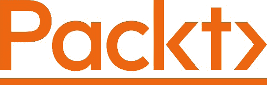
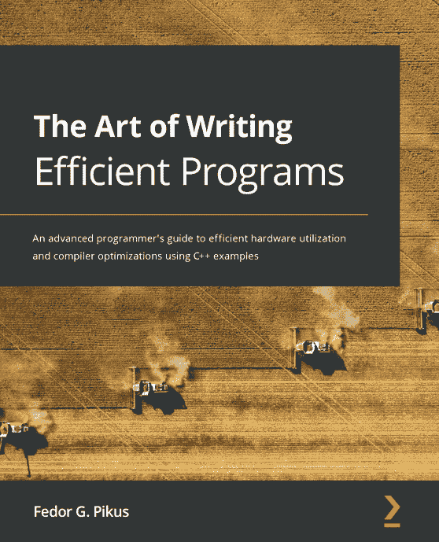
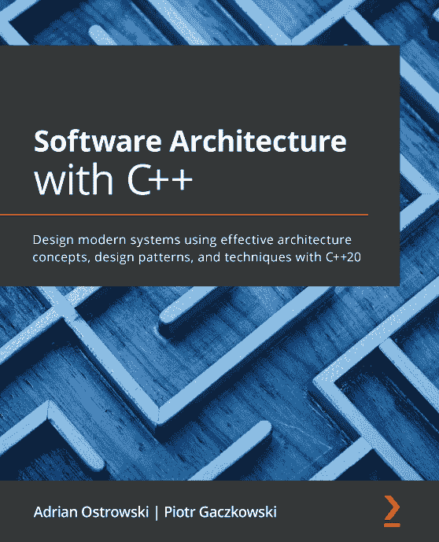

[Packt.com](http://Packt.com)

订阅我们的在线数字图书馆，全面访问超过 7000 本书籍和视频，以及领先的行业工具，帮助你规划个人发展并推进你的职业生涯。更多信息，请访问我们的网站。

# 第十二章：为什么订阅？

+   通过来自 4000 多名行业专业人士的实用电子书和视频，节省学习时间，增加编码时间

+   通过为你量身定制的技能计划提高你的学习效果

+   每月免费获得一本电子书或视频

+   完全可搜索，便于快速访问关键信息

+   复制粘贴、打印和收藏内容

你知道吗，Packt 为每本书都提供了电子书版本，包括 PDF 和 ePub 文件。你可以在[packt.com](http://packt.com)升级到电子书版本，作为印刷书客户，你有权获得电子书副本的折扣。如需了解更多详情，请联系我们[customercare@packtpub.com](http://customercare@packtpub.com)。

在[www.packt.com](http://www.packt.com)，你还可以阅读一系列免费的技术文章，注册各种免费通讯，并享受 Packt 书籍和电子书的独家折扣和优惠。

# 你可能还会喜欢以下书籍

如果你喜欢这本书，你可能还会对 Packt 的其他书籍感兴趣：

[点击访问](https://packt.link/9781800208117)

**高效编程的艺术**

Fedor G. Pikus

ISBN: 9781800208117

+   探索如何有效地使用程序中的硬件计算资源

+   理解内存顺序和内存屏障之间的关系

+   熟悉不同数据结构和组织方式的性能影响

+   评估并发访问内存的性能影响以及如何最小化它

+   了解何时使用以及何时不使用无锁编程技术

+   研究不同的方法来提高编译器优化的有效性

+   为并发数据结构和高性能数据结构设计 API 以避免低效

[点击访问](https://packt.link/9781838554590)

**使用 C++进行软件架构**

Adrian Ostrowski, Piotr Gaczkowski

ISBN: 9781838554590

+   理解如何应用软件架构的原则

+   应用设计模式和最佳实践以满足你的架构目标

+   使用最新的 C++特性编写优雅、安全且高效的代码

+   构建易于维护和部署的应用程序

+   探索不同的架构方法，并学习根据你的需求应用它们

+   使用应用程序容器简化开发和运维

+   探索解决软件开发中常见问题的各种技术

# Packt 正在寻找像你这样的作者

如果你有兴趣成为 Packt 的作者，请访问[authors.packtpub.com](http://authors.packtpub.com)并今天申请。我们已与成千上万的开发者和技术专业人士合作，就像你一样，帮助他们将见解分享给全球科技社区。你可以提交一个一般性申请，申请我们正在招募作者的特定热门话题，或者提交你自己的想法。

# 分享你的想法

现在你已经完成了《C++ 20 STL 烹饪秘籍》，我们非常想听听你的想法！如果你在亚马逊购买了这本书，[请点击此处直接跳转到该书的亚马逊评论页面](https://packt.link/r/1803248718)并分享你的反馈或在该购买网站上留下评论。

你的评论对我们和科技社区都非常重要，它将帮助我们确保我们提供的是高质量的内容。

你可能还会喜欢的其他书籍
