# 第四章：`main()`函数是应用程序的入口点

*在 main 之前发生的事情都留在 main 中*

对于在各个操作系统上使用 C++的程序员来说，应用程序的入口点是一个需要深入了解底层架构的概念。在本章中，我们将分析应用程序的启动方式，重点关注在我们达到用户定义的`main()`函数之前执行的初始化代码。

在 Linux 下探索这个过程时，我们将分析**可执行和链接格式**（**ELF**），详细说明`execve()`系统调用如何加载和执行`_start()`函数，该函数在调用`main()`之前准备运行时环境。我们还将探讨一些编译器特定的扩展，我们可以使用这些扩展来操纵这个过程。然后，我们将把注意力转向 Windows，详细检查 Windows 上的**可移植可执行文件**（**PE**）文件部分。

我们还将使用一个名为**Ghidra**的工具来分析两个平台下的可执行文件，因为这是提供关于支撑应用程序启动的低级操作实用见解的工具之一。

完成本章后，你将更深入地理解以下方面：

+   可执行文件格式以及 Linux 和 Windows 下的进程启动

+   如何篡改应用程序的启动过程

什么是 Ghidra？

**Ghidra**是由 NSA 开发的开源软件逆向工程套件，用于分析各种格式和平台上的编译代码。它提供了反编译、反汇编和调试二进制文件的工具，使用户更容易理解和分析机器代码。

# `main()`函数

当我们在学校或可能在大学的第一门 C++课程中学习 C++时，我们的老师告诉我们：“亲爱的同学们，这是 main 函数：`void main(void)`。你的程序将从这里开始。”就这样。

章节完成——翻到下一页，我们下一章见。

然而，这个说法并不正确。我写下`void main(void)`只是为了激发你的好奇心，让你保持警觉。在这个职业阶段，所有 C++程序员都应该知道`void main(void)`与标准 C++的距离，就像 Nemo 点与最近的陆地一样遥远。

哦——你还在这里！这意味着你一定读过了细则。太好了——我们程序员应该始终关注细节，比如我们的应用程序是如何被底层操作系统加载和执行在内存中的。

由于我们生活在一个自由的世界，我们可以根据自己的意愿选择使用几个操作系统，因此我们选择展示这个应用程序在 Linux 和 Windows 下是如何加载的。

在这两个操作系统之间，关于它们加载和执行编译后的二进制文件的方式存在显著差异。在其中一个（不难猜出是哪一个）中，我们可以追踪到这个特殊过程的代码路径，直到底层内核的最深层次，而对于另一个，我们必须依赖现有的文档、书籍和各种信息来源，这些信息将由热衷于底层研究的学者收集。

由于 Linux 处理这种操作的方式与 BSD 家族（FreeBSD、NetBSD 等）的操作系统处理相同问题的方法非常相似，因此在我们接下来的段落中讨论问题时，我们将避免主动提及这些操作系统。由于我们希望在追求知识的同时让您保持兴趣，我们仍然想提供最新的信息，因此我们决定不为 MS-DOS 等特殊操作系统提供信息，这些操作系统自 2024 年起不再在活跃的生产环境中使用（除非您恰好在大德意志铁路公司工作 1）。

1 [`www.theregister.com/2024/01/30/windows_311_trundles_on/`](https://www.theregister.com/2024/01/30/windows_311_trundles_on/)

但在我们深入探讨之前，我们将展示本章将使用的测试应用程序，以展示上述功能：

```cpp
#include <cstring>
#include <cstdio>
struct A {
   A(const char* p_a):m_a(new char[32]) { strcpy(m_a, p_a);
       printf("A::A : %s\n", p_a);
   }
   ~A() {
       printf("A::~A : %s\n", m_a);
       delete[] m_a;
   }
   volatile const char* get() const {return m_a;}
private:
   char* m_a;
};
const char* my_string= "Hello string";
A my_a(my_string);
const char* my_other_string = "Go away string";
A my_other_a(my_other_string);
int main() {
   printf("Hello, World, %s, %s\n", my_a.get(), my_other_a.get()); }
```

当在符合标准规范的系统上编译并运行上述应用程序时，它会产生以下预期的输出，这对于遵循标准规范的程序员来说是显而易见的：

```cpp
A::A : Hello string
A::A : Go away string
Hello, World, Hello string, Go away string
A::~A : Go away string
A::~A : Hello string
```

是的，我们故意没有使用**cout**和其他流操作，因为我们希望保持代码的简洁。我们不希望污染生成的代码，因为我们计划深入研究编译后的可执行文件。

此外，请注意，这段代码是专门为本章编写的合成代码，用以展示我们想要展示的特性。作者完全清楚 strcpy 可能引起的潜在内存溢出错误，因此建议读者按照作者的建议去做，而不是模仿作者的做法：“**不要**使用 strcpy。”

回到我们的初始目标，让我们展示操作系统如何加载和执行应用程序。如果，亲爱的读者，您觉得下面的讨论过于底层，请记住：C++程序在运行时编译成本地代码，以尽可能高的速度执行，这是底层操作系统分配的速度。

考虑到这一点，我们认为任何 C++程序员都有必要了解操作系统是如何处理他们的代码的，以及编译器消化了他们的源文件并输出可执行文件后会发生什么。我们将尽量排除最低级细节，只展示真正必要的内容，以便全面理解这一情况的严重性。

# 企鹅农场

当 Linux 加载和执行应用程序（例如，我们想要执行一个应用程序，而不是 shell 脚本或其他东西）时，通常通过一个 **fork()** / **execve()** 系统调用对来启动应用程序的执行。

这些系统调用负责复制当前进程（**fork()**）并用新的进程映像（要执行的应用程序，即**execve()**）替换当前进程映像。

这些 API 调用在 Mark Mitchell、Jeffrey Oldham 和 Alex Samuel 所著的《高级 Linux 编程》中有详细的介绍，但还有无数在线资源专门介绍这个主题。所以，如果你对这个主题感兴趣，你可能会在那里找到很好的信息来源。

但让我们继续加载可执行文件。在经过几次迭代并离开用户空间限制后，**execve()** 系统调用最终会进入 Linux 内核并创建一个 **linux_binprm** 结构 2。

2 [`github.com/torvalds/linux/blob/master/include/linux/binfmts.h`](https://github.com/torvalds/linux/blob/master/include/linux/binfmts.h)

根据文档，这个结构在加载二进制文件时使用，并包含在加载和执行二进制文件时所需的所有主要详细信息。

如果你有很多空闲时间，手里拿着一大杯茶，并且对 C 语言的复杂性有深入的了解，你可以轻松地阅读 **do_execveat_common** 函数的冗长实现，以了解更多关于当前 Linux 内核源树中此函数幕后情况的信息 3。

3 https://github.com/torvalds/linux/blob/master/fs/exec.c

内核随后确定可执行文件的格式。在 Linux 系统中，最常用的可执行文件格式是 ELF。

所有字段都在官方标准文档 4 中进行了描述，但与我们用例相关的字段的快速总结如下：

4 https://refspecs.linuxfoundation.org/elf/elf.pdf

| **字段名称** | **偏移量** | **描述** |
| --- | --- | --- |
| **MAGIC** | 0x00 | 一个表示文件是 ELF 文件的魔数（ASCII 中的“ELF”和 0x7F） |
| **CLASS** | 0x04 | 指定 ELF 文件的类（32 位或 64 位） |
| **e_type** | 0x10 | 识别对象文件类型（例如，可执行文件、共享对象等） |
| **e_machine** | 0x12 | 指定文件编译的架构 |
| **e_entry** | 0x18 | 系统首先将控制权转移到该虚拟地址，以启动进程 |

请记住这个表格，因为我们很快就会参考它。但现在，让我们继续加载程序。现在是内核读取 ELF 头以了解可执行文件结构的时候了。在这个阶段发生以下操作：

1.  **内存分配**：内核为新进程分配内存。这包括设置进程的地址空间，它由不同的段组成，如文本（代码）、数据、堆和栈。

1.  **段映射**：内核将可执行文件的段映射到进程的地址空间中。例如，文本段（包含可执行代码）被映射为只读，而数据段（包含全局变量）被映射为读写。

1.  **动态链接**：如果可执行文件依赖于共享库，则调用动态链接器/加载器（**ld.so**）来加载必要的共享库并解析符号引用。动态链接器还将这些库映射到进程的地址空间中。

这些操作都在 Linux 内核深处进行，但如果你对这个领域感兴趣，我们鼓励你阅读源代码——也许你能在其中发现一些有趣的东西。

一旦所有这些有趣且非常底层的操作都成功执行，内核就会为进程设置初始环境栈。这个栈包含以下内容：

+   **参数向量**（**argv**）：命令行参数数组。

+   **环境变量**（**envp**）：环境变量数组。

+   **辅助向量**（**auxv**）：程序需要的附加信息，例如系统页面大小、程序入口点等。

所有这些都在之前提到的相同内核源文件（**binfmt_elf.c**）中发生，在以下函数中：

```cpp
static int create_elf_tables(struct linux_binprm *bprm,
const struct elfhdr *exec, unsigned long interp_load_addr,
unsigned long e_entry,unsigned long phdr_addr) { ... }
```

在创建运行时环境后，内核设置 **指令指针**（**IP**）指向程序的入口点（如 ELF 头部中指定）。CPU 寄存器也被初始化为所需的值。最后，内核将 CPU 返回到用户模式并将控制权转移到程序的入口点。

在 Linux 中，控制权转移主要发生在 **start_thread()** 函数中，该函数是架构特定的。在撰写本文时，对于 x86，该函数在 **arch/x86/include/asm/processor.h** 中定义，并在 **arch/x86/kernel/process_64.c** 中实现。程序从这个点开始执行。现在来到有趣的部分——至少从 C++ 开发者的角度来看。

首先，执行程序的初始化代码（通常是 C 运行时库的一部分）——通常是 **_start()** 函数，而不是 **main()**。ELF 头部的 **e_entry** 字段列出了程序开始执行的位置在文件中的偏移量。通常，它是 **_start()** 方法的偏移量，或者至少如果可执行文件是用标准 GNU 工具链编译的。这段代码负责设置任何运行时环境变量并调用程序的 **main()** 函数。从这一点开始，程序按照编写的指令运行。

那么，让我们来检查一下初始化代码究竟是什么。我们将使用我们手头的工具**Ghidra**，它允许我们剖析 Linux 可执行文件并检查它们的内部工作原理。此工具为我们几乎空白的程序提供了以下摘要：

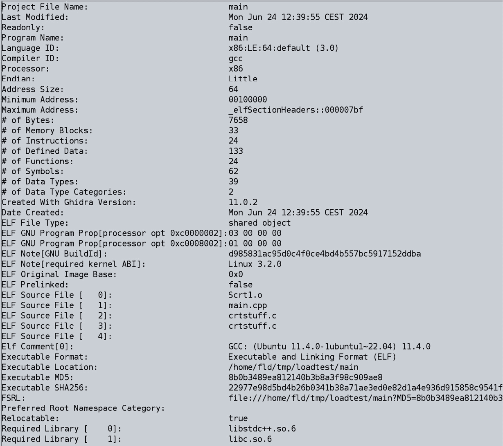

图 4.1 – 我们合成应用的架构

当查看**ELF 源文件**部分时，我们可以看到我们的初始**main.cpp**文件；然而，还有一些我们还不熟悉的其他项目 – 例如，**crtstuff.c**。此文件是**libgcc**的一部分，可以在**libgcc**仓库 5 中找到，其顶部有如下注释：

5 [`github.com/gcc-mirror/gcc/blob/master/libgcc/crtstuff.c`](https://github.com/gcc-mirror/gcc/blob/master/libgcc/crtstuff.c)

```cpp
/* Specialized bits of code needed to support construction and destruction of file-scope objects in C++ code.
```

这样，一个谜团已经解开，注释也就不言自明了。然而，另一个谜团仍然存在：**Scrt1.o**。要理解这一点，我们需要了解**固定地址可执行文件**和**位置无关可执行文件**（**PIEs**）之间的区别。

固定地址可执行文件被编译为在特定的、预定的内存地址上加载，这使得它们更简单但安全性较低且灵活性较差，因为它们的地址是可预测的且容易受到攻击。这是在嵌入式设备和一些较老的平台（如也具有此“特性”要求**.com**应用程序在特定偏移量加载的 MS-DOS）上加载可执行文件的首选方式。

另一方面，**位置无关可执行文件**（**PIE**）可执行文件在编译和链接时被设计为位置无关，允许它们在任何内存地址上加载。

当你编译一个程序时，你可以使用各种标志来控制编译器如何生成代码。**-fPIE**、**-pie**和**-fPIC**标志与代码在内存中的定位和处理方式有关。以下是每个标志的快速概述：

+   **-fPIE**（**位置无关可执行文件**）：**-fPIE**标志告诉编译器为可执行文件生成位置无关代码。这对于创建支持**地址空间布局随机化**（**ASLR**）的可执行文件很有用，这是一个安全特性，它随机化可执行文件加载到的内存地址，使得攻击者更难预测特定代码的位置。

+   **-pie**（**位置无关可执行文件链接器标志**）：**-pie**标志在链接阶段使用。它指示链接器生成位置无关的可执行文件。这意味着最终输出文件（可执行文件）将能够在支持 ASLR 的任何内存地址上加载。它与在编译阶段使用的**-fPIE**标志相辅相成，确保可执行文件中的所有代码都是位置无关的。

+   **-fPIC**（**位置无关代码**）：**-fPIC**标志告诉编译器为共享库生成位置无关代码。共享库的位置无关代码意味着库可以加载到内存中的任何地址。这对于共享库是必要的，因为它们可能被加载到不同程序的不同内存位置。

现在我们已经了解了这些重要概念，让我们回到我们之前中断的地方，并讨论我们二进制文件中剩下的一个谜团：**Scrt1.o**。你还记得**_start()**函数吗？由于你没有自己编写它，它必须来自某个地方。对于我们来说，它来自这个神奇的**Scrt1.o**。**crtX.o**有几个变体，一些以 S 开头，一些没有，但对我们来说，**Scrt1.o**的存在告诉我们我们的应用程序是一个 PIE 可执行文件。还可以将几个其他文件链接到我们的应用程序：

+   **crt0.o**、**crt1.o** 等等：这些文件包含**_start**符号，这对于引导程序执行至关重要。它们的具体命名约定可能因**libc**实现而异。

+   **crti.o**：这为**.init**和**.fini**部分定义函数前缀，触发链接器生成的动态标签（**DT_INIT 和 DT_FINI**），以支持我们将在这里讨论这些概念，所以不要担心未知术语。

+   **crtn.o**：这为**.init**和**.fini**部分提供函数结尾，补充**crti.o**。

+   **Scrt1.o**、**gcrt1.o**和**Mcrt1.o**：这些是**crt1.o**的变体，在不同情况下使用，例如生成 PIEs 或包含性能信息。

+   **crtbegin.o**、**crtbeginS.o**和**crtbeginT.o**：这些由 GCC 用于定位构造函数及其变体（**crtbeginS.o**用于共享对象/PIEs 和**crtbeginT.o**用于静态可执行文件）。

+   **crtend.o**和**crtendS.o**：与**crtbegin.o**类似，这些由 GCC 用于定位析构函数（**crtendS.o**用于共享对象/PIEs）。

现在我们已经揭开了可执行文件内容的神秘面纱，我们需要了解另一件事：ELF 文件中的**.init_array**部分用于存储一个函数指针数组，操作系统运行时加载器在程序启动时自动执行这些函数。

这些函数通常被称为“初始化函数”或“初始化函数”。它们在**main()**之前被调用，并负责初始化全局数据。对于我们的合成应用程序，这是经过**Ghidra**分析后该部分的外观：

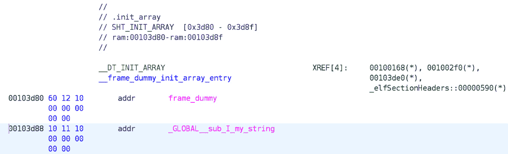

图 4.2 – 全局变量的.init_array 部分

如我们所见，这里有两个函数——一个是哑函数，另一个叫做**_GLOBAL__sub_I_my_string**。名字选择很有趣，所以让我们使用工具的汇编到 C-like 代码功能来看看它做了什么：

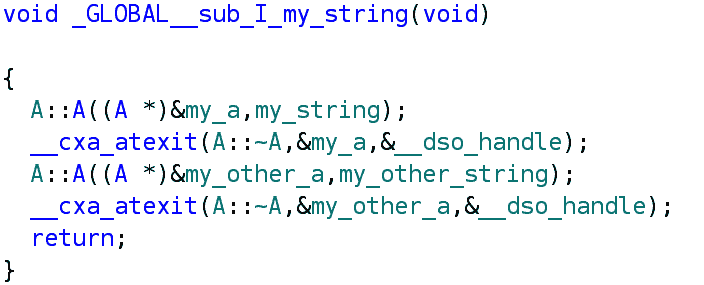

图 4.3 – 根据 Ghidra 创建全局对象的方式

有趣，不是吗？这正是你期望在全局命名空间中发生的事情。

在这里，正在创建 **my_a** 和 **my_other_a** 对象，调用它们的构造函数，并为 **__cxa_atexit** 调用类 **A** 的析构函数。尽管这是一个相当有趣的观察，但幕后构造函数的调用是如何工作的。

从这种令人不安的反汇编中，你可能觉得构造函数为它正在构建的对象获得了一个不可见的参数。这是真的：这是 **this** 变量，并且它被隐式地添加到类的所有方法中，而不需要显式要求。这就是我们如何访问对象本身的方式。

如其名称所示，**__cxa_atexit** 函数就像 **atexit** 一样。然而，你不必担心它，因为它不是应该在它所在的库之外处理的函数。

现在我们已经了解了这里发生的事情，是时候捡起我们之前提到的一个线程：臭名昭著的 **_start()** 函数。

如前所述，这个函数应该做一些清理工作并启动我们的 **main** 函数。根据 Ghidra，它确实可以在 ELF 头中找到。根据 ELF 规范，它占据了 ELF 条目列表中的 **e_entry** 字段：：

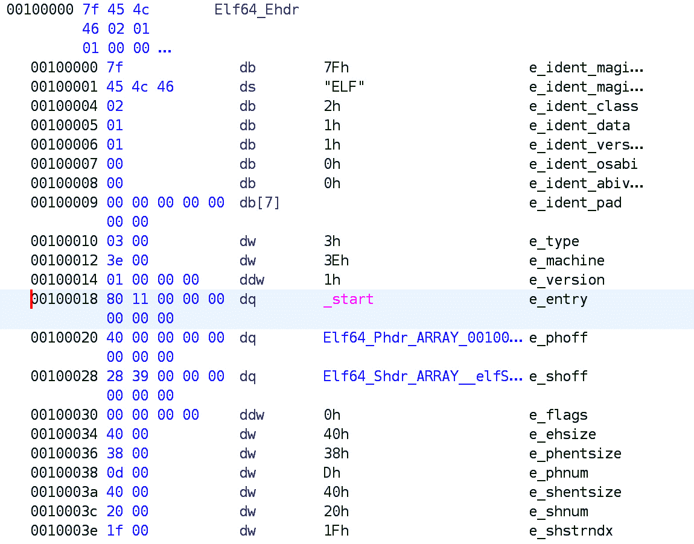

图 4.4 – 根据 Ghidra 的 ELF 头

现在，经过一些反汇编魔法的应用，得益于 **Ghidra**，它看起来是这样的：

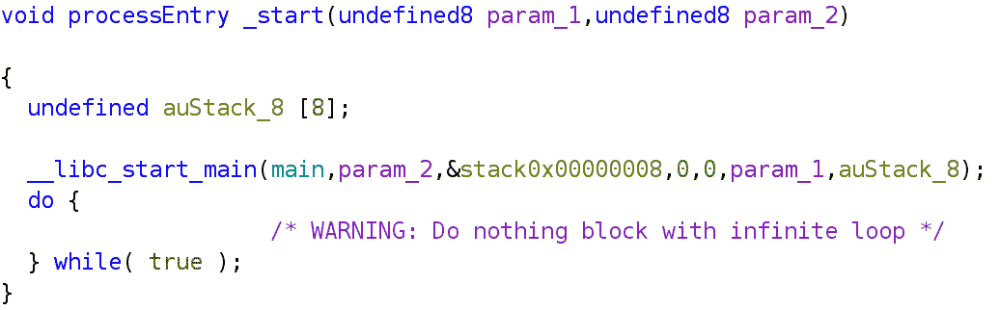

图 4.5 – _start 例程函数，反汇编并转换为 C 伪代码

看起来可怕的 **__libc_start_main** 函数并没有它看起来那么可怕，它负责加载我们的 **main()** 函数以及操作系统提供的参数。这个函数是 **glibc** 的一部分，可以免费获得 6 ，就像其他所有行为良好的免费软件一样，这样我们就可以研究其内部结构。

6 git clone git://sourceware.org/git/glibc.git

在这个阶段，随着 **__libc_start_main** 的结果，我们已经到达了实际的 main 函数。这是我们期望程序驻留的地方。

这些细节提供了对程序执行、优化机会和调试能力的更深入见解。掌握 ELF 文件格式可以使你通过利用特定的链接器选项和理解动态链接的复杂性来优化性能。此外，它通过跟踪初始化序列和识别启动相关的问题，有助于有效的调试。

## 哦，还有更多！

现在我们已经在这里，在我们最喜欢的 Linux 机器上打字，让我们不要浪费时间，更深入地了解一下这个伟大操作系统中一些编译器的内部机制。例如，让我们深入研究 ELF 文件的**.init_array**部分。如前所述，它负责在主函数之前启动不同的函数。

但在我们继续穿越这些沼泽地之前，必须提到一个警告：我们接下来要讨论的内容并不适合胆小的 C++程序员，甚至它都不是标准的 C++。请阅读*第二章*有关 C++标准性的内容。如果你能忍受编译器扩展的邪恶教条，那么请继续阅读。

GCC（以及 Clang）有一个非常方便的扩展，可以在**main()**之前执行函数。这些函数被称为构造函数，并且需要使用特定的属性来生成：

```cpp
__attribute__((constructor)) void welcome() {
   printf("constructor fun\n");
}
```

如果我们将这段特定的代码添加到我们的合成应用程序中，我们可以期待以下输出：

```cpp
constructor fun
A::A : Hello string
A::A : Go away string
Hello, World, Hello string, Go away string
A::~A : Go away string
A::~A : Hello string
```

如您所见，构造函数在全局初始化代码之前执行。如果我们用我们最喜欢的九头铲深入可执行文件，我们将在**.** **init_array**部分看到以下内容：

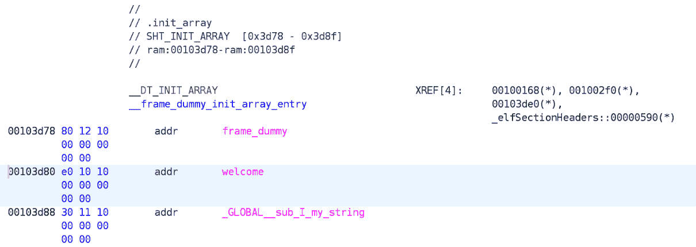

图 4.6 – 带有构造函数的 .init_array 部分

通过这些知识，我们现在拥有了两种在 C++应用程序中**main()**函数之前执行代码的方法：构造函数和全局变量。

到目前为止，我们已经开始触及一些危险的东西：**静态初始化顺序灾难**。这是一个多次在各种地方讨论过的话题。这些讨论总结说，这个问题源于不同翻译单元中静态或全局变量初始化的未定义顺序。有各种技术可以解决这些问题，但我们的建议是**避免它们**。

以下示例说明了为什么这可能会引发危险的情况。在这里，我们创建了几个简短的文件，再次使用合成内容，试图模拟现实生活中的情况：

a.h

```cpp
#ifndef A_H
#define A_H
class C;
extern C a_c;
#endif
```

b.h

```cpp
#ifndef B_H
#define B_H
class C;
extern C b_c;
#endif
```

C.h

```cpp
#ifndef C_H
#define C_H
#include <cstring>
#include <cstdio>
struct C {
   C(const char* p_c) : m_c(nullptr) {
       m_c = new char[32];
       strcpy(m_c, p_c);
       printf("C::C : %s\n", p_c);
   }
   ~C() {
       printf("C::~C : %s\n", m_c);
       delete[] m_c;
   }
private:
   char* m_c;
};
#endif
```

a.cpp

```cpp
#include "C.h"
C a_c("A");
```

b.cpp

```cpp
#include "C.h"
C b_c("B");
```

main.cpp

```cpp
int main()
{
}
```

这段代码并不特别复杂——它只是一个用于打印一些调试信息和创建上述诊断类对象的单独 C++文件的诊断**C**类。

通常，这些文件是用**gcc**编译的，所以让我们编译它们并执行生成的文件：

```cpp
> $ g++ main.cpp a.cpp b.cpp -o test
> $ ./test
C::C : A
C::C : B
C::~C : B
C::~C : A
```

这里没有什么特别之处——我们编译并创建了一个可执行文件，它执行了它应该执行的操作：在创建和销毁特定对象时打印出来。

但如果我们以不同的顺序指定文件会发生什么呢？

```cpp
> $ g++ main.cpp b.cpp a.cpp -o test
> $ ./test
C::C : B
C::C : A
C::~C : A
C::~C : B
```

真是令人惊讶。现在，**b.cpp** 中的 **b_c** 对象在 **a.cpp** 中的 **a_c** 对象之前创建。现在，想象一下我们的程序由依赖于某些其他全局对象正确初始化的全球对象组成的灾难性情况。

幸运的是，Linux 下的编译器生态系统为我们提供了必要的工具，帮助我们实现应用程序在这个问题上的合理状态，借助一个非常方便的扩展。这个扩展用于指定全局成员的初始化顺序，并使用 **__attribute__((init_priority(XXX)))** 语法体现出来。

**gcc** 和 **clang** 都提供了这种方式来控制跨翻译单元的 **namespacescope** 对象的初始化顺序，使用 **init_priority** 属性。这个属性允许用户为初始化分配一个相对优先级，优先级值从 **101** 到 **65535**（包含）不等。数字越小，优先级越高，这意味着具有较低 **init_priority** 值的对象将更早初始化。

带着这些知识，让我们修改我们的合成示例文件，以便它们使用这个扩展：

a.cpp

```cpp
#include "C.h"
__attribute__((init_priority(1000))) C a_c("A");
```

b.cpp

```cpp
#include "C.h"
__attribute__((init_priority(1001))) C b_c("B");
```

现在，无论 **a.cpp** 和 **b.cpp** 的引入顺序如何，结果都将相同：

```cpp
> $ g++ main.cpp a.cpp b.cpp -o test
> $ ./test
C::C : A
C::C : B
C::~C : B
C::~C : A
> $ g++ main.cpp b.cpp a.cpp -o test
> $ ./test
C::C : A
C::C : B
C::~C : B
C::~C : A
```

现在，让我们回到我们的第一个合成应用程序——那个尝试在同一个翻译单元中创建全局对象的应用程序。同时也引入了“构造函数”的概念。让我们看看如果我们为其中一个全局对象指定初始化优先级会发生什么，以及在这种情况下顺序会是什么：

```cpp
__attribute__((init_priority(1000)))
                             A my_other_a(my_other_string);
```

令人惊讶的是，输出结果如下：

```cpp
A::A : Go away string
constructor fun
A::A : Hello string
Hello, World, Hello string, Go away string
A::~A : Hello string
A::~A : Go away string
```

为了深入理解幕后机制，并了解为什么会出现这种场景，我们运行了我们钟爱的工具在编译后的二进制文件上。结果证实了我们的发现，如下截图所示：

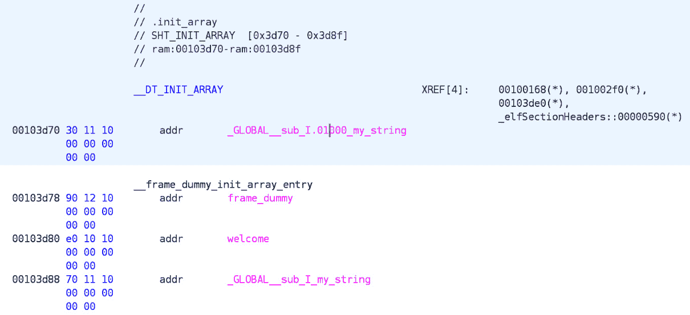

图 4.7 – 根据 gcc 指定的初始化优先级显示的 .init_array 部分

输出之所以如此，是因为 **.init_array** 部分增加了一个新成员，它需要在构造函数和标准全局初始化代码之前执行。

并不难猜测新函数的名称包含初始化优先级。然而，让作者感到困惑的是，为什么 **gcc** 决定持续使用 **my_string** 作为变量名称的后缀。这必须是 **gcc** 的特性，因为用 **clang** 编译的相同可执行文件产生了以下 **.** **init_array** 部分：

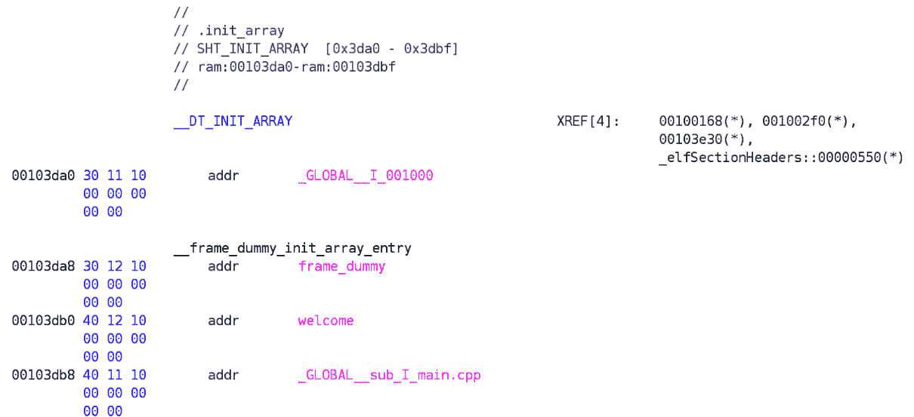

图 4.8 – Clang 对于相同初始化优先级的不同的 .init_array 部分

作者发现，为什么**gcc**和**clang**在处理对象文件的这个关键部分时存在如此大的差异，这很有趣。然而，在没有进一步分析这些编译器的源文件的情况下，这仍将是一个谜。

## 库是意外行为和思想诞生的分娩室

到目前为止，我们一直是单一应用程序的快乐的父母。现在，我们的爱情结晶成熟并准备结婚……意味着，为了遵循一些常识和更高级的编程实践，我们希望将合成代码中的一些非常有用的功能提取到一个合成库中，并将其命名为**synth**。抱歉——我的意思是**libsinth**。

由于本章的主要焦点仍然是**main()**之前的代码执行分析（*1*），并且我们愉快地提倡 gcc（和 clang）的扩展（2），让我们看看如果我们将所有这些组合在一起会发生什么，这是一种代码和数据的不神圣的婚姻。

作为旁注，我们将使用我们的第二个合成示例，其中**a.cpp**和**b.cpp**在其最后阶段保持未变，这包括所需的初始化顺序。我们将创建一个新的**main.cpp**文件来利用库本身，并且我们还将引入库的源代码。

我们的库将由以下代码构建：

synth.cpp

```cpp
#include "C.h"
#include <cstdio>
__attribute__((init_priority(2000))) C synth_c("synth");
__attribute__((constructor)) void welcome_library() {
   printf("welcome to the library\n");
}
void print_synth() {
   printf("print_synth: %s\n", synth_c.get());
}
```

synth.h

```cpp
#ifndef SYNTH_H
#define SYNTH_H
void print_synth();
#endif
```

除了定义全局对象**synth_c**，其类型为**C**（如**C.h**头文件中定义的）并且具有**2000**的初始化优先级之外，我们还定义了一个名为**welcome_library**的函数，带有**__attribute__((constructor))**标记，确保它在**main()**之前运行并打印“欢迎来到库。”

此外，**print_synth**函数打印一条消息，说明从**synth_c.get()**获得的值。**C.h**头文件是几页前的那个——它定义了类**C**，以及创建对象所需的所有方法和构造函数。

要使用这个库，我们需要为其创建相应的底层基础设施。这包括上述两个文件和一个使用其公开特性的应用程序。

为了保持进度，我们需要修改我们的主文件，使其使用库的功能。然而，我们还想保留为这种场景创建的测试源文件。

因此，我们的应用程序将包含上述**a.cpp**和**b.cpp**文件，以及我们的新**main.cpp**文件：

main.cpp

```cpp
#include "synth.h"
#include "C.h"
__attribute__((constructor)) void welcome_main() {
   printf("welcome to the main\n");
}
C main_c("main") ;
int main() {
   print_synth();
   return 0;
}
```

为了使一切正常工作，我们需要将这些项目链接起来，并将它们转换成一个可工作的应用程序：

```cpp
> $ g++ -c -o synth.o synth.cpp
> $ ar rcs libsynth.a synth.o
> $ g++ -o main main.cpp a.cpp b.cpp -L. -lsynth
```

如您所见，在这个阶段，我们已经创建了一个**静态**库，**libsynth.a**，并将我们的主应用程序链接到它，以正确地包含库中的所有代码。

请注意，没有*c.cpp*文件，因为为了尽可能紧凑，我们在头文件中提供了类的所有实现。对于更大的项目，这并不是最佳实践，因为对类中任何函数实现的任何小更改都要求重新编译包含头文件的所有文件。然而，对于这种情况，我们可以接受。

由于我们对我们所创建的各种构造的执行顺序感兴趣，在运行结果应用程序后，我们得到以下输出：

```cpp
> $ ./main
C::C : A
C::C : B
C::C : synth
welcome to the main
C::C : main
welcome to the library
print_synth: synth
C::~C : main
C::~C : synth
C::~C : B
C::~C : A
```

要深入了解新编译的可执行文件内部结构，我们将使用我们喜爱的工具**Ghidra**打开它，并定位我们最感兴趣的章节：**.** **init_array**章节。

经过快速检查，我们可以看到打印顺序与**.** **init_array**章节中函数的顺序相对应：

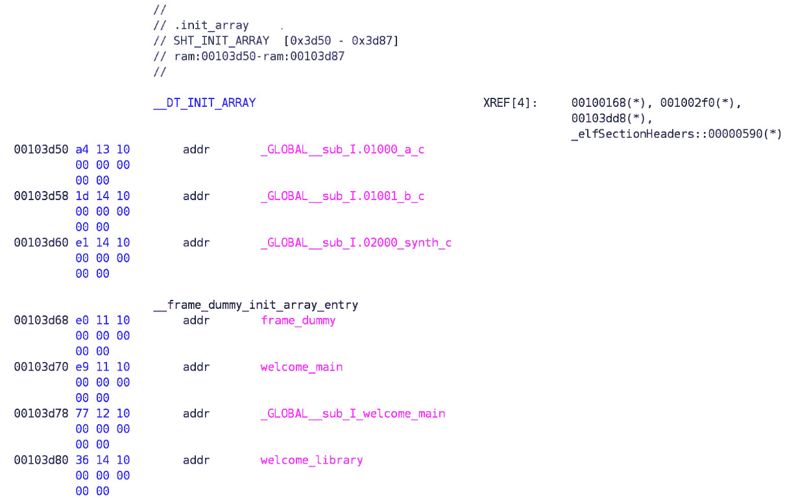

图 4.9——不同文件中不同初始化优先级的.init_array 章节

在这里，**_GLOBAL__sub_I_welcome_main**是创建**main.cpp**中全局对象的函数——即**C main_c("main") ;**。有趣！在这个时候，我们确信全局对象的初始化顺序即使在库之后——至少是静态库——也是有效的。

但我们还没有完成。让我们看看如果我们创建一个共享库会发生什么。这并不复杂。在移除生成的文件——即**synth.o**、**libsynth.a**和**main**——以便我们有一个干净的起点后，我们需要运行以下命令来创建一个共享库：

```cpp
> $ g++ -fPIC -c -o  synth.o synth.cpp
> $ g++ -shared -o libsynth.so synth.o
> $ g++ -pie -o main main.cpp a.cpp b.cpp -L. -lsynth
```

现在，我们可以看到从本章开始创建共享库和应用程序的整个过程是如何轻松地实现那些神奇开关的。

在所有这些部分就绪后，我们可以看到 Ghidra 如何展示应用程序概述的一个有趣的变化：

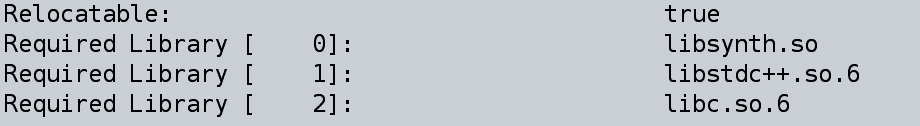

图 4.10——Ghidra 中显示的作为依赖项的 synth 库

在这里，我们可以看到对刚刚创建的**libsynth.so**库的依赖。现在，我们可以检查关于可执行文件最感兴趣的部分——**.** **init_array**：

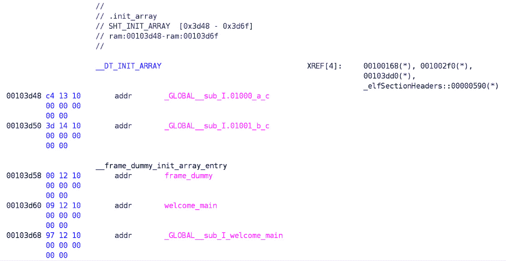

图 4.11——.init_array 章节中没有对 libsynth 的引用

我们的 synth 库中的对象和函数完全没有引用……难怪——它是一个库。但至少我们可以看到我们的应用程序正确地链接到库：

```cpp
> $ LD_LIBRARY_PATH=. ldd ./main
   linux-vdso.so.1 (0x00007fff17387000)
   libsynth.so => ./libsynth.so (0x00007ea84ee45000)
   libstdc++.so.6 => /lib/x86_64-linux-gnu/libstdc++.so.6
```

请注意，我们必须明确指定**LD_LIBRARY_PATH=.**以找到库（注意，我们已截断不必要的输出行以保持内容清晰）。

在这一点上，我们很好奇当执行应用程序时会发生什么：

```cpp
> $ LD_LIBRARY_PATH=. ./main
C::C : synth
welcome to the library
C::C : A
C::C : B
welcome to the main
C::C : main
print_synth: synth
C::~C : main
C::~C : B
C::~C : A
C::~C : synth
```

首先，根据单应用程序测试设定的预期，具有指定优先级（优先级）的对象在库中创建。然后，调用库中的构造函数。如果库中还有其他非优先级的全局对象，它们将在这些对象之后创建，在主应用程序的优先级对象创建之前，以及主应用程序的构造函数被调用之前。所有这些操作都是在 **main()** 函数甚至有机会说“安静”之前完成的。

几乎就像我们预期的那样发生。只是这些函数构造扩展的一个阴暗角落，我目前还没有找到解决办法——如果 **a.cpp** 和 **b.cpp** 包含以下行？

```cpp
__attribute__((constructor)) void welcome_a() {
   printf("welcome to the 'a' file\n"); }
__attribute__((constructor)) void welcome_b() {
   printf("welcome to the 'b' file\n"); }
```

这不神圣的神秘代码添加了两个更多的构造函数到我们的可执行文件中。现在，我们有三个了。如果你也想为这些构造函数指定一个可预测的执行顺序，你需要使用 **__attribute__((constructor(205))) void welcome_b()** 来指定它们的优先级。这将保证这些函数也将按照特定的顺序执行，并且你不会遇到全局构造函数调用顺序的混乱。

当库被动态加载（**dlopen** / **dlclose**）时的行为是人们预期的，即它遵循主应用程序的执行流程，在库被加载的点，它将跳转并执行库中的各种构造函数和对象初始化。

## 最后的话

本章讨论了在主函数之前执行的代码。然而，对于在主函数之后执行的代码也需要同样的关注，但这个讨论将在另一章、另一本书中进行。

但为了给你一些提示，这里有一个小提示：就像有构造函数一样，也有析构函数。它们不像 C++ 的析构函数——更像是 **__attribute__((destructor))**。

用标准的程序退出例程来增加这些，我们比启动时更有乐趣，因为我们必须考虑无数的其他替代方案，例如注册给 **std::atexit**（甚至 **std::quick_exit**）的函数，或者程序的非正常终止。例如，假设在析构函数中抛出一个异常，或者我们使用 **std::terminate** 或 **std::abort**。

**gcc** 和 **clang** 的文档提供了一个从标准世界中的美好逃避，任何关于 C++ 的好书都会提供一个关于标准终止例程的全面概述，所以请前往它们那里听一场精彩的讲座。这两个的结合将提供关于应用程序如何启动和退出的最佳概述。

在我们从 Packt 的人那里得到满意的反馈之前，我们将把注意力转向其他平台——而不是本章节约定的 16 页，我们目前已经达到了 22 页，但只覆盖了承诺主题的一半。

# 让我们打开 Windows（除非你在 ISS 上）

在我们深入探讨 Windows 下应用程序执行的内幕以及我们必须采取的步骤以到达主函数之前，请注意，从 C++ 的角度来看，与 Linux 或任何其他操作系统之间不应有真正的区别。仅 C++ 的标准功能（应该是）与前面页面中展示的功能相同，因此我们在这里不会重复相同的信息。

然而，我们将展示应用程序在 Windows 下如何以及为什么以这种方式启动，并介绍一些可以直接影响这种行为的技巧，就像我们在 Linux 下做的那样。我们还将使用 Visual Studio 编译器，因为 Windows 下的 **gcc** 和 **clang** 行为相同，所以没有必要再次展示它们。

由于其封闭性，要理解 Windows 下的进程创建，我们需要求助于处理这类信息的少数可用资源。其中之一是我在这个领域找到的最好的书：*《Windows 内部机制，第 7 版（第一部分）》，7 ，由 Pavel Yosifovich、Alex Ionescu、Mark E. Russinovich 和 David A. Solomon 撰写。

7 [`learn.microsoft.com/en-us/sysinternals/resources/windows-internals`](https://learn.microsoft.com/en-us/sysinternals/resources/windows-internals)

从那本书中获得的信息得到了从全球互联网收集的各种零散信息的补充，并经过筛选，以便为读者提供对 Windows 进程创建方面的轻量级介绍。然而，我们将回溯参考本章 Linux 小节中遇到的一些概念，因此阅读它会有所帮助。此外，一个小观察：与 Linux 相比，Windows 在安全性、线程处理和用户管理方面更加精细，所有这些都反映在处理进程的方式上。如果你对这个领域感兴趣，有几种资源可用，例如 James Forshaw 的优秀作品 *《Windows 安全内部机制：深入 Windows 认证、授权和审计》*。如果你对这个领域感兴趣，我们建议你阅读它。

让我们回到进程上来。Windows 中的进程创建机制涉及几个阶段，这些阶段由操作系统的不同组件执行：Windows 客户端库、**kernel32.dll**、Windows 执行器和 Windows 子系统进程（**csrss.exe**）。由于我们没有访问这些 Windows 组件源代码的权限，我们对这个问题的介绍将非常高级。

Windows 中的进程是通过 CreateProcess 家族的函数创建的，该家族有几个亲戚和叔叔（**以不同用户创建进程**、**以各种安全许可创建进程**等……）但经过几次迭代后，扩展家族例程的所有成员最终都会进入**kernel32.dll**中的 CreateProcessInternalW 函数，该函数首先验证并转换一些参数和标志为内部表示（遗憾的是我们无法访问）。

新进程的优先级类别由**CreationFlags**参数确定。在 Windows 中，有六个优先级类别：空闲、低于正常、正常、高于正常、高和实时。如果没有指定优先级类别，则默认优先级类别为正常。如果请求实时优先级但调用者缺乏必要的权限，则优先级将降级为高。

接下来，如果进程需要调试，**kernel32.dll**将启动与本地调试接口的连接，并设置默认的硬错误模式（如果指定）。用户指定的属性列表被转换为它的本地格式，并添加任何额外的内部属性。进程和初始线程的安全属性也被转换为内部表示。

下一步是打开要运行的可执行映像。这个任务由**NtCreateUserProcess**系统调用处理。首先，该函数再次验证参数以确保它们没有被篡改。然后，它尝试找到并打开适当的 Windows 映像并创建一个将在稍后日期映射到新进程地址空间的部分对象。

如果映像不是一个有效的 Windows 可执行文件，该函数将搜索一个支持映像来运行它。例如，如果可执行文件是一个 MS-DOS 或 Win16 应用程序，它将使用**ntvdm.exe**（用于 32 位 Windows）来运行它。这确保了较老的 DOS 或 Win16 应用程序可以在 Windows 环境中正确执行。然而，这一特性在现代 Windows 系统中已被逐渐弃用，因此您需要启用它才能使其正常工作。

可执行映像一旦被打开，下一个阶段就是创建 Windows 执行进程对象。这涉及到设置进程的虚拟地址空间和其他关键结构。执行进程对象作为所有进程所需资源的容器，包括内存、句柄和线程。

在设置进程对象之后，创建初始线程。这一步包括设置线程的堆栈、上下文和执行线程对象。线程负责执行程序的入口点并管理进程的执行流程。

在创建初始线程之后，Windows 执行子系统特定的初始化任务。这些任务对于将新进程集成到 Windows 子系统至关重要，该子系统为进程正确运行提供环境和资源。

然后启动初始线程，除非指定了**CREATE_SUSPENDED**标志，在这种情况下，线程将保持挂起状态，直到显式恢复。启动线程涉及切换到用户模式并执行进程的入口点。

最后，在新的进程和线程的上下文中，地址空间被初始化。这包括加载所需的 DLL 以及执行任何其他必要的设置任务。一旦这些步骤完成，进程开始执行其代码，进程创建被认为是完成的。

## 是 PE 还是非 PE

与其他具有特定意义的文件一样，构成基于 Windows 的可执行文件的字节也有特殊含义。

Windows **可移植可执行文件**（**PE**）格式是用于在 Windows 操作系统中的可执行文件、对象代码、DLL 和其他系统文件的文件格式。它是 DOS（以及 FreeDOS）、Windows 和 ReactOS 中可执行文件的标准文件格式，并包括**可执行文件**（**EXE**）和**动态链接库**（**DLL**）文件类型。

PE 格式被设计为可扩展的，并且能够支持现代操作系统功能。如果您对这个领域感兴趣，网上有很好的学习机会，所以我们鼓励您学习这个主题，因为这本书由于空间有限无法涵盖所有必需的信息。

这里是对其结构和组件的过滤解释，主要与本章相关的内容：

+   **DOS** **头（IMAGE_DOS_HEADER）**：

    文件以**MZ**开头，这是创建此格式的工程师 Mark Zbikowski 的缩写，当时他在微软工作。接着是一个 DOS 头，这是 MS-DOS 时代的遗物。此头包括一个小的 DOS 存根程序，如果可执行文件在 DOS 环境中运行，则会显示消息（“此程序不能在 DOS 模式下运行”）。DOS 头的最后部分包含指向 PE 头位置的指针。

+   **PE** **头（IMAGE_NT_HEADERS）**：

    +   **签名**：这标识了文件是一个 PE 文件。签名是一个 4 字节值——也就是说，**PE\0\0**。

    +   **文件头**（**IMAGE_FILE_HEADER**）：这包含有关文件的基本信息，例如目标机器类型、节的数量、文件的创建时间和日期以及可选头的大小。

    +   **可选头**（**IMAGE_OPTIONAL_HEADER**）：这提供了加载和运行程序所需的基本信息。尽管其名称如此，但此头对于可执行文件是必需的，并包括以下方面：

        +   **魔数**：标识格式（例如，PE32 用于 32 位和 PE32+用于 64 位）

        +   **AddressOfEntryPoint**：执行开始的地址

        +   **ImageBase**：可执行文件在内存中的首选基本地址

        +   **SectionAlignment**：内存中节的对齐方式。

        +   **SizeOfImage**：图像在内存中的总大小

        +   **子系统**：标识所需的子系统（Windows GUI 或 CUI）

+   **节** **标题 (IMAGE_SECTION_HEADER)** :

    在 PE 头部之后，有一个或多个节标题，每个标题描述文件的一个部分。这些部分包含程序的实际上传数据和代码。以下是一些常见的部分：

    +   **.text** : 包含可执行代码。

    +   **.data** : 包含初始化的全局和静态变量。

    +   **.bss** : 包含未初始化的数据。

    +   **.rdata** : 只读数据（例如字符串字面量和常量）。

    +   **.idata** : 导入表，列出可执行文件所依赖的函数和 DLL。

    +   **.edata** : 导出表，列出可执行文件暴露给其他模块的函数和数据。

+   **数据目录** :

    可选头部分的一部分，这些目录提供了关于可执行文件内部各种表和数据结构的位置和大小信息，包括：

    +   **导入表** : 列出可执行文件导入的 DLL 和函数。

    +   **导出表** : 列出可执行文件导出的函数和数据。

    +   **资源表** : 包含嵌入到应用程序中的资源，如图标、菜单和对话框。这些资源根据其类型存储在资源树中。同时，也支持同一资源的多语言变体。

    +   **异常表** : 包含异常处理的信息。

    +   **重定位表** : 用于地址修正。

+   **节** :

    实际的节跟在标题后面，包含可执行代码、初始化数据和程序运行所需的其他组件。

    每个节都是根据可选头部中指定的 **SectionAlignment** 值对齐的。

对于我们来说，这个节和子节列表中最重要的和有趣的部分是 **AddressOfEntryPoint** 字段。

## 深入实践

我们最初的方案将是一个非常干净的应用程序，一个经典的“Hello World！”

```cpp
#include <iostream>
int main() {
    std::cout << "Hello World!\n";
}
```

这将使我们能够理解一个非常简单的应用程序在 Windows 下的加载和执行过程。然而，在进一步探讨之前，有一个小注解：在 Windows 下，有不同类型的应用程序，如 PE 头部中的 **OptionalHeader** / **Subsystem** 字段所示。

对于我们的目的，即剖析应用程序以检查其启动过程，我们将创建一个控制台应用程序。我们还可以查看其他类型的应用程序，但它们过于复杂。例如，如果它们有 GUI，那么我们必须实现复杂的信息循环和依赖关系，所以我们将坚持使用简单的东西。

假设我们已经成功编译了我们的合成控制台应用程序，我们可以启动 Ghidra 并看到文件的一个大节与之前显示的标准 PE 头部相似：

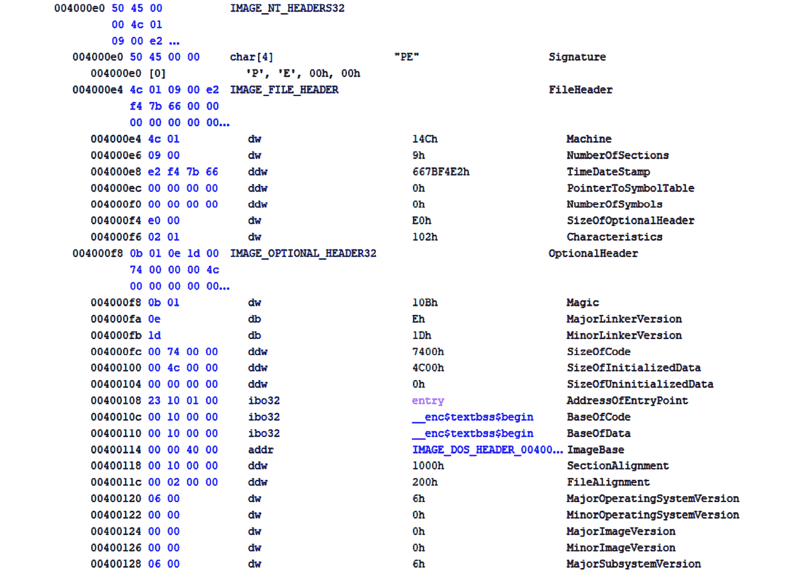

图 4.12 – PE 头部的内容

这是一个需要消化的信息量，但对我们来说，有趣的是 **AddressOfEntryPoint** 字段。目前，它指向一个名为 **entry** 的方法。这就是我们的应用程序将开始执行的地方，所以让我们更详细地检查这个函数。如果我们进一步挖掘并查看入口是什么，我们会到达以下函数：

```cpp
ulong __cdecl entry(void *param_1) {
  ulong uVar1;
  uVar1 = __scrt_common_main();
  return uVar1;
}
```

这本身就是一个有趣的发现，因为它似乎是基于控制台的 Windows 应用程序的入口点。让我们进一步探索。接下来运行的函数如下：

```cpp
int __cdecl __scrt_common_main(void) {
  int iVar1;
   __security_init_cookie();
  iVar1 = __scrt_common_main_seh();
  return iVar1;
}
```

微软的页面 8 包含了 **__security_init_cookie()** 函数的详细描述。然而，另一个函数则是一种不同的生物。它执行大量的初始化，例如设置终端和处理初始化错误。在某个时刻，以下代码片段被执行：

8 [`learn.microsoft.com/en-us/cpp/c-runtime-library/reference/security-init-cookie?view=msvc-170`](https://learn.microsoft.com/en-us/cpp/c-runtime-library/reference/security-init-cookie?view=msvc-170)

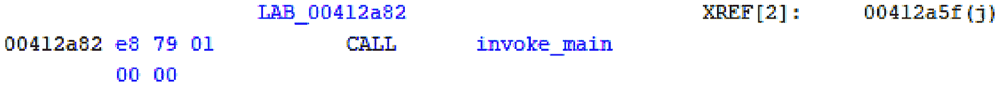

图 4.13 – main() 的调用

如你所猜，**invoke_main** 负责调用 **main()**：

```cpp
int __cdecl invoke_main(void) {
  char **_Argv;
  char **_Env;
  undefined4 *puVar1;
  int *piVar2;
  int iVar3;
  _Env = (char **)__get_initial_narrow_environment();
  puVar1 = (undefined4 *)___p___argv();
  _Argv = (char **)*puVar1;
  piVar2 = (int *)___p___argc();
  iVar3 = main(*piVar2,_Argv,_Env);
  return iVar3;
}
```

到目前为止，我们已经到达了调用我们的 **main()** 函数的阶段。即使是简单的“Hello World！”应用程序，也需要执行大量的样板代码。

现在，我们需要更进一步，并让我们的合成应用程序在 Ghidra 中运行一次（为了简洁起见，我们将省略创建项目、编译和链接应用程序的步骤；让我们假设应用程序通过魔法自行启动）。

由于我们主要感兴趣的是确定在 **main()** 之前的函数调用顺序，并且我们知道我们全局初始化了 **my_a** 和 **my_other_a** 变量，因此我们需要检查二进制文件。在某个时刻，我们会发现以下有趣的数据：

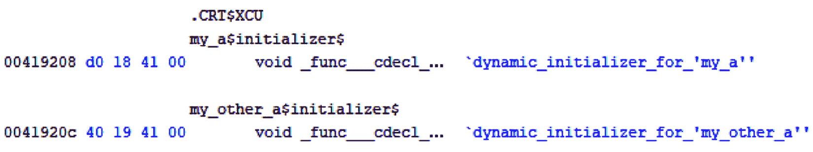

图 4.14 – 根据 Ghidra 的 .CRT$XCU 部分

嗯，这看起来很有趣，特别是那个神秘的 **.CRT$XCU** 文本。这让我们回到了几段之前的讨论，即 PE 文件的各个部分：部分是可执行文件中的不同数据类型和代码的独立区域。

每个部分都服务于特定的目的，并具有定义其行为以及操作系统如何处理它的属性。在微软网站上有一份出色的文档 9，讨论了负责初始化 CRT 的部分，以下是对其的简要总结。

9 [`learn.microsoft.com/en-us/cpp/c-runtime-library/crt-initialization?view=msvc-170`](https://learn.microsoft.com/en-us/cpp/c-runtime-library/crt-initialization?view=msvc-170)

根据文档，默认情况下，CRT 库通过链接器包含，这确保了 CRT 被正确初始化，全局初始化器被调用，随后执行用户定义的**main()**函数。当编译器遇到全局初始化器时，它创建一个动态初始化器并将其放置在**.CRT$XCU**部分。

CRT 在**.CRT$XCA**和**.CRT$XCZ**初始化部分使用特定的指针，如**__xc_a**和**__xc_z**，来定义初始化器列表的开始和结束，确保它们按正确的顺序调用。我们之前讨论过的**__scrt_common_main_seh()**函数负责正确设置这些。

这些名称是由 CRT 预定义的，链接器将这些部分按字母顺序排列。这种排序确保用户定义的初始化器在**.CRT$XCU**标准部分之间执行。

为了操纵初始化顺序，开发者可以使用特定的编译器指令将初始化器放置在未使用的保留部分，如**.CRT$XCT**（在编译器生成的初始化器之前）和**.CRT$XCV**（在编译器生成的初始化器之后），具体细节请参阅前面提到的 CRT 启动文档，但在采用这种技术之前，请阅读以下内容，因为事情比看起来要复杂得多。

根据微软的说法，这个主题非常依赖于平台和编译器，我们不希望探索这些领域，特别是考虑到官方网站发出的警告：

“目前，编译器和 CRT 库都没有使用**.CRT$XCT**和**.CRT$XCV**这两个名称，但无法保证它们将来不会被使用。此外，你的变量可能仍然会被编译器优化掉。在采用这项技术之前，请考虑潜在的工程、维护和可移植性问题。”

因此，我们再次重复官方警告的内容：除非你真的需要进行这种黑客行为，否则请避免使用这些半文档化的“特性”和编译器的语言，因为（正如官方警告中提到的）没有保证如果今天它能工作，明天或下一次系统更新后它仍然能工作。

相反，让我们将注意力转向我们在**.CRT$XCU**部分“发现”的函数，看看这个非常明确的名字背后隐藏着什么样的魔法，毫无疑问这不是标准的 C（也不是 C++）：

```cpp
void __cdecl `dynamic_initializer_for_'my_a''(void)
{
int iVar1;
uchar *unaff_EDI;
undefined4 *puVar2;
  puVar2 = (undefined4 *)&stack0xfffffffc;
for (iVar1 = 0; iVar1 != 0; iVar1 = iVar1 + -1) {
   *puVar2 = 0xcccccccc;
   puVar2 = puVar2 + 1;
}
__CheckForDebuggerJustMyCode(unaff_EDI);
A::A(&my_a,my_string);
atexit(`dynamic_atexit_destructor_for_'my_a'');
return;
}
```

在执行一些维护任务（例如使用**0xcccccccc**值初始化堆栈）之后，我们可以看到对类**A**构造函数的函数调用，其中第一个参数是**this**对象，并且为特定对象的类析构函数注册了一个**atexit**函数，再次。

这种**0xcccccccc**模式是 Visual C++编译器标记未初始化堆栈内存的典型方式，这使得在调试会话中更容易检测到未初始化内存的使用。有趣的是，循环似乎并没有执行。然而，如果我们深入挖掘具有较大 C 风格数组的函数的调试构建，我们会看到这个堆栈保护方案的实际应用，以及一些设置得很好的堆栈看门狗。

堆栈看门狗是一种安全机制，通过在函数的局部变量和其堆栈上的控制数据（如返回地址和保存的帧指针）之间放置一个特殊值（称为看门狗），旨在检测和防止基于堆栈的缓冲区溢出攻击。

如果发生缓冲区溢出，看门狗值会改变，这表明发生了某种破坏行为。这允许程序采取纠正措施，例如终止执行以防止利用。

这个术语的起源有些晦涩，它追溯到历史上在煤矿中使用看门狗的情况。矿工会把金丝雀带入矿井以检测一氧化碳等有毒气体。由于金丝雀对这些气体比人类更敏感，如果鸟儿生病或死亡（即停止唱歌），它就会作为矿工撤离的早期预警信号。这并不完全是神话般的比例，但它是实用的——尤其是如果你是矿工，而不是金丝雀。

在这些概念确立之后，我们对应用程序在 Windows 下的加载过程有一个概述，但仅限于控制台。但不要忘记，Windows 是一个 GUI 环境。它创建窗口和对话框，有一个消息循环，并处理大量的事件。

然而，Windows GUI 应用程序的启动过程与基于控制台的应用程序并没有太大的不同。主要区别在于，在调用 GUI 特定的**WinMain**函数之前，**invoke_main**函数会调用两个不同的函数，处理窗口的显示状态和命令行选项。

第一个函数允许我们以不同的方式显示应用程序的窗口。

第二个函数是应用程序的命令行，以宽字符串格式。

其余的只是调用**WinMain**，从那里，我们进入了熟悉的领域，至少对于在这个领域有经验的程序员来说是这样。

在结束本章时，除了鼓励读者在破解二进制文件时进行实验之外，别无他法——这是真正理解特定功能如何在您的系统上运行的唯一方法。

# 概述

在本章中，作者试图提供一个并非全面概述的 Linux 和 Windows 上的应用启动过程。对于执行初始阶段，包括到达**main()**函数之前的临界步骤，所提供的见解并不像平台本身所要求的那样完整，但既然这是一个巨大且非常狭窄的话题，它不会吸引广泛的程序员，所以这本书的名称也就不会是别的了。

通过在 Linux 上探索 ELF，理解**execve()**系统调用，并检查**_start()**函数，您获得了关于底层架构和初始化例程的宝贵知识。同样，关于 Windows 的讨论突出了基于控制台和 GUI 应用程序的启动序列，强调了各个部分的作用以及它们如何组合起来启动您那令人烦恼的程序，尤其是如果它不起作用的话。

为了进一步深化对这个主题的理解，我们建议您通过创建和分析二进制文件、修改启动程序以及观察不同操作系统上的效果来进行实际操作实验。您甚至可以手动更改可执行文件头部的各种地址，看看会发生什么以及它们是如何崩溃的。

这种实用方法不仅将加强本章所涵盖的概念，还将为您提供对应用启动过程的更深入和实用的理解。通过积极探索和实验，您将提高在软件开发领域进行故障排除、优化和创新的能力，同时了解有关软件及其运行环境的有趣和有用的事实。

在我们下一章中，我们将讨论类成员声明的正确顺序。通过一位程序员追求编写无 bug 代码的冒险经历，我们将看到 bug。请继续阅读，您将会的。
