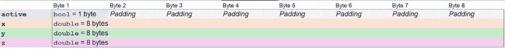
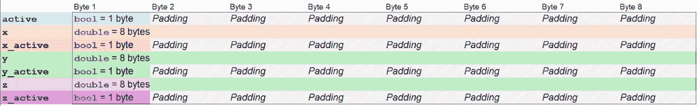
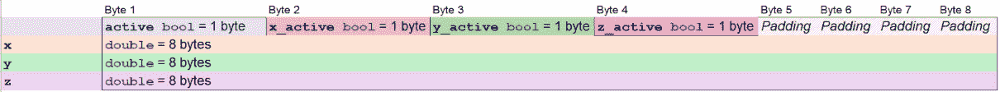
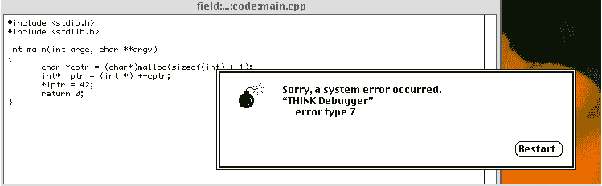

# 第五章：在 C++类中，顺序必须存在

*当法律和秩序* *扼杀创造力*

在各个领域对物品进行排序是确保组织、效率和清晰性的关键。无论是在图书馆或通过字母顺序排列的联系人列表，客户服务队列或使用数字排序的数据分析，按时间顺序排列的时间表或预约，任务管理或紧急响应优先级，库存或数字文件分类，比赛排名，服装尺码排列，旅行中的地理路线或邮件投递，制造或软件开发中的顺序步骤，或者在组织机构和生物分类学中的层级结构，排序有助于简化流程，提高可访问性，并增强决策能力。

通过应用不同的标准，如字母顺序、数字顺序、时间顺序、优先级、分类、排名、大小、地理顺序、顺序或层级，排序在多种环境中促进更好的管理和最优化的运作。

在本章中，我们将探讨为什么 C++类成员的特定顺序很重要，以及当我们正确或错误地声明类成员时，我们可以获得什么和失去什么。

此外，我们还将快速了解 C++中运算符优先级的顺序，因为这是一个在一定程度上可能相当令人困惑的话题，即使是对于更高级的程序员来说也是如此。

通过本章，你将学习以下内容：

+   正确声明类成员的特定顺序的重要性

+   按照所需顺序初始化类成员的重要性

+   正确执行运算符的顺序

# 大小确实很重要

我们在学校学过关于字母表的知识，它将所有字母按照特定的顺序排列，比如如果你是英语使用者，顺序是 A, B, C；如果你是罗马尼亚人，顺序是 A, Ă, Â（是的，罗马尼亚字母表中 A 字母的开头有令人惊讶的大量变体）。但并不是今天所有活着的人都能确定这种顺序的推理，但既然今天的字母表是基于更古老的字母表，比如希腊人的Α, Β, Γ，或者我们古埃及祖先的𓀀, 𓁐, 𓁣，甚至还有𓁷，我们实际上无法确定为什么这种字符的顺序会出现。

字母表是一个非常方便的工具；它帮助我们组织和分类所有可以命名的物品。从昆虫，蚂蚁的分类在蜜蜂之前，到你的橱柜里的香料（除非你根据颜色或，甚至更好的，使用频率来组织它们……可怜的津巴布韦的 mufushwa，你现在会放在后面），它极大地帮助我们保持日常生活整洁有序。

然而，在我们离题太远之前，让我们记住，这是一本关于编程的书（更具体地说，是 C++编程），因此我们需要专注于我们的主题，不要被谈论蜜蜂和鸟儿（当然，按字母顺序，蜜蜂排在鸟儿之前）所分散注意力。

组织 C++ 概念可能是一个非常令人畏惧的话题。在这里，我所说的**概念**是指函数、类和变量，而不是 C++20 中引入的非常实用的**概念**特性，遗憾的是，这并不是本书的主题。

你实际上不能按照你想要的方式去做，因为一些函数需要看到其他函数，一些代码块需要访问你确保在它们之前定义的变量。因此，精心构建一个 C++ 程序可能非常困难。

然而，当讨论转向 C++ 类时，情况就变了。你看，在一个类中，这些与可见性相关的问题实际上并不重要。一个类的所有方法都可以看到该类的所有其他方法，所有成员函数都可以在所有成员函数中直接访问，所以在类中的生活很轻松……

现在，亲爱的 C++ 学徒，我听到你喊道：“但你永远不应该在类内部调用类的析构函数或构造函数！”我大部分同意，但没有任何阻止我编写如下方法的事情：

```cpp
struct a_class {
   void reboot() {
      this->~a_class();
      new (reinterpret_cast<void*>(this)) a_class();
    }
};
```

然而，如果你像这样编写代码，亲爱的读者，你将承担后果。但回到我们最初的主题：排序。

人类的大脑天生渴望秩序。我们需要能够对正在处理的内容有一个全面的了解，知道这些信息在哪里，以及如何尽可能容易地找到它们。轻松快速地找到所需信息是至关重要的，即使它像类成员的位置这样微不足道。

因此，在无尽地寻找类中丢失的成员之后，一位游戏程序员（让我们称他为 Joe）在 BigGameDev 公司愉快地工作时，突然意识到类中的所有成员都应该按字母顺序组织。太棒了，现在每个人都可以轻松地找到他们需要的成员。看看代码有多漂亮：

```cpp
struct point {
   bool active;
   double x;
   double y;
   double z;
};
```

这不是一个特别复杂的使用场景；它只是游戏中某个点的一个位置，通过提供 *x*、*y* 和 *z* 坐标来告诉我们点的位置，并给出对点工作原理的一些小洞察，告诉我们这个特定的点是否活跃。生活很美好。游戏运行得井井有条，玩家们都很开心。

然而，在某个时候，游戏项目的首席程序员认为对该点的某些操作花费了太多时间（我将省略所有关于这些操作是什么以及为什么需要它们的奇特细节），并且这些操作只有在该点记录了所有三个坐标值的变化时才应该执行。我们的程序员 Joe 是一个好人，而且非常有条理，他知道一个解决方案是存储三个其他的 **double** 类型的值，代表之前的 *x*、*y* 和 *z* 坐标，在有任何变化时更新这些值，并且只有在值发生变化时才执行请求的操作。

然而，他放弃了那个想法，迅速想出了另一个主意：他将保留一个用于记录每个所需坐标变化的**布尔**标志，因为他知道**布尔**通常只占用 1 个字节，而他们平台上的**双精度浮点数**最多占用 8 个字节。这样节省了……好吧，21 个字节。所以，这是乔的新类：

```cpp
class point {
   bool active;
   double x;
   bool x_changed;
   double y;
   bool y_changed;
   double z;
   bool z_changed;
};
```

美丽——就像他写的所有代码一样，它几乎就像诗歌。他将新编写的代码提交到仓库，那里将在夜间构建，第二天将交付新鲜出炉的二进制文件进行测试。然后他不会去度假，因为他是一个勤奋的程序员；夏天还早，所以他将在测试团队批准代码后再预订机票。

那一夜，自动化测试爆炸了，每个测试套件都失败了，整个仪表板像某些共产主义国家的旗帜一样变成了红色。第二天，整个测试部门面临了致命的失败，游戏崩溃了，99.9%的错误在某个时刻都与内存不足问题有关。

应用程序突然消耗了几乎是其预期消耗量两倍的内存，测试机器努力保持所需的帧率，一切都在变慢，除了内存分配检查，它稳定地显示应用程序现在使用的内存比昨天多得多。

除了乔自己对其点类的全面重写之外，并没有太多变化；有其他开发者将主菜单的背景颜色从深灰色改为了黑色（遗憾的是，本应实施乔所请求的具有里程碑意义的变更的开发者那天不得不在家照顾生病的孩子），因此开发团队聚集在一起讨论新发现的问题。

主开发人员（让我们称他为吉米，以表彰他在编程语言方面的精通）看了看代码，并迅速宣布，“乔，伙计，我真的很欣赏你代码的整洁性，以及你按字母顺序组织成员的方式，但我将不得不礼貌地请你改变它们的顺序。”

乔的脸色几乎和持续集成监控屏幕上的测试失败指示器一样红，但他是一个理性的人，所以他友好地询问为什么他应该那样做。吉米看不到代码中的美吗?!

吉米的回应让他震惊。这是吉米的解释。

C++类的内存布局由多个因素决定，包括其成员的大小和对齐要求、继承层次结构，以及编译器为了满足对齐约束而添加的填充。当谈到大小的时候，每个数据成员根据其类型占用一定数量的字节。

我相信 Joe 意识到了这一点；然而，从他的解决方案来看，他可能并没有完全理解每个成员的对齐方式。每个数据成员必须存储在满足其对齐要求的内存地址上。对齐要求通常是类型的大小，但可以通过编译器特定的指令进行调整。

现在，来看填充，为了满足这些对齐约束，编译器可能会在成员之间插入填充字节，并且为了确保类的大小是最大对齐要求的倍数，可能需要在类的末尾添加填充。

现在，当在内存中设置时，团队最初可能看起来如下，考虑到在他们架构上，双精度浮点数的大小是 8 字节：



图 5.1 – 初始类布局

使用这种对齐方式，添加的类大小总计为 32 字节。但现在，由于 Joe 添加了三个额外的**bool**类型，每个 1 字节长，编译器可能会根据以下布局组织内存：



图 5.2 – 新成员顺序错误的类布局

因此，每个**bool**的字节都必须填充到 8 字节，以便将随后的双精度浮点数放置在正确的内存地址上。这使得类的大小增加到 56 字节，因为 4 个填充到 8 字节的**bool**加上 3 个 8 字节的双精度浮点数，这些加起来总共占用 56 字节。Clang 编译器有一个开关允许我们检查生成的类的内存布局：**-fdump-record-layouts**。为了在这个情况下充分利用它，我们创建了一个简单的源文件，其中包含了之前的类定义，并将其传递给编译器以进行检查：

```cpp
> $ clang -cc1 -fdump-record-layouts main.cpp
*** Dumping AST Record Layout
         0 | struct Point
         0 |   _Bool active
         8 |   double x
        16 |   _Bool x_changed
        24 |   double y
        32 |   _Bool y_changed
        40 |   double z
        48 |   _Bool z_changed
           | [sizeof=56, dsize=56, align=8,
           |  nvsize=56, nvalign=8]
```

前面的数据清楚地表明了我们最初怀疑的情况，即原本应该占用 1 字节的**bool**现在正式占用了 8 字节（注意，在幕后，我们创建了一个名为**main.cpp**的文件，其中包含了**point**结构的内容）。

现在，为了纠正这种不幸的情况，我们显然需要采取一些进一步的行动，因此让我们考虑以下方式重新组织类的成员：

```cpp
class point {
   bool active;
   bool x_changed;
   bool y_changed;
   bool z_changed;
   double y;
   double x;
   double z;
};
```

除了伤害 Joe 的感情，成员没有按字母顺序组织之外，这不是一个巨大的变化。我们已经将**bool**值组合在一起，使类尽可能紧凑。

我们已经使用了前面的信息，特别是考虑到每种类型的大小要求，并得出结论，将小型类型组合在一起总是更好的（我们所说的“小型类型”是指类型将占用最少的字节数的变量；例如，我们知道**bool**变量的大小是 1，至少对于我们所使用的实现）。

通过这样做，即通过重新组织成员的呈现顺序，我们创建了以下内存布局（或者说是针对我们架构更优化的类似布局）：



图 5.3 – 成员按正确顺序排列的类布局

事实上，再次使用 Clang 检查后，类的内存看起来与之前的版本非常不同（请再次忽略幕后我们修改了**main.cpp**以包含前面的结构的事实）：

```cpp
> $ clang -cc1 -fdump-record-layouts main.cpp
*** Dumping AST Record Layout
         0 | struct Point
         0 |   _Bool active
         1 |   _Bool x_changed
         2 |   _Bool y_changed
         3 |   _Bool z_changed
         8 |   double x
        16 |   double y
        24 |   double z
           | [sizeof=32, dsize=32, align=8,
           |  nvsize=32, nvalign=8]
```

因此，正如我们现在所看到的，四个**bool**值在内存中依次排列，并且只需要一个填充部分来填充所需的空间，以便**double**值对齐到所需的内存地址。假设我们有一个大小为**4**的字段，我们可以在最后一个**bool**之后、第一个**double**之前很好地放置它，并且不需要任何填充。

听了吉米的解释后，乔现在明白了这个问题。他以前从未遇到过对齐问题，但他决定阅读有关这个主题的内容。他读到的内容非常有趣。

它解释说，由于硬件要求、性能优化和架构约束的组合，内存中变量的对齐是必要的。大多数现代处理器设计为当数据对齐到某些边界时，更有效地访问内存。

例如，一个 8 字节的 double 类型通常最好在 8 的倍数地址上访问，当数据未对齐时，处理器可能需要执行多次内存访问来读取或写入数据，这可能会显著减慢速度。

一些架构，例如较老一代的 ARM 处理器、PowerPC 和较老的 MIPS 处理器，无法正确处理未对齐的访问，在这些情况下，它们会生成一个**SIGBUS**故障，这会导致产生故障的应用程序提前终止。例如，以下应用程序在编译后，在一代处理器的结果二进制文件上执行将生成一个**SIGBUS**故障：

```cpp
#include <cstdlib>
int main(int argc, char **argv) {
    char *cptr = (char*)malloc(sizeof(int) + 1);
    int* iptr = (int *) ++cptr;
    *iptr = 42;
    return 0;
}
```

在操作系统没有准备好处理对齐错误的情况下，这种高度不愉快的情况往往会产生相当严重的后果，例如应用程序崩溃。较老的系统甚至可能产生系统崩溃。



图 5.4 – 较老系统在看到未对齐数据时大发雷霆

你可能会问**错误类型 7**是什么意思。答案是简单的：7 是分配给**SIGBUS**错误的魔法数字。在作者的 Linux 机器上，它可以在**/usr/include/x86_64-linux-gnu/bits/signum-arch.h**文件的第 34 行找到：

```cpp
/* Historical signals specified by POSIX. */
#define SIGBUS        7    /* Bus error.  */
```

一些其他处理器，例如较新的 x86_64 处理器，或者甚至较老的 80286（以及两者之间的所有处理器，大多数遵循 x86 平台规范以及更远），处理这些情况非常优雅，只是在性能上略有时间损失，但它们可以通过以下汇编指令轻松地被说服，变成一个非常多变的个性：

| **AT&T (** **64 bit)** | **Intel (** **32 bit)** |
| --- | --- |
| **pushf****orl $0x40000,(%rsp)****popf** | **pushfd****or dword ptr [** **esp], 40000h****popfd** |

上面的代码使用位或操作修改了**EFLAGS**寄存器中的特定位。具体来说，十六进制值**40000h**对应于设置**EFLAGS**寄存器中的**AC**（代表对齐检查）标志，这个标志用于控制对齐检查。当此标志被设置且**CR0**寄存器中的**AM**（代表对齐掩码）位也被设置时，处理器会检查数据是否对齐在自然边界上。如果检测到数据对齐错误，则会生成一个故障。

**EFLAGS** 寄存器是 x86 架构 CPU 中用于特殊目的的寄存器，其中包含反映处理器状态的几个标志。这些标志可以控制或指示各种条件，例如算术条件、控制功能和系统设置。英特尔开发者中心 1 包含有关这些低级编程特性的大量信息。我们鼓励对这一主题感兴趣的人去浏览该网站以获取更多信息。

1 [`www.intel.com/content/www/us/en/resources-documentation/developer.html`](https://www.intel.com/content/www/us/en/resources-documentation/developer.html)

当前面的代码被插入到应用程序的源代码中时，我们可以看到**SIGBUS**信号在起作用。我们在这里省略了那段代码，因为没有人应该编写故意使他们的应用程序崩溃的代码，而是让我们来检查一下我们的朋友乔与类成员奇特出现顺序的另一次遭遇。

# 必须遵守的顺序

在 BigGameDev 工作期间，乔被分配了另一个与角色发展略有相关的工作——游戏中的角色，即不是他自己的角色。这项任务很简单：只需要返回一个格式化的字符串，表示角色拥有的生命值。

为了实现这一点，乔创建了以下类：

```cpp
#include <string>
#include <format>
#include <iostream>
#include <string_view>
struct life_point_tracker {
  life_point_tracker(std::string_view player, int points) {
       m_player = player;
       m_points = points;
       m_result = std::format("{} has {} LPs",
                              m_player, m_points);
   }
   std::string get_data() const {
       return m_result;
   }
private:
   std::string m_result {""};
   std::string m_player {""};
   int m_points         {0};
 };
int main() {
   life_point_tracker lpt("Joe", 120);
   std::cout << lpt.get_data();
}
```

这是非常直接的。它只是接收输入数据并将结果存储起来，以防将来需要再次访问。乔非常高兴；类成员按类型组织得很好，但他不再坚持按字母顺序排列（他从对齐讨论中吸取了教训）。他甚至使用了现代 C++，比如格式库或成员的类内初始化，以防某些成员没有被初始化（我们可以争论，字符串在默认构造函数创建时被初始化为空字符串，所以对它们来说，这并不那么相关。对于**int**来说就不是这样了），他对所编写的代码总体上感到满意。

他本可以直接将这些代码提交到他们的仓库中，但常识占了上风。他进行了一些快速测试，并在确保一切按预期工作后，请他的主管（即我们在上一节中介绍过的 Jimmy）快速审查一下代码。代码看起来没问题；它编译并执行了所需的操作，只有两个微小的观察需要添加。乔得到了以下反馈：在构造函数的体内分配成员而不是使用初始化列表。此外，由于他无论如何都要使用初始化列表，所以他应该将成员设置为 const，以实现一些编译器可能在某个阶段决定提供的微小优化。

因此，他应该这样做：

```cpp
const std::string m_result {""};
const std::string m_player {""};
const int m_points         {0};
```

在 C++中，由于几个关键优势，通常在构造函数中使用初始化列表而不是体内初始化：它更高效，因为它直接初始化成员变量，而不是先默认初始化然后赋值。此外，它确保了**const**和引用成员的正确初始化，这些在构造函数的体内无法得到妥善处理。

乔高兴地修改了代码，由于变化不大，他“忘记”测试它了。相反，他迅速提交了以下序列以供审查：

```cpp
life_point_tracker(std::string_view player, int points)
: m_player(player), m_points(points),
  m_result(std::format("{} has {} LPs", m_player, m_points)) {}
```

响应不会花费太多时间就到达了，而且出人意料地并不是他预期的表扬。

“乔，你测试过这段代码吗？”

他不得不承认，他没有认为这是必要的，因为变化不大。他只是将几行代码向上移动了一点，将一个等号改为一对括号，然后他就完成了。

“哦，我明白了……”吉米说，他从后口袋里掏出一份最新可用的 C++标准的新版印刷本。

标准在**[** **class.base.init]**部分中如下所述：

在非委托构造函数中，初始化按照以下顺序进行：

首先，并且仅对于最派生类的构造函数，虚拟基类将按照在基类指定列表中从深度优先左到右遍历基类有向无环图时出现的顺序进行初始化。

然后，直接基类将按照它们在基类指定列表中出现的顺序进行初始化（不考虑初始化器成员的顺序）。

然后，非静态数据成员将按照在类定义中声明的顺序进行初始化（再次不考虑初始化器成员的顺序）。

最后，执行构造函数体的复合语句。

这在实践中意味着，无论你在初始化列表中指定成员初始化的顺序如何，它们仍然会按照在类中声明的顺序进行初始化，所以**m_result**将是第一个被初始化的，由于它使用了其他两个尚未初始化的数据成员，所以最佳情况下结果将是未定义行为。在最坏的情况下，在测试期间，你将得到默认值，在生产中，代码将失败得非常明显。

现在，凭借这些知识，乔终于能够按时并以他能够实现的最高标准交付预期的代码：

```cpp
life_point_tracker(std::string_view player, int points)
try :
    m_result(std::format("{} has {} LPs", player, points)),
    m_player(player),
    m_points(points)
{
}
catch(...) {throw;}
```

他了解到，虽然使用初始化列表在特定情况下可能是一种神赐，但如果忽略了 C++标准设定的某些基本规则，它也可能将你的代码抛入神话般的七个编译器地狱的深渊。

C++标准规定，成员对象必须按照在类中声明的顺序进行初始化，无论构造函数初始化列表中指定的顺序如何，因为如果没有初始化列表，或者其中只初始化了部分元素，会发生什么？

这个顺序确保了对象设置过程中的一致性和可预测性。当一个对象被构造时，按照声明顺序初始化成员有助于避免如果成员初始化顺序错误可能出现的潜在问题，特别是如果某些成员依赖于其他成员先被初始化。

这种规定的初始化顺序直接影响析构顺序，析构顺序与初始化顺序相反。确保成员以初始化顺序的相反顺序被销毁，确保在析构阶段需要时依赖成员仍然有效。这种一致且可预测的清理过程防止潜在错误并保持对象生命周期的完整性。

基于语言的这个要求，我们可以通过使用一个有趣的功能——称为**指定初始化器**，来轻松地提供一个优雅且更简洁的解决方案，这个功能是在 C++20 中引入的。让我们简化我们的结构，使其看起来像以下这样：

```cpp
struct life_point_tracker {
   std::string get_data() const {
       return m_result;
   }
   std::string m_player {"Nameless"};
   int m_points {0};
   const std::string m_result
       {std::format("{} has {} LPs", m_player, m_points)};
};
```

这些简单的结构满足用作聚合的要求，这对于编译指定的初始化器特性是必需的，正如你所见，**m_result** 成员在自身构造过程中使用了已经初始化的 **m_player** 和 **m_points** 成员。现在，在我们想要使用类的位置，我们只需做以下操作：

```cpp
int main(int argc, char **argv) {
   life_point_tracker lpt {
       .m_player = "Joe",
       .m_points = 120
   };
   std::cout << lpt.get_data();
}
```

通过遵循这个方便的特性，我们明确指定了哪个成员应该初始化为哪个值（如果需要初始化的整数超过两个，这可能会非常有帮助）。此外，该特性要求成员按照其声明的顺序指定，从而提高了代码的可读性和可维护性。唯一的缺点是我们不得不将我们的类简化为 **聚合体**，因此没有虚拟函数，没有构造函数，没有封装——所有这些将 C++ 类提升到神话般名望的好东西都没有了。但如果这对乔来说足够好，我们可以忍受它。

# 深入思考关于秩序

我们的朋友乔的冒险并没有结束，因为在他了解到类成员的正确顺序不一定是字母顺序之后不久，他被分配了一个涉及以并行方式执行一些代码的任务。由于他通过观看 TikTok 上某个人的快速入门教程学习了有关线程及其相关特性的所有内容，他觉得自己能够胜任这项任务，不久之后，以下代码被提交到仓库中（请在这个问题上宽容作者；由于版权和知识产权诉讼的一些病理表现，我们无法展示整个开发团队花费两周时间调试和修复的原始代码。示例代码实际上只是在尝试重现乔成功实施的场景）：

```cpp
#include <cstdio>
#include <thread>
#include <chrono>
using namespace std::chrono_literals;
struct bar {
  bar() : i(new long long) {
    *i = 0;  printf("bar::bar()\n");}
  ~bar() {printf("bar::~bar()\n"); delete i;  i = nullptr;}
  void serve() {
   while(true) {
     (*i)++;
     if(*i % 1024768 == 0) {
       std::this_thread::sleep_for(200ms);
       (*i) = 0;
       printf("."); fflush(stdout);
     }
     if(stopRequest) break;
   }
}
long long* i = nullptr;
bool stopRequest = false;
};
struct foo {
  foo() : thread(&foo::threadFunc, this) {
    printf("foo::foo()\n");
  }
  ~foo() {
      printf("foo::~foo()\n"); b.stopRequest = true;
  }
  void threadFunc() {
    b.serve();
  }
  std::jthread thread;
  bar b;
};
int main() {
  foo f;
  std::this_thread::sleep_for(2000ms);
  printf("main returns\n");
  return 0;
}
```

给定的 C++ 程序试图尽可能接近乔创造的简单多线程混乱，使用两个友好的结构，命名为 **bar** 和 **foo**（我们让 **baz** 休息一会儿，但如果你想念他，你可以将函数命名为 **baz**），为了在单独的线程上执行任务，创建有意义的交互。**bar** 结构管理一个动态分配的 **long long** 变量，**i**（因为我们会叫一个具有索引角色的变量叫什么呢？），它在 **serve** 方法中不断递增。当递增计数达到 **1024768**（让我们忽略 1024x768 也是一个屏幕分辨率的事实），然后它暂停 200 毫秒，将计数器 **i** 重置为 **0**，并在控制台打印一个点（在现实生活中的应用程序中，发生了其他事情，但这超出了本书的范围）。

这个循环会无限期地继续，直到 **stopRequest** 被设置为 **true**，向线程发出退出信号。**bar** 的构造函数初始化计数器 **i**，并且出于我们唯一的调试目的，它打印一条消息，而析构函数处理内存清理并打印另一条消息，确保资源得到适当管理。至于乔为什么没有使用智能指针，又是另一个故事了，所以我们现在就先不关注那个部分。

**foo** 结构负责启动和停止运行 **bar** 实例的 **serve** 方法的线程。在创建时，**foo** 初始化一个 **std::jthread** 来运行其 **threadFunc**，它反过来调用其 **bar** 实例的 **serve** 方法。这种设置允许 **serve** 方法与 **main** 程序并发运行。**foo** 的析构函数将 **stopRequest** 设置为 **true**，确保线程优雅地退出。再次，乔为什么决定选择这种优雅地结束线程的方式仍然是个谜，但既然它已经工作（在已经提到的两周的调试和故障排除会议之后），工程团队决定永远不再提及这段代码。

在 **main** 函数中，创建了一个 **foo** 实例，在创建时启动线程，然后程序休眠两秒钟以允许线程运行。为了简洁起见，我们只需假设在原始应用程序中没有提到任何类型的休眠；解决方案真正的美在于 **main** 和 **bar** 线程中执行的一些长时间操作。

亲爱的经验丰富的 C++ 程序员：请不要关注这段合成代码是如何处理线程同步的，或者它分配和释放内存的事实，因为那不是它的目的。这段代码的唯一目的是崩溃。对于 **std::jthread**，有足够的机制来正确处理执行，例如 **std::stop_source** 和 **std::stop_token**，所以请随意阅读它们，让乔现在就忍受他天真地处理线程的方法。

当代码执行时，以下结果是作者在 Linux 系统上至少得到的结果：

```cpp
> $ ./a.out
bar::bar()
foo::foo()
.........main returns
foo::~foo()
bar::~bar()
```

然而，有时输出如下：

```cpp
> $ ./a.out
bar::bar()
foo::foo()
.........main returns
foo::~foo()
bar::~bar()
[1]    93622 segmentation fault (core dumped)  ./a.out
```

乔也遭遇了同样的事情。偶尔，应用程序会在退出时出现混乱并崩溃。最初，这并不是太大的麻烦，因为，嗯，如果应用程序在结束时崩溃，那并不是结束。然而，过了一段时间，乔编写的代码被引入到一个更大的模块中，那里就出现了混乱、混乱，以及前面提到的两周的调试会议。

犯罪的原因相当简单。吉米，这位大师程序员在查阅了他的口袋版 C++ 标准后，特别是它的 **[class.dtor]** 部分：

在执行析构函数的主体并销毁在主体内部分配的任何具有自动存储期的对象之后，类 X 的析构函数调用 X 的直接非变体非静态数据成员的析构函数，X 的直接非虚基类的析构函数，如果 X 是最派生类，则其析构函数调用 X 的虚基类的析构函数。所有析构函数都像使用限定名引用一样被调用，即忽略在更派生类中可能存在的任何可能的虚覆盖析构函数。基和成员的销毁顺序与它们构造完成时的顺序相反。析构函数中的返回语句可能不会直接返回到调用者；在将控制权传递给调用者之前，会调用成员和基的析构函数。数组元素的析构函数以它们构造的相反顺序被调用。

关键在于对象被销毁的顺序与它们被创建的顺序相反，就像它们在创建时被推入栈中，在销毁时以优雅的方式从栈中弹出一样。导致错误行为的罪魁祸首很快就被识别为以下内容：

**std::jthread thread;**

**bar b;**

因此，在构建过程中发生的情况是线程被创建并开始执行其线程方法：**void threadFunc() { b.serve(); }**。只有在不可预测的操作被启动之后，**bar b** 对象才被创建。然后，在退出时，根据 C++语言的设计，**bar b** 对象被删除并且其资源被释放。当线程仍然可能在长时间操作中被阻塞时，突然它开始在一个已经被删除的对象上运行。

线程对象创建、实际启动线程例程和**bar b**对象创建之间的延迟如此之小，以至于在创建阶段捕捉到错误几乎是不可能的。但让我们修改**bar**的构造函数，使其大致如下：

```cpp
bar() { std::this_thread::sleep_for(200ms);
    i = new long long; *i = 0;  printf("bar::bar()\n ");}
```

在一瞬间，我们可以看到线程正在运行一个在其开始使用时创建并未完全完成的对象。当然，这个问题可以通过简单地交换成员的顺序来轻松解决：

```cpp
bar b;
std::jthread thread;
```

线程是 C++的一个有趣方面。虽然它带来了许多好处，但也引入了额外的复杂性。正确编写正确且高效的线程代码需要仔细考虑各种线程之间的同步和协调。

调试多线程应用程序可能具有挑战性，因为存在诸如竞争条件、死锁和非确定性行为等问题，或者简单的事实是线程被调试器停止，因此在检查时没有实际的工作发生，有时应用程序的成功或失败实际上取决于类成员声明的顺序。但就目前而言，让我们和 Joe 及他的朋友们说再见。让我们希望他们已经得到了他们的 AAAA 标题，让我们将注意力集中在其他事情上。

# C++ 的黑暗秩序

C++ 语言中有一个很少被阳光照耀的阴暗角落，如果这些深层次中的代码偶然浮出水面，一群核心开发者会立即跳上去，将其重构为可消化的比特和字节。让我们以一个非常简单的例子来考虑一下，为什么在 C++ 中，**a[2]** 和 **2[a]** 表达式是等价的，并且 **a** 是一个对象数组：

```cpp
int main() {
    int a[16] = {0};
    a[2] = 3;
    3[a] = 4;
}
```

上述代码，尽管看起来很丑陋，实际上是可以编译的。原因如下：在 C++ 中，**operator[]** 数组下标是通过指针算术定义的。**a[i]** 表达式被编译器翻译为 ***(a + i)**，其中 **a** 是数组第一个元素的指针，**i** 是索引。最后的 **i[a]** 表达式也被翻译为 ***(i + a)** 表达式，其中 **i** 是索引，**a** 是我们数组第一个元素的指针。

由于对于编译器来说加法是交换的，所以哪个先来并不重要。

因此，我们在 C++ 中找到了一个特定的案例，其中顺序并不重要。但这仅适用于旧式 C 数组；**std::vector** 和 **std::array** 不接受这种无序语法。这有一个非常具体的理由；**std::vector** 和 **std::array** 的下标运算符不支持在原始数组中看到的交换行为，即以下内容：

+   **运算符重载**：对于 **std::vector** 和 **std::array** 的 **operator[]** 是一个成员函数，这意味着它需要在类的实例上调用。它不能通过索引首先调用，因为成员函数要求对象位于调用左侧。

+   **无指针算术**：**std::vector** 和 **std::array** 的内部实现不依赖于原始指针算术进行索引。它们以不同的方式管理内存和边界检查，确保对元素的更安全访问。

在当前阶段，我们能够最接近模拟类型为 **std::vector** 的对象的前述不神圣语法的代码如下：

```cpp
#include <vector>
#include <iostream>
struct wrapper {
   wrapper(int p) : i(p) {}
   int operator[](const std::vector<int> v) {return v[i];}
   int i = 0;
};
struct helper {
   helper() = default;
   wrapper operator << (int a) { return wrapper {a}; }
};
#define _ helper()<<
int main() {
   std::vector<int> vec = {10, 20, 30, 40, 50};
   int b= (_ 2) [vec];
   std::cout << b << std::endl;  // Outputs 30
   return 0;
}
```

然而，经过快速检查后，我们（好吧，实际上并不是两位作者，因为 Alex 至少在这段代码中是无辜的，所以请将此视为皇家我们），我们决定我们对此感到羞愧，不敢将其实现为 **std::array** 或任何其他容器。

但仔细观察后，我们发现那里有一些有趣的代码。我们的主要目标是重新创建向量和数组无序索引访问的顺序，但在我们沉浸于相信这是可能之前，有一个残酷的现实检查：这是不可能的。原因如下：如果我们尝试编译表达式 **2[vec];**，我们会得到以下错误：

```cpp
error: no match for 'operator[]' (operand types are 'int' and 'std::vector<int>')
```

这用普通英语翻译过来，意味着编译器找不到应用于整数并接受整数向量作为参数的索引运算符。只要 C++ 还是 C++，这不会发生，主要有两个原因。第一个原因是 **operator[]** 必须是一个类的成员函数。不可能有一个独立的 **[]** 运算符。

第二个原因是叫做运算符优先级的一个奇特现象。这并不是一个叫做 *优先级* 的运算符，而是以下内容：在 C++ 中，运算顺序，也称为运算符优先级，决定了运算符之间的解析方式。优先级较高的运算符先于优先级较低的运算符进行评估。当运算符具有相同的优先级时，它们的结合性决定了评估的顺序。

虽然在最新的标准中，*第七章* *表达式*（特别是 **[expr.pre]** 部分）提到“运算符的优先级没有直接指定，但可以从语法中推导出来”，但也有一些官方信息来源 2 2，它们包含了它们的精确顺序，所以我们真心鼓励你花时间去研究这些来源之一。

**2** [`en.cppreference.com/w/cpp/language/operator_precedence`](https://en.cppreference.com/w/cpp/language/operator_precedence)

## 最重要的问题

现在你回来了，亲爱的读者，我们非常确信你可以轻松回答以下问题。以下程序的输出是什么？

```cpp
#include <iostream>
int main() {
    auto a = 4;
    std::cout << sizeof(a)["Hello World"] << std::endl;
    return 0;
}
```

然而，在你急忙将代码输入编译器之前，请暂停，坐下来，仔细思考这里到底发生了什么。本节为你提供了所有必要的提示、方向和可能的线索，以便正确回答。我们故意不会立即给出答案，也不会对代码进行完整的解释，只是快速分析一下正在发生的事情，这应该足以让你弄清楚：

+   在 **auto a = 4;** 表达式中，变量 **a** 被声明为 **int** 类型并初始化为 **4**。这正是现代 C++ 中 **auto** 和数字工作的方式。

+   现在来到了棘手的部分。在我们的大脑中解析代码，很明显，**sizeof(a)** 表达式评估为 **std::sizeof** 类型，并且通常情况下，**sizeof(int)** 在大多数系统中是 4 个字节。当然，较老的 16 位系统中的 **sizeof(int)** 是 **2** 个字节；一些奇特的系统可以将 **sizeof(int)** 设置为 **8** 个字节，但作者从未见过这样的系统。

这是所有我们的推理都陷入困境的关键点。起作用的是 C++的运算符优先级。以下是从前一个表中提取的微小部分，我们只保留了与我们的案例相关的部分：

| **优先级** | **运算符** | **描述** |
| --- | --- | --- |
| 1 | **::** | 命名空间解析运算符 |
| 2 | **a++ a--** | 后缀递增和递减 |
|  | **a()** | 函数调用 |
|  | **a[]** | 下标 |
| 3 | **++** **a --a** | 前缀递增和递减 |
|  | **+** **a -a** | 一元加和减 |
|  | **! ~** | 逻辑非和位非 |
|  | ***a** | 解引用 |
|  | **&a** | 地址运算符 |
|  | **sizeof** | 大小运算符 |

现在，我们终于可以看到，在我们的代码中，表达式 **sizeof(a)** 永远不会被评估。由于 C++编译器的工作方式，**[]** 运算符的优先级高于 **sizeof**，所以首先会被评估的是 **(** **a)["Hello World"];**。

由于在 C++中 **(a)** 几乎总是与 **a** 相同（除了当你处理 *最令人头疼的解析* 时，但关于这一点将在稍后讨论），表达式与 **sizeof** **a["Hello World"];** 相同。

现在，正如我们所看到的，这会产生与 **sizeof "Hello World"[a];** 相同的结果，考虑到今天，**a** 很可能为 **4**，这将给我们字符 **'o'**。因此，整个表达式现在简化为 **sizeof 'o'**，考虑到 **sizeof** 的工作方式，它将始终返回 **1**。

我们，作为作者，认为在这个阶段，我们问题的答案已经很明显了。

# 当顺序不重要时

在结束这一章之前，我们不应该忘记提到一件小事。实际上，有两件。第一件是，在 C++中，函数参数评估的顺序是不确定的。这意味着当你用一个具有多个参数的函数调用时，编译器可以自由地以它选择的任何顺序评估这些参数。如果参数有副作用，如修改变量，这可能会导致意外结果。

让我们以以下程序为例：

```cpp
#include <iostream>
int f (int a, int b, int c) {
    std::cout << "a="<<a<<" b="<<b<<" c="<<c<<std::endl;
    return a+b+c;
}
int main() {
    int i = 1;
    std::cout<<"f="<<f(i++, i++, i++)<<std::endl<<"i="<<i<<std::endl;
}
```

无论你认为这个程序的结果是什么，它都会是错误的。

这种原因再次是，如前所述：参数评估的顺序没有指定。你可能会问，为什么？这个原因有点复杂且具有历史性。但在深入探讨这一点之前，让我们先娱乐一下，看看各种编译器通过 gcc.godbolt.org 和其他来源提供的输出。

| **编译器** | **输出** |
| --- | --- |
| Microsoft Visual C++ ( after 2005) | **a=1** **b=1 c=1****f=3****i=4** |
| Microsoft VS.NET 2003 | **a=3** **b=2 c=1****f=6****i=4** |
| Microsoft Visual C++ 6 | **a=1** **b=1 c=1****f=3****i=4** |
| ICC 和 Clang 对此达成一致… | **f=a=1** **b=2 c=3****6****i=4** |
| GCC, after 6.5 | **f=a=3** **b=2 c=1****6****i=4** |
| GCC, before 6.5 | **a=3** **b=2 c=1****f=6****i=4** |
| Turbo C Lite 和 Borland C++55 | **a=3** **b=2 c=1****f=6****i=1** |

因此，我们有大量的选项可供选择，一些更直接，一些更奇特。所有这些奇怪值都声称自己是正确的，是统治它们的那个，不管事实是即使是同一供应商的同一编译器的不同版本也会提供不同的结果。而且它们都相信自己的正确性。

简单来说，推理是允许编译器自由选择求值的顺序，使其能够进行优化，从而提高性能，这些性能是我们程序员可能注意不到的。编译器可以重新排序指令以利用 CPU 流水线，最小化寄存器使用，并提高缓存效率。指定严格的顺序将限制这些优化机会。

不同硬件架构可能具有不同的最佳求值策略。由于没有指定求值的顺序，C++代码可以更容易地为各种架构优化，而无需对代码本身进行更改。

此外，由于没有指定求值的顺序，C++语言规范保持得更简单。为所有表达式指定严格的顺序会增加语言定义的复杂性，并增加编译器开发者的负担。更不用说当前的标准几乎有 2,000 页长，所以也许不添加几百页详细说明参数求值顺序的复杂性是个好主意。

然而，我们在本节开头承诺提到的第二件事出现了：虽然运算符优先级和结合性决定了表达式如何分组和解析，但它们并不决定求值的顺序。这意味着即使你知道表达式将如何分组，表达式各部分实际求值的顺序仍然可能变化。

让我们考虑以下简短的应用程序：

```cpp
#include <iostream>
int main() {
    int i = 4;
    i = ++i + i++;
    std::cout << i << std::endl;
    return 0;
}
```

它真的很短——再短也没有了——而且包含了一些相当糟糕的代码，尤其是看那**++i + i++**。这段代码如此糟糕，以至于编译器都无法真正同意执行它的顺序。

其中一些人选择先执行**++i**（使**i**变为**5**，并将其用作加法的左侧），然后执行**i++**（这将使用已经增加的新值**i**，然后再次增加它以达到**6**，但由于后增加的工作方式，将使用**5**的值作为加法的右侧），然后将此值赋回**i**。所以，结果是 5 + 5 = 10。

然而，其他编译器决定先执行**i++**，从而保持操作右侧的值**4**，同时将**i**的值增加到**6**。现在，**++i**被评估，它已经看到了增加的值**6**，决定使用它，然后增加它，从而获得加法左侧的**7**。因此，这将给出 7 + 4 = 11。

现在，稍微回顾一下，没有指定评估顺序会鼓励开发者意识到这一奇特特性，编写不期望特定评估顺序的代码。这可以导致更健壮和可移植的代码，因为开发者必须避免对评估顺序的不当依赖。因此，对前述情况的正确修复将是一些类似于以下内容的代码：

```cpp
#include <iostream>
int main() {
  int i = 4;
  int preIncrement = ++i; // i is now 5
  int postIncrement = i++; //postIncrement is 5, i is now 6
  i = preIncrement + postIncrement;
  std::cout << i << std::endl; // Output will be 10
  return 0;
}
```

虽然这可能是罕见的情况，因为前面的代码有点人为，但这确实是一个问题，尤其是如果我们处理的是以下情况：

```cpp
int f() { std::cout << "f"; return 1; }
int g() { std::cout << "g"; return 2; }
int result = f() + g();
```

**result**的值无论如何都将为**3**，但输出将取决于编译器如何决定执行两个函数调用，可以是**"fg"**或**"gf"**。

考虑到所有这些，我们可能会认为我们已经了解了 C++中关于顺序的所有内容。虽然在本章中我们试图涵盖所有可能的后果，但我们不能保证您不会发现任何顺序混乱的情况。C++是一种具有非常广泛范围和独特语法的语言，所以如果有人真的想的话，他们可能会触及某些编译器的痛脚。

# 摘要

通过本章，我们希望您已经掌握了遵循所有与 C++相关内容指定顺序的重要性，以确保代码执行的预测性和无错误。您还应该理解没有指定执行顺序的重要性。

考虑到这一点，我们鼓励您去尝试使用 Compiler Explorer 提供的在线游乐场。它提供了一大批编译器。只需记住，如果您编写的代码在两个编译器上生成了不同的结果，那么您可能已经进入了未指定/未定义行为的领域。

下一章将探讨 C++中内存管理的挑战。
