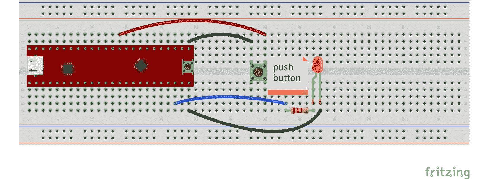

# 第三章：*第三章*：使用按钮点亮或熄灭 LED

在本章中，我们将回顾和实践如何使用连接到微控制器板的**按钮**来点亮或熄灭 LED。按钮是一个实用的组件，其作用类似于开关，用于闭合或打开电子电路。我们可以使用它们来初始化或激活微控制器板上的一个过程。因此，按钮提供的输入数据对于许多需要人工干预的微控制器应用来说非常重要。具体来说，本章将涵盖以下主要内容：

+   介绍按钮

+   理解来自按钮的电气噪声

+   将 LED 连接到微控制器板端口并使用内部**上拉**电阻

+   测试按钮

到本章结束时，你将学会如何将按钮连接到 Curiosity Nano 和 Blue Pill 微控制器板，以及如何编程按钮的输入来点亮或熄灭 LED。你还将学会如何减少按钮中的**电气噪声**问题。正如我们将在本章中看到的那样，尝试解决这个问题并不简单。特别是，“理解来自按钮的电气噪声”部分解释说，并非所有按钮都能 100%无制造错误地工作，并且在使用时可能存在电气噪声。

# 技术要求

本章我们将使用的软件工具将是**MPLAB-X**和**Arduino IDE**。本章的代码可以在本书的 GitHub 存储库中找到，以下是 URL：

[`github.com/PacktPublishing/DIY-Microcontroller-Projects-for-Hobbyists/tree/master/Chapter03`](https://github.com/PacktPublishing/DIY-Microcontroller-Projects-for-Hobbyists/tree/master/Chapter03)

本章的“代码在行动”视频可以在这里找到：[`bit.ly/3cXfZLM`](https://bit.ly/3cXfZLM)

本存储库中的代码示例将用于使用 Curiosity Nano 和 Blue Pill 微控制器板来点亮或熄灭 LED。IDE 的安装指南和使用方法在*第一章*，“微控制器和微控制器板简介”中已解释。在本章中，我们还将使用以下硬件：

+   无焊面包板。

+   Blue Pill 和 Curiosity Nano 微控制器板。

+   用于将微控制器板连接到计算机的微型 USB 线。

+   需要上传编译代码到 Blue Pill 的 ST-Link/V2 电子接口。请注意，ST-Link/V2 需要四根公对公的杜邦线。

+   一个 LED。任何颜色都可以。我们更喜欢在练习中使用红色。

+   一个 220 欧姆、额定功率为四分之一瓦的电阻。

+   四根公对公的杜邦线，用于将电阻和按钮连接到板上。

+   一个普通的、**常开**按钮。

下一节简要介绍了按钮开关，这些开关在电子电路中得到了应用。

# 介绍按钮开关

按钮开关是一种基本像机械**开关**一样工作的电子设备；它可以用来闭合或断开电路。它们也被称为*瞬态按钮开关*或*按钮开关*。按钮开关由硬质材料如塑料制成，内部有一个微小的金属弹簧，它与两根电线或触点接触，如果按下按钮（在**通常开路**按钮开关中）或按下时（在**通常闭路**按钮开关中），允许电流通过它们。当按钮开关关闭时，弹簧缩回，电气接触被中断，电流不会通过触点流动。按钮开关用于手动控制或初始化电路中的过程，包括包含微控制器板的应用。以下图像显示了通常闭路（左侧）和通常开路（右侧）的按钮开关：


图 3.1 – 通常闭路（左侧）和通常开路（右侧）按钮开关

如*图 3.1*所示，通常开路的按钮开关（在右侧）看起来是按下的。请注意，引脚连接到了微控制器板上。

注意

通常开路和通常闭路的按钮开关可能看起来完全相同，这取决于它们的制造商和型号。如果您不确定，请尝试使用微控制器板测试您的按钮，看看它是什么类型的按钮开关。如果按钮开关在不需要您按下它的情况下向微控制器板发送逻辑信号，这意味着它是一个通常闭路的按钮开关。在本章中，您将学习如何将按钮开关连接到微控制器板上。

在微控制器板项目中，按钮开关的一个典型应用是连接或断开微控制器板上的 I/O 引脚的接地或正电压。按钮开关产生的这种电压变化可以通过微控制器板的 I/O 引脚（端口）被微控制器板看到；这将在微控制器板上初始化一个过程。

按钮根据尺寸的不同，有多种类型。大而坚固的按钮通常用于一些工业应用，在这些应用中，操作员需要快速识别并按下它们。较小的按钮通常用于家用电器和设备，例如电脑键盘和固定电话。在本章中，我们将使用一种常见的小型按钮，这种按钮在许多电子套件和包含微控制器板的套件中都很常见。实际上，Blue Pill 和 Curiosity Nano 微控制器板在其电路中都有小型按钮。它们可以用于这两个板来重置其上运行的程序。主要有两种类型的按钮：**常开**和**常闭**按钮。让我们更详细地看看它们：

+   **常开按钮**。在这种类型的按钮中，当未按下时，其开关始终保持开启状态；也就是说，它不会闭合电路。每次我们按下它时，它都会建立电气接触（闭合电路）。当我们按下按钮时，其内部开关关闭。这些是最常见的按钮类型。它们可以用于暂时激活或初始化一个过程；例如，短暂按下按钮以重置微控制器板。

+   **常闭按钮**。在其默认状态下，此按钮可以闭合电路，这意味着其开关在未按下按钮的情况下通常是闭合的。当我们按下这种类型的按钮时，我们打开开关（因此连接到电路的电路也被打开）。这些按钮在需要暂时关闭或中断电气/电子电路时非常有用。例如，如果我们想停止读取传感器，我们可以打开传感器与微控制器板之间的连接。

下一节描述了许多按钮中存在的一个问题，称为**电气噪声**。这种类型的噪声有时可能非常难以（但并非不可能）最小化。

# 理解按钮产生的电气噪声

在许多按钮中都可以产生电气噪声。这可能会对按钮连接的电子电路的功能产生负面影响，并在微控制器板上产生不可预测的结果。

按钮的一个常见问题是**它们并不完美**。它们不会立即关闭开关，并且在许多情况下会产生电噪声。这可能是因为并非所有按钮都完全无制造错误。如果我们尝试将按钮直接连接到微控制器的 I/O 端口，每次按下按钮时，我们似乎都按对了。对我们来说，这似乎就像我们只按了一次。然而，对微控制器板来说，它看起来按钮被按了多次，而且时间非常短，这是由于按钮中产生的电噪声。电噪声可以定义为与电子电路耦合的随机电平或信号。这种电干扰或干扰可能变化很大，从非常小的电压到高电压水平，其频率也可能随机变化。有许多来源会产生电噪声，包括热量、有缺陷的电子元件、机械运动以及电路中的松散电气连接等。

来自按钮的不希望的电噪声几乎总是由一种称为**抖动**的现象引起的，这是由按钮内部金属部件和弹簧的摩擦和机械运动造成的。我们需要对按钮进行**去抖动**，以减少其电噪声，并因此以干净和高效的方式正确地闭合电路（如果我们使用的是常开按钮）。如果我们不对按钮进行去抖动，其内部开关可能会在每次按下按钮时无规律地闭合电路，这将影响整个电路或微控制器板的输入功能。按钮产生的数据信号应该是零伏特（逻辑低）或 3.3 伏特（逻辑高）。如果我们不对按钮进行去抖动，它将产生可能改变这些逻辑级别的电噪声，因此微控制器板可能无法将其识别为这样的信号。

重要

在 Blue Pill 和 Curiosity Nano 板上使用的**高逻辑电平**电压是 3.3 伏特。记住，在某些微控制器板上，它们的逻辑高电平是 5 伏特而不是 3.3 伏特，例如 Arduino 系列的微控制器板。

有几种技术可以处理按钮中的电噪声。例如，这种噪声可以通过连接一些电子元件到按钮，或者通过编码来大大减少，正如我们将在接下来的几节中看到的。

## 通过硬件去抖动按钮

减少按钮电噪声的一种方法是将一个电容器和两个电阻（这也可以称为**RC 去抖动**电路、电阻-电容器网络或 RC 滤波器）连接到按钮上，如图所示。当我们按下按钮时，电容器将被充电。当我们释放按钮时，电容器将保持其电荷一段时间，然后连接到它的电阻将在之后放电。这个电容器的电荷代表一个高逻辑电压，它可以在微控制器板上使用。在电容器充电期间发生的任何瞬态电噪声都可以忽略，因为在此期间电容器提供了一个高逻辑值：


图 3.2 – 连接到按钮的 RC 去抖动器

上述图示包含两个电阻，**R1** 和 **R2**，一个常开按钮，和一个电容器，**C**。电阻和电容器形成一个 RC 去抖动器。记住，**Vcc** 表示正电压，对于 Curiosity Nano 和 Blue Pill 来说，是 3.3 伏。通常，您可以从标记为 3.3V 或 Vcc 的微控制器板的一个引脚获得 Vcc。此外，您可以将 RC 去抖动器连接到标记为地的一个微控制器引脚。正如我们在前面的图示中看到的，这三个电子元件可以用来减少按钮中的电噪声。**R1**、**R2** 和 **C** 的典型值分别是 10K 欧姆、10K 欧姆和 0.1 微法拉，尽管如果 RC 去抖动器没有有效工作，您可能需要更改这些值，因为每个按钮中的电噪声并不总是相同的。RC 去抖动器的数学公式在 Ganssle, J.G. (2008)的《去抖动指南》中有详细解释。

我们在本节中包含了 RC 去抖动器作为参考，以防软件去抖动方法对您不起作用。下一节将向您展示如何仅使用软件去抖动按钮。

## 通过软件去抖动按钮

我们可以通过编码来最小化按钮产生的虚假电噪声。我们可以在代码中使用的一个技巧是在按下连接到我们电路的按钮后，立即忽略一段非常短时间的电噪声（通常是一些几十毫秒）。以下图示展示了如何将按钮直接连接到微控制器板的 I/O 端口，以通过软件进行去抖动：


图 3.3 – 带下拉电阻连接到 I/O 端口的按钮

前面的图中显示了一个下拉电阻，**R**，它迫使微控制器板的输入端口接收零伏（逻辑低），这连接到地，而按钮未被按下。下拉电阻，**R**，的典型值是 10k 欧姆。当我们需要不断向微控制器板的 I/O 端口输入低电平时，我们可以使用下拉电阻。当我们按下按钮时，只需将其切换到逻辑高电平。这可以用于瞬间启动一个过程，例如，打开连接到我们电路的灯。以下图示展示了如何将上拉电阻连接到微控制器端口，强制其输入为 3.3 伏（**Vcc**）：


图 3.4 – 带有上拉电阻连接到 I/O 端口的按钮

前面图中的电阻值（**R**）通常是 10K 欧姆。

重要提示

您需要将下拉或上拉电阻连接到微控制器的输入端口，因为如果您不连接任何东西到端口（这可能在按钮未被按下时发生），端口将由于其内部电子排列而呈现未确定的（随机）电压。这被称为**浮空**输入电压。

前面的图中包含一个常开按钮。一旦按钮被按下，输入电压将变为逻辑高电平，或 3.3 伏。请记住，逻辑高电平可以是 5 伏，这取决于你使用的微控制器板。**Vcc** 电压和地线连接到微控制器板上。

幸运的是，许多微控制器提供了内部上拉和下拉电阻，这些电阻连接到它们的 I/O 端口，可以通过编码激活。Blue Pill 就包含这些！这意味着我们可以直接将按钮连接到其 I/O 端口，无需连接外部电阻，只需通过软件激活板上的内部上拉或下拉电阻。这可以加快需要使用按钮的原型开发，但这可能并不总是最佳解决方案。

以下图示展示了两种将按钮直接连接到 I/O 端口的方法。此端口已经通过软件激活了一个上拉或下拉电阻：


图 3.5 – 直接连接到 I/O 端口的按钮

如您所见，软件去抖动方法不使用连接到按钮的 RC 去抖动。这种方法大多数时候都有效，并且可以节省您的时间和精力。然而，如果您发现按钮的电气噪声持续存在，您应该进行实验并尝试两种方法。

每种去抖动方法都有其权衡。在基于硬件的方法中，你需要在按钮上连接一些电子元件。你还需要购买这些额外的元件。在基于软件的方法中，你将使用微控制器的内部上拉或下拉电阻，你不需要将任何额外的元件连接到按钮上，但你需要在程序中添加更多行代码来处理去抖动，这些指令可能会占用微控制器的一些宝贵的处理周期。尽管如此，我们仍然建议你使用基于软件的去抖动方法，因为它易于实现。

下一节将处理示例，展示如何将按钮连接到蓝色药丸和 Curiosity Nano 微控制器板，以及如何通过软件去抖动它。

# 将 LED 连接到微控制器板端口并使用内部上拉电阻

在本节中，你将学习如何将按钮连接到蓝色药丸和 Curiosity Nano 微控制器板。这对于这些微控制器板来说是一个简单的练习，它演示了如何使用按钮向微控制器板发送逻辑低电平信号来打开或关闭连接到它的 LED。如果我们想在我们的电子电路示例中使用按钮，我们需要将其连接到微控制器板的一个输入端口。此外，请记住，我们应该去抖动按钮以避免不希望的结果。

以下小节将展示如何通过编码来去抖动连接到蓝色药丸的按钮。这是去抖动按钮最简单的方法，你可以在本书的其他章节中使用这种方法。

## 通过软件连接蓝色药丸来去抖动按钮

在本节中，我们将展示一个 Fritzing 图，然后是一张显示所有连接的图片。我们还将查看一些代码，演示如何通过软件去抖动按钮。

以下是一个 Fritzing 图，展示了如何将按钮直接连接到一个已经使用其内部上拉电阻的 I/O 端口。LED 及其相应的电阻连接到蓝色药丸的端口号；即，`B12`：


图 3.6 – 使用内部上拉电阻的蓝色药丸与按钮

如你所见，每次我们按下按钮时，LED 都会打开或关闭。

请注意，在前面的图像中，按钮连接到面包板的中心，位于微控制器板的右侧。按照以下步骤将按钮和 LED 连接到蓝色药丸，如图所示：

1.  将蓝色药丸插入无焊面包板。

1.  将按钮插入面包板，并使用杜邦线将其中一个引脚连接到蓝色药丸的地线引脚。

1.  使用杜邦线将按钮的另一个引脚连接到 Blue Pill 的 `B0` 端口。

1.  将一个 220 欧姆的电阻插入面包板，并使用杜邦线将其一个引脚连接到 Blue Pill 的 B12 端口。

1.  将 LED 插入面包板，将其阳极连接到另一个电阻的引脚。

1.  使用杜邦线将 LED 的阴极连接到 Blue Pill 的一个地线引脚。

以下图像展示了如何根据之前显示的 Fritzing 图纸连接按钮到 Blue Pill：


图 3.7 – 将按钮连接到 Blue Pill 的阴极，然后使用杜邦线将其连接到 Blue Pill 的一个地线引脚

如您所见，Blue Pill 板在引脚的顶部和底部行都有地（G）引脚。这有助于电路中的组件连接。

记住，您需要将 ST-Link/V2 电子接口连接到 Blue Pill，以便从 Arduino IDE 上传程序，如*第一章**，*微控制器和微控制器板简介*中所述。

以下代码展示了如何在 Blue Pill 上通过软件进行按钮消抖。您可以在本书的 GitHub 仓库中找到此代码文件，其中包含注释。文件名为 `internal_pullup_debounce_Blue_Pill.ino`：

```cpp
#define PinLED PB12
#define Pinpushbutton PB0
void setup() {
  pinMode(PinLED, OUTPUT);
  pinMode(Pinpushbutton, INPUT_PULLUP);
}
int reading_pushbutton;
int ledState = HIGH;
int buttonState;
int lastButtonState = LOW;   
unsigned long lastDebouncingTime = 0; 
unsigned long debouncingDelay = 50;  

void loop() {
reading_pushbutton=digitalRead(Pinpushbutton);
if (reading_pushbutton!= lastButtonState) {
    lastDebouncingTime = millis();
}
if ((millis() - lastDebouncingTime) > debouncingDelay) {
    if (reading_pushbutton!=buttonState) {
        buttonState = reading_pushbutton;
        if (buttonState == HIGH) {
            ledState = !ledState;
        }
    }
  }
digitalWrite(PinLED, ledState);
lastButtonState = reading_pushbutton;
}
```

以下代码在按钮按下后等待 50 毫秒，并切换 LED 的值。这个值是实验性的，所以如果你的按钮工作不稳定，你可能需要更改它。

重要提示

在 Arduino IDE 中，Blue Pill 的 I/O 端口用字母 P 表示。例如，端口 B12 在 IDE 中表示为 `PB12`。此外，端口标签（名称）必须用大写字母书写。

如前述代码所示，它持续读取 Blue Pill 的端口 `B0`。如果按下按钮，按钮将端口 `B0` 连接到地。然后，`B12` 输出端口发送高逻辑电平并打开连接到 `B12` 的 LED。如果未按下按钮，`B12` 端口发送低逻辑电平。

小贴士

如果您使用 Arduino 微控制器板，您也可以通过软件进行按钮消抖。实际上，我们在本章中使用的基于软件的消抖方法是基于 Arduino 板上使用的方法，如这里所述：

[`www.arduino.cc/en/Tutorial/BuiltInExamples/Debounce`](https://www.arduino.cc/en/Tutorial/BuiltInExamples/Debounce)

如果您按下按钮时 LED 灯亮和灭，恭喜您！注意当您按下按钮时微控制器板如何反应。如果您在仅按下按钮时 LED 灯不规律地闪烁几次，如果您正在进行 RC 去抖动，您可能需要更改电阻或电容的值；如果您通过软件去抖动按钮，您可能需要更改毫秒等待值。

下一节描述了如何通过软件去抖动连接到 Curiosity Nano 微控制器板的按钮。

## 使用 Curiosity Nano 上的按钮开关 LED 灯

在本节中，我们使用 Curiosity Nano 通过等待一些毫秒来软件去抖动按钮。我们可以使用`__delay_ms()`函数来完成此操作。请记住，该函数是用两个下划线符号（`__`）编写的。

以下 Fritzing 图显示了如何将按钮连接到 Curiosity Nano：



图 3.8 – 直接连接到 Curiosity Nano 板的按钮

请注意，按钮连接到面包板的中心，位于微控制器板的右侧。

根据前面的图像，以下是连接所有组件的步骤：

1.  将 Curiosity Nano 插入无焊面包板。

1.  将按钮插入面包板，并使用杜邦线将其中一个引脚连接到 Curiosity Nano 的地线引脚。

1.  使用杜邦线将按钮的另一个引脚连接到 Curiosity Nano 的`RA0`端口。

1.  将一个 220 欧姆的电阻插入面包板，并使用杜邦线将其中一个引脚连接到 Curiosity Nano 的`RD2`端口。

1.  将 LED 插入面包板，将其阳极连接到另一个电阻的引脚。

1.  使用杜邦线将 LED 的阴极连接到 Curiosity Nano 的一个地线引脚。

以下图像显示了所有组件的连接方式：


图 3.9 – 连接到 Curiosity Nano 的按钮

在前面的图像中，您可以看到 Curiosity Nano 的上下行引脚都有地线（`GND`）引脚。这允许我们为电路中的组件布线。

我们为 MPLAB-X IDE 创建了一个项目，该项目可以在本书的 GitHub 仓库中找到。它包含解释每行代码的注释。您需要首先解压其 ZIP 文件，然后在 MPLAB-X IDE 中打开项目。此项目文件名为`16F15376_Curiosity_Nano_pushbutton.X.zip`。

以下项目中的代码展示了如何通过软件实现去抖动：

```cpp
#include <xc.h>
#include <stdio.h>
#include "mcc_generated_files/mcc.h"
int reading_pushbutton=0;
void main(void)
{
    SYSTEM_Initialize();
    IO_RD2_SetDigitalOutput(); 
    IO_RA0_SetDigitalInput(); 
    IO_RA0_SetPullup(); 
    IO_RD2_SetLow(); 
    while (1) 
    {
        reading_pushbutton=IO_RA0_GetValue(); 
        __delay_ms(100);
        reading_pushbutton=IO_RA0_GetValue();
        if (reading_pushbutton==LOW){
            IO_RD2_Toggle(); 
        }
    }
}
```

之前的代码从按钮读取值并等待 100 毫秒；然后再次读取以查看按钮是否仍然被按下。我们通过实验找到了这个 100 毫秒的值，并且它似乎在大多数情况下都有效。记住，您可能需要根据您自己的按钮在电路中的表现进行调整。

这与我们之前在 Blue Pill 中使用的方法略有不同。我们编码了等待时间，试图忽略在此期间可能发生的某些电气噪声。如果你的 LED 在按下按钮时开启和关闭，恭喜！你现在能够连接并使用连接到微控制器板的按钮。记住，按钮可以用来在微控制器板上启动一个过程或活动。

下一节将展示如何检查按钮是否正常工作，以及它是否是常开或常闭按钮。

# 测试按钮

在本节中，我们将专注于测试按钮。在使用微控制器板之前，尝试一下以检查其机械工作情况是个好主意，测试还可以帮助我们确定按钮是常闭还是常开。以下图片显示了如何连接所有组件以测试按钮：


图 3.10 – 将按钮连接到 LED 和电池组

如您所见，我们不需要将按钮连接到微控制器板来测试它。以下是连接组件和测试按钮的步骤：

1.  将电池的正极 **(+)** 端连接到按钮的一个引脚上。

1.  将另一个按钮引脚连接到 220 欧姆电阻。

1.  将 220 欧姆电阻连接到 LED 的阳极引脚。

1.  将 LED 的阴极引脚连接到电池的负极 **(-)** 端。在连接 LED 的引脚时要小心。如果反接，LED 将不会点亮。

1.  一旦连接好所有组件，如果 LED 在不按下按钮的情况下点亮，这意味着按钮是常闭型的。如果按下按钮，LED 应该熄灭。如果每次按下按钮时 LED 都点亮，这意味着它是常开型的。

1.  按下按钮几次。如果 LED 不规则地开启和关闭，或者 LED 完全不亮，按钮可能存在故障，您需要更换它，前提是电池有足够的电压。

将电池连接到按钮和 LED 上，应该足以检查按钮是否工作。

# 概述

在本章中，我们学习了按钮是什么以及如何减少许多按钮都有的电气噪声问题，这个过程被称为消抖。这个过程可以通过软件或硬件来完成。我们还回顾了按钮在一些需要人工干预的电子项目中的重要性——例如，当我们按下其板载按钮时，如何手动重新启动微控制器板。在包含微控制器板的电子电路中使用按钮很重要，因为你在那里编程用户交互，所以用户可以启动微控制器板上的一个过程。

下一章将重点介绍如何连接光敏电阻（一种测量环境中光量的传感器）。

# 进一步阅读

+   Ganssle, J.G. (2008). *消抖指南*. 技术报告。马里兰州巴尔的摩：Ganssle Group。

+   Gay, W. (2018). *STM32 入门：使用 FreeRTOS、libopencm3 和 GCC 进行开发*. 圣凯瑟琳斯：Apress。

+   Horowitz, P., Hill, W. (2015). *电子艺术. [第 3 版]* 剑桥大学出版社：纽约，纽约。

+   Microchip (2019). *PIC16F15376 Curiosity Nano 硬件用户指南*. Microchip Technology, Inc. 可从 [`ww1.microchip.com/downloads/en/DeviceDoc/50002900B.pdf`](http://ww1.microchip.com/downloads/en/DeviceDoc/50002900B.pdf) 获取

+   Mims, F.M. (2000). *入门电子学*. 伊利诺伊州林肯伍德：Master Publishing, Inc.

+   Ostapiuk, R. & Tay, I. (2020). *C 编程语言基础*. Microchip Technology, Inc. 从 [`microchipdeveloper.com/tls2101:start`](https://microchipdeveloper.com/tls2101:start) 获取

+   Ward, H.H. (2020). *PIC 微控制器 C 编程*. 纽约，纽约：Apress。
