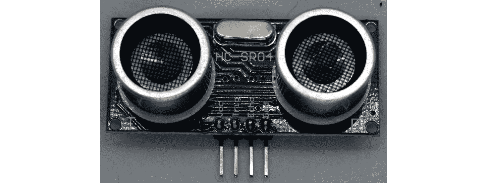
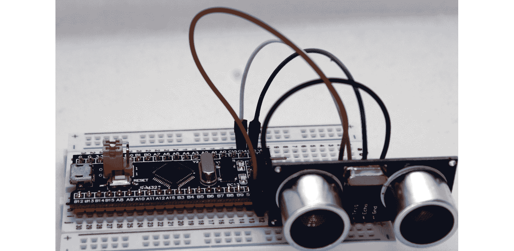
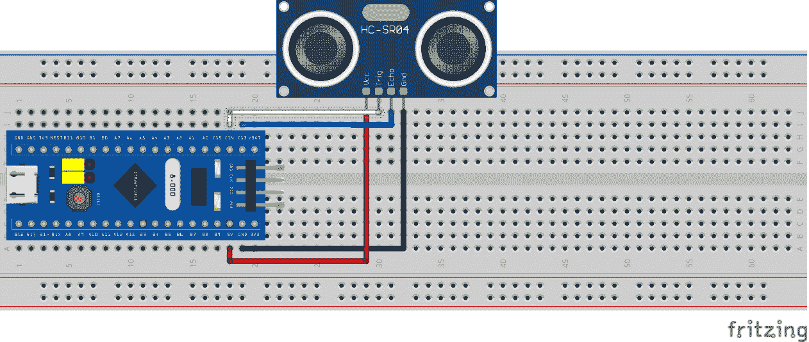
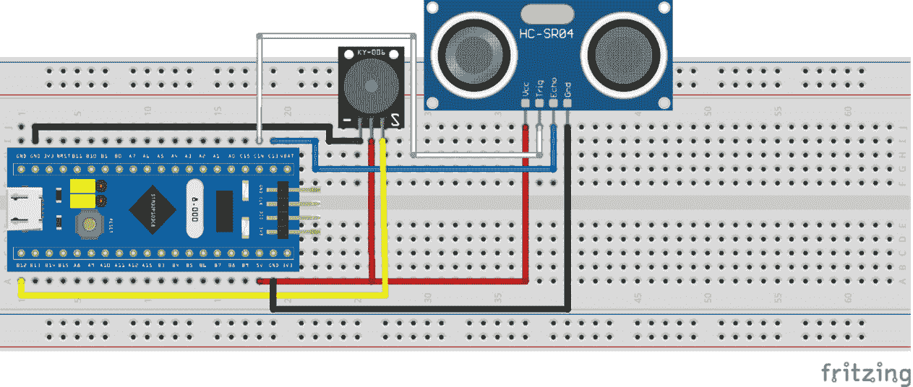
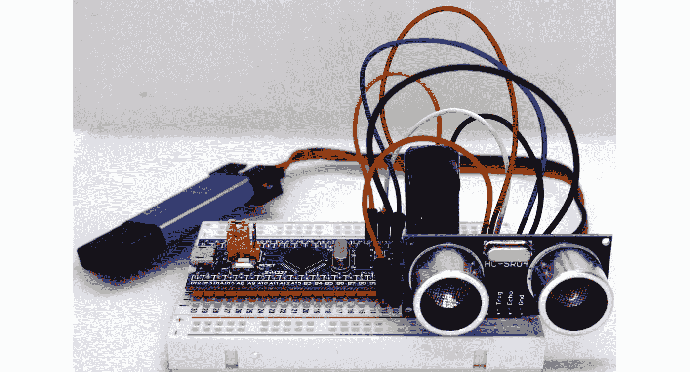
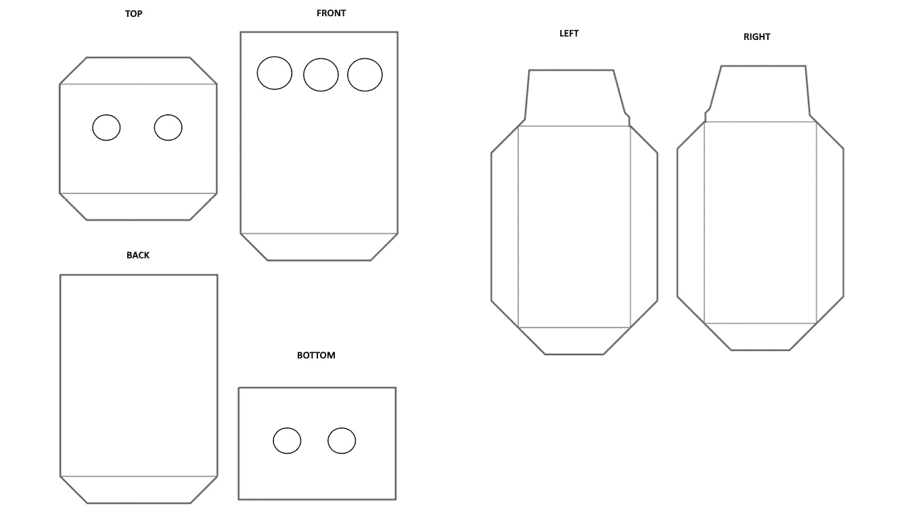
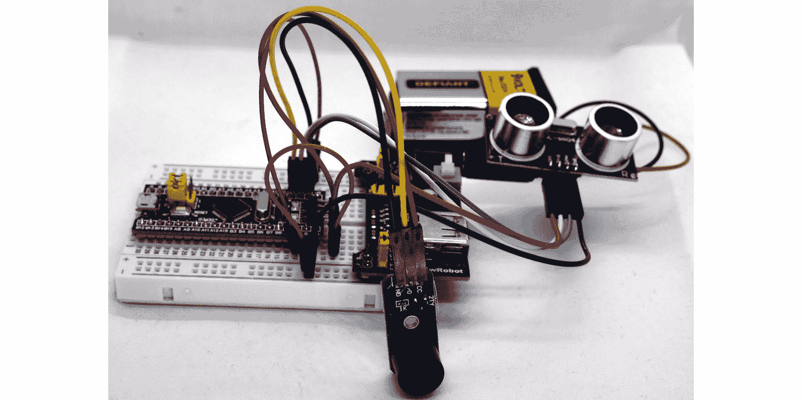

# 第十三章：*第十三章*：COVID-19 社交距离警报

当世界庆祝 2020 年的到来时，一场由于一种新疾病：COVID-19 而引发的流行病正在兴起。随着这种大流行的出现，所有的人类活动都受到了不同程度的影响。

在这个意义上，教育部门是最受影响的之一。全球所有学校都暂时停止了活动，因为这些环境中的感染风险可能非常高。经过几个月的封锁后，全球各地的学校逐渐开始恢复面对面活动，遵循严格的消毒标准和确保学生与学校工作人员之间保持物理距离的协议（Global Education Cluster, 2020）。

世界卫生组织（**WHO**）推荐的物理距离是人与人之间至少保持 1 **米**（**m**）（3 **英尺**（**ft**））的距离，2 m（6 ft）是最一般的推荐，以最大限度地减少儿童（KidsHealth, 2021）感染的风险。这一措施被称为**社交距离**。此外，技术有时可以作为强制执行这些措施的一种很好的方式。

在这一章中，你将学习如何创建一个使用微控制器技术来强制执行社交距离的设备，以帮助孩子们养成保持安全物理距离的习惯。当他们的距离不是安全的物理距离时，他们会从设备那里收到声音警报。你将创建的设备可以作为孩子们日常使用的可穿戴设备，将其放入一个盒子里，用作项链，如下面的截图所示：


图 13.1 – 儿童可穿戴社交距离设备

在这一章中，我们将涵盖以下主要主题：

+   编程压电蜂鸣器

+   将超声波传感器连接到微控制器板

+   编写一个从超声波传感器获取数据的程序

+   测试距离计

通过完成这一章，你将了解如何使用**STM32 Blue Pill 板**编程电子距离范围测量。你还将学习如何在距离测量为小于 2 m 时播放警报。

重要提示

这个项目仅用于演示和学习目的。请勿将其用作预防 COVID-19 感染风险的初级社交距离警报。

# 技术要求

开发社交距离警报所需的硬件组件列表如下：

+   一个无焊面包板。

+   一个 Blue Pill 微控制器板。

+   需要 1 个 ST-LINK/V2 电子接口将编译后的代码上传到 Blue Pill 板。请注意，ST-LINK/V2 接口需要四根母对母跳线。

+   一个 HC-SR04 超声波传感器。

+   一个蜂鸣器。

+   公对公跳线。

+   母对公跳线。

+   一个电源。

+   用于盒子的纸板。

如往常一样，你需要 Arduino **集成开发环境**（**IDE**）和本章的 GitHub 仓库，该仓库可在[`github.com/PacktPublishing/DIY-Microcontroller-Projects-for-Hobbyists/tree/master/Chapter13`](https://github.com/PacktPublishing/DIY-Microcontroller-Projects-for-Hobbyists/tree/master/Chapter13)找到。

本章的“代码在行动”视频可在以下链接找到：[`bit.ly/3gS2FKJ`](https://bit.ly/3gS2FKJ)

让我们开始吧！

# 编程压电 buzzer

在本节中，你将学习 buzzer 是什么，如何将其与 **STM32 Blue Pill** 接口，以及如何编写程序来构建警报声音。

**压电 buzzer** 是一种产生音调和蜂鸣声的设备。它使用压电效应，即压电材料将机械应力转换为电，并将电转换为机械振动。压电 buzzer 包含一个具有这些特性的晶体，当施加电压时，它会改变形状。

如本章其他章节常见，你可以找到一个通用的开发模块，使用起来相当简单，如下截图所示：


图 13.2 – 马达 buzzer 开发板

此开发板通过三个引脚连接到 STM32 Blue Pill 微控制器板，如下所述：

+   **输入/输出**（**I/O**）：此引脚必须连接到微控制器的数字输出。

+   **电压公共收集器**（**VCC**）：为传感器供电的引脚（**5 伏**，或 **5V**）。

+   **地**（**GND**）：地连接。

接下来，你将学习如何将这些引脚与 Blue Pill 微控制器板接口。

## 连接组件

你需要一个无焊点面包板来将 buzzer 连接到 STM32 Blue Pill 微控制器板，以及一根线来连接组件。按照以下步骤操作：

1.  你需要将 STM32 Blue Pill 和 buzzer 放入无焊点面包板，并在面包板上留出空间以连接跳线。

1.  将传感器的 GND 引脚连接到 STM32 Blue Pill 的 GND 端口。

1.  接下来，你需要将 VCC 引脚连接到 STM32 Blue Pill 的 5V 总线。

1.  最后，将 buzzer 的 I/O 引脚连接到 Blue Pill 的 B12 引脚。以下截图显示了所有连接到无焊点面包板的组件：


图 13.3 – 马达 buzzer 与 Blue Pill 的接口

以下截图展示了 STM32 Blue Pill 和马达 buzzer 之间的所有连线，并汇总了我们刚刚进行的步骤：


图 13.4 – 压电 buzzer 连接电路

到目前为止，我们已经探讨了压电蜂鸣器和它们的组件及功能。你还学习了如何使用无焊面包板将它们连接到 STM32 Blue Pill 微控制器板。

现在，你准备好用 C 语言编写程序，在蜂鸣器中重现可听警报。不要忘记使用`STLink`将脚本上传到 STM32 Blue Pill 微控制器板。

让我们开始开发一个程序，使用 STM32 Blue Pill 播放可听警报，如下所示：

1.  让我们开始定义 STM32 Blue Pill 卡引脚中哪个引脚将被用于在蜂鸣器中播放声音。运行以下代码：

    ```cpp
    const int PB12 pin (labeled B12 on the Blue Pill).
    ```

1.  接下来，我们将留空`setup()`部分。你不需要为此脚本初始化代码。

1.  完整的代码位于`loop()`部分，如下代码片段所示：

    ```cpp
    void loop() 
    {
      tone(pinBuzzer, 1200);
      delay(250);
      noTone(pinBuzzer);
      delay(500);
      tone(pinBuzzer, 800);
      delay(250);
      noTone(pinBuzzer);
      delay(500);
    }
    ```

    我们正在使用两个新函数：`tone()`和`noTone()`。让我们看看它们的功能是什么。

    `tone()`函数从一个引脚生成特定频率的方波。其语法是`tone(pin, frequency, duration)`，其中`pin`参数是连接蜂鸣器的 Blue Pill 引脚。`frequency`是音调的频率，以`unsigned int`类型表示。`duration`参数是音调的持续时间，以`unsigned long`类型表示。

    `noTone()`停止使用`tone()`启动的方波生成。如果没有先前生成音调，则不会生成错误。其语法是`noTone(pin)`，其中`pin`是生成音调的引脚。

    因此，前面的代码使用`delay()`函数启动一个 1,200 Hz 的音调并保持 250 ms。随后，它停止音调并等待 500 ms，在 250 ms 内生成一个新的音调，现在为 800 Hz，并再次使用相同的 500 ms 暂停停止它。这些步骤在程序运行期间重复，以模拟警报声音。

此功能的代码现在已完成。你可以在 GitHub 仓库的`Chapter13/buzzer`文件夹中找到完整的草图。

让我们查看我们如何进步我们的学习。我们发现了一个播放音调的组件，学习了如何将其连接到 STM32 Blue Pill 微控制器，并编写了播放可听警报的代码。

在本节中你获得的所有技能将使你能够创建其他需要播放和可听警报的电子系统。接下来，我们将学习超声波传感器。

# 将超声波传感器连接到微控制器板

在继续前进之前，我们需要了解 HC-SR04 超声波传感器的功能，如何将其与**STM32 Blue Pill**连接，以及如何编写程序来测量传感器与另一个物体之间的距离。

该传感器发出超声波。当这波与物体碰撞时，波被反射并被传感器接收。当接收到反射信号时，传感器可以计算反射所需的时间，从而测量碰撞物体的距离。

传感器可以在以下屏幕截图中看到：



图 13.5 – 超声波传感器

此传感器板通过四个引脚连接到 STM32 Blue Pill 微控制器板，如下所述：

+   **触发**：此引脚启用超声波。

+   **回声**：此引脚接收反射波。

+   **VCC**：为传感器供电的引脚（5V）。

+   **GND**：接地连接。

接下来，是时候将这些引脚与 Blue Pill 微控制器进行接口连接了。

## 连接组件

需要使用无焊点面包板将蜂鸣器连接到 STM32 Blue Pill 微控制器，并使用电线连接组件。按照以下步骤进行：

1.  您需要将 STM32 Blue Pill 和传感器放入无焊点面包板，并留出空间连接跳线。

1.  将传感器的 GND 引脚连接到 SMT32 Blue Pill 的 GND 端子。

1.  接下来，您需要将 VCC 引脚连接到 STM32 Blue Pill 的 5V 总线。

1.  最后，将蜂鸣器的触发引脚连接到 C14 引脚，将回声引脚连接到 Blue Pill 的 C13 引脚。以下截图显示了所有连接到无焊点面包板上的组件：



图 13.6 – 钛锌电蜂鸣器与 Blue Pill 的接口

以下截图显示了 STM32 Blue Pill 和超声波传感器之间的所有连线：



图 13.7 – 超声波传感器连接电路

到目前为止，您已经学习了如何使用无焊点面包板将传感器连接到 STM32 Blue Pill 微控制器板。

现在，您将学习如何用 C 语言编写程序，在蜂鸣器中产生可听见的警报。别忘了使用`STLink`将脚本上传到 STM32 Blue Pill 微控制器板。

# 编写用于获取超声波传感器数据的程序

在本节中，您将学习如何编写程序以从超声波传感器收集数据。让我们开始，如下所示：

1.  首先，我们将定义 STM32 Blue Pill 卡上哪些引脚将用于读取传感器数据。同时，我们将声明两个变量来保存声波传播的持续时间，另一个用于计算传播的距离，如下所示：

    ```cpp
    const int pinTrigger = PC14;
    const int pinEcho = PC13;
    long soundWaveTime;
    long distanceMeasurement;
    ```

    选择的引脚是 PC13 和 PC14 引脚（在 Blue Pill 上标记为 C13 和 C14）。

1.  接下来，在`setup()`函数中，开始串行通信。您需要将触发引脚设置为输出引脚，将回声引脚设置为输入引脚。我们需要将触发引脚初始化为`LOW`值。代码如下所示：

    ```cpp
    void setup() {
      Serial.begin(9600);
      pinMode(pinTrigger, OUTPUT);
      pinMode(pinEcho, INPUT);
      digitalWrite(pinTrigger, LOW);
    }
    ```

1.  现在，我们将编写`loop()`函数。我们需要启动超声波，等待 10 **秒**（**sec**），然后关闭超声波。代码如下所示：

    ```cpp
    void loop()
    {
      digitalWrite(pinTrigger, HIGH);
      delayMicroseconds(10); 
      digitalWrite(pinTrigger, LOW);
      ...
    }
    ```

1.  下一步是读取传感器的回声引脚，以了解波的往返总时间。我们使用`pulseIn()`函数来完成此操作，并将其存储在最初声明的变量中，为此目的。为了计算距离，我们将返回脉冲的值除以 59，以获得**厘米**（**cm**）距离，如下面的代码片段所示：

    ```cpp
    void loop()
    {
      digitalWrite(pinTrigger, HIGH);
      delayMicroseconds(10); 
      digitalWrite(pinTrigger, LOW);
      soundWaveTime = pulseIn(pinEcho, HIGH);
      distanceMeasurement = soundWaveTime/59;
      ...
    }
    ```

1.  最后，你将在串行控制台中显示传感器与设备前方任何物体之间的距离值，如下所示：

    ```cpp
    void loop()
    {
      digitalWrite(pinTrigger, HIGH);
      delayMicroseconds(10); 
      digitalWrite(pinTrigger, LOW);
      soundWaveTime = pulseIn(pinEcho, HIGH);
      distanceMeasurement = soundWaveTime/59;
      Serial.print("Distance: ");
      Serial.print(distanceMeasurement);
      Serial.println("cm");
      delay(500);
    }
    ```

此功能的代码现在已完成。你可以在 GitHub 仓库的`Chapter13/ultrasonic`文件夹中找到完整的草图。

在本节结束时，你学习了如何用 C 语言编写程序来测量连接到 STM32 的超声波传感器与物体之间的距离。

通过这些技能，你将能够开发需要距离测量的电子项目，例如汽车倒车防撞。

# 测试距离计

在测试距离计之前，我们需要将蜂鸣器和超声波传感器连接到无焊点面包板上的 SMT32 Blue Pill。以下截图展示了包括 STM32、超声波传感器和蜂鸣器在内的完整电路图：



图 13.8 – 我们社交距离设备的完整电路图

下面的截图显示了实际系统中所有组件的连接方式：



图 13.9 – 蜂鸣器和超声波传感器的连接

现在，为了完成完整社交距离设备的连接，我们需要编写一个新的脚本，该脚本结合了`Chapter13/buzzer`和`Chapter13/ultrasonic`脚本。新脚本将命名为`Chapter13/distance_meter`。按照以下步骤操作：

1.  我们需要声明两个脚本的常量和变量，并添加一个新的脚本以定义传感器设备与另一个物体之间的安全距离。以下代码片段展示了如何实现此操作：

    ```cpp
    const int pinTrigger = PC14;
    const int pinEcho = PC13;
    const int pinBuzzer = PB12;
    const int distanceSafety = 200;
    long soundWaveTime;
    long distanceMeasurement;
    ```

    对于 COVID-19 社交距离，我们将使用 200 厘米（2 米）。

1.  `setup()`函数与超声波脚本相同，如下面的代码片段所示：

    ```cpp
    void setup() {
      Serial.begin(9600);
      pinMode(pinTrigger, OUTPUT);
      pinMode(pinEcho, INPUT);
      digitalWrite(pinTrigger, LOW);
    }
    ```

1.  最后，在`loop()`函数中，我们将包含一个条件来验证我们的社交距离设备是否与另一个人（物体）物理上分离少于 2 米。如果是这种情况，播放声音警报。以下是实现此功能的代码：

    ```cpp
    void loop()
    {
      digitalWrite(pinTrigger, HIGH);
      delayMicroseconds(10); 
      digitalWrite(pinTrigger, LOW);
      soundWaveTime = pulseIn(pinEcho, HIGH);
      distanceMeasurement = soundWaveTime/59;
      Serial.print("Distance: ");
      Serial.print(distanceMeasurement);
      Serial.println("cm");
      delay(500);
      if (distanceMeasurement < distanceSafety) {
        Serial.println("Sound alert");
        tone(pinBuzzer, 1200);
        delay(250);
        noTone(pinBuzzer);
        delay(500);
        tone(pinBuzzer, 800);
        delay(250);
        noTone(pinBuzzer);
        delay(500);
      }
    }
    ```

现在，你可以测量社交距离，并且我们的设备可以作为学校中的项链使用，以保持安全的物理距离，*仅作为官方安全指南的补充*。

为了实现这一点，我们可以创建一个纸盒外壳，并将我们的设备插入其中。打印以下截图所示的模板——您可以从`Chapter13/cardboard` GitHub 文件夹中下载此模板： 



图 13.10 – 我们设备的纸盒模板

为了更好地将我们的电子设备放入外壳中，建议将用于构建原型的跳线（公对公）更换为公对母跳线，并使用 5V 电池供电，如下面的截图所示：



图 13.11 – 适应纸盒模板的连接

最后，剪下并粘贴外壳，将我们刚刚创建的设备放入外壳中，以创建一个可穿戴设备，如下面的截图所示：


图 13.12 – 我们设备的纸盒模板

使用这个设备，您将知道您是否处于安全距离，以避免可能的通过飞沫传播的 COVID-19 感染。

我们已经到达了*第十三章*的结尾。恭喜！

# 摘要

在这个项目中我们学到了什么？首先，我们学习了如何将压电蜂鸣器连接到我们的 Blue Pill 微控制器板，并编写程序以播放可听警报。然后，我们编写了一个程序来测量我们的电子设备与另一个物体之间的距离。

我们还学习了如何将两个项目结合起来，创建一个可以用于在 COVID-19 大流行期间保持安全物理距离的社交距离设备——例如，在学校，因为孩子们更容易分心，而且更友好、更社交。

重要的是要提醒您，这个项目是为了学习目的，不应在任何情况下用作预防 COVID-19 传播风险的初级警报。这主要是因为，目前我们知道主要风险是空气传播的。

在下一章中，我们将学习如何构建一个 20 秒的手部清洗计时器。

# 进一步阅读

+   全球教育集群. *安全返校：实践者指南*. 联合国教科文组织. 2020：

    [`healtheducationresources.unesco.org/library/documents/safe-back-school-practitioners-guide`](https://healtheducationresources.unesco.org/library/documents/safe-back-school-practitioners-guide)

+   KidsHealth. *冠状病毒（COVID-19）：与儿童保持社交距离*. 2021：

    [`kidshealth.org/en/parents/coronavirus-social-distancing.html`](https://kidshealth.org/en/parents/coronavirus-social-distancing.html)
