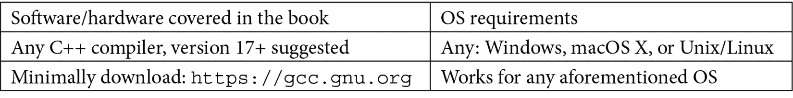

# 前言

公司需要利用 C++的速度。然而，面向对象的软件设计会导致更容易修改和维护的代码。了解如何将 C++作为面向对象的语言使用是至关重要的。在 C++中编程并不能保证面向对象编程-必须理解面向对象的概念以及它们如何映射到 C++语言特性以及面向对象编程技术。此外，程序员还希望掌握超出面向对象编程的额外技能，以使代码更通用、更健壮，并采用经过充分测试的创造性解决方案，这些解决方案可以在流行的设计模式中找到。

学习如何将 C++作为面向对象语言使用的程序员将成为有价值的 C++开发人员。一个没有面向对象理解和技能的 C++程序员，其代码将难以被其他人维护、修改或理解。成为 C++中的面向对象程序员是公司需要利用这种语言的宝贵技能。

本书详细解释了基本的面向对象概念，并配有实际的代码示例，通常还附有图表，以便您真正理解事物的工作原理和原因。自我评估问题可用于测试您的技能。

本书首先提供了必要的技能构建模块（可能不是面向对象的），这些模块为面向对象的基本知识打下了基础。接下来，将描述面向对象的概念，并配以语言特性和编码技巧，以便您能够成功地将 C++作为面向对象的语言使用。此外，还添加了更高级的技能，包括友元函数/类、运算符重载、模板（用于构建更通用的代码）、异常处理（用于构建健壮的代码）、STL 基础，以及设计模式和习语。

通过本书，您将了解基本和高级的面向对象概念，以及如何在 C++中实现这些概念。您将学会不仅如何使用 C++，还要如何将其作为面向对象的语言使用。此外，您还将了解如何使代码更健壮、更易于维护，以及如何在编程中使用经过充分测试的设计模式。

# 这本书适合谁

本书的目标读者是专业程序员以及熟练的大学生，他们希望了解如何利用 C++作为面向对象编程语言来编写健壮、易于维护的代码。本书假设读者是程序员，但不一定熟悉 C++。早期章节简要回顾了核心语言特性，并作为主要面向对象编程章节、高级特性和设计模式的基石。

# 本书涵盖的内容

[*第一章*]，*理解基本的 C++假设*，提供了本书中假定的基本语言特性的简要回顾，现有程序员可以快速掌握。

[*第二章*]，*添加语言必需品*，回顾了关键的非面向对象特性，这些特性是 C++的基本构建模块：const 修饰符、函数原型（默认值）和函数重载。

[*第三章*]，*间接寻址-指针*，回顾了 C++中的指针，包括内存分配/释放、指针使用/解引用、在函数参数中的使用和 void *。

[*第四章*]，*间接寻址-引用*，介绍了引用作为指针的替代方法，包括初始化、函数参数/返回值和 const 修饰。

第五章《详细探讨类》首先介绍了面向对象编程，探讨了封装和信息隐藏的概念，然后详细介绍了类的特性：成员函数、`this`指针、访问标签和区域、构造函数、析构函数以及数据成员和成员函数的限定符（`const`、`static`、`inline`）。

第六章《使用单一继承实现层次结构》详细介绍了使用单一继承进行概括和特化。它涵盖了继承成员、基类构造函数的使用、继承的访问区域、构造/析构的顺序，以及公共与私有和受保护的基类，以及这如何改变继承的含义。

第七章《通过多态性利用动态绑定》描述了多态性的面向对象概念，然后区分了操作和方法，并详细介绍了虚函数和方法的运行时绑定（包括 v 表的工作原理）。

第八章《掌握抽象类》解释了抽象类的面向对象概念，它们使用纯虚拟函数进行实现，接口的面向对象概念以及如何实现它，以及在公共继承层次结构中进行向上和向下转换。

第九章《探索多重继承》详细介绍了如何使用多重继承以及在面向对象设计中的争议。它涵盖了虚基类、菱形继承结构，以及通过检查鉴别器的面向对象概念来考虑替代设计的时机。

第十章《实现关联、聚合和组合》描述了关联、聚合和组合的面向对象概念以及如何使用指针、指针集、包含和有时引用来实现每个概念。

第十一章《处理异常》解释了如何通过考虑许多异常情况来`try`、`throw`和`catch`异常。它还展示了如何扩展异常处理层次结构。

第十二章《友元和运算符重载》解释了友元函数和类的正确使用，并检查了运算符重载（可能使用友元）以使运算符与用户定义的类型以与标准类型相同的方式工作。

第十三章《使用模板》详细介绍了模板函数和类，以使某些类型的代码通用化以适用于任何数据类型。它还展示了如何通过运算符重载使选定的代码更通用，以进一步支持模板的使用。

第十四章《理解 STL 基础》介绍了 C++中的标准模板库，并演示了如何使用常见的容器，如`list`、`iterator`、`deque`、`stack`、`queue`、`priority_queue`和`map`。此外，还介绍了 STL 算法和函数对象。

第十五章《测试类和组件》说明了使用经典类形式进行面向对象测试方法，用于测试类的驱动程序，并展示了如何通过继承、关联和聚合来测试相关类，并使用异常处理来测试类。

第十六章《使用观察者模式》介绍了设计模式的整体概念，然后通过深入示例解释了观察者模式，说明了模式的各个组成部分。

*第十七章*，*应用工厂模式*，介绍了工厂方法模式，并展示了其在有或没有对象工厂的情况下的实现。还比较了对象工厂和抽象工厂。

*第十八章*，*应用适配器模式*，探讨了适配器模式，提供了使用继承与关联来实现该模式的策略和示例。此外，它演示了一个包装类作为简单的适配器。

*第十九章*，*使用单例模式*，详细探讨了单例模式，以及一个复杂的成对类实现。还介绍了单例注册表。

*第二十章*，*使用 pImpl 模式去除实现细节*，描述了 pImpl 模式，以减少代码中的编译时间依赖关系。使用了独特指针来探讨了详细的实现。还探讨了与该模式相关的性能问题。

# 充分利用本书

假设您有一个当前的 C++编译器可用。您可以尝试许多在线代码示例！您可以使用任何 C++编译器；但建议使用 17 版或更高版本。所呈现的代码将符合 C++20 标准，但在 17 版中同样有效。请至少从[`gcc.gnu.org`](https://gcc.gnu.org)下载 g++。



*请记住，虽然 C++有一个 ISO 标准，但一些编译器会有所不同，并以微小的差异解释标准。*

如果您使用的是本书的数字版本，我们建议您自己输入代码或通过 GitHub 存储库（链接在下一节中提供）访问代码。这样做将有助于避免与复制和粘贴代码相关的任何潜在错误。

*强烈建议您在阅读本书时尝试编码示例。完成评估将进一步加强您对每个新概念的理解。*

# 下载示例代码文件

您可以从[www.packt.com](http://www.packt.com)的帐户中下载本书的示例代码文件。如果您在其他地方购买了本书，您可以访问[www.packtpub.com/support](http://www.packtpub.com/support)并注册，以便直接通过电子邮件接收文件。

该书的代码包也托管在 GitHub 上，网址为[`github.com/PacktPublishing/Demystified-Object-Oriented-Programming-with-CPP`](https://github.com/PacktPublishing/Demystified-Object-Oriented-Programming-with-CPP)。如果代码有更新，将在现有的 GitHub 存储库上进行更新。

我们还有其他代码包，来自我们丰富的图书和视频目录，可在[`github.com/PacktPublishing/`](https://github.com/PacktPublishing/)上找到。去看看吧！

# 下载彩色图片

我们还提供了一个 PDF 文件，其中包含本书中使用的屏幕截图/图表的彩色图片。您可以在此处下载：

[`static.packt-cdn.com/downloads/9781839218835_ColorImages.pdf`](https://static.packt-cdn.com/downloads/9781839218835_ColorImages.pdf)

# 实战代码

请访问以下链接查看 CiA 视频：[`bit.ly/2P1UXlI`](https://bit.ly/2P1UXlI)

# 使用的约定

本书中使用了许多文本约定。

`文本中的代码`：表示文本中的代码单词、数据库表名、文件夹名、文件名、文件扩展名、路径名、虚拟 URL、用户输入和 Twitter 句柄。以下是书中的一个例子："回顾我们前面的`main()`函数，我们首先创建一个`STL`的`list`，其中包含`list<Humanoid *> allies;`。"

代码块或程序段设置如下：

```cpp
char name[10] = "Dorothy"; 
float grades[20];  
grades[0] = 4.0;
```

当我们希望引起您对代码块的特定部分的注意时，相关行或项目将以粗体显示：

```cpp
cout << "Hello " << name << flush;
cout << ". GPA is: " << setprecision(3) << gpa << endl;
```

任何命令行输入或输出都将按如下方式编写：

```cpp
Ms. Giselle R. LeBrun
Dr. Zack R. Moon
Dr. Gabby A. Doone
```

**粗体**：表示一个新术语，一个重要的词，或者你在屏幕上看到的词。例如，菜单或对话框中的单词会以这种方式出现在文本中。这里有一个例子：“pImpl 模式（**p**ointer to **Impl**ementation idiom）是一种结构设计模式，它将类的实现与其公共接口分离开来。”

提示或重要说明

会以这种方式出现。
