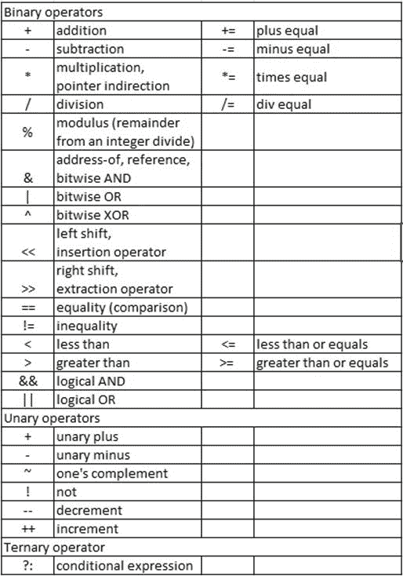

# 第一章：理解基本的 C++假设

本章将简要介绍 C++的基本语言语法、结构和特性，这些您应该已经熟悉了，无论是来自 C++、C、Java 或类似语言的基本语法。这些核心语言特性将被简要回顾。如果在完成本章后这些基本语法技能对您来说不熟悉，请先花时间探索更基本的基于语法的 C++文本，然后再继续阅读本书。本章的目标不是详细教授每个假定的技能，而是简要提供每个基本语言特性的概要，以便您能够快速回忆起应该已经掌握的技能。

本章中，我们将涵盖以下主要主题：

+   基本语言语法

+   基本输入/输出

+   控制结构、语句和循环

+   运算符

+   函数基础

+   用户定义类型基础

+   命名空间基础

通过本章结束时，您将对您应该熟练掌握的非常基本的 C++语言技能进行简要回顾。这些技能将是成功进入下一章所必需的。因为大多数这些特性不使用 C++的面向对象特性，我将尽量避免使用面向对象的术语，并在我们进入本书的面向对象部分时引入适当的面向对象术语。

# 技术要求

请确保您有一个当前的 C++编译器可用；您会想要尝试许多在线代码示例。至少，请从[`gcc.gnu.org`](https://gcc.gnu.org)下载 g++。

完整程序示例的在线代码可以在以下 GitHub URL 找到：[`github.com/PacktPublishing/Demystified-Object-Oriented-Programming-with-CPP/blob/master/Chapter01`](https://github.com/PacktPublishing/Demystified-Object-Oriented-Programming-with-CPP/blob/master/Chapter01)。每个完整程序示例都可以在 GitHub 存储库中找到，位于相应章节标题（子目录）下的文件中，文件名由章节号和当前章节中的示例号组成。例如，本章的第一个完整程序可以在子目录`Chapter01`中的名为`Chp1-Ex1.cpp`的文件中找到，位于上述 GitHub 目录中。

本章的 CiA 视频可以在以下链接观看：[`bit.ly/3c6oQdK`](https://bit.ly/3c6oQdK)。

# 回顾基本的 C++语言语法

在本节中，我们将简要回顾基本的 C++语法。我们假设您要么是具有非面向对象编程技能的 C++程序员，要么是在 C、Java 或类似的强类型检查语言中编程过，并且熟悉相关语法。您也可能是一个长期从事专业编程的程序员，能够快速掌握另一种语言的基础知识。让我们开始我们的简要回顾。

## 变量声明和标准数据类型

变量可以是任意长度，并且可以由字母、数字和下划线组成。变量区分大小写，并且必须以字母或下划线开头。C++中的标准数据类型包括：

+   `int`：用于存储整数

+   `float`：用于存储浮点值

+   `double`：用于存储双精度浮点值

+   `char`：用于存储单个字符

+   `bool`：用于布尔值 true 或 false

以下是使用上述标准数据类型的一些简单示例：

```cpp
int x = 5;
int a = x;
float y = 9.87; 
float y2 = 10.76f;  // optional 'f' suffix on float literal
float b = y;
double yy = 123456.78;
double c = yy;
char z = 'Z';
char d = z;
bool test = true;
bool e = test;
bool f = !test;
```

回顾前面的代码片段，注意变量可以被赋予文字值，比如`int x = 5;`，或者变量可以被赋予另一个变量的值或内容，比如`int a = x;`。这些例子展示了对各种标准数据类型的能力。注意对于`bool`类型，值可以被设置为`true`或`false`，或者使用`!`（非）来设置为这些值的相反值。

## 变量和数组基础

数组可以声明为任何数据类型。数组名称表示与数组内容相关的连续内存的起始地址。在 C++中，数组是从零开始的，这意味着它们的索引从数组`element[0]`开始，而不是从数组`element[1]`开始。最重要的是，在 C++中不对数组执行范围检查；如果访问超出数组大小的元素，那么您正在访问属于另一个变量的内存，您的代码很快可能会出错。

让我们回顾一些简单的数组声明、初始化和赋值：

```cpp
char name[10] = "Dorothy"; 
float grades[20];  
grades[0] = 4.0;
```

上面注意到，第一个数组`name`包含 10 个`char`元素，它们被初始化为字符串字面值`"Dorothy"`中的七个字符，后面跟着空字符(`'\0'`)。数组目前有两个未使用的元素。可以使用`name[0]`到`name[9]`来单独访问数组中的元素，因为 C++中的数组是从零开始的。同样，上面的数组，由变量`grades`标识，有 20 个元素，没有一个被初始化。在初始化或赋值之前访问任何数组值都可以包含任何值；对于任何未初始化的变量都是如此。注意，在声明数组`grades`后，它的零元素被赋值为`4.0`。

字符数组经常被概念化为字符串。许多标准字符串函数存在于诸如`<cstring>`的库中。如果要将字符数组作为字符串处理，应该以空字符结尾。当用字符数组的字符串初始化时，空字符会被自动添加。然而，如果通过赋值逐个添加字符到数组中，那么程序员就需要在数组中添加空字符(`'\0'`)作为最后一个元素。让我们看一些基本的例子：

```cpp
char book1[20] = "C++ Programming":
char book2[25];
strcpy(book2, "OO Programming with C++");
strcmp(book1, book2);
length = strlen(book2);
```

上面，第一个变量`book1`被声明为长度为 20 个字符，并初始化为字符串字面值`"C++ Programming"`。接下来，变量`book2`被声明为长度为 25 个字符的数组，但没有用值初始化。然后，使用`<cstring>`中的`strcpy()`函数将字符串字面值`"OO Programming with C++"`复制到变量`book2`中。注意，`strcpy()`将自动添加空字符到目标字符串。在下一行，也来自`<cstring>`的`strcmp()`函数用于按字典顺序比较变量`book1`和`book2`的内容。该函数返回一个整数值，可以存储在另一个变量中或用于比较。最后，使用`strlen()`函数来计算`book2`中的字符数（不包括空字符）。

## 注释风格

C++中有两种注释风格：

+   `/* */`风格提供了跨越多行代码的注释。这种风格不能与同一风格的其他注释嵌套。

+   `//`风格的注释提供了一个简单的注释，直到当前行的末尾。

同时使用两种注释风格可以允许嵌套注释，在调试代码时可能会很有用。

现在我们已经成功地回顾了基本的 C++语言特性，比如变量声明、标准数据类型、数组基础和注释风格，让我们继续回顾 C++的另一个基本语言特性：使用`<iostream>`库进行基本键盘输入和输出。

# 基本 I/O 回顾

在这一部分，我们将简要回顾使用键盘和显示器进行简单基于字符的输入和输出。还将简要介绍简单的操作符，以解释 I/O 缓冲区的基本机制，并提供基本的增强和格式化。

## iostream 库

在 C++中，最简单的输入和输出机制之一是使用`<iostream>`库。头文件`<iostream>`包含了`cin`、`cout`和`cerr`的数据类型定义，通过包含`std`命名空间来使用。`<iostream>`库简化了简单的 I/O：

+   `cin`可以与提取运算符`>>`一起用于输入

+   `cout`可以与插入运算符`<<`一起用于输出

+   `cerr`也可以与插入运算符一起使用，但用于错误

让我们回顾一个展示简单 I/O 的例子：

[`github.com/PacktPublishing/Demystified-Object-Oriented-Programming-with-CPP/blob/master/Chapter01/Chp1-Ex1.cpp`](https://github.com/PacktPublishing/Demystified-Object-Oriented-Programming-with-CPP/blob/master/Chapter01/Chp1-Ex1.cpp)

```cpp
#include <iostream>
using namespace std;
int main()
{
    char name[20];
    int age;
    cout << "Please enter a name and an age: ";
    cin >> name >> age;
    cout << "Hello " << name;
    cout << ". You are " << age << " years old." << endl;
    return 0;
}
```

首先，我们包含`<iostream>`库，并指示我们使用`std`命名空间来使用`cin`和`cout`（本章后面将更多介绍命名空间）。接下来，我们引入了`main()`函数，这是我们应用程序的入口点。在这里，我们声明了两个变量，`name`和`age`，都没有初始化。接下来，我们通过在与`cout`相关的缓冲区中放置字符串`"Please enter a name and an age: "`来提示用户输入。当与`cout`相关的缓冲区被刷新时，用户将在屏幕上看到这个提示。

然后，使用提取运算符`<<`将键盘输入的字符串放入与`cout`相关的缓冲区。方便的是，自动刷新与`cout`相关的缓冲区的机制是使用`cin`将键盘输入读入变量，比如下一行我们将用户输入读入变量`name`和`age`中。

接下来，我们向用户打印出一个问候语`"Hello"`，然后是输入的姓名，再然后是他们的年龄，从第二个用户输入中获取。这一行末尾的`endl`既将换行符`'\n'`放入输出缓冲区，又确保输出缓冲区被刷新 - 更多内容请看下文。`return 0;`声明只是将程序退出状态返回给编程外壳，这里是值`0`。请注意，`main()`函数指示了一个`int`类型的返回值，以确保这是可能的。

## 基本 iostream 操纵器

通常，希望能够操作与`cin`、`cout`和`cerr`相关的缓冲区的内容。操纵器允许修改这些对象的内部状态，从而影响它们相关的缓冲区的格式和操作。操纵器在`<iomanip>`头文件中定义。常见的操纵器示例包括：

+   `endl`: 将换行符放入与`cout`相关的缓冲区，然后刷新缓冲区

+   `flush`: 清除输出流的内容

+   `setprecision(int)`: 设置浮点数精度

+   `setw(int)`: 设置输入和输出的宽度

+   `ws`: 从缓冲区中移除空白字符

让我们看一个简单的例子：

[`github.com/PacktPublishing/Demystified-Object-Oriented-Programming-with-CPP/blob/master/Chapter01/Chp1-Ex2.cpp`](https://github.com/PacktPublishing/Demystified-Object-Oriented-Programming-with-CPP/blob/master/Chapter01/Chp1-Ex2.cpp)

```cpp
#include <iostream>
#include <iomanip>
using namespace std;
int main()
{
    char name[20];
    float gpa;   // grade point average
    cout << "Please enter a name and a gpa: "; 
    cin >> setw(20) >> name >> gpa;
    cout << "Hello " << name << flush;
    cout << ". GPA is: " << setprecision(3) << gpa << endl;
    return 0;
}
```

在这个例子中，首先注意到包含了`<iomanip>`头文件。还要注意到，`setw(20)`用于确保我们不会溢出名字变量，它只有 20 个字符长；`setw()`会自动减去一个提供的大小，以确保有空间放置空字符。注意第二个输出行上使用了`flush` - 这里不需要刷新输出缓冲区；这个操纵器只是演示了如何应用`flush`。在最后一个`cout`输出行上，注意使用了`setprecision(3)`来打印浮点数`gpa`。三位精度包括小数点和小数点右边的两位。

现在我们已经回顾了使用`<iostream>`库进行简单输入和输出，让我们继续通过简要回顾控制结构、语句和循环结构。

# 重新审视控制结构、语句和循环

C++有各种控制结构和循环结构，允许非顺序程序流。每个都可以与简单或复合语句配对。简单语句以分号结束；更复杂的语句则用一对大括号`{}`括起来。在本节中，我们将重新讨论各种类型的控制结构（`if`，`else if`和`else`）和循环结构（`while`，`do while`和`for`），以回顾代码中非顺序程序流的简单方法。

## 控制结构：if，else if 和 else

使用`if`，`else if`和`else`进行条件语句可以与简单语句或一组语句一起使用。请注意，`if`子句可以在没有后续`else if`或`else`子句的情况下使用。实际上，`else if`实际上是`else`子句的一种简化版本，其中包含一个嵌套的`if`子句。实际上，开发人员将嵌套使用展平为`else if`格式，以提高可读性并节省多余的缩进。让我们看一个例子：

[`github.com/PacktPublishing/Demystified-Object-Oriented-Programming-with-CPP/blob/master/Chapter01/Chp1-Ex3.cpp`](https://github.com/PacktPublishing/Demystified-Object-Oriented-Programming-with-CPP/blob/master/Chapter01/Chp1-Ex3.cpp)

```cpp
#include <iostream>
using namespace std;
int main()
{
    int x;
    cout << "Enter an integer: ";
    cin >> x;
    if (x == 0) 
        cout << "x is 0" << endl;
    else if (x < 0)
        cout << "x is negative" << endl;
    else
    {
        cout << "x is positive";
        cout << "and ten times x is: " << x * 10 << endl;
    }  
    return 0;
}
```

请注意，在上面的`else`子句中，多个语句被捆绑成一个代码块，而在`if`和`else if`条件中，每个条件后面只有一个语句。另外，需要注意的是，在 C++中，任何非零值都被视为 true。因此，例如，测试`if (x)`会暗示`x`不等于零 - 无需写`if (x !=0)`，除非可能是为了可读性。

## 循环结构：while，do while 和 for 循环

C++有几种循环结构。让我们花点时间来回顾每种样式的简短示例，从`while`和`do while`循环结构开始。

[`github.com/PacktPublishing/Demystified-Object-Oriented-Programming-with-CPP/blob/master/Chapter01/Chp1-Ex4.cpp`](https://github.com/PacktPublishing/Demystified-Object-Oriented-Programming-with-CPP/blob/master/Chapter01/Chp1-Ex4.cpp)

```cpp
#include <iostream>
using namespace std;
int main()
{
    int i = 0;
    while (i < 10)
    {
        cout << i << endl;
        i++;
    }
    i = 0;
    do 
    {
        cout << i << endl;
        i++;
    } while (i < 10);
    return 0;
}
```

使用`while`循环时，进入循环的条件必须在每次进入循环体之前求值为 true。然而，使用`do while`循环时，保证第一次进入循环体 - 然后在再次迭代循环体之前求值条件。在上面的示例中，`while`和`do while`循环都执行 10 次，每次打印变量`i`的值为 0-9。

接下来，让我们回顾一下典型的`for`循环。`for`循环在`()`内有三部分。首先，有一个语句，它只执行一次，通常用于初始化循环控制变量。接下来，在`()`的中心两侧用分号分隔的是一个表达式。这个表达式在进入循环体之前每次都会被求值。只有当这个表达式求值为 true 时，才会进入循环体。最后，在`()`内的第三部分是第二个语句。这个语句在执行完循环体后立即执行，并且通常用于修改循环控制变量。在执行完这个第二个语句后，中心的表达式会被重新求值。以下是一个例子：

[`github.com/PacktPublishing/Demystified-Object-Oriented-Programming-with-CPP/blob/master/Chapter01/Chp1-Ex5.cpp`](https://github.com/PacktPublishing/Demystified-Object-Oriented-Programming-with-CPP/blob/master/Chapter01/Chp1-Ex5.cpp)

```cpp
#include <iostream>
using namespace std;
int main()
{
    int i;
    for (i = 0; i < 10; i++) 
        cout << i << endl;
    for (int j = 0; j < 10; j++)
        cout << j << endl;
    return 0;
}
```

在上面，我们有两个`for`循环。在第一个循环之前，变量`i`被声明。然后在循环括号`()`之间的语句 1 中用值`0`初始化变量`i`。测试循环条件，如果为真，则进入并执行循环体，然后在重新测试循环条件之前执行语句 2。这个循环对`i`的值从 0 到 9 执行 10 次。第二个`for`循环类似，唯一的区别是变量`j`在循环结构的语句 1 中声明和初始化。请注意，变量`j`只在`for`循环本身的范围内，而变量`i`在其声明点之后的整个块的范围内。

让我们快速看一个使用嵌套循环的示例。循环结构可以是任何类型，但下面我们将回顾嵌套的`for`循环。

[`github.com/PacktPublishing/Demystified-Object-Oriented-Programming-with-CPP/blob/master/Chapter01/Chp1-Ex6.cpp`](https://github.com/PacktPublishing/Demystified-Object-Oriented-Programming-with-CPP/blob/master/Chapter01/Chp1-Ex6.cpp)

```cpp
#include <iostream>
using namespace std;
int main()
{
    for (int i = 0; i < 10; i++) 
    {
        cout << i << endl;
        for (int j = 0; j < 10; j++)
            cout << j << endl;
        cout << "\n";
    }
    return 0;
}
```

在上面的外部循环中，`i`的值从 0 到 9 执行 10 次。对于每个`i`的值，内部循环将执行 10 次，`j`的值从 0 到 9。请记住，使用`for`循环时，循环控制变量会在循环结构内部自动递增`i++`或`j++`。如果使用了`while`循环，程序员需要记住在每个这样的循环体的最后一行递增循环控制变量。

现在我们已经回顾了 C++中的控制结构、语句和循环结构，我们可以通过简要回顾 C++的运算符来继续前进。

# 回顾 C++运算符

一元、二元和三元运算符都存在于 C++中。C++允许运算符根据使用的上下文具有不同的含义。C++还允许程序员重新定义至少一个用户定义类型的上下文中使用的选定运算符的含义。以下是运算符的简明列表。我们将在本节的其余部分和整个课程中看到这些运算符的示例。以下是 C++中二元、一元和三元运算符的概要：



表 1.1 - 二元运算符

在上述二元运算符列表中，注意到许多运算符在与赋值运算符`=`配对时具有“快捷”版本。例如，`a = a * b`可以使用快捷操作符`a *= b`等效地编写。让我们看一个包含各种运算符使用的示例，包括快捷操作符的使用：

```cpp
score += 5;
score++;
if (score == 100)
    cout << "You have a perfect score!" << endl;
else
    cout << "Your score is: " << score << endl;
// equivalent to if - else above, but using ?: operator
(score == 100)? cout << "You have a perfect score" << endl :
                cout << "Your score is: " << score << endl; 
```

在前面的代码片段中，注意到了快捷操作符`+=`的使用。在这里，语句`score += 5;`等同于`score = score + 5;`。接下来，使用一元递增运算符`++`来将`score`增加 1。然后我们看到等号运算符`==`用于将分数与 100 进行比较。最后，我们看到了三元运算符`?:`的示例，用于替换简单的`if`-`else`语句。值得注意的是，一些程序员不喜欢使用`?:`，但总是有趣的回顾其使用示例。

现在我们已经简要回顾了 C++中的运算符，让我们重新审视函数基础知识。

# 重新审视函数基础知识

函数标识符必须以字母或下划线开头，也可以包含数字。函数的返回类型、参数列表和返回值都是可选的。C++函数的基本形式如下：

```cpp
<return type> functionName (<argumentType argument1, …>)
{
    expression 1…N;
    <return value/expression;>
}
```

让我们回顾一个简单的函数：

[`github.com/PacktPublishing/Demystified-Object-Oriented-Programming-with-CPP/blob/master/Chapter01/Chp1-Ex7.cpp`](https://github.com/PacktPublishing/Demystified-Object-Oriented-Programming-with-CPP/blob/master/Chapter01/Chp1-Ex7.cpp)

```cpp
#include <iostream>
using namespace std;
int minimum(int a, int b)
{
    if (a < b)
        return a;
    else
        return b;
}
int main()
{
    int x, y;
    cout << "Enter two integers: ";
    cin >> x >> y;
    cout << "The minimum is: " << minimum(x, y) << endl;
    return 0;
}
```

在上面的简单示例中，首先定义了一个`minimum()`函数。它的返回类型是`int`，它接受两个整数参数：形式参数`a`和`b`。在`main()`函数中，使用实际参数`x`和`y`调用了`minimum()`。在`cout`语句中允许调用`minimum()`，因为`minimum()`返回一个整数值；这个值随后传递给提取运算符（`<<`），与打印一起使用。实际上，字符串`"The minimum is: "`首先被放入与`cout`关联的缓冲区中，然后是调用函数`minimum()`的返回值。然后输出缓冲区被`endl`刷新（它首先在刷新之前将换行符放入缓冲区）。

请注意，函数首先在文件中定义，然后在文件的`main()`函数中稍后调用。通过比较参数类型和它们在函数调用中的使用，对函数的调用执行了强类型检查。然而，当函数调用在其定义之前时会发生什么？或者如果对函数的调用在与其定义不同的文件中呢？

在这些情况下，编译器的默认操作是假定函数的某种*签名*，比如整数返回类型，并且形式参数将匹配函数调用中的参数类型。通常，默认假设是不正确的；当编译器在文件中稍后遇到函数定义（或者链接另一个文件时），将会引发错误，指示函数调用和定义不匹配。

这些问题在历史上已经通过在将调用函数的文件顶部包含函数的前向声明来解决。前向声明由函数返回类型、函数名称和类型以及参数数量组成。在 C++中，前向声明已经得到改进，而被称为函数原型。由于围绕函数原型存在许多有趣的细节，这个主题将在下一章中得到合理详细的介绍。

当我们在本书的面向对象部分（*第五章*，*详细探讨类*，以及更多）中学习时，我们将了解到有关函数的许多更多细节和相当有趣的特性。尽管如此，我们已经充分回顾了前进所需的基础知识。接下来，让我们继续我们的 C++语言回顾，学习用户定义类型。

# 回顾用户定义类型的基础

C++提供了几种机制来创建用户定义的类型。将类似特征捆绑成一个数据类型（稍后，我们还将添加相关的行为）将形成面向对象概念的封装的基础，这将在本文的后面部分中进行介绍。现在，让我们回顾一下将数据仅捆绑在`struct`、`class`和`typedef`（在较小程度上）中的基本机制。我们还将回顾枚举类型，以更有意义地表示整数列表。

## struct

C++结构在其最简单的形式中可以用来将共同的数据元素收集在一个单一的单元中。然后可以声明复合数据类型的变量。点运算符用于访问每个结构变量的特定成员。这是以最简单方式使用的结构：

https://github.com/PacktPublishing/Demystified-Object-Oriented-Programming-with-CPP/blob/master/Chapter01/Chp1-Ex8.cpp

```cpp
#include <iostream>
#include <cstring>
using namespace std;
struct student
{
    char name[20];
    float semesterGrades[5];
    float gpa;
};
int main()
{
    student s1;
    strcpy(s1.name, "George Katz");
    s1.semesterGrades[0] = 3.0;
    s1.semesterGrades[1] = 4.0;
    s1.gpa = 3.5;
    cout << s1.name << " has GPA: " << s1.gpa << endl;
    return 0;
}
```

从风格上看，使用结构体时，类型名称通常是小写的。在上面的例子中，我们使用`struct`声明了用户定义类型`student`。类型`student`有三个字段或数据成员：`name`，`semesterGrades`和`gpa`。在`main()`函数中，声明了一个类型为 student 的变量`s1`；点运算符用于访问变量的每个数据成员。由于在 C++中，结构体通常不用于面向对象编程，因此我们还不会介绍与其使用相关的重要面向对象术语。值得注意的是，在 C++中，标签`student`也成为类型名称（与 C 中需要在变量声明之前使用`struct`一词不同）。

## typedef

`typedef`可以用于为数据类型提供更易记的表示。在 C++中，使用`struct`时相对不需要`typedef`。在 C 中，`typedef`允许将关键字`struct`和结构标签捆绑在一起，创建用户定义的类型。然而，在 C++中，由于结构标签自动成为类型，因此对于`struct`来说，`typedef`变得完全不必要。Typedefs 仍然可以与标准类型一起使用，以增强代码的可读性，但在这种情况下，typedef 并不像`struct`那样用于捆绑数据元素。让我们看一个简单的 typedef：

```cpp
typedef float dollars; 
```

在上面的声明中，新类型`dollars`可以与类型`float`互换使用。展示结构体的古老用法并不具有生产力，因此让我们继续前进，看看 C++中最常用的用户定义类型，即`class`。

## class

`class`在其最简单的形式中几乎可以像`struct`一样用于将相关数据捆绑成单个数据类型。在*第五章*，*详细探讨类*中，我们将看到`class`通常也用于将相关函数与新数据类型捆绑在一起。将相关数据和行为分组到该数据是封装的基础。现在，让我们看一个`class`的最简单形式，就像`struct`一样：

[`github.com/PacktPublishing/Demystified-Object-Oriented-Programming-with-CPP/blob/master/Chapter01/Chp1-Ex9.cpp`](https://github.com/PacktPublishing/Demystified-Object-Oriented-Programming-with-CPP/blob/master/Chapter01/Chp1-Ex9.cpp)

```cpp
#include <iostream>
#include <cstring>
using namespace std;
class Student
{
public:
    char name[20];
    float semesterGrades[5];
    float gpa;
};
int main()
{
    Student s1;
    strcpy(s1.name, "George Katz");
    s1.semesterGrades[0] = 3.0;
    s1.semesterGrades[1] = 4.0;
    s1.gpa = 3.5;
    cout << s1.name << " has GPA: " << s1.gpa << endl;
    return 0;
}
```

请注意上面的代码与`struct`示例中使用的代码非常相似。主要区别是关键字`class`而不是关键字`struct`，以及在类定义的开头添加访问标签`public:`（更多内容请参见*第五章*，*详细探讨类*）。从风格上看，类似`Student`这样的数据类型的首字母大写是典型的。我们将看到类具有丰富的特性，是面向对象编程的基本组成部分。我们将介绍新的术语，例如*实例*，而不是*变量*。然而，本节只是对假定技能的复习，因此我们需要等待才能了解语言的令人兴奋的面向对象特性。剧透警告：所有类将能够做的美妙事情也适用于结构体；然而，我们将看到，从风格上讲，结构体不会被用来举例说明面向对象编程。

## enum

枚举类型可以用来记忆地表示整数列表。除非另有初始化，枚举中的整数值从零开始，并在整个列表中递增一。两个枚举类型不能使用相同的枚举器名称。现在让我们看一个例子：

[`github.com/PacktPublishing/Demystified-Object-Oriented-Programming-with-CPP/blob/master/Chapter01/Chp1-Ex10.cpp`](https://github.com/PacktPublishing/Demystified-Object-Oriented-Programming-with-CPP/blob/master/Chapter01/Chp1-Ex10.cpp)

```cpp
#include <iostream>
using namespace std;
enum day {Sunday,  Monday, Tuesday, Wednesday, Thursday,
          Friday, Saturday};
enum workDay {Mon = 1, Tues, Wed, Thurs, Fri};
int main()
{
    day birthday = Monday;
    workDay payday = Fri;
    cout << "Birthday is " << birthday << endl;
    cout << "Payday is " << payday << endl;
    return 0;
}
```

在上一个例子中，枚举类型`day`的值从`Sunday`开始，从 0 到 6。枚举类型`workDay`的值从`Mon`开始，从 1 到 5。请注意，显式使用`Mon = 1`作为枚举类型中的第一项已被用来覆盖默认的起始值 0。有趣的是，我们可能不会在两个枚举类型之间重复枚举器。因此，您会注意到`Mon`在`workDay`中被用作枚举器，因为`Monday`已经在枚举类型`day`中使用过。现在，当我们创建变量如`birthday`或`payday`时，我们可以使用有意义的枚举类型来初始化或赋值，比如`Monday`或`Fri`。尽管枚举器在代码中可能是有意义的，请注意，当操作或打印值时，它们将是相应的整数值。

现在我们已经重新访问了 C++中的简单用户定义类型，包括`struct`、`typedef`、`class`和`enum`，我们准备继续审查我们下一个语言必需品，即`namespace`。

# 命名空间基础回顾

命名空间实用程序被添加到 C++中，以在全局范围之外添加一个作用域级别到应用程序。这个特性可以用来允许两个或更多库被使用，而不必担心它们可能包含重复的数据类型、函数或标识符。程序员需要在应用程序的每个相关部分使用关键字`using`来激活所需的命名空间。程序员还可以创建自己的命名空间（通常用于创建可重用的库代码），并在适用时激活每个命名空间。在上面的例子中，我们已经看到了简单使用`std`命名空间来包括`cin`和`cout`，它们是`istream`和`ostream`的实例（它们的定义可以在`<iostream>`中找到）。让我们回顾一下如何创建自己的命名空间：

[`github.com/PacktPublishing/Demystified-Object-Oriented-Programming-with-CPP/blob/master/Chapter01/Chp1-Ex11.cpp`](https://github.com/PacktPublishing/Demystified-Object-Oriented-Programming-with-CPP/blob/master/Chapter01/Chp1-Ex11.cpp)

```cpp
#include <iostream>
using namespace std;
namespace DataTypes
{
    int total;
    class LinkList
    {  // full class definition … 
    };
    class Stack
    {  // full class definition …
    };
};
namespace AbstractDataTypes
{
    class Stack
    {  // full class definition …
    };
    class Queue
    {  // full class description …
    };
};
// Add entries to the AbstractDataTypes namespace
namespace AbstractDataTypes   
{
    int total;
    class Tree
    {  // full class definition …
    };
};
int main()
{
    using namespace AbstractDataTypes; // activate namespace
    using DataTypes::LinkList;    // activate only LinkList 
    LinkList list1;     // LinkList is found in DataTypes
    Stack stack1;       // Stack is found in AbstractDataTypes
    total = 5;          // total from active AbstractDataTypes
    DataTypes::total = 85; // specify non-active member, total
    cout << "total " << total << "\n";
    cout << "DataTypes::total " << DataTypes::total << endl;
    return 0;
}
```

在上面的第二行代码中，我们使用关键字`using`表示我们想要使用或激活`std`命名空间。我们可以利用`using`来打开包含有用类的现有库；关键字`using`激活给定库可能属于的命名空间。接下来在代码中，使用`namespace`关键字创建了一个名为`DataTypes`的用户创建的命名空间。在这个命名空间中存在一个变量`total`和两个类定义：`LinkList`和`Stack`。在这个命名空间之后，创建了第二个命名空间`AbstractDataTypes`，其中包括两个类定义：`Stack`和`Queue`。此外，命名空间`AbstractDataTypes`通过第二次*namespace*定义的出现增加了一个变量`total`和一个`Tree`的类定义。

在`main()`函数中，首先使用关键字`using`打开了`AbstractDataTypes`命名空间。这激活了这个命名空间中的所有名称。接下来，关键字`using`与作用域解析运算符(`::`)结合，只激活了`DataTypes`命名空间中的`LinkList`类定义。如果`AbstractDataType`命名空间中也有一个`LinkList`类，那么初始可见的`LinkList`现在将被`DataTypes::LinkList`的激活所隐藏。

接下来，声明了一个类型为`LinkList`的变量，其定义来自`DataTypes`命名空间。接下来声明了一个类型为`Stack`的变量；虽然两个命名空间都有`Stack`类的定义，但由于只激活了一个`Stack`，所以没有歧义。接下来，我们使用`cin`读取到来自`AbstractDataTypes`命名空间的`total`。最后，我们使用作用域解析运算符显式地读取到`DataTypes::total`，否则该名称将被隐藏。需要注意的一点是：如果两个或更多的命名空间包含相同的“名称”，则最后打开的命名空间将主导，隐藏所有先前的出现。

# 总结

在本章中，我们回顾了核心 C++语法和非面向对象语言特性，以刷新您现有的技能。这些特性包括基本语言语法，使用`<iostream>`进行基本 I/O，控制结构/语句/循环，运算符基础，函数基础，简单的用户定义类型以及命名空间。最重要的是，您现在已经准备好进入下一章，在这一章中，我们将扩展一些这些想法，包括`const`限定变量，理解和使用原型（包括默认值），以及函数重载等额外的语言必需品。

下一章中的想法开始让我们更接近面向对象编程的目标，因为许多这些聚合技能经常被使用，并且随着我们深入语言，它们变得理所当然。重要的是要记住，在 C++中，你可以做任何事情，无论你是否有意这样做。语言中有巨大的力量，对其许多微妙和特性有一个坚实的基础是至关重要的。在接下来的几章中，将奠定坚实的基础，以掌握一系列非面向对象的 C++技能，这样我们就可以以高水平的理解和成功实现在 C++中进行面向对象编程。

# 问题

1.  描述一种情况，在这种情况下，`flush`而不是`endl`可能对清除与`cout`关联的缓冲区的内容有用。

1.  一元运算符`++`可以用作前置或后置递增运算符，例如`i++`或`++i`。你能描述一种情况，在这种情况下，选择前置递增还是后置递增对代码会产生不同的后果吗？

1.  创建一个简单的程序，使用`struct`或`class`为`Book`创建一个用户定义类型。为标题、作者和页数添加数据成员。创建两个类型为`Book`的变量，并使用点运算符`.`为每个实例填写数据成员。使用`iostreams`提示用户输入值，并在完成时打印每个`Book`实例。只使用本节介绍的功能。
