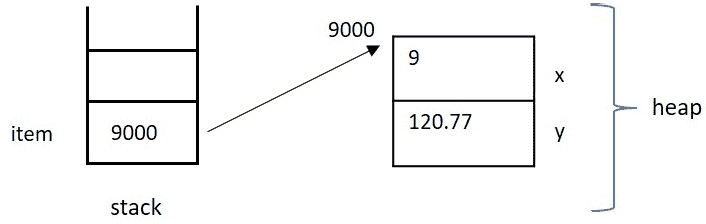
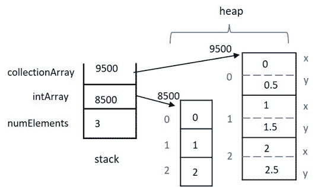
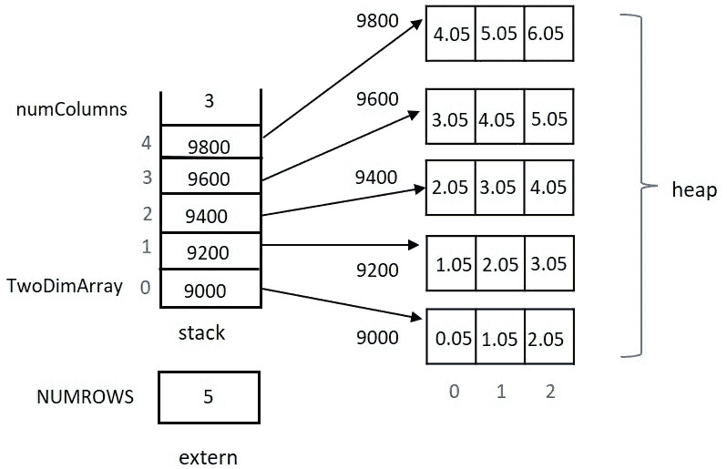
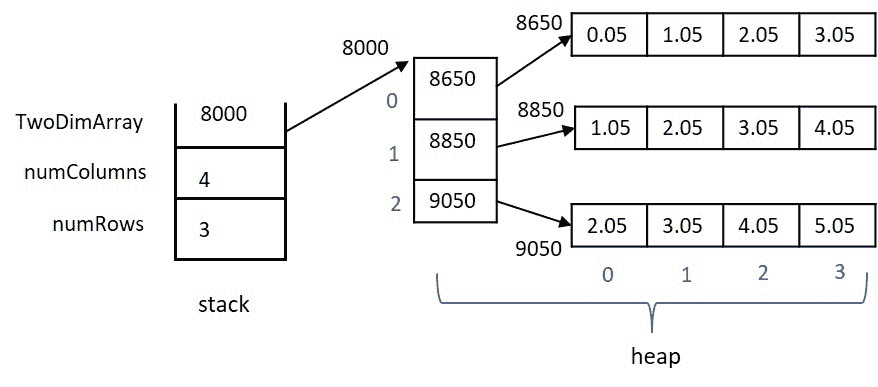

# 第三章：间接寻址：指针

本章将全面介绍如何在 C++中利用指针。虽然假定您具有一些间接寻址的先前经验，但我们将从头开始。指针是语言中的一个基本和普遍的特性 - 您必须彻底理解并能够轻松地利用它。许多其他语言仅通过引用使用间接寻址，然而，在 C++中，您必须动手理解如何正确有效地使用和返回堆内存。您将看到其他程序员在代码中大量使用指针；无法忽视它们的使用。错误使用指针可能是程序中最难找到的错误。在 C++中，彻底理解使用指针进行间接寻址是创建成功和可维护代码的必要条件。

本章的目标是建立或增强您对使用指针进行间接寻址的理解，以便您可以轻松理解和修改他人的代码，以及能够自己编写原始、复杂、无错误的 C++代码。

在本章中，我们将涵盖以下主要主题：

+   指针基础知识，包括访问、内存分配和释放 - 适用于标准和用户定义类型

+   动态分配`1`、`2`、`N`维数组，并管理它们的内存释放

+   指针作为函数的参数和从函数返回的值

+   向指针变量添加`const`限定符

+   使用 void 指针 - 指向未指定类型的对象的指针

通过本章结束时，您将了解如何使用`new()`从堆中分配内存，用于简单和复杂的数据类型，以及如何使用`delete()`标记内存以返回给堆管理设施。您将能够动态分配任何数据类型和任意维数的数组，并且了解释放内存的基本内存管理，以避免在应用程序中不再需要时发生内存泄漏。您将能够将指针作为参数传递给具有任何间接级别的函数 - 即，指向数据的指针，指向指向数据的指针，依此类推。您将了解如何以及为什么将`const`限定符与指针结合使用 - 对数据、对指针本身，或对两者都是。最后，您将了解如何声明和使用没有类型的通用指针 - void 指针 - 并了解它们可能证明有用的情况。这些技能将是成功地继续阅读本书后续章节所必需的。

# 技术要求

完整程序示例的在线代码可以在以下 GitHub 网址找到：[`github.com/PacktPublishing/Demystified-Object-Oriented-Programming-with-CPP/blob/master/Chapter03`](https://github.com/PacktPublishing/Demystified-Object-Oriented-Programming-with-CPP/blob/master/Chapter03)。每个完整程序示例都可以在 GitHub 存储库中找到，位于相应章节标题（子目录）下的文件中，文件名与所在章节编号相对应，后跟该章节中的示例编号。例如，本章的第一个完整程序可以在子目录`Chapter03`中的名为`Chp3-Ex1.cpp`的文件中找到，位于上述 GitHub 目录下。

本章的 CiA 视频可在以下网址观看：[`bit.ly/2OY41sn`](https://bit.ly/2OY41sn)

# 理解指针基础知识和内存分配

在本节中，我们将回顾指针的基础知识，并介绍适用于指针的运算符，如取地址运算符、解引用运算符以及`new()`和`delete()`运算符。我们将使用取地址运算符`&`来计算现有变量的地址，反之，我们将应用解引用运算符`*`到指针变量，以访问变量中包含的地址。我们将看到堆上的内存分配示例，以及如何在完成后将同一内存标记为可重新使用，将其返回到空闲列表。

使用指针变量使我们的应用程序具有更大的灵活性。在运行时，我们可以确定可能需要的某种数据类型的数量（例如在动态分配的数组中），在数据结构中组织数据以便进行排序（例如在链表中），或者通过将大块数据的地址传递给函数来提高速度（而不是传递整个数据块的副本）。指针有许多用途，我们将在本章和整个课程中看到许多示例。让我们从指针的基础知识开始。

## 重新审视指针的基础知识

首先，让我们回顾一下指针变量的含义。指针变量可能包含一个地址，而在该地址可能包含相关数据。通常说指针变量“指向”包含相关数据的地址。指针变量本身的值是一个地址，而不是我们要找的数据。当我们去到那个地址时，我们找到感兴趣的数据。这被称为间接寻址。总之，指针变量的内容是一个地址；如果你去到那个地址，你会找到数据。这是单级间接寻址。

指针变量可以指向非指针变量的现有内存，也可以指向在堆上动态分配的内存。后一种情况是最常见的情况。除非指针变量被正确初始化或分配一个值，否则指针变量的内容是没有意义的，也不代表可用的地址。一个常见的错误是假设指针变量已经被正确初始化，而实际上可能并没有。让我们看一些与指针有用的基本运算符。我们将从取地址`&`和解引用运算符`*`开始。

## 使用取地址和解引用运算符

取地址运算符`&`可以应用于变量，以确定其在内存中的位置。解引用运算符`*`可以应用于指针变量，以获取指针变量中包含的有效地址处的数据值。

让我们看一个简单的例子：

```cpp
int x = 10;
int *pointerToX;   // pointer variable which may someday
                   // point to an integer
pointerToX = &x;  // assign memory location of x to pointerToX
cout << "x is " << x << " and *pointerToX is " << *pointerToX;
```

请注意，在前面的代码片段中，我们首先声明并初始化变量`x`为`10`。接下来，我们声明`int *pointerToX;`来说明变量`pointerToX`可能有一天会指向一个整数。在这个声明时，这个指针变量是未初始化的，因此不包含有效的内存地址。

在代码中继续到`pointerToX = &x;`这一行，我们使用取地址运算符（`&`）将`x`的内存位置分配给`pointerToX`，它正在等待用某个整数的有效地址填充。在这段代码片段的最后一行，我们打印出`x`和`*pointerToX`。在这里，我们使用变量`pointerToX`的解引用运算符`*`。解引用运算符告诉我们去到变量`pointerToX`中包含的地址。在那个地址，我们找到整数`10`的数据值。

以下是这个片段作为完整程序将生成的输出：

```cpp
x is 10 and *pointerToX is 10
```

重要提示

为了效率，C++ 在应用程序启动时不会将所有内存清零初始化，也不会确保内存与变量配对时方便地为空，没有值。内存中只是存储了先前存储在那里的内容；C++ 内存不被认为是 *干净* 的。因为在 C++ 中内存不是 *干净* 的，所以除非正确初始化或分配一个值，否则新声明的指针变量的内容不应被解释为包含有效地址。

在前面的例子中，我们使用取地址操作符 `&` 来计算内存中现有整数的地址，并将我们的指针变量设置为指向该内存。相反，让我们引入 `new()` 和 `delete()` 操作符，以便我们可以利用动态分配的堆内存来使用指针变量。

## 使用 `new()` 和 `delete()` 操作符

`new()` 操作符可以用来从堆中获取动态分配的内存。指针变量可以选择指向在运行时动态分配的内存，而不是指向另一个变量的现有内存。这使我们可以灵活地决定何时分配内存，以及我们可以选择拥有多少块这样的内存。然后，`delete()` 操作符可以应用于指针变量，标记我们不再需要的内存，并将内存返回给堆管理设施以供应用程序以后重用。重要的是要理解，一旦我们 `delete()` 一个指针变量，我们不应再使用该变量中包含的地址作为有效地址。

让我们来看一个简单的数据类型的内存分配和释放：

```cpp
int *y;    // y is a pointer which may someday point to an int
y = new int;  // y points to memory allocated on the heap
*y = 17;   // dereference y to load the newly allocated memory
           // with a value of 17
cout << "*y is: " << *y << endl;
delete y;  // relinquish the allocated memory
```

在前面的程序段中，我们首先声明指针变量 `y` 为 `int *y;`。在这里，`y` 可能会包含一个整数的地址。在下一行，我们从堆中分配了足够容纳一个整数的内存，使用 `y = new int;` 将该地址存储在指针变量 `y` 中。接下来，使用 `*y = 17;` 我们对 `y` 进行解引用，并将值 `17` 存储在 `y` 指向的内存位置。在打印出 `*y` 的值后，我们决定我们已经完成了 `y` 指向的内存，并通过使用 `delete()` 操作符将其返回给堆管理设施。重要的是要注意，变量 `y` 仍然包含它通过调用 `new()` 获得的内存地址，但是，`y` 不应再使用这个放弃的内存。

重要提示

程序员有责任记住，一旦内存被释放，就不应再次对该指针变量进行解引用；请理解该地址可能已经通过程序中的另一个 `new()` 调用重新分配给另一个变量。

现在我们了解了简单数据类型的指针基础知识，让我们继续通过分配更复杂的数据类型，并理解必要的符号来使用和访问用户定义的数据类型的成员。

## 创建和使用指向用户定义类型的指针

接下来，让我们来看看如何声明指向用户定义类型的指针，以及如何在堆上分配它们的关联内存。要动态分配用户定义类型，指针首先必须声明为该类型。然后，指针必须初始化或分配一个有效的内存地址 - 内存可以是现有变量的内存，也可以是新分配的堆内存。一旦适当内存的地址被放入指针变量中，`->` 操作符可以用来访问结构体或类的成员。另外，`(*ptr).member` 符号也可以用来访问结构体或类的成员。

让我们看一个基本的例子：

[`github.com/PacktPublishing/Demystified-Object-Oriented-Programming-with-CPP/blob/master/Chapter03/Chp3-Ex1.cpp`](https://github.com/PacktPublishing/Demystified-Object-Oriented-Programming-with-CPP/blob/master/Chapter03/Chp3-Ex1.cpp)

```cpp
include <iostream>
using namespace std;
struct collection
{
    int x;
    float y;
};

int main()  
{
    collection *item;      // pointer declaration 
    item = new collection; // memory allocation 
    item->x = 9;        // use -> to access data member x
    (*item).y = 120.77; // alt. notation to access member y
    cout << (*item).x << " " << item->y << endl;
    delete item;           // relinquish memory
    return 0;
}
```

首先，在上述程序中，我们声明了一个名为`collection`的用户定义类型，其中包含数据成员`x`和`y`。接下来，我们用`collection *item;`声明`item`作为指向该类型的指针。然后，我们为`item`分配堆内存，使用`new()`运算符指向。现在，我们分别为`item`的`x`和`y`成员赋值，使用`->`运算符或`(*).member`访问表示法。在任一情况下，表示法意味着首先取消引用指针，然后选择适当的数据成员。使用`(*).`表示法非常简单-括号告诉我们指针解除引用首先发生，然后使用`.`（成员选择运算符）选择成员。`->`简写表示指针解除引用后选择成员。在我们使用`cout`和插入运算符`<<`打印适当的值后，我们决定不再需要与`item`相关的内存，并发出`delete item;`来标记此段堆内存以返回到空闲列表。

让我们来看一下这个例子的输出：

```cpp
9 120.77
```

让我们也来看一下这个例子的内存布局。使用的内存地址（9000）是任意的-只是一个可能由`new()`生成的示例地址。



图 3.1-Chp3-Ex1.cpp 的内存模型

现在我们知道如何为用户定义的类型分配和释放内存，让我们继续动态分配任何数据类型的数组。

# 在运行时分配和释放数组

数组可以动态分配，以便在运行时确定其大小。动态分配的数组可以是任何类型，包括用户定义的类型。在运行时确定数组大小可以节省空间，并为我们提供编程灵活性。您可以根据运行时的各种因素分配所需的大小，而不是分配可能浪费空间的最大可能数量的固定大小数组。您还可以在需要更改数组大小时删除和重新分配数组。可以动态分配任意维数的数组。

在本节中，我们将研究如何动态分配基本数据类型和用户定义数据类型的数组，以及单维和多维数组。让我们开始吧。

## 动态分配单维数组

单维数组可以动态分配，以便在运行时确定其大小。我们将使用指针来表示每个数组，并将使用`new()`运算符分配所需的内存。一旦数组被分配，可以使用标准数组表示法来访问每个数组元素。

让我们来看一个简单的例子。我们将把它分成两个部分，但是完整的程序示例可以在下面的链接中找到：

[`github.com/PacktPublishing/Demystified-Object-Oriented-Programming-with-CPP/blob/master/Chapter03/Chp3-Ex2.cpp`](https://github.com/PacktPublishing/Demystified-Object-Oriented-Programming-with-CPP/blob/master/Chapter03/Chp3-Ex2.cpp)

```cpp
#include <iostream>
using namespace std;
struct collection
{
    int x;
    float y;
};

int main()
{
    int numElements;
    int *intArray;                // pointer declarations 
    collection *collectionArray;  // to eventual arrays
    cout << "How many elements would you like? " << flush;
    cin >> numElements;
    intArray = new int[numElements]; // allocate array bodies
    collectionArray = new collection[numElements];
    // continued …
```

在程序的第一部分中，我们首先声明了一个使用结构体的用户定义类型`collection`。接下来，我们声明一个整数变量来保存我们希望提示用户输入以选择作为两个数组大小的元素数量。我们还声明一个指向整数的指针`int *intArray;`和一个指向`collection`的指针`collection *collectionArray;`。这些声明表明这些指针有一天可能分别指向一个或多个整数，或一个或多个`collection`类型的对象。一旦分配，这些变量将组成我们的两个数组。

提示用户使用`cin`和提取运算符`>>`输入所需元素的数量后，我们动态分配了一个整数数组和一个相同大小的集合数组。我们在两种情况下都使用了`new()`运算符：`intArray = new int[numElements];`和`collectionArray = new collection[numElements];`。括号中的`numElements`表示为每种数据类型请求的内存块将足够大，以容纳相应数据类型的这么多个连续元素。也就是说，`intArray`将分配内存以容纳`numElements`乘以整数所需的大小。注意，对象的数据类型是已知的，因为指针声明本身包含了将要指向的数据类型。对于`collectionArray`，将以类似的方式提供适当数量的内存。

让我们继续检查这个示例程序中的剩余代码：

```cpp
    // load each array with values
    for (int i 0; i < numElements; i++)
    {
        intArray[i] = i;           // load each array w values
        collectionArray[i].x = i;  // using array notation []
        collectionArray[i].y = i + .5;
        // alternatively use ptr notation to print two values
        cout << *(intArray + i) << " ";
        cout << (*(collectionArray + i)).y << endl;
    }
    delete intArray;     // mark memory for deletion
    delete [] collectionArray;
    return 0;
}
```

接下来，当我们继续使用`for`循环来进行这个示例时，请注意，我们使用了典型的`[]`数组表示法来访问两个数组的每个元素，即使这些数组已经被动态分配。因为`collectionArray`是一个动态分配的用户定义类型数组，我们必须使用`.`符号来访问每个数组元素内的单个数据成员。虽然使用标准数组表示法使得访问动态数组非常简单，但您也可以使用指针表示法来访问内存。

在循环中，请注意我们逐渐打印`intArray`的元素和`collectionArray`的`y`成员，使用指针表示法。在表达式`*(intArray +i)`中，标识符`intArray`表示数组的起始地址。通过向该地址添加`i`偏移量，现在您位于该数组中第`i`个元素的地址。通过使用`*`对这个复合地址进行解引用，您现在将转到正确的地址以检索相关的整数数据，然后使用`cout`和插入运算符`<<`进行打印。同样，在`(*(collectionArray + i)).y`中，我们首先将`i`添加到`collectionArray`的起始地址，然后使用`()`对该地址进行解引用。由于这是一个用户定义的类型，我们必须使用`.`来选择适当的数据成员`y`。

最后，在这个示例中，我们演示了如何使用`delete()`释放我们不再需要的内存。对于动态分配的标准类型数组，简单的`delete intArray;`语句就足够了，而对于用户定义类型的数组，需要更复杂的`delete [] collectionArray;`语句才能正确删除。在两种情况下，与每个动态分配的数组相关联的内存将返回到空闲列表中，并且可以在后续调用`new()`运算符分配堆内存时重新使用。在指针变量的内存被标记为删除后，记住不要对指针变量进行解引用是至关重要的。尽管该地址将保留在指针变量中，直到您为指针分配新地址（或空指针），但一旦内存被标记为删除，该内存可能已经被程序中其他地方对`new()`的后续调用重用。这是在 C++中使用指针时必须要谨慎的许多方式之一。

完整程序示例的输出如下：

```cpp
How many elements would you like? 3
0 0.5
1 1.5
2 2.5
```

让我们进一步看一下这个示例的内存布局。使用的内存地址（8500 和 9500）是任意的 - 它们是堆上可能由`new()`生成的示例地址。



图 3.2 - Chp3-Ex2.cpp 的内存模型

接下来，让我们继续讨论通过分配多维数组来动态分配数组。

## 动态分配 2-D 数组：指针数组

二维或更高维的数组也可以动态分配。对于 2-D 数组，列维度可以动态分配，而行维度可以保持固定，或者两个维度都可以动态分配。动态分配一个或多个维度允许程序员考虑数组大小的运行时决策。

首先考虑一种情况，即我们有固定数量的行，以及每行中可变数量的条目（即列维度）。为简单起见，我们假设每行中的条目数量从一行到另一行是相同的，但实际上并非如此。我们可以使用指针数组来模拟具有固定行数和运行时确定的每行中的条目数量（列维度）的二维数组。

让我们考虑一个例子来说明动态分配列维度的二维数组。

[`github.com/PacktPublishing/Demystified-Object-Oriented-Programming-with-CPP/blob/master/Chapter03/Chp3-Ex3.cpp`](https://github.com/PacktPublishing/Demystified-Object-Oriented-Programming-with-CPP/blob/master/Chapter03/Chp3-Ex3.cpp)

```cpp
#include <iostream>
using namespace std;
const int NUMROWS = 5;
int main()
{
    float *TwoDimArray[NUMROWS];  // array of pointers
    int numColumns;
    cout << "Enter number of columns: ";
    cin >> numColumns;
    for (int i = 0; i < NUMROWS; i++)
    {
        // allocate column quantity for each row
        TwoDimArray[i] = new float [numColumns];
        // load each column entry with data
        for (int j = 0; j < numColumns; j++)
        {
            TwoDimArray[i][j] = i + j + .05;
            cout << TwoDimArray[i][j] << " ";
        }
        cout << endl;  // print newline between rows
    }
    for (int i = 0; i < NUMROWS; i++)
        delete TwoDimArray[i];  // delete column for each row
    return 0;
}
```

在这个例子中，请注意我们最初使用`float *TwoDimArray[NUMROWS];`声明了一个指向浮点数的指针数组。有时，从右向左阅读指针声明是有帮助的；也就是说，我们有一个包含指向浮点数的指针的数组`NUMROWS`。更具体地说，我们有一个固定大小的指针数组，其中每个指针条目可以指向一个或多个连续的浮点数。每行指向的条目数量构成了列维度。

接下来，我们提示用户输入列条目的数量。在这里，我们假设每行将有相同数量的条目（以形成列维度），但是可能每行的总条目数量是不同的。通过假设每行将有统一数量的条目，我们可以使用`i`来简单地循环分配每行的列数量，使用`TwoDimArray[i] = new float [numColumns];`。

在使用`j`作为索引的嵌套循环中，我们简单地为外部循环指定的行的每个列条目加载值。任意赋值`TwoDimArray[i][j] = i + j + .05;`将一个有趣的值加载到每个元素中。在以`j`为索引的嵌套循环中，我们还打印出每行`i`的每个列条目。

最后，该程序说明了如何释放动态分配的内存。由于内存是在固定数量的行上循环分配的 - 为了收集组成每行列条目的内存而进行的一次内存分配 - 因此释放工作方式类似。对于每一行，我们使用语句`delete TwoDimArray[i];`。

示例的输出如下：

```cpp
Enter number of columns: 3
0.05 1.05 2.05
1.05 2.05 3.05
2.05 3.05 4.05
3.05 4.05 5.05
4.05 5.05 6.05
```

接下来，让我们来看一下这个例子的内存布局。与以前的内存图一样，所使用的内存地址是任意的 - 它们是堆上的示例地址，可能由`new()`生成。



图 3.3 - Chp3-Ex3.cpp 的内存模型

现在我们已经看到如何利用指针数组来模拟二维数组，让我们继续看看如何使用指向指针的指针来模拟二维数组，以便我们可以在运行时选择两个维度。

## 动态分配 2-D 数组：指向指针的指针

为数组动态分配行和列维度可以为程序添加必要的运行时灵活性。为了实现这种最终的灵活性，可以使用所需数据类型的指针来模拟一个 2-D 数组。最初，表示行数的维度将被分配。接下来，对于每一行，将分配每行中的元素数量。与上一个示例中使用指针数组一样，每行中的元素数量（列条目）不需要在行之间的大小上是一致的。然而，为了准确地模拟 2-D 数组的概念，假定列的大小将从一行到另一行均匀分配。

让我们考虑一个例子来说明一个动态分配了行和列维度的 2-D 数组。

[`github.com/PacktPublishing/Demystified-Object-Oriented-Programming-with-CPP/blob/master/Chapter03/Chp3-Ex4.cpp`](https://github.com/PacktPublishing/Demystified-Object-Oriented-Programming-with-CPP/blob/master/Chapter03/Chp3-Ex4.cpp)

```cpp
#include <iostream>
using namespace std;
int main()
{
    int numRows, numColumns;
    float **TwoDimArray;    // pointer to a pointer
    cout << "Enter number of rows: " << flush;
    cin >> numRows;
    TwoDimArray = new float * [numRows];  // allocate row ptrs
    cout << "Enter number of Columns: ";
    cin >> numColumns;
    for (int i = 0; i < numRows; i++)
    {
        // allocate column quantity for each row
        TwoDimArray[i] = new float [numColumns];
        // load each column entry with data
        for (int j = 0; j < numColumns; j++)
        {
            TwoDimArray[i][j] = i + j + .05;
            cout << TwoDimArray[i][j] << " ";
        }
        cout << end;  // print newline between rows
    }
    for (i = 0; i < numRows; i++)
        delete TwoDimArray[i];  // delete columns for each row
    delete TwoDimArray;  // delete allocated rows
    return 0;
}
```

在这个例子中，注意我们最初声明了一个指向`float`类型的指针的指针，使用`float **TwoDimArray;`。从右向左阅读这个声明，我们有`TwoDimArray`是指向`float`的指针的指针。更具体地说，我们理解`TwoDimArray`将包含一个或多个连续指针的地址，每个指针可能指向一个或多个连续的浮点数。

现在，我们提示用户输入行条目的数量。我们在这个输入之后分配给一组`float`指针，`TwoDimArray = new float * [numRows];`。这个分配创建了`numRows`数量的`float`指针。

就像在上一个示例中一样，我们提示用户希望每行有多少列。就像以前一样，在以`i`为索引的外部循环中，我们为每行分配列条目。在以`j`为索引的嵌套循环中，我们再次为数组条目赋值并打印它们，就像以前一样。

最后，程序继续进行内存释放。与之前一样，每行的列条目在循环内被释放。然而，此外，我们需要释放动态分配的行条目数量。我们使用`delete TwoDimArray;`来做到这一点。

该程序的输出稍微灵活一些，因为我们可以在运行时输入所需行和列的数量：

```cpp
Enter number of rows: 3
Enter number of columns: 4
0.05 1.05 2.05 3.05
1.05 2.05 3.05 4.05
2.05 3.05 4.05 5.05
```

让我们再次看一下这个程序的内存模型。作为提醒，就像以前的内存图一样，使用的内存地址是任意的 - 它们是堆上可能由`new()`生成的示例地址。



图 3.4 – Chp3-Ex4.cpp 的内存模型

现在我们已经看到了如何利用指向指针来模拟 2-D 数组，让我们继续看看如何使用指向指针的指针来模拟任意维度的数组，等等。在 C++中，只要你能想象得到，就可以模拟任意维度的动态分配数组！

## 动态分配 N-D 数组：指向指针的指针

在 C++中，你可以模拟任意维度的动态分配数组。你只需要能够想象它，声明适当级别的指针，并进行所需级别的内存分配（和最终的释放）。

让我们来看一下你需要遵循的模式：

[`github.com/PacktPublishing/Demystified-Object-Oriented-Programming-with-CPP/blob/master/Chapter03/Chp3-Ex5.cpp`](https://github.com/PacktPublishing/Demystified-Object-Oriented-Programming-with-CPP/blob/master/Chapter03/Chp3-Ex5.cpp)

```cpp
int main()
{
    int dim1, dim1, dim3;
    int ***ThreeDimArray;   // 3-D dynamically allocated array
    cout << "Enter dim 1, dim 2, dim 3: ";
    cin >> dim1 >> dim2 >> dim3;
    ThreeDimArray = new int ** [dim1]; // allocate dim 1
    for (int i = 0; i < dim1; i++)
    {
        ThreeDimArray[i] = new int * [dim2]; // allocate dim 2
        for (int j = 0; j < dim2; j++)
        {
            // allocate dim 3
            ThreeDimArray[i][j] = new int [dim3];
            for (int k = 0; k < dim3; k++)
            {
               ThreeDimArray[i][j][k] = i + j + k; 
               cout << ThreeDimArray[i][j][k] << " ";
            }
            cout << endl;  // print newline between dimensions
        }
        cout << end;  // print newline between dimensions
    }
    for (int i = 0; i < dim1; i++)
    {
        for (int j = 0; j < dim2; j++)
           delete ThreeDimArray[i][j]; // release dim 3
        delete ThreeDimArray[i];  // release dim 2
    }
    delete ThreeDimArray;   // release dim 1
    return 0;
}
```

在这个例子中，请注意我们使用三级间接来指定表示 3-D 数组的变量`int ***ThreeDimArray;`。然后我们为每个间接分配所需的内存。第一个分配是`ThreeDimArray = new int ** [dim1];`，它分配了维度 1 的指针到指针。接下来，在一个循环中迭代`i`，对于维度 1 中的每个元素，我们分配`ThreeDimArray[i] = new int * [dim2];`来为数组的第二维度分配整数指针。在一个嵌套循环中迭代`j`，对于第二维度中的每个元素，我们分配`ThreeDimArray[i][j] = new int [dim3];`来分配由`dim3`指定的整数本身的数量。

与前两个例子一样，我们在内部循环中初始化数组元素并打印它们的值。此时，您无疑会注意到这个程序与其前身之间的相似之处。一个分配的模式正在出现。

最后，我们将以与分配级别相反的方式释放三个级别的内存。我们使用一个嵌套循环来迭代`j`来释放最内层级别的内存，然后在外部循环中迭代`i`来释放内存。最后，我们通过简单调用`delete ThreeDimArray;`来放弃初始维度的内存。

这个例子的输出如下：

```cpp
Enter dim1, dim2, dim3: 2 4 3
0 1 2
1 2 3
2 3 4
3 4 5
1 2 3
2 3 4
3 4 5
4 5 6
```

现在我们已经看到了如何使用指针来模拟 3-D 数组，一个模式已经出现，向我们展示了如何声明所需级别和数量的指针来模拟 N-D 数组。我们还可以看到必要分配的模式。多维数组可能会变得非常大，特别是如果你被迫使用最大潜在必要的固定大小数组来模拟它们。使用指针来模拟必要的多维数组的每个级别，可以精确地分配可能在运行时确定的大小。为了方便使用，可以使用`[]`的数组表示法作为指针表示法的替代，以访问动态分配的数组中的元素。C++具有许多源自指针的灵活性。动态分配的数组展示了这种灵活性之一。

现在让我们继续深入了解指针，并考虑它们在函数中的使用。

# 在函数中使用指针

C++中的函数无疑会带有参数。我们在前几章中看到了许多例子，说明了函数原型和函数定义。现在，让我们通过将指针作为参数传递给函数，并将指针用作函数的返回值来增进我们对函数的理解。

## 将指针作为函数参数传递

在函数调用中，从实际参数到形式参数传递的参数默认上是在堆栈上复制的。为了修改作为函数参数的变量的内容，必须使用该参数的指针作为函数参数。

在 C++中，任何时候实际参数被传递给函数，都会在堆栈上复制一份内容并传递给该函数。例如，如果将整数作为实际参数传递给函数，将复制该整数并将其传递到堆栈上，以便在函数中接收为形式参数。在函数范围内更改形式参数只会更改传递到函数中的数据的副本。

如果我们需要修改函数的参数，那么有必要将所需数据的指针作为函数的参数传递。在 C++中，将指针作为实际参数传递会在堆栈上复制该地址，并且该地址的副本将作为形式参数接收到函数中。然而，使用地址的副本，我们仍然可以访问所需的数据并对其进行更改。

重申一下，在 C++中，当你传递参数时，总是在堆栈上复制某些东西。如果你传递一个非指针变量，你会得到一个在堆栈上传递给函数的数据副本。在该函数的范围内对该数据所做的更改只是局部的，当函数返回时不会持续。局部副本在函数结束时会被简单地从堆栈中弹出。然而，如果你将指针传递给函数，尽管指针变量中存储的地址仍然被复制到堆栈上并传递给函数，你仍然可以解引用指针的副本来访问所需地址处的真实数据。

你总是需要比你想修改的东西多一步。如果你想改变一个标准数据类型，传递一个指向该类型的指针。如果你想改变指针本身（地址）的值，你必须将指向该指针的指针作为函数的参数传递。记住，在堆栈上将某物的副本传递给函数。你不能在函数的范围之外改变那个副本。传递你想要改变的地址 - 你仍然传递那个地址的副本，但使用它将让你访问真正的数据。

让我们花几分钟来理解一个例子，说明将指针作为函数参数传递。在这里，我们将首先检查两个函数，它们构成以下完整程序示例的一部分。

[`github.com/PacktPublishing/Demystified-Object-Oriented-Programming-with-CPP/blob/master/Chapter03/Chp3-Ex6.cpp`](https://github.com/PacktPublishing/Demystified-Object-Oriented-Programming-with-CPP/blob/master/Chapter03/Chp3-Ex6.cpp)

```cpp
void TryToAddOne(int arg)
{
   arg++;
}
void AddOne(int *arg)
{
   (*arg)++;
}
```

在上面的函数中，请注意`TryToAddOne()`以`int`作为形式参数，而`AddOne()`以`int *`作为形式参数。

在`TryToAddOne()`中，传递给函数的整数只是实际参数的副本。这个参数在形式参数列表中被称为`arg`。在函数体中将`arg`的值增加一是`TryToAddOne()`内部的局部改变。一旦函数完成，形式参数`arg`将从堆栈中弹出，并且调用该函数时的实际参数将不会被修改。

然而，请注意`AddOne()`以`int *`作为形式参数。实际整数参数的地址将被复制到堆栈上，并作为形式参数`arg`接收。使用该地址的副本，我们使用`*`来解引用指针`arg`，然后在代码行`(*arg)++;`中递增该地址处的整数值。当这个函数完成时，实际参数将被修改，因为我们传递了指向该整数的指针的副本，而不是整数本身的副本。

让我们检查这个程序的其余部分：

```cpp
#include <iostream>
using namespace std;
void TryToAddOne(int); // function prototypes
void AddOne(int *);
int main()
{
   int x = 10, *y;
   y = new int;    // allocate y's memory
   *y = 15;        // dereference y to assign a value
   cout << "x: " << x << " and *y: " << *y << endl;
   TryToAddOne(x);   // unsuccessful, call by value
   TryToAddOne(*y);  // still unsuccessful
   cout << "x: " << x << " and *y: " << *y << endl;
   AddOne(&x);   // successful, passing an address 
   AddOne(y);    // also successful
   cout << "x: " << x << " and *y: " << *y << endl;
   return 0;
}
```

注意程序段顶部的函数原型。它们将与前一段代码中的函数定义相匹配。现在，在`main()`函数中，我们声明并初始化`int x = 10;`，并声明一个指针：`int *y;`。我们使用`new()`为`y`分配内存，然后通过解引用指针`*y = 15;`来赋值。我们打印出`x`和`*y`的各自值作为基线。

接下来，我们调用`TryToAddOne(x);`，然后是`TryToAddOne(*y);`。在这两种情况下，我们都将整数作为实际参数传递给函数。变量`x`被声明为整数，`*y`指的是`y`指向的整数。这两个函数调用都不会导致实际参数被更改，我们可以通过使用`cout`和插入运算符`<<`打印它们的值来验证。

最后，我们调用`AddOne(&x);`，然后是`AddOne(y);`。在这两种情况下，我们都将一个地址的副本作为实际参数传递给函数。当然，`&x`是变量`x`的地址，所以这样可以。同样，`y`本身就是一个地址 - 它被声明为指针变量。回想一下，在`AddOne()`函数内部，形式参数首先被解引用，然后在函数体中递增`(*arg)++;`。我们可以使用指针的副本来访问实际数据。

以下是完整程序示例的输出：

```cpp
x: 10 and *y: 15
x: 10 and *y: 15
x: 11 and *y: 16
```

接下来，让我们通过使用指针作为函数的返回值来扩展我们对使用指针与函数的讨论。

## 使用指针作为函数的返回值

函数可以通过它们的返回语句返回指向数据的指针。当通过函数的返回语句返回指针时，确保指向的内存在函数调用完成后仍然存在。不要返回指向函数内部局部栈内存的指针。也就是说，不要返回在函数内部定义的局部变量的指针。然而，有时返回指向在函数内部使用`new()`分配的内存的指针是可以接受的。由于分配的内存将位于堆上，它将存在于函数调用之后。

让我们看一个例子来说明这些概念：

[`github.com/PacktPublishing/Demystified-Object-Oriented-Programming-with-CPP/blob/master/Chapter03/Chp3-Ex7.cpp`](https://github.com/PacktPublishing/Demystified-Object-Oriented-Programming-with-CPP/blob/master/Chapter03/Chp3-Ex7.cpp)

```cpp
#include <iostream>
#include <iomanip>
using namespace std; 
const int MAX = 20;
char *createName();  // function prototype
int main()    
{
   char *name;   // pointer declaration
   name = createName();  // function will allocate memory
   cout << "Name: " << name << endl;
   delete name;  // delete allocated memory
   return 0;
}
char *createName()
{
   char *temp = new char[MAX];
   cout << "Enter name: " << flush;
   cin >> setw(MAX) >> temp; 
   return temp;
}
```

在这个例子中，`const int MAX = 20;`被定义，然后`char *createName();`被原型化，表明这个函数不带参数，但返回一个或多个字符的指针。

在`main()`函数中，定义了一个局部变量：`char *name;`，但没有初始化。接下来，调用`createName()`，并将其返回值用于赋值给`name`。注意`name`和函数的返回类型都是`char *`类型。

在调用`createName()`时，注意到一个局部变量`char *temp = new char[MAX];`被定义并分配到堆上的固定内存量，使用`new()`操作符。然后提示用户输入一个名称，并将该名称存储在`temp`中。然后从`createName()`返回局部变量`temp`。

在`createName()`中，很重要的是`temp`的内存由堆内存组成，以便它在函数的范围之外存在。在这里，存储在`temp`中的地址的副本将被复制到堆栈中为函数的返回值保留的区域。幸运的是，该地址指向堆内存。在`main()`中的赋值`name = createName();`将捕获这个地址，并将其复制存储到`name`变量中，该变量是`main()`中的局部变量。由于在`createName()`中分配的内存位于堆上，所以一旦函数完成，这个内存将存在。

同样重要的是，如果在`createName()`中定义`char temp[MAX];`，那么组成`temp`的内存将存在于堆栈上，并且将局限于`createName()`。一旦`createName()`返回到`main`，这个变量的内存将从堆栈中弹出，并且将无法正确使用 - 即使该地址已经在`main()`中的指针变量中被捕获。这是 C++中另一个潜在的指针陷阱。当从函数返回指针时，始终确保指针指向的内存存在于函数的范围之外。

这个例子的输出是：

```cpp
Enter name: Gabrielle
Name: Gabrielle
```

现在我们了解了指针如何在函数的参数中使用以及作为函数的返回值，让我们继续通过进一步研究指针的微妙之处。

# 使用指针的 const 限定符

`const`限定符可以以几种不同的方式用于限定指针。关键字`const`可以应用于指向的数据，指针本身，或两者都可以。通过以这种多种方式使用`const`限定符，C++提供了保护程序中可能被初始化但永远不会再次修改的值的手段。让我们检查每种不同的情况。我们还将结合`const`限定指针与函数返回值，以了解哪些情况是合理实现的。

## 使用指向常量对象的指针

可以指定指向常量对象的指针，以便不能直接修改指向的对象。对这个对象进行解引用后，不能将其用作任何赋值中的 l 值。l 值表示可以修改的值，并且出现在赋值的左侧。

让我们举一个简单的例子来理解这种情况：

```cpp
// const qualified strings; the data pointed to will be const
const char *constData = "constant"; 
const char *moreConstData;  
// regular strings, defined. One is loaded using strcpy()  
char *regularString;
char *anotherRegularString = new char[8];
strcpy(anotherRegularString, "regular"); 
// Trying to modify data marked as const will not work
// strcpy(constData, "Can I do this? ");  // NO! 
// Trying to circumvent by having a char * point to
// a const char * also will not work
// regularString = constData; // NO! 
// But we can treat a char * more strictly by assigning it to
// a const char *. It will be const from that viewpoint only
moreConstData = anotherRegularString; // Yes, I can do this!
```

在这里，我们引入了`const char *constData = "constant";`。指针指向初始化的数据，通过这个标识符可能永远不会再次修改。例如，如果我们尝试使用`strcpy`来更改这个值，其中`constData`是目标字符串，编译器将发出错误。

此外，试图通过将`constData`存储在相同类型（但不是`const`）的指针中来规避这种情况，也会生成编译器错误，比如代码行`regularString = constData;`。当然，在 C++中，如果你足够努力，你可以做任何事情，所以这里的显式类型转换会起作用，但故意没有显示。显式类型转换仍会生成编译器警告，以便你质疑这是否真的是你打算做的事情。当我们继续使用 OO 概念时，我们将介绍进一步保护数据的方法，以消除这种规避。

在前面代码的最后一行，请注意我们将常规字符串的地址存储在`const char *moreConstData`中。这是允许的-你总是可以对待某物比它定义的更尊重（只是不能更少）。这意味着使用标识符`moreConstData`，这个字符串可能不会被修改。然而，使用它自己的标识符，定义为`char *anotherRegularString;`，这个字符串可能会被更改。这似乎是不一致的，但实际上并不是。`const char *`变量选择指向`char *`-提升了它对特定情况的保护。如果`const char *`真的想指向一个不可变对象，它本应选择指向另一个`const char *`变量。

接下来，让我们看一个与此主题相关的变化。

## 使用常量指针指向对象

指向对象的常量指针是初始化为指向特定对象的指针。这个指针可能永远不会被分配给指向另一个对象。这个指针本身不能在赋值中用作 l 值。

让我们回顾一个简单的例子：

```cpp
// Define, allocate, load two regular strings using strcpy()
char *regularString = new char[36];
strcpy(regularString, "I am a string which can be modified");
char *anotherRegularString = new char[21];
strcpy(anotherRegularString, "I am also modifiable"); 
// Define a const pointer to a string. It must be initialized
char *const constPtrString = regularString; // Ok
// You may not modify a const pointer to point elsewhere
// constPtrString = anotherRegularString;  //No! 
// But you may change the data which you point to
strcpy(constPtrString, "I can change the value"); // Yes
```

在这个例子中，定义了两个常规的`char *`变量（`regularString`和`anotherRegularString`），并加载了字符串文字。接下来，定义并初始化了`char *const constPtrString = regularString;`，指向可修改的字符串。因为`const`限定符是应用于指针本身而不是指向的数据，所以指针本身必须在声明时初始化。请注意，代码行`constPtrString = anotherRegularString;`会生成编译器错误，因为`const`指针不能出现在赋值的左侧。然而，因为`const`限定符不适用于指向的数据，所以可以使用`strcpy`来修改数据的值，就像在`strcpy(constPtrString, "I can change the value");`中看到的那样。

接下来，让我们将`const`限定符应用于指针和指向的数据。

## 使用常量指针指向常量对象

指向常量对象的常量指针是指向特定对象和不可修改数据的指针。指针本身必须初始化为给定对象，该对象（希望）用适当的值初始化。对象或指针都不能在赋值中被修改或用作左值。

这是一个例子：

```cpp
// Define two regular strings and load using strcpy()
char *regularString = new char[36];
strcpy(regularString, "I am a string which can be modified");
char *anotherRegularString = new char[21];
strcpy(anotherRegularString, "I am also modifiable"); 
// Define a const ptr to a const object. Must be initialized
const char *const constStringandPtr = regularString; // Ok 
// Trying to change the pointer or the data is illegal
constStringandPtr = anotherRegularString; //No! Can't mod addr
strcpy(constStringandPtr, "Nope"); // No! Can't mod data
```

在这个例子中，我们声明了两个常规的`char *`变量，`regularString`和`anotherRegularString`。每个都用字符串字面值初始化。接下来，我们引入了`const char *const constStringandPtr = regularString;`，这是一个对数据进行 const 限定的指针，也被视为 const。注意，这个变量必须初始化，因为指针本身不能在后续赋值中成为左值。您还需要确保这个指针用有意义的值进行初始化，因为指向的数据也不能被更改（如`strcpy`语句所示，这将生成编译器错误）。在指针和指向的数据上结合使用 const 是一种严格的保护数据的方式。

提示-解读指针声明

阅读复杂的指针声明时，通常从右向左阅读声明会有所帮助。例如，指针声明`const char *p1 = "hi!";`可以解释为`p1`是指向（一个或多个）常量字符的指针。声明`const char *const p2 = p1;`可以解释为`p2`是指向（一个或多个）常量字符的常量指针。

最后，让我们继续了解作为函数参数或函数返回值的指针的 const 限定的含义。

## 使用指向常量对象的指针作为函数参数和函数返回类型

在堆栈上复制用户定义类型的参数可能是耗时的。将指针作为函数参数传递速度更快，但允许在函数范围内修改解引用的对象。将指向常量对象的指针作为函数参数既提供了速度又保证了参数的安全性。在问题函数的范围内，解引用的指针可能不是一个左值。同样的原则也适用于函数的返回值。对指向的数据进行 const 限定要求函数的调用者也必须将返回值存储在指向常量对象的指针中，确保对象的长期不可变性。

让我们看一个例子来检验这些想法：

[`github.com/PacktPublishing/Demystified-Object-Oriented-Programming-with-CPP/blob/master/Chapter03/Chp3-Ex8.cpp`](https://github.com/PacktPublishing/Demystified-Object-Oriented-Programming-with-CPP/blob/master/Chapter03/Chp3-Ex8.cpp)

```cpp
#include <iostream>
#include <cstring>
using namespace std;
char suffix = 'A';
const char *genId(const char *);  // function prototype
int main()    
{
    const char *newId1, *newId2;   // pointer declarations
    newId1 = genId("Group");  // function will allocate memory
    newId2 = genId("Group");  
    cout << "New ids: " << newId1 << " " << newId2 << endl;
    delete newId1;  // delete allocated memory  
    delete newId2;
    return 0;
}
const char *genId(const char *base)
{
    char *temp = new char[strlen(base) + 2]; 
    strcpy(temp, base);  // use base to initialize string
    temp[strlen(base)] = suffix++; // Append suffix to base
    temp[strlen(base) + 1] = '\0'; // Add null character
    return temp; // temp will be up-cast to a const char *
}                // to be treated more restrictively than 
                 // it was defined
```

在这个例子中，我们从一个全局变量开始存储一个初始后缀：`char *suffix = 'A';`和函数`const char *genId(const char *base);`的原型。在`main()`中，我们声明但不初始化`const char* newId1, *newId2;`，它们最终将保存`genId()`生成的 ID。

接下来，我们调用`genId()`两次，将字符串字面值`"Group"`作为实际参数传递给这个函数。这个参数作为形式参数`const char *base`接收。这个函数的返回值将分别用于赋值给`newId1`和`newId2`。

更仔细地看，调用`genId("Group")`将字符串字面值`"Group"`作为实际参数传递，这在函数定义的形式参数列表中被接收为`const char *base`。这意味着使用标识符`base`，这个字符串是不可修改的。

接下来，在 `genId()` 中，我们在堆栈上声明了局部指针变量 `temp`，并分配了足够的堆内存给 `temp` 指向，以容纳 `base` 指向的字符串加上一个额外的字符用于添加后缀，再加上一个用于终止新字符串的空字符。请注意，`strlen()` 计算字符串中的字符数，不包括空字符。现在，使用 `strcpy()`，将 `base` 复制到 `temp` 中。然后，使用赋值 `temp[strlen(base)] = suffix++;`，将存储在 `suffix` 中的字母添加到 `temp` 指向的字符串中（并且 `suffix` 递增到下一次调用此函数时的下一个字母）。请记住，在 C++中数组是从零开始的，当向给定字符串的末尾添加字符时。例如，如果 `"Group"` 包含 5 个字符，分别位于数组 `temp` 的位置 0 到 4，那么下一个字符（来自 `suffix`）将被添加到 `temp` 的位置 5（覆盖当前的空字符）。在代码的下一行，空字符被重新添加到 `temp` 指向的新字符串的末尾，因为所有字符串都需要以空字符结尾。请注意，虽然 `strcpy()` 会自动以空字符结尾字符串，但是一旦你开始进行单个字符的替换，比如将后缀添加到字符串中，你就需要自己重新添加新整体字符串的空字符。

最后，在这个函数中，`temp` 被返回。请注意，虽然 `temp` 被声明为 `char *`，但它以 `const char *` 的形式返回。这意味着在返回到 `main()` 时，该字符串将以更严格的方式对待，而不是在函数体中对待的那样。实质上，它已经被向上转型为 `const char *`。这意味着由于此函数的返回值是 `const char *`，因此只有类型为 `const char *` 的指针才能捕获此函数的返回值。这是必需的，以便字符串不能以比 `genId()` 函数的创建者意图更不严格的方式对待。如果 `newId1` 和 `newId2` 被声明为 `char *` 而不是 `const char *`，它们将不被允许作为 l 值来捕获 `genId()` 的返回值。

在 `main()` 的末尾，我们删除了与 `newId1` 和 `newId2` 相关联的内存。请注意，这些指针变量的内存是在程序的不同作用域中分配和释放的。程序员必须始终注意在 C++中跟踪内存分配和释放。忘记释放内存可能导致应用程序中的内存泄漏。

这是我们示例的输出的附加部分：

```cpp
New ids: GroupA GroupB
```

现在我们已经了解了如何以及为什么要对指针进行 `const` 限定，让我们通过考虑 void 指针来看看如何以及为什么选择通用指针类型。

# 使用未指定类型的对象指针

有时程序员会问为什么他们不能简单地拥有一个通用指针。也就是说，为什么我们总是要声明指针最终将指向的数据类型，比如 `int *ptr;`？C++确实允许我们创建没有关联类型的指针，但是 C++要求程序员自己来跟踪通常由编译器代劳的事情。尽管如此，在本节中我们将看到为什么 void 指针很有用，以及程序员在使用更通用的 `void` 指针时必须承担的任务。

要理解`void`指针，让我们首先考虑为什么类型通常与指针变量相关联。通常，使用指针声明类型会让 C++了解如何进行指针算术或索引到该指针类型的动态数组。也就是说，如果我们分配了`int *ptr = new int [10];`，我们有 10 个连续的整数。使用`ptr[3] = 5;`的数组表示法或`*(ptr + 3) = 5;`的指针算术来访问这个动态分配集合中的一个元素依赖于数据类型`int`的大小，以便 C++内部理解每个元素的大小以及如何从一个元素移动到下一个元素。数据类型还告诉 C++，一旦它到达适当的内存地址，如何解释内存。例如，`int`和`float`在给定机器上可能具有相同的存储大小，但是`int`的二进制补码内存布局与`float`的尾数、指数布局是完全不同的。C++对如何解释给定内存的了解至关重要，指针的数据类型正是做到这一点的。

然而，仍然存在需要更通用指针的需求。例如，你可能希望一个指针在一种情况下指向一个整数，而在另一种情况下指向一组用户定义的类型。使用`void`指针可以实现这一点。但是类型呢？当你对`void`指针进行取消引用时会发生什么？如果 C++不知道如何从一个集合中的一个元素走到另一个元素，它如何索引到动态分配的`void`指针数组中？一旦到达地址，它将如何解释字节？类型是什么？

答案是，你，程序员，必须随时记住你指向的是什么。没有与指针相关联的类型，编译器无法为你做到这一点。当需要对`void`指针进行取消引用时，你将负责正确记住所涉及的最终类型，并对该指针执行适当的类型转换。

让我们来看看所涉及的机制和逻辑。

## 创建 void 指针

使用`void *`可以指定未指定类型的对象的指针。然后，`void`指针可以指向任何类型的对象。在 C++中，必须使用显式转换来对`void *`指向的实际内存进行取消引用。在 C++中，还必须使用显式转换将`void *`指向的内存分配给已知类型的指针变量。程序员有责任确保取消引用的数据类型在进行赋值之前是相同的。如果程序员错误，那么在代码的其他地方将会有一个难以找到的指针错误。

这里有一个例子：

[`github.com/PacktPublishing/Demystified-Object-Oriented-Programming-with-CPP/blob/master/Chapter03/Chp3-Ex9.cpp`](https://github.com/PacktPublishing/Demystified-Object-Oriented-Programming-with-CPP/blob/master/Chapter03/Chp3-Ex9.cpp)

```cpp
#include <iostream>
using namespace std;
int main()
{
    void *unspecified;  // void * may point to any data type
    int *x;
    unspecified = new int; // the void * now points to an int
    // void * must be cast to int * before it is dereferenced
    *((int *) unspecified) = 89;
    // let x point to the memory which unspecified points to
    x = (int *) unspecified;
    cout << *x << " " << *((int *) unspecified) << endl;
    return 0;
}
```

在这个例子中，声明`void *unspecified;`创建了一个未初始化的指针，它可能有一天指向任何数据类型的内存。声明`int *x;`声明了一个可能有一天指向一个或多个连续整数的指针。

赋值`*((int *) unspecified = 89;`首先使用显式类型转换将`unspecified`转换为`(int *)`，然后取消引用`int *`将值`89`放入内存。重要的是要注意，在对`unspecified`进行取消引用之前必须进行此类型转换-否则 C++无法理解如何解释`unspecified`指向的内存。还要注意，如果你意外地将`unspecified`转换为错误的类型，编译器将允许你继续进行，因为类型转换被视为对编译器的"*just do it*"命令。作为程序员，你的工作是记住你的`void *`指向的数据类型。

最后，我们希望`x`指向`unspecified`指向的位置。变量`x`是一个整数，需要指向一个或多个整数。变量`unspecified`确实指向一个整数，但由于 unspecified 的数据类型是`void *`，我们必须使用显式类型转换使以下赋值生效：`x = (int *) unspecified;`。此外，从程序上看，我们希望我们正确地记住了`unspecified`确实指向一个`int`；知道正确的内存布局对于`int *`如果被取消引用是很重要的。否则，我们只是强制了不同类型指针之间的赋值，在我们的程序中留下了潜在的错误。

以下是与我们的程序配套的输出：

```cpp
89 89
```

在 C++中有许多`void`指针的创造性用途。有一些技术使用`void *`进行通用指针操作，并将这种内部处理与在顶部添加的薄层配对，以将数据转换为已知的数据类型。薄顶层可以进一步通过 C++的模板特性进行泛型化。使用模板，程序员只需维护一个显式类型转换的版本，但实际上可以为您提供许多版本-每个实际的具体数据类型需要一个版本。这些想法涵盖了高级技术，但我们将在接下来的章节中看到其中的一些，从*第十三章*，*使用模板*开始。

# 摘要

在本章中，我们学习了 C++中指针的许多方面。我们已经看到如何使用`new()`从堆中分配内存，以及如何使用`delete()`将该内存交还给堆管理设施。我们已经看到了使用标准类型和用户定义类型的示例。我们还了解了为什么我们可能希望动态分配数组，并且已经了解了如何为 1、2 和 N 维数组这样做。我们已经看到了如何使用`delete[]`释放相应的内存。我们通过将指针添加为函数的参数和从函数返回值来回顾函数。我们还学习了如何对指针进行`const`限定以及它们指向的数据（或两者）以及为什么要这样做。最后，我们已经看到了通过引入`void`指针来泛化指针的一种方法。

本章中使用指针的所有技能将在接下来的章节中自由使用。C++希望程序员能够很好地使用指针。指针使语言具有很大的自由度和效率，可以利用大量的数据结构并采用创造性的编程解决方案。然而，指针可能会为程序引入大量错误，如内存泄漏，返回指向不再存在的内存的指针，取消引用已被删除的指针等。不用担心，我们将在接下来的示例中使用许多指针，以便您能够轻松地操纵指针。

最重要的是，您现在已经准备好继续前进到*第四章*，*间接寻址-引用*，在这一章中，我们将使用引用来探索间接寻址。一旦您了解了间接寻址的两种类型-指针和引用-并且可以轻松地操纵其中任何一种，我们将在本书中探讨核心面向对象的概念，从*第五章*，*详细探讨类*开始。

# 问题

1.  修改并增强您的 C++程序，从*第二章*，*添加语言必需性*，*练习 2*如下所示：

a. 创建一个名为`ReadData()`的函数，该函数接受一个指向`Student`的指针作为参数，以允许在函数内从键盘输入`firstName`、`lastName`、`gpa`和`currentCourseEnrolled`，并将其存储为输入参数的数据。

b. 修改`firstName`，`lastName`和`currentCourseEnrolled`，在您的`Student`类中将它们建模为`char *`，而不是使用固定大小的数组（就像在*第二章*中可能已经建模的那样，*添加语言必需性*）。您可以利用一个固定大小的`temp`变量，最初捕获这些值的用户输入，然后为这些数据成员分配适当的大小。

c. 如果需要，重新编写您在*第二章*解决方案中的`Print()`函数，以便为`Print()`接受`Student`作为参数。

d. 重载`Print()`函数，使用一个以`const Student *`为参数的函数。哪一个更有效？为什么？

e. 在`main()`中，创建一个指向`Student`的指针数组，以容纳 5 个学生。为每个`Student`分配内存，为每个`Student`调用`ReadData()`，然后使用上述函数中的选择`Print()`每个`Student`。完成后，请记得为每个分配的学生`delete()`内存。

f. 同样在`main()`中，创建一个`void`指针数组，大小与指向`Student`的指针数组相同。将`void`指针数组中的每个元素设置为指向`Student`指针数组中相应的`Student`。对`void *`数组中的每个元素调用以`const Student *`为参数的`Print()`版本。提示：在进行某些赋值和函数调用之前，您需要将`void *`元素转换为`Student *`类型。

1.  写下以下指针声明，其中包括`const`修饰：

a. 为指向常量对象的指针编写声明。假设对象的类型为`Student`。提示：从右向左阅读您的声明以验证其正确性。

b. 为指向非常量对象的常量指针编写声明。再次假设对象的类型为`Student`。

c. 为指向常量对象的常量指针编写声明。对象将再次是`Student`类型。

1.  为什么在上面的程序中将类型为`const Student *`的参数传递给`Print()`是有意义的，为什么传递类型为`Student * const`的参数是没有意义的？

1.  您能想到可能需要动态分配的 3D 数组的编程情况吗？动态分配具有更多维度的数组呢？
