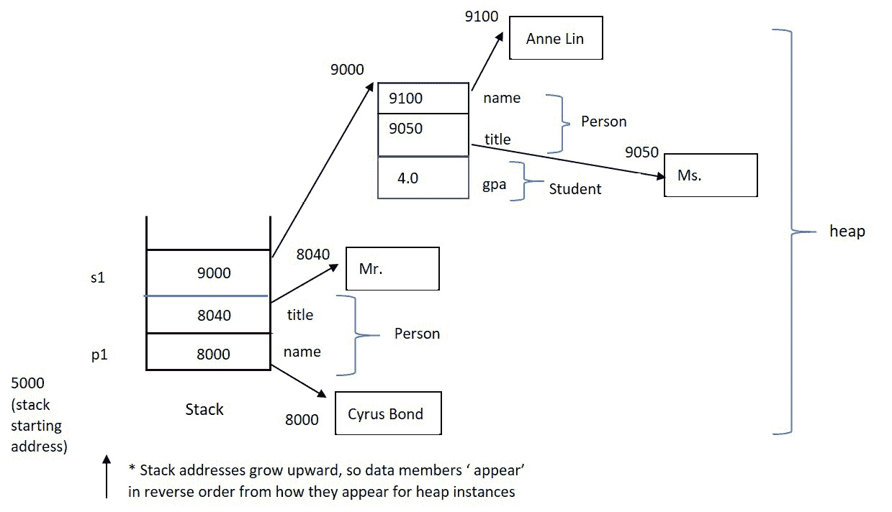

# 第六章：使用单继承实现层次结构

本章将扩展我们在 C++中面向对象编程的追求。我们将首先介绍额外的面向对象概念，如**泛化**和**特化**，然后理解这些概念如何通过*直接语言支持*在 C++中实现。我们将开始构建相关类的层次结构，并理解每个类如何成为我们应用程序中更易于维护、可重复使用的构建模块。我们将理解本章介绍的新的面向对象概念将支持精心规划的设计，并清楚地了解如何在 C++中使用健壮的代码来实现这些设计。

在本章中，我们将涵盖以下主要主题：

+   面向对象的泛化和特化概念，以及 Is-A 关系

+   单继承基础-定义派生类，访问继承成员，理解继承访问标签和区域

+   单继承层次结构中的构造和销毁顺序；使用成员初始化列表选择基类构造函数

+   修改基类列表中的访问标签-公共与私有和受保护的基类-以改变继承的 OO 目的为实现继承

通过本章结束时，您将了解泛化和特化的面向对象概念，并将知道如何在 C++中使用继承作为实现这些理想的机制。您将了解基类和派生类等术语，以及构建层次结构的面向对象动机，例如支持 Is-A 关系或支持实现继承。

具体来说，您将了解如何使用单继承来扩展继承层次结构，以及如何访问继承的数据成员和成员函数。您还将了解根据其定义的访问区域，您可以直接访问哪些继承成员。

您将了解当实例化和销毁派生类类型的实例时，构造函数和析构函数的调用顺序。您将知道如何利用成员初始化列表来选择派生类对象可能需要利用作为其自身构造的一部分的潜在组中的继承构造函数。

您还将了解如何更改基类列表中的访问标签会改变您正在扩展的继承层次结构的 OO 含义。通过检查公共与私有和受保护的基类，您将了解不同类型的层次结构，例如那些用于支持 Is-A 关系的层次结构，与那些用于支持实现继承的层次结构。

通过理解 C++中单继承的直接语言支持，您将能够实现泛化和特化的面向对象概念。您的层次结构中的每个类将成为更易于维护的组件，并且可以作为创建新的、更专业化组件的潜在构建模块。让我们通过详细介绍单继承来进一步了解 C++作为面向对象编程语言。

# 技术要求

完整程序示例的在线代码可在以下 GitHub URL 找到：[`github.com/PacktPublishing/Demystified-Object-Oriented-Programming-with-CPP/blob/master/Chapter06`](https://github.com/PacktPublishing/Demystified-Object-Oriented-Programming-with-CPP/blob/master/Chapter06)。每个完整程序示例都可以在 GitHub 存储库中的适当章节标题（子目录）下找到，文件名与所在章节编号相对应，后跟破折号，再跟上该章节中的示例编号。例如，本章的第一个完整程序可以在名为`Chp6-Ex1.cpp`的文件中的子目录`Chapter06`中找到。

本章的 CiA 视频可在以下链接观看：[`bit.ly/3tJJJBK`](https://bit.ly/3tJJJBK)。

# 扩展面向对象的概念和术语

在本节中，我们将介绍基本的面向对象概念，以及将伴随这些关键思想的适用术语。

从*第五章* *详细探讨类*，你现在了解了封装和信息隐藏的关键面向对象思想，以及 C++如何通过 C++类支持这些理念。现在，我们将看看如何通过使用一个非常通用的类作为基础模块来构建一系列相关类的层次结构，然后通过创建更具体的类来扩展该类。通过以这种重复的方式构建一系列相关类的层次结构，面向对象系统提供了潜在的重复使用的基础模块。层次结构中的每个类都是封装的，因此可以更轻松地对特定类进行维护和升级，而不会影响整个系统。通过逐步将每个类与更具体和更详细的类相结合，构建一系列相关类的层次结构，可以在一个专注的维护和更改领域内进行每个组件的具体维护。

让我们从扩展我们的基本面向对象术语开始。

## 理解泛化和特化

本章延伸的主要面向对象概念是*泛化*和*特化*。将这些原则纳入设计中将为编写更易于修改和可维护的代码提供基础，并且可能在相关应用中重复使用代码。

**泛化**描述了从一组类中抽象出共同点并创建一个更通用的类来容纳这些共同的属性和行为的过程。更通用的类可以被称为**基类**（或**父类**）。泛化也可以用于将单个类的更一般的属性和行为收集到一个基类中，期望新的通用类以后可以作为附加的、更具体（派生）的类的基础或基础。

**特化**描述了从现有的通用基类派生出一个新类的过程，目的是添加特定的、可区分的属性和行为，以充分代表新类。特化类也可以称为**派生**（或**子类**）类。通过特化，类的层次结构可以逐步完善其各自的属性和行为。

尽管重复使用很难实现，但面向对象的概念，如泛化和特化，使得重复使用更容易实现。重复使用可以在性质相似的应用程序中实现，或者在同一项目领域中，或者在现有项目的延续中，或者在相关领域中实现，至少可以最大程度地重复使用最通用的类和相关组件。

构建层次结构是 C++的基本语言特性。让我们通过探索单继承来将这个想法付诸实践。

# 理解单继承的基本知识

**继承**是 C++语言机制，允许实现泛化和特化的概念。**单继承**是指给定类只有一个直接的基类。C++支持单继承和多继承，但在本章中我们将专注于单继承，并将在后面的章节中介绍多继承。

在 C++中可以使用类和结构来构建继承层次结构。然而，通常使用类而不是结构来支持继承和面向对象编程。

为了支持泛化和特化的目的而扩展继承层次结构，我们可以说*一个学生是一个人*。也就是说，`Student`是`Person`的特化，添加了基类`Person`提供的额外数据成员和成员函数。通过泛化和特化指定 Is-A 关系是使用继承创建基类和派生类的最典型原因。在本章的后面，我们将看到另一个使用继承的原因。

让我们开始看一下 C++中指定基类和派生类以及定义继承层次结构的语言机制。

## 定义基类和派生类，并访问继承的成员

在单一继承中，派生类指定了它的直接祖先或基类是谁。基类不指定它有任何派生类。

派生类只需通过在其类名后添加`:`，然后是关键字`public`（暂时），然后是特定的基类名，来创建一个基类列表。每当你在基类列表中看到一个`public`关键字，这意味着我们正在使用继承来指定 Is-A 关系。

这里有一个简单的例子来说明基本语法：

+   `Student`是`Person`的派生类：

```cpp
class Person  // base class
{
private:
    char *name;
    char *title;
public:
    // constructors, destructor, 
    // public access functions, public interface etc …
    const char *GetTitle() const { return title; }
};
class StudentPerson, and the derived class is Student. The derived class need only define additional data members and member functions that augment those specified in the base class. Instances of a derived class may generally access `public` members specified by the derived class or by any ancestor of the derived class. Inherited members are accessed in the same fashion as those specified by the derived class. Recall, `.` dot notation is used to access members of objects, and `->` arrow notation is used to access members of pointers to objects. Of course, to make this example complete, we will need to add the applicable constructors, which we currently assume exist. Naturally, there will be nuances with constructors relating to inheritance, which we will soon cover in this chapter. 
```

+   可以使用上述类来简单访问继承的成员，如下所示：

```cpp
int main()
{   
    // Let's assume the applicable constructors exist
    Person p1("Cyrus Bond", "Mr.");
    Student *s1 = new Student("Anne Lin", "Ms.", 4.0);
    cout << p1.GetTitle() << " " << s1->GetTitle();
    cout << s1->GetGpa() << endl;
    return 0;
}
```

在前面的代码片段中，由`s1`指向的派生类实例`Student`可以访问基类和派生类成员，比如`Person::GetTitle()`和`Student::GetGpa()`。基类实例`Person`，`p1`，只能访问自己的成员，比如`Person::GetTitle()`。

查看上面示例的内存模型，我们有：



图 6.1 - 当前示例的内存模型

在前面的内存模型中，`Student`实例由`Person`子对象组成。也就是说，在指示`*s1`的内存地址上，一个`Student`，我们首先看到它的`Person`数据成员的内存布局。然后，我们看到它额外的`Student`数据成员的内存布局。当然，`p1`，它是一个`Person`，只包含`Person`数据成员。

基类和派生类成员的访问将受到每个类指定的访问区域的限制。让我们看看继承的访问区域是如何工作的。

## 检查继承的访问区域

访问区域，包括继承的访问区域，定义了从哪个范围直接访问成员，包括继承的成员。

派生类继承了其基类中指定的所有成员。然而，对这些成员的直接访问受到基类指定的访问区域的限制。

从*基类*继承的成员（包括数据和函数）按照基类强加的访问区域对*派生类*是可访问的。继承的访问区域及其与派生类访问的关系如下：

+   在基类中定义的**private**成员在基类的范围之外是不可访问的。类的范围包括该类的成员函数。

+   在基类中定义的**protected**成员在基类的范围内和派生类或其后代的范围内是可访问的。这意味着这些类的成员函数。

+   在基类中定义的**public**成员可以从任何范围访问，包括派生类的范围。

在前面的简单示例中，我们注意到`Person`和`Student`实例都从`main()`的范围内访问了`public`成员函数`Person::GetTitle()`。此外，我们注意到`Student`实例从`main()`访问了它的`public`成员`Student::GetGpa()`。通常，在给定类的范围之外，只有公共接口中的成员是可访问的，就像在这个例子中一样。

本章我们将很快看到一个更大的完整程序示例，展示`protected`访问区域。但首先，让我们回顾一下继承的构造函数和析构函数，以便我们的完整程序示例可以提供更大的整体效用。

# 理解继承的构造函数和析构函数

通过单一继承，我们可以构建一组相关的类。我们已经看到，当我们实例化派生类对象时，其基类数据成员的内存将被额外需要的派生类数据成员的内存所跟随。每个子对象都需要被构造。幸运的是，每个类都将为此目的定义一套构造函数。然后我们需要理解语言如何被利用来允许我们在实例化和构造派生类对象时指定适当的基类构造函数。

同样，当不再需要派生类类型的对象并且将被销毁时，重要的是要注意，将为组成派生类实例的每个子对象隐式调用析构函数。

让我们来看一下单一继承层次结构中的构造函数和析构函数顺序，以及当一个基类子对象在派生类实例中找到多个构造函数可用时，我们如何做出选择。

## 隐式构造函数和析构函数调用

构造函数和析构函数是两种不被派生类显式继承的成员函数。这意味着基类构造函数的签名不能用来实例化派生类对象。然而，我们将看到，当实例化派生类对象时，整体对象的基类和派生类部分的内存将分别使用各自的构造函数进行初始化。

当实例化派生类类型的对象时，不仅将调用其构造函数，还将调用其每个前面基类的构造函数。最一般的基类构造函数将首先被执行，然后一直沿着层次结构调用构造函数，直到达到与手头实例相同类型的派生类构造函数。

同样，当派生类实例超出范围（或对实例的指针进行显式释放）时，所有相关的析构函数将被调用，但顺序与构造相反。首先，派生类析构函数将被执行，然后将依次调用和执行每个前面基类的析构函数，直到达到最一般的基类。

现在你可能会问，当我实例化一个派生类时，我如何从一组潜在的基类构造函数中选择适合我的基类子对象？让我们更详细地看一下成员初始化列表，找到解决方案。

## 使用成员初始化列表来选择基类构造函数

成员初始化列表可以用来指定在实例化派生类对象时应调用哪个基类构造函数。每个派生类构造函数可以指定使用不同的基类构造函数来初始化派生类对象的给定基类部分。

如果派生类构造函数的成员初始化列表没有指定应使用哪个基类构造函数，则将调用默认的基类构造函数。

成员初始化列表在派生类构造函数的参数列表后使用`:`来指定。为了指定应该使用哪个基类构造函数，可以指定基类构造函数的名称，后跟括号，包括要传递给该基类构造函数的任何值。根据在基类名称后的基类列表中参数的签名，将选择适当的基类构造函数来初始化派生类对象的基类部分。

这是一个简单的示例，用来说明基类构造函数选择的基本语法：

+   让我们从基本的类定义开始（请注意，许多成员函数被省略）：

```cpp
class Person
{
private:
    char *name;
    char *title;
public:
    Person();  // various constructors
    Person(const char *, const char *); 
    Person(const Person &);
    ~Person();  // destructor
// Assume the public interface, access functions exist
};
class Student: public Person
{
private:
    float gpa;
public:
    Student();
    Student(const char *, const char *, float);
    ~Student();
// Assume the public interface, access functions exist
};
```

+   之前的类定义的构造函数如下（请注意，两个派生类构造函数使用了成员初始化列表）：

```cpp
// Base class constructors
Person::Person()
{
    name = title = 0;  // null pointer
}
Person::Person(const char *n, const char *t)
{    // implementation as expected
}
Person::Person(const Person &p)
{   // implementation as expected
}
// Derived class constructors
Student::Student()   // default constructor
{
    gpa = 0.0;
}
Student::Student(const char *n, const char *t, 
                 float g)Student::Student(), does not utilize the member initialization list to specify which Person constructor should be used. Because none has been selected, the default Person constructor (with no arguments) is called. Next, notice in the alternate derived class constructor, `Student::Student(const char *, const char *, float)`, the use of the member initialization list. Here, the `Person` constructor matching the signature of `Person::Person(const char *, const char *)` is selected to initialize the `Person` sub-object at hand. Also, notice that parameters from the `Student` constructor, `n` and `t`, are passed up to the aforementioned `Person` constructor to help complete the `Person` sub-object initialization.Now, notice in the copy constructor for the derived class, `Student::Student(const Student &)`, the member initialization list is used to select the `Person` copy constructor, passing `s` as a parameter to the `Person` copy constructor. Here, the object referenced by `s` is a `Student`, however, the top part of `Student` memory contains `Person` data members. Hence, it is acceptable to up-cast the `Student` to a `Person` to allow the `Person` copy constructor to initialize the `Person` sub-object. In the body of the `Student` copy constructor, the additional data members added by the `Student` class definition are initialized in the body of this function. Namely, by setting `gpa = s.gpa;`.
```

现在我们知道如何利用成员初始化列表来指定基类构造函数，让我们继续进行一个完整的程序示例。

## 将所有部分组合在一起

到目前为止，在本章中，我们已经看到了许多部分构成了一个完整的程序示例。重要的是要看到我们的代码在运行中，以及它的各个组件。我们需要看到继承的基本机制，成员初始化列表是如何用来指定应该隐式调用哪个基类构造函数的，以及`protected`访问区域的重要性。

让我们来看一个更复杂的完整程序示例，以充分说明单一继承。这个示例将被分成几个部分；完整的程序可以在以下 GitHub 位置找到：

[`github.com/PacktPublishing/Demystified-Object-Oriented-Programming-with-CPP/blob/master/Chapter06/Chp6-Ex1.cpp`](https://github.com/PacktPublishing/Demystified-Object-Oriented-Programming-with-CPP/blob/master/Chapter06/Chp6-Ex1.cpp)

```cpp
#include <iostream>
#include <iomanip>
#include <cstring>
using namespace std;
class Person
{
private: 
   // data members
   char *firstName;
   char *lastName;
   char middleInitial;
   char *title;  // Mr., Ms., Mrs., Miss, Dr., etc.
protected: // make available to derived classes in their scope
   void ModifyTitle(const char *); 
public:
   Person();   // default constructor
   Person(const char *, const char *, char, const char *);  
   Person(const Person &);  // copy constructor
   ~Person();  // destructor
   // inline function definitions
   const char *GetFirstName() const { return firstName; }  
   const char *GetLastName() const { return lastName; }    
   const char *GetTitle() const { return title; } 
   char GetMiddleInitial() const { return middleInitial; }
};
```

在之前的类定义中，我们现在有了一个完整的`Person`类定义，比我们在本节中以前使用的简单语法示例要详细得多。请注意，我们引入了一个`protected`访问区域，并将成员函数`void ModifyTitle(const char *);`放在这个访问区域中。

继续前进，让我们来看一下`Person`的非内联成员函数定义：

```cpp
Person::Person()
{
   firstName = lastName = 0;  // NULL pointer
   middleInitial = '\0';
   title = 0;
}
Person::Person(const char *fn, const char *ln, char mi, 
               const char *t)
{
   firstName = new char [strlen(fn) + 1];
   strcpy(firstName, fn);
   lastName = new char [strlen(ln) + 1];
   strcpy(lastName, ln);
   middleInitial = mi;
   title = new char [strlen(t) + 1];
   strcpy(title, t);
}
Person::Person(const Person &pers)
{
   firstName = new char [strlen(pers.firstName) + 1];
   strcpy(firstName, pers.firstName);
   lastName = new char [strlen(pers.lastName) + 1];
   strcpy(lastName, pers.lastName);
   middleInitial = pers.middleInitial;
   title = new char [strlen(pers.title) + 1];
   strcpy(title, pers.title);
}
Person::~Person()
{
   delete firstName;
   delete lastName;
   delete title;
}
void Person::ModifyTitle(const char *newTitle)
{
   delete title;  // delete old title
   title = new char [strlen(newTitle) + 1];
   strcpy(title, newTitle);
}
```

上述`Person`成员函数的实现如预期的那样。现在，让我们添加派生类`Student`的类定义，以及它的内联函数定义：

```cpp
class Student: public Person
{
private: 
   // data members
   float gpa;
   char *currentCourse;
   const char *studentId;  
public:
   // member function prototypes
   Student();  // default constructor
   Student(const char *, const char *, char, const char *,
           float, const char *, const char *); 
   Student(const Student &);  // copy constructor
   ~Student();  // destructor
   void Print() const;
   void EarnPhD();  // public interface to inherited 
                    // protected member
   // inline function definitions
   float GetGpa() const { return gpa; }
   const char *GetCurrentCourse() const 
       { return currentCourse; }
   const char *GetStudentId() const { return studentId; }
   // prototype only, see inline function definition below
   void SetCurrentCourse(const char *);
};
inline void Student::SetCurrentCourse(const char *c)
{
   delete currentCourse;   // delete existing course
   currentCourse = new char [strlen(c) + 1];
   strcpy(currentCourse, c); 
}
```

在之前的`Student`定义中，`class Student`是通过`public`继承（即公共基类）从`Person`派生的，支持 Is-A 关系。请注意，在派生类定义中的基类列表后面的`:`之后有一个`public`访问标签（即`class Student: public Person`）。请注意，我们的`Student`类添加了数据成员和成员函数，超出了它从`Person`自动继承的那些。

接下来，添加非内联的`Student`成员函数，我们继续完善我们的代码：

```cpp
Student::Student() : studentId (0)   // default constructor
{
   gpa = 0.0;
   currentCourse = 0;
}
// alternate constructor
Student::Student(const char *fn, const char *ln, char mi, 
                 const char *t, float avg, const char *course,
                 const char *id): Person(fn, ln, mi, t)
{
   gpa = avg;
   currentCourse = new char [strlen(course) + 1];
   strcpy(currentCourse, course);
   char *temp = new char [strlen(id) + 1];
   strcpy (temp, id); 
   studentId = temp;
}
// copy constructor
Student::Student(const Student &ps): Person(ps)
{
   gpa = ps.gpa;
   currentCourse = new char [strlen(ps.currentCourse) + 1];
   strcpy(currentCourse, ps.currentCourse);
   char *temp = new char [strlen(ps.studentId) + 1];
   strcpy (temp, ps.studentId); 
   studentId = temp;
}

// destructor definition
Student::~Student()
{
   delete currentCourse;
   delete (char *) studentId;
}
void Student::Print() const
{
   // Private members of Person are not directly accessible
   // within the scope of Student, so we use access functions 
   cout << GetTitle() << " " << GetFirstName() << " ";
   cout << GetMiddleInitial() << ". " << GetLastName();
   cout << " with id: " << studentId << " gpa: ";
   cout << setprecision(2) << gpa;
   cout << " course: " << currentCourse << endl;
}
void Student::EarnPhD()
{
   // Protected members defined by the base class are
   // accessible within the scope of the derived class.
   // EarnPhd() provides a public interface to this
   // functionality for derived class instances. 
   ModifyTitle("Dr.");  
}
```

在上述代码段中，我们定义了`Student`的非内联成员函数。请注意，默认构造函数仅使用成员初始化列表来初始化数据成员，就像我们在上一章中所做的那样。由于在默认`Student`构造函数的成员初始化列表中没有指定`Person`构造函数，所以在实例化具有默认构造函数的`Student`时，将使用默认的`Person`构造函数来初始化`Person`子对象。

接下来，`Student`的替代构造函数使用成员初始化列表来指定应该使用`Person`的替代构造函数来构造给定`Student`实例中包含的`Person`子对象。请注意，所选的构造函数将匹配签名`Person::Person(char *, char *, char, char *)`，并且将从`Student`构造函数中选择的输入参数（即`fn`，`ln`，`mi`和`t`）作为参数传递给`Person`的替代构造函数。

在`Student`的复制构造函数中，使用成员初始化列表指定应调用`Person`的复制构造函数来初始化正在构造的`Student`实例中包含的`Person`子对象。`Student &`将被隐式向上转型为`Person &`，因为调用了`Person`的复制构造函数。请记住，`Student`对象的顶部部分*Is-A*`Person`，所以这是可以的。接下来，在`Student`的复制构造函数的主体中，我们初始化了`Student`类定义的任何剩余数据成员。

继续向前，我们看到了`Student`的析构函数。隐式地，作为这个方法中的*最后*一行代码，编译器为我们补充了对`Person`析构函数的调用。这就是析构函数序列是如何自动化的。因此，对象的最专业化部分，即`Student`部分，将首先被销毁，然后隐式调用`Person`析构函数来销毁基类子对象。

接下来，在`Student`的`Print()`方法中，请注意我们想要打印出从`Person`继承的各种数据成员。遗憾的是，这些数据成员是`private`的。我们不能在`Person`类的范围之外访问它们。然而，`Person`类留下了一个公共接口，比如`Person::GetTitle()`和`Person::GetFirstName()`，这样我们就可以从我们应用程序的任何范围访问这些数据成员，包括从`Student::Print()`中。

最后，我们来到`Student::EarnPhD()`方法。请注意，这个方法所做的就是调用`protected`成员函数`Person::ModifyTitle("Dr.");`。请记住，基类定义的`protected`成员在派生类的范围内是可访问的。`Student::EarnPhD()`是派生类的成员函数。`EarnPhD()`提供了一个公共接口来修改`Person`的头衔，也许在检查学生是否达到毕业要求之后。因为`Person::ModifyTitle()`不是`public`，`Person`或`Student`的实例必须通过受控的`public`接口来更改它们各自的头衔。这样的接口可能包括诸如`Student::EarnPhD()`或`Person::GetMarried()`等方法。

尽管如此，让我们通过检查`main()`来完成我们的完整程序示例：

```cpp
int main()
{
    Student s1("Jo", "Li", 'U', "Ms.", 3.8, "C++", "178PSU"); 
    // Public members of Person and Student are accessible
    // outside the scope of their respective classes....
    s1.Print();
    s1.SetCurrentCourse("Doctoral Thesis");
    s1.EarnPhD();
    s1.Print();
    return 0;
}
```

在程序的最后一部分，在`main()`中，我们只是实例化了一个`Student`，即`s1`。`Student`利用`Student::Print()`来打印其当前数据。然后，`Student`将她当前的课程设置为“博士论文”，然后调用`Student::EarnPhD();`。请注意，`Student`或`Person`的任何`public`成员都可以在类的范围之外被`s1`使用，比如在`main()`中。为了完成示例，`s1`使用`Student::Print()`重新打印她的详细信息。

以下是完整程序示例的输出：

```cpp
Ms. Jo U. Li with id: 178PSU gpa: 3.9 course: C++
Dr. Jo U. Li with id: 178PSU gpa: 3.9 course: Doctoral Thesis
```

现在我们已经掌握了单继承的基本机制，并且已经使用单继承来模拟 Is-A 关系，让我们继续看看继承如何用于模拟不同的概念，通过探索受保护和私有基类。

# 实现继承-改变继承的目的

到目前为止，我们已经演示了使用公共基类，也称为*公共继承*。公共基类用于建模 Is-A 关系，并为构建继承层次结构提供了主要动机。这种用法支持泛化和特化的概念。

偶尔，继承可能被用作一种工具，以另一个类的术语来实现一个类，也就是说，一个类使用另一个类作为其基础实现。这被称为**实现继承**，它不支持概括和特化的理想。然而，实现继承可以提供一种快速和易于重用的实现一个类的方式。它快速且相对无误。许多类库在不知晓其类用户的情况下使用这个工具。重要的是要区分实现继承和传统层次结构构建的动机，以指定 Is-A 关系。

在 C++中支持使用私有和受保护的基类来实现实现继承，这是 C++独有的。其他面向对象的语言选择只支持用于建模 Is-A 关系的继承，而 C++通过公共基类支持这一点。面向对象的纯粹主义者会努力只使用继承来支持概括和特化（*Is-A*）。然而，使用 C++，我们将理解实现继承的适当用法，以便明智地使用这种语言特性。

让我们继续了解我们可能如何以及为什么使用这种类型的继承。

## 通过使用受保护或私有基类修改基类列表中的访问标签

重申一下，通常的继承类型是`public`继承。在给定派生类的基类列表中使用`public`标签。然而，在基类列表中，关键字`protected`和`private`也是可选项。

也就是说，除了在类或结构定义中标记访问区域之外，访问标签还可以在派生类定义的基类列表中使用，以指定基类中定义的成员如何被派生类继承。

继承成员只能比在基类中指定的更加严格。当派生类指定继承成员应以更加严格的方式对待时，该派生类的任何后代也将受到这些规定的约束。

让我们看一个*基类列表*的快速示例：

+   请记住，基类列表中通常会指定`public`访问标签。

+   在这个例子中，使用`public`访问标签来指定`Person`是`Student`的`public`基类。也就是说，`Student` *Is-A* `Person`：

```cpp
class Student: public Person
{
    // usual class definition
};
```

在*基类列表*中指定的访问标签会修改继承的访问区域，如下所示：

+   **public**：基类中的公共成员可以从任何范围访问；基类中的受保护成员可以从基类和派生类的范围访问。我们熟悉使用公共基类。

+   **protected**：基类中的公共和受保护成员在派生类中的作用就像它们被派生类定义为受保护的一样（即可以从基类和派生类的范围以及派生类的任何后代中访问）。

+   **private**：基类中的公共和受保护成员在派生类中的作用就像它们被定义为私有的一样，允许这些成员在派生类的范围内访问，但不允许在任何派生类的后代范围内访问。

注意

在所有情况下，在类定义中标记为私有的类成员只能在定义类的范围内访问。修改基类列表中的访问标签只能更加严格地处理继承成员，而不能更加宽松地处理。

在与基类一起指定的访问标签缺失时，如果用户定义的类型是`class`，则假定为`private`，如果用户定义的类型是`struct`，则默认为`public`。一个好的经验法则是在派生类（或结构）定义的基类列表中始终包括访问标签。

## 创建一个基类来说明实现继承

为了理解实现继承，让我们回顾一个可能作为实现其他类基础的基类。我们将检查一对典型的类，以实现封装的`LinkList`。尽管这个例子将被分成几个部分，但完整的例子将被展示，并且也可以在 GitHub 上找到：

[`github.com/PacktPublishing/Demystified-Object-Oriented-Programming-with-CPP/blob/master/Chapter06/Chp6-Ex2.cpp`](https://github.com/PacktPublishing/Demystified-Object-Oriented-Programming-with-CPP/blob/master/Chapter06/Chp6-Ex2.cpp)

```cpp
#include <iostream>
using namespace std;
typedef int Item;  
class LinkListElement  // one 'node' or element in a LinkList
{
private:
    void *data;
    LinkListElement *next;
public:
    LinkListElement() { data = 0; next = 0; }
    LinkListElement(Item *i) { data = i; next = 0; }
    ~LinkListElement() { delete (Item *) data; next = 0; }
    void *GetData() { return data; }
    LinkListElement *GetNext() { return next; }
    void SetNext(LinkListElement *e) { next = e; }
};
class LinkList   // an encapsulated LinkList
{
private:
    LinkListElement *head;
    LinkListElement *tail;
    LinkListElement *current;
public:
    LinkList();
    LinkList(LinkListElement *);
   ~LinkList();
    void InsertAtFront(Item *);
    LinkListElement *RemoveAtFront();
    void DeleteAtFront();
    int IsEmpty() { return head == 0; } 
    void Print();  
};
```

我们从上一段代码开始，定义了`LinkListElement`和`LinkList`的类定义。`LinkList`类将包含指向`LinkList`中`head`，`tail`和`current`元素的指针的数据成员。这些指针都是`LinkListElement`类型。包括各种典型的`LinkList`处理方法，如`InsertAtFront()`，`RemoveAtFront()`，`DeleteAtFront()`，`IsEmpty()`和`Print()`。让我们快速查看这些方法的实现，下一段代码中会有。

```cpp
LinkList::LinkList()
{
    head = tail = current = 0;
}
LinkList::LinkList(LinkListElement *element)
{
    head = tail = current = element;
}
void LinkList::InsertAtFront(Item *theItem)
{
    LinkListElement *temp = new LinkListElement(theItem);
    temp->SetNext(head);  // temp->next = head;
    head = temp;
}
LinkListElement *LinkList::RemoveAtFront()
{
    LinkListElement *remove = head;
    head = head->GetNext();  // head = head->next;
    current = head;    // reset current for usage elsewhere
    return remove;
}

void LinkList::DeleteAtFront()
{
    LinkListElement *deallocate;
    deallocate = RemoveAtFront();
    delete deallocate;  // destructor will both delete data 
}                       // and will set next to NULL

void LinkList::Print()
{
    Item output;
    if (!head)
       cout << "<EMPTY>";
    current = head;
    while (current)
    {
        output = *((Item *) current->GetData());
        cout << output << " ";
        current = current->GetNext();
    }
    cout << endl;
}
LinkList::~LinkList()
{
    while (!IsEmpty())
        DeleteAtFront();
}
```

在前面提到的成员函数定义中，我们注意到`LinkList`可以为空或带有一个元素构造（注意两个可用的构造函数）。`LinkList::InsertAtFront()`在列表的前面添加一个项目以提高效率。`LinkList::RemoveAtFront()`删除一个项目并将其返回给用户，而`LinkList::DeleteAtFront()`删除前面的项目。`LinkList::Print()`函数允许我们在必要时查看`LinkList`。

接下来，让我们看一个典型的`main()`函数，以说明如何实例化和操作`LinkList`。

```cpp
int main()
{
    // Create a few items, to be data for LinkListElements
    Item *item1 = new Item;
    *item1 = 100;
    Item *item2 = new Item(200);
    // create an element for the Linked List
    LinkListElement *element1 = new LinkListElement(item1);
    // create a linked list and initialize with one element
    LinkList list1(element1);
    // Add some new items to the list and print
    list1.InsertAtFront(item2);   
    list1.InsertAtFront(new Item(50)); // add a nameless item
    cout << "List 1: ";
    list1.Print();         // print out contents of list
    // delete elements from list, one by one
    while (!(list1.IsEmpty()))
    {
        list1.DeleteAtFront();
        cout << "List 1 after removing an item: ";
        list1.Print();
    }
    // create a second linked list, add some items and print
    LinkList list2;
    list2.InsertAtFront(new Item (3000));
    list2.InsertAtFront(new Item (600));
    list2.InsertAtFront(new Item (475));
    cout << "List 2: ";
    list2.Print();
    // delete elements from list, one by one
    while (!(list2.IsEmpty()))
    {
        list2.DeleteAtFront();
        cout << "List 2 after removing an item: ";
        list2.Print();
    }
    return 0;
}
```

在`main()`中，我们创建了几个项目，类型为`Item`，这些项目稍后将成为`LinkListElement`的数据。然后，我们实例化了一个`LinkListElement`，即`element1`，并将其添加到新构造的`LinkList`中，使用`LinkList list1(element1);`。然后，我们使用`LinkList::InsertAtFront()`向列表中添加了几个项目，并调用`LinkList::Print()`来打印出`list1`作为基线。接下来，我们逐个从`list1`中删除元素，打印删除的元素，使用`LinkList::DeleteAtFront()`和`LinkList::Print()`。

现在，我们实例化了第二个`LinkList`，即`list2`，它开始为空。我们逐渐使用`LinkList::InsertAtFront()`插入几个项目，然后打印列表，然后使用`LinkList::DeleteAtFront()`逐个删除每个元素，打印每个步骤后的修订列表。

这个例子的重点不是详尽地审查这段代码的内部工作原理。毫无疑问，您对`LinkList`的概念非常熟悉。更重要的是，要将`LinkListElement`和`LinkList`这组类作为一组构建块，可以构建多个抽象数据类型。

尽管如此，上述示例的输出是：

```cpp
List 1: 50 200 100
List 1 after removing an item: 200 100
List 1 after removing an item: 100
List 1 after removing an item: <EMPTY>
List 2: 475 600 3000
List 2 after removing an item: 600 3000
List 2 after removing an item: 3000
List 2 after removing an item: <EMPTY>
```

接下来，让我们看看`LinkList`如何作为私有基类使用。

## 使用私有基类来实现一个类以另一个类为基础

我们刚刚创建了一个`LinkList`类，以支持封装的链表数据结构的基本处理。现在，让我们想象一下，我们想要实现`Push()`，`Pop()`，`IsEmpty()`，也许还有`Print()`。

你可能会问栈是如何实现的。答案是实现并不重要，只要它支持被建模的 ADT 的预期接口。也许栈是使用数组实现的，或者它是在文件中实现的。也许它是使用`LinkedList`实现的。每种实现都有优缺点。事实上，ADT 的底层实现可能会改变，但 ADT 的用户不应受到这种变化的影响。这就是*实现继承*的基础。派生类是基类的实现，但派生类的底层细节是有效隐藏的。这些细节不能直接被派生类的实例（在这种情况下是 ADT）使用。尽管如此，基类默默地为派生类提供实现。

我们将使用这种方法来使用`LinkedList`作为其底层实现来实现一个`Stack`。为此，我们将让`class Stack`扩展`LinkedList`，使用一个`private`基类。`Stack`将为其用户定义一个公共接口，以建立这个 ADT 的接口，比如`Push()`、`Pop()`、`IsEmpty()`和`Print()`。这些成员函数的实现将使用选定的`LinkedList`成员函数，但`Stack`的用户将看不到这一点，`Stack`的实例也不能直接使用任何`LinkList`成员。

在这里，我们并不是说`Stack`*是一个*`LinkList`，而是说，一个`Stack`是目前以`LinkedList`为基础实现的——而这个底层实现可能会改变！

实现`Stack`的代码很简单。假设我们使用了前面例子中的`LinkList`和`LinkListElement`类。让我们在这里添加`Stack`类。完整的程序示例可以在我们的 GitHub 上找到：

[`github.com/PacktPublishing/Demystified-Object-Oriented-Programming-with-CPP/blob/master/Chapter06/Chp6-Ex3.cpp`](https://github.com/PacktPublishing/Demystified-Object-Oriented-Programming-with-CPP/blob/master/Chapter06/Chp6-Ex3.cpp)

```cpp
class Stack: private LinkList
{
private:
    // no new data members are necessary
public:
    Stack() : LinkList() { }
    ~Stack() { }
    // the public interface for Stack 
    void Push(Item *i) { InsertAtFront(i); }
    Item *Pop(); 
    // It is necessary to redefine these operation because
    // LinkList is a private base class of Stack
    int IsEmpty() { return LinkList::IsEmpty(); }  
    void Print() { LinkList::Print(); }
};
Item *Stack::Pop()
{
    LinkListElement *temp;
    temp = RemoveAtFront();
    // copy temp's data
    Item *item = new Item(*((Item *) temp->GetData()));  
    delete temp;
    return item;
}
int main()
{
    Stack stack1;     // create a Stack
    // Add some items to the stack, using public interface 
    stack1.Push(new Item (3000)); 
    stack1.Push(new Item (600));
    stack1.Push(new Item (475));
    cout << "Stack 1: ";
    stack1.Print();
    // Pop elements from stack, one by one
    while (!(stack1.IsEmpty()))
    {
        stack1.Pop();
        cout << "Stack 1 after popping an item: ";
        stack1.Print();
    }
    return 0;
} 
```

注意我们的`Stack`类的上述代码是多么紧凑！我们首先指定`Stack`有一个`private`的基类`LinkList`。回想一下，一个`private`的基类意味着从`LinkList`继承的`protected`和`public`成员就好像是由`Stack`定义为`private`一样（只能在`Stack`的范围内访问，也就是`Stack`的成员函数）。这意味着`Stack`的实例可能不能使用`LinkList`的*原来的*公共接口。这也意味着`Stack`作为`LinkList`的底层实现是有效隐藏的。当然，`LinkList`的实例不受任何影响，可以像往常一样使用它们的`public`接口。

我们很容易定义`Stack::Push()`来简单调用`LinkList::InsertAtFront()`，就像`Stack::Pop()`做的不仅仅是调用`LinkList::RemoveAtFront()`。尽管`Stack`很想简单地使用`LinkList::IsEmpty()`和`LinkList::Print()`的继承实现，但由于`LinkList`是一个`private`基类，这些函数不是`Stack`的公共接口的一部分。因此，`Stack`添加了一个`IsEmpty()`方法，它只是调用`LinkList::IsEmpty()`。注意使用作用域解析运算符来指定`LinkList::IsEmpty()`方法；没有基类限定，我们将添加一个递归函数调用！这个对基类方法的调用是允许的，因为`Stack`成员函数可以调用`LinkList`的*曾经的*方法（它们现在在`Stack`内部被视为`private`）。同样，`Stack::Print()`只是调用`LinkList::Print()`。

在`main()`的范围内，我们实例化了一个`Stack`，即`stack1`。使用`Stack`的公共接口，我们可以很容易地使用`Stack::Push()`、`Stack::Pop()`、`Stack::IsEmpty()`和`Stack::Print()`来操作`stack1`。

这个例子的输出是：

```cpp
Stack 1: 475 600 3000
Stack 1 after popping an item: 600 3000
Stack 1 after popping an item: 3000
Stack 1 after popping an item: <EMPTY>
```

重要的是要注意，`Stack`实例的指针不能向上转型为`LinkList`的指针进行存储。在`private`基类边界上不允许向上转型。这将允许`Stack`揭示其底层实现；C++不允许这种情况发生。在这里，我们只是说`Stack`仅仅是以`LinkList`的方式实现；我们并没有说`Stack` *Is-A* `LinkedList`。这是实现继承的最佳例子；这个例子有利地说明了实现继承。

接下来，让我们继续看看如何使用`protected`基类，以及这与使用实现继承的`private`基类有何不同。

## 使用 protected 基类来实现一个类以另一个类为基础

我们刚刚使用`private`基类以`LinkList`的方式实现了`Stack`。现在，让我们实现一个`Queue`和一个`PriorityQueue`。我们将使用`LinkList`作为`protected`基类来实现`Queue`，并使用`Queue`作为`public`基类来实现`PriorityQueue`。

再次强调，`Queue`和`PriorityQueue`都是 ADT。`Queue`的实现方式（相对）不重要。底层实现可能会改变。实现继承允许我们使用`LinkedList`来实现我们的`Queue`，而不会向`Queue`类的用户透露底层实现。

现在，我们的`Queue`类将使用`LinkedList`作为`protected`基类。`Queue`将为其用户定义一个公共接口，以建立该 ADT 的预期接口，如`Enqueue()`、`Dequeue()`、`IsEmpty()`和`Print()`。这些成员函数的实现将使用选定的`LinkedList`成员函数，但`Queue`用户将看不到这一点，`Queue`实例也无法直接使用任何`LinkList`成员。

此外，我们的`PriorityQueue`类将使用`public`继承来扩展`Queue`。没错，我们又回到了 Is-A。我们在说`PriorityQueue` *Is-A* `Queue`，而`Queue`是使用`LinkedList`实现的。

我们将在我们的`PriorityQueue`类中添加一个优先级入队方法；这个类将很乐意从`Queue`继承`public`接口（但显然不会从`LinkList`继承，幸运的是，它被隐藏在其父级的`protected`基类后面）。

实现`Queue`和`PriorityQueue`的代码再次很简单。需要扩展`LinkList`基类以使其更加完整功能才能继续。`LinkListElement`类可以保持不变。我们将展示经过修订的`LinkList`类的基本定义。`Queue`和`PriorityQueue`的完整代码将在单独的段落中显示。完整的程序示例可以在我们的 GitHub 上找到：

[`github.com/PacktPublishing/Demystified-Object-Oriented-Programming-with-CPP/blob/master/Chapter06/Chp6-Ex4.cpp`](https://github.com/PacktPublishing/Demystified-Object-Oriented-Programming-with-CPP/blob/master/Chapter06/Chp6-Ex4.cpp)

```cpp
// class LinkListElement is as shown previously
// The enhanced class definition of LinkList is:
class LinkList
{
private:
    LinkListElement *head;
    LinkListElement *tail;
    LinkListElement *current;
public:
    LinkList();
    LinkList(LinkListElement *);
    ~LinkList();
    void InsertAtFront(Item *);  
    LinkListElement *RemoveAtFront();
    void DeleteAtFront();
    // Notice additional member functions added
    void InsertBeforeItem(Item *, Item *); 
    LinkListElement *RemoveSpecificItem(Item *);
    void DeleteSpecificItem(Item *);
    void InsertAtEnd(Item *);
    LinkListElement *RemoveAtEnd();
    void DeleteAtEnd();
    int IsEmpty() { return head == 0; } 
    void Print();  
};
// Assume we have the implementation for the methods here…
```

请注意，`LinkList`已经扩展为具有更完整的功能集，例如能够在`LinkList`内的各个位置添加、删除和删除元素。为了节省示例空间，我们将不展示这些方法的实现。

现在，让我们在下一个代码段中添加`Queue`和`PriorityQueue`的类定义：

```cpp
class Queue: protected LinkList
{
private:
    // no new data members are necessary
public:
    Queue() : LinkList() { }
    virtual ~Queue() { }  // we'll discuss virtual in Chp. 7
    // public interface of Queue
    void Enqueue(Item *i) { InsertAtEnd(i); }
    Item *Dequeue(); 
    // redefine these methods --LinkList is a prot. base class
    int IsEmpty() { return LinkList::IsEmpty(); }
    void Print() { LinkList::Print(); }
};
Item *Queue::Dequeue()
{
    LinkListElement *temp;
    temp = RemoveAtFront();
    // make copy of temp's data
    Item *item = new Item(*((Item *) temp->GetData())); 
    delete temp; 
    return item;
}
class PriorityQueue: public Queue
{
private:
    // no new data members are necessary
public:
    PriorityQueue() : Queue() { }
    virtual ~PriorityQueue() { } // we'll see virtual in Chp 7
    void PriorityEnqueue(Item *i1, Item *i2) 
    {  InsertBeforeItem(i1, i2); } // accessible in this scope
};
```

在之前的代码段中，我们定义了`Queue`和`PriorityQueue`类。请注意，`Queue`具有`LinkList`的`protected`基类。使用`protected`基类时，从`LinkList`继承的`protected`和`public`成员就好像是由`Queue`定义为`protected`一样，这意味着这些继承的成员不仅可以在`Queue`的范围内访问，还可以在`Queue`的任何潜在后代内访问。与之前一样，这些限制仅适用于`Queue`类、它的后代和它们的实例；`LinkList`类及其实例不受影响。

在`Queue`类中，不需要新的数据成员。内部实现由`LinkList`处理。通过`protected`基类，我们表明`Queue`是使用`LinkList`实现的。尽管如此，我们必须为`Queue`提供`public`接口，我们通过添加诸如`Queue::Enqueue()`、`Queue::Dequeue()`、`Queue::IsEmpty()`和`Queue::Print()`等方法来实现。请注意，在它们的实现中，这些方法仅调用`LinkList`方法来执行必要的操作。`Queue`的用户必须使用`Queue`的公共接口；*曾经公共的*`LinkList`接口对于`Queue`实例是隐藏的。

接下来，我们定义了`PriorityQueue`，另一个 ADT。请注意，`PriorityQueue`将`Queue`定义为`public`基类。我们又回到了继承，以支持 Is-A 关系。`PriorityQueue` *Is-A* `Queue`，可以做任何`Queue`能做的事情，而且还多一点。因此，`PriorityQueue`通常从`Queue`继承，包括`Queue`的公共接口。`PriorityQueue`只需要添加一个额外的方法来进行优先级入队，即`PriorityQueue::PriorityEnqueue()`。

由于`Queue`有一个`LinkList`的受保护基类，因此`LinkList`的`public`接口被视为对`Queue`及其后代（包括`PriorityQueue`）是`protected`的，以便`LinkList`的*曾经公共*方法对于`Queue`和`PriorityQueue`都是`protected`的。请注意，`PriorityQueue::PriorityEnqueue()`使用了`LinkList::InsertBeforeItem()`。如果`LinkList`是`Queue`的`private`基类而不是`protected`，这是不可能的。

有了类定义和实现，让我们继续我们的`main()`函数：

```cpp
int main()
{
    Queue q1;   // Queue instance
    q1.Enqueue(new Item(50));
    q1.Enqueue(new Item(67));
    q1.Enqueue(new Item(80));
    q1.Print();
    while (!(q1.IsEmpty()))
    {
        q1.Dequeue();
        q1.Print();
    }
    PriorityQueue q2;   // PiorityQueue instance
    Item *item = new Item(167); // save a handle to item
    q2.Enqueue(new Item(67));   // first item added
    q2.Enqueue(item);           // second item
    q2.Enqueue(new Item(180));  // third item
    // add new item before an existing item
    q2.PriorityEnqueue(new Item(100), item); // fourth item
    q2.Print();
    while (!(q2.IsEmpty()))
    {
       q2.Dequeue();
       q2.Print();
    }
    return 0;
}
```

现在，在`main()`中，我们实例化了一个`Queue`，即`q1`，它使用了`Queue`的公共接口。请注意，`q1`可能不使用`LinkList`的*曾经公共*接口。`Queue`只能像`Queue`一样行为，而不是像`LinkList`一样行为。`Queue`的 ADT 被保留了。

最后，我们实例化了一个`PriorityQueue`，即`q2`，它使用了`Queue`和`PriorityQueue`的公共接口，比如`Queue::Enqueue()`和`PriorityQueue::PriorityEnqueue()`。因为`Queue` *Is-A* `PriorityQueue`（`Queue`是`public`基类），继承的典型机制已经就位，允许`PriorityQueue`利用其祖先的公共接口。

这个例子的输出是：

```cpp
50 67 80
67 80
80
<EMPTY>
67 100 167 180
100 167 180
167 180
180
<EMPTY>
```

最后，我们看到了使用实现继承的两个例子；这并不是 C++经常使用的特性。然而，现在你了解了`protected`或`private`基类，如果在库代码、你正在维护的应用程序代码中遇到它们，或者在你可能遇到的编程任务中，这种技术可能会有用。

我们现在已经介绍了 C++中单一继承的基本特性。在转到下一章之前，让我们快速回顾一下我们之前讨论过的内容。

# 总结

在本章中，我们已经进一步深入了解面向对象编程。我们添加了额外的 OO 概念和术语，并看到 C++对这些概念有直接的语言支持。我们已经看到 C++中的继承支持泛化和特化。我们已经看到如何逐步构建一组相关类的层次结构。

我们已经看到了如何使用单一继承来扩展继承层次结构，以及如何访问继承的数据成员和成员函数。我们已经回顾了访问区域，以了解基类中定义的成员可以直接访问的继承成员，基于这些成员在基类中定义的访问区域。我们知道拥有一个`public`基类等同于定义一个 Is-A 关系，支持泛化和特化的理想，这是继承最常用的原因。

我们已经详细说明了当派生类类型的实例被实例化和销毁时构造函数和析构函数的调用顺序。我们已经看到了成员初始化列表，以选择派生类对象可能选择利用作为其自身构造的一部分的继承构造函数。

我们已经看到，在基类列表中更改访问标签会改变所使用的继承类型的面向对象意义。通过比较`public`与`private`和`protected`基类，我们现在了解了不同类型的层次结构，例如那些用于支持 Is-A 关系的层次结构，与那些用于支持实现继承的层次结构。

我们已经看到了我们层次结构中的基类可能作为更专业组件的潜在构建块，从而导致潜在的重用。任何现有代码的潜在重用都可以节省开发时间，并减少重复代码的维护。

通过扩展我们的面向对象编程知识，我们获得了一组与 C++中的继承和层次结构构建相关的初步技能。通过掌握单一继承的基本机制，我们现在可以继续学习更多有趣的面向对象的概念和与继承相关的细节。继续到*第七章*，*通过多态性利用动态绑定*，我们将学习如何将方法动态绑定到相关类的层次结构中的操作。

# 问题

1.  使用你的*第五章*解决方案，创建一个 C++程序来构建一个继承层次结构，将`Person`泛化为`Student`的派生类。

a. 决定`Student`类的哪些数据成员和成员函数更通用，应该更好地放置在`Person`类中。使用这些成员构建你的`Person`类，包括适当的构造函数（默认，替代和复制），析构函数，访问成员函数和合适的公共接口。确保将数据成员放在私有访问区域。

b. 使用一个`public`基类，从`Person`派生`Student`。从`Student`中删除现在在`Person`中表示的成员。相应地调整构造函数和析构函数。使用成员初始化列表根据需要指定基类构造函数。

c. 实例化`Student`和`Person`多次，并利用每个适当的`public`接口。确保动态分配多个实例。

d. 在每个构造函数的第一行和析构函数的第一行使用`cout`添加一条消息，以便您可以看到每个实例的构造和销毁顺序。

1.  （可选）完成包括`LinkList`，`Queue`和`PriorityQueue`的类层次结构，使用在线代码作为基础。完成`LinkList`类中的其余操作，并根据需要在`Queue`和`PriorityQueue`的公共接口中调用它们。

a. 确保为每个类添加复制构造函数（或在私有访问区域原型它们，或使用`= delete`在原型中抑制复制）。

b. 使用任一构造函数实例化`LinkList`，然后演示每个操作的工作方式。确保在添加或删除元素后调用`Print()`。

c. 实例化`Queue`和`PriorityQueue`，并演示它们的`public`接口中的每个操作是否正常工作。记住要演示`Queue`的`public`接口中继承的操作，适用于`PriorityQueue`的实例。
