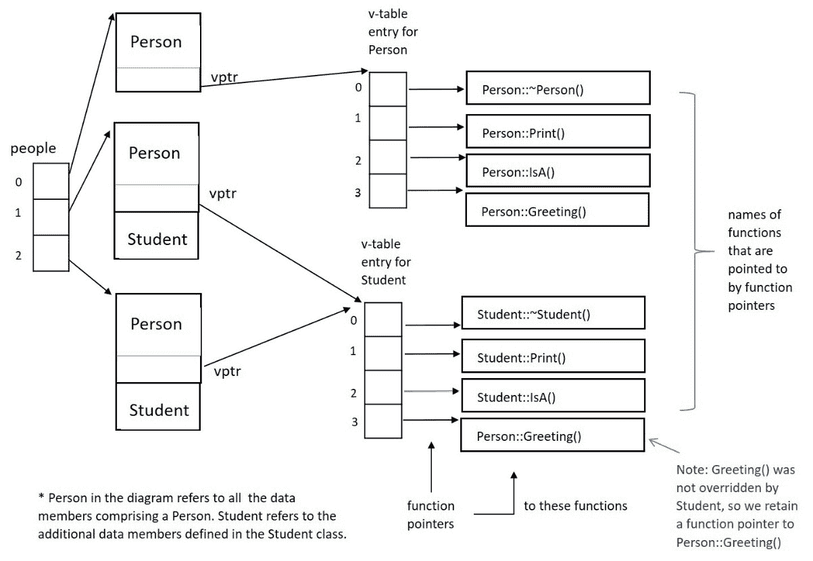

# 第七章：通过多态利用动态绑定

本章将进一步扩展我们对 C++中面向对象编程的知识。我们将首先介绍一个强大的面向对象概念，**多态**，然后理解这一概念是如何通过*直接语言支持*在 C++中实现的。我们将使用虚函数在相关类的层次结构中实现多态，并理解如何将特定派生类方法的运行时绑定到更通用的基类操作。我们将理解本章中呈现的多态的面向对象概念将支持多样化和健壮的设计，并在 C++中轻松实现可扩展的代码。

在本章中，我们将涵盖以下主要主题：

+   理解多态的面向对象概念以及它对面向对象编程的重要性。

+   定义虚函数，理解虚函数如何覆盖基类方法，泛化派生类对象，虚析构函数的必要性以及函数隐藏

+   理解方法对操作的动态（运行时）绑定

+   对**虚函数表**（**v-table**）的详细理解

通过本章结束时，您将理解多态的面向对象概念，以及如何通过虚函数在 C++中实现这一概念。您将理解虚函数如何使得 C++中方法对操作的运行时绑定成为可能。您将看到如何在基类中指定一个操作，并在派生类中用首选实现进行覆盖。您将理解何时以及为何重要利用虚析构函数。

您将看到派生类的实例通常使用基类指针存储的原因，以及这一点的重要性。我们将发现，无论实例是如何存储的（作为其自身类型还是作为基类的类型），虚函数的正确版本始终会通过动态绑定应用。具体来说，当我们检查 C++中的虚函数指针和虚函数表时，您将看到运行时绑定是如何在幕后工作的。

通过理解 C++中虚函数对多态的直接语言支持，您将能够创建一组相关类的可扩展层次结构，实现方法对操作的动态绑定。让我们通过详细介绍这些理想来增进对 C++作为面向对象编程语言的理解。

# 技术要求

完整程序示例的在线代码可在以下 GitHub 网址找到：[`github.com/PacktPublishing/Demystified-Object-Oriented-Programming-with-CPP/blob/master/Chapter07`](https://github.com/PacktPublishing/Demystified-Object-Oriented-Programming-with-CPP/blob/master/Chapter07)。每个完整程序示例都可以在 GitHub 存储库中找到，位于相应章节标题（子目录）下的文件中，文件名由章节号后跟当前章节中的示例号组成。例如，本章的第一个完整程序可以在名为`Chp7-Ex1.cpp`的文件中的`Chapter07`子目录下找到。

本章的 CiA 视频可在以下网址观看：[`bit.ly/317dxf3`](https://bit.ly/317dxf3)。

# 理解多态的面向对象概念

在本节中，我们将介绍一个重要的面向对象概念，多态。

从*第五章* *详细探索类*，和*第六章* *使用单继承实现层次结构*，您现在理解了封装、信息隐藏、泛化和特化的关键面向对象的思想。您知道如何封装一个类，使用单继承构建继承层次结构，以及构建层次结构的各种原因（例如支持 Is-A 关系或支持实现继承的较少使用的原因）。让我们通过探索**多态**来扩展我们的基本面向对象术语。

当基类指定一个操作，使得派生类可以用更合适的方法重新定义该操作时，该操作被称为**多态的**。让我们重新审视我们对操作和方法的定义，以及它们的含义，以了解这些概念如何为多态性奠定基础：

+   在 C++中，**操作**映射到成员函数的完整签名（名称加上参数的类型和数量 - 没有返回类型）。

+   此外，在 C++中，**方法**映射到操作的定义或主体（即成员函数的实现或主体）。

+   回顾一下，在面向对象的术语中，**操作**实现了类的行为。基类操作的实现可以通过几个不同的派生类**方法**来实现。

`Student` 是 `Person`。然而，多态操作将允许在`Student`对象上显示`Student`行为，即使它们已经*采用了*`Person`的形式。

在本章中，我们将看到派生类对象采用其公共基类的形式，即采用*多种形式*（**多态性**）。我们将看到如何在基类中指定多态操作，并在派生类中用首选实现进行重写。

让我们从 C++语言特性开始，这些特性允许我们实现多态性，即虚函数。

# 使用虚函数实现多态性

多态性允许将方法动态绑定到操作。将方法动态绑定到操作是重要的，因为派生类实例可能被基类对象指向（即，通过基类类型的指针）。在这些情况下，指针类型无法提供关于应该应用于引用实例的正确方法的足够信息。我们需要另一种方式 - 在运行时完成 - 来确定哪种方法适用于每个实例。

通常情况下，指向派生类实例的指针会被泛化为指向基类类型的指针。当对指针应用操作时，应该应用对象真正的方法，而不是对泛化指针类型似乎合适的方法。

让我们从定义虚函数所需的相关关键字和逻辑开始，以便我们可以实现多态性。

## 定义虚函数并重写基类方法

C++中的**虚函数**直接支持多态性。**虚函数**是：

+   一个成员函数，允许为给定操作的方法在层次结构中被连续重写以提供更合适的定义。

+   允许动态绑定方法而不是通常的静态绑定的成员函数。

使用关键字**virtual**指定虚函数。更具体地说：

+   关键字`virtual`应该在函数原型中的返回类型之前。

+   在派生类中具有与任何祖先类中虚函数相同名称和签名的函数会重新定义这些基类中的虚函数。在这里，关键字`virtual`是可选的，但在派生类原型中是推荐的。

+   在派生类中具有相同名称但不同签名的函数不会重新定义其基类中的虚函数；而是隐藏其基类中的方法。

+   在派生类原型中，可以选择性地添加关键字`override`作为扩展签名的一部分。这种推荐做法将允许编译器在预期重写的方法的签名与基类中指定的签名不匹配时标记错误。`override`关键字可以消除意外的函数隐藏。

派生类如果继承的方法适用，就不需要重新定义基类中指定的虚函数。然而，如果派生类用新方法重新定义一个操作，必须使用与被覆盖方法相同的签名（由基类指定）。此外，派生类应该只重新定义虚函数。

这里有一个简单的例子来说明基本语法：

+   `Print()`是在基类`Person`中定义的虚函数。它将被`Student`类中更合适的实现所覆盖：

```cpp
class Person  // base class
{
private:
    char *name;
    char *title;
public:
    // constructors, destructor, 
    // public access functions, public interface etc. …
    Person introduces a virtual function, Print(). By labeling this function as virtual, the Person class is inviting any future descendants to redefine this function with a more suitable implementation or method, should they be so motivated.
```

+   在基类`Person`中定义的虚函数实际上是在`Student`类中用更合适的实现进行了覆盖：

```cpp
class Student: public Person  // derived class
{
private:
    float gpa;
public:
    // constructors, destructor specific to Student,
    // public access functions, public interface, etc. …
    Student introduces a new implementation of Print() that will override (that is, replace), the definition in Person. Note that if the implementation of Person::Print() were acceptable to Student, Student would not be obligated to override this function, even if it is marked as virtual in the base class. The mechanics of public inheritance would simply allow the derived class to inherit this method.But because this function is `virtual` in `Person`, `Student` may opt to redefine this operation with a more suitable method. Here, it does. In the `Student::Print()` implementation, `Student` first calls `Person::Print()` to take advantage of the aforementioned base class function, then prints additional information itself. `Student::Print()` is choosing to call a base class function for help; it is not required to do so if the desired functionality can be implemented fully within its own class scope. Notice that when `Student::Print()` is defined to override `Person::Print()`, the same signature as specified by the base class is used. This is important. Should a new signature have been used, we would get into a potential function hiding scenario, which we will soon discuss in our sub-section, *Considering function hiding*, within this chapter.Note that though the virtual functions in `Person` and `Student` are written inline, a virtual function will never be expanded as inline code by the compiler since the specific method for the operation must be determined at runtime.
```

记住，多态函数的目的是具有覆盖或替换给定函数的基类版本的能力。函数重写与函数重载不同。

重要区别

**函数重写**是通过在相关类的层次结构中引入相同的函数名称和签名（通过虚函数）来定义的，而派生类版本旨在替换基类版本。相比之下，**函数重载**是在程序的同一作用域中存在两个或更多具有相同名称但不同签名的函数时定义的（比如在同一个类中）。

此外，在基类定义中最初未指定为虚拟的操作也不是多态的，因此不应该在任何派生类中被覆盖。这意味着，如果基类在定义操作时没有使用关键字`virtual`，那么基类并不打算让派生类用更合适的派生类方法重新定义这个操作。相反，基类坚持认为它提供的实现适用于*任何*它的后代。如果派生类尝试重新定义一个非虚拟的基类操作，将会在应用程序中引入一个微妙的错误。错误将是，使用派生类指针存储的派生类实例将使用派生类方法，而使用基类指针存储的派生类实例将使用基类定义。实例应该始终使用自己的行为，而不管它们是如何存储的 - 这就是多态的意义。永远不要重新定义非虚函数。

重要说明

在 C++中，未在基类中指定为虚拟的操作不是多态的，也不应该被派生类覆盖。

让我们继续前进，发现我们可能希望通过基类类型收集派生类对象的情况，以及我们可能需要将我们的析构函数标记为虚拟的情况。

## 泛化派生类对象

当我们查看继承层次结构时，通常是使用公共基类的层次结构；也就是说，这是一个使用公共继承来表达 Is-A 关系的层次结构。以这种方式使用继承时，我们可能会被激励将相关实例的组合在一起。例如，`Student`专业化的层次结构可能包括`GraduateStudent`、`UnderGraduateStudent`和`NonDegreeStudent`。假设这些派生类中的每一个都有一个名为`Student`的公共基类，那么说`GraduateStudent` *是一个* `Student`，等等，就是合适的。

我们可能会在我们的应用程序中找到一个理由，将这些类似的实例组合到一个共同的集合中。例如，想象一下，我们正在为一所大学实现一个计费系统。大学可能希望我们将所有学生，无论其派生类类型如何，收集到一个集合中以便统一处理，比如计算他们的学期账单。

`Student`类可能有一个多态操作`CalculateSemesterBill()`，它在`Student`中作为一个虚拟函数实现了一个默认方法。然而，选择的派生类，比如`GraduateStudent`，可能有他们希望通过在自己的类中覆盖操作来提供的首选实现。例如，`GraduateStudent`可能有一个不同的方法来计算他们的总账单与`NonDegreeStudent`。因此，每个派生类可以覆盖其类中`CalculateSemesterBill()`的默认实现。

尽管如此，在我们的财务应用程序中，我们可以创建一个`Student`类型的指针集合，尽管每个指针最终都会指向派生类类型的实例，比如`GraduateStudent`、`UnderGraduateStudent`和`NonDegreeStudent`。当以这种方式泛化派生类类型的实例时，适用于集合指针类型的基类级别中定义的函数（通常是虚拟函数）是合适的。虚拟函数允许这些泛化的实例调用多态操作，以产生它们各自的派生类方法或这些函数的实现。这正是我们想要的。但是，还有更多细节需要理解。

这个推广派生类实例的基本前提将使我们理解为什么我们可能需要在许多类定义中使用虚拟析构函数。让我们来看一下。

## 利用虚拟析构函数

现在我们可以概念化一下，将派生类实例按其共同的基类类型分组，并通过虚拟函数允许它们的不同行为显现出来可能是有用的情况。通过它们的基类类型收集同类派生类实例，并利用虚拟函数允许它们独特的行为显现出来，实际上是非常强大的。

但是，当存储在基类指针中的派生类实例的内存消失时会发生什么呢？我们知道它的析构函数被调用了，但是哪一个？实际上，我们知道一系列的析构函数被调用，从问题对象类型的析构函数开始。但是，如果实例通过存储使用基类指针而被泛型化，我们如何知道实际的派生类对象类型呢？一个**虚拟析构函数**解决了这个问题。

通过将析构函数标记为`virtual`，我们允许它被覆盖为类及其后代的销毁序列的*起点*。选择使用哪个析构函数作为销毁的入口点将推迟到运行时，使用动态绑定，基于对象的实际类型，而不是引用它的指针类型。我们很快将看到，这个过程是如何通过检查 C++的底层虚拟函数表自动化的。

与所有其他虚拟函数不同，虚拟析构函数实际上指定了要执行的一系列函数的起点。回想一下，作为析构函数的最后一行代码，编译器会自动修补一个调用来调用直接基类的析构函数，依此类推，直到我们达到层次结构中的初始基类。销毁链的存在是为了提供一个释放给定实例的所有子对象中动态分配的数据成员的论坛。将这种行为与其他虚拟函数进行对比，其他虚拟函数仅允许执行函数的单一正确版本（除非程序员选择在派生方法实现期间调用相同函数的基类版本作为辅助函数）。

你可能会问为什么在正确的级别开始销毁序列很重要？也就是说，在与对象的实际类型匹配的级别（而不是通用指针类型，可能指向对象）。请记住，每个类可能有动态分配的数据成员。析构函数将释放这些数据成员。从正确级别的析构函数开始将确保您不会通过放弃适当的析构函数及其相应的内存释放而引入任何内存泄漏到您的应用程序中。

虚析构函数总是必要的吗？这是一个很好的问题！当使用公共基类层次结构时，即使用公共继承时，虚析构函数总是必要的。请记住，公共基类支持 Is-A 关系，这很容易导致允许使用其基类类型的指针存储派生类实例。例如，`研究生` *是* `学生`，因此我们有时可以将`研究生`存储为`学生`，以便在需要更通用的处理时与其兄弟类型一起处理。我们可以始终以这种方式在公共继承边界上进行向上转型。然而，当我们使用实现继承（即私有或受保护的基类）时，不允许向上转型。因此，在使用私有或受保护继承的层次结构中，虚析构函数是不必要的，因为向上转型是被简单地禁止的；因此，对于私有和受保护基类层次结构中的类，哪个析构函数应该是入口点永远不会是模糊的。作为第二个例子，在*第六章*中，我们的`LinkedList`类中没有包含虚析构函数；因此，`LinkedList`应该只作为受保护或私有基类扩展。然而，我们在`Queue`和`PriorityQueue`类中包含了虚析构函数，因为`PriorityQueue`使用`Queue`作为公共基类。`PriorityQueue`可以向上转型为`Queue`（但不能向上转型为`LinkedList`），因此在层次结构中的`Queue`及其后代级别引入虚析构函数是必要的。

在重写虚析构函数时，是否建议使用可选关键字`virtual`和`override`？这也是一个很好的问题。我们知道，重写的析构函数只是销毁顺序的起点。我们也知道，与其他虚函数不同，派生类的析构函数将与基类的析构函数有一个唯一的名称。尽管派生类的析构函数会自动重写已声明为`virtual`的基类析构函数，但在派生类析构函数原型中使用*可选*关键字`virtual`是为了文档化而推荐的。然而，在派生类析构函数中通常不使用*可选*关键字`override`。原因是`override`关键字旨在提供一个安全网，以捕捉原始定义和重写函数之间的拼写错误。对于析构函数，函数名称并不相同，因此这个安全网并不是一个错误检查的优势。

让我们继续把所有必要的部分放在一起，这样我们就可以看到各种类型的虚函数，包括析构函数，如何发挥作用。

## 把所有的部分放在一起

到目前为止，在本章中，我们已经了解了虚函数的微妙之处，包括虚析构函数。重要的是要看到我们的代码在实际操作中，以及它的各种组件和细节。我们需要在一个连贯的程序中看到基本语法来指定虚函数，包括如何通过基类类型收集派生类实例，以及虚析构函数如何发挥作用。

让我们看一个更复杂的、完整的程序示例，以完全说明多态性，使用 C++中的虚函数实现。这个例子将被分成许多段；完整的程序可以在以下 GitHub 位置找到：

[`github.com/PacktPublishing/Demystified-Object-Oriented-Programming-with-CPP/blob/master/Chapter07/Chp7-Ex1.cpp`](https://github.com/PacktPublishing/Demystified-Object-Oriented-Programming-with-CPP/blob/master/Chapter07/Chp7-Ex1.cpp)

```cpp
#include <iostream>
#include <iomanip>
#include <cstring>
using namespace std;
const int MAX = 5;
class Person
{
private: // data members
    char *firstName;
    char *lastName;
    char middleInitial;
    char *title;  // Mr., Ms., Mrs., Miss, Dr., etc.
protected:
    void ModifyTitle(const char *); 
public:
    Person();   // default constructor
    Person(const char *, const char *, char, const char *);  
    Person(const Person &);  // copy constructor
    virtual ~Person();  // virtual destructor
    const char *GetFirstName() const { return firstName; }  
    const char *GetLastName() const { return lastName; }    
    const char *GetTitle() const { return title; } 
    char GetMiddleInitial() const { return middleInitial; }
    virtual void Print() const;
    virtual void IsA();  
    virtual void Greeting(const char *);
};
```

在上述的类定义中，我们对`Person`这个熟悉的类进行了扩充，添加了四个虚函数，即析构函数(`~Person()`)，`Print()`，`IsA()`和`Greeting(const char *)`。请注意，我们只是在每个成员函数的返回类型（如果有的话）前面加上了关键字`virtual`。类定义的其余部分就像我们在上一章中深入探讨过的那样。

现在，让我们来看一下`Person`的非内联成员函数定义：

```cpp
Person::Person()
{
    firstName = lastName = 0;  // NULL pointer
    middleInitial = '\0';
    title = 0;
}
Person::Person(const char *fn, const char *ln, char mi, 
               const char *t)
{
    firstName = new char [strlen(fn) + 1];
    strcpy(firstName, fn);
    lastName = new char [strlen(ln) + 1];
    strcpy(lastName, ln);
    middleInitial = mi;
    title = new char [strlen(t) + 1];
    strcpy(title, t);
}
Person::Person(const Person &pers)
{
    firstName = new char [strlen(pers.firstName) + 1];
    strcpy(firstName, pers.firstName);
    lastName = new char [strlen(pers.lastName) + 1];
    strcpy(lastName, pers.lastName);
    middleInitial = pers.middleInitial;
    title = new char [strlen(pers.title) + 1];
    strcpy(title, pers.title);
}
Person::~Person()
{
    delete firstName;
    delete lastName;
    delete title;
}
void Person::ModifyTitle(const char *newTitle)
{
    delete title;  // delete old title
    title = new char [strlen(newTitle) + 1];
    strcpy(title, newTitle);
}
void Person::Print() const
{
    cout << title << " " << firstName << " ";
    cout << middleInitial << ". " << lastName << endl;
}
void Person::IsA()
{
    cout << "Person" << endl;
}
void Person::Greeting(const char *msg)
{
    cout << msg << endl;
}
```

在之前的代码段中，我们指定了`Person`的所有非内联成员函数。请注意，这四个虚函数——析构函数，`Print()`，`IsA()`和`Greeting()`——在方法（即成员函数定义）本身中不包括`virtual`关键字。

接下来，让我们来看一下`Student`类的定义：

```cpp
class Student: public Person
{
private: 
    // data members
    float gpa;
    char *currentCourse;
    const char *studentId;  
public:
    // member function prototypes
    Student();  // default constructor
    Student(const char *, const char *, char, const char *,
            float, const char *, const char *); 
    Student(const Student &);  // copy constructor
    virtual ~Student();  // destructor
    void EarnPhD();  
    // inline function definitions
    float GetGpa() const { return gpa; }
    const char *GetCurrentCourse() const
        { return currentCourse; }
    const char *GetStudentId() const { return studentId; }
    void SetCurrentCourse(const char *); // prototype only

    // In the derived class, the keyword virtual is optional, 
    // but recommended for clarity. Same for override.
    virtual void Print() const override;
    virtual void IsA() override;
    // note: we choose not to redefine 
    // Person::Greeting(const char *)
};
inline void Student::SetCurrentCourse(const char *c)
{
    delete currentCourse;   // delete existing course
    currentCourse = new char [strlen(c) + 1];
    strcpy(currentCourse, c); 
}
```

在之前的`Student`类定义中，我们再次看到了构成这个类的所有各种组件。另外，请注意，我们定义了三个虚函数——析构函数，`Print()`和`IsA()`。这些首选定义基本上取代了这些操作在基类中指定的默认方法。然而，请注意，我们选择不重新定义`void Person::Greeting(const char *)`，这个方法在`Person`类中被引入为虚函数。如果我们发现继承的定义对`Student`类的实例是可以接受的，那么简单地继承这个方法就可以了。

请记住，当虚函数与析构函数配对时，它的含义是独特的，它并不意味着派生类的析构函数取代了基类的析构函数。相反，它意味着当由派生类实例发起*销毁链*序列时，派生类析构函数是正确的起始点（无论它们是如何存储的）。

还要记住，`Student`的派生类不需要覆盖在`Person`中定义的虚函数。如果`Student`类发现基类方法是可以接受的，它会自动继承。虚函数只是允许派生类在需要时用更合适的方法重新定义操作。

接下来，让我们来看一下`Student`类的非内联成员函数：

```cpp
Student::Student(): studentId (0) 
{
    gpa = 0.0;
    currentCourse = 0;
}
// Alternate constructor member function definition
Student::Student(const char *fn, const char *ln, char mi, 
                 const char *t, float avg, const char *course,
                 const char *id): Person(fn, ln, mi, t)
{
    gpa = avg;
    currentCourse = new char [strlen(course) + 1];
    strcpy(currentCourse, course);
    char *temp = new char [strlen(id) + 1];
    strcpy (temp, id); 
    studentId = temp;
}
// Copy constructor definition
Student::Student(const Student &ps): Person(ps)
{
    gpa = ps.gpa;
    currentCourse = new char [strlen(ps.currentCourse) + 1];
    strcpy(currentCourse, ps.currentCourse);
    char *temp = new char [strlen(ps.studentId) + 1];
    strcpy (temp, ps.studentId); 
    studentId = temp;
}

// destructor definition
Student::~Student()
{
    delete currentCourse;
    delete (char *) studentId;
}
void Student::EarnPhD()
{
    ModifyTitle("Dr.");  
}
void Student::Print() const
{   // need to use access functions as these data members are
    // defined in Person as private
    cout << GetTitle() << " " << GetFirstName() << " ";
    cout << GetMiddleInitial() << ". " << GetLastName();
    cout << " with id: " << studentId << " GPA: ";
    cout << setprecision(3) <<  " " << gpa;
    cout << " Course: " << currentCourse << endl;
}
void Student::IsA()
{
    cout << "Student" << endl;
}
```

在之前列出的代码段中，我们列出了`Student`的非内联成员函数定义。同样，请注意，关键字`virtual`不会出现在任何非内联成员函数定义本身中，只会出现在它们各自的原型中。

最后，让我们来看一下`main()`函数：

```cpp
int main()
{
    Person *people[MAX];
    people[0] = new Person("Juliet", "Martinez", 'M', "Ms.");
    people[1] = new Student("Hana", "Sato", 'U', "Dr.", 3.8,
                            "C++", "178PSU"); 
    people[2] = new Student("Sara", "Kato", 'B', "Dr.", 3.9,
                            "C++", "272PSU"); 
    people[3] = new Person("Giselle", "LeBrun", 'R', "Miss");
    people[4] = new Person("Linus", "Van Pelt", 'S', "Mr.");
    for (int i = 0; i < MAX; i++)
    {
       people[i]->IsA();
       cout << "  ";
       people[i]->Print();
    } 
    for (int i = 0; i < MAX; i++)
       delete people[i];   // engage virtual dest. sequence
    return 0;
}
```

在`main()`中，我们声明了一个指向`Person`的指针数组。这样做可以让我们在这个集合中收集`Person`和`Student`的实例。当然，我们可以对以这种泛化方式存储的实例应用的唯一操作是在基类`Person`中找到的操作。

接下来，我们分配了几个`Person`和几个`Student`的实例，将每个实例通过一个指针的泛化集合中的元素存储起来。当以这种方式存储`Student`时，会执行向基类类型的向上转型（但实例本身不会被改变）。请记住，当我们在*第六章*中查看单继承的层次结构的内存布局时，我们注意到`Student`实例首先包括`Person`的内存布局，然后是`Student`数据成员所需的额外内存。这种向上转型只是指向这个集体内存的起始点。

现在，我们通过循环将`Person`类中找到的操作应用于这个泛化集合中的所有实例。这些操作恰好是多态的。也就是说，虚拟函数允许通过运行时绑定调用方法的具体实现，以匹配实际对象类型（不管对象是否存储在泛化指针中）。

最后，我们通过循环删除动态分配的`Person`和`Student`实例，再次使用泛化的`Person`指针。因为我们知道`delete()`会调用析构函数，我们明智地将析构函数设为`virtual`，使得动态绑定可以选择适当的起始析构函数（在销毁链中）来销毁每个对象。

当我们查看上述程序的输出时，可以看到对于每个虚拟函数，都适当地调用了每个对象的特定方法，包括销毁序列。以下是完整程序示例的输出：

```cpp
Person
  Ms. Juliet M. Martinez
Student
  Dr. Hana U. Sato with id: 178PSU GPA:  3.8 Course: C++
Student
  Dr. Sara B. Kato with id: 272PSU GPA:  3.9 Course: C++
Person
  Miss Giselle R. LeBrun
Person
  Mr. Linus S. Van Pelt
```

现在我们已经掌握了多态的概念和虚拟函数的机制，让我们来看一下与虚拟函数相关的不太常见的情况，即函数隐藏。

## 考虑函数隐藏

**函数隐藏**并不是 C++中经常使用的特性。事实上，它经常是意外使用的！让我们回顾一下我们对继承成员函数的了解。当一个操作由基类指定时，它旨在为所有派生类方法提供使用和重新定义的协议（对于虚函数的情况）。

有时，派生类会改变一个方法的签名，这个方法是用来重新定义基类指定的操作（比如虚函数）。在这种情况下，新的函数与祖先类中指定的操作在签名上不同，将不被视为继承操作的虚拟重新定义。事实上，它会*隐藏*祖先类中具有相同名称的虚拟函数的继承方法。

当程序编译时，会将每个函数的签名与类定义进行比较，以确保正确使用。通常情况下，当在类中找不到与实例类型*看似*匹配的成员函数时，会向上遍历继承链，直到找到匹配项或者继承链耗尽为止。让我们更仔细地看一下编译器考虑的内容：

+   当找到一个与所寻找的函数同名的函数时，将检查其签名，看它是否与函数调用完全匹配，或者是否可以应用类型转换。当找到函数时，但无法应用类型转换时，正常的遍历顺序就结束了。

+   通常情况下，隐藏虚拟函数的函数会中止这种向上搜索序列，从而隐藏了本来可能被调用的虚拟函数。请记住，在编译时，我们只是检查语法（而不是决定调用哪个版本的虚拟函数）。但如果我们找不到匹配项，就会报错。

+   函数隐藏实际上被认为是有帮助的，并且是语言所期望的。如果类设计者提供了一个具有特定签名和接口的特定函数，那么该函数应该用于该类型的实例。在这种特定情况下，不应该使用在继承链中之前隐藏或未知的函数。

考虑对我们之前的完整程序示例进行以下修改，首先说明函数隐藏，然后提供一个更灵活的解决方案来管理函数隐藏：

+   请记住，`Person`类引入了没有参数的`virtual void Print()`。想象一下，`Student`不是用相同的签名覆盖`Print()`，而是将签名更改为`virtual void Print(const char *)`。

```cpp
class Person  // base class
{
    // data members
public:  // member functions, etc. 
    Print() has changed from a base to a derived class. The derived class function does not redefine the virtual void Print(); of its base class. It is a new function that will in fact hide the existence of Person::Print(). This is actually what was intended, since you may not recall that the base class offers such an operation and tracking upward might cause surprising results in your application if you intended Print(const char *) to be called and if Print() is called instead. By adding this new function, the derived class designer is dictating this interface is the appropriate Print() for instances of Student.However, nothing is straightforward in C++. For situations where a `Student` is up-cast to a `Person`, the `Person::Print()` with no arguments will be called. The `Student::Print(const char *)` is not a virtual redefinition because it does not have the same signature. Hence, the `Person::Print()` will be called for generalized `Student` instances. And yet `Student::Print(const char *)` will be called for `Student` instances stored in `Student` variables. Unfortunately, this is inconsistent in how an instance will behave if it is stored in its own type versus a generalized type. Though function hiding was meant to work in this fashion, it may inevitably not be what you would like to happen. Programmers beware!
```

让我们来看一些可能出现的冗长代码：

+   可能需要显式向下转型或使用作用域解析运算符来揭示一个被隐藏的函数：

```cpp
int main()
{ 
    Person *people[2];
    people[0] = new Person("Jim", "Black", 'M', "Mr.");
    people[1] = new Student("Kim", "Lin", 'Q', "Dr.",
                            3.55, "C++", "334UD"); 
    people[1]->Print();  // ok, Person::Print() defined
    // people[1]->Print("Go Team!"); // error!
    // explicit downcast to derived type assumes you
    // correctly recall what the object is
    ((Student *)people[1])->Print("I have to study");

    // Student stored in its own type
    Student s1("Jafari", "Kanumba", 'B', "Dr.", 3.9,
               "C++", "845BU"); 
    // s1.Print();  // error, base class version hidden
    s1.Print("I got an A!"); // works for type Student
    s1.Person::Print(); // works using scope resolution
                        // to base class type
    return 0;
}
```

在上述示例中，我们有一个包含两个`Person`指针的广义集合。一个指向`Person`，一个指向`Student`。一旦`Student`被泛化，唯一适用的操作就是在`Person`基类中找到的操作。因此，对`people[1]->Print();`的调用有效，而对`people[1]->Print("Go Team!");`的调用无效。对`Print(const char *)`的后者调用在广义基类级别上是一个错误，尽管对象实际上是`Student`。

如果我们希望从一个广义指针调用层次结构中`Student`级别的特定函数，我们就需要将实例向下转型回其自身类型（`Student`）。我们通过调用`((Student *) people[1])->Print("I have to study");`来进行向下转型。在这里，我们承担了一定的风险 - 如果`people[1]`实际上是`Person`而不是`Student`，这将生成运行时错误。

接下来，我们实例化`Student s1;`。如果我们尝试调用`s1.Print()`，我们将会得到一个编译器错误 - `Student::Print(const char *)`隐藏了`Person::Print()`的存在。请记住，`s1`存储在其自身类型`Student`中，因此找到`Student::Print(const char *)`后，向上遍历以揭示`Person::Print()`被阻止了。

尽管如此，我们对`s1.Print("I got an A!");`的调用是成功的，因为`Print(const char *)`在`Student`类级别找到了。最后，请注意，对`s1.Person::Print();`的调用是有效的，但需要了解被隐藏的函数。通过使用作用域解析运算符（`::`），我们可以找到`Print()`的基类版本。即使`Print()`在基类中是虚拟的（意味着动态绑定），使用作用域解析操作将此调用恢复为静态绑定的函数调用。

假设我们想要向派生类添加一个新的接口，其中的函数会隐藏基类函数。了解函数隐藏后，我们应该怎么做？我们可以简单地在派生类中重写基类中找到的虚函数，并且可以重载该函数以添加额外的接口。是的，我们现在既重写又重载。也就是说，我们重写了基类函数，并在派生类中重载了被重写的函数。

让我们看看我们现在会得到什么：

+   以下是添加新成员函数的更灵活接口，同时保留原本可能被隐藏的现有接口：

```cpp
class Person  // base class
{
    // data members
public:  // member functions, etc.
    Student class both overrides Person::Print() with Student::Print() and overloads Student::Print() with Student::Print(const char *) to envelop the additional desired interface. Now, for Student objects stored in Student variables, both interfaces are available – the base class interface is no longer hidden. Of course, Student objects referenced by Person pointers only have the Person::Print() interface, which is to be expected. 
```

总的来说，函数隐藏并不经常出现。但当出现时，通常会给人带来不必要的惊喜。现在你了解了可能发生的情况以及原因，这会让你成为一个更好的程序员。

现在我们已经看过了所有关于虚函数的用法，让我们来看看为什么虚函数能够支持将特定方法动态绑定到操作上。为了彻底理解运行时绑定，我们需要看一下虚函数表。让我们继续前进！

# 理解动态绑定

现在我们已经看到了多态是如何通过虚函数实现的，以允许将操作动态绑定到特定的实现或方法，让我们了解为什么虚函数允许运行时绑定。

非虚函数在编译时静态绑定。也就是说，所涉及函数的地址是在编译时确定的，基于手头对象的假定类型。例如，如果实例化了类型为`Student`的对象，函数调用将从`Student`类开始验证其原型，并且如果找不到，将向上遍历每个基类，如`Person`，以寻找匹配的原型。找到后，正确的函数调用将被修补。这就是静态绑定的工作原理。

然而，虚函数是 C++中一种在运行时使用动态绑定的函数类型。在编译时，任何虚函数调用都仅仅被替换为一个查找机制，以延迟绑定直到运行时。当然，每个编译器供应商在自动化虚函数方面的实现可能有所不同。然而，有一种广泛使用的实现涉及虚函数指针、虚函数表和包含虚函数的每种对象类型的虚函数表条目。

让我们继续调查 C++中动态绑定是如何常见实现的。

## 理解方法与操作的运行时绑定

我们知道虚函数允许将操作（在基类中指定）动态绑定到特定的实现或方法（通常在派生类中指定）。这是如何工作的？

当基类指定一个或多个新的虚函数（不仅仅是祖先虚函数的重新定义）时，在给定类型的实例的内存下方将创建一个**虚函数指针**（vptr）。这发生在运行时，当为实例创建内存时（在堆栈、堆或静态/外部区域）。当涉及的实例被构造时，不仅将调用适当的构造函数来初始化实例，而且这个 VPTR 将被初始化为指向该类类型的**虚函数指针表**（v-table）条目。

给定类类型的虚函数表（v-table）条目将由一组函数指针组成。这些函数指针通常组织成一个函数指针数组。**函数指针**是指向实际函数的指针。通过解引用这个指针，您实际上会调用指针所指向的函数。有机会向函数传递参数，但是为了通过函数指针进行通用调用，参数必须对该指针可能指向的任何版本的函数都是统一的。函数指针的前提条件使我们能够指向特定函数的不同版本。也就是说，我们可以指向给定操作的不同方法。这是我们可以在 C++中为虚函数自动绑定动态的基础。

让我们考虑特定对象类型的虚函数表条目。我们知道这个表条目将由一组函数指针组成，例如函数指针数组。这些函数指针排列的顺序将与给定类引入的虚函数的顺序一致。重写现有虚函数的函数将简单地用要调用的函数的首选版本替换表条目，但不会导致在函数指针数组中分配额外的条目。

因此，当程序开始运行时，首先在全局内存中（作为隐藏的外部变量），将设置一个虚函数表。该表将包含包含虚函数的每种对象类型的条目。给定对象类型的条目将包含一组函数指针（例如函数指针数组），它组织和初始化该类的动态绑定函数。函数指针的特定顺序将与引入虚函数的顺序相对应（可能是由它们的祖先类引入的），并且特定的函数指针将被初始化为该类类型的特定函数的首选版本。也就是说，函数指针可能指向其自己类级别指定的重写方法。

然后，当实例化给定类型的对象时，该对象内部的 vptr（每个新引入的子对象级别的虚函数，而不是重新定义的虚函数，将有一个）将被设置为指向该实例的相应 v-table 条目。

通过代码和内存图，看到这些细节将是有用的。让我们深入了解代码的运行情况！

## 详细解释虚函数表（v-table）

为了详细说明内存模型并查看运行时设置的底层 C++机制，让我们考虑来自本节的详细完整程序示例，其中包括基类`Person`和派生类`Student`的关键元素。作为提醒，我们将展示程序的关键元素：

+   `Person`和`Student`类的缩写定义（我们将省略数据成员和大多数成员函数定义以节省空间）：

```cpp
class Person
{
private:   // data members will be as before
protected: // assume all member function are as before,
public:  // but we will show only virtual functions here
    Person and Student class definitions are as expected. Assume that the data members and member functions are as shown in the full program example. For brevity, we have just included the virtual functions introduced or redefined at each level. 
```

+   重新审视我们`main()`函数的关键元素，以缩写形式：

```cpp
int main()
{
    Person *people[3];
    people[0] = new Person("Joy", "Lin", 'M', "Ms.");
    people[1] = new Student("Renee", "Alexander", 'Z',
                    "Dr.", 3.95, "C++", "21-MIT"); 
    people[2] = new Student("Gabby", "Doone", 'A', 
                    "Ms.", 3.95, "C++", "18-GWU"); 
    for (int i = 0; i < 3; i++)
    {                 // at compile time, modified to:
        people[i]->IsA();  // *(people[i]->vptr[2])()
        people[i]->Print();
        people[i]->Greeting();
        delete people[i];
    }
    return 0;
}
```

在我们的`main()`函数中，注意我们实例化了一个`Person`实例和两个`Student`实例。所有这些都存储在基类类型`Person`的指针的通用数组中。然后，我们通过集合进行迭代，对每个实例调用虚函数，即`IsA()`，`Print()`，`Greeting()`和析构函数（在我们删除每个实例时隐式调用）。

考虑到先前示例的内存模型，我们有以下图表：



图 7.1 - 当前示例的内存模型

在上述的内存图中（遵循前面的程序），请注意我们有一个指向`Person`的通用化实例的指针数组。第一个实例实际上是一个`Person`，而另外两个实例是`Student`类型。但是，由于`Student` *是* `Person`，因此将`Student`向上转型为`Person`是可以接受的。内存布局的顶部部分实际上是每个`Student`实例的`Person`。对于实际上是`Student`类型的实例，`Student`的额外数据成员将跟随`Person`子对象所需的所有内存。

注意，`vptr`条目紧随每个三个实例的`Person`对象（或子对象）的数据成员之后。`vptr`的位置与每个对象顶部的偏移量相同。这是因为所讨论的虚函数都是在层次结构的`Person`级别引入的。一些可能在`Student`类中被更合适地定义为`Student`的虚函数可能会被覆盖，但是每个引入的级别都是`Person`级别，因此`Person`对象（或子对象）下面的`vptr`将反映指向在`Person`级别引入的操作列表的指针。

顺便说一句，假设`Student`引入了全新的虚函数（而不仅仅是重新定义现有的虚函数），就像我们在前面的函数隐藏场景中看到的那样。然后，在`Student`子对象下方将有第二个`vptr`条目，其中包含这些额外的（新的虚）操作。

当每个对象被实例化时，首先将为每个实例调用适当的构造函数（按层次结构向上进行）。此外，编译器将为每个实例的`vptr`补丁分配指针，以设置为与对象类型对应的`v-table`条目。也就是说，当实例化`Person`时，其`vptr`将指向`Person`的`v-table`条目。当实例化`Student`时，其`vptr`将指向`Student`的`v-table`条目。

假设`Person`或`Student`的`v-table`条目包含一个指向该类型适当虚函数的函数指针数组。每种类型的`v-table`条目实际上嵌入了更多信息，例如该类型的实例大小等。为简化起见，我们将只查看自动执行每个类类型的动态绑定的`v-table`条目的部分。

请注意，`Person`的`v-table`条目是一个包含四个函数指针的数组。每个函数指针将指向`Person`的最合适版本的析构函数，`Print()`，`IsA()`和`Greeting()`。这些函数指针的排列顺序与这些虚函数由该类引入的顺序相对应。也就是说，`vptr[0]`将指向`Person`的析构函数，`vptr[1]`将指向`Person::Print()`，依此类推。

现在，让我们看一下`Student`的`v-table`条目。虚函数（作为函数指针）在数组中的排列顺序与`Person`类的顺序相同。这是因为基类引入了这些函数，并且指针数组中的排序是由该级别设置的。但请注意，指向的实际函数已被`Student`实例重写，大部分是由派生类`Student`重新定义的方法。也就是说，`Student`的析构函数被指定为（作为销毁的起点），然后是`Student::Print()`，然后是`Student::IsA()`，然后是`Person::Greeting()`。请注意，`vptr[3]`指向`Person::Greeting()`。这是因为`Student`没有在其类定义中重新定义这个函数；`Student`发现继承的`Person`定义是可以接受的。

将这个内存图与我们`main()`函数中的代码配对，注意在我们实例化一个`Person`和两个`Student`实例后，将每个实例存储在泛型化的`Person`指针数组中，我们通过包含多个操作的循环进行迭代。我们统一调用`people[i]->Print();`，然后是`people[i]->IsA();`，然后是`people[i]->Greeting();`，最后是`delete people[i];`（这会插入一个析构函数调用）。

因为这些函数都是虚函数，决定调用哪个函数的决定被推迟到运行时进行查找。这是通过访问每个实例的隐藏`vptr`成员来完成的，根据手头的操作索引到适当的`v-table`条目，然后解引用在该条目中找到的函数指针来调用适当的方法。编译器知道，例如`vptr[0]`将是析构函数，`vptr[1]`将是基类定义中引入的下一个虚函数，依此类推，因此可以轻松确定应该激活 v-table 中的哪个元素位置，这是多态操作的名称决定的。

想象一下，在`main()`中对`people[i]->Print();`的调用被替换为`*(people[i]->vptr[1])();`，这是解引用函数指针以调用手头的函数的语法。请注意，我们首先使用`people[i]->vptr[1]`来访问哪个函数，然后使用`*`来解引用函数指针。请注意语句末尾的括号`()`，这是传递参数给函数的地方。因为解引用函数指针的代码需要是统一的，任何这样的函数的参数也必须是统一的。这就是为什么在派生类中重写的任何虚函数都必须使用与基类指定的相同签名。当你深入了解时，这一切都是有道理的。

我们已经彻底研究了面向对象的多态思想以及在 C++中如何使用虚函数实现它。在继续前进到下一章之前，让我们简要回顾一下本章涵盖的内容。

# 总结

在本章中，我们通过理解 C++中虚函数如何直接支持面向对象的多态思想，进一步深入了解了面向对象编程。我们已经看到虚函数如何为继承层次结构中的操作提供特定方法的动态绑定。

我们已经看到，使用虚函数，基类指定的操作可以被派生类覆盖，提供更合适的实现。我们已经看到，可以使用运行时绑定选择每个对象的正确方法，无论对象是存储在其自己的类型还是在泛化类型中。

我们已经看到对象通常使用基类指针进行泛化，以及这如何允许对相关派生类类型进行统一处理。我们已经看到，无论实例是如何存储的（作为其自己的类型或作为使用指针的基类的类型），正确版本的虚函数始终会通过动态绑定应用。我们已经看到，在公共继承层次结构中，其中向上转型可能会经常进行，拥有虚析构函数是必不可少的。

我们还看到了动态绑定是如何工作的，通过检查编译器实现将 vptr 嵌入实例，以及这些指针引用与每个对象类型相关的 v 表条目（包含成员函数指针集）。

我们已经看到，虚函数允许我们利用操作的动态绑定到最合适的方法，使我们能够将 C++作为一个 OOP 语言来实现具有多态性的健壮设计，从而促进易于扩展的代码。

通过扩展我们对 OOP 知识的理解，利用虚函数，我们现在可以继续包括与继承和多态性相关的其他面向对象的概念和细节。继续到*第八章*，*掌握抽象类*，我们将学习如何应用抽象类的 OO 理想，以及围绕这一下一个面向对象概念的各种 OOP 考虑。让我们继续！

# 问题

1.  使用您的*第六章*，*使用单继承实现层次结构*，解决方案，扩展您的继承层次结构，以进一步专门化`Student`与`GraduateStudent`和`NonDegreeStudent`。

a. 为您的`GraduateStudent`类添加必要的数据成员。要考虑的数据成员可能是论文题目或研究生导师。包括适当的构造函数（默认，替代和复制），析构函数，访问成员函数和合适的公共接口。一定要将数据成员放在私有访问区域。对于`NonDegreeStudent`也是一样。

b. 根据需要为`Person`，`Student`，`GraduateStudent`和`NonDegreeStudent`添加多态操作。在`Person`级别引入虚函数`IsA()`和`Print()`。根据需要在派生类中重写`IsA()`和`Print()`。可能会在`Student`和`GraduateStudent`中重写`IsA()`，但选择仅在`Student()`类中重写`Print()`。一定要在每个类中包含虚析构函数。

c. 实例化`Student`，`GraduateStudent`，`NonDegreeStudent`和`Person`多次，并利用每个适当的`public`接口。一定要动态分配多个实例。

d. 创建一个指向`Person`的指针数组，并分配`Person`，`Student`，`GraduateStudent`和`NonDegreeStudent`的实例作为该数组的成员。一旦泛化，只调用在`Person`级别找到的多态操作（以及`Person`的其他公共方法）。一定要删除任何动态分配的实例。

e. 现在，创建一个指向`Student`的指针数组，并只分配`GraduateStudent`和`NonDegreeStudent`的实例作为该数组的成员。现在，调用在`Student`级别找到的操作，以应用于这些泛化实例。此外，利用在`Person`级别找到的操作-它们被继承并且对于泛化的`Student`实例也可用。一定要删除数组中指向的任何动态分配的实例。
