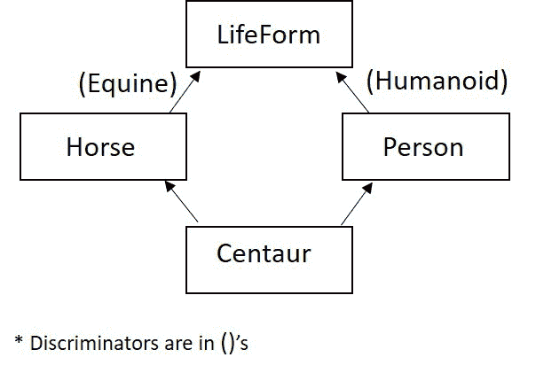
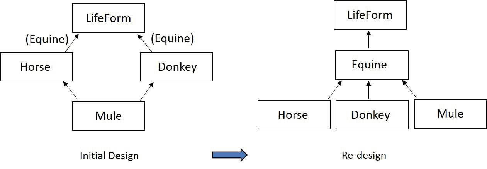

# 第九章：探索多重继承

本章将继续扩展我们对 C++中面向对象编程的知识。我们将从检查一个有争议的面向对象概念，**多重继承**（**MI**）开始，了解为什么它有争议，如何可以合理地用于支持面向对象设计，以及何时替代设计可能更合适。

多重继承可以在 C++中通过*直接语言支持*来实现。这样做，我们将面临几个面向对象设计问题。我们将被要求对继承层次结构进行批判性评估，问自己是否使用最佳设计来表示潜在的对象关系集。多重继承可以是一个强大的面向对象编程工具；明智地使用它是至关重要的。我们将学习何时使用多重继承来合理地扩展我们的层次结构。

在本章中，我们将涵盖以下主要主题：

+   理解多重继承的机制

+   检查多重继承的合理用途

+   创建菱形层次结构并探讨由其使用引起的问题

+   使用虚基类解决菱形层次结构的重复

+   应用判别器来评估菱形层次结构和设计中多重继承的价值，以及考虑设计替代方案

在本章结束时，您将了解多重继承的面向对象概念，以及如何在 C++中实现这个想法。您将不仅了解多重继承的简单机制，还将了解其使用的原因（混入，Is-A，或有争议的 Has-A）。

您将看到为什么多重继承在面向对象编程中是有争议的。拥有多个基类可能会导致形状奇怪的层次结构，比如菱形层次结构；这些类型的层次结构带来潜在的实现问题。我们将看到 C++如何整合一种语言特性（虚基类）来解决这些难题，但解决方案并不总是理想的。

一旦我们了解了多重继承带来的复杂性，我们将使用面向对象设计度量标准，如判别器，来评估使用多重继承的设计是否是表示一组对象关系的最佳解决方案。我们将研究替代设计，然后您将更好地理解多重继承不仅是什么，还有何时最好地利用它。让我们通过多重继承继续扩展我们对 C++作为“*你可以做任何事情*”面向对象编程语言的理解。

# 技术要求

完整程序示例的在线代码可以在以下 GitHub URL 找到：[`github.com/PacktPublishing/Demystified-Object-Oriented-Programming-with-CPP/blob/master/Chapter09`](https://github.com/PacktPublishing/Demystified-Object-Oriented-Programming-with-CPP/blob/master/Chapter09)。每个完整程序示例都可以在 GitHub 存储库中的适当章节标题（子目录）下找到，文件名与所在章节编号相对应，后跟破折号，再跟着所在章节中的示例编号。例如，本章的第一个完整程序可以在名为`Chp9-Ex1.cpp`的文件中的子目录`Chapter09`中找到。

本章的 CiA 视频可以在以下链接观看：[`bit.ly/3f4qjDo`](https://bit.ly/3f4qjDo)。

# 理解多重继承的机制

在 C++中，一个类可以有多个直接基类。这被称为**多重继承**，在面向对象设计和面向对象编程中是一个非常有争议的话题。让我们从简单的机制开始；然后我们将在本章的进展过程中讨论多重继承的设计问题和编程逻辑。

使用多重继承，派生类在其类定义中使用基类列表指定其每个直接祖先或基类是什么。

与单一继承类似，构造函数和析构函数在整个继承结构中被调用，因为派生类类型的对象被实例化和销毁。回顾并扩展多重继承的构造和析构的微妙之处，我们想起了以下的逻辑：

+   构造函数的调用顺序从派生类开始，但立即将控制权传递给基类构造函数，依此类推，直到达到继承结构的顶部。一旦调用顺序传递控制到继承结构的顶部，执行顺序就开始了。所有最高级别的基类构造函数首先被执行，以此类推，直到我们到达派生类构造函数，在构造链中最后执行。

+   派生类的析构函数首先被调用和执行，然后是所有直接基类的析构函数，依此类推，随着我们向上继承层次结构的进展。

派生类构造函数中的成员初始化列表可以用来指定应该调用每个直接基类的构造函数。如果没有这个规定，那么将使用该基类的默认构造函数。

让我们来看一个典型的多重继承示例，以实现面向对象设计中多重继承的典型应用，并理解 C++中基本的多重继承语法。这个例子将被分成许多部分；完整的程序可以在以下 GitHub 位置找到：

[`github.com/PacktPublishing/Demystified-Object-Oriented-Programming-with-CPP/blob/master/Chapter09/Chp9-Ex1.cpp`](https://github.com/PacktPublishing/Demystified-Object-Oriented-Programming-with-CPP/blob/master/Chapter09/Chp9-Ex1.cpp)

```cpp
#include <iostream>
#include <cstring>
using namespace std;
class Person
{
private: 
    char *firstName;
    char *lastName;
    char middleInitial;
    char *title;  // Mr., Ms., Mrs., Miss, Dr., etc.
    Person(const Person &);  // prohibit copies 
protected:
    void ModifyTitle(const char *);  
public:
    Person();   // default constructor
    Person(const char *, const char *, char, const char *);  
    virtual ~Person();  // destructor
    const char *GetFirstName() const { return firstName; }  
    const char *GetLastName() const { return lastName; }    
    const char *GetTitle() const { return title; } 
    char GetMiddleInitial() const { return middleInitial; }
};
```

在前面的代码段中，我们有一个`Person`的预期类定义，其中包含我们习惯于定义的类元素。

接下来，让我们看看这个类的相关成员函数：

```cpp
Person::Person()
{
    firstName = lastName = 0;  // NULL pointer
    middleInitial = '\0';
    title = 0;
}
Person::Person(const char *fn, const char *ln, char mi, 
               const char *t)
{
    firstName = new char [strlen(fn) + 1];
    strcpy(firstName, fn);
    lastName = new char [strlen(ln) + 1];
    strcpy(lastName, ln);
    middleInitial = mi;
    title = new char [strlen(t) + 1];
    strcpy(title, t);
}
Person::~Person()
{
    delete firstName;
    delete lastName;
    delete title;
}
void Person::ModifyTitle(const char *newTitle)
{
    delete title;  // delete old title
    title = new char [strlen(newTitle) + 1];
    strcpy(title, newTitle);
}
```

在之前的代码段中，`Person`的成员函数定义如预期的那样。然而，看到`Person`类的定义是有用的，因为这个类将作为一个构建块，并且它的部分将直接在接下来的代码段中被访问。

现在，让我们定义一个新的类`BillableEntity`：

```cpp
class BillableEntity
{
private:
    float invoiceAmt;
    BillableEntity(const BillableEntity &); // prohibit copies
public:
    BillableEntity() { invoiceAmt = 0.0; }
    BillableEntity(float amt) { invoiceAmt = amt; } 
    virtual ~BillableEntity() { }
    void Pay(float amt) { invoiceAmt -= amt; }
    float GetBalance() const { return invoiceAmt; }
    void Balance();
};
void BillableEntity::Balance()
{
    if (invoiceAmt)
       cout << "Owed amount: $ " << invoiceAmt << endl;
    else
       cout << "Credit: $ " << 0.0 - invoiceAmt << endl;
}
```

在之前的`BillableEntity`类中，我们定义了一个包含简单功能的类来封装一个计费结构。也就是说，我们有一个发票金额和`Pay()`、`GetBalance()`等方法。请注意，复制构造函数是私有的；这将禁止复制，考虑到这个类的性质，这似乎是合适的。

接下来，让我们将前面提到的两个基类`Person`和`BillableEntity`组合起来，作为`Student`类的基类：

```cpp
class Student: public Person, public BillableEntity
{
private: 
    float gpa;
    char *currentCourse;
    const char *studentId;  
    Student(const Student &);  // prohibit copies 
public:
    Student();  // default constructor
    Student(const char *, const char *, char, const char *,
           float, const char *, const char *, float); 
    virtual ~Student(); 
    void Print() const;
    void EarnPhD();  
    float GetGpa() const { return gpa; }
    const char *GetCurrentCourse() const
        { return currentCourse; }
    const char *GetStudentId() const { return studentId; }
    void SetCurrentCourse(const char *);
};
inline void Student::SetCurrentCourse(const char *c)
{
   delete currentCourse;   // delete existing course
   currentCourse = new char [strlen(c) + 1];
   strcpy(currentCourse, c); 
}
```

在`Student`的前面的类定义中，在`Student`的基类列表中指定了两个公共基类`Person`和`BillableEntity`。这两个基类只是在`Student`的基类列表中用逗号分隔。

让我们进一步看看在`Student`类的其余部分中必须做出哪些调整，通过检查其成员函数：

```cpp
Student::Student(): studentId (0) // call default base  
{                                  // class constructors
   gpa = 0.0;
   currentCourse = 0;
}
// The member initialization list specifies which versions
// of each base class constructor should be utilized.
Student::Student(const char *fn, const char *ln, char mi, 
       const char *t, float avg, const char *course, 
       const char *id, float amt):
       Person(fn, ln, mi, t), BillableEntity(amt)                   
{
   gpa = avg;
   currentCourse = new char [strlen(course) + 1];
   strcpy(currentCourse, course);
   char *temp = new char [strlen(id) + 1];
   strcpy (temp, id); 
   studentId = temp;
}
Student::~Student()
{
   delete currentCourse;
   delete (char *) studentId;
}
void Student::Print() const
{
    cout << GetTitle() << " " << GetFirstName() << " ";
    cout << GetMiddleInitial() << ". " << GetLastName();
    cout << " with id: " << studentId << " has a gpa of: ";
    cout << " " << gpa << " and course: " << currentCourse;
    cout << " with balance: $" << GetBalance() << endl;
}
void Student::EarnPhD() 
{  
    ModifyTitle("Dr."); 
}
```

让我们考虑前面的代码段。在`Student`的默认构造函数中，由于在成员初始化列表中缺少基类构造函数的规定，将调用`Person`和`BillableEntity`基类的默认构造函数。

然而，注意在另一个`Student`构造函数中，我们只是在成员初始化列表中用逗号分隔了我们的两个基类构造函数选择，即`Person(const char *, const char *, char, const char *)`和`BillableEntity(float)`，然后将各种参数从`Student`构造函数传递给基类构造函数。

最后，让我们来看看我们的`main()`函数：

```cpp
int main()
{
    float tuition1 = 1000.00, tuition2 = 2000.00;
    Student s1("Gabby", "Doone", 'A', "Ms.", 3.9, "C++",
               "178GWU", tuition1); 
    Student s2("Zack", "Moon", 'R', "Dr.", 3.9, "C++",
               "272MIT", tuition2); 
    // public members of Person, BillableEntity, Student are
    // accessible from any scope, including main()
    s1.Print();
    s2.Print();
    cout << s1.GetFirstName() << " paid $500.00" << endl;
    s1.Pay(500.00);
    cout << s2.GetFirstName() << " paid $750.00" << endl;
    s2.Pay(750.00);
    cout << s1.GetFirstName() << ": ";
    s1.Balance();
    cout << s2.GetFirstName() << ": ";
    s2.Balance();
    return 0;
}
```

在我们之前的代码的 `main()` 函数中，我们实例化了几个 `Student` 实例。请注意，`Student` 实例可以利用 `Student`、`Person` 或 `BillableEntity` 的公共接口中的任何方法。

让我们来看看上述程序的输出：

```cpp
Ms. Gabby A. Doone with id: 178GWU has a gpa of:  3.9 and course: C++ with balance: $1000
Dr. Zack R. Moon with id: 272MIT has a gpa of:  3.9 and course: C++ with balance: $2000
Gabby paid $500.00
Zack paid $750.00
Gabby: Owed amount: $ 500
Zack: Owed amount: $ 1250
```

我们现在已经看到了通常实现的面向对象设计中多重继承的语言机制。现在，让我们继续通过查看在面向对象设计中使用多重继承的典型原因，其中一些原因比其他原因更被广泛接受。

# 审视 MI 的合理用法

多重继承是在创建面向对象设计时出现的一个有争议的概念。许多面向对象设计避免多重继承；其他设计则严格使用它。一些面向对象编程语言，比如 Java，不明确提供直接支持多重继承的语言支持。相反，它们提供接口，就像我们在 C++ 中通过创建只包含纯虚函数的抽象类（限制为只包含纯虚函数）来建模的那样，在*第八章*中，*掌握抽象类*。

当然，在 C++ 中，从两个接口类继承仍然是多重继承的一种用法。虽然 C++ 不在语言中包括接口类，但这个概念可以通过更严格地使用多重继承来模拟。例如，我们可以通过编程方式简化抽象类，只包括纯虚函数（没有数据成员，也没有带有定义的成员函数），以模仿面向对象设计中接口类的概念。

典型的多重继承困境构成了为什么多重继承在面向对象编程中具有争议的基础。经典的多重继承困境将在本章详细介绍，并可以通过将多重继承限制为仅使用接口类，或通过重新设计来避免。这就是为什么一些面向对象编程语言只支持接口类而不支持无限制的多重继承。在 C++ 中，你可以仔细考虑每个面向对象设计，并选择何时使用多重继承，何时使用一种受限制的多重继承形式（接口类），或何时使用重新设计来消除多重继承。

C++ 是一个“你可以做任何事情”的编程语言。因此，C++ 允许无限制或保留地进行多重继承。作为一个面向对象的程序员，我们将更仔细地看待接受多重继承的典型原因。随着我们在本章的深入，我们将评估使用多重继承时出现的问题，以及 C++ 如何通过额外的语言特性解决这些问题。这些多重继承的问题将使我们能够应用度量标准，更合理地了解何时应该使用多重继承，何时应该进行重新设计。

让我们开始追求合理使用 MI 的过程，首先考虑 Is-A 和混合关系，然后再来审视使用 MI 实现 Has-A 关系的有争议的用法。

## 支持 Is-A 和混合关系

就像我们在单一继承中学到的那样，Is-A 关系最常用于描述两个继承类之间的关系。例如，`Student` *Is-A* `Person`。相同的理想继续在多重继承中，Is-A 关系是指定继承的主要动机。在纯粹的面向对象设计和编程中，继承应该只用于支持 Is-A 关系。

尽管如此，正如我们在查看接口类时所学到的（这是在 C++ 中使用抽象类模拟的概念，限制为只包含纯虚函数），混合关系通常适用于当我们从一个接口继承时。请记住，混合关系是当我们使用继承来混合另一个类的功能时，仅仅是因为这个功能对于派生类来说是有用或有意义的。基类不一定是抽象或接口类，但在理想的面向对象设计中，它应该是这样的。

混合基类代表一个不适用 Is-A 关系的类。混合存在于 MI 中更多，至少作为支持（许多）基类之一的必要性的原因。由于 C++直接支持多重继承，MI 可用于支持实现混合（而像 Java 这样的语言可能只使用接口类）。在实践中，MI 经常用于继承自一个类以支持 Is-A 关系，并且还继承自另一个类以支持混合关系。在我们的最后一个例子中，我们看到`Student` *Is-A* `Person`，并且`Student`选择*混合* `BillableEntity`的功能。

在 C++中合理使用 MI 的包括支持 Is-A 和混合关系；然而，我们的讨论将不完整，如果不考虑下一个不寻常的 MI 使用——实现 Has-A 关系。

## 支持 Has-A 关系

较少见，也更有争议的是，MI 可以用于实现 Has-A 关系。也就是说，模拟包含或整体与部分的关系。在*第十章*中，*实现关联、聚合和组合*，我们将看到 Has-A 关系的更广泛接受的实现；然而，MI 提供了一个非常简单的实现。在这里，部分作为基类。整体继承自部分，自动包含部分在其内存布局中，还自动继承部分的成员和功能。

例如，`Student` *Is-A* `Person`，`Student` *Has-A(n)* `Id`；第二个基类（`Id`）的使用是为了包含。`Id`将作为一个基类，`Student`将从`Id`派生，以考虑`Id`提供的一切。`Id`的公共接口对`Student`是立即可用的。实际上，任何从`Id`继承的类在使用其`Id`部分时都将继承一个统一的接口。这种简单性是继承有时被用来模拟包含的驱动原因。

然而，使用继承来实现 Has-A 关系可能会导致不必要的 MI 使用，从而使继承层次结构复杂化。不必要使用 MI 是使用继承来模拟 Has-A 关系非常有争议的主要原因，而且在纯 OO 设计中相当受到反对。尽管如此，我们还是提到它，因为你会看到一些 C++应用程序使用 MI 来实现 Has-A。

让我们继续探讨其他有争议的 MI 设计，即菱形层次结构。

# 创建菱形层次结构

在使用多重继承时，有时会诱人地利用兄弟（或表亲）类作为新派生类的基类。当这种情况发生时，层次结构不再是树形的，而是一个包含*菱形*的图形。

每当在这种情况下实例化派生类类型的对象时，派生类的实例中将存在两个公共基类的副本。这种重复显然浪费空间。还会通过调用重复的构造函数和析构函数以及维护两个平行的子对象的副本（很可能是不必要的）来浪费额外的时间。当尝试访问来自这个公共基类的成员时，也会产生歧义。

让我们看一个详细说明这个问题的例子，从`LifeForm`、`Horse`和`Person`的缩写类定义开始。虽然只显示了完整程序示例的部分，但整个程序可以在我们的 GitHub 上找到：

[`github.com/PacktPublishing/Demystified-Object-Oriented-Programming-with-CPP/blob/master/Chapter09/Chp9-Ex2.cpp`](https://github.com/PacktPublishing/Demystified-Object-Oriented-Programming-with-CPP/blob/master/Chapter09/Chp9-Ex2.cpp)

```cpp
class Lifeform
{   // abbreviated class definition
private:
    int lifeExpectancy;
public:
    LifeForm(int life) {lifeExpectancy = life; }
    int GetLifeExpectancy() const { return lifeExpectancy; }
    // additional constructors, destructor, etc …
    virtual void Print() const = 0; // pure virtual functions
    virtual const char *IsA() = 0;
    virtual const char *Speak() = 0;
};
class Horse: public LifeForm
{   // abbreviated class definition
private:
    char *name;
public:
    Horse(): LifeForm(35) { name = 0; }
    // additional constructors, destructor, etc …
    virtual void Print() const override 
        { cout << name << endl; }
    virtual const char *IsA() override { return "Horse"; }
    virtual const char *Speak() override { return "Neigh!"; }
};
class Person: public LifeForm
{   // abbreviated class definition
private: 
    char *firstName;
    char *lastName;
    // additional data members …
public:
    Person(): LifeForm(80) { firstName = lastName = 0; }
    // additional constructors, destructor, etc …
    const char *GetFirstName() const { return firstName; }
    virtual void Print() const override
        { cout << firstName << " " << lastName << endl; }
    virtual const char *IsA() override { return "Person"; }
    virtual const char *Speak() override { return "Hello!"; }
};
```

代码片段显示了`LifeForm`，`Person`和`Horse`的骨架类定义。每个类都显示了一个默认构造函数，仅仅是为了演示如何为每个类设置`lifeExpectancy`。在`Person`和`Horse`的默认构造函数中，成员初始化列表用于将值`35`或`80`传递给`LifeForm`构造函数以设置这个值。

尽管前面的类定义是缩写的（即故意不完整）以节省空间，让我们假设每个类都有适当的额外构造函数定义，适当的析构函数和其他必要的成员函数。

我们注意到`LifeForm`是一个抽象类，因为它提供了纯虚函数`Print()`，`IsA()`和`Speak()`。`Horse`和`Person`都是具体类，并且可以实例化，因为它们用虚函数重写了这些纯虚函数。这些虚函数是内联显示的，只是为了使代码紧凑以便查看。

接下来，让我们看一个新的派生类，它将在我们的层次结构中引入图形或菱形：

```cpp
class Centaur: public Person, public Horse
{   // abbreviated class definition
public:
    // constructors, destructor, etc …
    virtual void Print() const override
       { cout << GetFirstName() << endl; }
    virtual const char *IsA() override { return "Centaur"; }
    virtual const char *Speak() override
       { return "Neigh! and Hello!"; }
};
```

在前面的片段中，我们使用多重继承定义了一个新的类`Centaur`。乍一看，我们确实是要断言`Centaur`与`Person`之间的 Is-A 关系，以及`Centaur`与`Horse`之间的 Is-A 关系。然而，我们很快会挑战我们的断言，以测试它是否更像是一种组合而不是真正的 Is-A 关系。

我们将假设所有必要的构造函数、析构函数和成员函数都存在，使`Centaur`成为一个定义良好的类。

现在，让我们继续看一下我们可能会利用的潜在`main()`函数：

```cpp
int main()
{
    Centaur beast("Wild", "Man");
    cout << beast.Speak() << " I'm a " << beast.IsA() << endl;
    // Ambiguous method call – which LifeForm sub-object?
    // cout << beast.GetLifeExpectancy();  
    cout << "It is unclear how many years I will live: ";
    cout << beast.Person::GetLifeExpectancy() << " or ";
    cout << beast.Horse::GetLifeExpectancy() << endl; 
    return 0;
}
```

在`main()`中，我们实例化了一个`Centaur`；我们将实例命名为`beast`。我们轻松地在`beast`上调用了两个多态操作，即`Speak()`和`IsA()`。然后我们尝试调用公共的继承`GetLifeExpectancy()`，它在`LifeForm`中定义。它的实现包含在`Lifeform`中，因此`Person`，`Horse`和`Centaur`不需要提供定义（也不应该这样做——它不是一个虚函数，意味着要重新定义）。

不幸的是，通过`Centaur`实例调用`GetLifeExpectancy()`是模棱两可的。这是因为`beast`实例中有两个`LifeForm`子对象。记住，`Centaur`是从`Horse`派生的，`Horse`是从`LifeForm`派生的，为所有前述的基类数据成员（`Horse`和`LifeForm`）提供了内存布局。`Centaur`也是从`Person`派生的，`Person`是从`LifeForm`派生的，它也为`Centaur`提供了`Person`和`LifeForm`的内存布局。`LifeForm`部分是重复的。

继承的数据成员`lifeExpectancy`有两个副本。在`Centaur`实例中有两个`LifeForm`的子对象。因此，当我们尝试通过`Centaur`实例调用`GetLifeExpectancy()`时，方法调用是模棱两可的。我们试图初始化哪个`lifeExpectancy`？在调用`GetLifeExpectancy()`时，哪个`LifeForm`子对象将作为`this`指针？这是不清楚的，所以编译器不会为我们选择。

为了消除对`GetLifeExpectancy()`函数调用的歧义，我们必须使用作用域解析运算符。我们在`::`运算符之前加上我们希望从中获取`LifeForm`子对象的中间基类。请注意，我们调用，例如`beast.Horse::GetLifeExpectancy()`来选择`lifeExpectancy`，从`Horse`子对象的路径中包括`LifeForm`。这很尴尬，因为`Horse`和`Person`都不包括这个模棱两可的成员；`lifeExpectancy`是在`LifeForm`中找到的。

让我们考虑上述程序的输出：

```cpp
Neigh! and Hello! I'm a Centaur.
It is unclear how many years I will live: 80 or 35.
```

我们可以看到，设计一个包含菱形形状的层次结构有缺点。这些难题包括需要以尴尬的方式解决的编程歧义，重复子对象的内存重复，以及构造和销毁这些重复子对象所需的时间。

幸运的是，C++有一种语言特性来减轻这些菱形层次结构的困难。毕竟，C++是一种允许我们做任何事情的语言。知道何时以及是否应该利用这些特性是另一个问题。让我们首先看一下 C++语言解决菱形层次结构及其固有问题的解决方案，通过查看虚基类。

# 利用虚基类来消除重复

我们刚刚看到了 MI 实现中出现的问题，当一个菱形形状包含在 OO 设计中时会迅速出现内存重复的子对象，访问该子对象的歧义（即使通过继承的成员函数），以及构造和销毁的重复。因此，纯 OO 设计不会在层次结构中包括图形（即没有菱形形状）。然而，我们知道 C++是一种强大的语言，一切皆有可能。因此，C++将为我们提供解决这些问题的方法。

`virtual`被放置在访问标签和兄弟或堂兄类的基类名称之间，这些类可能*稍后*被用作同一个派生类的基类。需要注意的是，知道两个兄弟类可能稍后被合并为新派生类的共同基类可能是困难的。重要的是要注意，没有指定虚基类的兄弟类将要求它们自己的副本（否则共享的）基类。

在实现中应该谨慎使用虚基类，因为这会对具有这样一个祖先类的实例施加限制和开销。需要注意的限制包括：

+   具有虚基类的实例可能会使用比其非虚拟对应物更多的内存。

+   当虚基类在祖先层次结构中时，禁止从基类类型的对象向派生类类型进行转换。

+   最派生类的成员初始化列表必须用于指定应该用于初始化的共享对象类型的构造函数。如果忽略了这个规定，将使用默认构造函数来初始化这个子对象。

现在让我们看一个使用虚基类的完整程序示例。通常情况下，完整程序可以在我们的 GitHub 上找到，链接如下：

[`github.com/PacktPublishing/Demystified-Object-Oriented-Programming-with-CPP/blob/master/Chapter09/Chp9-Ex3.cpp`](https://github.com/PacktPublishing/Demystified-Object-Oriented-Programming-with-CPP/blob/master/Chapter09/Chp9-Ex3.cpp)

```cpp
#include <iostream>
#include <cstring>
using namespace std;
class LifeForm
{
private:
    int lifeExpectancy;
public:
    LifeForm() { lifeExpectancy = 0; }
    LifeForm(int life) { lifeExpectancy = life; }
    LifeForm(const LifeForm &form) 
       { lifeExpectancy = form.lifeExpectancy; }
    virtual ~LifeForm() { }
    int GetLifeExpectancy() const { return lifeExpectancy; }
    virtual void Print() const = 0; 
    virtual const char *IsA() = 0;   
    virtual const char *Speak() = 0;
};
```

在前面的代码段中，我们看到了`LifeForm`的完整类定义。请注意，具有函数体的成员函数在类定义中被内联。当然，编译器实际上不会为构造函数或析构函数进行内联替换；知道这一点，将方法写成内联以使类紧凑以便审查是方便的。

接下来，让我们看一下`Horse`的类定义：

```cpp
class Horse: public virtual LifeForm
{
private:
    char *name;
public:
    Horse() : LifeForm(35) { name = 0; }
    Horse(const char *n);
    Horse(const Horse &); 
    virtual ~Horse() { delete name; }
    const char *GetName() const { return name; }
    virtual void Print() const override 
        { cout << name << endl; }
    virtual const char *IsA() override { return "Horse"; }
    virtual const char *Speak() override { return "Neigh!"; }
};
Horse::Horse(const char *n): LifeForm(35)
{
   name = new char [strlen(n) + 1];
   strcpy(name, n);
}
Horse::Horse(const Horse &h): LifeForm (h)
{
   name = new char [strlen(h.name) + 1];
   strcpy(name, h.name); 
}
```

在前面的代码段中，我们有`Horse`的完整类定义。请记住，尽管某些方法被写成内联以节省空间，但编译器实际上永远不会内联构造函数或析构函数。虚函数也不能被内联，因为它的整个目的是在运行时确定适当的方法。

在这里，`LifeForm`是`Horse`的虚基类。这意味着如果`Horse`有一个同级（或堂兄）也使用虚基类从`LifeForm`继承的兄弟，那些兄弟将*共享*它们的`LifeForm`副本。虚基类将减少存储和额外的构造函数和析构函数调用，并消除歧义。

请注意`Horse`构造函数，在其成员初始化列表中指定了`LifeForm(35)`的构造函数规范。如果`LifeForm`实际上是一个共享的虚基类，那么这个基类初始化将被忽略，尽管这些构造函数规范对于`Horse`的实例或者`Horse`的后代的实例是有效的，其中菱形层次结构不适用。在`Horse`与一个兄弟类真正作为虚基类组合的层次结构中，`LifeForm(35)`规范将被忽略，而是将调用默认的`LifeForm`构造函数或者在层次结构中的较低（不寻常的）级别选择另一个构造函数。

接下来，让我们通过查看其他类定义来看更多关于这个程序的内容，从`Person`开始：

```cpp
class Person: public virtual LifeForm
{
private: 
    // data members
    char *firstName;
    char *lastName;
    char middleInitial;
    char *title;  // Mr., Ms., Mrs., Miss, Dr., etc.
protected:
    void ModifyTitle(const char *);  
public:
    Person();   // default constructor
    Person(const char *, const char *, char, const char *);  
    Person(const Person &);  // copy constructor
    virtual ~Person();  // destructor
    const char *GetFirstName() const { return firstName; }  
    const char *GetLastName() const { return lastName; }    
    const char *GetTitle() const { return title; } 
    char GetMiddleInitial() const { return middleInitial; }
    virtual void Print() const override;
    virtual const char *IsA() override;   
    virtual const char *Speak() override;
};
```

在之前的代码片段中，我们看到`Person`有一个公共虚基类`LifeForm`。如果`Person`和`Person`的兄弟类通过多重继承组合成一个新的派生类，那些指定`LifeForm`为虚基类的兄弟类将同意共享一个`LifeForm`的子对象。

继续前进，让我们回顾一下`Person`的成员函数：

```cpp
Person::Person(): LifeForm(80)
{
    firstName = lastName = 0;  // NULL pointer
    middleInitial = '\0';
    title = 0;
}
Person::Person(const char *fn, const char *ln, char mi, 
               const char *t): LifeForm(80)
{
    firstName = new char [strlen(fn) + 1];
    strcpy(firstName, fn);
    lastName = new char [strlen(ln) + 1];
    strcpy(lastName, ln);
    middleInitial = mi;
    title = new char [strlen(t) + 1];
    strcpy(title, t);
}
Person::Person(const Person &pers): LifeForm(pers)
{
    firstName = new char [strlen(pers.firstName) + 1];
    strcpy(firstName, pers.firstName);
    lastName = new char [strlen(pers.lastName) + 1];
    strcpy(lastName, pers.lastName);
    middleInitial = pers.middleInitial;
    title = new char [strlen(pers.title) + 1];
    strcpy(title, pers.title);
}
Person::~Person()
{
    delete firstName;
    delete lastName;
    delete title;
}
void Person::ModifyTitle(const char *newTitle)
{
    delete title;  // delete old title
    title = new char [strlen(newTitle) + 1];
    strcpy(title, newTitle);
}
void Person::Print() const
{
    cout << title << " " << firstName << " ";
    cout << middleInitial << ". " << lastName << endl;
}
const char *Person::IsA() {  return "Person"; }
const char *Person::Speak() {  return "Hello!"; }
```

在上述`Person`的方法中，我们看到一些让我们惊讶的细节；这些方法大部分都是预期的。然而，请注意，如果`Person`在一个菱形层次结构中与`LifeForm`子对象变为共享而不是重复，那么`Person`构造函数中成员初始化列表中的`LifeForm(80)`规范将被忽略。

接下来，让我们看看多重继承是如何发挥作用的，以`Centaur`类的定义为例：

```cpp
class Centaur: public Person, public Horse
{
private:
    // no additional data members required 
public:
    Centaur(): LifeForm(1000) { }
    Centaur(const char *, const char *, char = ' ', 
            const char * = "Mythological Creature"); 
    Centaur(const Centaur &c): 
            Person(c), Horse(c),LifeForm(1000) { }
    virtual void Print() const override;
    virtual const char *IsA() override;   
    virtual const char *Speak() override;
};
// Constructors for Centaur need to specify how the shared
// base class LifeForm will be initialized
Centaur::Centaur(const char *fn, const char *ln, char mi, 
                 const char *title): 
                 Person(fn, ln, mi, title), Horse(fn), 
                 LifeForm(1000)
{
   // All initialization has been taken care of in init. list
}
void Centaur::Print() const
{
    cout << "My name is " << GetFirstName();
    cout << ".  I am a " << GetTitle() << endl;
}
const char *Centaur::IsA() { return "Centaur"; }
const char *Centaur::Speak() 
{
    return "Neigh! and Hello! I'm a master of two languages.";
} 
```

在上述的`Centaur`类定义中，我们可以看到`Centaur`有`Horse`和`Person`的公共基类。我们暗示`Centaur` *是一个* `Horse`和`Centaur` *是一个* `Person`。

然而，请注意，在`Centaur`类定义的基类列表中没有使用关键字`virtual`。然而，`Centaur`是引入菱形形状的层次结构的级别。这意味着我们在设计阶段必须提前计划，知道在`Horse`和`Person`类定义的基类列表中利用`virtual`关键字。这是一个合适的设计会议至关重要的例子，而不是仅仅跳入实现。

同样非常不寻常的是，注意`Centaur`的替代构造函数中的`Person(fn, ln, mi, title), Horse(fn), LifeForm(1000)`的基类列表。在这里，我们不仅指定了我们的直接基类`Person`和`Horse`的首选构造函数，还指定了*它们*的共同基类`LifeForm`的首选构造函数。这是非常不寻常的。如果`LifeForm`不是`Horse`和`Person`的虚基类，`Centaur`将无法指定如何构造共享的`LifeForm`片段（即选择除了其直接基类之外的构造函数）。虚基类的使用使得`Person`和`Horse`类对于其他应用的可重用性降低。

让我们来看看我们的`main()`函数包含什么：

```cpp
int main()
{
   Centaur beast("Wild", "Man");
   cout << beast.Speak() << endl;
   cout << " I'm a " << beast.IsA() << ". ";
   beast.Print();
   cout << "I will live: ";
   cout << beast.GetLifeExpectancy();  // no longer ambiguous!
   cout << " years" << endl; 
   return 0;
}
```

与我们非虚基类示例中的`main()`函数类似，我们可以看到`Centaur`同样被实例化，并且可以轻松调用`Speak()`、`IsA()`和`Print()`等虚函数。然而，当我们通过`beast`实例调用`GetLifeExpectancy()`时，调用不再是模棱两可的。只有一个`LifeForm`的子对象，其`LifeExpectancy`已经初始化为`1000`。

以下是完整程序示例的输出：

```cpp
Neigh!!! and Hello! I'm a master of two languages.
I am a Centaur. My name is Wild. I am a Mythological Creature.
I will live: 1000 years.
```

虚基类解决了一个困难的 MI 难题。但我们也看到，为此所需的代码对于未来的扩展和重用来说不够灵活。因此，虚基类应该谨慎和节制地使用，只有当设计真正支持菱形层次结构时才使用。考虑到这一点，让我们考虑鉴别器的面向对象概念，并考虑何时备用设计可能更合适。

# 考虑鉴别器和备用设计

**鉴别器**是一个面向对象的概念，它有助于概述为什么给定类是从其基类派生的原因。**鉴别器**倾向于表征为给定基类存在的专门化类型的分组。

例如，在前面提到的具有菱形层次结构的程序示例中，我们有以下鉴别器（用括号表示），概述了我们从给定基类专门化新类的目的：



图 9.1-显示带有鉴别器的多重继承菱形设计

每当诱惑导致创建菱形层次结构时，检查鉴别器可以帮助我们决定设计是否合理，或者也许备用设计会更好。以下是一些要考虑的良好设计指标：

+   如果正在重新组合的兄弟类的鉴别器相同，则最好重新设计菱形层次结构。

+   当兄弟类没有唯一的鉴别器时，它们引入的属性和行为将由于具有相似的鉴别器而产生重复。考虑将鉴别器作为一个类来容纳这些共同点。

+   如果兄弟类的鉴别器是唯一的，那么菱形层次结构可能是合理的。在这种情况下，虚基类将会很有帮助，并且应该在层次结构的适当位置添加。

在前面的例子中，详细说明`Horse`为什么专门化`LifeForm`的鉴别器是`Equine`。也就是说，我们正在用马的特征和行为（蹄，奔跑，嘶鸣等）专门化`LifeForm`。如果我们从`LifeForm`派生类，如`Donkey`或`Zebra`，这些类的鉴别器也将是`Equine`。考虑到前面提到的例子，当专门化`LifeForm`时，`Person`类将具有`Humanoid`鉴别器。如果我们从`LifeForm`派生类，如`Martian`或`Romulan`，这些类也将具有`Humanoid`作为鉴别器。

将`Horse`和`Person`作为`Centaur`的基类组合在一起，将两个具有不同鉴别器的基类`Equine`和`Humanoid`组合在一起。因此，每个基类都考虑了完全不同类型的特征和行为。虽然备用设计可能是可能的，但这种设计是可以接受的（除了面向对象设计纯粹主义者），并且可以在 C++中使用虚基类来消除否则会复制的`LifeForm`部分。将两个共享共同基类并使用不同鉴别器专门化基类的类组合在一起是 C++中 MI 和虚基类是合理的一个例子。

然而，将两个类，比如`Horse`和`Donkey`（都是从`LifeForm`派生的），放在一个派生类，比如`Mule`中，也会创建一个菱形层次结构。检查`Horse`和`Donkey`的鉴别器会发现它们都有一个`Equine`的鉴别器。在这种情况下，使用菱形设计将这两个类放在一起并不是最佳的设计选择。还有其他的设计选择是可能的，也更可取。在这种情况下，一个更可取的解决方案是将鉴别器`Equine`作为自己的类，然后从`Equine`派生`Horse`，`Donkey`和`Mule`。这将避免多重继承和菱形层次结构。让我们来看看这两种设计选项：



图 9.2 - 重新设计的菱形多重继承，没有多重继承

提醒

在菱形层次结构中，如果*组合*类的鉴别器相同，可以有更好的设计（通过使鉴别器成为自己的类）。然而，如果鉴别器不同，考虑保持菱形多重继承层次结构，并使用虚基类来避免共同基类子对象的重复。

我们现在已经彻底研究了鉴别器的面向对象概念，并看到了鉴别器如何帮助评估设计的合理性。在许多情况下，使用菱形层次结构的设计可以重新设计，不仅消除菱形形状，还可以完全消除多重继承。在继续前进到下一章之前，让我们简要回顾一下本章涵盖的多重继承问题和面向对象概念。

# 总结

在本章中，我们继续探索了一个有争议的面向对象编程主题，即多重继承，以加深对面向对象编程的理解。首先，在本章中，我们了解了多重继承的简单机制。同样重要的是，我们回顾了构建继承层次结构的原因以及使用多重继承的可能原因（即指定 Is-A、mix-in 和 Has-A 关系）。我们被提醒使用继承来指定 Is-A 关系支持纯粹的面向对象设计。我们还看到使用多重继承来实现 mix-in 关系。我们还看了有争议的使用多重继承来快速实现 Has-A 关系；我们将在*第十章*，*实现关联、聚合和组合*中看到 Has-A 的首选实现。

我们已经看到，在我们的面向对象设计工具包中具有多重继承可能会导致菱形层次结构。我们已经看到了菱形层次结构引起的不可避免的问题，比如内存中的重复，构造/析构中的重复，以及访问复制的子对象时的歧义。我们也知道 C++提供了一种语言支持的机制来解决这些问题，使用虚基类。我们知道虚基类解决了一个繁琐的问题，但它们本身并不是完美的解决方案。

为了批评菱形层次结构，我们已经研究了鉴别器的面向对象概念，以帮助我们权衡使用菱形多重继承的面向对象设计的合理性。这也使我们了解到备选设计可以应用于一组对象；有时重新设计是一种更优雅的方法，解决方案将更容易、更长期地使用。

C++是一种“你可以做任何事情”的面向对象编程语言，多重继承是一个有争议的面向对象概念。了解何时可能需要某些多重继承设计，并理解语言特性来帮助解决这些多重继承问题将使您成为一个更好的程序员。知道何时需要重新设计也是至关重要的。

我们现在准备继续[*第十章*]（B15702_10_Final_NM_ePub.xhtml#_idTextAnchor386），*实现关联、聚合和组合*，通过学习如何用编程技术表示关联、聚合和组合，进一步提高我们的面向对象编程技能。这些即将出现的概念将*不*直接得到语言支持，但这些概念对我们的面向对象编程技能至关重要。让我们继续前进！

# 问题

1.  在本章中使用虚基类的菱形继承示例中输入（或使用在线代码）。按原样运行它。

a. 对于`Centaur`的实例，有多少个`LifeForm`子对象存在？

b. `LifeForm`构造函数（和析构函数）被调用了多少次？提示：你可能想在每个构造函数和析构函数中使用`cout`放置跟踪语句。

c. 如果在`Centaur`构造函数的成员初始化列表中省略了`LifeForm`的构造函数选择，哪个`LifeForm`构造函数会被调用？

1.  现在，从`Person`和`Horse`的基类列表中删除关键字`virtual`（也就是说，`LifeForm`将不再是`Person`和`Horse`的虚基类。`LifeForm`将只是`Person`和`Horse`的典型基类）。同时，从`Centaur`构造函数的成员初始化列表中删除`LifeForm`构造函数的选择。现在，实例化`Centaur`。

a. 对于`Centaur`的实例，有多少个`LifeForm`子对象存在？

b. 现在，`LifeForm`构造函数（和析构函数）被调用了多少次？
