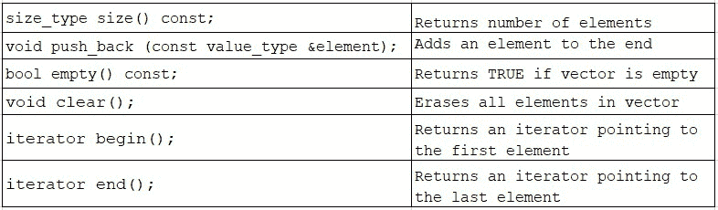
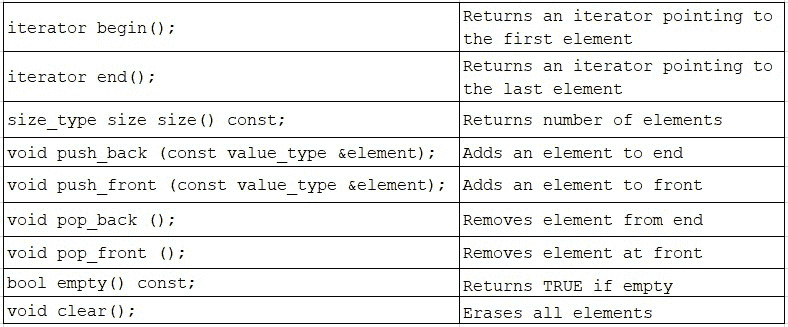
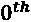
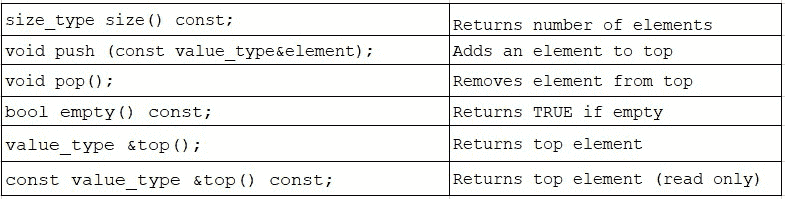
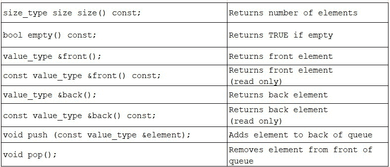
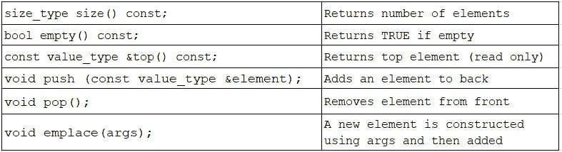
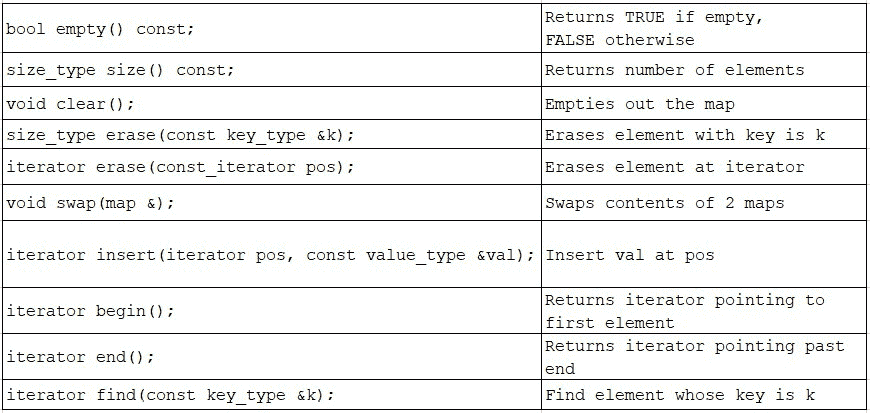

# 第十四章：理解 STL 基础知识

本章将继续我们对增加您的 C++编程技能库的追求，超越面向对象编程概念，深入研究已经完全融入到语言通用使用中的核心 C++库。我们将通过检查该库的一个子集来探索 C++中的**标准模板库**（**STL**），这个子集代表了可以简化我们的编程并使我们的代码更容易被熟悉 STL 的其他人理解的常用工具。

在本章中，我们将涵盖以下主要主题：

+   调查 C++中 STL 的内容和目的

+   了解如何使用基本的 STL 容器：`list`、`iterator`、`vector`、`deque`、`stack`、`queue`、`priority_queue`、`map`和使用函数器的`map`

+   自定义 STL 容器

到本章结束时，您将能够利用核心 STL 类来增强您的编程技能。因为您已经了解了基本的 C++语言和面向对象编程特性，您将会发现您现在有能力浏览和理解几乎任何 C++类库，包括 STL。通过熟悉 STL，您将能够显著增强您的编程技能，并成为一个更精明和有价值的程序员。

让我们通过研究一个非常广泛使用的类库 STL 来增加我们的 C++工具包。

# 技术要求

完整程序示例的在线代码可以在以下 GitHub URL 找到：[`github.com/PacktPublishing/Demystified-Object-Oriented-Programming-with-CPP/blob/master/Chapter14`](https://github.com/PacktPublishing/Demystified-Object-Oriented-Programming-with-CPP/blob/master/Chapter14)。每个完整程序示例都可以在 GitHub 存储库中的适当章节标题（子目录）下找到，文件名与当前章节编号相对应，后跟当前章节中的示例编号。例如，本章的第一个完整程序可以在子目录`Chapter14`中的名为`Chp14-Ex1.cpp`的文件中找到，位于上述 GitHub 目录下。

本章的 CiA 视频可在以下链接观看：[`bit.ly/3ch15A5`](https://bit.ly/3ch15A5)。

# 调查 STL 的内容和目的

C++中的**标准模板库**是一个扩展 C++语言的标准类和工具库。STL 的使用是如此普遍，以至于它就像是语言本身的一部分；它是 C++的一个基本和不可或缺的部分。C++中的 STL 有四个组成部分组成库：**容器**、**迭代器**、**函数**和**算法**。

STL 还影响了 C++标准库，提供了一套编程标准；这两个库实际上共享常见特性和组件，尤其是容器和迭代器。我们已经使用了标准库的组件，即`<iostream>`用于 iostreams，`<exception>`用于异常处理，以及`<new>`用于`new()`和`delete()`操作符。在本章中，我们将探索 STL 和 C++标准库之间的许多重叠组件。

STL 有一整套**容器**类。这些类封装了传统的数据结构，允许相似的项目被收集在一起并统一处理。有几类容器类 - 顺序、关联和无序。让我们总结这些类别并提供每个类别的一些示例：

+   `list`、`queue`或`stack`。有趣的是，`queue`和`stack`可以被看作是更基本容器的定制或自适应接口，比如`list`。尽管如此，`queue`和`stack`仍然提供对它们的元素的顺序访问。

+   `set`或`map`。

+   `unordered_set`或`unordered_map`。

为了使这些容器类能够潜在地用于任何数据类型（并保持强类型检查），模板被用来抽象和泛型化收集项目的数据类型。事实上，在*第十三章*中，我们使用模板构建了自己的容器类，包括`LinkList`和`Array`，因此我们已经对模板化的容器类有了基本的了解！

此外，STL 提供了一整套**迭代器**，允许我们*遍历*容器。迭代器跟踪我们当前的位置，而不会破坏相应对象集合的内容或顺序。我们将看到迭代器如何让我们更安全地处理 STL 中的容器类。

STL 还包含大量有用的**算法**。例如排序、计算集合中满足条件的元素数量、搜索特定元素或子序列、以及以各种方式复制元素。算法的其他示例包括修改对象序列（替换、交换和删除值）、将集合分成范围，或将集合合并在一起。此外，STL 还包含许多其他有用的算法和实用程序。

最后，STL 包括函数。实际上，更正确的说法是 STL 包括`operator()`（函数调用运算符），通过这样做，允许我们通过函数指针实现参数化灵活性。虽然这不是 STL 的基本特性，我们将在本章中立即（或经常）使用，我们将在本章中看到一个小而简单的仿函数示例，与即将到来的章节*使用仿函数检查 STL map*中的 STL 容器类配对。

在本章中，我们将专注于 STL 的容器类部分。虽然我们不会检查 STL 中的每个容器类，但我们将回顾一系列这些类。我们会注意到，一些这些容器类与我们在本书的前几章中一起构建的类相似。顺便说一句，在本书的渐进章节进展中，我们也建立了我们的 C++语言和面向对象编程技能，这些技能对于解码 STL 这样的 C++类库是必要的。

让我们继续前进，看看选择性的 STL 类，并在解释每个类时测试我们的 C++知识。

# 理解如何使用基本的 STL 容器

在本节中，我们将运用我们的 C++技能，解码各种 STL 容器类。我们将看到，从核心 C++语法到面向对象编程技能，我们掌握的语言特性使我们能够轻松解释我们现在将要检查的 STL 的各个组件。特别是，我们将运用我们对模板的了解！例如，我们对封装和继承的了解将指导我们理解如何使用 STL 类中的各种方法。然而，我们会注意到虚函数和抽象类在 STL 中非常罕见。熟练掌握 STL 中的新类的最佳方法是接受详细说明每个类的文档。有了 C++的知识，我们可以轻松地浏览给定类，解码如何成功使用它。

C++ STL 中的容器类实现了各种`list`、`iterator`、`vector`、`deque`、`stack`、`queue`、`priority_queue`和`map`。

让我们开始检查如何利用一个非常基本的 STL 容器，`list`。

## 使用 STL list

STL `list` 类封装了实现链表所需的数据结构。我们可以说 `list` 实现了链表的抽象数据类型。回想一下，在*第六章*中，我们通过创建 `LinkedListElement` 和 `LinkedList` 类来制作自己的链表。STL `list` 允许轻松插入、删除和排序元素。不支持直接访问单个元素（称为*随机访问*）。相反，必须迭代地遍历链表中的先前项，直到达到所需的项。`list` 是顺序容器的一个很好的例子。

STL `list` 类有各种成员函数；我们将从这个例子中开始看一些流行的方法，以熟悉基本的 STL 容器类的用法。

现在，让我们看看如何使用 STL `list` 类。这个例子可以在我们的 GitHub 上找到，作为一个完整的工作程序，其中包括必要的类定义：

[`github.com/PacktPublishing/Demystified-Object-Oriented-Programming-with-CPP/blob/master/Chapter14/Chp14-Ex1.cpp`](https://github.com/PacktPublishing/Demystified-Object-Oriented-Programming-with-CPP/blob/master/Chapter14/Chp14-Ex1.cpp)

```cpp
#include <list>
int main()
{   
    list<Student> studentBody;   // create a list
    Student s1("Jul", "Li", 'M', "Ms.", 3.8, "C++", "117PSU");
    Student *s2 = new Student("Deb", "King", 'H', "Dr.", 3.8,
                              "C++", "544UD");
    // Add Students to the studentBody list. 
    studentBody.push_back(s1);
    studentBody.push_back(*s2);
    // The next 3 instances are anonymous objects in main()
    studentBody.push_back(Student("Hana", "Sato", 'U', "Dr.",
                                   3.8, "C++", "178PSU"));
    studentBody.push_back(Student("Sara", "Kato", 'B', "Dr.",
                                  3.9, "C++", "272PSU"));
    studentBody.push_back(Student("Giselle", "LeBrun", 'R',
                                 "Ms.", 3.4, "C++", "299TU"));
    while (!studentBody.empty())
    {
       studentBody.front().Print();
       studentBody.pop_front();
    }
    delete s2;  // delete any heap instances
    return 0;
}
```

让我们检查上述程序段，其中我们创建和使用了一个 STL `list`。首先，我们`#include <list>` 包含适当的 STL 头文件。现在，在 `main()` 中，我们可以使用 `list<Student> studentBody;` 实例化一个列表。我们的列表将包含 `Student` 实例。然后我们在堆栈上创建 `Student s1` 和使用 `new()` 进行分配在堆上创建 `Student *s2`。

接下来，我们使用 `list::push_back()` 将 `s1` 和 `*s2` 添加到列表中。请注意，我们正在向 `push_back()` 传递对象。当我们向 `studentBody` 列表添加 `Student` 实例时，列表将在内部制作对象的副本，并在这些对象不再是列表成员时正确清理这些对象。我们需要记住，如果我们的实例中有任何分配在堆上的实例，比如 `*s2`，我们必须在 `main()` 结束时删除我们的实例的副本。展望到 `main()` 的末尾，我们可以看到我们适当地 `delete s2;`。

接下来，我们向列表中添加三个学生。这些 `Student` 实例没有本地标识符。这些学生是在调用 `push_back()` 中实例化的，例如，`studentBody.push_back(Student("Hana", "Sato", 'U', "Dr.", 3.8, "C++", "178PSU"));`。在这里，我们实例化了一个*匿名（堆栈）对象*，一旦 `push_back()` 调用结束，它将被正确地从堆栈中弹出并销毁。请记住，`push_back()` 也会为这些实例创建它们自己的本地副本，以在 `list` 中存在期间使用。

现在，在一个 `while` 循环中，我们反复检查列表是否为空，如果不是，则检查 `front()` 项并调用我们的 `Student::Print()` 方法。然后我们使用 `pop_front()` 从列表中移除该项。

让我们看一下这个程序的输出：

```cpp
Ms. Jul M. Li with id: 117PSU GPA:  3.8 Course: C++
Dr. Deb H. King with id: 544UD GPA:  3.8 Course: C++
Dr. Hana U. Sato with id: 178PSU GPA:  3.8 Course: C++
Dr. Sara B. Kato with id: 272PSU GPA:  3.9 Course: C++
Ms. Giselle R. LeBrun with id: 299TU GPA:  3.4 Course: C++
```

现在我们已经解析了一个简单的 STL `list` 类，让我们继续了解 `iterator` 的概念，以补充容器，比如我们的 `list`。

## 使用 STL 迭代器

我们经常需要一种非破坏性的方式来遍历对象集合。例如，重要的是要维护给定容器中的第一个、最后一个和当前位置，特别是如果该集合可能被多个方法、类或线程访问。使用**迭代器**，STL 提供了一种通用的方法来遍历任何容器类。

使用迭代器有明显的好处。一个类可以创建一个指向集合中第一个成员的 `iterator`。然后可以将迭代器移动到集合的连续下一个成员。迭代器可以提供对 `iterator` 指向的元素的访问。

总的来说，容器的状态信息可以通过`iterator`来维护。迭代器通过将状态信息从容器中抽象出来，而是放入迭代器类，为交错访问提供了安全的手段。

我们可以想象一个`iterator`，您可能会在不知情的情况下修改容器。

让我们看看如何使用 STL`iterator`。这个例子可以在我们的 GitHub 上找到，作为一个完整的程序：

[`github.com/PacktPublishing/Demystified-Object-Oriented-Programming-with-CPP/blob/master/Chapter14/Chp14-Ex2.cpp`](https://github.com/PacktPublishing/Demystified-Object-Oriented-Programming-with-CPP/blob/master/Chapter14/Chp14-Ex2.cpp)

```cpp
#include <list>
#include <iterator>
bool operator<(const Student &s1, const Student &s2)
{   // overloaded operator< -- required to use list::sort()
    return (s1.GetGpa() < s2.GetGpa());
}
int main()
{
    list<Student> studentBody;  
    Student s1("Jul", "Li", 'M', "Ms.", 3.8, "C++", "117PSU");
    // Add Students to the studentBody list.
    studentBody.push_back(s1);
    // The next Student instances are anonymous objects
    studentBody.push_back(Student("Hana", "Sato", 'U', "Dr.",
                                   3.8, "C++", "178PSU"));
    studentBody.push_back(Student("Sara", "Kato", 'B', "Dr.",
                                   3.9, "C++", "272PSU"));
    studentBody.push_back(Student("Giselle", "LeBrun", 'R',
                                 "Ms.", 3.4, "C++", "299TU"));
    studentBody.sort();  // sort() will rely on operator< 
    // Create a list iterator; set to first item in the list
    list <Student>::iterator listIter = studentBody.begin();
    while (listIter != studentBody.end())
    {
        Student &temp = *listIter;
        temp.Print();
        listIter++;
    }
    return 0;
}
```

让我们看一下我们之前定义的代码段。在这里，我们从 STL 中包括了`<list>`和`<iterator>`头文件。与之前的`main()`函数一样，我们实例化了一个`list`，它可以包含`Student`实例，使用`list<Student> studentbody;`。然后，我们实例化了几个`Student`实例，并使用`push_back()`将它们添加到列表中。再次注意，几个`Student`实例都是*匿名对象*，在`main()`中没有本地标识符。这些实例将在`push_back()`完成时从堆栈中弹出。这没有问题，因为`push_back()`将为列表创建本地副本。

现在，我们可以使用`studentBody.sort();`对列表进行排序。重要的是要注意，这个`list`方法要求我们重载`operator<`，以提供两个`Student`实例之间的比较手段。幸运的是，我们已经做到了！我们选择通过比较`gpa`来实现`operator<`，但也可以使用`studentId`进行比较。

现在我们有了一个`list`，我们可以创建一个`iterator`，并将其建立为指向`list`的第一个项目。我们通过声明`list <Student>::iterator listIter = studentBody.begin();`来实现这一点。有了`iterator`，我们可以使用它来安全地循环遍历`list`，从开始（初始化时）到`end()`。我们将一个本地引用变量`temp`赋给列表中当前第一个元素的循环迭代，使用`Student &temp = *listIter;`。然后我们使用`temp.Print();`打印这个实例，然后我们通过`listIter++;`增加一个元素来增加我们的迭代器。

让我们看一下此程序的排序输出（按`gpa`排序）：

```cpp
MS. Giselle R. LeBrun with id: 299TU GPA:  3.4 Course: C++
Ms. Jul M. Li with id: 117PSU GPA:  3.8 Course: C++
Dr. Hana U. Sato with id: 178PSU GPA:  3.8 Course: C++
Dr. Sara B. Kato with id: 272PSU GPA:  3.9 Course: C++
```

现在我们已经看到了`iterator`类的实际应用，让我们来研究一系列其他 STL 容器类，从`vector`开始。

## 使用 STL`vector`

STL`vector`类实现了动态数组的抽象数据类型。回想一下，我们通过在*第十三章*中创建一个`Array`类来创建了自己的动态数组，*使用模板工作*。然而，STL 版本将更加广泛。

`vector`（动态或可调整大小的数组）将根据需要扩展以容纳超出其初始大小的额外元素。`vector`类允许通过重载`operator[]`直接（即*随机访问*）访问元素。`vector`允许通过直接访问在常量时间内访问元素。不需要遍历所有先前的元素来访问特定索引处的元素。

然而，在`vector`中间添加元素是耗时的。也就是说，在除`vector`末尾之外的任何位置添加元素都需要内部重新排列所有插入点后的元素；它还可能需要内部调整`vector`的大小。

显然，通过比较，`list`和`vector`具有不同的优势和劣势。每个都适用于数据集的不同要求。我们可以选择最适合我们需求的那个。

让我们看一下一些常见的`vector`成员函数。这远非完整列表：



STL `vector`还有一个重载的`operator=`（用源向目标`vector`进行赋值替换），`operator==`（逐个元素比较向量），和`operator[]`（返回所请求位置的引用，即可写内存）。

让我们来看看如何使用 STL `vector`类及其基本操作。这个例子可以在我们的 GitHub 上找到，作为一个完整的工作程序，如下所示：

[`github.com/PacktPublishing/Demystified-Object-Oriented-Programming-with-CPP/blob/master/Chapter14/Chp14-Ex3.cpp`](https://github.com/PacktPublishing/Demystified-Object-Oriented-Programming-with-CPP/blob/master/Chapter14/Chp14-Ex3.cpp)

```cpp
#include <vector>
int main()
{
    vector<Student> studentBody1, studentBody2; // two vectors
    // add 3 Students, which are anonymous objects, to vect 1 
    studentBody1.push_back(Student("Hana", "Sato", 'U', "Dr.",
                                    3.8, "C++", "178PSU"));
    studentBody1.push_back(Student("Sara", "Kato", 'B', "Dr.",
                                    3.9, "C++", "272PSU"));
    studentBody1.push_back(Student("Giselle", "LeBrun", 'R',
                                 "Ms.", 3.4, "C++", "299TU"));
    for (int i = 0; i < studentBody1.size(); i++)   
        studentBody1[i].Print();   // print vector1's contents
    studentBody2 = studentBody1;   // assign one to another
    if (studentBody1 == studentBody2)
        cout << "Vectors are the same" << endl;
    for (auto iter = studentBody2.begin(); // print vector2
              iter != studentBody2.end(); iter++)
        (*iter).Print();
    if (!studentBody1.empty())   // clear first vector 
        studentBody1.clear();
    return 0;
}
```

在前面列出的代码段中，我们`#include <vector>`来包含适当的 STL 头文件。现在，在`main()`中，我们可以使用`vector<Student> studentBody1, studentBody2;`来实例化两个向量。然后，我们可以使用`vector::push_back()`方法将几个`Student`实例连续添加到我们的第一个`vector`中。再次注意，在`main()`中，`Student`实例是*匿名对象*。也就是说，没有本地标识符引用它们 - 它们只是被创建用于放入我们的`vector`中，每次插入时都会创建每个实例的本地副本。一旦我们的`vector`中有元素，我们就可以遍历我们的第一个`vector`，使用`studentBody1[i].Print();`打印每个`Student`。

接下来，我们通过`studentBody1 = studentBody2;`来演示`vector`的重载赋值运算符。在这里，我们在赋值中从右到左进行深度复制。然后，我们可以使用重载的比较运算符在条件语句中测试这两个向量是否相等。也就是说，`if (studentBody1 == studentBody2)`。然后，我们使用指定为`auto iter = studentBody2.begin();`的迭代器在`for`循环中打印出第二个向量的内容。`auto`关键字允许迭代器的类型由其初始使用确定。最后，我们遍历我们的第一个`vector`，测试它是否`empty()`，然后使用`studentBody1.clear();`逐个清除一个元素。我们现在已经看到了`vector`方法及其功能的一部分。

让我们来看看这个程序的输出：

```cpp
Dr. Hana U. Sato with id: 178PSU GPA:  3.8 Course: C++
Dr. Sara B. Kato with id: 272PSU GPA:  3.9 Course: C++
Ms. Giselle R. LeBrun with id: 299TU GPA:  3.4 Course: C++
Vectors are the same
Dr. Hana U. Sato with id: 178PSU GPA:  3.8 Course: C++
Dr. Sara B. Kato with id: 272PSU GPA:  3.9 Course: C++
Ms. Giselle R. LeBrun with id: 299TU GPA:  3.4 Course: C++
```

接下来，让我们研究 STL `deque`类，以进一步了解 STL 容器。

## 使用 STL deque

STL `deque`类（发音为*deck*）实现了双端队列的抽象数据类型。这个 ADT 扩展了队列先进先出的概念。相反，`deque`允许更大的灵活性。在`deque`的两端快速添加元素。在`deque`的中间添加元素是耗时的。`deque`是一个顺序容器，尽管比我们的`list`更灵活。

你可能会想象`deque`是`queue`的一个特例；它不是。相反，灵活的`deque`类将作为实现其他容器类的基础，我们很快就会看到。在这些情况下，私有继承将允许我们将`deque`隐藏为更严格的专门类的底层实现（具有广泛的功能）。

让我们来看看一些常见的`deque`成员函数。这远非完整列表：



STL `deque`还有一个重载的`operator=`（将源分配给目标 deque）和`operator[]`（返回所请求位置的引用 - 可写内存）。

让我们来看看如何使用 STL `deque`类。这个例子可以在我们的 GitHub 上找到，作为一个完整的工作程序，如下所示：

[`github.com/PacktPublishing/Demystified-Object-Oriented-Programming-with-CPP/blob/master/Chapter14/Chp14-Ex4.cpp`](https://github.com/PacktPublishing/Demystified-Object-Oriented-Programming-with-CPP/blob/master/Chapter14/Chp14-Ex4.cpp)

```cpp
include <deque>   
int main()
{
    deque<Student> studentBody;   // create a deque
    Student s1("Tim", "Lim", 'O', "Mr.", 3.2, "C++", "111UD");
    // the remainder of the Students are anonymous objects
    studentBody.push_back(Student("Hana", "Sato", 'U', "Dr.",
                          3.8, "C++", "178PSU"));
    studentBody.push_back(Student("Sara", "Kato", 'B', "Dr.",
                          3.9, "C++", "272PSU"));
    studentBody.push_front(Student("Giselle", "LeBrun", 'R',
                                "Ms.", 3.4, "C++", "299TU"));
    // insert one past the beginning
    studentBody.insert(studentBody.begin() + 1, Student
       ("Anne", "Brennan", 'B', "Ms.", 3.9, "C++", "299CU"));
    studentBody[0] = s1;  // replace  element; 
                          // no bounds checking!
    while (studentBody.empty() == false)
    {
        studentBody.front().Print();
        studentBody.pop_front();
    }
    return 0;
}
```

在前面列出的代码段中，我们`#include <deque>`来包含适当的 STL 头文件。现在，在`main()`中，我们可以实例化一个`deque`来包含`Student`实例，使用`deque<Student> studentBody;`。然后，我们调用`deque::push_back()`或`deque::push_front()`来向我们的`deque`中添加几个`Student`实例（一些匿名对象）。我们已经掌握了这个！现在，我们使用`studentBody.insert(studentBody.begin() + 1, Student("Anne", "Brennan", 'B', "Ms.", 3.9, "C++", "299CU"));`在我们的甲板前面插入一个`Student`。

接下来，我们利用重载的`operator[]`将一个`Student`插入我们的`deque`，使用`studentBody[0] = s1;`。请注意，`operator[]`不会对我们的`deque`进行任何边界检查！在这个语句中，我们将`Student` `s1`插入到`deque`的位置，而不是曾经占据该位置的`Student`。更安全的方法是使用`deque::at()`方法，它将包含边界检查。关于前述的赋值，我们还要确保`operator=`已经被重载为`Person`和`Student`，因为每个类都有动态分配的数据成员。

现在，我们循环直到我们的`deque`为空，使用`studentBody.front().Print();`提取并打印 deque 的前一个元素。每次迭代，我们还使用`studentBody.pop_front();`从我们的`deque`中弹出前一个项目。

让我们来看看这个程序的输出：

```cpp
Mr. Tim O. Lim with id: 111UD GPA:  3.2 Course: C++
Ms. Anne B. Brennan with id: 299CU GPA:  3.9 Course: C++
Dr. Hana U. Sato with id: 178PSU GPA:  3.8 Course: C++
Dr. Sara B. Kato with id: 272PSU GPA:  3.9 Course: C++
```

现在我们对`deque`有了一些了解，接下来让我们调查 STL `stack`类。

## 使用 STL stack

STL `stack`类实现了堆栈的抽象数据类型。堆栈 ADT 支持`stack`包括一个不公开其底层实现的公共接口。毕竟，`stack`可能会改变其实现；ADT 的使用不应以任何方式依赖其底层实现。STL `stack`被认为是基本顺序容器的自适应接口。

回想一下，我们在*第六章*中制作了我们自己的`Stack`类，*使用继承实现层次结构*，使用了`LinkedList`作为私有基类。STL 版本将更加广泛；有趣的是，它是使用`deque`作为其底层私有基类来实现的。`deque`作为 STL `stack`的私有基类，隐藏了`deque`更多的通用功能；只有适用的方法被用来实现堆栈的公共接口。此外，因为实现的方式被隐藏了，一个`stack`可以在以后使用另一个容器类来实现，而不会影响其使用。

让我们来看看一系列常见的`stack`成员函数。这远非完整列表。重要的是要注意，`stack`的公共接口远比其私有基类`deque`要小：



STL `stack`还有一个重载的`operator=`（将源分配给目标堆栈），`operator==`和`operator!=`（两个堆栈的相等/不相等），以及`operator<`，`operator>`，`operator<=`和`operator >=`（堆栈的比较）。

让我们看看如何使用 STL `stack`类。这个例子可以在我们的 GitHub 上找到，作为一个完整的工作程序，如下所示：

[`github.com/PacktPublishing/Demystified-Object-Oriented-Programming-with-CPP/blob/master/Chapter14/Chp14-Ex5.cpp`](https://github.com/PacktPublishing/Demystified-Object-Oriented-Programming-with-CPP/blob/master/Chapter14/Chp14-Ex5.cpp)

```cpp
include <stack>   // template class preamble
int main()
{
    stack<Student> studentBody;   // create a stack
    // add Students to the stack (anonymous objects)
    studentBody.push(Student("Hana", "Sato", 'U', "Dr.", 3.8,
                             "C++", "178PSU"));
    studentBody.push(Student("Sara", "Kato", 'B', "Dr.", 3.9,
                             "C++", "272PSU"));
    studentBody.push(Student("Giselle", "LeBrun", 'R', "Ms.",
                              3.4, "C++", "299TU"));
    while (!studentBody.empty())
    {
        studentBody.top().Print();
        studentBody.pop();
    }
    return 0;
}
```

在前面列出的代码段中，我们`#include <stack>`来包含适当的 STL 头文件。现在，在`main()`中，我们可以实例化一个`stack`来包含`Student`实例，使用`stack<Student> studentBody;`。然后，我们调用`stack::push()`来向我们的`stack`中添加几个`Student`实例。请注意，我们使用传统的`push()`方法，这有助于堆栈的 ADT。

然后我们循环遍历我们的`stack`，直到它不是`empty()`为止。我们的目标是使用`studentBody.top().Print();`来访问并打印顶部的元素。然后我们使用`studentBody.pop();`来整洁地从栈中弹出我们的顶部元素。

让我们来看看这个程序的输出：

```cpp
Ms. Giselle R. LeBrun with id: 299TU GPA:  3.4 Course: C++
Dr. Sara B. Kato with id: 272PSU GPA:  3.9 Course: C++
Dr. Hana U. Sato with id: 178PSU GPA:  3.8 Course: C++
```

接下来，让我们研究 STL `queue`类，以进一步增加我们的 STL 容器知识。

## 使用 STL queue

STL `queue`类实现了队列的 ADT。作为典型的队列类，STL 的`queue`支持**FIFO**（先进先出）的插入和删除成员的顺序。

回想一下，在*第六章**，使用继承实现层次结构*中，我们制作了自己的`Queue`类；我们使用私有继承从我们的`LinkedList`类派生了我们的`Queue`。STL 版本将更加广泛；STL `queue`是使用`deque`作为其底层实现的（同样使用私有继承）。请记住，因为使用私有继承隐藏了实现手段，所以`queue`可以在以后使用另一种数据类型来实现，而不会影响其公共接口。STL `queue`是基本顺序容器的另一个自适应接口的例子。

让我们来看看一系列常见的`queue`成员函数。这远非完整列表。重要的是要注意，`queue`的公共接口远比其私有基类`deque`的接口小得多：



STL `queue`还有一个重载的`operator=`（将源队列分配给目标队列），`operator==`和`operator!=`（两个队列的相等/不相等），以及`operator<`，`operator>`，`operator<=`和`operator >=`（队列的比较）。

让我们看看如何使用 STL `queue`类。这个例子可以在我们的 GitHub 上找到，作为一个完整的工作程序：

[`github.com/PacktPublishing/Demystified-Object-Oriented-Programming-with-CPP/blob/master/Chapter14/Chp14-Ex6.cpp`](https://github.com/PacktPublishing/Demystified-Object-Oriented-Programming-with-CPP/blob/master/Chapter14/Chp14-Ex6.cpp)

```cpp
#include <queue>   
int main()
{
    queue<Student> studentBody;  // create a queue
    // add Students to the queue (anonymous objects)
    studentBody.push(Student("Hana", "Sato", 'U', "Dr.", 3.8,
                             "C++", "178PSU"));
    studentBody.push(Student("Sara", "Kato", 'B', "Dr.", 3.9,
                             "C++", "272PSU"));
    studentBody.push(Student("Giselle", "LeBrun", 'R', "Ms.",
                             3.4, "C++", "299TU"));
    while (!studentBody.empty())
    {
        studentBody.front().Print();
        studentBody.pop();
    }
    return 0;
}
```

在上一个代码段中，我们首先`#include <queue>`来包含适当的 STL 头文件。现在，在`main()`中，我们可以实例化一个`queue`来包含`Student`实例，使用`queue<Student> studentBody;`。然后我们调用`queue::push()`来向我们的`queue`中添加几个`Student`实例。回想一下，使用队列 ADT，`push()`意味着我们在队列的末尾添加一个元素；一些程序员更喜欢使用术语*enqueue*来描述这个操作；然而，STL 选择了将这个操作命名为`push()`。使用队列 ADT，`pop()`将从队列的前面移除一个项目。一个更好的术语是*dequeue*；然而，这不是 STL 选择的。我们可以适应。

然后我们循环遍历我们的`queue`，直到它不是`empty()`为止。我们的目标是使用`studentBody.front().Print();`来访问并打印前面的元素。然后我们使用`studentBody.pop();`来整洁地从`queue`中弹出我们的前面的元素。我们的工作完成了。

让我们来看看这个程序的输出：

```cpp
Dr. Hana U. Sato with id: 178PSU GPA:  3.8 Course: C++
Dr. Sara B. Kato with id: 272PSU GPA:  3.9 Course: C++
Ms. Giselle R. LeBrun with id: 299TU GPA:  3.4 Course: C++
```

现在我们已经尝试了`queue`，让我们来研究一下 STL `priority_queue`类。

## 使用 STL 优先队列

STL `priority_queue`类实现了优先队列的抽象数据类型。优先队列 ADT 支持修改后的 FIFO 插入和删除成员的顺序，使得元素被*加权*。前面的元素具有最大值（由重载的`operator<`确定），其余元素按顺序从次大到最小。STL `priority_queue`被认为是顺序容器的自适应接口。

请记住，我们在*第六章*中实现了我们自己的`PriorityQueue`类，*使用继承实现层次结构*。我们使用公共继承来允许我们的`PriorityQueue`专门化我们的`Queue`类，添加额外的方法来支持优先级（加权）入队方案。`Queue`的底层实现（使用私有基类`LinkedList`）是隐藏的。通过使用公共继承，我们允许我们的`PriorityQueue`能够通过向上转型被泛化为`Queue`（这是我们在*第七章*中学习多态性和虚函数后理解的）。我们做出了一个可以接受的设计选择：*PriorityQueue Is-A*（专门化为）*Queue*，有时可以以更一般的形式对待。我们还记得，`Queue`和`PriorityQueue`都不能向上转型为它们的底层实现`LinkedList`，因为`Queue`是从`LinkedList`私有继承的；我们不能越过非公共继承边界向上转型。

与此相反，STL 版本的`priority_queue`是使用 STL `vector`作为其底层实现。请记住，由于实现方式是隐藏的，`priority_queue`可能会在以后使用另一种数据类型进行实现，而不会影响其公共接口。

STL `priority_queue`允许检查，但不允许修改顶部元素。STL `priority_queue`不允许通过其元素进行插入。也就是说，元素只能按从大到小的顺序添加。因此，可以检查顶部元素，并且可以删除顶部元素。

让我们来看一下一系列常见的`priority_queue`成员函数。这不是一个完整的列表。重要的是要注意，`priority_queue`的公共接口要比其私有基类`vector`要小得多：



与之前检查过的容器类不同，STL `priority_queue`不重载运算符，包括`operator=`, `operator==`, 和 `operator<`。

`priority_queue`最有趣的方法是`void emplace(args);`。这是允许优先级入队机制向该 ADT 添加项目的成员函数。我们还注意到`top()`必须用于返回顶部元素（与`queue`使用的`front()`相反）。但再说一遍，STL `priority_queue`并不是使用`queue`实现的）。要使用`priority_queue`，我们需要`#include <queue>`，就像我们为`queue`一样。

由于`priority_queue`的使用方式与`queue`非常相似，因此我们将在本章末尾的问题集中进一步探讨它的编程方式。

现在我们已经看到了 STL 中许多顺序容器类型的示例（包括自适应接口），让我们接下来研究 STL `map`类，这是一个关联容器。

## 检查 STL map

STL `map`类实现了哈希表的抽象数据类型。`map`类允许快速存储和检索哈希表或映射中的元素，如果需要将多个数据与单个键关联起来，则可以使用`multimap`。

哈希表（映射）对于数据的存储和查找非常快。性能保证为*O(log(n))*。STL `map`被认为是一个关联容器，因为它将一个键与一个值关联起来，以快速检索值。

让我们来看一下一系列常见的`map`成员函数。这不是一个完整的列表：



STL `map`还有重载的运算符`operator==`（逐个元素比较映射），实现为全局函数。STL `map`还有重载的`operator[]`（返回与用作索引的键关联的映射元素的引用；这是可写内存）。

让我们看看如何使用 STL `map`类。这个例子可以在我们的 GitHub 上找到，作为一个完整的工作程序：

[`github.com/PacktPublishing/Demystified-Object-Oriented-Programming-with-CPP/blob/master/Chapter14/Chp14-Ex7.cpp`](https://github.com/PacktPublishing/Demystified-Object-Oriented-Programming-with-CPP/blob/master/Chapter14/Chp14-Ex7.cpp)

```cpp
#include <map>
bool operator<(const Student &s1, const Student &s2)
{   // We need to overload operator< to compare Students
    return (s1.GetGpa() < s2.GetGpa());
}
int main()
{
    Student s1("Hana", "Lo", 'U', "Dr.", 3.8, "C++", "178UD");
    Student s2("Ali", "Li", 'B', "Dr.", 3.9, "C++", "272UD");
    Student s3("Rui", "Qi", 'R', "Ms.", 3.4, "C++", "299TU");
    Student s4("Jiang", "Wu", 'C', "Ms.", 3.8, "C++","887TU");
    // Create map and map iterator, of Students w char * keys
    map<const char *, Student> studentBody;
    map<const char *, Student>::iterator mapIter;
    // create three pairings of ids to Students
    pair<const char *, Student> studentPair1
                                (s1.GetStudentId(), s1);
    pair<const char *, Student> studentPair2
                                (s2.GetStudentId(), s2);
    pair<const char *, Student> studentPair3
                                (s3.GetStudentId(), s3);
    studentBody.insert(studentPair1);  // insert 3 pairs
    studentBody.insert(studentPair2);
    studentBody.insert(studentPair3);
    // insert using virtual indices per map
    studentBody[s4.GetStudentId()] = s4; 

    mapIter = studentBody.begin();
    while (mapIter != studentBody.end())
    {   
        // set temp to current item in map iterator
        pair<const char *, Student> temp = *mapIter;
        Student &tempS = temp.second;  // get 2nd item in pair 
        // access using mapIter
        cout << temp.first << " "<<temp.second.GetFirstName();  
        // or access using temporary Student, tempS  
        cout << " " << tempS.GetLastName() << endl;
        mapIter++;
    }
    return 0;
}
```

让我们检查前面的代码段。同样，我们使用`#include <map>`包含适用的头文件。接下来，我们实例化四个`Student`实例。我们将制作一个哈希表（`map`），其中`Student`实例将由键（即它们的`studentId`）索引。接下来，我们声明一个`map`来保存`Student`实例的集合，使用`map<const char*，Student> studentBody;`。在这里，我们指示键和元素之间的关联将在`const char*`和`Student`之间进行。然后，我们使用`map<const char*，Student>::iterator mapIter;`声明映射迭代器，使用相同的数据类型。

现在，我们创建三个`pair`实例，将每个`Student`与其键（即其相应的`studentId`）关联起来，使用声明`pair<const char*，Student> studentPair1(s1.GetStudentId(), s1);`。这可能看起来令人困惑，但让我们将这个声明分解成其组成部分。在这里，实例的数据类型是`pair<const char*，Student>`，变量名是`studentPair1`，`(s1.GetStudentId(), s1)`是传递给特定`pair`实例构造函数的参数。

现在，我们只需将三个`pair`实例插入`map`中。一个示例是`studentBody.insert(studentPair1);`。然后，我们使用以下语句将第四个`Student`，`s4`，插入`map`中：`studentBody[s4.GetStudentId()] = s4;`。请注意，在`operator[]`中使用`studentId`作为索引值；这个值将成为哈希表中`Student`的键值。

最后，我们将映射迭代器建立到`map`的开头，然后在`end()`之前处理`map`。在循环中，我们将一个变量`temp`设置为映射迭代器指示的`pair`的前端。我们还将`tempS`设置为`map`中的`Student`的临时引用，由`temp.second`（映射迭代器管理的当前`pair`中的第二个值）指示。现在，我们可以使用`temp.first`（当前`pair`中的第一个项目）打印出每个`Student`实例的`studentId`（键）。在同一语句中，我们可以使用`temp.second.GetFirstName()`打印出每个`Student`实例的`firstName`（因为与键对应的`Student`是当前`pair`中的第二个项目）。类似地，我们还可以使用`tempS.GetLastName()`打印出学生的`lastName`，因为`tempS`在每次循环迭代开始时被初始化为当前`pair`中的第二个元素。

让我们来看看这个程序的输出：

```cpp
299TU Rui Qi
178UD Hana Lo
272UD Ali Li
887TU Jiang Wu
```

接下来，让我们看看使用 STL `map`的另一种方法，这将向我们介绍 STL `functor`的概念。

## 使用函数对象检查 STL 映射

STL `map`类具有很大的灵活性，就像许多 STL 类一样。在我们过去的`map`示例中，我们假设我们的`Student`类中存在比较的方法。毕竟，我们为两个`Student`实例重载了`operator<`。然而，如果我们无法修改未提供此重载运算符的类，并且我们选择不重载`operator<`作为外部函数，会发生什么呢？

幸运的是，当实例化`map`或映射迭代器时，我们可以为模板类型扩展指定第三种数据类型。这个额外的数据类型将是一种特定类型的类，称为函数对象。一个`operator()`。在重载的`operator()`中，我们将为问题中的对象提供比较的方法。函数对象本质上是通过重载`operator()`来模拟封装函数指针。

让我们看看如何修改我们的`map`示例以利用一个简单的函数对象。这个例子可以在我们的 GitHub 上找到，作为一个完整的工作程序：

[`github.com/PacktPublishing/Demystified-Object-Oriented-Programming-with-CPP/blob/master/Chapter14/Chp14-Ex8.cpp`](https://github.com/PacktPublishing/Demystified-Object-Oriented-Programming-with-CPP/blob/master/Chapter14/Chp14-Ex8.cpp)

```cpp
#include <map>
struct comparison   // This struct represents a 'functor'
{                   // that is, a 'function object'
    bool operator() (const char *key1, const char *key2) const
    {   
        int ans = strcmp(key1, key2);
        if (ans >= 0) return true;  // return a boolean
        else return false;  
    }
    comparison() {}  // empty constructor and destructor
    ~comparison() {}
};
int main()
{
    Student s1("Hana", "Sato", 'U', "Dr.", 3.8, "C++", 
               "178PSU");
    Student s2("Sara", "Kato", 'B', "Dr.", 3.9, "C++",
               "272PSU");
    Student s3("Jill", "Long", 'R', "Dr.", 3.7, "C++",
               "234PSU");
    // Now, map is maintained in sorted order per 'comparison'
    // functor using operator()
    map<const char *, Student, comparison> studentBody;
    map<const char *, Student, comparison>::iterator mapIter;
    // The remainder of the program is similar to prior
}   // map program. See online code for complete example.
```

在前面提到的代码片段中，我们首先介绍了一个名为`comparison`的用户定义类型。这可以是一个`class`或一个`struct`。在这个结构的定义中，我们重载了函数调用运算符(`operator()`)，并提供了两个`const char *`键的`Student`实例之间的比较方法。这个比较将允许`Student`实例按照比较函数对象确定的顺序插入。

现在，当我们实例化我们的`map`和 map 迭代器时，我们在模板类型扩展的第三个参数中指定了我们的`comparison`类型（函数对象）。并且在这个类型中嵌入了重载的函数调用运算符`operator()`，它将提供我们所需的比较。其余的代码将类似于我们原来的 map 程序。

当然，函数对象可能会以额外的、更高级的方式被使用，超出了我们在这里使用`map`容器类所见到的。尽管如此，你现在已经对函数对象如何应用于 STL 有了一定的了解。

现在我们已经看到了如何利用各种 STL 容器类，让我们考虑为什么我们可能想要定制一个 STL 类，以及如何做到这一点。

# 定制 STL 容器

C++中的大多数类都可以以某种方式进行定制，包括 STL 中的类。然而，我们必须注意 STL 中的设计决策将限制我们如何定制这些组件。因为 STL 容器类故意不包括虚析构函数或其他虚函数，我们不应该使用公共继承来扩展这些类。请注意，C++不会阻止我们，但我们知道从*第七章*，*通过多态使用动态绑定*，我们永远不应该覆盖非虚函数。STL 选择不包括虚析构函数和其他虚函数，以允许进一步专门化这些类，这是在 STL 容器被创建时做出的一个坚实的设计选择。

然而，我们可以使用私有或受保护的继承，或者包含或关联的概念，将 STL 容器类用作构建块，也就是说，隐藏新类的底层实现，STL 为新类提供了一个坚实但隐藏的实现。我们只需为新类提供我们自己的公共接口，在幕后，将工作委托给我们的底层实现（无论是私有或受保护的基类，还是包含或关联的对象）。

在扩展任何模板类时，包括使用私有或受保护基类的 STL 中的模板类，必须非常小心谨慎。这种小心谨慎也适用于包含或关联其他模板类。模板类通常不会被编译（或语法检查）直到创建具有特定类型的模板类的实例。这意味着只有当创建特定类型的实例时，任何派生或包装类才能被充分测试。

新类需要适当的重载运算符，以便这些运算符能够自动地与定制类型一起工作。请记住，一些运算符函数，比如`operator=`，并不是从基类继承到派生类的，需要在每个新类中编写。这是合适的，因为派生类可能需要完成的工作比`operator=`的通用版本中找到的更多。请记住，如果您无法修改需要选定重载运算符的类的类定义，您必须将该运算符函数实现为外部函数。

除了定制容器，我们还可以选择根据 STL 中现有的算法来增强算法。在这种情况下，我们将使用 STL 的许多函数之一作为新算法的基础实现的一部分。

在编程中经常需要定制来自现有库的类。例如，考虑我们如何扩展标准库`exception`类以创建自定义异常*第十一章*中的情况，*处理异常*（尽管该场景使用了公共继承，这不适用于定制 STL 类）。请记住，STL 提供了非常丰富的容器类。您很少会发现需要增强 STL 类的情况 - 或许只有在非常特定领域的类需求中。尽管如此，您现在知道了定制 STL 类所涉及的注意事项。请记住，在增强类时必须始终谨慎小心。我们现在看到了需要为我们创建的任何类使用适当的 OO 组件测试的必要性。

我们现在考虑如何在我们的程序中可能定制 STL 容器类和算法。我们也看到了一些 STL 容器类的实际示例。在继续下一章之前，让我们简要回顾一下这些概念。

# 总结

在本章中，我们进一步扩展了我们的 C++知识，超越了面向对象的语言特性，以熟悉 C++标准模板库。由于这个库在 C++中被如此普遍地使用，我们必须理解它包含的类的范围和广度。我们现在准备在我们的代码中利用这些有用的、经过充分测试的类。

通过检查选择的 STL 类，我们已经看了很多 STL 的例子，应该有能力自己理解 STL 的其余部分（或任何 C++库）。

我们已经看到了如何使用常见和基本的 STL 类，比如`list`、`iterator`、`vector`、`deque`、`stack`、`queue`、`priority_queue`和`map`。我们还看到了如何将一个函数对象与容器类结合使用。我们被提醒，我们现在有可能定制任何类的工具，甚至是来自类库如 STL 的类（通过私有或受保护的继承）或者包含或关联。

通过检查选定的 STL 类，我们还看到了我们有能力理解 STL 剩余的深度和广度，以及解码许多可用于我们的额外类库。当我们浏览每个成员函数的原型时，我们注意到关键的语言概念，比如`const`的使用，或者一个方法返回一个表示可写内存的对象的引用。每个原型都揭示了新类的使用机制。能够在编程努力中走到这一步真是令人兴奋！

通过在 C++中浏览 STL，我们现在已经为我们的 C++技能库增加了额外的有用特性。使用 STL（封装传统的数据结构）将确保我们的代码可以轻松地被其他程序员理解，他们无疑也在使用 STL。依靠经过充分测试的 STL 来使用这些常见的容器和实用程序，可以确保我们的代码更少出现错误。

我们现在准备继续进行[*第十五章*]，*测试类和组件*。我们希望用有用的 OO 组件测试技能来补充我们的 C++编程技能。测试技能将帮助我们了解我们是否以稳健的方式创建、扩展或增强了类。这些技能将使我们成为更好的程序员。让我们继续前进！

# 问题

1.  用 STL`vector`替换您在[*第十三章*]（B15702_13_Final_NM_ePub.xhtml#_idTextAnchor486）的练习中的模板`Array`类，*使用模板*。创建`Student`实例的`vector`。使用`vector`操作来插入、检索、打印、比较和从向量中删除对象。或者，利用 STL`list`。利用这个机会利用 STL 文档来浏览这些类的全部操作。

a. 考虑您是否需要重载哪些运算符。考虑是否需要一个`iterator`来提供对集合的安全交错访问。

b. 创建第二个`vector`的`Students`。将一个分配给另一个。打印两个`vectors`。

1.  修改本章的`map`，以根据它们的`lastName`而不是`studentId`来索引`Student`实例的哈希表（map）。

1.  修改本章的`queue`示例，以改用`priority_queue`。确保利用优先级入队机制`priority_queue::emplace()`将元素添加到`priority_queue`中。您还需要利用`top()`而不是`front()`。请注意，`priority_queue`可以在`<queue>`头文件中找到。

1.  尝试使用`sort()`的 STL 算法。确保`#include <algorithm>`。对整数数组进行排序。请记住，许多容器都内置了排序机制，但本地集合类型，如语言提供的数组，没有（这就是为什么您应该使用基本整数数组）。
