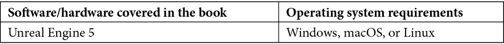
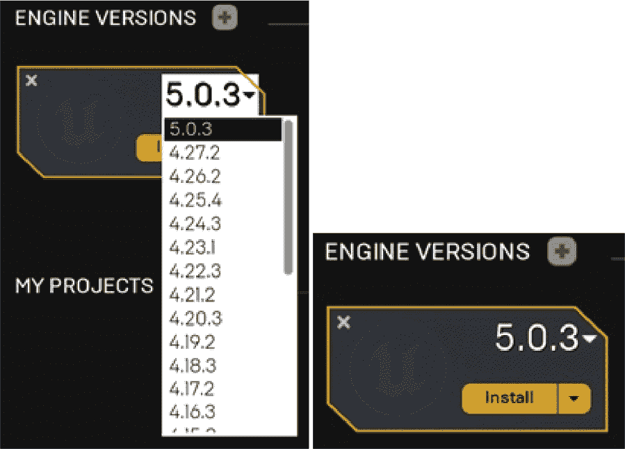
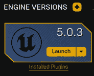

# 前言

通过这本书，您可以沉浸于虚幻游戏项目中，本书由四位经验丰富的行业专业人士撰写，他们与虚幻引擎的联合经验超过多年。*使用虚幻引擎 5 提升游戏体验*将引导您了解虚幻引擎的最新版本，通过帮助您参与游戏创建项目来获得实际操作经验。本书从介绍虚幻编辑器和关键概念开始，如演员、蓝图、动画、继承和玩家输入。然后，您将进入三个项目中的第一个——构建躲避球游戏，您将学习到线迹、碰撞、投射物、用户界面和音效的概念。您还将发现如何将这些概念结合起来展示您的新技能。第二个项目，一个侧滚动游戏，将帮助您实现动画混合、敌人 AI、生成对象和可收集物品等概念。最后，当您在第三个项目——第一人称射击游戏中工作时，您将涵盖创建多人环境的关键概念。到虚幻引擎书籍结束时，您将广泛了解如何使用游戏引擎提供的工具开始构建自己的游戏。

# 本书面向对象

本书面向希望开始使用虚幻引擎 5 进行游戏开发项目的游戏开发者。任何之前使用过虚幻引擎并希望巩固、提高和应用其技能的人会发现这本书很有用。为了更好地掌握本书中解释的概念，需要具备 C++基础知识（如变量、函数、类、多态和指针）。为了与本书中使用的 IDE 完全兼容，建议使用 Windows 系统。

# 本书涵盖内容

*第一章**，虚幻引擎简介*，探讨了虚幻引擎编辑器。您将了解编辑器的界面，了解如何在级别中操纵演员，理解蓝图可视化脚本语言的基础，以及发现如何创建可以由网格使用的材质资产。

*第二章**，使用虚幻引擎*，介绍了虚幻引擎游戏基础，以及如何创建 C++项目和设置项目的内容文件夹。您还将被介绍到动画的主题。

*第三章**，角色类组件和蓝图设置*，向您介绍虚幻角色类，以及对象继承的概念以及如何处理输入映射。

*第四章**，开始使用玩家输入*，介绍了玩家输入的主题。您将通过使用动作映射和轴映射，了解如何将按键或触摸输入与游戏中的动作关联起来，例如跳跃或移动。

*第五章**，使用线迹查询*，启动了一个名为躲避球的新项目。在本章中，您将了解线迹的概念以及它们在游戏中的各种应用方式。

*第六章**，设置碰撞对象*，探讨了对象碰撞的主题。您将了解碰撞组件、碰撞事件和物理模拟。您还将研究计时器、投射物移动组件和物理材料的话题。

*第七章**，使用 UE5 实用工具*，教您如何实现 Unreal Engine 中的一些有用实用工具，包括演员组件、接口和蓝图功能库，这将有助于保持您的项目结构良好，并便于其他加入您团队的人使用。

*第八章**，使用 UMG 创建用户界面*，探讨了游戏 UI 的主题。您将学习如何使用 Unreal Engine 的 UI 系统 UMG 制作菜单和 HUD，以及如何使用进度条显示玩家角色的生命值。

*第九章**，添加音视频元素*，介绍了 Unreal Engine 中的声音和粒子效果主题。您将学习如何将声音文件导入项目，并将它们用作 2D 和 3D 声音，以及如何将现有的粒子系统添加到游戏中。最后，将创建一个新的关卡，使用在前几章中构建的所有游戏机制来结束躲避球项目。

*第十章**，创建 SuperSideScroller 游戏*，详细讨论了 SuperSideScroller 项目的目标，并通过操纵默认的 Mannequin 骨架的示例概述了 Unreal Engine 5 中动画的工作方式。

*第十一章**，使用 1D 混合空间、按键绑定和状态机*，教您如何使用 Unreal Engine 5 中的 1D 混合空间、动画状态机和增强型输入系统为玩家角色创建基于移动的工作动画逻辑。

*第十二章**，动画混合和蒙太奇*，讨论了 Unreal Engine 5 中的进一步动画概念，如动画混合和动画蒙太奇，以便在玩家角色移动和投掷投射物时允许并发动画发生。

*第十三章**，创建和添加敌人人工智能*，教您如何使用 Unreal Engine 5 中的 AI 控制器、黑板和行为树为玩家可能面对的敌人创建简单的 AI 逻辑。

*第十四章**，生成玩家投射物*，教您如何生成和销毁游戏对象，并使用基于动画的额外概念，如 Anim Notifies 和 Anim Notify 状态，在投掷动画期间生成玩家投射物。

*第十五章**，探索可收集物品、增强道具和拾取物品*，向您介绍 Unreal Engine 5 中的 UMG UI 概念，并在创建额外的可收集物品和增强道具以供玩家使用时测试您的知识。

*第十六章**，开始学习多人游戏基础知识*，向您介绍多人游戏以及服务器/客户端架构的工作方式，以及涵盖连接、所有权、角色和变量复制等概念。它还涵盖了 2D 混合空间，用于创建 2D 移动的动画网格，以及 Transform Modify Bone 控制，用于在运行时更改骨骼的变换。

*第十七章**，使用远程过程调用*，教您远程过程调用的工作原理、不同类型以及使用它们时的重要注意事项。它还展示了如何将枚举公开给编辑器，以及如何使用数组索引包装在两个方向上循环数组。

*第十八章**，在多人游戏中使用游戏框架类*，解释了如何在多人游戏中使用游戏框架中最重要的类。它还解释了更多关于游戏模式、玩家状态、游戏状态以及一些有用的引擎内置功能。

## 要充分利用本书



要访问本书中链接的 Unreal Engine GitHub 仓库的文件，请确保遵循以下说明：

[`www.unrealengine.com/en-US/ue-on-github`](https://www.unrealengine.com/en-US/ue-on-github)

如果您在本书的链接到 Unreal Engine 文档时遇到 404 错误，这意味着它尚未更新到 5.0 版本。您应该从页面左上角的下拉菜单中选择之前的引擎版本。

## 安装 Visual Studio

因为我们将使用 C++与 Unreal Engine 5 一起工作，所以我们需要一个**集成开发环境**（**IDE**），它能够轻松地与引擎协同工作。Visual Studio Community 是 Windows 上您可用于此目的的最佳 IDE。如果您使用 macOS 或 Linux，您将不得不使用另一个 IDE，例如 Visual Studio Code、Qt Creator 或 Xcode（仅限 macOS）。

本书中的说明专门针对 Windows 上的 Visual Studio Community，因此如果您使用的是不同的操作系统和/或 IDE，那么您将需要研究如何在您的工作环境中设置这些设置。在本节中，您将学习如何安装 Visual Studio，以便您可以轻松地编辑 UE5 的 C++文件：

1.  请访问[`visualstudio.microsoft.com/downloads`](https://visualstudio.microsoft.com/downloads)上的 Visual Studio 下载网页。本书中将使用 Unreal Engine 5 版本（5.0.3），推荐的 Visual Studio Community 版本是 Visual Studio Community 2022。请确保下载该版本。

1.  在这样做时，打开您刚刚下载的可执行文件。它最终会带您到一个窗口，您可以在其中选择 Visual Studio 安装的模块。在那里，您必须勾选**使用 C++ 进行游戏开发**模块，然后点击窗口右下角的**安装**按钮。点击该按钮后，Visual Studio 将开始下载和安装。安装完成后，它可能会要求您重新启动计算机。重新启动计算机后，Visual Studio 应该已经安装并准备好使用。

1.  当您第一次运行 Visual Studio 时，您可能会看到几个窗口，第一个是登录窗口。如果您有 Microsoft Outlook/Hotmail 账户，您应该使用该账户登录，否则，您可以通过点击**现在不，稍后再说**来跳过登录。

注意

如果您没有输入电子邮件地址，您将只有 30 天的时间使用 Visual Studio，之后它将被锁定，您必须输入电子邮件地址才能继续使用。

1.  之后，您将被要求选择一个配色方案。**深色**主题是最受欢迎的，我们将在本节中使用这个主题。

最后，您可以选择**启动 Visual Studio**选项。但是，在这样做之后，您可以再次关闭它。我们将在本书的*第二章**，*与 Unreal Engine 一起工作*中更深入地探讨如何使用 Visual Studio。

## Epic Games Launcher

要访问 Unreal Engine 5，您需要下载 Epic Games Launcher，可通过此链接获取：[`store.epicgames.com/en-US/download`](https://store.epicgames.com/en-US/download)。

在这样做之前，请确保通过此链接检查其硬件要求：[`docs.unrealengine.com/5.0/en-US/hardware-and-software-specifications-for-unreal-engine/`](https://docs.unrealengine.com/5.0/en-US/hardware-and-software-specifications-for-unreal-engine/)。

此链接允许您下载适用于 Windows 和 macOS 的 Epic Games Launcher。如果您使用 Linux，您将不得不下载 Unreal Engine 源代码并从源代码编译它 - [`docs.unrealengine.com/5.0/en-US/downloading-unreal-engine-source-code/`](https://docs.unrealengine.com/5.0/en-US/downloading-unreal-engine-source-code/)：

1.  点击 `.msi` 文件，它将被下载到您的计算机上。下载完成后，打开此 `.msi` 文件，将提示您安装 Epic Games Launcher。按照安装说明进行操作，然后启动 Epic Games Launcher。这样做时，您应该会看到一个登录界面。

1.  如果您已经有了账户，您可以直接使用现有的凭证登录。如果没有，您需要通过点击底部文本的**注册**来为 Epic Games 创建一个账户。

一旦您使用账户登录，您应该会看到**主页**标签页。从那里，您想要通过点击显示**Unreal Engine**文本来转到**Unreal Engine**标签页。

1.  完成这些操作后，您将看到**商店**标签页。Epic Games Launcher 不仅是从中安装和启动 Unreal Engine 5 的地方，而且还是一个游戏商店。在启动器的左侧按下**Unreal Engine**标签。

1.  现在，您将在 Epic Games Launcher 的顶部找到几个子标签页，第一个是**新闻**子标签页。这充当了 Unreal Engine 资源的中心。从这一页，您将能够访问以下内容：

    +   **新闻**页面，您可以在其中查看所有最新的 Unreal Engine 新闻

    +   **YouTube** 频道，您可以在其中观看数十个教程和直播，深入了解多个不同的 Unreal Engine 主题

    +   **问答**页面，您可以在其中查看、提问和回答由 Unreal Engine 社区提出和回答的问题

    +   **论坛**页面，您可以在其中访问 Unreal Engine 论坛

    +   **路线图**页面，您可以在其中访问 Unreal Engine 路线图，包括过去版本中交付的功能，以及目前正在开发中用于未来版本的功能

1.  **示例**标签页将允许您访问几个项目示例，您可以使用这些示例来学习如何使用 Unreal Engine 5。

1.  在**示例**标签页的右侧是**市场**标签页。此标签页显示了由 Unreal Engine 社区成员制作的几个资产和代码插件。在这里，您可以找到帮助您推进和加速游戏开发的 3D 资产、音乐、关卡和代码插件。

1.  在**市场**标签页的右侧，我们有**库**标签页。在这里，您将能够浏览和管理所有 Unreal Engine 版本的安装，您的 Unreal Engine 项目，以及您的**市场**资产库。因为我们还没有这些，所以这些部分都是空的。让我们来改变这一点。

1.  点击**ENGINE VERSIONS**文本右侧的黄色加号。这将出现一个新图标，您可以在其中选择您想要的 Unreal Engine 版本。

1.  在这本书中，我们将使用 Unreal Engine 的 *5.0* 版本。在您选择了该版本后，点击**安装**按钮：



图表前言 1.1 – 允许您安装 Unreal Engine 5.0 的图标

1.  在完成此操作后，您将能够选择此 Unreal Engine 版本的安装目录，这将由您选择，然后您应该再次点击**安装**按钮。

注意

如果你在安装 5.0 版本时遇到问题，请确保将其安装在 D 驱动器上，路径尽可能短（也就是说，不要尝试在很深的文件夹中安装，并确保这些文件夹的名称较短）。

1.  这将启动 Unreal Engine 5.0 的安装。安装完成后，您可以通过点击版本图标的**启动**按钮来启动编辑器：



前言图 1.2 – 安装完成后版本图标

如果您使用的是本书的数字版，我们建议您亲自输入代码或从书的 GitHub 仓库中获取代码（下一节中提供了链接）。这样做将帮助您避免与代码复制和粘贴相关的任何潜在错误。

# 下载示例代码文件

您可以从 GitHub 下载本书的示例代码文件，网址为[`github.com/PacktPublishing/Elevating-Game-Experiences-with-Unreal-Engine-5-Second-Edition`](https://github.com/PacktPublishing/Elevating-Game-Experiences-with-Unreal-Engine-5-Second-Edition)。如果代码有更新，它将在 GitHub 仓库中更新。

我们还提供其他丰富的代码包，这些代码包来自我们的书籍和视频目录，可在[`github.com/PacktPublishing/`](https://github.com/PacktPublishing/)找到。查看它们吧！

您可以下载第 1、3、4-9 章和第 16-18 章的视频，这将有助于更好地理解章节内容。以下是链接：[`packt.link/1GnAS`](https://packt.link/1GnAS)

# 下载彩色图像

我们还提供了一份包含本书中使用的截图和图表彩色图像的 PDF 文件。您可以从这里下载：[`packt.link/iAmVj`](https://packt.link/iAmVj)。

# 使用的约定

本书使用了多种文本约定。

文本中的代码：表示文本中的代码单词、数据库表名、文件夹名、文件名、文件扩展名、路径名、虚拟 URL、用户输入和 Twitter 昵称。以下是一个示例：“这些代码行表示默认包含在所有基于 Actor 的类中的`Tick()`和`BeginPlay()`函数的声明。”

代码块设置如下：

```cpp
// Called when the game starts or when spawned
void APlayerProjectile::BeginPlay()
{
  Super::BeginPlay();
}
// Called every frame
void APlayerProjectile::Tick(float DeltaTime)
{
  Super::Tick(DeltaTime);
}
```

粗体：表示新术语、重要单词或您在屏幕上看到的单词。例如，菜单或对话框中的单词以粗体显示。以下是一个示例：“从**打开级别**对话框中，导航到**/ThirdPersonCPP/Maps**以找到**SideScrollerExampleMap**。”

小贴士或重要注意事项

看起来像这样。

# 联系我们

欢迎读者反馈。

**一般反馈**：如果您对本书的任何方面有疑问，请通过电子邮件发送至 customercare@packtpub.com，并在邮件主题中提及书名。

**勘误**：尽管我们已经尽一切努力确保内容的准确性，但错误仍然可能发生。如果您在这本书中发现了错误，我们将非常感激您能向我们报告。请访问[www.packtpub.com/support/errata](http://www.packtpub.com/support/errata)并填写表格。

**盗版**：如果您在互联网上发现我们作品的任何形式的非法副本，如果您能提供位置地址或网站名称，我们将不胜感激。请通过 mailto:copyright@packt.com 与我们联系，并提供材料的链接。

如果您有兴趣成为作者：如果您在某个领域有专业知识，并且您有兴趣撰写或为书籍做出贡献，请访问[authors.packtpub.com](http://authors.packtpub.com)

# 分享您的想法

一旦您阅读了《使用 Unreal Engine 5 提升游戏体验》，我们很乐意听听您的想法！请[点击此处直接访问该书的亚马逊评论页面](https://packt.link/r/1803239867)并分享您的反馈。

您的评论对我们和科技社区都非常重要，它将帮助我们确保我们提供的是高质量的内容。
