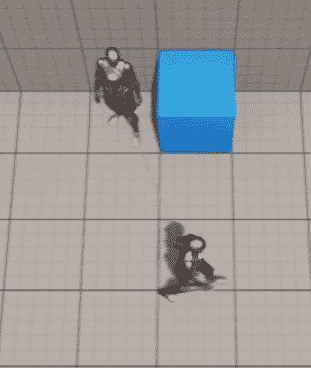
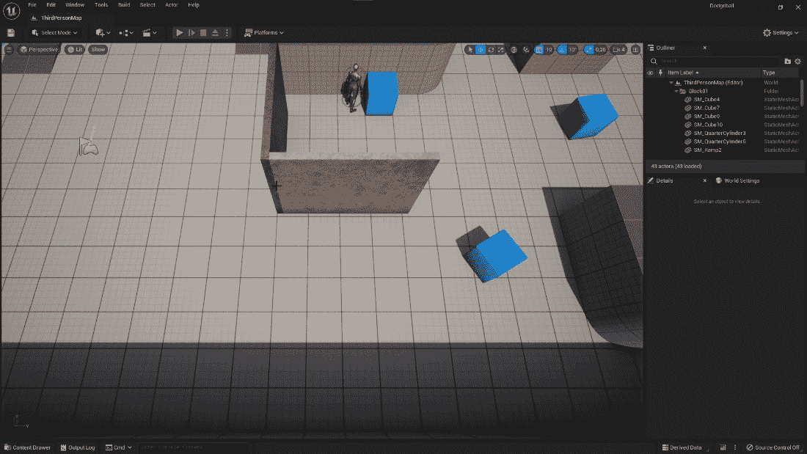
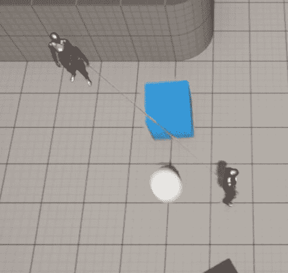
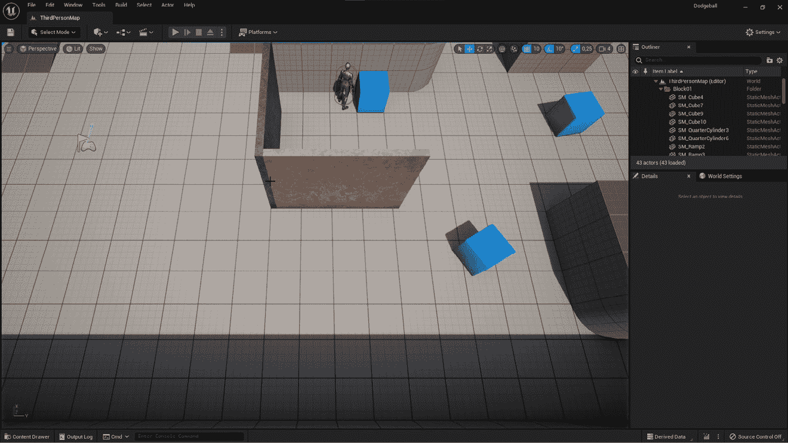
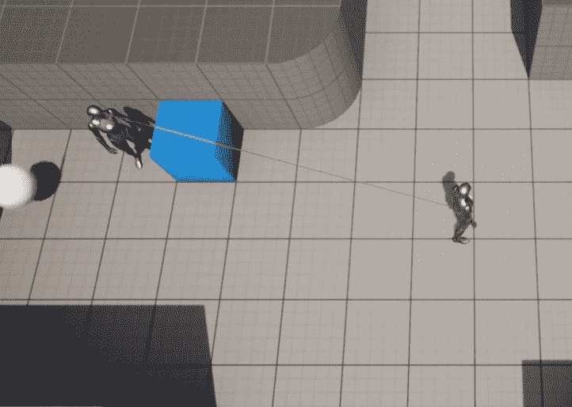

# 第七章：与 UE5 工具一起工作

在上一章中，我们学习了 UE5 中剩余的碰撞相关概念，例如碰撞事件、对象类型、物理模拟和碰撞组件。我们学习了如何使对象相互碰撞，改变它们对不同碰撞通道的响应，以及如何创建碰撞预设、生成演员和使用计时器。

在本章中，我们将探讨几个 UE5 工具，这些工具将允许你轻松地将逻辑从一个项目移动到另一个项目，并保持你的项目结构良好和组织有序，这将在长期内使你的生活更加轻松，并使你的团队成员更容易理解你的工作并在将来对其进行修改。游戏开发是一项极其艰巨的任务，很少是单独完成的，而是团队合作完成的，因此在构建项目时考虑这些因素非常重要。

本章我们将涵盖以下主题：

+   良好的实践 - 松耦合

+   蓝图函数库

+   Actor 组件

+   探索接口

+   蓝图原生事件

# 技术要求

本章的项目可以在本书代码包的 Chapter07 文件夹中找到，代码包可以在此处下载：[`github.com/PacktPublishing/Elevating-Game-Experiences-with-Unreal-Engine-5-Second-Edition`](https://github.com/PacktPublishing/Elevating-Game-Experiences-with-Unreal-Engine-5-Second-Edition)。

# 良好的实践 - 松耦合

我们可以使用蓝图函数库将我们项目中的一些通用函数从特定的演员移动到蓝图函数库，以便它们可以在项目的其他部分逻辑中使用。

我们将使用 Actor 组件将一些演员类源代码的一部分移动到 Actor 组件中，这样我们就可以轻松地在其他项目中使用该逻辑。这将使我们的项目保持松耦合。松耦合是软件工程概念，指的是以这种方式构建项目，即你可以根据需要轻松地删除和添加东西。你应该努力追求松耦合的原因是，如果你想将你项目的一部分用于另一个项目。作为一名游戏开发者，松耦合将使你更容易做到这一点。

一个应用松耦合的实际例子是，如果你有一个玩家角色类，它能够飞行并且有一个包含几个可用物品的库存。你不需要在那个玩家角色类中实现这两个功能的代码，而是将每个功能的逻辑分别实现为独立的 Actor 组件，然后将这些组件添加到类中。这样不仅可以通过简单地添加和删除负责这些功能的 Actor 组件来更容易地添加和删除这个类将执行的事情，还可以让你在其他项目中重用这些 Actor 组件，其中你可能有一个拥有库存或能够飞行的角色。这是 Actor 组件的主要目的之一。

接口，就像演员组件一样，使我们的项目结构更好，组织更有序。

让我们先来谈谈蓝图函数库。

# 蓝图函数库

在 UE5 中，有一个名为`BlueprintFunctionLibary`的类，旨在包含一组不属于任何特定演员的静态函数，这些函数可以在项目的多个部分中使用。

例如，我们之前使用的一些对象，例如`GameplayStatics`对象和`Kismet`库，如`KismetMathLibrary`和`KismetSystemLibrary`，都是蓝图函数库。这些库包含可以在项目的任何部分使用的函数。

在我们的项目中，至少有一个我们创建的函数可以被移动到蓝图函数库：在`EnemyCharacter`类中定义的`CanSeeActor`函数。

在本章的第一个练习中，我们将创建一个蓝图函数库，以便我们可以将`CanSeeActor`函数从`EnemyCharacter`类移动到`BlueprintFunctionLibrary`类。

## 练习 7.01 – 将`CanSeeActor`函数移动到蓝图函数库

在这个练习中，我们将把为`EnemyCharacter`类创建的`CanSeeActor`函数移动到蓝图函数库。

以下步骤将帮助您完成此练习：

1.  打开 Unreal 编辑器。

1.  在**内容浏览器**区域内*右键单击*并选择**新建 C++类**。

1.  将**BlueprintFunctionLibrary**作为此 C++类的父类（您可以通过滚动到面板底部找到它）。

1.  将新的 C++类命名为`DodgeballFunctionLibrary`。

1.  在 Visual Studio 中生成类的文件后，打开它们并关闭编辑器。

1.  在`DodgeballFunctionLibrary`的头文件中，添加一个名为`public`的函数声明`CanSeeActor`。此函数将与我们在`EnemyCharacter`类中创建的函数类似；然而，将有一些差异。

新的`CanSeeActor`函数将是`static`的，将返回`bool`类型，并将接收以下参数：

+   一个`const UWorld* World`属性，我们将用它来访问`Line Trace`函数。

+   一个`FVector Location`属性，我们将用它作为检查是否可以看到目标演员的演员的位置。

+   一个`const AActor* TargetActor`属性，它将是我们要检查可见性的演员。

+   一个`TArray<const AActor*> IgnoreActors`属性，它将指定在`Line Trace`函数期间应忽略的演员。此属性可以有一个空数组作为默认参数：

    ```cpp
    public:
    // Can we see the given actor
    static bool CanSeeActor(
    const UWorld* World,
    FVector Location,
    const AActor* TargetActor,
    TArray<const AActor*> IgnoreActors = TArray<const AActor*>());
    ```

1.  在类的源文件中创建此函数的实现，并将`EnemyCharacter`类版本的实现复制到这个新类中。完成这些后，对实现进行以下修改：

    +   将`Line Trace`的`Start`位置值更改为`Location`参数：

        ```cpp
        // Where the Line Trace starts and ends
        FVector Start = Location;
        ```

    +   而不是忽略这个角色（使用 `this` 指针）和 `TargetActor`，使用 `FCollisionQueryParams` 的 `AddIgnoredActors` 函数忽略整个 `IgnoreActors` 数组，并将该数组作为参数发送：

        ```cpp
        FCollisionQueryParams QueryParams;
        // Ignore the actors specified
        QueryParams.AddIgnoredActors(IgnoreActors);
        ```

    +   将对 `GetWorld` 函数的两个调用都替换为接收到的 `World` 参数：

        ```cpp
        // Execute the Line Trace
        World->LineTraceSingleByChannel(Hit, Start, End, Channel, 
          QueryParams);
        // Show the Line Trace inside the game
        DrawDebugLine(World, Start, End, FColor::Red);
        ```

    +   在 `DodgeballFunctionLibrary` 类的顶部添加必要的包含，如下面的代码片段所示：

        ```cpp
        #include "Engine/World.h"
        #include "DrawDebugHelpers.h"
        #include "CollisionQueryParams.h"
        ```

1.  一旦你在 `DodgeballFunctionLibrary` 中创建了 `CanSeeActor` 函数的新版本，转到我们的 `EnemyCharacter` 类并做出以下更改：

    +   删除 `CanSeeActor` 函数的声明和实现，分别在头文件和源文件中。

    +   由于我们不再需要那个文件，删除 `DrawDebugHelpers` 包含：

        ```cpp
        // Remove this line
        #include "DrawDebugHelpers.h"
        ```

    +   添加对 `DodgeballFunctionLibrary` 的包含：

        ```cpp
        #include "DodgeballFunctionLibrary.h"
        ```

    +   在类的 `LookAtActor` 函数中，在调用 `CanSeeActor` 函数的 `if` 语句之前，声明一个 `const TArray<const AActor*> IgnoreActors` 变量，并将其设置为 `this` 指针和 `TargetActor` 参数：

        ```cpp
        const TArray<const AActor*> IgnoreActors = {this, 
          TargetActor};
        ```

注意

在 Visual Studio 中引入前面的代码片段可能会给你一个 IntelliSense 错误。你可以安全地忽略它，因为你的代码应该没有问题地编译。

1.  将现有的对 `CanSeeActor` 函数的调用替换为我们刚刚创建的函数，通过发送以下参数：

    +   当前世界，通过 `GetWorld` 函数

    +   使用 `SightSource` 组件的位置，通过其 `GetComponentLocation` 函数

    +   `TargetActor` 参数

    +   我们刚刚创建的 `IgnoreActors` 数组：

        ```cpp
        if (UDodgeballFunctionLibrary::CanSeeActor(
          GetWorld(),
          SightSource->GetComponentLocation(),
          TargetActor,
          IgnoreActors))
        ```

现在你已经做了所有这些更改，编译你的代码，打开你的项目，并验证 `EnemyCharacter` 类在四处走动时仍然看着玩家，只要它在敌对角色的视野内，如以下截图所示：



图 7.1 – 敌对角色仍然在看着玩家角色

这样就结束了我们的练习。我们将 `CanSeeActor` 函数放在了蓝图函数库中，现在可以将其用于需要相同类型功能的其他角色。

我们项目的下一步将是学习更多关于角色组件以及我们如何利用它们的知识。让我们看看。 

# 角色组件

正如我们在本书的前几章中看到的，角色是创建 UE5 中逻辑的主要方式。然而，我们也看到角色可以包含多个角色组件。

角色组件是对象，可以添加到角色中，并且可以具有多种类型的功能，例如负责角色的库存或使角色飞行。角色组件必须始终属于并存在于一个角色中，这被称为它们的 **所有者**。

有几种不同类型的现有角色组件。以下是一些例子：

+   仅代码的 Actor 组件，它们在 actor 内部充当自己的类。它们有自己的属性和函数，可以与其所属的 Actor 交互，也可以被 Actor 交互。

+   网格组件，用于绘制多种类型的网格对象（静态网格、骨骼网格等）。

+   碰撞组件，用于接收和生成碰撞事件。

+   摄像机组件。

这让我们有了两种向我们的 Actor 添加逻辑的主要方法：直接在`Actor`类中或通过`Actor`组件。为了遵循良好的软件开发实践，即松耦合（如前所述），你应该尽可能使用 Actor 组件，而不是将逻辑直接放在 Actor 中。让我们通过一个实际例子来看看 Actor 组件的有用性。

假设你正在制作一个游戏，其中包含玩家角色和敌人角色，它们都有健康值，玩家角色必须与敌人战斗，敌人也可以反击。如果你必须实现健康逻辑，包括获得健康、失去健康和跟踪角色的健康，你有两个选择：

+   你可以在基础角色类中实现健康逻辑，该类既是玩家角色类也是敌人角色类的继承者。

+   你可以在 Actor 组件中实现健康逻辑，并将该组件分别添加到玩家角色和敌人角色类中。

有几个原因说明第一个选项不是好的选择，但主要原因是这个：如果你想在两个角色类（例如，耐力，这将限制角色的攻击强度和频率）中添加另一段逻辑，使用基类的方法就不会是一个可行的选择。鉴于在 UE5 中，C++类只能从一个类继承，并且没有多重继承这样的东西，这将非常难以管理。随着你决定向你的项目中添加更多逻辑，这也会变得更加复杂和难以管理。

话虽如此，当你在项目中添加可以封装在单独组件中的逻辑时，允许你实现松耦合（如前所述），你应该始终这样做。

现在，让我们创建一个新的 Actor 组件，该组件将负责跟踪演员的健康状况，以及获得和失去健康。

## 练习 7.02 – 创建 HealthComponent Actor 组件

在这个练习中，我们将创建一个新的演员组件，该组件负责获得、失去和跟踪演员的健康（其所有者）。

为了让玩家失去健康，我们必须让玩家角色失去健康，并在健康耗尽时结束游戏。我们希望将此逻辑放在 actor 组件中，这样我们就可以轻松地将所有这些与健康相关的逻辑添加到其他 actor 中，如果需要的话。

以下步骤将帮助你完成练习：

1.  打开编辑器并创建一个新的 C++ 类，其父类将是 `ActorComponent` 类。它的名字将是 `HealthComponent`。

1.  一旦创建了此类并且其文件已在 Visual Studio 中打开，转到其头文件并添加一个受保护的 `float` 属性名为 `Health`，它将跟踪所有者的当前健康点数。其默认值可以设置为所有者开始游戏时的健康点数。在这种情况下，我们将将其初始化为 `100` 健康点数：

    ```cpp
    // The Owner's initial and current amount health 
    // points
    UPROPERTY(EditDefaultsOnly, Category = Health)
    float Health = 100.f;
    ```

1.  为负责从其所有者那里移除健康的函数创建一个声明。这个函数应该是 `public` 的；不返回任何内容；接收一个 `float Amount` 属性作为输入，该属性表示所有者应该失去多少健康点数；并且被命名为 `LoseHealth`：

    ```cpp
    // Take health points from its Owner
    void LoseHealth(float Amount);
    ```

现在，在类的源文件中，让我们首先通知它它永远不应该使用 `Tick` 事件，这样它的性能可以略有提高。

1.  在类的构造函数中将 `bCanEverTick` 属性的值更改为 `false`：

    ```cpp
    PrimaryComponentTick.bCanEverTick = false;
    ```

1.  为我们的 `LoseHealth` 函数创建实现，我们将首先从我们的 `Health` 属性中移除 `Amount` 参数的值：

    ```cpp
    void UHealthComponent::LoseHealth(float Amount)
    {
      Health -= Amount;
    }
    ```

1.  现在，在同一个函数中，我们将检查当前的健康量是否小于或等于 `0`，这意味着它已经耗尽健康点数（*已死亡或被摧毁*）：

    ```cpp
    if (Health <= 0.f)
    {
    }
    ```

1.  如果 `if` 语句为真，我们将执行以下操作：

    +   将 `Health` 属性设置为 `0` 以确保我们的所有者没有负健康点数：

        ```cpp
        Health = 0.f;
        ```

    +   与我们在 *第六章* *设置碰撞对象* 中创建 `VictoryBox` 类时一样退出游戏：

        ```cpp
        UKismetSystemLibrary::QuitGame(this,
                                      nullptr,
                                      EQuitPreference::Quit,
                                      true);
        ```

    +   不要忘记包含 `KismetSystemLibrary` 对象：

        ```cpp
        #include "Kismet/KismetSystemLibrary.h"
        ```

完成这个逻辑后，每当任何具有 `HealthComponent` 的演员耗尽健康时，游戏将结束。这并不是我们想要的 **躲避球** 游戏中的行为。然而，当我们在本章后面讨论接口时，我们会将其更改。

在下一个练习中，我们将对项目中的某些类进行必要的修改，以适应我们新创建的 `HealthComponent`。

## 练习 7.03 – 集成 HealthComponent Actor 组件

在这个练习中，我们将修改我们的 `DodgeballProjectile` 类，使其在与玩家角色接触时对其造成伤害，以及修改 `DodgeballCharacter` 类，使其具有 `HealthComponent`。

在 Visual Studio 中打开 `DodgeballProjectile` 类的文件并做出以下修改：

1.  在类的头文件中，添加一个受保护的 `float` 属性名为 `Damage`，并将其默认值设置为 `34`，这样我们的玩家角色在被击中三次后就会失去所有的健康点数。这个属性应该是一个 `UPROPERTY`，并带有 `EditAnywhere` 标签，这样你就可以轻松地在它的蓝图类中更改其值：

    ```cpp
    // The damage the dodgeball will deal to the player's 
      character
    UPROPERTY(EditAnywhere, Category = Damage)
    float Damage = 34.f;
    ```

在类的源文件中，我们需要对 `OnHit` 函数进行一些修改。

1.  由于我们将使用`HealthComponent`类，因此我们必须为它添加`include`语句：

    ```cpp
    #include "HealthComponent.h"
    ```

1.  在`if`语句中，我们对`DodgeballCharacter`从`OtherActor`属性进行的现有转换，我们在*步骤 17*的*练习 6.01 – 创建躲避球类*中执行，应该在该`if`语句之前执行，并将其保存到变量中。然后，你应该检查该变量是否为`nullptr`。我们这样做是为了在`if`语句中访问玩家角色的`HealthComponent`：

    ```cpp
    ADodgeballCharacter* Player = 
      Cast<ADodgeballCharacter>(OtherActor);
    if (Player != nullptr)
    {
    }
    ```

1.  如果`if`语句为真（即，如果我们击中的是玩家的角色），我们想要访问该角色的`HealthComponent`并减少角色的健康值。要访问`HealthComponent`，我们必须调用角色的`FindComponentByClass`函数，并传递`UHealthComponent`类作为模板参数（以指示我们想要访问的组件的类）：

    ```cpp
    UHealthComponent* HealthComponent = Player->
    FindComponentByClass<UHealthComponent>();
    ```

注意

包含在`Actor`类中的`FindComponentByClass`函数将返回对演员包含的特定类演员组件的引用（s）。如果函数返回`nullptr`，则表示演员没有该类的`Actor`组件。

你也可能在`Actor`类中找到有用的`GetComponents`函数，该函数将返回该演员中所有`Actor`组件的列表。

1.  之后，检查`HealthComponent`是否为`nullptr`。如果不是，我们将调用它的`LoseHealth`函数，并将`Damage`属性作为参数传递：

    ```cpp
    if (HealthComponent != nullptr)
    {
      HealthComponent->LoseHealth(Damage);
    }
    Destroy();
    ```

1.  确保在执行`HealthComponent`的空检查之后调用现有的`Destroy`函数，如前一个代码片段所示。

在我们完成这个练习之前，我们需要对我们的`DodgeballCharacter`类进行一些修改。在 Visual Studio 中打开类的文件。

1.  在类的头文件中，添加一个名为`HealthComponent`的`private`属性，类型为`UhealthComponent*`：

    ```cpp
    class UHealthComponent* HealthComponent;
    ```

1.  在类的源文件中，向`HealthComponent`类添加一个`include`语句：

    ```cpp
    #include "HealthComponent.h"
    ```

1.  在类的构造函数末尾，使用`CreateDefaultSubobject`函数创建`HealthComponent`并将其命名为`HealthComponent`：

    ```cpp
    HealthComponent = 
      CreateDefaultSubobject<UHealthComponent>(
      TEXT("Health 
      Component"));
    ```

一旦完成所有这些更改，编译你的代码并打开编辑器。当你玩游戏时，如果你让你的玩家角色被躲避球击中三次，你会注意到游戏会突然停止，正如预期的那样：


图 7.2 – 敌对角色向玩家角色投掷躲避球

一旦游戏停止，它将看起来如下所示：



图 7.3 – 玩家角色健康值耗尽且游戏停止后的编辑器

这样就完成了这个练习。你现在知道如何创建角色组件以及如何访问角色的角色组件。这是使你的游戏项目更易于理解和结构化的一个非常重要的步骤，所以做得很好。

现在我们已经了解了角色组件，让我们学习另一种使我们的项目更有结构和组织的方式：通过使用接口。

# 探索接口

由于其他编程语言，如 Java，已经存在接口，所以你可能已经了解接口。如果你了解，它们在 UE5 中的工作方式非常相似，但如果你不了解，让我们以我们创建的 `HealthComponent` 类为例，看看它们是如何工作的。

正如你在之前的练习中看到的，当 `HealthComponent` 类的 `Health` 属性达到 `0` 时，该组件将简单地结束游戏。然而，我们不想每次一个角色的健康点耗尽时都发生这种情况：一些角色可能只是被销毁，一些可能通知另一个角色它们已经耗尽健康点，等等。我们希望每个角色都能确定它们健康点耗尽时会发生什么。但我们应该如何处理这个问题呢？

理想情况下，我们会调用属于 `HealthComponent` 类所有者的特定函数，然后该所有者将决定如何处理所有者健康点耗尽的事实。但考虑到我们的所有者可以是任何类，只要它继承自 `Actor` 类，那么你应该在哪个类中实现这个函数呢？正如我们在本章开头讨论的那样，拥有只负责这一功能的类会很快变得难以管理。幸运的是，接口解决了这个问题。

接口是包含了一组函数的类，如果一个对象实现了该接口，那么它必须拥有这些函数。这本质上是一个对象签订的合同，表明它将实现该接口上所有存在的函数。然后，你可以简单地检查一个对象是否实现了特定的接口，并调用该对象在接口中定义的函数实现。

在我们的特定情况下，我们希望有一个接口，其中包含一个当对象健康点耗尽时将被调用的函数，这样我们的 `HealthComponent` 类就可以检查其所有者是否实现了该接口，然后从接口中调用该函数。这将使我们能够轻松指定每个角色在健康点耗尽时的行为：一些角色可能只是被销毁，其他可能触发一个游戏内事件，还有一些可能只是结束游戏（这是我们的玩家角色的案例）。

然而，在我们创建第一个接口之前，我们应该稍微谈谈蓝图原生事件。

# 蓝图原生事件

当在 C++ 中使用 `UFUNCTION` 宏时，你只需将 `BlueprintNativeEvent` 标签添加到该宏中，就可以将一个函数转换成蓝图原生事件。

那么，什么是蓝图原生事件呢？它是在 C++中声明的可以具有默认行为的事件，这个默认行为也在 C++中定义，但可以在蓝图中覆盖。让我们通过使用带有`BlueprintNativeEvent`标记的`UFUNCTION`宏声明一个名为`MyEvent`的函数来声明一个名为`MyEvent`的蓝图原生事件，然后是虚拟的`MyEvent_Implementation`函数：

```cpp
UFUNCTION(BlueprintNativeEvent)
void MyEvent();
virtual void MyEvent_Implementation();
```

你必须声明这两个函数的原因是，第一个是蓝图签名，它允许你在蓝图中覆盖事件，而第二个是 C++签名，它允许你在 C++中覆盖事件。

C++签名只是事件名称后跟`_Implementation`，它应该始终是一个`virtual`函数。鉴于你在 C++中声明了此事件，为了实现其默认行为，你必须实现`MyEvent_Implementation`函数，而不是`MyEvent`函数（那个应该保持不变）。要调用蓝图原生事件，你可以简单地调用正常函数而不带`_Implementation`后缀；在这种情况下，`MyEvent()`。

在下一个练习中，我们将学习如何在实践中使用蓝图原生事件，我们将创建一个新的接口。

## 练习 7.04 – 创建 HealthInterface 类

在这个练习中，我们将创建一个负责处理对象健康点耗尽时行为的接口。

要完成这个任务，请按照以下步骤操作：

1.  打开编辑器并创建一个新的从`Interface`继承的 C++类（在可滚动菜单中称为`Unreal Interface`），并将其命名为`HealthInterface`。

1.  一旦类的文件被生成并在 Visual Studio 中打开，请转到新创建的类的头文件。你会注意到生成的文件有两个类 – `UHealthInterface`和`IHealthInterface`。

1.  这些将在检查对象是否实现了接口并调用其函数时组合使用。然而，你应该只向以`I`开头（在这个例子中是`IHealthInterface`）的类中添加函数声明。添加一个名为`OnDeath`的`public`蓝图原生事件，它不返回任何内容，也不接收任何参数。当对象健康点耗尽时，将调用此函数：

    ```cpp
    UFUNCTION(BlueprintNativeEvent, Category = Health)
    void OnDeath();
    virtual void OnDeath_Implementation() = 0;
    ```

注意，`OnDeath_Implementation`函数声明需要其自己的实现。然而，接口不需要实现该函数，因为它将简单地是空的。为了通知编译器这个类中没有该函数的实现，我们在其声明末尾添加了`= 0`。

1.  前往`DodgeballCharacter`类的头文件。我们希望这个类实现我们新创建的`HealthInterface`，但我们该如何做到这一点呢？我们首先要做的是包含`HealthInterface`类。确保你在`.generated.h` `include`语句之前包含它：

    ```cpp
    // Add this include
    #include "HealthInterface.h"
    #include "DodgeballCharacter.generated.h"
    ```

1.  然后，将头文件中使`DodgeballCharacter`类继承自`Character`类的行替换为以下行，这将使此类实现`HealthInterface`：

    ```cpp
    class ADodgeballCharacter : public ACharacter, public 
      IHealthInterface
    ```

1.  接下来，我们必须在`DodgeballCharacter`类中实现`OnDeath`函数。为此，添加一个`OnDeath_Implementation`函数的声明，该函数覆盖了接口的 C++签名。这个函数应该是`public`的。要覆盖一个`virtual`函数，你必须在其声明末尾添加`override`关键字：

    ```cpp
    virtual void OnDeath_Implementation() override;
    ```

1.  在这个函数的实现中，在类的源文件内，简单地退出游戏，就像在`HealthComponent`类中做的那样：

    ```cpp
    void ADodgeballCharacter::OnDeath_Implementation()
    {
      UKismetSystemLibrary::QuitGame(this,
                                    nullptr,
                                    EQuitPreference::Quit,
                                    true);
    }
    ```

1.  由于我们现在使用`KismetSystemLibrary`，我们不得不包含它：

    ```cpp
    #include "Kismet/KismetSystemLibrary.h"
    ```

1.  现在，我们必须转到我们的`HealthComponent`类的源文件。由于我们将不再使用`KismetSystemLibrary`，而是使用`HealthInterface`，所以将第一个类的`include`语句替换为第二个类的`include`语句：

    ```cpp
    // Replace this line
    #include "Kismet/KismetSystemLibrary.h"
    // With this line
    #include "HealthInterface.h"
    ```

1.  然后，更改负责在所有者健康点耗尽时退出游戏的逻辑。我们不想这样做，而是想检查所有者是否实现了`HealthInterface`，如果是，就调用其`OnDeath`函数的实现。删除现有的`QuitGame`函数调用：

    ```cpp
    // Remove this
    UKismetSystemLibrary::QuitGame(this,
                                  nullptr,
                                  EQuitPreference::Quit,
                                  true);
    ```

1.  要检查一个对象是否实现了特定的接口，我们可以调用该对象的`Implements`函数，使用接口的类作为模板参数。在这个函数中应该使用的接口类是前面带有`U`前缀的类：

    ```cpp
    if (GetOwner()->Implements<UHealthInterface>())
    {
    }
    ```

1.  由于我们将使用属于`Actor`类的方法，我们还需要包含它：

    ```cpp
    #include "GameFramework/Actor.h"
    ```

如果这个`if`语句为真，这意味着我们的所有者实现了`HealthInterface`。在这种情况下，我们将想调用其`OnDeath`函数的实现。

1.  要这样做，通过接口的类（这次是前面带有`I`前缀的类）来调用它。你想要调用的接口内的函数是`Execute_OnDeath`（注意，你应在接口内调用的函数将始终是其正常名称前缀为`Execute_`）。这个函数必须至少接收一个参数，即将被调用的对象和实现该接口的对象；在这种情况下，所有者：

    ```cpp
    if (GetOwner()->Implements<UHealthInterface>())
    {
      IHealthInterface::Execute_OnDeath(GetOwner());
    }
    ```

注意

如果你的接口函数接收参数，你可以在前一步提到的第一个参数之后在函数调用中发送它们。例如，如果我们的`OnDeath`函数接收一个`int`属性作为参数，你将使用`IHealthInterface::Execute_OnDeath(GetOwner(), 5)`来调用它。

在向接口添加新函数并调用`Execute_ 版本`后第一次尝试编译代码时，你可能会得到一个`Intellisense`错误。你可以安全地忽略这个错误。

一旦你完成所有这些更改，编译你的代码并打开编辑器。当你玩游戏时，尝试让角色被三个躲避球击中：



图 7.4 – 敌人角色向玩家角色投掷躲避球

如果游戏结束后，那么这意味着我们所有的更改都成功了，游戏的逻辑保持不变：



图 7.5 – 玩家角色生命值耗尽且游戏停止后的编辑器

有了这些，我们就完成了这个练习。你现在知道如何使用接口。我们刚刚做出的改变的优点是，我们现在可以有其他失去生命值的演员，以及通过使用`Health`接口来指定它们生命值耗尽时会发生什么。

现在，我们将完成一个活动，我们将把与`LookAtActor`函数相关的所有逻辑移动到它自己的 Actor 组件中，并使用它来替换我们创建的`SightSource`组件。

## 活动七.01 – 将`LookAtActor`逻辑移动到 Actor 组件

在这个活动中，我们将把与`LookAtActor`函数相关的所有逻辑，在`EnemyCharacter`类内部，移动到它自己的 Actor 组件中（类似于我们将`CanSeeActor`函数移动到蓝图函数库）。这样，如果我们想让一个演员（不是`EnemyCharacter`）看另一个演员，我们只需简单地将此组件添加到它上面。

按照以下步骤完成此活动：

1.  打开编辑器并创建一个新的 C++类，从`SceneComponent`继承，命名为`LookAtActorComponent`。

转到类的文件，这些文件在 Visual Studio 中是打开的。

1.  前往其头文件，并为`LookAtActor`函数添加一个声明，该函数应该是`protected`的，返回`bool`，并且不接受任何参数。

注意

虽然`EnemyCharacter`的`LookAtActor`函数接收了`AActor* TargetActor`参数，但这个 Actor 组件将拥有其`TargetActor`作为类属性，因此我们不需要将其作为参数接收。

1.  添加一个名为`TargetActor`的受保护`AActor*`属性。此属性将代表我们想要看的演员。

1.  添加一个名为`bCanSeeTarget`的受保护`bool`属性，默认值为`false`，它将指示是否可以看到`TargetActor`。

1.  添加一个声明为`FORCEINLINE`的公共函数，如*第六章*中所述，*设置碰撞对象*，名为`SetTarget`，该函数不返回任何内容，并接收`AActor* NewTarget`作为参数。此函数的实现将简单地设置`TargetActor`属性为`NewTarget`属性的值。

1.  为一个名为`CanSeeTarget`的公共`FORCEINLINE`函数添加声明，该函数将是`const`，返回`bool`类型，并且不接受任何参数。此函数的实现将简单地返回`bCanSeeTarget`属性的值。

现在，转到类的源文件。

1.  在类的`TickComponent`函数中，将`bCanSeeTarget`属性的值设置为`LookAtActor`函数调用的返回值。

1.  添加一个空的`LookAtActor`函数实现，并将`EnemyCharacter`类的`LookAtActor`函数实现复制到`LookAtActorComponent`的实现中。

1.  对`LookAtActorComponent`类的`LookAtActor`函数实现进行以下修改：

    1.  将`IgnoreActors`数组的第一个元素更改为 Actor 组件的所有者。

    1.  将`CanSeeActor`函数调用的第二个参数更改为此组件的位置。

    1.  将`Start`属性的值更改为所有者的位置。

最后，将调用`SetActorRotation`函数替换为调用所有者的`SetActorRotation`函数。

1.  由于我们对`LookAtActor`函数的实现进行了修改，我们需要在我们的`LookAtActorComponent`类中添加一些包含，并从我们的`EnemyCharacter`类中删除一些包含。从`EnemyCharacter`类中删除对`KismetMathLibrary`和`DodgeballFunctionLibrary`的包含，并将它们添加到`LookAtActorComponent`类中。

我们还需要添加对`Actor`类的包含，因为我们将会访问该类所属的几个函数。

现在，让我们对我们的`EnemyCharacter`类进行一些进一步的修改：

1.  在其头文件中，删除`LookAtActor`函数的声明。

1.  将`SightSource`属性替换为名为`LookAtActorComponent`的`UlookAtActorComponent*`类型的属性。

1.  在类的源文件中，添加对`LookAtActorComponent`类的包含。

1.  在类的构造函数内部，将`SightSource`属性的引用替换为`LookAtActorComponent`属性的引用。此外，`CreateDefaultSubobject`函数的模板参数应该是`ULookAtActorComponent`类，其参数应该是`“Look At Actor Component”`。

1.  删除类的`LookAtActor`函数实现。

1.  在类的`Tick`函数中，删除创建`PlayerCharacter`属性的代码行，并将该行代码添加到类`BeginPlay`函数的末尾。

1.  在这一行之后，调用`LookAtActorComponent`的`SetTarget`函数，并将`PlayerCharacter`属性作为参数发送。

1.  在类的`Tick`函数内部，将`bCanSeePlayer`属性的值设置为`LookAtActorComponent`的`CanSeeTarget`函数调用的返回值，而不是`LookAtActor`函数调用的返回值。

现在，在完成此活动之前，我们只剩最后一步要做了。

1.  关闭编辑器（如果你已经打开的话），在 Visual Studio 中编译你的更改，然后打开编辑器，打开`BP_EnemyCharacter`蓝图。找到`LookAtActorComponent`并将其位置更改为`(10, 0, 80)`。

**预期输出**：



图 7.6 – 敌对角色观察玩家角色的功能仍然有效

有了这些，我们就结束了这次活动。你已经将部分演员逻辑重构为 Actor 组件，以便你在项目的其他部分或你自己的其他项目中重用它。

注意

本活动的解决方案可以在[`github.com/PacktPublishing/Elevating-Game-Experiences-with-Unreal-Engine-5-Second-Edition/tree/main/Activity%20solutions`](https://github.com/PacktPublishing/Elevating-Game-Experiences-with-Unreal-Engine-5-Second-Edition/tree/main/Activity%20solutions)找到。

# 摘要

你现在了解了几种实用工具，这些工具将帮助你使你的项目更有条理，并允许你重用你所制作的东西。

你学习了如何创建蓝图函数库，创建 Actor 组件，并使用它们来重构项目中现有的逻辑，以及如何创建接口并从实现特定接口的对象中调用函数。总的来说，这些新主题将允许你在同一项目或另一个项目中重构和重用你在项目中编写的所有代码。

在下一章中，我们将探讨 UMG，即 UE5 创建用户界面的系统，并学习如何创建用户界面。
