# 第九章：添加音频-视觉元素

在上一章中，我们学习了游戏 UI 以及如何将用户界面（也称为小部件）创建并添加到屏幕上。

在本章中，我们将学习如何将音频和粒子效果添加到我们的游戏中。这两个方面都将提高我们游戏的质量，并为玩家提供更加沉浸式的体验。

视频游戏中的声音可以以音效（也称为 SFX）或音乐的形式出现。音效使你周围的世界更加逼真和生动，而音乐有助于为你的游戏设定基调。这两个方面对你的游戏都非常重要。

在像**反恐精英：全球攻势**（**CS: GO**）这样的竞技游戏中，声音同样非常重要，因为玩家需要听到他们周围的声音，如枪声和脚步声，以及声音来自哪个方向，以便尽可能多地收集关于周围环境的信息。

在本章中，我们将涵盖以下主题：

+   UE5 中的音频

+   声音衰减

+   理解粒子系统

+   探索关卡设计

+   额外功能

粒子效果之所以重要，原因与音效相同：它们使你的游戏世界更加逼真和沉浸。

让我们从这个章节开始，学习 UE5 中音频的工作原理。

# 技术要求

本章的项目可以在本书代码包的 Chapter09 文件夹中找到，代码包可以在此处下载：[`github.com/PacktPublishing/Elevating-Game-Experiences-with-Unreal-Engine-5-Second-Edition`](https://github.com/PacktPublishing/Elevating-Game-Experiences-with-Unreal-Engine-5-Second-Edition)。

# UE5 中的音频

任何游戏的一个基本组成部分是声音。声音使你的游戏更加逼真和沉浸，这将为你的玩家提供更好的体验。视频游戏通常有两种类型的声音：

+   2D 声音

+   3D 声音

2D 声音不考虑听者的距离和方向，而 3D 声音的音量可以更高或更低，并且可以根据玩家的位置向右或左偏移。2D 声音通常用于音乐，而 3D 声音通常用于音效。主要的声音文件类型是`.wav`和`.mp3`。

这里有一些与 UE5 中音频相关的资产和类：

+   `声音基础`：表示包含音频的资产。这个类主要用于 C++和蓝图来引用可以播放的音频文件。

+   `声音波`：表示已导入 UE5 的音频文件。它继承自`声音基础`。

+   `声音提示`：一种可以包含与衰减（随着听者距离的变化音量如何变化）、循环、声音混合以及其他音频相关功能的音频资产。它继承自`声音基础`。

+   `声音类别`：一个允许你将音频文件分组并管理它们的一些设置（如音量和音调）的资产。例如，将所有与音效相关的声音分组到 `SFX` 声音类别中，所有角色对话分组到 `Dialog` 声音类别中，等等。

+   `声音衰减`：一个允许你指定 3D 声音如何行为的资产；例如，在哪个距离开始降低音量，在哪个距离变得不可闻（听不到），随着距离的增加，其音量是线性变化还是指数变化，等等。

+   `音频组件`：一个允许你管理音频文件及其属性的 actor 组件。这对于设置连续播放声音（如背景音乐）非常有用。

注意

UE5 有一个新的音频系统称为 **元声音**，它允许开发者使用 **数字信号处理**（**DSP**）来创建声音。由于这个主题超出了本书的范围，我们不会介绍这个系统。如果你想了解更多关于这个系统及其工作原理的信息，你可以通过访问

[`docs.unrealengine.com/5.0/en-US/AudioFeatures/MetaSounds/`](https://docs.unrealengine.com/5.0/en-US/AudioFeatures/MetaSounds/).

在 UE5 中，我们可以像导入其他任何资产一样导入现有声音：要么通过从 Windows 文件资源管理器拖动文件到 **内容浏览器** 区域，要么通过在 **内容浏览器** 区域中点击 **导入** 按钮。我们将在下一个练习中这样做。

## 练习 9.01 – 导入音频文件

在这个练习中，你将从你的计算机中导入一个现有的声音文件到 UE5。当躲避球从表面上弹跳时，将播放此音频文件。

注意

如果你没有可用的音频文件（无论是 `.mp3` 还是 `.wav` 文件）来完成此练习，你可以下载在 [`www.freesoundeffects.com/free-track/bounce-1-468901/`](https://www.freesoundeffects.com/free-track/bounce-1-468901/) 可用的 `.mp3` 或 `.wav` 文件。

将此文件保存为 `BOUNCE.wav`。

一旦你有了音频文件，请按照以下步骤操作：

1.  打开编辑器。

1.  前往 `音频` 中的 `内容` 文件夹：

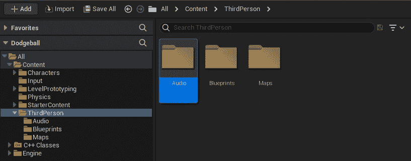

图 9.1 – 内容浏览器区域中的音频文件夹

1.  前往你刚刚创建的 `音频` 文件夹。

1.  将你的音频文件导入此文件夹。你可以通过 *拖动* 音频文件从 **Windows 文件资源管理器** 到 **内容浏览器** 来完成此操作。

1.  完成此操作后，应该会显示一个与你的音频文件同名的新资产，你可以通过点击它来播放：


图 9.2 – 导入的音频文件

1.  打开此资产。你应该会看到许多可编辑的属性。然而，我们将专注于 **声音** 类别中的一些属性：

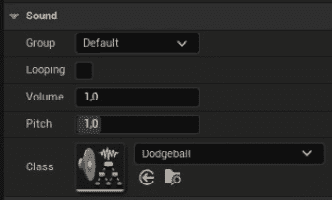

图 9.3 – 声音资产设置

以下属性在 **声音** 类别中可用：

+   **循环**: 在播放时，这个声音是否会循环。

+   **音量**: 这个声音的音量。

+   **音调**: 这个声音的音调。音调越高，频率越高，这个声音的音高也会越高。

+   **类**: 这个声音的声类。

我们将要更改的唯一属性是 `Class` 属性。我们可以使用 UE5 附带的一个现有的 `Sound` 类，但让我们为 `Dodgeball` 游戏创建一个自己的类，以创建一组新的声音供游戏使用。

1.  前往 **内容浏览器** 区域内的 `Audio` 文件夹。

1.  右键单击，转到 `Sound Class` 资产。将此资产重命名为 `Dodgeball`。

1.  打开你导入的声音资产，并设置其 `Dodgeball`：


图 9.4 – 将类属性更改为 Dodgeball 声音类

现在这个导入的声音资产属于一个特定的类，你可以在同一个 `Sound Class` 中分组与躲避球相关的其他声音效果，并通过该 `Sound Class` 编辑它们的属性，包括 `Volume`、`Pitch` 以及许多其他属性。

有了这些，我们可以得出结论。你已经学会了如何将声音导入到你的项目中，以及如何更改它们的基本属性。现在，让我们继续下一个练习，我们将在这个游戏中，每当躲避球从表面上弹跳时播放声音。

## 练习 9.02 – 当躲避球从表面上弹跳时播放声音

在这个练习中，我们将向我们的 `DodgeballProjectile` 类添加必要的功能，以便当躲避球从表面上弹跳时播放声音。

要这样做，请按照以下步骤操作：

1.  关闭编辑器并打开 Visual Studio。

1.  在 `DodgeballProjectile` 类的头文件中，添加一个名为 `BounceSound` 的受保护的 `USoundBase*` 属性。这个属性应该是一个 `UPROPERTY`，并具有 `EditDefaultsOnly` 标签，以便可以在蓝图中进行编辑：

    ```cpp
    // The sound the dodgeball will make when it bounces off of a 
      surface
    UPROPERTY(EditAnywhere, Category = Sound)
    class USoundBase* BounceSound;
    ```

1.  完成这些后，转到 `DodgeballProjectile` 类的源文件，并添加对 `GameplayStatics` 对象的包含：

    ```cpp
    #include "Kismet/GameplayStatics.h"
    ```

1.  然后，在类实现的 `OnHit` 函数的开始处，在将 `DodgeballCharacter` 类进行转换之前，检查我们的 `BounceSound` 是否是一个有效的属性（不同于 `nullptr`）以及 `NormalImpulse` 属性的幅度是否大于 `600` 单位（我们可以通过调用其 `Size` 函数来访问幅度）。

正如我们在*第六章**，设置碰撞对象*中看到的，`NormalImpulse`属性表示击中躲避球后改变躲避球轨迹的力的方向和大小。我们想要检查其大小是否大于某个特定值的原因是，当躲避球开始失去动量并在每秒内弹跳几次时，我们不希望每秒播放`BounceSound`几次；否则，它会产生很多噪音。因此，我们将检查躲避球所受的冲量是否大于这个值，以确保这种情况不会发生。如果这两件事都是真的，我们将调用`GameplayStatics`对象的`PlaySoundAtLocation`方法。这个函数负责播放 3D 声音。它接收五个参数：

+   一个世界上下文对象，我们将作为`this`指针传递。

+   一个`SoundBase`属性，它将是我们的`HitSound`属性。

+   声音的起点，我们将使用`GetActorLocation`函数传递。

+   `VolumeMultiplier`，我们将使用值为`1`。这个值表示当播放声音时音量会高多少或低多少。例如，值为`2`意味着它的音量将是原来的两倍。

+   `PitchMultiplier`，它表示当播放声音时音高会高多少或低多少。我们将通过使用`FMath`对象的`RandRange`函数来传递这个值，该函数接收两个数字作为参数并返回这两个数字之间的随机数。为了随机生成一个介于`0.7`和`1.3`之间的数字，我们将使用这些值作为参数调用这个函数。

看看下面的代码片段：

```cpp
if (BounceSound != nullptr && NormalImpulse.Size() > 600.0f)
{
  UGameplayStatics::PlaySoundAtLocation(this, BounceSound, 
  GetActorLocation(), 1.0f, FMath::RandRange(0.7f, 1.3f));
}
```

注意

负责播放 2D 声音的函数也来自`GameplayStatics`对象，并称为`PlaySound2D`。这个函数将接收与`PlaySoundAtLocation`函数相同的参数，除了第三个参数，即声音的起点。

1.  编译这些更改并打开 Unreal 编辑器。

1.  打开`BP_DodgeballProjectile`蓝图，进入其`BounceSound`属性，找到你导入的`Sound`资产：

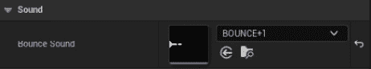

图 9.5 – 将 BounceSound 属性设置为导入的声音

1.  再次播放关卡并进入敌人角色的视线。你应该注意到，每次敌人角色投掷的躲避球击中墙壁或地板（不是玩家角色）时，都会播放不同音高的声音：


图 9.6 – 玩家角色导致敌人角色投掷躲避球

如果发生这种情况，恭喜你 – 你已经成功使用 UE5 播放了声音！如果你听不到声音播放，请确保它是可听见的（它有一个你能听到的音量级别）。

然而，您可能还会注意到，声音始终以相同的音量播放，无论角色与弹跳躲避球的距离如何；声音不是在 3D 中播放，而是在 2D 中播放。要使用 UE5 播放 3D 声音，我们必须了解**声音衰减**资源。

# 声音衰减

要在 UE5 内部播放 3D 声音，您必须创建一个**声音衰减**资源，正如我们之前提到的。一个**声音衰减**资源将允许您指定特定声音如何随着其与听者的距离增加而改变音量。请看以下示例。

打开 Unreal 编辑器，进入`BounceAttenuation`中的`Audio`文件夹：

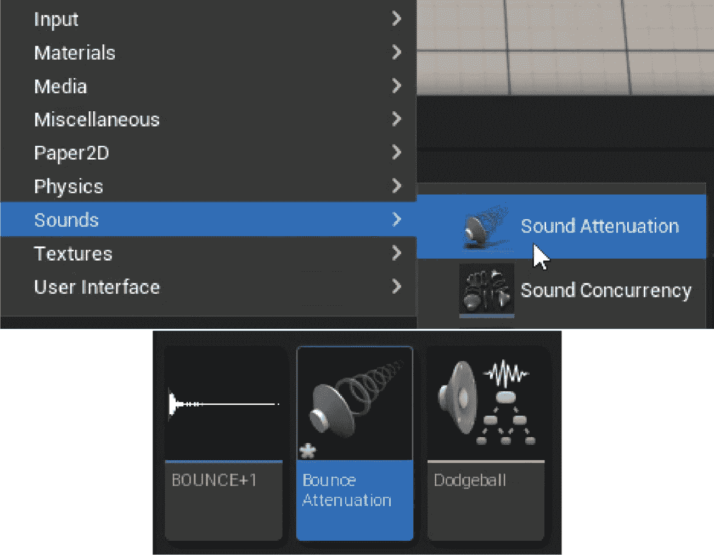

图 9.7 – 创建声音衰减资源

打开这个`BounceAttenuation`资源。

**声音衰减**资源有许多设置；然而，我们主要想关注**衰减距离**部分的一两个设置：

+   `内半径`：这个`float`属性允许我们指定在什么距离上声音将开始降低音量。如果声音在小于此值的距离上播放，音量将不受影响。将此属性设置为`200`单位。

+   `衰减距离`：这个`float`属性允许我们指定在什么距离上我们希望声音变得不可闻。如果声音在大于此值的距离上播放，我们就听不到它。声音的音量将根据其与听者的距离以及它是否更接近`内半径`或`衰减距离`而变化。将此属性设置为`1500`单位：

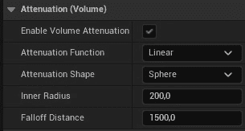

图 9.8 – 声音衰减资源设置

将其想象为围绕玩家的两个圆圈，较小的圆圈是内圆（半径值为`内半径`），较大的圆圈是衰减圆圈（半径值为`衰减距离`）。如果声音起源于内圆内部，它将以全音量播放，而起源于衰减圆圈之外的声音则完全不播放。

注意

您可以在以下位置找到有关**声音衰减**资源的更多信息：[`docs.unrealengine.com/en-US/Engine/Audio/DistanceModelAttenuation`](https://docs.unrealengine.com/en-US/Engine/Audio/DistanceModelAttenuation).

现在您已经了解了**声音衰减**资源，让我们继续下一个练习，我们将把躲避球弹跳时播放的声音转换为 3D 声音。

## 练习 9.03 – 将弹跳声音转换为 3D 声音

在这个练习中，我们将把我们在上一个练习中添加的当手榴弹从地面上弹跳时播放的声音转换成 3D 声音。这意味着当手榴弹从表面弹跳时，它播放的声音的音量将根据其与玩家的距离而变化。我们这样做是为了当手榴弹远离时，声音音量会低，而当它靠近时，音量会高。

要使用我们在上一节中创建的 `BounceAttenuation` 资产，请按照以下步骤操作：

1.  前往 `DodgeballProjectile` 的头文件，并添加一个名为 `BounceSoundAttenuation` 的 `protected` `class USoundAttenuation*` 属性。这个属性应该是一个 `UPROPERTY`，并具有 `EditDefaultsOnly` 标签，以便可以在蓝图中进行编辑：

    ```cpp
    // The sound attenuation of the previous sound
    UPROPERTY(EditAnywhere, Category = Sound)
    class USoundAttenuation* BounceSoundAttenuation;
    ```

1.  前往 `DodgeballProjectile` 类的源文件中 `OnHit` 函数的实现，并将以下参数添加到对 `PlaySoundAtLocation` 函数的调用中：

    +   `StartTime`，我们将传递一个值为 `0` 的值。这个值表示声音开始播放的时间。如果声音持续 2 秒，我们可以通过传递一个值为 `1` 的值，让这个声音从 1 秒处开始播放。我们传递一个值为 `0` 以使声音从开始播放。

    +   `SoundAttenuation`，我们将传递我们的 `BounceSoundAttenuation` 属性：

        ```cpp
        UGameplayStatics::PlaySoundAtLocation(this, BounceSound, 
          GetActorLocation(), 1.0f, 1.0f, 0.0f, 
          BounceSoundAttenuation);
        ```

注意

虽然我们只想传递额外的 `SoundAttenuation` 参数，但我们必须传递所有在它之前的其他参数。

1.  编译这些更改，然后打开编辑器。

1.  打开 `BP_DodgeballProjectile` 蓝图，转到其 `BounceSoundAttenuation` 属性到我们的 `BounceAttenuation` 资产：

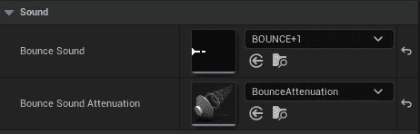

图 9.9 – 将 BounceSoundAttenuation 属性设置为 BounceAttenuation 资产

1.  再次播放关卡并进入敌人角色的视线范围内。你应该会注意到，每次敌人角色扔出的手榴弹击中墙壁或地板时播放的声音，其音量会根据其距离而不同，而且如果手榴弹远离，你将听不到它：


图 9.10 – 玩家角色导致敌人角色扔手榴弹

有了这些，我们可以得出这个练习的结论。你现在知道如何使用 UE5 播放 3D 声音。我们将在下一个练习中为我们的游戏添加背景音乐。

## 练习 9.04 – 为我们的游戏添加背景音乐

在这个练习中，我们将为我们的游戏添加游戏背景音乐。我们将通过创建一个新的具有音频组件的 Actor 来完成此操作，正如我们之前提到的，这对于播放背景音乐是合适的。为了实现这一点，请按照以下步骤操作：

1.  下载位于 [`packt.live/3pg21sQ`](https://packt.live/3pg21sQ) 的音频文件，并将其导入到 **内容浏览器** 区域的 **音频** 文件夹中，就像我们在 *练习 9.01 – 导入音频文件* 中所做的那样。

1.  在 `Actor` 类内部右键单击，作为其父类。将这个新类命名为 `MusicManager`。

1.  当这个类的文件生成并 Visual Studio 自动打开时，关闭编辑器。

1.  在 `MusicManager` 类的头文件中，添加一个新的 `protected` 属性，类型为 `class UAudioComponent*`，名为 `AudioComponent`。将其标记为 `UPROPERTY` 并添加 `VisibleAnywhere` 和 `BlueprintReadOnly` 标签：

    ```cpp
    UPROPERTY(VisibleAnywhere, BlueprintReadOnly)
    class UAudioComponent* AudioComponent;
    ```

1.  在 `MusicManager` 类的源文件中，添加对 `AudioComponent` 类的 `#include`：

    ```cpp
    #include "Components/AudioComponent.h"
    ```

1.  在这个类的构造函数中，将 `bCanEverTick` 属性更改为 `false`：

    ```cpp
    PrimaryActorTick.bCanEverTick = false;
    ```

1.  在此行之后，添加一个新行，通过调用 `CreateDefaultSubobject` 函数创建 `AudioComponent` 类，并将 `UAudioComponent` 类作为模板参数传递，将 `“音乐组件”` 作为普通参数：

    ```cpp
    AudioComponent = 
      CreateDefaultSubobject<UAudioComponent>(TEXT("Music 
      Component"));
    ```

1.  在进行这些更改后，编译您的代码并打开编辑器。

1.  前往 `MusicManager` 类中的 `ThirdPersonCPP` | `Blueprints` 文件夹。将其命名为 `BP_MusicManager`。

1.  打开此资产，选择其 `音频` 组件，并将该组件的 `声音` 属性设置为导入的声音：

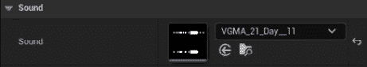

图 9.11 – 正在更新的声音属性

1.  将 `BP_MusicManager` 类的实例拖入关卡中。

1.  播放关卡。你应该注意到当游戏开始时音乐开始播放，并且当它到达结束时应该自动循环（这是由于 `音频` 组件造成的）。

注意

`声音` 资产的 `Looping` 属性。

有了这些，我们已经完成了这个练习。你现在知道如何为你的游戏添加简单的背景音乐。

现在，让我们跳到下一个主题，即粒子系统。

# 理解粒子系统

让我们谈谈许多视频游戏中的一个非常重要的元素：粒子系统。

在视频游戏术语中，粒子本质上是一个可以用图像表示的 3D 空间中的位置。粒子系统是一组许多粒子，可能具有不同的图像、形状、颜色和大小。以下图显示了在 UE5 中制作的两个粒子系统的示例：

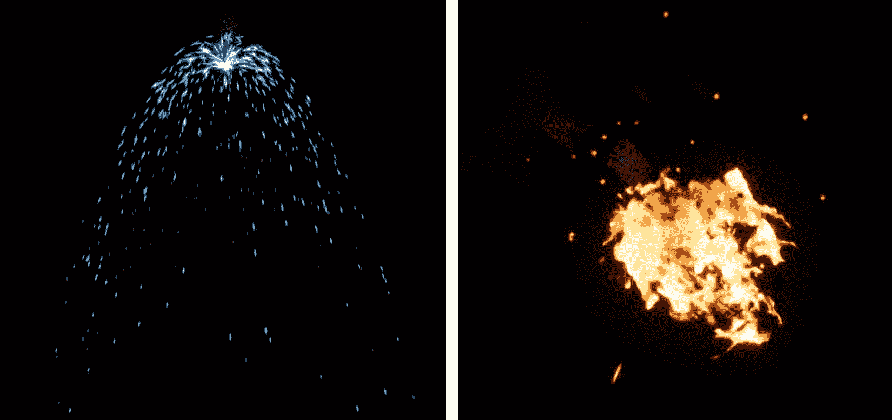

图 9.12 – UE5 中的两种不同的粒子系统

左侧的粒子系统应该是来自被切割并现在处于短路状态的电缆的电火花，而右侧的应该是火焰。尽管左侧的粒子系统相对简单，但你可以看出右侧的粒子系统内部有不止一种粒子，这些粒子可以在同一个系统中组合。

注意

UE5 有两种不同的工具用于创建粒子系统：**Cascade 和 Niagara**。Cascade 自 UE5 开始以来一直存在，而 Niagara 是一个更新、更复杂的系统，并且直到 2020 年 5 月，在 Unreal Engine 版本 4.25 中才准备好用于生产。

在 UE5 中创建粒子系统超出了本书的范围，但鉴于它是引擎中较新的添加，建议使用 Niagara 而不是 Cascade。

在本章中，我们将仅使用 UE5 中已经包含的粒子系统，但如果你想要创建自己的，这些链接将提供有关 Cascade 和 Niagara 的更多信息：

Cascade:

[`docs.unrealengine.com/en-US/Engine/Rendering/ParticleSystems/Cascade`](https://docs.unrealengine.com/en-US/Engine/Rendering/ParticleSystems/Cascade)

[`www.youtube.com/playlist?list=PLZlv_N0_O1gYDLyB3LVfjYIcbBe8NqR8t`](https://www.youtube.com/playlist?list=PLZlv_N0_O1gYDLyB3LVfjYIcbBe8NqR8t)

Niagara:

[`docs.unrealengine.com/en-US/Engine/Niagara/EmitterEditorReference/index.xhtml`](https://docs.unrealengine.com/en-US/Engine/Niagara/EmitterEditorReference/index.xhtml)

[`docs.unrealengine.com/en-US/Engine/Niagara/QuickStart`](https://docs.unrealengine.com/en-US/Engine/Niagara/QuickStart)

在下一节练习中，我们将学习如何将粒子系统添加到我们的游戏中。在本章中，我们只是简单地使用 UE5 团队已经制作好的现有粒子系统。

## 练习 9.05 – 当躲避球击中玩家时生成粒子系统

在这个练习中，我们将学习如何在 UE5 中生成粒子系统。在这种情况下，当敌方投掷的躲避球击中玩家时，我们将生成一个 `爆炸` 粒子系统。

要实现这一点，请按照以下步骤操作：

1.  关闭编辑器并打开 Visual Studio。

1.  在 `DodgeballProjectile` 类的头文件中，添加一个受保护的 `class UParticleSystem*` 属性，名为 `HitParticles`。

`UParticleSystem` 类型是 UE5 中粒子系统的指定名称。请确保将其设置为 `UPROPERTY` 并添加 `EditDefaultsOnly` 标签，以便在蓝图类中编辑：

```cpp
// The particle system the dodgeball will spawn when it hits 
  the player
UPROPERTY(EditAnywhere, Category = Particles)
class UParticleSystem* HitParticles;
```

1.  在 `DodgeballProjectile` 类的源文件中，在其 `OnHit` 函数的实现中，在调用 `Destroy` 函数之前，检查我们的 `HitParticles` 属性是否有效。如果是，调用 `GameplayStatics` 对象的 `SpawnEmitterAtLocation` 函数。

此函数将生成一个演员，该演员将播放我们作为参数传递的粒子系统。它接收以下参数：

+   一个 `World` 对象，我们将使用 `GetWorld` 函数传递

+   一个 `UParticleSystem*` 属性，它将成为我们的 `HitParticles` 属性

+   将播放粒子系统的演员的 `FTransform`，我们将使用 `GetActorTransform` 函数传递：

    ```cpp
    if (HitParticles != nullptr)
    {
      UGameplayStatics::SpawnEmitterAtLocation(GetWorld(), 
      HitParticles, GetActorTransform());
    }
    ```

注意

虽然我们在这个项目中不会使用它，但`GameplayStatics`对象还提供了一个与生成粒子系统相关的函数，即`SpawnEmitterAttached`函数。此函数将生成一个粒子系统并将其附加到演员上，这可能在你想要，例如，使移动物体着火时很有用，这样粒子系统就会始终附加到该物体上。

1.  编译这些更改并打开编辑器。

1.  打开`BP_DodgeballProjectile`蓝图，转到其`HitParticles`属性到`P_Explosion`粒子系统资产：

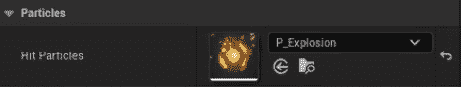

图 9.13 – 将 HitParticles 属性设置为 P_Explosion

1.  现在，播放关卡，并让您的玩家角色被躲避球击中。你应该会看到正在播放的爆炸粒子系统：

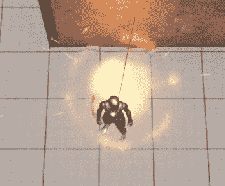

图 9.14 – 当躲避球击中玩家时播放的爆炸粒子系统

这样就完成了这个练习。你现在知道如何在 UE5 中播放粒子系统了。粒子系统为你的游戏增添了视觉魅力，使其更具视觉吸引力。

在下一个活动中，我们将通过在躲避球击中玩家时播放声音来巩固我们在 UE5 中播放音频的知识。

## 活动 9.01 – 当躲避球击中玩家时播放声音

在这个活动中，我们将创建一个逻辑，每当玩家角色被躲避球击中时都会播放声音。在视频游戏中，以多种方式传达玩家的关键信息非常重要，因此除了更改玩家角色的生命条外，我们还会在玩家被击中时播放声音，以便玩家知道角色正在受到伤害。

要完成这个任务，请按照以下步骤操作：

1.  将将在玩家角色被击中时播放的声音文件导入**内容浏览器**区域内的`Audio`文件夹。

注意

如果您没有声音文件，您可以使用在[`www.freesoundeffects.com/free-track/punch-426855/`](https://www.freesoundeffects.com/free-track/punch-426855/)提供的文件。

1.  打开`DodgeballProjectile`类的头文件。添加一个`SoundBase*`属性，就像我们在*练习 9.02 – 当躲避球从表面上弹跳时播放声音*中做的那样，但这次，将其命名为`DamageSound`。

1.  打开`DodgeballProjectile`类的源文件。在`OnHit`函数的实现中，一旦你伤害了玩家角色，在调用`Destroy`函数之前，检查`DamageSound`属性是否有效。如果是，调用`GameplayStatics`对象的`PlaySound2D`函数（在*练习 9.02 – 当躲避球从表面上弹跳时播放声音*中提到），将`this`和`DamageSound`作为参数传递给该函数调用。

1.  编译您的更改并打开编辑器。

1.  打开`BP_DodgeballProjectile`蓝图，并将其`DamageSound`属性设置为在活动开始时导入的声音文件。

当你玩关卡时，你应该注意到每次玩家被躲避球击中，你都会听到你导入的声音播放：


图 9.15 – 当玩家角色被击中时应该播放声音

完成这些步骤后，你就完成了这个活动，并巩固了在 UE5 中使用 2D 和 3D 声音的应用。

注意

该活动的解决方案可以在[`github.com/PacktPublishing/Elevating-Game-Experiences-with-Unreal-Engine-5-Second-Edition/tree/main/Activity%20solutions`](https://github.com/PacktPublishing/Elevating-Game-Experiences-with-Unreal-Engine-5-Second-Edition/tree/main/Activity%20solutions)找到。

现在，让我们通过学习一点关卡设计的概念来结束这一章。

# 探索关卡设计

从*第五章*，与我们的躲避球游戏相关的*使用线迹查询*，我们添加了一些游戏机制和游戏玩法机会，以及一些视听元素，所有这些都在本章中处理。现在我们有了所有这些游戏元素，我们必须将它们组合成一个玩家可以从头到尾玩的游戏关卡。为了做到这一点，让我们学习一点关于关卡设计和关卡布局的知识。

级别设计是一种特定的游戏设计学科，专注于在游戏中构建关卡。级别设计师的目标是制作一个好玩的游戏关卡，通过使用为该游戏构建的游戏机制向玩家引入新的游戏玩法概念，包含良好的节奏（充满动作和轻松游戏序列的良好平衡），以及更多。

为了测试关卡的结构，级别设计师必须构建所谓的**关卡布局**。这是一个非常简单且简化的关卡版本，使用了最终关卡将包含的大部分元素，但它仅使用简单的形状和几何形状制作。这样，如果需要更改关卡的部分，修改起来会更容易且更节省时间：

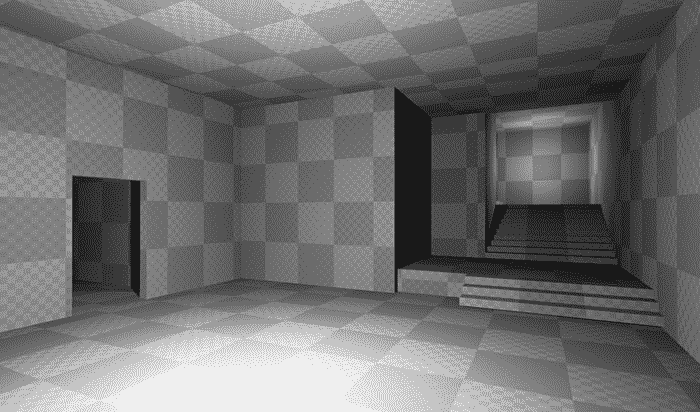

图 9.16 – 使用 BSP 刷子在 UE5 中制作的关卡布局示例

注意

应该注意的是，关卡设计是其自身的特定游戏开发技能，并且值得有它自己的书籍，其中有很多，但深入探讨这个主题超出了本书的范围。

在下一个练习中，我们将使用我们在过去几章中构建的机制来构建一个简单的关卡布局。

## 练习 9.06 – 构建关卡布局

在这个练习中，我们将创建一个新的水平面布局，其中将包含一些结构，玩家将在水平面中的某个位置开始，并必须通过一系列障碍物到达水平面的尽头。我们将使用我们在过去几章中构建的所有机制和对象来制作一个玩家可以完成的水平面。

尽管在这个练习中我们将为您提供解决方案，但我们鼓励您发挥创造力，自己提出解决方案，因为在这种情况下没有正确或错误的答案。

开始这个练习，请按照以下步骤操作：

1.  打开编辑器。

1.  进入 `ThirdPersonCPP` | `Maps` 文件夹中的 `ThirdPersonExampleMap` 资产，并将其命名为 `Level1`。您可以通过选择资产并按 *Ctrl* + *D* 或通过右键单击资产并选择 **复制**（第三个选项）来完成此操作。在某些情况下，这可能不可用，因此您需要通过复制和粘贴现有水平面（*Ctrl* + *C* 和 *Ctrl* + *V*）来完成此操作。

1.  打开新创建的 `Level1` 地图。

1.  删除地图内所有带有网格的对象，除了以下对象：

    +   `PlayerStart` 对象

    +   敌人角色（注意两个角色看起来相同）

    +   `floor` 对象

    +   我们创建的两个 `Wall` 对象

    +   `VictoryBox` 对象

请记住，与照明和声音相关的资产应保持不变。

1.  通过按 **构建** 按钮为 `Level1` 构建照明。此按钮位于 **播放** 按钮左侧，在编辑器窗口顶部的 **工具栏** 区域。

1.  到目前为止，您应该有一个空旷的地面，上面只有您将在这个水平面中需要的对象（在 *步骤 4* 中提到的那些）。以下是您按照 *步骤 4* 和 *步骤 5* 执行后的 `Level1` 地图：

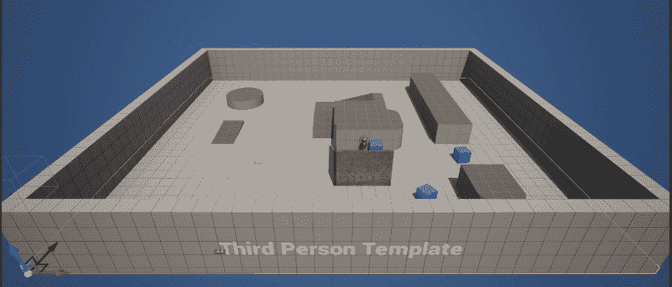

图 9.17 – 删除所需对象之前

删除对象后，您的地面应该看起来如下：

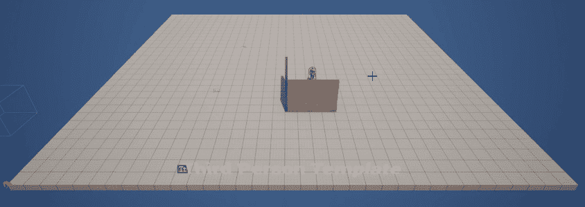

图 9.18 – 删除所需对象之后

因为构建一个水平面，即使是简单的水平面，也需要很多步骤和指令，所以您将只看到一些可能的水平面的截图，并且再次鼓励您提出自己的方案。

1.  在这个例子中，我们只是简单地使用了现有的 `EnemyCharacter`、`Wall` 和 `GhostWall` 对象，并将它们复制了几次来创建一个玩家可以从起点到终点穿越的简单布局。我们还移动了 `VictoryBox` 对象，使其与新水平面的终点位置相匹配：

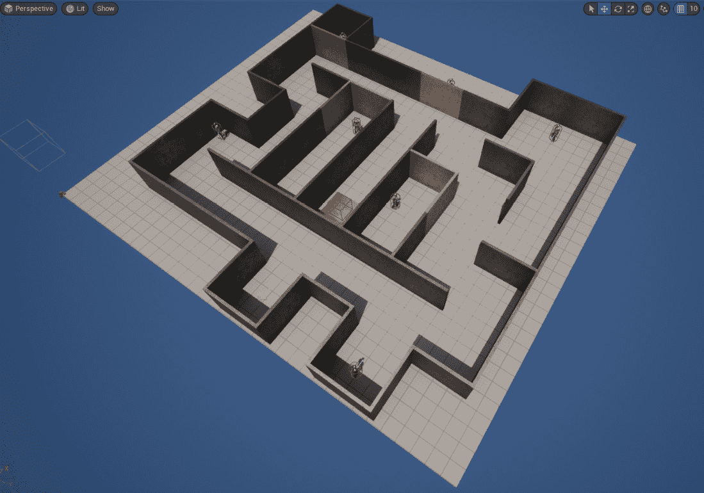

图 9.19 – 创建的水平面 – 等距视图

水平面也可以从俯视图看到，如下所示：

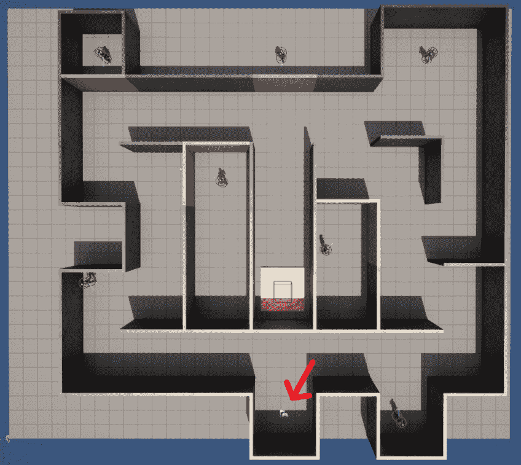

图 9.20 – 创建的关卡 – 从上到下的视图，玩家角色用箭头标记

一旦你对结果满意，这意味着你已经完成了躲避球游戏，现在可以邀请你的朋友和家人来玩，看看他们有什么看法。干得好——你离掌握游戏开发艺术又近了一步！

# 额外功能

在我们结束本章之前，这里有一些关于你在躲避球项目中下一步可以做什么的建议：

+   让我们创建的普通 `Wall` 类在 *第六章*，*设置碰撞对象* 中不会阻挡敌人的视线。这样，敌人将始终向玩家投掷躲避球，而玩家仍然应该被阻挡，不能穿过这堵墙。

+   添加一个新功能，允许玩家使用 **Sweep Traces** 的概念可视化敌人角色投掷的躲避球首先会击中的位置。

+   添加一种新的墙壁类型，它可以阻挡玩家角色、敌人角色和躲避球，但也会受到躲避球的伤害，当健康点数耗尽时会被摧毁。

在这个项目中扩展范围有无限可能。我们鼓励你使用你学到的技能进行进一步研究，以构建新功能并为你的游戏增加更多复杂性。

# 摘要

你现在已经完成了躲避球游戏项目。在本章中，你学习了如何通过播放音频和使用粒子系统来为你的游戏增添光彩。你现在知道如何为你的游戏添加 2D 和 3D 声音，以及一些你可用于此的工具。现在，你可以尝试为你的游戏添加更多的声音效果，例如当敌人角色第一次看到你时的特殊声音效果（例如在 *Metal Gear Solid* 中），脚步声效果或胜利声效。

你还使用你在过去几章中制作的所有工具构建了一个关卡，从而总结了我们在本项目中构建的所有逻辑。

在下一章中，我们将开始一个新的项目：`SuperSideScroller` 游戏。在那个项目中，你将接触到诸如增强效果、可收集物品、敌人 **人工智能**（**AI**）、角色动画等主题。你将创建一个横版卷轴平台游戏，你将控制一个角色，必须完成关卡、收集宝石并使用增强效果来躲避敌人。你将学习的两个最重要的主题是 UE5 的行为树和黑板，它们为 AI 系统提供动力，以及动画蓝图，它允许你管理角色的动画。
