# 第十三章：创建和添加敌人人工智能

在上一章中，你使用动画混合结合 Anim Slots、Animation Blueprints 和如 `Layered blend per bone` 这样的混合函数为玩家角色添加了分层动画。有了这些知识，你能够将投掷动画蒙太奇与基本运动状态机平滑地混合，为角色创建分层动画。

本章的主要重点是，将你在 *第十二章* *动画混合与蒙太奇* 中创建的 C++ 敌人类，通过人工智能使其活跃起来。UE5 使用了许多不同的工具来实现人工智能，例如 AI 控制器、黑板和行为树，所有这些你都将在这章中学习并使用。

在本章中，我们将涵盖以下主题：

+   如何使用导航网格在游戏世界中创建一个敌人物体可以移动的可导航空间。

+   如何创建一个可以使用 `Blackboards` 和 `Behavior Trees` 中现有的 AI 工具在游戏世界中巡逻点位置之间导航的敌人物体 AI。

+   如何使用变换向量将局部变换转换为世界变换。

+   如何在 C++ 中创建玩家弹射物类，以及如何实现 `OnHit()` 碰撞事件函数以识别和记录弹射物在游戏世界中击中对象的情况。

到本章结束时，你将能够创建一个敌人物体可以移动的可导航空间。你还将能够创建一个敌人物体 AI 并使用 `Blackboards` 和 `Behavior Trees` 在位置之间导航。最后，你将了解如何创建和实现玩家弹射物类，并为其添加视觉元素。在你深入这些系统之前，让我们花点时间了解一下人工智能在近年来游戏中的应用。自从 *超级马里奥兄弟* 时代以来，人工智能确实已经发展了很多。

# 技术要求

对于本章，你需要以下技术要求：

+   安装 Unreal Engine 5

+   安装 Visual Studio 2019

本章的项目可以在本书代码包的 `Chapter13` 文件夹中找到，可以从

[`github.com/PacktPublishing/Elevating-Game-Experiences-with-Unreal-Engine-5-Second-Edition`](https://github.com/PacktPublishing/Elevating-Game-Experiences-with-Unreal-Engine-5-Second-Edition).

# 敌人 AI

什么是**人工智能**（**AI**）？这个术语可以意味着很多不同的东西，这取决于它被使用的领域和上下文，因此让我们以游戏主题为依据来定义它。

**AI**是一个了解其环境的实体，并执行有助于其最优实现预期目的的选择。AI 使用所谓的**有限状态机**根据从用户或其环境接收的输入在多个状态之间切换。例如，视频游戏 AI 可以根据其当前健康状态在攻击状态和防御状态之间切换。

在像*Hello Neighbor*这样的游戏中，该游戏是用 Unreal Engine 4 开发的，以及*Alien: Isolation*，AI 的目标是以尽可能高的效率找到玩家，同时也遵循开发者定义的一些预定模式，以确保玩家可以智胜它。*Hello Neighbor*通过让 AI 从玩家的过去行为中学习，并根据所学知识试图智胜玩家，为 AI 添加了一个非常创造性的元素。

你可以在游戏发行商 TinyBuild Games 发布的以下视频中找到有关 AI 如何工作的信息分解：[`www.youtube.com/watch?v=Hu7Z52RaBGk`](https://www.youtube.com/watch?v=Hu7Z52RaBGk)。

有趣且有趣的 AI 对任何游戏都至关重要，并且根据你正在制作的游戏，这可能意味着一个非常复杂或非常简单的 AI。为`SuperSideScroller`游戏创建的 AI 将不会像之前提到的那么复杂，但它将满足我们想要创建的游戏的需求。

让我们分析一下敌人将如何表现：

+   敌人将是一个非常简单的敌人，它有一个基本的来回移动模式，并且不支持任何攻击；只有通过碰撞玩家角色，它们才能造成任何伤害。

+   然而，我们需要为敌人 AI 设置移动之间的位置。

+   接下来，我们必须决定 AI 是否应该改变位置，是否应该不断在位置之间移动，或者是否在选择新位置之间应该有暂停。

幸运的是，UE5 为我们提供了一系列工具，我们可以使用这些工具来开发这样的复杂 AI。然而，在我们的项目中，我们将使用这些工具来创建一个简单的敌人类型。让我们首先讨论一下 UE5 中的 AI 控制器是什么。

# AI 控制器

让我们讨论一下**玩家控制器**和**AI 控制器**之间的主要区别。这两个演员都源自基础**控制器**类。**控制器**用于控制**Pawn**或**Character**，以控制该 Pawn 或角色的动作。

当处于`UWorld`类中时。

注意

你将在*第十四章*中了解更多关于`UWorld`类的信息，*生成玩家投射物*，但作为一个参考，你可以在以下链接中阅读更多：[`docs.unrealengine.com/en-US/API/Runtime/Engine/Engine/UWorld/index.xhtml`](https://docs.unrealengine.com/en-US/API/Runtime/Engine/Engine/UWorld/index.xhtml)。

玩家控制器和 AI 控制器最重要的方面是它们将要控制的棋子。让我们更多地了解 AI 控制器是如何处理这个问题的。

## 自动控制 AI

和所有控制器一样，AI 控制器必须控制一个*棋子*。在 C++中，你可以使用以下函数来控制棋子：

```cpp
void AController::Possess(APawn* InPawn)
```

你还可以使用以下函数来释放一个棋子：

```cpp
void AController::UnPossess()
```

此外，还有`void AController::OnPossess(APawn* InPawn)`和`void AController::OnUnPossess()`函数，它们分别在调用`Possess()`和`UnPossess()`函数时被调用。

当涉及到 AI 时，尤其是在 UE5 的上下文中，有两种方法可以使 AI 棋子或角色被 AI 控制器控制。让我们看看这些选项：

+   `放置在世界`：这是你在这个项目中处理 AI 的方法；你将手动将这些敌人演员放置到你的游戏世界中，一旦游戏开始，AI 将负责其余部分。

+   `生成`：第二种方法稍微复杂一些，因为它需要显式地调用 C++或蓝图中的`生成`函数，以生成指定类的实例。`生成演员`方法需要一些参数，包括`世界`对象和`变换`参数，如`位置`和`旋转`，以确保生成的实例被正确生成。

+   `放置在世界或生成`：如果你不确定想使用哪种方法，一个安全的选择是`放置在世界或生成`；这样，两种方法都得到了支持。

+   对于`SuperSideScroller`游戏，你将使用`放置` `在` `世界`选项，因为你要创建的 AI 将手动放置在游戏关卡中。

让我们转到第一个练习，我们将在这里实现敌人的 AI 控制器。

## 练习 13.01 – 实现 AI 控制器

在敌人棋子能够做任何事情之前，它需要被 AI 控制器控制。这也需要在 AI 执行任何逻辑之前发生。在这个练习结束时，你将创建一个 AI 控制器并将其应用于上一章中创建的敌人。让我们首先创建 AI 控制器。

按照以下步骤完成这个练习：

1.  转到`Content/Enemy`目录。

1.  *右键点击* `敌人`文件夹并选择`AI`。在新`AI`文件夹目录中，*右键点击*并选择**蓝图类**选项。

1.  从`AIController`类。

1.  *左键点击*这个类选项，然后*左键点击*蓝色的`AIController`类。还要注意当鼠标悬停在类选项上时出现的工具提示；它包含来自开发者的关于这个类的有用信息：

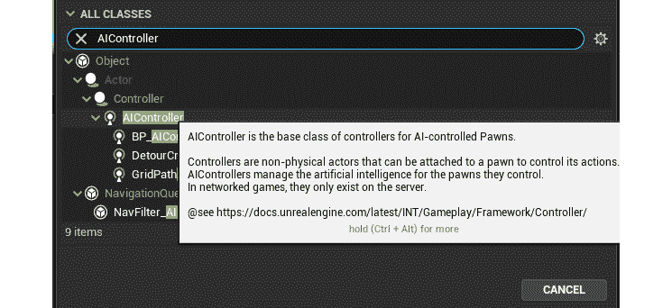

图 13.1 – AIController 资产类，如图 13.01_B18531.jpg 所示，在选择父类对话框中找到

1.  使用这个新创建的`AIController 蓝图`，将这个资产命名为`BP_AIControllerEnemy`。

AI 控制器创建并命名后，现在是时候将此资产分配到你在上一章中制作的第一个敌人蓝图了。

1.  导航到`/Enemy/Blueprints`目录以找到`BP_Enemy`。*双击*打开这个蓝图。

1.  在`Pawn`中。这是你可以设置有关`Pawn`或`Character`的 AI 功能的不同参数的地方。

1.  `AI 控制器类`参数决定了，正如其名称所暗示的，为这个敌人使用哪个 AI 控制器。*左键点击*下拉菜单以找到并选择你之前创建的 AI 控制器——即`BP_AIController_Enemy`。

完成这个练习后，敌人 AI 现在知道要使用哪个 AI 控制器。这一点至关重要，因为 AI 将在 AI 控制器中使用和执行你将在本章后面创建的`行为树`。

AI 控制器现在已被分配给敌人，这意味着你几乎可以开始开发这个 AI 的实际智能了。然而，在这样做之前，还有一个重要的话题需要讨论，那就是**导航网格**。

# 导航网格

任何视频游戏中的 AI 最重要的方面之一是能够以复杂的方式在环境中导航。在 UE5 中，引擎有一种方法可以告诉 AI 环境中哪些部分是可导航的，哪些部分是不可导航的。这是通过**导航网格**，或简称**Nav Mesh**来实现的。

在这里，“网格”这个术语是误导性的，因为它是通过编辑器中的体积实现的。我们需要在我们的关卡中有一个导航网格，以便我们的 AI 能够有效地导航游戏世界的可玩边界。我们将在接下来的练习中一起添加一个。

UE5 还支持**动态导航网格**，这使得导航网格可以在动态对象在环境中移动时实时更新。这导致 AI 识别环境中的这些变化，并相应地更新它们的路径/导航。本书不会涵盖这一点，但你可以通过**项目设置** | **导航网格** | **运行时生成**来访问配置选项。

现在我们已经了解了**导航网格**，让我们开始第一个练习，在这个练习中，我们将把**导航网格**添加到我们的关卡中。

## 练习 13.02 – 为 AI 敌人实现导航网格体积

在这个练习中，你将为`SideScrollerExampleMap`添加一个导航网格，并探索在 UE5 中导航网格是如何工作的。你还将学习如何为此体积参数化以适应你的游戏需求。这个练习将在 UE5 编辑器中执行。

到这个练习结束时，你将对导航网格有更深入的了解。你还将能够在接下来的活动中在你的关卡中实现这个体积。让我们首先将导航网格体积添加到关卡中。

按照以下步骤完成这个练习：

1.  如果你还没有打开地图，请通过导航到**文件**并*左键点击***打开关卡**选项来打开**ThirdPersonExampleMap**。从**打开关卡**对话框中，导航到**/ThirdPersonCPP/Maps**以找到**SideScrollerExampleMap**。通过*左键点击*选择此地图，然后在底部*左键点击**打开**以打开地图。

1.  在打开地图后，导航到编辑器左上角的**窗口**菜单，并确保你选择了**放置演员**面板选项。**放置演员**面板包含一系列易于访问的演员类型，如**体积**、**灯光**、**几何体**等。在**体积**类别下，你可以找到**Nav Mesh Bounds Volume**选项。

1.  *左键点击*并将此体积拖入地图/场景。默认情况下，你将在编辑器中看到体积的轮廓。按*P*键以可视化体积所包含的**导航**区域，但请确保体积与地面几何体相交，以便看到如图所示的绿色可视化效果：

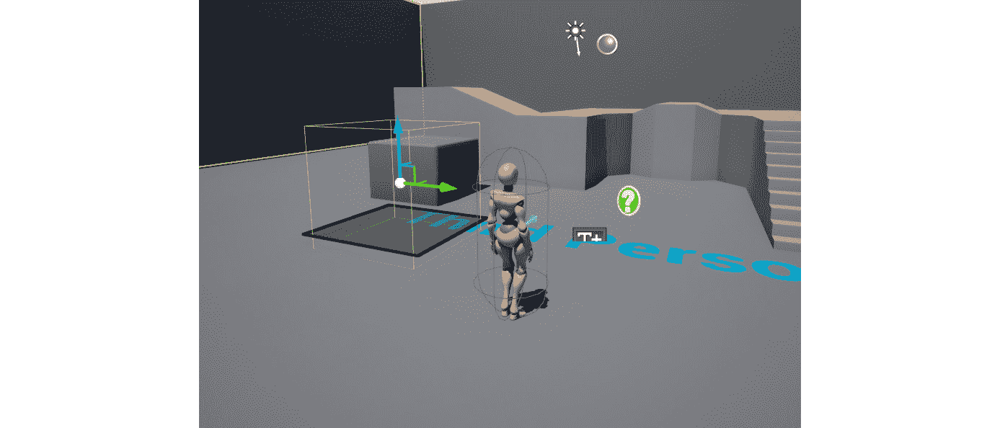

图 13.2 – 被绿色勾勒的区域被引擎和 AI 感知为可导航区域

在放置了 Nav Mesh Volume 之后，让我们调整其形状，使其体积扩展到关卡的全部区域。之后，你将学习如何调整 Nav Mesh Volume 的游戏参数。

1.  *左键点击*选择`X: 3000.0`，`Y: 3000.0`，和`Z: 3000.0`。

注意，当**NavMeshBoundsVolume**的形状和尺寸发生变化时，**Nav Mesh**会进行调整并重新计算可导航区域。这可以在下面的屏幕截图中看到。你还会注意到，上层的平台是不可导航的；你将在稍后修复这个问题：

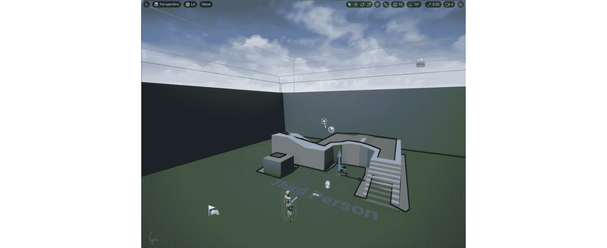

图 13.3 – 现在，NavMeshBoundsVolume 扩展到示例地图的全部可玩区域

通过完成这个练习，你已经放置了你的第一个`RecastNavMesh`演员，这也是在将`NavMeshBoundsVolume`放置在关卡中时创建的。

# 重新构建 Nav Mesh

当你添加**NavMeshBoundsVolume**时，你可能已经注意到自动创建了一个其他演员：一个名为**RecastNavMesh-Default**的**RecastNavMesh**演员。这个**RecastNavMesh**充当 Nav Mesh 的“大脑”，因为它包含了调整 Nav Mesh 所需的参数，这些参数直接影响了 AI 如何导航给定的区域。

下面的屏幕截图显示了此资产，如图所示，来自**世界大纲**选项卡：

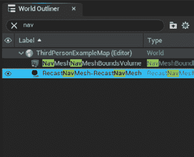

图 13.4 – 从**世界大纲**选项卡看到的 RecastNavMesh 演员

注意

`RecastNavMesh` 中存在许多参数，本书中我们将仅介绍重要的参数。更多信息，请参阅 [`docs.unrealengine.com/en-US/API/Runtime/NavigationSystem/NavMesh/ARecastNavMesh/index.xhtml`](https://docs.unrealengine.com/en-US/API/Runtime/NavigationSystem/NavMesh/ARecastNavMesh/index.xhtml)。

目前对你来说，只有两个主要部分是重要的：

+   **显示**：正如其名称所暗示的，**显示**部分仅包含影响生成的可导航区域 **NavMeshBoundsVolume** 的视觉调试显示的参数。建议你尝试切换此类别下的每个参数，看看它们如何影响生成的 Nav Mesh 的显示。

+   `2.0f` 以获得完整高度。

+   `44` 度，这是一个你通常不会更改的参数，除非你的游戏需要更改它。

+   **Agent Max Step Height** 指的是 AI 可以导航的台阶高度，从楼梯台阶的角度来看。与 **Agent Max Slope** 类似，这是一个你很可能不会更改的参数，除非你的游戏特别需要更改此值。

现在你已经了解了 Recast Nav Mesh 参数，让我们将这些知识应用到下一个练习中，该练习将指导你更改其中的一些参数。

## 练习 13.03 – 重构 Nav Mesh 体积参数

现在你已经在关卡中有了 **Nav Mesh** 体积，是时候更改 **Recast Nav Mesh** 角色的参数，以便 Nav Mesh 允许敌人 AI 在比其他平台更薄的平台上导航。这个练习将在 UE5 编辑器中执行。

在这里，你只需更新 `Cell Size` 和 `Agent Height`，以便它们符合你的角色需求和 Nav Mesh 所需的精度：

```cpp
Cell Size: 5.0f
Agent Height: 192.0f
```

以下截图显示了由于我们对 `Cell Size` 的修改，扩展平台现在可以导航：


图 13.5 – 将 `Cell Size` 从 19.0f 更改为 5.0f 允许狭窄的扩展平台可导航

使用 `SuperSideScrollerExampleMap` 设置其自己的 `NavMeshBoundsVolume` 角色后，你可以使用它来完成本项目的剩余部分。

## 活动 13.01 – 创建新关卡

现在你已经将 `NavMeshBoundsVolume` 添加到示例地图中，是时候为 `Super SideScroller` 游戏的其余部分创建地图了。通过创建地图，你将更好地理解 `NavMeshBoundsVolume` 和 `RecastNavMesh` 的属性如何影响它们所在的环境。

注意

在继续进行此活动的解决方案之前，如果您需要一个适用于剩余章节的示例级别，这些章节涵盖了`SuperSideScroller`游戏，那么请放心——本章附带`SuperSideScroller.umap`资产，以及一个名为`SuperSideScroller_NoNavMesh`的地图，该地图不包含`NavMeshBoundsVolume`。您可以将`SuperSideScroller.umap`作为创建级别或获取改进级别想法的参考。您可以从[`packt.live/3lo7v2f`](https://packt.live/3lo7v2f)下载该地图。

按照以下步骤创建一个简单的地图：

1.  创建一个**新级别**。

1.  将此级别命名为`SuperSideScroller`。

1.  使用此项目**内容抽屉**界面中默认提供的**静态网格**资产，创建一个具有不同高程的有趣空间以进行导航。将您的玩家角色的**蓝图**添加到级别中，并确保它被**Player Controller 0**控制。

1.  在*X*、*Y*和*Z*轴上分别添加`1000.0`、`5000.0`和`2000.0`。

1.  确保通过按*P*键启用**NavMeshBoundsVolume**的调试可视化。

1.  将`Cell Size`参数的值调整为`5.0f`，`Agent Radius`设置为`42.0f`，`Agent Height`设置为`192.0f`。请以此作为参考。

**预期输出**

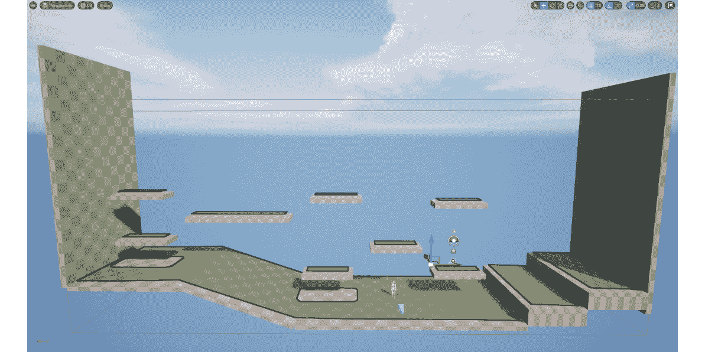

图 13.6 – SuperSideScroller 地图

在完成此活动之后，您将拥有一个包含所需`NavMeshBoundsVolume`和`RecastNavMesh`演员设置的级别。这将允许我们在即将进行的练习中开发的 AI 正确运行。再次提醒，如果您不确定级别应该如何看起来，请参考提供的示例地图`SuperSideScroller.umap`。现在，是时候开始开发`SuperSideScroller`游戏的 AI 了。

注意

此活动的解决方案可以在 GitHub 上找到：[`github.com/PacktPublishing/Elevating-Game-Experiences-with-Unreal-Engine-5-Second-Edition/tree/main/Activity%20solutions`](https://github.com/PacktPublishing/Elevating-Game-Experiences-with-Unreal-Engine-5-Second-Edition/tree/main/Activity%20solutions)。

# 行为树和黑板

行为树和黑板协同工作，使我们的 AI 能够遵循不同的逻辑路径，并根据各种条件和变量做出决策。

**行为树**是一种可视化脚本工具，允许您根据某些因素和参数告诉一个 NPC 做什么。例如，行为树可以告诉 AI 根据 AI 是否可以看到玩家移动到某个位置。

为了举例说明`Behavior Trees`和`Blackboards`在游戏中的应用，让我们看看使用 UE5 开发的游戏*Gears of War 5*，其中 AI 在`Blackboard`中。确定这些变量如何使用以及 AI 将如何使用这些信息的逻辑在行为树内部执行。

`黑板` 是你定义行为树执行操作和使用这些值进行决策所需的变量集的地方。

`行为树` 是你创建 AI 需要执行的任务的地方，例如移动到某个位置或执行你创建的自定义任务。像 UE5 中许多编辑器工具一样，`行为树` 主要提供了一种非常直观的脚本编写体验。

`黑板` 是你定义变量的地方，也称为 `黑板`，如果没有 `黑板`，`行为树` 将无法在不同任务、服务或装饰器之间传递和存储信息，使其变得无用：


图 13.7 – 黑板内可以访问的行为树中的变量示例

行为树由一组 **对象** 组成 – 即 **组合**、**任务**、**装饰器**和**服务** – 它们共同定义了 AI 将如何根据你设置的条件和逻辑流程行为和响应。所有行为树都以所谓的根开始，逻辑流程从这里开始；这不能被修改，并且只有一个执行分支。让我们更详细地看看这些对象。

注意

有关 `行为树` 的 C++ API 的更多信息，请参阅以下文档：[`docs.unrealengine.com/4.27/en-US/API/Runtime/AIModule/BehaviorTree/Composites`](https://docs.unrealengine.com/4.27/en-US/API/Runtime/AIModule/BehaviorTree/Composites)。

组合节点告诉 `行为树` 如何执行任务和其他操作。以下截图显示了 Unreal Engine 默认提供的完整组合节点列表：**选择器**、**序列**和**简单并行**。

组合节点也可以附加装饰器和服务，以便在执行 `行为树` 分支之前应用可选条件：

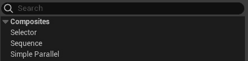

图 13.8 – 组合节点 – 选择器、序列和简单并行

让我们更详细地看看这些节点：

+   `FinishWithResult`任务成功，父节点`Root`将再次执行，而`FinishWithResult`将再次执行一次。这种模式将持续到`FinishWithResult`失败。如果`MakeNoise`失败，则`Root`将再次执行。如果`MakeNoise`任务成功，那么选择器将成功，`Root`将再次执行。根据行为树的流程，如果选择器失败或成功，下一个组合分支将开始执行。在下面的屏幕截图中，没有其他组合节点，所以如果选择器失败或成功，`Root`节点将再次执行。然而，如果有包含多个**选择器**节点的**序列**组合节点，每个选择器将尝试成功执行其子节点。无论成功或失败，每个**选择器**都将尝试顺序执行：

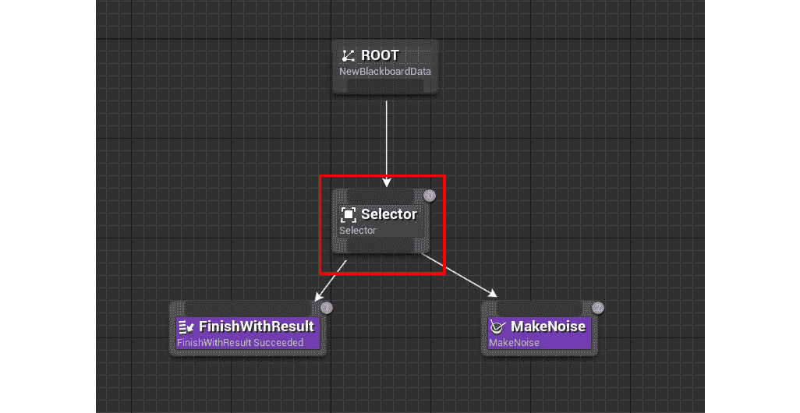


注意，当添加任务和`组合`节点时，你会在每个节点的右上角注意到数字。这些数字表示这些节点将被执行的顺序。模式遵循**从上到下**，**从左到右**的原则，这些值有助于你跟踪顺序。任何断开的任务或`组合`节点将被赋予`-1`的值，以表示它未被使用。

+   如果`Move To`任务成功，则父节点`Wait`任务。如果`Wait`任务成功，则序列成功，`Root`将再次执行。但是，如果`Move To`任务失败，则`Root`将再次执行，导致`Wait`任务永远不会执行：

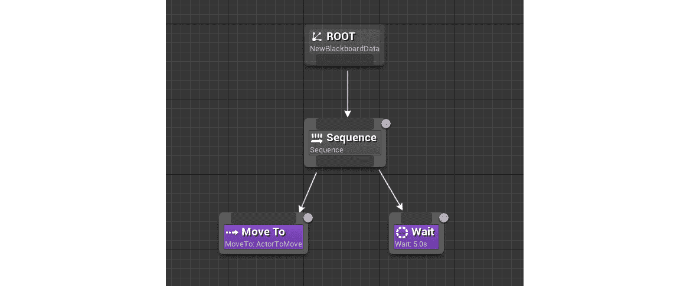

图 13.10 – 序列组合节点在行为树中使用的示例

+   `5`秒的执行与一个新的**序列**任务同时进行：

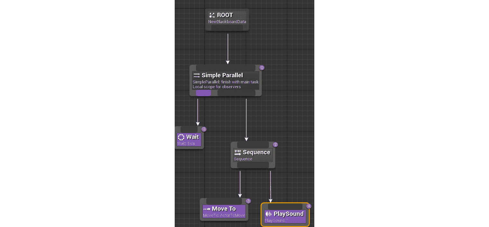

图 13.11 – 选择器组合节点在行为树中使用的示例

**简单并行**组合节点也是唯一在其**详细信息**面板中具有参数的**组合**节点，该参数是**完成模式**。有两个选项：

+   `Wait`任务完成后，背景树序列将终止，整个**简单并行**将再次执行。

+   `Wait`任务将在`5`秒后完成，但整个**简单并行**将等待**移动到**和**播放声音**任务执行完毕后再重启。

备注

关于组合 C++ API 的更多信息，请参阅以下文档：[`docs.unrealengine.com/4.27/en-US/API/Runtime/AIModule/BehaviorTree/Composites/`](https://docs.unrealengine.com/4.27/en-US/API/Runtime/AIModule/BehaviorTree/Composites/).

现在我们对组合节点有了更好的理解，让我们看看一些任务节点的示例。

## 任务

这些是我们 AI 可以执行的任务。虚幻引擎为我们提供了默认使用的内置任务，但我们也可以在蓝图和 C++中创建自己的任务。这包括告诉我们的 AI**移动到**特定位置、**旋转以面对目标**，甚至告诉 AI 开火。还重要的是要知道，您可以使用蓝图创建自定义任务。让我们简要讨论一下您将用于开发敌方角色 AI 的两个任务：

+   `行为树`，您将在本章接下来的练习中使用这个任务。**移动到任务**使用导航系统告诉 AI 如何以及在哪里移动，基于它给出的位置。您将使用这个任务告诉 AI 敌人去哪里。

+   `行为树`因为它允许在任务执行之间有延迟，如果逻辑需要的话。这可以用来允许 AI 在移动到新位置之前等待几秒钟。

注意

关于任务 C++ API 的更多信息，请参阅以下文档：[`docs.unrealengine.com/4.27/en-US/API/Runtime/AIModule/BehaviorTree/Tasks/`](https://docs.unrealengine.com/4.27/en-US/API/Runtime/AIModule/BehaviorTree/Tasks/).

## 装饰器

装饰器是可以添加到任务或**组合**节点（如**序列**或**选择器**）的条件，允许分支逻辑发生。例如，我们可以有一个检查敌人是否知道玩家位置的**装饰器**。如果是这样，我们可以告诉敌人移动到那个最后已知的位置。如果不是，我们可以告诉我们的 AI 生成一个新的位置并移动到那里。还重要的是要知道，您可以使用蓝图创建自定义装饰器。

让我们也简要讨论一下您将用于开发敌方角色 AI 的装饰器——`行为树`只有在您知道 AI 已经到达指定位置时才会执行。

注意

关于装饰器 C++ API 的更多信息，请参阅以下文档：[`docs.unrealengine.com/4.27/en-US/API/Runtime/AIModule/BehaviorTree/Decorators/UBTDecorator_BlueprintBase/`](https://docs.unrealengine.com/4.27/en-US/API/Runtime/AIModule/BehaviorTree/Decorators/UBTDecorator_BlueprintBase/).

现在我们对任务节点有了更好的理解，让我们简要讨论一下服务节点。

## 服务

服务的工作方式与装饰器非常相似，因为它们可以与任务和`Composite`节点链接。主要区别在于，一个**服务**允许我们根据服务中定义的间隔执行节点分支。还重要的是要知道，您可以使用蓝图创建自定义服务。

注意

有关服务的 C++ API 的更多信息，请参阅以下文档：[`docs.unrealengine.com/4.27/en-US/API/Runtime/AIModule/BehaviorTree/Services/`](https://docs.unrealengine.com/4.27/en-US/API/Runtime/AIModule/BehaviorTree/Services/)。

在掌握了复合、任务和服务节点之后，让我们继续下一个练习，我们将为敌人创建`Behavior Tree`和`Blackboard`。

## 练习 13.04 – 创建 AI 行为树和 Blackboard

现在您已经对`Behavior Trees`和`Blackboards`有了概述，这个练习将指导您创建这些资产，告诉 AI 控制器使用您创建的`Behavior Tree`，并将`Blackboard`分配给`Behavior Tree`。您将在这里创建的`Blackboard`和`Behavior Tree`资产将用于`SuperSideScroller`游戏。此练习将在 UE5 编辑器中执行。

按照以下步骤完成此练习：

1.  在`/Enemy/AI`目录中。这是您创建 AI 控制器相同的目录。

1.  在此目录中，在`Behavior Tree`资产的空白区域*右键单击*。将此资产命名为`BT_EnemyAI`。

1.  在上一步骤相同的目录中，在`Blackboard`资产空白区域再次*右键单击*。将此资产命名为`BB_EnemyAI`。

在我们告诉 AI 控制器运行这个新的`Behavior Tree`之前，让我们将`Blackboard`分配给这个`Behavior Tree`，以便它们连接起来。

1.  通过*双击*`Blackboard Asset`参数中的资产来打开`BT_EnemyAI`。

1.  *左键单击*此参数的下拉菜单，找到您之前创建的`BB_EnemyAI` `Blackboard`资产。在关闭之前编译并保存`Behavior Tree`。

1.  接下来，通过*双击*`Run Behavior Tree`函数中的`BP_AIController_Enemy`资产来打开它。

`Run Behavior Tree`函数非常简单：您分配一个`Behavior Tree`，它就成功开始执行。

1.  最后，连接`Run Behavior Tree`函数并分配您在此练习中之前创建的`BT_EnemyAI`：

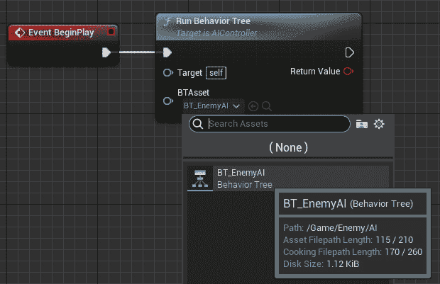

图 13.12 – 分配 BT_EnemyAI 行为树

1.  通过完成这个练习，敌人 AI 控制器现在知道要运行**BT_EnemyAI**行为树，而这个行为树知道要使用名为**BB_EnemyAI**的 Blackboard 资产。有了这个，您就可以开始使用行为树逻辑来开发 AI，使敌人角色可以在关卡中移动。

## 练习 13.05 – 创建新的行为树任务

本练习的目的是开发一个针对敌方 AI 的 AI 任务，使角色能够在您关卡中的 **导航网格** 体积内找到一个随机点进行移动。

尽管在 `SuperSideScroller` 游戏中只允许二维移动，但让我们让 AI 在您在 *活动 13.01 – 创建新关卡* 中创建的水平 3D 空间内移动到任何地方，然后努力将敌人限制在二维空间内。

按照以下步骤创建针对敌人的新任务：

1.  首先，打开您在上一练习中创建的 `Blackboard` 资产，`BB_EnemyAI`。

1.  *左键点击* `黑板` 并选择 **向量** 选项。将此向量命名为 **MoveToLocation**。您将使用这个 **向量** 变量来跟踪 AI 的下一步移动，当它决定移动到哪个位置时。

对于这个敌方 AI，您需要创建一个新的 **任务**，因为 Unreal 中目前可用的任务不符合敌方行为的需求。

1.  导航到并打开您在上一练习中创建的 `Behavior Tree` 资产，`BT_EnemyAI`。

1.  *左键点击* `任务`，它将自动为您打开任务资产。但是，如果您已经创建了一个任务，当选择 **新任务** 选项时，将出现一个选项下拉列表。在开始处理此 **任务** 的逻辑之前，您必须重命名该资产。

1.  关闭 `BTTask_BlueprintBase_New`。将此资产重命名为 `BTTask_FindLocation`。

1.  在命名了新的 **任务** 资产后，*双击* 打开 **任务编辑器**。新任务将具有空的蓝图图，并且不会提供任何默认事件供您在图中使用。

1.  在图中 *右键点击*，从上下文相关搜索中找到 **事件接收执行 AI** 选项。

1.  *左键点击* **事件接收执行 AI** 选项，在 **任务** 图中创建事件节点，如图下所示：


图 13.13 – 事件接收执行 AI 返回所有者控制器和控制者傀儡

注意

`Event Receive Execute AI` 事件将为您提供访问 **所有者控制器** 和 **控制者傀儡** 的权限。您将在接下来的步骤中使用 **控制者傀儡** 来完成此任务。

1.  每个 `Finish Execute` 函数都让 `Behavior Tree` 资产知道何时可以移动到下一个 `Task` 或树的分支。在图中 *右键点击*，并通过上下文相关搜索搜索 `Finish Execute`。

1.  *左键点击* 上下文相关搜索中的 **Finish Execute** 选项，在您的 **任务** 蓝图图中创建节点，如图下所示：


图 13.14 – `Finish Execute` 函数，它有一个布尔参数，用于确定任务是否成功

1.  下一个你需要的功能称为 **GetRandomLocationInNavigableRadius**。正如其名称所暗示的，该函数返回在定义半径内的可导航区域内的随机向量位置。这将允许敌人角色找到随机位置并移动到这些位置。

1.  在图中 *右键点击* 并在上下文相关搜索中搜索 `GetRandomLocationInNavigableRadius`。*左键点击* **GetRandomLocationInNavigableRadius** 选项，将此函数放入图中。

在这两个函数就位，并且 **Event Receive Execute** AI 准备就绪后，是时候获取敌人 AI 的随机位置了。

1.  通过上下文相关搜索的 `GetActorLocation` 函数：

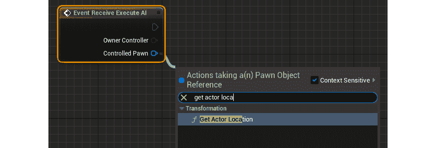

图 13.15 – 敌人实体的位置将作为随机点选择的原点

1.  将 `GetRandomLocationInNavigableRadius` 函数的向量返回值连接起来，如下截图所示。现在，此函数将使用敌人 AI 实体的位置作为确定下一个随机点的起点：

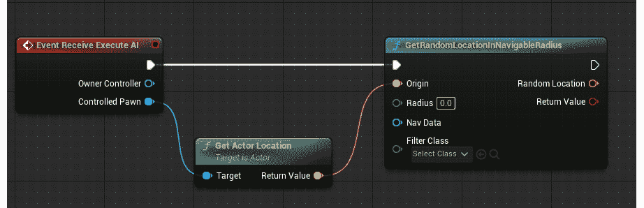

图 13.16 – 现在，敌人实体的位置将被用作随机点向量搜索的起点

1.  接下来，你需要告诉 `GetRandomLocationInNavigableRadius` 函数要检查随机点的可导航区域半径。将此值设置为 `1000.0f`。

剩余的参数 `Nav Data` 和 `Filter Class` 可以保持不变。现在，你从 `GetRandomLocationInNavigableRadius` 获取随机位置，你将需要能够将此值存储在之前在此练习中创建的 `Blackboard` 向量中。

1.  要获取 `Blackboard` 向量变量的引用，你需要在 `Task` 中创建一个新的 `Blackboard Key Selector` 类型的变量。创建此新变量并将其命名为 `NewLocation`。

1.  现在，你需要将此变量设置为 `Public` 变量，以便它可以在 `Behavior Tree` 内部暴露。*左键点击* “眼睛”图标，使眼睛可见。

1.  准备好 `Blackboard Key Selector` 变量后，*左键点击* 并拖动出此变量的 `Getter`。然后，从这个变量中拉出并搜索 `Set Blackboard Value as Vector`，如下截图所示：

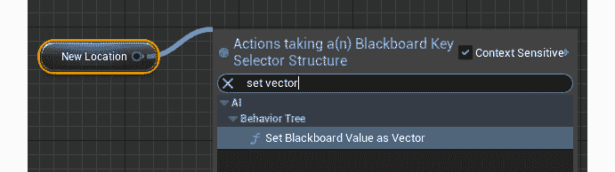

图 13.17 – 设置 Blackboard 值有多种不同类型，以支持 Blackboard 内可能存在的不同变量

1.  将`GetRandomLocationInNavigableRadius`的`RandomLocation`输出向量连接到`Set Blackboard Value as Vector`的`Value`向量输入参数。然后，连接这两个函数节点的执行引脚。结果将如下所示：

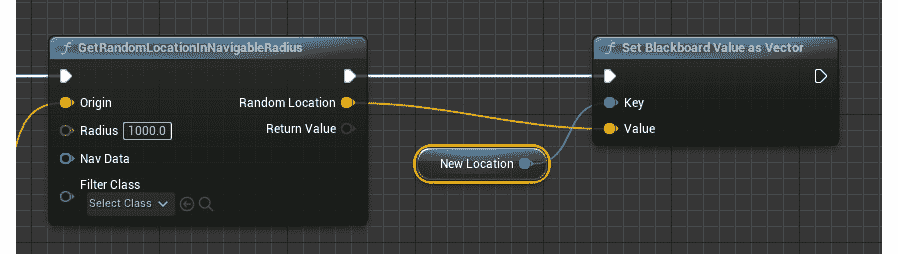

图 13.18 – 现在，黑板的向量值被分配给这个新的随机位置

最后，您将使用`GetRandomLocationInNavigableRadius`函数的`Return Value`布尔输出参数来确定任务是否执行成功。

1.  将布尔输出参数连接到`Finish Execute`函数的`Success`输入参数，并将**Set Blackboard Value as Vector**和**Finish Execute**函数节点的执行引脚连接起来。以下屏幕截图显示了**任务**逻辑的最终结果：

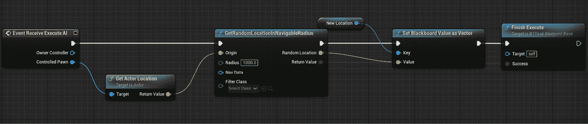

图 13.19 – 任务的最终设置

注意

您可以在以下链接中找到前一个屏幕截图的全分辨率版本，以便更好地查看：[`packt.live/3lmLyk5`](https://packt.live/3lmLyk5)。

通过完成此练习，您已创建了您的第一个自定义`行为树`并看到敌人 AI 在您的级别周围移动。

## 练习 13.06 – 创建行为树逻辑

本练习的目标是在`行为树`中实现您在上一练习中创建的新任务，以便敌人 AI 在您级别的可导航空间内找到一个随机位置，然后移动到该位置。您将使用**组合**、**任务**和**服务**节点组合来完成此行为。此练习将在 UE5 编辑器中执行。

按照以下步骤完成此练习：

1.  首先，打开您在*练习 13.04 – 创建 AI 行为树和黑板*中创建的`行为树`，即`BT_EnemyAI`。

1.  在此`行为树`内部，*左键点击*并从`Root`节点的底部拖动，选择连接到**序列**组合节点的`Root`。

1.  接下来，从**序列**节点，*左键点击*并拖动以显示上下文相关菜单。在此菜单中，搜索您在上一练习中创建的任务——即**BTTask_FindLocation**。

1.  默认情况下，`黑板`。如果未发生这种情况，您可以在任务的**详细信息**面板中手动分配此选择器。

现在，`黑板`。这意味着从任务返回的随机位置将被分配给`黑板`变量，您可以在其他任务中引用此变量。

现在您已经找到了一个有效的随机位置并将此位置分配给`黑板`变量——即**MovetoLocation**，您可以使用**移动到**任务告诉 AI 移动到该位置。

1.  *左键点击*并从`行为树`拉出时将如下所示：

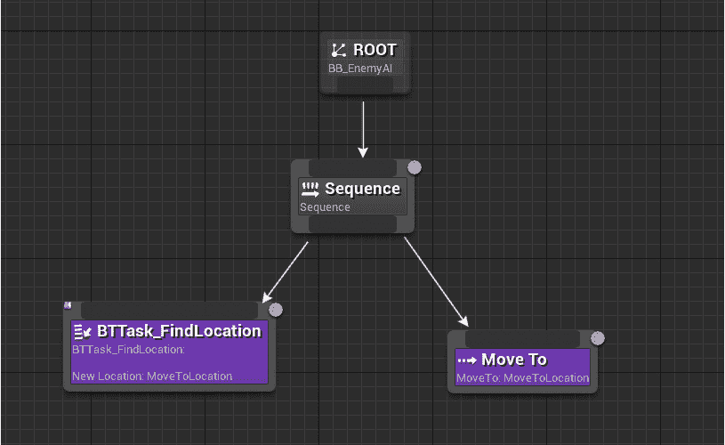

图 13.20 – 选择随机位置后，移动到任务将允许 AI 移动到这个新位置

1.  默认情况下，`50.0f`。

现在，`行为树`使用名为**MovetoLocation**的`黑板`向量变量来找到随机位置。

在这里要做的最后一件事是为**序列**组合节点添加一个装饰器，以确保在树再次执行以找到并移动到新位置之前，敌人角色不在随机位置。

1.  *右键单击**序列**节点的顶部区域并选择**添加装饰器**。从下拉菜单中，*左键单击*并选择**在位置**。

1.  由于你已经在`黑板`内部有一个向量参数，**在位置**装饰器应该自动将**移动到位置**向量变量分配为**黑板键**。通过选择装饰器并确保**黑板键**分配给**移动到位置**来验证这一点。

1.  安装了装饰器后，你就完成了`行为树`。最终结果将如下所示：

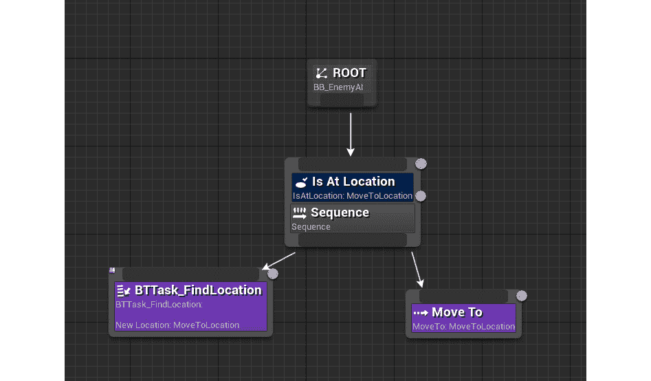

图 13.21 – AI 敌人的行为树最终设置

这个`行为树`指示 AI 使用`黑板`行为树来执行**移动到**任务，这将告诉 AI 移动到这个新的随机位置。**序列**节点被一个装饰器包裹，确保在再次执行之前敌人 AI 处于**移动到位置**状态，就像为 AI 设置了一个安全网。

1.  在你可以测试新的 AI 行为之前，请确保你已经将**BP_Enemy AI**放入你的级别，如果之前没有从练习和活动中放入的话。

1.  现在，如果你使用**PIE**或**模拟**，你会看到敌人 AI 在地图上四处跑动，并移动到**导航网格体积**内的随机位置：

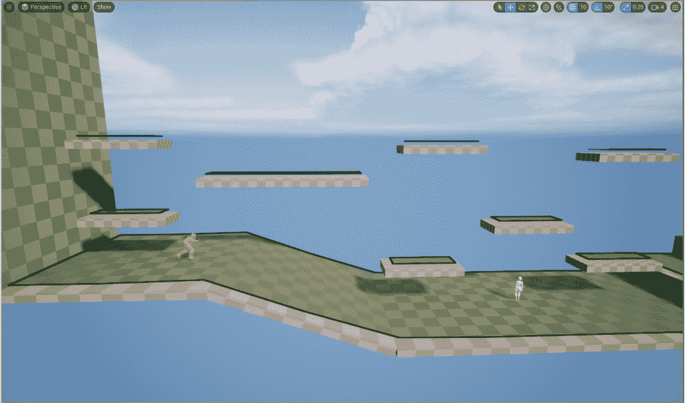

图 13.22 – 敌人 AI 现在将从位置移动到位置

注意

有一些情况下，敌人 AI 可能不会移动。这可能是由于 GetRandomLocationInNavigableRadius 函数没有返回`True`造成的。这是一个已知问题，如果发生这种情况，请重新启动编辑器并再次尝试。

1.  通过完成这个练习，你已经创建了一个完全功能的`行为树`，它允许敌人 AI 使用**导航网格体积**在您级别的可导航范围内找到并移动到随机位置。你在上一个练习中创建的任务允许你找到这个随机点，而**移动到**任务允许 AI 角色移动到这个新位置。

由于`行为树`重新开始并选择一个新的随机位置。

现在，你可以继续到下一个活动，在这个活动中，你将向此`行为树`添加内容，使 AI 在选择新的随机点之间等待，这样敌人就不会不断移动。

## 活动 13.02 – AI 移动到玩家的位置

在上一个练习中，你通过使用自定义**任务**和**移动到**任务一起，使 AI 敌人角色在**导航网格**体积内移动到随机位置。

在此活动中，你将继续从上一个练习开始，并更新`行为树`。你将通过使用装饰器利用**等待**任务，并创建一个新的自定义任务，使 AI 跟随玩家角色并每隔几秒更新其位置。

按照以下步骤完成此活动：

1.  在上一个练习中创建的**BT_EnemyAI 行为树**内部，你将继续进行并创建一个新的任务。通过从工具栏中选择**新任务**并选择**BTTask_BlueprintBase**来完成此操作。将此新任务命名为**BTTask_FindPlayer**。

1.  在**BTTask_FindPlayer**任务中，创建一个新的事件，称为**事件接收执行 AI**。

1.  查找`获取玩家角色`函数以获取对玩家的引用；确保你使用**玩家索引 0**。

1.  从玩家角色调用`获取演员位置`函数以找到玩家的当前位置。

1.  在此任务内部创建一个新的`黑板`键`选择器`变量。将此变量命名为`NewLocation`。

1.  *左键单击*并将`NewLocation`变量拖入图中。从该变量中，搜索`设置黑板值`函数作为`向量`。

1.  将`向量`函数连接到事件的**接收执行 AI**节点的执行引脚。

1.  添加`完成执行`函数，确保布尔值为`True`。

1.  最后，将`向量`函数连接到`完成执行`函数。

1.  保存并编译任务蓝图，并返回到`BT_EnemyAI` `行为树`。

1.  将**BTTask_FindLocation**任务替换为新的**BTTask_FindPlayer**任务，以便此新任务现在是**序列**组合节点下的第一个任务。

1.  在**序列**组合节点下添加一个新的**播放声音**任务，作为第三个任务，在自定义的**BTTask_FindLocation**和**移动到**任务之后。

1.  在`要播放的声音`参数中，添加**爆炸 _Cue 声音 Cue**资产。

1.  将**是否在位置**装饰器添加到**播放声音**任务中，并确保将**移动到位置**键分配给此**装饰器**。

1.  在**序列**组合节点下添加一个新的**等待**任务，作为第四个任务，在**播放声音**任务之后。

1.  在成功完成之前设置`2.0f`秒。

预期输出如下：

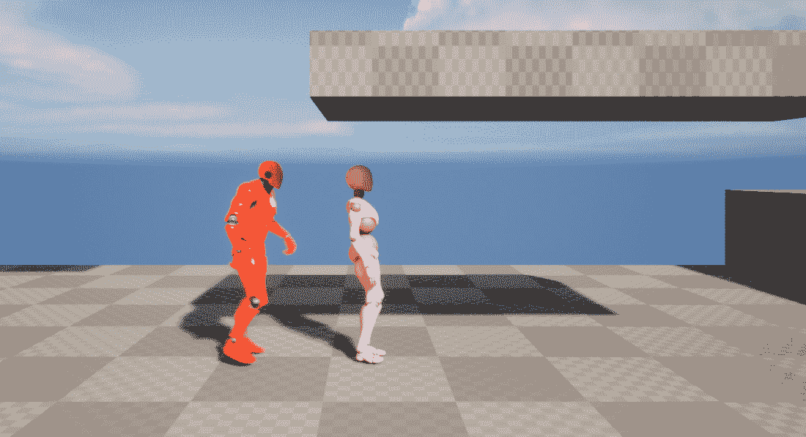

图 13.23 – 敌人 AI 跟随玩家并每 2 秒更新到玩家的位置

敌人 AI 角色将在关卡的可导航空间中移动到玩家的最后已知位置，并在每个玩家位置之间暂停`2.0f`秒。

注意

这个活动的解决方案可以在 GitHub 上找到：[`github.com/PacktPublishing/Elevating-Game-Experiences-with-Unreal-Engine-5-Second-Edition/tree/main/Activity%20solutions`](https://github.com/PacktPublishing/Elevating-Game-Experiences-with-Unreal-Engine-5-Second-Edition/tree/main/Activity%20solutions)。

完成这个活动后，你已经学会了如何创建一个新任务，允许 AI 找到玩家的位置并移动到玩家最后已知的位置。在继续下一组练习之前，请删除`Behavior` `Tree`返回正确。你将在接下来的练习中使用**BTTask_FindLocation**任务。

在下一个练习中，你将通过开发一个新的蓝图演员来解决这个问题，这将允许你设置 AI 可以移动到的特定位置。

## 练习 13.07 – 创建敌人巡逻位置

当前 AI 敌人角色的问题在于，由于`行为树`允许它们在该 3D 可导航空间内找到随机位置，它们可以自由移动。相反，AI 需要被赋予你可以指定和更改的巡逻点。然后，它将随机选择这些巡逻点中的一个进行移动。这就是你将在`SuperSideScroller`游戏中做的事情：创建敌人 AI 可以移动到的巡逻点。这个练习将向你展示如何使用简单的**蓝图**演员创建这些巡逻点。这个练习将在 UE5 编辑器内进行。

按照以下步骤完成此练习：

1.  首先，导航到**/Enemy/Blueprints/**目录。这是你将创建用于 AI 巡逻点的新蓝图演员的地方。

1.  在这个目录中，*右键点击*并选择**蓝图类**选项，通过*左键点击*菜单中的此选项。

1.  从`Actor`类：

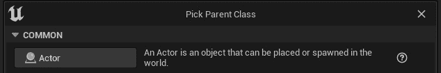

图 13.24 – **Actor**类是所有可以放置或生成在游戏世界中的对象的基类

1.  将这个新资产命名为**BP_AIPoints**，并通过在**内容抽屉**界面中双击该资产来打开这个蓝图。

注意

蓝图的界面与其他系统（如动画蓝图和任务）共享许多相同的功能和布局，所以这些应该对你来说都很熟悉。

1.  导航到`Points`。

1.  从**变量类型**下拉菜单中，*左键点击*并选择**向量**选项。

1.  接下来，你需要将这个向量变量转换为**数组**，这样你就可以存储多个巡逻位置。*左键点击*旁边黄色的**向量**图标，然后*左键点击*选择**数组**选项。

1.  设置“显示”**3D 小部件**选项的最后一步仅适用于涉及演员变换的变量，例如向量和变换。

在简单的演员设置完成后，现在是时候将演员放置到关卡中并开始设置巡逻点位置了。

1.  将**BP_AIPoints**演员蓝图添加到你的关卡中，如图下所示：

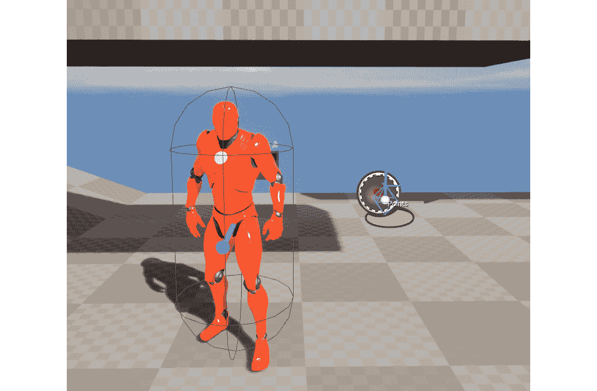

图 13.25 – BP_AIPoints 演员现在位于关卡中

1.  在选择**BP_AIPoints**演员后，导航到其**详细信息**面板并找到**点**变量。

1.  接下来，你可以通过*左键点击***+**符号来向向量数组添加一个新元素，如图所示：

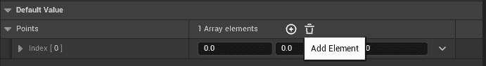

图 13.26 – 你可以在数组内部包含许多元素，但数组越大，分配的内存就越多

1.  当你向向量数组添加新元素时，你会看到一个 3D 小部件出现，你可以通过*左键点击*来选择并移动它，如图所示：

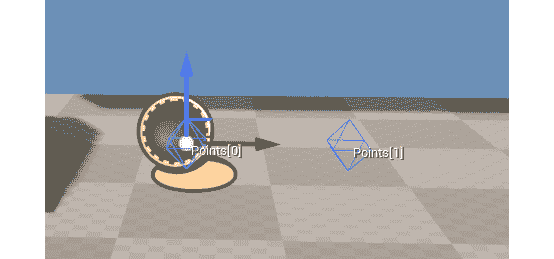

图 13.27 – 首个巡逻点向量位置

注意

当你更新代表向量数组元素的 3D 小部件的位置时，**点**变量的详细信息面板中的 3D 坐标将更新。

1.  最后，根据你的关卡上下文，将尽可能多的元素添加到向量数组中。请注意，这些巡逻点的位置应该对齐，以便它们在水平轴上形成一条直线，与角色移动的方向平行。以下截图显示了本练习中包含的示例`SideScroller.umap`关卡中的设置：

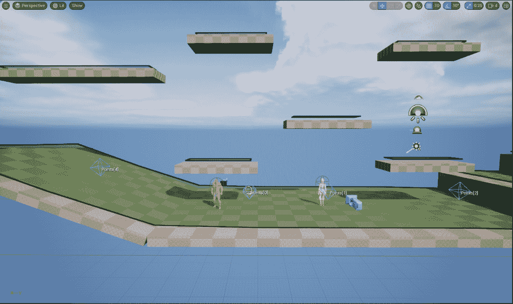

图 13.28 – 示例巡逻点路径，如图在 SideScroller.umap 示例关卡中所示

1.  继续重复之前的步骤以创建多个巡逻点，并按照你的喜好定位 3D 小部件。你可以使用提供的**SideScroller.umap**示例关卡作为如何设置这些巡逻点的参考。

通过完成这个练习，你已经创建了一个新的`行为树`，以便 AI 可以在这些巡逻点之间移动。在你设置这个功能之前，让我们更多地了解向量和向量变换，因为这方面的知识将在下一个练习中非常有用。

# 向量变换

在你开始下一个练习之前，了解向量变换非常重要，更重要的是了解`Transform Location`函数的功能。当涉及到演员的位置时，有两种思考其位置的方式：世界空间和本地空间。演员在世界空间中的位置是相对于世界本身的；用更简单的话说，这就是你在关卡中放置演员的位置。演员的本地位置是相对于它自己或父演员的位置。

让我们以**BP_AIPoints**演员为例，来考虑什么是世界空间和本地空间。**Points**数组的每个位置都是一个本地空间向量，因为它们是相对于**BP_AIPoints**演员本身的世界空间位置的。以下截图显示了与之前练习中所示相同的**Points**数组中的向量列表。这些值是相对于你在关卡中**BP_AIPoints**演员的位置的：

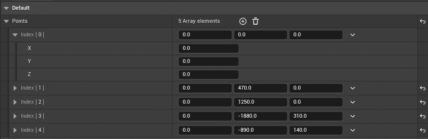

图 13.29 – Points 数组相对于 BP_AIPoints 演员世界空间位置的本地空间位置向量

为了让敌人 AI 移动到这些点的正确世界空间位置，你需要使用一个名为`Transform Location`的函数。这个函数接受两个参数：

+   `T`：这是你将用来将向量位置参数从本地空间值转换为世界空间值的变换。

+   `位置`：这是要将本地空间转换为世界空间的那个位置。

向量变换的结果随后作为函数的返回值返回。你将在下一个练习中使用这个函数从`Points`数组中返回一个随机选择的向量点，并将该值从本地空间向量转换为世界空间向量。这个新的世界空间向量将被用来告诉敌人 AI 相对于世界应该移动到哪里。现在让我们来实现这个功能。

## 练习 13.08 – 在数组中选择一个随机点

现在你对向量和向量变换有了更多的了解，在这个练习中，你将创建一个简单的`Blueprint`函数来选择一个*巡逻点*向量位置，并使用一个名为`Behavior Tree`的内置函数将它的向量从本地空间值转换为世界空间值，以便 AI 能够移动到正确的位置。这个练习将在 UE5 编辑器中执行。

按照以下步骤完成这个练习。让我们先创建一个新的函数：

1.  返回到`GetNextPoint`。

1.  在你向这个函数添加逻辑之前，通过在**函数**类别下**左键单击**这个函数来选择它，以便访问其**详细信息**面板。

1.  在 **详细信息** 面板中，启用 **纯** 参数，以便此函数被标记为 **纯函数**。你曾在 *第十一章* 中学习过 **纯函数**，即 *使用 Blend Space 1D、按键绑定和状态机* 时的操作；这里发生的是同样的事情。

1.  接下来，`GetNextPoint` 函数需要返回一个 `Behavior Tree` 可以用来告诉敌人 AI 去哪里移动的向量。通过如下截图所示的 *左键点击* 在 `NextPoint` 上添加这个新输出：

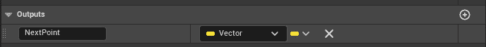

图 13.30 – 函数可以根据你的逻辑需求返回不同类型的多个变量

1.  当添加一个 **输出** 变量时，函数将自动生成一个 **返回** 节点并将其放置在函数图中，如下面的截图所示。你将使用此输出来返回敌人 AI 移动到的新向量巡逻点：


图 13.31 – 函数自动生成的返回节点，包括 Next Point 向量输出变量

现在函数的基础工作已经完成，让我们开始添加逻辑。

1.  要选择一个随机位置，首先，你需要找到 `Points` 数组的长度。创建一个 `Points` 向量，并从这个向量变量中，*左键点击* 并拖动以搜索 `Length` 函数，如下面的截图所示：

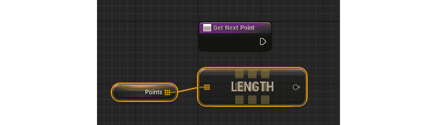

图 13.32 – 长度函数是一个纯函数，它返回数组的长度

1.  使用 `Length` 函数的整数输出，*左键点击* 并拖动以使用上下文相关搜索找到 `Random Integer` 函数，如下面的截图所示。`Random Integer` 函数返回一个介于 `0` 和 `最大值` 之间的随机整数；在这种情况下，这是 `Points` 向量数组的长度：

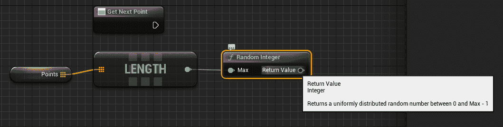

图 13.33 – 使用随机整数将允许函数从 Points 向量数组返回一个随机向量

在这里，你正在生成一个介于 0 和 `Points` 向量数组长度的随机整数。接下来，你需要找到 `Points` 向量数组中返回的 `Random Integer` 函数的索引位置。

1.  通过创建一个新的 `Points` 向量数组获取器来完成此操作。然后，*左键点击* 并拖动以搜索 `Get(a copy)` 函数。

1.  接下来，将`Random Integer`函数的返回值连接到`Get (a copy)`函数的输入。这将告诉函数选择一个随机整数，并使用该整数作为索引从`Points`向量数组中返回。

现在你从`Points`向量数组中获取一个随机向量，你需要使用`Transform Location`函数将位置从局部空间向量转换为世界空间向量。

如你所学，`Points`向量数组中的向量是相对于`BP_AIPoints`演员在关卡中的位置的局部空间位置。因此，你需要使用`Transform Location`函数将随机选择的局部空间向量转换为世界空间向量，以便 AI 敌人移动到正确的位置。

1.  *左键点击* 并从`Get(a copy)`函数的向量输出开始拖动，通过上下文相关搜索找到`Transform Location`函数。

1.  将`Get(a copy)`函数的向量输出连接到`Transform Location`函数的`Location`输入。

1.  最终步骤是使用蓝图演员本身的变换作为`Transform Location`函数的`T`参数。通过在图中*右键点击*，并通过上下文相关搜索找到`GetActorTransform`函数，并将其连接到`Transform Location`参数`T`。

1.  最后，将`Transform Location`函数的`Return Value`向量连接到函数的`NewPoint`向量输出：

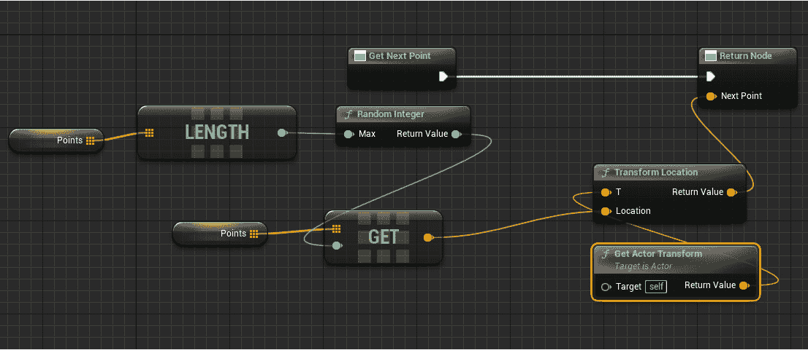

图 13.34 – GetNextPoint 函数的最终逻辑已设置

注意

你可以在以下链接中找到完整分辨率的先前列表，以便更好地查看：[`packt.live/35jlilb`](https://packt.live/35jlilb)。

通过完成此练习，你已在`Points`数组变量中创建了一个新的蓝图函数，使用`Transform Location`函数将其转换为世界空间向量值，并返回这个新的向量值。你将在`行为树`中使用此函数，以便敌人移动到你设置的其中一个点。在你能够这样做之前，敌人 AI 需要一个对**BP_AIPoints**演员的引用，以便它知道可以从哪些点中选择并移动。我们将在以下练习中这样做。

## 练习 13.09 – 引用巡逻点演员

现在将`敌人角色蓝图`的对象引用变量分配给`Object Reference`变量。

注意

一个`Object Reference`变量存储对特定类对象或演员的引用。使用此变量，你可以访问该类公开的变量、事件和函数。

按照以下步骤完成此练习：

1.  导航到`/Enemy/Blueprints/`目录，并通过*双击* **内容抽屉**界面中的资产打开敌人角色蓝图**BP_Enemy**。

1.  创建一个新的`BP_AIPoints`类型的变量，并确保该变量是`对象引用`变量类型。

1.  为了引用现有的`实例可编辑`参数，将此变量命名为`Patrol Points`。

1.  现在您已经设置了对象引用，导航到您的关卡并选择您的敌人 AI。以下截图显示了放置在提供的示例关卡中的敌人 AI – 即，`SuperSideScroller.umap`。如果您关卡中没有敌人，请现在放置一个：

注意

将敌人放置到关卡中的操作与 UE5 中任何其他角色的操作相同：*左键点击* 并将敌人 AI 蓝图从**内容抽屉**界面拖动到关卡中。

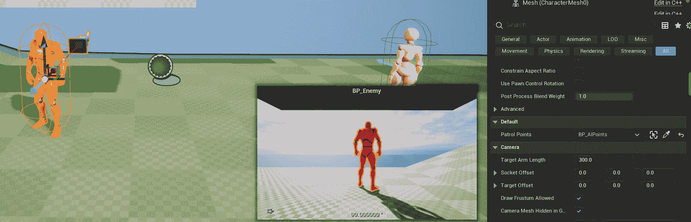

图 13.35 – 放置在 SuperSideScroller.umap 关卡中的敌人 AI

1.  从我们已经在关卡中放置的`BP_AIPoints`变量下的`Patrol Points`变量开始。通过*左键点击* `Patrol Points`变量的下拉菜单并从列表中找到角色来完成此操作。

完成此练习后，您关卡中的敌人 AI 现在有一个对关卡中**BP_AIPoints**角色的引用。有了有效的引用，敌人 AI 可以使用此角色来确定在**BTTask_FindLocation**任务中移动到哪个点集。现在剩下的唯一任务是更新**BTTask_FindLocation**任务，使其使用这些点而不是随机查找位置。

## 练习 13.10 – 更新 BTTask_FindLocation

完成敌人 AI 巡逻行为的最后一步是替换`GetNextPoint`函数中的逻辑，从**BP_AIPoints**角色而不是在您关卡的可导航空间内随机查找位置。此练习将在 UE5 编辑器中执行。

作为提醒，回到*练习 13.05 – 创建新的行为树任务*，看看在开始之前**BTTask_FindLocation**任务看起来是什么样子。

按照以下步骤完成此练习：

1.  首先，您必须从上一个练习中获取返回的`巡逻点`对象引用变量：


图 13.36 – 强制转换也确保返回的受控角色是 BP_Enemy 类类型

1.  接下来，您可以通过*左键点击* 并从`Patrol Points`拖动来访问`Patrol Points`对象引用变量。

1.  从`巡逻点`引用中，您可以*左键点击* 并拖动以搜索您在*练习 13.08 – 在数组中选择随机点*中创建的`GetNextPoint`函数。

1.  现在，你可以将 `GetNextPoint` 函数的 `NextPoint` 向量输出参数连接到 `Set Blackboard Value as Vector` 函数，并将从抛光到 `Set Blackboard Value as Vector` 函数的执行引脚连接起来。现在，每次执行 **BTTask_FindLocation** 任务时，都会设置一个新的随机巡逻点。

1.  最后，将 `Set Blackboard Value as Vector` 函数连接到 `Finish Execute` 函数，并手动将 `Success` 参数设置为 `True`，这样如果抛光成功，这个任务将始终成功。

1.  作为一种安全措施，创建 `Cast` 函数的副本。然后，将 `Success` 参数设置为 `False`。这将作为一个安全措施，以防万一，如果 `BP_Enemy` 类，任务将失败。这是确保任务对其预期 AI 类的功能性的良好调试实践：

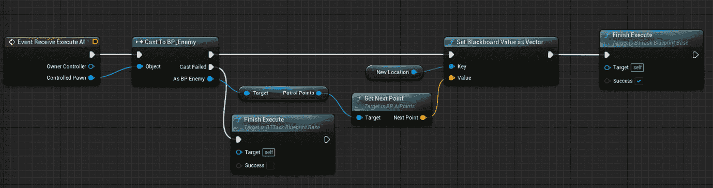

图 13.37 – 在你的逻辑中考虑到任何抛光失败始终是一个好的实践

注意

你可以在以下链接中找到前面截图的全分辨率版本，以便更好地查看：[`packt.live/3n58THA`](https://packt.live/3n58THA)。

将 **BTTask_FindLocation** 任务更新为使用敌人中 **BP_AIPoints** 演员引用的随机巡逻点后，敌人 AI 现在将在随机巡逻点之间移动：

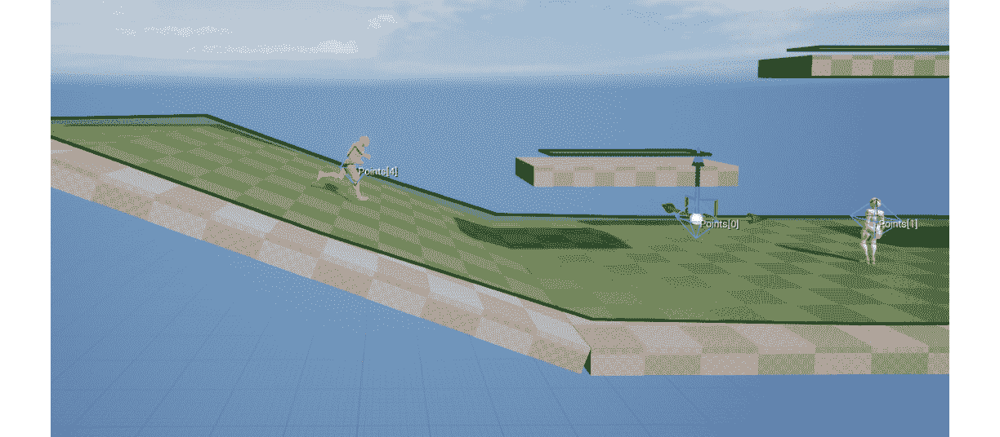

图 13.38 – 敌人 AI 现在在关卡中的巡逻点位置之间移动

完成这个练习后，敌人 AI 现在将使用关卡中 **BP_AIPoints** 演员的引用来找到并移动到关卡中的巡逻点。关卡中每个敌人角色的实例都可以有一个指向 **BP_AIPoints** 演员另一个唯一实例的引用，或者可以共享相同的实例引用。如何让每个敌人 AI 在关卡中移动取决于你。

# 玩家投射物

对于本章的最后部分，你将专注于创建玩家投射物的基座，它可以用来摧毁敌人。目标是创建适当的演员类，向该类引入所需的碰撞和投射物移动组件，并为投射物的运动行为设置必要的参数。

为了简化，玩家弹道将不会使用重力，将一击摧毁敌人，并且弹道本身在击中任何表面时将被销毁；例如，它不会从墙上弹回。玩家弹道的主要目标是拥有一个玩家可以生成并用于在整个关卡中摧毁敌人的弹道。在本章中，你将设置框架的基本功能，而在 *第十四章* *生成玩家弹道* 中，你将添加声音和视觉效果。让我们从创建 `PlayerProjectile` 类开始吧。

## 练习 13.11 – 创建玩家弹道

到目前为止，我们一直在 UE5 编辑器中创建我们的敌人 AI。对于 `player projectile` 类，我们将使用 C++ 和 Visual Studio。玩家弹道将允许玩家摧毁放置在关卡中的敌人。这个弹道将具有短暂的生命周期，以高速移动，并且可以与敌人和环境发生碰撞。

本练习的目标是为玩家弹道设置基演员类，并在头文件中开始概述所需的函数和组件。

按照以下步骤完成此练习：

1.  首先，你需要创建一个新的 C++ 类，使用 `Actor` 类作为玩家弹道的父类。接下来，将这个新的演员类命名为 `PlayerProjectile`，并在菜单提示的右下角 *Create Class* 选项上 *左键点击*。

创建新类后，Visual Studio 将为该类生成所需的源文件和头文件，并为你打开这些文件。`Actor` 基类包含了一些默认函数，这些函数对于玩家弹道不是必需的。

1.  在 `PlayerProjectile.h` 文件中找到以下代码行并将其删除：

    ```cpp
    protected:
      // Called when the game starts or when spawned
      virtual void BeginPlay() override;
    public:
      // Called every frame
      virtual void Tick(float DeltaTime) override;
    ```

这些代码行代表了在基于 Actor 的每个类中默认包含的 `Tick()` 和 `BeginPlay()` 函数的声明。`Tick()` 函数在每一帧被调用，允许你在每一帧执行逻辑，这可能会根据你尝试做的事情变得昂贵。`BeginPlay()` 函数在演员初始化和游戏开始时被调用。这可以用来在演员进入世界后立即执行逻辑。我们正在删除这些函数，因为它们对于玩家弹道不是必需的，并且只会使代码变得杂乱。

1.  在从 `PlayerProjectile.h` 头文件中删除这些行之后，你也可以从 `PlayerProjectile.cpp` 源文件中删除以下行：

    ```cpp
    // Called when the game starts or when spawned
    void APlayerProjectile::BeginPlay()
    {
      Super::BeginPlay();
    }
    // Called every frame
    void APlayerProjectile::Tick(float DeltaTime)
    {
      Super::Tick(DeltaTime);
    }
    ```

这些代码行代表了之前步骤中移除的两个函数的实现——即`Tick()`和`BeginPlay()`。同样，这些函数被移除是因为它们对玩家弹射物没有任何作用，只是增加了代码的杂乱。此外，如果没有在`PlayerProjectile.h`头文件中的声明，如果你尝试直接编译此代码，你会收到编译错误。唯一剩下的函数将是弹射物类的构造函数，你将在下一个练习中使用它来初始化弹射物的组件。现在你已经从`PlayerProjectile`类中移除了不必要的代码，让我们添加弹射物所需的函数和组件。

1.  在`PlayerProjectile.h`头文件内部，添加以下组件：

    ```cpp
    public:
      //Sphere collision component
      UPROPERTY(VisibleDefaultsOnly, Category = 
      Projectile)
      class USphereComponent* CollisionComp;

    private:
      //Projectile movement component
      UPROPERTY(VisibleAnywhere, BlueprintReadOnly, 
      Category = Movement, meta = 
      (AllowPrivateAccess = "true"))
      class UProjectileMovementComponent* 
      ProjectileMovement;
      //Static mesh component
      UPROPERTY(EditAnywhere, Category = Projectile)
      class UStaticMeshComponent* MeshComp;
    ```

你在这里添加了三个不同的组件。第一个是碰撞组件，你将使用它来使弹射物能够识别与敌人和环境资产的碰撞。下一个组件是弹射物运动组件，你应该从上一个项目中熟悉它。这将使弹射物表现得像弹射物。最后一个组件是`StaticMeshComponent`。你将使用它来给弹射物一个视觉表示，以便在游戏中可以看到它。

1.  接下来，在`PlayerProjectile.h`头文件中，在`public`访问修饰符下添加以下函数签名代码：

    ```cpp
    UFUNCTION()
    void OnHit(UPrimitiveComponent* HitComp, AActor* OtherActor, 
      UPrimitiveComponent* OtherComp, FVector 
      NormalImpulse, const FHitResult& 
      Hit);
    ```

这个最终的事件声明将使玩家弹射物能够响应你在上一步中创建的`CollisionComp`组件的`OnHit`事件。

1.  为了使此代码编译，你需要在`PlayerProjectile.cpp`源文件中实现上一步中的函数。添加以下代码：

    ```cpp
    void APlayerProjectile::OnHit(UPrimitiveComponent* HitComp, AActor* 
      OtherActor, UPrimitiveComponent* OtherComp, FVector 
      NormalImpulse, const 
      FHitResult& Hit)
    {
    }
    ```

`OnHit`事件为你提供了关于发生的碰撞的大量信息。在下一个练习中，你将与之合作的最重要参数是`OtherActor`参数。`OtherActor`参数将告诉你这个`OnHit`事件正在响应的角色。这将使你知道这个其他角色是否是敌人。当弹射物击中它们时，你将使用这些信息来摧毁敌人。

1.  最后，返回到 Unreal Engine 编辑器，*左键点击* **编译**选项来编译新的代码。

完成这个练习后，你现在已经为`PlayerProjectile`类准备好了框架。这个类包含了`OnHit`碰撞所需的组件，以便弹射物能够识别与其他角色的碰撞。

在下一个练习中，你将继续定制和启用`PlayerProjectile`的参数，以便它在`SuperSideScroller`项目中表现出你所需要的特性。

## 练习 13.12 - 初始化 PlayerProjectile 类的设置

现在，`PlayerProjectile`类的框架已经建立，是时候更新这个类的构造函数，以包含弹道所需的默认设置，以便它能够按照你的期望移动和表现。为此，你需要初始化**弹道运动**、**碰撞**和**静态网格**组件。

按照以下步骤完成这个练习：

1.  打开 Visual Studio 并导航到`PlayerProjectile.cpp`源文件。

1.  在向构造函数添加任何代码之前，请将以下文件包含在`PlayerProjectile.cpp`源文件内部：

    ```cpp
    #include "GameFramework/ProjectileMovementComponent.h"
    #include "Components/SphereComponent.h"
    #include "Components/StaticMeshComponent.h"
    ```

这些头文件将允许你初始化和更新弹道运动组件、球体碰撞组件和`StaticMeshComponent`的参数。没有这些文件，`PlayerProjectile`类将不知道如何处理这些组件以及如何访问它们的函数和参数。

1.  默认情况下，`APlayerProjectile::APlayerProjectile()`构造函数包括以下行：

    ```cpp
    PrimaryActorTick.bCanEverTick = true;
    ```

这行代码可以完全删除，因为它在玩家弹道中不是必需的。

1.  在`PlayerProjectile.cpp`源文件中，向`APlayerProjectile::APlayerProjectile()`构造函数中添加以下行：

    ```cpp
    CollisionComp = CreateDefaultSubobject
      <USphereComponent>(TEXT("SphereComp"));
    CollisionComp->InitSphereRadius(15.0f);
    CollisionComp->BodyInstance.SetCollisionProfileName("BlockAll");
    CollisionComp->OnComponentHit.AddDynamic(this, &APlayerProjectile::OnHit);
    ```

第一行初始化球体碰撞组件并将其分配给你在上一个练习中创建的`CollisionComp`变量。球体碰撞组件有一个名为`InitSphereRadius`的参数。这将默认确定碰撞 actor 的大小或半径；在这种情况下，`15.0f`的值效果很好。接下来，`SetCollisionProfileName`将碰撞组件设置为`BlockAll`，以便将碰撞配置设置为`BlockAll`。这意味着此碰撞组件在与其他对象碰撞时会响应`OnHit`。最后，你添加的最后一行允许`OnComponentHit`事件响应你在上一个练习中创建的函数：

```cpp
void APlayerProjectile::OnHit(UPrimitiveComponent* HitComp, AActor* 
  OtherActor, UPrimitiveComponent* OtherComp, FVector 
  NormalImpulse, const 
  FHitResult& Hit)
{
}
```

这意味着当碰撞组件从碰撞事件接收到`OnComponentHit`事件时，它将以该函数响应；然而，这个函数目前是空的。你将在本章的后面添加代码到这个函数中。

注意

你可以在[`docs.unrealengine.com/4.26/en-US/InteractiveExperiences/Physics/Collision/HowTo/AddCustomCollisionType/`](https://docs.unrealengine.com/4.26/en-US/InteractiveExperiences/Physics/Collision/HowTo/AddCustomCollisionType/)了解更多关于如何创建自定义碰撞配置的信息。

1.  使用`碰撞组件`的最后一步是将此组件设置为玩家弹道 actor 的`根组件`。在*步骤 4*的行之后，向构造函数中添加以下代码行：

    ```cpp
    // Set as root component
    RootComponent = CollisionComp;
    ```

1.  在设置好并准备就绪的碰撞组件之后，让我们继续到`弹道运动`组件。在构造函数中添加以下行：

    ```cpp
    // Use a ProjectileMovementComponent to govern this projectile's movement
    ProjectileMovement = 
      CreateDefaultSubobject<
      UProjectileMovementComponent>(
      TEXT("ProjectileComp"))
      ;
    ProjectileMovement->UpdatedComponent = CollisionComp;
    ProjectileMovement->ProjectileGravityScale = 0.0f;
    ProjectileMovement->InitialSpeed = 800.0f;
    ProjectileMovement->MaxSpeed = 800.0f;
    ```

这第一行初始化 `ProjectileMovementComponent` 并将其分配给在上一练习中创建的 `ProjectileMovement` 变量。接下来，我们将 `CollisionComp` 设置为投射物运动组件的更新组件。我们这样做的原因是 `ProjectileMovementComponent` 将使用角色的 `Root` 作为移动的组件。然后，我们将投射物的重力比例设置为 `0.0f`，因为玩家投射物不应受到重力的影响；这种行为应允许投射物以相同的速度、相同的高度移动，并且不受重力的影响。最后，我们将 `InitialSpeed` 和 `MaxSpeed` 参数都设置为 `500.0f`。这将允许投射物以这个速度立即开始移动，并在其生命周期的整个过程中保持这个速度。玩家投射物将不支持任何类型的加速运动。

1.  在初始化并设置投射物运动组件后，现在是时候对 `StaticMeshComponent` 做同样的事情了。在上一步骤的行之后添加以下代码：

    ```cpp
    MeshComp = 
    CreateDefaultSubobject<UStaticMeshComponent>(TEXT("MeshComp"));
    MeshComp->AttachToComponent(RootComponent, 
      FAttachmentTransformRules::KeepWorldTransform);
    ```

这第一行初始化 `StaticMeshComponent` 并将其分配给在上一练习中创建的 `MeshComp` 变量。然后，它使用一个名为 `FAttachmentTransformRules` 的结构将此 `StaticMeshComponent` 附接到 `RootComponent` 上，以确保在附加过程中 `StaticMeshComponent` 保持其世界变换，即本练习的 *第 5 步* 中的 `CollisionComp`。

注意

您可以在此处找到有关 `FAttachmentTransformRules` 结构的更多信息：[`docs.unrealengine.com/en-US/API/Runtime/Engine/Engine/FAttachmentTransformRules/index.xhtml`](https://docs.unrealengine.com/en-US/API/Runtime/Engine/Engine/FAttachmentTransformRules/index.xhtml)。

1.  最后，让我们给 `PlayerProjectile` 设置一个初始生命周期为 `3` 秒，这样如果在这个时间后投射物没有与任何东西发生碰撞，它将自动被销毁。将以下代码添加到构造函数的末尾：

    ```cpp
    InitialLifeSpan = 3.0f;
    ```

1.  最后，返回 Unreal Engine 编辑器并 *左键单击* **编译** 选项来编译新的代码。

通过完成这个练习，您已经为 **Player Projectile** 奠定了基础，使其可以在编辑器内部作为 Blueprint actor 创建。所有三个必需的组件都已初始化，并包含您希望为这个投射物设置的默认参数。我们现在需要做的就是从这个类创建 Blueprint，以便在关卡中看到它。

## 活动 13.03 – 创建玩家投射物 Blueprint

为了结束本章，您将从新的 `PlayerProjectile` 类创建 Blueprint actor，并自定义此 actor，使其使用占位符形状为 `UE_LOG()` 函数到 `PlayerProjectile.cpp` 源文件中的 `APlayerProjectile::OnHit` 函数，以确保当投射物与关卡中的对象接触时，此函数被调用。

按照以下步骤操作：

1.  在 `/MainCharacter` 目录下的 `Projectile` 中。

1.  在此目录下，从 `PlayerProjectile` 类创建一个新的蓝图，该类是在 *练习 13.11 – 创建玩家投射物* 中创建的。将此蓝图命名为 `BP_PlayerProjectile`。

1.  打开 `MeshComp` 组件以访问其设置。

1.  将 `Shape_Sphere` 网格添加到 `MeshComp` 组件的 `Static Mesh` 参数。

1.  更新 `MeshComp` 的变换，使其适合 `Scale and Location of the CollisionComp` 组件。使用以下值：

    ```cpp
    Location:(X=0.000000,Y=0.000000,Z=-10.000000)
    Scale: (X=0.200000,Y=0.200000,Z=0.200000)
    ```

1.  编译并保存 **BP_PlayerProjectile** 蓝图。

1.  导航到 Visual Studio 中的 `PlayerProjectile.cpp` 源文件，并找到 `APlayerProjectile::OnHit` 函数。

1.  在函数内部，实现 `UE_LOG` 调用，以便记录的行是 `HIT`。`UE_LOG`，如在前面的 *第十一章* 中所述，*使用一维混合空间、按键绑定和状态机*。

1.  编译你的代码更改，并导航到上一个练习中放置 **BP_PlayerProjectile** 实例的关卡。如果你还没有将此实例添加到关卡中，请现在添加。

1.  在测试之前，确保在 **窗口** 下打开 **输出日志**。从 **窗口** 下拉菜单中，将鼠标悬停在 **开发者工具** 选项上，然后 *左键单击* 选择 **输出日志**。

1.  使用 `PIE` 并注意当投射物与物体碰撞时 **输出日志** 中的日志警告。

以下为预期输出：

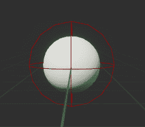

图 13.39 – MeshComp 的比例更适合 CollisionComp 的大小

日志警告应如下所示：

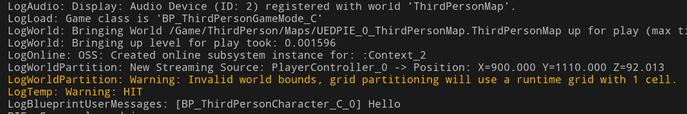

图 13.40 – 当投射物击中物体时，输出日志区域显示 HIT

在完成这个最终活动后，更新 `Throw` 动作。你将更新 `APlayerProjectile::OnHit` 函数，使其摧毁与之碰撞的敌人，并成为玩家对抗敌人的有效进攻工具。

注意

本活动的解决方案可以在 GitHub 上找到：[`github.com/PacktPublishing/Elevating-Game-Experiences-with-Unreal-Engine-5-Second-Edition/tree/main/Activity%20solutions`](https://github.com/PacktPublishing/Elevating-Game-Experiences-with-Unreal-Engine-5-Second-Edition/tree/main/Activity%20solutions)。

# 摘要

在本章中，你学习了如何使用 UE5 提供的 AI 工具的不同方面，包括 `Blackboards`、`Behavior Trees` 和 AI 控制器。通过结合自定义创建的任务和 UE5 提供的默认任务，以及装饰器，你能够使敌人 AI 在你添加到关卡中的导航网格范围内导航。

在此基础上，你创建了一个新的`Blueprint`演员，它允许你使用`Vector`数组变量添加巡逻点。然后，你为这个演员添加了一个新功能，该功能随机选择这些点中的一个，将其位置从局部空间转换为世界空间，然后返回这个新值供敌人角色使用。

通过能够随机选择巡逻点，你更新了自定义的`BTTask_FindLocation`任务，以找到并移动到所选的巡逻点，使敌人能够随机地从每个巡逻点移动。这使敌人 AI 角色的交互在玩家和环境方面达到了全新的水平。

最后，你创建了`PlayerProjectile`类，玩家将能够使用它来摧毁环境中的敌人。你利用了`Projectile Movement Component`和`Sphere Component`，以实现弹射物的移动，并能够识别和响应环境中的碰撞。

当`PlayerProjectile`类处于功能状态时，是时候进入下一章了，在那里你将使用`Anim Notifies`在玩家使用`Throw`动作时生成弹射物。
