# 第十六章：多人基础入门

在上一章中，我们完成了 SuperSideScroller 游戏，并使用了 1D 混合空间、动画蓝图和动画蒙太奇。在本章中，我们将在此基础上构建知识，并学习如何使用 Unreal Engine 为游戏添加多人功能。

在过去十年中，多人游戏已经发展得相当大。像《堡垒之夜》、《英雄联盟》、《火箭联盟》、《守望先锋》和《反恐精英：全球攻势》这样的游戏在游戏社区中获得了巨大的流行，并取得了巨大的成功。如今，几乎所有的游戏都需要某种多人游戏体验才能更加相关和成功。

原因在于它为现有的游戏玩法增加了一层新的可能性，例如能够以合作模式（也称为在线合作）远程与朋友一起玩，或者与世界各地的玩家对战，这大大增加了游戏的生命力和价值。

在本章中，我们将涵盖以下主要主题：

+   多人基础介绍

+   理解服务器

+   理解客户端

+   项目打包

+   探索连接和所有权

+   了解角色

+   理解变量复制

+   探索二维混合空间

+   变换（修改）骨骼

到本章结束时，你将了解基本的多人游戏概念，例如服务器-客户端架构、连接、演员所有权、角色和变量复制，这样你就可以创建自己的多人游戏。你还将能够制作二维混合空间，这允许你在二维网格中混合动画。最后，你将学习如何使用变换（修改）骨骼节点来控制骨骼网格在运行时的骨骼。

# 技术要求

对于本章，你需要以下技术要求：

+   已安装 Unreal Engine 5

+   已安装 Visual Studio 2019

本章的项目可以在本书代码包的 `Chapter16` 文件夹中找到，可以在此处下载：[`github.com/PacktPublishing/Elevating-Game-Experiences-with-Unreal-Engine-5-Second-Edition`](https://github.com/PacktPublishing/Elevating-Game-Experiences-with-Unreal-Engine-5-Second-Edition)。

在下一节中，我们将讨论多人游戏的基础知识。

# 多人基础介绍

在游戏过程中，你可能经常听到多人游戏这个术语，但对于游戏开发者来说，它意味着什么呢？实际上，多人游戏只是一组通过网络（互联网或局域网）从服务器发送到其连接客户端的指令，以给玩家营造一个共享世界的错觉。

为了实现这一点，服务器需要能够与客户端通信，但同时也需要反过来（客户端到服务器）。这是因为客户端通常是影响游戏世界的角色，因此它们需要一种方式来告知服务器在游戏中的意图。

服务器和客户端之间这种来回通信的一个例子是当玩家在游戏中尝试开火时。看看以下图表，它显示了客户端-服务器交互：

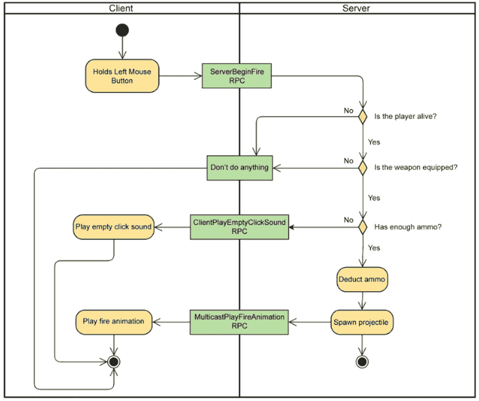

图 16.1 – 开火时客户端-服务器交互

让我们理解前面的图表：

1.  玩家按下左鼠标按钮，该玩家的客户端告诉服务器它想要开火。

1.  服务器通过检查以下内容来验证玩家是否可以开火：

    +   如果玩家还活着

    +   如果玩家装备了武器

    +   如果玩家弹药充足

1.  如果所有条件都有效，则服务器将执行以下操作：

    +   执行逻辑以扣除弹药。

    +   在服务器上生成投射物演员，该演员会自动发送到所有客户端。

    +   在所有客户端上播放该角色实例的射击动画，以确保它们之间的同步性，这有助于传达这是一个相同世界的想法，即使实际上并非如此。

1.  如果任何条件失败，则服务器会告诉特定的客户端该做什么：

    +   玩家已死亡：不要做任何事情。

    +   玩家没有装备武器：不要做任何事情。

    +   玩家弹药不足：播放一个空点击声音。

记住，如果你想你的游戏支持多人模式，那么在开发周期中尽早这样做是非常推荐的。如果你尝试运行一个已启用多人模式的单人项目，你会发现一些功能可能只是部分工作，但很可能大多数功能都不会正常或如预期地工作。

原因是当你以单人模式执行游戏时，代码在本地立即运行，但当你添加多人模式时，你正在添加外部因素，例如一个权威服务器，它与网络上的客户端进行通信，具有延迟，正如你在*图 16.1*中看到的。

为了让一切正常工作，你需要将现有代码分解成以下组件：

+   仅在服务器上运行的代码

+   仅在客户端运行的代码

+   在服务器和客户端上运行的代码

要为游戏添加多人支持，UE5 已经内置了一个非常强大且带宽高效的网络框架，该框架使用权威服务器-客户端架构。

这里有一个如何工作的图表：


图 16.2 – UE5 中的服务器-客户端架构

在这里，你可以看到 UE5 中服务器-客户端架构是如何工作的。每个玩家控制一个客户端，该客户端通过双向连接与服务器通信。服务器运行一个特定级别的游戏模式（该模式仅存在于服务器）并控制信息流，以便客户端可以在游戏世界中相互看到并交互。

注意

多人游戏可以是一个非常高级的话题，所以接下来的几章将作为介绍，帮助你理解基本概念，但不会进行深入探讨。因此，为了简化，可能会省略一些概念。

到目前为止，你已经对多人游戏的基本工作原理有了了解。现在，让我们深入探讨服务器的工作原理以及它们的职责。

# 理解服务器

服务器是架构中最关键的部分，因为它负责处理大部分工作并做出重要决策。

下面是服务器主要职责的概述：

+   **创建和管理共享世界实例**：服务器在其特定的关卡和游戏模式中运行其游戏实例（这将在*第十八章*，*在多人游戏中使用游戏框架类)中，这将作为所有连接客户端之间的共享世界。正在使用的关卡可以在任何时间点更改，如果适用，服务器可以自动将所有连接的客户端一起带走。

+   **处理客户端加入和离开请求**：如果客户端想要连接到服务器，它需要请求许可。为此，客户端向服务器发送加入请求，通过直接 IP 连接（下一节将解释）或在线子系统（如 Steam）。一旦加入请求到达服务器，它将执行一些验证以确定请求是否被接受或拒绝。

服务器拒绝请求的一些最常见原因包括：如果服务器已经达到最大容量，无法再接受更多客户端，或者如果客户端正在使用过时的游戏版本。如果服务器接受请求，则将为客户端分配一个具有连接的玩家控制器，并调用游戏模式中的`PostLogin`函数。从那时起，客户端将进入游戏，现在成为共享世界的一部分，玩家将能够看到并与其他客户端互动。如果客户端在任何时候断开连接，则所有其他客户端都将收到通知，并调用游戏模式中的`Logout`函数。

+   **生成所有客户端都需要了解的行为者**：如果你想在所有客户端中生成一个存在的行为者，那么你需要在服务器上完成这个操作。原因是服务器拥有权威，并且是唯一一个可以告诉每个客户端创建该行为者实例的实体。

这是在多人游戏中生成行为者的最常见方式，因为大多数行为者都需要存在于所有客户端中。一个例子是增益效果，这是所有客户端都可以看到并与之互动的东西。

+   **运行关键游戏逻辑**：为了确保游戏对所有客户端都是公平的，关键游戏逻辑必须在服务器上执行。如果客户端负责处理健康值的扣除，那么这将非常容易被利用，因为玩家可以使用工具在内存中更改当前健康值到 100%，因此玩家在游戏中永远不会死亡。

+   **处理变量复制**：如果你有一个复制的变量（在*理解变量复制*部分介绍），那么其值应该只在服务器上更改。这将确保所有客户端都将自动更新值。你仍然可以在客户端更改值，但它将始终被服务器上的最新值替换，以防止作弊并确保所有客户端保持同步。

+   **处理来自客户端的 RPC**：服务器需要处理来自客户端的**远程过程调用**（RPC）（在*第十七章*，*使用远程过程调用*）。

现在你已经知道了服务器的作用，我们可以讨论在 UE5 中创建服务器的两种不同方式。

## 专用服务器

专用服务器只运行服务器逻辑，因此你不会看到典型的运行游戏并控制角色的窗口，就像普通玩家一样。这意味着所有客户端都将连接到这个服务器，它的唯一任务是协调它们并执行关键的游戏逻辑。此外，如果你使用 `-log` 命令提示符运行专用服务器，你将有一个控制台窗口，它会记录有关服务器上发生的事情的相关信息，例如客户端是否已连接或断开连接等。作为开发者，你也可以通过使用 `UE_LOG` 宏来记录你的信息。

使用专用服务器是创建多人游戏服务器的非常常见方式，并且由于它比监听服务器（下一节中介绍）更轻量级，你可以在服务器堆栈上托管它并让它运行。专用服务器的另一个优点是它将使游戏对所有玩家都更加公平，因为每个人的网络条件都将相同，而且由于没有客户端具有权限，因此黑客的可能性降低。

要在 UE5 中启动专用服务器，你可以使用以下命令参数：

+   通过快捷方式或命令提示符运行以下命令以在编辑器内启动专用服务器：

    ```cpp
    "<UE5 Install Folder>\Engine\Binaries\Win64\UnrealEditor.exe" 
    "<UProject Location>" <Map Name> -server -game -log
    ```

这里有一个例子：

```cpp
"C:\Program Files\Epic 
Games\UE_5.0\Engine\Binaries\Win64\UnrealEditor.exe" 
"D:\TestProject\TestProject.uproject" TestMap -server -game -log
```

+   创建打包专用服务器需要构建专门作为专用服务器构建的项目。

注意

你可以在[`docs.unrealengine.com/5.0/en-US/InteractiveExperiences/Networking/HowTo/DedicatedServers/`](https://docs.unrealengine.com/5.0/en-US/InteractiveExperiences/Networking/HowTo/DedicatedServers/)了解更多关于设置打包专用服务器的信息。

## 监听服务器

监听服务器同时充当服务器和客户端，因此你还将有一个窗口，你可以使用这种服务器类型作为客户端玩游戏。它还有优点是它是将服务器快速运行在打包构建中的最快方式，但它不如专用服务器轻量，因此同时可以连接的客户端数量将受到限制。

要启动监听服务器，你可以使用以下命令参数：

+   运行以下命令通过快捷方式或命令提示符在编辑器内启动监听服务器：

    ```cpp
    "<UE5 Install Folder>\Engine\Binaries\Win64\UnrealEditor.exe" 
    "<UProject Location>" <Map Name>?Listen -game
    ```

这里有一个例子：

```cpp
"C:\Program Files\Epic 
Games\UE_5.0\Engine\Binaries\Win64\UnrealEditor.exe" 
"D:\TestProject\TestProject.uproject" TestMap?Listen -game
```

+   通过快捷方式或命令提示符使用打包的开发构建：

    ```cpp
    "<Project Name>.exe" <Map Name>?Listen -game
    ```

这里有一个例子：

```cpp
"D:\Packaged\TestProject\TestProject.exe" TestMap?Listen –game
```

现在你已经了解了在 Unreal Engine 中有两种不同类型的服务器，我们可以继续讨论其对应物——客户端及其职责。

# 理解客户端

客户端是架构中最简单的部分，因为大多数参与者都将拥有服务器的权限，所以在这些情况下，工作将在服务器上完成，而客户端只需服从其命令。

这里是客户端主要职责的概述：

+   **执行从服务器复制变量的强制操作**：服务器通常对客户端所知的所有参与者拥有权限，因此当复制的变量值在服务器上更改时，客户端需要强制执行该值。

+   **处理来自服务器的 RPC**：客户端需要处理从服务器发送的 RPC（在第十七章*使用远程过程调用*中介绍），*使用远程过程调用*。

+   **在模拟时预测移动**：当客户端模拟一个参与者（在*了解角色*部分中介绍）时，它需要根据参与者的速度本地预测它将去哪里。

+   **生成客户端需要了解的参与者**：如果你想生成一个仅在客户端存在的参与者，那么你需要在该特定客户端上执行。

这是生成参与者最不常见的方式，因为很少需要让参与者仅在客户端存在。这种例子是多玩家生存游戏中你看到的放置预览参与者，玩家控制一个半透明的墙壁版本，其他玩家在放置之前看不到它。

客户端可以通过几种不同的方式加入服务器。以下是最常见的方法列表：

+   通过在开发构建中打开 UE5 控制台（默认情况下，可以使用`` ` ``键）并输入以下内容：

    ```cpp
    open <Server IP Address>
    ```

这里有一个例子：

```cpp
open 194.56.23.4
```

+   使用`Execute Console Command`蓝图节点。以下是一个例子：

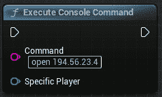

图 16.3 – 使用执行控制台命令节点连接具有示例 IP 的服务器

+   在`APlayerController`中使用`ConsoleCommand`函数，如下所示：

    ```cpp
    PlayerController->ConsoleCommand("open <Server IP Address>");
    ```

这里有一个例子：

```cpp
PlayerController->ConsoleCommand("open 194.56.23.4");
```

+   通过快捷方式或命令提示符使用编辑器可执行文件：

    ```cpp
    "<UE5 Install Folder>\Engine\Binaries\Win64\UnrealEditor.exe" 
    "<UProject Location>" <Server IP Address> -game
    ```

这里有一个例子：

```cpp
"C:\Program Files\Epic Games\UE_5.0\Engine\Binaries\Win64\UnrealEditor.exe" "D:\TestProject\TestProject.uproject" 194.56.23.4 -game
```

+   通过快捷方式或命令提示符使用打包的开发构建：

    ```cpp
    "<Project Name>.exe" <Server IP Address>
    ```

这里有一个例子：

```cpp
"D:\Packaged\TestProject\TestProject.exe" 194.56.23.4
```

在以下练习中，我们将测试 UE5 附带的多人**第三人称**模板。

## 练习 16.01 – 在多人模式下测试第三人称模板

在这个练习中，我们将创建一个**第三人称**模板项目并在多人模式下播放它。

按照以下步骤完成此练习：

1.  创建一个新的`TestMultiplayer`并将其保存到您选择的地点。

创建项目后，它应该会打开编辑器。现在，让我们在多人模式下测试项目，看看它的表现如何。

1.  在编辑器中，**播放**按钮的右侧有一个带三个垂直点的按钮。单击它，您应该会看到一个选项列表。在**多人选项**部分，您可以配置您想要的客户端数量并指定网络模式，它有以下选项：

    +   **独立运行游戏**：以单玩家模式运行游戏

    +   **作为监听服务器运行游戏**：以监听服务器运行游戏

    +   **作为客户端运行游戏**：以专用服务器运行游戏

1.  确保选择`3`，然后单击**新建编辑器窗口（PIE**）。

您应该看到三个重叠的窗口，代表三个客户端：

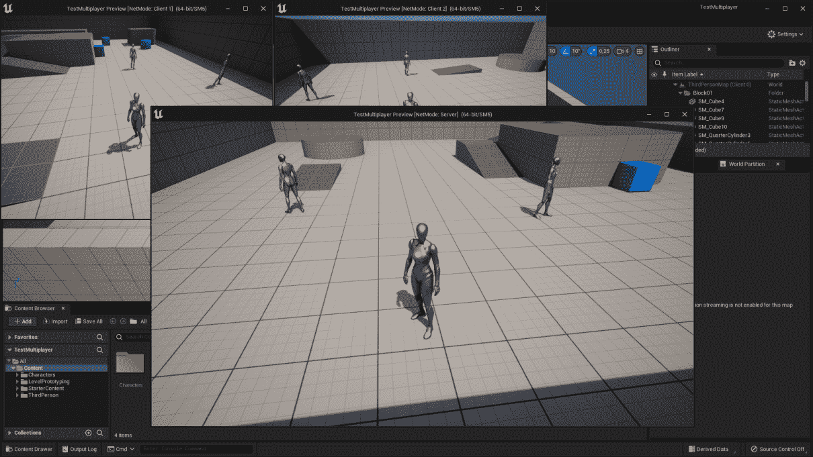

图 16.4 – 使用监听服务器启动三个客户端窗口

如您所见，服务器窗口比客户端窗口大，所以让我们改变它的大小。按键盘上的*Esc*键停止播放。

1.  再次单击位于**播放**按钮旁边的带三个垂直点的按钮，并选择最后一个选项，**高级设置**。

1.  搜索`640x480`并关闭**编辑器首选项**选项卡。

注意

此选项只会更改服务器窗口的大小。如果您想更改客户端窗口的大小，可以修改**多人视角大小**选项的值，您可以在同一菜单中向下滚动一点找到它。

1.  再次玩游戏；你应该会看到以下内容：

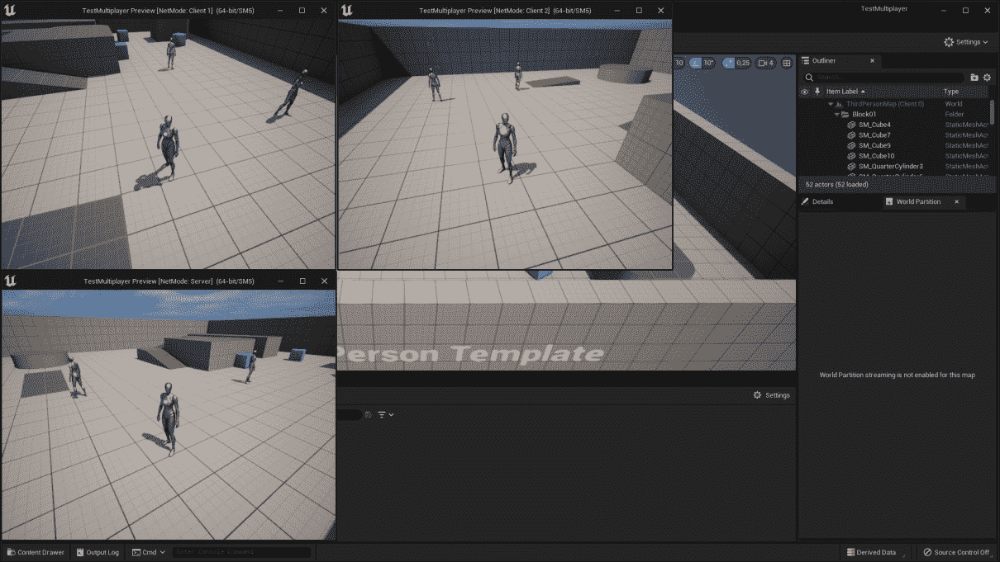

图 16.5 – 使用 640x480 分辨率和监听服务器启动三个客户端窗口

开始游戏后，你会注意到窗口的标题栏上写着**服务器**、**客户端 1**和**客户端 2**。由于您可以在**服务器**窗口中控制一个角色，这意味着我们正在运行一个监听服务器，其中服务器和客户端在同一窗口中运行。当这种情况发生时，您应该将窗口标题解释为**服务器 + 客户端 0**而不是仅仅**服务器**，以避免混淆。

通过完成此练习，您将有一个服务器和三个客户端运行（**客户端 0**、**客户端 1**和**客户端 2**）的设置。

注意

当你同时运行多个窗口时，你会注意到你一次只能有一个窗口获得输入焦点。要将焦点转移到另一个窗口，只需按*Shift* + *F1*来失去当前输入焦点，然后点击你想要聚焦的新窗口。

如果你在一个窗口中玩游戏，你会注意到你可以移动和跳跃。当你执行这些动作时，其他客户端也会看到这些动作。

一切都工作得很好，原因是因为与角色类一起提供的角色移动组件会自动为你复制位置、旋转和下落状态（用于确定你是否在空中）。如果你想添加一个自定义行为，例如攻击动画，你不能只是告诉客户端在按键时在本地播放动画，因为这不会在其他客户端上工作。这就是为什么你需要服务器——作为中介并告诉所有客户端在某个客户端按下键时播放动画。

在这个练习中，我们学习了如何在编辑器中测试多人游戏。现在，让我们学习如何在打包构建中做同样的事情。

# 打包项目

一旦完成项目，打包它是一个好习惯，以便你有一个不使用虚幻引擎编辑器的纯独立版本。这将运行得更快，更轻量。

按照以下步骤创建*练习 16.01 – 测试第三人称模板在多人游戏中的*打包版本：

1.  前往**平台**（位于**播放**按钮右侧）| **Windows** | **打包项目**。

1.  选择一个文件夹来放置打包构建，并等待其完成。

1.  一旦完成，转到所选文件夹并打开其中的`Windows`文件夹。

1.  右键单击**TestMultiplayer.exe**并选择**创建快捷方式**。

1.  将新快捷方式重命名为**Run Server**。

1.  右键单击它并选择**属性**。

1.  在目标上附加`ThirdPersonMap?Listen -server`，这将使用`ThirdPersonMap`创建一个监听服务器。你应该得到这个：

    ```cpp
    "<Packaged Path>\Windows\TestMultiplayer.exe" 
      ThirdPersonMap?Listen -server
    ```

1.  点击**确定**并运行快捷方式。

1.  你应该会收到 Windows 防火墙提示；允许它。

1.  让服务器继续运行，回到文件夹（使用 ALT+TAB 或按 Windows 键并从任务栏中选择另一个窗口），然后从**TestMultiplayer.exe**创建另一个快捷方式。

1.  将其重命名为`Run Client`。

1.  右键单击它并选择**属性**。

1.  在目标上附加`127.0.0.1`，这是你的本地服务器的 IP。你应该得到`"<打包路径>\Windows\TestMultiplayer.exe" 127.0.0.1`。

1.  点击**确定**并运行快捷方式。

现在，你已经连接到监听服务器，这意味着你可以看到彼此的角色。每次你点击**Run Client**快捷方式时，你都会向服务器添加一个新客户端，这样你就可以在同一台机器上运行几个客户端。

一旦完成打包构建的测试，你可以按 ALT+F4 关闭每个窗口。

现在我们知道了如何在多玩家中测试我们的打包项目，让我们看看连接和所有权，这允许我们在服务器和客户端之间建立双向通信线路。

# 探索连接和所有权

在使用虚幻引擎的多玩家功能时，一个需要理解的重要概念是连接。当一个客户端加入服务器时，它将获得一个新的与连接关联的玩家控制器。

如果一个演员与服务器没有有效的连接，那么它将无法执行复制操作，例如变量复制（在*理解变量复制*部分介绍）或调用 RPCs（在*第十七章*，*使用远程过程调用*）。

如果玩家控制器是唯一持有连接的演员，那么这意味着它是唯一可以进行复制操作的地方吗？不，这就是`GetNetConnection`函数发挥作用的地方，该函数在`AActor`中定义。

在对演员执行复制操作（如变量复制或调用 RPCs）时，网络框架将通过在演员上调用`GetNetConnection()`函数来获取演员的连接。如果连接有效，复制操作将被处理；如果无效，则不会发生任何事情。`GetNetConnection()`函数最常见的实现来自`APawn`和`AActor`。

让我们看看`APawn`类是如何实现`GetNetConnection()`函数的，这个函数通常用于角色：

```cpp
class UNetConnection* APawn::GetNetConnection() const
{
  // If we have a controller, then use its net connection
  if ( Controller )
  {
    return Controller->GetNetConnection();
  }
  return Super::GetNetConnection();
}
```

之前提到的实现，它是 UE5 源代码的一部分，首先会检查演员是否有有效的控制器。如果控制器有效，它将使用其连接。如果控制器无效，它将使用`GetNetConnection()`函数的父实现，该实现位于`AActor`：

```cpp
UNetConnection* AActor::GetNetConnection() const
{
  return Owner ? Owner->GetNetConnection() : nullptr;
}
```

之前提到的实现，同样是 UE5 源代码的一部分，会检查演员是否有有效的所有者。如果有，它将使用所有者的连接；如果没有，它将返回一个无效的连接。那么，这个`Owner`变量是什么？每个演员都有一个名为`Owner`的变量（你可以通过调用`SetOwner`函数来设置其值），它存储了拥有它的演员，所以你可以将其视为其父演员。

注意

在监听服务器中，由客户端控制的角色的连接始终是无效的。这是因为该客户端已经是服务器的一部分，因此不需要连接。

在`GetNetConnection()`函数的这个实现中，使用所有者的连接将像层次结构一样工作。如果在向上遍历所有者层次结构的过程中，它找到一个所有者是玩家控制器或者被一个玩家控制器控制，那么它将有一个有效的连接，并且能够处理复制操作。看看下面的例子：

想象一下，一个武器演员被放置在世界上，它就那样静静地坐着。在这种情况下，武器将没有所有者，因此如果武器尝试执行任何复制操作，例如变量复制或调用 RPC，将不会发生任何事。

然而，如果客户端捡起武器并在服务器上调用带有角色值的`SetOwner`，那么武器现在将有一个有效的连接。这是因为武器是一个演员，所以为了获取其连接，它将使用`AActor`的`GetNetConnection()`实现，该实现返回其所有者的连接。由于所有者是客户端的角色，它将使用`APawn`的`GetNetConnection()`实现。角色有一个有效的玩家控制器，因此这是函数返回的连接。

这里有一个图表来帮助您理解这个逻辑：

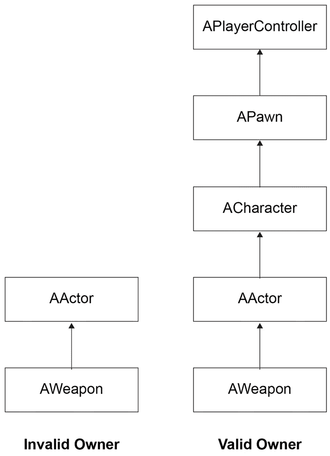

图 16.6 – 武器演员的连接和所有权示例

如果武器有一个无效的所有者，那么会发生以下情况：

+   `AWeapon`没有重写`GetNetConnection`函数，所以它将调用类层次结构中找到的第一个实现，即`AActor::GetNetConnection`。

+   `AActor::GetNetConnection`的实现会调用其所有者的`GetNetConnection`。由于没有所有者，连接是无效的。

如果武器有一个有效的所有者，那么会发生以下情况：

+   `AWeapon`没有重写`GetNetConnection`函数，所以它将调用类层次结构中找到的第一个实现，即`AActor::GetNetConnection`。

+   `AActor::GetNetConnection`的实现会调用其所有者的`GetNetConnection`。由于武器的所有者是捡起它的角色，因此它将调用其上的`GetNetConnection`。

+   `ACharacter`没有重写`GetNetConnection`函数，所以它将调用类层次结构中找到的第一个实现，即`APawn::GetNetConnection`。

+   `APawn::GetNetConnection`的实现使用了拥有者的连接。由于拥有者控制器是有效的，因此它将为武器使用该连接。

注意

为了使`SetOwner`按预期工作，它需要在授权者处执行，在大多数情况下，这意味着服务器。如果你在一个不是授权者的游戏实例上执行`SetOwner`，它将无法执行复制操作。

在本节中，我们学习了连接和所有权如何使服务器和客户端双向通信。接下来，我们将学习关于演员角色的概念，它告诉我们正在执行代码的演员版本。

# 了解角色

当演员在服务器上生成时，它将在服务器上创建一个版本，以及在每个客户端上创建一个版本。由于在游戏的各个实例（`服务器`、`客户端 1`、`客户端 2` 等）上存在相同演员的不同版本，因此知道哪个版本是哪个版本非常重要。这将使我们能够知道在每个这些实例中可以执行什么逻辑。

为了帮助这种情况，每个演员都有以下两个变量：

+   `GetLocalRole()` 函数。

+   `GetRemoteRole()` 函数。

`GetLocalRole()` 和 `GetRemoteRole()` 函数的返回类型是 `ENetRole`，这是一个枚举，可以有以下可能的值：

+   `ROLE_None`：演员没有角色，因为它没有被复制。

+   `ROLE_SimulatedProxy`：当前游戏实例没有对演员的权限，并且它没有被玩家控制器控制。这意味着它的运动将通过使用演员速度的最后一个值来模拟/预测。

+   `ROLE_AutonomousProxy`：当前游戏实例没有对演员的权限，但它被玩家控制器控制。这意味着我们可以根据玩家的输入向服务器发送更精确的运动信息，而不是仅仅使用演员速度的最后一个值。

+   `ROLE_Authority`：当前游戏实例对演员拥有完全的权限。这意味着如果演员在服务器上，对其复制变量的更改将被视为每个客户端需要通过变量复制强制执行的值。

让我们看看以下示例代码片段：

```cpp
ENetRole MyLocalRole = GetLocalRole();
ENetRole MyRemoteRole = GetRemoteRole();
FString String;
if(MyLocalRole == ROLE_Authority)
{
  if(MyRemoteRole == ROLE_AutonomousProxy)
  {
    String = "This version of the actor is the authority 
    and it's being controlled by a player on its client";
  }
  else if(MyRemoteRole == ROLE_SimulatedProxy)
  {
    String = "This version of the actor is the authority 
    but it's not being controlled by a player on its 
    client";
  }
}
else String = "This version of the actor isn't the authority";
GEngine->AddOnScreenDebugMessage(-1, 0.0f, FColor::Red, String);
```

前面的代码片段将分别将本地角色和远程角色的值存储在 `MyLocalRole` 和 `MyRemoteRole` 中。之后，它将根据该演员的版本是否是权威版本或是否由客户端上的玩家控制，在屏幕上打印不同的消息。

注意

重要的是要理解，如果一个演员具有 `ROLE_Authority` 的本地角色，并不意味着它在服务器上；这意味着它在最初产生它的游戏实例上，因此对其拥有权限。

如果客户端生成一个演员，即使服务器和其他客户端不知道它，它的本地角色仍然会是 `ROLE_Authority`。大多数多人游戏中的演员都是由服务器生成的；这就是为什么很容易误解权限总是指服务器。

这里有一个表格，可以帮助您了解演员在不同场景中会扮演的角色：

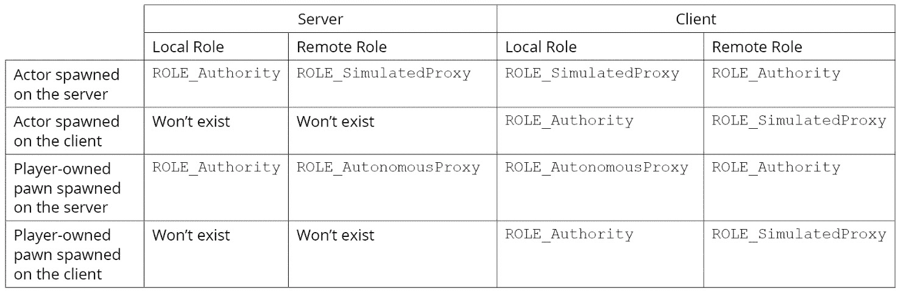

图 16.7 – 演员在不同场景中可以扮演的角色

在前面的表格中，您可以看到演员在不同场景中会扮演的角色。

我们将在以下章节中分析每个场景，并解释演员为什么会有那个角色。

## 服务器上生成的演员

行为体在服务器上生成，因此该行为体的服务器版本将具有本地角色 `ROLE_Authority` 和远程角色 `ROLE_SimulatedProxy`。对于该行为体的客户端版本，其本地角色将是 `ROLE_SimulatedProxy`，远程角色将是 `ROLE_Authority`。

## 客户端生成的行为体

行为体是在客户端生成的，因此该行为体的客户端版本将具有本地角色 `ROLE_Authority` 和远程角色 `ROLE_SimulatedProxy`。由于行为体没有在服务器上生成，因此它只存在于生成它的客户端上。

## 服务器上生成的玩家拥有的行为体

行为体是在服务器上生成的，因此该行为体的服务器版本将具有本地角色 `ROLE_Authority` 和远程角色 `ROLE_AutonomousProxy`。对于该行为体的客户端版本，其本地角色将是 `ROLE_AutonomousProxy`，因为它是由玩家控制器控制的，远程角色是 `ROLE_Authority`。

## 客户端上生成的玩家拥有的行为体

行为体是在客户端生成的，因此该行为体的客户端版本将具有本地角色 `ROLE_Authority` 和远程角色 `ROLE_SimulatedProxy`。由于行为体没有在服务器上生成，因此它只存在于生成它的客户端上。

## 练习 16.02 – 实现所有权和角色

在这个练习中，我们将创建一个使用 **C++** 作为基础并基于 **第三人称** 模板的 **C++** 项目，并使其执行以下操作：

+   创建一个新的行为体，名为 `EditAnywhere`，并创建一个名为 `OwnershipRadius` 的变量，并将该角色设置为所有者。当没有角色在半径内时，所有者将是 `nullptr`。

+   显示其本地角色、远程角色、所有者和连接。

+   编辑 **OwnershipRolesCharacter** 并重写 **Tick** 函数，以便显示其本地角色、远程角色、所有者和连接。

按照以下步骤完成此练习：

1.  将名为 `ENetRole` 的宏添加到可以打印在屏幕上的 `FString` 值中。

1.  创建项目后，它应该同时打开编辑器和 Visual Studio 解决方案。

1.  使用编辑器创建一个新的 C++ 类，名为 `Actor`。

1.  编译完成后，Visual Studio 应该会弹出新创建的 `.h` 和 `.cpp` 文件。

1.  关闭编辑器并返回 Visual Studio。

1.  在 Visual Studio 中，打开 `OwnershipRoles.h` 文件并添加以下宏：

    ```cpp
    #define ROLE_TO_STRING(Value) FindObject<UEnum>(ANY_PACKAGE, TEXT("ENetRole"), true)->GetNameStringByIndex(static_cast<int32>(Value))
    ```

此宏将用于将我们从 `GetLocalRole()` 函数和 `GetRemoteRole()` 函数获得的 `ENetRole` 枚举转换为 `FString`。其工作方式是通过 Unreal Engine 的反射系统找到 `ENetRole` 枚举类型。从那里，它将 `Value` 参数转换为 `FString` 变量，以便可以在屏幕上打印。

1.  现在，打开`OwnershipTestActor.h`文件并声明静态网格组件和所有权半径的受保护变量，如下面的代码片段所示：

    ```cpp
    UPROPERTY(VisibleAnywhere, BlueprintReadOnly, Category = "Ownership Test Actor")
    UStaticMeshComponent* Mesh;
    UPROPERTY(EditAnywhere, BlueprintReadOnly, Category = "Ownership Test Actor")
    float OwnershipRadius = 400.0f;
    ```

在前面的代码片段中，我们声明了静态网格组件和`OwnershipRadius`变量，这允许你配置所有权的半径。

1.  接下来，删除`BeginPlay`的声明并将构造函数和`Tick`函数的声明移动到受保护区域。

1.  现在，打开`OwnershipTestActor.cpp`文件并添加所需的头文件，如下面的代码片段所示：

    ```cpp
    #include "OwnershipRoles.h"
    #include "OwnershipRolesCharacter.h"
    #include "Kismet/GameplayStatics.h"
    ```

在前面的代码片段中，我们包含了`OwnershipRoles.h`、`OwnershipRolesCharacter.h`和`GameplayStatics.h`，因为我们将会调用`GetAllActorsOfClass`函数。

1.  在构造函数定义中，创建静态网格组件并将其设置为根组件：

    ```cpp
    Mesh = CreateDefaultSubobject<UStaticMeshComponent>("Mesh");
    RootComponent = Mesh;
    ```

1.  仍然在构造函数中，将`bReplicates`设置为`true`以告诉 Unreal Engine 这个 actor 可以复制并且也应该存在于所有客户端：

    ```cpp
    bReplicates = true;
    ```

1.  删除`BeginPlay`函数定义。

1.  在`Tick`函数中，绘制一个调试球体以帮助可视化所有权半径，如下面的代码片段所示：

    ```cpp
    DrawDebugSphere(GetWorld(), GetActorLocation(), OwnershipRadius, 32, FColor::Yellow);
    ```

1.  仍然在`Tick`函数中，创建获取所有权半径内最近的`AOwnershipRolesCharacter`的权限特定逻辑。如果它与当前的不同，将其设置为所有者：

    ```cpp
    if (HasAuthority())
    {
      AActor* NextOwner = nullptr;
      float MinDistance = OwnershipRadius;
      TArray<AActor*> Actors;
      UGameplayStatics::GetAllActorsOfClass(this,
        AOwnershipRolesCharacter::StaticClass(), Actors);
      for (AActor* Actor : Actors)
      {
        const float Distance = GetDistanceTo(Actor);
        if (Distance <= MinDistance)
        {
          MinDistance = Distance;
          NextOwner = Actor;
        }
      }
      if (GetOwner() != NextOwner)
      {
        SetOwner(NextOwner);
      }
    }
    ```

注意

前面的代码仅用于演示目的，因为每帧在`Tick`函数上运行`GetAllActorsOfClass`会对性能造成很大影响。理想情况下，你应该只执行此代码一次（例如在`BeginPlay`中）并将值存储起来，以便我们可以在`Tick`中查询它们。

1.  仍然在`Tick`函数中，将本地/远程角色的值（使用我们之前创建的`ROLE_TO_STRING`宏）以及当前所有者和连接转换为字符串：

    ```cpp
    const FString LocalRoleString = ROLE_TO_STRING(GetLocalRole());
    const FString RemoteRoleString = ROLE_TO_STRING(GetRemoteRole());
    const FString OwnerString = GetOwner() != nullptr ? GetOwner()->GetName() : TEXT("No Owner");
    const FString ConnectionString = GetNetConnection() != nullptr ? TEXT("Valid Connection") : TEXT("Invalid Connection");
    ```

1.  为了最终化`Tick`函数，使用`DrawDebugString`在屏幕上打印我们在上一步转换的字符串：

    ```cpp
    const Fstring Values = Fstring::Printf(TEXT("LocalRole = %s\nRemoteRole = %s\nOwner = %s\nConnection = %s"), 
      *LocalRoleString, *RemoteRoleString, *OwnerString, 
      *ConnectionString);
    DrawDebugString(GetWorld(), GetActorLocation(), Values, nullptr, Fcolor::White, 0.0f, true);
    ```

注意

你可以使用在`AActor`中定义的`HasAuthority()`辅助函数，而不是不断使用`GetLocalRole() == ROLE_Authority`来检查 actor 是否有权限，而不是不断使用`GetLocalRole() == ROLE_Authority`来检查 actor 是否有权限：

1.  接下来，打开`OwnershipRolesCharacter.h`并声明`Tick`函数为受保护：

    ```cpp
    virtual void Tick(float DeltaTime) override;
    ```

1.  现在，打开`OwnershipRolesCharacter.cpp`并包含`OwnershipRoles.h`，如下面的代码片段所示：

    ```cpp
    #include "OwnershipRoles.h"
    ```

1.  实现`Tick`函数：

    ```cpp
    void AOwnershipRolesCharacter::Tick(float DeltaTime)
    {
      Super::Tick(DeltaTime);
    }
    ```

1.  在`Tick`函数内部，将本地/远程角色的值（使用我们之前创建的`ROLE_TO_STRING`宏）以及当前所有者和连接转换为字符串：

    ```cpp
    const FString LocalRoleString = ROLE_TO_STRING(GetLocalRole());
    const FString RemoteRoleString = ROLE_TO_STRING(GetRemoteRole());
    const FString OwnerString = GetOwner() != nullptr ? GetOwner()- >GetName() : TEXT("No Owner");
    const FString ConnectionString = GetNetConnection() != nullptr ? 
      TEXT("Valid Connection") : TEXT("Invalid 
      Connection");
    ```

1.  使用`DrawDebugString`在屏幕上打印我们在上一步转换的字符串：

    ```cpp
    const FString Values = FString::Printf(TEXT("LocalRole = 
      %s\nRemoteRole = %s\nOwner = %s\nConnection = %s"), 
      *LocalRoleString, *RemoteRoleString, *OwnerString, 
      *ConnectionString);
    DrawDebugString(GetWorld(), GetActorLocation(), Values, nullptr, FColor::White, 0.0f, true);
    ```

最后，我们可以测试项目。

1.  运行代码并等待编辑器完全加载。

1.  在`Content`文件夹中创建一个新的蓝图`OwnershipTestActor_BP`，它继承自`OwnershipTestActor`。将`Mesh`设置为使用立方体网格，并在世界中放置其实例。

1.  前往`Multiplayer Options`，设置`2`。

1.  将窗口大小设置为`800x600`。

1.  使用**新编辑器窗口 (PIE**)进行游戏。

你应该得到以下输出：

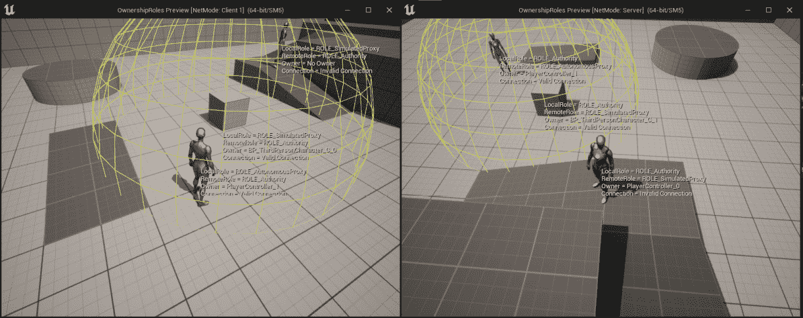

图 16.8 – 服务器和客户端 1 窗口的预期结果

通过完成这个练习，你会更好地理解连接和所有权的工作原理。这些是重要的概念，因为与复制相关的一切都依赖于它们。

下次当你看到某个角色没有进行复制操作时，你会知道你需要检查它是否有一个有效的连接和所有者。

现在，让我们分析服务器和客户端窗口中显示的值。

注意

服务器和客户端窗口的这两个图将包含三个文本块，分别写着`Server Character`、`Client 1 Character`和`Ownership Test Actor`，但这是添加到原始截图中的，以帮助你理解哪个角色和角色是什么。

## 服务器窗口的输出

查看以下**服务器**窗口的输出屏幕截图：

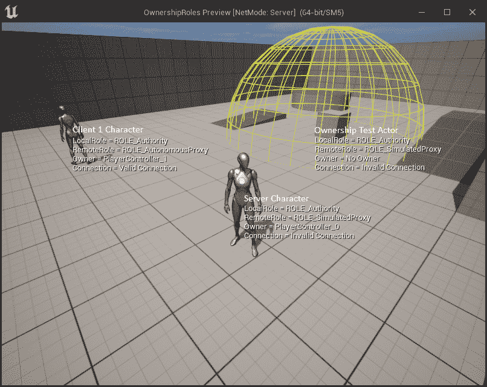

图 16.9 – 服务器窗口

在前面的屏幕截图中，你可以看到**服务器角色**、**客户端 1 角色**和**所有权测试**立方体角色。

首先，让我们分析**服务器角色**的值。

## 服务器角色

这是监听服务器正在控制的角色。与这个角色相关的值如下：

+   `LocalRole = ROLE_Authority`: 这个角色是在服务器上生成的，即当前游戏实例。

+   `RemoteRole = ROLE_SimulatedProxy`: 因为这个角色是在服务器上生成的，其他客户端应该只模拟它。

+   `Owner = PlayerController_0`: 这个角色由监听服务器的客户端控制，该客户端使用第一个`PlayerController`实例，称为`PlayerController_0`。

+   `Connection = Invalid Connection`: 因为我们是监听服务器的客户端，所以不需要连接。

接下来，我们将查看同一窗口中的**客户端 1 角色**。

## 客户端 1 角色

这是**客户端 1**正在控制的角色。与这个角色相关的值如下：

+   `LocalRole = ROLE_Authority`: 这个角色是在服务器上生成的，即当前游戏实例。

+   `RemoteRole = ROLE_AutonomousProxy`: 因为这个角色是在服务器上生成的，但它是由另一个客户端控制的。

+   `Owner = PlayerController_1`: 这个角色由另一个客户端控制，该客户端使用第二个`PlayerController`实例，称为`PlayerController_1`。

+   `Connection = Valid Connection`: 因为这个角色由另一个客户端控制，所以需要连接到服务器。

接下来，我们将查看同一窗口中的**OwnershipTest**角色。

## 所有权测试角色

这是将所有者设置为一定拥有半径内最近角色的立方体演员。与此演员相关的值如下：

+   `LocalRole = ROLE_Authority`: 这个演员被放置在关卡中并在服务器上生成，这是当前的游戏实例。

+   `RemoteRole = ROLE_SimulatedProxy`: 这个演员在服务器上生成，但不是由任何客户端控制的。

+   `Owner`和`Connection`：它们的值将基于最近的角色。如果没有角色在拥有半径内，则它们将分别具有`No Owner`和`Invalid Connection`的值。

现在，让我们分析`Client 1`窗口中显示的值。

## `Client 1`窗口的输出

请查看以下之前练习中`Client 1`窗口的输出截图：


图 16.10 – `Client 1`窗口

`Client 1`窗口的值将与`Server`窗口的值相同，除了`LocalRole`和`RemoteRole`的值将相反，因为它们始终相对于你所在的游戏实例。

另一个例外是服务器角色没有所有者，其他连接的客户端将没有有效的连接。原因是客户端不存储其他客户端的玩家控制器和连接，只有服务器才这样做，但这将在*第十八章*中更深入地讨论，*在多人游戏中使用游戏框架类*。

在本节中，我们介绍了如何使用角色来知道代码正在执行哪个演员的版本，我们可以利用这一点来运行特定的代码。在下一节中，我们将探讨变量复制，这是服务器用来保持客户端同步的技术之一。

# 理解变量复制

服务器可以通过使用变量复制来保持客户端同步的一种方式。其工作原理是，每秒特定次数（由`AActor::NetUpdateFrequency`变量定义，该变量也暴露给蓝图）服务器中的变量复制系统将检查客户端中是否有任何需要更新为最新值的复制变量（下一节将解释）。

如果变量满足所有复制条件，则服务器将向客户端发送更新并强制执行新值。

例如，如果你有一个复制的`Health`变量，并且客户端在其端使用黑客工具将变量的值从`10`设置为`100`，那么复制系统将强制执行来自服务器的真实值并将其改回`10`，从而抵消了黑客行为。

在以下情况下，变量才会发送到客户端进行更新：

+   变量被设置为复制。

+   服务器上的值已更改。

+   客户端上的值与服务器上的值不同。

+   该演员启用了复制功能。

+   该演员相关且满足所有复制条件。

一个需要考虑的重要事项是，确定变量是否应该被复制的逻辑只会在每秒 `Actor::NetUpdateFrequency` 次执行。换句话说，服务器不会在你更改服务器上变量的值后立即向客户端发送更新请求。

这的一个例子是，如果你有一个默认值为 `5` 的整数复制变量 `Test`。如果你在服务器上调用一个函数将 `Test` 设置为 `3`，然后在下一行将其更改为 `8`，那么只有后者的更改会向客户端发送更新请求。这是因为这两个更改是在 `NetUpdateFrequency` 间隔之间进行的，所以当变量复制系统执行时，当前值是 `8`，并且因为这与客户端上存储的值不同（仍然是 `5`），它会更新它们。如果你不是将其设置为 `8`，而是将其设置回 `5`，那么不会向客户端发送任何更改，因为值没有变化。

在以下章节中，我们将介绍如何使用 `Replicated` 和 `ReplicatedUsing` 指定器以及 `DOREPLIFETIME` 和 `DOREPLIFETIME_CONDITION` 宏来复制变量。

## 复制变量

在 Unreal Engine 中，几乎任何可以使用 `UPROPERTY` 宏的变量类型都可以设置为复制，你可以使用两个指定器来完成此操作。我们将在以下章节中查看它们。

### 复制

如果你只想说明一个变量是复制的，那么你可以使用 `Replicated` 指定器。

请看以下示例：

```cpp
UPROPERTY(Replicated) 
float Health = 100.0f; 
```

在前面的代码片段中，我们声明了一个名为 `Health` 的浮点变量，就像我们通常做的那样。不同之处在于我们添加了 `UPROPERTY(Replicated)` 以让 Unreal Engine 知道 `Health` 变量将被复制。

### ReplicatedUsing

如果你想说明一个变量是复制的，并且每次更新时都应该调用一个函数，那么你可以使用 `ReplicatedUsing=<函数名>` 指定器。请看以下示例：

```cpp
UPROPERTY(ReplicatedUsing=OnRep_Health) 
float Health = 100.0f;
UFUNCTION() 
void OnRep_Health()
{
  UpdateHUD(); 
}
```

在前面的代码片段中，我们声明了一个名为 `Health` 的浮点变量。不同之处在于我们添加了 `UPROPERTY(ReplicatedUsing=OnRep_Health)` 以让 Unreal Engine 知道这个变量将被复制，并且每次更新时都应该调用 `OnRep_Health` 函数，在这个特定情况下，它会调用一个更新 HUD 的函数。

通常，回调函数的命名方案为 `OnRep_<变量名>`。

注意

在 `ReplicatedUsing` 指定器中使用的函数需要标记为 `UFUNCTION()`。

### GetLifetimeReplicatedProps

除了将变量标记为复制之外，你还需要在演员的`cpp`文件中实现`GetLifetimeReplicatedProps`函数。需要考虑的一点是，一旦你至少有一个复制变量，该函数就会自动内部声明，因此你不需要在演员的头文件中声明它。此函数的目的是让你告诉每个复制变量应该如何复制。你可以通过在每个你想复制的变量上使用`DOREPLIFETIME`宏及其变体来实现这一点。

### DOREPLIFETIME

此宏指定了类中的复制变量（作为参数输入）将复制到所有客户端，而不需要额外的条件。

这是它的语法：

```cpp
DOREPLIFETIME(<Class Name>, <Replicated Variable Name>); 
```

看看下面的示例：

```cpp
void AVariableReplicationActor::GetLifetimeReplicatedProps(TArray< 
  FLifetimeProperty >& OutLifetimeProps) const
{
  Super::GetLifetimeReplicatedProps(OutLifetimeProps);
  DOREPLIFETIME(AVariableReplicationActor, Health);
}
```

在前面的代码片段中，我们使用了`DOREPLIFETIME`宏来告诉复制系统，`AVariableReplicationActor`类中的`Health`变量将无条件复制。

### DOREPLIFETIME_CONDITION

此宏指定了类中的复制变量（作为参数输入）将仅复制到满足条件（作为参数输入）的客户端。

这是它的语法：

```cpp
DOREPLIFETIME_CONDITION(<Class Name>, <Replicated Variable Name>, <Condition>); 
```

条件参数可以是以下值之一：

+   `COND_InitialOnly`: 该变量将仅在初始复制时复制一次。

+   `COND_OwnerOnly`: 该变量将仅复制到演员的所有者。

+   `COND_SkipOwner`: 该变量不会复制到演员的所有者。

+   `COND_SimulatedOnly`: 该变量将仅复制到正在模拟的演员。

+   `COND_AutonomousOnly`: 该变量将仅复制到自主演员。

+   `COND_SimulatedOrPhysics`: 该变量将仅复制到正在模拟或`bRepPhysics`设置为 true 的演员。

+   `COND_InitialOrOwner`: 该变量将仅在初始复制或演员的所有者处进行一次复制。

+   `COND_Custom`: 只有当其`SetCustomIsActiveOverride`布尔条件（在`AActor::PreReplication`函数中使用）为 true 时，该变量才会复制。

看看下面的示例：

```cpp
void AVariableReplicationActor::GetLifetimeReplicatedProps(TArray< 
  FLifetimeProperty >& OutLifetimeProps) const
{
  Super::GetLifetimeReplicatedProps(OutLifetimeProps);
  DOREPLIFETIME_CONDITION(AVariableReplicationActor, 
  Health, COND_OwnerOnly);
}
```

在前面的代码片段中，我们使用了`DOREPLIFETIME_CONDITION`宏来告诉复制系统，`AVariableReplicationActor`类中的`Health`变量将仅对演员的所有者进行复制。

注意

有更多的`DOREPLIFETIME`宏可用，但本书不会涵盖它们。要查看所有变体，请检查 UE5 源代码中的`UnrealNetwork.h`文件，网址为[`github.com/EpicGames/UnrealEngine/blob/release/Engine/Source/Runtime/Engine/Public/Net/UnrealNetwork.h`](https://github.com/EpicGames/UnrealEngine/blob/release/Engine/Source/Runtime/Engine/Public/Net/UnrealNetwork.h)。

现在你已经了解了变量复制的工作原理，让我们完成一个练习，使用`Replicated`和`ReplicatedUsing`指定符，以及`DOREPLIFETIME`和`DOREPLIFETIME_CONDITION`宏。

## 练习 16.03 – 使用 Replicated、ReplicatedUsing、DOREPLIFETIME 和 DOREPLIFETIME_CONDITION 复制变量

在这个练习中，我们将创建一个 **C++** 项目，以 **第三人称** 模板为基础，并为角色添加两个变量，其复制方式如下：

+   变量 `A` 是一个浮点数，将使用 `Replicated` 指定符和 `DOREPLIFETIME` 宏。

+   变量 `B` 是一个整数，将使用 `ReplicatedUsing` 指定符和 `DOREPLIFETIME_CONDITION` 宏。

+   如果角色具有权限，则字符的 `Tick` 函数应每帧将 A 和 B 增加 1，并调用 `DrawDebugString` 在角色的位置显示它们的值。

按照以下步骤完成此练习：

1.  创建一个新的 `VariableReplication` 并将其保存到您选择的任何位置。

1.  一旦项目创建完成，它应该会打开编辑器以及 Visual Studio 解决方案。

1.  关闭编辑器并返回 Visual Studio。

1.  打开 `VariableReplicationCharacter.h` 文件并使用各自的复制指定符将受保护的 `A` 和 `B` 变量声明为 `UPROPERTY`：

    ```cpp
    UPROPERTY(Replicated) 
    float A = 100.0f; 
    UPROPERTY(ReplicatedUsing = OnRepNotify_B) 
    int32 B; 
    ```

1.  将 `Tick` 函数声明为受保护的：

    ```cpp
    virtual void Tick(float DeltaTime) override;
    ```

1.  由于我们已经将 `B` 变量声明为 `ReplicatedUsing = OnRepNotify_B`，因此我们还需要将受保护的 `OnRepNotify_B` 回调函数声明为 `UFUNCTION`：

    ```cpp
    UFUNCTION() 
    void OnRepNotify_B(); 
    ```

1.  现在，打开 `VariableReplicationCharacter.cpp` 文件并包含 `UnrealNetwork.h` 头文件，该文件包含我们将要使用的 `DOREPLIFETIME` 宏的定义：

    ```cpp
    #include "Net/UnrealNetwork.h"
    ```

1.  实现函数 `GetLifetimeReplicatedProps`：

    ```cpp
    void AVariableReplicationCharacter::GetLifetimeReplicatedProps (TArray<FLifetimeProperty >& OutLifetimeProps) const
    {
      Super::GetLifetimeReplicatedProps(OutLifetimeProps);
    }
    ```

1.  让复制系统知道 `A` 变量不会有任何额外的复制条件：

    ```cpp
    DOREPLIFETIME(AVariableReplicationCharacter, A);
    ```

1.  让复制系统知道 `B` 变量只会复制到该角色的所有者：

    ```cpp
    DOREPLIFETIME_CONDITION(AVariableReplicationCharacter, B, COND_OwnerOnly);
    ```

1.  实现函数 `Tick`：

    ```cpp
    void AVariableReplicationCharacter::Tick(float DeltaTime) 
    {
      Super::Tick(DeltaTime);
    }
    ```

1.  接下来，运行特定于权限的逻辑，将 `1` 添加到 `A` 和 `B`：

    ```cpp
    if (HasAuthority()) 
    { 
      A++; 
      B++; 
    } 
    ```

由于此角色将在服务器上生成，因此只有服务器将执行此逻辑。

1.  在角色的位置显示 `A` 和 `B` 的值：

    ```cpp
    const FString Values = FString::Printf(TEXT("A = %.2f    B = %d"), A, B); 
    DrawDebugString(GetWorld(), GetActorLocation(), Values, nullptr, FColor::White, 0.0f, true);
    ```

1.  为 `B` 变量实现 `RepNotify` 函数，该函数在屏幕上显示一条消息，说明 `B` 变量已更改为新值：

    ```cpp
    void AVariableReplicationCharacter::OnRepNotify_B() 
    {
      const FString String = FString::Printf(TEXT("B was 
      changed by the server and is now %d!"), B); 
      GEngine->AddOnScreenDebugMessage(-1, 0.0f, 
      FColor::Red,String); 
    }
    ```

最后，您可以测试项目。

1.  运行代码并等待编辑器完全加载。

1.  前往 `多人选项`，设置 `2`。

1.  将窗口大小设置为 `800x600`。

1.  使用 `新编辑器窗口 (PIE)` 进行播放。

通过完成此练习，您将能够在每个客户端进行游戏，并且您会注意到角色正在显示它们各自的 `A` 和 `B` 值。

现在，让我们分析在 `Server` 和 `Client 1` 窗口中显示的值。

注意

服务器窗口和客户端窗口的这两个图示将包含两个文本块，分别显示 `Server Character` 和 `Client 1 Character`，但这是添加到原始截图中的，以帮助您理解哪个角色是哪个。

## 服务器窗口的输出

在 **服务器** 窗口中，你有 **服务器角色** 的值，这是由服务器控制的角色，而在背景中，你有 **客户端 1 角色** 的值：

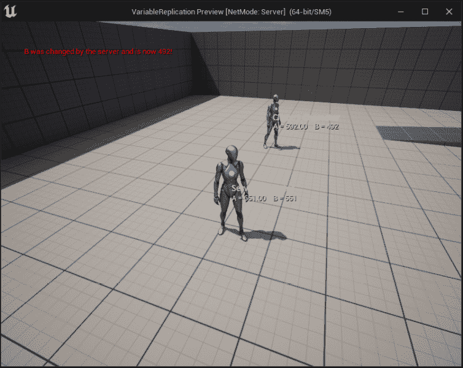

图 16.11 – 服务器窗口

可以观察到的输出如下：

+   `A = 651.00 B = 551`

+   `A = 592.00 B = 492`

在这个特定的时间点，`A` 为 `651`，`B` 为 `551`。`A` 和 `B` 有不同值的原因是 `A` 从 `100` 开始，`B` 从 `0` 开始，这是 `A++` 和 `B++` 滴答 `551` 后的正确值。

`A++` 和 `B++` 的 `59` 个滴答。

接下来，我们将查看 **客户端 1** 窗口。

## 客户端 1 窗口的输出

在 **客户端 1** 窗口中，你有 **客户端 1 角色** 的值，这是由 **客户端 1** 控制的角色，而在背景中，你有 **服务器角色** 的值：

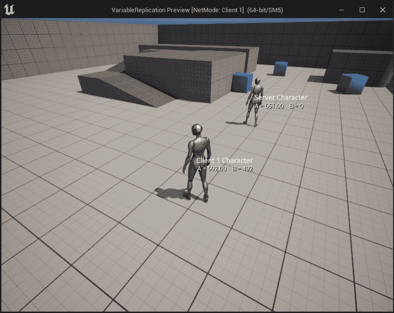

图 16.12 – 客户端 1 窗口

可以观察到的输出如下：

+   `A = 651.00 B = 0`

+   `A = 592.00 B = 492`

`A` 的值是 `651`，这是正确的，但 `B` 的值是 `0`。原因是 `A` 使用了 `DOREPLIFETIME`，它不会添加任何额外的复制条件，所以每次在服务器上更改变量时，它都会复制变量并保持客户端更新。

另一方面，`B` 变量使用 `DOREPLIFETIME_CONDITION` 与 `COND_OwnerOnly`，并且由于 `0`。

如果你回到代码中，将 `B` 的复制条件更改为使用 `COND_SimulatedOnly` 而不是 `COND_OwnerOnly`，你会注意到结果在 `B` 将为 **服务器角色** 复制，但不会为其自己的角色复制。

注意

`RepNotify` 消息显示在 **服务器** 窗口中而不是 **客户端** 窗口中的原因是，在编辑器中播放时，两个窗口共享同一个进程，所以屏幕上打印的文本将不准确。为了获得正确的行为，你需要运行游戏的打包版本。

# 探索 2D 混合空间

在 *第二章*，*使用虚幻引擎*，我们创建了一个 1D 混合空间，用于根据 `Speed` 轴的值混合角色的移动状态（空闲、行走和奔跑）。对于那个特定的例子，它工作得相当好，因为你只需要一个轴，但如果我们想让角色也能侧滑，那么我们就无法做到这一点。

为了考虑这种情况，虚幻引擎允许你创建 2D 混合空间。概念几乎相同；唯一的区别是你有一个额外的动画轴，因此你可以在它们之间进行混合，不仅水平混合，还可以垂直混合。

让我们将我们对 1D 混合空间的知识应用到下一个练习中，我们将创建一个用于角色移动的 2D 混合空间，该角色还可以侧滑。

## 练习 16.04 – 创建移动 2D 混合空间

在这个练习中，我们将创建一个使用两个轴而不是一个轴的混合空间。垂直轴将是`速度`，其范围在`0`到`200`之间。水平轴将是`方向`，它表示速度与 pawn 的旋转/前进向量的相对角度（`-180 到 180`）。

以下图表将帮助您计算这个练习中的方向：

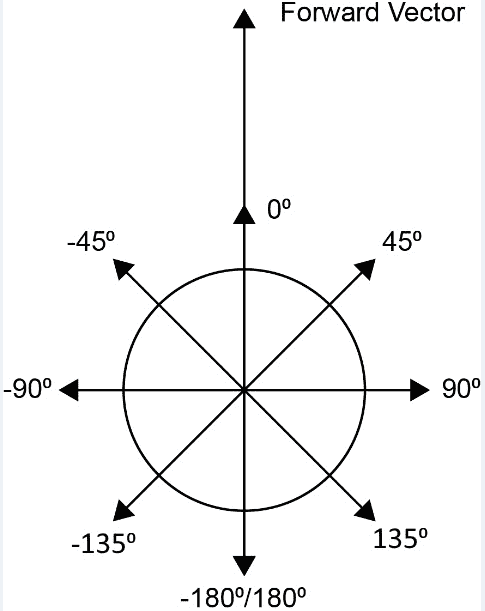

图 16.13 – 前进向量与速度之间的角度基于的方向值

上述图表显示了方向是如何计算的。前进向量代表角色当前面对的方向，而数字代表如果前进向量指向那个方向，它将与速度向量形成的角度。如果角色朝向某个方向，并且您按下一个键将角色向右移动，那么速度向量将与前进向量垂直。这意味着角度将是 90º，因此这就是我们的方向。

如果我们考虑到这个逻辑来设置 2D 混合空间，我们可以根据角色的运动角度使用正确的动画。

按照以下步骤完成这个练习：

1.  创建一个新的`Blendspace2D`并将其保存到您选择的地点。

1.  一旦创建项目，它应该会打开编辑器。

1.  接下来，您将导入运动动画。在编辑器中，转到**Content\Characters\Mannequins\Animations**文件夹。

1.  点击**导入**按钮。

1.  前往`fbx`文件，并点击**打开**按钮。

1.  在导入对话框中，确保您选择了`SK_Mannequin`骨骼并点击**导入所有**按钮。

1.  将所有新文件保存在`Assets`文件夹中。

如果您打开任何新的动画，您会注意到网格在*Z*-轴上相当拉伸。所以，让我们通过调整骨骼重定向设置来修复它。

1.  前往**Content/Characters/Mannequins/Meshes/SK_Mannequin**。在左侧，您应该看到骨骼列表。

1.  点击搜索框右侧的齿轮图标并启用**显示重定向选项**。

1.  右键点击`根`骨骼并选择**递归设置翻译重定向骨骼**。

1.  最后，从下拉菜单中选择**动画**以设置**根**和**骨盆**骨骼。

1.  保存并关闭**SK_Mannequin**。

1.  完成这些后，打开**内容浏览器**区域，点击**添加**按钮，并选择**动画 | 混合空间**。

1.  接下来，选择**SK_Mannequin**骨骼。

1.  将混合空间重命名为**BS_Movement**并打开它。

1.  设置水平`(-180 到 180)`和垂直`(0 到 200)`，并确保在两者上都开启`Snap to Grid`。您应该得到以下设置：

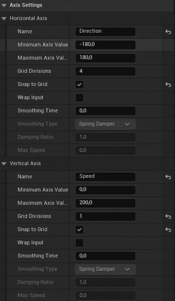

图 16.14 – 2D 混合空间 – 轴设置

1.  拖动`0`和`-180`，`0`和`180`。

1.  拖动`200`和`0`。

1.  拖动`200`和`-90`。

1.  拖动`200`和`90`。

1.  拖动`200`、`180`和`180`。

您应该得到一个可以通过按住*Ctrl*并移动鼠标预览的 Blend Space。

1.  现在，将`5`改为使插值更快。

1.  保存并关闭 Blend Space。

1.  现在，让我们更新动画蓝图，使其使用新的 Blend Space。

1.  前往**Content\Characters\Mannequins\Animations**，并打开**ABP_Manny**。

1.  接下来，前往事件图，创建一个新的浮点变量，命名为`Direction`。

1.  向序列中添加一个新的引脚，并将`-180`设置为`180`，在角色的**速度**和**旋转**之间：

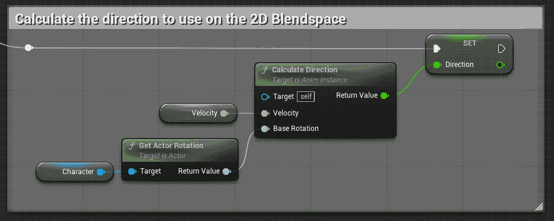

图 16.15 – 在 2D Blend Space 上计算使用方向

1.  在`0.0`中禁用自动脚部调整。

1.  前往**Locomotion**状态机中的**Walk / Run**状态，在此状态下使用旧的 1D Blend Space，如图所示：

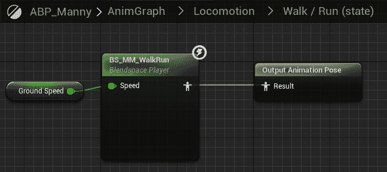

图 16.16 – AnimGraph 中的 Walk / Run 状态

1.  将该 Blend Space 替换为**BS_Movement**，并使用**Direction**变量，如下所示：

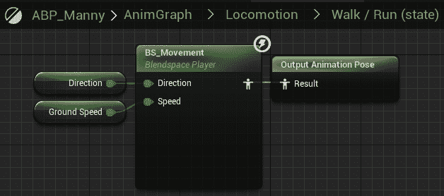

图 16.17 – 1D Blend Space 已被新的 2D Blend Space 替换

1.  前往**Locomotion**状态机中的**Idle**状态，并将动画更改为使用**Idle_Rifle_Ironsights**。

1.  保存并关闭动画蓝图。现在，您需要更新角色。

1.  前往**Content\ThirdPerson\Blueprints**文件夹，并打开**BP_ThirdPersonCharacter**。

1.  在`Yaw`旋转中始终面向控制旋转的`Yaw`。

1.  前往角色移动组件，并将`200`设置为`200`。

1.  设置`false`，这将防止角色朝向移动方向旋转。

1.  选择`Mesh`组件，在**Details**面板中，选择**ABP_Manny**动画蓝图和**SKM_Manny_Simple**骨骼网格。

1.  保存并关闭角色蓝图。

如果您现在用两个客户端玩游戏并移动角色，它将向前和向后走，但也会侧移，如图所示：

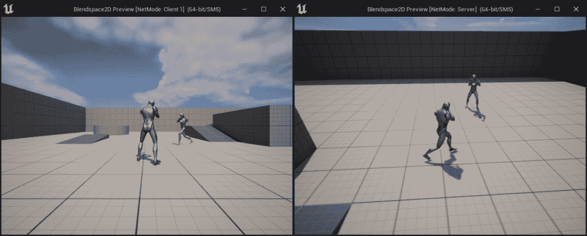

图 16.18 – 服务器和客户端 1 窗口上的预期输出

通过完成这个练习，您已经提高了对如何创建 2D Blend Spaces、它们的工作原理以及与仅使用常规 1D Blend Space 相比所提供的优势的理解。

在下一节中，我们将学习如何变换角色的骨骼，以便我们可以根据摄像机的俯仰旋转来上下旋转玩家的躯干。

# 变换（修改）骨骼

有一个非常有用的节点，您可以在 **AnimGraph** 中使用，称为 **变换（修改）骨骼** 节点，它允许您在运行时对骨骼的骨骼进行平移、旋转和缩放。

您可以将其添加到 `transform modify`，并从列表中选择节点。如果您点击 **变换（修改）骨骼** 节点，您将在 **详细信息** 面板中看到很多选项。

下面是对最相关选项的解释：

+   **要修改的骨骼**: 此选项将告诉节点将要变换的骨骼。

在该选项稍下方，有三个部分代表每个变换操作（**平移**、**旋转**和**缩放**）。在每一部分中，您可以执行以下操作：

+   **平移**、**旋转**、**缩放**：此选项将告诉节点您想要应用该特定变换操作的程度。最终结果将取决于您选择的模式（下一节将介绍）。

您可以设置此值的方式有四种：

+   设置一个常量值，例如 (`X=0.0,Y=0.0,Z=0.0`）。

+   通过点击右侧的下拉菜单并从列表中选择一个函数或变量将其绑定到函数或变量。

+   使用可以由函数设置的动态值，即使它没有作为引脚公开。

+   使用变量以便它在运行时可以更改。要启用此功能，您需要执行以下步骤（此示例为 `Expose As Pin`。一旦您这样做，常量值的文本框将消失：

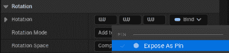

图 16.19 – 选择“作为引脚公开”

1.  **变换（修改）骨骼** 节点将添加一个输入，以便您可以插入您的变量：

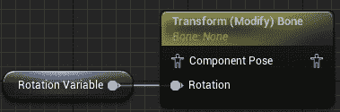

图 16.20 – 在变换（修改）骨骼节点上用作输入的变量

1.  **设置模式**

这将告诉节点如何处理该值。您可以从以下三个选项中选择一个：

+   **忽略**: 对提供的值不执行任何操作。

+   **添加到现有**: 获取骨骼的当前值，并将提供的值添加到其中。

+   **替换现有**: 用提供的值替换骨骼的当前值。

1.  **设置空间**

这将定义节点应用变换的空间。您可以从以下四个选项中选择一个：

+   **世界空间**: 变换将在世界空间中发生。

+   **组件空间**: 变换将在骨骼网格组件空间中发生。

+   **父骨骼空间**: 变换将在所选骨骼的父骨骼空间中发生。

+   **骨骼空间**: 变换将在所选骨骼的空间中发生。

1.  **Alpha**

此选项允许您控制要应用多少变换。例如，如果您将 `Alpha` 值作为浮点数，那么您将根据不同的值有以下行为：

+   如果 `Alpha` 为 `0.0`，则不会应用任何变换。

+   如果`Alpha`是`0.5`，则只应用变换的一半。

+   如果`Alpha`是`1.0`，则将应用整个变换。

在下一个练习中，我们将使用**变换（修改）骨骼**节点，使*练习 16.04 – 创建 2D 混合空间移动*中的角色能够根据摄像机的旋转上下看。

## 练习 16.05 – 创建上下看的角色

在这个练习中，我们将使用*练习 16.04 – 创建 2D 混合空间移动*的项目，并使角色能够根据摄像机的旋转上下看。为了实现这一点，我们将使用**变换（修改）骨骼**节点，根据摄像机的俯仰角度在组件空间中旋转**spine_03**骨骼。

按照以下步骤完成此练习：

1.  首先，您需要从*练习 16.04 – 创建 2D 混合空间移动*打开项目。

1.  前往**内容\角色\人体模型\动画**并打开**ABP_Manny**。

1.  前往**事件图**并创建一个名为**俯仰角度**的浮点变量。

1.  在序列中添加一个新的销钉，并设置**俯仰角度**的值为角色**旋转**和**基础目标旋转**之间的减法（或增量），如下所示：

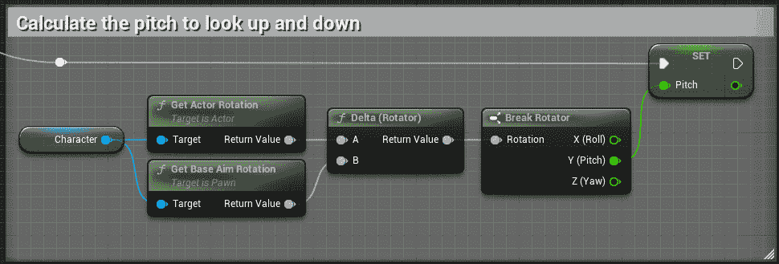

图 16.21 – 计算俯仰角度

这将允许您从旋转器中获取**俯仰角度**的值，这是我们唯一感兴趣的部分增量旋转。

注意

**断开旋转器**节点允许您将**旋转器**变量分离成三个浮点变量，分别代表**俯仰角度**、**偏航角度**和**翻滚角度**。当您想访问每个组件的值或只想处理一个或两个组件而不是整个旋转时，这很有用。

作为使用**断开旋转器**节点的替代方案，您可以在**返回值**上右键单击并选择**Split Struct Pin**。请注意，**Split Struct Pin**选项仅在**返回值**未连接到任何内容时才会出现。一旦进行拆分，它将创建三个单独的线，分别用于**翻滚角度**、**俯仰角度**和**偏航角度**，就像断开一样，但没有额外的节点。

您最终应该得到以下结果：

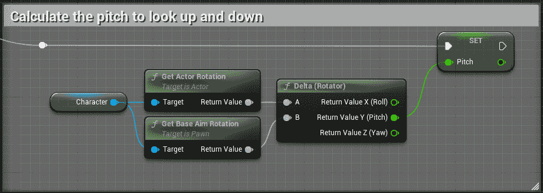

图 16.22 – 使用 Split Struct Pin 选项计算向上看的俯仰角度

这种逻辑使用棋子的旋转，并将其从摄像机的旋转中减去，以获得**俯仰角度**的差异，如下所示：

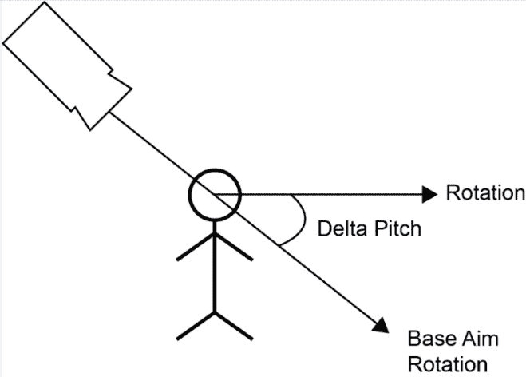

图 16.23 – 如何计算俯仰角度的增量

注意

您可以双击一根线来创建一个重路由节点，这允许您弯曲线，使其不与其他节点重叠，从而使代码更容易阅读。

1.  接下来，转到具有以下设置的**骨骼**节点：

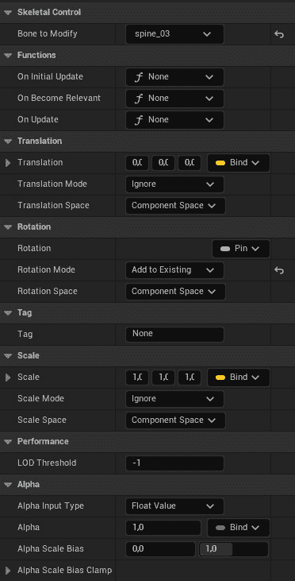

图 16.24 – 变换（修改）骨骼节点的设置

在前面的截图中，我们将**要修改的骨骼**设置为**spine_03**，因为我们想要旋转的就是这个骨骼。我们还设置了**旋转模式**为**添加到现有**，因为我们想保留动画中的原始旋转并添加一个偏移量。我们可以将其他选项设置为**忽略**，并从下拉菜单中移除**暴露为引脚**。

1.  将**变换（修改）骨骼**节点连接到**控制骨架**和**输出姿态**，如下面的截图所示：

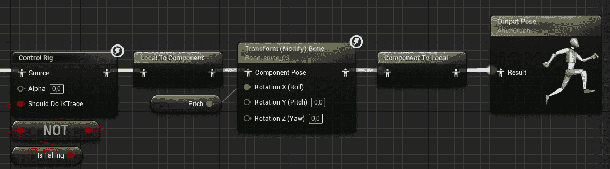

图 16.25 – 连接到输出姿态的变换（修改）骨骼节点

在前面的截图中，你可以看到**动画图**，它将允许角色通过根据相机的俯仰旋转**spine_03**骨骼来上下看。为了将**控制骨架**节点连接到**变换**（**修改**）**骨骼**节点，我们需要从局部空间转换为组件空间。在**变换**（**修改**）**骨骼**节点执行后，我们需要将其转换回局部空间，以便能够连接到**输出姿态**节点。

注意

我们将**俯仰**变量连接到**翻滚**，因为骨骼内部旋转就是那样的方式。你还可以在输入参数上使用**分割结构引脚**，这样你就不需要添加**制作旋转器**节点。

如果你用两个客户端测试项目，并在其中一个角色上上下移动鼠标，你会注意到它会上下倾斜，如下面的截图所示：

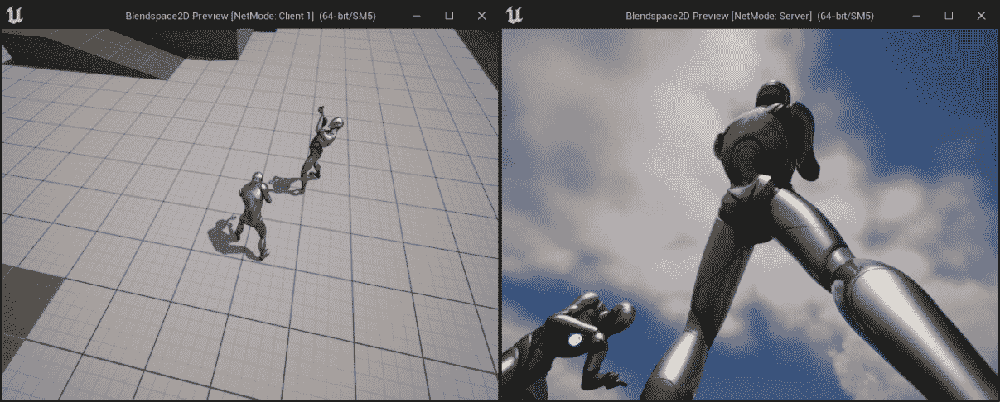

图 16.26 – 基于相机旋转的角色上下看

通过完成这个最终练习，你应该了解如何使用动画蓝图中的**变换（修改）骨骼**节点在运行时修改骨骼。此节点可用于各种场景，因此可能对你很有用。

在下一个活动中，你将通过创建我们将用于我们的多玩家 FPS 项目的角色来测试你所学的一切。

# 活动 16.01 – 为多玩家 FPS 项目创建角色

在这个活动中，你将创建我们将要在下一章中构建的多玩家 FPS 项目的角色。这个角色将有一些不同的机制，但在这个活动中，你只需要创建一个可以行走、跳跃、上下看，并且有两个复制的属性：生命值和护甲的角色。

按照以下步骤完成此活动：

1.  创建一个不带起始内容的`MultiplayerFPS`。

1.  从`Activity16.01\Assets`文件夹导入骨骼网格和动画，分别放置在**Content\Player\Mesh**和**Content\Player\Animations**文件夹中。

1.  从`Activity16.01\Assets`文件夹导入以下声音到`Content\Player\Sounds`：

    +   `Jump.wav`：在`Jump_From_Stand_Ironsights`动画中使用`Play Sound`动画通知播放此声音。

    +   `Footstep.wav`：在每次步行动画中，当脚落在地板上时，使用`Play Sound`动画通知播放此声音。

    +   `Spawn.wav`：在角色的`SpawnSound`变量中使用此声音。

1.  通过重新定位骨骼和创建一个名为`Camera`的插槽来设置骨骼网格，该插槽是头骨的子节点，并且具有`相对位置`(`X=7.88, Y=4.73, Z=-10.00`)。

1.  在`5`中创建一个 2D 混合空间。

1.  使用您在*第四章*，“开始使用玩家输入”中获得的技能创建输入动作。

    +   `W`，`S`，`A`，`D`

    +   `Mouse X`，`Mouse Y`

    +   `Spacebar`

1.  将新的输入动作添加到一个名为**IMC_Player**的新输入映射上下文中。

1.  创建一个名为`Armor Absorption`的 C++类，它是装甲吸收伤害的百分比。

1.  有一个构造函数，用于初始化摄像机，禁用计时，并设置`800`和`600`。

1.  在`Armor Absorption`变量上，并根据以下公式更改伤害值：

`Damage = (Damage * (1 - ArmorAbsorption)) - FMath::Min(RemainingArmor, 0);`

1.  在`Content\Player\Animations`中创建一个名为`ABP_Player`的动画蓝图，它具有以下状态：

    +   `Idle/Run`：使用`BS_Movement`，并使用`Speed`和`Direction`变量。

    +   `Jump`：当`Is Jumping`变量为`true`时，播放跳跃动画并从`Idle/Run`状态转换。

    +   它还使用`Transform (Modify) Bone`来根据摄像机的俯仰角使角色上下看。

1.  在`Content\UI`中创建一个名为`WBP_HUD`的`UMG`小部件，使用您在*第十五章*，“探索可收集物品、增强物品和拾取物品”中获得的技能，以`Health: 100`和`Armor: 100`的格式显示角色的`Health`和`Armor`属性。

1.  在`Content\Player`中创建一个名为`BP_Player`的蓝图，它继承自`FPSCharacter`：

    +   设置网格组件，使其具有以下值：

        +   `Content\Player\Mesh\SK_Mannequin`

        +   `Content\Player\Animations\ABP_Player`

        +   `(X=0.0, Y=0.0, Z=-88.0)`

        +   `(X=0.0, Y=0.0, Z=-90.0)`

        +   `Content\Player\Inputs\IA_Move`

        +   `Content\Player\Inputs\IA_Look`

        +   `Content\Player\Inputs\IA_Jump`

        +   在`Begin Play`事件上，它需要创建`WBP_HUD`小部件实例并将其添加到视图中。

1.  在`BP_GameMode`中创建一个继承自`BP_Player`的蓝图作为**默认 Pawn**类。

1.  在**Content\Maps**中创建一个名为**DM-Test**的测试地图，并将其设置为**项目设置**中的默认地图。

**预期输出**:

结果应该是一个项目，其中每个客户端都将有一个第一人称角色，该角色可以移动、跳跃和四处张望。这些动作也将被复制，以便每个客户端都能看到其他客户端角色的动作。

每个客户端还将有一个显示健康和装甲值的 HUD：

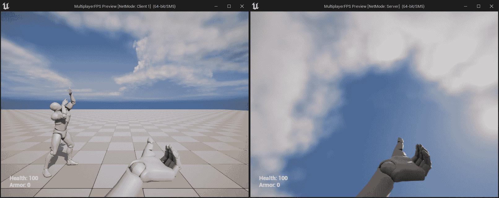

图 16.27 – 预期输出

注意

这个活动的解决方案可以在 GitHub 上找到：[`github.com/PacktPublishing/Elevating-Game-Experiences-with-Unreal-Engine-5-Second-Edition/tree/main/Activity%20solutions`](https://github.com/PacktPublishing/Elevating-Game-Experiences-with-Unreal-Engine-5-Second-Edition/tree/main/Activity%20solutions).

通过完成这个活动，你应该对服务器-客户端架构、变量复制、角色、2D 混合空间以及**变换（修改）骨骼**节点的工作原理有一个很好的了解。

# 摘要

在本章中，我们了解了一些关键的多玩家概念，例如服务器-客户端架构的工作原理，服务器和客户端的责任，监听服务器比专用服务器设置更快但并不轻量级，所有权和连接，角色以及变量复制。

我们还了解了一些动画的有用技术，例如如何使用 2D 混合空间，它允许你有一个两轴网格在动画之间进行混合，以及`变换（修改）骨骼`节点，它可以在运行时修改骨骼网格的骨骼。为了完成本章，我们创建了一个第一人称多人项目，其中包含可以行走、四处张望和跳跃的角色。这将是我们将在下一章中工作的多人第一人称射击项目的基础。

在下一章中，我们将学习如何使用 RPCs，这允许客户端和服务器在彼此上执行函数。我们还将介绍如何在编辑器中使用枚举以及如何使用数组索引包装在两个方向上迭代数组并在超出其限制时循环。
