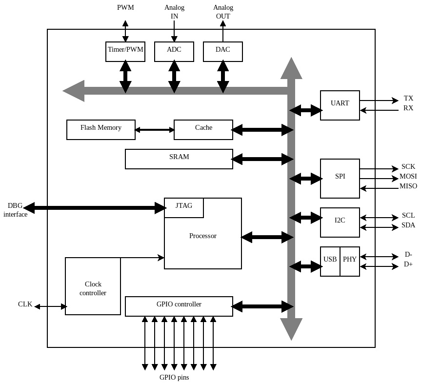

# 第一章：嵌入式系统 – 实用方法

为嵌入式系统设计和编写软件与传统的高级软件开发相比，面临的是一套不同的挑战。

本章概述了这些挑战，并介绍了本书中将用作参考的基本组件和平台。

在本章中，我们将讨论以下主题：

+   领域定义

+   **通用** **输入/输出** （**GPIO**）

+   接口和外设

+   连接系统

+   隔离机制简介

+   参考平台

# 领域定义

**嵌入式系统** 是执行特定、专用任务且没有直接或持续用户交互的计算设备。由于市场和技术的多样性，这些设备有不同的形状和大小，但通常，它们都具有较小的尺寸和有限的资源。

在本书中，将通过开发与它们的资源和外设交互的软件组件来分析嵌入式系统的概念和构建块。第一步是在嵌入式系统的更广泛定义内，定义本书中解释的技术和架构模式的适用范围。

## 嵌入式 Linux 系统

嵌入式市场的一部分依赖于具有足够功率和资源来运行 GNU/Linux OS 变体的设备。这些系统通常被称为**嵌入式 Linux**，本书的范围不包括它们，因为它们的发展包括组件设计和集成的不同策略。一个典型的能够运行基于 Linux 内核的系统的硬件平台配备了相当大的 RAM，高达几吉字节，以及足够的存储空间来存储 GNU/Linux 发行版中提供的所有软件组件。

此外，为了使 Linux 内存管理为系统上的每个进程提供独立的虚拟地址空间，硬件必须配备一个**内存管理单元**（**MMU**），这是一个辅助操作系统在运行时将物理地址转换为虚拟地址，反之亦然的硬件组件。

这类设备具有不同的特性，对于构建定制解决方案来说通常是过度的，这些解决方案可以使用更简单的设计并降低单件的生产成本。

硬件制造商和芯片设计师已经研究了新技术来提高基于微控制器的系统的性能。在过去几十年中，他们引入了新一代的平台，这些平台将降低硬件成本、固件复杂性、尺寸和功耗，为嵌入式市场提供一套最有趣的功能。

由于它们的规格，在某些实际场景中，嵌入式系统必须能够在短时间内执行一系列任务，这个时间是短、可测量和可预测的。这类系统被称为**实时系统**，与在桌面、服务器和移动电话中使用的多任务计算方法不同。

**实时处理**是嵌入式 Linux 平台上极难实现，如果不是不可能实现的目标。Linux 内核不是为硬实时处理设计的，即使有补丁可以修改内核调度器以帮助满足这些要求，其结果也无法与专门为此目的设计的裸机、受限系统相提并论。

一些其他的应用领域，例如电池供电和能量收集设备，可以从较小的嵌入式设备的低功耗能力和通常集成到嵌入式连接设备中的无线通信技术的能效中受益。基于 Linux 的系统通常在资源量和硬件复杂度上不足以在能耗水平上降低，或者需要付出努力才能达到类似的能耗水平。

本书将分析基于微控制器的系统类型是 32 位系统，这些系统能够在单线程、裸机应用程序中运行软件，以及集成简约的实时操作系统，这些操作系统在嵌入式系统的工业制造中非常流行，我们每天使用它们来完成特定任务。它们越来越被采用，以帮助定义更通用、多用途的开发平台。

## 低端 8 位微控制器

在过去，**8 位微控制器**主导了嵌入式市场。它们设计的简单性使我们能够编写能够完成一组预定义任务的小型应用程序，但过于简单，通常配备的资源很少，不足以实现嵌入式系统，尤其是在 32 位微控制器已经发展到覆盖这些设备在相同的价格、尺寸和功耗范围内的所有用例的情况下。

现在，8 位微控制器大多被限制在教育平台套件的市场上，旨在向业余爱好者和新手介绍电子设备上软件开发的基础。由于 8 位平台缺乏允许开发高级系统编程、多线程和高级功能以构建专业嵌入式系统的特性，本书不涵盖这些平台。

在本书的语境中，术语**嵌入式系统**指的是一类基于微控制器硬件架构运行的系统，提供有限的资源，但允许通过硬件架构提供的特性来构建实时系统，以实现系统编程。

## 硬件架构

嵌入式系统的架构围绕其微控制器构建，有时也称为**微控制器单元**（**MCU**）。这通常是一个包含处理器、RAM、闪存、串行接收器和发送器以及其他核心组件的单个集成电路。市场上提供了许多不同的架构、供应商、价格范围、功能和集成资源的选择。这些通常设计成低成本、低资源、低能耗、自包含的系统，集成在单个集成电路中，这也是它们通常被称为**片上系统**（**SoC**）的原因。

由于可以集成的处理器、内存和接口的多样性，微控制器实际上没有实际的参考架构。尽管如此，一些架构元素在广泛的型号和品牌中是通用的，甚至在不同的处理器架构之间也是通用的。

一些微控制器专注于特定应用，并暴露出特定的接口与外围设备和外部世界通信。其他微控制器则专注于提供降低硬件成本或非常有限的能耗的解决方案。

尽管如此，以下组件几乎被硬编码到每个微控制器中：

+   **微处理器**

+   **RAM**

+   **闪存**

+   **串行收发器**

此外，越来越多的设备能够访问网络，以与其他设备和网关进行通信。一些微控制器可能提供已建立的标准，如 *以太网或 Wi-Fi 接口*，或者专门为满足嵌入式系统约束而设计的特定协议，如亚 GHz 无线接口或**控制器局域网**（**CAN**）总线，部分或全部在集成电路中实现。

所有组件都必须与处理器共享总线线，处理器负责协调逻辑。RAM、闪存和收发器的控制寄存器都映射在相同的物理地址空间：

图 1.1 – 一个通用微控制器内部组件的简化框图

**RAM** 和 **Flash Memory** 的映射地址取决于具体型号，通常在数据表中提供。微控制器可以在其原生机器语言中运行代码；也就是说，一系列指令被转换成特定于其运行架构的二进制文件。默认情况下，编译器提供通用可执行文件作为编译和汇编操作的输出，这需要转换成目标格式才能执行。

**处理器**部分被设计用来直接从 RAM 以及其内部的闪存中执行存储在其自身特定二进制格式中的指令。这通常从内存中的零位置或微控制器手册中指定的另一个已知地址开始映射。CPU 可以从 RAM 中更快地获取并执行代码，但最终的固件存储在闪存中，这通常比几乎所有微控制器上的 RAM 都要大，并且允许它在电源周期和重启之间保留数据。

为嵌入式微控制器编译软件操作系统并将其加载到闪存中需要一个主机机器，这是一套特定的硬件和软件工具。还需要了解目标设备特性的某些知识，以便指导编译器在可执行映像中组织符号。由于许多有效的原因，C 是嵌入式软件中最流行的语言，尽管它不是唯一可用的选项。高级语言，如 Rust 和 C++，在结合特定的嵌入式运行时或在某些情况下通过完全从语言中移除运行时支持的情况下，可以生成嵌入式代码。

注意

本书将完全专注于 C 代码，因为它比任何其他高级语言都更少抽象，这使得在查看代码的同时更容易描述底层硬件的行为。

所有现代嵌入式系统平台至少都有一种机制（如**JTAG**）用于调试目的和将软件上传到闪存。当从主机机器访问调试接口时，调试器可以与处理器中的断点单元交互，中断和恢复执行，并且还可以从内存中的任何地址读取和写入。

嵌入式编程的一个重要部分是在使用 MCU 公开的接口的同时与外围设备进行通信。嵌入式软件开发需要基本的电子知识，理解原理图和数据表的能力，以及使用测量工具（如逻辑分析仪或示波器）的信心。

## 理解挑战

接近嵌入式开发意味着始终关注规格以及硬件限制。嵌入式软件开发是一个持续的挑战，需要关注以最高效的方式执行一组特定任务，同时充分考虑可用的有限资源。需要处理一些妥协，这在其他环境中是不常见的。以下是一些例子：

+   在闪存中可能没有足够的空间来实现一个新功能

+   可能没有足够的 RAM 来存储复杂结构或复制大型数据缓冲区

+   处理器可能不够快，无法及时完成所有必需的计算和数据处理

+   电池供电和能量收集设备可能需要更低的能耗以满足使用寿命的预期。

此外，PC 和移动操作系统大量使用 MMU（内存管理单元），这是处理器的一个组件，它允许在物理地址和虚拟地址之间进行运行时转换。

MMU 是实现任务之间以及任务与内核本身之间地址空间分离的必要抽象。嵌入式微控制器没有 MMU，通常缺乏存储内核、应用程序和库所需的大量非易失性内存。因此，嵌入式系统通常在一个任务中运行，主循环按照特定顺序执行所有数据处理和通信。一些设备可以运行嵌入式操作系统，这些操作系统比它们的 PC 版本要简单得多。

应用程序开发者通常将底层系统视为一种商品，而嵌入式开发通常意味着整个系统必须从头开始实现，从引导程序到应用程序逻辑。在嵌入式环境中，由于缺乏更复杂的抽象，如进程和操作系统内核之间的内存分离，各种软件组件之间关系更为紧密。

首次接触嵌入式系统的开发者可能会发现，在某些系统中进行测试和调试比仅仅运行软件并读取结果要复杂得多。这在那些设计时几乎没有或没有人机交互界面的系统中尤其如此。

一种成功的方法需要健康的流程，这包括定义良好的测试用例、来自规格说明分析的关键性能指标列表，以确定权衡的可能性、可用于执行所有所需测量的工具和程序，以及一个建立良好且高效的原型阶段。

在这个背景下，安全性值得特别考虑。通常，在系统级别编写代码时，考虑到可能的故障对整个系统的影响是明智的。大多数嵌入式应用程序代码在硬件上以扩展权限运行，单个任务的不当行为可能会影响整个固件的稳定性和完整性。正如我们将看到的，一些平台提供了特定的内存保护机制和内置的权限分离，这对于构建安全系统非常有用，即使在没有基于分离进程地址空间的完整操作系统的情况下也是如此。

## 多线程

使用专为构建嵌入式系统设计的微控制器的一个优点是，可以通过时间共享资源在单独的执行单元中运行逻辑上分离的任务。

嵌入式软件最流行的设计是基于单循环的顺序执行模型，其中模块和组件连接起来以暴露回调接口。然而，现代微控制器提供了系统开发者可以用来构建多任务环境以运行逻辑上分离的应用程序的功能和核心逻辑特性。

这些特性在处理更复杂的实时系统时特别有用，并帮助我们理解基于进程隔离和内存分段的实现安全模型的可能性。

# RAM

*“640 KB 的内存对每个人来说都应该足够了”*

*– 比尔·盖茨（微软的创始人兼前董事）*

这句著名的话在过去三十年中被多次引用，以强调技术进步和 PC 行业的杰出成就。虽然对于许多软件工程师来说这可能听起来像是一个笑话，但 30 多年后，在 MS-DOS 最初发布之后，嵌入式编程仍然需要考虑这些数据。

尽管大多数嵌入式系统今天都能够突破这个限制，尤其是由于外部 DRAM 接口的可用性，但可以用 C 语言编程的最简单设备可能只有 4 KB 的 RAM 来实施整个系统逻辑。在设计嵌入式系统时，必须考虑到这一点，通过估算系统必须执行的所有操作所需的潜在内存量，以及任何时间可能用于与外围设备和附近设备通信的缓冲区。

系统级别的内存模型比 PC 和移动设备的内存模型要简单。内存访问通常在物理级别进行，因此你代码中的所有指针都在告诉你它们所指向的数据的物理位置。在现代计算机中，操作系统负责将物理地址转换为运行任务的虚拟表示。

对于那些没有 MMU 的系统中，仅物理内存访问的优势在于减少了在编码和调试时处理地址转换的复杂性。另一方面，任何现代操作系统实现的一些功能，如进程交换和通过内存重定位动态调整地址空间大小，变得繁琐，有时甚至不可能。

在嵌入式系统中处理内存尤为重要。习惯于编写应用程序代码的程序员期望底层操作系统提供一定级别的保护。虚拟地址空间不允许内存区域重叠，操作系统可以轻松检测未经授权的内存访问和段违规，因此它迅速终止进程，避免整个系统受到损害。

在嵌入式系统中，尤其是在编写裸机代码时，必须手动检查每个地址池的边界。意外修改错误内存中的几个位，甚至访问不同的内存区域，可能会导致致命的、不可撤销的错误。整个系统可能会挂起，或者在最坏的情况下变得不可预测。在嵌入式系统中处理内存时，特别是在处理生命关键设备时，需要采取安全的方法。在开发过程中太晚识别内存错误是复杂的，并且通常需要比强制自己编写安全代码并保护系统免受程序员错误更多的资源。

正确的内存处理技术将在*第五章* *内存管理*中解释。

# 闪存内存

在服务器或个人计算机中，可执行应用程序和库驻留在存储设备上。在执行开始之前，它们被访问、转换，可能还会解压缩，并存储在 RAM 中。

嵌入式设备的固件通常是一个包含所有软件组件的单个二进制文件，可以传输到 MCU 的内部闪存内存中。由于闪存直接映射到内存空间中的一个固定地址，处理器能够无中间步骤地顺序从其中获取并执行单个指令。这种机制称为**原地执行**（**XIP**）。

软件固件上的所有不可修改部分不需要加载到内存中，并且可以通过内存空间中的直接寻址来访问。这包括不仅可执行指令，还包括所有被编译器标记为常量的变量。另一方面，支持 XIP 在准备存储在闪存中的固件映像时需要一些额外的步骤，并且需要指导链接器关于目标上的不同内存映射区域。

在微控制器的地址空间中映射的内部闪存内存不可用于写入。由于闪存存储器的硬件特性，更改内部闪存的内容只能通过基于块的访问方式完成。在更改闪存内存中单个字节的值之前，必须先擦除并重写包含该字节的整个块。大多数制造商提供的用于写入基于块的闪存内存的机制被称为**应用内编程**（**IAP**）。一些文件系统实现通过创建一个临时副本来处理基于块的闪存设备上的写入操作，该副本在执行写入操作时使用。

在选择基于微控制器的解决方案的组件时，匹配闪存的大小与固件所需的空间至关重要。闪存通常是 MCU 中最昂贵的组件之一，因此在大规模部署时，选择具有较小闪存的 MCU 可能更经济。在其他领域，考虑到代码大小来开发软件现在并不常见，但在尝试将多个功能适应如此小的存储时可能需要这样做。最后，在构建固件及其组件链接时，某些架构上可能存在编译器优化，以减少代码大小。

存储在 MCU 硅芯片之外的非易失性存储器通常可以通过特定的接口访问，例如**串行外设接口**。外部闪存使用的技术与内部闪存不同，内部闪存旨在快速执行代码。虽然外部闪存通常更密集且成本更低，但它们不允许在物理地址空间中进行直接内存映射，这使得它们不适合存储固件映像。这是因为如果没有机制用于在 RAM 中加载可执行符号，那么执行按顺序获取指令的代码将是不可能的——在这些设备上，读取访问是按块一次进行的。另一方面，与 IAP 相比，写入访问可能更快，这使得这类非易失性存储器设备对于存储某些设计中在运行时检索的数据非常理想。

# 通用输入/输出（GPIO）

任何微控制器都能实现的最基本功能是控制集成电路特定引脚上的信号。微控制器可以打开或关闭数字输出，这对应于当分配给它的值为 1 时应用于引脚的参考电压，而当值为 0 时为零伏特。同样，当引脚配置为输入时，可以使用引脚检测 1 或 0。当施加的电压高于某个特定阈值时，软件将读取数字值“1”。

## ADC 和 DAC

一些芯片具有板载 ADC 控制器，能够检测施加到引脚上的电压并对其进行采样。这通常用于从提供可变电压输出的输入外围设备获取测量值。嵌入式软件能够读取电压，其精度取决于预定义的范围。

DAC 控制器是 ADC 控制器的逆过程，它将微控制器寄存器上的值转换为相应的电压。

## 定时器和 PWM

微控制器可能提供多种测量时间的方法。通常，至少有一个基于倒计时计时器的接口可以触发中断并在到期时自动重置。

配置为输出的 GPIO 引脚可以编程为输出预配置频率和占空比的方波。这被称为**脉冲宽度调制**（**PWM**），有多个用途，从控制输出外设到调节 LED 亮度，甚至通过扬声器播放可听声音。

关于 GPIO、中断定时器和看门狗的更多详细信息将在*第六章*，“通用外设”中探讨。

# 接口和外设

为了与外设和其他微控制器通信，嵌入式领域已经建立了几个**事实上的**标准。微控制器的一些外部引脚可以被编程以使用特定协议与外部外设进行通信。大多数架构上可用的常见接口如下：

+   基于异步 UART 的串行通信

+   **串行外围设备接口**（**SPI**）总线

+   **集成电路间**（**I**2**C**）总线

+   **通用串行总线**（**USB**）

让我们逐一详细回顾。

## 基于异步 UART 的串行通信

异步通信由**通用异步收发传输器**（**UART**）提供。这些接口，通常被称为**串行端口**，之所以称为异步，是因为它们不需要共享时钟信号来同步发送方和接收方，而是根据预定义的时钟速率进行工作，这些速率可以在通信过程中对齐。微控制器可能包含多个 UART，可以根据请求连接到特定的引脚集。UART 作为全双工通道提供异步通信，通过两条独立的线连接每个端点的 RX 引脚到另一侧的 TX 引脚。

为了相互理解，两个端点的系统必须使用相同的参数设置 UART。这包括在电线上的字节封装和帧速率。所有这些参数都必须在通信通道正确建立之前由两个端点预先知道。尽管比其他类型的串行通信简单，但基于 UART 的串行通信在电子设备中仍然被广泛使用，尤其是作为调制解调器和 GPS 接收器的接口。此外，使用 TTL 到 USB 串行转换器，很容易将 UART 连接到主机上的控制台，这对于提供日志消息通常很方便。

## SPI

对经典基于 UAR 的通信的一种不同方法是**SPI**。这种技术在 20 世纪 80 年代末推出，旨在通过引入几个改进来取代异步串行通信与外设之间的通信：

+   串行时钟线用于同步端点

+   主从协议

+   在同一条三线总线上进行一点对多点的通信

主设备，通常是微控制器，与一个或多个从设备共享总线。为了触发通信，使用一个单独的**从设备选择**（**SS**）信号来寻址连接到总线的每个从设备。总线使用两个独立的信号进行数据传输，每个方向一个信号，以及一个共享的时钟线来同步通信的两端。由于时钟线是由主设备生成的，因此数据传输更可靠，这使得能够实现比普通 UART 更高的比特率。SPI 在多代微控制器中持续成功的一个关键因素是，从设备的设计复杂性很低，可以简单到只是一个单级移位寄存器。SPI 通常用于传感器设备、LCD、闪存控制器和网络接口。

## I2C

I2C 稍微复杂一些，这是因为它是基于不同的目的设计的：*在相同的两线总线上连接多个微控制器*以及多个从设备。两个信号是**串行时钟**（**SCL**）和**串行数据**（**SDA**）。与 SPI 或 UART 不同，总线是半双工的，因为流量的两个方向共享相同的信号。得益于协议中集成的 7 位从设备寻址机制，它不需要为选择从设备而专门设置额外的信号。在相同的总线上允许有多个主设备，前提是系统中的所有主设备在总线争用时都遵循仲裁逻辑。

## USB

USB 协议最初设计用来取代 UART 并在同一硬件连接器中包含许多协议，因此在个人电脑、便携式设备和大量外围设备中非常流行。

该协议以主机-设备模式工作，通信的一侧，即设备，在主机侧暴露出控制器可以使用的服务。许多微控制器中存在的 USB 收发器可以在两种模式下工作。通过实现 USB 标准的上层，微控制器可以模拟不同类型的设备，例如串行端口、存储设备和点对点以太网接口，从而创建可以连接到主机系统的基于微控制器的 USB 设备。

如果收发器支持主机模式，嵌入式系统可以作为 USB 主机，设备可以连接到它。在这种情况下，系统应实现设备驱动程序和应用来访问设备提供的功能。

当在同一 USB 控制器上实现两种模式时，收发器在**移动模式**（**OTG**）下工作，并且可以在运行时选择和配置所需的模式。

在*第七章*“本地总线接口”中，将提供对一些最常用的用于与外围设备和相邻系统通信的协议的更详细介绍。

# 连接的系统

现在越来越多的嵌入式设备，针对不同的市场设计，现在能够与其周围区域的同侪进行网络通信，或者通过网关路由其流量到更广泛的网络或互联网。术语**物联网**（**IoT**）被用来描述那些嵌入式设备可以使用互联网协议进行通信的网络。

这意味着物联网设备可以在网络中像更复杂的系统（如 PC 或移动设备）一样被寻址，最重要的是，它们使用互联网通信典型的传输层协议来交换数据。TCP/IP 是由 IETF 标准化的协议套件，它是互联网和其他自包含局域网基础设施的基石。

**互联网协议**（**IP**）提供网络连接，但前提是底层链接提供基于分组的通信以及控制和调节对物理媒体的访问机制。幸运的是，许多网络接口都满足这些要求。虽然一些分布式嵌入式系统仍在使用与 TCP/IP 不兼容的替代协议族，但在目标上使用 TCP/IP 标准的一个明显优势是，在与非嵌入式系统通信的情况下，无需翻译机制来路由超出局域网范围的帧。

除了在非嵌入式系统中广泛使用的链接类型，如以太网或无线局域网，嵌入式系统还可以从专门为物联网引入的需求设计的广泛技术中受益。已经研究了新的标准并将其付诸实施，以提供对受限设备的有效通信，定义通信模型以应对特定的资源使用限制和能源效率要求。

最近，新的链路技术已经开发出来，旨在为广域网络通信提供更低的比特率和功耗。这些协议旨在提供窄带、长距离通信。帧太小，无法容纳 IP 数据包，因此这些技术主要用于传输小型有效载荷，例如周期性传感器数据，或者如果存在双向通道，则用于传输设备配置参数，并且它们需要某种形式的网关来翻译通信，以便它可以通过互联网传输。

然而，与云服务交互通常需要连接网络中的所有节点，并在主机中直接实现服务器和 IT 基础设施所使用的相同技术。在嵌入式设备上启用 TCP/IP 通信并不总是直接的。尽管有几种开源实现可供选择，但系统 TCP/IP 代码复杂，体积庞大，并且通常具有可能难以满足的内存需求。

同样的观察也适用于**安全套接字层**（**SSL**）和**传输层安全性**（**TLS**）库，它为两个通信端点之间增加了机密性和认证。选择合适的微控制器对于任务至关重要，如果系统需要连接到互联网并支持安全套接字通信，那么在设计阶段就必须更新闪存和 RAM 的要求，以确保与第三方库的集成。

## 分布式系统的挑战

设计分布式嵌入式系统，尤其是基于无线链路技术的系统，增加了一系列有趣的挑战。

这些挑战中的一些与以下方面相关：

+   选择正确的技术和协议

+   对比特率、包大小和媒体访问的限制

+   节点的可用性

+   拓扑中的单点故障

+   配置路由

+   验证涉及的宿主

+   媒体上通信的机密性

+   缓冲对网络速度、延迟和 RAM 使用的影响

+   实现协议栈的复杂性

*第九章*，*分布式系统和物联网架构*，分析了嵌入式系统中实现的一些链路层技术，以提供远程通信，其中 TCP/IP 通信被集成到与物联网服务集成的分布式系统设计中。

# 隔离机制的介绍

一些较新的微控制器包括对在板上运行的受信任和非受信任软件之间隔离的支持。这种机制基于一种仅在特定架构上可用的 CPU 扩展，通常依赖于 CPU 内部两种执行模式之间的一种物理分离。系统中的所有非受信任区域运行的代码都将对 RAM、设备和外围设备有一个受限的视图，这必须由受信任的对应方提前动态配置。

从受信任区域运行的软件也可以通过跨越安全/非安全边界的特殊功能调用，提供非受信任世界无法直接访问的功能。

*第十一章*，*可信执行环境*，探讨了**可信执行环境**（**TEEs**）背后的技术，以及涉及实际嵌入式系统的软件组件，以提供一个安全的环境来运行非信任模块和组件。

# 参考平台

嵌入式 CPU 核心的首选设计策略是**精简指令集计算机**（**RISC**）。在所有 RISC CPU 架构中，硅制造商使用几个参考设计作为指导，以生产集成到微控制器中的核心逻辑。每个参考设计在 CPU 实现的不同特性方面与其他设计有所不同。每个参考设计包括一个或多个集成到嵌入式系统中的微处理器系列，它们具有以下共同特征：

+   用于寄存器和地址的词大小（8 位、16 位、32 位或 64 位）

+   指令集

+   寄存器配置

+   字节序

+   扩展的 CPU 特性（中断控制器、FPU、MMU）

+   缓存策略

+   流水线设计

为您的嵌入式系统选择参考平台取决于您的项目需求。较小的、功能较少的处理器通常更适合低功耗、较小的 MCU 封装和较低的成本。另一方面，高端系统提供更大的资源集，其中一些系统具有专门的硬件来处理具有挑战性的计算（例如浮点单元或用于卸载对称加密操作的**高级加密标准**（**AES**）硬件模块）。8 位和 16 位核心设计正在逐渐被 32 位架构取代，但一些成功的方案在特定市场和爱好者中仍然相对流行。

## ARM 参考设计

ARM 是嵌入式市场中最普遍的参考设计供应商，为嵌入式应用生产了超过 100 亿个基于 ARM 的微控制器。嵌入式行业中一些最有趣的内核设计之一是 ARM Cortex-M 系列，该系列包括一系列从成本效益和节能到专为多媒体微控制器设计的高性能核心。尽管它们分布在三个不同的指令集（ARMv6、ARMv7 和 ARMv8）中，但所有 Cortex-M CPU 都共享相同的编程接口，这提高了同一系列微控制器之间的可移植性。

本书中的大多数示例将基于这一系列的 CPU。尽管其中表达的大部分概念也适用于其他核心设计，但选择一个参考平台现在可以打开对底层硬件交互进行更全面分析的大门。特别是，本书中的一些示例使用了 ARMv7 指令集的特定汇编指令，这些指令在 Cortex-M CPU 核心中实现。

## Cortex-M 微处理器

Cortex-M 系列 32 位核心的主要特征如下：

+   16 个通用 CPU 寄存器

+   仅适用于代码密度优化的 Thumb 16 位指令

+   内置**嵌套向量中断控制器**（**NVIC**），具有 8 到 16 个优先级级别

+   ARMv6-M（M0、M0+）、ARMv7-M（M3、M4、M7）或 ARMv8-M（M23、M33）架构

+   可选的 8 区域**内存保护单元**（**MPU**）

+   可选 TEE 隔离机制（ARM TrustZone-M）

总内存地址空间为 4 GB。内部 RAM 的起始地址通常映射到固定的地址`0x20000000`。内部闪存以及其他外设的映射取决于硅制造商。然而，最高的 512 MB（`0xE0000000`到`0xFFFFFFFF`）地址被保留用于**系统控制块**（**SCB**），它将多个配置参数和诊断信息组合在一起，软件可以在任何时间访问这些信息，以直接与核心交互。

同步与外设和其他硬件组件的通信可以通过中断线触发。处理器可以接收和识别几种不同的数字输入信号，并迅速对其做出反应，中断软件的执行并临时跳转到内存中的特定位置。Cortex-M 系列高端核心支持多达 240 条中断线。

中断向量位于闪存软件图像的起始位置，包含将在特定事件上自动执行的中断例程的地址。得益于 NVIC，中断线可以分配优先级，以便在执行较低优先级中断的例程时发生更高优先级的中断，当前的中断例程将暂时挂起，以便为更高优先级的中断线提供服务。这确保了这些信号线的最小中断延迟，这对于系统尽可能快地执行是相当关键的。

在任何时刻，目标上的软件都可以在两种权限模式下运行：非特权或特权模式。CPU 内置了对系统软件和应用软件之间权限分离的支持，甚至为两个独立的栈指针提供了两个不同的寄存器。在*第十章*“并行任务与调度”中，我们将更详细地探讨如何正确实现权限分离，以及如何在目标上运行不受信任的代码时强制执行内存分离。例如，这用于隐藏诸如私钥之类的秘密，防止非安全世界直接访问。在*第十一章*“可信执行环境”中，我们将学习如何正确实现权限分离，以及如何在目标上以不同信任级别运行应用代码时，在操作系统内部强制执行内存分离。

许多微控制器中都有 Cortex-M 内核，来自不同的硅供应商。软件工具对所有平台都是相似的，但每个微控制器都有不同的配置需要考虑。收敛库可用于隐藏制造商特定的细节，并提高不同型号和品牌之间的可移植性。制造商提供参考套件和所有必要的文档以供入门，这些套件旨在在设计阶段进行评估，也可能在后续阶段开发原型时有用。其中一些评估板配备了传感器、多媒体电子设备或其他外设，以扩展微控制器的功能。甚至有些包括预配置的第三方“中间件”库，如 TCP/IP 通信栈、TLS 和加密库、简单的文件系统以及其他辅助组件，以及可以快速轻松添加到软件项目中的模块。

# 摘要

在接近嵌入式软件需求时，首先必须对硬件平台及其组件有一个良好的理解。通过描述现代微控制器的架构，本章指出了嵌入式设备的一些特性以及开发者应该如何高效地重新思考满足需求和解决问题的方法，同时考虑到目标平台的功能和限制。

在下一章中，我们将分析嵌入式开发中通常使用的工具和流程，包括命令行工具链和**集成开发环境**（**IDEs**）。我们将了解如何组织工作流程以及如何有效地预防、定位和修复错误。
