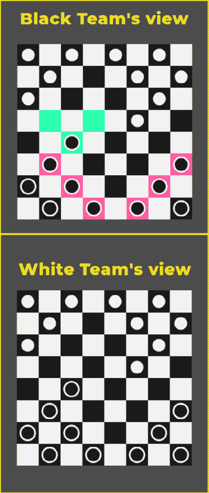
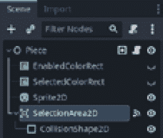
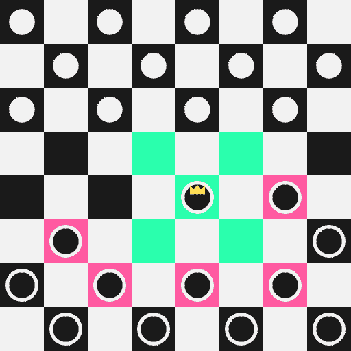
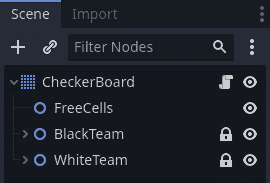
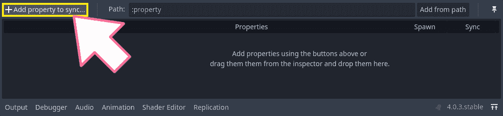
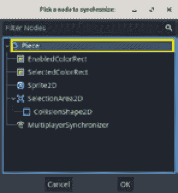
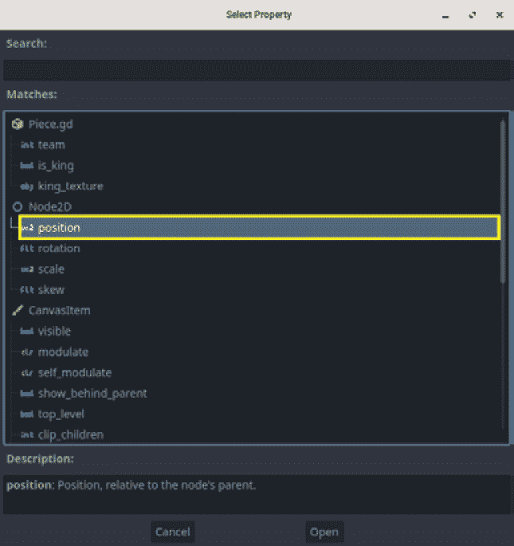
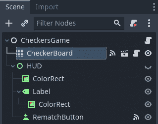
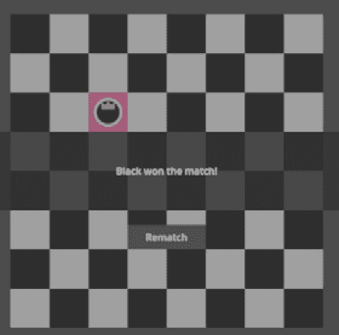

# 第六章：构建在线国际象棋游戏

在本章中，我们将深入探讨创建在线多人国际象棋游戏的迷人领域。我们将应用本书中获得的全部知识和技能，来开发一个引人入胜且互动性强的游戏体验。

棋盘游戏“国际象棋”，一种深受各个年龄段玩家喜爱的经典棋类游戏，为探索在线多人游戏开发的复杂性提供了完美的画布。我们将学习如何利用 Godot 引擎的强大功能和其多变的特性来创建无缝的多人游戏体验，让玩家在游戏中制定策略、竞争并共同享受游戏。

为了促进游戏状态在多个玩家之间的同步，我们将介绍一个名为 `MultiplayerSynchronizer` 的强大工具节点。这个节点将在更新所有连接玩家棋盘上棋子位置方面发挥关键作用。通过使用这个节点，我们可以确保每个玩家的游戏视图保持一致并更新，从而提升整体的多人游戏体验。

在本章中，我们将涵盖一些基本概念，如客户端-服务器架构、游戏同步和玩家交互，这些对于任何多人游戏开发都是基础。通过理解这些概念并将它们应用于我们的国际象棋游戏，我们将创建一个强大且引人入胜的多人游戏体验，吸引全球各地的玩家。以下图表展示了最终项目，其中玩家正在在线相互对战！



图 6.1 – 黑队回合期间玩家 1 的游戏实例视图和玩家 2 的游戏实例视图

除了技术方面，我们还将专注于创建直观的用户体验，使玩家能够无缝地导航游戏并与棋子进行交互。一个精心设计的界面对于提升玩家体验和确保流畅且愉快的游戏体验至关重要。通过使用一些视觉提示，我们将确保玩家能够直观地了解当前的游戏状态。

随着我们不断前进，我们将探讨管理玩家交互的策略，例如处理玩家回合和验证走法。这些功能对于保持游戏的公平性并确保游戏遵循国际象棋的既定规则至关重要。通过整合这些元素，我们将创造一个真实且沉浸式的国际象棋体验，让玩家可以连续数小时地参与其中。

到本章结束时，你将深入了解在线多人游戏开发的复杂性。你将拥有创建自己多人游戏所需的知识和技能，包括同步游戏状态、处理玩家交互以及提供沉浸式的多人游戏体验。

因此，准备好开始这段激动人心的旅程吧，我们将深入探索在线多人跳棋游戏开发的世界。为此，我们将学习`MultiplayerSynchronizer`节点和 RPC 函数，因为它们将是我们在同步玩家棋盘时的关键盟友。让我们开始这一章，共同发掘多人游戏开发的巨大潜力。

在本章中，我们将涵盖以下主题：

+   介绍 Checkers 项目

+   序列化玩家回合

+   反序列化对手的回合

+   管理胜负条件

# 技术要求

在这一章中，我们将处理 Godot Engine 项目仓库的第四个文件夹，您可以通过以下链接访问：[`github.com/PacktPublishing/The-Essential-Guide-to-Creating-Multiplayer-Games-with-Godot-4.0`](https://github.com/PacktPublishing/The-Essential-Guide-to-Creating-Multiplayer-Games-with-Godot-4.0)。

在继续我们的项目导入之前，你需要完成的一个要求是下载 Godot Engine 版本 4.0，因为这是我们将在整本书中使用的版本。

打开 Godot Engine 4.0 后，使用项目管理器打开项目。然后，导航到`06.building-online-checkers`文件夹。在这里，您可以找到我们构建本章项目所使用的所有文件。您可以测试游戏，打开并播放`res://06.building-online-checkers/CheckersGame.tscn`场景。

这个场景展示了我们游戏的大部分功能。在这一章中，我们还将实现我们在整本书中一直在使用的游戏大厅系统。除此之外，我们还将把一些本地功能转变为在线多人功能。

所以，请保持关注。

# 介绍 Checkers 项目

欢迎来到我们尊敬的虚构独立开发工作室的网络工程师！随着我们进入这一章，让我们花一点时间熟悉现有的 Checkers 项目。目前，该项目是为本地多人设计的，允许玩家进行离线的激动人心的比赛。这种理解将为我们探索将 Checkers 游戏转变为吸引人的在线多人体验的道路提供一个坚实的基础。

在这个努力中，我们的目标是无缝地将现有的本地多人功能过渡到在线环境中，沿途不遇到重大障碍。通过利用我们现有的知识和技能，我们可以有效地调整游戏以支持在线多人，从而扩大其影响力，并为玩家提供与全球对手竞争的机会。

在本节中，我们将揭示 Checkers 项目的内部运作，获得对其结构和机制的有价值见解。有了这种理解，我们将更有信心和效率地导航移植过程。

作为指定的网络工程师，你在这一事业中扮演着关键角色。你的专业知识和解决问题的能力将受到考验。通过仔细考虑和战略性的实施，我们可以最大限度地减少任何潜在挑战，并确保顺利过渡到在线多人领域。

一起，我们将检查项目的架构，剖析其组件，并确定实现在线多人功能所需的必要修改。通过应用我们对网络概念和编程技术的了解，我们将构建一个坚实的基础，在线多人功能将在此之上蓬勃发展。

记住，你是这个过程中的一个重要部分；作为一名网络工程师，你的工作是实现所有在线多人代码，因此你在其中扮演着基本角色。你的技能将有助于我们愿景的实现——一款令人兴奋的在线多人棋盘游戏，吸引着数字世界各地的玩家。因此，让我们开始这段旅程。在接下来的章节中，我们将了解我们本地棋盘游戏的方方面面。

## 理解棋盘游戏棋子场景

**棋子**在我们的棋盘游戏中实现了棋子游戏的功能。它允许玩家通过选择或取消选择棋子与之交互，并跟踪其选择状态。在下面的屏幕截图中，我们可以看到场景树结构的棋子。



图 6.2 – 棋子场景节点层次结构

为了增强玩家在回合中的体验和决策，我们利用 `EnabledColorRect` 和 `SelectedColorRect` 节点提供的视觉提示。当棋子在玩家的回合内能够进行有效移动时，`EnabledColorRect` 变得可见。相反，当玩家选择这个特定的棋子而不是其他棋子时，`SelectedColorRect` 变得可见，从而在它们之间实现清晰的区分。

`Sprite2D` 节点负责显示棋子的当前纹理。根据玩家的队伍以及棋子是否被提升为国王棋子，纹理可以代表白色棋子、黑色棋子或它们各自的国王版本。

`SelectionArea2D` 节点在检测玩家输入中起着至关重要的作用。通过使用 `input_event` 信号，我们建立了玩家点击与棋子之间的通信。这使得我们能够切换棋子的选择状态，确定它当前是否被选中或取消选中。

让我们看看它的代码，以了解每个节点如何在这个整体逻辑中发挥作用。

总体而言，这段代码构成了在线多人棋盘游戏的一个关键组成部分，提供了与游戏内单个棋子交互和管理其行为的必要功能：

```cpp
extends Node2D
signal selected
signal deselected
enum Teams{BLACK, WHITE}
@export var team: Teams = Teams.BLACK
@export var is_king = false: set = _set_is_king
@export var king_texture = preload("res://
    06.building-online-checkers/WhiteKing.svg")
@onready var area = $SelectionArea2D
@onready var selected_color_rect = $SelectedColorRect
@onready var enabled_color_rect = $EnabledColorRect
@onready var sprite = $Sprite2D
var is_selected = false
```

我们首先定义一些变量来存储有关 Pieces 队伍的信息——它是否是国王，以及其纹理。它还有一些场景中的子节点的引用和一个变量来跟踪 Pieces 是否当前被选中。定义了信号以指示 Pieces 被选中或取消选中。接下来，我们将声明我们在 `_is_king` 变量中提到的设置函数：

```cpp
func _set_is_king(new_value):
  is_king = new_value
  if not is_inside_tree():
    await(ready)
  if is_king:
    sprite.texture = king_texture
```

当这个变量被设置为新的值时，代码会检查节点是否是场景树的一部分。如果不是，它会等待节点准备好，这可以防止通过检查器更改变量值时出现任何错误。如果变量被设置为 `true`，它会更新游戏 Pieces 的视觉外观以表示国王，使用特定的纹理。这允许在 Pieces 成为国王时进行动态的视觉变化。之后，我们有来自 `Area2D` 节点的 `input_event` 信号的信号回调：

```cpp
func _on_area_2d_input_event(viewport, event, shape_idx):
  if event is InputEventMouseButton:
    if event.button_index == 1 and event.pressed:
      select()
```

它监听左鼠标按钮点击，并在检测到点击时调用 `select()` 方法，正如我们接下来将要看到的，这个方法执行与选中 Pieces 相关的程序。这段代码在玩家在 Pieces 的 `Area2D` 上悬停并点击左鼠标按钮时启用游戏内的交互。这里，我们有 `select()` 方法的代码：

```cpp
func select():
  get_tree().call_group("selected", "deselect")
  add_to_group("selected")
  selected_color_rect.show()
  is_selected = true
  selected.emit()
```

在这个函数中，我们定义了当 Pieces 被选中时会发生什么。它确保任何之前选中的对象被取消选中，标记当前对象为选中状态，显示一个可视指示器，更新一个变量以反映选中状态，并发出 `selected` 信号来通知游戏的其他部分关于选中事件。这段代码对于管理和传达游戏中 Pieces 的选中状态至关重要。然后，我们还有相反的函数，`deselect()`：

```cpp
func deselect():
  remove_from_group("selected")
  selected_color_rect.hide()
  is_selected = false
  deselected.emit()
```

在这里，我们定义了当对象被取消选中时会发生什么。代码将对象从 `"selected"` 组中移除，隐藏选中状态的可视指示器，更新 `is_selected` 变量以反映取消选中状态，并发出 `deselected` 信号来通知游戏的其他部分关于取消选中事件。现在，是时候启用选择状态的变化了；没有这个，Pieces 不应该被选中。这有助于防止玩家从对手的队伍中选中 Pieces：

```cpp
func enable():
  area.input_pickable = true
  enabled_color_rect.visible = true
```

在这部分，我们使 `Area2D` 对输入事件做出响应，并在屏幕上显示一个可视指示器。这对于允许玩家在启用状态下与游戏中的 Pieces 交互和操作非常重要。现在，让我们看看它的对应方法，即 `disable()` 方法：

```cpp
func disable():
  area.input_pickable = false
  enabled_color_rect.visible = false
```

这基本上是前一种方法的相反。我们使 `Area2D` 对输入事件无响应，从而使其不可交互。除此之外，我们还隐藏了表示 Pieces 可用性的屏幕上的可视指示器，直观地表示 Pieces 的禁用状态。这对于控制玩家何时以及如何与游戏中的 Pieces 交互非常有用。

在接下来的部分中，我们将看到 FreeCell 场景是如何工作的。这是一个我们用来突出显示所选棋子可以移动到的可用空单元格的场景。

## 理解 FreeCell 场景

在我们的游戏项目中，有一个称为 **FreeCell** 的概念，它代表一个棋子可以移动到的有效单元格。把它想象成一个棋子被允许进入的指定区域。每次玩家选择一个具有有效移动的棋子时，我们通过将它们显示为绿色来视觉上指示可用的单元格。这些单元格实际上是 FreeCell 场景的实例，我们动态地在游戏板上创建和显示这些实例。

为了提供一个清晰的例子，想象一下选择了一个国王棋子的场景。在下面的图中，你可以看到所有这个国王棋子可以移动到的单元格都被高亮显示为绿色。这些被高亮的单元格都是 FreeCell 场景的实例，允许玩家快速识别所选棋子的可能移动选项。



图 6.3 – 可供所选国王棋子使用的 FreeCell

通过使用 FreeCell 概念，我们通过视觉传达有效的移动可能性来增强玩家的体验。这使他们能够做出明智的决定并有效地策略性地规划下一步。这是一个强大的工具，它为游戏机制增添了清晰度和深度。

FreeCell 场景是我们游戏的一个基本组成部分，由三个不同的节点组成。主要节点是一个 `Area2D`，它是 FreeCell 的基础。它包括两个子节点 – 一个 `CollisionShape2D` 和一个 `ColorRect`。

`CollisionShape2D` 节点负责定义 FreeCell 的形状和边界。它确保单元格可以正确地与其他游戏对象（如棋子或游戏世界中的其他元素）交互。正如我们即将看到的，`CollisionShape2D` 还定义了 `Area2D` 检测鼠标输入的边界，这对于 FreeCell 的行为是基本的。

`ColorRect` 节点相反地控制着 FreeCell 的视觉表示。它决定了单元格的颜色和外观，为游戏板上的其他元素提供了一个视觉指示器，以便将其区分开来。

![Figure 6.4 – The FreeCell scene node hierarchy

![img/Figure_06.04_B18527.jpg]

图 6.4 – FreeCell 场景节点层次结构

为了更好地理解 FreeCell 的功能和行为，让我们探索其伴随的脚本。通过检查脚本代码，我们将深入了解 FreeCell 如何运作以及它与其他游戏元素的交互，最终有助于整体游戏逻辑和机制。

```cpp
extends Area2D
signal selected(cell_position)
func _input_event(viewport, event, shape_idx):
     if event is InputEventMouseButton:
          if event.button_index == 1 and event.pressed:
               select()
func select():
     selected.emit(self.position)
```

此代码允许由`Area2D`表示的单元格在其区域内响应用户右键鼠标事件。当单元格被选中时，它发出一个包含单元格位置的信号。这个信号可以用来通知其他对象或脚本关于选择的信息，并为它们提供单元格的位置以进行进一步处理。我们将在`CheckerBoard`脚本中使用这个功能，将 FreeCell 的位置映射到棋盘的单元格上。

在下一节中，我们将介绍游戏棋盘，这是我们游戏的一个基本组成部分。然后，我们将把注意力转向本章的核心内容，即实现我们将将其转换为 RPC 的方法。这些 RPC 将使游戏能够在在线环境中无缝运行，允许玩家之间互动并同步他们的网络动作。

通过利用 RPC 的力量，我们将为玩家创造一个动态和吸引人的多人游戏体验。让我们深入了解细节，并探索这些方法如何使我们的游戏在在线环境中栩栩如生。

## 介绍 CheckerBoard 场景

在本节中，让我们深入探讨游戏棋盘的主要作用，因为这将为我们的后续章节奠定基础。通过理解棋盘的关键职责，我们可以自然地识别出我们在后续章节中将关注的特定领域。这种理解将为我们在继续探索棋盘的开发过程时提供一个清晰和结构化的方法。

我们游戏棋盘的主要作用是管理游戏中的黑白棋子之间的关系。为了实现这一点，棋盘利用内置的`TileMap`函数将棋子映射到笛卡尔坐标系上。此外，它还使用哈希表将棋盘上每个单元格的内容关联起来。

这意味着我们可以通过提供相应的`Vector2i`坐标来访问特定单元格的内容。例如，通过使用`meta_board[Vector2i(0,3)]`表达式，我们可以检索位于棋盘第一列第四行的单元格内容。这次访问的结果将是`null`，表示该单元格是空的，或者它将返回当前映射到该特定单元格的棋子。这种机制允许高效地检索和操作棋盘上的内容，从而实现流畅的游戏和与棋子的交互。

CheckerBoard 在我们的游戏中扮演着至关重要的角色，它监督游戏的各种方面。首先，它管理棋盘上每个单元格的可用移动，考虑到当前在场的队伍以及是否有棋子被提升为国王。这确保了玩家只能根据游戏规则进行有效移动。

CheckerBoard 还负责控制游戏中的回合。它根据活跃的队伍启用和禁用棋子，允许在回合中仅允许正在进行的队伍进行移动。这种机制确保了公平的游戏和维持游戏的流畅性。

此外，CheckerBoard 会跟踪每个队伍在每个回合结束时拥有的棋子数量。这个计数至关重要，因为它决定了游戏的胜负条件。如果一个队伍在棋盘上没有剩余的棋子，CheckerBoard 将触发适当的 `win` 条件，宣布对方队伍为胜者。

通过管理单元格移动、调节回合和监控棋子数量，CheckerBoard 维护游戏的规则和进展。它的作用对于提供明确的胜负条件至关重要。让我们看看 CheckerBoard 场景结构：



图 6.5 – CheckerBoard 场景节点层次结构

需要注意的是，CheckerBoard 是作为 `TileMap` 实现的，这是我们在游戏中使用的一个有用的类。我们使用 `TileMap` 类提供的特定方法，例如 `map_to_local()`、`local_to_map()` 和 `get_used_cells()`，来建立我们的单元格映射功能。`map_to_local()` 方法将帮助我们将游戏映射到 `TileMap` 中的单元格位置，而 `local_to_map()` 将帮助我们将棋子的位置转换为地图中的单元格。这将帮助我们以行和列的形式抽象游戏，而不是使用浮点数。至于 `get_used_cells()` 方法，它将帮助我们访问仅设置了瓦片的单元格，并避免在 `TileMap` 中处理空白单元格。这在我们创建单元格内容的矩阵时将非常有用。

在 `CheckerBoard` 类中，我们将关注理解 `meta_board`、`create_meta_board()` 和 `map_pieces()` 方法在 `CheckerBoard` 类中的重要性：

```cpp
func create_meta_board():
     for cell in get_used_cells(0):
          meta_board[cell] = null
func map_pieces(team):
     for piece in team.get_children():
          var piece_position = local_to_map(piece.position)
          meta_board[piece_position] = piece
          piece.selected.connect(_on_piece_selected.bind
              (piece))
```

`create_meta_board()` 方法负责设置 `meta_board` 字典。这个字典充当一个数据结构，将单元格坐标映射到它们对应的内 容。通过利用前面提到的 `TileMap` 方法，`create_meta_board()` 方法用适当的单元格坐标填充 `meta_board`，并将它们初始化为空值，表示空白单元格。

相反，`map_pieces()` 方法在更新 `meta_board` 以反映游戏当前状态方面发挥着至关重要的作用。该方法遍历提供的队伍上的所有棋子，该队伍作为引用传递给 `BlackTeam` 节点或 `WhiteTeam` 节点。然后，它使用 `TileMap.local_to_map()` 方法转换棋子的位置，并将每个棋子映射到 `meta_board` 中相应的单元格坐标。这确保 `meta_board` 准确地表示视觉棋盘上棋子的放置。

最后，代码在`Piece.selected`信号和`_on_piece_selected()`回调函数之间建立了一个连接。通过连接这个信号，我们将当前棋子绑定到回调函数作为其参数。这使得我们能够在玩家选择它时方便地访问`Piece`节点。

这个连接确保了当棋子发出选择信号时，相关的回调函数`_on_piece_selected()`将被调用，并提供了`Piece`节点作为其参数。这种机制允许我们根据玩家的选择执行特定操作或访问`Piece`节点的属性。

通过建立这个连接，我们在`Piece`节点和相应的回调函数之间创建了一个无缝的交互，增强了游戏的灵活性和响应性。

有一些辅助函数帮助我们计算可用单元格并协调棋子的移动；请随意查看它们，了解我们是如何检查可用单元格的，我们是如何捕获单元格的，以及其他游戏玩法特性。在下一节中，我们将探索我们跳棋开发旅程的不同方面。

我们将关注我们如何打包和传输有关玩家回合的所有相关信息，确保其他玩家能够及时更新游戏板当前的状态。

通过理解这个过程，我们将能够建立玩家之间的有效通信，促进无缝的多玩家体验。这种功能对于保持同步和实现在线多人游戏中的实时游戏至关重要。请继续关注，我们将深入了解在网络中传输和更新游戏状态的所有细节。

# 序列化玩家回合

在*第二章* *发送和接收数据*中，我们探讨了在网络中跨多个玩家重新创建游戏状态的基本技术。通过序列化相关数据并以小部分传输，我们确保了网络带宽的有效利用，同时保持了玩家之间的同步。

理解在玩家之间复制游戏状态所需的关键信息，涉及掌握游戏开发中的抽象概念。在我们的案例中，这主要围绕`meta_board`，它是我们游戏相关元数据（如棋子的位置数据和棋王状态以及棋盘中的空单元格）的抽象。

此外，我们需要考虑棋子的可用性，这取决于玩家的回合。幸运的是，游戏中的大多数其他元素可以在本地管理，无需网络同步。

为了简化在网络节点之间同步属性的过程，我想向您介绍`MultiplayerSynchronizer`。这个强大的节点承担了自动同步节点属性的责任，使我们免去了手动同步的繁琐任务。

在`MultiplayerSynchronizer`就位后，我们可以专注于开发游戏逻辑，让节点处理玩家之间数据的高效传输。

## 与 MultiplayerSynchronizer 一起工作

`MultiplayerSynchronizer`通过允许我们轻松同步和共享多个玩家之间节点的状态，发挥着至关重要的作用，而无需编写任何额外的代码。为了开始利用这一功能，我们将向 Piece 的场景添加一个`MultiplayerSynchronizer`节点。这将确保每个玩家的游戏状态一致性。让我们深入了解集成`MultiplayerSynchronizer`并利用其功能的过程。

### 在 Piece 场景中设置 MultiplayerSynchronizer

打开`res://06.building-online-checkers/Piece.tscn`场景，并将`MultiplayerSynchronizer`作为`Piece`节点的子节点添加。然后，我们将设置我们想要同步的属性：

1.  在选择`MultiplayerSychronizer`节点后，在**复制**选项卡的底部面板中，点击**添加属性以同步**按钮。



图 6.6 – MultiplayerSynchronizer 节点的复制菜单

1.  从弹出菜单中选择**Piece**节点。



图 6.7 – 从选择要同步的节点弹出菜单中选择 Piece 节点

1.  在选择**Piece**节点后，将出现另一个弹出菜单，要求您选择要同步的属性。从那里，选择**位置**属性。



图 6.8 – 从选择属性弹出菜单中选择位置属性

就这样。有了这个，一旦玩家连接到同一网络，他们就会自动同步棋盘上 Piece 的位置。然而，我们仍然有一个问题，因为这只会更新 Piece 的视觉表示，我们仍然需要更新其在`meta_board`中的数据。现在到了有趣的部分。

在下一节中，我们将开始了解 CheckerBoard 中我们需要转换为 RPC 的方法，以保持玩家在同一个页面上。

## 更新和同步 CheckerBoard

在开发任何应用程序时，一个核心问题是我们资源有限。在通过网络传输数据的情况下，我们谈论的是带宽。游戏是一个特殊情况，因为所有事情都应该实时发生，所以我们不能冒险进行会损害网络性能的大量数据传输。

为了将这一优势转化为我们的优势，我们需要以最抽象和轻量级的方式传递数据。在我们的例子中，我们的 `meta_board` 是表示游戏当前状态的一种手段。通过使用 `Vector2i` 坐标，我们可以访问和更改游戏状态。这就是我们将如何保持玩家更新的。在下一节中，我们将处理 `CheckerBoard.update_cells()` 方法，这是我们更新系统的核心。

### 使用坐标更新棋盘

由于 `meta_board` 是一个字典，我们可以使用 Godot 引擎内置的类型来访问和设置其键的值。例如，如果我们想将第三行第二列单元格的内容更改为 `null`，我们可以编写 `meta_board[Vector2i(1, 2)] = null`。

当棋子进行移动时，我们只需要知道这个移动的先前单元格和新单元格的内容，这样我们就可以更新它。这正是 `update_cells()` 方法所做的事情。让我们看看它：

```cpp
func update_cells(previous_cell, target_cell):
     meta_board[target_cell] = meta_board[previous_cell]
     meta_board[previous_cell] = null
```

由于这是我们更新系统的核心，我们需要将其转换为 RPC 函数并按此方式调用。

为了做到这一点，让我们在我们的脚本中进行适当的更改：

1.  使用 `any_peer` 和 `call_local` 选项将 `@rpc` 注解添加到这个方法中。我们使用这些选项是因为我们希望每个玩家都能更新其他玩家的棋盘变化，并且我们也希望他们的棋盘自己更新，因此有 `call_local` 选项：

    ```cpp
    @rpc("any_peer", "call_local")
    func update_cells(previous_cell, target_cell):
    ```

1.  在 `move_selected_piece()` 方法中，将 `update_cells(current_cell, target_cell)` 行更改为 RPC 调用。这将使这个方法在其它对等机上也是本地和远程调用：

    ```cpp
    func move_selected_piece(target_cell):
         var current_cell = local_to_map
             (selected_piece.position)
         Selected_piece.position = map_to_local
             (target_cell)
         rpc("update_cells", current_cell, target_cell)
         if not is_free_cell(target_cell):
              crown(target_cell)
    ```

这样，每当 CheckerBoard 移动一个棋子时，它就会在网络上所有对等机上更新其 `meta_board` 数据。

注意，我们还可以将另一个方法转换为 RPC。每个玩家都应该更新到达对手王行的棋子的 `Piece.is_king`。为此，我们在 `move_selected_piece()` 逻辑的底部调用了 `crown()` 方法。

让我们用与 `update_cells()` 相同的方式做同样的事情：

1.  首先，我们使用 `@rpc` 注解并添加 `any_peer` 和 `call_local` 选项：

    ```cpp
    @rpc("any_peer", "call_local")
    func crown(cell):
    ```

1.  然后，我们将 `crown(target_cell)` 调用更改为它的 `rpc()` 版本：

    ```cpp
    func move_selected_piece(target_cell):
         var current_cell = local_to_map
             (selected_piece.position)
         selected_piece.position = map_to_local
             (target_cell)
         rpc("update_cells", current_cell, target_cell)
         if not is_free_cell(target_cell):
              rpc("crown", target_cell)
    ```

这样，当一个棋子到达王行时，所有玩家的 CheckerBoard 都会更新他们的王状态，无论是对手的棋子还是盟友的棋子。

我们的工作还没有完成。在下一节中，我们将看到当玩家执行捕获动作时如何更新 `meta_board` 内容，这意味着我们需要从棋盘上移除一个棋子。

### 从棋盘上移除棋子

当玩家移动棋子并最终捕获对手的棋子时，我们应该相应地更新游戏板。这意味着除了更新移动涉及的单元格外，我们还应该更新捕获的棋子所在的单元格，将其内容设置为 `null` - 也就是说，将其变成一个空单元格。这正是 `remove_piece()` 方法所做的事情。

让我们看看它的代码：

```cpp
func remove_piece(piece_cell):
     if not is_on_board(piece_cell):
          return
     if is_free_cell(piece_cell):
          return
     var piece = meta_board[piece_cell]
     piece.get_parent().remove_child(piece)
     piece.free()
     meta_board[piece_cell] = null
```

由于这种行为影响双方玩家，我们需要将此方法也转换为 RPC，以便每次玩家捕获一个棋子时，他们都会更新对手这个令人难过的事实。

让我们做出适当的更改，以确保这个功能符合我们的在线多人游戏需求：

1.  将`@rpc`注解添加到`remove_piece()`方法上，并使用`any_peer`和`call_local`选项：

    ```cpp
    @rpc("any_peer", "call_local")
    func remove_piece(piece_cell):
    ```

1.  在`capture_piece()`方法中，将`remove_piece(cell)`行更新为其`rpc()`版本：

    ```cpp
    func capture_pieces(target_cell):
         var origin_cell = local_to_map(selected_piece.
             position)
         var direction = Vector2(target_cell -origin_cell)
             .normalized()
         direction = Vector2i(direction.round())
         var cell = target_cell - direction
         if not is_on_board(cell):
              return
         if not is_free_cell(cell):
              rpc("remove_piece", cell)
              move_selected_piece(target_cell)
    ```

现在，每次玩家捕获一个单元格时，它都会在所有连接的玩家上本地和远程调用`remove_piece()`方法！

这样，我们就有了玩家回合的正确序列化，并准备好通过网络传递给其他玩家，具有良好的性能和低数据使用，如果我们愿意，还可以留下良好的带宽。例如，如果我们想在将来添加聊天功能，我们可以使用新的 RPC 通道。

在本节中，我们学习了抽象相关数据对于我们的网络通信的重要性，以及如何将本地功能转换为远程功能，同时保持所有逻辑和整体结构。在这里，我们看到了`call_local` RPC 选项的相关性，以及使用`rpc()`方法将方法调用转换为 RPC 调用的简单性。

在下一节中，我们将看到如何管理回合逻辑。这是一个重要的功能，因为在那里我们需要积极添加一层网络验证来正确处理回合。本地回合转换和远程回合转换的逻辑非常不同。

# 处理远程回合转换

在线玩游戏的最重要的方面之一是保持玩家对其资源的自主权和控制权——在这种情况下，是他们团队的棋子。Godot 引擎提供了一个有趣的系统，其中 SceneTree 可以使用不同的多玩家权限来结构化其节点的层次结构。

为了递归地设置节点及其子节点的多玩家权限，我们可以使用`set_multiplayer_authority()`并传递相应的玩家 ID 作为参数。在我们的例子中，我们将更改`BlackTeam`和`WhiteTeam`节点多玩家权限以匹配它们各自玩家的玩家 ID。

这将由服务器来完成，为了保持应用程序简单，我们将允许客户端和服务器共享相同的脚本，并且我们将通过在 CheckerBoard 上使用`is_multiplayer_authority()`来检查哪个正在运行服务器实例。只有在游戏在网络中运行并且有连接的玩家时，我们才应该运行这个逻辑。为此，我们可以检查`multiplayer.get_peers().size()`是否大于`0`，这意味着有玩家连接。让我们看看实际操作吧，好吗？

## 设置玩家团队

要处理玩家轮次转换，我们首先需要理解的是，代表团队的每个节点——换句话说，`BlackTeam`和`WhiteTeam`节点——应该将其各自的玩家同伴 ID 设置为它们的多人权限。

在这个意义上，我们需要在`CheckerBoard`类中创建一个方法，该方法接收团队和同伴 ID 作为参数。记住，我们无法在这个方法中传递对象作为参数，因为它需要在网络中工作。因此，我们需要将团队抽象为一个`enum`，我们可以通过 RPC 传递它，然后所有同伴都将能够理解消息并在他们的端点访问正确的团队节点。让我们深入行动，创建一个名为`setup_team()`的方法：

1.  在`setup_team()`函数定义之前添加`@rpc("authority", "call_local")`装饰器。`authority`选项表示只能由多人权限调用此 RPC；记住，CheckerBoard 的权限仍然是服务器。`call_local`参数指定该函数还应在本地调用者上执行：

    ```cpp
    @rpc("authority", "call_local")
    func setup_team(team, peer_id):
    ```

1.  在函数内部，检查`team`的值是否等于`Teams.BLACK`；如果是这样，在`black_team`对象上调用`set_multiplayer_authority()`方法，并传递`peer_id`作为参数。这实际上指定了指定的同伴为`BlackTeam`及其所有子节点——换句话说，黑棋——的权限：

    ```cpp
    @rpc("authority", "call_local")
    func setup_team(team, peer_id):
         if team == Teams.BLACK:
              black_team.set_multiplayer_authority
                  (peer_id)
    ```

1.  否则，在`white_team`对象上调用`set_multiplayer_authority()`方法，并传递`peer_id`作为参数：

    ```cpp
    @rpc("authority", "call_local")
    func setup_team(team, peer_id):
         if team == Teams.BLACK:
              black_team.set_multiplayer_authority
                  (peer_id)
         else:
              white_team.set_multiplayer_authority
                  (peer_id)
    ```

此方法根据接收到的团队，`black_team`或`white_team`，使用提供的`peer_id`设置团队节点的多人权限。这确保了每个团队的多人权限都得到正确建立，允许游戏逻辑在网络同伴之间同步。由于服务器在所有同伴上调用此方法，玩家和服务器都将相应地同步他们的团队节点。

现在，为了确保这种机制将在所有同伴之间建立，我们将在`_ready()`回调内部直接添加以下代码行：

1.  在`_ready()`回调内部，通过检查`multiplayer.get_peers()`数组的大小是否大于`0`来检查多人会话中是否有同伴连接：

    ```cpp
    func _ready():
         if multiplayer.get_peers().size() > 0:
    ```

1.  如果是这样，使用`is_multiplayer_authority()`函数检查当前节点是否是多人权限。这确保我们只会在服务器同伴中调用以下逻辑：

    ```cpp
    func _ready():
         if multiplayer.get_peers().size() > 0:
              if is_multiplayer_authority():
    ```

1.  然后，使用`rpc()`方法，传递`"setup_team"`、`Teams.BLACK`和`multiplayer.get_peers()[0]`参数进行 RPC 调用。这将调用所有连接同伴的`setup_team()`方法，告诉他们使用连接同伴列表中的第一个同伴 ID 设置 BlackTeam 的多人权限。因此，在会话中首先连接的玩家将负责黑棋：

    ```cpp
    func _ready():
         if multiplayer.get_peers().size() > 0:
              if is_multiplayer_authority():
                   rpc("setup_team", Teams.BLACK,
                       multiplayer.get_peers()[0])
    ```

1.  在上一行下面，我们将做同样的事情，但使用`Teams.WHITE`和连接节点的第二个索引，即第二个连接到会话的玩家：

    ```cpp
    func _ready():
         if multiplayer.get_peers().size() > 0:
              if is_multiplayer_authority():
                   rpc("setup_team", Teams.BLACK,
                       multiplayer.get_peers()[0])
                   rpc("setup_team", Teams.WHITE,
                       multiplayer.get_peers()[1])
    ```

如此一来，我们的团队设置已经到位。请注意，由于服务器已经将团队节点多玩家权限分配给了比赛中每位玩家，因此服务器本身无法在棋盘的棋子中进行任何移动。

说到那个预防机制，它是如何工作的？跳棋棋盘是如何防止玩家与棋子互动的，尤其是与他们的对手棋子的？在下一节中，我们将看到我们如何检测哪个玩家被分配到哪个团队，并且只重新启用他们适当的团队棋子。

## 启用和禁用团队棋子

在我们的游戏中，当玩家结束回合时，我们使用`disable_pieces()`方法禁用所有他们的棋子。在回合转换时，我们确保禁用两队的棋子，并检查上一回合是否有赢家；如果没有，我们根据回合的团队开始重新启用玩家棋子的程序。

所有这些都在`toggle_turn()`方法中发生，但就目前而言，它无法在线多人场景中工作，因为目前该方法仅执行本地逻辑。所以，让我们将其转换为一个适用于我们改进的在线多人跳棋游戏的方法。

然而，在那之前，让我们看看代码目前的状况，这样我们就可以提前确定我们需要在哪里进行调整：

```cpp
func toggle_turn():
     clear_free_cells()
     disable_pieces(white_team)
     disable_pieces(black_team)
     var winner = get_winner()
     if winner:
          player_won.emit(winner)
          return
     if current_turn == Teams.BLACK:
          current_turn = Teams.WHITE
          enable_pieces(white_team)
     else:
          current_turn = Teams.BLACK
          enable_pieces(black_team)
```

此函数负责管理游戏的回合逻辑。它首先清除可移动的可用单元格，然后禁用两队的棋子。然后，它检查是否有赢家，如果有，则向`CheckersGame`脚本的`_on_checker_board_player_won()`方法发出信号，指示获胜的团队。如果没有赢家，则将回合切换到另一队并启用相应团队的棋子。

你能指出我们需要在哪里进行必要的更改，以便使其在我们的游戏在线版本中工作吗？请记住，游戏应该本地和远程都能工作，因此我们需要保持此方法的整体结果。让我们开始这个过程：

1.  使用`@rpc`注解装饰`toggle_turn()`方法，使用`any_peer`和`call_local`选项。这表示任何节点都可以在多人会话中远程调用此方法，但他们也应该本地调用它。这确保了即使我们没有加入多人会话玩游戏，我们也可以使用`rpc()`方法本地调用此方法，一切仍然会正常工作：

    ```cpp
    @rpc("any_peer", "call_local")
    func toggle_turn():
    ```

1.  在其中，检查`current_turn`是否为`Teams.BLACK`；我们将`enable_pieces(white_team)`移动到另一个检查中。这次，我们将检查是否没有连接的节点，这意味着我们是在单独或本地玩游戏：

    ```cpp
    if current_turn == Teams.BLACK:
              current_turn = Teams.WHITE
              if not multiplayer.get_peers().size() > 0:
                   enable_pieces(white_team)
    ```

1.  如果我们不在本地玩游戏，我们需要检查当前玩家是否是 WhiteTeam 的多玩家权限，使用`multiplayer.get_unique_id()`方法；如果是，我们可以启用**WhiteTeam**的棋子。这就是我们确保只有正确的玩家才能重新启用他们的棋子的方法：

    ```cpp
    if current_turn == Teams.BLACK:
              current_turn = Teams.WHITE
              if not multiplayer.get_peers().size() > 0:
                   enable_pieces(white_team)
              elif white_team.get_multiplayer_authority()
                  == multiplayer.get_unique_id():
                   enable_pieces(white_team)
    ```

1.  我们将要执行相同的事情，但是在`else`语句内部，这个语句处理的是`current_turn`是否来自`Teams.WHITE`：

    ```cpp
    else:
              current_turn = Teams.BLACK
              if not multiplayer.get_peers().size() > 0:
                   enable_pieces(black_team)
              elif black_team.get_multiplayer_authority()
                  == multiplayer.get_unique_id():
                   enable_pieces(black_team)
    ```

因此，每次我们调用`toggle_turn()`方法时，我们都会检查对等方是否有权控制当前正在进行的`Pieces`，并且我们只允许他们从他们的队伍中选择`Pieces`。现在，我们还需要进行一个小改动，以便使其符合我们的网络要求。在`_free_cell_selected()`回调中，让我们更改直接调用`toggle_turn()`方法的行，改为使用`rpc()`方法进行远程调用：

```cpp
func _on_free_cell_selected(free_cell_position):
     var free_cell = local_to_map(free_cell_position)
     if can_capture(selected_piece):
          capture_pieces(free_cell)
     else:
          move_selected_piece(free_cell)
     rpc("toggle_turn")
     selected_piece.deselect()
```

注意，`can_capture()`方法负责检查在`selected_piece`周围是否有任何敌方棋子，这可能导致捕获移动。如果是这种情况，我们调用`capture_pieces()`方法，它将在选定的方向上对所有可能的敌方棋子执行捕获移动。否则，如果没有可用的捕获移动，我们将执行简单的移动，调用`move_selected_piece()`方法，并将`free_cell`作为参数传递。

现在，每当玩家选择一个可用的空闲单元格来移动棋子时，他们将对`toggle_turn()`进行远程过程调用，告诉所有连接的对等方正确地禁用和重新启用他们各自的棋子。太棒了，不是吗？

到目前为止，我们已经将游戏的所有核心机制都设置好了，我们可以与其他连接到我们网络的玩家进行在线比赛。唯一缺少的是，当玩家赢得比赛时，我们仍然需要在网络上进行通信，并允许玩家再次进行游戏。

在下一节中，我们将创建一个简单的机制，允许玩家在其中一个玩家赢得比赛后进行重赛。

# 管理胜负条件

太棒了！我们已经成功完成了 CheckerBoard 场景的开发，现在我们的游戏核心功能已经就绪。下一步是将 CheckersGame 场景的逻辑从本地游戏转变为远程游戏。

首先，让我们打开`res://06.building-online-checkers/CheckersGame.tscn`文件，熟悉其结构。



图 6.9 – CheckersGame 的场景节点层次结构

注意，CheckerBoard 的`player_won`信号连接到`CheckersGame._on_checker_board_player_won()`回调。这个回调负责处理玩家队伍在棋盘上没有剩余棋子的情况。现在，让我们打开 CheckersGame 的脚本继续操作。

我们将处理脚本中的所有方法，确保它们适合在线多人游戏功能进行适当调整：

1.  首先，让我们给 `update_winner()` 方法添加 `@rpc` 注解，并使用 `any_peer` 和 `call_local` 选项。

    ```cpp
    @rpc("any_peer", "call_local")
    func update_winner(winner):
    ```

1.  然后，我们将对 `rematch()` 方法做同样的处理。这个方法是由重赛按钮的 `pressed` 方法调用的：

    ```cpp
    @rpc("any_peer", "call_local")
    func rematch():
    ```

1.  现在，我们需要使用 `rpc()` 方法远程调用这些方法，而不是直接在 `CheckersGame` 中调用它们。让我们在 `_on_checker_board_player_won()` 中这样做，将 `update_winner(winner)` 转换为 `rpc("update_winner", winner)`。这是 CheckerBoard 的 `player_won signals` 连接到的方法：

    ```cpp
    func _on_checker_board_player_won(winner):
         rpc("update_winner", winner)
    ```

1.  最后，我们对 `_on_rematch_button_pressed()` 也进行同样的操作，将 `rematch()` 调用转换为 `rpc("rematch")`。这是 `RematchButton` 的 `pressed` 信号连接到的方法，因此当玩家按下按钮时，应该发生以下操作：

    ```cpp
    func _on_rematch_button_pressed():
         rpc("rematch")
    ```

经过我们做出的调整，我们的游戏现在已经完全准备好，无论是本地还是远程玩都能流畅运行。当一名玩家成功捕获对手的棋子时，游戏将把所有玩家过渡到重赛状态，任何玩家都可以发起新的比赛并开始新的游戏。这确保了玩家可以选择参与连续的游戏会话，而无需手动退出和重新启动游戏。



图 6.10 – CheckersGame 重赛屏幕

我们的游戏终于可以工作了！我们有一个完全功能齐全的国际象棋游戏，玩家可以在线玩并挑战彼此进行多轮比赛。

# 摘要

总结一下，在本章中，我们介绍了 `MultiplayerSynchronizer` 节点以在网络中同步属性，建立了有效数据传输的抽象概念，利用 `@rpc` 注解启用多人游戏功能，并学习了如何分配和管理多人权限以确保玩家自主权和资源保护。

在下一章中，我们将看到如何开发在线乒乓球游戏。在那里，我们将介绍将本地游戏转换为在线多人游戏所需的修改，设置在线多人游戏拍子，实时同步远程对象，以及协调拍子的位置。为此，我们将使用比本章更深入的 `MultiplayerSynchronizer` 节点。此外，我们还将讨论在动作游戏中维护共享游戏世界对玩家的重要性，这与回合制游戏非常不同。
