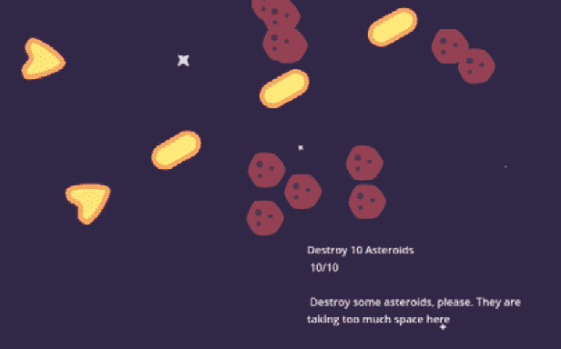

# 第九章：创建在线冒险原型

在本章中，我们将探索一个在线太空冒险游戏的迷人世界，该游戏有可能演变成一个**大型多人在线角色扮演游戏**（**MMORPG**）。在整个旅程中，我们将为沉浸式游戏体验奠定基础，允许玩家加入持久的世界，并无缝地将他们的游戏状态与游戏世界的当前状态同步。

这是一张最终太空射击冒险原型快照：



图 9.1 – 两位玩家共同完成摧毁 10 颗小行星的任务

我们的主要关注点将是构建一个强大的网络系统，通过使用 Godot 引擎网络 API 促进玩家之间的实时交互。通过这个系统，玩家将连接到一个中央服务器，确保每个人共享相同的游戏世界，并能够见证彼此的行动，促进协作和团队精神。

此外，我们将深入研究创建一个动态任务系统，该系统能够跟踪玩家进度并将此数据存储在数据库中，以便当玩家回来时，他们可以保持自己的进度。在我们的太空冒险原型中，玩家将合作完成诸如摧毁小行星等任务。

我们将首先了解我们游戏中的每个部分的作用：小行星、宇宙飞船和玩家场景。然后，我们将转向冒险游戏的核心功能——任务系统，我们将学习如何将数据拉取和推送到服务器，以及从服务器和玩家的角度构建这个强大系统的要素。

本章我们将涵盖以下主题：

+   介绍原型

+   将玩家登录到服务器

+   分离服务器和客户端的责任

+   在服务器上存储和检索数据

到本章结束时，您将拥有一个在线冒险游戏的基础，该游戏可以扩展成一个庞大而吸引人的大型多人在线角色扮演游戏（MMORPG）。配备持久的世界、同步游戏玩法和任务系统，您将准备好构建一个引人入胜且动态的在线游戏体验。

# 技术要求

要访问本章的资源，请访问我们的在线项目仓库，网址为[`github.com/PacktPublishing/The-Essential-Guide-to-Creating-Multiplayer-Games-with-Godot-4.0`](https://github.com/PacktPublishing/The-Essential-Guide-to-Creating-Multiplayer-Games-with-Godot-4.0)。

在您的计算机上拥有仓库后，在 Godot 引擎编辑器中打开`res://09.prototyping-space-adventure`文件夹。您将在这里找到本章所需的全部文件。

现在，让我们开始入职流程。在下一节中，我们将介绍项目，探索其主要类，并确定我们需要实现网络功能的地方。

# 介绍原型

在本节中，我们将全面了解驱动我们原型的核心系统。作为我们虚构工作室的网络工程师，我们的角色在将我们的本地游戏原型转变为激动人心的在线多人游戏原型中至关重要。为了实现这一目标，我们必须熟悉构成我们项目的重大类和文件。

在我们加入一个项目时，不要忽视入职流程的重要性。作为网络工程师，应用我们的知识和洞察力对于无缝融入开发过程至关重要。通过理解核心系统和概念，我们创造了一个协作和高效的环境，使团队能够共同将我们的愿景变为现实。

那么，让我们深入到我们的原型核心，解锁在线多人游戏的潜力。在本节结束时，你将具备必要的系统，可以对其进行调整以塑造沉浸式和引人入胜的在线体验，将玩家团结在一个动态和互联的世界中。在下一节中，让我们了解`Player`类和场景的工作原理。

## 理解玩家场景

在任何游戏中，玩家的化身是玩家体验的基本元素。在本节中，我们的目标是理解`Player`场景的组成，即在我们原型中表示玩家化身的那一场景。

`Player`场景是玩家作为游戏中的实体的抽象表示。它是一个 Node2D 类，具有`Spaceship`场景、`Weapon2D`场景、`Sprite2D`节点、`HurtArea2D`节点、`CameraRemoteTransform2D`节点，当然还有`Camera2D`节点。


图 9.2 – 玩家场景节点层次结构

现在，让我们了解这个场景的主要组件的作用，即`Spaceship`和`Weapon2D`节点。

`Spaceship`节点是`Player`节点的直接子节点，携带了除`Camera2D`节点之外的大部分其他组件；相反，它使用`CameraRemoteTransform2D`节点来远程转换`Camera2D`节点。`Spaceship`节点是一个 RigidBody2D 节点，它模拟在无重力且摩擦力非常低的环境中身体的运动。它有两个主要方法，`Spaceship.thrust()`和`Spaceship.turn()`。在下面的代码中，我们可以看到我们如何实现这些方法：

```cpp
class_name Spaceship2D
extends RigidBody2D
@export var acceleration = 600.0
@export var turn_torque = 10.0
func thrust():
    var delta = get_physics_process_delta_time()
    linear_velocity += (acceleration * delta) *
        Vector2.RIGHT.rotated(rotation)
func turn(direction):
    var delta = get_physics_process_delta_time()
    angular_velocity += (direction * turn_torque) * delta
```

`thrust()`方法将加速度力应用到`Spaceship.linear_velocity`属性，使其移动。然后，`turn()`方法将加速度力应用到`Spaceship.angular_velocity`属性，使其旋转。我们已经设置了`Spaceship`节点，使其只需这些操作就能实现流畅的运动。它还有一些阻尼力。在下面的图中，我们可以看到与`Spaceship`场景相关的属性，以更好地理解这种运动。


图 9.3 – Spaceship RigidBody2D 属性设置

`Player` 场景通过根据玩家的输入调用 `Spaceship.thrust()` 和 `Spaceship.turn()` 方法来简单地控制 `Spaceship` 节点的移动。在以下代码片段中，我们可以看到在 `_physics_process()` 回调中它是如何工作的：

```cpp
extends Node2D
@export var thrust_action = "move_up"
@export var turn_left_action = "move_left"
@export var turn_right_action = "move_right"
@export var shoot_action = "shoot"
@onready var spaceship = $Spaceship
@onready var weapon = $Spaceship/Weapon2D
func _process(delta):
  if Input.is_action_pressed(shoot_action):
    weapon.fire()
func _physics_process(delta):
  if Input.is_action_pressed(thrust_action):
    spaceship.thrust()
  if Input.is_action_pressed(turn_left_action):
    spaceship.turn(-1)
  elif Input.is_action_pressed(turn_right_action):
    spaceship.turn(1)
```

现在，如果你是一个细心的工程师，在这个阶段我们可以假设你是，你可能会注意到在 `_process()` 回调中，我们在 `Weapon2D` 节点上调用 `fire()` 方法，对吧？让我们了解 `Weapon2D` 节点是如何工作的；它对我们来说是一个核心类。

`Weapon2D` 场景是一个包含 `BulletSpawner2D`、`Timer`、`Sprite2D` 和 `AnimationPlayer` 节点的 `Marker2D` 节点。以下截图展示了 `Weapon2D` 场景的结构：


图 9.4 – `Weapon2D` 场景的节点层次结构

`BulletSpawner2D` 根据其 `global_rotation` 值实例化子弹并赋予它们方向。我们可以在以下代码块中看到它是如何工作的：

```cpp
extends Spawner2D
func spawn(reference = spawn_scene):
  var bullet = super(reference)
  bullet.direction = Vector2.RIGHT.rotated(global_rotation)
```

对于 `Weapon2D`，它使用 `Timer` 来建立射击速率，如果 `Timer` 当前处于活动状态，则不能射击。否则，它播放 `"fire"` 动画，使用我们在其 `bullet_scene` 属性中设置的任何场景实例化一个子弹，并根据 `Weapon2D` 的 `fire_rate` 值启动 `Timer`。默认情况下，它每秒射击三颗子弹。在以下代码中，我们可以看到我们是如何实现这个行为的：

```cpp
class_name Weapon2D
extends Marker2D
@export var bullet_scene: PackedScene
@export_range(0, 1, 1, "or_greater") var fire_rate = 3
@onready var spawner = $BulletSpawner2D
@onready var timer = $Timer
@onready var animation_player = $AnimationPlayer
func fire():
  if timer.is_stopped():
    animation_player.play("fire")
    spawner.spawn(bullet_scene)
    timer.start(1.0 / fire_rate)
```

因此，玩家可以在完成任务的同时射击子弹并保护自己。其中一项任务就是摧毁一些小行星。所以，在下一节中，我们将了解 `Asteroid` 场景是如何工作的，以便我们之后可以继续到任务系统。

## 评估 `Asteroid` 场景

`Asteroid` 场景在我们原型中起着基本的作用。它代表玩家必须摧毁以在特定任务中前进的对象。当 `Asteroid` 场景按计划工作，我们可以评估任务系统。在本节中，我们将了解 `Asteroid` 场景是如何工作的，以便我们了解在将本地游戏原型转换为在线多人游戏原型过程中的操作。

`Asteroid` 场景是一个包含 `AnimationPlayer` 节点、`Sprite2D` 节点、`GPUParticle2D` 节点、`HitArea2D` 场景、`HurtArea2D` 场景、`StaticBody2D` 节点和 `QuestProgress` 场景的 `Node2D` 节点。我们可以在以下截图中看到场景结构：


图 9.5 – `Asteroid` 场景的节点层次结构

`HitArea2D`节点对接触它的玩家太空船造成*1*点伤害。当玩家射击子弹时，如果他们击中`HurtArea2D`节点，他们的`HitArea2D`节点会对`Asteroid`节点造成*1*点伤害。如果`Asteroid`节点没有剩余的击中点数，它将播放`"explode"`动画，通过`GPUParticles2D`节点发射一些粒子，并将自己放入队列中，以便`SceneTree`在动画完成后立即从内存中释放它。

这样做会发出`tree_exiting`信号，该信号连接到`QuestProgress.increase_progress()`方法。我们将在*揭示任务系统*部分讨论`QuestProgress`节点。以下代码片段展示了`Asteroid`节点的行为：

```cpp
extends Node2D
@export var max_health = 3
@onready var health = max_health
@onready var animator = $AnimationPlayer
func apply_damage(damage):
  health -= damage
  if health < 1:
    animator.play("explode")
  elif health > 0:
    animator.play("hit")
func _on_hurt_area_2d_damage_taken(damage):
  apply_damage(damage)
func _on_animation_player_animation_finished(anim_name):
  if anim_name == "explode":
    queue_free()
```

有了这些，`Asteroid`节点就成为了我们任务系统的一个很好的测试对象。在下一节中，让我们了解这个系统是如何工作的，以及我们应该考虑的重要方面，以便为我们的原型在线多人版本考虑。

## 揭示任务系统

现在是了解定义冒险游戏核心要素的时候了。在本节中，我们将了解我们原型中的任务系统是如何工作的以及我们可以用它做什么。这将使我们能够更好地理解我们需要更改什么才能将其转变为适用于游戏在线多人版本的系统。

让我们开始吧！

### 将任务表示为节点

在本节中，我们将了解`Quest`节点的工作原理以及我们可以用它做什么。为此，打开`res://09.prototyping-space-adventure/Quests/Quest.tscn`场景。与其他所有任务系统组件一样，它是一个带有脚本的节点。打开脚本，让我们来理解它。

`Quest`节点最终代表玩家任务日志中的任务，为此，它捆绑了与任务本身相关的所有数据：

+   代表数据库中任务的`id`属性，默认为`"asteroid_1"`。

+   任务的相关属性`title`、`description`和`target_amount`。请注意，这些是导出变量，因此这允许我们的（假）任务设计师直接使用**检查器**创建新的任务。您可以在以下图中看到**检查器**显示的所有这些属性：


图 9.6 – 检查器中的任务属性

+   它还有一个`current_amount`属性来跟踪玩家向任务目标数量的进度，以及一个`completed`属性来告知玩家是否已经完成了任务。

+   此外，它还有一个用于`current_amount`属性的 setter 方法来处理接收到的值。它确保该值在`0`和`target_amount`属性之间夹紧。它还会发出一个信号通知任务已被更新，如果`current_amount`属性等于`target_amount`属性，它还会发出一个信号通知任务已完成。

在以下代码片段中，我们可以看到它是如何具体实现的：

```cpp
extends Node
signal updated(quest_id, new_amount)
signal finished(quest_id)
@export var id = "asteroid_1"
@export var title = "Quest Title"
@export var description = "Insert Quest description here"
@export var target_amount = 1
var current_amount = 0 : set = set_current_amount
var completed = false
func set_current_amount(new_value):
  current_amount = new_value
  current_amount = clamp(current_amount, 0, target_amount)
  updated.emit(id, current_amount)
  if current_amount >= target_amount:
    finished.emit(id)
```

因此，我们有一个可以代表我们任务系统中任务的对象。这是这个系统的基本组成部分。正如我们所见，有一些数据构成了一个`Quest`，对吧？这些数据存储在数据库中，以便我们可以加载和存储任务的内容。在下一节中，我们将看到这个数据库的样子以及如何加载任务内容并存储对任务的任何更改。

### 使用 QuestDatabase 加载和存储任务

在任何一款冒险游戏中，玩家需要任务来推进游戏故事和整体世界设计。这些任务可能存储在一个地方，任务设计师可以简单地编写它们并创建一个 NPC 来向玩家提供这些任务。

由于在我们的假任务设计师需要某种类型的数据库来设计任务，我们创建了`QuestDatabase`单例。它加载包含游戏中所有可用任务和玩家在每个任务中的进度的 JSON 文件。在本节中，我们将看到如何加载这些文件并存储玩家的进度，以便他们在离开游戏时不会丢失，以及`QuestDatabase`单例如何将这些数据提供给其他类。

打开`res://09.prototyping-space-adventure/Quests/QuestDatabase.tscn`文件中提供的场景，你也会注意到它不过是一个带有脚本的节点。在**检查器**中，你会注意到两个重要文件的路径：


图 9.7 – QuestDatabase 的检查器

这些是`QuestDatabase`用来加载游戏中的任务和玩家在已开始的任务中的进度的 JSON 文件。`PlayerProgress.json`文件的内容如下所示：

```cpp
{
  "asteroid_1": {
    "completed": false,
    "progress": 0
  }
}
```

因此，每个任务都通过其 ID 和一个字典来表示，字典中指明了它们是否已经完成以及玩家目前所取得的进度。现在，对于`QuestDatabase.json`文件，它要复杂一些；文件内容如下所示：

```cpp
{
    "asteroid_1" : {
        "title": "Destroy 10 Asteroids",
        "description": "Destroy some asteroids,
            please. They are taking too much space here",
        "target_amount": 10}
}
```

再次强调，每个任务都被抽象为一个字典，反映了任务的 ID。在字典内部，我们有`"title"`、`"description"`和`"target_amount"`键，它们包含关于任务对象序列化和反序列化过程的重要数据。

现在，`QuestDatabase`单例有一些重要的方法来加载、读取、处理、存储，甚至允许其他对象访问这些数据。让我们简要地了解一下主要方法；你会注意到类中还有一些额外的方法，但它们本质上是为了检索关于任务数据的特定信息，例如任务的标题。

但让我们关注更相关的几个方法：

+   `QuestDatabase.load_database()`: 加载并反序列化`QuestDatabase.json`和`PlayerProgress.json`文件，并将它们的内容分别存储在`quests_database`和`progress_database`成员变量中。

+   `QuestDatabase.store_database()`: 与前一个方法相反，将`quests_database`和`progress_database`成员变量序列化到各自的文件中。

+   `QuestDatabase.get_player_quests()`: 为`progress_database`字典中的每个键创建一个`quest_data`字典，使用辅助方法收集它们的数据，并返回一个包含玩家已开始的所有任务及其数据的`quests`字典。

+   `QuestDatabase.update_player_progress()`: 更新玩家在特定任务中的进度。它接收一个`quest_id`、`current_amount`和`completed`参数来执行此操作。

在`QuestDatabase`脚本中，我们可以看到这个行为的具体实现和辅助方法。你会注意到有一个`_notification()`回调的实现，它本质上是在应用程序的窗口接收到关闭请求时调用`store_database()`方法：

```cpp
func _notification(notification):
    if notification == NOTIFICATION_WM_CLOSE_REQUEST:
        store_database()
```

这保证了如果玩家通过常规方式退出游戏，例如点击关闭按钮，他们的进度将被保存。

这样，我们在运行时就有任务数据和玩家的进度，任务系统几乎完成了。我们只需要知道最后我们如何处理所有这些，对吧？在下一节中，我们将了解我们如何使用有趣的`QuestProgress`节点来更新系统，每当玩家在某个任务中取得进展时。

### 管理玩家的任务

现在我们知道当玩家在某个任务中取得进展时，我们可以使用`QuestProgress`类，我们需要了解这些任务如何在系统中本身被管理。在本节中，我们将了解我们如何从任务数据库检索任务，如何根据检索到的可用任务为当前玩家创建新任务，如何管理玩家在特定任务中的进度，以及如何通知玩家他们在任务日志中有新的任务。 

打开位于`res://09.prototyping-space-adventure/Quests/QuestSingleton.tscn`的场景，你会看到它是一个带有脚本的节点。打开脚本，让我们了解这个场景的作用。

正如单例名称`Quests`所暗示的，这个场景是玩家当前拥有的所有任务的集合。在*将任务表示为节点*部分，我们将看到我们如何将每个任务抽象为一个具有所有相关属性的对象，例如`title`、`description`和`id`。`QuestSingleton`类负责检索和管理任务。

要做到这一点，它有三个核心方法：

+   `QuestSingleton.retrieve_quests()`: 从`QuestDatabase`单例请求所有可用的任务。我们在*使用 QuestDatabase 加载和存储任务*部分讨论了`QuestDatabase`。

+   `QuestSingleton.create_quest()`: 接收一个包含创建 `Quest` 节点所需所有相关数据的 `quest_data` 字典，然后它实例化一个 `Quest` 并将其映射到 `QuestSingleton.quests` 字典中，使用任务 ID。这允许其他类在即将到来的方法中使用任务 ID 访问 `Quest` 节点。

+   `QuestSingleton.get_quest()`: 接收一个作为参数的 `quest_id` 值，并使用它来返回与提供的 ID 相关的给定 `Quest` 节点。

+   `QuestSingleton.increase_quest_progress()`: 接收一个作为参数的 `quest_id` 值和一个 `amount` 值，以确定在提供的任务进度中增加多少。

在下面的代码中，我们可以看到这些行为是如何实现的：

```cpp
extends Node
signal quest_created(new_quest)
var quest_scene = preload("res://09.prototyping-space-
    adventure/Quests/Quest.tscn")
var quests = {}
func retrieve_quests():
  var player_quests = QuestDatabase.get_player_quests()
  for quest in player_quests:
    create_quest(player_quests[quest])
func create_quest(quest_data):
  var quest = quest_scene.instantiate()
  quest.id = quest_data["id"]
  quest.title = quest_data["title"]
  quest.description = quest_data["description"]
  quest.target_amount = quest_data["target_amount"]
  quest.current_amount = quest_data["current_amount"]
  quest.completed = quest_data["completed"]
  add_child(quest)
  quests[quest.id] = quest
  quest_created.emit(quest)
func get_quest(quest_id):
  return quests[quest_id]
func increase_quest_progress(quest_id, amount):
  var quest = quests[quest_id]
  quest.current_amount += amount
  QuestDatabase.update_player_progress(quest_id,
      quest.current_amount, quest.completed)
```

有了这个功能，`QuestSingleton` 能够检索玩家当前参与的所有任务，并将它们提供给用户类，以便它们可以访问并处理这些任务。这将使我们能够实际上增加玩家在特定任务中的进度。为此，我们将了解 `QuestProgress` 节点的工作原理。

### 增加任务进度

在 `Asteroid` 场景中，我们有 `QuestProgress` 节点。此节点负责在玩家在特定任务中取得进展时向任务系统通信。为了知道 `QuestProgress` 指的是哪个任务，我们使用一个名为 `quest_id` 的变量，这是我们任务系统中的一个基本概念。通过这些数据，系统中的其他类可以相互通信，请求更改或检索有关特定任务的信息。

此外，`QuestProgress` 类有一个名为 `increase_quest_progress()` 的方法，该方法请求 `QuestSingleton`（称为 `Quests`），通过提供的 `amount` 值（默认为 `1`）来增加任务的进度。

我们在 *管理玩家任务* 部分中看到了 `QuestSingleton` 的工作方式。尽管如此，在下面的代码片段中，我们可以看到 `QuestProgress` 类的代码：

```cpp
extends Node
@export var quest_id = "asteroid_1"
func increase_progress(amount = 1):
  Quests.increase_quest_progress(quest_id, amount)
```

`QuestProgress` 节点本身是系统的一个小组件，它在系统的最后端工作，即最终输出被处理的地方。它旨在被其他类用来触发其行为。例如，如 *评估小行星场景* 部分中提到的，`Asteroid` 节点使用其 `tree_exiting` 信号来触发 `QuestProgress.increase_progress()` 方法。

这就完成了我们的任务系统入门。在本节中，我们了解了对象如何增加任务的进度，我们如何从数据库中检索任务和玩家的进度，我们在数据库文件中存储了哪些数据和类型的数据，以及这些数据最终如何进入我们可以实现高级行为的节点。

我们的入门流程还没有结束。在接下来的部分中，我们将了解玩家如何在 `QuestPanel` 节点中看到任务信息，这是我们的原型最后一块，即 `World` 场景的一个组件。实际上所有的动作都发生在这个场景中，所以请保持专注，让我们看看它是如何工作的。

## 拆解世界场景

到目前为止我们所看到的一切都将汇聚成`世界`场景。这是一个将所有元素组合起来进行交互的场景。这就是我们用来测试当前原型的`世界`场景。为此，打开`res://09.prototyping-space-adventure/Levels/World.tscn`场景并点击**运行当前场景**按钮。你将能够测试游戏并感受原型的效果。

现在，在本节中，我们将了解如何在游戏中创建小行星和玩家，以及如何在屏幕上显示玩家的任务日志。世界本身是一个高级抽象场景，因此事情更容易理解。

场景本身是一个名为`Main`的节点，它有一个名为`Asteroids`的`RadialSpawner`子节点，负责在其周围生成小行星，一个名为`Players`的`Spawner`节点，负责生成`Player`实例，以及一些`CanvasLayers`节点来创建游戏的整体视觉，即`BackgroundLayer`节点，它使用`ColorRect`节点设置游戏背景颜色，然后是`ParallaxBackground`节点，它包含一个`ParallaxLayer`节点，该节点包含一个`GPUParticles2D`节点，用于创建背景的重复星系。

最后，我们还有一个名为`InterfaceCanvasLayer`的节点，正如其名称所暗示的，它包含界面元素。在这里，我们有一个重要的元素来总结任务系统：`QuestPanel`节点。我们将在*显示任务信息*部分讨论它。在下面的屏幕截图中，我们可以看到`World`场景节点的层次结构：


图 9.8 – 世界场景节点层次结构

在这里，我们能够构建一个原型，在该区域周围生成一些小行星，生成一个 pPlayer，并显示带有当前活跃任务及其信息的玩家任务日志。在下一节中，我们将了解`QuestPanel`节点如何收集、显示和更新玩家任务的信息。

### 显示任务信息

最后，任务系统有一个主要责任，总结了迄今为止我们所看到的所有关于它的内容。它必须向玩家显示当前活跃任务的信息。这最终归结为`QuestPanel`节点，它是一个 UI 元素，根据从`QuestSingleton`节点收集的数据显示此类信息。在本节中，我们将了解`QuestPanel`节点的工作原理。为此，打开`res://09.prototyping-space-adventure/Quests/QuestPanel.tscn`场景。

注意，`QuestPanel`节点本身扩展了`ScrollContainer`类，并且它有一个作为其子节点的`VBoxContainer`节点。这使我们能够为玩家显示许多任务，并且他们可以使用滚动条来导航这些任务。我们目前只有一个任务，如`QuestDatabase.json`文件所示，但为更多任务铺平了道路。现在，打开`QuestPanel`脚本，让我们看看它是如何实现显示任务信息的。

它在 `_ready()` 回调中首先做的事情是将 `Quests` 单例的 `quest_created` 信号连接到 `QuestPanel` 的 `add_quest()` 方法。然后它告诉 `Quests` 单例检索任务，这将用玩家的任务填充 `Quests` 单例。每当 `Quests` 单例创建一个新的 `Quest` 节点并将其作为其子节点添加时，它都会发出一个信号，`QuestPanel` 节点会监听并调用 `add_quest()` 方法。让我们来谈谈 `QuestPanel` 节点的成员变量和方法：

+   `quests_labels` 是一个字典，用于使用 `Quest.id` 属性作为键将 `Label` 节点映射到它们的引用。

+   `add_quest()` 方法创建一个新的 `Label` 节点，并使用存储在 `quest` 属性中的 `Quest` 节点的信息将 `text` 属性设置为格式化的字符串。它还将 `quest.updated` 信号连接到其 `update_quest()` 方法，我们将在稍后讨论该方法。然后，它将这个 `Label` 节点作为 `VBoxContainer` 节点的子节点添加，并在 `quests_labels` 属性中映射以供进一步参考。

+   `update_quest()` 方法接受 `quest_id` 字符串和 `current_amount` 整数作为参数，并使用 `quest_id` 参数找到适当的 `Label` 节点，用更新的任务数据更新文本。

如果你想了解这一切的具体实现，以下代码片段表达了这种行为：

```cpp
extends ScrollContainer
var quest_labels = {}
func _ready():
  Quests.quest_created.connect(add_quest)
  Quests.retrieve_quests()
func add_quest(quest):
  var label = Label.new()
  var quest_data = "%s \n %s/%s \n \n %s" %[quest.title,
      quest.current_amount, quest.target_amount,
          quest.description]
  label.autowrap_mode = TextServer.AUTOWRAP_WORD_SMART
  label.text = quest_data
  $VBoxContainer.add_child(label)
  quest.updated.connect(update_quest)
  quest_labels[quest.id] = label
func update_quest(quest_id, current_amount):
  var quest = Quests.get_quest(quest_id)
  var quest_data_text = "%s \n %s/%s \n \n %s" %
      [quest.title, quest.current_amount,
          quest.target_amount, quest.description]
  var label = quest_labels[quest_id]
  label.text = quest_data_text
```

有了这些，我们就完成了对任务系统的入门，你现在准备好了解你将如何使用它来处理我们的在线多人游戏原型的版本！你已经看到了一切，包括对象如何更新任务进度，任务在哪里收集和存储，我们如何加载和保存玩家在特定任务中的进度，我们如何在游戏中实现表示任务的节点，以及最后，这一切是如何组合在一起，在 UI 元素中向玩家显示任务信息的。

在接下来的部分，我们将了解世界的主节点是如何工作的。其主要职责是确保游戏世界按计划运行，所有对象都处于正确的位置。

### 初始化游戏世界

为了确保游戏按我们的计划运行，至少是初始化，我们有 `Main` 节点。它本质上使用 `Asteroids` 节点生成 30 个 `Asteroid` 实例，并使用 `Players` 节点创建 `Player` 场景的实例。正如在 *分解 World 场景* 部分的开头所解释的，后两个节点是生成器。

在这个本地游戏原型中，`Main` 节点非常简单，但请记住，特别是关于其职责，当你开始实现在线多人游戏功能时。为了参考，`Main` 节点脚本在下面的代码片段中显示：

```cpp
extends Node
@onready var asteroid_spawner = $Asteroids
@onready var player_spawner = $Players
func _ready():
  for i in 30:
    asteroid_spawner.spawn()
  create_spaceship()
func create_spaceship():
  player_spawner.spawn()
```

注意，它有一个 `create_spaceship()` 方法，而不是直接调用 `player_spawner.spawn()` 方法。这将有助于你后续的工作，所以你可以感谢我们的假团队使你的工作变得更简单。

就这样，你的入职流程完成了！我们已经看到了玩家如何控制他们的宇宙飞船，小行星如何受到打击并爆炸，从而增加玩家在任务中的进度，任务系统是如何工作的，以及它处理和输出的内容。我们还刚刚看到了游戏世界是如何初始化并确定每个对象应该在哪里以及应该有多少个对象。

现在，是时候展示魔法了。在接下来的章节中，我们将看到如何将这个原型转变为一个在线多人游戏原型，玩家可以随时加入，因此不会有大厅。我们还将了解我们需要做什么来保持玩家的世界与服务器世界的同步，以及我们如何使用相同的脚本区分服务器和客户端的职责。这在我们处理数据库时特别有用，以防止玩家作弊和轻松完成任务。

# 将玩家登录到服务器

在本节中，我们将实现不同类型的日志记录系统。这次，玩家没有大厅屏幕，他们可以在那里等待其他玩家加入游戏并开始比赛。不，在这里，世界始终处于活跃状态；它不仅仅是在玩家请求服务器开始比赛或游戏时才开始。这种类型的连接需要不同的方法。

主要问题是由于游戏世界始终处于活跃和运行状态，加入这个世界的玩家需要将他们的游戏实例与服务器上的游戏实例同步。这包括对象的位置，通常不是世界一部分的新对象，例如，其他玩家和对象的数量（在我们的例子中，当前有多少小行星可用），以及构建共享世界所需的其他许多因素。

一切都从玩家认证开始，因为现在服务器和客户端处于游戏生命周期的不同部分；当玩家刚刚打开游戏时，服务器已经在处理游戏世界了。

## 认证玩家

不要恐慌，尽管认证的条件不同，但整体逻辑与迄今为止我们所使用的非常相似。这里的主要区别是我们将需要一个专门的`Authentication`节点，针对连接的每一方执行认证程序，根据客户端或服务器的职责进行。

这些节点将位于连接两端的两个主要交互点：

+   对于客户端，在这种情况下是玩家，我们将在`LoggingScreen`场景中设置`Authentication`节点

+   对于服务器，我们将在`World`场景本身上设置其`Authentication`节点，等待玩家加入

注意，对于这个关系的每一方，我们将实施不同的认证程序。所以，除了这两个节点都被称为`Authentication`并且有相同的路径，换句话说，它们都是名为`Main`的父节点的直接子节点之外，它们将是完全不同的类。

他们将需要共享的方法，但我们会看到方法实现是不同的。这都归因于 RPC 的工作方式。记住，当创建 RPC 时，它将在所有对等游戏实例中寻找具有相同节点路径的节点，并且这个节点必须拥有与创建 RPC 的节点相同的所有方法，即使我们并没有调用这些其他方法。这意味着服务器端将共享客户端方法，反之亦然。

一旦我们开始实现它，这就会变得不那么令人困惑，所以让我们打开 `res://09.prototyping-space-adventure/LoggingScreen.tscn` 场景并实现身份验证的客户端部分。

### 实现客户端身份验证

在 `LoggingScreen` 场景中，你会注意到一个旨在作为简单登录屏幕的场景结构，玩家在此处输入他们的凭据，进行身份验证并登录游戏。这与我们在之前章节中使用的，例如在 *第八章* 中使用的 *设计在线合作平台游戏* 的大厅有些相似。

这次，我们没有展示当前玩家的面板；这不是必要的，因为即使其他玩家不在场，玩家也可以加入游戏并单独体验。请注意，这次场景的脚本被附加到了 `Authentication` 节点，而不是 `Main` 节点。

这是因为在 `World` 场景中，`Main` 节点有其他职责，所以最好将身份验证委托给一个专门的节点。因此，`LoggingScreen` 的身份验证也被委托给了它的 `Authentication` 节点。


图 9.9 – LoggingScreen 场景的节点层次结构

现在，打开 `res://09.prototyping-space-adventure/LoggingScreen.gd` 脚本文件。你会注意到其中有很多与我们之前在 *第三章* 中创建的内容相似，即 *制作一个大厅以聚集玩家*，所以让我们专注于这次需要完成的工作：

1.  由于这次我们只与服务器通信，我们不需要在所有对等体上启动游戏，所以在这个 `_on_StartButton_pressed()` 回调中，我们需要直接向服务器发送 RPC 请求它启动游戏：

    ```cpp
    func _on_StartButton_pressed():
      rpc_id(1, "start_game")
    ```

1.  然后，服务器本身将对玩家进行身份验证，如果一切顺利，服务器还将调用客户端的 `start_game()` 方法，该方法有不同的实现。在客户端，`start_game()` 是一个只有网络权威可以调用的 RPC，并且是本地调用的。当调用时，它将当前场景切换到 `next_scene` 属性，在这种情况下将是 `World` 场景：

    ```cpp
    @rpc("authority", "call_local")
    func start_game():
      get_tree().change_scene_to_file(next_scene)
    ```

好的，大部分代码与我们在 `Lobby` 场景实现中拥有的代码非常相似。这个更简洁，因为我们已经移除了其他方法，例如我们用来显示已登录玩家或显示头像的方法。

通过这些更改，此代码能够发送直接请求认证给服务器，并在游戏的此实例上启动游戏。在下一节中，我们将看到这个系统的另一面，即服务器端。

### 实现服务器端认证

现在，服务器端认证要复杂一些。之前，我们只需要处理玩家的认证请求。但现在，由于认证是在服务器运行游戏的同时进行的，我们还需要转移设置托管的责任。

这意味着如果当前实例是服务器，它将需要在认证玩家凭证的基础上设置`ENetMultiplayerPeer`。打开`res://09.prototyping-space-adventure/Authentication.gd`文件，让我们进行必要的更改。

同样，我们只会关注基于之前工作的更改，所以如果你不记得所有这些是如何工作的，可以自由地浏览脚本的其他部分：

1.  在`_ready()`回调中，让我们使用默认的`PORT`创建`ENet`服务器。记住，由于这个脚本将在客户端和服务器上运行，我们需要检查当前运行的实例是否是服务器。为此，我们使用`multiplayer.is_server()`方法。设置服务器后，我们将加载用户数据库，以便像往常一样正确地认证他们：

    ```cpp
    func _ready():
        if multiplayer.is_server():
            peer.create_server(PORT)
            multiplayer.multiplayer_peer = peer
            load_database()
    ```

1.  我们需要做的第二件事是如果实例不是服务器，则以客户端的身份连接：

    ```cpp
        else:
            peer.create_client(ADDRESS, PORT)
            multiplayer.multiplayer_peer = peer
    ```

1.  我们需要做的第三件事是设置`start_game()`方法以响应所有远程的节点，因此这个方法在服务器的实例中不会本地调用。在这个方法内部，我们将对请求启动游戏的节点进行 RPC 调用，告诉它们的实例启动游戏。

    这允许服务器决定玩家是否可以加入游戏，如果玩家尝试本地连接，仅仅按下开始按钮实际上并不会启动游戏，因为他们的实例会挂起，等待服务器的响应：

    ```cpp
    @rpc("any_peer", "call_remote")
    func start_game():
        var peer_id = multiplayer.get_remote_sender_id()
        rpc_id(peer_id, "start_game")
    ```

通过这些更改，我们能够拥有一个可以运行独立游戏实例并等待玩家加入的服务器。使用`rpc_id()`方法，我们可以确定我们想要联系哪个节点，并在游戏实例之间建立直接通信。在这种情况下，我们是在服务器和客户端之间这样做，但如果需要，我们也可以在两个客户端之间这样做。

在下一节中，我们将关注如何同步服务器的持久`World`场景与玩家的`World`场景，这些场景可能不会反映共享游戏世界的当前状态。

## 同步`World`场景

当玩家登录游戏时，他们的世界可能不同于服务器世界。例如，只有服务器应该能够生成小行星，即使客户端能够生成它们，也无法保证它们会在相同的位置。所以，这是我们首先要解决的问题。

在下一节中，我们将看到如何将服务器世界的 `Asteroid` 实例同步到客户端的世界中。

### 同步小行星

再次打开 `Asteroid` 场景，并添加一个新的 `MultiplayerSynchronizer` 作为其子节点。这个 `MultiplayerSynchronizer` 将复制小行星的 `position` 和 `top_level` 属性。以下图展示了小行星的 **MultiplayerSynchronizer 复制** **菜单** 设置。


图 9.10 – 小行星的多人同步器复制菜单设置

然后，我们将使用一些关于网络复制的非常有趣的东西。`MultiplayerSynchronizer` 节点有一个名为 `World` 场景的属性。因此，我们将关闭该属性。在下面的屏幕截图中，我们可以看到这个属性在 **检查器** 中应该是什么样子。


图 9.11 – 小行星的 MultiplayerSynchronizer 公共可见性属性在检查器中

在我们继续进行下一步必要的步骤之前，我想向您展示一个技巧，这个技巧将帮助您一次性同步相关对象。在组内添加 `MultiplayerSynchronizer` 节点，这样您就可以稍后使用 `SceneTree` 执行组调用。在这种情况下，为了更清楚地说明组的意图，让我们称它为 `Sync`。下面的屏幕截图展示了这个组，其中包含 `Asteroid` 节点的 `MultiplayerSynchronizer` 节点。


图 9.12 – 小行星的 MultiplayerSynchronizer 在 Sync 组内

这样，`Asteroid` 实例就准备好在客户端的 `World` 实例上复制它们的属性了。但还有一个问题。客户端的 `World` 实例不应该创建这些 `Asteroid` 实例；相反，只有服务器应该能够生成这些对象。所以，让我们打开 `World` 场景并为其设置同步：

1.  我们需要做的第一件事是添加一个指向 `Asteroids` 节点的 `MultiplayerSpawner` 节点。让我们称它为 `AsteroidsMultiplayerSpawner`，并且它应该在 **自动生成列表** 属性中设置 `Asteroid` 场景作为其第一个也是唯一元素。我们可以在下面的屏幕截图中看到这些属性的配置：


图 9.13 – 世界的小行星 MultiplayerSpawner 属性在检查器中

这将确保服务器世界中小行星的所有实例也将存在于客户端世界中。但请注意，到目前为止，它们只是被生成，还没有同步。所以，让我们解决这个问题。打开`World`脚本，让我们为同步逻辑进行设置。

1.  首先，在`_ready()`回调中，我们需要防止如果不是服务器，`World`节点生成小行星。它应该从服务器请求同步。为此，它将向服务器的`sync_world`方法发出 RPC 调用，我们将在下一步创建该方法：

    ```cpp
    func _ready():
      if not multiplayer.get_unique_id() == 1:
        rpc_id(1, "sync_world")
      else:
        for i in 30:
          asteroid_spawner.spawn()
    ```

1.  然后，让我们创建`sync_world()` RPC 方法，它可以由任何本地玩家调用。它需要在本地调用，因为我们将会告诉服务器的`Asteroid`实例的`MultiplayerSynchronizer`节点，它们位于`Sync`组中，将玩家添加到它们的可见列表中，从而有效地同步`Asteroid`实例。

    ```cpp
    @rpc("any_peer", "call_local")
    func sync_world():
        var player_id = multiplayer.get_remote_sender_id()
        get_tree().call_group("Sync", "set_visibility_for
            ",player_id, true)
    ```

`set_visibility_for()`是`MultiplayerSynchronizer`节点的一个方法，它将一个玩家添加到其可见列表中，这基本上意味着一个白名单，列出了它应该同步的玩家。

为了做到这一点，它使用玩家的 ID，并接收一个布尔值来告诉它这个玩家是否应该或不应该看到在`multiplayer.get_remote_sender_id()`方法中设置的属性的复制，所以任何请求同步的玩家都将被同步。

这就是同步小行星所需的所有内容。现在，我们仍然缺少玩家和他们的宇宙飞船，对吧？在下一节中，我们将了解如何远程在所有已连接的玩家上创建`Player`实例，同步他们的宇宙飞船，并且只允许其所有者控制宇宙飞船。

### 同步玩家

是时候将我们的玩家放入这个广阔的世界中了。在本节中，我们将了解当另一个玩家加入游戏时，如何同步已经在世界中的玩家场景。

让我们开始吧：

1.  仍然在`World`脚本中，我们将把`create_spaceship()`方法转换成一个任何玩家都可以远程调用的 RPC 方法：

    ```cpp
    @rpc("any_peer", "call_remote")
    func create_spaceship():
    ```

1.  由于`Players`生成器的工作方式，在与其他玩家同步之前，我们无法对新建的宇宙飞船进行适当的重命名和识别。因此，`create_spaceship()`方法同时负责生成宇宙飞船。

    在我们将`spaceship`实例作为`Players`节点的子节点之前，我们将将其名称设置为与玩家的 ID 匹配。这确保了这个实例有一个唯一的名称，我们可以使用这个名称来识别实例的正确权限：

    ```cpp
      var player_id = multiplayer.get_remote_sender_id()
    var spaceship = preload("res://09.prototyping-space-
    adventure/Actors/Player/Player2D.tscn").instantiate()
      spaceship.name = str(player_id)
      $Players.add_child(spaceship)
    ```

1.  现在我们来到了一个非常关键的部分。我们将在玩家中实现`setup_multiplayer()`方法，这本质上与我们在*第八章*中制作的相同，即*设计一个在线合作平台游戏*。因此，我们可以在等待`0.1`秒后对此函数进行 RPC 调用：

    ```cpp
      await(get_tree().create_timer(0.1).timeout)
      spaceship.rpc("setup_multiplayer", player_id)
    ```

    这样，每当一个玩家请求服务器的`World`实例创建一艘飞船时，它将实例化一个`Player`场景，分配一个唯一的 ID，并要求它配置其多人设置。记住，由于我们正在使用 RPC 来完成此操作，这意味着此`Player`实例将在所有当前连接的对等节点中配置其多人设置。但就目前而言，只有服务器有一个`Player`节点的实例。

1.  为了解决这个问题，我们将在`World`场景中添加另一个名为`PlayersMultiplayerSpawner`的`MultiplayerSpawner`节点。它的`Players`节点及其`Player`场景`res://09.prototyping-space-adventure/Actors/Player/Player2D.tscn`。在以下截图中，我们可以看到这些属性在**检查器**中已设置。


图 9.14 – 世界场景的`PlayersMultiplayerSpawner`节点属性在检查器中的设置

现在，由于由`PlayersMultiplayerSpawner`节点创建的实例仍然尚未配置，我们还需要在它们生成时立即调用它们的`setup_multiplayer()`方法。

1.  为了实现这一点，让我们将`PlayersMultiplayerSpawner`的`spawned`信号连接到`World`场景的`Main`节点脚本，并在`_on_players_multiplayer_spawner()`回调函数中，对最近生成的节点执行一个带有`set_up_multiplayer`作为参数的 RPC。这次，我们将使用节点的名称作为参数而不是`player_id`。这是因为我们没有访问到应该拥有此实例的玩家的 ID，因此我们可以使用实例名称：

    ```cpp
    func _on_players_multiplayer_spawner_spawned(Node):
        Node.rpc("setup_multiplayer", int(str(Node.name)))
    ```

1.  这样，每当一个玩家加入游戏时，服务器将为他们创建一个新的`Player`实例并设置此实例。这也适用于已经在服务器`World`中的`Player`实例。

    如果一个玩家加入游戏，服务器将生成所有其他当前正在玩的游戏的`Player`实例。现在，我们需要`Player`场景本身同步其相关属性到其对等节点，并实现其`setup_multiplayer`方法。

1.  打开`res://08.designing-online-platformer/Actors/Player/Player2D.tscn`场景，让我们首先将`MultiplayerSynchronizer`节点作为`Player`节点的子节点添加。这个`MultiplayerSynchronizer`节点应该同步`Player`实例的`position`和`top_level`属性以及`Spaceship`节点的`position`和`rotation`属性。以下截图展示了`Player`场景的**MultiplayerSynchronizer** **复制菜单**：


图 9.15 – 玩家的多人同步复制菜单

由于这个`MultiplayerSynchronizer`节点将通过同步物理属性来工作，我们需要将其**可见性更新模式**属性设置为**物理**。这将防止一些奇怪的行为，例如身体重叠和未处理或处理不当的碰撞。

现在，让我们实现`setup_multiplayer()`方法。在以下说明中，我们将创建一个 RPC 方法，用于检查当前实例是否是当前玩家的能力，并禁用一些重要进程以防止玩家与其不拥有的实例交互，以及防止覆盖由网络同步的属性。

1.  在`Player.gd`脚本中，让我们首先创建一个名为`setup_multiplayer`的 RPC 方法，任何对等体都可以在本地调用。它应该接收`player_id`作为参数：

    ```cpp
    @rpc("any_peer", "call_local")
    func setup_multiplayer(player_id):
    ```

1.  然后，在这个方法内部，我们需要比较接收到的作为参数的`player_id`值是否与当前玩家的对等 ID 匹配。我们将把这个信息存储在一个名为`is_player`的变量中，以便进一步引用：

    ```cpp
      var self_id = multiplayer.get_unique_id()
      var is_player = self_id == player_id
    ```

1.  拥有这些信息后，我们可以设置玩家的进程。我们还需要禁用`camera`，如果这不是当前玩家，如果它是，则将`camera`设置为当前摄像头：

    ```cpp
      set_process(is_player)
      set_physics_process(is_player)
      camera.enabled = is_player
      if is_player:
        camera.make_current()
    ```

1.  最后，我们将玩家的多人权限设置为`player_id`。这将最终防止这个客户端对`Player`实例进行任何更改并将它们传播到网络上：

    ```cpp
      set_multiplayer_authority(player_id)
    setup_multiplayer() method’s code implementation:
    ```

    ```cpp
    @rpc("any_peer", "call_local")
    func setup_multiplayer(player_id):
      var self_id = multiplayer.get_unique_id()
      var is_player = self_id == player_id
      set_process(is_player)
      set_physics_process(is_player)
      camera.enabled = is_player
      if is_player:
        camera.make_current()
      set_multiplayer_authority(player_id)
    ```

在本节中，我们学习了如何在游戏世界已经运行时，当玩家登录时，如何将已存在的对象生成到玩家的游戏实例中。我们还看到了如何使用`MultiplayerSynchronizer.set_visibility_for()`方法有选择性地同步对象。

此外，我们使用了`MultiplayerSpawner.spawned`信号来配置客户端上的对象生成实例。在我们的例子中，我们需要配置玩家的多人游戏设置。为此，我们创建了一个方法，检查这个实例是否属于当前玩家，适当地禁用或启用其处理和摄像头，并相应地设置其多人权限。

在下一节中，我们将学习如何将游戏中的某些责任分离，以防止作弊并建立一个更连贯的多人游戏系统，例如，防止玩家的游戏实例删除小行星，因为这是服务器的责任。

我们还将看到如何同步所有对等体上的玩家动作。这将在本地复制动作时很有用；例如，当一个玩家在他们的游戏实例中射击时，所有其他游戏实例也应该执行射击动作。

# 分离服务器和客户端的责任

现在我们有玩家共享同一个世界，我们需要确定他们负责哪些动作，哪些动作是服务器责任的组成部分。例如，如果一个玩家在他们的游戏实例中射击，并且他们的子弹损坏了一颗小行星，但这个小行星已经被另一个玩家摧毁了，那么应该发生什么？对于这种情况，服务器是完美的调解者，可以防止实例冲突。

在所有这些背景信息就绪的情况下，玩家会告诉所有对等节点，包括服务器，根据他们的行为更新他们的 `Player` 实例，但只有服务器应该有权管理这些行为在游戏世界中的实际影响，例如玩家是否成功摧毁了一颗小行星。在下一节中，我们将了解玩家如何同步他们的行为，而不仅仅是他们的对象属性，到所有网络连接的对等节点。

## 在所有实例上射击子弹

由于 `Player` 场景的 `Spaceship` 节点运动已经通过 `MultiplayerSynchronizer` 节点同步，我们现在可以集中精力同步 `Bullet` 实例的运动。我们可以采取的一种方法是通过 `MultiplayerSpawner` 和 `MultiplayerSynchronizer` 节点远程生成 `Bullet` 实例并复制它们的位姿等。但相反，我们可以发送一个 RPC 通知所有 `Spaceship` 实例在其 `Weapon2D` 节点上调用 `fire()` 方法。

这是一个快速且经济的方法。由于 `Bullet` 节点具有恒定的轨迹，没有必要同步它们的运动属性。唯一相关的是它们开始的位置，即生成位置，以及它们应该移动的方向。这两个属性已经通过 `Player` 节点的 `MultiplayerSynchronizer` 节点同步。因此，我们可以利用它们。这是个不错的技巧，对吧？

要做到这一点，打开 `res://09.prototyping-space-adventure/Actors/Player/Player2D.gd` 脚本，并在 `_process()` 回调中，将 `weapon.fire()` 行更改为 `weapon.rpc("fire")`，如下面的代码片段所示：

```cpp
func _process(delta):
  if Input.is_action_pressed(shoot_action):
    weapon.rpc("fire")
```

如果你现在测试游戏，你应该看到 `Player` 实例的 `Spaceship` 节点在所有游戏实例上射击子弹：服务器和客户端。在下面的屏幕截图中，我们可以看到一个玩家射击动作在服务器的游戏实例上被复制：


图 9.16 – Payer 场景的飞船节点在服务器的游戏实例上使用 RPC 函数射击子弹实例

现在既然 `Player` 实例可以在游戏的每个对等实例上射击子弹，我们需要了解谁应该管理被 `Bullet` 节点击中的对象的伤害计算和破坏。我们已经讨论过这个问题，这个责任属于服务器。

但我们如何做到这一点？在下一节中，我们将分解 `Asteroid` 节点的行为，以便区分客户端和服务器端应该发生什么。

## 计算小行星的破坏力

在这里，是时候大量使用`multiplayer.is_server()`方法了。我们需要分解`Asteroid`节点的行为，并确定当客户端游戏实例上的`Bullet`实例击中`Asteroid`节点时应该发生什么，以及当这些`Bullet`实例击中服务器上的`Asteroid`节点时应该发生什么。

打开`res://09.prototyping-space-adventure/Objects/Asteroid/Asteroid.gd`脚本，让我们实现承受伤害的行为，同时尊重连接每一方的责任：

1.  我们需要做的第一件事是防止在当前对等方不是服务器的情况下对`Asteroid`节点应用任何伤害。因此，在客户端的游戏实例中，`Bullet`节点应该击中`Asteroid`节点并消失，但不应对`Asteroid`节点应用伤害。为此，在`_on_hurt_area_2d_damage_taken()`回调中，我们将检查对等方是否是服务器，如果是，我们将调用`apply_damage()`方法，并将`damage`作为参数传递：

    ```cpp
    func _on_hurt_area_2d_damage_taken(damage):
        if multiplayer.is_server():
            apply_damage(damage)
    ```

1.  现在，在`apply_damage()`方法中，在进行适当的计算后，服务器必须告诉所有对等方的`Asteroid`实例播放它们适当的动画，无论是播放`"hit"`还是`"explode"`。但这里有个技巧：`animator`没有`RPC`方法来做这件事。

    因此，我们将提取这种行为到两个 RPC 方法中，并调用这些方法。这些 RPC 方法应由网络权限调用，并且也应该在本地调用：

    ```cpp
    func apply_damage(damage):
      health -= damage
      if health < 1:
        rpc("explode")
      elif health > 0:
        rpc("hit")
    @rpc("authority", "call_local")
    func explode():
      animator.play("explode")
    @rpc("authority", "call_local")
    func hit():
      animator.play("hit")
    ```

1.  最后，我们需要做的是只允许服务器在`Asteroid`节点上调用`queue_free()`方法，防止玩家作弊并以不可预测的方式完成任务。为此，在`_on_animation_player_animation_finished()`回调中，我们将检查对等方是否是服务器，并在当前动画是`"explode"`时调用`queue_free()`：

    ```cpp
    func _on_animation_player_animation_finished(anim_name):
      if multiplayer.is_server():
        if anim_name == "explode":
          queue_free()
    ```

    由于服务器，即`Asteroid`节点的多人游戏权限，正在从其`SceneTree`中移除`Asteroid`实例，因此`World`节点的`AsteroidsMultiplayerSpawner`节点将确保在客户端游戏实例上生成的`Asteroid`实例也会被移除。Godot 引擎的网络 API 不是非常聪明吗？

因此，连接的每一方都在履行其职责。客户端根据`Asteroid`节点的状态播放动画，而服务器端处理`Bullet`节点击中`Asteroid`节点的实际影响。在本节中，我们看到了当需要在所有对等方远程复制行为时如何解决这个问题，但内置类，例如`AnimationPlayer`，没有提供这样做的方法。

我们还学习了如何分离事物，并赋予连接的每一方执行其责任的能力。虽然客户端必须实例化子弹并处理射击的所有处理，但服务器端通过处理`Bullet`节点造成的伤害和处理`Asteroid`节点的生命周期来完成其部分工作。

在下一节中，我们将通过将相同的原则应用于任务系统来加强这一知识。玩家如何检索他们的任务？客户端的责任是什么？客户端是否应该存储玩家的进度？至于服务器呢？它是如何处理客户端请求并在游戏会话之间保持信息一致性的？这正是我们要讨论的内容。

# 在服务器上存储和检索数据

当涉及到在线冒险游戏时，处理一个敏感话题的时间到了：数据库。请注意，在本书中，我们不是关注处理和保护数据库的最佳和最安全的方法。相反，我们正在实践和理解 Godot 引擎网络 API 允许我们实现的内容，并探索其可能性。

话虽如此，在本节中，我们将实施建立通信通道所需的必要步骤，以便客户端可以从服务器检索其任务数据，并将进度更新发送到服务器。

为了做到这一点，我们将与我们的任务系统中的两个主要类一起工作，即`QuestSingleton`节点和`QuestDatabase`节点。但在我们为这个新挑战设置这些类之前，我们需要更改数据库的结构。由于现在`QuestDatabase`节点将通过交付和处理多个玩家的数据来工作，因此`PlayerProgress.json`文件中的数据需要与一个用户链接。因此，让我们创建这些假用户，与`FakeDatabase.json`文件中的用户匹配，并存储这些任意数据。

打开`res://09.prototyping-space-adventure/Quests/PlayerProgress.json`文件，并为`user1`和`user2`创建两个新键。然后，为每个用户键添加一些与原始结构匹配的手动数据：

```cpp
{
  "user1":{
    "asteroid_1":{
      "completed":false,
      "progress":4
    }
  },
  "user2":{
    "asteroid_1":{
      "completed":false,
      "progress":2
    }
  }
}
```

现在，考虑到这一点，请记住，我们可以，也应该使用我们存储在`AuthenticationCredentials`单例中的用户来引用任何敏感的用户数据。这很重要，因为这是我们正确管理用户请求并相应地提供数据的方式。在下一节中，我们将看到`QuestSingleton`节点应该如何检索和更新任务数据。

## 实现任务系统的客户端

现在是时候让我们的任务系统准备好在网络中工作，在这个网络中，玩家可以从远程数据库检索任务，对他们进行进度，并存储他们的信息以备将来使用。在本节中，我们将了解`QuestSingleton`节点在这个在线多人游戏环境中的角色。

因此，让我们打开`res://09.prototyping-space-adventure/Quests/QuestSingleton.gd`脚本并开始。在以下说明中，我们将了解如何从远程`QuestDatabase`检索和更新任务数据：

1.  `retrieve_quests()` 方法需要全面、但更简单、更优雅的改进。在这个在线环境中创建新任务的最简单方法就是让客户端请求远程 `QuestDatabase` 创建它们。我们将在 *实现任务系统的服务器* *部分* 中深入了解这是如何发生的。

1.  但现在，我们将等待 `0.1` 秒以确保一切就绪，然后我们可以在 `QuestDatabase` 节点的 `get_player_quests()` 方法上执行 RPC，如果这个 `QuestSingleton` 节点不是服务器的话。请记住将 `AuthenticationCredentials.user` 属性作为参数传递给 `get_player_quests()` 方法：

    ```cpp
    func retrieve_quests():
      if multiplayer.is_server():
        return
      await(get_tree().create_timer(0.1).timeout)
      QuestDatabase.rpc_id(1, "get_player_quests",
          AuthenticationCredentials.user)
    ```

1.  现在，由于服务器的 `QuestDatabase` 节点将在客户端的 `QuestSingleton` 节点上创建任务，我们需要将 `create_quest()` 方法转换为只有授权者可以远程调用的 RPC 方法：

    ```cpp
    @rpc("authority", "call_remote")
    func create_quest(quest_data):
    ```

1.  最后，在 `increase_quest_progress()` 方法中，我们需要直接通过 RPC 调用服务器的 `QuestDatabase.update_player_progress()` 方法。别忘了也将 `AuthenticationCredentials.user` 作为参数传递：

    ```cpp
    func increase_quest_progress(quest_id, amount):
      if not quest_id in quests.keys():
        return
      var quest = quests[quest_id]
      quest.current_amount += amount
      QuestDatabase.rpc_id(1, "update_player_progress",
          quest_id, quest.current_amount, quest.completed,
              AuthenticationCredentials.user)
    ```

因此，`QuestSingleton` 节点将请求服务器的 `QuestDatabase` 节点创建当前玩家的任务，并且每当玩家在任务中取得进展时，客户端的 `QuestSingleton` 节点会更新服务器的 `QuestDatabase` 节点关于当前任务进展的信息，最终将处理这些重要数据的责任委托给服务器。

现在，我的朋友们，是我们拼图中的最后一部分。在下一节中，我们将了解在将其置于在线多人游戏环境后，这个系统的服务器端是如何工作的。

## 实现任务系统的服务器端

在本节中，我们将向 `QuestDatabase` 节点添加必要的功能，以便它能够正确地提供和存储玩家的任务数据。为此，我们将广泛使用 RPC 与 `multiplayer.is_server()` 方法一起，以防止某些行为在玩家的 `QuestDatabase` 节点实例上发生。

我们这样做主要是为了只在服务器端维护任务数据，这样客户端就不会直接在自己的机器上作弊的诱惑。这将是一个内容丰富的部分，所以请稍作休息。到目前为止，我们已经了解了很多信息。休息一下，当你感觉准备好了，就立刻回来。

准备好了吗？好的，打开 `res://09.prototyping-space-adventure/Quests/QuestDatabase.gd` 脚本，让我们开始吧。在接下来的说明中，我们将调整当前 `QuestDatabase` 节点的现有方法，甚至创建新的方法，以便使其按预期工作，从 `_ready()` 方法开始：

1.  在 `_ready()` 回调中，我们应仅当当前节点是服务器时才加载数据库文件：

    ```cpp
    func _ready():
      if multiplayer.is_server():
      load_database()
    ```

1.  我们在 `_notification()` 回调中也做同样的事情。我们应该只存储文件，如果当前 peer 是服务器，所以让我们添加这个检查以及通知检查：

    ```cpp
    func _notification(notification):
        if notification == NOTIFICATION_WM_CLOSE_REQUEST
           and multiplayer.is_server():
            store_database()
    ```

1.  接下来是 `get_player_quests()`，它现在应该是一个任何 peer 都可以远程调用的 RPC 方法：

    ```cpp
    @rpc("any_peer", "call_remote")
    func get_player_quests():
    ```

1.  由于现在是一个 RPC，我们将存储请求此数据的客户端的 peer ID，这样我们可以在稍后响应请求时使用它：

    ```cpp
    func get_player_quests():
        var requester_id = multiplayer.get_remote_
            sender_id()
    ```

1.  然后，在方法签名中添加一个名为 `user` 的参数，这样我们就可以知道在 `progress_database` 字典中查看哪个键。记住，现在每个用户都有自己的键，其进度数据存储在 `PlayerProgress.json` 文件中，因此我们就是这样访问正确的用户数据的：

    ```cpp
    func get_player_quests(user):
      var requester_id = multiplayer.get_remote_
          sender_id()
      var quests = {}
      for quest in progress_database[user]:
    ```

1.  现在，我们在 `get_progress()` 和 `get_completion()` 方法签名中需要做一些更改，对吧？我们需要将用户作为参数添加。所以，让我们使用这个参数来调用它们：

    ```cpp
      for quest in progress_database[user]:
        var quest_data = {}
        quest_data["id"] = quest
        quest_data["title"] = get_title(quest)
        quest_data["description"] = get_description(quest)
        quest_data["target_amount"] = get_target_amount
            (quest)
        quest_data["current_amount"] = get_progress
            (quest, user)
        quest_data["completed"] = get_completion
            (quest, user)
        quests[quest] = quest_data
    ```

1.  现在，我们需要修复方法的签名以匹配之前的更改，并允许它们接收一个 `user` 参数并访问 `progress_database` 中的 `user` 键：

    ```cpp
    func get_progress(quest_id, user):
      return progress_database[user][quest_id]["progress"]
    func get_completion(quest_id, user):
      return progress_database[user][quest_id]
          ["completed"]
    ```

1.  回到 `get_player_quests()` 方法——对于在 `progress_database` 字典中找到的每个用户的 `quest` 键，我们将直接向客户端 `QuestSingleton` 节点的 `create_quest()` 方法发送 RPC，传递我们刚刚创建的 `quest_data` 字典：

    ```cpp
        for quest in progress_database[user]:
            var quest_data = {}
            quest_data["id"] = quest
            quest_data["title"] = get_title(quest)
            quest_data["description"] = get_description
                (quest)
            quest_data["target_amount"] = get_target_
                amount(quest)
            quest_data["current_amount"] = get_progress
                (quest, user)
            quest_data["completed"] = get_completion
                (quest, user)
            quests[quest] = quest_data
            Quests.rpc_id(requester_id, "create_quest",
                quest_data)
    ```

1.  最后，让我们也将 `update_player_progress()` 转换为一个任何 peer 都可以远程调用的 RPC 方法。它也应该接收一个 `user` 参数来更新 `progress_database` 中正确的 `user` 键的进度。当然，这应该只发生在 `QuestDatabase` 节点的服务器实例上：

    ```cpp
    @rpc("any_peer", "call_remote")
    func update_player_progress(quest_id, current_amount,
        completed, user):
      if multiplayer.is_server():
        progress_database[user][quest_id]["progress"] =
            current_amount
        progress_database[user][quest_id]["completed"] =
            completed
    ```

这样，我们就完成了客户端和服务器两端的任务系统和数据库管理逻辑。如果你测试 `res://09.prototyping-space-adventure/MainMenu.tscn` 场景并登录为用户，你将能够看到 `QuestPanel` 正确显示任务数据以及当前玩家在任务中的进度。在下面的屏幕截图中，我们可以看到 `user2` 的任务信息：


图 9.17 – QuestPanel 显示用户 2 的摧毁 10 银河系任务信息

下面的屏幕截图显示了 `user1` 的任务信息。因此，我们可以假设我们的系统按预期工作，正确地加载、显示和修改玩家的任务进度：


图 9.18 – QuestPanel 显示用户 1 的摧毁 10 银河系任务信息

到此为止，我们的自上而下的太空冒险原型已经准备好了！恭喜你一路走到这里。这一章全面测试了我们迄今为止所看到的一切，并结束了本书的第二部分，即“创建在线多人机制”，在这一部分中，我们创建了五个原型来学习 Godot 引擎高级网络 API 的细节。

希望到现在为止，你已经对独立构建和测试更多原型感到自信。在 *第三部分*，*优化在线体验*，我们将从下一章开始讨论，我们将看到如何使用可用的工具来改进我们在 *第二部分* 中创建的体验。我们将讨论如何调试和配置网络，优化数据请求，实现预测和插值等优化技术，缓存数据，等等。

# 摘要

在本章中，我们学习了如何允许玩家在游戏运行过程中加入；如何同步他们的游戏实例；如何在远程数据库中加载、检索、发送和存储信息；如何创建任务系统；总的来说，如何构建在线多人冒险游戏的基本结构。在下一章中，我们将学习如何调试和配置网络，以便我们可以找到瓶颈和游戏改进和优化的潜在领域。那里见！

# 第三部分：优化在线体验

开发应用程序的一个核心方面，尤其是游戏，就是使体验流畅，并保持没有任何中断或延迟。当谈到游戏时，它们是实时体验，这一点尤为重要。因此，在本书的这一部分，我们学习了评估潜在瓶颈所需的调试和配置工具，然后我们实施技术来有效地优化从 *第二部分* 的最终项目的网络使用。 

本部分包含以下章节：

+   *第十章*, *调试和配置网络*

+   *第十一章*, *优化数据请求*

+   *第十二章*, *延迟和丢包补偿*

+   *第十三章*, *缓存数据以减少带宽*
