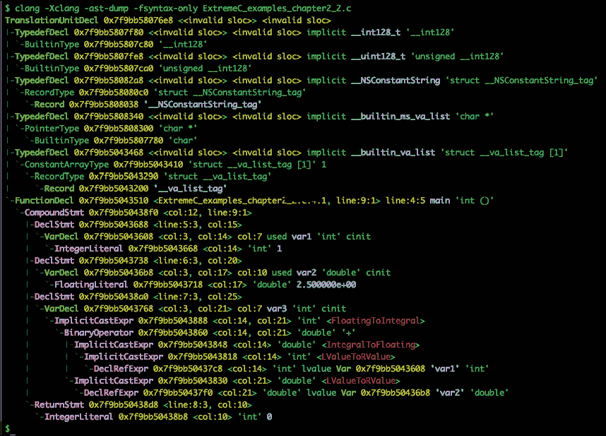

# 第二章

# 从源代码到二进制

在编程中，一切始于源代码。实际上，通常被称为**代码库**的**源代码**通常由多个文本文件组成。在这些文件中，每个文件都包含用编程语言编写的文本指令。

我们知道 CPU 不能直接执行文本指令。实际上，这些指令应该首先被编译（或翻译）成机器级指令，以便 CPU 执行，最终生成一个可运行的程序。

在本章中，我们将介绍从 C 源代码生成最终产品所需的步骤。本章对该主题进行了深入探讨，因此我们将其分为五个不同的部分：

1.  **标准的 C 编译管道**：在第一部分，我们将介绍标准的 C 编译过程，管道中的各个步骤以及它们如何有助于从 C 源代码生成最终产品。

1.  **预处理器**：在本节中，我们将更深入地讨论预处理器组件，它驱动预处理步骤。

1.  **编译器**：在本节中，我们将更深入地探讨编译器。我们将解释编译器如何从源代码生成**中间表示**，然后将其翻译成汇编语言，并驱动编译步骤。

1.  **汇编器**：在编译器之后，我们还会谈到**汇编器**，它在将编译器接收到的汇编指令转换为机器级指令方面发挥着重要作用。汇编器组件驱动汇编步骤。

1.  **链接器**：在最后一部分，我们将更深入地讨论**链接器**组件，它驱动链接步骤。链接器是一个构建组件，最终创建 C 项目的实际产品。该组件存在一些特定的构建错误，对链接器的充分了解将帮助我们预防和解决这些问题。我们还讨论了 C 项目的各种最终产品，并给出了一些关于反汇编目标文件和读取其内容的提示。此外，我们还简要讨论了**C++名称修饰**是什么以及它是如何防止在构建 C++代码时链接步骤中出现的某些缺陷的。

我们在本章中的讨论主要围绕类 Unix 系统展开，但我们也会讨论与其他操作系统（如 Microsoft Windows）的一些差异。

在第一部分，我们需要解释 C 编译管道。了解管道如何从源代码生成可执行文件和库文件至关重要。虽然涉及多个概念和步骤，但如果我们想要为本书和未来章节的内容做好准备，彻底理解它们是至关重要的。注意，下一章将详细讨论 C 项目的各种产品，即**目标文件**。

# 编译管道

编译一些 C 文件通常只需要几秒钟，但在这短暂的时间内，源代码进入了一个包含四个不同组件的管道，每个组件都执行特定的任务。这些组件如下：

+   预处理器

+   编译器

+   汇编器

+   链接器

管道中的每个组件都接受来自前一个组件的特定输入，并为管道中的下一个组件产生特定的输出。这个过程一直持续到由管道的最后一个组件生成*产品*。

如果源代码能够成功通过所有必需的组件，那么它可以被转换成一个产品。这意味着即使其中一个组件出现小小的失败，也可能导致*编译*或*链接*失败，从而让你收到相关的错误信息。

对于某些中间产品，例如*可重定位目标文件*，只要单个源文件成功通过前三个组件就足够了。最后一个组件，即*链接器*，通常用于通过合并一些已经准备好的可重定位目标文件来创建更大的产品，例如*可执行目标文件*。因此，构建一组 C 源文件可以创建一个或有时多个目标文件，包括可重定位的、可执行的以及*共享目标文件*。

目前有各种各样的 C 编译器可供选择。虽然其中一些是免费和开源的，而另一些则是专有和商业的。同样，一些编译器可能只适用于特定的平台，而其他则是跨平台的，尽管重要的是要注意，几乎每个平台至少有一个兼容的 C 编译器。

**注意**：

要查看可用的 C 编译器的完整列表，请参阅以下维基百科页面：[`en.wikipedia.org/wiki/List_of_compilers#C_compilers`](https://en.wikipedia.org/wiki/List_of_compilers#C_compilers)。

在讨论本章中我们使用的默认平台和 C 编译器之前，让我们更详细地谈谈术语*平台*以及我们对其的理解。

平台是在特定硬件（或架构）上运行的操作系统组合，其 CPU 的*指令集*是其中最重要的部分。操作系统是平台软件组件的一部分，而架构定义了硬件部分。例如，我们可以在 ARM 供电的板上运行 Ubuntu，或者我们可以在 AMD 64 位 CPU 上运行 Microsoft Windows。

跨平台软件可以在不同的平台上运行。然而，重要的是要知道*跨平台*与*便携性*是不同的。跨平台软件通常为每个平台有不同的二进制文件（最终目标文件）和安装程序，而便携软件在所有平台上使用相同的生成二进制文件和安装程序。

一些 C 编译器，例如`gcc`和`clang`，是跨平台的——它们可以为不同的平台生成代码——而 Java 字节码是便携的。

关于 C 和 C++，如果我们说 C/C++代码是可移植的，我们的意思是我们可以编译它到不同的平台，无需任何更改或只需对源代码进行少量修改。但这并不意味着最终的目标文件是可移植的。

如果你已经看过我们之前提到的维基百科文章，你可以看到有大量的 C 编译器。幸运的是，它们都遵循相同的标准编译流程，我们将在本章中介绍。

在这些许多编译器中，我们需要在本章中选择其中一个来工作。在本章中，我们将使用`gcc` 7.3.0 作为我们的默认编译器。我们选择`gcc`是因为它在大多数操作系统上可用，此外，还有许多在线资源可以找到。

我们还需要选择我们的默认平台。在本章中，我们选择了 Ubuntu 18.04 作为我们的默认操作系统，运行在 AMD 64 位 CPU 上作为我们的默认架构。

**注意**：

有时本章可能会提到不同的编译器、不同的操作系统或不同的架构，以比较不同的平台和编译器。如果我们这样做，新平台或新编译器的规格将在之前给出。

在接下来的章节中，我们将描述编译流程中的步骤。首先，我们将构建一个简单的示例，看看 C 项目中的源文件是如何编译和链接的。在整个示例中，我们将熟悉与编译过程相关的新术语和概念。只有在那之后，我们才会在单独的章节中逐个处理每个组件。在那里，我们将深入解释每个组件的更多内部概念和过程。

## 构建 C 项目

在本节中，我们将演示如何构建一个 C 项目。我们将要工作的项目包含多个源文件，这是几乎所有 C 项目的常见特征。然而，在我们转到示例并开始构建之前，我们需要确保我们理解了典型 C 项目的结构。

### 头文件与源文件

每个 C 项目都有源代码，或代码库，以及与项目描述和现有标准相关的其他文档。在 C 代码库中，我们通常有两种包含 C 代码的文件：

+   **头文件**，通常其名称带有`.h`扩展名。

+   **源文件**，具有`.c`扩展名。

**注意**：

为了方便起见，在本章中，我们可能会使用术语*头文件*代替*头文件*，以及*源文件*代替*源文件*。

头文件通常包含枚举、宏和类型定义，以及函数、全局变量和结构的*声明*。在 C 语言中，一些编程元素如函数、变量和结构可以将其声明与其*定义*分开，分别放在不同的文件中。

C++遵循相同的模式，但在其他编程语言中，如 Java，元素是在声明的地方定义的。虽然这是 C 和 C++的伟大特性之一，因为它使它们能够将声明与定义解耦，但它也使得源代码更加复杂。

按照惯例，声明存储在头文件中，相应的定义则放在源文件中。这对于函数声明和函数定义来说尤为重要。

强烈建议您只将函数声明放在头文件中，并将函数定义移动到相应的源文件中。虽然这不是必需的，但将那些函数定义从头文件中分离出来是一个重要的设计实践。

虽然结构也可以有单独的声明和定义，但在某些特殊情况下，我们会将声明和定义移动到不同的文件中。我们将在 *第八章*，*继承和多态* 中看到一个这样的例子，我们将讨论类之间的 *继承* 关系。

**注意**：

头文件可以包含其他头文件，但不能包含源文件。源文件只能包含头文件。让源文件包含另一个源文件是一种不良实践。如果这样做，通常意味着您的项目中存在严重的设计问题。

为了更详细地说明这一点，我们将通过一个示例来查看。以下代码是 `average` 函数的声明。函数声明由一个 *返回类型* 和一个 *函数签名* 组成。函数签名简单地说就是函数的名称及其输入参数列表：

```cpp
double average(int*, int);
```

代码框 2-1：`average` 函数的声明

声明引入了一个名为 `average` 的函数签名，它接收一个指向整数数组的指针以及一个表示数组中元素数量的第二个整数参数。声明还指出该函数返回一个双精度值。请注意，返回类型是声明的一部分，但通常不被认为是函数签名的一部分。

正如您在 *代码框 2-1* 中所看到的，函数声明以分号 ";" 结尾，并且没有由花括号括起来的 *主体*。我们还应该注意，函数声明中的参数没有关联的名称，这在 C 语言中是有效的，但仅限于声明，而不是定义。因此，即使在声明中，也建议您为参数命名。

函数声明是关于如何使用函数的，而定义则定义了该函数的实现方式。用户不需要知道参数名称就能使用该函数，正因为如此，可以在函数声明中隐藏它们。

在下面的代码中，您可以找到我们之前声明的`average`函数的定义。函数定义包含表示函数逻辑的实际 C 代码。这始终由一对花括号包围的代码体：

```cpp
double average(int* array, int length) {
  if (length <= 0) {
    return 0;
  }
  double sum = 0.0;
  for (int i = 0; i < length; i++) {
    sum += array[i];
  }
  return sum / length;
}
```

代码框 2-2：平均函数的定义

正如我们之前所说的，为了强调这一点，函数声明放在头文件中，而定义（或主体）放在源文件中。在极少数情况下，我们有足够的理由违反这一规则。此外，源文件需要包含头文件，以便查看和使用声明，这正是 C 和 C++的工作方式。

如果您现在还不完全理解，请不要担心，随着我们继续前进，这将会变得更加明显。

**注意**：

在任何*翻译单元*中对任何声明有多个定义将导致*编译错误*。这对于所有函数、结构和全局变量都适用。因此，不允许为单个函数声明提供两个定义。

我们将通过介绍本章的第一个 C 语言示例来继续这次讨论。这个示例旨在展示正确编译由多个源文件组成的 C/C++项目的正确方法。

### 示例源文件

在*示例 2.1*中，我们有三个文件，其中一个头文件，另外两个是源文件，它们都在同一个目录下。这个示例旨在计算包含五个元素的数组的平均值。

头文件用作两个独立源文件之间的桥梁，使得我们能够在两个独立的文件中编写代码，但一起构建它们。没有头文件，就无法在不违反上述规则（源文件不得包含源文件）的情况下将代码拆分为两个源文件。在这里，头文件包含了一个源文件使用另一个源文件的功能所需的所有内容。

头文件中只包含一个函数声明，`avg`，这是程序运行所必需的。其中一个源文件包含声明的函数的定义。另一个源文件包含`main`函数，它是程序的入口点。没有`main`函数，就无法有一个可执行的二进制文件来运行程序。编译器将`main`函数识别为程序的起点。

我们现在将继续前进，看看这些文件的内容。以下是头文件，它包含一个枚举和`avg`函数的声明：

```cpp
#ifndef EXTREMEC_EXAMPLES_CHAPTER_2_1_H
#define EXTREMEC_EXAMPLES_CHAPTER_2_1_Htypedef enum {
  NONE,
  NORMAL,
  SQUARED
} average_type_t;
// Function declaration
double avg(int*, int, average_type_t);
#endif
```

代码框 2-3 [ExtremeC_examples_chapter2_1.h]：示例 2.1 的一部分头文件

如您所见，此文件包含一个枚举，一组命名的整数常量。在 C 语言中，枚举不能有单独的声明和定义，它们应该在同一位置声明和定义一次。

除了枚举之外，代码框中还可以看到`avg`函数的*前置声明*。在给出定义之前声明一个函数的行为称为前置声明。头文件也受到*头文件保护语句*的保护。它们将防止头文件在编译时被包含两次或更多。

以下代码展示了实际包含`avg`函数定义的源文件：

```cpp
#include "ExtremeC_examples_chapter2_1.h"
double avg(int* array, int length, average_type_t type) {
  if (length <= 0 || type == NONE) {
    return 0;
  }
  double sum = 0.0;
  for (int i = 0; i < length; i++) {
    if (type == NORMAL) {
      sum += array[i];
    } else if (type == SQUARED) {
      sum += array[i] * array[i];
    }
  }
  return sum / length;
}
```

代码框 2-4 [ExtremeC_examples_chapter2_1.c]：包含`avg`函数定义的源文件

使用前面的代码，你应该注意到文件名以`.c`扩展名结尾。源文件已包含示例的头文件。这样做是因为在使用之前需要`average_type_t`枚举和`avg`函数的声明。在这种情况下，使用新的类型`average_type_t`枚举，在没有声明之前使用它会导致编译错误。

看看以下代码框，展示了包含`main`函数的第二个源文件：

```cpp
#include <stdio.h>
#include "ExtremeC_examples_chapter2_1.h"
int main(int argc, char** argv) {
  // Array declaration
  int array[5];
  // Filling the array
  array[0] = 10;
  array[1] = 3;
  array[2] = 5;
  array[3] = -8;
  array[4] = 9;
  // Calculating the averages using the 'avg' function
  double average = avg(array, 5, NORMAL);
  printf("The average: %f\n", average);
  average = avg(array, 5, SQUARED);
  printf("The squared average: %f\n", average);
  return 0;
}
```

代码框 2-5 [ExtremeC_examples_chapter2_1_main.c]：示例 2.1 的`main`函数

在每个 C 项目中，`main`函数是程序的入口点。在上面的代码框中，`main`函数声明并初始化了一个整数数组，并计算了该数组的两个不同平均值。注意`main`函数是如何调用前面代码中的`avg`函数的。

### 构建示例

在上一节介绍了*示例 2.1*的文件之后，我们需要构建它们并创建一个最终的可执行二进制文件，该文件可以作为程序运行。构建 C/C++项目意味着我们将编译其代码库中的所有源代码，首先生成一些*可重定位对象文件*（也称为*中间对象文件*），最后将这些可重定位对象文件组合起来生成最终产品，例如*静态库*或*可执行二进制文件*。

在其他编程语言中构建项目也非常类似于在 C 或 C++中构建，但中间和最终产品的名称和文件格式可能不同。例如，在 Java 中，中间产品是包含*Java 字节码*的类文件，最终产品是 JAR 或 WAR 文件。

**注意**：

要编译示例源代码，我们不会使用**集成开发环境**（**IDE**）。相反，我们将直接使用编译器，而不依赖任何其他软件的帮助。我们构建示例的方法与 IDE 中使用的以及编译多个源文件时在后台执行的方法完全相同。

在我们继续之前，有两个重要的规则我们应该记住。

**规则 1：我们只编译源文件**

第一条规则是我们只编译源文件，因为编译头文件是没有意义的。头文件除了声明之外不应包含任何实际的 C 代码。因此，对于 *示例 2.1*，我们只需要编译两个源文件：`ExtremeC_examples_chapter2_1.c` 和 `ExtremeC_examples_chapter2_1_main.c`。

**规则 2：我们分别编译每个源文件**

第二条规则是我们分别编译每个源文件。关于*示例 2.1*，这意味着我们必须运行编译器两次，每次传递一个源文件。

**注意**:

仍然可以一次性传递两个源文件，并要求编译器在一个命令中编译它们，但我们不推荐这样做，并且在这本书中我们也不会这样做。

因此，对于一个由 100 个源文件组成的工程，我们需要分别编译每个源文件，这意味着我们必须运行编译器 100 次！是的，这看起来很多，但这就是你应该编译 C 或 C++ 项目的正确方式。相信我，你将遇到需要编译数千个文件才能生成单个可执行二进制文件的项目！

**注意**:

如果一个头文件包含需要编译的 C 代码片段，我们不会编译该头文件。相反，我们将它包含在一个源文件中，然后编译该源文件。这样，头文件的 C 代码将作为源文件的一部分进行编译。

当我们编译一个源文件时，不会将其他源文件作为同一编译的一部分进行编译，因为它们都没有被编译源文件包含。记住，如果我们尊重 C/C++ 的最佳实践，则不允许包含源文件。

现在，让我们专注于构建 C 项目时应采取的步骤。第一步是预处理，我们将在下一节中讨论这一点。

## 第一步 - 预处理

C 编译管道的第一步是 *预处理*。一个源文件包含多个头文件。然而，在编译开始之前，这些文件的内容由预处理器收集为一个单一的 C 代码体。换句话说，在预处理步骤之后，我们得到一个由将头文件内容复制到源文件内容中创建的单个代码片段。

此外，其他 *预处理指令* 也必须在这一步中解决。这个预处理后的代码片段被称为 *翻译单元*。翻译单元是预处理器生成的单个 C 代码逻辑单元，并且已经准备好进行编译。翻译单元有时也被称为 *编译单元*。

**注意**:

在一个翻译单元中，找不到任何预处理指令。提醒一下，C（和 C++）中的所有预处理指令都以 `#` 开头，例如 `#include` 和 `#define`。

您可以要求编译器在进一步编译之前转储翻译单元。在 `gcc` 的情况下，只需传递 `-E` 选项（区分大小写）即可。在某些罕见的情况下，尤其是在进行跨平台开发时，检查翻译单元在修复奇怪问题时可能很有用。

在以下代码中，您可以看到由 `gcc` 在我们的默认平台上生成的 `ExtremeC_examples_chapter2_1.c` 的翻译单元：

```cpp
$ gcc -E ExtremeC_examples_chapter2_1.c
# 1 "ExtremeC_examples_chapter2_1.c"
# 1 "<built-in>"
# 1 "<command-line>"
# 31 "<command-line>"
# 1 "/usr/include/stdc-predef.h" 1 3 4
# 32 "<command-line>" 2
# 1 "ExtremeC_examples_chapter2_1.c"
# 1 "ExtremeC_examples_chapter2_1.h" 1
typedef enum {
  NONE,
  NORMAL,
  SQUARED
} average_type_t;
double avg(int*, int, average_type_t);
# 5 "ExtremeC_examples_chapter2_1.c" 2
double avg(int* array, int length, average_type_t type) {
  if (length <= 0 || type == NONE) {
    return 0;
  }
  double sum = 0;
  for (int i = 0; i < length; i++) {
    if (type == NORMAL) {
      sum += array[i];
    } else if (type == SQUARED) {
      sum += array[i] * array[i];
    }
  }
  return sum / length;
}
$
```

Shell Box 2-1: 编译 ExtremeC_examples_chapter2_1.c 产生的翻译单元

如您所见，所有声明都已从头文件复制到翻译单元中。翻译单元中的注释也已删除。

`ExtremeC_examples_chapter2_1_main.c` 的翻译单元非常大，因为它包含了 `stdio.h` 头文件。

从这个头文件中以及它包含的内部头文件中，所有声明都将递归地复制到翻译单元中。为了展示 `ExtremeC_examples_chapter2_1_main.c` 的翻译单元可以有多大，在我们的默认平台上，它有 836 行 C 代码！

**注意**:

`-E` 选项也适用于 `clang` 编译器。

这完成了第一步。预处理步骤的输入是一个源文件，输出是相应的翻译单元。

## 第 2 步 – 编译

一旦您有了翻译单元，您就可以进行第二步，即 *编译*。编译步骤的输入是上一步骤检索到的翻译单元，输出是相应的 *汇编代码*。此汇编代码仍然是可读的，但它依赖于机器，并且接近硬件，仍需要进一步处理才能成为机器级指令。

您可以始终通过传递 `-S` 选项（大写 S）来请求 `gcc` 在执行第二步后停止，并转储生成的汇编代码。输出文件与给定的源文件具有相同的名称，但扩展名为 `.s`。

在下面的 Shell Box 中，您可以看到 `ExtremeC_examples_chapter2_1_main.c` 源文件的汇编代码。然而，在阅读代码时，您应该注意到输出中的一些部分已被删除：

```cpp
$ gcc -S ExtremeC_examples_chapter2_1.c
$ cat ExtremeC_examples_chapter2_1.s
    .file   "ExtremeC_examples_chapter2_1.c"
    .text
    .globl  avg
    .type   avg, @function
avg:
.LFB0:
    .cfi_startproc
    pushq   %rbp
    .cfi_def_cfa_offset 16
    .cfi_offset 6, -16
    movq    %rsp, %rbp
    .cfi_def_cfa_register 6
    movq    %rdi, -24(%rbp)
    movl    %esi, -28(%rbp)
    movl    %edx, -32(%rbp)
    cmpl    $0, -28(%rbp)
    jle .L2
    cmpl    $0, -32(%rbp)
    jne .L3
.L2:
    pxor    %xmm0, %xmm0
    jmp .L4
.L3:
    ...
.L8:
    ...
.L6:
    ...
.L7:
    ...
.L5:
  ...
.L4:
  ...
.LFE0:
    .size   avg, .-avg
    .ident  "GCC: (Ubuntu 7.3.0-16ubuntu3) 7.3.0"
    .section    .note.GNU-stack,"",@progbits
$
```

Shell Box 2-2: 编译 ExtremeC_examples_chapter2_1.c 产生的汇编代码

作为编译步骤的一部分，编译器解析翻译单元并将其转换为针对 *目标架构* 的特定汇编代码。目标架构是指程序正在为其编译并最终运行的硬件或 CPU。目标架构有时也称为 *宿主架构*。

*壳盒 2-2*显示了为 AMD 64 位架构生成的汇编代码，由在 AMD 64 位机器上运行的`gcc`生成。下面的壳盒包含了为 ARM 32 位架构生成的汇编代码，由在 Intel x86-64 架构上运行的`gcc`生成。这两个汇编输出都是为相同的 C 代码生成的：

```cpp
$ cat ExtremeC_examples_chapter2_1.s
    .arch armv5t
    .fpu softvfp
    .eabi_attribute 20, 1
    .eabi_attribute 21, 1
    .eabi_attribute 23, 3
    .eabi_attribute 24, 1
    .eabi_attribute 25, 1
    .eabi_attribute 26, 2
    .eabi_attribute 30, 6
    .eabi_attribute 34, 0
    .eabi_attribute 18, 4
    .file	"ExtremeC_examples_chapter2_1.s"
    .global    __aeabi_i2d
    .global    __aeabi_dadd
    .global    __aeabi_ddiv
    .text
    .align	2
    .global    avg
    .syntax unified
    .arm
    .type  avg, %function
avg:
    @ args = 0, pretend = 0, frame = 32
    @ frame_needed = 1, uses_anonymous_args = 0
    push    {r4, fp, lr}
    add    fp, sp, #8
    sub    sp, sp, #36
    str    r0, [fp, #-32]
    str    r1, [fp, #-36]
    str    r2, [fp, #-40]
    ldr    r3, [fp, #-36]
    cmp    r3, #0
    ble    .L2
    ldr    r3, [fp, #-40]
    cmp    r3, #0
    bne    .L3
.L2:
    ...
.L3:
    ...
.L8:
    ...
.L6:
    ...
.L7:
    ...
.L5:
    ...
.L4:
    mov	r0, r3
    mov	r1, r4
    sub	sp, fp, #8
    @ sp needed
    pop	{r4, fp, pc}
    .size	avg, .-avg
    .ident	"GCC: (Ubuntu/Linaro 5.4.0-6ubuntu1~16.04.9) 5.4.0 20160609"
    .section    .note.GNU-stack,"",%progbits
$
```

壳盒 2-3：编译 ExtremeC_examples_chapter2_1.c 为 ARM 32 位架构时产生的汇编代码

正如你在壳盒*2-2*和*2-3*中看到的那样，为两种架构生成的汇编代码是不同的。尽管它们是为相同的 C 代码生成的，但这一点仍然成立。对于后者的汇编代码，我们在运行 Ubuntu 16.04 的 Intel x64-86 硬件集上使用了`arm-linux-gnueabi-gcc`编译器。

**注意**：

目标（或宿主）架构是指源代码既被编译为该架构，也将在该架构上运行。*构建架构*是我们用来编译源代码的架构。它们可能不同。例如，你可以在 ARM 32 位机器上编译针对 AMD 64 位硬件的 C 源代码。

将 C 代码转换为汇编代码是编译管道中最重要的一步。

这是因为当你有了汇编代码，你就非常接近 CPU 可以执行的指令语言了。正因为这个重要的角色，编译器是计算机科学中最重要和最被研究的主题之一。

## 第 3 步 – 汇编

编译之后的下一步是*汇编*。这里的目的是根据编译器在前一步生成的汇编代码生成实际的机器级指令（或*机器代码*）。每个架构都有自己的*汇编器*，可以将自己的汇编代码翻译成自己的机器代码。

在本节中我们将要汇编的包含机器级指令的文件被称为*目标文件*。我们知道一个 C 项目可以有多个产品，它们都是目标文件，但在这个章节中，我们主要关注可重定位的目标文件。毫无疑问，这是我们在构建过程中能够获得的最重要临时产品。

**注意**：

可重定位的目标文件可以被称为中间目标文件。

为了将前两个步骤结合起来，这个汇编步骤的目的是从编译器生成的汇编代码中生成一个可重定位的目标文件。我们创建的每一个其他产品都将基于本步骤中汇编器生成的可重定位目标文件。

我们将在本章的后续部分讨论这些其他产品。

**注意**：

*二进制文件*和*目标文件*是同义词，指代包含机器级指令的文件。然而请注意，在其他上下文中，“二进制文件”这个术语可能有不同的含义，例如与文本文件的区别。

在大多数类 Unix 操作系统中，我们有一个名为 `as` 的汇编器工具，它可以用来从汇编文件生成可重定位目标文件。

然而，这些目标文件是不可执行的，它们只包含为翻译单元生成的机器级指令。由于每个翻译单元由各种函数和全局变量组成，可重定位目标文件仅包含对应函数的机器级指令和全局变量的预分配条目。

在下面的 Shell Box 中，你可以看到 `as` 是如何用于生成 `ExtremeC_examples_chapter2_1_main.s` 的可重定位目标文件的：

```cpp
$ as ExtremeC_examples_chapter2_1.s -o ExtremeC_examples_chapter2_1.o
$
```

Shell Box 2-4：从示例 2.1 中的一个源文件的汇编中生成一个目标文件

回顾前面的 Shell Box 中的命令，我们可以看到 `-o` 选项用于指定输出目标文件的名称。可重定位目标文件通常在其名称中具有 `.o` 扩展名（或在 Microsoft Windows 中为 `.obj`），这就是为什么我们传递了一个以 `.o` 结尾的文件名。

目标文件的内容，无论是 `.o` 还是 `.obj`，都不是文本的，因此你无法像人类一样阅读它。因此，通常会说目标文件具有 *二进制内容*。

尽管汇编器可以直接使用，就像我们在 *Shell Box 2-4* 中所做的那样，但这并不推荐。相反，良好的做法是使用编译器本身间接调用 `as` 以生成可重定位目标文件。

**注意**：

我们可以使用术语 *目标文件* 和 *可重定位目标文件* 互换。但并非所有目标文件都是可重定位目标文件，在某些上下文中，它可能指其他类型的对象文件，例如共享对象文件。

如果你将 `-c` 选项传递给几乎所有的已知 C 编译器，它将直接为输入源文件生成相应的目标文件。换句话说，`-c` 选项相当于执行前三个步骤的全部。

查看以下示例，你可以看到我们已经使用了 `-c` 选项来编译 `ExtremeC_examples_chapter2_1.c` 并生成其对应的目标文件：

```cpp
$ gcc -c ExtremeC_examples_chapter2_1.c
$
```

Shell Box 2-5：编译示例 2.1 中的一个源文件并生成其对应的目标文件

我们刚刚完成的全部步骤——预处理、编译和汇编——都是作为前面单个命令的一部分完成的。这意味着在运行前面的命令之后，将生成一个可重定位目标文件。这个可重定位目标文件将与输入源文件具有相同的名称；然而，它将具有 `.o` 扩展名。

**重要**：

注意，通常，术语*编译*被用来指代编译管道中的前三个步骤，而不仅仅是第二个步骤。也有可能我们使用“编译”这个术语，但实际上意味着“构建”，包括所有四个步骤。例如，我们说*C 编译管道*，但实际上我们指的是*C 构建管道*。

汇编是编译单个源文件的最后一步。换句话说，当我们有了源文件的相应可重定位对象文件时，我们就完成了它的编译。在这个阶段，我们可以把可重定位对象文件放在一边，继续编译其他源文件。

在*示例 2.1*中，我们有两个需要编译的源文件。通过执行以下命令，它编译了这两个源文件，并因此产生了它们相应的对象文件：

```cpp
$ gcc -c ExtremeC_examples_chapter2_1.c -o impl.o
$ gcc -c ExtremeC_examples_chapter2_1_main.c -o main.o
$
```

Shell Box 2-6：为示例 2.1 中的源代码生成可重定位对象文件

你可以从前面的命令中看到，我们已经通过使用`-o`选项指定我们希望的名字来更改了对象文件的名字。因此，编译完它们之后，我们得到了`impl.o`和`main.o`的可重定位对象文件。

在这一点上，我们需要提醒自己，可重定位对象文件不是可执行的。如果一个项目最终产品是一个可执行文件，我们需要使用所有，或者至少是其中的一些，已经产生的可重定位对象文件，通过链接步骤构建目标可执行文件。

## 第 4 步 – 链接

我们知道*示例 2.1*需要构建成可执行文件，因为我们里面有一个`main`函数。然而，在这个时候，我们只有两个可重定位对象文件。因此，下一步是将这些可重定位对象文件组合起来，以创建另一个可执行的对象文件。*链接*步骤正是如此。

然而，在我们进入链接步骤之前，我们需要讨论如何将新架构或硬件的支持添加到现有的类 Unix 系统中。

### 支持新的架构

我们知道每个架构都有一系列制造的处理器，并且每个处理器都可以执行特定的指令集。

指令集是由 Intel 和 ARM 等供应商公司为他们的处理器设计的。此外，这些公司还为他们的架构设计了一种特定的汇编语言。

如果满足以下两个先决条件，可以为新的架构构建程序：

1.  汇编语言是已知的。

1.  必需的汇编器工具（或程序）必须由供应商公司提供。这使我们能够将汇编代码翻译成等效的机器级指令。

一旦这些先决条件就绪，就可以从 C 源代码生成机器级指令。只有在这种情况下，我们才能使用*对象文件格式*将生成的机器级指令存储在对象文件中。例如，这可以是*ELF*或*Mach-O*的形式。

当汇编语言、汇编工具和目标文件格式清晰时，我们可以使用它们来开发一些对我们开发者进行 C 编程时必要的进一步工具。然而，由于你经常在处理 C 编译器，并且它是在你的 behalf 使用这些工具，所以你几乎注意不到它们的存。

对于一个新的架构，所需的两个直接工具如下：

+   C 编译器

+   链接器

这些工具就像是支持操作系统中新架构的第一个基本构建块。硬件与操作系统中的这些工具结合在一起，产生了一个新的平台。

关于类 Unix 系统，重要的是要记住 Unix 有一个模块化设计。如果你能够构建一些基本模块，比如汇编器、编译器和链接器，你将能够在这之上构建其他模块，不久整个系统就会在新架构上运行。

### 步骤详情

就像之前所说的那样，我们知道使用类 Unix 操作系统的平台必须具有之前讨论的强制工具，如汇编器和链接器，才能工作。记住，汇编器和链接器可以从编译器中单独运行。

在类 Unix 系统中，`ld`是默认的链接器。以下命令，你可以在下面的 shell box 中看到，展示了当我们想要从之前章节中为*example 2.1*生成的可重定位目标文件中直接使用`ld`创建可执行文件时如何使用`ld`。然而，正如你将看到的，直接使用链接器并不那么容易：

```cpp
$ ld impl.o main.o
ld: warning: cannot find entry symbol _start; defaulting to 00000000004000e8
main.o: In function 'main':
ExtremeC_examples_chapter3_1_main.c:(.text+0x7a): undefined reference to 'printf'
ExtremeC_examples_chapter3_1_main.c:(.text+0xb7): undefined reference to 'printf'
ExtremeC_examples_chapter3_1_main.c:(.text+0xd0): undefined reference to '__stack_chk_fail'
$
```

Shell Box 2-7：尝试使用 ld 工具直接链接目标文件

如你所见，命令失败了，并生成了一些错误信息。如果你注意这些错误信息，它们说在文本段的三个地方`ld`遇到了三个未定义的函数调用（或*引用*）。

这两个函数调用是调用`printf`函数，我们在`main`函数中实现了它。然而，另一个`__stack_chk_fail`函数我们没有调用过。它来自别处，但究竟在哪里呢？它是从编译器放入可重定位目标文件的补充代码中调用的，这个函数是针对 Linux 的，你可能在其他平台上生成的相同目标文件中找不到它。然而，无论它是什么，无论它做什么，链接器都在寻找它的定义，而且似乎它无法在提供的对象文件中找到定义。

就像我们之前说的那样，默认的链接器`ld`生成这些错误是因为它无法找到这些函数的定义。从逻辑上讲，这是有道理的，也是真实的，因为我们没有在*example 2.1*中自己定义`printf`和`__stack_chk_fail`。

这意味着我们应该给`ld`提供一些其他的目标文件，虽然不一定是可重定位的目标文件，它们包含`printf`和`__stack_chk_fail`函数的定义。

阅读我们刚才所说的，应该可以解释为什么直接使用`ld`可能非常困难。也就是说，需要指定更多的对象文件和选项，以便使`ld`工作并生成一个可工作的可执行文件。

幸运的是，在类 Unix 系统中，最著名的 C 编译器通过传递适当的选项并指定额外的必需对象文件来使用`ld`。因此，我们不需要直接使用`ld`。

因此，让我们看看一种更简单的方法来生成最终的可执行文件。下面的 shell 框图展示了我们如何使用`gcc`来链接来自*示例 2.1*的对象文件：

```cpp
$ gcc impl.o main.o
$ ./a.out
The average: 3.800000
The squared average: 55.800000
$
```

Shell 框 2-8：使用 gcc 链接对象文件

运行这些命令的结果是，我们可以松一口气，因为我们终于成功构建了*示例 2.1*并运行了其最终的可执行文件！

**注意**：

构建一个项目等同于首先编译源代码，然后将它们链接在一起，可能还有其他库，以创建最终产品。

重要的是花一分钟暂停并反思我们刚刚所做的事情。在过去的几个部分中，我们通过编译源代码为可重定位对象文件，并最终将这些生成的对象文件链接起来，成功地构建了*示例 2.1*。

虽然这个过程对于任何 C/C++代码库都是相同的，但区别在于你需要编译源代码的次数，这本身取决于你的项目中源文件的数量。

虽然编译管道有一些步骤，但在每个步骤中，都涉及一个特定的组件。本章剩余部分的焦点将深入探讨管道中每个组件周围的关键信息。

要开始这个过程，我们将重点关注预处理程序组件。

# 预处理程序

在本书的*第一章*，*基本特性*中，我们简要介绍了*C 预处理程序*的概念。具体来说，我们当时讨论了宏、条件编译和头文件保护。

你会记得，在本书的开头，我们讨论了 C 预处理作为 C 语言的一个基本特性。预处理之所以独特，是因为它不能轻易地在其他编程语言中找到。最简单的说法是，预处理允许你在发送代码进行编译之前修改你的源代码。同时，它允许你将源代码（尤其是声明）分成头文件，这样你就可以稍后将其包含到多个源文件中并重用这些声明。

记住这一点至关重要：如果你在源代码中有语法错误，预处理程序不会找到错误，因为它对 C 语法一无所知。相反，它只会执行一些简单的任务，这些任务通常围绕文本替换。例如，假设你有一个名为`sample.c`的文本文件，其内容如下：

```cpp
#include <stdio.h>
#define file 1000
Hello, this is just a simple text file but ending with .c extension!
This is not a C file for sure!
But we can preprocess it!
```

代码框 2-6：包含一些文本的 C 代码！

在有了前面的代码之后，让我们使用`gcc`来预处理文件。请注意，以下 Shell Box 中的某些部分已被删除。这是因为包含`stdio.h`会使翻译单元变得非常大：

```cpp
$ gcc -E sample.c
# 1 "sample.c"
# 1 "<built-in>" 1
# 1 "<built-in>" 3
# 341 "<built-in>" 3
# 1 "<command line>" 1
# 1 "<built-in>" 2
# 1 "sample.c" 2
# 1 "/usr/include/stdio.h" 1 3 4
# 64 "/usr/include/stdio.h" 3 4
# 1 "/usr/include/_stdio.h" 1 3 4
# 68 "/usr/include/_stdio.h" 3 4
# 1 "/usr/include/sys/cdefs.h" 1 3 4
# 587 "/usr/include/sys/cdefs.h" 3 4
# 1 "/usr/include/sys/_symbol_aliasing.h" 1 3 4
# 588 "/usr/include/sys/cdefs.h" 2 3 4
# 653 "/usr/include/sys/cdefs.h" 3 4
...
...
extern int __vsnprintf_chk (char * restrict, size_t, int, size_t,
       const char * restrict, va_list);
# 412 "/usr/include/stdio.h" 2 3 4
# 2 "sample.c" 2
Hello, this is just a simple text 1000 but ending with .c extension!
This is not a C 1000 for sure!
But we can preprocess it!
$
```

Shell Box 2-9：在代码框 2-6 中看到的预处理后的 C 代码示例

正如你在前面的 Shell Box 中看到的，`stdio.h`的内容在文本之前被复制。

如果你更加留意，你会看到另一个有趣的替换也发生了。文本中的`file`出现都被替换成了`1000`。

这个例子确切地展示了预处理器是如何工作的。预处理器只执行简单的任务，例如通过复制文件内容或通过文本替换来扩展宏。尽管如此，它对 C 语言一无所知；在执行任何进一步的任务之前，它需要一个解析器来解析输入文件。这意味着 C 预处理器使用一个解析器，该解析器在输入代码中寻找指令。

**注意**：

通常，解析器是一个程序，它处理输入数据并从中提取某些部分以进行进一步的分析和处理。解析器需要了解输入数据的结构，以便将其分解成一些更小且有用的数据块。

预处理器的解析器与 C 编译器使用的解析器不同，因为它使用的是几乎独立于 C 语法的语法。这使得我们能够在除了预处理 C 文件之外的其他情况下使用它。

**注意**：

通过利用 C 预处理器的功能，你可以将文件包含和宏扩展用于除了构建 C 程序以外的其他目的。它们也可以用于处理其他文本文件。

[*GNU C 预处理器内部机制*](http://www.chiark.greenend.org.uk/doc/cpp-4.3-doc/cppinternals.html)* – [`www.chiark.greenend.org.uk/doc/cpp-4.3-doc/cppinternals.html`](http://www.chiark.greenend.org.uk/doc/cpp-4.3-doc/cppinternals.html) – 是学习更多关于`gcc`预处理器的好资源。这份文档是官方资料，描述了 GNU C 预处理器的工作原理。GNU C 预处理器被`gcc`编译器用于预处理源文件。

在前面的链接中，你可以找到预处理器如何解析指令以及它如何创建*解析树*的信息。文档还提供了不同宏扩展算法的解释。虽然这超出了本章的范围，但如果你想要为特定的内部编程语言实现自己的预处理器，或者只是处理一些文本文件，那么上述链接提供了很好的背景信息。

在大多数类 Unix 操作系统中，有一个名为**cpp**的工具，代表**C 预处理器**——而不是 C++！`cpp`是随每个 Unix 版本一起提供的 C 开发包的一部分。它可以用来预处理 C 文件。在后台，该工具被 C 编译器，如`gcc`，用来预处理 C 文件。如果你有一个源文件，你可以使用它，就像我们接下来要做的那样，来预处理源文件：

```cpp
$ cpp ExtremeC_examples_chapter2_1.c
# 1 "ExtremeC_examples_chapter2_1.c"
# 1 "<built-in>" 1
# 1 "<built-in>" 3
# 340 "<built-in>" 3
# 1 "<command line>" 1
# 1 "<built-in>" 2
...
...
# 5 "ExtremeC_examples_chapter2_1.c" 2
double avg(int* array, int length, average_type_t type) {
  if (length <= 0 || type == NONE) {
    return 0;
  }
  double sum = 0;
  for (int i = 0; i < length; i++) {
    if (type == NORMAL) {
      sum += array[i];
    } else if (type == SQUARED) {
      sum += array[i] * array[i];
    }
  }
  return sum / length;
}
$
```

Shell Box 2-10：使用 cpp 工具预处理源代码

在本节的最后一点，如果你将一个扩展名为`.i`的文件传递给 C 编译器，那么它将跳过预处理步骤。它这样做是因为具有`.i`扩展名的文件应该已经被预处理过。因此，它应该直接进入编译步骤。

如果你坚持要对扩展名为`.i`的文件运行 C 预处理器，那么你将得到以下警告信息。请注意，以下 shell 窗口是由`clang`编译器生成的：

```cpp
$ clang -E ExtremeC_examples_chapter2_1.c  > ex2_1.i
$ clang -E ex2_1.i
clang: warning: ex2_1.i: previously preprocessed input
[-Wunused-command-line-argument]
$
```

Shell Box 2-11：将已预处理的文件（扩展名为.i）传递给 clang 编译器

正如你所见，`clang`警告我们该文件已经被预处理过。

在本章的下一节，我们将专门讨论 C 编译管道中的编译器组件。

# 编译器

正如我们在前面的章节中讨论的，编译器接受预处理程序准备的翻译单元，并生成相应的汇编指令。当多个 C 源文件编译成它们等价的汇编代码时，平台中现有的工具，如汇编器和链接器，通过将生成的汇编代码制作成可重定位对象文件来管理其余部分，并最终将它们（以及可能的其他对象文件）链接在一起，形成一个库或可执行文件。

例如，我们提到了`as`和`ld`作为 Unix 中许多 C 开发工具中的两个例子。这些工具主要用于创建与平台兼容的对象文件。这些工具必须在`gcc`或其他任何编译器之外存在。通过在任何编译器之外存在，我们实际上是指它们不是作为`gcc`（我们以`gcc`为例）的一部分开发的，并且它们应该在任何平台上都可用，即使没有安装`gcc`。`gcc`只在它的编译管道中使用它们，并且它们没有被嵌入到`gcc`中。

这是因为平台本身是关于其处理器接受的指令集以及特定操作系统的格式和限制最了解的实体。编译器通常不会意识到这些限制，除非它想要对翻译单元进行一些**优化**。因此，我们可以得出结论，`gcc`最重要的任务是将翻译单元翻译成汇编指令。这就是我们所说的编译过程。

C 编译中的一个挑战是生成目标架构可以接受的正确汇编指令。可以使用`gcc`为各种架构编译相同的 C 代码，例如 ARM、Intel x86、AMD 等等。正如我们之前讨论的，每个架构都有一个其处理器可以接受的指令集，`gcc`（或任何 C 编译器）是唯一负责生成特定架构正确汇编代码的实体。

`gcc`（或任何其他 C 编译器）克服这种困难的方法是将任务分为两个步骤，首先将翻译单元解析成一个可重定位且与 C 无关的数据结构，称为**抽象语法树**（**AST**），然后使用创建的 AST 为目标架构生成等效的汇编指令。第一个步骤是架构无关的，可以在不考虑目标指令集的情况下完成。但第二个步骤是架构相关的，编译器应该了解目标指令集。执行第一个步骤的子组件称为*编译器前端*，执行后续步骤的子组件称为*编译器后端*。

在接下来的章节中，我们将更深入地讨论这些步骤。首先，让我们谈谈 AST。

## 抽象语法树

正如我们在上一节中解释的，C 编译器前端应该解析翻译单元并创建一个中间数据结构。编译器通过根据*C 语法*解析 C 源代码来创建这个中间数据结构，并将结果保存在一个*不*依赖于架构的树状数据结构中。最终的数据结构通常被称为 AST。

AST 可以为任何编程语言生成，而不仅仅是 C，因此 AST 结构必须足够抽象，以独立于 C 语法。

这就足以将编译器前端修改为支持其他语言。这正是为什么你可以找到**GNU 编译器集合**（**GCC**），`gcc`是其一部分作为 C 编译器，或者**低级虚拟机**（**LLVM**），`clang`是其一部分作为 C 编译器，作为一个支持许多语言的编译器集合，而不仅仅是 C 和 C++，例如 Java、Fortran 等等。

一旦生成了 AST，编译器后端就可以开始优化 AST，并基于优化后的 AST 为目标架构生成汇编代码。为了更好地理解 AST，我们将查看一个真实的 AST。在这个例子中，我们有以下 C 源代码：

```cpp
int main() {
  int var1 = 1;
  double var2 = 2.5;
  int var3 = var1 + var2;
  return 0;
}
```

代码框 2-7 [ExtremeC_examples_chapter2_2.c]：将要生成 AST 的简单 C 代码

下一步是使用`clang`在前面代码中输出 AST。在下面的图中，*图 2-1*，你可以看到 AST：



图 2-1：为示例 2.2 生成的 AST 及其输出

到目前为止，我们在多个地方使用了`clang`作为 C 编译器，但让我们正确地介绍它。`clang`是由 LLVM 开发者小组为`llvm`编译器后端开发的 C 编译器前端。*LLVM 编译器基础设施项目*使用*中间表示*——或*LLVM IR*——作为其前端和后端之间使用的抽象数据结构。LLVM 因其能够将其 IR 数据结构导出以供研究而闻名。前面的树形输出是从*示例 2.2*的源代码生成的 IR。

我们在这里所做的是向您介绍 AST（抽象语法树）的基础知识。我们不会深入探讨前面 AST 输出的细节，因为每个编译器都有自己的 AST 实现。要涵盖所有这些细节，我们需要几章内容，而这超出了本书的范围。

然而，如果你注意上面的图，你可以找到一个以-`FunctionDecl`开头的行。这代表`main`函数。在此之前，你可以找到有关传递给编译器的翻译单元的元信息。

如果你继续阅读`FunctionDecl`之后的内容，你会找到声明语句、二元运算符语句、返回语句甚至隐式转换语句的树形条目——或*节点*。AST 中有很多有趣的东西，有无数的东西可以学习！

拥有源代码的 AST 的另一个好处是，你可以重新排列指令的顺序，剪枝一些未使用的分支，并替换分支，以便你获得更好的性能，同时保留程序的目的。正如我们之前指出的，这被称为优化，并且通常任何 C 编译器都会在一定可配置的程度上进行优化。

我们接下来将要更详细讨论的下一个组件是汇编器。

# 汇编器

正如我们之前解释的，一个平台必须有一个汇编器来生成包含正确机器级指令的目标文件。在类 Unix 操作系统中，汇编器可以通过使用`as`实用程序来调用。在本节的其余部分，我们将讨论汇编器可以在目标文件中放入的内容。

如果你在同一架构上安装两个不同的类 Unix 操作系统，安装的汇编器可能不同，这非常重要。这意味着，尽管机器级指令相同，但由于在相同硬件上运行，生成的目标文件可能不同！

如果你为 Linux 上的 AMD64 架构编译一个程序并生成相应的目标文件，它可能与你在不同的操作系统（如 FreeBSD 或 macOS）上编译相同程序，或者在相同硬件上编译时有所不同。这意味着虽然目标文件可能不同，但它们确实包含相同的机器级指令。这证明了在不同的操作系统中，目标文件可以有不同的格式。

换句话说，每个操作系统在存储对象文件中的机器级指令时，都会定义自己的特定二进制格式或*目标文件格式*。因此，有两个因素指定了对象文件的内容：架构（或硬件）和操作系统。通常，我们将使用术语平台来指这种组合。

为了结束本节，我们通常会说，目标文件，因此生成它们的汇编器，是平台特定的。在 Linux 中，我们使用**可执行和链接格式**（**ELF**）。正如其名所示，所有可执行文件、目标文件和共享库都应该使用此格式。换句话说，在 Linux 中，汇编器生成 ELF 目标文件。在即将到来的章节“目标文件”中，我们将更详细地讨论目标文件及其格式。

在下一节中，我们将更深入地探讨*链接器*组件。我们将演示并解释该组件实际上是如何在 C 项目中生成最终产品的。

# 链接器

构建 C 项目的第一步是将所有源文件编译成它们对应的目标文件。这一步骤是准备最终产品的必要步骤，但仅此还不够，还需要再进行一步。在详细讨论这一步骤之前，我们需要快速看一下 C 项目中可能的*产品*（有时被称为*工件*）。

C/C++项目可以导致以下产品：

+   一系列可执行文件，通常在大多数类 Unix 操作系统中具有`.out`扩展名。这些文件通常在 Microsoft Windows 中具有`.exe`扩展名。

+   一系列静态库，通常在大多数类 Unix 操作系统中具有`.a`扩展名。这些文件在 Microsoft Windows 中具有`.lib`扩展名。

+   一系列动态库或共享目标文件，通常在大多数类 Unix 操作系统中具有`.so`扩展名。这些文件在 macOS 中具有`.dylib`扩展名，在 Microsoft Windows 中具有`.dll`扩展名。

可重定位目标文件不被视为这些产品之一；因此，您无法在前面列表中找到它们。可重定位目标文件仅仅是临时产品，因为它们只参与链接步骤以生成前面的产品，之后我们就不再需要它们了。链接器组件的唯一责任是从给定的可重定位目标文件生成前面的产品。

关于所使用的术语的最后一个重要说明：这三个产品都被称为*目标文件*。因此，在提到汇编器生成的作为中间产品的目标文件时，最好在目标文件之前使用术语**可重定位**。

现在我们将简要描述每个最终产品。接下来的章节将完全致力于目标文件，并将更详细地讨论这些最终产品。

可执行对象文件可以作为*进程*运行。这个文件通常包含项目提供的许多功能。它必须有一个入口点，机器级指令在这里执行。虽然`main`函数是 C 程序的入口点，但可执行对象文件的入口点是平台相关的，并且不是`main`函数。`main`函数最终会在一组平台特定指令准备就绪后被调用，这些指令是由链接器在链接步骤中添加的。

静态库不过是一个包含多个可重定位对象文件的归档文件。因此，静态库文件不是由链接器直接生成的。相反，它是由系统的默认归档程序生成的，在类 Unix 系统中是`ar`程序。

静态库通常链接到其他可执行文件，然后成为这些可执行文件的一部分。这是封装逻辑的最简单和最直接的方法，以便你可以在以后使用它。操作系统内部存在大量的静态库，每个库都包含可以用来访问该操作系统特定功能的特定逻辑。

共享对象文件结构更复杂，不仅仅是归档，它们是由链接器直接创建的。它们的使用方式也不同；也就是说，在使用之前，它们需要在运行时加载到一个正在运行的过程中。

这与在*链接时间*使用的静态库形成对比，静态库被用来成为最终可执行文件的一部分。此外，单个共享对象文件可以被多个不同的进程同时加载和使用。作为下一章的一部分，我们将演示如何将共享对象文件在*运行时*加载并用于 C 程序。

在接下来的部分中，我们将解释链接步骤中发生的情况以及链接器所涉及和使用哪些元素来生成最终产品，特别是可执行文件。

## 链接器是如何工作的？

在本节中，我们将解释链接组件的工作原理以及我们所说的链接究竟是什么意思。假设你正在构建一个包含五个源文件的 C 项目，最终产品是一个可执行文件。作为构建过程的一部分，你已经编译了所有源文件，现在你有五个可重定位对象文件。你现在需要的是一个链接器来完成最后一步并生成最终的可执行文件。

根据我们到目前为止所说的，简单来说，链接器将所有可重定位对象文件以及指定的静态库结合起来，以创建最终的可执行对象文件。然而，如果你认为这一步很简单，那你就错了。

在将目标文件组合起来生成可工作的可执行目标文件时，有一些来自目标文件内容的问题需要考虑。为了了解链接器的工作原理，我们需要知道它如何使用可重定位目标文件，为此，我们需要找出目标文件内部的内容。

简单的答案是，目标文件包含翻译单元的等效机器级指令。然而，这些指令并不是随机地放入文件中。相反，它们被分组在称为*符号*的部分下。

实际上，目标文件中有许多内容，但符号是解释链接器如何工作以及如何将一些目标文件连接在一起以生成更大的目标文件的一个组成部分。为了解释符号，让我们在示例*example 2.3*的上下文中讨论它们：使用这个示例，我们想展示一些函数是如何编译并放置在相应的可重定位目标文件中的。看一下以下包含两个函数定义的代码：

```cpp
int average(int a, int b) {
  return (a + b) / 2;
}
int sum(int* numbers, int count) {
  int sum = 0;
  for (int i = 0; i < count; i++) {
    sum += numbers[i];
  }
  return sum;
}
```

Code Box 2-8 [ExtremeC_examples_chapter2_3.c]：包含两个函数定义的代码

首先，我们需要编译前面的代码以生成相应的目标文件。以下命令生成了目标文件，`target.o`。我们正在默认平台上编译代码：

```cpp
$ gcc -c ExtremeC_examples_chapter2_3.c -o target.o
$
```

Shell Box 2-12：编译示例 2.3 中的源文件

接下来，我们使用`nm`工具查看`target.o`目标文件。`nm`工具允许我们查看目标文件内可以找到的符号：

```cpp
$ nm target.o
0000000000000000 T average
000000000000001d T sum
$
```

Shell Box 2-13：使用`nm`工具查看可重定位目标文件中定义的符号

上述 shell box 显示了目标文件中定义的符号。如您所见，它们的名称与*Code Box 2-8*中定义的函数名称完全相同。

如果您使用`readelf`工具，就像我们在以下 shell box 中所做的那样，您可以看到存在于目标文件中的*符号表*。符号表包含目标文件中定义的所有符号，并且可以为您提供有关符号的更多信息：

```cpp
$ readelf -s target.o
Symbol table '.symtab' contains 10 entries:
   Num:    Value          Size Type    Bind   Vis      Ndx Name
     0: 0000000000000000     0 NOTYPE  LOCAL  DEFAULT  UND
     1: 0000000000000000     0 FILE    LOCAL  DEFAULT  ABS ExtremeC_examples_chapter
     2: 0000000000000000     0 SECTION LOCAL  DEFAULT    1
     3: 0000000000000000     0 SECTION LOCAL  DEFAULT    2
     4: 0000000000000000     0 SECTION LOCAL  DEFAULT    3
     5: 0000000000000000     0 SECTION LOCAL  DEFAULT    5
     6: 0000000000000000     0 SECTION LOCAL  DEFAULT    6
     7: 0000000000000000     0 SECTION LOCAL  DEFAULT    4
     8: 0000000000000000    29 FUNC    GLOBAL DEFAULT    1 average
     9: 000000000000001d    69 FUNC    GLOBAL DEFAULT    1 sum
$
```

Shell Box 2-14：使用`readelf`工具查看可重定位目标文件的符号表

如您在`readelf`的输出中看到的，符号表中包含两个函数符号。表中还有其他符号，它们指向目标文件中的不同部分。我们将在本章和下一章讨论其中的一些符号。

如果您想查看机器级指令的汇编代码，可以在每个函数符号下使用`objdump`工具：

```cpp
$ objdump -d target.o
target.o:     file format elf64-x86-64
Disassembly of section .text:
0000000000000000 <average>:
   0:   55                      push   %rbp
   1:   48 89 e5                mov    %rsp,%rbp
   4:   89 7d fc                mov    %edi,-0x4(%rbp)
   7:   89 75 f8                mov    %esi,-0x8(%rbp)
   a:   8b 55 fc                mov    -0x4(%rbp),%edx
   d:   8b 45 f8                mov    -0x8(%rbp),%eax
  10:   01 d0                   add    %edx,%eax
  12:   89 c2                   mov    %eax,%edx
  14:   c1 ea 1f                shr    $0x1f,%edx
  17:   01 d0                   add    %edx,%eax
  19:   d1 f8                   sar    %eax
  1b:   5d                      pop    %rbp
  1c:   c3                      retq
000000000000001d <sum>:
  1d:   55                      push   %rbp
  1e:   48 89 e5                mov    %rsp,%rbp
  21:   48 89 7d e8             mov    %rdi,-0x18(%rbp)
  25:   89 75 e4                mov    %esi,-0x1c(%rbp)
  28:   c7 45 f8 00 00 00 00    movl   $0x0,-0x8(%rbp)
  2f:   c7 45 fc 00 00 00 00    movl   $0x0,-0x4(%rbp)
  36:   eb 1d                   jmp    55 <sum+0x38>
  38:   8b 45 fc                mov    -0x4(%rbp),%eax
  3b:   48 98                   cltq
  3d:   48 8d 14 85 00 00 00    lea    0x0(,%rax,4),%rdx
  44:   00
  45:   48 8b 45 e8             mov    -0x18(%rbp),%rax
  49:   48 01 d0                add    %rdx,%rax
  4c:   8b 00                   mov    (%rax),%eax
  4e:   01 45 f8                add    %eax,-0x8(%rbp)
  51:   83 45 fc 01             addl   $0x1,-0x4(%rbp)
  55:   8b 45 fc                mov    -0x4(%rbp),%eax
  58:   3b 45 e4                cmp    -0x1c(%rbp),%eax
  5b:   7c db                   jl     38 <sum+0x1b>
  5d:   8b 45 f8                mov    -0x8(%rbp),%eax
  60:   5d                      pop    %rbp
  61:   c3                      retq
$
```

Shell Box 2-15：使用`objdump`工具查看定义在可重定位目标文件中的符号的指令

根据我们所看到的，每个函数符号对应于源代码中定义的函数。当你需要链接多个可重定位对象文件以生成可执行对象文件时，这表明每个可重定位对象文件只包含构建完整可执行程序所需的全部函数符号的一部分。

现在，回到本节的主题，链接器在将符号组合到一个更大的对象文件中以形成完整的可执行二进制文件之前，会从各种可重定位对象文件中收集所有符号。为了在一个实际场景中演示这一点，我们需要一个不同的示例，其中一些函数分布在多个源文件中。这样，我们可以展示链接器如何在给定的可重定位对象文件中查找符号，以生成可执行文件。

*示例 2.4* 由四个 C 文件组成——三个源文件和一个头文件。在头文件中，我们声明了两个函数，每个函数都在其各自的源文件中定义。第三个源文件包含 `main` 函数。

*示例 2.4* 中的函数非常简单，编译后，每个函数在其相应的对象文件中都将包含一些机器级指令。此外，*示例 2.4* 不会包含任何标准 C 头文件。我们选择这样做是为了使每个源文件都有一个小的翻译单元。

以下代码框显示了头文件：

```cpp
#ifndef EXTREMEC_EXAMPLES_CHAPTER_2_4_DECLS_H
#define EXTREMEC_EXAMPLES_CHAPTER_2_4_DECLS_H
int add(int, int);
int multiply(int, int);
#endif
```

代码框 2-9 [ExtremeC_examples_chapter2_4_decls.h]：示例 2.4 中函数的声明

看看那段代码，你可以看到我们使用了头文件保护语句来防止 *双重包含*。不仅如此，还声明了两个具有相似 *签名* 的函数。每个函数接收两个整数作为输入，并将返回另一个整数作为结果。

正如我们之前所说的，这些函数都是分别在不同的源文件中实现的。第一个源文件看起来如下：

```cpp
int add(int a, int b) {
  return a + b;
}
```

代码框 2-10 [ExtremeC_examples_chapter2_4_add.c]：add 函数的定义

我们可以清楚地看到，源文件没有包含任何其他头文件。然而，它定义了一个函数，其签名与我们头文件中声明的完全相同。

如我们所见，第二个源文件与第一个类似。这个文件包含了 `multiply` 函数的定义：

```cpp
int multiply(int a, int b) {
  return a * b;
}
```

代码框 2-11 [ExtremeC_examples_chapter2_4_multiply.c]：multiply 函数的定义

我们现在可以转向第三个源文件，它包含了 `main` 函数：

```cpp
#include "ExtremeC_examples_chapter2_4_decls.h"
int main(int argc, char** argv) {
  int x = add(4, 5);
  int y = multiply(9, x);
  return 0;
}
```

代码框 2-12 [ExtremeC_examples_chapter2_4_main.c]：示例 2.4 的主函数

第三个源文件必须包含头文件，以便获取两个函数的声明。否则，源文件将无法使用 `add` 和 `multiply` 函数，仅仅因为它们没有被声明，这可能会导致编译失败。

此外，main 函数对 add 或 multiply 的定义一无所知。因此，我们需要提出一个重要问题：当 main 函数甚至不知道其他源文件时，它是如何找到这些定义的？请注意，*代码框 2-12* 中显示的文件只包含了一个头文件，因此它与另外两个源文件没有关系。

上述问题可以通过考虑链接器来解决。链接器将从各种目标文件中收集所需的定义并将它们组合起来，这样，main 函数中编写的代码最终可以使用另一个函数中编写的代码。

**注意**：

要编译使用函数的源文件，声明就足够了。然而，为了实际运行你的程序，定义应该提供给链接器，以便将其放入最终的可执行文件中。

现在，是时候编译 *示例 2.4* 并演示我们迄今为止所说的内容了。使用以下命令，我们创建相应的可重定位目标文件。你需要记住，我们只编译源文件：

```cpp
$ gcc -c ExtremeC_examples_chapter2_4_add.c -o add.o
$ gcc -c ExtremeC_examples_chapter2_4_multiply.c -o multiply.o
$ gcc -c ExtremeC_examples_chapter2_4_main.c -o main.o
$
```

Shell Box 2-16：将 example 2.4 中的所有源文件编译成它们对应的可重定位目标文件

在下一步，我们将查看每个可重定位目标文件中包含的符号表：

```cpp
$ nm add.o
0000000000000000 T add
$
```

Shell Box 2-17：列出 add.o 中定义的符号

如你所见，add 符号已被定义。下一个目标文件：

```cpp
$ nm multiply.o
0000000000000000 T multiply
$
```

Shell Box 2-18：列出 multiply.o 中定义的符号

multiply.o 中的 multiply 符号也发生了同样的事情。最终的目标文件：

```cpp
$ nm main.o
                 U add
                 U _GLOBAL_OFFSET_TABLE_
0000000000000000 T main
                 U multiply
$
```

Shell Box 2-19：列出 main.o 中定义的符号

尽管第三个源文件，*代码框 2-12*，只有 main 函数，但我们看到其对应的目标文件中有两个 add 和 multiply 的符号。然而，它们与具有目标文件内地址的 main 符号不同，它们被标记为 `U`，或 *未解决*。这意味着虽然编译器在翻译单元中看到了这些符号，但它还没有找到它们的实际定义。这正是我们之前预期和解释的。

包含 main 函数的源文件，*代码框 2-12*，如果它们不在同一个翻译单元中定义，则不应了解其他函数的定义，但 main 定义依赖于 add 和 multiply 的声明这一事实应该以某种方式在相应的可重定位目标文件中指出。

为了总结我们现在所处的位置，我们有三个中间目标文件，其中之一有两个未解决的符号。这现在使得链接器的任务变得明确；我们需要给链接器提供可以在其他目标文件中找到的必要符号。在找到所有必需的符号后，链接器可以继续将它们组合起来，以创建一个最终可执行的二进制文件。

如果链接器找不到未解决符号的定义，它将失败，并通过打印一个 *链接错误* 来通知我们。

在下一步中，我们想要链接前面的目标文件。以下命令将完成这个任务：

```cpp
$ gcc add.o multiply.o main.o
$
```

Shell Box 2-20：将所有目标文件链接在一起

我们应该在这里注意，使用不带任何选项的对象文件列表运行 `gcc`，将导致链接步骤尝试从输入对象文件中创建一个可执行对象文件。实际上，它会在后台调用链接器，并使用给定的对象文件，以及一些其他平台所需的静态库和对象文件。

为了检查如果链接器找不到适当的定义会发生什么，我们将只向链接器提供两个中间目标文件，`main.o` 和 `add.o`：

```cpp
$ gcc add.o main.o
main.o: In function 'main':
ExtremeC_examples_chapter2_4_main.c:(.text+0x2c): undefined reference to 'multiply'
collect2: error: ld returned 1 exit status
$
```

Shell Box 2-21：仅链接两个目标文件：add.o 和 main.o

如您所见，链接器失败了，因为它在提供的对象文件中找不到 `multiply` 符号。

接下来，让我们提供另外两个目标文件，`main.o` 和 `multiply.o`：

```cpp
$ gcc main.o multiply.o
main.o: In function 'main':
ExtremeC_examples_chapter2_4_main.c:(.text+0x1a): undefined reference to 'add'
collect2: error: ld returned 1 exit status
$
```

Shell Box 2-22：仅链接两个目标文件，multiply.o 和 main.o

如预期的那样，发生了同样的事情。这是因为提供的对象文件中没有找到 `add` 符号。

最后，让我们提供仅剩的两个对象文件的组合，`add.o` 和 `multiply.o`。在我们运行它之前，我们应该预期它会工作，因为这两个对象文件在它们的符号表中都没有未解决的符号。让我们看看会发生什么：

```cpp
$ gcc add.o multiply.o
/usr/lib/gcc/x86_64-linux-gnu/7/../../../x86_64-linux-gnu/Scrt1.o: In function '_start':
(.text+0x20): undefined reference to 'main'
collect2: error: ld returned 1 exit status
$
```

Shell Box 2-23：仅链接两个目标文件，add.o 和 multiply.o

如您所见，链接器再次失败了！查看输出，我们可以看到原因是没有任何对象文件包含创建可执行文件所必需的 `main` 符号。链接器需要一个程序的入口点，根据 C 标准，这是 `main` 函数。

在这一点上——我无法强调这一点——请注意对 `main` 符号的引用位置。它是在位于 `/usr/lib/gcc/x86_64-Linux-gnu/7/../../../x86_64-Linux-gnu/Scrt1.o` 的文件中的 `_start` 函数中进行的。

`Scrt1.o` 文件似乎是一个可重定位的目标文件，它不是由我们创建的。实际上，`Scrt1.o` 是一组默认 C 目标文件的一部分。这些默认对象文件是作为 `gcc` 套件的一部分为 Linux 编译的，并将链接到任何程序，以便使其可执行。

正如您刚才看到的，在您的源代码周围发生了很多不同的事情，这些都可能导致冲突。不仅如此，还有许多其他对象文件需要链接到您的程序中，以便使其可执行。

## 链接器可以被欺骗！

为了使我们的讨论更加有趣，在链接步骤按计划执行，但最终的二进制步骤不符合预期的情况下，也有一些罕见的情况。在本节中，我们将查看一个发生这种情况的示例。

*示例 2.5*基于由链接器收集的错误定义，并将其放入最终的可执行目标文件中。

此示例有两个源文件，其中一个包含具有相同名称但与`main`函数使用的声明不同的签名的函数定义。以下代码框是这两个源文件的内容。以下是第一个源文件：

```cpp
int add(int a, int b, int c, int d) {
  return a + b + c + d;
}
```

代码框 2-13 [ExtremeC_examples_chapter2_5_add.c]：示例 2.5 中`add`函数的定义

接下来是第二个源文件：

```cpp
#include <stdio.h>
int add(int, int);
int main(int argc, char** argv) {
  int x = add(5, 6);
  printf("Result: %d\n", x);
  return 0;
}
```

代码框 2-14 [ExtremeC_examples_chapter2_5_main.c]：示例 2.5 中的主函数

如您所见，`main`函数正在使用具有不同签名的另一个版本的`add`函数，接受两个整数，但第一个源文件*代码框 2-13*中定义的`add`函数接受四个整数。

这些函数通常被称为彼此的*重载*。当然，如果我们编译和链接这些源文件，肯定会有一些错误。看看我们是否可以成功构建示例是有趣的。

下一步是编译和链接可重定位的目标文件，我们可以通过运行以下代码来完成：

```cpp
$ gcc -c ExtremeC_examples_chapter2_5_add.c -o add.o
$ gcc -c ExtremeC_examples_chapter2_5_main.c -o main.o
$ gcc add.o main.o -o ex2_5.out
$
```

壳命令框 2-24：构建示例 2.5

如您在 shell 输出中看到的，链接步骤进行得很顺利，最终的可执行文件已经生成！这清楚地表明符号可以欺骗链接器。现在让我们看看运行可执行文件后的输出：

```cpp
$ ./ex2_5.out
Result: -1885535197
$ ./ex2_5.out
Result: 1679625283
$
```

壳命令框 2-25：运行示例 2.5 两次和奇怪的结果！

如您所见，输出是错误的；甚至在不同的运行中都会改变！这个例子表明，当链接器选择错误的符号版本时，会发生不好的事情。关于函数符号，它们只是名称，并不携带任何关于相应函数签名的信息。函数参数不过是 C 语言的一个概念；实际上，它们在汇编代码或机器级指令中并不真正存在。

为了进一步调查，我们将查看不同示例中`add`函数的*反汇编*。在*示例 2.6*中，我们有两个与*示例 2.5*中相同的签名`add`函数。

为了研究这个问题，我们将从以下想法开始，即我们在*示例 2.6*中有以下源文件：

```cpp
int add(int a, int b, int c, int d) {
  return a + b + c + d;
}
```

代码框 2-15 [ExtremeC_examples_chapter2_6_add_1.c]：示例 2.6 中`add`的第一个定义

以下代码是另一个源文件：

```cpp
int add(int a, int b) {
  return a + b;
}
```

代码框 2-16 [ExtremeC_examples_chapter2_6_add_2.c]：示例 2.6 中`add`的第二个定义

第一步，就像之前一样，是编译两个源文件：

```cpp
$ gcc -c ExtremeC_examples_chapter2_6_add_1.c -o add_1.o
$ gcc -c ExtremeC_examples_chapter2_6_add_2.c -o add_2.o
$
```

壳命令框 2-26：将示例 2.6 中的源文件编译成相应的目标文件

然后，我们需要查看不同目标文件中`add`符号的反汇编。因此，我们首先从`add_1.o`目标文件开始：

```cpp
$ objdump -d add_1.o
add_1.o:     file format elf64-x86-64
Disassembly of section .text:
0000000000000000 <add>:
   0:   55                      push   %rbp
   1:   48 89 e5                mov    %rsp,%rbp
   4:   89 7d fc                mov    %edi,-0x4(%rbp)
   7:   89 75 f8                mov    %esi,-0x8(%rbp)
   a:   89 55 f4                mov    %edx,-0xc(%rbp)
   d:   89 4d f0                mov    %ecx,-0x10(%rbp)
  10:   8b 55 fc                mov    -0x4(%rbp),%edx
  13:   8b 45 f8                mov    -0x8(%rbp),%eax
  16:   01 c2                   add    %eax,%edx
  18:   8b 45 f4                mov    -0xc(%rbp),%eax
  1b:   01 c2                   add    %eax,%edx
  1d:   8b 45 f0                mov    -0x10(%rbp),%eax
  20:   01 d0                   add    %edx,%eax
  22:   5d                      pop    %rbp
  23:   c3
$
```

Shell 框 2-27：使用 objdump 查看`add_1.o`中的加法符号的反汇编

下面的 shell 框展示了在其他目标文件`add_2.o`中找到的`add`符号的反汇编：

```cpp
$ objdump -d add_2.o
add_2.o:     file format elf64-x86-64
Disassembly of section .text:
0000000000000000 <add>:
   0:   55                      push   %rbp
   1:   48 89 e5                mov    %rsp,%rbp
   4:   89 7d fc                mov    %edi,-0x4(%rbp)
   7:   89 75 f8                mov    %esi,-0x8(%rbp)
   a:   8b 55 fc                mov    -0x4(%rbp),%edx
   d:   8b 45 f8                mov    -0x8(%rbp),%eax
  10:   01 d0                   add    %edx,%eax
  12:   5d                      pop    %rbp
  13:   c3                      retq
$
```

Shell 框 2-28：使用 objdump 查看`add_2.o`中的加法符号的反汇编

当发生函数调用时，在栈顶创建一个新的*栈帧*。这个栈帧包含传递给函数的参数和返回地址。你将在*第四章*，*进程内存结构*和*第五章*，*栈和堆*中了解更多关于函数调用机制的内容。

在 shell 框*2-27*和*2-28*中，你可以清楚地看到参数是如何从栈帧中收集的。在`add_1.o`的反汇编中，Shell 框*2-27*，你可以看到以下行：

```cpp
4:  89 7d fc                mov    %edi,-0x4(%rbp)
7:  89 75 f8                mov    %esi,-0x8(%rbp)
a:  89 55 f4                mov    %edx,-0xc(%rbp)
d:  89 4d f0                mov    %ecx,-0x10(%rbp)
```

代码框 2-17：将参数从栈帧复制到寄存器以供第一个加法函数使用的汇编指令

这些指令从由`%rbp`寄存器指向的内存地址复制四个值，并将它们放入局部寄存器中。

**注意**：

*寄存器*是 CPU 内部可以快速访问的位置。因此，对于 CPU 来说，首先将值从主内存传输到其寄存器中，然后对它们进行计算将是非常高效的。`%rbp`寄存器是指向当前栈帧的，其中包含传递给函数的参数。

如果你查看第二个目标文件的反汇编，虽然非常相似，但它没有进行四次复制操作：

```cpp
4:  89 7d fc                mov    %edi,-0x4(%rbp)
7:  89 75 f8                mov    %esi,-0x8(%rbp)
```

代码框 2-18：将参数从栈帧复制到寄存器以供第二个加法函数使用的汇编指令

这些指令简单地复制两个值，因为函数只期望两个参数。这就是为什么我们在*示例 2.5*的输出中看到了那些奇怪值的原因。在调用`add`函数时，`main`函数只将两个值放入栈帧，但`add`的定义实际上期望四个参数。因此，很可能是错误的定义继续超出栈帧以读取缺失的参数，这导致求和操作的结果出现错误值。

我们可以通过根据输入类型更改函数符号名称来防止这种情况。这通常被称为*名称修饰*，并且由于它的*函数重载*特性，在 C++中广泛使用。我们在本章的最后部分简要讨论了这一点。

## C++名称修饰

为了突出 C++中名称修饰的工作原理，我们将使用 C++编译器编译*示例 2.6*。因此，我们将使用 GNU C++编译器`g++`来完成这项任务。

一旦我们完成了这个，我们就可以使用`readelf`来转储每个生成的目标文件的符号表。通过这样做，我们可以看到 C++是如何根据输入参数的类型更改函数符号的名称的。

正如我们之前提到的，C 和 C++的编译管道非常相似。因此，我们可以预期 C++编译的结果将是有可重定位的目标文件。让我们看看编译*示例 2.6*时产生的两个目标文件：

```cpp
$ g++ -c ExtremeC_examples_chapter2_6_add_1.o
$ g++ -c ExtremeC_examples_chapter2_6_add_2.o
$ readelf -s ExtremeC_examples_chapter2_6_add_1.o
Symbol table '.symtab' contains 9 entries:
  Num:    Value          Size Type    Bind   Vis      Ndx Name
   0: 0000000000000000     0 NOTYPE  LOCAL  DEFAULT  UND
   1: 0000000000000000     0 FILE    LOCAL  DEFAULT  ABS ExtremeC_examples_chapter
   2: 0000000000000000     0 SECTION LOCAL  DEFAULT    1
   3: 0000000000000000     0 SECTION LOCAL  DEFAULT    2
   4: 0000000000000000     0 SECTION LOCAL  DEFAULT    3
   5: 0000000000000000     0 SECTION LOCAL  DEFAULT    5
   6: 0000000000000000     0 SECTION LOCAL  DEFAULT    6
   7: 0000000000000000     0 SECTION LOCAL  DEFAULT    4
   8: 0000000000000000    36 FUNC    GLOBAL DEFAULT    1 _Z3addiiii
$ readelf -s ExtremeC_examples_chapter2_6_add_2.o
Symbol table '.symtab' contains 9 entries:
  Num:    Value          Size Type    Bind   Vis      Ndx Name
   0: 0000000000000000     0 NOTYPE  LOCAL  DEFAULT  UND
   1: 0000000000000000     0 FILE    LOCAL  DEFAULT  ABS ExtremeC_examples_chapter
   2: 0000000000000000     0 SECTION LOCAL  DEFAULT    1
   3: 0000000000000000     0 SECTION LOCAL  DEFAULT    2
   4: 0000000000000000     0 SECTION LOCAL  DEFAULT    3
   5: 0000000000000000     0 SECTION LOCAL  DEFAULT    5
   6: 0000000000000000     0 SECTION LOCAL  DEFAULT    6
   7: 0000000000000000     0 SECTION LOCAL  DEFAULT    4
   8: 0000000000000000    20 FUNC    GLOBAL DEFAULT    1 _Z3addii
$
```

Shell Box 2-29：使用 readelf 查看由 C++编译器产生的目标文件的符号表

正如你在输出中看到的，我们有`add`函数不同重载的两个不同的符号名称。接受四个整数的重载具有符号名称`_Z3addiiii`，而接受两个整数的另一个重载具有符号名称`_Z3addii`。

符号名称中的每个`i`都指代一个整数输入参数。

从中，你可以看到符号名称是不同的，如果你尝试使用错误的一个，由于链接器无法找到错误符号的定义，你将得到一个链接错误。名称混淆是使 C++能够支持函数重载的技术，它有助于防止我们在上一节中遇到的问题。

# 摘要

在本章中，我们涵盖了构建 C 项目所需的基本步骤和组件。如果不了解如何构建项目，仅仅编写代码是没有意义的。在本章中：

+   我们回顾了 C 编译管道及其各个步骤。我们讨论了每个步骤，并描述了输入和输出。

+   我们定义了术语*平台*以及不同的汇编器如何导致相同的 C 程序有不同的机器级指令。

+   我们继续详细讨论了每个步骤以及驱动该步骤的组件。

+   作为编译器组件的一部分，我们解释了编译器前端和后端是什么，以及 GCC 和 LLVM 如何使用这种分离来支持多种语言。

+   作为我们关于汇编器组件的讨论的一部分，我们看到了目标文件是平台相关的，并且它们应该有一个确切的文件格式。

+   作为链接器组件的一部分，我们讨论了链接器的作用以及它是如何使用符号来查找缺失的定义，以便将它们组合在一起形成最终产品。我们还解释了 C 项目的各种可能的产品。我们解释了为什么可重定位（或中间）目标文件不应被视为产品。

+   我们展示了当提供一个错误的定义时，链接器是如何被欺骗的。我们在*示例 2.5*中展示了这一点。

+   我们解释了 C++名称混淆功能以及如何通过该功能防止像我们在*示例 2.5*中看到的问题。

我们将在下一章“目标文件”中继续讨论关于目标文件及其内部结构的内容。
