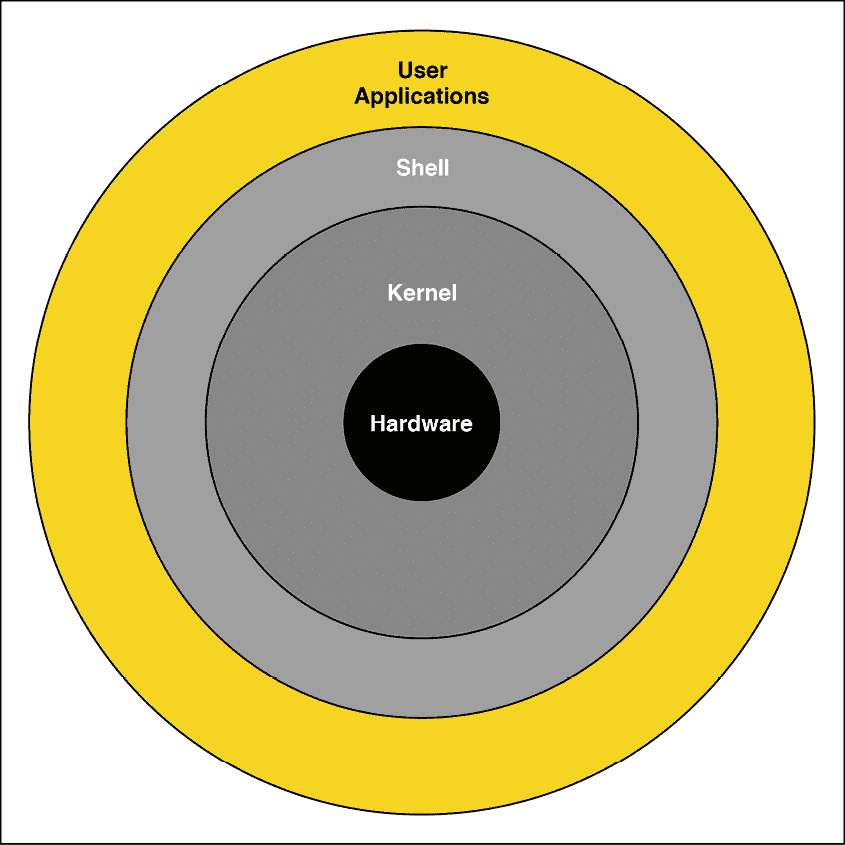
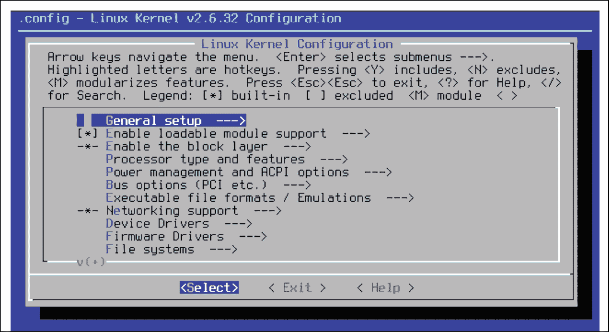
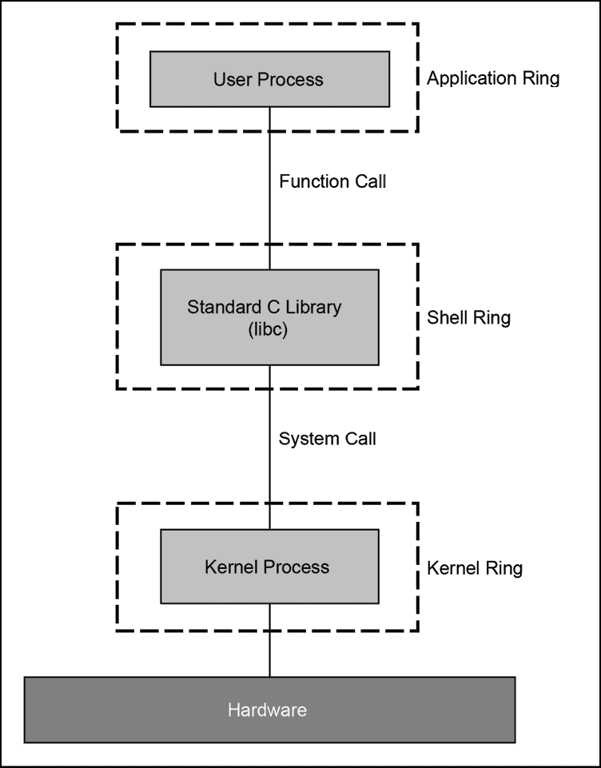
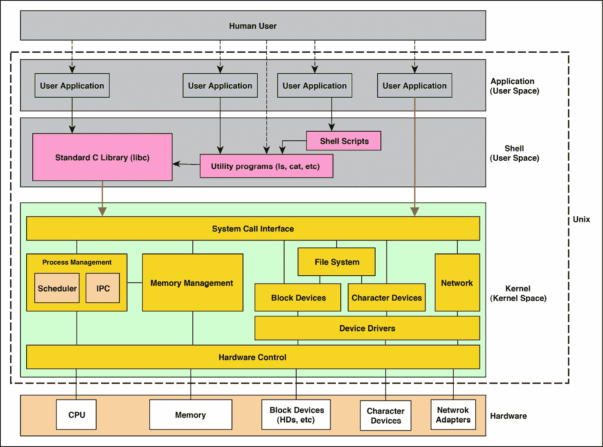

# 第十章

# Unix – 历史 和 架构

您可能已经问过自己，为什么在关于专家级 C 语言的书中会有关于 Unix 的章节。如果您还没有，我邀请您思考，C 语言和 Unix 这两个主题是如何相关联的，以至于在本书中间需要两个专门的章节（这个和下一章）来讨论 C 语言？ 

答案很简单：如果您认为它们无关，那么您犯了一个大错误。这两个之间的关系很简单；Unix 是第一个使用相当高级的编程语言 C（专为这个目的设计）实现的操作系统，C 语言从 Unix 中获得了声誉和力量。当然，我们关于 C 是一种高级编程语言的陈述现在已经不再正确，C 语言也不再被认为具有如此高级。

回到 20 世纪 70 年代和 80 年代，如果贝尔实验室的 Unix 工程师决定使用另一种编程语言（而不是 C 语言）来开发 Unix 的新版本，那么我们现在就会在谈论那种语言了，这本书也不再是 *Extreme C* 了。让我们暂停一下，阅读一下 C 语言先驱之一 Dennis M. Ritchie 关于 Unix 对 C 语言成功影响的这段引言：

> "毫无疑问，Unix 本身的成功是最重要的因素；它使这种语言对成千上万的人变得可用。当然，反过来，Unix 使用 C 语言及其随后在各种机器上的可移植性对系统的成功也很重要。"
> 
> - Dennis M. Ritchie – C 语言的发展

可在 [`www.bell-labs.com/usr/dmr/www/chist.html`](https://www.bell-labs.com/usr/dmr/www/chist.html) 找到。

作为本章的一部分，我们涵盖了以下主题：

+   我们简要地谈论了 Unix 的历史以及 C 语言的发明是如何发生的。

+   我们解释了 C 语言是如何基于 B 语言和 BCPL 开发的。

+   我们讨论 Unix 的洋葱架构以及它是如何基于 Unix 哲学设计的。

+   我们描述了用户应用层以及 shell 环，以及程序是如何消耗 shell 环暴露的 API 的。SUS 和 POSIX 标准在本节中得到了解释。

+   我们讨论内核层以及 Unix 内核应具备哪些特性和功能。

+   我们讨论 Unix 设备及其在 Unix 系统中的使用方式。

让我们从谈论 Unix 的历史开始本章。

# Unix 历史

在本节中，我们将简要介绍 Unix 的历史。这不是一本历史书，所以我们将尽量简短并直截了当，但这里的目的是为了在您的脑海中为 Unix 和 C 永远并排存在打下一些历史基础。

## Multics 操作系统和 Unix

在拥有 Unix 之前，我们已经有了 Multics 操作系统。这是一个于 1964 年启动的联合项目，由麻省理工学院、通用电气和贝尔实验室合作领导。Multics 操作系统取得了巨大成功，因为它向世界介绍了一个真正的工作和安全的操作系统。Multics 在从大学到政府网站的所有地方都得到了安装。快进到 2019 年，今天所有的操作系统都在通过 Unix 间接借鉴 Multics 的某些想法。

1969 年，由于我们将很快讨论的各种原因，贝尔实验室的一些人，特别是 Unix 的先驱，如 Ken Thompson 和 Dennis Ritchie，放弃了 Multics，随后贝尔实验室退出了 Multics 项目。但这并不是贝尔实验室的终点；他们设计了一个更简单、更高效的操作系统，这就是 Unix。

你可以在以下链接中了解更多关于 Multics 及其历史的信息：[Multics 和其历史](https://multicians.org/history.html)。

以下链接：[Unix 为什么成功而 Multics 为什么失败](https://www.quora.com/Why-did-Unix-succeed-and-not-Multics)，也是一个很好的解释 Unix 为什么能够继续存在而 Multics 则被废弃的链接。

比较 Multics 和 Unix 操作系统是很有意义的。在下面的列表中，你将看到在比较 Multics 和 Unix 时发现的相似之处和不同之处：

+   **两者都遵循洋葱架构作为其内部结构**。我们的意思是，它们在洋葱架构中都有或多或少相同的环，特别是内核和外壳环。因此，程序员可以在外壳环上编写自己的程序。此外，Unix 和 Multics 提供了一系列实用程序，如 `ls` 和 `pwd`。在以下章节中，我们将解释 Unix 架构中发现的各个环。

+   **Multics** 需要昂贵的资源和机器才能运行。它无法安装在普通商品机器上，这是 Unix 兴盛并最终在约 30 年后使 Multics 过时的主要缺点之一。

+   **Multics 的设计本身就非常复杂**。这是贝尔实验室员工感到沮丧的原因，正如我们之前所说的，这也是他们离开项目的原因。但 Unix 试图保持简单。在第一个版本中，它甚至不是多任务或多用户操作！

你可以在网上了解更多关于 Unix 和 Multics 的信息，并关注那个时代发生的事件。这两个项目都取得了成功，但 Unix 能够繁荣至今并生存下来。

值得分享的是，贝尔实验室一直在开发一个新的分布式操作系统，名为 *Plan 9*，该系统基于 Unix 项目。你可以在维基百科上了解更多信息：[贝尔实验室的 Plan 9](https://en.wikipedia.org/wiki/Plan_9_from_Bell_Labs)。


图 10-1：贝尔实验室的 Plan 9（来自维基百科）

我想我们只需要知道 Unix 是对 Multics 提出的思想和创新的简化；它不是什么新东西，因此，我可以在这一点上停止谈论 Unix 和 Multics 的历史。

到目前为止，C 语言在历史上没有留下痕迹，因为它尚未被发明。Unix 的第一个版本完全是使用汇编语言编写的。直到 1973 年，Unix 版本 4 才使用 C 语言编写。

现在，我们即将讨论 C 语言本身，但在那之前，我们必须谈谈 BCPL 和 B 语言，因为它们是通往 C 语言的门户。

## BCPL 和 B

BCPL 是由 Martin Richards 创建的，作为一种为编写编译器而发明的编程语言。当贝尔实验室的人作为 Multics 项目的一部分工作时，他们接触到了这种语言。在离开 Multics 项目后，贝尔实验室首先开始使用汇编语言编写 Unix。那是因为，在当时，使用除汇编语言之外的语言开发操作系统是一种反模式！

例如，Multics 项目组的人使用 PL/1 来开发 Multics 系统，这本身很奇怪，但通过这种方式，他们证明了操作系统可以用除了汇编语言之外的高级编程语言成功编写。因此，Multics 成为了使用另一种语言开发 Unix 的主要灵感来源。

尝试使用除汇编语言之外的语言编写操作系统模块的努力，一直伴随着贝尔实验室的 Ken Thompson 和 Dennis Ritchie。他们尝试使用 BCPL，但最终发现需要对语言进行一些修改才能在像 DEC PDP-7 这样的小型计算机上使用。这些变化导致了 B 编程语言的出现。

我们将避免深入探讨 B 语言的特点，但你可以通过以下链接了解更多关于它及其发展方式的信息：

+   B 编程语言，请访问[`en.wikipedia.org/wiki/B_(programming_language)`](https://en.wikipedia.org/wiki/B_(programming_language))

+   *C 语言的发展*，请访问[`www.bell-labs.com/usr/dmr/www/chist.html`](https://www.bell-labs.com/usr/dmr/www/chist.html)

Dennis Ritchie 亲自撰写了后一篇文章，这是解释 C 编程语言发展的好方法，同时分享了关于 B 语言及其特性的宝贵信息。

B 语言在作为系统编程语言方面也存在不足。B 语言是无类型的，这意味着在每次操作中只能处理一个*字*（而不是一个字节）。这使得在具有不同字长的机器上使用该语言变得困难。

因此，随着时间的推移，对语言的进一步修改导致了**NB**（**New B**）语言的开发，后来它从 B 语言中继承了结构。这些结构在 B 语言中是无类型的，但在 C 语言中变成了有类型的。最终，在 1973 年，第四版 Unix 可以使用 C 语言开发，其中仍然包含许多汇编代码。

在下一节中，我们将讨论 B 语言和 C 语言之间的差异，以及为什么 C 语言是编写操作系统的顶级现代系统编程语言。

## C 语言之路

我认为我们找不到比丹尼斯·里奇本人更好的解释者来解释为什么在遇到 B 语言的困难之后发明了 C 语言。在本节中，我们将列出导致丹尼斯·里奇、肯·汤普森（Ken Thompson）和其他人创造一种新的编程语言而不是使用 B 语言编写 Unix 的原因。

以下是发现 B 语言中的缺陷列表，这些缺陷导致了 C 语言的诞生：

+   **B 语言只能处理内存中的字**：每个操作都应该以字为单位进行。在当时，有一种能够处理字节的编程语言是一个梦想。这是因为当时的硬件，它以字为基础对内存进行寻址。

+   **B 语言无类型**：更准确的说法是，B 语言是一种单类型语言。所有变量都属于同一类型：字。因此，如果你有一个包含 20 个字符的字符串（加上末尾的空字符），你必须将其分成多个字并存储在多个变量中。例如，如果字是 4 字节，你将需要 6 个变量来存储 21 个字符的字符串。

+   **无类型意味着多个字节导向的算法，例如字符串操作算法，无法用 B 语言高效编写**：这是因为 B 语言使用的是内存字而不是字节，它们不能被有效地用于管理多字节数据类型，如整数和字符串。

+   **B 语言不支持浮点运算**：在当时，这些运算在新的硬件上越来越普遍，但在 B 语言中并没有支持。

+   随着像 PDP-1 这样的机器的出现，这些机器能够按字节寻址内存，B 语言显示了它在寻址内存字节方面的低效：这一点在 B 语言指针中变得更加明显，这些指针只能寻址内存中的字，而不能是字节。换句话说，对于想要访问内存中特定字节或字节范围的程序，必须进行更多的计算来计算相应的字索引。

B 语言在当时的困难，尤其是其缓慢的开发和在可用机器上的执行，迫使丹尼斯·里奇（Dennis Ritchie）创造了一种新的语言。这种新语言最初被称为 NB，即 New B，但最终演变成了 C 语言。

这种新开发的语言 C，试图克服 B 语言的困难和缺陷，并成为系统开发的*事实上的*编程语言，而不是汇编语言。在不到 10 年的时间里，Unix 的新版本完全是用 C 语言编写的，所有基于 Unix 的新操作系统都与 C 语言及其在系统中的关键作用紧密相连。

正如你所见，C 语言并非作为一种普通编程语言而生，而是通过考虑一套完整的需求来设计的，如今它没有竞争对手。你可能认为 Java、Python 和 Ruby 等语言是高级语言，但它们不能被视为直接竞争对手，因为它们不同，服务于不同的目的。例如，你不能用 Java 或 Python 编写设备驱动程序或内核模块，而且它们自身也是建立在用 C 语言编写的层之上的。

与许多编程语言不同，C 语言由 ISO 标准化，如果未来需要添加某些特性，那么标准可以被修改以支持新特性。

在下一节中，我们将讨论 Unix 架构。这是理解程序在 Unix 环境中如何演变的一个基本概念。

# Unix 架构

在本节中，我们将探讨 Unix 创造者心中的哲学思想以及他们在创建架构时对它的期望。

正如我们在上一节中解释的，贝尔实验室参与 Unix 的人们当时正在 Multics 项目工作。Multics 是一个大型项目，其提出的架构复杂，并且是为了在昂贵的硬件上使用而调整的。但我们应该记住，尽管困难重重，Multics 有着宏伟的目标。Multics 项目背后的思想彻底改变了我们思考操作系统的方式。

尽管之前讨论了挑战和困难，但该项目提出的思想之所以成功，是因为 Multics 项目的寿命达到了大约 40 年，直到 2000 年。不仅如此，该项目还为它的所有者公司创造了一个巨大的收入来源。

尽管 Unix 最初的设计意图是简单，但像 Ken Thompson 和他的同事这样的人还是将思想引入了 Unix。Multics 和 Unix 都试图引入类似的架构，但它们有着截然不同的命运。Multics 自世纪之交开始逐渐被人们遗忘，而 Unix 以及基于它的操作系统家族，如 BSD，自那时起一直在不断发展。

我们将接着讨论 Unix 哲学。这仅仅是一套高级要求，Unix 的设计就是基于这些要求的。之后，我们将讨论 Unix 的多环、洋葱状架构以及每个环在系统整体行为中的作用。

## 哲学

Unix 的哲学已经被其创始人多次解释。因此，对整个主题的彻底分析超出了本书的范围。我们将要做的是总结所有的主要观点。

在我们这样做之前，我列出了以下一些关于 Unix 哲学主题的出色外部文献，这可能有助于您：

+   维基百科，*Unix 哲学*：[`en.wikipedia.org/wiki/Unix_philosophy`](https://en.wikipedia.org/wiki/Unix_philosophy)

+   *Unix 哲学：简要介绍*：[`www.linfo.org/unix_philosophy.html`](http://www.linfo.org/unix_philosophy.html)

+   Eric Steven Raymond，*Unix 编程艺术*：[`homepage.cs.uri.edu/~thenry/resources/unix_art/ch01s06.html`](https://homepage.cs.uri.edu/~thenry/resources/unix_art/ch01s06.html)

同样，在以下链接中，您将看到对 Unix 哲学的相当愤怒的反面观点。我包括这个链接，因为了解双方的观点总是很好的，因为本质上，没有什么是不完美的：

+   *Unix 哲学的衰落*：[`kukuruku.co/post/the-collapse-of-the-unix-philosophy/`](https://kukuruku.co/post/the-collapse-of-the-unix-philosophy/)

为了总结这些观点，我将主要的 Unix 哲学归纳如下：

+   **Unix 主要设计和开发是为了供程序员使用，而不是普通终端用户使用**：因此，许多涉及用户界面和用户体验要求的考虑因素不是 Unix 架构的一部分。

+   **Unix 系统由许多小型和简单的程序组成**：每个程序都是设计来执行一个小型简单任务的。有很多这样的小型简单程序的例子，例如 `ls`、`mkdir`、`ifconfig`、`grep` 和 `sed`。

+   **可以通过执行一系列这些小型和简单的程序来执行复杂任务**：这意味着在执行一个大型和复杂的任务时，本质上涉及到多个程序，并且这些程序可以一起执行多次以完成任务。一个很好的例子是使用 shell 脚本而不是从头开始编写程序。请注意，shell 脚本通常在 Unix 系统之间是可移植的，Unix 鼓励程序员将他们的大型和复杂程序分解成小型和简单的程序。

+   **每个小型和简单的程序都应该能够将其输出作为另一个程序的输入，并且这个链应该继续下去**：这样，我们可以使用小型程序形成一个具有执行复杂任务潜力的链。在这个链中，每个程序都可以被视为一个转换器，它接收前一个程序的输出，根据其逻辑进行转换，并将其传递给链中的下一个程序。一个特别好的例子是在 Unix 命令之间的 *管道*，它由一个垂直线表示，例如 `ls -l | grep a.out`。

+   **Unix 非常注重文本**: 所有配置都是文本文件，它有一个文本命令行。Shell 脚本也是文本文件，使用简单的语法编写算法来执行其他 Unix shell 程序。

+   **Unix 建议选择简单而非完美**：例如，如果简单的解决方案在大多数情况下都能工作，就不需要设计一个复杂得多的解决方案，而该解决方案仅略微优于简单解决方案。

+   **为特定 Unix 兼容操作系统编写的程序应该易于在其他 Unix 系统中使用**：这主要通过拥有一个单一的代码库来实现，该代码库可以在各种 Unix 兼容系统中构建和执行。

我们刚才列出的一些观点已经被不同的人提取和解释，但总的来说，它们已经被普遍认为推动 Unix 哲学的主要原则，并因此塑造了 Unix 的设计。

如果你有过 Unix 类似操作系统的经验，例如 Linux，那么你将能够将你的经验与前面的陈述相匹配。正如我们在上一节关于 Unix 历史的解释中提到的，Unix 原本打算是一个更简单的 Multics 版本，Unix 创始人对 Multics 的经验引导他们形成了前面的理念。

但回到 C 的话题。你可能想知道 C 是如何贡献于前面的理念的？好吧，前面陈述中反映的几乎所有基本事物都是用 C 编写的。换句话说，推动 Unix 大部分工作的上述小型简单程序都是用 C 编写的。

通常来说，展示比简单讲述更好。所以，让我们来看一个例子。NetBSD 中 ls 程序的 C 源代码[可以在这里找到：http://cvsweb.netbsd.org/bsdweb.cgi/~checkout~/src/bin/ls/ls.c?rev=1.67](http://cvsweb.netbsd.org/bsdweb.cgi/~checkout~/src/bin/ls/ls.c?rev=1.67)。正如你所知，ls 程序列出目录内容，仅此而已，这种简单的逻辑已经用 C 语言编写，你可以通过链接看到。但 C 语言在 Unix 中的贡献不止于此。我们将在未来的章节中详细解释，当谈到 C 标准库时。

## Unix 洋葱

现在，是时候探索 Unix 架构了。正如我们之前简要提到的，洋葱模型可以描述 Unix 的整体架构。它之所以像洋葱，是因为它由几个*环*组成，每个环都作为内部环的包装器。

*图 10-2*展示了 Unix 架构提出的著名洋葱模型：



图 10-2：Unix 架构的洋葱模型

这个模型乍一看很简单。然而，要完全理解它，你需要编写一些 Unix 程序。只有在那之后，你才能真正理解每个环究竟在做什么。我们将尽可能地简单解释这个模型，以便在编写真实示例之前建立一个初步的基础。

让我们从最内层环开始解释洋葱模型。

在前面模型的核心是 **硬件**。众所周知，操作系统的主要任务是允许用户与硬件交互并使用它。这就是为什么硬件是模型中 *图 10-2* 的核心。这仅仅表明 Unix 的一个主要目标是使硬件对希望访问它的程序可用。我们在上一节中关于 Unix 哲学的所有阅读都集中在以最佳方式提供这些服务。

围绕硬件的环是 **内核**。内核是操作系统的最重要部分。这是因为它是离硬件最近的一层，并充当包装层以直接暴露连接硬件的功能。由于这种直接访问，内核拥有使用系统内所有可用资源的最高权限。对一切的无限制访问是架构中存在没有这种无限制访问的其他环的最佳理由。事实上，这正是内核空间和用户空间分离背后的原因。我们将在本章和下一章中进一步详细讨论这一点。

注意，编写内核是编写新的类 Unix 操作系统时所需的大部分努力，正如你所看到的，它的环比其他环画得更粗。Unix 内核内部有许多不同的单元，每个单元都在 Unix 生态系统中发挥着至关重要的作用。在本章的后面部分，我们将解释更多关于 Unix 内核内部结构的内容。

下一个环被称为 **Shell**。它只是围绕内核的一个壳，允许用户应用与内核交互并使用其许多服务。请注意，仅壳层环就带来了我们在上一节中解释的 Unix 哲学中大部分提到的需求。我们将在接下来的段落中进一步阐述这一点。

壳层环由许多小型程序组成，这些程序共同形成一套工具，允许用户或应用程序使用内核服务。它还包含一组库，所有这些库都是用 C 语言编写的，这将允许程序员为 Unix 编写新的应用程序。

基于 **简单 Unix 规范**（**SUS**）中找到的库，壳层环必须为程序员提供一个标准和精确定义的接口。这种标准化将使 Unix 程序在各种 Unix 实现上可移植，或者至少可编译。我们将在接下来的几节中揭示这个环的一些惊人的秘密！

最后，最外层环，**用户应用**，包括所有为在 Unix 系统上使用而编写的实际应用，例如数据库服务、网络服务、邮件服务、网络浏览器、电子表格程序和文字编辑程序。

这些应用应该使用 shell 环提供的 API 和工具，而不是直接访问内核（通过我们将在稍后讨论的系统调用）来完成它们的任务。这是由于 Unix 哲学中的可移植性原则。请注意，在我们当前的环境中，术语*用户*通常指的是用户应用，而不一定是使用这些应用的人。

仅限于使用 shell 环也有助于这些应用在各种非真正的 Unix 兼容操作系统中兼容。最好的例子是各种 Linux 发行版，它们只是 Unix-like。我们希望大型软件可以在 Unix 兼容和非 Unix 兼容的操作系统中都可用，并且使用单个代码库。随着我们的进展，你会了解到 Unix-like 系统和 Unix 兼容系统之间的更多差异。

在 Unix 洋葱中，一个普遍的主题是内环应该为外环提供一些接口，以便它们可以使用其服务。实际上，这些环之间的接口比环本身更重要。例如，我们更感兴趣的是了解如何使用现有的内核服务，而不是仅仅深入内核，因为不同的 Unix 实现之间是不同的。

同样，这也可以适用于 shell 环及其向用户应用暴露的界面。实际上，这些界面是我们在这两章讨论 Unix 时的主要关注点。在接下来的部分，我们将分别讨论每个环，并详细讨论其暴露的界面。

# Shell 界面到用户应用

一个**人类用户**要么使用终端，要么使用特定的 GUI 程序，如网页浏览器，来使用 Unix 系统上可用的功能。这两者都被称为用户应用，或者简单地称为应用或程序，它们允许通过 shell 环使用硬件。内存、CPU、网络适配器和硬盘是典型的例子，大多数 Unix 程序通常通过 shell 环提供的 API 使用这些硬件。我们将会讨论的 API 是其中的一个主题。

从开发者的角度来看，应用和程序之间并没有太大的区别。但从一个人类用户的角度来看，应用是一种程序，它具有诸如**图形用户界面**（**GUI**）或**命令行界面**（**CLI**）等与用户交互的手段，而程序则是在没有用户界面（UI）的机器上运行的软件片段，例如正在运行的服务。本书不对程序和应用进行区分，我们使用这些术语是通用的。

已经为 Unix 开发了各种 C 程序。数据库服务、Web 服务器、邮件服务器、游戏、办公应用程序等等，都是 Unix 环境中存在的各种程序类型之一。这些应用程序中有一个共同的特点，那就是它们的代码可以在大多数 Unix 和 Unix-like 操作系统上移植，只需进行一些小的修改。但这是如何实现的？如何编写一个可以在各种 Unix 版本和不同类型的硬件上构建的程序？

答案很简单：所有 Unix 系统都从它们的壳环中暴露了相同的**应用程序编程接口**（**API**）。仅使用暴露的标准接口的 C 源代码可以在所有 Unix 系统上构建和运行。

但我们究竟意味着什么通过暴露一个 API？正如我们之前所解释的，API 是一组包含一系列声明的头文件。在 Unix 中，这些头文件以及其中声明的函数在所有 Unix 系统中都是相同的，但那些函数的实现，换句话说，为每个 UNIX 兼容系统编写的静态和动态库，可能是独特的并且与其他的不同。

注意，我们是在将 Unix 视为一个标准而不是一个操作系统。有一些系统完全符合 Unix 标准，我们称之为*Unix 兼容系统*，例如 BSD Unix，而有一些系统部分符合 Unix 标准，我们称之为*Unix-like 系统*，例如 Linux。

大多数 Unix 系统都从壳环中暴露了相同的 API。例如，`printf`函数必须始终在 Unix 标准指定的`stdio.h`头文件中声明。无论何时你想要在 Unix 兼容系统中将某些内容打印到标准输出，你应该使用`stdio.h`头文件中的`printf`或`fprintf`。

事实上，`stdio.h`虽然所有 C 书籍都解释了这个头文件及其声明的函数，但它并不是 C 的一部分。它是 SUS 标准中指定的 C 标准库的一部分。为 Unix 编写的 C 程序并不知道特定函数的实际实现，例如`printf`或`fopen`。换句话说，壳环被外环中的程序视为一个黑盒。

壳环暴露的各种 API 被收集在 SUS 标准之下。这个标准由**开放集团**联盟维护，并且自 Unix 创建以来已经经历了多次迭代。最新版本是 SUS 版本 4，它追溯到 2008 年。然而，最新版本本身在 2013 年、2016 年和最终在 2018 年进行了修订。

以下链接将带您进入解释 SUS 版本中暴露接口的文档[解释 SUS 版本中暴露的接口](http://www.unix.org/version4/GS5_APIs.pdf) 4: [`www.unix.org/version4/GS5_APIs.pdf`](http://www.unix.org/version4/GS5_APIs.pdf)。如链接所示，shell 环暴露了不同种类的 API。其中一些是强制性的，而另一些则是可选的。以下是在 SUS v4 中找到的 API 列表：

+   **系统接口**：这是一个所有 C 程序都应能使用的函数列表。SUS v4 有 1,191 个函数需要 Unix 系统实现。表格还描述了特定函数对于特定版本的 C 是强制性的还是可选性的。请注意，我们感兴趣的是 C99 版本。

+   **头文件接口**：这是一个在 SUS v4 兼容的 Unix 系统中可能可用的头文件列表。在这个版本的 SUS 中，有 82 个头文件对所有 C 程序都是可访问的。如果您查看列表，您会发现许多著名的头文件，例如`stdio.h`、`stdlib.h`、`math.h`和`string.h`。根据 Unix 版本和使用的 C 版本，其中一些是强制性的，而另一些则是可选的。可选的头文件可能在 Unix 系统中缺失，但强制性的头文件肯定存在于文件系统中某个地方。

+   **实用程序接口**：这是一个在 SUS v4 兼容的 Unix 系统中应可用的实用程序列表，或命令行程序列表。如果您查看表格，您会看到许多您熟悉的命令，例如`mkdir`、`ls`、`cp`、`df`、`bc`等等，这些构成了多达 160 个实用程序。请注意，这些通常是必须在 Unix 供应商发货时作为其安装包一部分之前已经编写好的程序。

    这些实用程序主要在终端或 shell 脚本中使用，并且通常不会被其他 C 程序调用。这些实用程序通常使用与在用户应用环中编写的普通 C 程序暴露的相同系统接口。

    例如，以下是一个指向为基于伯克利软件发行版（BSD）的 Unix 系统 macOS High Sierra 10.13.6 编写的`mkdir`实用程序源代码的链接。该源代码发布在 Apple 开源网站上，macOS High Sierra (10.13.6)，可在[`opensource.apple.com/source/file_cmds/file_cmds-272/mkdir/mkdir.c`](https://opensource.apple.com/source/file_cmds/file_cmds-272/mkdir/mkdir.c)找到。

    如果您打开链接并查看源代码，您会发现它使用了作为系统接口一部分声明的`mkdir`和`umask`函数。

+   **脚本接口**：这种接口是一种用于编写*shell 脚本*的语言。它主要用于编写使用实用程序的自动化任务。这个接口通常被称为*shell 脚本语言*或*shell 命令语言*。

+   **XCURSES 接口**：XCURSES 是一套接口，允许 C 程序以最小化文本界面方式与用户交互。

    在下面的屏幕截图中，你可以看到一个使用 `ncurses` 编写的 GUI 示例，而 `ncurses` 是 XCURSES 的一个实现。

    在 SUS v4 中，有 379 个函数分布在 3 个头文件中，以及 4 个实用程序，这些共同构成了 XCURSES 接口。

    许多程序今天仍在使用 XCURSES 通过更好的界面与用户交互。值得注意的是，通过使用基于 XCURSES 的接口，你不需要拥有图形引擎。同样，它也可以通过远程连接，如 **Secure Shell**（**SSH**）进行使用。



图 10-3：基于 ncurses 的配置菜单（维基百科）

如你所见，SUS 没有讨论文件系统层次结构和头文件应该找到的位置。它只说明了哪些头文件应该存在于系统中。一个广泛使用的标准头文件路径约定是，这些头文件应该位于 `/usr/include` 或 `/usr/local/include` 中，但这最终还是取决于操作系统和用户来做出最终决定。这些是头文件的默认路径。然而，系统可以被配置为使用其他路径而不是默认路径。

如果我们将系统接口和头文件接口与每个 Unix 版本（或实现）中暴露函数的实现结合起来，那么我们就得到了 **C 标准库** 或 **libc**。换句话说，libc 是一组函数，这些函数放置在特定的头文件中，所有这些都根据 SUS 规范，以及包含暴露函数实现的静态和共享库。

libc 的定义与 Unix 系统的标准紧密相连。在 Unix 系统中开发的每个 C 程序都使用 libc 来与内核和硬件级别进行通信。

重要的是要记住，并非所有操作系统都是完全兼容 Unix 的系统。例如，Microsoft Windows 和使用 Linux 内核的操作系统，如 Android，就是这样的例子。这些操作系统不是 Unix 兼容系统，但它们可以是类似 Unix 的系统。我们在前面的章节中使用了 Unix 兼容和类似 Unix 的术语，但没有解释它们的真正含义，但现在我们将仔细定义它们。

符合 Unix 标准的系统完全符合 SUS 标准，但符合 Unix 标准的类似系统只部分符合该标准。这意味着类似 Unix 的系统只符合 SUS 标准的特定子集，而不是全部。这意味着，理论上，为符合 Unix 标准的系统开发的程序应该可以移植到其他 Unix 兼容系统，但可能无法移植到类似 Unix 的操作系统。这尤其适用于从 Linux 移植到其他符合 Unix 标准的系统，或从其他符合 Unix 标准的系统移植到 Linux 的程序。

随着 Linux 诞生后类似 Unix 操作系统的开发增多，这个子集的 SUS 标准得到了一个特定的名称。它们称之为 **可移植操作系统接口**（**POSIX**）。我们可以这样说，POSIX 是 Unix 类似系统选择遵守的 SUS 标准的子集。

在以下链接中，您可以找到所有应在 POSIX 系统中公开的不同接口：[POSIX 系统中应公开的不同接口](http://pubs.opengroup.org/onlinepubs/9699919799/)：[POSIX 系统中应公开的不同接口](http://pubs.opengroup.org/onlinepubs/9699919799/).

正如链接中所示，POSIX 中有类似的接口，就像 SUS 中一样。这些标准非常相似，但 POSIX 使 Unix 标准适用于更广泛的操作系统。

类 Unix 操作系统，如大多数 Linux 发行版，从一开始就符合 POSIX 标准。这就是为什么如果你使用过 Ubuntu，你同样可以用相同的方式使用 FreeBSD Unix。

然而，对于一些操作系统，如微软 Windows，情况并非如此。微软 Windows 不能被认为是 POSIX 兼容的，但可以安装额外的工具使其成为一个 POSIX 操作系统，例如，*Cygwin*，这是一个在 Windows 操作系统上本地运行的 POSIX 兼容环境。

这再次表明，POSIX 兼容性关乎拥有一个标准的 shell 环境而不是内核。

稍微偏一下题，当微软 Windows 在 1990 年代成为 POSIX 兼容时，那真是一个故事。然而，随着时间的推移，这种支持已经过时了。

SUS 和 POSIX 标准都规定了接口。它们都说明了应该有什么，但并没有讨论如何实现。每个 Unix 系统都有自己的 POSIX 或 SUS 实现。这些实现随后被放入 shell 环境的 libc 库中。换句话说，在 Unix 系统中，shell 环境包含一个以标准方式公开的 libc 实现。随后，shell 环境会将请求进一步传递到内核环境以进行处理。

# 内核到 shell 环境的接口

在前一节中，我们解释了 Unix 系统中的 shell 环暴露了 SUS 或 POSIX 标准中定义的接口。在 shell 环中调用特定逻辑主要有两种方式，要么通过 libc，要么使用 shell 实用程序。一个用户应用程序应该与 libc 库链接以执行 shell 例程，或者它应该执行系统中可用的现有实用程序。

注意，现有的实用程序程序本身正在使用 libc 库。因此，我们可以概括地说，所有 shell 例程都可以在 libc 库中找到。这使标准 C 库的重要性更加突出。如果你要从头开始创建一个新的 Unix 系统，你必须在使用并准备好内核之后编写自己的 libc。

如果你已经跟随了这本书的流程并阅读了前面的章节，你会发现拼图碎片正在拼凑在一起。我们需要有一个编译管道和链接机制，以便能够设计一个暴露接口并使用一系列库文件实现的操作系统。在这个阶段，你能够看到 C 的每个特性都在有利于 Unix。你对 C 和 Unix 之间关系的理解越深，你会发现它们联系得越紧密。

现在用户应用程序和 shell 环之间的关系已经清楚，我们需要看看 shell 环（或 libc）是如何与内核环通信的。在我们继续之前，请注意，在本节中，我们不会解释什么是内核。相反，我们将将其视为一个暴露某些功能的黑盒。

libc（或 shell 环中的函数）用来消耗内核功能的主要机制是通过使用 *系统调用*。为了解释这个机制，我们需要有一个例子来跟随洋葱模型的层级，以便找到系统调用用于执行某些操作的地方。

我们还需要选择一个真实的 libc 实现，这样我们就可以追踪源代码并找到系统调用。我们选择 FreeBSD 进行进一步的研究。FreeBSD 是一个从 BSD [Unix](https://github.com/freebsd/freebsd0) 分支出来的类 Unix 操作系统。

[**注意**：

FreeBSD 的 Git 仓库可以在以下位置找到：https://github.com/freebsd/freebsd。这个仓库包含了 FreeBSD 内核和 shell 环的源代码。FreeBSD libc 的源代码可以在 `lib/libc` 目录中找到。](https://github.com/freebsd/freebsd0)

让我们从以下示例开始。*示例 10.1* 是一个简单的程序，它仅仅等待一秒钟。同样，该程序被认为是处于应用环中，这意味着它是一个用户应用程序，尽管它非常简单。

因此，让我们首先看看 *示例 10.1* 的源代码：

```cpp
#include <unistd.h>
int main(int argc, char** argv) {
  sleep(1);
  return 0;
}
```

代码框 10-1 [ExtremeC_examples_chapter10_1.c]：示例 10.1 调用来自 shell 环的 sleep 函数

如你所见，代码包含了`unistd.h`头文件，并调用了`sleep`函数，这两者都是 SUS 公开接口的一部分。但接下来会发生什么，尤其是在`sleep`函数中？作为一个 C 程序员，你可能以前从未问过自己这个问题，但了解这一点可以增强你对 Unix 系统的理解。

我们一直使用`sleep`、`printf`和`malloc`等函数，而不了解它们内部是如何工作的，但现在我们想要迈出一大步，发现 libc 与内核通信的机制。

我们知道，系统调用，或简称为*syscalls*，是由 libc 实现中编写的代码触发的。实际上，这就是触发内核例程的方式。在 SUS 中，以及随后的 POSIX 兼容系统中，有一个程序用于在程序运行时跟踪系统调用。

我们几乎可以肯定，一个没有调用系统调用的程序实际上什么都不能做。因此，结果是，我们知道我们编写的每个程序都必须通过调用 libc 函数来使用系统调用。

让我们编译前面的示例，找出它所触发的系统调用。我们可以通过运行以下命令开始这个过程：

```cpp
$ cc ExtremeC_examples_chapter10_1.c -lc -o ex10_1.out
$ truss ./ex10_1.out
...                                           
$
```

Shell Box 10-1：使用 truss 跟踪调用系统调用的 10.1 示例的构建和运行

如*Shell Box 10-1*中所示，我们使用了一个名为`truss`的实用程序。以下文本是 FreeBSD 的`truss`手册页的摘录：

> "truss 实用程序跟踪指定进程或程序调用的系统调用。默认情况下，输出到指定的输出文件或标准错误。它是通过 ptrace(2)停止和重新启动被监控的进程来实现的。"

如描述所暗示的，`truss`是一个程序，用于查看程序在执行过程中所调用的所有系统调用。大多数类 Unix 系统中都有类似 truss 的实用程序。例如，Linux 系统中可以使用`strace`。

以下 shell 框展示了使用`truss`监控前一个示例所调用的系统调用的输出：

```cpp
$ truss ./ex10_1.out
mmap(0x0,32768,PROT_READ|PROT_WRITE,MAP_PRIVATE|MAP_ANON,-1,0x0) = 34366160896 (0x800620000)
issetugid()                                      = 0 (0x0)
lstat("/etc",{ mode=drwxr-xr-x ,inode=3129984,size=2560,blksize=32768 }) = 0 (0x0)
lstat("/etc/libmap.conf",{ mode=-rw-r--r-- ,inode=3129991,size=109,blksize=32768 }) = 0 (0x0)                                                     openat(AT_FDCWD,"/etc/libmap.conf",O_RDONLY|O_CLOEXEC,00) = 3 (0x3)
fstat(3,{ mode=-rw-r--r-- ,inode=3129991,size=109,blksize=32768 }) = 0 (0x0)
...
openat(AT_FDCWD,"/var/run/ld-elf.so.hints",O_RDONLY|O_CLOEXEC,00) = 3 (0x3)                                                                       read(3,"Ehnt\^A\0\0\0\M^@\0\0\0Q\0\0\0\0"...,128) = 128 (0x80)
fstat(3,{ mode=-r--r--r-- ,inode=7705382,size=209,blksize=32768 }) = 0 (0x0)
lseek(3,0x80,SEEK_SET)                           = 128 (0x80)                                                                                     read(3,"/lib:/usr/lib:/usr/lib/compat:/u"...,81) = 81 (0x51)
close(3)                                         = 0 (0x0)
access("/lib/libc.so.7",F_OK)                    = 0 (0x0)
openat(AT_FDCWD,"/lib/libc.so.7",O_RDONLY|O_CLOEXEC|O_VERIFY,00) = 3 (0x3)
...
sigprocmask(SIG_BLOCK,{ SIGHUP|SIGINT|SIGQUIT|SIGKILL|SIGPIPE|SIGALRM|SIGTERM|SIGURG|SIGSTOP|SIGTSTP|SIGCONT|SIGCHLD|SIGTTIN|SIGTTOU|SIGIO|SIGXCPU|SIGXFSZ|SIGVTALRM|SIGPROF|SIGWINCH|SIGINFO|SIGUSR1|SIGUSR2 },{ }) = 0 (0x0)sigprocmask(SIG_SETMASK,{ },0x0)                 = 0 (0x0)
sigprocmask(SIG_BLOCK,{ SIGHUP|SIGINT|SIGQUIT|SIGKILL|SIGPIPE|SIGALRM|SIGTERM|SIGURG|SIGSTOP|SIGTSTP|SIGCONT|SIGCHLD|SIGTTIN|SIGTTOU|SIGIO|SIGXCPU|SIGXFSZ|SIGVTALRM|SIGPROF|SIGWINCH|SIGINFO|SIGUSR1|SIGUSR2 },{ }) = 0 (0x0)sigprocmask(SIG_SETMASK,{ },0x0)                 = 0 (0x0)
nanosleep({ 1.000000000 })                       = 0 (0x0)
sigprocmask(SIG_BLOCK,{ SIGHUP|SIGINT|SIGQUIT|SIGKILL|SIGPIPE|SIGALRM|SIGTERM|SIGURG|SIGSTOP|SIGTSTP|SIGCONT|SIGCHLD|SIGTTIN|SIGTTOU|SIGIO|SIGXCPU|SIGXFSZ|SIGVTALRM|SIGPROF|SIGWINCH|SIGINFO|SIGUSR1|SIGUSR2 },{ }) = 0 (0x0)
...
sigprocmask(SIG_SETMASK,{ },0x0)                 = 0 (0x0)
exit(0x0)
process exit, rval = 0                                                   $
```

Shell Box 10-2：truss 的输出，显示了 10.1 示例调用的系统调用

如前述输出所示，我们的简单示例触发了许多系统调用，其中一些是关于加载共享对象库的，尤其是在初始化进程时。第一个以粗体显示的系统调用是打开`libc.so.7`共享对象库文件。这个共享对象库包含了 FreeBSD 的 libc 的实际实现。

在同一个 shell 框中，你可以看到程序正在调用`nanosleep`系统调用。传递给这个系统调用的值是 1000000000 纳秒，相当于 1 秒。

系统调用就像函数调用一样。请注意，每个系统调用都有一个专用且预定的常数值，并且随后，与该值一起，它有一个特定的名称和参数列表。每个系统调用也执行特定的任务。在这种情况下，`nanosleep`使调用线程休眠指定的纳秒数。

关于系统调用的更多信息可以在 FreeBSD 的*系统调用手册*中找到。以下 shell box 显示了手册中专门针对`nanosleep`系统调用的页面：

```cpp
$ man nanosleep
NANOSLEEP(2)              FreeBSD System Calls Manual             NANOSLEEP(2)
NAME
     nanosleep - high resolution sleep
LIBRARY      Standard C Library (libc, -lc)
SYNOPSIS      #include <time.h>
     Int
     clock_nanosleep(clockid_t clock_id, int flags,
         const struct timespec *rqtp, struct timespec *rmtp);
     int
     nanosleep(const struct timespec *rqtp, struct timespec *rmtp);
DESCRIPTION
     If the TIMER_ABSTIME flag is not set in the flags argument, then
     clock_nanosleep() suspends execution of the calling thread until either
     the time interval specified by the rqtp argument has elapsed, or a signal
     is delivered to the calling process and its action is to invoke a signal-
     catching function or to terminate the process.  The clock used to measure
     the time is specified by the clock_id argument
...
...
$
```

Shell Box 10-3：专门针对 nanosleep 系统调用的手册页

前面的手册页描述如下：

+   `nanosleep`是一个系统调用。

+   系统调用可以通过从`time.h`中定义的 shell 环调用`nanosleep`和`clock_nanosleep`函数来访问。请注意，我们使用了`unitsd.h`中的`sleep`函数。我们也可以使用`time.h`中的前两个函数。还值得注意的是，这两个头文件以及所有前面的函数，以及实际使用的函数，都是 SUS 和 POSIX 的一部分。

+   如果您想要能够调用这些函数，您需要通过将`-lc`选项传递给链接器来将可执行文件链接到 libc。这可能仅适用于 FreeBSD。

+   这个手册页没有讨论系统调用本身，而是讨论了从 shell 环公开的标准 C API。这些手册是为应用程序开发者编写的，因此它们不会经常讨论系统调用和内核内部。相反，它们专注于从 shell 环公开的 API。

现在，让我们找到在 libc 中实际调用系统调用的位置。我们将使用 GitHub 上的 FreeBSD 源代码。我们使用的提交哈希是来自 master 分支的`bf78455d496`。为了从存储库克隆并使用正确的提交，请运行以下命令：

```cpp
$ git clone https://github.com/freebsd/freebsd
...
$ cd freebsd
$ git reset --hard bf78455d496
...
$
```

Shell Box 10-4：克隆 FreeBSD 项目并转到特定的提交

您也可以使用以下链接在 GitHub 网站上导航 FreeBSD 项目本身：[`github.com/freebsd/freebsd/tree/bf78455d496`](https://github.com/freebsd/freebsd/tree/bf78455d496)。无论您使用什么方法导航项目，您都应该能够找到以下代码行。

如果您进入`lib/libc`目录并使用`grep`搜索`sys_nanosleep`，您将找到以下文件条目：

```cpp
$ cd lib/libc
$ grep sys_nanosleep . -R
./include/libc_private.h:int		__sys_nanosleep(const struct timespec *, struct timespec *);
./sys/Symbol.map:	__sys_nanosleep;
./sys/nanosleep.c:__weak_reference(__sys_nanosleep, __nanosleep);
./sys/interposing_table.c:	SLOT(nanosleep, __sys_nanosleep), 
$
```

Shell Box 10-5：在 FreeBSD libc 文件中查找与 nanosleep 系统调用相关的条目

如您在`lib/libc/sys/interposing_table.c`文件中所见，`nanosleep`函数映射到`__sys_nanosleep`函数。因此，任何针对`nanosleep`的函数调用都会导致`__sys_nanosleep`被调用。

以`__sys`开头的函数是 FreeBSD 约定中的实际系统调用函数。请注意，这是 libc 实现的一部分，使用的命名约定和其他与实现相关的配置对 FreeBSD 来说非常具体。

说了这么多，前一个 shell 框中还有一个有趣的观点。`lib/libc/include/libc_private.h`文件包含了围绕系统调用所需的私有和内部函数声明。

到目前为止，我们已经看到了 shell 环是如何通过系统调用来将 libc 中的函数调用路由到内环的。但为什么我们最初需要系统调用呢？为什么它被称为系统调用而不是函数调用？当我们查看用户应用程序或 libc 中的普通函数时，它与内核环中的系统调用有何不同？在*第十一章*，*系统调用与内核*中，我们将通过给出系统调用的更具体定义来进一步讨论这个问题。

下一节是关于内核环及其内部单元，这些单元在大多数符合 Unix 和 Unix-like 系统的内核中很常见。

# 内核

内核环的主要目的是管理连接到系统的硬件，并通过系统调用暴露其功能。以下图表显示了在用户应用程序最终可以使用之前，特定硬件功能是如何通过不同的环暴露的：



图 10-4：在各个 Unix 环之间进行的函数调用和系统调用，以暴露硬件功能

上述图表展示了我们到目前为止所解释的内容的总结。在本节中，我们将专注于内核本身，看看内核是什么。内核是一个像我们所知道的任何其他进程一样执行一系列指令的进程。但**内核进程**与我们所知的**用户进程**在本质上是有区别的。

以下列表比较了内核进程和用户进程。请注意，我们的比较是有偏见的，偏向于像 Linux 这样的单核内核。我们将在下一章解释不同类型的内核。

+   内核进程是首先被加载和执行的东西，但用户进程在创建之前需要内核进程被加载并运行。

+   我们只有一个内核进程，但我们可以同时运行许多用户进程。

+   内核进程是由引导加载程序将内核镜像复制到主内存中创建的，但用户进程是通过`exec`或`fork`系统调用创建的。这些系统调用存在于大多数 Unix 系统中。

+   内核进程处理和执行系统调用，但用户进程调用系统调用并等待由内核进程处理的执行。这意味着，当用户进程要求执行系统调用时，执行流程会转移到内核进程，并且是内核本身代表用户进程执行系统调用的逻辑。我们将在第二部分关于 Unix 的探讨中阐明这一点，即第十一章，*系统调用和内核*。

+   内核进程以 *特权* 模式看到物理内存和所有连接的硬件，但用户进程看到的是虚拟内存，它是映射到物理内存的一部分，用户进程对物理内存布局一无所知。同样，用户进程对资源和硬件拥有受控制和受监督的访问。我们可以这样说，用户进程是在操作系统模拟的沙盒中执行的。这也意味着一个用户进程无法看到另一个用户进程的内存。

如前所述的比较所理解的那样，在操作系统的运行时中，我们有两种不同的执行模式。其中一种是为内核进程专用的，另一种是为用户进程专用的。

前者执行模式被称为 *内核空间* 或 *内核地带*，后者被称为 *用户空间* 或 *用户地带*。用户进程通过调用系统调用来将这两个地带连接起来。基本上，我们发明系统调用是因为我们需要将内核空间和用户空间相互隔离。内核空间对系统资源拥有最高权限的访问，而用户空间拥有最低权限且受监督的访问。

典型 Unix 内核的内部结构可以通过内核执行的任务来识别。实际上，管理硬件并不是内核执行的唯一任务。以下是一个 Unix 内核职责的列表。请注意，我们在以下列表中也包括了硬件管理任务：

+   **进程管理**：内核通过系统调用来创建用户进程。为新进程分配内存和加载其指令是运行进程之前应执行的操作之一。

+   **进程间通信**（**IPC**）：同一台机器上的用户进程可以使用不同的方法在它们之间交换数据。这些方法中的一些是共享内存、管道和 Unix 域套接字。这些方法应由内核提供便利，其中一些需要内核控制数据的交换。我们将在第十九章，*单主机 IPC 和套接字*中解释这些方法，同时讨论 IPC 技术。

+   **调度**：Unix 一直以多任务操作系统而闻名。内核管理对 CPU 核心的访问，并试图平衡对它们的访问。调度是根据它们的优先级和重要性在多个进程之间共享 CPU 时间的任务名称。我们将在接下来的章节中更详细地解释多任务、多线程和多进程。

+   **内存管理**：毫无疑问，这是内核的关键任务之一。内核是唯一可以看到整个物理内存并对其具有超级用户访问权限的进程。因此，将内存分割成可分配的页面、在堆分配的情况下为新进程分配新页面、释放内存以及许多其他与内存相关的任务，都应该由内核执行和管理。

+   **系统启动**：一旦内核映像被加载到主内存中并且内核进程启动，它应该初始化用户空间。这通常是通过创建第一个用户进程，即带有**进程标识符**（**PID**）1 的进程来完成的。在一些 Unix 系统，如 Linux 中，这个进程被称为*init*。在启动了这个进程之后，它将启动更多的服务和守护进程。

+   **设备管理**：除了 CPU 和内存之外，内核应该能够通过在所有这些硬件上创建的抽象来管理硬件。*设备*是连接到 Unix 系统的真实或虚拟硬件。典型的 Unix 系统使用`/dev`路径来存储映射的设备文件。所有连接的硬盘驱动器、网络适配器、USB 设备等都被映射到`/dev`路径下找到的文件。这些设备文件可以被用户进程用来与这些设备通信。

下面的图示显示了基于上述列表的 Unix 内核最常见的内部结构：



图 10-5：Unix 架构中不同环的内部结构

上述图示是 Unix 环的详细说明。它清楚地显示了在 shell 环中，我们有三个暴露给用户应用的组成部分。它还显示了内核环的详细内部结构。

在内核环的最顶部，我们有系统调用接口。如图所示，所有位于用户空间的前置单元必须仅通过系统调用接口与底部的单元进行通信。这个接口就像用户和内核空间之间的一个门或障碍。

内核中有各种单元，例如负责管理可用物理内存的**内存管理单元**（**MMU**）。**进程管理单元**在用户空间创建进程并为它们分配资源。它还使进程间通信（IPC）对进程可用。该图还显示了由**设备驱动程序**介导的**字符设备**和**块设备**，它们暴露了各种 I/O 功能。我们将在下一节中解释字符和块设备。**文件系统**单元是内核的一个基本部分，它是对块设备和字符设备的抽象，并允许进程和内核本身使用相同的共享文件层次结构。

在下一节中，我们将讨论硬件。

# 硬件

每个操作系统的最终目的是允许用户和应用程序能够使用和与硬件交互。Unix 也旨在以抽象和透明的方式提供对连接硬件的访问，使用相同的实用程序和命令集在所有现有和未来的平台上。

通过这种透明性和抽象，Unix 将所有不同的硬件抽象为连接到系统的一组设备。因此，*设备*在 Unix 中是核心的，每个连接的硬件部件都被认为是连接到 Unix 系统的设备。

连接到计算机的硬件可以分为两个不同的类别：*必需*和*外围*。CPU 和主内存是连接到 Unix 系统的必需设备。所有其他硬件，如硬盘、网络适配器、鼠标、显示器、显卡和 Wi-Fi 适配器，都是外围设备。

Unix 机器没有必需的硬件是无法工作的，但你可以有一个没有硬盘或网络适配器的 Unix 机器。请注意，虽然文件系统对于 Unix 内核的运行是必需的，但这并不一定需要硬盘！

Unix 内核完全隐藏了 CPU 和物理内存。它们直接由内核管理，不允许用户空间进行访问。Unix 内核中的**内存管理**和**调度器**单元分别负责管理物理内存和 CPU。

Unix 系统中连接的其他外围设备并非如此。它们通过称为*设备文件*的机制暴露出来。你可以在 Unix 系统的 `/dev` 路径下看到这些文件。

以下是在普通 Linux 机器上可以找到的文件列表：

```cpp
$ ls -l /dev
total 0
crw-r--r--  1 root   root     10, 235 Oct 14 16:55 autofs
drwxr-xr-x  2 root   root         280 Oct 14 16:55 block
drwxr-xr-x  2 root   root          80 Oct 14 16:55 bsg
crw-rw----  1 root   disk     10, 234 Oct 14 16:55 btrfs-control
drwxr-xr-x  3 root   root          60 Oct 14 17:02 bus
lrwxrwxrwx  1 root   root           3 Oct 14 16:55 cdrom -> sr0
drwxr-xr-x  2 root   root        3500 Oct 14 16:55 char
crw-------  1 root   root      5,   1 Oct 14 16:55 console
lrwxrwxrwx  1 root   root          11 Oct 14 16:55 core -> /proc/kcore
crw-------  1 root   root     10,  59 Oct 14 16:55 cpu_dma_latency
crw-------  1 root   root     10, 203 Oct 14 16:55 cuse
drwxr-xr-x  6 root   root         120 Oct 14 16:55 disk
drwxr-xr-x  3 root   root          80 Oct 14 16:55 dri
lrwxrwxrwx  1 root   root           3 Oct 14 16:55 dvd -> sr0
crw-------  1 root   root     10,  61 Oct 14 16:55 ecryptfs
crw-rw----  1 root   video    29,   0 Oct 14 16:55 fb0
lrwxrwxrwx  1 root   root          13 Oct 14 16:55 fd -> /proc/self/fd
crw-rw-rw-  1 root   root      1,   7 Oct 14 16:55 full
crw-rw-rw-  1 root   root     10, 229 Oct 14 16:55 fuse
crw-------  1 root   root    245,   0 Oct 14 16:55 hidraw0
crw-------  1 root   root     10, 228 Oct 14 16:55 hpet
drwxr-xr-x  2 root   root           0 Oct 14 16:55 hugepages
crw-------  1 root   root     10, 183 Oct 14 16:55 hwrng
crw-------  1 root   root     89,   0 Oct 14 16:55 i2c-0
...
crw-rw-r--  1 root   root     10,  62 Oct 14 16:55 rfkill
lrwxrwxrwx  1 root   root           4 Oct 14 16:55 rtc -> rtc0
crw-------  1 root   root    249,   0 Oct 14 16:55 rtc0
brw-rw----  1 root   disk      8,   0 Oct 14 16:55 sda
brw-rw----  1 root   disk      8,   1 Oct 14 16:55 sda1
brw-rw----  1 root   disk      8,   2 Oct 14 16:55 sda2
crw-rw----+ 1 root   cdrom    21,   0 Oct 14 16:55 sg0
crw-rw----  1 root   disk     21,   1 Oct 14 16:55 sg1
drwxrwxrwt  2 root   root          40 Oct 14 16:55 shm
crw-------  1 root   root     10, 231 Oct 14 16:55 snapshot
drwxr-xr-x  3 root   root         180 Oct 14 16:55 snd
brw-rw----+ 1 root   cdrom    11,   0 Oct 14 16:55 sr0
lrwxrwxrwx  1 root   root          15 Oct 14 16:55 stderr -> /proc/self/fd/2
lrwxrwxrwx  1 root   root          15 Oct 14 16:55 stdin -> /proc/self/fd/0
lrwxrwxrwx  1 root   root          15 Oct 14 16:55 stdout -> /proc/self/fd/1
crw-rw-rw-  1 root   tty       5,   0 Oct 14 16:55 tty
crw--w----  1 root   tty       4,   0 Oct 14 16:55 tty0
...
$
```

Shell Box 10-6：在 Linux 机器上列出 /dev 的内容

如你所见，这是一份连接到机器的设备列表。但当然，并非所有这些设备都是物理的。Unix 对硬件设备的抽象使其能够拥有*虚拟设备*。

例如，你可以有一个没有物理对应物的虚拟网络适配器，但它能够对网络数据进行额外的操作。这是 VPN 在基于 Unix 的环境中应用的一种方式。物理网络适配器提供了真实的网络功能，而虚拟网络适配器则赋予了通过安全隧道传输数据的能力。

如前所述的输出所示，每个设备在`/dev`目录下都有自己的文件。以`c`和`b`开头的行分别代表字符设备和块设备。字符设备应该按字节逐个交付和消耗数据。此类设备的例子有串行端口和并行端口。块设备应该交付和消耗超过一个字节的数据块。硬盘、网络适配器、摄像头等都是块设备的例子。在前面的 shell 框中，以`l`开头的行是其他设备的符号链接，以`d`开头的行代表可能包含其他设备文件的目录。

用户进程使用这些设备文件来访问相应的硬件。这些文件可以被写入或读取，以便向设备发送或从设备接收数据。

在这本书中，我们不会深入到这个程度，但如果你对设备和设备驱动程序感兴趣，你应该阅读更多关于这个主题的内容。在下一章，即第十一章“系统调用与内核”中，我们将更详细地讨论系统调用，并将一个新的系统调用添加到现有的 Unix 内核中。

# 摘要

在本章中，我们开始讨论 Unix 及其与 C 的相互关系。即使在非 Unix 操作系统中，你也能看到一些与 Unix 系统类似的设计痕迹。

作为本章的一部分，我们回顾了 20 世纪 70 年代初的历史，并解释了 Unix 是如何从 Multics 演变而来，以及 C 语言是如何从 B 语言派生出来的。之后，我们讨论了 Unix 架构，这是一个类似洋葱的四层结构：用户应用、shell、内核和硬件。

我们简要地介绍了 Unix 洋葱模型中的各个层次，并详细解释了 shell 层。我们介绍了 C 标准库及其如何通过 POSIX 和 SUS 标准使用，为程序员提供编写可以在各种 Unix 系统上构建的程序的能力。

在我们关于 Unix 的第二部分探讨中，即第十一章“系统调用与内核”，我们将继续讨论 Unix 及其架构，并更深入地解释内核及其周围的系统调用接口。
