# 第二章：Coin Dash

这个第一个项目将引导你制作你的第一个 Godot 引擎项目。你将学习 Godot 编辑器的工作方式，如何构建项目结构，以及如何构建一个小型 2D 游戏。

为什么是 2D？简而言之，3D 游戏比 2D 游戏复杂得多，而你需要了解的许多底层游戏引擎功能是相同的。你应该坚持使用 2D，直到你对 Godot 的游戏开发过程有很好的理解。到那时，转向 3D 将会容易得多。这本书的第五个和最后一个项目将介绍 3D 的基础知识。

重要——即使你不是游戏开发的完全新手，也不要跳过这一章。虽然你可能已经理解了许多基本概念，但这个项目将介绍许多基本的 Godot 功能和设计范式，这些是你未来需要了解的。随着你开发更复杂的项目，你将在此基础上构建这些概念。

本章中的游戏被称为 **Coin Dash**。你的角色必须在屏幕上移动，尽可能多地收集金币，同时与时间赛跑。完成游戏后，游戏将看起来像这样：

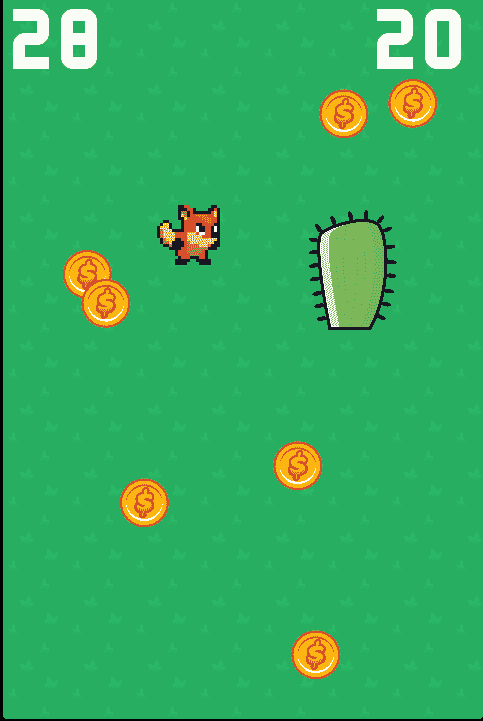

# 项目设置

启动 Godot 并创建一个新的项目，确保使用 `创建文件夹` 按钮来确保此项目的文件将与其他项目分开。你可以在此处下载游戏的艺术和声音（统称为 *assets*）的 Zip 文件，[`github.com/PacktPublishing/Godot-Game-Engine-Projects/releases`](https://github.com/PacktPublishing/Godot-Game-Engine-Projects/releases)。

将此文件解压到你的新项目文件夹中。

在这个项目中，你将制作三个独立的场景：`Player`、`Coin` 和 `HUD`，它们将被组合到游戏的 `Main` 场景中。在一个更大的项目中，创建单独的文件夹来存放每个场景的资源和脚本可能是有用的，但在这个相对较小的游戏中，你可以在根文件夹中保存你的场景和脚本，该文件夹被称为 `res://`（**res** 是 **resource** 的缩写）。你项目中的所有资源都将位于 `res://` 文件夹的相对位置。你可以在左上角的文件系统窗口中查看你的项目文件夹：

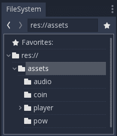

例如，金币的图片将位于 `res://assets/coin/`。

这个游戏将使用竖屏模式，所以你需要调整游戏窗口的大小。点击项目菜单并选择项目设置，如下面的截图所示：

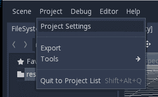

查找显示/窗口部分，并将宽度设置为 `480`，高度设置为 `720`。在此部分中，将拉伸/模式设置为 `2D`，并将纵横比设置为 `保持`。这将确保如果用户调整游戏窗口的大小，所有内容都将适当地缩放，而不会拉伸或变形。如果你喜欢，你也可以取消选中可调整大小的复选框，以防止窗口被完全调整大小。

# 向量和 2D 坐标系

注意：本节是 2D 坐标系统的一个非常简短的概述，并未深入探讨向量数学。它旨在提供一个高级概述，说明此类主题如何应用于 Godot 的游戏开发。向量数学是游戏开发中的一个基本工具，因此如果你需要对该主题有更广泛的理解，请参阅可汗学院的线性代数系列([`www.khanacademy.org/math/linear-algebra`](https://www.khanacademy.org/math/linear-algebra))。

在 2D 空间中工作，你将使用笛卡尔坐标系来识别空间中的位置。2D 空间中的特定位置可以表示为一对值，例如 `(4,3)`，分别代表沿 *x* 轴和 *y* 轴的位置。2D 平面上的任何位置都可以用这种方式描述。

在 2D 空间中，Godot 遵循计算机图形学中常见的做法，将 *x* 轴朝右，*y* 轴朝下：

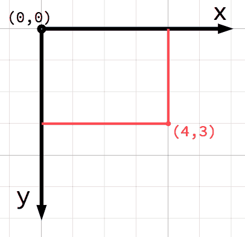

如果你刚开始接触计算机图形学或游戏开发，可能会觉得正 *y* 轴向下而不是向上指似乎很奇怪，因为你可能在学校数学课上学过。然而，这种方向在计算机图形学应用中非常常见。

# 向量

你也可以将位置 `(4, 3)` 视为从 `(0, 0)` 点或原点的一个偏移量，或称为原点。想象一个箭头从原点指向该点：

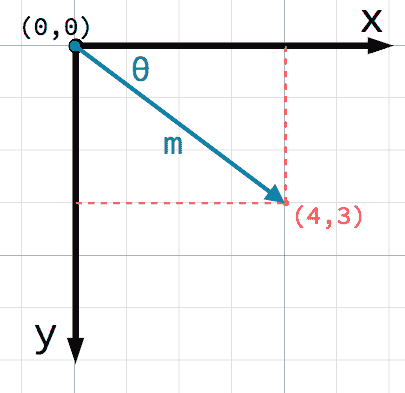

这支箭头是一个 *向量*。它代表了许多有用的信息，包括点的位置，*(4, 3)*，其长度，*m*，以及其与 *x* 轴的夹角，*θ*。总的来说，这是一个 *位置向量*，换句话说，它描述了空间中的位置。向量还可以表示运动、加速度或任何具有 *x* 和 *y* 分量的其他量。

在 Godot 中，向量（对于 2D 是 `Vector2`，对于 3D 是 `Vector3`）被广泛使用，你将在本书构建项目的过程中使用它们。

# 像素渲染

Godot 中的向量坐标是 *浮点数*，而不是 *整数*。这意味着 `Vector2` 可以有一个分数值，例如 `(1.5, 1.5)`。由于对象不能在半像素处绘制，这可能会为想要确保所有纹理像素都被绘制的像素艺术游戏带来视觉问题。

为了解决这个问题，打开项目 *|* 项目设置，在侧边栏中找到 *渲染*/*质量*部分并启用使用像素捕捉，如下面的截图所示：

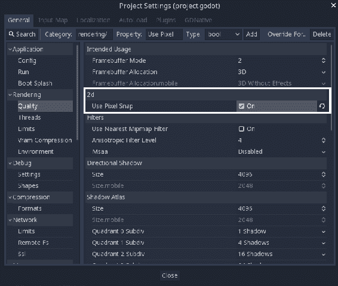

如果你正在游戏中使用 2D 像素艺术，那么在开始项目时始终启用此设置是个好主意。在 3D 游戏中，此设置没有效果。

# 第一部分 – 玩家场景

你将制作的第一个场景定义了玩家对象。创建单独的玩家场景的一个好处是，你可以在创建游戏的其它部分之前独立测试它。随着你的项目规模和复杂性的增长，这种游戏对象的分离将变得越来越有帮助。将单个游戏对象保持独立，使它们更容易调试、修改，甚至完全替换而不影响游戏的其它部分。这也使得你的玩家可重用——你可以将玩家场景放入一个完全不同的游戏中，它将正常工作。

玩家场景将显示你的角色及其动画，通过相应地移动角色来响应用户输入，并检测与游戏中的其他对象的碰撞。

# 创建场景

首先，点击添加/创建新节点按钮并选择 `Area2D`。然后，点击其名称并将其更改为 `Player`。点击场景 | 保存场景以保存场景。这是场景的 *根* 或顶级节点。你将通过向此节点添加子节点来为 `Player` 添加更多功能：

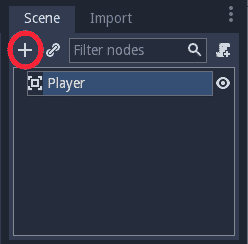

在添加任何子节点之前，确保你不小心通过点击它们来移动或调整它们的大小是一个好主意。选择 `Player` 节点并点击旁边的锁图标：

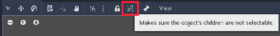

工具提示将说明确保对象的孩子不可选择，如前面的截图所示。

在创建新场景时始终这样做是个好主意。如果一个身体的碰撞形状或精灵偏移或缩放，可能会导致意外的错误并且难以修复。使用此选项，节点及其所有子节点将始终一起移动。

# 精灵动画

使用 `Area2D`，你可以检测其他对象何时与玩家重叠或碰撞，但 `Area2D` 本身没有外观，因此点击 `Player` 节点并添加一个 `AnimatedSprite` 节点作为子节点。`AnimatedSprite` 将处理玩家的外观和动画。注意，节点旁边有一个警告符号。`AnimatedSprite` 需要一个 `SpriteFrames` 资源，其中包含它可以显示的动画。要创建一个，在检查器中找到 Frame*s* 属性并点击 <null> | 新建 SpriteFrames:

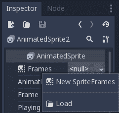

接下来，在相同的位置，点击 <SpriteFrames> 以打开 SpriteFrames 面板：

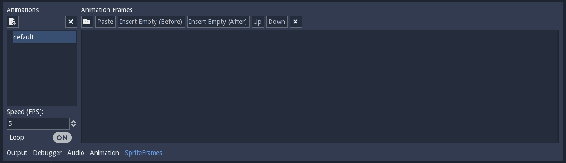

在左侧是一个动画列表。点击默认的动画并将其重命名为 `run`。然后，点击 **添加** 按钮创建第二个名为 `idle` 的动画和第三个名为 `hurt` 的动画。

在左侧的文件系统工具栏中，找到 `run`、`idle` 和 `hurt` 玩家图像并将它们拖入相应的动画：

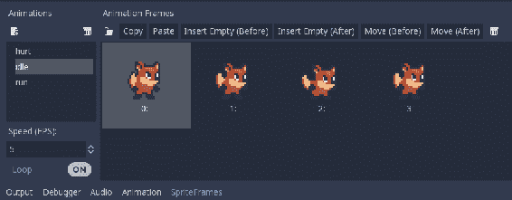

每个动画都有一个默认的速度设置为每秒 5 帧。这有点慢，所以点击每个动画，将速度（FPS）设置为 8。在检查器中，勾选旁边的播放属性，并选择一个动画来查看动画的实际效果：

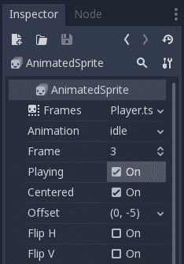

之后，你将编写代码来根据玩家的行为选择这些动画。但首先，你需要完成设置玩家的节点。

# 碰撞形状

当使用`Area2D`或 Godot 中的其他碰撞对象时，它需要定义一个形状，否则它无法检测碰撞。碰撞形状定义了对象占据的区域，并用于检测重叠和/或碰撞。形状由`Shape2D`定义，包括矩形、圆形、多边形和其他类型的形状。

为了方便起见，当你需要向区域或物理体添加形状时，你可以添加一个`CollisionShape2D`作为子节点。然后选择你想要的形状类型，你可以在编辑器中编辑其大小。

将一个`CollisionShape2D`添加为`Player`的子节点（确保不要将其添加为`AnimatedSprite`的子节点）。这将允许你确定玩家的*击打框*，或其碰撞区域的边界。在检查器中，在形状旁边点击<null>并选择新的矩形形状 2D。调整形状的大小以覆盖精灵：

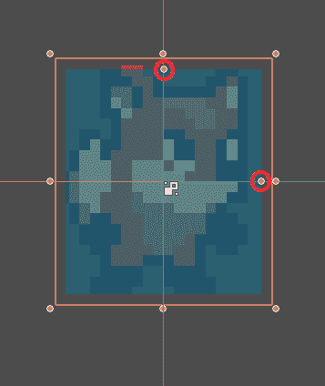

注意不要缩放形状的轮廓！仅使用大小手柄（红色）来调整形状！缩放后的碰撞形状将无法正确工作。

你可能已经注意到碰撞形状没有在精灵上居中。这是因为精灵本身在垂直方向上没有居中。我们可以通过向`AnimatedSprite`添加一个小偏移量来修复这个问题。点击节点，然后在检查器中查找偏移属性。将其设置为`(0, -5)`。

当你完成时，你的`Player`场景应该看起来像这样：

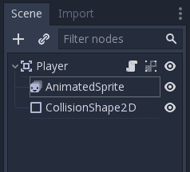

# 编写玩家脚本

现在，你已经准备好添加脚本了。脚本允许你添加内置节点所没有的额外功能。点击`Player`节点，然后点击**添加脚本**按钮：

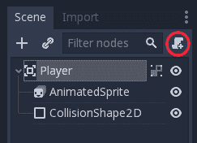

在脚本设置窗口中，你可以保留默认设置不变。如果你记得保存场景（参见前面的截图），脚本将自动命名为与场景名称匹配。点击创建，你将被带到脚本窗口。你的脚本将包含一些默认注释和提示。你可以删除注释（以`#`开头的行）。参考以下代码片段：

```cpp
extends Area2D

# class member variables go here, for example:
# var a = 2
# var b = "textvar"

func _ready():
 # Called every time the node is added to the scene.
 # Initialization here
 pass

#func _process(delta):
# # Called every frame. Delta is time since last frame.
# # Update game logic here.
# pass
```

每个脚本的第 一行将描述它附加到的节点类型。接下来，你将定义你的类变量：

```cpp
extends Area2D

export (int) var speed
var velocity = Vector2()
var screensize = Vector2(480, 720)
```

在 `speed` 变量上使用 `export` 关键字允许你在检查器中设置其值，同时让检查器知道变量应包含的数据类型。这对于你想要能够调整的值非常有用，就像调整节点的内置属性一样。点击 **`Player`** 节点并将速度属性设置为 350，如图所示：

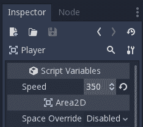

`velocity` 将包含角色的当前移动速度和方向，而 `screensize` 将用于设置玩家的移动限制。稍后，游戏的主场景将设置此变量，但现在你需要手动设置它，以便进行测试。

# 移动玩家

接下来，你将使用 `_process()` 函数来定义玩家将做什么。`_process()` 函数在每一帧都会被调用，所以你会用它来更新你预期会经常更改的游戏元素。你需要玩家做三件事：

+   检查键盘输入

+   按给定方向移动

+   播放适当的动画

首先，你需要检查输入。对于这个游戏，你有四个方向输入需要检查（四个箭头键）。输入操作在项目设置下的输入映射标签中定义。在这个标签中，你可以定义自定义事件并将不同的键、鼠标操作或其他输入分配给它们。默认情况下，Godot 已经将事件分配给了键盘箭头，所以你可以用它们来本项目。

你可以使用 `Input.is_action_pressed()` 来检测是否按下了输入，如果按键被按下则返回 `true`，如果没有则返回 `false`。结合所有四个按钮的状态将给出移动的结果方向。例如，如果你同时按住 `right` 和 `down`，则结果速度向量将是 `(1, 1)`。在这种情况下，因为我们正在将水平和垂直移动相加，所以玩家的移动速度会比仅水平移动时更快。

你可以通过 *归一化* 速度来防止这种情况，这意味着将其长度设置为 **1**，然后乘以期望的速度：

```cpp
func get_input():
    velocity = Vector2()
    if Input.is_action_pressed("ui_left"):
        velocity.x -= 1
    if Input.is_action_pressed("ui_right"):
        velocity.x += 1
    if Input.is_action_pressed("ui_up"):
        velocity.y -= 1
    if Input.is_action_pressed("ui_down"):
        velocity.y += 1
    if velocity.length() > 0:
        velocity = velocity.normalized() * speed
```

通过将所有这些代码组合在 `get_input()` 函数中，你可以更容易地稍后进行更改。例如，你可以决定改为模拟摇杆或其他类型的控制器。从 `_process()` 中调用此函数，然后通过结果速度更改玩家的 `position`。为了防止玩家离开屏幕，你可以使用 `clamp()` 函数将位置限制在最小和最大值之间：

```cpp
func _process(delta):
    get_input()

    position += velocity * delta
    position.x = clamp(position.x, 0, screensize.x)
    position.y = clamp(position.y, 0, screensize.y)
```

点击播放编辑后的场景 (*F6*) 并确认你可以按所有方向在屏幕上移动玩家。

# 关于 delta

`_process()` 函数包含一个名为 `delta` 的参数，该参数随后会乘以速度。`delta` 是什么？

游戏引擎试图以每秒 60 帧的速率运行。然而，这可能会因为 Godot 或计算机本身的减速而改变。如果帧率不恒定，那么它将影响你的游戏对象的移动。例如，考虑一个设置为每帧移动`10`像素的对象。如果一切运行顺利，这将转化为每秒移动`600`像素。然而，如果其中一些帧耗时更长，那么那一秒可能只有 50 帧，因此对象只移动了`500`像素。

Godot，就像大多数游戏引擎和框架一样，通过传递给你`delta`来解决此问题，它是自上一帧以来经过的时间。大多数情况下，这将是大约`0.016`秒（或大约 16 毫秒）。如果你然后将你的期望速度（`600`像素/秒）乘以`delta`，你将得到正好`10`像素的移动。然而，如果`delta`增加到`0.3`，则对象将被移动`18`像素。总的来说，移动速度保持一致，且与帧率无关。

作为一项额外的好处，你可以用 px/s（像素/秒）而不是 px/frame（像素/帧）来表示你的移动，这更容易可视化。

# 选择动画

现在玩家可以移动了，你需要根据玩家是移动还是静止来改变`AnimatedSprite`正在播放的动画。`run`动画的美术面向右侧，这意味着在向左移动时应该水平翻转（使用翻转 H 属性）。将以下代码添加到你的`_process()`函数末尾：

```cpp
    if velocity.length() > 0:
        $AnimatedSprite.animation = "run"
        $AnimatedSprite.flip_h = velocity.x < 0
    else:
        $AnimatedSprite.animation = "idle"
```

注意，这段代码有点捷径。`flip_h`是一个布尔属性，这意味着它可以设置为`true`或`false`。布尔值也是比较操作（如`<`）的结果。正因为如此，我们可以将属性设置为比较的结果。这一行代码相当于以下这样写：

```cpp
if velocity.x < 0:
    $AnimatedSprite.flip_h = true
else:
    $AnimatedSprite.flip_h = false     
```

再次播放场景并检查每种情况下动画是否正确。确保在`AnimatedSprite`中设置“播放”为“开启”，以便动画能够播放。

# 开始和结束玩家的移动

游戏开始时，主场景需要通知玩家游戏已经开始。如下添加`start()`函数，主场景将使用此函数设置玩家的起始动画和位置：

```cpp
func start(pos):
    set_process(true)
    position = pos
    $AnimatedSprite.animation = "idle"
```

当玩家撞到障碍物或用完时间时，将调用`die()`函数：

```cpp
func die():
    $AnimatedSprite.animation = "hurt"
    set_process(false)
```

设置`set_process(false)`会导致此节点不再调用`_process()`函数。这样，当玩家死亡时，他们就不能再通过按键输入进行移动了。

# 准备碰撞

玩家应该能够检测到它击中硬币或障碍物，但您还没有这样做。没关系，因为您可以使用 Godot 的 *信号* 功能来实现这一点。信号是节点发送消息的方式，其他节点可以检测并做出反应。许多节点都有内置的信号，例如在身体碰撞时发出警报，或者在按钮被按下时。您还可以定义用于您自己目的的自定义信号。

通过将它们连接到您想要监听和响应的节点（`node(s)`），使用信号（`Signals`）。这种连接可以在检查器（Inspector）或代码中完成。在项目后期，您将学习如何以这两种方式连接信号。

将以下内容添加到脚本顶部（在 `extends Area2D` 之后）：

```cpp
signal pickup
signal hurt
```

这些定义了当玩家触摸硬币或障碍物时将 *发射*（发送）的自定义信号。触摸将由 `Area2D` 本身检测。选择 `Player` 节点，并点击检查器旁边的节点选项卡，以查看玩家可以发射的信号列表：

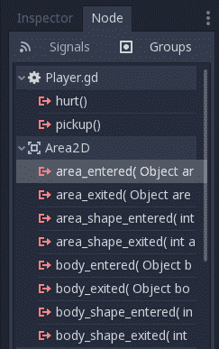

注意您的自定义信号也在那里。由于其他对象也将是 `Area2D` 节点，您想要 `area_entered()` 信号。选择它并点击连接。在连接信号窗口中点击连接，您不需要更改任何设置。Godot 将自动在您的脚本中创建一个名为 `_on_Player_area_entered()` 的新函数。

当连接信号时，您不仅可以让 Godot 为您创建函数，还可以指定您想要将信号链接到的现有函数的名称。如果您不想让 Godot 为您创建函数，请将创建函数开关切换到关闭。

将以下代码添加到这个新函数中：

```cpp
func _on_Player_area_entered( area ):
    if area.is_in_group("coins"):
        area.pickup()
        emit_signal("pickup")
    if area.is_in_group("obstacles"):
        emit_signal("hurt")
        die()
```

当检测到另一个 `Area2D` 时，它将被传递到函数中（使用 `area` 变量）。硬币对象将有一个 `pickup()` 函数，该函数定义了捡起硬币时的行为（例如播放动画或声音）。当您创建硬币和障碍物时，您将将它们分配到适当的 *组*，以便可以检测到它们。

总结一下，到目前为止的完整玩家脚本如下：

```cpp
extends Area2D

signal pickup
signal hurt

export (int) var speed
var velocity = Vector2()
var screensize = Vector2(480, 720)

func get_input():
    velocity = Vector2()
    if Input.is_action_pressed("ui_left"):
        velocity.x -= 1
    if Input.is_action_pressed("ui_right"):
        velocity.x += 1
    if Input.is_action_pressed("ui_up"):
        velocity.y -= 1
    if Input.is_action_pressed("ui_down"):
        velocity.y += 1
    if velocity.length() > 0:
        velocity = velocity.normalized() * speed

func _process(delta):
    get_input()
    position += velocity * delta
    position.x = clamp(position.x, 0, screensize.x)
    position.y = clamp(position.y, 0, screensize.y)

    if velocity.length() > 0:
        $AnimatedSprite.animation = "run"
        $AnimatedSprite.flip_h = velocity.x < 0
    else:
        $AnimatedSprite.animation = "idle"

func start(pos):
    set_process(true)
    position = pos
    $AnimatedSprite.animation = "idle"

func die():
    $AnimatedSprite.animation = "hurt"
    set_process(false)

func _on_Player_area_entered( area ):
    if area.is_in_group("coins"):
        area.pickup()
        emit_signal("pickup")
    if area.is_in_group("obstacles"):
        emit_signal("hurt")
        die()
```

# 第二部分 – 硬币场景

在这部分，您将为玩家收集硬币创建硬币。这将是一个单独的场景，描述单个硬币的所有属性和行为。一旦保存，主场景将加载硬币场景并创建多个 *实例*（即副本）。

# 节点设置

点击“场景”|“新建场景”并添加以下节点。不要忘记将子节点设置为未选中，就像您在 `Player` 场景中所做的那样：

+   `Area2D` (命名为 `Coin`)

+   `AnimatedSprite`

+   `CollisionShape2D`

确保在添加节点后保存场景。

按照你在玩家场景中设置 `AnimatedSprite` 的方式设置。这次，你只有一个动画：一个使硬币看起来不那么扁平和无趣的闪耀/闪光效果。添加所有帧并将速度（FPS）设置为 `12`。图像有点太大，所以将 `AnimatedSprite` 的缩放设置为 (`0.5`, `0.5`)。在 `CollisionShape2D` 中使用 `CircleShape2D` 并将其大小调整到覆盖硬币图像。别忘了：在调整碰撞形状的大小时，永远不要使用缩放手柄。圆形形状有一个单独的手柄，用于调整圆的半径。

# 使用组

组为节点提供了一种标记系统，允许你识别相似的节点。一个节点可以属于任意数量的组。你需要确保所有硬币都将位于一个名为 `coins` 的组中，以便玩家脚本能够正确地响应触摸硬币。选择 `Coin` 节点并点击节点选项卡（与找到信号相同的选项卡）并选择组。在框中输入 `coins` 并点击添加，如图所示：

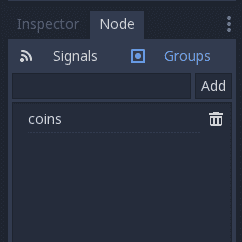

# 脚本

接下来，向 `Coin` 节点添加一个脚本。如果你在模板设置中选择空，Godot 将创建一个没有注释或建议的空脚本。硬币脚本的代码比玩家脚本的代码要短得多：

```cpp
extends Area2D

func pickup():
    queue_free()
```

`pickup()` 函数由玩家脚本调用，告诉硬币在被收集时要执行什么操作。`queue_free()` 是 Godot 的节点移除方法。它安全地从树中移除节点，并将其及其所有子节点从内存中删除。稍后，你将在这里添加一个视觉效果，但现在硬币消失的效果已经足够好。

`queue_free()` 并不会立即删除对象，而是将其添加到一个队列中，在当前帧结束时进行删除。这比立即删除节点更安全，因为游戏中运行的其他代码可能仍然需要该节点存在。通过等待到帧的末尾，Godot 可以确保所有可能访问该节点的代码都已完成，节点可以安全地被移除。

# 第三部分 – 主场景

`Main` 场景是连接游戏所有部件的纽带。它将管理玩家、硬币、计时器和游戏的其他部分。

# 节点设置

创建一个新的场景并添加一个名为 `Main` 的节点。要将玩家添加到场景中，点击实例按钮并选择你保存的 `Player.tscn`：

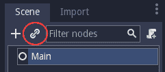

现在，将以下节点作为 `Main` 的子节点添加，并按以下命名：

+   `TextureRect`（命名为 `Background`）——用于背景图像

+   `Node`（命名为 `CoinContainer`）——用于存放所有硬币

+   `Position2D`（命名为 `PlayerStart`）——用于标记 `Player` 的起始位置

+   `Timer`（命名为 `GameTimer`）——用于跟踪时间限制

确保将 `Background` 作为第一个子节点。节点是按照显示的顺序绘制的，所以在这种情况下，背景将在玩家 *后面*。通过将 `assets` 文件夹中的 `grass.png` 图像拖动到 `Background` 节点的 `Texture` 属性中，向 `Background` 节点添加一个图像。然后将拉伸模式更改为平铺，然后点击布局 | 全矩形以将框架的大小调整为屏幕大小，如下面的截图所示：

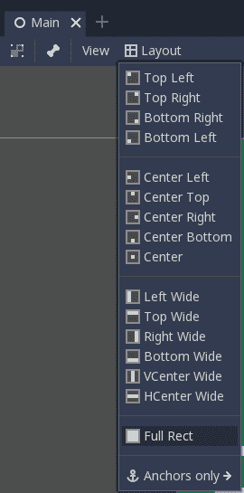

将 `PlayerStart` 节点的位置设置为 (`240`, `350`)。

你的场景布局应该看起来像这样：

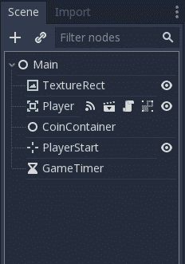

# 主脚本

将脚本添加到 `Main` 节点（使用空模板）并添加以下变量：

```cpp
extends Node

export (PackedScene) var Coin
export (int) var playtime

var level
var score
var time_left
var screensize
var playing = false
```

当你点击 `Main` 时，`Coin` 和 `Playtime` 属性将现在出现在检查器中。从文件系统面板拖动 `Coin.tscn` 到 `Coin` 属性中。将 `Playtime` 设置为 `30`（这是游戏将持续的时间）。剩余的变量将在代码的后续部分使用。

# 初始化

接下来，添加 `_ready()` 函数：

```cpp
func _ready():
    randomize()
    screensize = get_viewport().get_visible_rect().size
    $Player.screensize = screensize
    $Player.hide()
```

在 GDScript 中，你可以使用 `$` 来通过名称引用特定的节点。这允许你找到屏幕的大小并将其分配给玩家的 `screensize` 变量。`hide()` 使玩家一开始是不可见的（你将在游戏真正开始时让它们出现）。

在 `$` 表示法中，节点名称相对于运行脚本的节点。例如，`$Node1/Node2` 将引用一个节点（`Node2`），它是 `Node1` 的子节点，而 `Node1` 本身又是当前运行脚本的子节点。Godot 的自动完成功能将在你键入时建议树中的节点名称。请注意，如果节点的名称包含空格，你必须将其放在引号内，例如，`$"My Node"`。

如果你想要每次运行场景时“随机”数字序列都不同，你必须使用 `randomize()`。从技术上讲，这为随机数生成器选择了一个随机的 *种子*。

# 开始新游戏

接下来，`new_game()` 函数将为新游戏初始化一切：

```cpp
func new_game():
    playing = true
    level = 1
    score = 0
    time_left = playtime
    $Player.start($PlayerStart.position)
    $Player.show()
    $GameTimer.start()
    spawn_coins()
```

除了将变量设置为它们的初始值外，此函数还调用玩家的 `start()` 函数以确保它移动到正确的起始位置。游戏计时器开始，这将计算游戏剩余的时间。

你还需要一个函数来根据当前等级创建一定数量的硬币：

```cpp
func spawn_coins():
    for i in range(4 + level):
        var c = Coin.instance()
        $CoinContainer.add_child(c)
        c.screensize = screensize
        c.position = Vector2(rand_range(0, screensize.x),
        rand_range(0, screensize.y))
```

在此函数中，你创建了 `Coin` 对象的多个实例（这次是通过代码，而不是通过点击实例化场景按钮），并将其添加为 `CoinContainer` 的子节点。每次实例化一个新节点时，都必须使用 `add_child()` 将其添加到树中。最后，你为硬币随机选择一个出现的位置。你将在每个级别的开始时调用此函数，每次生成更多的硬币。

最终，你希望当玩家点击开始按钮时调用`new_game()`。现在，为了测试一切是否正常工作，将`new_game()`添加到你的`_ready()`函数末尾，并点击“播放项目”（*F5*）。当你被提示选择主场景时，选择`Main.tscn`。现在，每次你播放项目时，`Main`场景都将启动。

到目前为止，你应该在屏幕上看到玩家和五个硬币。当玩家触摸一个硬币时，它会消失。

# 检查剩余硬币

主脚本需要检测玩家是否已经捡起所有硬币。由于所有硬币都是`CoinCointainer`的子节点，你可以使用此节点上的`get_child_count()`来找出剩余多少个硬币。将此代码放入`_process()`函数中，以便每帧都进行检查：

```cpp
func _process(delta):
    if playing and $CoinContainer.get_child_count() == 0:
        level += 1
        time_left += 5
        spawn_coins()
```

如果没有更多硬币剩余，则玩家将进入下一级。

# 第四部分 – 用户界面

游戏需要的最后一部分是**用户界面**（**UI**）。这是在游戏过程中显示玩家需要看到的信息的界面。在游戏中，这也被称为**抬头显示**（**HUD**），因为信息以叠加的形式显示在游戏视图之上。你还将使用此场景来显示开始按钮。

HUD 将显示以下信息：

+   分数

+   剩余时间

+   一条消息，例如游戏结束

+   一个开始按钮

# 节点设置

创建一个新的场景，并添加一个名为`HUD`的`CanvasLayer`节点。`CanvasLayer`节点允许你在游戏之上的一个层上绘制 UI 元素，这样显示的信息就不会被玩家或硬币等游戏元素覆盖。

Godot 提供了各种 UI 元素，可用于创建从健康条等指示器到复杂界面如存货界面等任何内容。实际上，你用来制作游戏的 Godot 编辑器就是使用这些元素构建的。UI 元素的基本节点是从`Control`扩展的，并在节点列表中以绿色图标显示。要创建你的 UI，你将使用各种`Control`节点来定位、格式化和显示信息。以下是完成后的`HUD`的外观：

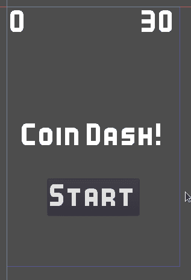

# 锚点和边距

控制节点具有位置和大小，但它们还具有称为**锚点**和**边距**的属性。锚点定义了节点边缘相对于父容器的起点或参考点。边距表示控制节点边缘与其对应锚点之间的距离。当你移动或调整控制节点的大小时，边距会自动更新。

# 消息标签

在场景中添加一个`Label`节点，并将其名称更改为`MessageLabel`**。** 此标签将显示游戏标题，以及游戏结束时显示“游戏结束”。此标签应位于游戏屏幕中央。你可以用鼠标拖动它，但为了精确放置 UI 元素，你应该使用锚点属性。

选择视图 | 显示辅助工具以显示将帮助您看到锚点位置的销钉，然后点击布局菜单并选择 HCenter Wide：

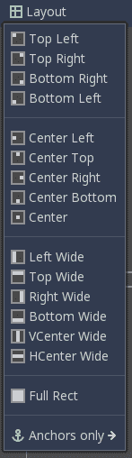

`MessageLabel` 现在横跨屏幕宽度并垂直居中。检查器中的 Text 属性设置标签显示的文本。将其设置为 Coin Dash! 并将 Align 和 Valign 设置为 Center。

`Label` 节点的默认字体非常小，所以下一步是为它分配一个自定义字体。在检查器中向下滚动到 Custom Fonts 部分，选择 New DynamicFont，如图下所示：

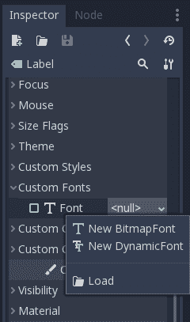

现在，点击 DynamicFont 并可以调整字体设置。从 FileSystem 面板，拖动 `Kenney Bold.ttf` 字体并将其放入 Font Dataproperty 中。将 Size 设置为 **`48`**，如图下所示：

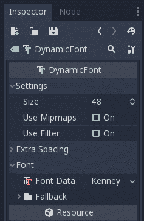

# 分数和时间显示

`HUD` 的顶部将显示玩家的分数和时钟剩余时间。这两个都将使用 `Label` 节点，并安排在游戏屏幕的相对两侧。您不会单独定位它们，而是会使用 `Container` 节点来管理它们的位置。

# 容器

UI 容器会自动排列其子 `Control` 节点（包括其他 `Containers`）的位置。您可以使用它们为元素添加填充、居中元素或按行或列排列元素。每种类型的 `Container` 都有特殊的属性来控制它们如何排列子元素。您可以在检查器的 Custom Constants 部分看到这些属性。

记住容器会 **自动** 安排其子元素。如果您移动或调整 `Container` 节点内部的控件的大小，您会发现它自动回到原始位置。您可以手动排列控件或使用容器排列控件，但不能同时进行。

要管理分数和时间标签，向 `HUD` 中添加一个 **`MarginContainer`** 节点。使用布局菜单设置锚点为 Top Wide。在 Custom Constants 部分，将 Margin Right、Margin Top 和 Margin Left 设置为 `10`。这将添加一些填充，以便文本不会紧贴屏幕边缘。

由于分数和时间标签将使用与 `MessageLabel` 相同的字体设置，因此复制它将节省时间。点击 `MessageLabel` 并按 *Ctrl* + *D* (*Cmd* + *D* 在 macOS 上) 两次以创建两个副本标签。将它们都拖动并放在 `MarginContainer` 上，使它们成为其子元素。将一个命名为 `ScoreLabel`，另一个命名为 `TimeLabel`，并将 Text 属性都设置为 `0`。将 `ScoreLabel` 的 Align 设置为 Left，将 `TimeLabel` 的 Align 设置为 **`Right`**。

# 通过 GDScript 更新 UI

将脚本添加到 `HUD` 节点。此脚本将在需要更改属性时更新 UI 元素，例如，每当收集到硬币时更新分数文本。请参考以下代码：

```cpp
extends CanvasLayer

signal start_game

func update_score(value):
    $MarginContainer/ScoreLabel.text = str(value)

func update_timer(value):
    $MarginContainer/TimeLabel.txt = str(value)
```

`Main`场景的脚本将在值发生变化时调用这些函数来更新显示。对于`MessageLabel`，你还需要一个计时器，以便在短时间内消失。添加一个`Timer`节点并将其名称更改为`MessageTimer`**。**在检查器中，将其等待时间设置为`2`秒并勾选设置单次运行的复选框。这确保了当启动时，计时器只会运行一次，而不是重复。添加以下代码：

```cpp
func show_message(text):
    $MessageLabel.text = text
    $MessageLabel.show()
    $MessageTimer.start()
```

在这个函数中，你显示消息并启动计时器。要隐藏消息，连接`MessageTimer`的`timeout()`信号并添加以下内容：

```cpp
func _on_MessageTimer_timeout():
    $MessageLabel.hide()
```

# 使用按钮

添加一个`Button`节点，并将其名称更改为`StartButton`**。**这个按钮将在游戏开始前显示，点击后它会隐藏自己并向`Main`场景发送一个开始游戏的信号。将文本属性设置为开始，并更改自定义字体，就像你之前对**`MessageLabel`**所做的那样。在布局菜单中，选择中心底部。这将把按钮放在屏幕的底部，所以你可以通过按*向上*箭头键或通过编辑边距并将顶部设置为`-150`和底部设置为`-50`来稍微向上移动它。

当按钮被点击时，会发出一个信号。在`StartButton`的节点选项卡中，连接`pressed()`信号：

```cpp
func _on_StartButton_pressed():
    $StartButton.hide()
    $MessageLabel.hide()
    emit_signal("start_game")
```

`HUD`发出`start_game`信号以通知`Main`现在是时候开始新游戏了。

# 游戏结束

你 UI 的最终任务是响应游戏结束：

```cpp
func show_game_over():
    show_message("Game Over")
    yield($MessageTimer, "timeout")
    $StartButton.show()
    $MessageLabel.text = "Coin Dash!"
    $MessageLabel.show()
```

在这个函数中，你需要让游戏结束消息显示两秒钟然后消失，这正是`show_message()`所做的事情。然而，你希望在消息消失后显示开始按钮。`yield()`函数暂停函数的执行，直到给定的节点（`MessageTimer`）发出给定的信号（`timeout`）。一旦接收到信号，函数将继续，返回到初始状态，这样你就可以再次开始游戏。

# 将 HUD 添加到 Main

现在，你需要设置`Main`场景和`HUD`之间的通信。将`HUD`场景的一个实例添加到`Main`场景中。在`Main`场景中，连接`GameTimer`的`timeout()`信号并添加以下内容：

```cpp
func _on_GameTimer_timeout():
    time_left -= 1
    $HUD.update_timer(time_left)
    if time_left <= 0:
        game_over()
```

每次当`GameTimer`计时器超时（每秒一次），剩余时间会减少。

接下来，连接`Player`的`pickup()`和`hurt()`信号：

```cpp
func _on_Player_pickup():
    score += 1
    $HUD.update_score(score)

func _on_Player_hurt():
    game_over()
```

游戏结束时需要发生几件事情，因此添加以下函数：

```cpp
func game_over():
    playing = false
    $GameTimer.stop()
    for coin in $CoinContainer.get_children():
        coin.queue_free()
    $HUD.show_game_over()
    $Player.die()
```

这个函数会暂停游戏，并遍历硬币，移除任何剩余的硬币，同时调用`HUD`的`show_game_over()`函数。

最后，`StartButton`需要激活`new_game()`函数。点击`HUD`实例并选择其`new_game()`信号。在信号连接对话框中，点击将函数设置为关闭，并在方法节点字段中输入`new_game`。这将连接信号到现有函数而不是创建一个新的函数。查看以下截图：

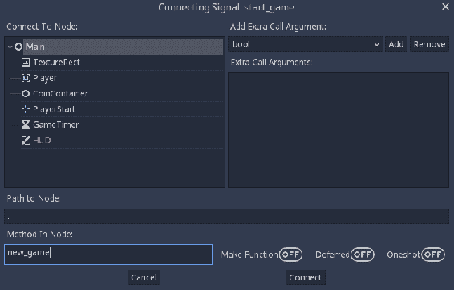

从 `_ready()` 函数中删除 `new_game()` 并将这两行添加到 `new_game()` 函数中：

```cpp
$HUD.update_score(score)
$HUD.update_timer(time_left)
```

现在，你可以玩游戏了！确认所有部分都按预期工作：得分、倒计时、游戏结束和重新开始等。如果你发现某个部分没有正常工作，请返回并检查创建它的步骤，以及将其连接到游戏其他部分的步骤。

# 第五部分 – 完成工作

你已经创建了一个可以工作的游戏，但它仍然可以变得更加有趣。游戏开发者使用术语 *juice* 来描述使游戏玩起来感觉良好的因素。juice 可以包括声音、视觉效果或任何其他增加玩家享受的东西，而无需改变游戏玩法本身。

在本节中，你将添加一些小的 *juicy* 功能来完成游戏。

# 视觉效果

当你捡起硬币时，它们会直接消失，这并不很有吸引力。添加视觉效果会让收集大量硬币的过程更加令人满意。

首先向 `Coin` 场景添加一个 `Tween` 节点。

# 什么是 tween？

**tween** 是一种在特定函数的作用下，随时间逐渐改变（从起始值到结束值）某些值的方法。例如，你可能选择一个稳定改变值或开始慢但逐渐加速的函数。tweening 也被称为 *easing*。

在 Godot 中使用 `Tween` 节点时，你可以将其分配给改变一个或多个节点的属性。在这种情况下，你将增加硬币的 `Scale`，并使用 `Modulate` 属性使其淡出。

将此行添加到 `Coin` 的 `_ready()` 函数中：

```cpp
$Tween.interpolate_property($AnimatedSprite, 'scale',
                            $AnimatedSprite.scale,
                            $AnimatedSprite.scale * 3, 0.3,
                            Tween.TRANS_QUAD,
                            Tween.EASE_IN_OUT)
```

`interpolate_property()` 函数会导致 `Tween` 改变节点的属性。共有七个参数：

+   要影响的节点

+   要更改的属性

+   属性的起始值

+   属性的结束值

+   持续时间（以秒为单位）

+   要使用的函数

+   方向

当玩家捡起硬币时，tween 应该开始播放。在 `pickup()` 函数中替换 `queue_free()`：

```cpp
func pickup():
    monitoring = false
    $Tween.start() 
```

将 `monitoring` 设置为 `false` 确保在动画过程中玩家触摸硬币时不会发出 `area_enter()` 信号。

最后，当动画结束时应该删除硬币，因此连接 `Tween` 节点的 `tween_completed()` 信号：

```cpp
func _on_Tween_tween_completed(object, key):
    queue_free()
```

现在，当你运行游戏时，你应该看到捡起硬币时硬币会变大。这是好的，但将 tween 应用到多个属性同时时效果更佳。你可以添加另一个 `interpolate_property()`，这次用于改变精灵的不透明度。这是通过改变 `modulate` 属性实现的，它是一个 `Color` 对象，并改变其 alpha 通道从 `1`（不透明）到 `0`（透明）。请参考以下代码：

```cpp
$Tween.interpolate_property($AnimatedSprite, 'modulate', 
                            Color(1, 1, 1, 1),
                            Color(1, 1, 1, 0), 0.3,
                            Tween.TRANS_QUAD,
                            Tween.EASE_IN_OUT)
```

# 声音

声音是游戏设计中最重要的但经常被忽视的部分之一。良好的声音设计可以在非常小的努力下为你的游戏增添大量活力。声音可以给玩家反馈，将他们与角色情感上联系起来，甚至可以是游戏玩法的一部分。

对于这个游戏，你将添加三个声音效果。在 `Main` 场景中，添加三个 `AudioStreamPlayer` 节点，并分别命名为 `CoinSound`、`LevelSound` 和 `EndSound`。将每个声音从 `audio` 文件夹（你可以在 FileSystem 浮动窗口下的 `assets` 中找到）拖动到每个节点的相应流属性中。

要播放声音，你可以在其上调用 `play()` 函数。将 `$CoinSound.play()` 添加到 `_on_Player_pickup()` 函数中，将 `$EndSound.play()` 添加到 `game_over()` 函数中，并将 `$LevelSound.play()` 添加到 `spawn_coins()` 函数中。

# 提升物品

对于给玩家带来小优势或提升的物体，有很多可能性。在本节中，你将添加一个提升物品，当收集时会给玩家带来一小段时间加成。它将偶尔短暂出现，然后消失。

新场景将与你已经创建的 `Coin` 场景非常相似，因此点击你的 `Coin` 场景，选择 Scene | Save Scene As 并将其保存为 `Powerup.tscn`。将根节点名称更改为 Powerup，并通过点击清除脚本按钮移除脚本：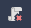。你还应该断开 `area_entered` 信号（你稍后会重新连接它）。在 Groups 选项卡中，通过点击删除按钮（看起来像垃圾桶）将硬币组移除，并将其添加到名为 `powerups` 的新组中。

在 `AnimatedSprite` 中，将硬币的图像更改为提升物品，你可以在 `res://assets/pow/` 文件夹中找到它。

点击添加新脚本，并从 `Coin.gd` 脚本中复制代码。将 `_on_Coin_area_entered` 的名称更改为 `_on_Powerup_area_entered`，并将其再次连接到 `area_entered` 信号。记住，这个函数名称将由信号连接窗口自动选择。

接下来，添加一个名为 `Lifetime` 的 `Timer` 节点。这将限制对象在屏幕上停留的时间。将其等待时间设置为 `2`，并将单次触发和自动启动都设置为 `开启`。连接其超时信号，以便在时间结束时将其移除：

```cpp
func _on_Lifetime_timeout():
    queue_free()
```

现在，转到你的主场景，并添加另一个名为 `PowerupTimer` 的 `Timer` 节点。将其单次触发属性设置为开启。在 `audio` 文件夹中还有一个 `Powerup.wav` 声音，你可以通过另一个 `AudioStreamPlayer` 添加。

连接 `timeout` 信号，并添加以下代码以生成 `Powerup`：

```cpp
func _on_PowerupTimer_timeout():
    var p = Powerup.instance()
    add_child(p)
    p.screensize = screensize
    p.position = Vector2(rand_range(0, screensize.x),
                         rand_range(0, screensize.y))
```

`Powerup` 场景需要通过添加变量，然后将场景拖动到检查器中的属性来链接，就像你之前对 `Coin` 场景所做的那样：

```cpp
export (PackedScene) var Powerup
```

道具应该以不可预测的方式出现，因此 `PowerupTimer` 的等待时间需要在开始新关卡时设置。在 `spawn_coins()` 创建新硬币后，将以下内容添加到 `_process()` 函数中：

```cpp
$PowerupTimer.wait_time = rand_range(5, 10)
$PowerupTimer.start()
```

现在你将会有道具出现，最后一步是在收集到一个道具时给玩家一些额外的时间。目前，玩家脚本假设它遇到的是硬币或障碍物。将 `Player.gd` 中的代码更改以检查被击中的对象类型：

```cpp
func _on_Player_area_entered( area ):
    if area.is_in_group("coins"):
        area.pickup()
        emit_signal("pickup", "coin")
    if area.is_in_group("powerups"):
        area.pickup()
        emit_signal("pickup", "powerup")
    if area.is_in_group("obstacles"):
        emit_signal("hurt")
        die()
```

注意，现在你正在使用一个额外的参数发射拾取信号，指定对象的类型。`Main.gd` 中的相应函数现在可以接受该参数，并使用 `match` 语句来决定采取什么行动：

```cpp
func _on_Player_pickup(type):
    match type:
        "coin":
            score += 1
            $CoinSound.play()
            $HUD.update_score(score)
        "powerup":
            time_left += 5
            $PowerupSound.play()
            $HUD.update_timer(time_left)
```

`match` 语句是 `if` 语句的有用替代品，尤其是在你需要测试大量可能值时。

尝试运行游戏并收集道具。确保声音播放并且计时器增加五秒钟。

# 硬币动画

当你创建 `Coin` 场景时，添加了一个 `AnimatedSprite`，但它还没有播放。硬币动画显示一个在硬币表面移动的 *闪烁* 效果。如果所有硬币同时显示这种效果，看起来会过于规律，因此每个硬币的动画都需要一个小的随机延迟。

首先，点击 `AnimatedSprite`，然后点击 *Frames* 资源。确保 Loop 设置为 Off，并且 Speed 设置为 `12`。

在 `Coin` 场景中添加一个 `Timer` 节点，并将以下代码添加到 `_ready()` 中：

```cpp
$Timer.wait_time = rand_range(3, 8)
$Timer.start()
```

现在，将 `Timer` 的 `timeout()` 信号连接起来，并添加以下内容：

```cpp
func _on_Timer_timeout():
    $AnimatedSprite.frame = 0
    $AnimatedSprite.play()
```

尝试运行游戏并观察硬币的动画效果。只需付出极小的努力，就能获得一个不错的视觉效果。你会在专业游戏中发现很多类似的效果。虽然这些效果非常微妙，但视觉吸引力使得游戏体验更加愉悦。

前面的 `Powerup` 对象具有类似的动画，你可以以相同的方式添加。

# 障碍物

最后，通过引入玩家必须避免的障碍物，可以使游戏更具挑战性。触摸障碍物将结束游戏。

为仙人掌创建一个新的场景，并添加以下节点：

+   `Area2D` (命名为 `Cactus`)

+   `Sprite`

+   `CollisionShape2D`

将仙人掌纹理从 FileSystem 选项卡拖动到 `Sprite` 的 Texture 属性。将 `RectangleShape2D` 添加到碰撞形状中，并调整大小以覆盖图像。记得你在玩家脚本中添加了 `if area.is_in_group("obstacles")` 吗？使用节点选项卡（在检查器旁边）将 `Cactus` 身体添加到 `obstacles` 组。

现在，将 `Cactus` 实例添加到 `Main` 场景中，并将其移动到屏幕上半部分的一个位置（远离玩家出生点）。运行游戏并观察当你撞到仙人掌时会发生什么。

你可能已经发现了一个问题：硬币可能会在仙人掌后面生成，这使得它们无法被捡起。当硬币放置时，如果它检测到与障碍物重叠，它需要移动。将硬币的 `area_entered()` 信号连接起来并添加以下内容：

```cpp
func _on_Coin_area_entered( area ):
    if area.is_in_group("obstacles"):
        position = Vector2(rand_range(0, screensize.x), rand_range(0, screensize.y))
```

如果你已经添加了前面的 `Powerup` 对象，你还需要对其 `area_entered` 信号做同样的处理。

# 摘要

在本章中，你通过创建一个基本的 2D 游戏学习了 Godot 引擎的基础知识。你设置了项目并创建了多个场景，与精灵和动画工作，捕捉用户输入，使用 *信号* 与事件通信，并使用 **Control** 节点创建用户界面。在这里学到的技能是你在任何 Godot 项目中都会用到的关键技能。

在进入下一章之前，查看一下项目。你是否理解每个节点的作用？是否有你不理解的代码片段？如果是这样，请返回并复习该章节的相关部分。

此外，请随意尝试游戏并改变一些东西。了解游戏不同部分如何工作的最佳方法之一就是改变它们并观察会发生什么。

在下一章中，你将探索 Godot 的更多功能，并通过构建一个更复杂的游戏来学习如何使用更多节点类型。
