# 第六章：3D 迷你高尔夫

这本书中之前的 projekty 都是设计在 2D 空间中的。这是故意的，为了在保持项目范围有限的同时介绍 Godot 的各种功能和概念。在本章中，你将进入游戏开发的 3D 方面。对于一些人来说，3D 开发感觉管理起来要困难得多；对于其他人来说，它更直接。无论如何，你确实需要理解一个额外的复杂层。

如果你以前从未使用过任何类型的 3D 软件，你可能会发现自己遇到了许多新概念。本章将尽可能多地解释它们，但请记住，当你需要更深入理解特定主题时，要参考 Godot 文档。

本章中你要制作的游戏被称为**迷你高尔夫**。它将包括一个小型可定制的球场、一个球和一个瞄准并射击球入洞的界面。

这就是本章你要学习的内容：

+   导航 Godot 的 3D 编辑器

+   空间节点及其属性

+   导入 3D 网格和使用 3D 碰撞形状

+   如何使用 3D 相机，包括静止和移动的

+   使用 GridMap 放置你的高尔夫球场瓷砖

+   设置灯光和环境

+   PBR 渲染和材质的介绍

但首先，这里是对 Godot 中 3D 的简要介绍。

# 3D 简介

Godot 的一个优势是它能够处理 2D 和 3D 游戏。虽然你在这本书中早期学到的许多内容在 3D 中同样适用（节点、场景、信号等），但从 2D 转换为 3D 会带来一个全新的复杂性和功能层。首先，你会发现 3D 编辑器窗口中有一些额外的功能可用，熟悉如何在 3D 编辑器窗口中导航是个好主意。

# 在 3D 空间中定位

当你在编辑器窗口顶部的 3D 按钮上点击时，你会看到 3D 项目视图：


你首先应该注意到的中心的三条彩色线条。这些是*x*（红色）、*y*（绿色）和*z*（蓝色）轴。它们相交的点就是原点，其坐标为`(0, 0, 0)`。

正如你使用`Vector2(x, y)`来表示二维空间中的位置一样，`Vector3(x, y, z)`描述了沿着这三个轴的三维空间中的位置。

在 3D 工作中出现的一个问题是，不同的应用程序使用不同的惯例来表示方向。Godot 使用 Y-Up 方向，所以当你观察轴时，如果*x*指向左/右，那么*y*就是上/下，而*z*是前/后。你可能会发现当使用其他流行的 3D 软件时，它们使用 Z-Up。了解这一点是好的，因为它可以在不同程序之间移动时导致混淆。

另一个需要注意的重要方面是度量单位。在 2D 中，所有内容都以像素为单位进行度量，这在屏幕上绘制时是一个自然的度量基础。然而，当在 3D 空间中工作时，像素并不太有用。两个大小完全相同的对象，根据它们与相机的距离不同，将在屏幕上占据不同的区域（关于相机的更多信息即将揭晓）。因此，在 Godot 的 3D 空间中，所有对象都使用通用单位进行度量。您可以自由地称这些单位为米、英寸，甚至光年，具体取决于您游戏世界的规模。

# Godot 的 3D 编辑器

在开始使用 3D 之前，简要回顾一下如何在 Godot 的 3D 空间中导航将很有用。相机由鼠标和键盘控制：

+   鼠标滚轮上下：缩放进/出

+   中间按钮 + 拖动：围绕当前目标旋转相机

+   *Shift* + 中间按钮 + 拖动：上下/左右平移相机

+   右键点击 + 拖动：在当前位置旋转相机

如果您熟悉流行的 3D 游戏，如 *Minecraft*，您可以按 *Shift* + *F* 切换到 Freelook 模式。在此模式下，您可以使用 WASD 键在场景中 *飞行*，同时用鼠标瞄准。再次按 *Shift* + *F* 退出 Freelook 模式。

您还可以通过点击左上角的 [视角] 标签来改变相机的视图。在这里，您可以快速将相机定位到特定的方向，如俯视图或前视图：


这在结合使用多个视口时，尤其是在大屏幕上特别有用。点击视图菜单，可以将屏幕分割成多个空间视图，让您能够同时从各个侧面看到对象。

注意，这些菜单选项中的每一个都关联了一个键盘快捷键。您可以通过点击编辑器 *|* 编辑器设置 *|* 3D 来调整 3D 导航和快捷键，以满足您的喜好。


当使用多个视口时，每个视口都可以设置为不同的视角，这样您就可以同时从多个方向看到您动作的效果：

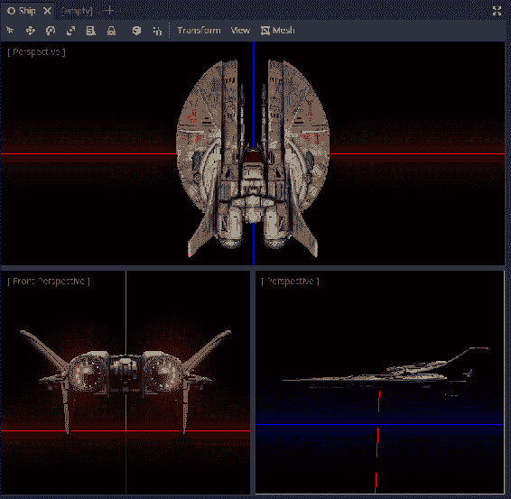

# 添加 3D 对象

是时候添加您的第一个 3D 节点了。就像所有 2D 节点都继承自 `Node2D`，它提供了如 `position` 和 `rotation` 等属性一样，3D 节点继承自 `Spatial` 节点。将一个添加到场景中，您将看到以下内容：

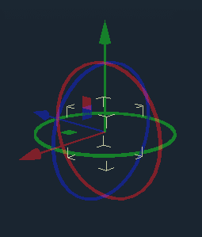

你看到的那个五彩斑斓的对象不是节点，而是一个 3D *工具*。工具是允许你在空间中移动和旋转对象的工具。三个环控制旋转，而三个箭头沿着三个轴移动（平移）对象。注意，环和箭头是按照轴的颜色进行编码的。箭头沿着相应的轴移动对象，而环则围绕特定的轴旋转对象。还有三个小方块可以锁定一个轴，并允许你在单个平面上移动对象。

花几分钟时间实验并熟悉工具。如果你发现自己迷路了，请使用撤销。

有时候，工具会碍事。你可以点击模式图标来限制自己只进行一种变换：移动、旋转或缩放：


*Q*、*W*、*E*和*R*键是这些按钮的快捷键，允许快速在模式之间切换。

# 全局空间与本地空间

默认情况下，工具控制操作在全局空间中。尝试旋转对象。无论你怎么转，工具的移动箭头仍然沿着轴指向。现在尝试这样做：将`Spatial`节点放回其原始位置和方向（或者删除它并添加一个新的）。围绕一个轴旋转对象，然后点击本地空间模式（T）按钮：


观察一下工具箭头的位置。现在它们指向的是*对象*的本地*x*、*y*、*z*轴，而不是世界轴。当你点击并拖动它们时，它们会相对于轴移动对象。在这两种模式之间切换可以使你更容易将对象放置到你想要的位置。

# 变换

查看你的`Spatial`节点的检查器。现在你有了平移、旋转度数以及缩放，而不是位置属性。当你移动对象时，观察这些值是如何变化的。请注意，平移表示对象相对于原点的坐标：

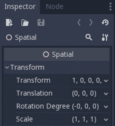

你还会注意到一个*变换*属性，当你移动和旋转对象时，它也会改变。当你改变平移或旋转时，你会注意到 12 个变换量也会随之改变。

变换背后的数学解释超出了本书的范围，但简而言之，变换是一个*矩阵*，它同时描述了一个对象的平移、旋转和缩放。你之前在这本书的“太空岩石”游戏中简要使用过二维等价物，但这个概念在三维中应用得更广泛。

# 代码中的变换

当通过代码定位 3D 节点时，您可以访问其`transform`和`global_transform`属性，它们是`Transform`对象。`Transform`有两个子属性：`origin`和`basis`。`origin`表示身体相对于其父级原点或全局原点的偏移。`basis`属性包含三个定义与对象一起移动的局部坐标系的向量。当您处于局部空间模式时，想想 gizmo 中的三个轴箭头。

您将在本节后面了解更多关于如何使用 3D 变换的信息。

# 网格

就像`Node2D`一样，`Spatial`节点本身没有大小或外观。在 2D 中，您添加一个 Sprite 来为节点分配纹理。在 3D 中，您需要添加一个*网格*。网格是形状的数学描述。它由一组称为*顶点*的点组成。这些顶点通过称为*边*的线连接，多个边（至少三个）共同形成一个*面*：

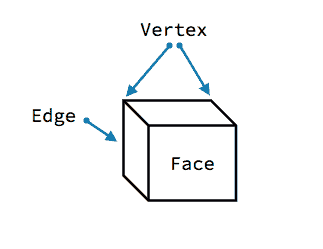

例如，一个立方体由八个顶点、十二条边和六个面组成。

如果您曾经使用过 3D 设计软件，这将对您非常熟悉。如果您还没有，并且对学习 3D 建模感兴趣，Blender 是一个非常流行的开源工具，用于设计 3D 对象。您可以在互联网上找到许多教程和课程，以帮助您开始使用 Blender。

# 导入网格

无论您使用哪种建模软件，您都需要将模型导出为 Godot 可读的格式。Wavefront (`.obj`) 和 Collada (`.dae`) 是最流行的格式。不幸的是，如果您使用 Blender，其 Collada 导出器存在一些缺陷，使其无法与 Godot 一起使用。为了解决这个问题，Godot 的开发者创建了一个名为**Better Collada Exporter**的 Blender 插件，您可以从[`godotengine.org/download`](https://godotengine.org/download)下载。

如果您的对象是其他格式，例如 FBX，您需要使用转换工具将它们保存为 OBJ 或 DAE，以便与 Godot 一起使用。

一种名为 GLTF 的新格式正在变得越来越受欢迎，并且与 Collada 相比具有一些显著的优势。Godot 已经支持它，所以您可以随意尝试使用这种格式的任何模型。

# 原始形状

如果您手头没有模型，或者您只需要一个简单的模型，Godot 可以直接创建某些 3D 网格。将`MeshInstance`节点作为 Spatial 的子节点添加，然后在检查器中点击网格属性：

.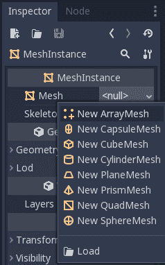

这些预定义的形状被称为*原始形状*，它们代表了一组常用的有用形状。您可以使用这些形状用于各种目的，正如您将在本章后面看到的。选择“新建立方体网格”，您将在屏幕上看到一个普通的立方体出现。立方体本身是白色的，但由于 3D 编辑器窗口中的默认环境光，它可能看起来是蓝色的。您将在本章后面学习如何处理光照。

# 多个网格

通常，你会发现一个由许多不同网格组成的对象。一个角色可能有头部、躯干和四肢的独立网格。如果你有很多这种类型的对象，当引擎尝试渲染这么多网格时，可能会导致性能问题。因此，`MultiMeshInstance`被设计为提供一种将许多网格组合成一个单一对象的高性能方法。你可能现在还不需要它，因为在这个项目中它不是必需的，但请记住，它可能是一个以后会派上用场的工具。

# 相机

尝试运行带有你的立方体网格的场景。它在哪？在 3D 中，不使用`Camera`你将看不到游戏视口中的任何内容。添加一个，并使用相机的 gizmo 将其定位并指向立方体，如以下截图所示：

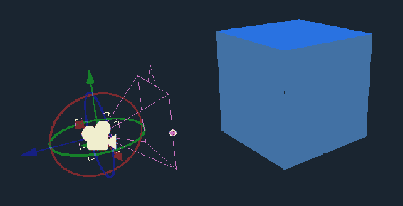

粉紫色、金字塔形状的对象被称为相机的*fustrum*。它代表相机的视角，可以变窄或变宽以影响相机的*视野*。fustrum 顶部的三角形箭头是相机的向上方向。

当你移动相机时，你可以使用右上角的预览按钮来检查你的瞄准。预览将始终显示所选相机可以看到的内容。

与你之前使用的`Camera2D`一样，一个`Camera`必须被设置为当前状态才能激活。它的其他属性会影响其*视角*：视野、投影和近/远。这些属性的默认值对于这个项目来说很好，但你可以尝试调整它们，看看它们如何影响立方体的视图。完成操作后，使用撤销将一切恢复到默认值。

# 项目设置

现在你已经学会了如何在 Godot 的 3D 编辑器中导航，你就可以开始 Minigolf 项目了。与其他项目一样，从以下链接下载游戏资源，并将其解压到你的项目文件夹中。解压后的`assets`文件夹包含图像、3D 模型和其他完成项目所需的资源。你可以从这里下载包含游戏艺术和声音（统称为*assets*）的 Zip 文件，[`github.com/PacktPublishing/Godot-Game-Engine-Projects/releases`](https://github.com/PacktPublishing/Godot-Game-Engine-Projects/releases)。

这个游戏将使用左鼠标按钮作为输入。输入映射没有为此定义任何默认动作，因此你需要添加一个。打开项目 | 项目设置并转到输入映射选项卡。添加一个名为点击的新动作，然后点击加号添加一个鼠标按钮事件。选择左键：

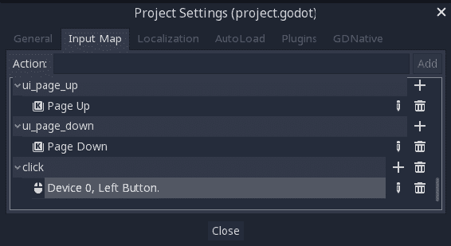

# 创建课程

对于第一个场景，添加一个名为`Main`的节点作为场景的根节点。这个场景将包含游戏的主要部分，从课程本身开始。首先添加一个`GridMap`节点来布置课程。

# 网格地图

`GridMap` 是你在早期项目中使用的 `TileMap` 节点的 3D 等价物。它允许你使用一组网格（包含在 `MeshLibrary` 中）并在网格中布局它们，以更快地设计环境。因为它是一个 3D 对象，所以你可以以任何方向堆叠网格，尽管在这个项目中，你将坚持在同一平面上。

# 制作网格库

`res://assets` 文件夹包含了一个为项目预生成的 `MeshLibrary`，其中包含了所有必要的课程部分以及碰撞形状。然而，如果你需要更改它或创建自己的，你会发现这个过程与在 2D 中创建 `TileSet` 非常相似。

用于创建预生成 `MeshLibrary` 的场景也可以在 `res://assets` 文件夹中找到。其名称为 `course_tiles_edit1.tscn`。请随意打开它并查看其设置方式。

首先，创建一个新的场景，以 `Spatial` 作为其根节点。向此节点添加任意数量的 `MeshInstance`。你可以从 `res://assets/dae` 文件夹中找到原始的课程网格，这些网格是从 Blender 导出的。

你给这些节点取的名字将是它们在 `MeshLibrary` 中的名字。

一旦添加了网格，它们需要添加静态碰撞体。创建与给定网格匹配的碰撞形状可能很复杂，但 Godot 有一种自动生成它们的方法。

选择一个网格，你会在编辑器窗口顶部看到一个 `Mesh` 菜单：

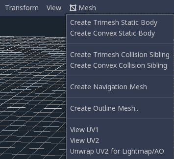

选择创建 Trimesh 静态体，Godot 将创建一个 `StaticBody` 并使用网格数据添加一个 `CollisionShape`：

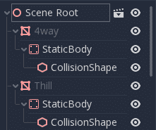

对每个网格对象都这样做，然后选择场景 | 转换到 | 网格库来保存资源。

# 绘制课程

将 `MeshLibrary` (`res://assets/course_tiles.tres` 或你创建的版本) 拖入检查器中 `GridMap` 的主题属性。同时，请确保单元格/大小属性设置为 `(2, 2, 2)`：

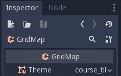

通过从右侧的列表中选择瓦片块并在编辑器窗口中左键单击来绘制。你可以通过按 *S* 键围绕 y 轴旋转一个块。要移除瓦片，请使用 *Shift* + 右键。

目前，请坚持使用简单的课程；当一切正常工作时，你可以在以后变得花哨。别忘了洞！


现在，是时候看看当游戏运行时这将是什么样子了。向场景中添加一个 `Camera`。将其向上移动并调整角度，使其向下观察课程。记住，你可以使用预览按钮来检查相机看到的。

运行场景。你会看到一切看起来都很暗。默认情况下，场景中环境光最少。为了更清楚地看到，你需要添加更多光。

# WorldEnvironment

灯光是一个复杂的主题。决定放置灯光的位置以及如何设置其颜色和强度可以显著影响场景的外观。

Godot 在 3D 中提供了三个照明节点：

+   `OmniLight`：用于从所有方向发射光，例如来自灯泡或蜡烛的光

+   `DirectionalLight`：来自遥远光源的无限光，例如阳光

+   `SpotLight`：来自单一光源的方向性光，例如手电筒

除了使用单个灯光外，你还可以使用`WorldEnvironment`设置一个*环境光*。

将一个名为`WorldEnvironment`的节点添加到场景中。在检查器中，将环境属性中的“新建环境”设置为“环境”。一切都会变成黑色，但不要担心，你很快就会解决这个问题：

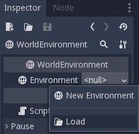

点击“新建环境”，你会看到一个包含大量属性的列表。你需要的是“环境光”。将颜色设置为白色，你会看到你的场景变得更亮。

请记住，环境光来自所有方向均匀。如果你的场景需要阴影或其他光照效果，你将需要使用一个`Light`节点。你将在本章后面看到光照节点是如何工作的。

# 完成场景

现在你已经布置好了课程，还有两个项目需要完成：*tee*，即球开始的位置，以及检测球进入洞的方法。

添加一个名为`Tee`的`Position3D`节点。就像`Position2D`一样，这个节点用于在空间中标记一个位置。将这个节点放置在你想要球开始的地方。确保你把它放在表面之上，这样球就不会在地面内部生成。

要检测球进入洞，你可以使用一个`Area`节点。这个节点直接对应于 2D 版本：它可以发出信号，当物体进入其指定的形状时。添加一个`Area`并给它一个`CollisionShape`子节点。

在`CollisionShape`的子属性“儿童形状”中添加一个`SphereShape`：


要调整碰撞球的大小，使用单个半径调整手柄：


将`Area`放置在洞的下方，并调整碰撞形状的大小，使其与洞的底部重叠。不要让它延伸到洞的顶部，否则球在还没有掉入洞中时会被计算为*在洞内*。

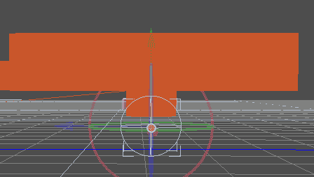

如果你使用透视按钮一次查看洞的一个方向，可能会更容易定位节点。当你完成定位后，将`Area`的名称更改为“洞”。

# 球

现在，你准备好制作球了。由于球需要物理特性——重力、摩擦、与墙壁的碰撞以及其他物理属性——`RigidBody`将是节点选择的最佳选择。创建一个新的场景，并命名为`Ball`的`RigidBody`。

`RigidBody`是你在第三章，“逃离迷宫”中使用的`RigidBody2D`节点的 3D 等价物。它的行为和属性非常相似，你使用许多相同的方法与之交互，例如`apply_impulse()`和`_integrate_forces()`。

球的形状需要是一个球体。基本 3D 形状，如球体、立方体、圆柱体等，被称为*原语*。Godot 可以使用`MeshInstance`节点自动创建原语，所以添加一个作为身体的子节点。在检查器中，在网格属性中选择新建球体网格：


默认大小太大，所以点击新的球体网格，并设置其大小属性，半径为`0.15`，高度为`0.3`：

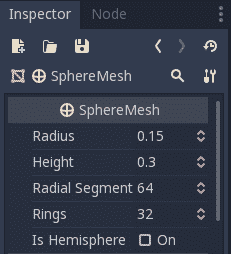

接下来，将一个`CollisionShape`节点添加到`Ball`上，并给它一个`SphereShape`。使用大小手柄（橙色点）调整大小以适应网格：

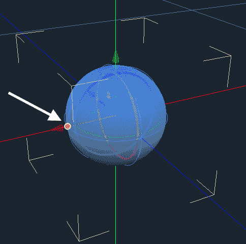

# 测试球

要测试球，使用实例按钮将其添加到`Main`场景中。将其放置在赛道上方，然后播放。你应该看到球落下并落在地面上。你可能发现添加另一个位于赛道一侧的`Camera`节点以获得不同的视角很有帮助。设置你想要使用的相机的当前属性。

你还可以通过设置其线性/速度属性临时给球一些运动。尝试设置不同的值并播放场景。记住，*y*轴是向上的，使用太大的值可能会导致球直接穿过墙壁。完成后将其设置回`(0, 0, 0)`。

# 改进碰撞

你可能已经注意到，在调整速度时，球有时会直接穿过墙壁，或者弹跳异常，尤其是如果你选择了一个高值。你可以对`RigidBody`属性进行一些调整，以改善高速下的碰撞行为。

首先，打开**连续碰撞检测**（**CCD**）。你会在检查器中找到它列出的连续 Cd。使用 CCD 会改变物理引擎计算碰撞的方式。通常，引擎通过首先移动对象，然后测试和解决碰撞来运行。这很快，并且在大多数常见情况下都有效。当使用 CCD 时，引擎会沿着对象的路径预测其移动，并尝试预测碰撞可能发生的位置。这比默认行为慢，因此效率不高，尤其是在模拟许多对象时，但它要准确得多。由于你游戏中只有一个球，所以 CCD 是一个好选项，因为它不会引入任何明显的性能损失，但会大大提高碰撞检测。

球也需要一点额外的动作，所以将弹跳设置为`0.2`，并将重力比例设置为`2`。

最后，你可能也注意到球停止需要很长时间。将线性/阻尼属性设置为`0.5`，并将角/阻尼设置为`0.1`，这样你就不必等待球停止移动那么长时间。

# UI

现在球体已经在赛道上，你需要一种瞄准和击打球体的方法。对于这种类型的游戏，有许多可能的控制方案。对于这个项目，你将使用两步过程：

1.  瞄准：一个箭头将出现来回摆动。点击鼠标按钮将瞄准方向设置为箭头。

1.  射击：能量条将在屏幕上上下移动。点击鼠标将设置能量并发射球体。

# 瞄准箭头

在 3D 中绘制对象不像在 2D 中那么容易。在许多情况下，你将不得不切换到 3D 建模程序，如 Blender，来创建你的游戏对象。然而，在这种情况下，Godot 的原语为你提供了支持；要制作箭头，你只需要两个网格：一个长而薄的矩形和一个三角棱柱。

通过添加一个具有 `MeshInstance` 子节点的 `Spatial` 节点来开始一个新的场景。添加一个新的 `CubeMesh`。单击 Mesh 属性，并将 Size 属性设置为 `(0.5, 0.2, 2)`。这是箭头的身体，但它仍然有一个问题。如果你旋转父节点，网格将围绕其中心旋转。相反，你需要箭头围绕其末端旋转，因此将 `MeshInstance` 的 Transform/Translation 更改为 `(0, 0, -1)`：


尝试使用 Gizmo 旋转 `Arrow`（根）节点，以确认形状现在已正确偏移。

要创建箭头的尖端，添加另一个 `MeshInstance`，这次选择 New PrismMesh。将其大小设置为 `(1.5, 2, 0.5)`。你现在有一个扁平的三角形形状。为了将其正确放置在矩形的末端，将网格的 Transform/Translation 更改为 `(0, 0, -3)`，并将其 Rotation Degrees 更改为 `(-90, 0, 0)`。

使用原语是直接在 Godot 中创建占位符对象的快速方法，无需打开你的 3D 建模软件。

最后，通过将根节点的 Transform/Scale 设置为 `(0.5, 0.5, 0.5)` 来缩小整个箭头：


你现在有一个完成的箭头形状。保存它，然后在 `Main` 场景中实例化它。

# UI 显示

使用名为 `UI` 的 CanvasLayer 创建一个新的场景。在这个场景中，你需要显示能量条以及玩家的得分次数。添加一个 `MarginContainer`、`VBoxContainer`、两个 `Label` 属性和一个 `TextureProgress`。按照以下名称命名：

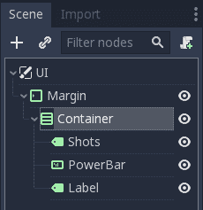

将 `MarginContainer` 的自定义常量全部设置为 `20`。将 `Xolonium-Regular.ttf` 字体添加到两个 `Label` 节点，并将它们的字体大小设置为 `30`。将 `Shots` 标签的文本设置为“得分：0”，将 `Label` 的文本设置为“能量”。将 `res://assets` 中的彩色条纹理之一拖放到 `PowerBar` 的 Texture/Progress 中。默认情况下，`TextureProgress` 条从左到右增长，因此对于垂直方向，将填充模式更改为从下到上。

完成的 UI 布局应如下所示：

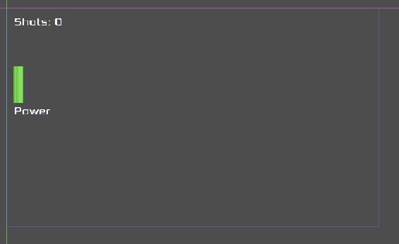

在 `Main` 场景中实例化此场景。因为它是一个 CanvasLayer，所以它将在 3D 摄像机视图之上绘制。

# 脚本

在本节中，你将创建使一切协同工作的脚本。游戏流程如下：

1.  将球放置在起始位置（`Tee`）

1.  角度模式：瞄准球

1.  功率模式：设置击球功率

1.  发射球

1.  重复步骤 2，直到球进入洞中

# UI

将以下脚本添加到 `UI` 中以更新 UI 元素：

```cpp
extends CanvasLayer

var bar_red = preload("res://assets/bar_red.png")
var bar_green = preload("res://assets/bar_green.png")
var bar_yellow = preload("res://assets/bar_yellow.png")

func update_shots(value):
    $Margin/Container/Shots.text = 'Shots: %s' % value

func update_powerbar(value):
    $Margin/Container/PowerBar.texture_progress = bar_green
    if value > 70:
        $Margin/Container/PowerBar.texture_progress = bar_red
    elif value > 40:
        $Margin/Container/PowerBar.texture_progress = bar_yellow
    $Margin/Container/PowerBar.value = value
```

这两个函数提供了一种在需要显示新值时更新 UI 元素的方法。正如你在 Space Rocks 游戏中所做的那样，根据进度条的大小更改其纹理，为功率级别提供了很好的高/中/低感觉。

# Main

接下来，向 `Main` 添加一个脚本，并从以下变量开始：

```cpp
extends Node

var shots = 0
var state
var power = 0
var power_change = 1
var power_speed = 100
var angle_change = 1
var angle_speed = 1.1
enum {SET_ANGLE, SET_POWER, SHOOT, WIN}
```

`enum` 列出了游戏可能处于的状态，而 `power*` 和 `angle*` 变量将用于设置它们各自的价值并在时间上改变它们。看看以下代码片段：

```cpp
func _ready():
    $Arrow.hide()
    $Ball.transform.origin = $Tee.transform.origin
    change_state(SET_ANGLE)
```

在开始时，使用两个身体的 `transform.origin` 属性将球放置在 `Tee` 的位置。然后，游戏被置于 `SET_ANGLE` 状态：

```cpp
func change_state(new_state):
    state = new_state
    match state:
        SET_ANGLE:
            $Arrow.transform.origin = $Ball.transform.origin
            $Arrow.show()
        SET_POWER:
            pass
        SHOOT:
            $Arrow.hide()
            $Ball.shoot($Arrow.rotation.y, power)
            shots += 1
            $UI.update_shots(shots)
        WIN:
            $Ball.hide()
            $Arrow.hide()
```

`SET_ANGLE` 状态将箭头放置在球的位置。记住，你偏移了箭头，所以它看起来像是从球向外指。当旋转箭头时，你围绕 *y* 轴旋转它，使其保持平坦（*y* 轴向上指）。

此外，请注意，当进入 `SHOOT` 状态时，你会在 `Ball` 上调用 `shoot()` 函数。你将在下一节中添加该函数。

下一步是检查用户输入：

```cpp
func _input(event):
    if event.is_action_pressed('click'):
        match state:
            SET_ANGLE:
                change_state(SET_POWER)
            SET_POWER:
                change_state(SHOOT)
```

游戏的唯一输入是点击左鼠标按钮。根据你处于什么状态，点击它将过渡到下一个状态：

```cpp
func _process(delta):
    match state:
        SET_ANGLE:
            animate_angle(delta)
        SET_POWER:
            animate_power_bar(delta)
        SHOOT:
            pass
```

在 `_process()` 中，你根据状态确定要动画化什么。目前，它只是调用当前正在设置的属性动画的函数：

```cpp
func animate_power_bar(delta):
    power += power_speed * power_change * delta
    if power >= 100:
        power_change = -1
    if power <= 0:
        power_change = 1
    $UI.update_powerbar(power)

func animate_angle(delta):
    $Arrow.rotation.y += angle_speed * angle_change * delta
    if $Arrow.rotation.y > PI/2:
        angle_change = -1
    if $Arrow.rotation.y < -PI/2:
        angle_change = 1
```

这两个函数都很相似。它们在两个极端之间逐渐改变一个值，当达到限制时反转方向。请注意，箭头在 +/- 90 度的弧上动画。

# 球

在球脚本中，需要两个函数。首先，必须对球施加冲量以发射它。其次，当球停止移动时，它需要通知 `Main` 场景，以便玩家可以再次击球：

```cpp
extends RigidBody

signal stopped

func shoot(angle, power):
    var force = Vector3(0, 0, -1).rotated(Vector3(0, 1, 0), angle)
    apply_impulse(Vector3(), force * power / 5)

func _integrate_forces(state):
    if state.linear_velocity.length() < 0.1:
        emit_signal("stopped")
        state.linear_velocity = Vector3()
```

正如你在 Space Rocks 游戏中所见，你可以在 `_integrate_forces()` 中使用物理状态安全地停止球，如果速度变得太慢。记住，由于浮点数精度，速度可能不会自行减慢到 `0`。球可能看起来已经停止，但它的速度实际上可能是 `0.0000001`。而不是等待它达到 `0`，你可以使球停止，如果其速度低于 `0.1`。

# 洞

要检测球是否掉入洞中，点击 `Main` 中的 `Area` 并连接其 `body_entered` 信号：

```cpp
func _on_Hole_body_entered(body):
    print("Win!")
    change_state(WIN)
```

切换到 `WIN` 状态将阻止球的 `stopped` 信号允许另一击。

# 测试

尝试运行游戏。你可能想确保这部分有一个非常简单的课程，直接射向洞口。你应该看到箭头在球的位置旋转。当你点击鼠标按钮时，箭头停止，力量条开始上下移动。当你第二次点击时，球被发射。

如果这些步骤中的任何一个不起作用，不要继续前进，而是停止并回到尝试找到你遗漏的内容。

一切正常后，你会注意到一些需要改进的地方。首先，当球停止移动时，箭头可能不会指向你想要的方向。原因是起始角度总是`0`，这指向*z*轴，然后箭头从那里摆动+/- 90 度。在下一节中，你将有两个改进瞄准的方法。

# 改进瞄准 – 选项 1

通过使箭头的 180 度摆动始终从指向洞开始，可以改进瞄准。

在`Main`脚本中添加一个名为`hole_dir`的变量。在瞄准开始时，这将使用以下函数设置为指向洞的角度：

```cpp
func set_start_angle():
    var hole_pos = Vector2($Hole.transform.origin.z, $Hole.transform.origin.x)
    var ball_pos = Vector2($Ball.transform.origin.z, $Ball.transform.origin.x)
    hole_dir = (ball_pos - hole_pos).angle()
    $Arrow.rotation.y = hole_dir
```

记住，球的位置是其中心，所以它略微高于表面，而洞的中心则略低于。因此，直接指向它们之间的箭头会指向地面的向下角度。为了防止这种情况并保持箭头水平，你可以只使用`transform.origin`的*x*和*z*值来生成一个`Vector2`。

现在初始箭头方向是指向洞的，所以你可以调整动画，在角度上加上/减去 90 度：

```cpp
func animate_angle(delta):
    $Arrow.rotation.y += angle_speed * angle_change * delta
    if $Arrow.rotation.y > hole_dir + PI/2:
        angle_change = -1
    if $Arrow.rotation.y < hole_dir - PI/2:
        angle_change = 1
```

最后，将`SET_ANGLE`状态更改为调用函数：

```cpp
SET_ANGLE:
    $Arrow.transform.origin = $Ball.transform.origin
    $Arrow.show()
    set_start_angle()
```

再试一次游戏。现在球应该总是指向洞的大致方向。这更好，但你仍然不能指向你喜欢的任何方向。为此，你可以尝试选择选项 2。

# 改进瞄准 – 选项 2

之前的解决方案是可以接受的，但还有一种可能性。不是箭头来回弹跳，你可以通过左右移动鼠标来瞄准。这个选项的好处是，你不受 180 度运动限制。

为了实现这一点，你可以使用特定的输入事件：`InputEventMouseMotion`。当鼠标移动时，此事件发生，并返回一个`relative`属性，表示鼠标在上一帧中移动的距离。你可以使用这个值来稍微旋转箭头。

首先，通过从`_process()`中删除`SET_ANGLE`部分来禁用箭头动画。然后，将以下代码添加到`_input()`中：

```cpp
func _input(event):
    if event is InputEventMouseMotion:
        if state == SET_ANGLE:
            $Arrow.rotation.y -= event.relative.x / 150
```

这设置了箭头的旋转，当你将鼠标在屏幕上左右移动时。除以`150`确保移动不会太快，并且如果你将鼠标从屏幕的一侧移动到另一侧，你可以移动完整的 360 度。根据你鼠标的灵敏度，你可以调整这个值以适应你的偏好。

# 相机改进

另一个问题，特别是如果你有一个相对较大的场地，如果你的摄像头放置在显示发球区附近，它可能无法很好地显示场地的其他部分，甚至根本不显示。这可能会在球位于某些位置时使瞄准变得具有挑战性。

在本节中，你将学习两种不同的方法来解决这个问题。一种涉及创建多个摄像头，并激活离球位置最近的那个。另一种解决方案是创建一个*旋转*摄像头，它跟随球，玩家可以控制它从任何角度查看场地。

# 多个摄像头

添加第二个“摄像头”节点，并将其放置在洞附近或课程的对端，例如：

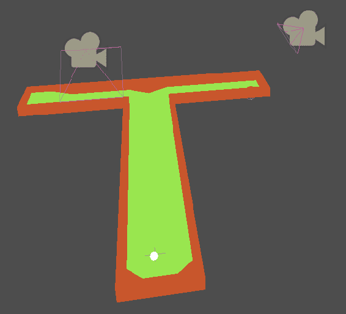

将一个“区域”子节点添加到这个第二个摄像头。命名为`Camera2Area`，然后添加一个“碰撞形状”。你可以使用球形形状，但在这个例子中，选择一个`BoxShape`。请注意，因为你已经旋转了摄像头，盒子也跟着旋转了。你可以通过将“碰撞形状”的旋转设置为相反的值来反转这一点，或者你可以让它保持旋转。无论如何，调整盒子的大小和位置，使其覆盖你想要摄像头负责的课程部分：

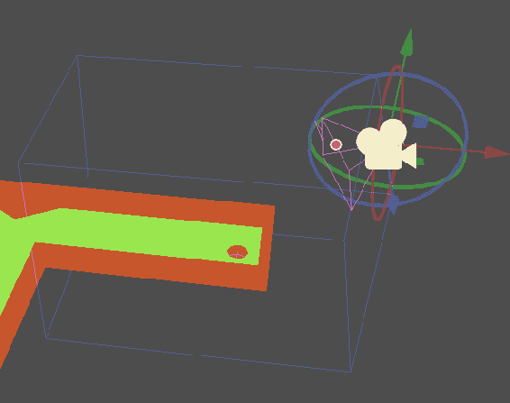

现在，将区域的`body_entered`信号连接到主脚本。当球进入区域时，将发出信号，你可以更改活动摄像头：

```cpp
func _on_Cam2Area_body_entered(body):
    $Camera2.current = true
```

再次玩游戏并将球击向新的摄像头区域。确认当球进入区域时，摄像头视图发生变化。对于大型场地，你可以添加尽可能多的摄像头，并将它们设置为激活场地的不同部分。

这种方法的缺点是摄像头仍然是静态的。除非你非常小心地将它们放置在正确的位置，否则从场地的某些位置瞄准球仍然可能不太舒适。

# 旋转摄像头

在许多 3D 游戏中，玩家可以控制一个可以旋转和移动的摄像头。通常，控制方案使用鼠标和键盘的组合。第一步将是添加一些新的输入动作：


WASD 键将用于通过移动摄像头左右和上下来旋转摄像头。鼠标滚轮将控制缩放。

# 创建稳定器

摄像头移动需要有一定的限制。一方面，它应该始终保持水平，而不是倾斜。尝试这样做：拿一个摄像头，围绕 x（红色环）旋转一小部分，然后围绕*z*（蓝色环）旋转一小部分。现在，反转*x*旋转并点击预览按钮。你是否看到摄像头现在倾斜了？

解决这个问题的方法是放置一个稳定器——一个设计用于在移动过程中保持物体水平的装置。你可以使用两个`Spatial`节点来创建稳定器，分别控制摄像头的左右和上下移动。

首先，确保从场景中移除任何其他 `Camera` 节点。如果你尝试了上一节中的多摄像头设置并且不想删除它们，可以将它们的 `Current` 值设置为 `Off` 并断开任何 `Area` 信号。

添加一个新的 `Spatial` 节点，命名为 `GimbalOut`，并将其放置在赛道中心附近。确保不要旋转它。给它一个名为 `GimbalIn` 的 `Spatial` 子节点，然后在该节点上添加一个 `Camera`。将摄像头的变换/平移设置为 `(0, 0, 10)`：


这是陀螺仪的工作原理：外空间允许仅在 *y* 轴上旋转 *仅*，而内空间则 *仅* 在 *x* 轴上旋转。你可以亲自尝试，但请确保切换到本地空间模式（参见 *3D 简介* 部分）。记住，只移动外陀螺仪节点的 *绿色* 环和内陀螺仪的 *红色* 环。不要改变摄像头。实验完成后，将所有旋转重置为 `0`。

要在游戏中控制这种运动，请将脚本附加到 `GimbalOut` 并添加以下内容：

```cpp

extends Spatial

var cam_speed = PI/2
var zoom_speed = 0.1
var zoom = 0.5

func _input(event):
    if event.is_action_pressed('cam_zoom_in'):
        zoom -= zoom_speed
    if event.is_action_pressed('cam_zoom_out'):
        zoom += zoom_speed

func _process(delta):
    zoom = clamp(zoom, 0.1, 2)
    scale = Vector3(1, 1, 1) * zoom
    if Input.is_action_pressed('cam_left'):
        rotate_y(-cam_speed * delta)
    if Input.is_action_pressed('cam_right'):
        rotate_y(cam_speed * delta)
    if Input.is_action_pressed('cam_up'):
        $GimbalIn.rotate_x(-cam_speed * delta)
    if Input.is_action_pressed('cam_down'):
        $GimbalIn.rotate_x(cam_speed * delta)
    $GimbalIn.rotation.x = clamp($GimbalIn.rotation.x, -PI/2, -0.2)
```

如你所见，左右动作仅在 *y* 轴上旋转 `GimbalOut`，而上下动作在 *x* 轴上旋转 `GimbalIn`。整个陀螺仪系统的 `scale` 属性用于处理缩放。还需要使用 `clamp()` 设置一些限制。旋转限制在 `-0.2`（几乎与地面水平）到 `-90` 度（直视地面）之间保持上下移动，而缩放限制则防止你离得太近或太远。

运行游戏并测试摄像头控制。你应该能够使用鼠标滚轮在四个方向上平移和缩放。然而，陀螺仪的位置仍然是静态的，所以你可能从某些角度难以正确看到球。

# 跟踪摄像头

对摄像头的最后改进是让它跟随球。现在你有一个稳定的、带有陀螺仪的摄像头，如果陀螺仪设置为跟随球的位置，它将工作得很好。将以下行添加到 `Main` 场景的 `_process()` 函数中：

```cpp
$GimbalOut.transform.origin = $Ball.transform.origin
```

注意，你不应该将陀螺仪的变换设置为球的变换，否则它也会随着球的滚动而 *旋转*！

现在尝试游戏并观察摄像头如何追踪球的移动，同时还能进行旋转和缩放。

# 视觉效果

场景中球和其他网格的外观被有意地保持得很简单。你可以将扁平的白色球想象成一块空白画布，准备好按照你的意愿进行塑形和塑造。将图形应用到 3D 模型上可能是一个非常复杂的过程，尤其是如果你不熟悉它的话。首先，一些词汇：

+   **纹理**: 纹理是平面的、2D 图像，被 *包裹* 在 3D 对象周围，以赋予它们更有趣的外观。想象一下包裹一个礼物：平面的纸张折叠在包裹上，适应其形状。纹理可以是非常简单的，也可以非常复杂，这取决于它们设计要应用于的形状。一个简单的例子可能是一小块砖块图案，可以在一个大型的墙面对象上重复。

+   **着色器**: 当纹理决定了物体表面的 *内容* 时，着色器决定了 *绘制方式*。想象一下同样的砖墙。如果它湿了会是什么样子？网格和纹理仍然是相同的，但光线反射的方式会有很大不同。这就是着色器的功能：在不实际改变对象的情况下改变其外观。着色器通常用一种专门的编程语言编写，并且可以使用大量的高级数学，这些细节超出了本书的范围。对于许多效果，编写自己的着色器是不可避免的。然而，Godot 提供了一种创建着色器的方法，允许在不深入研究着色器代码的情况下进行大量定制：`ShaderMaterial`。

+   **材料**: Godot 使用一种名为 **基于物理的渲染**（**PBR**）的计算机图形模型。PBR 的目标是以更准确地模拟现实世界中光线作用的方式渲染物体的表面。这些效果通过 `Material` 属性应用于网格。材料本质上是对纹理和着色器的容器。而不是单独应用它们，它们被包含在材料中，然后添加到对象上。材料的属性决定了纹理和着色器效果如何应用。使用 Godot 内置的材料属性，你可以模拟各种真实（或风格化）的现实世界物理材料，如石头、布料或金属。如果内置属性不足以满足你的需求，你可以编写自己的着色器代码以添加更多效果。

你可以使用 `SpatialMaterial` 将 PBR 材料添加到网格中。

# SpatialMaterials

点击球体的 `MeshInstance`，然后在材料下选择新建 SpatialMaterial，然后点击新材料。你会看到大量的参数，远超过本书所能涵盖的范围。本节将重点介绍一些制作球体外观更吸引人的最有用参数。鼓励你访问 [`docs.godotengine.org/en/3.0/tutorials/3d/spatial_material.html`](http://docs.godotengine.org/en/3.0/tutorials/3d/spatial_material.html) 以获得所有 `SpatialMaterial` 设置的完整解释。为了改善球体的外观，尝试使用这些参数进行实验：

+   **Albedo**: 这个属性设置了材料的基色。更改它以使球体成为你喜欢的任何颜色。如果你正在处理需要应用纹理的对象，你还可以在这里添加它。

+   **金属和粗糙度**：这些参数控制表面反射的程度。两者都可以设置为`0`到`1`之间的值。金属值控制*光泽度*；值越高，反射的光越多。粗糙度值对反射应用一定程度的模糊。通过调整这两个属性，你可以模拟各种材料。以下是如何**粗糙度**和**金属**属性影响物体外观的指南。请记住，光照和其他因素也会改变表面外观。了解光和反射如何与表面属性相互作用是学习设计有效 3D 对象的重要组成部分：


+   **法线贴图**：法线贴图是一种 3D 图形技术，用于*模拟*表面上的凹凸。在网格本身中建模这些凹凸会导致组成对象的三角形或面的数量大幅增加，从而降低性能。相反，使用一个 2D 纹理来映射这些小表面特征产生的光和影的模式。然后，照明引擎使用这些信息来改变光照，就像那些细节实际上存在一样。一个正确构建的法线贴图可以为外观平淡无奇的对象添加大量细节。

球体是一个良好使用法线贴图的好例子，因为真实的高尔夫球在其表面有数百个凹坑，但球体原语是一个光滑的表面。使用常规纹理可能会添加斑点，但它们看起来会显得扁平且涂鸦。模拟这些凹坑的法线贴图看起来像这样：


它看起来不多，但红色和蓝色的图案包含告诉引擎在这一点上表面应朝哪个方向的信息，因此光应从哪个方向反射的信息。注意顶部和底部的拉伸——这是因为这张图片是为了包裹成球形形状而制作的。

启用法线贴图属性，并将`res://assets/ball_normal_map.png`拖入*纹理*字段。最初将*Albedo*颜色设置为白色，以便最好地看到效果。调整`深度`参数以增加或减少效果强度。负值会使凹坑看起来是凹进去的；在`-1.0`和`-1.5`之间的值是一个不错的选择：

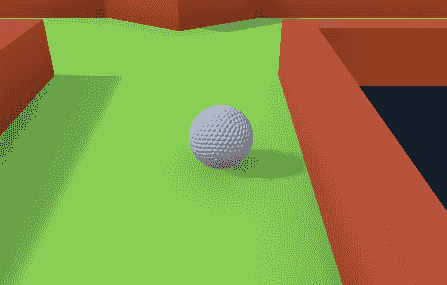

花些时间尝试这些设置，找到你喜欢的组合。别忘了在游戏中也试试，因为 WorldEnvironment 的环境光照将影响最终结果。

# 环境选项

当你添加了 WorldEnvironment 时，你唯一更改的参数是*环境光*颜色。在本节中，你将了解一些其他你可以调整以改善视觉效果的性质：

+   **背景**: 此参数允许您指定世界的背景看起来像什么。默认值是“清色”，即您目前看到的纯灰色。将模式更改为“天空”，然后在“天空属性”中选择“新程序天空”。请注意，天空不仅仅是背景外观——物体将反射和吸收其环境光。观察当您更改`能量`参数时球的外观如何变化。此设置可用于营造白天或夜晚天空的印象，甚至可以营造外星行星的印象。

+   **屏幕空间环境遮挡**（**SSAO**）：当启用时，此参数与任何环境光一起产生角落的阴影。现在您有两个环境光来源：*背景*（天空）和*环境光*设置。启用 SSAO 后，您将立即看到改进，使课程的墙壁看起来不那么虚假和塑料。您可以随意尝试调整各种 SSAO 属性，但请记住，微小的变化可以产生很大的影响。以小增量调整属性，并在更改它们之前观察效果。

+   **DOF 远模糊**：*景深*为距离相机一定距离以上的物体添加模糊效果。尝试调整距离属性以查看效果。

有关环境效果高级使用的更多信息，请参阅[`docs.godotengine.org/en/3.0/tutorials/3d/environment_and_post_processing.html`](http://docs.godotengine.org/en/3.0/tutorials/3d/environment_and_post_processing.html)。

# 灯光

向场景添加一个`DirectionalLight`。此类光模拟无限数量的平行光线，因此常用于表示阳光或另一个照亮整个区域的光源。场景中节点的位置无关紧要，只有其方向，因此您可以将其放置在您喜欢的任何位置。使用 gizmo 定位它，使其以一定角度击中路径，然后打开 Shadow/Enabled 以看到从墙壁和其他物体投射的阴影：

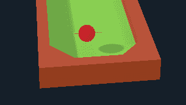

有许多属性可用于调整和改变阴影的外观，包括在所有`Light`节点都存在的*阴影*部分，以及在特定于`DirectionalLight`的*方向阴影*部分。默认值适用于大多数通用情况，但您可能需要调整的一个属性是*最大距离*。降低此值将改善阴影外观，但仅当相机距离给定距离较近时。如果您的相机将主要靠近物体，您可以降低此值。要看到效果，请尝试将其设置为`10`并缩放，然后将其设置为`1000`进行相同的操作。

转向光甚至可以用来模拟昼夜循环。如果你给灯光附加一个脚本并慢慢绕一个轴旋转它，你会看到阴影变化，就像太阳在升起和落下一样。

# 摘要

本章带你进入了 3D 图形的世界。Godot 的一个巨大优势是，在 2D 和 3D 中使用了相同的工具和工作流程。你关于创建场景、实例化和使用信号的过程中学到的所有内容都以相同的方式工作。例如，你为 2D 游戏使用控制节点构建的界面可以放入 3D 游戏中，并且会以同样的方式工作。

在本章中，你学习了如何在 3D 编辑器中导航，使用工具箱来查看和放置节点。你了解了网格和如何使用 Godot 的原生形状快速创建自己的对象。你使用了 GridMap 来布置你的迷你高尔夫球场。你学习了如何使用摄像机、照明和世界环境来设计游戏在屏幕上的显示效果。最后，你体验了通过 Godot 的 SpatialMaterial 资源使用 PBR 渲染。

恭喜你，你已经走到了终点！但通过这五个项目，你成为游戏开发者的旅程才刚刚开始。随着你对 Godot 功能的熟练掌握，你将能够制作出任何你能想象到的游戏。
