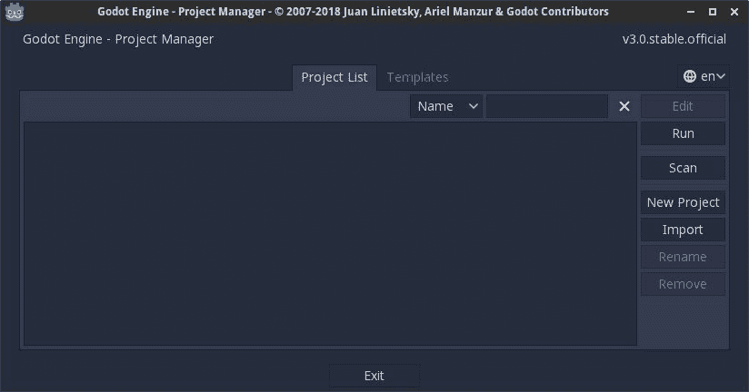
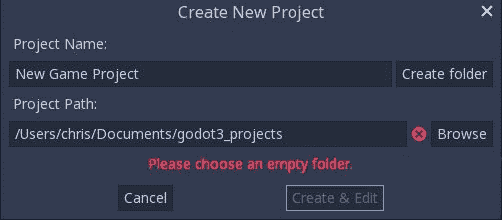
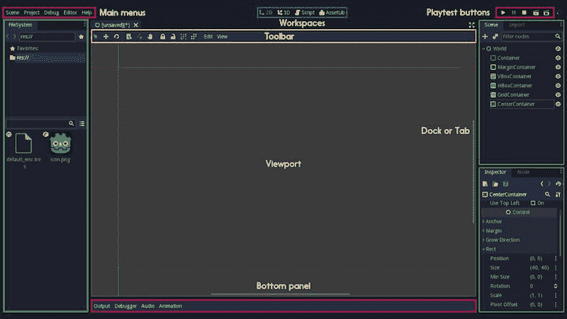
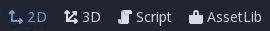
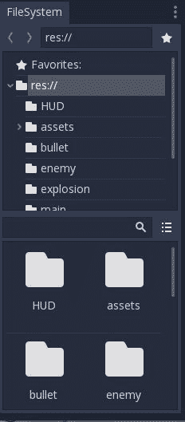
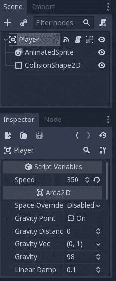
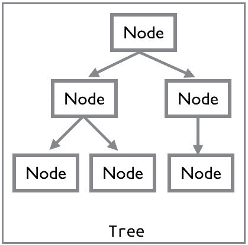

# 第一章：引言

不论是你的理想职业还是一种休闲爱好，游戏开发都是一项有趣且有益的活动。现在开始游戏开发从未有过更好的时机。现代编程语言和工具使得构建高质量游戏并将其分发到世界变得比以往任何时候都更容易。如果你正在阅读这本书，那么你已经踏上了实现你梦想中的游戏的道路。

本书是关于 Godot 游戏引擎及其新 3.0 版本的入门介绍，该版本于 2018 年初发布。Godot 3.0 拥有大量新特性和功能，使其成为昂贵商业游戏引擎的强大替代品。对于初学者来说，它提供了一种友好的方式来学习基础的游戏开发技术。对于更有经验的开发者来说，Godot 是一个强大、可定制且 *开放* 的工具，可以帮助你将你的想法变为现实。

本书采用基于项目的教学方法，将向你介绍引擎的基本原理。它由五个游戏组成，旨在帮助你获得对游戏开发概念及其在 Godot 中的应用的扎实理解。在这个过程中，你将学习 Godot 的工作原理，并吸收你可以应用到你的项目中的重要技术。

# 一般建议

本节包含了一些基于作者作为教师和讲师经验的读者一般建议。在阅读本书的过程中，请记住这些提示，尤其是如果你是编程新手的话。

尽量按照书中的项目顺序进行。后面的章节可能会基于前面章节中介绍的主题，在那里它们会得到更详细的解释。当你遇到你不记得的内容时，回到前面的章节去复习那个主题。没有人会给你计时，快速完成本书也没有奖品。

这里有很多内容需要吸收。如果你一开始没有理解，不要感到气馁。目标不是一夜之间成为游戏开发专家——这是不可能的。重复是学习复杂主题的关键；你越是用 Godot 的功能工作，它们就会开始显得越熟悉和*容易*。当你完成第七章，*附加主题*后，试着回顾第二章，*金币冲刺*。你会惊讶于与第一次阅读相比你理解了多少。

如果你正在使用本书的 PDF 版本，请抵制复制粘贴代码的诱惑。亲自输入代码将更多地调动你的大脑。这类似于在讲座中做笔记如何帮助你比单纯听讲学得更好，即使你从未阅读过笔记。如果你是打字速度慢的人，这也有助于你提高打字速度。总之：你是一名程序员，所以习惯于输入代码！

新游戏开发者犯的最大错误之一是承担超出自己能力范围的项目。在开始时，保持项目范围尽可能小非常重要。如果你完成两三个小型游戏，你将比拥有一个庞大且不完整的项目（这个项目已经超出了你的管理能力）更有成功的机会（并且学到更多）。

你会注意到这本书中的五个游戏非常严格地遵循这种策略。它们在范围上都较小，这不仅出于实际原因——以便合理地适应书本大小的课程——也是为了保持专注于教授基础知识。当你构建它们时，你可能会立即想到额外的功能和游戏元素。*如果太空船有升级会怎样？* *如果角色可以做墙壁跳跃会怎样？*

理念很棒，但如果你还没有完成基本项目，就把它们记下来，留待以后。不要让自己被一个又一个“酷炫的想法”所分散。开发者称之为“功能蔓延”，这是一个导致许多游戏未完成的陷阱。不要成为它的受害者。

最后，别忘了时不时地休息一下。你不应该在几场阅读中就试图一口气读完整本书。在每个新概念之后，尤其是在每个章节之后，给自己一些时间来吸收新信息，然后再深入研究下一个。你会发现，你不仅能够记住更多信息，而且可能会更加享受这个过程。

# 什么是游戏引擎？

游戏开发复杂，涉及广泛的知识和技能。为了构建现代游戏，在制作实际游戏之前，你需要大量的底层技术。想象一下，在你开始编程之前，你必须自己构建电脑并编写自己的操作系统。如果你真的需要从头开始构建你需要的所有东西，游戏开发就会像那样。

此外，每个游戏都有一些共同的需求。例如，无论游戏是什么，它都需要在屏幕上绘制东西。如果已经编写了执行此操作的代码，那么在每次游戏中重新创建它而不是重用它更有意义。这就是游戏框架和引擎发挥作用的地方。

**游戏框架**是一组带有辅助代码的库，它帮助构建游戏的基础部分。它并不一定提供所有组件，你可能仍然需要编写大量代码来整合所有内容。正因为如此，使用游戏框架构建游戏可能比使用完整游戏引擎构建的游戏花费更多时间。

**游戏引擎**是一组工具和技术集合，旨在通过消除每个新游戏项目都需要“重新发明轮子”的需要来简化游戏制作过程。它提供了一组常用功能框架，通常需要大量时间来开发。

下面是游戏引擎将提供的一些主要功能列表：

+   **渲染（2D 和 3D）**：渲染是将你的游戏显示在玩家屏幕上的过程。一个好的渲染管线必须考虑到现代 GPU 支持、高分辨率显示器以及光照、透视和视口等效果，同时保持非常高的帧率。

+   **物理引擎**：虽然这是一个非常常见的需求，但构建一个强大且精确的物理引擎是一项艰巨的任务。大多数游戏都需要某种形式的碰撞检测和响应系统，许多游戏还需要物理模拟，但很少有开发者愿意承担编写物理引擎的任务，尤其是如果他们曾经尝试过的话。

+   **平台支持**：在当今的市场中，大多数开发者都希望能够在多个平台上发布他们的游戏，例如游戏机、移动设备、PC 和/或网页。游戏引擎提供了一个统一的导出过程，可以在多个平台上发布游戏，而无需重写游戏代码或支持多个版本。

+   **通用开发环境**：通过使用相同的统一界面来制作多个游戏，你不必每次开始新项目时都重新学习新的工作流程。

此外，还将提供辅助工具，以支持诸如网络、简化图像和声音处理、动画、调试、关卡创建等功能。通常，游戏引擎会包括从其他工具导入内容的能力，例如用于创建动画或 3D 模型的工具。

使用游戏引擎可以让开发者专注于构建他们的游戏，而不是创建使游戏运行所需的所有底层框架。对于小型或独立开发者来说，这意味着在开发一年后发布游戏与三年后发布，甚至根本无法发布之间的区别。

目前市场上有很多流行的游戏引擎，例如 Unity、Unreal Engine 和 GameMaker Studio，仅举几个例子。需要了解的一个重要事实是，大多数流行的游戏引擎都是商业产品。它们可能或可能不需要任何财务投资就可以开始，但如果你的游戏盈利，它们将需要某种形式的许可和/或版税支付。无论你选择哪个引擎，你都需要仔细阅读用户协议，并确保你理解你可以和不可以使用该引擎，以及你可能需要承担的任何潜在费用。

另一方面，也有一些非商业的、*开源*的游戏引擎，例如 Godot 游戏引擎，这正是本书的主题。

# 什么是 Godot？

Godot 是一个功能齐全的现代游戏引擎，提供了上一节中描述的所有功能以及更多。它也是完全免费和开源的，在非常宽松的 MIT 许可下发布。这意味着没有任何费用、隐藏成本或需要支付版税。你用 Godot 制作的一切 100%属于你，而许多要求持续合同关系的商业游戏引擎则不是这样。对于许多开发者来说，这一点非常有吸引力。

如果你不太熟悉开源、社区驱动的开发概念，这可能会让你觉得有些奇怪。然而，与 Linux 内核、Firefox 浏览器以及许多其他非常著名的软件一样，Godot 并不是由公司作为商业产品来开发的。相反，一群热心的开发者们无私地贡献他们的时间和专业知识，用于构建引擎、测试和修复错误、制作文档等等。

作为游戏开发者，使用 Godot 的好处是巨大的。因为它不受商业许可的束缚，你可以完全控制你的游戏如何以及在哪里分发。许多商业游戏引擎限制了你可以制作的项目类型，或者要求支付更昂贵的许可费用来制作某些类别的游戏，例如赌博游戏。

Godot 的开源性质还意味着它具有商业游戏引擎所不具备的透明度。例如，如果你发现某个特定的引擎功能并不完全符合你的需求，你可以自由地修改引擎本身并添加你需要的新功能，无需任何许可。这在进行大型项目的调试时也非常有帮助，因为你可以完全访问引擎的内部工作。

这也意味着你可以直接为 Godot 的未来做出贡献。参见第七章，*附加主题*，了解更多关于如何参与 Godot 开发的信息。

# 下载 Godot

你可以通过访问[`godotengine.org/`](https://godotengine.org/)并点击下载来获取 Godot 的最新版本。本书是为 3.0 版本编写的。如果你下载的版本末尾有另一个数字（如 3.0.3），那没关系——这仅仅意味着它包含了修复 3.0 版本错误或其他问题的更新。

目前正在开发 3.1 版本，在你阅读这本书的时候可能已经发布。这个版本可能包含或不包含与本书代码不兼容的更改。请查看本书的 GitHub 仓库以获取信息和勘误：[`github.com/PacktPublishing/Godot-Game-Engine-Projects`](https://github.com/PacktPublishing/Godot-Game-Engine-Projects)

在下载页面，有几个选项需要解释。首先，32 位与 64 位：此选项取决于你的操作系统和你的计算机处理器。如果你不确定，你应该选择 64 位版本。你还会看到一个**Mono 版本**。这是一个专门为与 C# 编程语言一起使用而构建的版本。除非你计划使用 C# 与 Godot 一起使用，否则不要下载此版本。在撰写本文时，C# 支持仍然是实验性的，不建议初学者使用。

双击下载的文件以解压，你将得到 Godot 应用程序。如果你有“程序”或“应用程序”文件夹，可以选择将其拖放到那里。双击应用程序以启动它，你将看到 Godot 的**项目经理**窗口。

# 其他安装方法

除了从 Godot 网站下载之外，还有几种方法可以将 Godot 安装到你的计算机上。请注意，以这种方式安装时功能没有差异。以下仅是下载应用程序的替代方法：

+   **Steam**：如果你在 Steam 上有账户，可以通过 Steam 桌面应用程序安装 Godot。在 Steam 商店中搜索 Godot，并按照说明进行安装。你可以从 Steam 应用程序中启动 Godot，它甚至还会跟踪你的**游戏时间**。

+   **包管理器**：如果你使用以下操作系统的包管理器之一，你可以通过其正常安装过程安装 Godot。有关详细信息，请参阅你的包管理器文档。Godot 可在这些包管理器中使用：

+   Homebrew（macOS）

+   Scoop（Windows）

+   快照（Linux）

# Godot UI 概览

与大多数游戏引擎一样，Godot 有一个统一的开发环境。这意味着你使用相同的界面来处理游戏的所有方面——代码、视觉效果、音频等等。本节是关于界面及其部分的介绍。请注意这里使用的术语；在本书中提及编辑器窗口中的操作时，将使用这些术语。

# 项目管理器

当你打开 Godot 时，首先看到的是**项目经理**：



在此窗口中，你可以看到你现有的 Godot 项目列表。你可以选择一个现有项目并点击“运行”来玩游戏，或者点击“编辑”在 Godot 编辑器中工作（参考以下截图）。你也可以通过点击“新建项目”来创建一个新项目：



在这里，你可以为项目命名并创建一个文件夹来存储它。始终尝试选择一个描述项目的名称。同时请注意，不同的操作系统在处理文件名中的大小写和空格方面有所不同。为了最大兼容性，最好坚持使用小写字母并使用下划线`_`代替空格。

注意警告信息——在 Godot 中，每个项目都作为计算机上单独的文件夹存储。项目使用的所有文件都存放在这个文件夹中。项目文件夹之外的内容在游戏中将不可访问，因此你需要将任何图像、声音、模型或其他数据放入项目文件夹中。这使得共享 Godot 项目变得方便；你只需要压缩项目文件夹，就可以有信心其他 Godot 用户能够打开它，并且不会缺少任何必要的数据。

# 选择文件名

当你给你的新项目命名时，你应该遵循一些简单的规则，这可能会在未来为你节省一些麻烦。给你的项目起一个描述性的名字——*巫师战斗竞技场*比*游戏#2*要好得多。在未来，你永远也记不住哪个游戏#2 是哪个，所以尽可能描述得详细。

你还应该考虑如何命名你的项目文件夹和其中的文件。一些操作系统是*大小写敏感*的，区分`My_Game`和`my_game`，而其他则不是。如果你将项目从一个电脑移动到另一个电脑，这可能会导致问题。因此，许多程序员为他们的项目制定了一个标准化的命名方案，例如：*文件名中不包含空格，单词之间使用"_"分隔*。无论你采用什么命名方案，最重要的是保持一致性。

一旦你创建了项目文件夹，创建与编辑按钮将会在编辑器窗口中打开新的项目。

现在试试：创建一个名为`test_project`的项目。

如果你正在使用 Windows 操作系统的某个版本，当你运行 Godot 时，你也会看到一个控制台窗口打开。在这个窗口中，你可以看到由引擎和/或你的项目产生的警告和错误。在 macOS 或 Linux 下，这个窗口不会出现，但如果你使用终端程序从命令行启动应用程序，你可以看到控制台输出。

# 编辑器窗口

以下是 Godot 主编辑器窗口的截图。这是你在 Godot 中构建项目时将花费大部分时间的地方。编辑器界面分为几个部分，每个部分提供不同的功能。每个部分的特定术语如下所述：



Godot 编辑器窗口

编辑器窗口的主要部分是视口。这是你在工作时将看到游戏部分的地方。

在左上角是主菜单，你可以在这里保存和加载文件，编辑项目设置，以及获取帮助。

在顶部中央是一个你可以切换到不同游戏部分时的工作空间列表。你可以切换到 2D 和 3D 模式，以及脚本模式，在那里你可以编辑游戏代码。AssetLib 是一个你可以下载插件和示例项目的地方。有关使用 AssetLib 的更多信息，请参阅第七章，*附加主题*。参考以下截图：



以下截图显示了工具栏上的工作空间按钮。工具栏中的图标将根据你正在编辑的对象类型而改变。同样，底部面板中的项目也会改变，它将打开各种小窗口以访问特定信息，如调试、音频设置等：


上右角的“Playtest”区域中的按钮用于启动游戏并在运行时与之交互：


最后，在左侧和右侧是你可以用来查看和选择游戏项目及其属性的坞站。左侧坞站包含文件系统标签：



项目文件夹内的所有文件都显示在这里，你可以点击文件夹以打开它们并查看它们包含的内容。你的项目中的所有资源都将位于`res://`的相对位置，这是项目的根文件夹。例如，文件路径可能看起来像这样：`res://player/Player.tscn`。

在右侧的坞站中，你可以看到几个标签。场景标签显示了你在视图中正在工作的当前场景。在其下面的检查器标签中，你可以查看和调整所选任何对象的属性。参考以下截图：



选择“导入”选项卡并在“文件系统”选项卡中点击一个文件，你可以调整 Godot 导入资源的方式，如以下截图所示：


在本书中通过游戏项目进行工作，你会了解这些项目的功能，并熟悉导航编辑器界面。然而，在开始之前，你还需要了解一些其他概念。

# 关于节点和场景

**节点**是 Godot 中创建游戏的基本构建块。节点是一个可以代表各种专用游戏功能的对象。给定类型的节点可能显示图形、播放动画或表示对象的 3D 模型。节点还包含一组属性，允许你自定义其行为。你添加到项目中的节点取决于你需要的功能。这是一个模块化系统，旨在在构建游戏对象时为你提供灵活性。

在你的项目中，你添加的节点组织成一个*树*结构。在树中，节点被添加为其他节点的*子节点*。一个特定的节点可以有任意数量的子节点，但只有一个*父节点*。当一组节点被收集到一个树中时，它被称为**场景**，而树被称为**场景树**：



Godot 中的场景通常用于创建和组织项目中的各种游戏对象。你可能有一个包含所有使玩家角色工作的节点和脚本的玩家场景。然后，你可能创建另一个场景来定义游戏的地图：玩家必须导航的障碍和物品。然后，你可以使用*实例化*将这些各种场景组合成最终游戏，你将在后面的学习中了解到这一点。

虽然节点具有各种属性和函数，但任何节点的行为和能力也可以通过将*脚本*附加到节点来扩展。这允许你编写代码，使节点能够执行其默认状态之外的操作。例如，你可以在场景中添加一个 Sprite 节点来显示图像，但如果你想让该图像在点击时移动或消失，你需要添加一个脚本来创建这种行为。

# Godot 中的脚本

在撰写本文时，Godot 为脚本节点提供了三种官方语言：GDScript、VisualScript 和 C#。GDScript 是专用内置语言，提供与引擎最紧密的集成，并且使用起来最直接。VisualScript 仍然非常新，处于*测试*阶段，在你对 Godot 的工作原理有良好理解之前应避免使用。对于大多数项目，C#最好保留在游戏中有特定性能需求的部分；大多数 Godot 项目不需要这种级别的额外性能。对于确实需要这种性能的项目，Godot 提供了灵活性，可以在需要的地方使用 GDScript 和 C#的组合。

除了支持的三种脚本语言之外，Godot 本身是用 C++编写的，你可以通过直接扩展引擎的功能来获得更多的性能和控制。有关使用其他语言和扩展引擎的信息，请参阅第七章，*附加主题*。

本书中的所有游戏都使用 GDScript。对于大多数项目来说，GDScript 是最佳的语言选择。它与 Godot 的**应用程序编程接口**（**API**）紧密集成，并专为快速开发设计。

# 关于 GDScript

GDScript 的语法非常接近 Python 语言。如果你已经熟悉 Python，你会发现 GDScript 非常熟悉。如果你对其他动态语言，如 JavaScript，感到舒适，你应该会发现学习它相对容易。Python 经常被推荐为一种良好的入门语言，GDScript 也具有这种用户友好性。

本书假设你已经有一些编程经验。如果你之前从未编码过，你可能觉得这有点困难。学习游戏引擎本身就是一项艰巨的任务；同时学习编码意味着你接受了一个巨大的挑战。如果你发现自己在这本书的代码中遇到困难，你可能发现通过完成一个入门级的 Python 课程将帮助你掌握基础知识。

与 Python 一样，GDScript 是一种 *动态类型* 语言，这意味着在创建变量时不需要声明其类型，并且它使用 *空白字符*（缩进）来表示代码块。总的来说，使用 GDScript 为你的游戏逻辑编写代码意味着你写的代码更少，这意味着开发速度更快，需要修复的错误也更少。

为了让你了解 GDScript 的样子，这里有一个小脚本，它可以使精灵以给定的速度在屏幕上从左到右移动：

```cpp
extends Sprite

var speed = 200

func _ready():
    position = Vector2(100, 100)

func _process(delta):
    position.x += speed * delta
    if position.x > 500:
        position.x = 0
```

如果你现在还不理解，不要担心。在接下来的章节中，你将编写大量的代码，这些代码将伴随着如何工作的解释。

# 摘要

在本章中，你了解了游戏引擎的一般概念，特别是 Godot。最重要的是，你下载了 Godot 并启动了它！

你学习了一些重要的词汇，这些词汇将在本书中用来指代 Godot 编辑器窗口的各个部分。你还了解了节点和场景的概念，它们是 Godot 的基本构建模块。

此外，你还得到了一些关于如何处理本书中的项目和游戏开发一般性建议。如果你在阅读本书的过程中感到沮丧，请返回并重新阅读 *一般性建议* 部分。有很多东西要学习，第一次可能不会全部理解。本书过程中，你将制作五款不同的游戏，每一款都会帮助你更好地理解。

你已经准备好进入 第二章，*金币冲刺*，在那里你将开始使用 Godot 构建你的第一个游戏。
