# 第五章：Jungle Jump (平台游戏)

在本章中，您将构建一个经典的*平台*风格游戏，遵循*超级马里奥兄弟*的传统。平台游戏是一个非常受欢迎的类型，了解它们的工作原理可以帮助您制作各种不同的游戏风格。平台游戏的物理可能具有欺骗性的复杂性，您将看到 Godot 的`KinematicBody2D`物理节点具有帮助您实现所需的角色控制器功能的特性。请看以下截图：

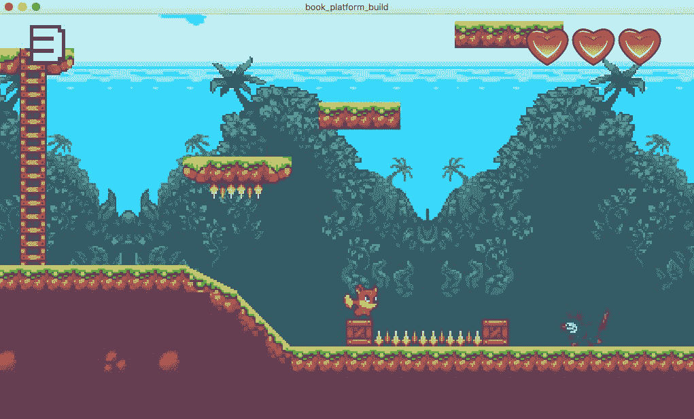

在本项目，您将了解：

+   使用`KinematicBody2D`物理节点

+   结合动画和用户输入以产生复杂的角色行为

+   使用 ParallaxLayers 创建无限滚动的背景

+   组织您的项目并规划扩展

# 项目设置

创建一个新的项目。在您从以下链接下载资源之前，您需要为游戏艺术准备导入设置。本项目使用的艺术资源采用*像素艺术*风格，这意味着它们在没有过滤的情况下看起来最好，这是 Godot 为纹理的默认设置。*过滤*是一种通过平滑图像像素的方法。它可以改善某些艺术作品的外观，但不是基于像素的图像：

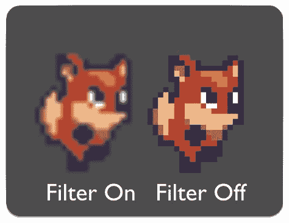

对于每个图像都必须禁用此功能是不方便的，因此 Godot 允许您自定义默认导入设置。在文件系统浮动窗口中单击`icon.png`文件，然后单击右侧场景标签旁边的导入标签。此窗口允许您更改所选文件的导入设置。取消选中过滤属性，然后单击预设并选择将“纹理”设置为默认值。这样，所有图像都将导入时禁用过滤。请参考以下截图：

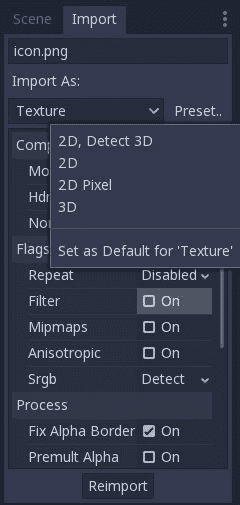

如果您已经导入了图像，它们的导入设置不会自动更新。在更改默认设置后，您必须重新导入任何现有图像。您可以在文件系统浮动窗口中选择多个文件，然后单击重新导入按钮，一次性应用设置到多个文件。

现在，您可以从以下链接下载游戏资源，并在您的项目文件夹中解压缩它们。Godot 将使用新的默认设置导入所有图像，[`github.com/PacktPublishing/Godot-Game-Engine-Projects/releases`](https://github.com/PacktPublishing/Godot-Game-Engine-Projects/releases)

接下来，打开项目 | 项目设置，在渲染/质量下，将使用像素捕捉设置为`开启`。这将确保所有图像都能正确对齐——这在您设计游戏关卡时将非常重要。

当您打开设置窗口时，转到显示/窗口部分，将拉伸/模式更改为`2d`并将纵横比更改为`expand`。这些设置将允许用户在保持图像质量的同时调整游戏窗口的大小。一旦项目完成，您将能够看到此设置的效果。

接下来，设置碰撞层名称，以便更方便地设置不同类型对象之间的碰撞。转到“层名称/2d Physics”并按如下方式命名前四个层：

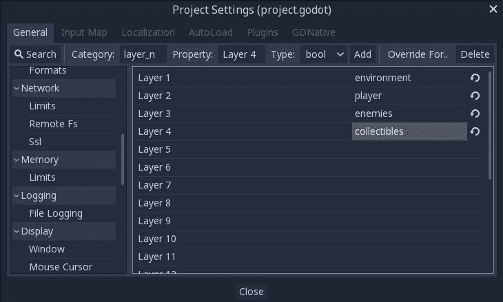

最后，在“输入映射”选项卡下“项目”|“项目设置”中为玩家控制添加以下动作：

| **动作名称** | **按键(s)** |
| --- | --- |
| 向右 | D, → |
| 向左 | A, ← |
| 跳跃 | 空格 |
| 蹲下 | S, ↓ |
| 爬升 | W, ↑ |

# 介绍运动学体

平台游戏需要重力、碰撞、跳跃和其他物理行为，因此您可能会认为 `RigidBody2D` 是实现角色移动的完美选择。然而，在实践中，您会发现刚体的**真实**物理特性对于平台角色来说并不理想。对于玩家来说，真实感不如响应控制和**动作**感重要。因此，作为开发者，您希望对角色的移动和碰撞响应有精确的控制。因此，对于平台角色来说，运动学体通常是更好的选择。

`KinematicBody2D` 节点是为了实现那些需要由用户直接控制或通过代码控制的物体而设计的。这些节点在移动时检测与其他物体的碰撞，但不受全局物理属性（如重力或摩擦）的影响。这并不意味着运动学体不能受到重力和其他力的作用，只是您必须在代码中计算这些力和它们的效果；引擎不会自动移动运动学体。

当移动 `KinematicBody2D` 时，与 `RigidBody2D` 类似，您不应直接设置其 `position`。相反，您可以使用 `move_and_collide()` 或 `move_and_slide()` 方法。这些方法沿着给定的向量移动身体，并在检测到与其他物体的碰撞时立即停止。在 `KinematicBody2D` 碰撞后，任何碰撞响应都必须手动编码。

# 碰撞响应

在碰撞后，您可能希望物体弹跳、沿墙壁滑动或改变它撞击物体的属性。您处理碰撞响应的方式取决于您用于移动物体的方法。

# move_and_collide

当使用 `move_and_collide()` 时，在碰撞发生时，该函数返回一个 `KinematicCollision2D` 对象。此对象包含有关碰撞和碰撞体的信息。您可以使用这些信息来确定响应。请注意，当运动成功完成且没有碰撞时，函数返回 `null`。

例如，如果您想让物体从碰撞对象上弹开，可以使用以下脚本：

```cpp
extends KinematicBody2D

var velocity = Vector2(250, 250)

func _physics_process(delta):
    var collide = move_and_collide(velocity * delta)
    if collide:
        velocity = velocity.bounce(collide.normal)
```

# move_and_slide

滑动是碰撞响应中一个非常常见的选项。想象一下玩家在俯视游戏中沿着墙壁移动或在平台游戏中上下跑斜坡。虽然在使用`move_and_collide()`后可以自己编写这个响应的代码，但`move_and_slide()`提供了一个方便的方式来实现滑动移动。当使用这种方法时，物体将自动沿着碰撞表面滑动。此外，滑动碰撞允许你使用`is_on_floor()`等方法来检测碰撞表面的方向。

由于这个项目不仅需要在地面上移动，还需要在斜坡上跑上跑下，`move_and_slide()` 函数将在你的玩家移动中扮演重要角色。当你构建玩家对象时，你会看到它是如何工作的。

# 玩家场景

打开一个新的场景，并将名为`Player`的`KinematicBody2D`对象作为根添加到场景中，并保存场景（别忘了点击“使子对象不可选择”按钮）。当保存`Player`场景时，你还应该创建一个新的文件夹来包含它。这将有助于在你添加更多场景和脚本时保持你的项目文件夹组织有序。

就像你在其他项目中做的那样，你将在`Player`场景中包含玩家角色需要的功能节点。对于这个游戏，这意味着处理与各种游戏对象的碰撞，包括平台、敌人和可收集物品；显示跑步或跳跃等动作的动画；以及一个跟随玩家在关卡中移动的摄像头。

编写各种动画可能会很快变得难以管理，所以你会使用一个*有限状态机*来管理和跟踪玩家的状态。参见第三章，*逃离迷宫*，回顾如何构建简化的 FSM。你将遵循类似的项目模式。

# 碰撞层/掩码

一个物体的碰撞层属性设置了这个物体所在的层。`Player`需要分配到你在项目设置中命名的玩家层。

碰撞/掩码属性允许你设置身体将检测的对象类型。将`Player`层设置为`player`，其掩码设置为环境、敌人和可收集物品（`1`、`3`和`4`）：

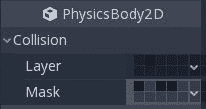

# 精灵

在`Player`中添加一个 Sprite 节点。从 FileSystem 面板拖动`res://assets/player_sheet.png`文件并将其放入`Sprite`的 Texture 属性中。玩家动画以精灵图集的形式保存：


你将使用`AnimationPlayer`来处理动画，所以在`Sprite`的 Animation 属性中，将 Vframes 设置为`1`，将 Hframes 设置为`19`。将 Frame 设置为`7`开始，因为这个帧显示了角色静止不动（它是`idle`动画的第一帧）：

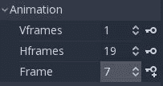

# 碰撞形状

与其他物理体一样，`KinematicBody2D`需要一个形状来定义其碰撞边界。添加一个`CollisionShape2D`对象并在其中创建一个新的`RectangleShape2D`对象。在调整矩形大小时，您希望它达到图像的底部，但不要那么宽。一般来说，使碰撞形状比图像略小，在游戏时会有更好的*感觉*，避免击中看起来不会导致碰撞的东西的体验。

您还需要稍微偏移形状以使其适合。将位置设置为`(0, 5)`效果很好。完成时，它应该看起来大约是这样的：

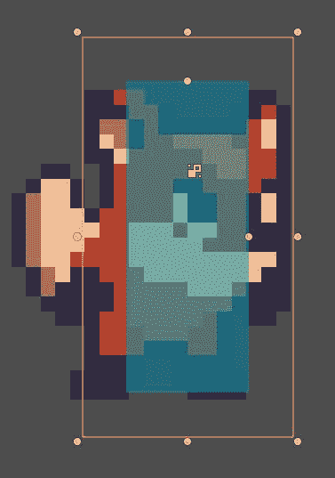

# 形状

一些开发者更喜欢胶囊形状而不是矩形形状用于横版滚动角色。胶囊是一种两端圆润的药片形状碰撞：

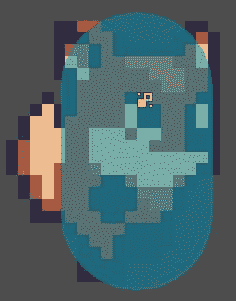

然而，虽然这个形状可能看起来能更好地*覆盖*精灵，但在实现平台式移动时可能会遇到困难。例如，当站在平台边缘太近时，角色可能会因为圆润的底部而滑落，这对玩家来说可能非常令人沮丧。

在某些情况下，根据您角色的复杂性和与其他对象的交互，您可能需要将多个形状添加到同一个对象中。您可能需要在角色的脚下放置一个形状以检测地面碰撞，另一个在其身体上以检测伤害（有时称为受伤框），还有一个覆盖玩家前方以检测与墙壁接触。

建议您坚持使用如图所示的前一个屏幕截图中的`RectangleShape2D`。然而，一旦您完成了项目，您应该尝试将玩家的碰撞形状更改为`CapsuleShape2D`并观察其行为。如果您更喜欢它，请随时使用它代替。

# 动画

将`AnimationPlayer`节点添加到`Player`场景中。您将使用此节点来更改`Sprite`上的帧属性以显示角色的动画。首先创建一个名为`idle`的新动画：


将长度设置为`0.4`秒，并保持步长为`0.1`秒。将`Sprite`的帧更改为`7`，然后点击帧属性旁边的添加关键帧按钮以创建一个新的动画轨道，然后再次点击它，注意它会自动增加帧属性：


持续按住它，直到您有帧`7`到`10`。最后，点击启用/禁用循环按钮以启用循环，然后按播放以查看您的动画。您的动画设置应如下所示：

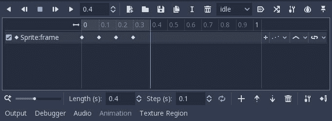

现在，您需要为其他动画重复此过程。以下表格列出了设置列表：

| **名称** | **长度** | **帧** | **循环** |
| --- | --- | --- | --- |
| `idle` | `0.4` | `7, 8, 9 ,10` | on |
| `run` | `0.5` | `13, 14, 15, 16, 17, 18` | on |
| `hurt` | `0.2` | `5, 6` | on |
| `jump_up` | `0.1` | `11` | off |
| `jump_down` | `0.1` | `12` | 0ff |

# 完成场景树

将 `Camera2D` 添加到 `Player` 场景中。这个节点将在玩家在关卡中移动时保持游戏窗口在玩家中心。你还可以使用它来放大玩家，因为像素艺术相对较小。记住，由于你在导入设置中关闭了过滤，当放大时，玩家的纹理将保持像素化和块状。

要启用相机，点击当前属性将其设置为 `On`，然后设置缩放属性为 `(0.4, 0.4)`。小于一的值会使相机拉近，而大于一的值会使相机拉远。

# 玩家状态

玩家角色有多种行为，如跳跃、奔跑和蹲下。编写这样的行为可能会变得非常复杂且难以管理。一种解决方案是使用布尔变量（例如 `is_jumping` 或 `is_running`），但这可能导致可能令人困惑的状态（如果 `is_crouching` 和 `is_jumping` 都为 `true` 会怎样？）并且很快就会导致代码混乱。

解决这个问题的更好方法是使用状态机来处理玩家的当前状态并控制到其他状态的转换。有限状态机在第三章逃离迷宫中进行了讨论。

这里是玩家状态及其之间转换的图示：

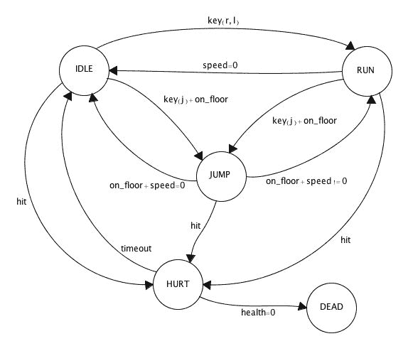

如你所见，状态机图可以变得相当复杂，即使状态数量相对较少。

注意，虽然精灵表包含它们的动画，但蹲下和攀爬动画不包括在内。这是为了在项目开始时保持状态数量可管理。稍后，你将有机会将它们添加到玩家的状态机中。

# 玩家脚本

将一个新的脚本附加到 `Player` 节点上。添加以下代码以创建玩家的状态机：

```cpp
extends KinematicBody2D
enum {IDLE, RUN, JUMP, HURT, DEAD}
var state
var anim
var new_anim

func ready():
    change_state(IDLE)

func change_state(new_state):
    state = new_state
    match state:
        IDLE:
            new_anim = 'idle'
        RUN:
            new_anim = 'run'
        HURT:
            new_anim = 'hurt'
        JUMP:
            new_anim = 'jump_up'
        DEAD:
            hide()

func _physics_process(delta):
    if new_anim != anim:
        anim = new_anim
        $AnimationPlayer.play(anim)
```

再次提醒，你正在使用 `enum` 来列出系统允许的状态。当你想要改变玩家的状态时，你会调用 `change_state()`，例如：`change_state(IDLE)`。目前，脚本只改变动画值，但之后你将添加更多状态功能。

你可能会问，为什么不在状态改变时直接播放动画？为什么要引入新的动画业务？这是因为当你对 `AnimationPlayer` 调用 `play()` 时，它会从动画的开始处开始播放。如果你在运行时这样做，例如，你将只能看到跑步动画的第一帧，因为每一帧都会重新开始。通过使用 `new_anim` 变量，你可以让当前动画继续平滑播放，直到你想要改变它。

# 玩家移动

玩家需要三个控制键——左、右和跳跃。当前状态与按下的键的组合将触发状态改变，如果状态规则允许转换的话。添加 `get_input()` 函数来处理输入并确定结果：

```cpp
extends KinematicBody2D

export (int) var run_speed
export (int) var jump_speed
export (int) var gravity

enum {IDLE, RUN, JUMP, HURT, DEAD}
var state
var anim
var new_anim
var velocity = Vector2()

func get_input():
    if state == HURT:
        return # don't allow movement during hurt state
    var right = Input.is_action_pressed('right')
    var left = Input.is_action_pressed('left')
    var jump = Input.is_action_just_pressed('jump')

    # movement occurs in all states
    velocity.x = 0
    if right:
        velocity.x += run_speed
        $Sprite.flip_h = false
    if left:
        velocity.x -= run_speed
        $Sprite.flip_h = true
    # only allow jumping when on the ground
    if jump and is_on_floor():
        change_state(JUMP)
        velocity.y = jump_speed
    # IDLE transitions to RUN when moving
    if state == IDLE and velocity.x != 0:
        change_state(RUN)
    # RUN transitions to IDLE when standing still
    if state == RUN and velocity.x == 0:
        change_state(IDLE)
    # transition to JUMP when falling off an edge
    if state in [IDLE, RUN] and !is_on_floor():
        change_state(JUMP)
```

注意，跳跃检查使用的是`is_action_just_pressed()`而不是`is_action_pressed()`。虽然后者只要按键按下就会始终返回`true`，但前者只有在按键按下后的帧中才是`true`。这意味着玩家必须每次想要跳跃时都按下跳跃键。

现在，从`_physics_process()`函数中调用此函数，将重力拉力添加到玩家的`velocity`中，然后调用`move_and_slide()`方法来移动身体：

```cpp
func _physics_process(delta):
    velocity.y += gravity * delta
    get_input()
    if new_anim != anim:
        anim = new_anim
        $AnimationPlayer.play(anim)
    # move the player
    velocity = move_and_slide(velocity, Vector2(0, -1))
```

`move_and_slide()`的第二个参数是一个*法线*向量，表示引擎应考虑为地面的表面方向。在物理学和几何学中，*法线*是一个垂直于表面的向量，定义了表面的朝向方向。使用`(0, -1)`，这是一个向上指的向量，水平表面的顶部将被视为地面。请参考以下截图：


在使用`move_and_slide()`移动后，物理引擎将使用这些信息来设置`is_on_floor()`、`is_on_wall()`和`is_on_ceiling`方法。你可以在移动后添加以下内容来检测跳跃何时结束：

```cpp
    if state == JUMP and is_on_floor():
        change_state(IDLE)
```

最后，如果动画在下落时从`jump_up`切换到`jump_down`，跳跃看起来会更好：

```cpp
    if state == JUMP and velocity.y > 0:        new_anim = 'jump_down'Testing the moves
```

在这一点上，测试移动并确保一切正常工作是个好主意。但你不能只是运行玩家场景，因为玩家会因为没有站立表面而开始下落。

创建一个新的场景并添加一个名为`Main`的`Node`（稍后，这将成为你的真实主场景）。添加一个`Player`实例，然后添加一个带有矩形`CollisionShape2D`的`StaticBody2D`。将碰撞形状水平拉伸，使其足够宽，可以来回走动（就像一个平台）并将其放置在角色下方：

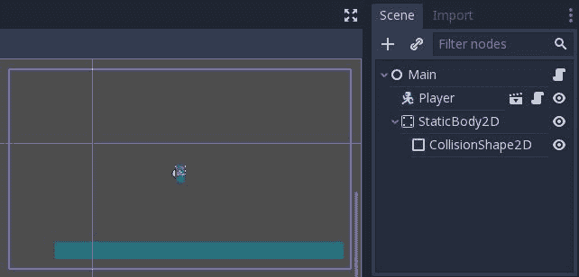

按下“播放场景”，你应该看到玩家在撞击静态身体时停止下落并运行`idle`动画。

在继续之前，请确保所有移动和动画都正常工作。在所有方向上跑和跳，并检查状态改变时是否播放了正确的动画。如果你发现任何问题，请回顾前面的部分，并确保你没有错过任何步骤。

之后，一旦关卡完成，玩家将获得一个出生位置。为了处理这个问题，将此函数添加到`Player.gd`脚本中：

```cpp
func start(pos):
    position = pos
    show()
    change_state(IDLE)
```

# 玩家健康

最终，玩家会遇到危险，因此你应该添加一个伤害系统。玩家将开始时有三个*心形*，每次受伤都会失去一个。

将以下内容添加到脚本顶部：

```cpp
signal life_changed
signal dead

var life
```

当`life`的值改变时，`life_changed`信号将被发出，通知显示更新。当`life`达到`0`时，将发出`dead`。将这两行添加到`start()`函数中：

```cpp
    life = 3
    emit_signal('life_changed', life)
```

玩家受伤有两种可能的方式：在环境中撞到*尖刺*对象，或者被敌人击中。在任何一种情况下，都可以调用以下函数：

```cpp
func hurt():
    if state != HURT:
        change_state(HURT)
```

这是对玩家的一种友好行为：如果他们已经受伤，他们就不能再次受伤（至少在*受伤*动画停止播放的短暂时间内）。

当`change_state()`中的状态变为`HURT`时，需要执行几件事情：

```cpp
HURT:
    new_anim = 'hurt'
    velocity.y = -200
    velocity.x = -100 * sign(velocity.x)
    life -= 1
    emit_signal('life_changed', life)
    yield(get_tree().create_timer(0.5), 'timeout')
    change_state(IDLE)
    if life <= 0:
        change_state(DEAD)
DEAD:
    emit_signal('dead')
    hide()
```

不仅玩家会失去生命，他们还会被弹起并远离造成伤害的对象。经过一段时间后，状态会变回`IDLE`。

此外，当玩家处于`HURT`状态时，将禁用输入。将以下内容添加到`get_input()`的开始部分：

```cpp
if state == HURT:
    return
```

现在，当游戏的其他部分设置完毕后，玩家就可以开始承受伤害了。

# 可收集物品

在你开始制作关卡之前，你需要为玩家创建一些可收集的物品，因为那些也将是关卡的一部分。`assets/sprites`文件夹包含两种类型可收集物品的精灵图集：樱桃和宝石。

而不是为每种类型的物品创建单独的场景，你可以使用一个单一的场景，只需更换精灵图集纹理即可。这两个对象将具有相同的行为：在原地动画并在被玩家接触时消失（即被收集）。你还可以为拾取动作添加一个`Tween`动画（参见第一章，*简介*，以获取示例）。

# 可收集场景

使用`Area2D`启动新场景并将其命名为`Collectible`。区域是这些对象的好选择，因为你想要检测玩家何时接触它们（使用`body_entered`信号），但你不需要从它们那里获得碰撞响应。在检查器中，将碰撞/层设置为可收集物品（层 4）和碰撞/掩码设置为玩家（层 2）。这将确保只有`Player`节点能够收集物品，而敌人将直接穿过。

添加三个子节点：`Sprite`、`CollisionShape2D`和`AnimationPlayer`，然后将`res://assets/cherry.png`精灵图集拖放到精灵的纹理中。将 Vframes 设置为`1`，Hframes 设置为`5`。向`CollisionShape2D`添加一个矩形形状并适当调整其大小。

作为一般规则，你应该调整你的对象的碰撞形状，以便它们对玩家有益。这意味着敌人的击中框应该通常比图像略小，而有益物品的击中框应该略微放大。这减少了玩家的挫败感，并导致更好的游戏体验。

向`AnimationPlayer`添加一个新的动画（你只需要一个，所以你可以直接命名为`anim`）。将长度设置为`1.6`秒，步长设置为`0.2`秒。

将精灵的帧属性设置为`0`并单击关键帧按钮以创建轨迹。当你达到第四帧时，开始按顺序反向回到`1`。完整的关键帧序列应该是：

```cpp
0 → 1 → 2 → 3 → 4 → 3 → 2 → 1 
```

启用循环并按下播放按钮。现在，你有一个漂亮的樱桃动画了！将`res://assets/gem.png`拖入纹理中，并检查它是否也进行了动画处理。最后，点击“加载时自动播放”按钮，以确保动画将在场景开始时自动播放。请参考以下截图：


# 可收集物品脚本

可收集物品的脚本需要完成两件事：

+   设置起始条件（`texture`和`position`）

+   检测玩家何时进入区域

对于第一部分，将以下代码添加到新脚本中：

```cpp
extends Area2D

signal pickup

var textures = {'cherry': 'res://assets/sprites/cherry.png',
                'gem': 'res://assets/sprites/gem.png'}

func init(type, pos):
    $Sprite.texture = load(textures[type])
    position = pos
```

当玩家收集物品时，将发出`pickup`信号。在`textures`字典中，你有一个物品类型及其对应纹理位置的列表。请注意，你可以通过在 FileSystem 窗口中右键单击文件并选择“复制路径”来快速粘贴这些文件路径：


接下来，你有一个`init()`函数，它将`texture`和`position`设置为给定的值。级别脚本将使用此函数来生成你添加到级别地图中的所有可收集物品。

最后，你需要检测物体何时被拾起。点击`Area2D`并连接其`body_entered`信号。将以下代码添加到创建的函数中：

```cpp
func _on_Collectible_body_entered(body):
    emit_signal('pickup')
    queue_free()
```

发出信号将允许游戏脚本适当地对物品拾取做出反应。它可以增加分数、提高玩家的速度，或者实现你希望物品产生的任何其他效果。

# 设计级别

如果没有跳跃，那就不是平台游戏。对于大多数读者来说，这一部分将占用最多的时间。一旦你开始设计一个级别，你会发现布置所有部件、创建挑战性的跳跃、秘密路径和危险遭遇非常有趣。

首先，你将创建一个通用的`Level`场景，包含所有级别共有的节点和代码。然后你可以创建任意数量的级别场景，这些场景继承自这个主级别。

# TileSet 配置

在项目开始时下载的`assets`文件夹中有一个`tilesets`文件夹。它包含三个使用 16x16 艺术风格的预制的`TileSet`资源：

+   `tiles_world.tres`：地面和平台瓦片

+   `tiles_items.tres`：装饰物品、前景物体和可收集物品

+   `tiles_spikes.tres`：危险物品

建议你使用这些瓦片集来创建本项目的级别。然而，如果你更愿意自己制作，原始艺术作品在`res://assets/environment/layers`中。参见第二章，*Coin Dash*，以复习如何创建`TileSet`资源。

# 基础级别设置

创建一个新的场景并添加一个名为`Level`的`Node2D`。将场景保存在名为`levels`的新文件夹中。这是你保存从`Level.tscn`继承的所有其他级别的位置。所有级别的节点层次结构都将相同——只有布局会有所不同。

接下来，添加一个`TileMap`并将其单元格/大小设置为`(16, 16)`，然后将其复制三次（按*Ctrl* + *D*复制节点）。这些将是你的关卡层，包含不同的瓦片和布局信息。将四个`TileMap`实例命名为以下名称，并将相应的`TileSet`拖放到每个的“Tile Set”属性中。请参考以下表格：

| **TileMap** | **Tile Set** |
| --- | --- |
| `World` | `tiles_world.tres` |
| `Objects` | `tiles_items.tres` |
| `Pickups` | `tiles_items.tres` |
| `Danger` | `tiles_spikes.tres` |

在你制作地图时按下`TileMap`节点的锁定按钮是个好主意，以防止意外移动它们。

接下来，添加一个`Player`场景和一个名为`PlayerSpawn`的`Position2D`。点击`Player`上的隐藏按钮——你将在关卡脚本中使用`show()`使玩家在开始时出现。你的场景树现在应该看起来像这样：

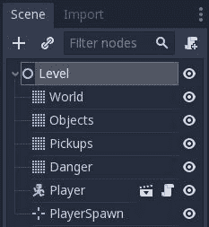

将脚本附加到`Level`节点：

```cpp
extends Node2D

onready var pickups = $Pickups

func _ready():
    pickups.hide()
    $Player.start($PlayerSpawn.position)
```

之后，你将扫描`Pickups`地图以在指定位置生成可收集物品。这个地图层本身不应该被看到，但与其在场景树中将它设置为隐藏，这很容易在运行游戏之前忘记，你可以在`_ready()`中确保它在游戏过程中始终隐藏。因为将会有许多对节点的引用，将`$Pickups`的结果存储在`pickups`变量中会缓存结果。（记住，`$NodeName`与写入`get_node("NodeName")`相同。）

# 设计第一个关卡

现在，你准备好开始绘制关卡了！点击“场景”|“新建继承场景”并选择`Level.tscn`。将新节点命名为`Level01`并保存（仍在`levels`文件夹中）。

从`World`地图开始，发挥创意。你喜欢很多跳跃，还是曲折的隧道去探索？长跑，还是小心翼翼的向上攀登？

在深入设计之前，尝试跳跃距离。你可以通过更改玩家的`jump_speed`、`run_speed`和`gravity`属性来改变他们可以跳多高和多远。设置一些不同的间隙大小并运行场景来尝试它们。别忘了将`PlayerSpawn`节点拖到你想让角色开始的位置。

例如，玩家能否完成这个跳跃？请查看以下截图：

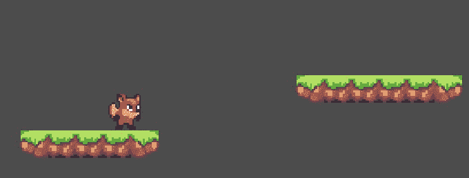

你设置玩家运动属性的方式将对你的关卡布局产生重大影响。在花费太多时间在完整设计之前，确保你对设置满意。

一旦你设置了`World`层，使用`Objects`层放置装饰和点缀，如植物、岩石和藤蔓。

使用`Pickups`层标记你将生成可收集物品的位置。有两种类型：宝石和樱桃。生成它们的瓦片以洋红色背景绘制，以便突出显示。记住，它们将在运行时被实际物品替换，而瓦片本身将不会被看到。

一旦你布置好你的关卡，你可以限制玩家相机的水平滚动以匹配地图的大小（并在每端各加 5 个方块缓冲区）：

```cpp
signal score_changed
var score 

func _ready():
    score = 0
    emit_signal('score_changed', score)
    pickups.hide()
    $Player.start($PlayerSpawn.position)
    set_camera_limits()

func set_camera_limits():
    var map_size = $World.get_used_rect()
    var cell_size = $World.cell_size
    $Player/Camera2D.limit_left = (map_size.position.x - 5) * cell_size.x
    $Player/Camera2D.limit_right = (map_size.end.x + 5) * cell_size.x
```

脚本还需要扫描`Pickups`层并查找物品标记：

```cpp
func spawn_pickups():
    for cell in pickups.get_used_cells():
        var id = pickups.get_cellv(cell)
        var type = pickups.tile_set.tile_get_name(id)
        if type in ['gem', 'cherry']:
            var c = Collectible.instance()
            var pos = pickups.map_to_world(cell)
            c.init(type, pos + pickups.cell_size/2)
            add_child(c)
            c.connect('pickup', self, '_on_Collectible_pickup')

func _on_Collectible_pickup():
    score += 1
    emit_signal('score_changed', score)

func _on_Player_dead():
    pass
```

此函数使用`get_used_cells()`获取`Pickups`地图上使用的瓦片的数组。`TileMap`将每个瓦片的值设置为引用`TileSet`中单个瓦片对象的`id`。然后你可以使用`tile_set.tile_get_name()`查询`TileSet`以获取瓦片的名称。

将`spawn_pickups()`添加到`_ready()`中，并在脚本顶部添加以下内容：

```cpp
var Collectible = preload('res://items/Collectible.tscn')
```

尝试运行你的关卡，你应该能看到你放置的宝石和/或樱桃出现在那里。同时检查它们在你遇到它们时是否会消失。

# 滚动背景

在`res://assets/environment/layers`文件夹中有两个背景图像：`back.png`和`middle.png`，分别用于远背景和近背景。通过将这些图像放置在瓦片地图后面并以相对于相机的不同速度滚动，你可以在背景中创建一个吸引人的深度错觉。

首先，将`ParallaxBackground`节点添加到`Level`场景中。此节点与相机自动协同工作，以创建滚动效果。将此节点拖动到场景树顶部，以便它将在其余节点之后绘制。接下来，将`ParallaxLayer`节点作为子节点添加——`ParallaxBackground`可以有任意数量的`ParallaxLayer`子节点，允许你创建多个独立滚动的层。将`Sprite`节点作为子节点添加到`ParallaxLayer`，并将`res://assets/environment/layers/back.png`图像拖动到纹理中。 重要——取消选中精灵旁边`Centered`属性旁边的框。

背景图像有点小，所以将精灵的缩放设置为`(1.5, 1.5)`。

在`ParallaxLayer`上，将运动/缩放设置为`(0.2, 1)`。此设置控制背景相对于相机的滚动速度。通过将其设置为低数值，背景将在玩家左右移动时仅移动一小段距离。

接下来，你想要确保如果你的关卡非常宽，图像会重复，所以将镜像设置为`(576, 0)`。这正是图像的宽度（`384`乘以`1.5`），所以当图像移动了这么多距离时，图像将会重复。

注意，这种背景最适合宽关卡而不是高关卡。如果你跳得太高，你会到达背景图像的顶部，然后突然看到灰色的空白。你可以通过设置相机的顶部限制来修复这个问题。如果你没有移动它，图像的左上角将位于`(0, 0)`，因此你可以将相机的顶部限制设置为`0`。如果你已经移动了`ParallaxLayer`，你可以通过查看节点的`y`值来找到正确的值。

现在，为中间背景层添加另一个`ParallaxLayer`（作为第一个的兄弟），并给它一个`Sprite`子项。这次，使用`res://assets/environment/layers/middle.png`纹理。这个纹理比云/天空图像窄得多，所以你需要做一些额外的调整来使其正确重复。这是因为`ParallaxBackground`需要具有至少与视口区域一样大的图像。

首先，在 FileSystem 窗口中点击纹理，并选择导入标签。将重复属性更改为镜像，并勾选 Mipmaps。按重新导入。现在，纹理可以重复以填充屏幕（并且透视系统将在之后重复它）：

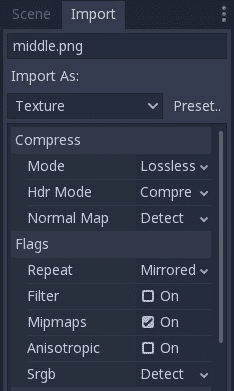

图片的原始大小是`176x368`，需要水平重复。在`Sprite`属性中，点击启用区域。接下来，将矩形属性设置为`(0, 0, 880, 368)`（880 是 176 乘以 5，所以你现在应该看到五次图片的重复）。移动`ParallaxLayer`，使图片与海洋/云图片的下半部分重叠：

将`ParallaxLayer`的 Motion/Scale 设置为`(0.6, 1)`，将镜像设置为`(880, 0)`。使用更高的缩放因子意味着这个层将比后面的云层滚动得更快，从而产生令人满意的深度效果，如以下截图所示：

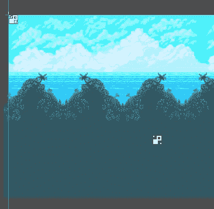

一旦你确定一切正常工作，尝试调整两个层的缩放值，看看它如何变化。例如，尝试在中间层使用`(1.2, 1)`的值，以获得非常不同的视觉效果。

你主场景的树现在应该看起来像这样：

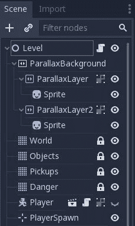

# 危险物品

危险地图层是用来存放如果被触摸会伤害玩家的尖刺对象的。尝试在你的地图上放置几个它们，这样你可以轻松测试撞到它们。注意，由于 TileMaps 的工作方式，与这个层上的任何瓷砖发生碰撞都会对玩家造成伤害！

# 关于滑动碰撞

当使用`move_and_slide()`移动`KinematicBody2D`时，它可能在给定帧内与多个对象发生碰撞。例如，当撞到角落时，角色可能会同时撞到墙和地板。你可以使用`get_slide_count()`方法找出发生了多少次碰撞，然后使用`get_slide_collision()`获取每次碰撞的信息。

在`Player`的情况下，你想要检测当与危险`TileMap`对象发生碰撞时。你可以在使用`Player.gd`中的`move_and_slide()`之后这样做：

```cpp
    velocity = move_and_slide(velocity, Vector2(0, -1))
    if state == HURT:
        return
    for idx in range(get_slide_count()):
        var collision = get_slide_collision(idx)
        if collision.collider.name == 'Danger':
            hurt()
```

在检查与`Danger`的碰撞之前，你可以检查玩家是否已经处于`HURT`状态，如果是的话就跳过检查。接下来，你必须使用`get_slide_count()`来遍历可能发生的任何碰撞。对于每一个，你可以检查`collider.name`是否为`Danger`。

运行场景，并尝试撞到其中一个尖刺对象。就像你之前在`hurt()`函数中写的，你应该看到玩家在短时间内变为`HURT`状态，然后返回到`IDLE`状态。经过三次打击后，玩家进入`DEAD`状态，当前设置可见性为隐藏。

# 敌人

目前，地图非常空旷，所以是时候添加一些敌人来活跃一下气氛了。

你可以为敌人创建许多不同的行为。对于这个项目，敌人将沿着平台直线行走，并在碰到障碍物时改变方向。

# 场景设置

从`KinematicBody2D`开始，有三个子节点：`Sprite`、`AnimationPlayer`和`CollisionShape2D`。将场景保存为`enemies`文件夹中的`Enemy.tscn`。如果你决定为游戏添加更多敌人类型，你都可以在这里保存。

将身体的碰撞层设置为`enemies`，并将其碰撞掩码设置为`environment`、`player`和`enemies`。将敌人分组也是有用的，因此点击节点标签页，并将身体添加到名为`enemies`的组中。

将`res://assets/opossum.png`精灵图集添加到精灵的纹理。将 Vframes 设置为`1`，Hframes 设置为`6`。添加一个矩形碰撞形状，覆盖图像的大部分（但不是全部），确保碰撞形状的底部与图像脚部的底部对齐：

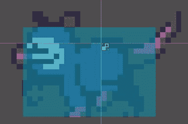

向`AnimationPlayer`添加一个新的动画，命名为`walk`。将长度设置为`0.6`秒，步长设置为`0.1`秒。开启循环和自动播放。

`walk`动画将有两个轨道：一个设置纹理属性，一个更改帧属性。点击纹理旁边的添加关键帧按钮一次以添加第一个轨道，然后点击帧旁边的按钮并重复，直到你有`0`到`5`的帧。按播放并验证行走动画是否正确播放。动画面板应该看起来像这样：


# 脚本

添加以下脚本：

```cpp
extends KinematicBody2D

export (int) var speed
export (int) var gravity

var velocity = Vector2()
var facing = 1

func _physics_process(delta):
    $Sprite.flip_h = velocity.x > 0
    velocity.y += gravity * delta
    velocity.x = facing * speed

    velocity = move_and_slide(velocity, Vector2(0, -1))
    for idx in range(get_slide_count()):
        var collision = get_slide_collision(idx)
        if collision.collider.name == 'Player':
            collision.collider.hurt()
        if collision.normal.x != 0:
            facing = sign(collision.normal.x)
            velocity.y = -100

    if position.y > 1000:
        queue_free()
```

在这个脚本中，`facing`变量跟踪移动方向（`1`或`-1`）。与玩家一样，在移动时，你遍历滑动碰撞。如果碰撞的对象是`Player`，你调用它的`hurt()`函数。

接下来，你可以检查碰撞体的法线向量是否有非`0`的`x`分量。这意味着它指向左边或右边（即，它是一堵墙、一个箱子或其他障碍物）。*法线*的方向用于设置新的朝向。最后，给身体一个小的向上速度会使反向过渡看起来更有吸引力。

最后，如果由于某种原因，敌人从平台上掉落，你不想让游戏永远跟踪它的掉落，所以删除任何`y`坐标变得太大的敌人。

在检查器中将速度设置为`50`，重力设置为`900`，然后在你的关卡场景中创建一个`Enemy`。确保它两侧都有一个障碍物，并播放场景。检查敌人是否在障碍物之间来回走动。尝试将玩家放在它的路径上，并验证玩家的`hurt()`方法是否被调用。

# 损害敌人

如果玩家不能反击，那就太不公平了，所以按照超级马里奥兄弟的传统，跳到敌人的上面可以击败它。

首先，向`Enemy`的`AnimationPlayer`添加一个新的动画，命名为`death`。将长度设置为`0.3`秒，步长设置为`0.05`。**不要**为这个动画开启循环。

这个动画还将设置纹理和帧。这次，在添加该属性的帧之前，将`res://assets/enemy-death.png`图像拖入精灵的纹理中。和之前一样，将所有`帧`值从`0`到`5`全部设置为关键帧。按播放键查看死亡动画的运行情况。

将以下代码添加到`Enemy`的脚本中：

```cpp
func take_damage():
    $AnimationPlayer.play('death')
    $CollisionShape2D.disabled = true
    set_physics_process(false)
```

当`Player`在正确条件下击中`Enemy`时，它将调用`take_damage()`，这将播放`death`动画。它还禁用了动画期间的碰撞和移动。

当`death`动画完成后，可以移除敌人，因此连接`AnimationPlayer`的`animation_finished()`信号。这个信号在每次动画完成后都会被调用，所以你需要检查它是否正确：

```cpp
func _on_AnimationPlayer_animation_finished(anim_name):
  if anim_name == 'death':
    queue_free()
```

为了完成这个过程，转到`Player.gd`脚本，并在`_physics_process()`方法中的碰撞检查中添加以下内容：

```cpp
for idx in range(get_slide_count()):
    var collision = get_slide_collision(idx)
    if collision.collider.name == 'Danger':
        hurt()
    if collision.collider.is_in_group('enemies'):
        var player_feet = (position + $CollisionShape2D.shape.extents).y
        if player_feet < collision.collider.position.y:
            collision.collider.take_damage()
            velocity.y = -200
        else:
            hurt()
```

此代码检查玩家的脚的 y 坐标（即碰撞形状的底部）与敌人的 y 坐标。如果玩家更高，敌人会受到伤害；否则，玩家会受到伤害。

运行关卡并尝试跳到敌人身上，以确保一切按预期工作。

# HUD

HUD 的目的是在游戏过程中显示玩家需要知道的信息。收集物品会增加玩家的分数，因此需要显示这一信息。玩家还需要看到他们剩余的生命值，这将以一系列心形图案显示。

# 场景设置

创建一个新的场景，并使用`MarginContainer`节点。将其命名为`HUD`并保存在`ui`文件夹中。将布局设置为顶部宽。在检查器的自定义常量部分，设置以下值：

+   右侧边距：`50`

+   顶部边距：`20`

+   左侧边距：`50`

+   底部边距：`20`

添加一个`HBoxContainer`节点。这个节点将包含所有 UI 元素并保持它们的对齐。它将有两个子节点：

+   `Label`：`ScoreLabel`

+   `HBoxContainer`：`LifeCounter`

在 `ScoreLabel` 上设置文本属性为 `1`，并在大小标志下设置水平为填充和扩展。使用 `res://assets/Kenney Thick.ttf` 从 `assets` 文件夹添加一个自定义 `DynamicFont`，字体大小为 `48`。在自定义颜色部分，将字体颜色设置为 `white`，字体颜色阴影设置为 `black`。最后，在自定义常量下，将阴影偏移 X、阴影偏移 Y 和阴影轮廓都设置为 `5`。你应该看到一个带有黑色轮廓的大白数字 `1`。

对于 `LifeCounter`，添加一个 `TextureRect` 并命名为 `L1`。将 `res://assets/heart.png` 拖入其纹理中，并将拉伸模式设置为 `Keep Aspect Centered`。点击节点并按 *Ctrl* + *D* 四次，以便得到一排五颗心：


完成后，你的 HUD 应该看起来像这样：


# 脚本

这是 `HUD` 的脚本：

```cpp
extends MarginContainer

onready var life_counter = [$HBoxContainer/LifeCounter/L1,
                            $HBoxContainer/LifeCounter/L2,
                            $HBoxContainer/LifeCounter/L3,
                            $HBoxContainer/LifeCounter/L4,
                            $HBoxContainer/LifeCounter/L5]

func _on_Player_life_changed(value):
    for heart in range(life_counter.size()):
        life_counter[heart].visible = value > heart

func _on_score_changed(value):
    $HBoxContainer/ScoreLabel.text = str(value)
```

首先，你创建一个包含五个生命指示器的引用数组。然后，在 `_on_Player_life_changed()` 方法中，当玩家受伤或恢复时会被调用，你通过设置 `visible` 为 `false` 来计算显示多少颗心，如果心形数量少于生命值。

`_on_score_changed()` 类似，当被调用时改变 `ScoreLabel` 的值。

# 添加 HUD

打开 `Level.tscn`（基础关卡场景，*不是*你的 `Level01` 场景）并添加一个 `CanvasLayer` 节点。将 `HUD` 场景作为其子节点实例化。

点击 `Player` 节点，将其 `life_changed` 信号连接到 HUD 的 `_on_Player_life_changed()` 方法：

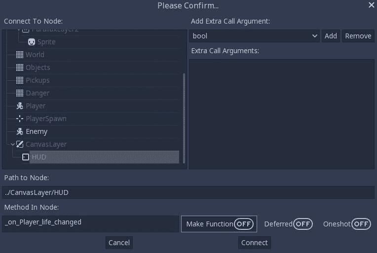

接下来，用 `Level` 节点的 `score_changed` 信号做同样的事情，将其连接到 HUD 的 `_on_score_changed`。

**另一种方法：**注意，如果你不想使用场景树来连接信号，或者如果你觉得信号连接窗口令人困惑，你可以在 `Level.gd` 的 `_ready()` 函数中添加这两行代码来完成相同的事情：

```cpp
$Player.connect('life_changed', $CanvasLayer/HUD,  
                '_on_Player_life_changed')
$Player.connect('dead', self, '_on_Player_dead')
connect('score_changed', $CanvasLayer/HUD, '_on_score_changed') 
```

运行你的关卡，并验证在收集物品时获得分数，在受伤时失去生命值。

# 标题屏幕

标题屏幕是玩家看到的第一个场景。当玩家死亡时，游戏将返回此场景并允许你重新开始。

# 场景设置

从一个 `Control` 节点开始，并将布局设置为全矩形。

添加一个 `TextureRect`。将其纹理设置为 `res://assets/environment/layers/back.png`，布局为全矩形，拉伸模式为保持纵横比。

添加另一个 `TextureRect`，这次使用 `res://assets/environment/layers/middle.png` 作为纹理，并将拉伸模式设置为平铺。将矩形的宽度拖动到比屏幕宽，并调整它以覆盖屏幕下半部分。

接下来，添加两个 `Label` 节点（`Title` 和 `Message`），并使用之前为分数标签使用的相同选项设置它们的自定义字体设置。将它们的文本属性分别设置为 Jungle Jump 和 Press Space to Play。完成时，屏幕应该看起来像这样：


要使标题屏幕更有趣，添加一个`AnimationPlayer`节点并创建一个新的动画。将其命名为`anim`并设置为自动播放。在这个动画中，您可以动画化屏幕的各种组件，使它们移动、出现、淡入或您喜欢的任何其他效果。

将标题标签拖动到屏幕顶部的上方并添加一个关键帧。然后，将其拖回（或手动输入位置值）并在大约`0.5`秒处设置另一个关键帧。您可以自由添加动画其他节点属性的轨道。

例如，这里有一个动画，它将标题下拉，淡入两个纹理，然后显示消息（注意每个轨道修改的属性名称）：


# 主场景

删除您添加到临时`Main.tscn`（`Player`实例和测试`StaticBody2D`）中的额外节点。现在这个场景将负责加载当前等级。然而，在它能够这样做之前，您需要一个 Autoload 脚本来跟踪游戏状态：例如`current_level`和其他需要从场景到场景携带的数据。

在脚本编辑器中添加一个新的脚本`GameState.gd`，并添加以下代码：

```cpp
extends Node

var num_levels = 2
var current_level = 1

var game_scene = 'res://Main.tscn'
var title_screen = 'res://ui/TitleScreen.tscn'

func restart():
    get_tree().change_scene(title_screen)

func next_level():
    current_level += 1
    if current_level <= num_levels:
        get_tree().reload_current_scene()
```

注意，您应该将`num_levels`设置为在`levels`文件夹中制作的等级数量。确保它们命名一致（`Level01.tscn`、`Level02.tscn`等），然后您可以自动加载序列中的下一个。

在项目设置的 Autoload 标签中添加此脚本，并将其添加到`Main`：

```cpp
extends Node

func _ready():
    # make sure your level numbers are 2 digits ("01", etc.)
    var level_num = str(GameState.current_level).pad_zeros(2)
    var path = 'res://levels/Level%s.tscn' % level_num
    var map = load(path).instance()
    add_child(map)
```

现在，每当加载`Main`场景时，它将加载与`GameState.current_level`对应的等级场景。

标题屏幕需要过渡到游戏场景，因此将此脚本附加到`TitleScreen`节点：

```cpp
extends Control

func _input(event):
    if event.is_action_pressed('ui_select'):
        get_tree().change_scene(GameState.game_scene)
```

您也可以通过将重启函数添加到`Level.gd`中的方法来在玩家死亡时调用它：

```cpp
func _on_Player_dead():
    GameState.restart()
```

# 等级过渡

您的等级现在需要一种从一级过渡到下一级的方式。在`res://assets/environment/layers/props.png`精灵图中，有一个可以用于您等级出口的门图像。找到并走进门，玩家将移动到下一级。

# 门场景

创建一个新的场景，命名为`Area2D`的`Door`，并将其保存在`items`文件夹中。添加一个`Sprite`，使用`res://assets/environment/layers/props.png`精灵图，并使用`Region`设置选择门图像，然后附加一个矩形的`CollisionShape2D`。这个场景不需要脚本，因为您只是将要使用区域的`body_entered`信号。

将门放在`collectibles`层上，并设置其遮罩只扫描`player`层。

在您的第一个等级中实例化此门场景，并将其放置在玩家可以到达的地方。单击`Door`节点，将`body_entered`信号连接到您可以添加此代码的`Level.gd`脚本：

```cpp
func _on_Door_body_entered(body):
    GameState.next_level()
```

运行游戏并尝试撞上门以检查它是否立即转移到下一级。

# 最后的修饰

现在你已经完成了游戏的结构，你可以考虑添加一些内容，以便你可以添加更多游戏功能、更多视觉效果、额外的敌人或你可能有的其他想法。在本节中，有一些建议的功能——直接添加或根据你的喜好进行调整。

# 声音效果

与之前的项目一样，你可以添加音效和音乐来提升游戏体验。在`res://assets/audio`文件夹中，你可以找到用于各种游戏事件（如玩家跳跃、敌人击中和拾取）的多个文件。还有两首音乐文件：标题屏幕的 Intro Theme 和关卡场景的 Grasslands Theme。

将这些添加到游戏中将由你来完成，但这里有一些提示：

+   确保在导入设置选项卡中，音效的 Loop 设置为 Off，而音乐文件的 Loop 设置为 On。

+   你可能会发现调整单个声音的音量很有帮助。这可以通过 Volume Db 属性来设置。设置负值将降低声音的音量。

+   你可以将音乐附加到主`Level.tscn`，并且该音乐将用于所有关卡（将`AudioStreamPlayer`设置为自动播放）。

+   如果你想要为单个关卡设置特定的氛围，你也可以为它们附加单独的音乐。

# 无限坠落

根据你如何设计你的关卡，玩家可能完全掉出关卡。通常，你希望通过使用太高而无法跳跃的墙壁、坑底的尖刺等方式来设计，使得这种情况不可能发生。但是，如果确实发生了，请将以下代码添加到玩家的`_physics_process()`方法中：

```cpp
if position.y > 1000:
    change_state(DEAD)
```

注意，如果你设计的关卡延伸到了`y`坐标的`1000`以下，你需要增加该值以防止意外死亡。

# 双重跳跃

双重跳跃是平台游戏中的一个流行功能。如果玩家在空中按下跳跃键第二次，他们会获得第二次，通常是较小的向上推力。要实现这个功能，你需要向玩家脚本中添加一些内容。

首先，你需要两个变量来跟踪状态：

```cpp
var max_jumps = 2
var jump_count = 0
```

当进入`JUMP`状态时，重置跳跃次数：

```cpp
JUMP:
    new_anim = 'jump_up'
    jump_count = 1
```

最后，在`get_input()`函数中，如果满足条件则允许跳跃：

```cpp
if jump and state == JUMP and jump_count < max_jumps:
    new_anim = 'jump_up'
    velocity.y = jump_speed / 1.5
    jump_count += 1
```

注意，这会使第二次跳跃的速度是正常跳跃的 2/3。你可以根据你的喜好进行调整。

# 灰尘颗粒

角色脚下的灰尘颗粒是一种低成本的特效，可以为玩家的动作增添许多特色。在本节中，你将为玩家的脚部添加一小股灰尘，每当他们落地时都会释放出来。这为玩家的跳跃增添了重量感和冲击感。

添加一个`Particles2D`节点，并将其命名为`Dust`。注意，必须添加一个过程材质。然而，首先，你需要设置`Dust`节点的属性：

| **属性** | **值** |
| --- | --- |
| 数量 | `20` |
| 生命周期 | `0.45` |
| 单次播放 | `On` |
| 速度比例 | `2` |
| 爆发力 | `0.7` |
| 本地坐标 | `Off` |
| 位置 | `(-2, 15)` |
| 旋转 | `-90` |

现在，在处理材质下添加一个新的`ParticlesMaterial`。点击它，你会看到所有的粒子设置。以下是实现尘埃效果所需的设置：

| **粒子属性** | **值** |
| --- | --- |
| 发射形状 | `Box` |
| 箱体范围 | `(1, 6, 1)` |
| 重力 | `(0, 0, 0)` |
| 初始速度 | `10` |
| 速度随机 | `1` |
| 尺度 | `5` |
| 尺度随机 | `1` |

默认粒子颜色为白色，但作为棕褐色调的尘埃效果看起来会更好。它也应该逐渐消失，看起来像是消散了。这可以通过一个`ColorRamp`来实现。在颜色渐变旁边，点击新建`GradientTexture`。在`GradientTexture`属性中，选择一个新的`Gradient`。

`Gradient`有两种颜色：左侧的起始颜色和右侧的结束颜色。这些颜色由渐变两端的矩形选择。点击右侧的方块可以设置颜色：

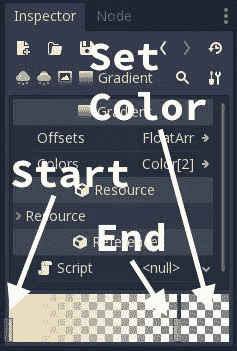

将起始颜色设置为棕褐色调，并将结束颜色设置为相同的颜色，但将 alpha 值设置为`0`（透明）。你可以通过检查检查器中的发射框来测试其外观。因为节点设置为一次性，所以只有一个粒子云团，你必须再次勾选框来发射它们。

随意更改属性，从以下列出的内容中。实验`Particles2D`设置可以非常有趣，而且你可能会通过调整得到一个非常棒的效果。一旦你对外观满意，将以下内容添加到玩家的`_physics_process()`代码中：

```cpp
if state == JUMP and is_on_floor():
    change_state(IDLE)
    $Dust.emitting = true # add this line
```

运行游戏，每次你的角色落地时，都会出现一小团尘埃。

# 蹲下状态

蹲下状态在玩家需要通过蹲下躲避敌人或投射物时很有用。精灵图集中包含这个状态的二帧动画：


将一个新的动画称为蹲下添加到玩家的`AnimationPlayer`中。将其长度设置为`0.2`并为帧属性添加一个轨道，将值从`3`变为`4`。将动画设置为循环。

在玩家的脚本中，将新状态添加到`enum`和状态转换中：

```cpp
enum {IDLE, RUN, JUMP, HURT, DEAD, CROUCH}
```

```cpp
CROUCH:
    new_anim = 'crouch'
```

在`get_input()`方法中，你需要处理各种状态转换。当在地面时，向下输入应转换为`CROUCH`。当处于`CROUCH`状态时，释放向下输入应转换为`IDLE`。最后，如果在`CROUCH`状态并且按下左右键，状态应更改为`RUN`：

```cpp
var down = Input.is_action_pressed('crouch')

if down and is_on_floor():
    change_state(CROUCH)
if !down and state == CROUCH:
    change_state(IDLE)
```

你还需要更改这一行：

```cpp
if state == IDLE and velocity.x != 0:
    change_state(RUN)
```

变成这样：

```cpp
if state in [IDLE, CROUCH] and velocity.x != 0:
    change_state(RUN)
```

就这样！运行游戏并尝试你的新动画状态。

# 爬梯子

玩家动画还包括爬行动作的帧，并且图块集中包含梯子。目前，梯子图块没有任何作用：在图块集中，它们没有分配任何碰撞形状。这是可以的，因为你不希望玩家与梯子碰撞；你希望能够在上面上下移动。

# 玩家代码

首先，点击玩家的 `AnimationPlayer` 并添加一个名为 `climb` 的新动画。其长度应设置为 `0.4` 秒，`Sprite` 的帧值是 `0, 1, 0, 2`。将动画设置为循环。

现在，转到 `Player.gd` 并在状态枚举中添加一个新的状态 `CLIMB`。此外，在顶部声明中添加两个新变量：

```cpp
export (int) var climb_speed
var is_on_ladder = false
```

`is_on_ladder` 将用于判断玩家是否在梯子上。使用这个功能，你可以决定向上箭头是否应该有作用。在检查器中，将爬升速度设置为 `50`。

在 `change_state()` 中，为新的状态添加一个条件：

```cpp
CLIMB:
    new_anim = 'climb'
```

接下来，在 `_get_input()` 中，你需要添加 `climb` 输入动作，并添加代码以确定何时触发新状态。添加以下内容：

```cpp
var climb = Input.is_action_pressed('climb')

if climb and state != CLIMB and is_on_ladder:
    change_state(CLIMB)
if state == CLIMB:
    if climb:
        velocity.y = -climb_speed
    elif down:
        velocity.y = climb_speed
    else:
        velocity.y = 0
        $AnimationPlayer.play("climb")
if state == CLIMB and not is_on_ladder:
    change_state(IDLE)
```

这里，你有三个新的条件需要检查。首先，如果玩家不在 `CLIMB` 状态，但站在梯子上，那么按下向上键应该开始让玩家开始攀爬。接下来，如果玩家正在攀爬，那么上下键应该相应地移动他们，但如果没有按键则停止移动。最后，如果玩家在攀爬时离开梯子，它将离开 `CLIMB` 状态。

剩下的一个问题是你需要重力在攀爬时停止将玩家向下拉。在 `_physics_process()` 中的重力代码中添加以下条件：

```cpp
if state != CLIMB:
    velocity.y += gravity * delta
```

现在，玩家已经准备好了，你可以在你的关卡地图中添加一些梯子。

# 关卡代码

在你的地图上某个地方放置几个梯子瓦片，然后向关卡场景添加一个梯子 `Area2D`。给这个节点一个具有矩形形状的 `CollisionShape2D`。调整区域大小最好的方法是使用网格吸附。通过菜单打开它，并使用配置吸附...将网格步长设置为 `(4, 4)`：


调整碰撞形状，使其从上到下覆盖梯子的中心部分。如果你使形状与梯子一样宽，那么即使玩家悬挂在侧面，也会被视为正在攀爬。你可能觉得这看起来有点奇怪，所以将形状做得比梯子略小可以防止这种情况。

将 `Ladder` 的 `body_entered` 和 `body_exited` 信号连接起来，并添加以下代码以使它们设置玩家的梯子变量：

```cpp
func _on_Ladder_body_entered(body):
    if body.name == "Player":
        body.is_on_ladder = true

func _on_Ladder_body_exited(body):
    if body.name == "Player":
        body.is_on_ladder = false
```

现在你可以尝试一下。你应该能够走到梯子旁边并上下攀爬。注意，如果你站在梯子的顶部并踏上它，你会掉到下面而不是向下攀爬（尽管在掉落时按下向上键可以抓住梯子）。如果你希望自动过渡到攀爬状态，你可以在 `_physics_process()` 中添加一个额外的掉落检查。

# 移动平台

创建一个新的场景，并添加一个`KinematicBody2D`根节点。添加一个`Sprite`子节点，并使用`res://assets/environment/layers/tileset.png`精灵图集作为纹理，启用区域功能以便你可以选择特定的瓦片。你可能希望你的平台比一个瓦片宽，所以你可以根据需要多次复制`Sprite`。开启网格吸附，以便精灵可以按行对齐：


`(8, 8)`的网格设置对于对齐瓦片很有效。添加一个覆盖图像的矩形`CollisionShape2D`：

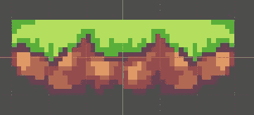

平台运动可以变得非常复杂（跟随路径、改变速度等），但这个例子将坚持使用在两个物体之间水平来回移动的平台。

这里是平台的脚本：

```cpp
extends KinematicBody2D

export (Vector2) var velocity

func _physics_process(delta):
    var collision = move_and_collide(velocity * delta)
    if collision:
        velocity = velocity.bounce(collision.normal)
```

这次，你使用`move_and_collide()`来移动刚体。这是一个更好的选择，因为平台在与其他墙壁碰撞时不应该滑动。相反，它应该从碰撞体上弹回。只要你的碰撞形状是矩形的（就像`TileMap`刚体一样），这种方法就会很好用。如果你有一个圆形物体，弹跳可能会使平台以奇怪的方向移动，在这种情况下，你应该使用以下类似的方法来保持运动水平：

```cpp
func _physics_process(delta):
    var collision = move_and_collide(velocity * delta)
    if collision:
        velocity.x *= -1
```

在检查器中将*速度*设置为`(50, 0)`，然后转到你的关卡场景并在你的关卡中的某个位置实例化这些物体之一。确保它在两个物体之间，这样它就可以在它们之间来回移动。

运行场景并尝试在移动平台上跳跃。由于玩家使用了`move_and_slide()`，如果你站在平台上，他们会自动随着平台移动。

在你的关卡中添加尽可能多的这些物体。它们甚至可以相互弹跳，因此你可以制作覆盖大距离的移动平台链，并需要玩家跳跃的精确时间。

# 概述

在本章中，你学习了如何使用`KinematicBody2D`节点创建街机风格的物理效果。你还使用了`AnimationPlayer`来为角色行为创建各种动画，并广泛地使用了你在早期项目中学到的知识来整合一切。希望到这一点，你已经很好地掌握了场景系统以及 Godot 项目的结构。

记得你在项目设置中最初设置的“拉伸模式”和“方面”属性吗？运行游戏并观察当你调整游戏窗口大小时会发生什么。这些设置对于这种类型的游戏来说是最优的，但尝试将“拉伸模式”改为视口，然后使你的游戏窗口非常宽或高。尝试调整其他设置以查看不同缩放选项的效果。

再次提醒，在继续之前，花几分钟时间玩你的游戏并查看其各种场景和脚本，以回顾你是如何构建它的。回顾本章中你认为特别棘手的任何部分。

在下一章中，你将进入 3D 世界！
