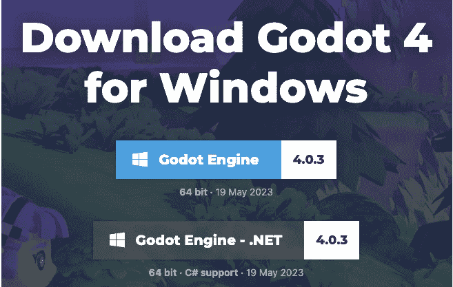
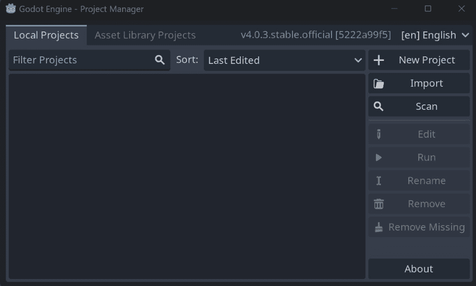
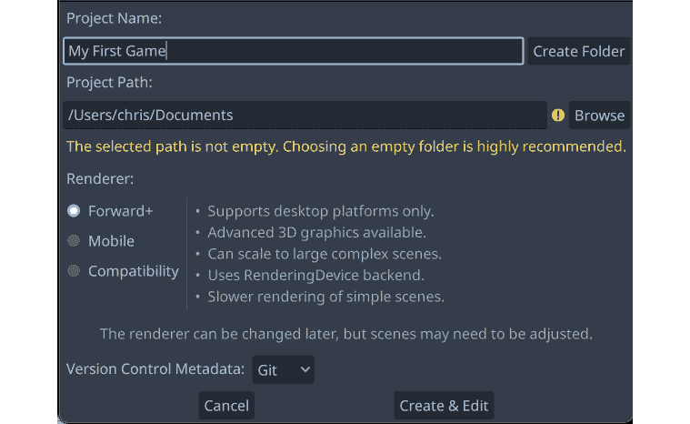
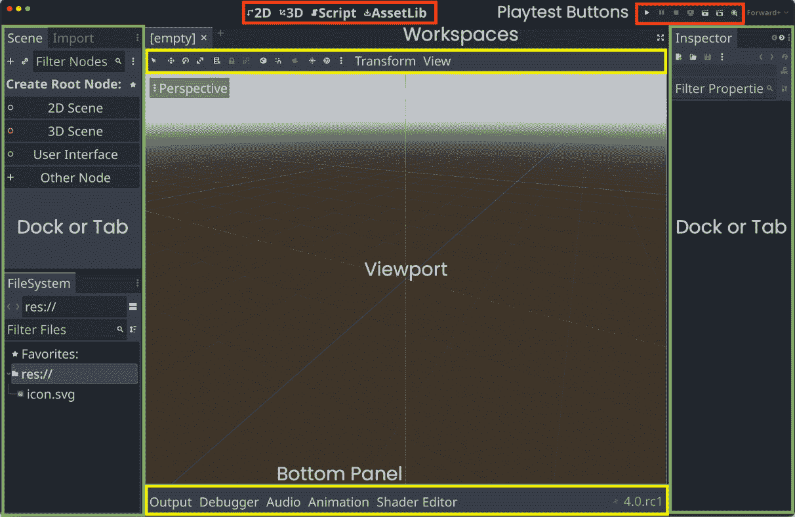
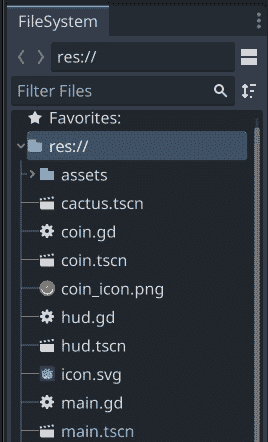
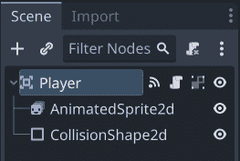
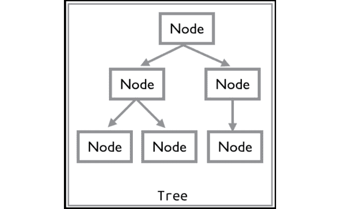

# 第一章：Godot 4.0 简介

无论是一个职业目标还是一种休闲爱好，游戏开发都是一项有趣且有益的活动。现在开始游戏开发从未有过更好的时机。现代编程语言和工具使得构建高质量的游戏并将它们分发到全世界变得更加容易。如果你正在阅读这本书，那么你已经踏上了实现你梦想中的游戏（们）的道路。

本书是关于 Godot 游戏引擎及其新 4.0 版本的介绍，该版本于 2023 年发布。Godot 4.0 拥有大量新特性和功能，使其成为昂贵商业游戏引擎的有力替代品。对于初学者来说，它提供了一种友好的方式来学习游戏开发的基础知识。对于更有经验的开发者来说，Godot 是一个强大、可定制且*开放*的工具包，可以帮助你将你的愿景变为现实。

这本书采用基于项目的教学方法，将向你介绍引擎的基本原理。它由五个游戏项目组成，旨在帮助你获得对游戏开发概念及其在 Godot 中应用的深入理解。在这个过程中，你将了解 Godot 的工作原理，并吸收你可以应用到自己的项目中的重要技术。

在本章中，我们将涵盖以下主题：

+   开始的一般建议

+   什么是游戏引擎？

+   什么是 Godot？

+   下载 Godot

+   Godot UI 概述

+   节点和场景

+   Godot 中的脚本编写

# 一般建议

本节包含了一些基于作者作为教师和讲师经验的读者一般建议。在阅读本书时，请记住这些提示，特别是如果你对编程非常陌生。

尝试按照书中项目的顺序进行。后面的章节可能会基于前面章节介绍的主题进行构建，其中它们会得到更详细的解释。当你遇到你不记得的内容时，回到前面的章节去复习那个主题。没有人会给你计时，快速完成这本书也没有奖励。

这里有很多内容需要吸收。如果你一开始不理解，不要感到气馁。目标不是一夜之间成为游戏开发专家——那是不可能的。就像任何其他技能——比如木工或乐器——一样，需要多年的实践和学习才能达到熟练。重复是学习复杂主题的关键；你与 Godot 的功能工作得越多，它们就会开始显得越熟悉、越容易。在你读完之后，尝试重复阅读前面的章节。你会惊讶于与第一次阅读相比，你理解了多少。

如果你正在以电子书的形式阅读，请抵制复制粘贴代码的诱惑。自己输入代码会让你的大脑更加活跃。这就像在讲座中做笔记一样，即使你永远不会再看笔记，它也能帮助你更好地学习。如果你打字速度慢，这也有助于你提高打字速度。总之：你是一名程序员，所以习惯于输入代码！

新游戏开发者犯的最大错误之一是承担了超出他们能力范围的项目。在开始时，保持你项目的范围尽可能小是非常重要的。如果你能完成两三个小型游戏，你将比有一个大型的、不完整的项目并且已经超出了你管理能力的项目要成功得多（并且学到的东西也更多）。

你会注意到书中提到的五款游戏都严格遵循这一策略。它们在范围上都较小，这既有实际原因——为了合理地适应书本大小的课程——也是为了保持对基础知识的专注。当你构建游戏时，你可能会立即想到额外的功能和游戏元素。*如果太空船有升级会怎样？* *如果角色可以做* *墙跳会怎样？*

灵感是很好的，但如果你还没有完成基本项目，就把它们写下来并留到以后。不要让自己被一个接一个的“酷点子”所分心。开发者称之为*功能蔓延*，意味着一个永远不会停止增长的功能列表，这是一个导致许多项目未完成的陷阱。不要成为它的受害者。

最后，别忘了时不时地休息一下。你不应该试图在短短几次阅读中就完成整本书，或者甚至是一个项目。在每个新概念之后，尤其是在每个章节之后，在你深入下一个概念之前，给自己一些时间来吸收新信息。你会发现，你不仅能够记住更多的信息，而且可能会更加享受这个过程。

## 学习有效的秘诀

获取这些项目最大效益和提升技能的秘诀在于：在每章结束时，一旦你完成了游戏项目，立即删除它并重新开始。这次，尝试在不看书的情况下重新创建它。如果你卡住了，只需查看章节中的那部分内容，然后再次合上书本。如果你真的很有信心，尝试给游戏添加你自己的特色——改变一些游戏玩法或添加新的转折。

如果你对每个游戏都这样做多次，你会惊讶地发现你检查书本的频率会降低。如果你能在没有帮助的情况下独立完成这本书中的项目，那么你肯定已经准备好扩展你的思路并承担你自己的原创概念了。

在阅读以下部分时，请记住这些提示。在下一节中，你将了解什么是游戏引擎以及为什么游戏开发者可能想要选择使用它。

# 什么是游戏引擎？

游戏开发是复杂的，涉及广泛的知识和技能。要构建现代游戏，在能够制作实际游戏之前，你需要大量的底层技术。想象一下，在你开始编程之前，你必须构建自己的计算机并编写自己的操作系统。如果你真的要从零开始并制作所有你需要的东西，游戏开发就会像那样。

每个游戏还有一些共同的需求。例如，无论游戏是什么，它都需要在屏幕上绘制东西。如果已经编写了执行此操作的代码，那么重用它比为每个游戏重新创建它更有意义。这就是游戏框架和引擎发挥作用的地方。

**游戏框架**是一组带有辅助代码的库，它帮助构建游戏的基础部分。它并不一定提供所有组件，你可能仍然需要编写大量代码来整合所有内容。正因为如此，使用游戏框架构建游戏可能比使用完整游戏引擎构建的游戏花费更多时间。

**游戏引擎**是一组工具和技术，旨在通过消除每个新游戏项目都需要重新发明轮子的需求来简化游戏制作过程。它提供了一组通常需要的功能，这些功能通常需要大量的时间和精力来开发。

这里是一些典型游戏引擎将提供的主要功能：

+   **渲染（2D 和 3D）**：渲染是将游戏显示在玩家屏幕上的过程。一个好的渲染管道必须考虑到现代 GPU 支持、高分辨率显示器以及光照、透视和视口等效果，同时保持非常高的帧率。

+   **物理**：虽然这是一个非常常见的需求，但构建一个强大且准确的物理引擎是一项艰巨的任务。大多数游戏都需要某种形式的碰撞检测和响应系统，许多游戏需要物理模拟，但很少有开发者愿意承担编写一个物理引擎的任务——尤其是如果他们以前从未尝试过的话！

+   **平台支持**：在当今的市场中，大多数开发者都希望能够在多个平台上发布他们的游戏，例如桌面、游戏机、移动设备和/或网页。游戏引擎提供了一个统一的导出过程，可以在多个平台上发布游戏，而无需重写游戏代码或支持多个版本。

+   **常见开发环境**：通过使用相同的统一界面来制作多个游戏，开发者不必每次开始新项目时都重新学习新的工作流程。

除了这些，还有工具可以帮助处理网络、简化图像和声音管理、动画、调试等功能。通常，游戏引擎会包括从其他工具导入内容的能力，例如用于创建动画或 3D 模型的工具。

使用游戏引擎可以让开发者专注于构建他们的游戏，而不是创建使其工作的底层框架。对于小型或独立开发者来说，这可能意味着在开发一年后发布游戏而不是三年，甚至根本无法发布。

目前市场上有很多流行的游戏引擎，例如 Unity、Unreal Engine 和 GameMaker Studio，仅举几个例子。需要了解的一个重要事实是，大多数流行的游戏引擎都是商业产品。它们可能或可能不需要任何财务投资来开始，但如果你的游戏赚钱，它们将需要某种形式的许可和/或版税支付。无论你选择哪个引擎，你都需要仔细阅读用户协议，并确保你理解你可以和不可以做什么，以及可能需要承担的任何隐藏成本。

另一方面，一些引擎是非商业性的和*开源*的，例如 Godot 游戏引擎，这正是本书的主题。

# 什么是 Godot？

Godot 是一个功能齐全的现代游戏引擎，提供了上一节中描述的所有功能，还有更多。它也是完全免费和开源的，在非常宽松的 MIT 许可下发布。这意味着没有任何费用、隐藏成本和版税需要支付。你用 Godot 制作的一切 100%属于你，而许多要求持续合同关系的商业游戏引擎则不是这样。对于许多开发者来说，这一点非常有吸引力。

如果你不太熟悉开源、社区驱动的开发概念，这可能会让你感到奇怪。然而，与 Linux 内核、Firefox 浏览器以及许多其他非常著名的软件一样，Godot 并非由公司作为商业产品开发。相反，一群热心的开发者捐赠他们的时间和专业知识来构建引擎，测试和修复错误，制作文档等等。

作为游戏开发者，使用 Godot 的好处很多。因为它不受商业许可的束缚，你可以完全控制你的游戏如何以及在哪里分发。许多商业游戏引擎限制了你可以制作的项目类型，或者要求为某些类别（如赌博）的游戏购买更昂贵的许可。 

Godot 的开源性质也意味着它具有与商业游戏引擎不同的透明度。例如，如果你发现某个特定的引擎功能并不完全满足你的需求，你可以自由地修改引擎本身并添加你需要的新功能，无需获得任何许可。这在大项目的调试中也非常有帮助，因为你可以完全访问引擎的内部工作。

这也意味着你可以直接为 Godot 的未来做出贡献。参见*第七章*中的*附加主题*，了解更多关于如何参与 Godot 开发的信息。

现在你已经了解了 Godot 是什么以及它如何帮助你构建游戏，是时候开始行动了。在下一节中，你将了解如何下载 Godot 并将其设置在你的电脑上使用。

# 下载 Godot

你可以通过访问[`godotengine.org/`](https://godotengine.org/)并点击**下载最新版**来下载 Godot 的最新版本。本书是为 4.0 版本编写的。如果你下载的版本末尾有另一个数字（例如 4.0.3），那没关系——这仅仅意味着它包含了修复 4.0 版本中的错误或其他问题的更新。

在下载页面，你还将看到一个标准版本和一个.NET 版本。.NET 版本是专门为与 C#编程语言一起使用而构建的。除非你计划使用 C#与 Godot 一起使用，否则不要下载这个版本。本书中的项目不使用 C#。



图 1.1：Godot 下载页面

解压下载的文件，你将拥有 Godot 应用程序。如果你有“程序”或“应用程序”文件夹，可以选择将其拖放到那里。双击应用程序以启动它，你将看到 Godot 的**项目管理器**窗口，你将在下一节中了解它。

## 其他安装方法

除了从 Godot 网站下载之外，还有其他几种方法可以将 Godot 安装到你的电脑上。请注意，以这种方式安装时功能没有差异。以下是一些下载应用程序的替代方法：

+   **Steam**：如果你在 Steam 上有账户，可以通过 Steam 桌面应用程序安装 Godot。在 Steam 商店中搜索 Godot，并按照说明进行安装。你可以从 Steam 应用程序启动 Godot：


图 1.2：Steam 上的 Godot 引擎

+   **Itch.io**：你还可以从流行的 itch.io 网站下载 Godot。Itch 是一个独立游戏开发者和创作者的市场。搜索 Godot，并从提供的链接下载。

+   **包管理器**：如果你使用以下操作系统的包管理器之一，你可以通过其正常安装过程安装 Godot。有关详细信息，请参阅你的包管理器文档。Godot 在这些包管理器中可用：

    +   Homebrew（macOS）

    +   Scoop（Windows）

    +   Snap（Linux）

安卓和网页版本

你还将看到适用于在 Android 和网页浏览器上运行的 Godot 版本。在撰写本文时，这些版本被列为“实验性”，可能不稳定或功能不完整。建议你使用 Godot 的桌面版本，尤其是在学习期间。

恭喜，您已成功将 Godot 安装到您的计算机上。在下一节中，您将看到 Godot 编辑器界面的概述——您在编辑器中工作时将使用的各种窗口和按钮的目的。

# Godot UI 概览

与大多数游戏引擎一样，Godot 具有统一的开发生态。这意味着你使用相同的界面来处理游戏的所有方面——代码、视觉、音频等等。本节是关于界面及其部分的介绍。请注意这里使用的术语；在本书中提及编辑器窗口中的操作时，将使用这些术语。 

## 项目管理器

**项目管理器**窗口是您打开 Godot 后看到的第一个窗口：



图 1.3：项目管理器

首次打开 Godot

第一次打开 Godot 时，您还没有任何项目。您会看到一个弹出窗口询问您是否想要*在资源库中探索官方示例项目*。选择**取消**，您将看到**项目管理器**，如图中所示。

在此窗口中，您可以看到您现有的 Godot 项目列表。您可以选择一个现有项目，点击**运行**来玩游戏或**编辑**在 Godot 编辑器中工作。您还可以通过点击**新建项目**来创建新项目： 



图 1.4：新项目设置

在这里，你可以为项目命名并创建一个文件夹来存储它。注意警告信息——Godot 项目在计算机上作为独立的文件夹存储。项目使用的所有文件都必须位于此文件夹中。这使得共享 Godot 项目变得方便，因为你只需要压缩项目文件夹，并且可以确信另一个 Godot 用户能够打开它，而不会缺少任何必要的数据。

### 渲染器

在创建新项目时，您还可以选择**渲染器**。这三个选项代表了在需要现代桌面 GPU 的高级、高性能图形和与移动和较老桌面等不太强大的平台兼容性之间的平衡。如果您需要，您可以在以后更改此选项，所以将其保留为默认设置是可以的。如果您以后决定为移动平台构建游戏，Godot 文档提供了大量关于性能和渲染选项的信息。参见*第七章*以获取链接和更多信息。

### 选择文件名

当您为新项目命名时，有一些简单的规则您应该尝试遵循，这可能会在将来为您节省一些麻烦。为您的项目起一个描述性的名字——*巫师战斗竞技场*比*游戏 #2*是一个更好的项目名称。在未来，您将永远无法记住哪个是游戏编号二，所以尽可能描述得详细。

你还应该考虑如何命名你的项目文件夹和其中的文件。一些操作系统区分大小写，区分 `My_Game` 和 `my_game`，而其他则不区分。如果你将项目从一个计算机移动到另一个计算机，这可能会导致问题。因此，许多程序员为他们的项目开发了一个标准化的命名方案，例如不在文件名中使用空格，并在单词之间使用 `_`。无论你采用什么命名方案，最重要的是要保持一致性。

一旦你创建了项目文件夹，`test_project`。

控制台窗口

如果你正在使用 Windows 操作系统版本，当你运行 Godot 时，你也会看到一个控制台窗口打开。在这个窗口中，你可以看到由引擎和/或你的项目产生的警告和错误。在 macOS 或 Linux 上，这个窗口不会出现，但如果你使用终端程序从命令行启动应用程序，你可以看到控制台输出。

## 编辑器窗口

下面的图是 Godot 主编辑窗口的截图。当你使用 Godot 构建项目时，你将在这里花费大部分时间。编辑器界面被分为几个部分，每个部分提供不同的功能。每个部分的特定术语将在 *图 1*.*5* 之后描述：



图 1.5：Godot 编辑器窗口

编辑器窗口的主要部分是 *视口*。这是你在工作时将看到你的游戏部分的地方。

在窗口的顶部中央是一个你可以切换的 *工作空间* 列表，当你在游戏的不同部分工作时，你可以在这之间切换。你可以切换到 **2D** 和 **3D** 模式，以及 **脚本** 模式，在那里你将编辑你的游戏代码。**AssetLib** 是你可以下载由 Godot 社区贡献的插件和示例项目的地方。参见 *第七章* 了解有关使用资产库的更多信息。

*图 1*.*6* 展示了你当前工作空间使用的 *工具栏*。这里的图标将根据你正在处理的对象类型而变化：


图 1.6：工具栏图标

上右角的 *游戏测试* 区域中的按钮用于启动游戏并在游戏运行时与之交互：


图 1.7：游戏测试按钮

在左侧和右侧是你可以用来查看和选择游戏项目并设置其属性的 *坞* 或 *标签*。在左侧坞的底部，你会找到 `res://` 路径，这是项目的根文件夹。例如，文件路径可能看起来像这样：`res://player/player.tscn`。这指的是 `player` 文件夹中的一个文件：



图 1.8：FileSystem 选项卡

在左侧工具栏的顶部是**场景**标签，它显示了你在视图中正在工作的当前场景（关于场景的更多内容请参阅*图 1.9*后的内容）：



图 1.9：场景标签

在右侧，你会找到一个标记为**检查器**的框，在那里你可以查看和调整游戏对象的属性。

随着你在这本书中处理游戏项目，你将了解这些项目的功能，并熟悉导航编辑器界面。

在阅读本节之后，你应该对 Godot 编辑器窗口的布局以及你在本书中将要看到的元素名称感到舒适。你离完成这个介绍并开始制作游戏又近了一步。不过，你注意到*图 1.9*中的那些项目了吗？那些被称为节点，你将在下一节中了解到它们的所有内容。

# 了解节点和场景

**节点**是创建 Godot 游戏的基石。节点是一个可以提供各种专业游戏功能的对象。给定类型的节点可能显示图像、播放动画或表示 3D 模型。节点包含一系列属性，允许你自定义其行为。你添加到项目中的节点取决于你需要的功能。这是一个模块化系统，旨在在构建游戏对象时为你提供灵活性。

你添加的节点组织成一个*树状结构*。在树中，节点被添加为其他节点的*子节点*。一个特定的节点可以有任意数量的子节点，但只有一个*父节点*。当一组节点被收集到一个树中时，它被称为*场景*：



图 1.10：以树状结构排列的节点

Godot 中的**场景**通常用于创建和组织项目中的各种游戏对象。你可能有一个包含所有使玩家角色工作的节点和脚本的玩家场景。然后，你可能创建另一个场景来定义游戏的地图：玩家必须导航的障碍和物品。然后，你可以将这些不同的场景组合成最终的游戏。

虽然节点自带各种属性和功能，但任何节点的行为和能力都可以通过附加一个*脚本*到节点来扩展。这允许你编写代码，使节点能够执行其默认状态之外的功能。例如，你可以添加一个`Sprite2D`节点来显示图像，但如果你想让该图像在点击时移动或消失，你需要添加一个脚本来创建这种行为。

节点是强大的工具，理解它们是有效构建 Godot 中游戏对象的关键。然而，仅凭节点本身，它们能做的有限。游戏逻辑——即你的游戏中的对象将遵循的规则——还需要你来提供。在下一节中，你可以通过使用 Godot 的脚本语言编写代码来了解如何实现这一点。

# Godot 中的脚本编写

Godot 为节点脚本提供了两种官方语言：**GDScript** 和 **C#**。GDScript 是专用内置语言，提供与引擎最紧密的集成，并且使用起来最简单。对于已经熟悉或精通 C# 的人来说，您可以下载支持该语言版本的版本。

除了支持的语言之外，Godot 本身是用 C++ 编写的，您可以通过直接扩展引擎的功能来获得更多的性能和控制。有关使用其他语言和扩展引擎的信息，请参阅 *第七章* 中的 *附加主题*。

本书中的所有游戏都将使用 GDScript。对于大多数项目来说，GDScript 是最佳的语言选择。它与 Godot 的 **应用程序编程接口** (**API**) 紧密集成，并专为快速开发设计。

## 关于 GDScript

GDScript 的语法非常接近 Python 语言。如果您已经熟悉 Python，您会发现 GDScript 非常熟悉。如果您对其他动态语言，如 JavaScript，感到舒适，您应该会发现学习它相对容易。Python 经常被推荐为一种良好的入门语言，GDScript 也具有这种用户友好性。

本书假设您已经具备至少一些编程经验。如果您以前从未编码过，您可能会觉得这有点困难。学习游戏引擎本身就是一项艰巨的任务；同时学习编码意味着您已经接受了重大挑战。如果您发现自己在这本书的代码中遇到困难，您可能会发现通过在 Python 或 JavaScript 等语言中进行入门编程课程的学习，可以帮助您掌握基础知识。

与 Python 一样，GDScript 是一种动态类型语言，这意味着在创建变量时不需要声明其类型，并且它使用空白（缩进）来表示代码块。总的来说，使用 GDScript 为您的游戏逻辑编写代码的优势在于，由于它与引擎的紧密集成，您编写的代码更少，这意味着开发速度更快，需要修复的错误也更少。

为了让您了解 GDScript 的样子，这里有一个小脚本，它使精灵以给定的速度在屏幕上从左到右移动：

```cpp
extends Sprite2D
var speed = 200
func _ready():
    position = Vector2(100, 100)
func_process(delta):
    position.x += speed * delta
```

如果您之前使用过其他高级语言，如 Python，这看起来会非常熟悉，但如果您觉得这段代码现在还不太明白，请不要担心。在接下来的章节中，您将编写大量的代码，这些代码将伴随着所有工作原理的解释。

# 摘要

在本章中，您了解了游戏引擎的一般概念，特别是 Godot。最重要的是，您下载了 Godot 并启动了它！

你已经学习了一些重要的词汇，这些词汇将在本书中提及 Godot 编辑器窗口的各个部分时使用。你还了解了节点和场景的概念，它们是 Godot 的基本构建模块。

你还得到了一些关于如何处理本书中的项目和游戏开发一般性建议。如果你在阅读本书的过程中感到沮丧，请返回并重新阅读 *一般性建议* 部分。有很多东西要学习，第一次不一定都能理解，这是正常的。本书中你将制作五个不同的游戏，每个游戏都会帮助你更好地理解一些东西。

你已经准备好进入下一章，在那里你将开始使用 Godot 构建你的第一个游戏。
