# 第二章：Coin Dash – 构建你的第一个 2D 游戏

这个第一个项目将指导您制作您的第一个 Godot 引擎游戏。您将学习 Godot 编辑器的工作方式，如何构建项目结构，以及如何使用 Godot 最常用的节点构建一个小型 2D 游戏。

为什么从 2D 开始？

简而言之，3D 游戏比 2D 游戏复杂得多。然而，您需要了解的许多底层游戏引擎功能是相同的。您应该坚持使用 2D，直到您对 Godot 的工作流程有很好的理解。到那时，转向 3D 将感觉容易得多。您将在本书的后续章节中有机会在 3D 中工作。

即使您不是游戏开发的完全新手，也不要跳过本章。虽然您可能已经理解了许多概念，但这个项目将介绍 Godot 的功能和设计范式——您在前进过程中需要了解的事情。

本章中的游戏称为 *Coin Dash*。您的角色必须在屏幕上移动，尽可能多地收集金币，同时与时间赛跑。完成游戏后，游戏将看起来像这样：

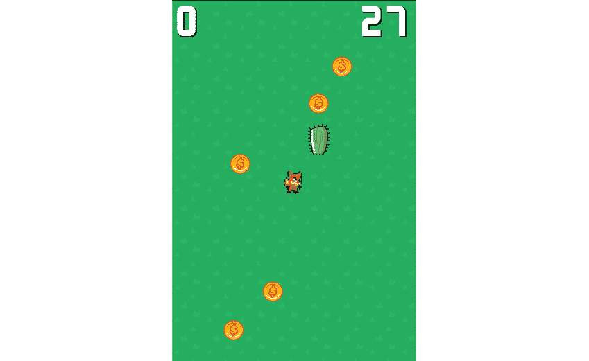

图 2.1：完成的游戏

在本章中，我们将涵盖以下主题：

+   设置新项目

+   创建角色动画

+   移动角色

+   使用`Area2D`检测对象接触

+   使用`Control`节点显示信息

+   使用信号在游戏对象之间进行通信

# 技术要求

从以下链接下载游戏资源：[`github.com/PacktPublishing/Godot-4-Game-Development-Projects-Second-Edition/tree/main/Downloads`](https://github.com/PacktPublishing/Godot-4-Game-Development-Projects-Second-Edition/tree/main/Downloads)，并将它们解压缩到您的新项目文件夹中。

您也可以在 GitHub 上找到本章的完整代码：[`github.com/PacktPublishing/Godot-4-Game-Development-Projects-Second-Edition/tree/main/Chapter02%20-%20Coin%20Dash`](https://github.com/PacktPublishing/Godot-4-Game-Development-Projects-Second-Edition/tree/main/Chapter02%20-%20Coin%20Dash)

# 设置项目

启动 Godot，然后在项目管理器中点击**+ 新建** **项目**按钮。

您首先需要创建一个项目文件夹。在**项目名称**框中输入`Coin Dash`，然后点击**创建文件夹**。为您的项目创建一个文件夹对于将所有项目文件与您计算机上的其他任何项目分开非常重要。接下来，您可以点击**创建 & 编辑**以在 Godot 编辑器中打开新项目。

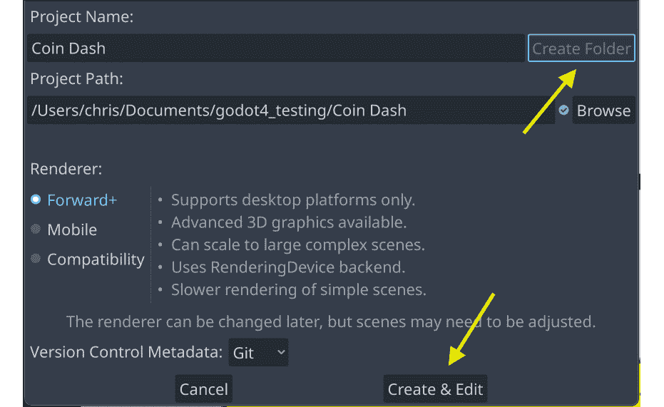

图 2.2：新项目窗口

在这个项目中，您将创建三个独立的场景——玩家角色、金币和一个显示得分和计时的显示界面——所有这些都将组合到游戏的“主”场景中（见*第一章*）。在一个更大的项目中，创建单独的文件夹来组织每个场景的资产和脚本可能很有用，但在这个相对较小的游戏中，您可以将所有场景和脚本保存在根文件夹中，该文件夹被称为`res://`（res 是资源的缩写）。您项目中的所有资源都将位于`res://`文件夹的相对位置。您可以在`icon.svg`中看到项目文件，这是 Godot 的图标。

您可以在此处下载游戏的艺术和声音（统称为*资产*）的 ZIP 文件：[`github.com/PacktPublishing/Godot-Engine-Game-Development-Projects-Second-Edition/tree/main/Downloads`](https://github.com/PacktPublishing/Godot-Engine-Game-Development-Projects-Second-Edition/tree/main/Downloads)。将此文件解压到您创建的新项目文件夹中。

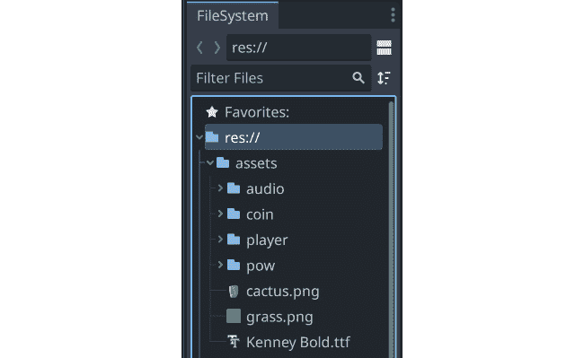

图 2.3：文件系统选项卡

例如，金币的图像位于`res://assets/coin/`。

由于这款游戏将以竖屏模式（高度大于宽度）运行，我们首先需要设置游戏窗口。

从顶部菜单中选择**项目** -> **项目设置**。设置窗口看起来像这样：


图 2.4：项目设置窗口

查找前文图示中的`480`和`720`。在此部分，在**拉伸**选项下，将**模式**设置为**canvas_items**，将**纵横比**设置为**保持**。这将确保如果用户调整游戏窗口大小，所有内容都将适当缩放，而不会拉伸或变形。您还可以在**大小**下的**可调整大小**框中取消勾选，以防止窗口被调整大小。

恭喜！您已设置好新项目，并准备好开始制作您的第一个游戏。在这个游戏中，您将创建在 2D 空间中移动的对象，因此了解如何使用 2D 坐标定位和移动对象非常重要。在下一节中，您将了解这是如何工作的以及如何将其应用于您的游戏。

# 向量和 2D 坐标系

本节简要概述了 2D 坐标系和向量数学在游戏开发中的应用。向量数学是游戏开发中的基本工具，如果您需要对该主题有更广泛的理解，请参阅可汗学院的线性代数系列([`www.khanacademy.org/math/linear-algebra`](https://www.khanacademy.org/math/linear-algebra))。

在 2D 工作中，您将使用笛卡尔坐标系来识别 2D 平面上的位置。2D 空间中的特定位置以一对值表示，例如`(4, 3)`，分别代表沿*x*轴和*y*轴的位置。2D 平面上的任何位置都可以用这种方式描述。

在二维空间中，Godot 遵循计算机图形学中常见的做法，将 *x* 轴朝右，将 *y* 轴朝下：

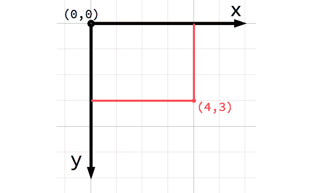

图 2.5：二维坐标系

这不是我的数学老师教给我的！

如果你刚开始接触计算机图形学或游戏开发，可能会觉得正 *y* 轴向下而不是向上，这在你的数学课上可能学过，这看起来很奇怪。然而，这种方向在计算机图形学应用中非常常见。

### 向量

你也可以将 `(4, 3)` 位置视为从 `(0, 0)` 点或 *原点* 的偏移，或者称为 *偏移量*。想象一下从原点指向该点的箭头：

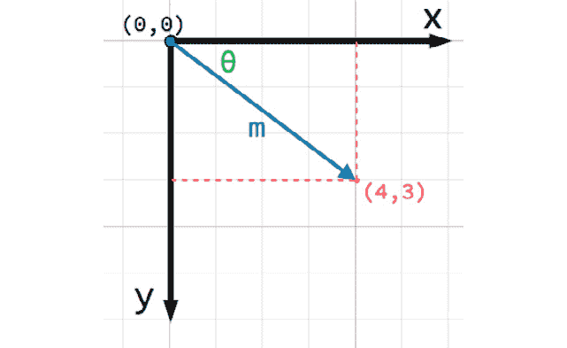

图 2.6：二维向量

这支箭是一个 *向量*。它代表了许多有用的信息，包括点的位置、其距离或 *长度* (`m`)，以及其相对于 *x* 轴的 *角度* (`θ`)。更具体地说，这种类型的向量被称为 *位置向量*——即描述空间中位置的向量。向量还可以表示运动、加速度或任何具有大小和方向的量。

在 Godot 中，向量有广泛的应用，你将在本书的每个项目中都会用到它们。

现在，你应该已经了解了二维坐标空间的工作原理以及向量如何帮助定位和移动对象。在下一节中，你将创建玩家对象并使用这些知识来控制其移动。

# 第一部分——玩家场景

你将制作的第一个场景是玩家对象。为玩家（和其他对象）创建单独的场景的一个好处是，你可以在创建游戏的其他部分之前独立测试它。随着你的项目规模和复杂性的增长，这种游戏对象的分离将变得越来越有帮助。将单个游戏对象与其他对象保持分离，使得它们更容易调试、修改，甚至完全替换而不影响游戏的其它部分。这也意味着你的玩家对象可以重复使用——你可以将这个玩家场景放入一个完全不同的游戏中，它将正常工作。

你的玩家场景需要完成以下事情：

+   显示你的角色及其动画

+   通过移动角色来响应用户输入

+   检测与其他游戏对象（如金币或障碍物）的碰撞

## 创建场景

首先点击 `Area2D`。然后，点击节点的名称并将其更改为 `Player`。点击 **场景** -> **保存场景** (*Ctrl* + *S*) 来保存场景。

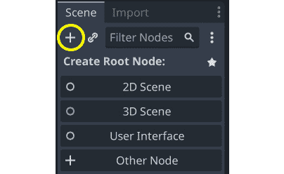

图 2.7：添加节点

现在查看 `player.tscn` 文件。每次你在 Godot 中保存场景时，它都会使用 `.tscn` 扩展名——这是 Godot 场景的文件格式。"t" 在名称中的含义是 "text"，因为这些是文本文件。如果你好奇，可以自由地在外部文本编辑器中查看它，但你不应该手动编辑它；否则，你可能会不小心损坏文件。

现在你已经创建了场景的 `Area2D` 节点，因为它是一个 2D 节点，所以它可以在 2D 空间中移动，并且可以检测与其他节点的重叠，因此我们可以检测到硬币和其他游戏对象。在设计游戏对象时，选择用于特定游戏对象的节点是你的第一个重要决定。

在添加任何子节点之前，确保你不小心通过点击它们来移动或调整它们的大小是一个好主意。选择 `Player` 节点并将鼠标悬停在锁旁边的图标上，**选择节点分组**：


图 2.8：切换节点分组

工具提示说 **使选定的节点子节点不可选择**，这是好的——它将有助于避免错误。点击按钮，你会在玩家节点名称旁边看到相同的图标：

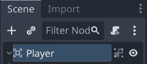

图 2.9：节点分组图标

在创建新场景时始终这样做是个好主意。如果一个对象的子节点发生偏移或缩放，可能会导致意外的错误并且难以调试。

## 精灵动画

使用 `Area2D`，你可以检测其他对象是否与玩家重叠或碰撞，但 `Area2D` 本身没有外观。你还需要一个可以显示图像的节点。由于角色有动画，请选择玩家节点并添加一个 `AnimatedSprite2D` 节点。此节点将处理玩家的外观和动画。注意节点旁边有一个警告符号。`AnimatedSprite2D` 需要一个 `SpriteFrames` 资源，其中包含它可以显示的动画。要创建一个，找到 **Inspector** 窗口中的 **Frames** 属性并点击 **<empty>** 以查看下拉菜单。选择 **New SpriteFrames**：


图 2.10：添加 SpriteFrames 资源

接下来，在相同的位置，点击那里出现的 `SpriteFrames` 标签以在屏幕底部打开一个新面板：


图 2.11：SpriteFrames 面板

在左侧是动画列表。点击 `default` 并将其重命名为 `run`。然后，点击 `idle` 和第三个名为 `hurt`。

在 `res://assets/player/` 文件夹中，并将它们拖动到相应的动画中：


图 2.12：设置玩家动画

每个新的动画都有一个默认的每秒`5`帧的速度设置。这有点太慢了，所以选择每个动画并将速度设置为`8`。

要查看动画的实际效果，请点击**播放**按钮 ()。您的动画将出现在**检查器**窗口中**动画**属性的下拉菜单中。选择一个来查看其效果：


图 2.13：动画属性

您还可以选择一个默认播放的动画。选择`idle`动画并点击**加载时自动播放**按钮。


图 2.14：设置动画自动播放

然后，您将编写代码来根据玩家的行为在这些动画之间进行选择。然而，首先，您需要完成玩家节点的设置。

玩家图像有点小，所以将`AnimatedSprite2D`的缩放设置为`(2, 2)`以增加其大小。您可以在**检查器**窗口的**变换**部分找到此属性。

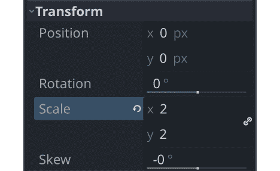

图 2.15：设置缩放属性

## 碰撞形状

当使用`Area2D`或其他碰撞对象时，你需要告诉 Godot 对象的具体形状。其碰撞形状定义了它所占据的区域，并用于检测重叠和/或碰撞。形状由各种`Shape2D`类型定义，包括矩形、圆形和多边形。在游戏开发中，这有时被称为**击打框**。

为了方便起见，当您需要向区域或物理体添加形状时，您可以添加`CollisionShape2D`作为子节点。然后，您可以在编辑器中选择所需的形状类型并编辑其大小。

将`CollisionShape2D`作为`Player`节点的子节点添加（确保不要将其作为`AnimatedSprite2D`的子节点添加）。在**检查器**窗口中，找到**形状**属性并点击**<empty>**以选择**新矩形形状 2D**。

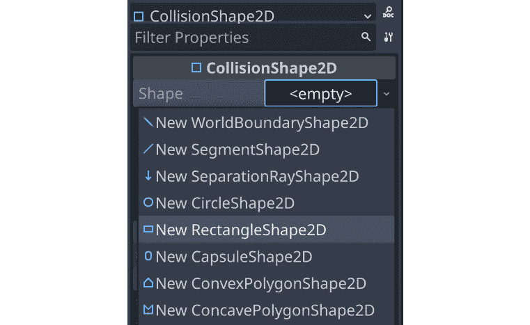

图 2.16：添加碰撞形状

拖动橙色手柄以调整形状的大小以覆盖精灵。提示 - 如果您在拖动手柄时按住*Alt*键，形状将对称地调整大小。您可能已经注意到碰撞形状不是在精灵上居中的。这是因为精灵图像本身在垂直方向上并不居中。您可以通过向`AnimatedSprite2D`添加一个小偏移量来修复这个问题。选择节点并查找`(``0, -5)`。

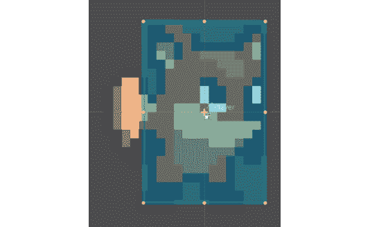

图 2.17：调整碰撞形状大小

完成后，您的**Player**场景应该看起来像这样：

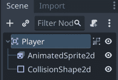

图 2.18：玩家节点设置

## 编写玩家脚本

现在，你准备好向玩家添加一些代码了。将脚本附加到节点允许你添加节点本身不提供的额外功能。选择 `Player` 节点并点击 **新建** **脚本** 按钮：

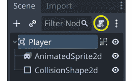

图 2.19：新建脚本按钮

在 **附加节点脚本** 窗口中，你可以保持默认设置不变。如果你记得保存场景，脚本将自动命名为与场景名称匹配。点击 **创建**，你将被带到脚本窗口。你的脚本将包含一些默认的注释和提示。

每个脚本的第一个行描述了它附加到的节点类型。就在那之后，你可以开始定义你的变量：

```cpp
extends Area2D
@export var speed = 350
var velocity = Vector2.ZERO
var screensize = Vector2(480, 720)
```

使用 `@export` 注解在 `speed` 变量上允许你在 `Player` 节点中设置其值，你将看到你在脚本中编写的 `350` 速度值。


图 2.20：检查器窗口中导出的变量

对于其他变量，`velocity` 将包含角色的移动速度和方向，而 `screensize` 将帮助设置角色移动的限制。稍后，你将从游戏的主场景自动设置此值，但就目前而言，手动设置它将允许你测试一切是否正常工作。

## 移动玩家

接下来，你将使用 `_process()` 函数来定义玩家将执行的操作。`_process()` 函数在每一帧都会被调用，因此你可以用它来更新你期望经常更改的游戏元素。在每一帧中，你需要玩家执行以下三件事：

+   检查键盘输入

+   沿给定方向移动

+   播放适当的动画

首先，你需要检查输入。对于这个游戏，你有四个方向输入需要检查（四个箭头键）。输入动作在 **项目设置** 下的 **输入映射** 标签中定义。在这个标签中，你可以定义自定义事件并将键、鼠标动作或其他输入分配给它们。默认情况下，Godot 已经将事件分配给了键盘箭头，因此你可以使用它们在这个项目中。

你可以使用 `Input.is_action_pressed()` 来检测是否按下了输入动作，如果按键被按下则返回 `true`，如果没有则返回 `false`。通过组合所有四个键的状态，你可以得到运动的结果方向。

你可以通过使用多个 `if` 语句分别检查所有四个键来完成此操作，但由于这是一个如此常见的需求，Godot 提供了一个有用的函数 `Input.get_vector()`，它会为你处理这些操作——你只需要告诉它要使用哪四个输入。注意输入动作的列表顺序；`get_vector()` 期望它们按照这个顺序。此函数的结果是一个 **方向向量**——一个指向八个可能方向之一的向量，这些方向由按下的输入产生：

```cpp
func _process(delta):
    velocity = Input.get_vector("ui_left", "ui_right",
        "ui_up", "ui_down")
    position += velocity * speed * delta
```

之后，你将有一个指示移动方向的 `velocity` 向量，所以下一步将是使用该速度实际更新玩家的 `position`。

在右上角点击 **运行当前场景** (*F6*)，并检查你是否可以使用所有四个箭头键移动玩家。

你可能会注意到玩家继续从屏幕的一侧跑出去。你可以使用 `clamp()` 函数将玩家的 `position` 限制在最小和最大值之间，防止他们离开屏幕。在上一行之后立即添加这两行：

```cpp
    position.x = clamp(position.x, 0, screensize.x)
    position.y = clamp(position.y, 0, screensize.y)
```

### 关于 delta

`_process()` 函数包括一个名为 `delta` 的参数，然后将其乘以 `velocity`。`delta` 是什么？

游戏引擎试图以每秒 `60` 帧的速率运行。然而，这可能会因为 Godot 或你电脑上同时运行的其他程序导致的计算机减速而改变。如果帧率不稳定，那么它将影响你游戏中对象的移动。例如，考虑一个你想要每帧移动 `10` 像素的对象。如果一切运行顺利，这意味着对象在一秒内移动 `600` 像素。然而，如果其中一些帧耗时较长，那么那一秒可能只有 `50` 帧，因此对象只移动了 `500` 像素。

Godot，就像许多游戏引擎和框架一样，通过传递一个名为 `delta` 的值来解决此问题，这个值是自上一帧以来的经过时间。大多数情况下，这将是非常接近 `0.016` 秒（大约 16 毫秒）。如果你然后将你期望的速度 `600` 像素/秒乘以 `delta`，你将得到正好 `10` 像素的移动。然而，如果 `delta` 增加到 `0.3` 秒，那么对象将移动 `18` 像素。总的来说，移动速度保持一致，且与帧率无关。

作为一项额外的好处，你可以用每秒像素数而不是每帧像素数来表示你的移动，这更容易可视化。

## 选择动画

现在玩家可以移动了，你需要根据玩家是移动还是静止来更改 `AnimatedSprite2D` 正在播放的动画。`run` 动画的美术面向右侧，这意味着它需要水平翻转（在移动代码之后使用 `_process()` 函数）：

```cpp
if velocity.length() > 0:
    $AnimatedSprite2D.animation = "run"
else:
    $AnimatedSprite2D.animation = "idle"
if velocity.x != 0:
    $AnimatedSprite2D.flip_h = velocity.x < 0
```

获取节点

当使用 `$` 符号时，节点名称是相对于运行脚本的节点而言的。例如，`$Node1/Node2` 将指代一个节点（`Node2`），它是 `Node1` 的子节点，而 `Node1` 本身又是运行脚本的节点的子节点。Godot 的自动完成功能会在你输入时建议节点名称。请注意，如果名称包含空格，你必须将其放在引号内——例如，`$"``My Node"`。

注意，此代码采取了一些捷径。`flip_h`是一个布尔属性，这意味着它可以设置为`true`或`false`。布尔值也是比较的结果，例如`<`。正因为如此，你可以直接将属性设置为比较的结果。

再次播放场景，并检查每种情况下动画是否正确。

## 开始和结束玩家的移动

主场景需要通知玩家游戏何时开始和结束。为此，向玩家添加一个`start()`函数，该函数将设置玩家的起始位置和动画：

```cpp
func start():
    set_process(true)
    position = screensize / 2
    $AnimatedSprite2D.animation = "idle"
```

此外，添加一个`die()`函数，当玩家撞到障碍物或用完时间时调用：

```cpp
func die():
    $AnimatedSprite2D.animation = "hurt"
    set_process(false)
```

使用`set_process(false)`告诉 Godot 停止每帧调用`_process()`函数。由于移动代码在该函数中，因此当游戏结束时，你将无法移动。

## 准备碰撞

玩家应该能够检测到它撞到硬币或障碍物，但你还没有制作这些对象。没关系，因为你可以使用 Godot 的*信号*功能来实现这一点。信号是节点发送消息的方式，其他节点可以检测并响应。许多节点都有内置的信号，用于在事件发生时提醒你，例如身体碰撞或按钮被按下。你也可以为你的目的定义自定义信号。

信号通过*连接*到你想监听的节点来使用。这种连接可以在**Inspector**窗口或代码中完成。在项目后期，你将学习如何以这两种方式连接信号。

将以下行添加到脚本顶部（在`extends Area2D`之后）：

```cpp
signal pickup
signal hurt
```

这些行声明了玩家将向`Area2D`本身发出的自定义信号。选择`Player`节点，然后点击**Inspector**标签旁边的**Node**标签，以查看玩家可以发出的信号列表：

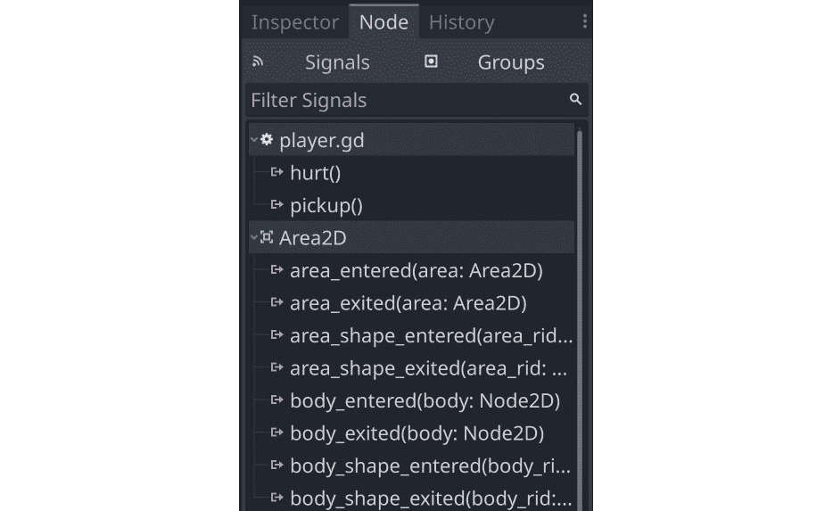

图 2.21：节点的信号列表

也要在那里记录你的自定义信号。由于其他对象也将是`Area2D`节点，你将想要使用`area_entered`信号。选择它，并在你的脚本中点击`_on_area_entered()`。

在连接信号时，你不仅可以让 Godot 为你创建函数，还可以指定你想要使用的现有函数的名称。如果你不想让 Godot 为你创建函数，请关闭**Make Function**开关。

将以下代码添加到这个新函数中：

```cpp
func _on_area_entered(area):
    if area.is_in_group("coins"):
        area.pickup()
        pickup.emit()
    if area.is_in_group("obstacles"):
        hurt.emit()
        die()
```

当另一个区域对象与玩家重叠时，此函数将被调用，并且重叠的区域将通过`area`参数传递。硬币对象将有一个`pickup()`函数，该函数定义了捡起硬币时硬币会做什么（例如播放动画或声音）。当你创建硬币和障碍物时，你需要将它们分配到适当的**组**，以便它们可以被正确检测。

总结一下，到目前为止的完整玩家脚本如下：

```cpp
extends Area2D
signal pickup
signal hurt
@export var speed = 350
var velocity = Vector2.ZERO
var screensize = Vector2(480, 720)
func _process(delta):
    # Get a vector representing the player's input
    # Then move and clamp the position inside the screen
    velocity = Input.get_vector("ui_left", "ui_right",
        "ui_up", "ui_down")
    position += velocity * speed * delta
    position.x = clamp(position.x, 0, screensize.x)
    position.y = clamp(position.y, 0, screensize.y)
    # Choose which animation to play
    if velocity.length() > 0:
        $AnimatedSprite2D.animation = "run"
    else:
        $AnimatedSprite2D.animation = "idle"
    if velocity.x != 0:
        $AnimatedSprite2D.flip_h = velocity.x < 0
func start():
    # This function resets the player for a new game
    set_process(true)
    position = screensize / 2
    $AnimatedSprite2D.animation = "idle"
func die():
    # We call this function when the player dies
    $AnimatedSprite2D.animation = "hurt"
    set_process(false)
func _on_area_entered(area):
    # When we hit an object, decide what to do
    if area.is_in_group("coins"):
        area.pickup()
        pickup.emit()
    if area.is_in_group("obstacles"):
        hurt.emit()
        die()
```

你已经完成了玩家对象的设置，并且已经测试了移动和动画是否正常工作。在继续下一步之前，请回顾玩家场景设置和脚本，并确保你理解你所做的一切以及为什么这样做。在下一节中，你将为玩家创建一些可收集的对象。

# 第二部分 – 硬币场景

在这部分，你将为玩家创建硬币。这将是一个独立的场景，描述单个硬币的所有属性和行为。一旦保存，主场景将加载这个场景并创建多个 **实例**（即副本）。

## 节点设置

点击 `Player` 场景：

+   `Area2D`（命名为 `Coin`）:

    +   `AnimatedSprite2D`

    +   `CollisionShape2D`

确保在添加节点后保存场景。

按照玩家场景中的方式设置 `AnimatedSprite2D`。这次，你只有一个动画 – 一种使硬币看起来动态且有趣的光泽/闪耀效果。添加所有帧并将动画速度设置为 `12 FPS`。图像也稍微有点大，所以将 `AnimatedSprite2D` 设置为 `(0.4, 0.4)`。在 `CollisionShape2D` 中，使用 `CircleShape2D` 并将其调整大小以覆盖硬币图像。

### 使用组

组为节点提供了一种标记系统，允许你识别相似的节点。一个节点可以属于任意数量的组。为了让玩家脚本正确检测到硬币，你需要确保所有硬币都将位于一个名为 `Coin` 的组中，点击框中的 `coins` 并点击 **添加**：

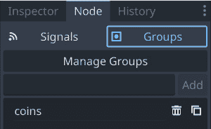

图 2.22：组选项卡

## 硬币脚本

你的下一步是为 `Coin` 节点添加一个脚本。选择节点并点击新脚本按钮，就像你对 `Player` 节点所做的那样。如果你取消选择 **模板** 选项，你将得到一个没有注释或建议的空脚本。硬币的代码比玩家的代码要短得多：

```cpp
extends Area2D
var screensize = Vector2.ZERO
func pickup():
    queue_free()
```

请记住，`pickup()` 函数是由玩家脚本调用的。它定义了收集硬币时硬币将执行的操作。`queue_free()` 是 Godot 用于删除节点的函数。它安全地从树中删除节点并从内存中删除它及其所有子节点。稍后，你将在这里添加视觉和音频效果，但现在，让硬币消失就足够了。

删除节点

`queue_free()` 并不会立即删除对象，而是将其添加到队列中，在当前帧结束时删除。这比立即删除节点更安全，因为游戏中可能还有其他代码需要节点存在。通过等待到帧的末尾，Godot 可以确保所有可以访问节点的代码都已完成，节点可以安全地被移除。

你现在已经完成了这个游戏所需的两个对象中的第二个。硬币对象可以随机放置在屏幕上，并且它可以检测玩家何时触摸它，因此可以被收集。拼图的剩余部分是如何将所有这些组合在一起。在下一节中，你将创建第三个场景以随机生成硬币并允许玩家与之交互。

# 第三部分 – 主场景

`Main` 场景是将游戏的所有部分联系在一起的关键。它将管理玩家、硬币、时钟以及游戏的所有其他部分。

## 节点设置

创建一个新的场景并添加一个名为 `Main` 的 `Node`。最简单的节点类型是 `Node` —— 它本身几乎不做任何事情，但你会将其用作所有游戏对象的父节点，并添加一个脚本，使其具有你需要的功能。保存场景。

通过点击 `player.tscn` 将玩家添加为 `Main` 的子节点：

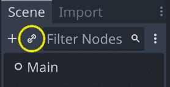

图 2.23：实例化场景

将以下节点作为 `Main` 的子节点添加：

+   一个名为 `Background` 的 `TextureRect` 节点——用于背景图像

+   一个名为 `GameTimer` 的 `Timer` 节点——用于倒计时计时器

确保将 `Background` 作为第一个子节点，通过在节点列表中将它拖到玩家上方。节点按照在树中显示的顺序绘制，所以如果 `Background` 是第一个，那么确保它在玩家后面绘制。通过将 `assets` 文件夹中的 `grass.png` 图像拖动到编辑器窗口顶部的布局按钮上的 **Texture** 属性来添加图像到 `Background` 节点。将 **Stretch Mode** 改为 **Tile**，然后通过点击编辑器窗口顶部的布局按钮将大小设置为 **Full Rect**：

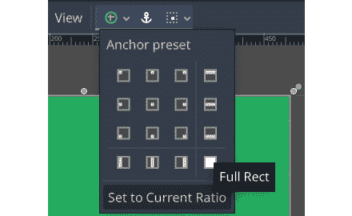

图 2.24：布局选项

## 主脚本

将脚本添加到 `Main` 节点，并添加以下变量：

```cpp
extends Node
@export var coin_scene : PackedScene
@export var playtime = 30
var level = 1
var score = 0
var time_left = 0
var screensize = Vector2.ZERO
var playing = false
```

`Main` 节点。从 **FileSystem** 面板拖动 `coin.tscn` 并将其放入 **Coin** **Scene** 属性。

### 初始化

首先，添加 `_ready()` 函数：

```cpp
func _ready():
    screensize = get_viewport().get_visible_rect().size
    $Player.screensize = screensize
    $Player.hide()
```

Godot 在每个节点被添加时自动调用 `_ready()`。这是一个放置你希望在节点生命周期开始时执行的代码的好地方。

注意，你正在使用 `$` 语法通过名称引用 `Player` 节点，这使得你可以找到游戏屏幕的大小并设置玩家的 `screensize` 变量。`hide()` 使节点不可见，所以在游戏开始之前你不会看到玩家。

## 开始新游戏

`new_game()` 函数将为新游戏初始化一切：

```cpp
func new_game():
    playing = true
    level = 1
    score = 0
    time_left = playtime
    $Player.start()
    $Player.show()
    $GameTimer.start()
    spawn_coins()
```

除了设置变量的起始值外，此函数还调用你之前编写的玩家的 `start()` 函数。启动 `GameTimer` 将开始倒计时游戏剩余时间。

你还需要一个函数，该函数将根据当前级别创建一定数量的硬币：

```cpp
func spawn_coins():
    for i in level + 4:
        var c = coin_scene.instantiate()
        add_child(c)
        c.screensize = screensize
        c.position = Vector2(randi_range(0, screensize.x),
            randi_range(0, screensize.y))
```

在这个函数中，你创建多个 `Coin` 对象并将它们作为 `Main` 的子对象添加（这次是通过代码，而不是手动点击 `add_child()`。最后，你使用 `screensize` 变量选择金币的随机位置，这样它们就不会出现在屏幕之外。你将在每个级别的开始时调用这个函数，每次生成更多的金币。

最终，你希望当玩家点击 `_ready()` 函数末尾的 `new_game()` 并点击 `main.tscn` 时调用 `new_game()`。现在，每次你玩这个项目时，`Main` 场景都将启动。

到这个时候，你应该在屏幕上看到你的玩家和五个金币出现。当玩家触摸一个金币时，它会消失。

测试完成后，从 `_ready()` 函数中移除 `new_game()`。

### 检查剩余金币

`main` 脚本需要检测玩家是否已经捡起所有金币。由于所有金币都在 `coins` 组中，你可以检查组的大小以查看剩余多少。由于需要持续检查，将其放在 `_process()` 函数中：

```cpp
func _process(delta):
    if playing and
    get_tree().get_nodes_in_group("coins").size() == 0:
        level += 1
        time_left += 5
        spawn_coins()
```

如果没有更多的金币剩余，那么玩家将进入下一级。

这完成了主要场景。在这个步骤中，你学到的最重要的东西是如何使用 `instantiate()` 动态在代码中创建新对象。这是在构建许多类型的游戏系统时你会反复使用的东西。在上一个步骤中，你将创建一个额外的场景来处理显示游戏信息，例如玩家的得分和剩余时间。

# 第四部分 – 用户界面

游戏需要的最后一个元素是 **用户界面**（**UI**）。这将在游戏过程中显示玩家需要看到的信息，通常被称为 **抬头显示**（**HUD**），因为信息以叠加的形式出现在游戏视图之上。你还将使用这个场景在游戏结束后显示一个开始按钮。

你的 HUD 将显示以下信息：

+   得分

+   剩余时间

+   一个消息，例如 **游戏结束**

+   一个开始按钮

## 节点设置

创建一个新的场景并添加一个名为 `HUD` 的 `CanvasLayer` 节点。一个 `CanvasLayer` 节点创建一个新的绘图层，这将允许你在游戏的其他部分之上绘制你的 UI 元素，这样它就不会被游戏对象，如玩家或金币，覆盖。

Godot 提供了各种 UI 元素，可以用来创建从指示器，如生命值条，到复杂界面，如存货界面。实际上，你用来制作这个游戏的 Godot 编辑器就是使用 Godot UI 元素构建的。UI 的基本节点都扩展自 `Control`，并在节点列表中显示为绿色图标。为了创建你的 UI，你将使用各种 `Control` 节点来定位、格式化和显示信息。以下是完成后的 HUD 看起来的样子：


图 2.25：HUD 布局

## 消息标签

将一个`Label`节点添加到场景中，并将其名称更改为`Message`。当游戏结束时，此标签将显示游戏的标题以及**游戏结束**。此标签应位于游戏屏幕中央。您可以使用鼠标拖动它，或在**检查器**窗口中直接设置值，但使用布局菜单中提供的快捷键最简单，这将为您设置值。

从布局菜单中选择**HCenter Wide**：

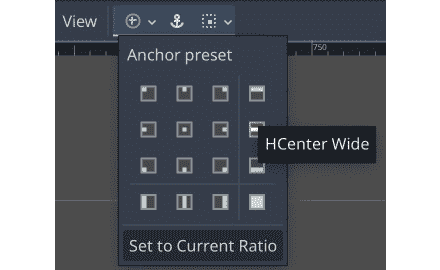

图 2.26：消息定位

标签现在横跨屏幕宽度并垂直居中。**文本**属性设置标签显示的文本。将其设置为**Coin Dash!**，并将**水平对齐**和**垂直对齐**都设置为**居中**。

`Label`节点的默认字体非常小且不吸引人，所以下一步是分配一个自定义字体。在**标签设置**属性中，选择**新标签设置**然后点击它以展开。

从`Kenney Bold.ttf`字体文件中拖动它到**字体**属性，并将**大小**设置为**48**。您还可以通过添加阴影来改善外观——尝试以下截图中的设置，或尝试您自己的设置：

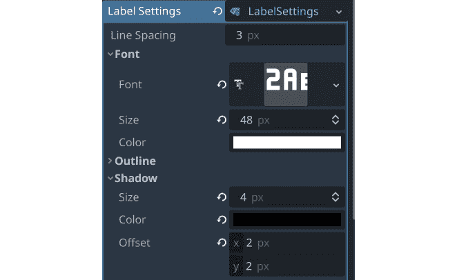

图 2.27：字体设置

## 分数和时间显示

HUD 的顶部将显示玩家的分数和时钟剩余时间。这两个都将使用`Label`节点，并安排在游戏屏幕的相对两侧。您将使用**容器**节点来管理它们的位置。

### 容器

Godot 的`Container`节点会自动安排其子`Control`节点（包括其他容器）的位置和大小。您可以使用它们在元素周围添加填充、使它们居中，或按行和列排列。每种类型的`Container`都有特殊的属性来控制它们如何排列其子节点。

请记住，容器会自动排列其子节点。如果您尝试移动或调整容器节点内的`Control`的大小，编辑器会发出警告。您可以手动排列控件*或*使用容器排列控件，但不能同时进行。

## 分数和时间显示

要管理分数和时间标签，请将一个`MarginContainer`节点添加到`HUD`中。使用布局菜单设置锚点为`10`。这将添加一些填充，使文本不会紧贴屏幕边缘。

由于分数和时间标签将使用与`Message`相同的字体设置，您可以通过复制它来节省时间。选择`Message`并按*Ctrl* + *D*两次以创建两个副本标签。将它们都拖动并放到`MarginContainer`中，使它们成为其子节点。将一个子节点命名为`Score`，另一个命名为`Time`，并设置`Score`但不要设置`Time`。

## 通过 GDScript 更新 UI

将脚本添加到 `HUD` 节点。此脚本将在需要更改属性时更新 UI 元素，例如，每当收集到一个硬币时更新 `Score` 文本。请参阅以下代码：

```cpp
extends CanvasLayer
signal start_game
func update_score(value):
    $MarginContainer/Score.text = str(value)
func update_timer(value):
    $MarginContainer/Time.text = str(value)
```

`Main` 场景的脚本将调用这两个函数以在值发生变化时更新显示。对于 `Message` 标签，您还需要一个计时器，以便在短时间内消失。

在 `HUD` 下添加一个 `Timer` 节点，并设置 `2` 秒和 **One Shot** 为 **开启**。这确保了当启动计时器时，它只会运行一次，而不是重复。添加以下代码：

```cpp
func show_message(text):
    $Message.text = text
    $Message.show()
    $Timer.start()
```

在此函数中，您将显示消息并启动计时器。要隐藏消息，连接 `Timer` 的 `timeout` 信号（记住，它将自动创建新函数）：

```cpp
func _on_timer_timeout():
    $Message.hide()
```

### 使用按钮

在 `HUD` 中添加一个 `Button` 节点，并将其名称更改为 `StartButton`。此按钮将在游戏开始前显示，点击后将隐藏自身并向 `Main` 场景发送信号以开始游戏。设置 `Message`。

在布局菜单中，选择 **Center Bottom** 以将按钮居中显示在屏幕底部。

当按钮被按下时，它会发出一个信号。在 `StartButton` 中连接 `pressed` 信号：

```cpp
func _on_start_button_pressed():
    $StartButton.hide()
    $Message.hide()
    start_game.emit()
```

## 游戏结束

您的 UI 脚本的最终任务是响应游戏结束：

```cpp
func show_game_over():
    show_message("Game Over")
    await $Timer.timeout
    $StartButton.show()
    $Message.text = "Coin Dash!"
    $Message.show()
```

在此函数中，您需要 `show_message("Game Over")` 执行的操作。然而，一旦消息消失，您希望显示开始按钮和游戏标题。`await` 命令暂停函数的执行，直到给定的节点（`Timer`）发出给定的信号（`timeout`）。一旦接收到信号，函数将继续，一切将恢复到初始状态，以便您可以再次游戏。

## 将 HUD 添加到 Main

下一个任务是设置 `Main` 和 `HUD` 之间的通信。将 `HUD` 的实例添加到 `Main` 中。在 `Main` 中，连接 `GameTimer` 的 `timeout` 信号，并添加以下内容，以便每次 `GameTimer` 超时（每秒）时，剩余时间都会减少：

```cpp
func _on_game_timer_timeout():
    time_left -= 1
    $HUD.update_timer(time_left)
    if time_left <= 0:
        game_over()
```

接下来，选择 `Main` 中的 `Player` 实例，并连接其 `pickup` 和 `hurt` 信号：

```cpp
func _on_player_hurt():
    game_over()
func _on_player_pickup():
    score += 1
    $HUD.update_score(score)
```

游戏结束时需要发生几件事情，因此添加以下函数：

```cpp
func game_over():
    playing = false
    $GameTimer.stop()
    get_tree().call_group("coins", "queue_free")
    $HUD.show_game_over()
    $Player.die()
```

此函数停止游戏并使用 `call_group()` 通过对每个剩余的硬币调用 `queue_free()` 来移除所有剩余的硬币。

最后，按下 `StartButton` 需要激活 `Main` 的 `new_game()` 函数。选择 `HUD` 的实例，并连接其 `start_game` 信号：

```cpp
func _on_hud_start_game():
    new_game()
```

确保您已从 `Main` 的 `_ready()` 函数中删除 `new_game()`（记住，那只是为了测试），并将这两行添加到 `new_game()` 中：

```cpp
$HUD.update_score(score)
$HUD.update_timer(time_left)
```

现在，你可以玩游戏了！确认所有部分都按预期工作——得分、倒计时、游戏结束和重新开始等。如果你发现某个部分没有正常工作，请返回并检查你创建它的步骤，以及可能将其连接到游戏其他部分的步骤。一个常见的错误是忘记连接你在游戏不同部分使用的许多信号之一。

一旦你玩过游戏并确认一切正常工作，你就可以继续到下一部分，在那里你可以添加一些额外的功能来完善游戏体验。

# 第五部分 - 收尾

恭喜你创建了一个完整、可工作的游戏！在本节中，你将向游戏中添加一些额外的东西，使其更加有趣。游戏开发者使用术语**juice**来描述使游戏感觉好玩的事物。juice 可以包括声音、视觉效果或任何其他增加玩家享受的东西，而无需改变游戏玩法本身。

## 视觉效果

当你捡起硬币时，它们只是消失了，这并不很有吸引力。添加视觉效果将使收集大量硬币变得更加令人满意。

### 什么是 tween？

**tween**是一种使用特定的数学函数在时间上逐渐改变某个值的方法。例如，你可能选择一个稳定改变值的函数，或者一个开始缓慢但逐渐加速的函数。tweening 有时也被称为**easing**。你可以在 https://easings.net/看到许多 tweening 函数的动画示例。

在 Godot 中使用 tween 时，你可以将其分配给改变一个或多个节点的属性。在这种情况下，你将增加硬币的缩放，并使用**Modulate**属性使其淡出。一旦 tween 完成其工作，硬币将被删除。

然而，有一个问题。如果我们不立即移除硬币，那么玩家可能再次移动到硬币上——触发`area_entered`信号第二次，并注册为第二次拾取。为了防止这种情况，你可以禁用碰撞形状，这样硬币就不能触发任何进一步的碰撞。

你新的`pickup()`函数应该看起来像这样：

```cpp
func pickup():
    $CollisionShape2d.set_deferred("disabled", true)
    var tw = create_tween().set_parallel().
        set_trans(Tween.TRANS_QUAD)
    tw.tween_property(self, "scale", scale * 3, 0.3)
    tw.tween_property(self, "modulate:a", 0.0, 0.3)
    await tw.finished
    queue_free()
```

这需要很多新的代码，所以让我们来分解一下：

首先，`CollisionShape2D`的`disabled`属性需要设置为`true`。然而，如果你直接尝试设置它，Godot 会抱怨。在碰撞正在处理时，不允许更改物理属性；你必须等待当前帧的结束。这就是`set_deferred()`的作用。

接下来，`create_tween()`创建一个 tween 对象，`set_parallel()`表示任何后续的 tween 都应该同时发生，而不是一个接一个地发生，`set_trans()`将过渡函数设置为“二次”曲线。

之后是两行设置属性缓动的代码。`tween_property()`函数接受四个参数——要影响的对象（`self`）、要更改的属性、结束值和持续时间（以秒为单位）。

现在，当你运行游戏时，你应该看到硬币在被拾取时播放效果。

## 声音

声音是游戏设计中重要但常被忽视的部分。良好的声音设计可以在非常小的努力下为你的游戏增添大量活力。声音可以给玩家提供反馈，将他们与角色情感上联系起来，甚至可以是游戏玩法的一部分（“你听到背后有脚步声”）。

对于这个游戏，你将添加三个声音效果。在`Main`场景中，添加三个`AudioStreamPlayer`节点，并分别命名为`CoinSound`、`LevelSound`和`EndSound`。将每个声音从`res://assets/audio/`文件夹拖放到相应节点的**Stream**属性中。

要播放声音，你需要在节点上调用`play()`函数。将以下每一行添加到适当的时间以播放声音：

+   在`_on_player_pickup()`中调用`$CoinSound.play()`

+   在`game_over()`中调用`$EndSound.play()`

+   在`spawn_coins()`中调用`$LevelSound.play()`（但不要在循环内！）

## 加速道具

有很多种对象可以为玩家提供小的优势或加速道具。在本节中，你将添加一个加速道具项目，当收集时会给玩家一小段时间奖励。它将偶尔短暂出现，然后消失。

新场景将与你已经创建的`Coin`场景非常相似，因此点击你的`Coin`场景，选择`powerup.tscn`。将根节点的名称更改为`Powerup`，并通过点击**分离脚本**按钮——**<****IMG>**移除脚本。

通过点击垃圾桶按钮在`coins`组中删除，并添加一个名为`powerups`的新组。

在`AnimatedSprite2D`中，将硬币的图像更改为加速道具，你可以在`res://assets/pow/`文件夹中找到它。

点击添加新脚本，并从`coin.gd`脚本中复制代码。

接下来，添加一个名为`Lifetime`的`Timer`节点。这将限制对象在屏幕上停留的时间。将其`2`和`timeout`信号都设置为 2，以便在时间周期结束时移除加速道具：

```cpp
func _on_lifetime_timout():
    queue_free()
```

现在，转到你的`Main`场景，并添加另一个名为`PowerupTimer`的`Timer`节点。在`audio`文件夹中设置其`Powerup.wav`声音，你可以通过另一个`AudioStreamPlayer`添加。连接`timeout`信号，并添加以下代码以生成加速道具：

```cpp
func _on_powerup_timer_timeout():
    var p = powerup_scene.instantiate()
    add_child(p)
    p.screensize = screensize
    p.position = Vector2(randi_range(0, screensize.x),
        randi_range(0, screensize.y))
```

`Powerup`场景需要与一个变量链接，就像你与`Coin`场景所做的那样，因此在`main.gd`顶部添加以下行，然后将`powerup.tscn`拖放到新属性中：

```cpp
@export var powerup_scene : PackedScene
```

加速道具应该随机出现，因此每次开始新关卡时都需要设置`PowerupTimer`的等待时间。在用`spawn_coins()`生成新硬币后，将以下代码添加到`_process()`函数中：

现在，你将看到道具出现；最后一步是给玩家收集它们的能力。目前，玩家脚本假设它遇到的是硬币或障碍物。将 `player.gd` 中的代码更改以检查被击中的对象类型：

```cpp
func _on_area_entered(area):
    if area.is_in_group("coins"):
        area.pickup()
        pickup.emit("coin")
    if area.is_in_group("powerups"):
        area.pickup()
        pickup.emit("powerup")
    if area.is_in_group("obstacles"):
        hurt.emit()
        die()
```

注意，现在你使用额外的参数来发射 `pickup` 信号，该参数命名了对象的类型。`main.gd` 中的相应函数现在必须更改以接受该参数并决定采取什么行动：

```cpp
func _on_player_pickup(type):
    match type:
        "coin":
            $CoinSound.play()
            score += 1
            $HUD.update_score(score)
        "powerup":
            $PowerupSound.play()
            time_left += 5
            $HUD.update_timer(time_left)
```

`match` 语句是 `if` 语句的有用替代品，尤其是在你有大量可能值要测试时。

尝试运行游戏并收集道具（记住，它不会出现在第 1 关）。确保播放声音，计时器增加五秒。

## 硬币动画

当你创建硬币时，你使用了 `AnimatedSprite2D`，但它还没有播放。硬币动画显示一个“闪烁”效果，在硬币的表面上移动。如果所有硬币同时显示这个效果，看起来会太规律，所以每个硬币的动画都需要一个小的随机延迟。

首先，点击 `AnimatedSprite2D`，然后点击 `SpriteFrames` 资源。确保 **动画循环** 设置为 **关闭**，**速度** 设置为 **12 FPS**。


图 2.28：动画设置

将 `Timer` 节点添加到 `Coin` 场景中，然后将其添加到硬币的脚本中：

```cpp
func _ready():
    $Timer.start(randf_range(3, 8))
```

然后，连接 `Timer` 的 `timeout` 信号并添加以下内容：

```cpp
func _on_timer_timeout():
    $AnimatedSprite2d.frame = 0
    $AnimatedSprite2d.play()
```

尝试运行游戏并观察硬币的动画。这需要非常小的努力就能产生一个很好的视觉效果，至少对程序员来说是这样——艺术家必须绘制所有这些帧！你会在专业游戏中注意到很多这样的效果。虽然很微妙，但视觉吸引力使得游戏体验更加愉悦。

## 障碍物

最后，通过引入玩家必须避免的障碍物，可以使游戏更具挑战性。触摸障碍物将结束游戏。

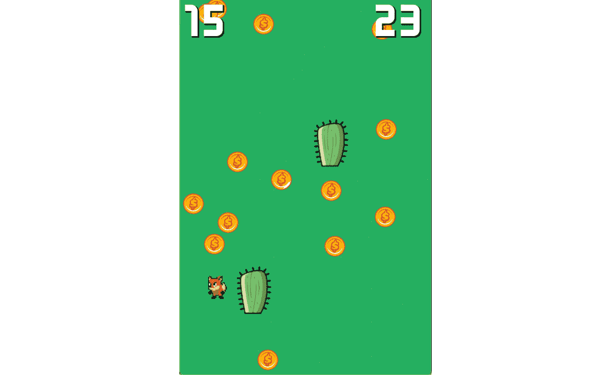

图 2.29：带有障碍物的示例游戏

创建一个新的 `Area2D` 场景并将其命名为 `Cactus`。给它添加 `Sprite2D` 和 `CollisionShape2D` 子节点。从 `Sprite2D` 拖动仙人掌纹理。将 `RectangleShape2D` 添加到碰撞形状中，并调整其大小以覆盖图像。记得你在玩家代码中添加了 `if area.is_in_group("obstacles"?)` 吗？使用 **节点** 选项卡将 `Cactus` 添加到 `obstacles` 组。玩玩游戏，看看撞到仙人掌会发生什么。

你可能已经发现了问题——硬币可以出现在仙人掌上，这使得它们无法被捡起。当硬币放置时，如果它检测到与障碍物重叠，则需要移动。在 `Coin` 场景中，连接其 `area_entered` 信号并添加以下内容：

```cpp
func _on_area_entered(area):
    if area.is_in_group("obstacles"):
        position = Vector2(randi_range(0, screensize.x),
            randi_range(0, screensize.y))
```

如果你从上一节添加了 `Powerup` 对象，你需要在它的脚本中也做同样的事情。

玩这个游戏，并测试对象是否正确生成，以及它们是否与障碍物重叠。撞到障碍物应该结束游戏。

你觉得这个游戏是具有挑战性还是容易？在进入下一章之前，花点时间思考一下你可能添加到这个游戏中的其他元素。尝试使用你到目前为止所学到的知识，看看你是否能够添加它们。如果不能，把它们写下来，稍后再回来，在你学习了下一章中的一些更多技术之后。

# 摘要

在这一章中，你通过创建一个小型 2D 游戏学习了 Godot 引擎的基础知识。你设置了一个项目并创建了多个场景，与精灵和动画一起工作，捕捉用户输入，使用**信号**在节点之间进行通信，并创建了一个用户界面。你在这一章中学到的知识是你在任何 Godot 项目中都会用到的关键技能。

在进入下一章之前，回顾一下项目。你知道每个节点的作用吗？有没有你不理解的代码片段？如果有，回到并复习那一章节。

此外，你也可以自由地尝试这个游戏并改变一些东西。了解游戏不同部分功能的一个最好的方法就是改变它们，看看会发生什么。

记得第一章中的提示吗？如果你真的想快速提高你的技能，关闭这本书，开始一个新的 Godot 项目，并尝试再次制作*Coin Dash*，不要偷看。如果你不得不看书，那没关系，但尽量只在尝试自己解决问题之后再查找东西。

在下一章中，你将探索 Godot 的更多功能，并通过构建一个更复杂的游戏来学习如何使用更多类型的节点。
