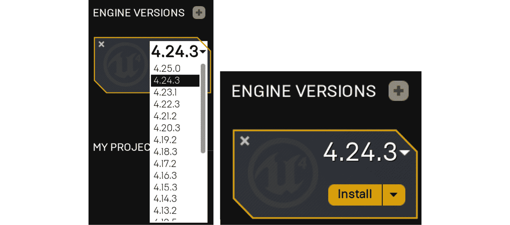

# 前言

# 关于本书

游戏开发既可以是一种创造性的兴趣爱好，也可以是一种全职职业道路。这也是提高你的 C++技能并将其应用于引人入胜和具有挑战性的项目的一种激动人心的方式。

《使用虚幻引擎进行游戏开发项目》从你作为游戏开发者需要开始的基本技能开始。游戏设计的基础将被清晰地解释，并通过现实练习进行实际演示。然后，你将通过具有挑战性的活动应用所学到的知识。

这本书从虚幻编辑器和关键概念开始，如角色、蓝图、动画、继承和玩家输入。然后，你将开始三个项目中的第一个：构建一个躲避球游戏。在这个项目中，你将探索线追踪、碰撞、抛射物、用户界面和音效，结合这些概念来展示你的新技能。

然后，你将开始第二个项目；一个横向卷轴游戏，你将实现包括动画混合、敌人人工智能、生成对象和可收集物品在内的概念。最后一个项目是一款 FPS 游戏，你将涵盖创建多人环境的关键概念。

通过本书，你将拥有信心和知识，开始自己的创意 UE4 项目，并将你的想法变为现实。

## 关于作者

*Hammad Fozi*是 BIG IMMERSIVE 的首席游戏开发者（虚幻引擎）。

*Gonçalo Marques*从 6 岁开始就是一名活跃的玩家。他曾在葡萄牙初创公司 Sensei Tech 担任自由职业者，在那里他使用 UE4 开发了一个内部系统，用于生成辅助机器学习的数据集。

*David Pereira*在 1998 年开始了他的游戏开发生涯，他学会了使用 Clickteam 的 The Games Factory，并开始制作自己的小游戏。David 要感谢以下人员：*我要感谢我的女朋友，我的家人和我的朋友在这个旅程中对我的支持。这本书献给我的祖母特蕾莎（“E vai daí ós'pois...!”）*。

*Devin Sherry*是一名技术设计师，就职于名为 People Can Fly 的游戏工作室，并参与了他们使用虚幻引擎 4 构建的最新 IP。Devin 在 2012 年在前进科技大学学习游戏开发和游戏设计，获得了游戏设计学士学位。

## 受众

这本书适合任何想要开始使用 UE4 进行游戏开发的人。它也适用于以前使用过虚幻引擎并希望巩固、改进和应用他们的技能的人。为了更好地理解本书中解释的概念，你必须具备 C++基础知识，并了解变量、函数、类、多态和指针。为了与本书中使用的 IDE 完全兼容，建议使用 Windows 系统。

## 关于章节

《第一章》，《虚幻引擎介绍》，探讨了虚幻引擎编辑器。你将被介绍到编辑器的界面，看到如何在关卡中操作角色，了解蓝图视觉脚本语言的基础，并发现如何创建可以被网格使用的材质资产。

《第二章》，《使用虚幻引擎》，介绍了虚幻引擎游戏基础知识，以及如何创建一个 C++项目和设置项目的内容文件夹。你还将介绍动画的主题。

《第三章》，《角色类组件和蓝图设置》，向你介绍了虚幻角色类，以及对象继承的概念以及如何使用输入映射。

《第四章》，《玩家输入》，介绍了玩家输入的主题。你将学习如何将按键或触摸输入与游戏内动作（如跳跃或移动）相关联，通过使用动作映射和轴映射。

第五章，“线性跟踪”，开始了一个名为 Dodgeball 的新项目。在本章中，您将了解线性跟踪的概念以及它们在游戏中的各种用途。

第六章，“碰撞对象”，探讨了对象碰撞的主题。您将了解碰撞组件、碰撞事件和物理模拟。您还将学习定时器、投射物移动组件和物理材料的主题。

第七章，“UE4 实用工具”，教您如何在虚幻引擎中实现一些有用的实用工具，包括角色组件、接口和蓝图函数库，这将有助于使您的项目结构良好，并且易于其他加入您团队的人理解。

第八章，“用户界面”，探讨了游戏 UI 的主题。您将学习如何使用虚幻引擎的 UI 系统 UMG 制作菜单和 HUD，以及如何使用进度条显示玩家角色的生命值。

第九章，“音频-视觉元素”，介绍了虚幻引擎中声音和粒子效果的主题。您将学习如何将声音文件导入项目并将其用作 2D 和 3D 声音，以及如何将现有的粒子系统添加到游戏中。最后，将制作一个新的关卡，使用前几章构建的所有游戏机制来完成 Dodgeball 项目。

第十章，“创建一个 SuperSideScroller 游戏”，分解了 SuperSideScroller 游戏项目的游戏机制。您将通过 Epic Games Launcher 创建 C++ SideScroller 项目模板，并通过操纵默认人体模型骨架和导入自定义骨骼网格来学习动画的基本概念。

第十一章，“混合空间 1D、按键绑定和状态机”，向您介绍了用于开发平滑动画混合的工具，包括混合空间 1D 和动画状态机。您还将进入 C++代码，通过按键绑定和角色移动组件的帮助来开发玩家角色的奔跑机制。

第十二章，“动画混合和蒙太奇”，向您介绍了动画蒙太奇和动画蓝图中的动画混合功能，以开发玩家角色的投掷动画。您将了解动画插槽，并使用每个骨骼的分层混合来正确地在角色的移动动画和投掷动画之间进行混合。

第十三章，“敌人人工智能”，涵盖了人工智能以及如何使用行为树和黑板开发人工智能。您将实现一个沿着自定义路径巡逻的人工智能，使用您将开发的蓝图角色。

第十四章，“生成玩家投射物”，向您介绍了动画通知以及如何在游戏世界中生成对象。您将实现一个自定义的动画通知，在特定帧生成玩家投射物的投掷动画。您还将开发玩家投射物的功能，使其能够摧毁敌人人工智能。

第十五章，“收集品、能量增强和拾取物”，演示了如何创建一个可以操纵玩家移动的自定义药水增强，以及玩家角色的可收集硬币。您还将通过开发一个简单的 UI 来学习更多关于 UMG，以便统计玩家找到的收集品数量。

第十六章，“多人游戏基础”，向您介绍了重要的多人游戏概念，如服务器-客户端架构、连接、角色所有权、角色和变量复制。您还将学习如何制作 2D 混合空间以及如何使用变换修改骨骼节点。您将开始通过创建一个角色来工作在一个多人游戏 FPS 项目上，该角色可以行走、跳跃、上下查看，并具有两个复制的状态：生命值和护甲。

第十七章“远程过程调用”介绍了远程过程调用的使用方法，以及如何在虚幻引擎 4 中使用枚举和双向循环数组索引。您还将通过添加武器和弹药的概念来扩展多人游戏 FPS 项目。

第十八章“多人游戏中的游戏框架类”是本书的最后一章，解释了多人游戏中游戏框架类的存在位置，如何使用游戏状态和玩家状态类，以及如何实现一些有用的内置功能。您还将了解如何在游戏模式中使用匹配状态和其他概念。最后，您将通过添加死亡、重生、记分牌、击杀限制和拾取物品的概念来完成多人游戏 FPS 项目。

## 约定

文本中的代码单词、文件夹名称、文件名、文件扩展名、路径名、虚拟 URL 和用户输入显示如下：

“打开`Project Settings`并转到`Engine`部分内的`Collision`子部分。”

屏幕上显示的文字，例如菜单或对话框中的文字，也会在文本中出现，如下所示：

“点击`New Object Channel`按钮，命名为`Dodgeball`，并将其`Default Response`设置为`Block`。”

代码块设置如下：

```cpp
if (bCanSeePlayer)
{
  //Start throwing dodgeballs
  GetWorldTimerManager().SetTimer(ThrowTimerHandle,this,  &AEnemyCharacter::ThrowDodgeball,ThrowingInterval,true,  ThrowingDelay);
}
```

新术语、缩写和重要单词显示如下：“在本章中，我们将介绍**远程过程调用**（**RPC**），这是另一个重要的多人游戏概念，允许服务器在客户端上执行函数，反之亦然。”

## 开始之前

本节将指导您完成安装和配置步骤，以便为您设置必要的工作环境。

## 安装 Visual Studio

因为我们将在虚幻引擎 4 中使用 C++，所以我们需要一个与引擎轻松配合的**IDE**（集成开发环境）。Visual Studio Community 是 Windows 上可用于此目的的最佳 IDE。如果您使用 macOS 或 Linux，您将需要使用另一个 IDE，例如 Visual Studio Code、QT Creator 或 Xcode（仅在 macOS 上可用）。

本书中给出的指导是针对 Windows 上的 Visual Studio Community 的，因此，如果您使用不同的操作系统和/或 IDE，则需要自行研究如何设置这些内容以在您的工作环境中使用。在本节中，您将通过安装 Visual Studio 来完成，以便您可以轻松编辑 UE4 的 C++文件。

1.  转到 Visual Studio 下载网页[`visualstudio.microsoft.com/downloads`](https://visualstudio.microsoft.com/downloads)。我们将在本书中使用的虚幻引擎 4 版本（4.24.3）推荐使用 Visual Studio Community 2019 版本。请务必下载该版本。

1.  当您这样做时，打开您刚下载的可执行文件。它最终会带您到以下窗口，您将能够选择您的 Visual Studio 安装的模块。在那里，您将需要选中`Game Development with C++`模块，然后点击窗口右下角的`Install`按钮。点击该按钮后，Visual Studio 将开始下载和安装。安装完成后，可能会要求您重新启动计算机。重新启动计算机后，Visual Studio 应该已安装并准备就绪。

1.  第一次运行 Visual Studio 时，您可能会看到一些窗口，其中第一个是登录窗口。如果您有 Microsoft Outlook/Hotmail 帐户，您应该使用该帐户登录，否则，您可以点击`Not now, maybe later`跳过登录。

注意

如果您不输入电子邮件地址，您只能在 Visual Studio 锁定之前使用 30 天，之后您必须输入电子邮件地址才能继续使用它。

1.  之后，您将被要求选择一个颜色方案。`Dark`主题是最受欢迎的主题，也是我们在本节中将使用的主题。

最后，您可以选择“启动 Visual Studio”选项。然而，一旦您这样做，您可以再次关闭它。我们将在本书的第一章中更深入地了解如何使用 Visual Studio。

## Epic Games Launcher

要访问虚幻引擎 4，您需要下载 Epic Games Launcher，可在此链接下载：[`www.unrealengine.com/get-now`](https://www.unrealengine.com/get-now)。这个链接将允许您下载 Windows 和 macOS 的 Epic Games Launcher。如果您使用 Linux，您将需要下载虚幻引擎源代码并从源代码编译 - [`docs.unrealengine.com/en-US/GettingStarted/DownloadingUnrealEngine`](https://docs.unrealengine.com/en-US/GettingStarted/DownloadingUnrealEngine)：

1.  在那里，您需要选择“发布许可证”选项，并点击下面的“选择”按钮。这个许可证将允许您使用 UE4 创建项目，您可以直接发布给您的用户（例如在数字游戏商店）。然而，“创作者许可证”将不允许您直接将您的作品发布给最终用户。

1.  之后，您将被要求接受条款和条件，一旦您接受了这些条款，一个.msi 文件将被下载到您的计算机上。下载完成后，打开这个.msi 文件，这将提示您安装 Epic Games Launcher。按照安装说明进行安装，然后启动 Epic Games Launcher。这样做后，您应该会看到一个登录界面。

1.  如果您已经有一个帐户，您可以使用现有的凭据直接登录。如果没有，您将需要通过点击底部的“注册”文本来注册 Epic Games 帐户。

登录您的帐户后，您应该会看到“主页”选项卡。从那里，您可以点击“虚幻引擎”文本，转到“虚幻引擎”选项卡。

1.  当您完成这些操作后，您将会看到“虚幻引擎”选项卡。虚幻引擎选项卡充当虚幻引擎资源的中心。从这个页面，您将能够访问以下内容：

+   “新闻”页面，您将能够查看所有最新的虚幻引擎新闻。

+   `Youtube`频道，您将能够观看数十个关于不同虚幻引擎主题的教程和直播。

+   `AnswerHub`页面，您将能够看到、提出和回答虚幻引擎社区提出和回答的问题。

+   “论坛”页面，您将能够访问虚幻引擎论坛。

+   “路线图”页面，您将能够访问虚幻引擎路线图，包括引擎过去版本中提供的功能，以及当前正在开发的未来版本的功能。

1.  在 Epic Games Launcher 的顶部，在“虚幻引擎”选项卡中，您将能够看到其他几个选项卡，例如“虚幻引擎”选项卡（您当前正在查看的子选项卡）、“学习”选项卡和“市场”选项卡。让我们来看看这些虚幻引擎子选项卡。

1.  “学习”选项卡将允许您访问与学习如何使用虚幻引擎 4 相关的几个资源。从这里，您可以访问“开始使用虚幻引擎 4”页面，该页面将带您进入一个页面，让您选择如何开始学习虚幻引擎 4。

1.  您还可以访问“文档”页面，其中包含引擎源代码中使用的类的参考，以及“虚幻在线学习”页面，其中包含有关虚幻引擎 4 特定主题的多个课程。

1.  在“学习”选项卡的右侧是“市场”选项卡。该选项卡显示了由虚幻引擎社区成员制作的几个资产和代码插件。在这里，您将能够找到 3D 资产、音乐、关卡和代码插件，这些将帮助您推进和加速游戏的开发。

1.  最后，在`Marketplace`标签的右侧，我们有`Library`标签。在这里，您将能够浏览和管理所有虚幻引擎版本的安装、您的虚幻引擎项目以及您的市场资产库。因为我们还没有这些东西，所以这些部分都是空的。让我们改变这一点。

1.  点击`ENGINE VERSIONS`文本右侧的黄色加号。这将会显示一个新的图标，您将能够选择您想要的虚幻引擎版本。

1.  在本书中，我们将使用虚幻引擎的版本`4.24.3`。选择该版本后，点击`安装`按钮：

图 0.1：允许你安装虚幻引擎 4.24.3 的图标

1.  完成后，您将能够选择此虚幻引擎版本的安装目录，这将是您选择的，然后您应该再次点击`安装`按钮。

注意

如果你在安装 4.24 版本时遇到问题，请确保将其安装在 D 驱动器上，路径尽可能短（也就是说，不要尝试安装太多文件夹深度，并确保这些文件夹名称较短）。

1.  这将导致虚幻引擎 4.24.3 的安装开始。安装完成后，您可以通过点击版本图标的`启动`按钮来启动编辑器：

图 0.2：安装完成后的版本图标

## 代码包

你可以在 GitHub 上找到本书的代码文件，网址为[`packt.live/38urh8v`](https://packt.live/38urh8v)。在这里，你将找到练习代码、活动解决方案、图片以及完成本书实际部分所需的任何其他资产，如数据集。

## 联系我们

我们始终欢迎读者的反馈意见。

**一般反馈**：如果你对本书有任何问题，请在你的消息主题中提及书名，并发送电子邮件至 customercare@packtpub.com。

**勘误**：尽管我们已经尽一切努力确保内容的准确性，但错误确实会发生。如果你在这本书中发现了错误，我们将不胜感激，如果你能向我们报告。请访问 [www.packtpub.com/support/errata](http://www.packtpub.com/support/errata) 并填写表格。

**盗版**：如果你在互联网上发现我们作品的任何形式的非法复制，我们将不胜感激，如果你能向我们提供位置地址或网站名称。请通过 copyright@packt.com 联系我们，并附上材料链接。

**如果你有兴趣成为作者**：如果你在某个专题上有专业知识，并且有兴趣撰写或为一本书做出贡献，请访问[authors.packtpub.com](http://authors.packtpub.com)。

## 请留下评论

通过在亚马逊上留下详细、公正的评论，让我们知道你的想法。我们感谢所有的反馈意见 - 它帮助我们继续制作出优秀的产品，并帮助有抱负的开发人员提升他们的技能。请花几分钟时间给出你的想法 - 这对我们来说意义重大。
