# 第一章：1.虚幻引擎介绍

概述

本章将是对虚幻引擎编辑器的介绍。您将了解编辑器的界面；如何在关卡中添加、移除和操作对象；如何使用虚幻引擎的蓝图可视化脚本语言；以及如何将材质与网格结合使用。

在本章结束时，您将能够浏览虚幻引擎编辑器，创建自己的角色，操纵它们在关卡中，并创建材质。

# 介绍

欢迎来到*使用虚幻引擎进行游戏开发项目*。如果这是您第一次使用**虚幻引擎 4**（**UE4**），本书将帮助您开始使用市场上最受欢迎的游戏引擎之一。您将了解如何建立您的游戏开发技能，以及如何通过创建自己的视频游戏来表达自己。如果您已经尝试过使用 UE4，本书将帮助您进一步发展您的知识和技能，以便更轻松、更有效地制作游戏。

游戏引擎是一种软件应用程序，允许您从头开始制作视频游戏。它们的功能集有很大的差异，但通常允许您导入多媒体文件，如 3D 模型、图像、音频和视频，并通过编程来操作这些文件，您可以使用 C++、Python、Lua 等编程语言。

虚幻引擎 4 使用两种主要的编程语言，C++和蓝图，后者是一种可视化脚本语言，允许您做大部分 C++也可以做的事情。虽然本书将教授一些蓝图知识，但我们将主要关注 C++，因此希望您对这种语言有基本的了解，包括*变量*、*函数*、*类*、*继承*和*多态*等主题。我们会在适当的时候在本书中提醒您这些主题。

使用虚幻引擎 4 制作的热门视频游戏示例包括*堡垒之夜*、*最终幻想 7 重制版*、*无主之地 3*、*星球大战：绝地陨落*、*战争机器 5*和*海盗之海*，还有许多其他游戏。所有这些游戏都具有非常高的视觉保真度，广为人知，并且拥有或曾经拥有数百万玩家。

在以下链接中，您可以看到一些使用虚幻引擎 4 制作的优秀游戏：[`www.youtube.com/watch?v=lrPc2L0rfN4`](https://www.youtube.com/watch?v=lrPc2L0rfN4)。这个展示将向您展示虚幻引擎 4 允许您制作的游戏的多样性，无论是在视觉还是游戏风格上。

如果您希望有朝一日制作像视频中展示的游戏，或以任何方式为其做出贡献，您已迈出了那个方向的第一步。

我们现在将开始这第一步，我们将开始学习虚幻引擎编辑器。我们将了解其界面，如何在关卡中操纵对象，如何创建我们自己的对象，如何使用蓝图脚本语言，以及主要游戏事件的作用，以及如何为网格创建材质。

让我们从学习如何在这个第一个练习中创建一个新的虚幻引擎 4 项目开始这一章。

注意

在继续本章之前，请确保您已安装了*前言*中提到的所有必要软件。

## 练习 1.01：创建一个虚幻引擎 4 项目

在这个第一个练习中，我们将学习如何创建一个新的虚幻引擎 4 项目。UE4 有预定义的项目模板，允许您为项目实现基本设置。在这个练习中，我们将使用`第三人称`模板项目。

以下步骤将帮助您完成这个练习：

1.  安装虚幻引擎 4.24 版本后，通过点击版本图标的`启动`按钮来启动编辑器。

1.  完成以上步骤后，您将会看到引擎的项目窗口，其中将显示您可以打开和处理的现有项目，并且还可以选择创建新项目。因为我们还没有项目，所以“最近的项目”部分将是空的。要创建新项目，您首先必须选择“项目类别”，在我们的情况下将是“游戏”。

1.  选择了该选项后，点击“下一步”按钮。之后，您将看到项目模板窗口。该窗口将显示 Unreal Engine 中所有可用的项目模板。在创建新项目时，您可以选择添加一些资产和代码，而不是让项目从空白开始，然后您可以根据自己的喜好进行修改。有几种不同类型游戏的项目模板可供选择，但在这种情况下，我们将选择“第三人称”项目模板。

1.  选择该模板并点击“下一步”按钮，这将带您到“项目设置”窗口。

在此窗口中，您可以选择与项目相关的一些选项：

+   “蓝图或 C++”：选择是否要能够添加 C++类。默认选项可能是“蓝图”，但在我们的情况下，我们将选择`C++`选项。

+   “质量”：选择您希望项目具有高质量图形还是高性能。您可以将此选项设置为“最高质量”。

+   “光线追踪”：选择是否启用光线追踪。光线追踪是一种新颖的图形渲染技术，它允许您通过模拟光线在数字环境中的路径（使用光线）来渲染物体。尽管这种技术在性能方面相当昂贵，但在照明方面尤其提供了更加逼真的图形。您可以将其设置为“禁用”。

+   “目标平台”：选择您希望该项目运行的主要平台。将此选项设置为“桌面/游戏机”。

+   “入门内容”：选择是否希望该项目附带一组基本资产。将此选项设置为“带入门内容”。

+   “位置和名称”：在窗口底部，您可以选择项目在计算机上存储的位置和名称。

1.  确保所有选项都设置为预期值后，点击“创建项目”按钮。这将根据您设置的参数创建项目，并可能需要几分钟才能准备好。

现在让我们通过执行下一节中的步骤来开始学习 Unreal Engine 4 的基础知识，我们将学习如何使用编辑器的一些基础知识。

# 了解 Unreal

现在您将被介绍 Unreal Engine 编辑器，这是一个非常重要的主题，让您熟悉 Unreal Engine 4。

当您的项目生成完成后，您应该会看到 Unreal Engine 编辑器会自动打开。这个屏幕可能是您在使用 Unreal Engine 时最常见的屏幕，因此熟悉它非常重要。

让我们来分解一下编辑器窗口中所看到的内容：

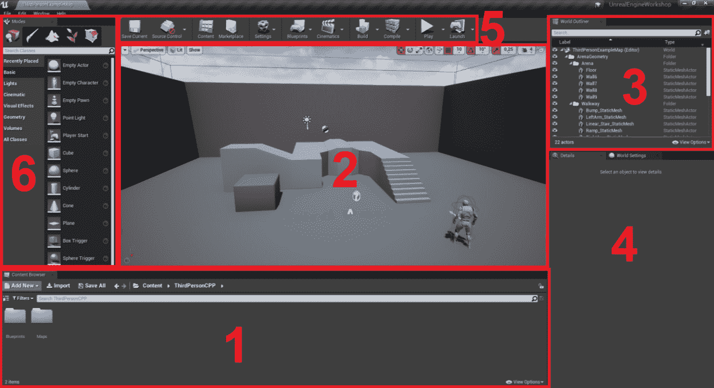

图 1.1：Unreal Engine 编辑器分为六个主要窗口

1.  `内容浏览器`：占据屏幕底部大部分的窗口是`内容浏览器`。此窗口将让您浏览和操作项目文件夹中的所有文件和资产。正如在本章开头提到的，虚幻引擎将允许您导入多种多媒体文件类型，而`内容浏览器`是将允许您在其各自的子编辑器中浏览和编辑它们的窗口。每当您创建一个虚幻引擎项目时，它都会生成一个`内容`文件夹。这个文件夹将是`内容浏览器`，这意味着您只能浏览该文件夹中的文件。您可以通过查看其顶部来查看您当前在`内容浏览器`中浏览的目录，而在我们的情况下，它是`内容 -> ThirdPersonCPP`。

如果您单击`内容浏览器`最左侧的`过滤器`按钮左侧的图标，您将能够看到`内容`文件夹的目录层次结构。此目录视图允许您选择、展开和折叠项目的`内容`文件夹中的单个目录：

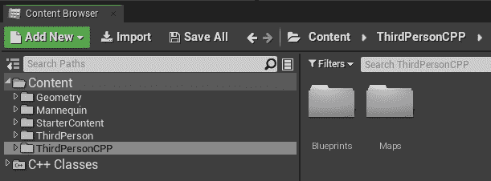

图 1.2：内容浏览器的目录视图

1.  `视口`：在屏幕的正中央，您将能够看到`视口`窗口。这将显示当前级别的内容，并允许您浏览级别以及在其中添加、移动、删除和编辑对象。它还包含有关视觉过滤器、对象过滤器（您可以看到哪些对象）和级别中的照明的几个不同参数。

1.  `世界大纲`：在屏幕的右上角，您将看到`世界大纲`。这将允许您快速列出和操作在您的级别中的对象。`视口`和`世界大纲`共同努力，让您能够管理您的级别，前者将向您展示它的外观，而后者将帮助您管理和组织它。与`内容浏览器`类似，`世界大纲`允许您在目录中组织级别中的对象，不同之处在于`内容浏览器`显示项目中的*资产*，而`世界大纲`显示级别中的*对象*。

1.  `Details`面板和`世界设置`：在屏幕的最右侧，在`世界大纲`下方，您将能够看到两个窗口 - `Details`面板和`世界设置`窗口。`Details`窗口允许您编辑您在级别中选择的对象的属性。由于截图中没有选择任何对象，因此它是空的。但是，如果您通过*左键单击*选择级别中的任何对象，其属性应该会显示在此窗口中，如下面的截图所示：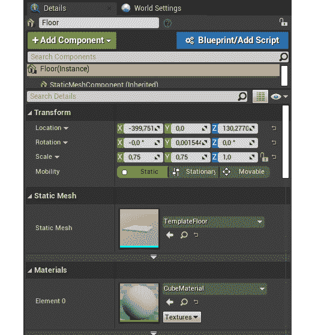

图 1.3：详细信息选项卡

`世界设置`窗口允许您设置级别的整体设置，而不是单个对象的设置。在这里，您可以更改诸如 Kill Z（您希望对象被销毁的高度）和所需的照明设置等内容：

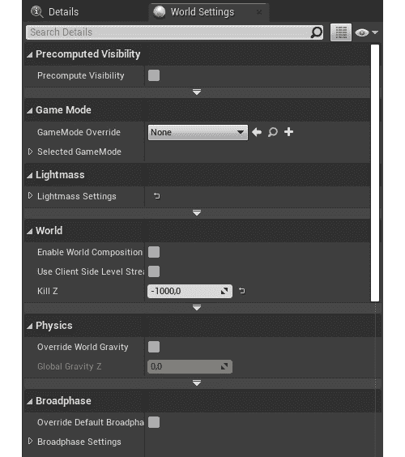

图 1.4：世界设置窗口

1.  `工具栏`：在屏幕顶部，您将看到编辑器`工具栏`，在那里您将能够保存当前级别、访问项目和编辑器设置，并播放您的级别，等等。

注意

我们将只使用这些工具栏中的一些按钮，即`保存当前`、`设置`、`蓝图`、`构建`和`播放`按钮。

1.  `模式`：在屏幕的最左侧，您将看到`模式`窗口。它将允许您将对象拖到您的级别中，例如立方体和球体、光源以及设计用于各种目的的其他类型的对象。

现在我们已经了解了虚幻引擎编辑器的主要窗口，让我们来看看如何管理这些窗口。

# 编辑器窗口

正如我们所见，虚幻引擎编辑器由许多窗口组成，所有这些窗口都是可调整大小、可移动的，并且都有相应的标签在顶部。您可以*点击并按住*窗口的标签并拖动它以将其移动到其他位置。您可以通过*右键单击*它们并选择`隐藏`选项来隐藏标签标签：

图 1.5：如何隐藏标签

如果标签标签已被隐藏，您可以通过单击该窗口左上角的*黄色三角形*使其重新出现，如下图所示：

图 1.6：允许显示窗口标签的黄色三角形

请记住，您可以通过单击编辑器左上角的`窗口`按钮来浏览和打开编辑器中的所有可用窗口，包括刚提到的窗口。

您还应该知道的另一件非常重要的事情是如何在编辑器内播放您的关卡（也称为`工具栏`，您将看到`播放`按钮。如果您点击它，您将开始在编辑器内播放当前打开的关卡。

一旦您点击`播放`，您将能够通过使用*W*、*A*、*S*和*D*键来控制关卡中的玩家角色，使用空格键跳跃，并移动`鼠标`来旋转相机：

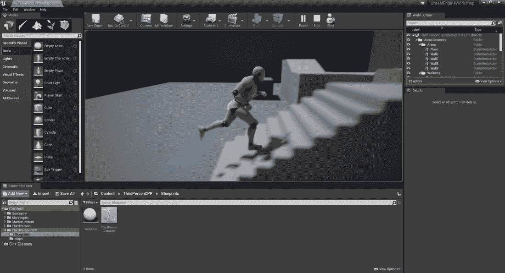

图 1.7：在编辑器内播放的关卡

然后，您可以按*Esc*键（Escape）以停止播放关卡。

现在我们已经习惯了一些编辑器的窗口，让我们更深入地了解`视口`窗口。

# 视口导航

我们在前一节中提到，`视口`窗口将允许您可视化您的级别，并操纵其中的对象。因为这是您要使用的非常重要的窗口，并且具有许多功能，所以我们将在本节中更多地了解它。

在我们开始学习`视口`窗口之前，让我们快速了解一下`视口`窗口，它将始终显示当前选定级别的内容，本例中已经创建并与`第三人称`模板项目一起生成。在此级别中，您将能够看到四个墙体对象，一个地面对象，一组楼梯和一些其他高架对象，以及由 UE4 模特代表的玩家角色。您可以创建多个级别并通过从`内容浏览器`中打开它们来在它们之间切换。

为了操纵和浏览当前选定的级别，您必须使用`视口`窗口。如果您在窗口内按住*左鼠标按钮*，您将能够通过将鼠标*左*和*右*移动来水平旋转相机，并通过将鼠标*向前*和*向后*移动来前后移动相机。您也可以通过按住*右鼠标按钮*来实现类似的结果，除了在将鼠标*向前*和*向后*移动时相机将垂直旋转，这样您就可以水平和垂直旋转相机。

此外，您还可以通过点击并按住`视口`窗口的*右鼠标按钮*（*左鼠标按钮*也可以，但由于在旋转相机时没有太多自由度，因此使用它进行移动不太有用）并使用*W*和*S*键向前和向后移动，*A*和*D*键向侧面移动，*E*和*Q*键向上和向下移动。

如果您查看`视口`窗口的右上角，您将看到一个带有数字的小摄像机图标，它将允许您更改相机在`视口`窗口中移动的速度。

在`Viewport`窗口中可以做的另一件事是更改其可视化设置。您可以通过单击当前显示为`Lit`的按钮来更改`Viewport`窗口中的可视化类型，这将显示所有可用于不同照明和其他类型可视化滤镜的选项。

如果单击`Perspective`按钮，您将有选择在透视视图和正交视图之间切换，后者可能会帮助您更快地构建级别。

现在让我们转到操纵对象的主题，也称为 Actor，在您的级别中。

# 操纵 Actor

在虚幻引擎中，可以放置在级别中的所有对象都称为 Actor。在电影中，演员将是扮演角色的人，但在 UE4 中，您在级别中看到的每个对象，包括墙壁、地板、武器和角色，都是一个 Actor。

每个 Actor 必须有所谓的`Transform`属性，这是三个东西的集合：

+   `Vector`属性表示该 Actor 在*X*、*Y*和*Z*轴上的位置。矢量只是一个包含三个浮点数的元组，每个轴上的点的位置都有一个。

+   `Rotator`属性表示该 Actor 沿*X*、*Y*和*Z*轴的旋转。旋转器也是一个包含三个浮点数的元组，每个轴上的旋转角度都有一个。

+   `Vector`属性表示该 Actor 在级别中的比例（大小）在*X*、*Y*和*Z*轴上。这也是三个浮点数的集合，每个轴上都有一个比例值。

Actor 可以在级别中移动、旋转和缩放，这将相应地修改它们的`Transform`属性。为了做到这一点，通过*左键单击*选择级别中的任何对象。您应该看到**Move**工具出现：

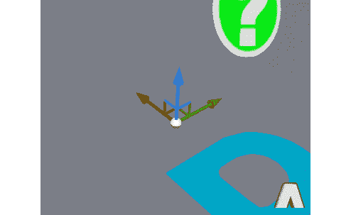

图 1.8：移动工具，允许您在级别中移动 Actor

移动工具是一个三轴标尺，允许您同时在任何轴上移动对象。移动工具的红色箭头（在前面的图像中指向左侧）表示*X*轴，绿色箭头（在前面的图像中指向右侧）表示*Y*轴，蓝色箭头（在前面的图像中向上指）表示*Z*轴。如果您*单击并按住*这些箭头中的任何一个，然后将它们拖动到级别中，您将在级别中沿该轴移动您的 Actor。如果单击连接两个箭头的手柄，您将同时沿着这两个轴移动 Actor，如果单击所有箭头交汇处的白色球体，您将自由移动 Actor 沿着所有三个轴：

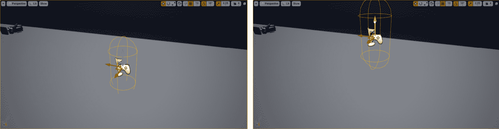

图 1.9：使用移动工具在 Z 轴上移动的 Actor

移动工具将允许您在级别中移动 Actor，但如果您想旋转或缩放 Actor，您需要分别使用旋转和缩放工具。您可以通过按*W*、*E*和*R*键在移动、旋转和缩放工具之间切换。按*E*以切换到旋转工具：

图 1.10：旋转工具，允许您旋转 Actor

旋转工具将如预期般允许您在级别中旋转 Actor。您可以*单击并按住*任何弧线以围绕其关联轴旋转 Actor。红色弧线（前图中左上方）将围绕*X*轴旋转 Actor，绿色弧线（前图中右上方）将围绕*Y*轴旋转 Actor，蓝色弧线（前图中下方中心）将围绕*Z*轴旋转 Actor：

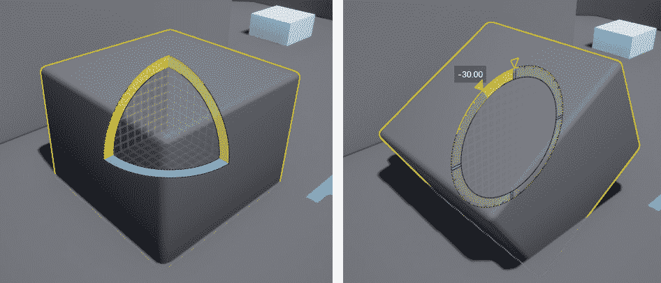

图 1.11：在 X 轴周围旋转 30 度之前和之后的立方体

请记住，物体围绕*X*轴的旋转通常被指定为**横滚**，它围绕*Y*轴的旋转通常被指定为**俯仰**，它围绕*Z*轴的旋转通常被指定为**偏航**。

最后，我们有比例工具。按*R*以切换到它：

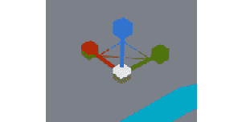

图 1.12：比例工具

比例工具将允许您增加和减少角色在*X*、*Y*和*Z*轴上的比例（大小），红色手柄（上图左侧）将在*X*轴上缩放角色，绿色手柄（上图右侧）将在*Y*轴上缩放角色，蓝色手柄（上图上方）将在*Z*轴上缩放角色：

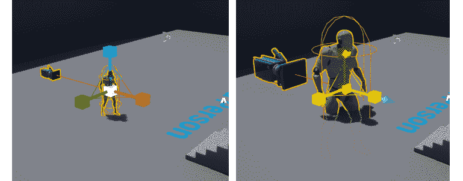

图 1.13：在所有三个轴上缩放前后的角色角色

您还可以通过单击“视口”窗口顶部的以下图标在移动、旋转和缩放工具之间切换：

图 1.14：移动、旋转和缩放工具图标

此外，您可以通过在移动、旋转和缩放工具图标右侧的网格捕捉选项更改移动、旋转和缩放对象的增量。通过按下当前为橙色的按钮，您将能够完全禁用捕捉，通过按下显示当前捕捉增量的按钮，您将能够更改这些增量：

图 1.15：用于移动、旋转和缩放的网格捕捉图标

现在您已经知道如何操作您级别中已经存在的角色，让我们在下一个练习中学习如何向我们的级别添加和删除角色。

## 练习 1.02：添加和删除角色

在这个练习中，我们将向我们的级别添加和删除角色。

在向您的级别添加角色时，有两种主要方法可以这样做：通过从`内容浏览器`拖动资产，或者通过从`模式`窗口的放置模式中拖动默认资产。

以下步骤将帮助您完成此练习：

1.  如果您进入`ThirdPersonCPP -> Blueprints`目录，您将在`内容浏览器`中看到`ThirdPersonCharacter`角色。如果您使用*左键*将该资产拖到您的级别中，您将能够向其中添加该角色的一个实例，并且它将放置在您放开*左键*的地方：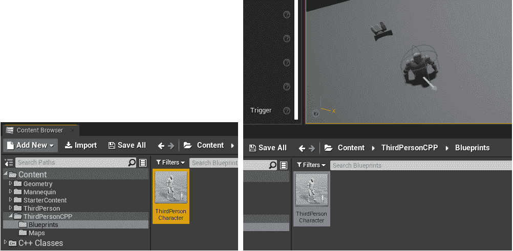

图 1.16：将 ThirdPersonCharacter 角色的一个实例拖到我们的级别中

1.  您也可以从`模式`窗口将一个角色拖到您的级别中：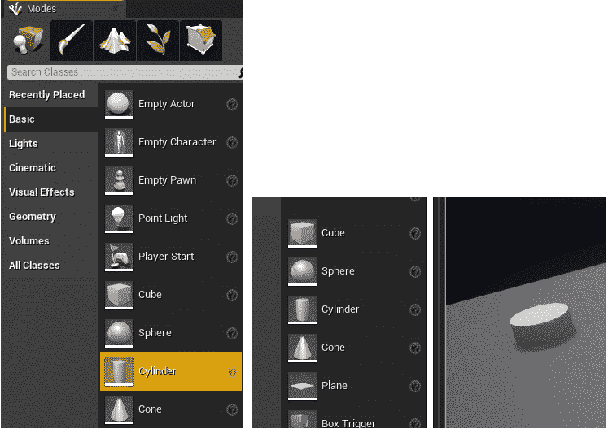

图 1.17：将圆柱体角色拖到我们的级别中

1.  要删除一个角色，您可以简单地选择该角色并按下*删除*键。您还可以*右键单击*一个角色，查看有关该角色的许多其他可用选项。

注意

尽管我们不会在本书中涵盖这个主题，但开发人员可以用简单的框和几何图形填充他们的级别，用于原型制作的一种方式是 BSP 刷。这些可以在构建级别时快速塑造成您想要的形状。要了解有关 BSP 刷的更多信息，请访问此页面：[`docs.unrealengine.com/en-US/Engine/Actors/Brushes`](https://docs.unrealengine.com/en-US/Engine/Actors/Brushes)。

通过这样，我们结束了这个练习，并学会了如何向我们的级别添加和删除角色。

现在我们知道如何浏览`视口`窗口，让我们了解蓝图角色。

# 蓝图角色

在 UE4 中，“蓝图”一词可用于指代两种不同的东西：UE4 的可视化脚本语言或特定类型的资产，也称为蓝图类或蓝图资产。

正如我们之前提到的，角色是可以放置在关卡中的对象。这个对象可以是 C++类的实例，也可以是蓝图类的实例，两者都必须从角色类（直接或间接地）继承。那么，C++类和蓝图类之间有什么区别呢？有一些：

+   如果您向 C++类添加编程逻辑，您将可以访问比创建蓝图类时更高级的引擎功能。

+   在蓝图类中，您可以轻松查看和编辑该类的可视组件，例如 3D 网格或触发框碰撞，以及修改在 C++类中定义的属性，这些属性暴露给编辑器，使得管理这些属性更加容易。

+   在蓝图类中，您可以轻松引用项目中的其他资产，而在 C++中，您也可以这样做，但不那么简单，也不那么灵活。

+   在蓝图可视化脚本上运行的编程逻辑在性能方面比 C++类慢。

+   在 C++类中，可以简单地让多个人同时工作而不会在源版本平台上发生冲突，而在蓝图类中，这将导致冲突，因为它被解释为二进制文件而不是文本文件，如果两个不同的人编辑相同的蓝图类，这将导致源版本平台上的冲突。

注意

如果您不知道什么是源版本平台，这是几个开发人员可以在同一项目上工作并且可以更新其他开发人员完成的工作的方式。在这些平台上，通常可以同时编辑同一文件的不同部分，只要它们编辑的是文件的不同部分，并且仍然可以接收其他程序员完成的更新，而不会影响您对同一文件的工作。最流行的源版本平台之一是 GitHub。

请记住，蓝图类可以继承自 C++类或另一个蓝图类。

最后，在我们继续创建我们的第一个蓝图类之前，您应该知道的另一件重要的事情是，您可以在 C++类中编写编程逻辑，然后创建一个从该类继承的蓝图类，但如果您在 C++类中指定了这一点，它也可以访问其属性和方法。您可以让蓝图类编辑在 C++类中定义的属性，以及调用和覆盖函数，使用蓝图脚本语言。我们将在本书中做一些这样的事情。

现在您对蓝图类有了一些了解，让我们在下一个练习中创建自己的蓝图类。

## 练习 1.03：创建蓝图角色

在这个简短的练习中，我们将学习如何创建一个新的蓝图角色。

以下步骤将帮助您完成此练习：

1.  进入`ThirdPersonCPP -> Blueprints`目录，位于“内容浏览器”内，并在其中*右键单击*。 应该弹出以下窗口：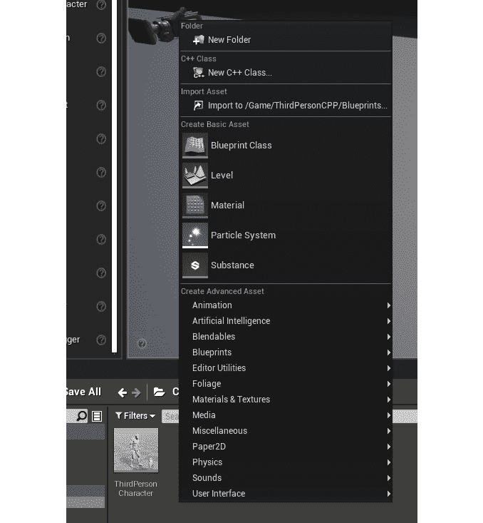

图 1.18：在内容浏览器内右键单击时出现的选项窗口

此选项菜单包含您可以在 UE4 中创建的资产类型（蓝图只是一种资产类型，以及其他类型的资产，如“关卡”、“材质”和“声音”）。

1.  单击“蓝图类”图标以创建一个新的蓝图类。这样做时，您将有选择要继承的 C++或蓝图类的选项：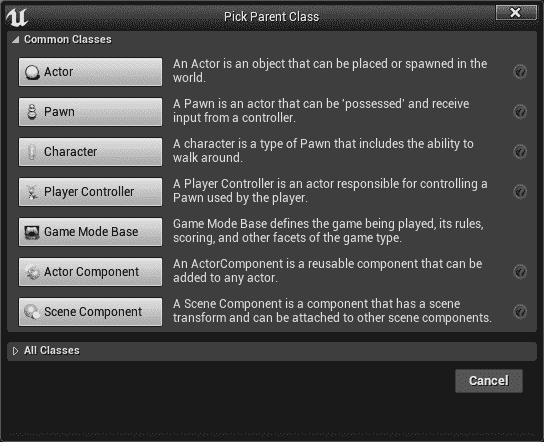

图 1.19：创建新蓝图类时弹出的选择父类窗口

1.  从这个窗口中选择第一个类，`Actor`类。之后，你将自动选择新蓝图类的文本，以便轻松地为它命名。将这个蓝图类命名为`TestActor`，然后按`Enter`键接受这个名字。

按照这些步骤，你将创建你的蓝图类，完成这个练习。创建完这个资源后，用左键双击它以打开蓝图编辑器。

# 蓝图编辑器

蓝图编辑器是虚幻引擎编辑器中专门用于蓝图类的子编辑器。在这里，你可以编辑你的蓝图类的属性和逻辑，或者它们的父类，以及它们的视觉外观。

打开一个 Actor Blueprint 类时，你应该会看到蓝图编辑器。这是一个窗口，允许你在 UE4 中编辑蓝图类。让我们了解一下你当前看到的窗口：

![图 1.20：蓝图编辑器窗口分为五个部分（img/B16183_01_20.jpg）图 1.20：蓝图编辑器窗口分为五个部分 1.  `视口`：在编辑器的正中央，你有`视口`窗口。这个窗口，类似于我们已经了解的`级别视口`窗口，将允许你可视化你的角色并编辑它的组件。每个角色可以有多个角色组件，其中一些有视觉表示，比如网格组件和碰撞组件。我们将在后面的章节更深入地讨论角色组件。从技术上讲，这个中心窗口包含三个选项卡，其中只有一个是`视口`窗口，但我们将在讨论这个编辑器的界面后谈论另一个重要的选项卡，即`事件图`。第三个选项卡是`构造脚本`窗口，我们在本书中不会涉及。1.  `组件`：在编辑器的左上方，你有`组件`窗口。如前面所述，角色可以有多个角色组件，这个窗口将允许你在你的蓝图类中添加和移除这些角色组件，并访问它继承的 C++类中定义的角色组件。1.  `我的蓝图`：在编辑器的左下方，你有`我的蓝图`窗口。这将允许你浏览、添加和移除在这个蓝图类和它继承的 C++类中定义的变量和函数。请记住，蓝图有一种特殊类型的函数，称为`BeginPlay`、`ActorBeginOverlap`和`Tick`。我们将在几段落后讨论这些。1.  `详情`：在编辑器的右侧，你有`详情`窗口。类似于编辑器的`详情`窗口，这个窗口将显示当前选定的角色组件、函数、变量、事件或者这个蓝图类的任何其他单独元素的属性。如果你当前没有选定任何元素，这个窗口将是空的。1.  `工具栏`：在编辑器的正上方，你有`工具栏`窗口。这个窗口将允许你编译你在这个蓝图类中编写的代码，保存它，定位它在`内容浏览器`中，并访问这个类的设置，以及其他事项。你可以通过查看蓝图编辑器右上角的父类来看到蓝图类的父类。如果你点击父类的名称，你将通过虚幻引擎编辑器或者 Visual Studio 被带到相应的蓝图类或 C++类。此外，你可以通过点击蓝图编辑器左上角的`文件`选项卡，并选择`重新指定蓝图`选项来更改蓝图类的父类，这将允许你指定这个蓝图类的新父类。现在我们已经了解了蓝图编辑器的基础知识，让我们来看看它的事件图。# 事件图`事件图`窗口是你将编写所有蓝图可视化脚本代码、创建变量和函数以及访问在该类的父类中声明的其他变量和函数的地方。如果你选择`事件图`选项卡，你应该能够在`视口`选项卡的右侧看到，你将会看到`事件图`窗口而不是`视口`窗口。点击`事件图`选项卡后，你将看到以下窗口：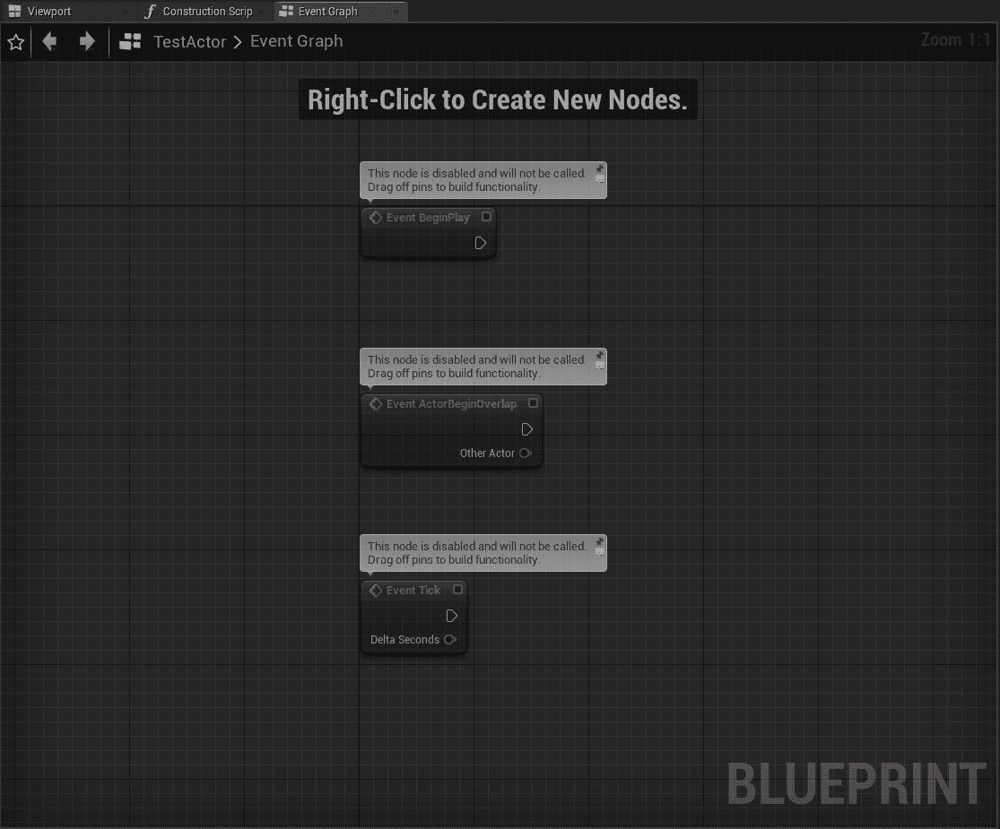

图 1.21：事件图窗口，显示三个禁用的事件

你可以通过按住*鼠标右键*在`事件图`中拖动来导航，通过滚动*鼠标滚轮*来放大和缩小，通过单击*鼠标左键*或按住并选择节点区域来选择图中的节点。

你也可以在`事件图`窗口内*右键单击*来访问蓝图的操作菜单，该菜单允许你访问在`事件图`中可以执行的操作，包括获取和设置变量，调用函数或事件，以及其他许多操作。

蓝图中脚本的工作方式是通过连接节点使用针。有几种类型的节点，如变量、函数和事件。你可以通过针连接这些节点，其中有两种类型的针：

1.  **执行针**: 这些将决定节点执行的顺序。如果你想要执行节点 1 然后执行节点 2，你需要将节点 1 的输出执行针连接到节点 2 的输入执行针，如下面的截图所示：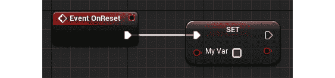

图 1.22：连接事件 OnReset 节点的输出执行针到 MyVar 的 setter 节点的输入执行针

1.  **变量针**：这些作为参数（也称为输入针），在节点的左侧，并返回值（也称为输出针），在节点的右侧，表示特定类型的值（整数、浮点数、布尔值等）：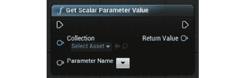

图 1.23：调用 Get Scalar Parameter Value 函数的节点，它有两个输入变量针和一个输出变量针

让我们通过下一个练习更好地理解这个。

## 练习 1.04：创建蓝图变量

在这个练习中，我们将看到如何通过创建一个`Boolean`类型的新变量来创建蓝图变量。

在蓝图中，变量的工作方式类似于你在 C++中使用的变量。你可以创建它们，获取它们的值，并设置它们。

以下步骤将帮助你完成这个练习：

1.  要创建一个新的蓝图变量，前往`我的蓝图`窗口并点击`+ 变量`按钮：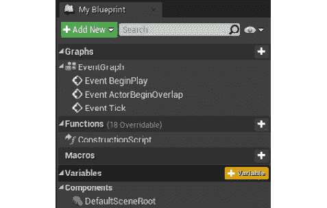

图 1.24：在我的蓝图窗口中突出显示的+ 变量按钮，允许你创建一个新的蓝图变量

1.  之后，你将自动被允许命名你的新变量。将这个新变量命名为`MyVar`：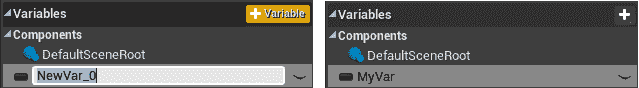

图 1.25：命名新变量 MyVar

1.  通过点击`工具栏`窗口左侧的`编译`按钮来编译你的蓝图。如果你现在查看`详细信息`窗口，你应该会看到以下内容：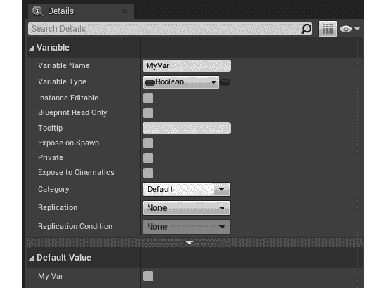

图 1.26：详细信息窗口中的 MyVar 变量设置

1.  在这里，您将能够编辑与此变量相关的所有设置，最重要的设置是`变量名称`，`变量类型`和设置末尾的`默认值`。布尔变量的值可以通过单击其右侧的灰色框来更改：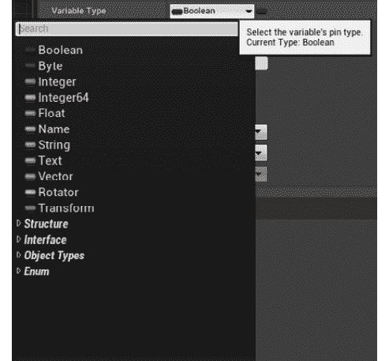

图 1.27：从变量类型下拉菜单中可用的变量类型

1.  您还可以将变量的 getter 或 setter 拖到`My Blueprint`选项卡中，然后放入`事件图`窗口中：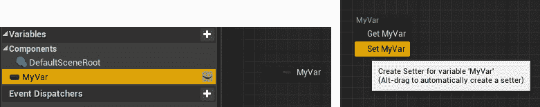

图 1.28：将 MyVar 拖入事件图窗口并选择是否添加 getter 或 setter

Getter 是包含变量当前值的节点，而 setter 是允许您更改变量值的节点。

1.  要允许变量在此蓝图类的每个实例中可编辑，您可以单击`My Blueprint`窗口中该变量右侧的眼睛图标：

图 1.29：单击眼睛图标以显示变量并允许其可实例编辑

1.  然后，您可以将此类的实例拖到您的级别中，选择该实例，并在编辑器的`详细`窗口中看到更改该变量值的选项：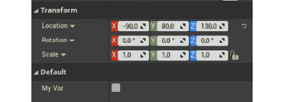

图 1.30：可以通过该对象的详细面板编辑的 MyVar 变量

有了这个，我们完成了这个练习，现在知道如何创建我们自己的蓝图变量。现在让我们看看如何在下一个练习中创建蓝图函数。

## 练习 1.05：创建蓝图函数

在这个练习中，我们将创建我们的第一个蓝图函数。在蓝图中，函数和事件是相对类似的，唯一的区别是事件只会有一个输出引脚，通常是因为它是从蓝图类的外部调用的：

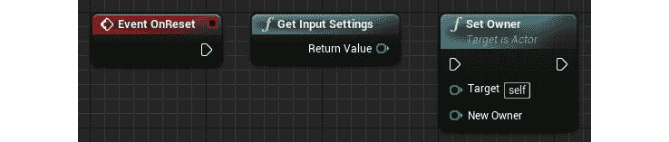

图 1.31：事件（左），不需要执行引脚的纯函数调用（中），和正常函数调用（右）

以下步骤将帮助您完成此练习：

1.  单击`My Blueprint`窗口内的`+函数`按钮：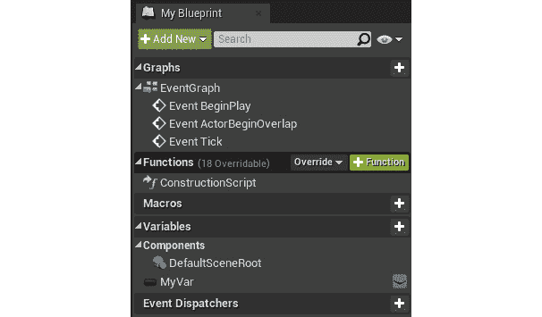

图 1.32：悬停在+函数按钮上，这将创建一个新函数

1.  将新函数命名为`MyFunc`。

1.  通过单击`工具栏`窗口中的`编译`按钮来编译您的蓝图：

图 1.33：编译按钮

1.  如果您现在查看`详细`窗口，您应该会看到以下内容：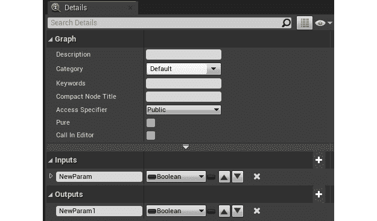

图 1.34：选择 MyFunc 函数并添加输入和输出引脚后的详细面板

在这里，您将能够编辑与此函数相关的所有设置，最重要的设置是`输入`和`输出`在设置末尾。这将允许您指定此函数必须接收和返回的变量。

最后，您可以通过*从`My Blueprint`窗口单击*来编辑此函数的功能。这将在中心窗口中打开一个新选项卡，允许您指定此函数将执行的操作。在这种情况下，此函数每次被调用时将简单地返回`false`：

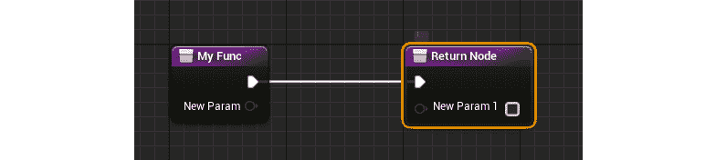

图 1.35：MyFunc 函数的内容，接收一个布尔参数，并返回一个布尔类型

1.  要保存对此蓝图类所做的修改，请单击工具栏上`Compile`按钮旁边的`Save`按钮。或者，您可以选择使蓝图在成功编译时自动保存。

按照这些步骤，您现在知道如何创建自己的蓝图函数。现在让我们来看一下本章后面将要使用的蓝图节点。

# 浮点数乘法节点

蓝图包含许多与变量或函数无关的节点。其中一个例子是算术节点（即加法、减法、乘法等）。如果在蓝图操作菜单中搜索`float * float`，您将找到*浮点数乘法*节点。

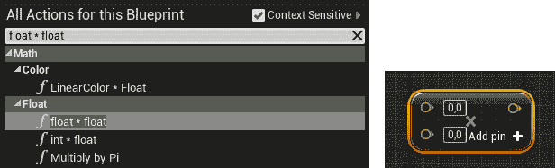

图 1.36：浮点数乘法节点

此节点允许您输入两个或多个浮点参数（您可以通过单击`Add pin`文本右侧的`+`图标添加更多参数），并输出所有参数的乘积结果。我们将在本章的后面使用此节点。

# BeginPlay 和 Tick

现在让我们来看一下 UE4 中两个最重要的事件：`BeginPlay`和`Tick`。

如前所述，事件通常会从蓝图类外部调用。在`BeginPlay`事件的情况下，当蓝图类的实例被放置在关卡中并且关卡开始播放时，或者在游戏进行中动态生成蓝图类的实例时，将调用此事件。您可以将`BeginPlay`事件视为在蓝图类的实例上调用的第一个事件，您可以用它进行初始化。

在 UE4 中了解的另一个重要事件是`Tick`事件。如您所知，游戏以一定的帧率运行，最常见的是 30 FPS（每秒帧数）或 60 FPS：这意味着游戏将每秒渲染 30 次或 60 次更新的游戏图像。`Tick`事件将在游戏执行此操作时被调用，这意味着如果游戏以 30 FPS 运行，则`Tick`事件将每秒被调用 30 次。

转到蓝图类的`事件图`窗口，并通过选择它们所有并单击`Delete`键来删除三个灰色事件，这将导致`事件图`窗口变为空白。之后，在`事件图`窗口内部*右键单击*，输入`BeginPlay`，并选择`Event BeginPlay`节点，然后单击`Enter`键或在蓝图操作菜单中选择该选项。这将导致该事件被添加到`事件图`窗口中：

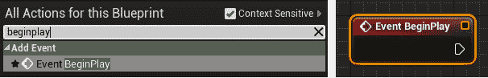

图 1.37：通过蓝图操作菜单将 BeginPlay 事件添加到事件图窗口中

*右键单击*事件图窗口内部，输入`Tick`，并选择`Event Tick`节点。这将导致该事件被添加到事件图窗口中：

图 1.38：Tick 事件

与`BeginPlay`事件不同，`Tick`事件将带有一个参数`DeltaTime`。此参数是一个浮点数，表示自上一帧渲染以来经过的时间。如果您的游戏以 30 FPS 运行，则每个帧之间的间隔（增量时间）平均为 1/30 秒，约为 0.033 秒（33.33 毫秒）。如果渲染帧 1，然后 0.2 秒后渲染帧 2，则帧 2 的增量时间将为 0.2 秒。如果帧 3 在帧 2 之后 0.1 秒渲染，则帧 3 的增量时间将为 0.1 秒，依此类推。

但是为什么`DeltaTime`参数如此重要？让我们看看以下情景：您有一个蓝图类，它使用`Tick`事件在每次渲染帧时在 Z 轴上增加 1 个单位的位置。然而，您面临一个问题：玩家可能以不同的帧率运行游戏，比如 30 FPS 和 60 FPS。以 60 FPS 运行游戏的玩家将导致`Tick`事件被调用的次数是以 30 FPS 运行游戏的玩家的两倍，并且蓝图类将因此移动速度加快两倍。这就是增量时间的作用所在：因为以 60 FPS 运行游戏的`Tick`事件被调用的增量时间值较低（渲染帧之间的间隔更小），您可以使用该值来改变 Z 轴上的位置。尽管以 60 FPS 运行游戏的`Tick`事件被调用的次数是 30 FPS 运行游戏的两倍，但其增量时间是一半，因此一切都平衡了。这将导致以不同帧率玩游戏的两个玩家获得相同的结果。

注意

如果您希望一个使用增量时间移动的蓝图移动得更快或更慢，可以将增量时间乘以您希望它每秒移动的单位数（例如，如果您希望一个蓝图在 Z 轴上每秒移动 3 个单位，您可以告诉它每帧移动`3 * DeltaTime`个单位）。

现在让我们尝试另一个练习，这将涉及使用蓝图节点和引脚。

## 练习 1.06：在 Z 轴上偏移 TestActor 类

在这个练习中，您将使用`BeginPlay`事件在游戏开始播放时偏移（移动）`TestActor`在 Z 轴上的位置。

以下步骤将帮助您完成此练习：

1.  打开`TestActor`蓝图类。

1.  使用“蓝图操作”菜单，将“事件 BeginPlay”节点添加到图表中，如果尚未添加。

1.  添加`AddActorWorldOffset`函数，并将`BeginPlay`事件的输出执行引脚连接到此函数的输入执行引脚。此函数负责在预期轴（*X*、*Y*和*Z*）上移动 Actor，并接收以下参数：

+   `Target`：应调用此函数的 Actor，这将是调用此函数的 Actor。默认行为是在调用此函数的 Actor 上调用此函数，这正是我们想要的，并且使用`self`属性显示。

+   `DeltaLocation`：我们希望在三个轴上偏移此 Actor 的量：X、Y 和 Z。

+   我们不会涉及另外两个参数`Sweep`和`Teleport`，所以您可以将它们保持不变。它们都是布尔类型，应该保持为`false`：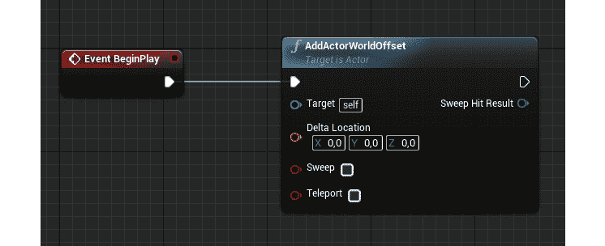

图 1.39：BeginPlay 事件调用 AddActorWorldOffset 函数

1.  拆分`Delta Location`输入引脚，这将导致将此`Vector`属性拆分为三个浮点属性。您可以通过*右键单击*它们并选择“拆分结构引脚”来对由一个或多个子类型组成的任何变量类型执行此操作（您无法对浮点类型执行此操作，因为它不包含任何变量子类型）：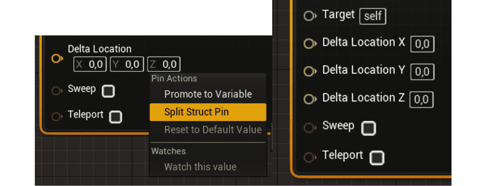

图 1.40：将 Delta 位置参数从矢量拆分为三个浮点数

1.  通过单击*鼠标左键*，输入该数字，然后按*Enter*键，将`Delta Location`的`Z`属性设置为 100 个单位。这将导致我们的`TestActor`在游戏开始时在 Z 轴上向上移动 100 个单位。

1.  使用“组件”窗口向您的`TestActor`添加一个立方体形状，以便我们可以看到我们的角色。您可以通过单击“+添加组件”按钮，输入`Cube`，然后选择“基本形状”部分下的第一个选项来执行此操作：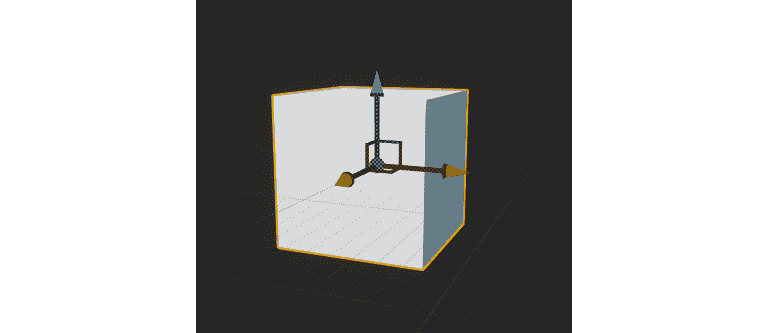

图 1.41：添加一个立方体形状

1.  通过单击“编译”按钮来编译和保存您的蓝图类。

1.  回到级别的“视口”窗口，并在级别中放置一个您的`TestActor`蓝图类的实例，如果您还没有这样做的话：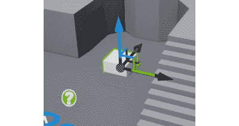

图 1.42：将 TestActor 的实例添加到级别

1.  当您播放级别时，您应该注意到我们添加到级别中的`TestActor`处于更高的位置：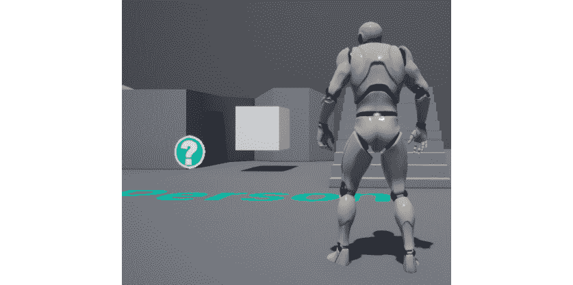

图 1.43：游戏开始时 TestActor 在 Z 轴上增加其位置

1.  在进行这些修改后，通过按下*Ctrl + S*或单击编辑器“工具栏”上的“保存当前”按钮来保存我们对级别所做的更改。

在这个练习中，您已经学会了如何创建您自己的蓝图脚本逻辑的第一个角色蓝图类。

注意

`TestActor`蓝图资产和此练习的最终结果的“地图”资产都可以在这里找到：[`packt.live/3lfYOa9`](https://packt.live/3lfYOa9)。

现在我们已经做到了这一点，让我们更多地了解`ThirdPersonCharacter`蓝图类。

# 第三人称角色蓝图类

让我们来看看`ThirdPersonCharacter`蓝图类，这是代表玩家控制的角色的蓝图，并看看它包含的角色组件。

转到“内容浏览器”中的“ThirdPersonCPP->蓝图”目录，并打开`ThirdPersonCharacter`资产：

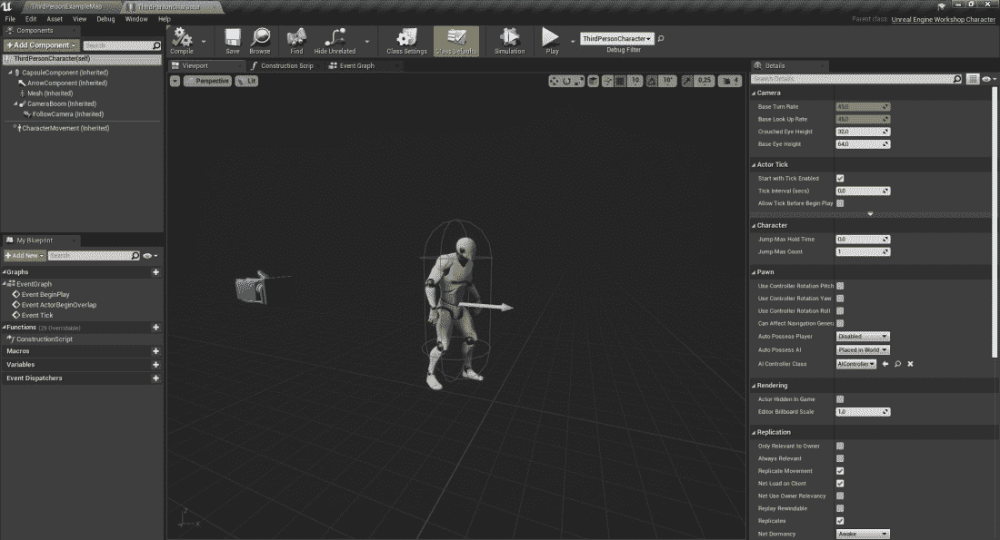

图 1.44：ThirdPersonCharacter 蓝图类

在之前的部分中，我们介绍了蓝图编辑器中的“组件”窗口，我们提到了**角色组件**。

角色组件是必须存在于角色内部的实体，并允许您将角色的逻辑分散到几个不同的角色组件中。在这个蓝图中，我们可以看到有四个可视表示的角色组件：

+   显示 UE4 模特的骨骼网格组件

+   一个摄像头组件，显示玩家将能够从哪里看到游戏

+   一个箭头组件，允许我们看到角色面对的方向（这主要用于开发目的，而不是在游戏进行时）

+   指定此角色的碰撞范围的胶囊组件

如果您查看“组件”窗口，您会看到一些比我们在“视口”窗口中看到的更多的角色组件。这是因为一些角色组件没有视觉表示，纯粹由 C++或蓝图代码组成。我们将在下一章和第九章“音频-视觉元素”中更深入地了解角色组件。

如果你看一下这个蓝图类的“事件图”窗口，你会发现它基本上是空的，就像我们在`TestActor`蓝图类中看到的那样，尽管它有一些与之相关的逻辑。这是因为该逻辑是在 C++类中定义的，而不是在这个蓝图类中。我们将在下一章中看看如何做到这一点。

为了解释这个蓝图类的骨骼网格组件，我们应该先讨论网格和材料。

# 网格和材料

要使计算机可视化表示 3D 对象，需要两样东西：3D 网格和材料。

## 网格

3D 网格允许您指定对象的大小和形状，就像这个代表猴子头部的网格：

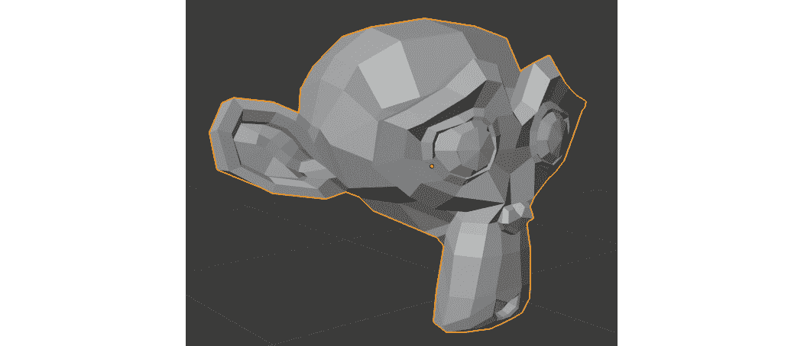

图 1.45：猴子头部的 3D 网格

网格由多个顶点、边和面组成。顶点只是具有*X*、*Y*和*Z*位置的 3D 坐标；边是两个顶点之间的连接（即一条线）；面是三个或更多边的连接。您可以在前面的图中看到网格的各个顶点、边和面，其中每个面的颜色在白色和黑色之间变化，取决于面上反射的光线量。如今，视频游戏可以以这样的方式渲染网格，其中有成千上万的顶点，以至于您无法分辨出单个顶点，因为它们太靠在一起了。

## 材质

另一方面，材质允许您指定网格的表示方式。它们允许您指定网格的颜色，在其表面绘制纹理，甚至操纵其各个顶点。

创建网格是一件事，在撰写本书时，UE4 尚未得到适当支持，应在另一款软件（例如 Blender 或 Autodesk Maya）中完成，因此我们不会在这里详细介绍这一点。但是，我们将学习如何为现有网格创建材质。

在 UE4 中，您可以通过网格组件添加网格，这些网格继承自 Actor 组件类。有几种类型的网格组件，但最重要的两种是静态网格组件，用于没有动画的网格（例如，立方体，静态级别几何体），以及骨骼网格组件，用于具有动画的网格（例如，播放移动动画的角色网格）。正如我们之前所看到的，`ThirdPersonCharacter`蓝图类包含骨骼网格组件，因为它用于表示播放移动动画的角色网格。在下一章中，我们将学习如何将资产（例如网格）导入到我们的 UE4 项目中。

现在让我们在下一个练习中看一下 UE4 中的材质。

# 在 UE4 中操作材质

在本节中，我们将看一看材质在 UE4 中的工作原理。

返回到您的“级别视口”窗口，并选择此“立方体”对象：

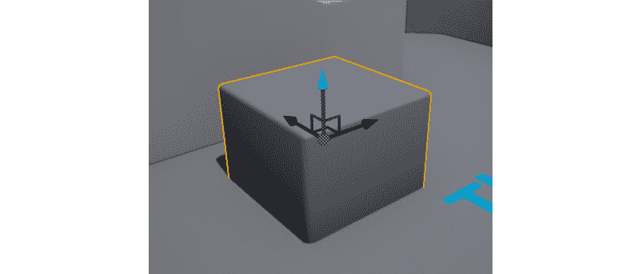

图 1.46：立方体对象，旁边的文字写着地板上的第三人称

查看“详细信息”窗口，您将能够看到与此对象的“静态网格”组件关联的网格和材质：

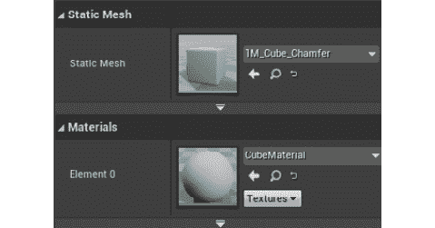

图 1.47：立方体对象的静态网格组件的材质（元素 0）属性

注意

请记住，网格可以有多个材质，但必须至少有一个。

单击“材质”属性旁边的*放大镜*图标，以转到“内容浏览器”中该材质的位置。该图标适用于编辑器中对任何资产的任何引用，因此您也可以对立方体对象的“静态网格”引用执行相同操作：

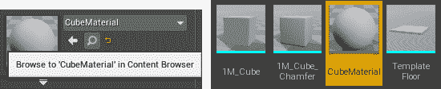

图 1.48：放大镜图标（左），可带您到该资产在内容浏览器中的位置（右）

*双击*使用鼠标左键打开“材质”编辑器中的资产。让我们来分解“材质编辑器”中的窗口：

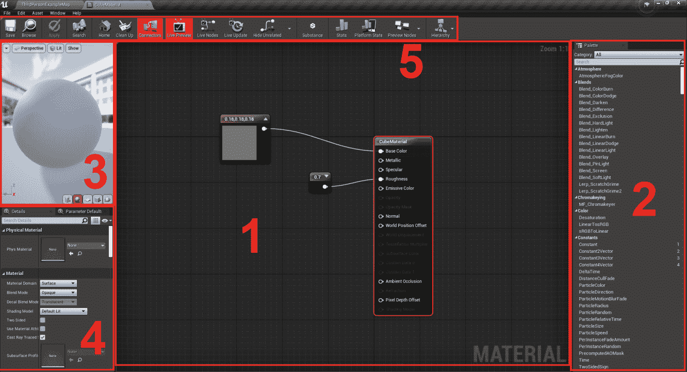

图 1.49：将材质编辑器窗口分解为五个部分

1.  `图表`：在编辑器的正中央，您将看到`图表`窗口。类似于蓝图编辑器的`事件图表`窗口，材质编辑器的图表也是基于节点的，您将在此找到通过引脚连接的节点，尽管这里不会找到执行引脚，只有输入和输出引脚。

1.  `Palette`：在屏幕的右边缘，你会看到`Palette`窗口，你可以在这里搜索所有可以添加到`Graph`窗口的节点。你也可以像在蓝图编辑器的`事件图`窗口中一样，通过在`Graph`窗口内*右键单击*并输入你想要添加的节点来实现。

1.  `Viewport`：在屏幕的左上角，你会看到`Viewport`窗口。在这里，你可以预览你的材质的结果，以及它在一些基本形状上的外观，比如球体、立方体和平面。

1.  `Details`：在屏幕的左下角，你会看到`Details`窗口，类似于蓝图编辑器，你可以查看`材质`资产的细节，或者查看`Graph`窗口中当前选定节点的细节。

1.  `Toolbar`：在屏幕的顶部边缘，你会看到`Toolbar`窗口，你可以在这里应用和保存对材质的更改，以及执行与`Graph`窗口相关的几个操作。

在 UE4 的每个材质编辑器中，你都会找到一个名为`Material`的节点，通过将该节点的引脚连接到其他节点，你可以指定与之相关的几个参数。

在这种情况下，你可以看到有一个名为`0.7`的节点被插入到`Roughness`引脚中。这个节点是一个`Constant`节点，允许你指定与之关联的数字 - 在这种情况下是`0.7`。你可以创建单个数字、2 个向量（例如，`(1, 0.5)`）、3 个向量（例如，`(1, 0.5, 4)`）和 4 个向量（例如，`(1,0.5, 4, 0)`）的常数节点。要创建这些节点，你可以按住`1`、`2`、`3`或`4`数字键，同时在`Graph`窗口上按下*鼠标左键*。

材质有几个输入参数，让我们来看一些最重要的参数：

+   `BaseColor`：这个参数就是材质的颜色。通常，常数或纹理样本被用来连接到这个引脚，要么让一个物体成为特定颜色，要么映射到特定纹理。

+   `Metallic`：这个参数将决定你的物体看起来有多像金属表面。你可以通过连接一个范围从 0（非金属）到 1（非常金属）的常数单个数字节点来实现这一点。

+   `Specular`：这个参数将决定你的物体将反射多少光。你可以通过连接一个范围从 0（不反射任何光）到 1（反射所有光）的常数单个数字节点来实现这一点。如果你的物体已经非常金属，你将看不到任何或很少的差异。

+   `Roughness`：这个参数将决定你的物体反射的光有多少会被散射（光散射得越多，这个物体反射周围的东西就越不清晰）。你可以通过连接一个范围从 0（物体基本上变成镜子）到 1（这个物体上的反射是模糊不清）的常数单个数字节点来实现这一点。

注意

要了解更多关于上述`材质`输入的信息，请访问[`docs.unrealengine.com/en-US/Engine/Rendering/Materials/MaterialInputs`](https://docs.unrealengine.com/en-US/Engine/Rendering/Materials/MaterialInputs)。

UE4 还允许你导入图像（`.jpeg`、`.png`）作为`纹理`资产，然后可以在材质中使用`纹理样本`节点引用：

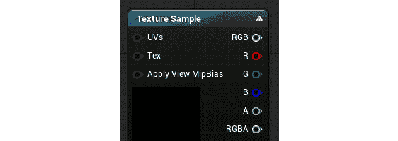

图 1.50：纹理样本节点，允许你指定一个纹理并将其用作引脚的颜色通道

注意

我们将在下一章中看一下如何将文件导入到 UE4 中。

要创建一个新的`材质`资产，你可以在`Content Browser`内*右键单击*要创建新资产的目录，这将允许你选择要创建的资产，然后选择`Material`。

现在您知道如何在 UE4 中创建和操作材质了。

现在让我们开始本章的活动，这将是本书的第一个活动。

## 活动 1.01：在 Z 轴上无限推进 TestActor

在这个活动中，您将使用`TestActor`的`Tick`事件来使其在*Z*轴上无限移动，而不仅仅在游戏开始时执行一次。

以下步骤将帮助您完成此活动：

1.  打开`TestActor`蓝图类。

1.  将`事件 Tick`节点添加到蓝图的`事件图`窗口中。

1.  添加`AddActorWorldOffset`函数，拆分其`DeltaLocation`引脚，并将`Tick`事件的输出执行引脚连接到此函数的输入执行引脚，类似于我们在*练习 1.01*，*创建虚幻引擎 4 项目*中所做的。

1.  在`事件图`窗口中添加一个*Float Multiplication*节点。

1.  将`Tick`事件的`Delta Seconds`输出引脚连接到*Float Multiplication*节点的第一个输入引脚。

1.  创建一个`float`类型的新变量，称为`VerticalSpeed`，并将其默认值设置为`25`。

1.  在`事件图`窗口中为`VerticalSpeed`变量添加一个 getter，并将其引脚连接到*Float Multiplication*节点的第二个输入引脚。之后，将*Float Multiplication*节点的输出引脚连接到`AddActorWorldOffset`函数的`Delta Location Z`引脚。

1.  删除我们在*练习 1.01*，*创建虚幻引擎 4 项目*中创建的`BeginPlay`事件和连接到它的`AddActorWorldOffset`函数。

1.  播放关卡，注意我们的`TestActor`随着时间从地面上升到空中：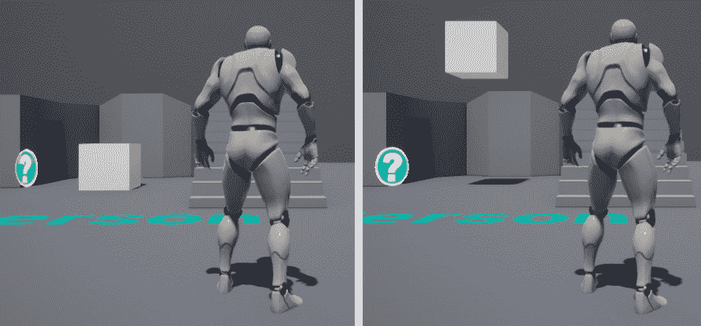

图 1.51：TestActor 在垂直方向上推进

完成这些步骤后，我们结束了这个活动——本书中的第一个活动。我们现在已经巩固了向蓝图编辑器的`事件图`窗口添加和删除节点，以及使用`Tick`事件及其`DeltaSeconds`属性来创建跨不同帧率保持一致性的游戏逻辑。

注意

此活动的解决方案可以在此处找到：[`packt.live/338jEBx`](https://packt.live/338jEBx)。

`TestActor`蓝图资产可以在这里找到：[`packt.live/2U8pAVZ`](https://packt.live/2U8pAVZ)。

# 总结

通过完成本章，您已经迈出了游戏开发之旅的第一步，了解了虚幻引擎 4。您现在知道如何浏览虚幻引擎编辑器，操作关卡内的角色，创建自己的角色，使用蓝图脚本语言，以及在虚幻引擎 4 中如何表示 3D 对象。

希望您意识到在您面前有一个充满可能性的世界，并且在使用这个游戏开发工具创建各种东西方面，天空是极限。

在下一章中，您将从头开始重新创建本章自动生成的项目模板。您将学习如何创建自己的 C++类，然后创建可以操作其父类声明的属性的蓝图类，以及如何将角色网格和动画导入到虚幻引擎 4 中，以及熟悉其他与动画相关的资产，如*动画蓝图*。
