# 第二章：2\. 使用虚幻引擎

概述

本章将重点介绍虚幻引擎中许多基本概念和特性。您将学习如何创建 C++项目，如何进行一些基本调试，以及如何处理特定角色的动画。

通过本章结束时，您将能够创建 C++模板项目，能够在 Visual Studio 中调试代码，了解文件夹结构和相关的最佳实践，并最终能够根据状态设置角色动画。

# 介绍

在上一章中，我们介绍了 Epic Games Launcher 的基础知识，以及虚幻编辑器的基本原理。我们了解了如何处理对象以及基本级别上的蓝图，还探索了第一人称模板。在本章中，我们将通过探索第三人称模板和处理输入和动画来进一步建立这些基础知识。

游戏开发可以使用多种语言，如 C、C++、Java、C#，甚至 Python。虽然每种语言都有优缺点，但在本书中我们将使用 C++，因为它是虚幻引擎中主要使用的编程语言。

在本章中，我们将带您快速了解如何在 UE4 中创建 C++项目和基本级别的调试。调试代码非常重要，因为它有助于开发人员处理错误。提供的工具非常方便，对于任何虚幻引擎开发人员都是必不可少的。

接下来，我们将深入了解在虚幻引擎中创建游戏和体验所涉及的核心类。您将探索游戏模式和相关的类概念，然后进行一项练习，以获得对此的实际理解。

本章的最后一部分是关于动画的。几乎每个游戏都包含动画，有些只是非常基本的，但有些则达到了非常高的水平，包括引人入胜的细节，这些细节对游戏体验至关重要。虚幻引擎提供了几种工具，您可以使用这些工具来创建和处理动画，包括具有复杂图表和状态机的动画蓝图。

# 创建和设置空白 C++项目

在每个项目开始时，您可能希望从 Epic 提供的模板中选择任何一个（其中包含准备执行的基本代码）并在此基础上进行开发。大部分/有时候，您可能需要设置一个空白项目，以便根据自己的需求进行开发。我们将在接下来的练习中学习如何做到这一点。

## 练习 2.01：创建一个空白的 C++项目

在这个练习中，您将学习如何从 Epic 提供的模板中创建一个空白的 C++项目。这将成为您未来许多 C++项目的基础。

以下步骤将帮助您完成这个练习：

1.  从 Epic Games Launcher 启动虚幻引擎 4.24。

1.  点击“游戏”部分，然后点击“下一步”。

1.  确保选择“空白”项目模板，然后点击“下一步”。

1.  点击“蓝图”部分下拉菜单，选择`C++`。

注意

确保项目文件夹和项目名称分别指定了适当的目录和名称。

设置好一切后，点击“创建项目”按钮。在本例中，我们的项目目录位于一个名为`UnrealProjects`的文件夹中，该文件夹位于 E 驱动器内。项目名称设置为`MyBlankProj`（建议您遵循这些名称和项目目录，但如果您愿意，也可以使用自己的名称）。

注意

项目名称不能包含任何空格。最好将虚幻目录放在驱动器的根目录附近（以避免在创建或导入资产到项目工作目录时遇到 256 字符路径限制等问题；对于小型项目，可能没问题，但对于更大规模的项目，文件夹层次可能会变得过于复杂，这一步很重要）。

您会注意到，在生成代码并创建项目文件后，项目将被打开，并附带其 Visual Studio 解决方案（.sln）文件。

注意

确保 Visual Studio 解决方案配置设置为 Development Editor，并且解决方案平台设置为 Win64 以进行桌面开发：

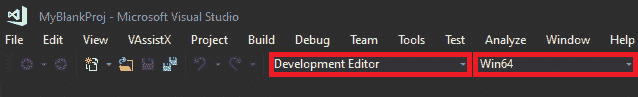

图 2.1：Visual Studio 部署设置

通过完成这个练习，我们现在知道如何在 UE4 上创建一个空的 C++项目，以及其中的注意事项。

在下一节中，我们将简要讨论文件夹结构，以及虚幻开发人员使用的最基本和最常用的文件夹结构格式。

# 虚幻引擎中的内容文件夹结构

在您的项目目录（`E:/UnrealProjects/MyBlankProj` *在我们的案例中*）中，您会看到一个`Content`文件夹。这是您的项目用于不同类型资产和项目相关数据（包括蓝图）的主要文件夹。C++代码放入项目的`Source`文件夹中。请注意，最佳做法是通过虚幻编辑器直接创建新的 C++代码文件，因为这简化了流程并减少了错误。

您可以使用许多不同的策略来组织`Content`文件夹中的数据。最基本和易于理解的是使用文件夹名称来表示其中的内容类型。因此，`Content`文件夹目录结构可能类似于[`packt.live/3lCVFkR`](https://packt.live/3lCVFkR)中的示例。在这个示例中，您可以看到每个文件都被分类地放在表示其类型的文件夹名称下的第一级，随后的级别进一步将其分组到有意义的文件夹中。

注意

所有蓝图的名称应以`BP`为前缀（以区分它们与虚幻引擎使用的默认蓝图）。其余前缀是可选的（但最好的做法是使用前面显示的前缀格式）。

在下一节中，我们将看一下 Visual Studio 解决方案。

# 使用 Visual Studio 解决方案

虚幻引擎中的每个 C++项目都有一个 Visual Studio 解决方案。这反过来驱动了所有的代码，并为开发人员提供了在运行状态下设置执行逻辑和调试代码的能力。

### 解决方案分析

项目目录中生成的 Visual Studio 解决方案（.sln）文件包含了整个项目和任何添加到其中的相关代码。

让我们来看看 Visual Studio 中存在的文件。*双击* .sln 文件在 Visual Studio 中打开它。

在`Solution Explorer`中，您将看到两个名为`Engine`和`Games`的项目。

### 引擎项目

在基本层面上，虚幻引擎本身就是一个 Visual Studio 项目，并有自己的解决方案文件。这包含了在虚幻引擎中共同工作的所有代码和第三方集成。该项目中的所有代码称为“源”代码。

引擎项目由当前用于该项目的虚幻引擎的外部依赖项、配置、插件、着色器和源代码组成。您可以随时浏览`UE4 -> Source`文件夹，查看任何引擎代码。

注意

由于虚幻引擎是开源的，Epic 允许开发人员查看和编辑源代码以满足其需求和要求。但是，您不能编辑通过 Epic Games Launcher 安装的虚幻引擎版本的源代码。要能够对源代码进行更改和构建，您需要下载虚幻引擎的源代码版本，可以在 GitHub 上找到。您可以使用以下指南下载虚幻引擎的源代码版本：[`docs.unrealengine.com/en-US/GettingStarted/DownloadingUnrealEngine/index.html`](https://docs.unrealengine.com/en-US/GettingStarted/DownloadingUnrealEngine/index.html)

下载后，您还可以参考以下指南来编译/构建新下载的引擎：[`docs.unrealengine.com/en-US/Programming/Development/BuildingUnrealEngine/index.html`](https://docs.unrealengine.com/en-US/Programming/Development/BuildingUnrealEngine/index.html)

### 游戏项目

在`Games`目录下是解决方案文件夹，名称为您的项目。展开后，您会找到一组文件夹。您将关注以下内容：

+   **配置文件夹**：包含为项目和构建设置的所有配置（这些可以选择性地具有特定平台（如 Windows、Android、iOS、Xbox 或 PS）的设置）。

+   **插件文件夹**：这是一个可选文件夹，当您添加任何第三方插件（从 Epic Marketplace 下载或通过互联网获取）时会创建。该文件夹将包含与该项目相关的所有插件的源代码。

+   **源文件夹**：这是我们将要使用的主要文件夹。它将包含构建目标文件，以及项目的所有源代码。以下是源文件夹中默认文件的描述：

+   `.Target.cs`扩展名，以及以`Build.cs`结尾的一个构建文件。

+   **ProjectName 代码文件（.cpp 和.h）**：默认情况下，为每个项目创建这些文件，并包含用于运行默认游戏模块代码的代码。

+   **ProjectNameGameModeBase 代码文件（.cpp 和.h）**：默认情况下，会创建一个空的项目游戏模式基类。在大多数情况下通常不会使用。

+   **ProjectName.uproject 文件**：包含用于提供有关项目的基本信息以及与之关联的插件列表的描述符。

## 在 Visual Studio 中调试代码

Visual Studio 提供了强大的调试功能，通过在代码中设置断点。它使用户能够在特定代码行暂停游戏，以便开发人员可以查看变量的当前值，并以受控的方式逐步执行代码和游戏（可以逐行进行，逐个函数进行等）。

当您的游戏项目中有大量变量和代码文件，并且希望以逐步方式查看变量的值被更新和使用以调试代码、找出问题并解决问题时，这将非常有用。调试是任何开发人员工作的基本过程，只有经过许多连续的调试、分析和优化周期，项目才能足够完善以进行部署。

现在您已经对 Visual Studio 解决方案有了基本的了解，我们将继续并进行一个实际的练习。

## 练习 2.02：调试第三人称模板代码

在这个练习中，您将使用虚幻引擎的第三人称模板创建一个项目，并将在 Visual Studio 中调试代码。我们将调查模板项目的`Character`类中名为`BaseTurnRate`的变量的值。我们将看到随着我们逐行移动代码，该值如何更新。

以下步骤将帮助您完成此练习：

1.  从 Epic Games Launcher 启动虚幻引擎。

1.  点击`Games`部分，然后点击`下一步`。

1.  选择`Third Person`，然后点击`下一步`。

1.  选择 C++，将项目名称设置为`ThirdPersonDebug`，然后点击`创建项目`按钮。

1.  现在，关闭虚幻编辑器，转到 Visual Studio 解决方案，并打开`ThirdPersonDebugCharacter.cpp`文件：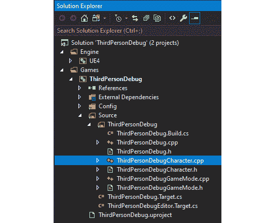

图 2.2：ThirdPersonDebugCharacter.cpp 文件位置

1.  *左键单击*在第`18`行左侧的栏上。应该会出现一个红色的圆点图标（*您可以再次单击它将其关闭*）：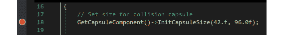

图 2.3：碰撞胶囊初始化代码

在这里，我们正在获取角色的`capsule`组件（在*第三章*，*角色类组件和蓝图设置*中进一步解释），默认情况下是根组件。然后，我们调用它的`InitCapsuleSize`方法，该方法接受两个参数：`InRadius`浮点数和`InHalfHeight`浮点数。

1.  确保 VS 中的解决方案配置设置为`开发编辑器`，然后点击`本地 Windows 调试器`按钮：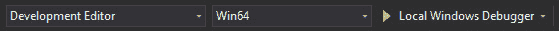

图 2.4：Visual Studio 构建设置

1.  等到您能在左下角看到以下窗口为止：

注意

如果窗口没有弹出，您可以通过在`调试` > `窗口` > `自动`下手动打开窗口。此外，您也可以使用`本地`。

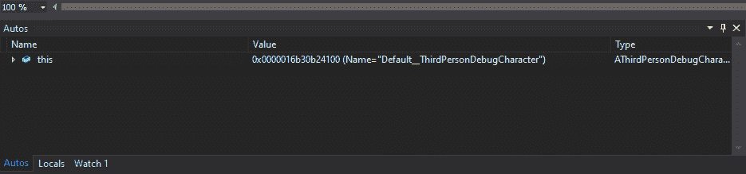

图 2.5：Visual Studio 变量监视窗口

`this`显示了对象本身。对象包含它存储的变量和方法，通过展开它，我们能够看到整个对象及其变量在当前代码执行行的状态。

1.  展开`this`，然后展开`ACharacter`，然后展开`CapsuleComponent`。在这里，您可以看到`CapsuleHalfHeight = 88.0`和`CapsuleRadius = 34.0`变量的值。在初始的红点所在的第`18`行旁边，您会看到一个箭头。这意味着代码已经到达第`17`行的末尾，尚未执行第`18`行。

1.  点击`步进`按钮进入下一行代码（*快捷键：F11*）。`步进`将进入到该行内部的代码（如果存在）。另一方面，`步过`将只执行当前代码并移动到下一行。由于当前行上没有函数，`步进`将模仿`步过`功能。

图 2.6：调试步进

1.  请注意，箭头已移动到第`21`行，并且变量已经更新。`CapsuleHalfHeight = 96.0`和`CapsuleRadius = 42.0`以红色突出显示。还要注意，`BaseTurnRate`变量初始化为`0.0`：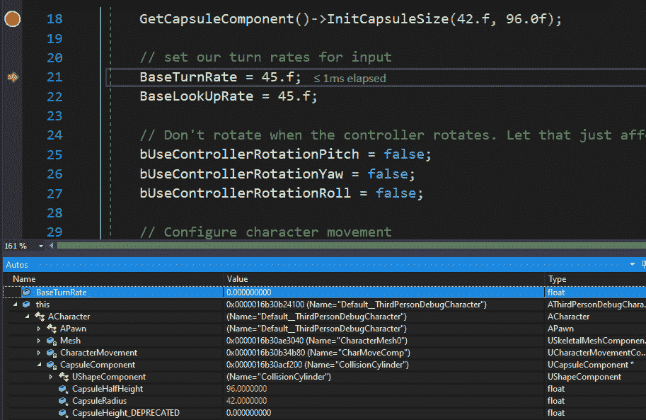

图 2.7：BaseTurnRate 初始值

1.  再次按下(*F11*)进入到第`22`行。现在，`BaseTurnRate`变量的值为`45.0`，`BaseLookUpRate`初始化为`0.0`，如下截图所示：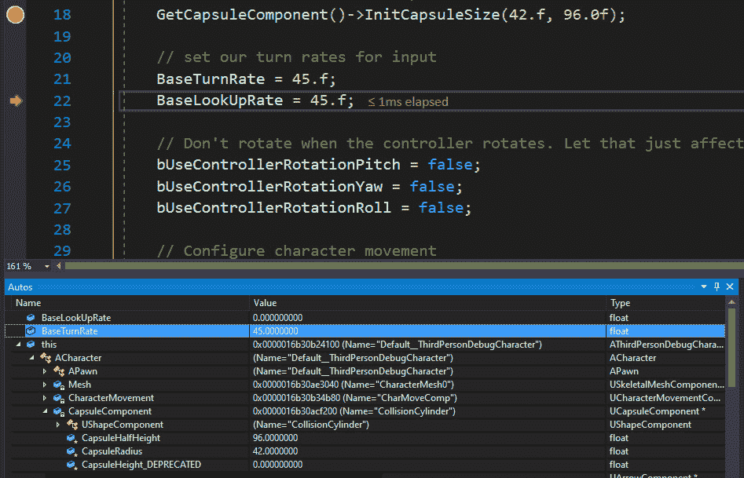

图 2.8：BaseTurnRate 更新的值

1.  再次按下(*F11*)进入到第`27`行。现在，`BaseLookUpRate`变量的值为`45.0`。

同样，您被鼓励进入并调试代码的其他部分，不仅要熟悉调试器，还要了解代码在幕后是如何工作的。

通过完成这个练习，您已经学会了如何在 Visual Studio 中设置调试点，以及在某一点停止调试，然后逐行继续观察对象及其变量的值。这对于任何开发人员来说都是一个重要的方面，许多人经常使用这个工具来消除代码中的烦人错误，特别是当代码流量很大，变量的数量相当多时。

注意

在任何时候，您都可以通过顶部菜单栏上的以下按钮停止调试、重新开始调试或继续执行其余代码：

图 2.9：Visual Studio 中的调试工具

现在，我们将看一下如何将资产导入到虚幻项目中。

# 导入所需资产

虚幻引擎为用户提供了导入各种文件类型的能力，以便用户自定义其项目。开发人员可以调整和玩弄几种导入选项，以匹配其所需的设置。

游戏开发者经常导入的一些常见文件类型包括场景、网格、动画（从 Maya 和其他类似软件导出）、电影文件、图像（主要用于用户界面）、纹理、声音、CSV 文件中的数据和字体。这些文件可以从 Epic Marketplace 或其他途径（如互联网）获得，并在项目中使用。

资产可以通过将它们拖放到`内容`文件夹中来导入，也可以通过在`内容浏览器`中点击`导入`按钮来导入。

现在让我们来进行一个练习，学习如何导入 FBX 文件以及如何完成这个操作。

## 练习 2.03：导入角色 FBX 文件

这个练习将专注于从 FBX 文件中导入 3D 模型。FBX 文件被广泛用于导出和导入 3D 模型，以及它们的材质、动画和纹理。

以下步骤将帮助您完成这个练习：

1.  从 GitHub 的`Chapter02` -> `Exercise2.03` -> `ExerciseFiles`目录中下载`SK_Mannequin.FBX`，`ThirdPersonIdle.FBX`，`ThirdPersonRun.FBX`和`ThirdPersonWalk.FBX`文件。

注意

`ExerciseFiles`目录可以在 GitHub 的以下链接找到：[`packt.live/2IiqTzq`](https://packt.live/2IiqTzq)。

1.  打开我们在*练习 2.01*中创建的空白项目，*创建一个空的 C++项目*。

1.  在项目的`内容浏览器`界面中，点击`导入`：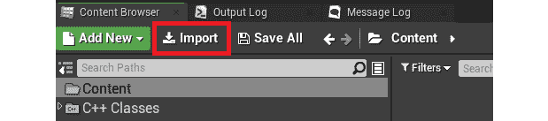

图 2.10：内容浏览器导入按钮

1.  浏览到我们在*步骤 1*中下载的文件目录，选择`SK_Mannequin.FBX`，然后点击`打开`按钮。

1.  确保`导入动画`按钮是`全部导入`按钮。您可能会收到一个警告，指出`没有平滑组`。您现在可以忽略这个警告。这样，您就成功地从 FBX 文件中导入了一个骨骼网格。现在，我们需要导入它的动画。

1.  再次点击`导入`按钮，浏览到我们在*步骤 1*中创建的文件夹，并选择`ThirdPersonIdle.fbx`，`ThirdPersonRun.fbx`和`ThirdPersonWalk.fbx`。然后点击`打开`按钮。

1.  确保骨架设置为您在*步骤 5*中导入的骨架，然后点击`全部导入`：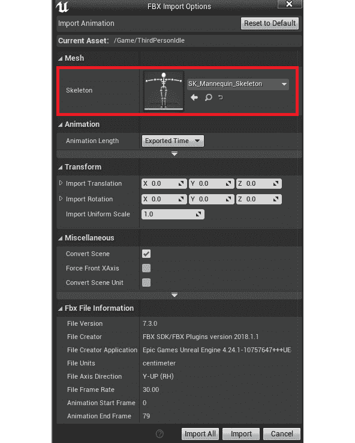

图 2.11：动画 FBX 导入选项

1.  现在，您可以在`内容浏览器`中看到三个动画（`ThirdPersonIdle`，`ThirdPersonRun`和`ThirdPersonWalk`）。

1.  如果您*双击*`ThirdPersonIdle`，您会注意到左臂下垂。这意味着存在重定向问题。当动画与骨架分开导入时，虚幻引擎会将所有骨骼从动画映射到骨架，但有时会导致故障。我们现在要解决这个故障。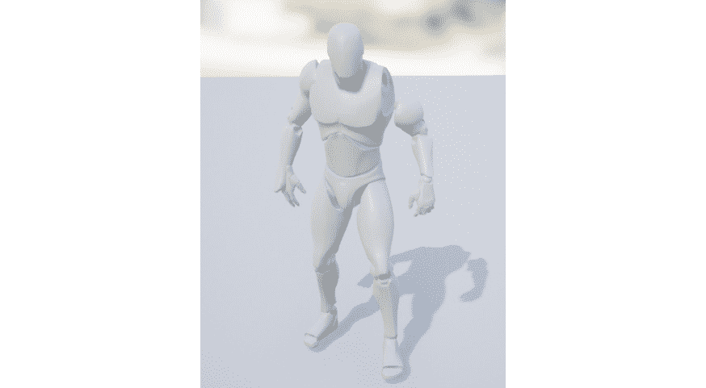

图 2.12：ThirdPersonIdle UE4 人体模型动画故障

1.  打开`SK_Mannequin`骨骼网格，并打开`骨架树`选项卡（如果之前没有打开）。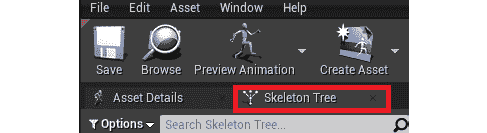

图 2.13：SK_Mannequin 骨架树选项卡选择

1.  在`选项`下启用`显示重定向选项`复选框。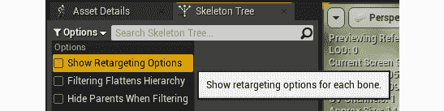

图 2.14：启用重定向选项

1.  现在在骨架树中，减少`spine_01`，`thigh_l`和`thigh_r`骨骼，以便更好地可见。

1.  现在选择`spine_01`，`thigh_l`和`thigh_r`骨骼。在它们上面*右键单击*，然后在菜单中点击`递归设置平移重定向骨架`按钮。这将修复我们之前遇到的骨骼平移问题。

1.  重新打开`ThirdPersonIdle` `动画`，以验证悬臂是否已经修复。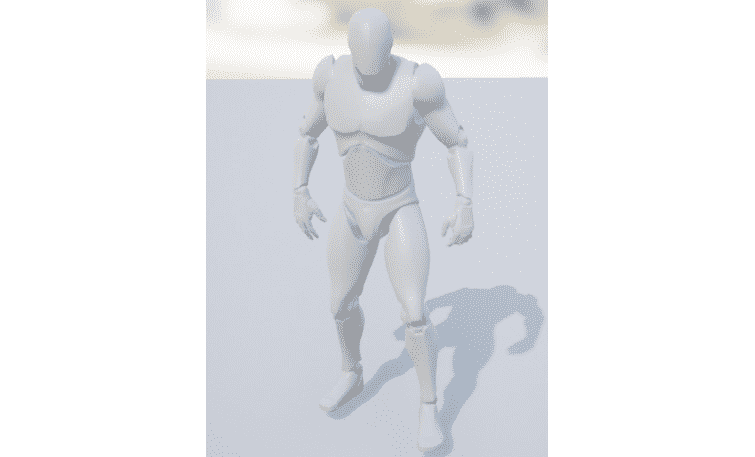

图 2.15：修复的 ThirdPersonIdle 动画

注意

您可以在 GitHub 的`Chapter02` -> `Exercise2.03` -> `Ex2.03-Completed.rar`目录中找到完整的练习代码文件，链接如下：[`packt.live/2U8AScR`](https://packt.live/2U8AScR)

解压`.rar`文件后，*双击*`.uproject`文件。您会看到一个提示，询问`是否要立即重建？`。点击该提示上的`是`，这样它就可以构建必要的中间文件，然后应该自动在虚幻编辑器中打开项目。

通过完成这个练习，您已经了解了如何导入资产，更具体地说，导入了一个 FBX 骨骼网格和动画数据到您的项目中。对于许多游戏开发者的工作流程来说，这是至关重要的，因为资产是整个游戏的构建模块。

在下一节中，我们将看一下用于创建游戏的虚幻核心类，它们对于创建游戏或体验有多重要，以及如何在项目中使用它们。

# 虚幻游戏模式类

考虑这样一种情况，您希望能够暂停游戏。所有必要的逻辑和实现，以便能够暂停游戏的类将被放置在一个单独的类中。这个类将负责处理玩家进入游戏时的游戏流程。游戏流程可以是游戏中发生的任何动作或一系列动作。例如，游戏暂停、播放和重新开始被认为是简单的游戏流程动作。同样，在多人游戏的情况下，我们需要将所有与网络相关的游戏逻辑放在一起。这正是游戏模式类的作用。

游戏模式是一个驱动游戏逻辑并对玩家施加游戏相关规则的类。它基本上包含有关当前正在进行的游戏的信息，包括游戏变量和事件，这些将在本章后面提到。游戏模式可以容纳所有游戏对象的管理器，它是一个单例类，并且可以被游戏中的任何对象或抽象类直接访问。

与所有其他类一样，游戏模式类可以在蓝图或 C++中进行扩展。这可以用来包括可能需要的额外功能和逻辑，以便让玩家了解游戏内发生的情况。

让我们来看一些放在游戏模式类中的示例游戏逻辑：

+   限制允许进入游戏的玩家数量

+   控制新连接玩家的生成位置和玩家控制器逻辑

+   跟踪游戏得分

+   跟踪游戏胜利/失败条件。

+   实现游戏结束/重新开始游戏场景

在下一节中，我们将查看游戏模式提供的默认类。

### 游戏模式默认类

除了自身之外，游戏模式使用了几个类来实现游戏逻辑。它允许您为其以下默认值指定类：

+   **游戏会话类**：处理管理员级别的游戏流程，如登录批准。

+   **游戏状态类**：处理游戏状态，以便客户端可以看到游戏内发生的情况。

+   **玩家控制器类**：用于控制和操纵角色的主要类。可以被视为决定要做什么的大脑。

+   **玩家状态类**：保存玩家在游戏中的当前状态。

+   **HUD 类**：处理显示给玩家的用户界面。

+   **默认 Pawn 类**：玩家控制的主要角色。这本质上是玩家角色。

+   `DefaultPawn`类，旁观者 Pawn 类指定了负责旁观游戏的 Pawn。

+   **重播旁观玩家控制器**：负责在游戏内回放期间操纵回放的玩家控制器。

+   **服务器状态复制器类**：负责复制服务器状态网络数据。

您可以使用默认类，也可以为自定义实现和行为指定自己的类。这些类将与游戏模式一起工作，并且将自动运行，而无需放置在世界中。

## 游戏事件

在多人游戏方面，当许多玩家进入游戏时，处理逻辑以允许他们进入游戏，维护其状态，并允许他们查看其他玩家的状态并处理其交互变得至关重要。

游戏模式为您提供了几个可以重写以处理多人游戏逻辑的事件。以下事件对于网络功能和能力（它们主要用于此目的）特别有用：

+   “在登录后”：此事件在玩家成功登录游戏后调用。从这一点开始，可以在玩家控制器类上调用复制逻辑（用于多人游戏中的网络）。

+   “处理新玩家的开始”：此事件在“在登录后”事件之后调用，可用于定义新进入玩家的情况。默认情况下，它为新连接的玩家创建一个角色。

+   “在指定位置生成默认角色”：此事件触发游戏中实际的角色生成。新连接的玩家可以在特定的变换位置或放置在关卡中的预设玩家起始位置生成（可以通过将玩家起始位置从模型窗口拖放到世界中来添加）。

+   “在注销时”：当玩家离开游戏或被销毁时调用此事件。

+   在重新开始玩家时：调用此事件以重新生成玩家。与“在指定位置生成默认角色”类似，玩家可以在特定的变换位置或预先指定的位置（使用玩家起始位置）重新生成。

## 网络

游戏模式类不会被复制到任何客户端或加入的玩家。它的范围仅限于生成它的服务器。本质上，客户端-服务器模型规定客户端只能作为服务器上进行游戏的输入。因此，游戏逻辑不应存在于客户端，而应仅存在于服务器。

## GameModeBase 与 GameMode

从 4.14 版本开始，Epic 引入了`AGameModeBase`类，它充当所有游戏模式类的父类。它本质上是`AGameMode`类的简化版本。

然而，游戏模式类包含一些更适合多人射击类型游戏的附加功能，因为它实现了比赛状态的概念。默认情况下，“游戏模式基类”包含在基于模板的新项目中。

游戏模式还包含一个状态机，用于处理并跟踪玩家的状态。

# 关卡

在游戏中，关卡是游戏的一个部分或部分。由于许多游戏非常庞大，它们被分解为不同的关卡。加载感兴趣的关卡供玩家玩耍，然后当他们完成后，可能会加载另一个关卡（同时当前的关卡将被加载出）以便玩家可以继续。要完成游戏，玩家通常需要完成一组特定任务以进入下一关，最终完成游戏。

游戏模式可以直接应用于关卡。加载关卡时，将使用分配的游戏模式类来处理该特定关卡的所有逻辑和游戏玩法，并覆盖项目的游戏模式。可以在打开关卡后使用“世界设置”选项卡进行应用。

关卡蓝图是一个与关卡一起运行的蓝图，但不能在关卡范围之外访问。游戏模式可以在任何蓝图（包括关卡蓝图）中通过“获取游戏模式”节点访问。稍后可以将其转换为您的游戏模式类，以获取对其的引用。

注意

一个关卡只能分配一个游戏模式类。但是，可以将单个游戏模式类分配给多个关卡，以模仿类似的功能和逻辑。

## 虚幻角色类

`Pawn`类，在虚幻引擎中，是可以被玩家或 AI 控制的最基本的角色类。它也在游戏中图形化地代表玩家/机器人。这个类中的代码应该涉及游戏实体的所有内容，包括交互、移动和能力逻辑。玩家在游戏中仍然只能控制一个角色。此外，玩家可以在游戏过程中*取消控制*一个角色并*控制*另一个角色。

### 默认角色

虚幻引擎提供了一个`DefaultPawn`类（继承自基本的`Pawn`类）。在`Pawn`类的基础上，这个类包含了额外的代码，使其能够在世界中移动，就像在游戏的编辑版本中一样。

### 观战角色

一些游戏提供了观战游戏的功能。比如说，你正在等待朋友完成他们的游戏，然后加入你，所以你可以先观战他们的游戏。这使你能够观察玩家正在玩的游戏，通过一个可以移动的摄像头来观察玩家或游戏。一些游戏还提供了观战模式，可以回到过去，展示游戏中发生的特定动作或游戏中的任何时间点。

顾名思义，这是一种特殊类型的角色，提供了观战游戏的示例功能。它包含了所有基本工具（如观战角色移动组件）来实现这一点。

## 虚幻引擎玩家控制器类

玩家控制器类可以被视为玩家。它本质上是角色的*灵魂*。玩家控制器接收用户输入，并将其传递给角色和其他类，以便玩家与游戏进行交互。然而，在处理这个类时，您必须注意以下几点：

+   与角色不同，一个关卡中只能有一个玩家控制器代表玩家。（就像当你乘坐电梯时。在电梯内，你只能控制那部电梯，但你可以离开它并进入另一部电梯来控制它。）

+   玩家控制器在整个游戏中持续存在，但角色可能不会（例如，在战斗游戏中，玩家角色可能会死亡并重生，但玩家控制器仍然保持不变）。

+   由于角色的临时性和玩家控制器的永久性，开发人员需要考虑应该将哪些代码添加到哪个类中。

让我们通过下一个练习更好地理解这一点。

## 练习 2.04：设置游戏模式、玩家控制器和角色

这个练习将使用我们在*练习 2.01*中创建的空项目。我们将向游戏中添加我们的游戏模式、玩家控制器和`Pawn`类，并测试我们的代码是否在蓝图中工作。

以下步骤将帮助您完成这个练习：

1.  打开我们在*练习 2.01*中创建的项目，*创建一个空的 C++项目*。

1.  在`内容浏览器`中*右键单击*，然后选择`蓝图类`。

1.  在`所有类`部分，找到并选择`游戏模式`类：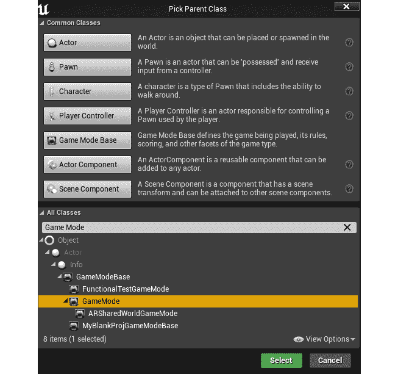

图 2.16：选择游戏模式类

1.  将其命名为`BP_MyGameMode`。

1.  重复*步骤 2-4*，并在`常见类`部分选择`Pawn`类，如前面的屏幕截图所示。将此类的名称设置为`BP_MyPawn`。

1.  重复*步骤 2-4*，并在`常见类`部分选择`玩家控制器`类，如前面的屏幕截图所示。将此类的名称设置为`BP_MyPC`：

图 2.17：游戏模式、角色和玩家控制器名称

1.  打开`BP_MyGameMode`，并打开`事件图`标签：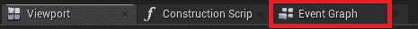

图 2.18：蓝图中的事件图标签

1.  *左键单击*并从`Event BeginPlay`节点中的白色引脚拖动，然后释放*左鼠标按钮*以获得`选项`菜单。键入`print`并在列表中选择突出显示的`print`节点：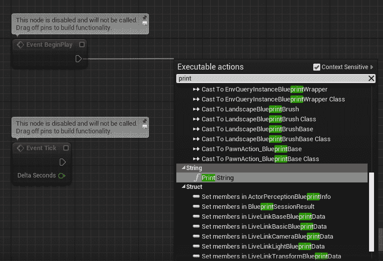

图 2.19：打印字符串节点（蓝图）

1.  在`In String`参数下放置的结果`Print String`节点中，键入`My Game Mode has started!`。

1.  现在，按顶部菜单栏上的`编译`和`保存`按钮。

1.  重复*步骤 7-10*，分别为`BP_MyPawn`和`BP_MyPC`类设置`In String`参数为`My Pawn has started!`和`My PC has started!`。

1.  最后，打开`World Settings`选项卡，在`Game Mode`部分，使用下拉菜单将`GameMode Override`，`Default Pawn Class`和`Player Controller Class`选项设置为我们各自的类：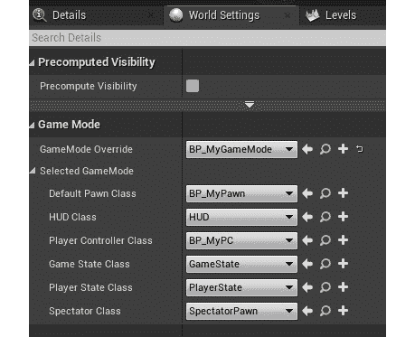

图 2.20：世界设置和游戏模式设置

1.  单击`播放`以播放游戏，并在顶部看到三个打印语句。这意味着当前的`GameMode Override`，`Default Pawn Class`和`Player Controller Class`选项已设置为您指定的类，并正在运行它们的代码：

图 2.21：输出打印

注意

您可以在 GitHub 的`Chapter02` -> `Exercise2.04` -> `Ex2.04-Completed.rar`目录中找到已完成的练习代码文件，链接如下：[`packt.live/3k7nS1K`](https://packt.live/3k7nS1K)

提取`.rar`文件后，*双击*`.uproject`文件。您将看到一个提示，询问`是否要立即重建？`。点击该提示上的`是`，以便它可以构建必要的中间文件，之后应该会自动在虚幻编辑器中打开项目。

现在您已经了解了虚幻中的基本类以及它们的工作原理，在下一节中，我们将看一下动画，涉及到哪些过程，以及它们是如何完成的。接下来我们将进行一次练习。

# 动画

动画对于为游戏增添生动和丰富是至关重要的。出色的动画是区分普通游戏和优秀游戏的主要因素之一。视觉保真度是保持玩家对游戏兴奋和沉浸的关键，因此动画是虚幻引擎中创建的所有游戏和体验的核心部分。

注意

本章旨在介绍动画基础知识。对动画的更深入探讨将在*第十三章*，*混合空间 1D，按键绑定和状态机*中进行。

## 动画蓝图

动画蓝图是一种特定类型的蓝图，允许您控制骨骼网格的动画。它为用户提供了一个专门用于动画相关任务的图表。在这里，您可以定义计算骨架姿势的逻辑。

注意

骨骼网格是一种基于骨骼的网格，具有骨骼，所有这些骨骼汇集在一起形成网格，而静态网格（顾名思义）是一种不可动画的网格。骨骼网格通常用于角色和逼真的对象（例如玩家英雄），而静态网格用于基本或无生命的对象（例如墙壁）。

动画蓝图提供两种类型的图表：`EventGraph`和`AnimGraph`。

## 事件图

动画蓝图中的事件图提供了与动画相关的设置事件，正如我们在*第一章*，*虚幻引擎介绍*中学到的，可以用于变量操作和逻辑。事件图主要用于在动画蓝图中更新混合空间值，从而驱动`AnimGraph`中的动画。这里主要使用的常见事件如下：

+   **蓝图初始化动画：**用于初始化动画。

+   **蓝图更新动画：**此事件在每一帧执行，使开发人员能够根据需要执行计算并更新其值：

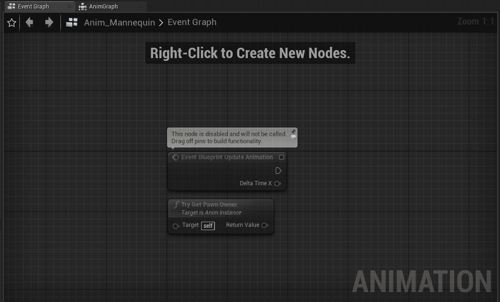

图 2.22：动画事件图

在上述截图中，您可以看到默认的事件图。这里有`事件蓝图更新动画`和`尝试获取所有者`节点。您创建了新节点并将它们附加到图中，以完成*练习 2.04*中的一些有意义的任务，*设置游戏模式、玩家控制器和模型*。

## 动画图

动画图专门负责播放动画，并在每帧基础上输出骨架的最终姿势。它为开发人员提供了执行不同逻辑的特殊节点。例如，混合节点接受多个输入，并用于决定当前在执行中使用哪个输入。这个决定通常取决于一些外部输入（如 alpha 值）。

动画图通过评估节点，按照节点上的执行引脚之间的执行流程来工作。

在下面的截图中，您可以看到图上有一个单独的`输出姿势`节点。这是动画的最终姿势输出，将在游戏中的相关骨骼网格上可见。我们将在*练习 2.05*中使用这个：

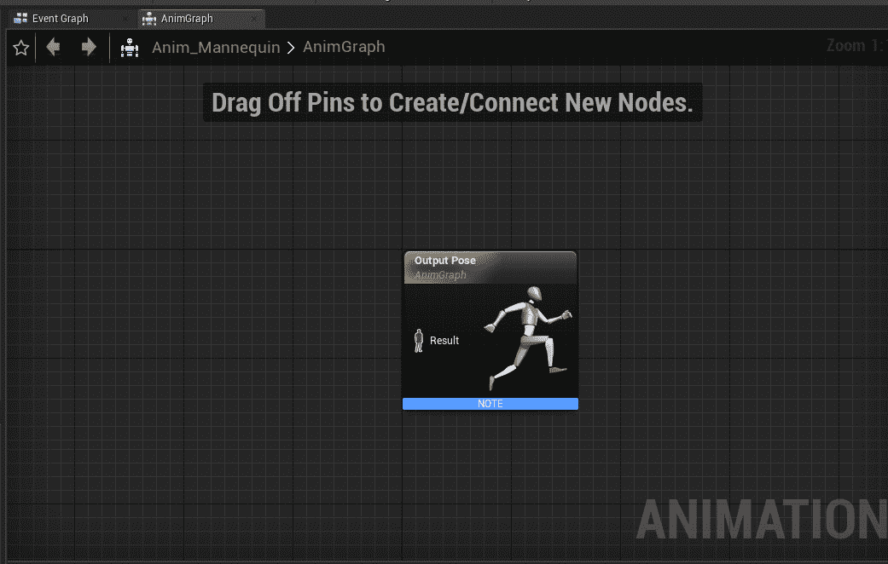

图 2.23：动画 AnimGraph

## 状态机

您已经学会了如何设置动画节点和逻辑，但缺少一个重要组件。谁决定何时播放或执行特定的动画或逻辑？这就是状态机的作用。例如，玩家可能需要从蹲姿转换到站立姿势，因此需要更新动画。代码将调用动画蓝图，访问状态机，并让它知道动画的状态需要改变，从而实现平滑的动画过渡。

状态机由状态和规则组成，可以被认为是描述动画状态的状态。状态机在特定时间总是处于一个状态。当满足某些条件（由规则定义）时，就会从一个状态转换到另一个状态。

## 过渡规则

每个过渡规则都包含一个名为`Result`的布尔节点。如果布尔值为 true，则可以发生过渡，反之亦然：

图 2.24：过渡规则

## 混合空间

当您提供一堆动画时，您可以创建一个状态机并运行这些动画。然而，当您需要从一个动画过渡到另一个动画时，会出现问题。如果您简单地切换动画，它会出现故障，因为新动画的起始姿势可能与旧动画的结束姿势不同。

混合空间是用于根据它们的 alpha 值在不同动画之间进行插值的特殊资产。这反过来消除了故障问题，并在两个动画之间进行插值，导致动画的快速和平滑变化。

混合空间可以在一维中创建，称为混合空间 1D，或者在二维中创建，称为混合空间。这些根据一个或两个输入混合任意数量的动画。

## 练习 2.05：创建模特动画

现在您已经了解了大部分与动画相关的概念，我们将通过为默认模特添加一些动画逻辑来进行实际操作。我们将创建一个混合空间 1D、一个状态机和动画逻辑。

我们的目标是创建角色的奔跑动画，从而深入了解动画的工作原理，以及它们如何与 3D 世界中的实际角色绑定。

以下步骤将帮助您完成此练习：

1.  下载并提取`Chapter02`->`Exercise2.05`->`ExerciseFiles`目录中的所有内容，这些内容可以在 GitHub 上找到。您可以将其提取到您在计算机上使用的任何目录中。

注意

`ExerciseFiles`目录可以在 GitHub 上找到，链接如下：[`packt.live/32tIFGJ`](https://packt.live/32tIFGJ)。

1.  *双击*`CharAnim.uproject`文件以启动项目。

1.  按“播放”。使用键盘的*W*、*A*、*S*、*D*键进行移动，使用*空格键*进行跳跃。请注意，目前模特身上没有动画。

1.  在“内容”文件夹中，浏览到“内容” -> “模特” -> “动画”。

1.  *右键单击*“内容”文件夹，从“动画”部分选择“混合空间 1D”。

1.  选择`UE4_Mannequin_Skeleton`。

1.  将新创建的文件重命名为`BS_IdleRun`。

1.  *双击*`BS_IdleRun`以打开它。

1.  在“资产详细信息”选项卡中，在“轴设置”部分，展开“水平轴”部分，将“名称”设置为“速度”，将“最大轴值”设置为`375.0`：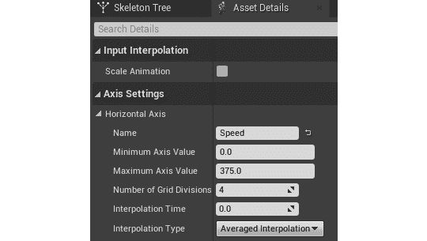

图 2.25：混合空间 1D 轴设置

1.  转到“样本插值”部分，并将“每秒目标权重插值速度”设置为`5.0`。

1.  将`ThirdPersonIdle`、`ThirdPersonWalk`和`ThirdPersonRun`动画分别拖放到图表中：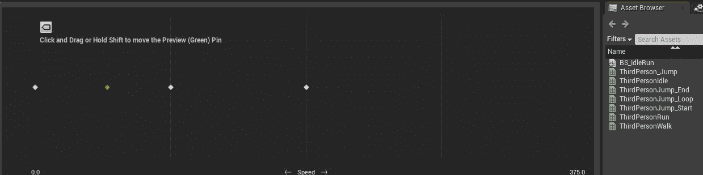

图 2.26：混合空间预览器

1.  在“资产详细信息”选项卡中，在“混合样本”中，设置以下变量值：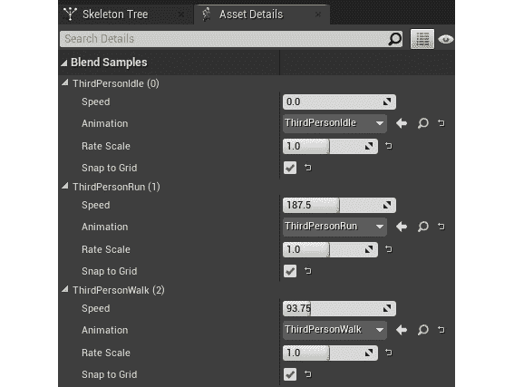

图 2.27：混合样本

1.  单击“保存”并关闭此“资产”。

1.  在“内容”文件夹内*右键单击*，从“动画”部分选择“动画蓝图”。

1.  在“目标骨骼”部分，选择`UE4_Mannequin_Skeleton`，然后单击“确定”按钮：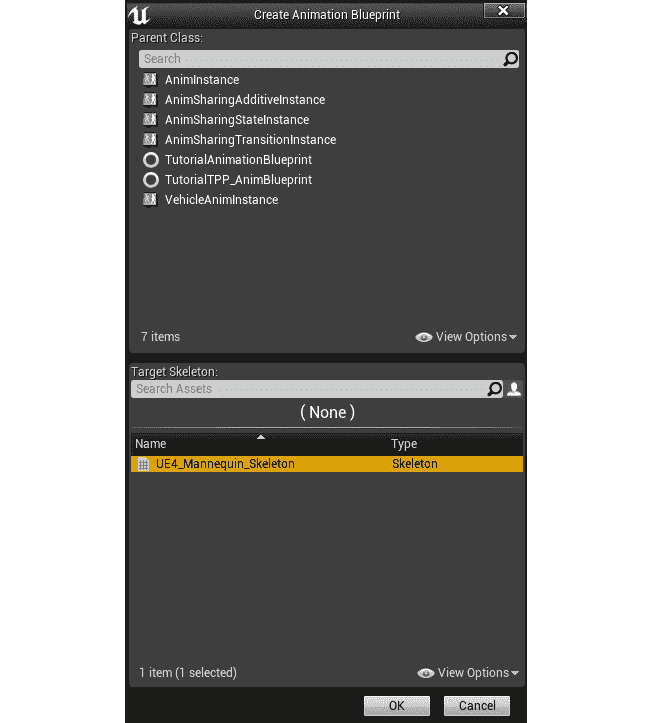

图 2.28：创建动画蓝图资产

1.  将文件命名为`Anim_Mannequin`，然后按*Enter*。

1.  *双击*新创建的`Anim_Mannequin`文件。

1.  接下来，转到“事件图”选项卡。

1.  通过在左下角的变量部分单击`+`图标创建一个名为`IsInAir?`的布尔变量。确保分配正确的类型：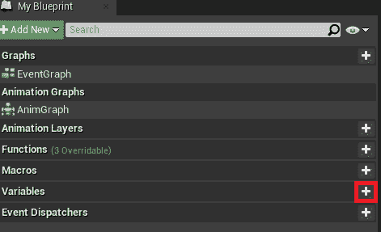

图 2.29：添加变量

1.  创建一个名为`Speed`的浮点变量。

1.  拖动“尝试获取所有者”返回值节点，并输入“IsValid”。选择底部的一个：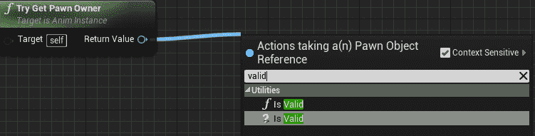

图 2.30：事件图 IsValid 节点

1.  将“事件蓝图更新动画”节点的`Exec`引脚连接到“IsValid”节点：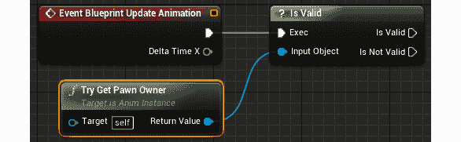

图 2.31：连接节点

1.  从“尝试获取所有者”节点，使用“获取移动组件”节点。

1.  从*步骤 22*中获得的节点中，获取`Is Falling`节点，并将布尔返回值连接到`Is in Air?`布尔的“设置”节点。将`SET`节点的执行引脚与“IsValid”执行引脚连接：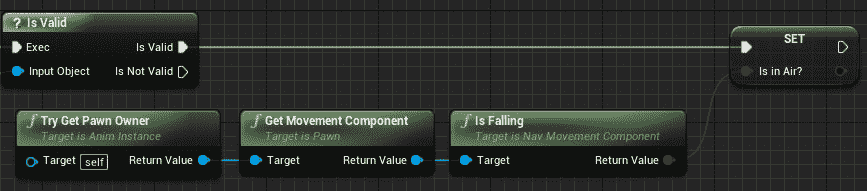

图 2.32：Is in Air 布尔设置

1.  从“尝试获取所有者”节点，使用“获取速度”节点，获取其`VectorLength`，并将输出连接到`Speed`的“变量设置”节点：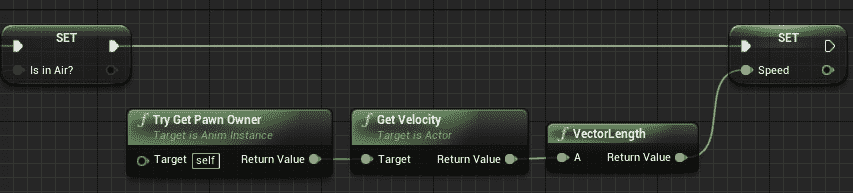

图 2.33：速度布尔设置

1.  接下来，转到“动画图”选项卡。

1.  *在 AnimGraph*内的任何位置*右键单击*，输入“状态机”，然后单击“添加新状态机”：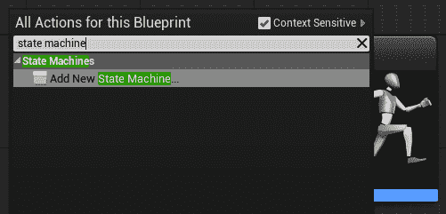

图 2.34：添加新状态机选项

1.  确保选择节点，然后按*F2*进行重命名为`MannequinStateMachine`。

1.  将`MannequinStateMachine`的输出引脚连接到“输出姿势”节点的输入引脚，并单击顶部栏上的编译按钮：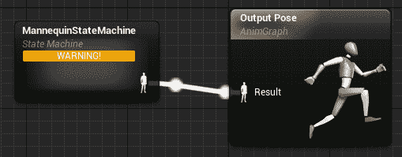

图 2.35：配置状态机结果输出姿势节点

1.  *双击*`MannequinstateMachine`节点以进入状态机。您将看到一个`Entry`节点。将连接到它的状态将成为模特的默认状态。在本练习中，这将是我们的“Idle 动画”。

1.  在状态机内的空白区域上*右键单击*，然后从菜单中选择“添加状态”。按下*F2*将其重命名为`Idle/Run`。

1.  从`Entry`文本旁边的图标拖动，将其指向`Idle/Run`节点内部，然后释放以连接它：

图 2.36：将添加的状态连接到 Entry

1.  *双击*`Idle/Run`状态以打开它。

1.  从右下角的“资产浏览器”菜单中，选择并拖动`BS_IdleRun`动画到图表中。从左侧的“变量”部分获取`Speed`变量并连接它，如图所示：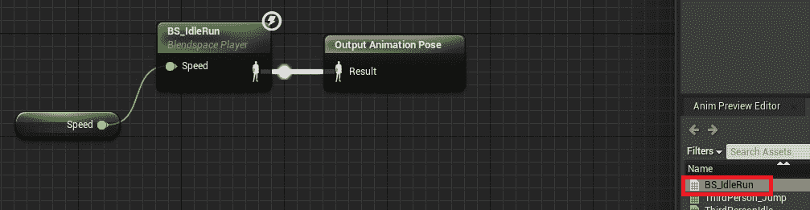

图 2.37：Idle/Run 状态设置

1.  通过单击顶部横幅中的面包屑`MannequinStateMachine`返回到`MannequinStateMachine`：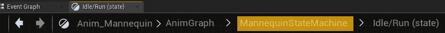

图 2.38：状态机导航面包屑

1.  从“资产浏览器”菜单中，将`ThirdPersonJump_Start`动画拖放到图表中。将其重命名为`Jump_Start`。

1.  对`ThirdPersonJump_Loop`和`ThirdPerson_Jump`重复*步骤 35*，并将它们分别重命名为`Jump_Loop`和`Jump_End`：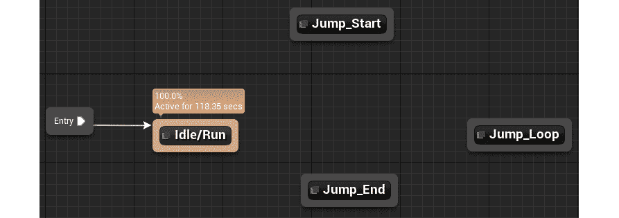

图 2.39：状态设置

1.  打开`Jump_Start`状态。单击`Play ThirdPersonJump_Start`节点。在“设置”部分*取消选中*“循环动画”。

1.  打开`Jump_Loop`状态，单击`Play ThirdPersonJump_Loop`节点。将`Play Rate`设置为`0.75`。

1.  打开`Jump_End`状态，单击`Play ThirdPerson_Jump`节点。*取消选中*“循环动画”布尔值。

1.  由于我们可以从`Idle/Run`转换到`Jump_Start`，因此从`Idle/Run`状态拖动并将其放到`Jump_Start`状态。同样，`Jump_Start`导致`Jump_Loop`，然后到`Jump_End`，最后回到`Idle/Run`。

拖放箭头以设置状态机，如下所示：

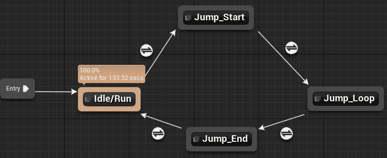

图 2.40：状态连接

1.  *双击*`Idle/Run`到`Jump_Start`转换规则图标，并将`Is in Air?`变量的输出连接到结果：

图 2.41：Idle/Run 到 Jump_Start 转换规则设置

1.  打开`Jump_Start`到`Jump_Loop`转换规则。获取`ThirdPersonJump_Start`的“剩余时间（比率）”节点，并检查其是否小于`0.1`。将结果布尔值连接到结果：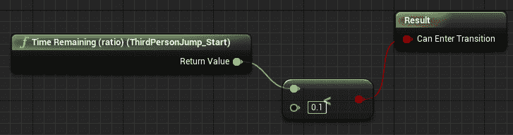

图 2.42：Jump_Start 到 Jump_End 转换规则设置

1.  打开`Jump_Loop`到`Jump_End`转换规则。将`Is in Air?`的反向输出连接到结果：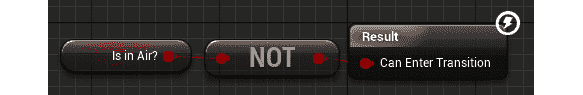

图 2.43：Jump_Loop 到 Jump_End 转换规则设置

1.  打开`Jump_End`到`Idle/Run`转换规则。获取`ThirdPerson_Jump`的“剩余时间（比率）”节点，并检查其是否小于`0.1`。将结果布尔值连接到结果：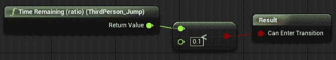

图 2.44：Jump_End 到 Idle/Run 转换规则设置

1.  关闭动画蓝图。

1.  在“内容”文件夹中，浏览到“内容”->`ThirdPersonBP`->“蓝图文件夹”，并打开`ThirdPersonCharacter`蓝图。

1.  在“组件”选项卡中选择`Mesh`：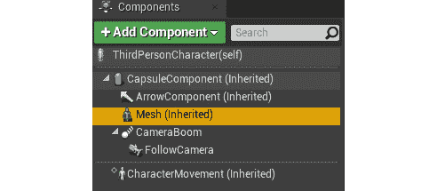

图 2.45：网格组件

1.  在“详细信息”选项卡中，将`Anim Class`设置为您创建的`Animation Blueprint`类：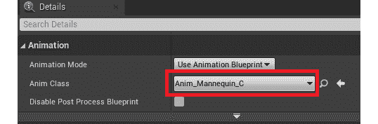

图 2.46：在骨骼网格组件中指定动画蓝图

1.  关闭蓝图。

1.  再次玩游戏，注意动画。

以下应该是你实现的输出。正如你所看到的，我们的角色正在奔跑，奔跑动画正在显示：

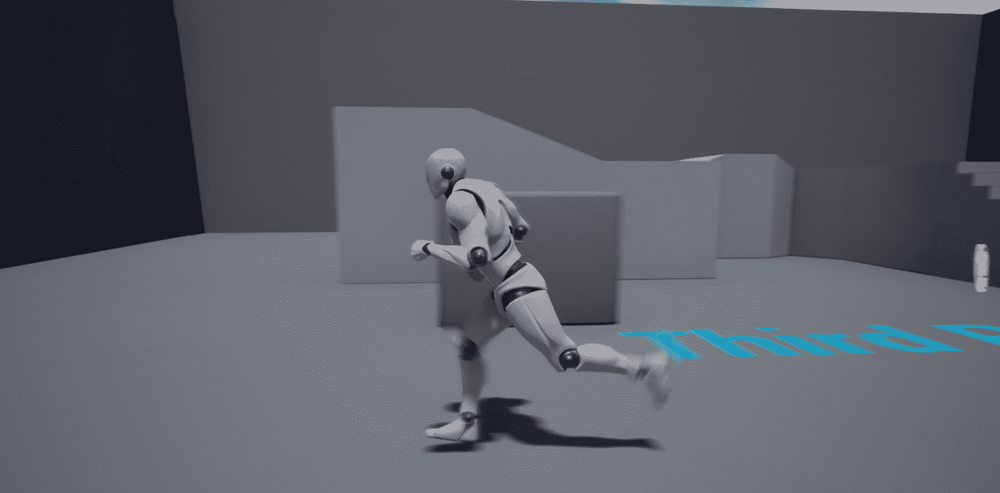

图 2.47：角色奔跑动画

注意

你可以在 GitHub 上找到完整的练习代码文件，在`Chapter02`->`Exercise2.05`->`Ex2.05-Completed.rar`目录下，链接如下：[`packt.live/3kdIlSL`](https://packt.live/3kdIlSL)

解压缩`.rar`文件后，*双击*`.uproject`文件。你会看到一个提示，询问“是否要立即重建？”。点击该提示上的“是”，这样它就可以构建必要的中间文件，然后自动在虚幻编辑器中打开项目。

通过完成这个练习，你已经了解了如何创建状态机、Blend Space 1D、动画蓝图，以及如何将它们与角色的骨骼网格结合起来。你还处理了播放速率、过渡速度和过渡状态，帮助你理解动画世界是如何紧密联系在一起的。

我们通过理解状态机如何表示和过渡动画状态来开始这一部分。接下来，我们了解了 Blend Space 1D 如何在这些过渡中进行混合。所有这些都由动画蓝图使用，以决定角色当前的动画是什么。现在，让我们在一个活动中将所有这些概念结合起来。

## 活动 2.01：将动画链接到角色

假设作为虚幻游戏开发者，你已经获得了一个角色骨骼网格和它的动画，并且被要求将它们整合到一个项目中。为了做到这一点，在这个活动中，你将创建一个新角色的动画蓝图、状态机和 Blend Space 1D。通过完成这个活动，你应该能够在虚幻引擎中处理动画，并将它们链接到骨骼网格。

活动项目文件夹包含一个第三人称模板项目，以及一个新角色`Ganfault`。

注意

这个角色及其动画是从[mixamo.com](http://mixamo.com)下载的。这些已经放在我们的 GitHub 存储库的“内容”->`Ganfault`文件夹中：[`packt.live/35eCGrk`](https://packt.live/35eCGrk)

*Mixamo.com*是一个销售带有动画的 3D 角色的网站，类似于一个专门用于 3D 模型的资产市场。它还包含一个免费模型库，以及付费模型。

以下步骤将帮助你完成这个活动：

1.  创建一个用于行走/奔跑动画的 Blend Space 1D，并设置动画蓝图。

1.  接下来，转到“内容”->`ThirdPersonBP`->“蓝图”，打开`ThirdPersonCharacter`蓝图。

1.  点击左侧的骨骼网格组件，在右侧的“详细信息”选项卡中，用`Ganfault`替换`SkeletalMesh`引用。

1.  同样地，更新骨骼网格组件的“动画蓝图”部分，使用你为`Ganfault`创建的动画蓝图。

注意

对于状态机，只实现空闲/奔跑和跳跃状态。

完成这个活动后，行走/奔跑和跳跃动画应该正常工作，如下所示：

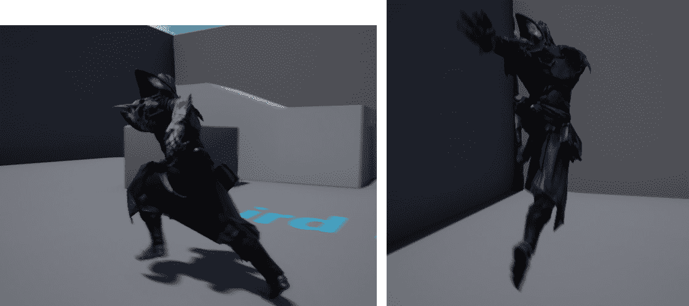

图 2.48：活动 2.01 预期输出（左：奔跑；右：跳跃）

注意

此活动的解决方案可以在以下链接找到：[`packt.live/338jEBx`](https://packt.live/338jEBx)。

通过完成这个活动，你现在知道如何在虚幻引擎中导航项目、调试代码和处理动画。你还了解了状态机，它代表了动画状态和过渡之间的转换，以及在该过渡中使用的 Blend Spaces 1D。你现在能够根据游戏事件和输入为 3D 模型添加动画。

# 摘要

总结本章，我们首先学习了如何创建一个空项目。然后，我们了解了文件夹结构以及如何在项目目录中组织文件。之后，我们看了基于模板的项目。我们还学会了如何在代码中设置断点，以便在游戏运行时观察变量值并调试整个对象，这将帮助我们找到并消除代码中的错误。

此外，我们还了解了游戏模式、玩家角色和玩家控制器是虚幻引擎中用于设置游戏流程（代码执行顺序）的相关类，以及它们在项目中的设置方式。

最后，我们转向动画基础知识，并使用状态机、混合空间 1D 和动画蓝图，根据键盘输入使我们的角色在游戏中执行动画（行走/奔跑和跳跃）。

在整个本章中，我们更加熟悉了虚幻引擎中强大的工具，这些工具对游戏开发至关重要。虚幻的游戏模式及其默认类对于在虚幻引擎中制作任何类型的游戏或体验都是必需的。此外，动画为角色赋予生命，并帮助增加游戏内的沉浸感。所有游戏工作室都有动画、角色和游戏逻辑，因为这些是推动任何游戏的核心组件。这些技能将在你的游戏开发之旅中帮助你很多次。

在下一章中，我们将讨论虚幻引擎中的`Character`类，它的组件以及如何扩展该类进行额外的设置。你将进行各种练习，然后进行一项活动。
