# 3. 角色类组件和蓝图设置

概述

本章将重点讨论 C++中的`Character`类。您将学习如何在 C++中扩展`Character`类，然后通过继承在蓝图中进一步扩展这个新创建的`Character`类。您还将处理玩家输入和一些移动逻辑。

在本章结束时，您将能够理解 UE4 中的类继承是如何工作的，以及如何利用它来获得优势。您还将能够使用轴和动作输入映射，这在驱动与玩家相关的输入逻辑中非常关键。

# 介绍

在上一章中，我们学习了如何创建空项目和导入文件，使用哪种文件夹结构，以及如何处理动画。在本章中，我们将探索一些其他关键工具和功能，这些工具和功能在使用虚幻引擎时会用到。

游戏开发人员经常需要使用一些工具，这些工具可以节省他们构建游戏功能时的时间和精力。虚幻引擎强大的对象继承能力为开发人员提供了更高效的优势。开发人员还可以交替使用 C++和蓝图，并在开发游戏时充分利用它们。

开发人员获得的另一个增值好处是能够扩展代码以供以后在项目中使用。假设您的客户有新的要求，这些要求建立在旧的要求之上（这在大多数游戏工作室都是这样的情况）。现在，为了扩展功能，开发人员只需继承一个类并向其添加更多功能，以快速获得结果。这是非常强大的，在许多情况下都很方便。

在本章中，我们将讨论虚幻`Character`类，创建 C++代码，然后在蓝图中扩展它，最后使用它来创建游戏角色。

# 虚幻角色类

在我们谈论虚幻`Character`类之前，让我们简要地谈一下继承的概念。如果您习惯使用 C++或其他类似的语言，您应该已经熟悉这个概念。继承是一个类从另一个类中继承特性和行为的过程。一个 C++类可以被扩展以创建一个新的类 - 派生类 - 它保留了基类的属性，并允许修改这些属性，或者添加新的特性。`Character`类就是一个例子。

`Character`类是一种特殊类型的 pawn，是虚幻`Pawn`类的后代。在扩展`Pawn`类的基础上，`Character`类默认具有一些移动能力，以及一些输入，可以为角色添加移动。作为标准，`Character`类使用户能够让角色在创建的世界中行走、奔跑、跳跃、飞行和游泳。

由于`Character`类是`Pawn`类的扩展，它包含了所有的 pawn 的代码/逻辑，开发人员可以扩展这个类以添加更多功能。当扩展`Character`类时，它的现有组件会作为继承组件传递到扩展类中。（在这种情况下，Capsule 组件、Arrow 组件和 Mesh）。

注意

继承组件无法被移除。它们的设置可以被改变，但添加到基类的组件将始终存在于扩展类中。在这种情况下，基类是`Pawn`类，而扩展（或子）类是`Character`类。

`Character`类提供以下继承组件：

+   **Capsule 组件**：这是作为“原点”的根组件，其他组件在层次结构中附加到它上面。这个组件也可以用于碰撞，并且以胶囊的形式逻辑地勾勒出许多角色形式（特别是人形角色）。

+   `隐藏`当游戏开始时，但可以调整为可见。如果需要，此组件可用于调试和调整游戏逻辑。

+   `Character`类。在这里可以设置角色将采取的形式的骨骼网格，以及所有相关变量，包括动画、碰撞等。

大多数开发人员通常更喜欢在 C++中编写游戏和角色逻辑，并将该类扩展到蓝图，以便他们可以执行其他简单的任务，比如将资产连接到类。例如，开发人员可以创建一个从`Character`类继承的 C++类，在该类中编写所有移动和跳跃逻辑，然后使用蓝图扩展此类，在其中开发人员可以使用所需的资产（如骨骼网格和动画蓝图）更新组件，并可选择在蓝图中编写其他功能。

## 扩展 Character 类

当 C++或蓝图继承时，`Character`类会被扩展。这个扩展的`Character`类将成为`Character`类的子类（*也称为其父类*）。类扩展是面向对象编程的一个强大部分，类可以被扩展到很深的层次和层次结构。

## 练习 3.01：创建和设置第三人称角色 C++类

在此练习中，您将创建一个基于`Character`类的 C++类。您还将初始化将在扩展此`Character`类的类的默认值中设置的变量。

以下步骤将帮助您完成此练习：

1.  启动 Unreal Engine，选择`Games`类别，然后单击`Next`按钮。

1.  选择`Blank`，然后单击`Next`按钮。

1.  选择`C++`作为项目类型，将项目名称设置为`MyThirdPerson`，选择适当的项目目录，然后单击`Create Project`按钮。

1.  *右键单击*`Content Browser`界面，然后单击`New C++ Class`按钮：

1.  在打开的对话框中，选择`Character`作为类类型，然后单击`Next`按钮。

1.  将其命名为`MyThirdPersonChar`，然后点击`Create Class`按钮。

1.  这样做后，Visual Studio 将打开`MyThirdPersonChar.cpp`和`MyThirdPersonChar.h`选项卡。

注意

在某些系统上，可能需要以管理员权限运行 Unreal Engine 编辑器，以自动打开新创建的 C++文件的 Visual Studio 解决方案。

1.  打开`MyThirdPersonChar.h`选项卡，在`GENERATED_BODY()`文本下添加以下代码：

```cpp
    // Spring arm component which will act as a placeholder for   the player camera
    UPROPERTY(VisibleAnywhere, BlueprintReadOnly, Category =   MyTPS_Cam, meta = (AllowPrivateAccess = "true"))
    class USpringArmComponent* CameraBoom;
    // Follow camera
    UPROPERTY(VisibleAnywhere, BlueprintReadOnly, Category =   MyTPS_Cam, meta = (AllowPrivateAccess = "true"))
    class UCameraComponent* FollowCamera;
    ```

在上述代码中，我们声明了两个组件：`Camera`本身和`Camera boom`，它充当了玩家与摄像机之间的某个距离的占位符。这些组件将在*步骤 11*中在构造函数中初始化。

1.  在`MyThirdPersonChar.h`文件的`#include "CoreMinimal.h"`下的包含部分中添加以下内容：

```cpp
    #include "GameFramework/SpringArmComponent.h"
    #include "Camera/CameraComponent.h"
    ```

1.  现在，转到`MyThirdPersonChar.cpp`选项卡，在`#include MyThirdPersonChar.h`代码后添加以下包含：

```cpp
    #include "Components/CapsuleComponent.h"
    #include "GameFramework/CharacterMovementComponent.h"
    ```

在上述代码片段中，代码将相关类添加到类中，这意味着我们现在可以访问其方法和定义。

1.  在`AMyThirdPersonChar::AMyThirdPersonChar()`函数中，添加以下行：

```cpp
    // Set size for collision capsule
    GetCapsuleComponent()->InitCapsuleSize(42.f, 96.0f);
    // Don't rotate when the controller rotates. Let that just   affect the camera.
    bUseControllerRotationPitch = false;
    bUseControllerRotationYaw = false;
    bUseControllerRotationRoll = false;
    // Configure character movement
    GetCharacterMovement()->bOrientRotationToMovement = true;
    // Create a camera boom (pulls in towards the   player if there is a collision)
    CameraBoom =   CreateDefaultSubobject<USpringArmComponent>(TEXT("CameraBoom"));
    CameraBoom->SetupAttachment(RootComponent);
    CameraBoom->TargetArmLength = 300.0f;
    CameraBoom->bUsePawnControlRotation = true; 
    // Create a camera that will follow the character
    FollowCamera =   CreateDefaultSubobject<UCameraComponent>(TEXT("FollowCamera"));
    FollowCamera->SetupAttachment(CameraBoom,   USpringArmComponent::SocketName);
    FollowCamera->bUsePawnControlRotation = false;
    ```

上述代码片段的最后一行将设置摄像机与角色的旋转绑定。这意味着摄像机应该随着与该角色关联的玩家控制器的旋转而旋转。

1.  返回 Unreal Engine 项目，点击顶部栏的`Compile`按钮：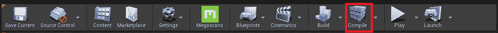

图 3.1：Unreal Editor 顶部栏上的编译按钮

在右下角应该出现`Compile Complete!`消息。

注意

您可以在 GitHub 上的`Chapter03` -> `Exercise3.01`目录中找到已完成的练习代码文件，链接如下：[`packt.live/3khFrMt`](https://packt.live/3khFrMt)。

解压`.rar`文件后，*双击*`.uproject`文件。你会看到一个提示，询问`是否要立即重建？`。点击该提示上的`是`，这样它就可以构建必要的中间文件，然后应该会自动在 Unreal Editor 中打开项目。

通过完成这个练习，你学会了如何扩展`Character`类。你还学会了如何初始化`Character`类的默认组件，并且学会了如何在 Unreal Editor 中编译更新的代码。接下来，你将学会如何扩展你在蓝图中创建的 C++类，以及在许多情况下为什么这是可行的。

# 用蓝图扩展 C++类

如前所述，大多数开发人员将 C++代码逻辑扩展到蓝图中，以便将其与他们将使用的资产联系起来。这样做是为了实现比在代码中查找和设置资产更容易的资产分配。此外，它还使开发人员能够利用强大的蓝图功能，如时间轴、事件和即用型宏，与他们的 C++代码结合使用，以实现在 C++和蓝图一起开发的最大效益。

到目前为止，我们已经创建了一个 C++ `Character`类。在其中，我们设置了组件和移动能力。现在，我们想要指定将在我们的类中使用的资产，并添加输入和移动能力。为此，最好是用蓝图进行扩展并在那里设置选项。这就是我们将在接下来的练习中要做的事情。

## 练习 3.02：用蓝图扩展 C++

在这个练习中，你将学会如何扩展你用蓝图创建的 C++类，以在现有的 C++代码之上添加蓝图代码。你还将添加输入按键绑定，这将负责移动角色。

以下步骤将帮助你完成这个练习：

1.  下载并提取`Chapter03` *|* `Exercise3.02` *|* `ExerciseFiles`目录中的所有内容，这些内容可以在 GitHub 上找到。

注意

`ExerciseFiles`目录可以在以下链接的 GitHub 上找到：[`packt.live/2GO0dG8`](https://packt.live/2GO0dG8)。

1.  浏览到我们在*练习 3.01*中创建的`MyThirdPerson`项目内的`Content`文件夹。

1.  复制我们在*步骤 1*中创建的`MixamoAnimPack`文件夹，并将其粘贴到我们在*步骤 2*中打开的`Content`文件夹目录中，如下图所示：

注意

`MixamoAnimPack`资产是通过以下链接从 Epic 市场获得的：[`www.unrealengine.com/marketplace/en-US/product/mixamo-animation-pack`](https://www.unrealengine.com/marketplace/en-US/product/mixamo-animation-pack)。

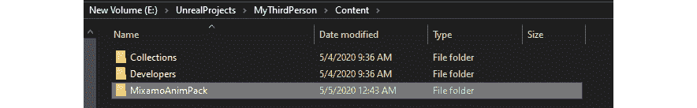

图 3.2：MixamoAnimPack 放置在项目目录中

1.  打开项目。在`Content Browser`界面内*右键单击*，然后点击`Blueprint Class`。

1.  在`搜索`对话框中输入`GameMode`，*右键单击*与名称匹配的类，然后点击`选择`按钮。查看下面的截图：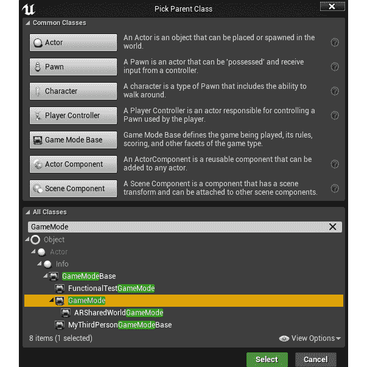

图 3.3：创建 GameMode 类

1.  在*步骤 6*中创建的蓝图命名为`BP_GameMode`。

1.  现在，重复*步骤 5*。

1.  在搜索框中，输入`MyThirdPersonChar`，选择该类，然后*右键单击*`选择`按钮。

1.  在*步骤 9*中创建的蓝图命名为`BP_MyTPC`。

1.  在`World Settings`选项卡中，点击`GameMode Override`旁边的`None`选项，然后选择`BP_GameMode`：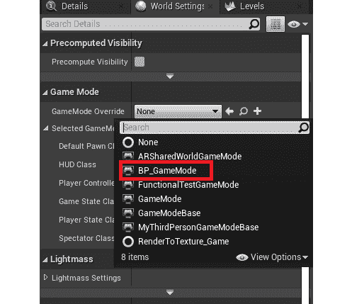

图 3.4：在世界设置中指定游戏模式

1.  将`Default Pawn Class`设置为`BP_MyTPC`：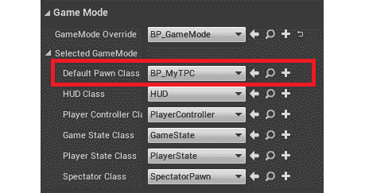

图 3.5：在游戏模式中指定默认角色类

1.  打开`BP_MyTPC`，在左侧的`Components`选项卡的层次结构中点击`Mesh (Inherited)`组件。

1.  在“详细信息”选项卡中，找到“网格”部分，并将“骨骼网格”设置为`Maximo_Adam`。

注意

骨骼网格和动画将在*第十三章*中深入讨论，*混合空间 1D，按键绑定和状态机*。

1.  在“详细信息”选项卡中，找到“动画”部分，并将“动画类”设置为`MixamoAnimBP_Adam_C`。您会注意到当选择时，此类名称会以`_C`结尾。这基本上是 UE4 创建的蓝图的实例。在工作项目/构建中，蓝图通常以这种方式结尾，以区分蓝图类和该类的实例。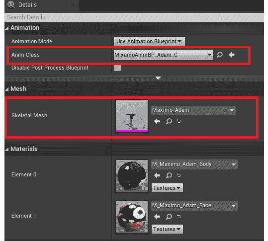

图 3.6：设置动画类和骨骼网格

1.  从顶部菜单中，转到“编辑”下拉菜单，单击“项目设置”。

1.  单击“输入”部分，该部分位于“引擎”部分中：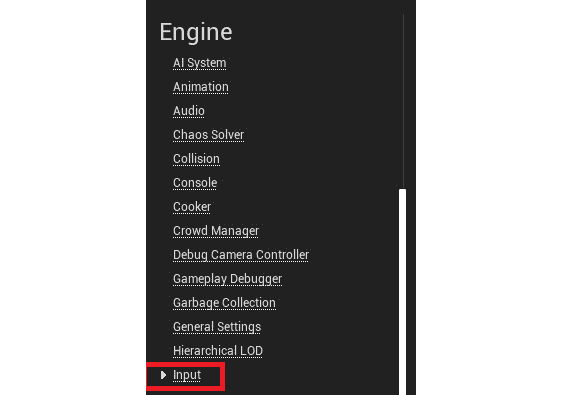

图 3.7：项目设置的输入部分

1.  在“绑定”部分，单击“轴映射”旁边的`+`图标并展开该部分。

注意

动作映射是执行单个按键操作的动作，例如跳跃、冲刺或奔跑，而轴映射是分配的浮点值，将根据用户的按键返回浮点值。这在游戏手柄或 VR 手柄的情况下更相关，其中模拟拇指杆起作用。在这种情况下，它将返回拇指杆状态的浮点值，这对于管理玩家移动或相关功能非常重要。

1.  将`NewAxisMapping_0`重命名为`MoveForward`。

1.  在`MoveForward`部分，单击下拉菜单并选择`W`。

1.  单击`MoveForward`图标旁边的`+`图标以添加另一个字段。

1.  将新字段设置为`S`。将其比例设置为`-1.0`（因为我们希望使用`S`键向后移动）。

1.  通过重复*步骤 18*创建另一个轴映射，命名为`MoveRight`，并添加两个字段——`A`为比例-1.0，`D`为比例 1.0：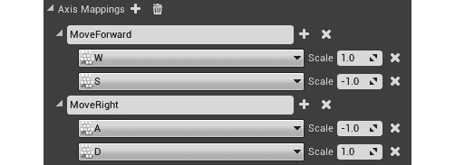

图 3.8：移动轴映射

1.  打开`BP_MyTPC`并单击“事件图”选项卡：

图 3.9：事件图标签

1.  *右键单击*图表内任意位置，键入`MoveForward`，并选择第一个节点选项：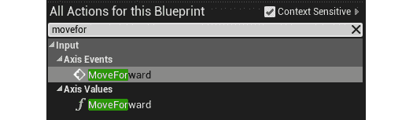

图 3.10：MoveForward 轴事件

1.  *右键单击*图表内，搜索“获取控制旋转”，并选择第一个节点选项。

注意

由于与玩家相关联的摄像机可以选择不显示角色的偏航、翻滚或俯仰，“获取控制旋转”给予角色完整的瞄准旋转。这在许多计算中很有用。

1.  *左键单击*并从“获取控制旋转”节点的“返回值”处拖动，搜索“断裂旋转器”，并选择它。

1.  *右键单击*图表内，搜索“创建旋转器”，并选择第一个节点选项。

1.  将“断裂旋转器”中的`Z`（偏航）节点连接到“创建旋转器”节点的`Z`（偏航）节点。

注意

使“旋转器”创建一个具有俯仰、翻滚和偏航值的旋转器，而断裂旋转器将一个旋转器分解为其组件（翻滚、俯仰和偏航）。

1.  *左键单击*并从“创建旋转器”节点的“返回值”处拖动，搜索“获取前向矢量”，并选择它。

1.  *左键单击*并从“获取前向矢量”节点的“返回值”处拖动，搜索“添加移动输入”，并选择它。

1.  将`InputAxis MoveForward`节点中的“轴值”节点连接到“添加移动输入”节点中的“比例值”节点。

1.  最后，将`InputAxis MoveForward`节点的白色“执行”引脚连接到“添加移动输入”节点。

1.  *右键单击*图表内，搜索`InputAxis MoveRight`，并选择第一个节点选项。

1.  *左键单击*并从“创建旋转器”节点的“返回值”处拖动，搜索“获取右矢量”，并选择它。

1.  从`Get Right Vector`节点的`Return Value`处进行*左键单击*并拖动，搜索`Add Movement Input`，并选择它。

1.  将`InputAxis MoveRight`节点中的`Axis Value`引脚连接到我们在上一步中创建的`Add Movement Input`节点中的`Scale Value`引脚。

1.  最后，将`InputAxis MoveRight`节点中的`白色执行`引脚连接到我们在*步骤 36*中添加的`Add Movement Input`节点：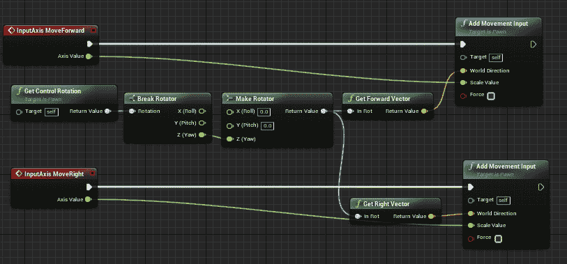

图 3.11：移动逻辑

1.  现在，转到`视口`选项卡。在这里，您会看到角色的正面没有指向箭头的方向，并且角色在胶囊组件上方。单击`Mesh`组件，选择位于视口顶部的对象平移节点。然后，拖动网格上的箭头进行调整，使脚与胶囊组件底部对齐，并且网格旋转以指向箭头：

图 3.12：平移旋转和比例选择器部分

一旦角色在胶囊中对齐，它将显示如下截图：

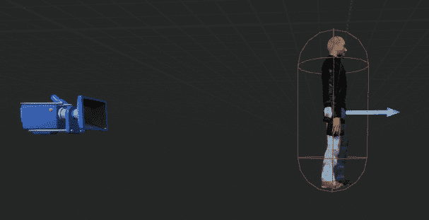

图 3.13：在胶囊组件内调整网格

1.  在`工具栏`菜单中，点击`编译`按钮，然后点击`保存`。

1.  返回到地图选项卡，点击`播放`按钮以查看游戏中的角色。使用*W*、*A*、*S*和*D*键来移动。

注意

您可以在 GitHub 上的`Chapter03` -> `Exercise3.02`目录中找到已完成的练习代码文件，链接如下：[`packt.live/3keGxIU`](https://packt.live/3keGxIU)。

解压`.rar`文件后，双击`.uproject`文件。您会看到一个提示询问“是否要立即重建？”。点击该提示上的“是”，这样它就可以构建必要的中间文件，之后应该会自动在虚幻编辑器中打开项目。

通过完成这个练习，您现在能够理解如何使用蓝图扩展 C++代码，以及为什么在许多情况下这对开发人员是有利的。您还学会了如何添加输入映射以及它们如何用于驱动与玩家相关的输入逻辑。

在本章的活动中，您将结合本章前面练习中所学到的技能，并扩展您在*第 2.01 活动，将动画链接到角色*活动中完成的项目。这将使您能够构建自己创建的蓝图，并了解它如何映射到现实世界的场景。

## 活动 3.01：在动画项目中使用蓝图扩展 C++角色类

现在，您已经创建了一个 C++类并将其与蓝图扩展，是时候将这两个概念结合到一个真实的场景中了。在这个活动中，您的目标是使我们在*第 2.01 活动*中的角色，*Mixamo 角色动画*，在键盘上使用*空格键*跳跃。但是，您需要从头开始在 C++中创建`Character`类，然后稍后将其扩展为蓝图以达到最终目标。

以下步骤将帮助您完成此活动： 

1.  打开*Activity 2.01*，*Mixamo 角色动画*的项目。

1.  在 C++中创建一个`Character`类，该类将初始化角色变量，包括与玩家相关联的摄像机。

1.  将跳跃输入映射到项目设置中的*空格键*。

1.  使用蓝图扩展创建的 C++类，以添加相关资产和跳跃功能。

预期输出：

当您按下*空格键*时，角色应该能够跳跃。关卡应该使用扩展了 C++ `Character`类的蓝图：

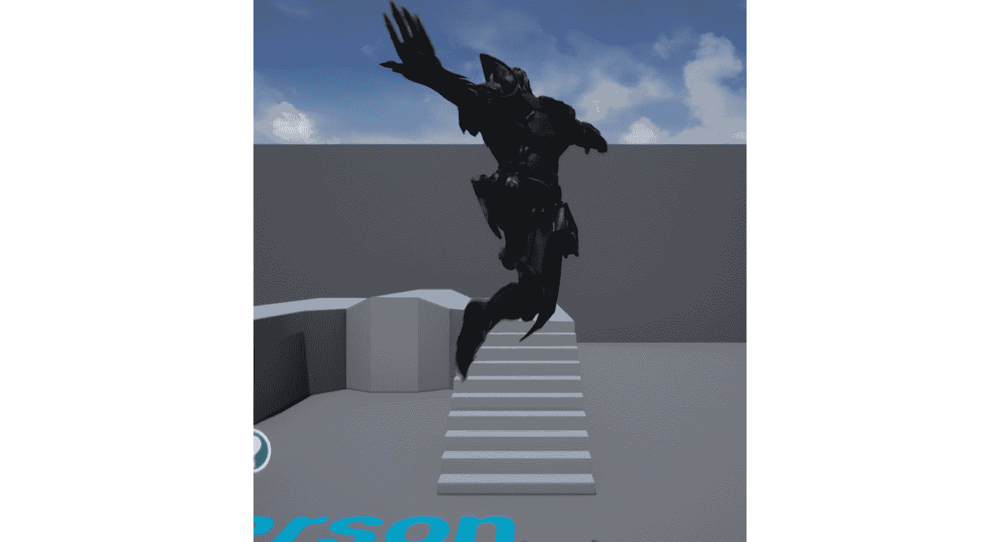

图 3.14：Ganfault 跳跃活动预期输出

注意

此活动的解决方案可在以下网址找到：[`packt.live/338jEBx`](https://packt.live/338jEBx)。

通过完成这项活动，您已经了解了在蓝图中扩展 C++代码以实现功能和逻辑的场景。这种 C++和蓝图的结合是游戏开发者在虚幻引擎中创作精湛和独特游戏的最强大工具。

# 总结

在本章中，您学习了如何创建一个 C++的`Character`类，为其添加初始化代码，然后使用蓝图来扩展它以设置资产并添加额外的代码。

结果遵循了 C++代码以及蓝图代码，并可以在任何有意义的场景中使用。

您还学习了如何设置与*W*、*A*、*S*和*D*键映射的轴映射，以移动玩家（这是许多游戏中默认的移动映射）。您还学习了如何使角色在游戏中跳跃。

在下一章中，您将深入探讨输入映射以及如何在虚幻编辑器中使用移动预览器。这将帮助您创建具有稳定输入映射到游戏和玩家逻辑的游戏。它还将允许您快速测试您的游戏在移动设备上的外观和感觉，所有这些都在虚幻编辑器中完成。
