# 第四章：玩家输入

概述

本章将解决玩家输入的主题。我们将学习如何将玩家的按键或触摸输入与游戏中的动作（如跳跃或移动）关联起来。

在本章结束时，您将了解“动作映射”和“轴映射”，如何创建和修改它们，如何监听每个映射，如何在按下和释放时执行游戏中的动作，以及如何预览您的游戏，就像您在移动设备上玩一样。

# 介绍

在上一章中，我们创建了一个从`Character`类继承的 C++类，并添加了所有必要的`Actor`组件，以便能够从该角色的视角看到游戏，并且能够看到角色本身。然后，我们创建了一个从该 C++类继承的“蓝图”类，以便可以直观地设置所有必要的组件。我们还简要了解了动作和轴映射。

在本章中，我们将更深入地讨论这些主题，并涵盖它们在 C++中的使用。我们将了解玩家输入在 UE4 中的工作原理，引擎如何处理输入事件（按键按下和释放），以及我们如何利用它们来控制游戏中的逻辑。

让我们从了解 UE4 如何将玩家按下的键抽象出来开始本章，以便更容易地通知您这些事件。

注意

在本章中，我们将使用我们在上一章中创建的`Character`蓝图的另一个版本，称为`BP_MyTPC`。本章的版本将具有默认的 UE4 Mannequin 网格，而不是来自 Mixamo 的网格。

# 输入动作和轴

玩家输入是区分视频游戏与其他娱乐媒体的因素：它们是互动的事实。要使视频游戏具有互动性，必须考虑玩家的输入。许多游戏通过允许玩家控制虚拟角色来实现这一点，该角色根据玩家按下的键和按钮在虚拟世界中行动，这正是我们将在本章中要做的事情。

如今，大多数游戏开发工具都允许您将按键抽象为动作和轴，这使您可以将名称（例如“跳跃”）与多种不同的玩家输入（按下按钮，轻扫摇杆等）关联起来。动作和轴的区别在于，动作用于二进制输入（可以按下或释放的输入，如键盘上的键），而轴用于标量或连续输入（即可以具有一系列值的输入，如摇杆，可以在“x”和“y”轴上从“-1”到`1`）。

例如，如果您正在制作一款赛车游戏，在该游戏中，您越拉动游戏手柄的右扳机按钮，汽车就会加速得越快，那将是一个“轴”，因为它的值可以在 0 到 1 之间变化。但是，如果您希望玩家能够暂停游戏，那将是一个动作，因为它只需要知道玩家是否按下了某个特定的键。

通常，当玩家明确按下“空格键”时，使玩家角色跳跃并不是一个很好的主意，而是在按下“跳跃”动作时使玩家跳跃。然后，可以在其他地方编辑此“跳跃”动作的相关键，以便开发人员和玩家都可以轻松更改导致玩家角色跳跃的键。这就是 UE4 允许您指定玩家输入事件的方式（尽管您也可以监听明确的按键，但这通常不是最佳选择）。

打开您的 UE4 项目并转到“项目设置”窗口。您可以通过单击编辑器左上角的“编辑”，然后选择“项目设置…”，或者单击编辑器工具栏中的“设置”，然后选择“项目设置…”来执行此操作。

此窗口将允许您修改与项目相关的多个设置，涵盖各种类别。如果您在`Project Settings`的左边缘向下滚动，您应该会在`Engine`类别下找到`Input`选项，它将带您到项目的输入设置。点击此选项。

这样做时，您应该会看到窗口右边的输入设置，您将能够访问项目的`Action Mappings`和`Axis Mappings`等内容：


图 4.1：输入设置窗口中可用的 Action 和 Axis Mappings

`Action Mappings`属性允许您在项目中指定动作列表（例如*跳跃*动作）及其对应的键（例如*空格键*）。

`Axis Mappings`允许您做同样的事情，但适用于没有二进制值（按下或释放）而是具有连续值的键，比如控制器上的摇杆，其值可以在*x*和*y*轴上从`–1`到`1`，或者控制器上的扳机按钮，其值可以在`0`到`1`之间。

例如，考虑 Xbox One 控制器，可以分解为以下部分：

+   `左摇杆`，通常用于控制游戏中的移动

+   `Dpad`，可用于控制移动，以及具有各种其他用途

+   `右摇杆`，通常用于控制相机和视角

+   `Face buttons (X, Y, A, and B)`，根据游戏可以有各种用途，但通常允许玩家在游戏世界中执行动作

+   `Bumpers and Triggers (LB, RB, LT, and RT)`，可用于瞄准和射击或加速和刹车等动作

如果您愿意，还可以将二进制键设置为轴；例如，为玩家角色的移动设置游戏手柄摇杆（连续键，其值从`–1`到`1`）和键盘上的两个二进制键（*W*和*S*）。

我们将在本章中看看如何做到这一点。

当我们在*第一章* *虚幻引擎介绍*中生成了`Third Person`模板项目时，它已经配置了一些输入，包括*W*、*A*、*S*和*D*键，以及用于移动的`左手柄摇杆`，以及用于跳跃的`空格键`和`游戏手柄底部面`按钮。

现在让我们在下一个练习中添加新的`Action`和`Axis Mappings`。

## 练习 4.01：创建跳跃动作和移动轴

在这个练习中，我们将为*跳跃*动作添加一个新的`Action Mapping`，以及为*移动*动作添加一对新的`Axis Mappings`。

要实现这一点，请按照以下步骤进行：

1.  打开`Input Settings`菜单。

1.  点击`Action Mappings`属性右侧的`+`图标以创建一个新的`Action Mapping`：

图 4.2：添加新的 Action Mapping

1.  这样做时，您应该会看到一个名为`NewActionMapping_0`的新`Action Mapping`，映射到`None`键（*表示它未映射到任何键*）：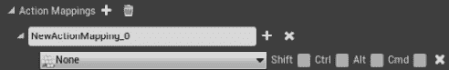

图 4.3：新 Action Mapping 的默认设置

1.  将此映射的名称更改为`Jump`，并将与之关联的键更改为`空格键`。

要更改与此动作映射的键，您可以点击当前设置为`None`键的下拉属性，输入`空格键`，并选择第一个选项：

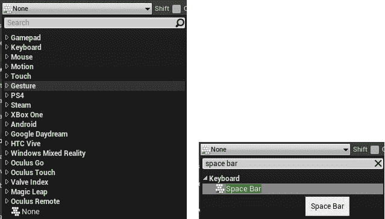

图 4.4：键下拉菜单（顶部），其中选择了空格键（底部）

1.  您可以指定当玩家按住修饰键`Shift`、`Ctrl`、`Alt`或`Cmd`时是否要执行此操作，通过勾选它们各自的适当复选框。您还可以通过单击`X`图标将此键从`Action Mapping`中移除：

图 4.5：键下拉菜单和指定修饰键的选项以及从这个 Action Mapping 中移除这个键

1.  要向`Action Mapping`添加新的键，您可以简单地点击该`Action Mapping`名称旁边的`+`图标，要完全删除`Action Mapping`，您可以点击其旁边的`x`图标：

图 4.6：Action Mapping 的名称，旁边是+和 x 图标

现在让我们使用控制器按钮来映射到这个`Action Mapping`。

因为大多数游戏手柄的键位非常相似，UE4 使用`Gamepad`前缀将它们的大部分键抽象为通用术语。

1.  向这个`Action Mapping`添加一个新的键，并将这个新的键设置为`Gamepad Face Button Bottom`键。如果您使用的是 Xbox 控制器，这将是`A`按钮，如果您使用的是 PlayStation 控制器，这将是`X`按钮：

图 4.7：Gamepad Face Button Bottom 键添加到 Jump Action Mapping

现在我们已经设置好了我们的`Jump` `Action Mapping`，让我们设置我们的`Movement Axis Mapping`。

1.  点击`Axis Mappings`属性旁边的`+`图标，添加一个新的`Axis Mapping`。这个新的`Axis Mapping`将用于使角色左右移动。将其命名为`MoveRight`，并将其分配给`Gamepad Left Thumbstick X-Axis`键，以便玩家可以使用左手柄的*x*轴来使角色左右移动：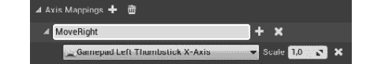

图 4.8：MoveRight 轴映射与与之关联的 Gamepad Left Thumbstick X-Axis 键

如果您看到我们分配的键的右侧，您应该看到该键的`Scale`属性，该属性将允许您反转轴，使玩家在将拇指杆向右倾斜时向左移动，反之亦然，并增加或减少轴的灵敏度。

为了允许玩家使用键盘上的左右移动键（这些键要么按下要么释放，并不像拇指杆那样具有连续值），我们将不得不添加两个具有反向值的键。

向这个`Axis Mapping`添加两个新的键，第一个是`D`键，`Scale`为`1`，第二个是`A`键，`Scale`为`-1`。这将导致玩家按下`D`键时角色向右移动，按下`A`键时角色向左移动：

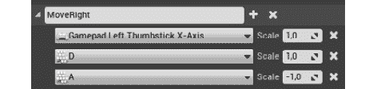

图 4.9：MoveRight 轴映射，同时具有 Gamepad 和键盘键

1.  在这样做之后，添加另一个名为`MoveForward`的`Axis Mapping`，使用`Gamepad Left Thumbstick Y-Axis`，`W`和`S`键，后者的`Scale`为`-1`。这个轴将用于使角色前后移动：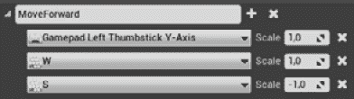

图 4.10：MoveForward 轴映射

完成了这些步骤后，我们完成了本章的第一个练习，您已经学会了如何在 UE4 中指定`Action`和`Axis` `Mappings`，从而使您可以抽象出哪些键负责哪些游戏内操作。

现在让我们来看看 UE4 如何处理玩家输入并在游戏中进行处理。

# 处理玩家输入

让我们想象一个情况，玩家按下与“空格键”相关联的*Jump*动作，使玩家角色跳跃。在玩家按下“空格键”和游戏使玩家角色跳跃之间，有很多事情要连接这两个事件。

让我们看看从一个事件到另一个事件所需的所有步骤：

1.  硬件输入：玩家按下“空格键”。UE4 将监听此按键事件。

1.  `PlayerInput`类：在按键被按下或释放后，这个类将把该按键转换为一个动作或轴。如果有一个与该按键相关联的动作或轴，它将通知所有监听该动作的类，该按键刚刚被按下、释放或更新。在这种情况下，它将知道“空格键”与*Jump*动作相关联。

1.  `Player Controller`类：这是第一个接收这些事件的类，因为它用于代表游戏中的玩家。

1.  `Pawn`类：这个类（因此也是从它继承的`Character`类）也可以监听这些事件，只要它们被玩家控制器所控制。如果是这样，它将在该类之后接收这些事件。在本章中，我们将使用我们的`Character`C++类来监听动作和轴事件。

现在我们知道 UE4 如何处理玩家输入，让我们来看看`DefaultInput.ini`文件以及它的工作原理。

# DefaultInput.ini

如果您进入项目的目录，使用文件资源管理器，然后打开其`Config`文件夹，您会在其中找到一些`.ini`文件，其中之一应该是`DefaultInput.ini`文件。顾名思义，这个文件保存了与输入相关的主要设置和配置。

在本章的第一个练习中，我们编辑了项目的“输入”设置，实际上是编辑器在写入和读取`DefaultInput.ini`文件。

在您选择的文本编辑器中打开此文件。它包含许多属性，但我们现在要查看的是`Action Mappings`和`Axis Mappings`列表。在文件末尾附近，您应该看到，例如，*Jump*动作在此文件中被指定为：

```cpp
+ActionMappings=(ActionName="Jump",bShift=False,bCtrl=False,  bAlt=False,bCmd=False,Key=SpaceBar)
+ActionMappings=(ActionName="Jump",bShift=False,bCtrl=False,  bAlt=False,bCmd=False,Key=Gamepad_FaceButton_Bottom)
```

您还可以看到一些轴被指定，比如`MoveRight`轴：

```cpp
+AxisMappings=(AxisName="MoveRight",Scale=1.000000,  Key=Gamepad_LeftX)
+AxisMappings=(AxisName="MoveRight",Scale=1.000000,Key=D)
+AxisMappings=(AxisName="MoveRight",Scale=-1.000000,Key=A)
```

您可以直接编辑此文件以添加、修改和删除`Action Mappings`和`Axis Mappings`，而不是编辑项目的“输入设置”，尽管这不是一个非常用户友好的方式。请记住，当您将项目打包到可执行文件时，此文件也将可用，这意味着玩家可以根据自己的喜好编辑此文件。

让我们现在看看如何在 C++中监听`Action Mappings`和`Axis Mappings`。

## 练习 4.02：监听移动动作和轴

在这个练习中，我们将使用 C++将我们在上一节中创建的动作和轴注册到我们的角色类中，通过将这些动作和轴绑定到我们角色类中的特定函数。

对于`Player Controller`或`Character`来监听动作和轴，主要的方法是使用`SetupPlayerInputComponent`函数注册`Action`和`Axis`委托。 `MyThirdPersonChar`类应该已经有一个声明和实现这个函数。让我们的角色类通过以下步骤监听这些事件：

1.  在 Visual Studio 中打开`MyThirdPersonChar`类头文件，并确保有一个名为`SetupPlayerInputComponent`的`protected`函数的声明，它返回空，并接收一个`class UInputComponent* PlayerInputComponent`属性作为参数。这个函数应该被标记为`virtual`和`override`：

```cpp
virtual void SetupPlayerInputComponent(class UInputComponent*   PlayerInputComponent) override;
```

1.  打开这个类的源文件，并确保这个函数有一个实现：

```cpp
void AMyThirdPersonChar::SetupPlayerInputComponent(class   UInputComponent* PlayerInputComponent)
{
}
```

1.  在其实现中，首先调用`PlayerInputComponent`属性的`BindAction`函数。这个函数允许这个类监听特定的动作，这种情况下是`Jump`动作。它接收以下参数：

+   `FName ActionName` - 我们想要监听的动作的名称；在我们的情况下是`Jump`动作。

+   `EInputEvent InputEvent` - 我们想要监听的特定按键事件，可以是按下、释放、双击等。在我们的情况下，我们想要监听按下事件，可以通过使用`IE_Pressed`值来指定。

+   `UserClass* Object` - 回调函数将在其上调用的对象；在我们的例子中是`this`指针。

+   `FInputActionHandlerSignature::TUObjectMethodDelegate< UserClass >::FMethodPtr Func` - 这个属性有点啰嗦，但本质上是一个指向当事件发生时将被调用的函数的指针，我们可以通过输入`&`后跟类名，后跟`::`，后跟函数名来指定。在我们的情况下，我们希望这是属于`Character`类的现有`Jump`函数，所以我们将用`&ACharacter::Jump`来指定它。

```cpp
PlayerInputComponent->BindAction("Jump", IE_Pressed, this,   &ACharacter::Jump);
```

注意

所有用于监听动作的函数都必须不接收任何参数，除非您使用`Delegates`，这超出了本书的范围。

1.  为了让角色停止跳跃，您需要复制这一行，然后将新行的输入事件更改为`IE_Released`，被调用的函数更改为`Character`类的`StopJumping`函数。

```cpp
PlayerInputComponent->BindAction("Jump", IE_Released, this,   &ACharacter::StopJumping);
```

1.  因为我们将使用`InputComponent`类，所以我们需要在源文件的顶部包含它：

```cpp
#include "Components/InputComponent.h"
```

1.  现在我们正在监听`Jump`动作，并且在执行该动作时使角色跳跃，让我们继续进行其移动。在类的头文件中，添加一个名为`MoveRight`的`protected`函数的声明，它不返回任何内容，并接收一个`float Value`参数。这个函数将在`MoveRight`轴的值更新时被调用。

```cpp
void MoveRight(float Value);
```

1.  在类的源文件中，添加这个函数的实现，我们将首先检查`Controller`属性是否有效（不是`nullptr`），以及`Value`属性是否不等于`0`：

```cpp
void AMyThirdPersonChar::MoveRight(float Value)
{
  if (Controller != nullptr && Value != 0.0f)
  {
  }
}
```

1.  如果这两个条件都为真，我们将使用`AddMovementInput`函数来移动我们的角色。这个函数的一个参数是角色移动的方向。为了计算这个方向，我们需要做两件事：

+   获取摄像机在*z*轴（偏航）上的旋转，以便我们根据摄像机的朝向移动角色。为了实现这一点，我们可以创建一个新的`FRotator`属性，俯仰（*y*轴上的旋转）和翻滚（*x*轴上的旋转）的值为`0`，属性的偏航值为摄像机当前的偏航值。要获取摄像机的偏航值，我们可以调用玩家控制器的`GetControlRotation`函数，然后访问它的`Yaw`属性。

```cpp
const FRotator YawRotation(0, Controller->  GetControlRotation().Yaw, 0);
const FVector Direction =   UKismetMathLibrary::GetRightVector(YawRotation);
```

现在我们可以调用`AddMovementInput`函数，传递`Direction`和`Value`属性作为参数。

```cpp
AddMovementInput(Direction, Value);
```

1.  因为我们将同时使用`KismetMathLibrary`和`Controller`对象，所以我们需要在这个源文件的顶部包含它们：

```cpp
#include "Kismet/KismetMathLibrary.h"
#include "GameFramework/Controller.h"
```

1.  在这个类的`SetupPlayerInputComponent`函数中监听`MoveRight`轴，通过调用`PlayerInputComponent`属性的`BindAxis`函数。这个函数用于监听轴而不是动作，其参数与`BindAction`函数的参数之间唯一的区别是它不需要接收`EInputState`参数。将`"MoveRight"`、`this`指针和这个类的`MoveRight`函数作为参数传递给这个函数。

```cpp
PlayerInputComponent->BindAxis("MoveRight", this,   &AMyThirdPersonChar::MoveRight);
```

注意

所有用于监听轴的函数都必须接收一个`float`属性作为参数，除非您使用`Delegates`，这超出了本书的范围。

现在让我们在这个类中监听`MoveForward`轴：

1.  在类的头文件中，添加一个类似于`MoveRight`函数的声明，但将其命名为`MoveForward`：

```cpp
void MoveForward(float Value);
```

1.  在类的源文件中，为这个新的`MoveForward`函数添加一个实现。将`MoveRight`函数的实现复制到这个新的实现中，但用其`GetForwardVector`函数的调用替换`KismetMathLibrary`对象的`GetRightVector`函数的调用。这将使用表示摄像头面向方向的向量，而不是其右向量，其面向右侧：

```cpp
void AMyThirdPersonChar::MoveForward(float Value)
{
  if (Controller != nullptr && Value != 0.0f)
  {
    const FRotator YawRotation(0, Controller->  GetControlRotation().Yaw, 0);
    const FVector Direction = UKismetMathLibrary::GetForwardVector(YawRotation);
    AddMovementInput(Direction, Value);
  }
}
```

1.  在`SetupPlayerInputComponent`函数的实现中，复制监听`MoveRight`轴的代码行，并将第一个参数替换为`"MoveForward"`，将最后一个参数替换为指向`MoveForward`函数的指针：

```cpp
PlayerInputComponent->BindAxis("MoveForward", this,   &AMyThirdPersonChar::MoveForward);
```

1.  现在编译您的代码，打开编辑器，并打开您的`BP_MyTPS`蓝图资产。删除`InputAction Jump`事件，以及与之连接的节点。对于`InputAxis MoveForward`和`InputAxis MoveRight`事件也做同样的操作。我们将在 C++中复制这个逻辑，并需要删除其蓝图功能，以便在处理输入时不会发生冲突。

1.  现在，播放关卡。您应该能够使用键盘的`W`、`A`、`S`和`D`键或控制器的左摇杆来移动角色，以及使用`Spacebar`键或`游戏手柄底部按钮`来跳跃：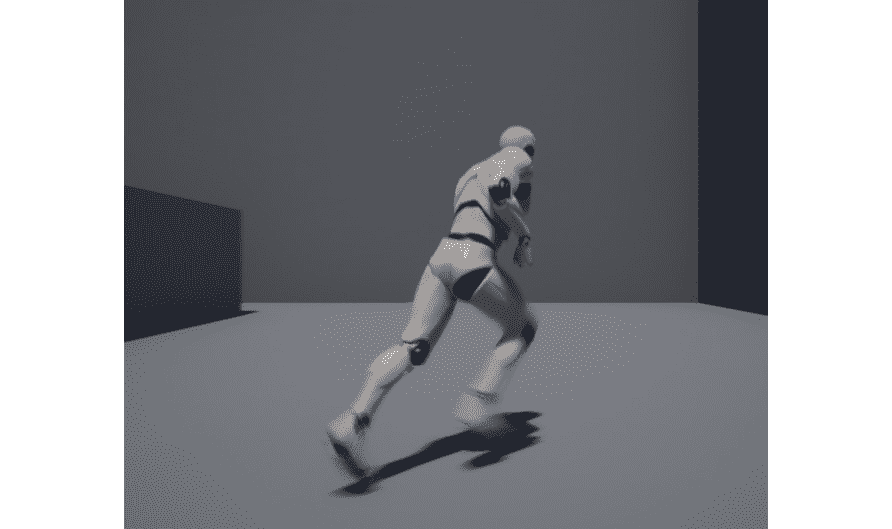

图 4.11：玩家角色移动

完成了所有这些步骤后，您已经完成了这个练习。现在您知道如何在 UE4 中使用 C++监听`Action`和`Axis`事件。

注意

您可以使用`PlayerInputComponent`属性的`BindKey`函数来监听特定的按键，而不是监听特定的`Action`或`Axis`。该函数接收与`BindAction`函数相同的参数，除了第一个参数应该是一个键而不是`FName`。您可以使用`EKeys`枚举后跟`::`来指定键。

现在，我们已经设置了所有必要的逻辑，使我们的角色移动和跳跃，让我们添加负责围绕角色旋转摄像头的逻辑。

# 围绕角色转动摄像头

摄像头是游戏中非常重要的一部分，因为它决定了玩家在整个游戏过程中看到的内容和方式。对于本项目来说，摄像头允许您不仅看到周围的世界，还可以看到您正在控制的角色。无论角色是否受到伤害、跌落或其他情况，玩家始终知道他们正在控制的角色的状态，并且能够使摄像头面向他们选择的方向是非常重要的。

与每个现代的第三人称游戏一样，我们将始终使摄像头围绕我们的玩家角色旋转。在*第二章*“使用虚幻引擎”中设置了`Camera`和`Spring Arm`组件之后，让我们继续添加两个新的“轴映射”，第一个称为`Turn`，与`Gamepad Right Thumbstick X-Axis`和`MouseX`键相关联，第二个称为`LookUp`，与`Gamepad Right Thumbstick Y-Axis`和`MouseY`键相关联，后者的比例为`-1`。

这些“轴映射”将用于使玩家向右和向左以及向上和向下查看：

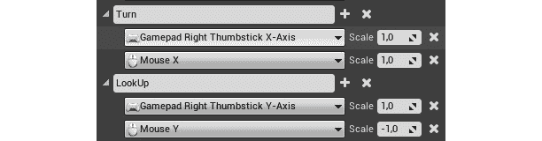

图 4.12：转动和 LookUp 轴映射

现在让我们添加负责根据玩家输入旋转摄像头的 C++逻辑。

转到`MyThirdPersonChar`类的`SetupPlayerInputComponent`函数实现，并将负责监听`MoveRight`轴或`MoveForward`轴的行重复两次。在第一行的副本中，将第一个参数更改为`"Turn"`，最后一个参数更改为`Pawn`类的`AddControllerYawInput`函数，而第二行的副本应该将第一个参数设置为`"LookUp"`，最后一个参数设置为`Pawn`类的`AddControllerPitchInput`函数。

这两个函数分别负责围绕*z*（左右转向）和*y*（上下查看）轴添加旋转输入：

```cpp
PlayerInputComponent->BindAxis("Turn", this,   &APawn::AddControllerYawInput);
PlayerInputComponent->BindAxis("LookUp", this,   &APawn::AddControllerPitchInput);
```

如果您编译了本节中所做的更改，打开编辑器并播放级别，现在您应该能够通过旋转鼠标或倾斜控制器的右摇杆来移动摄像机：

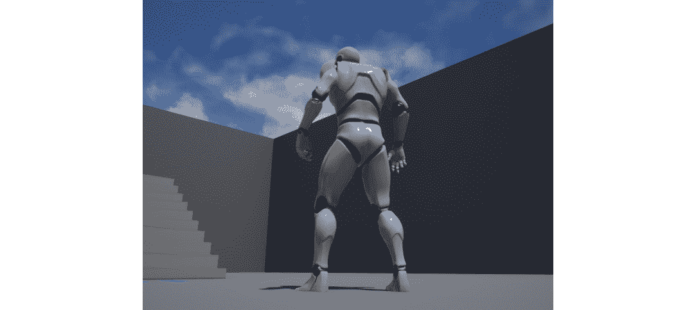

图 4.13：摄像机围绕玩家旋转

这就结束了使用玩家输入围绕玩家角色旋转摄像机的逻辑。在下一个练习中，我们将广泛地了解移动平台，如 Android 和 iOS。

## 移动平台

由于技术的最新进展，现在大多数人口都可以使用价格实惠的移动设备，如智能手机和平板电脑。这些设备虽然小，但仍具有相当大的处理能力，现在可以做许多像笔记本电脑和台式电脑这样大的设备可以做的事情之一就是玩视频游戏。

因为移动设备比其他设备更实惠和多功能，您有很多人在上面玩游戏。因此，值得考虑为移动平台（如 Android 和 iOS，两个最大的移动应用商店）开发视频游戏。

让我们现在看一下如何在下一个练习中在虚拟移动设备上预览我们的游戏。

## 练习 4.03：在移动设备上预览

在这个练习中，我们将使用“移动预览”来玩我们的游戏，以了解在移动设备上玩我们的游戏是什么感觉。在这之前，我们必须进入“Android 平台”设置。

请查看以下步骤：

1.  打开“项目设置”窗口，并在其左侧边滚动，直到在“平台”类别下找到`Android`选项。单击该选项。您应该会在类别右侧看到以下内容：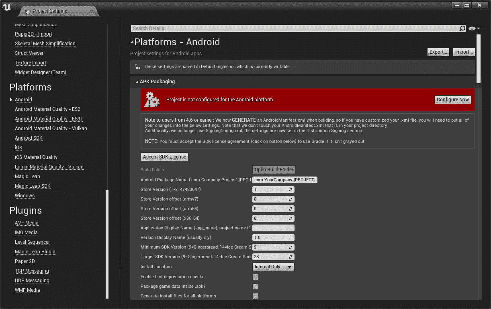

图 4.14：Android 平台窗口警告项目当前尚未配置为该平台

1.  此警告是在告诉您项目尚未配置为 Android。要更改此设置，请点击*红色警告*内的“立即配置”按钮。当您这样做时，它应该会变成绿色警告，告诉您平台已配置：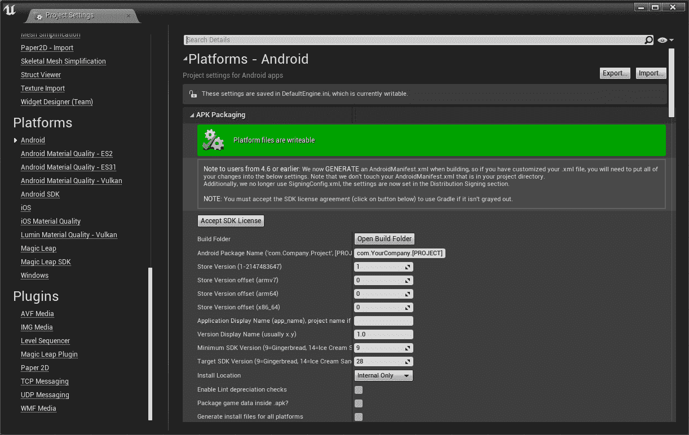

图 4.15：Android 平台窗口通知您项目已为此平台配置

1.  完成后，您可以关闭“项目设置”，单击编辑器工具栏中“播放”按钮旁边的箭头，并选择您看到的“移动预览”选项：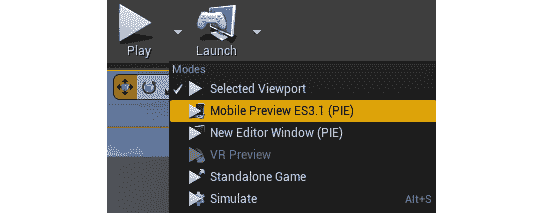

图 4.16：播放按钮下的移动预览选项

这将导致引擎开始加载此预览，并编译所有必要的着色器，这应该需要几分钟时间。

完成后，您应该会看到以下内容：

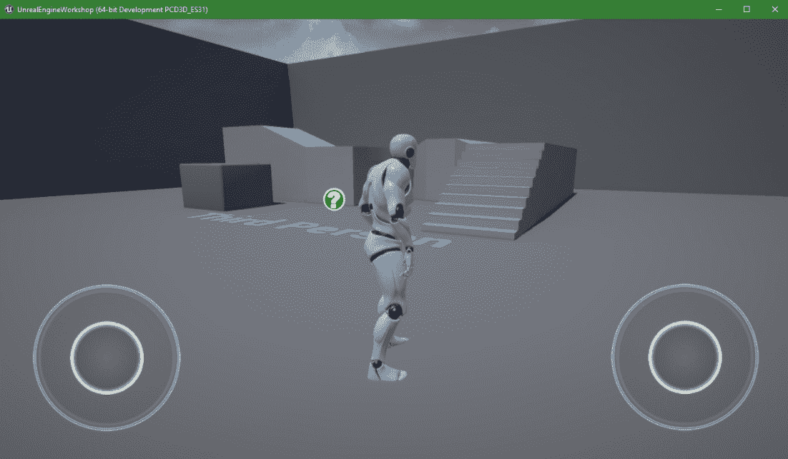

图 4.17：移动预览窗口播放游戏，就像在 Android 设备上一样

这个预览应该看起来与编辑器内的普通预览类似，但有一些显著的区别：

+   视觉保真度已经降低。因为移动平台没有与 PC 和游戏机相同类型的计算能力，所以视觉质量会降低以考虑到这一点。此外，一些高端平台上可用的渲染功能在移动平台上根本不受支持。

+   在屏幕的左下角和右下角添加了两个虚拟摇杆，它们的工作方式类似于控制器，左摇杆控制角色的移动，右摇杆控制摄像机的旋转。

这个窗口就像一个移动屏幕，你的鼠标就是你的手指，所以如果你按住左摇杆并拖动它，这将导致摇杆在屏幕上移动，从而使角色移动，就像下面的截图所示：

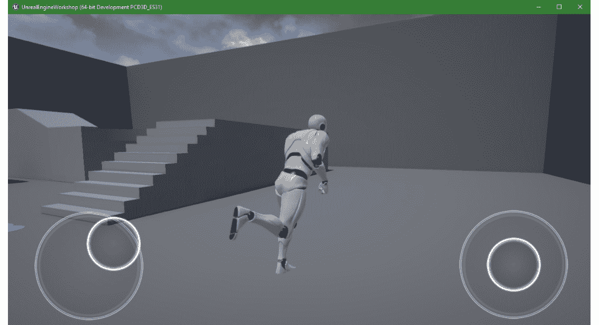

图 4.18：使用左虚拟摇杆移动角色

随着这一章的结束，我们学会了如何在 Android 移动平台上预览我们的游戏，并验证其输入是否正常工作。

现在让我们进入下一个练习，我们将添加触摸输入，使玩家角色跳跃。

## 练习 4.04：添加触摸屏输入

在这个练习中，我们将继续上一个练习，使玩家角色在玩家在触摸屏设备上点击屏幕时开始跳跃。

要向我们的游戏添加触摸屏输入，请按照以下步骤进行：

1.  转到`MyThirdPersonChar`类的头文件，并添加两个声明受保护的函数，这两个函数返回空，并接收`ETouchIndex::Type FingerIndex`和`FVector Location`参数，第一个参数表示触摸屏幕的手指的索引（无论是第一个、第二个还是第三个手指），第二个参数表示触摸屏幕的位置。将其中一个函数命名为`TouchBegin`，另一个命名为`TouchEnd`：

```cpp
void TouchBegin(ETouchIndex::Type FingerIndex, FVector Location);
void TouchEnd(ETouchIndex::Type FingerIndex, FVector Location);
```

1.  在`MyThirdPersonChar`类的源文件中，添加这两个函数的实现，其中`TouchBegin`函数将调用`Jump`函数，而`TouchEnd`函数将调用`StopJumping`函数。这将导致我们的角色在玩家触摸屏幕时开始跳跃，并在他们停止触摸屏幕时停止跳跃：

```cpp
void AMyThirdPersonChar::TouchBegin(ETouchIndex::Type   FingerIndex, FVector Location)
{
  Jump();
}
void AMyThirdPersonChar::TouchEnd(ETouchIndex::Type   FingerIndex, FVector Location)
{
  StopJumping();
}
```

1.  转到`SetupPlayerInputComponent`函数的实现，并在`PlayerInputComponent`的`BindTouch`函数中添加两个调用，这将把屏幕被触摸的事件绑定到一个函数。这个函数接收与`BindAction`函数相同的参数，除了第一个参数`ActionName`。在第一个函数调用中，将输入事件`IE_Pressed`、`this`指针和这个类的`TouchBegin`函数作为参数传递，而在第二个调用中，将输入事件`IE_Released`、`this`指针和这个类的`TouchEnd`函数作为参数传递：

```cpp
PlayerInputComponent->BindTouch(IE_Pressed, this,   &AMyThirdPersonChar::TouchBegin);
PlayerInputComponent->BindTouch(IE_Released, this,   &AMyThirdPersonChar::TouchEnd);
```

1.  使用`Mobile Preview`预览游戏，就像我们在上一个练习中所做的那样。如果你用左鼠标按钮点击屏幕中间，玩家角色应该会跳跃：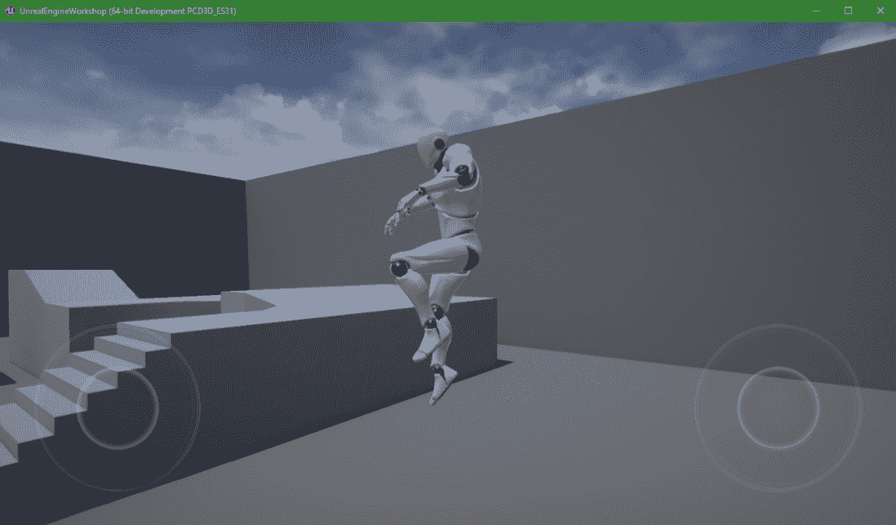

图 4.19：点击屏幕中间后角色跳跃

随着这一章的结束，我们完成了使我们的角色在玩家触摸屏幕时跳跃的逻辑。现在我们已经学会了如何向我们的游戏添加输入，并将这些输入与游戏内的动作（如跳跃和移动玩家角色）关联起来，让我们通过在下一个活动中从头到尾地向我们的游戏添加一个新的`Walk`动作来巩固我们在这一章中学到的知识。

## 活动 4.01：为我们的角色添加行走逻辑

在当前游戏中，我们的角色在使用移动键时默认奔跑，但我们需要减少角色的速度并使其行走。

因此，在这个活动中，我们将添加逻辑，使我们的角色在按住键盘上的`Shift`键或“游戏手柄右侧按钮”键（Xbox 控制器的`B`和 PlayStation 控制器的`O`）移动时行走。此外，我们还将在移动平台上进行预览。

要做到这一点，请按照以下步骤：

1.  通过“项目设置”窗口打开“输入设置”。

1.  添加一个名为`Walk`的新`Action Mapping`，并将其与“左 Shift”和“游戏手柄右侧按钮”键关联。

1.  打开`MyThirdPersonChar`类的头文件，并添加两个返回空值并且不接收参数的`protected`函数的声明，分别称为`BeginWalking`和`StopWalking`。

1.  在类的源文件中为这两个函数添加实现。在`BeginWalking`函数的实现中，通过相应地修改`CharacterMovementComponent`属性的`MaxWalkSpeed`属性，将角色的速度改变为其值的 40％。要访问`CharacterMovementComponent`属性，请使用`GetCharacterMovement`函数。

1.  `StopWalking`函数的实现将是`BeginWalking`函数的相反，它将使角色的行走速度增加 250％。

1.  当按下该动作时，将“行走”动作绑定到`BeginWalking`函数，并在释放时绑定到`StopWalking`函数。

按照这些步骤后，您应该能够让您的角色行走，通过按住键盘的*左 Shift*键或控制器的*右侧按钮*按钮来减慢速度并略微改变动画。

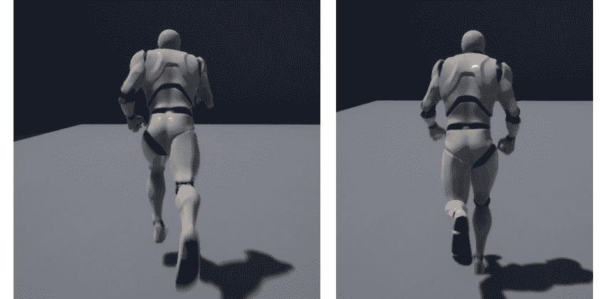

图 4.20：角色奔跑（左）和行走（右）

1.  现在让我们在移动平台上预览我们的游戏，就像我们在*练习 4.03*中所做的那样，在*移动预览*中轻轻拖动左摇杆，使我们的角色慢慢行走。结果应该类似于以下屏幕截图：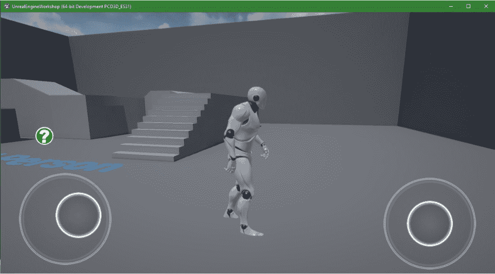

图 4.21：移动预览中的角色行走

这就结束了我们的活动。 只要玩家按住“行走”动作，我们的角色现在应该能够慢慢地行走。

注意

此活动的解决方案可以在以下网址找到：[`packt.live/338jEBx`](https://packt.live/338jEBx)。

# 总结

在本章中，您已经学会了如何添加、删除和修改`Action Mappings`和`Axis Mappings`，这在确定哪些键触发特定动作或轴，如何监听它们以及在按下和释放时如何执行游戏逻辑时，给您一些灵活性。

现在您知道如何处理玩家的输入，您可以允许玩家与您的游戏进行交互，并提供视频游戏所广为人知的代理。

在下一章中，我们将从头开始制作我们自己的游戏。 它将被称为“躲避球”，玩家将控制一个角色试图逃离向它投掷躲避球的敌人。 在那一章中，我们将有机会开始学习许多重要的主题，重点是碰撞。
