# 5\. 线性跟踪

概述

这一章将是一个名为躲避球的新游戏项目的开始，我们将从头开始创建一个基于碰撞概念的游戏。在本章中，您将修改第三人称模板项目，使其具有俯视视角。然后，您将介绍线性跟踪，这是游戏开发中的一个关键概念，并了解它们的潜力和用例。

在本章结束时，您将能够使用 UE4 内置的线性跟踪功能（在其他游戏开发工具中也称为射线投射或光线跟踪），通过执行不同类型的线性跟踪；创建自己的跟踪通道；并修改物体对每个跟踪通道的响应。

# 介绍

在之前的章节中，我们学习了如何重现虚幻引擎团队提供给我们的第三人称模板项目，以了解 UE4 工作流程和框架的一些基本概念。

在本章中，您将开始从头开始创建另一个游戏。在这个游戏中，玩家将以俯视的角度控制一个角色（*类似于《合金装备》1、2 和 3 等游戏*）。俯视视角意味着玩家控制一个角色，就好像从上方看下去一样，通常摄像机旋转是固定的（摄像机不会旋转）。在我们的游戏中，玩家角色必须从 A 点到 B 点，而不被敌人在整个关卡中投掷的躲避球击中。这个游戏的关卡将是迷宫般的，玩家将有多条路径可供选择，所有这些路径都将有敌人试图向玩家投掷躲避球。

本章我们将要涉及的具体主题包括线性跟踪（单一和多重）、扫描跟踪、跟踪通道和跟踪响应。在第一节中，我们将开始了解在视频游戏世界中*碰撞*是什么。

# 碰撞

碰撞基本上是两个物体相互接触的点（例如，两个物体碰撞，物体撞击角色，角色走进墙壁等）。大多数游戏开发工具都有自己的一套功能，允许碰撞和物理存在于游戏中。这一套功能被称为**物理引擎**，它负责与碰撞相关的一切。它负责执行线性跟踪，检查两个物体是否重叠，阻止彼此的移动，从墙壁上弹开等等。当我们要求游戏执行或通知我们这些碰撞事件时，游戏实际上是在要求物理引擎执行它，然后向我们展示这些碰撞事件的结果。

在您将要构建的`躲避球`游戏中，需要考虑碰撞的例子包括检查敌人是否能看到玩家（这将通过线性跟踪来实现，在本章中介绍），模拟物理学上的一个对象，它将表现得就像一个躲避球一样，检查是否有任何东西阻挡玩家角色的移动，等等。

碰撞是大多数游戏中最重要的方面之一，因此了解它对于开始游戏开发至关重要。

在我们开始构建基于碰撞的功能之前，我们首先需要设置我们的新`躲避球`项目，以支持我们将要实现的游戏机制。这个过程从下一节描述的步骤开始：*项目设置*。

# 项目设置

让我们通过创建我们的虚幻引擎项目开始这一章节：

1.  `启动`UE4。选择`游戏`项目类别，然后按`下一步`。

1.  选择`第三人称模板`，然后按`下一步`。

1.  确保将第一个选项设置为`C++`而不是`Blueprint`。

1.  根据您的喜好选择项目的位置，并将项目命名为`躲避球`，然后按`创建项目`。

项目生成完成后，您应该在屏幕上看到以下内容：

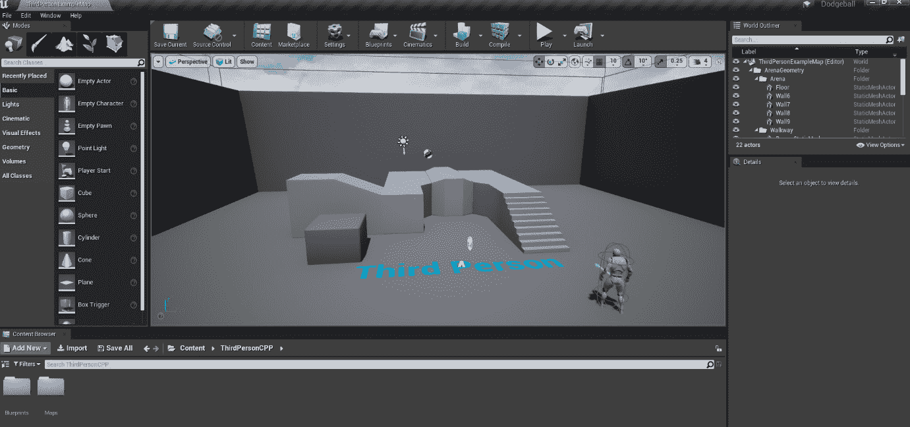

图 5.1：加载的躲避球项目

1.  代码生成并打开项目后，关闭 UE4 编辑器，并在 Visual Studio 中打开生成的第三人角色类`DodgeballCharacter`的文件，如下图所示：

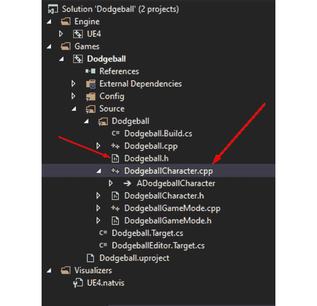

图 5.2：在 Visual Studio 中生成的文件

如前所述，您的项目将具有俯视角。鉴于我们从第三人模板开始此项目，我们需要在将其转换为俯视游戏之前进行一些更改。这将主要涉及更改现有角色类中的一些代码行。

## 练习 5.01：将躲避球角色转换为俯视角

在这个练习中，您将对生成的`DodgeballCharacter`类进行必要的更改。请记住，它目前具有第三人称视角，其中角色的旋转由玩家的输入（即鼠标或右摇杆）决定。

在这个练习中，您将把它改为俯视角，不管玩家的输入如何，相机始终从上方跟随角色。

以下步骤将帮助您完成此练习：

1.  前往`DodgeballCharacter`类的构造函数，并根据以下步骤更新`CameraBoom`的属性。

1.  将`CameraBoom`的属性`TargetArmLength`更改为`900.0f`，以在相机和玩家之间增加一些距离：

```cpp
// The camera follows at this distance behind the character
CameraBoom->TargetArmLength = 900.0f;
```

1.  接下来，添加一行代码，使用`SetRelativeRotation`函数将相对俯仰设置为`-70`º，以便相机向下看玩家。`FRotator`构造函数的参数分别是*俯仰*、*偏航*和*翻滚*：

```cpp
//The camera looks down at the player
CameraBoom->SetRelativeRotation(FRotator(-70.f, 0.f, 0.f));
```

1.  将`bUsePawnControlRotation`更改为`false`，以便相机的旋转不受玩家的移动输入影响：

```cpp
// Don't rotate the arm based on the controller
CameraBoom->bUsePawnControlRotation = false;
```

1.  添加一行代码，将`bInheritPitch`、`bInheritYaw`和`bInheritRoll`设置为`false`，以便相机的旋转不受角色方向的影响：

```cpp
// Ignore pawn's pitch, yaw and roll
CameraBoom->bInheritPitch = false;
CameraBoom->bInheritYaw = false;
CameraBoom->bInheritRoll = false;
```

在我们进行了这些修改之后，我们将删除角色跳跃的能力（我们不希望玩家那么容易就躲开躲避球），以及根据玩家的旋转输入旋转相机的能力。

1.  转到`DodgeballCharacter`源文件中的`SetupPlayerInputComponent`函数，并删除以下代码行以删除跳跃的能力：

```cpp
// REMOVE THESE LINES
PlayerInputComponent->BindAction("Jump", IE_Pressed, this,   &ACharacter::Jump);
PlayerInputComponent->BindAction("Jump", IE_Released, this,   Acharacter::StopJumping);
```

1.  接下来，添加以下行以删除玩家的旋转输入：

```cpp
// REMOVE THESE LINES
PlayerInputComponent->BindAxis("Turn", this,   &APawn::AddControllerYawInput);
PlayerInputComponent->BindAxis("TurnRate", this,   &ADodgeballCharacter::TurnAtRate);
PlayerInputComponent->BindAxis("LookUp", this,   &APawn::AddControllerPitchInput);
PlayerInputComponent->BindAxis("LookUpRate", this,   &ADodgeballCharacter::LookUpAtRate);
```

这一步是可选的，但为了保持代码整洁，您应该删除`TurnAtRate`和`LookUpAtRate`函数的声明和实现。

1.  最后，在您进行了这些更改之后，从 Visual Studio 运行您的项目。

1.  编辑器加载完成后，播放关卡。相机的视角应该是这样的，并且不应根据玩家的输入或角色的旋转而旋转：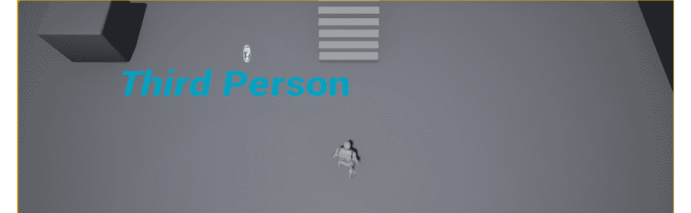

图 5.3：将相机旋转锁定到俯视角

这就结束了本章的第一个练习，也是您新项目`Dodgeball`的第一步。

接下来，您将创建`EnemyCharacter`类。这个角色将是敌人，在玩家在视野中时向玩家投掷躲避球。但在这里出现的问题是：敌人如何知道它是否能看到玩家角色呢？

这将通过**线追踪**（也称为**射线投射**或**光线追踪**）的能力来实现，您将在下一节中了解到。

# 线追踪

任何游戏开发工具的最重要功能之一是执行线追踪的能力。这些功能是通过工具使用的物理引擎提供的。

线性跟踪是一种询问游戏是否有任何东西站在游戏世界中两点之间的方式。游戏将在你指定的两点之间*发射一条射线*，并返回被击中的对象（如果有的话），它们被击中的位置，以及角度等等。

在下图中，您可以看到线性跟踪的表示，我们假设对象`1`被忽略，而对象`2`被检测到，这是由于它们的跟踪通道属性（在接下来的段落中进一步解释）：

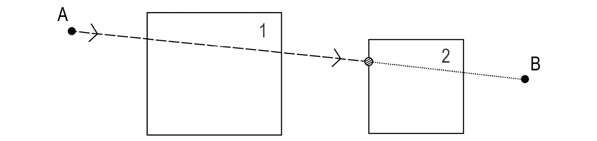

图 5.4：从点 A 到点 B 执行的线性跟踪

在*图 5.4*中：

+   虚线代表线性跟踪撞击物体前的情况。

+   箭头代表线性跟踪的方向。

+   虚线代表线性跟踪撞击物体后的情况。

+   条纹圆圈代表线性跟踪的撞击点。

+   大方块代表线性跟踪路径上的两个对象（对象`1`和`2`）。

我们注意到只有对象`2`被线性跟踪击中，而对象`1`没有，尽管它也在线性跟踪的路径上。这是由于对对象`1`的跟踪通道属性所做的假设，这些将在本章后面讨论。

线性跟踪用于许多游戏功能，例如：

+   检查武器开火时是否击中物体

+   当角色看着可以与之交互的物品时进行突出显示

+   当相机自动围绕玩家角色旋转时

线性跟踪的一个常见且重要的特性是**跟踪通道**。当执行线性跟踪时，您可能只想检查特定类型的对象，这就是跟踪通道的作用。它们允许您指定在执行线性跟踪时使用的过滤器，以便它不会被不需要的对象阻挡。例如：

+   您可能只想执行线性跟踪以检查可见的对象。这些对象将阻挡`Visibility`跟踪通道。例如，不可见的墙壁，这些是游戏中用来阻挡玩家移动的不可见几何体，不可见，因此不会阻挡`Visibility`跟踪通道。

+   您可能只想执行线性跟踪以检查可以与之交互的对象。这些对象将阻挡`Interaction`跟踪通道。

+   您可能只想执行线性跟踪以检查可以在游戏世界中移动的 pawn。这些对象将阻挡`Pawn`跟踪通道。

您可以指定不同对象如何对不同的跟踪通道做出反应，以便只有一些对象阻挡特定的跟踪通道，而其他对象忽略它们。在我们的情况下，我们想知道敌人和玩家角色之间是否有任何东西，这样我们就知道敌人是否能看到玩家。我们将使用线性跟踪来实现这一目的，通过检查任何阻挡敌人对玩家角色的视线的东西，使用`Tick`事件。

在下一节中，我们将使用 C++创建`EnemyCharacter`类。

# 创建 EnemyCharacter C++类

在我们的`Dodgeball`游戏中，`EnemyCharacter`类将不断地观察玩家角色，如果他们在视野内的话。这是同一个类，稍后将向玩家投掷躲避球；但是，这将留到下一章。在本章中，我们将专注于允许我们的敌人角色观察玩家的逻辑。

那么，让我们开始吧：

1.  在编辑器内右键单击`Content Browser`，然后选择`New C++ Class`。

1.  选择`Character`类作为父类。

1.  将新类命名为`EnemyCharacter`。

在你创建了类并在 Visual Studio 中打开了它的文件之后，让我们在其`header`文件中添加`LookAtActor`函数声明。这个函数应该是`public`，不返回任何东西，只接收`AActor* TargetActor`参数，这将是它应该面对的 Actor。看一下下面的代码片段，它展示了这个函数：

```cpp
// Change the rotation of the character to face the given actor
void LookAtActor(AActor* TargetActor);
```

注意

尽管我们只希望敌人看着玩家的角色，但为了执行良好的软件开发实践，我们将稍微抽象化这个函数，并允许`EnemyCharacter`看任何 Actor，因为允许一个 Actor 看另一个 Actor 或玩家角色的逻辑将是完全相同的。

记住，在编写代码时不应该创建不必要的限制。如果你可以编写类似的代码，同时又允许更多的可能性，那么你应该这样做，只要不过于复杂化程序的逻辑。

继续前进，如果`EnemyCharacter`看不到`Target` `Actor`，它就不应该看着它。为了检查敌人是否能看到 Actor，它应该看着`LookAtActor`函数，该函数将调用另一个函数，即`CanSeeActor`函数。这就是你将在下一个练习中要做的事情。

## 练习 5.02：创建 CanSeeActor 函数，执行线性跟踪

在这个练习中，我们将创建`CanSeeActor`函数，该函数将返回敌人角色是否能看到给定的 Actor。

以下步骤将帮助你完成这个练习：

1.  在`EnemyCharacter`类的头文件中创建`CanSeeActor`函数的声明，该函数将返回一个`bool`，并接收一个`const Actor* TargetActor`参数，这是我们想要看的 Actor。这个函数将是一个`const`函数，因为它不会改变类的任何属性，参数也将是`const`，因为我们不需要修改它的任何属性；我们只需要访问它们：

```cpp
// Can we see the given actor
bool CanSeeActor(const AActor* TargetActor) const;
```

现在，让我们来到有趣的部分，即执行线性跟踪。

为了调用与线性跟踪相关的函数，我们将需要使用`GetWorld`函数获取敌人当前的世界。然而，我们还没有在这个文件中包含`World`类，所以让我们在接下来的步骤中这样做：

注意

`GetWorld`函数对任何 Actor 都是可访问的，并将返回 Actor 所属的`World`对象。请记住，为了执行线性跟踪，世界是必要的。

1.  打开`EnemyCharacter`源文件，并找到以下代码行：

```cpp
#include "EnemyCharacter.h"
```

在上一行代码的后面添加以下行：

```cpp
#include "Engine/World.h"
```

1.  接下来，在`EnemyCharacter`源文件中创建`CanSeeActor`函数的实现，你将首先检查我们的`TargetActor`是否为`nullptr`。如果是，我们将返回`false`，因为我们没有有效的 Actor 来检查我们的视线：

```cpp
bool AEnemyCharacter::CanSeeActor(const AActor * TargetActor)   const
{
  if (TargetActor == nullptr)
  {
    return false;
  }
}
```

接下来，在添加线性跟踪函数调用之前，我们需要设置一些必要的参数；我们将在接下来的步骤中实现这些参数。

1.  在前面的`if`语句之后，创建一个变量来存储与线性跟踪结果相关的所有必要数据。Unreal 已经为此提供了一个内置类型，称为`FHitResult`类型：

```cpp
// Store the results of the Line Trace
FHitResult Hit;
```

这是我们将发送到线性跟踪函数的变量，该函数将用执行的线性跟踪的相关信息填充它。

1.  创建两个`FVector`变量，用于我们线性跟踪的`Start`和`End`位置，并将它们分别设置为我们敌人当前的位置和我们目标当前的位置：

```cpp
// Where the Line Trace starts and ends
FVector Start = GetActorLocation();
FVector End = TargetActor->GetActorLocation();
```

1.  接下来，设置我们希望进行比较的跟踪通道。在我们的情况下，我们希望有一个`Visibility`跟踪通道，专门用于指示一个物体是否阻挡另一个物体的视图。幸运的是，对于我们来说，UE4 中已经存在这样一个跟踪通道，如下面的代码片段所示：

```cpp
// The trace channel we want to compare against
ECollisionChannel Channel = ECollisionChannel::ECC_Visibility;
```

`ECollisionChannel`枚举代表了所有可能的跟踪通道，我们将使用`ECC_Visibility`值，该值代表`Visibility`跟踪通道。

1.  现在我们已经设置好所有必要的参数，我们最终可以调用`LineTrace`函数，`LineTraceSingleByChannel`：

```cpp
// Execute the Line Trace
GetWorld()->LineTraceSingleByChannel(Hit, Start, End,   Channel);
```

此函数将考虑我们发送的参数，执行线性跟踪，并通过修改我们的`Hit`变量返回其结果。

在我们继续之前，还有一些事情需要考虑。

如果线性跟踪从我们的敌人角色内部开始，这在我们的情况下会发生，这意味着线性跟踪很可能会立即击中我们的敌人角色并停在那里，因为我们的角色可能会阻塞`Visibility`跟踪通道。为了解决这个问题，我们需要告诉线性跟踪忽略它。

1.  使用内置的`FCollisionQueryParams`类型，可以为我们的线性跟踪提供更多选项：

```cpp
FCollisionQueryParams QueryParams;
```

1.  现在，更新线性跟踪以忽略我们的敌人，通过将自身添加到要忽略的 Actor 列表中：

```cpp
// Ignore the actor that's executing this Line Trace
QueryParams.AddIgnoredActor(this);
```

我们还应将我们的目标添加到要忽略的 Actor 列表中，因为我们不想知道它是否阻塞了`EnemySight`通道；我们只是想知道敌人和玩家角色之间是否有东西阻塞了该通道。

1.  将目标 Actor 添加到要忽略的 Actor 列表中，如下面的代码片段所示：

```cpp
// Ignore the target we're checking for
QueryParams.AddIgnoredActor(TargetActor);
```

1.  接下来，通过将其作为`LineTraceSingleByChannel`函数的最后一个参数发送我们的`FCollisionQueryParams`：

```cpp
// Execute the Line Trace
GetWorld()->LineTraceSingleByChannel(Hit, Start, End, Channel,   QueryParams);
```

1.  通过返回线性跟踪是否击中任何东西来完成我们的`CanSeeActor`函数。我们可以通过访问我们的`Hit`变量并检查是否有阻塞命中来实现这一点，使用`bBlockingHit`属性。如果有，这意味着我们看不到我们的`TargetActor`。可以通过以下代码片段实现：

```cpp
return !Hit.bBlockingHit;
```

注意

虽然我们不需要从`Hit`结果中获取更多信息，除了是否有阻塞命中，但`Hit`变量可以为我们提供关于线性跟踪的更多信息，例如：

通过访问“Hit.GetActor（）”函数，可以获取被线性跟踪击中的 Actor 的信息（如果没有击中 Actor，则为`nullptr`）

通过访问“Hit.GetComponent（）”函数，找到被线性跟踪击中的 Actor 组件的信息（如果没有击中 Actor 组件，则为`nullptr`）

通过访问`Hit.Location`变量获取击中位置的信息

通过访问`Hit.Distance`变量找到击中的距离

通过访问`Hit.ImpactNormal`变量找到线性跟踪击中对象的角度

最后，我们的`CanSeeActor`函数已经完成。我们现在知道如何执行线性跟踪，并且可以将其用于我们敌人的逻辑。

通过完成这个练习，我们已经完成了`CanSeeActor`函数；现在我们可以回到`LookAtActor`函数。但是，首先有件事情我们应该看一下：可视化我们的线性跟踪。

# 可视化线性跟踪

在创建使用线性跟踪的新逻辑时，实际上在执行线性跟踪时可视化线性跟踪非常有用，而线性跟踪函数不允许您这样做。为了做到这一点，我们必须使用一组辅助调试函数，在运行时可以动态绘制对象，如线条、立方体、球体等。

然后让我们添加线性跟踪的可视化。为了使用调试函数，我们必须在最后一个`include`行下添加以下`include`：

```cpp
#include "DrawDebugHelpers.h"
```

我们将调用`DrawDebugLine`函数以可视化线性跟踪，该函数需要以下输入，与线性跟踪函数接收到的非常相似：

1.  当前的`World`，我们将使用`GetWorld`函数提供

1.  线的`Start`和`End`点，将与`LineTraceSingleByChannel`函数相同

1.  游戏中线的期望颜色，可以设置为“红色”

然后，我们可以在我们的线段跟踪函数调用下面添加`DrawDebugLine`函数调用，如下面的代码片段所示：

```cpp
// Execute the Line Trace
GetWorld()->LineTraceSingleByChannel(Hit, Start, End, Channel,   QueryParams);
// Show the Line Trace inside the game
DrawDebugLine(GetWorld(), Start, End, FColor::Red);
```

这将允许您在执行时可视化线段跟踪，这非常有用。

注意

如果您需要，您还可以指定更多的可视化线段跟踪属性，比如它的生命周期和厚度。

有许多可用的`DrawDebug`函数，可以绘制立方体、球体、圆锥体、甜甜圈，甚至自定义网格。

现在我们既可以执行又可以可视化我们的线段跟踪，让我们在`LookAtActor`函数内使用我们在上一个练习中创建的`CanSeeActor`函数。

## 练习 5.03：创建 LookAtActor 函数

在这个练习中，我们将创建`LookAtActor`函数的定义，该函数将改变敌人的旋转，使其面向给定的角色。

以下步骤将帮助您完成这个练习：

1.  在`EnemyCharacter`源文件中创建`LookAtActor`函数定义。

1.  首先检查我们的`TargetActor`是否为`nullptr`，如果是，则立即返回空（因为它无效），如下面的代码片段所示：

```cpp
void AEnemyCharacter::LookAtActor(AActor * TargetActor)
{
  if (TargetActor == nullptr)
  {
    return;
  }
}
```

1.  接下来，我们要检查是否能看到我们的目标角色，使用我们的`CanSeeActor`函数：

```cpp
if (CanSeeActor(TargetActor))
{
}
```

如果这个`if`语句为真，那意味着我们能看到这个角色，并且我们将设置我们的旋转，以便面向该角色。幸运的是，UE4 中已经有一个允许我们这样做的函数：`FindLookAtRotation`函数。这个函数将接收级别中的两个点作为输入，点 A（`Start`点）和点 B（`End`点），并返回起始点的对象必须具有的旋转，以便面向结束点的对象。

1.  为了使用这个函数，包括`KismetMathLibrary`，如下面的代码片段所示：

```cpp
#include "Kismet/KismetMathLibrary.h"
```

1.  `FindLookAtRotation`函数必须接收一个`Start`和`End`点，这将是我们的敌人位置和我们的目标角色位置，分别：

```cpp
FVector Start = GetActorLocation();
FVector End = TargetActor->GetActorLocation();
// Calculate the necessary rotation for the Start point to   face the End point
FRotator LookAtRotation =   UKismetMathLibrary::FindLookAtRotation(Start, End);
```

1.  最后，将敌人角色的旋转设置为与我们的`LookAtRotation`相同的值：

```cpp
//Set the enemy's rotation to that rotation
SetActorRotation(LookAtRotation);
```

这就是`LookAtActor`函数的全部内容。

现在最后一步是在 Tick 事件中调用`LookAtActor`函数，并将玩家角色作为`TargetActor`发送。

1.  为了获取当前由玩家控制的角色，我们可以使用`GameplayStatics`对象。与其他 UE4 对象一样，我们必须首先包含它们：

```cpp
#include "Kismet/GameplayStatics.h"
```

1.  接下来，转到您的 Tick 函数的主体，并从`GameplayStatics`中调用`GetPlayerCharacter`函数：

```cpp
// Fetch the character currently being controlled by the   player
ACharacter* PlayerCharacter =   UGameplayStatics::GetPlayerCharacter(this, 0);
```

此函数接收以下输入：

+   一个世界上下文对象，本质上是属于我们当前世界的对象，用于让函数知道要访问哪个世界对象。这个世界上下文对象可以简单地是`this`指针。

+   玩家索引，鉴于我们的游戏应该是单人游戏，我们可以安全地假设为`0`（第一个玩家）。

1.  接下来，调用`LookAtActor`函数，发送我们刚刚获取的玩家角色：

```cpp
// Look at the player character every frame
LookAtActor(PlayerCharacter);
```

1.  这个练习的最后一步是在 Visual Studio 中编译您的更改。

现在您已经完成了这个练习，您的`EnemyCharacter`类已经具备了面向玩家角色的必要逻辑，如果它在视野内，我们可以开始创建`EnemyCharacter`蓝图类。

# 创建 EnemyCharacter 蓝图类

现在我们已经完成了`EnemyCharacter` C++类的逻辑，我们必须创建从中派生的蓝图类：

1.  在编辑器中打开我们的项目。

1.  转到`ThirdPersonCPP`文件夹中的`Content Browser`中的`Blueprints`文件夹。

1.  *右键单击*并选择创建新的蓝图类。

1.  在`Pick Parent Class`窗口底部附近展开`All Classes`选项卡，搜索我们的`EnemyCharacter` C++类，并将其选择为父类。

1.  将蓝图类命名为`BP_EnemyCharacter`。

1.  打开蓝图类，从“组件”选项卡中选择`SkeletalMeshComponent`（称为`Mesh`），并将其“骨骼网格”属性设置为`SK_Mannequin`，将其“动画类”属性设置为`ThirdPerson_AnimBP`。

1.  将`SkeletalMeshComponent`的*Yaw*更改为`-90º`（在*z 轴*上），将其在*z 轴*上的位置更改为`-83`个单位。

1.  在设置好蓝图类之后，其网格设置应该与我们的`DodgeballCharacter`蓝图类非常相似。

1.  将`BP_EnemyCharacter`类的一个实例拖到你的关卡中，放在一个可能阻挡其视线的物体附近，比如这个位置（所选角色是`EnemyCharacter`）：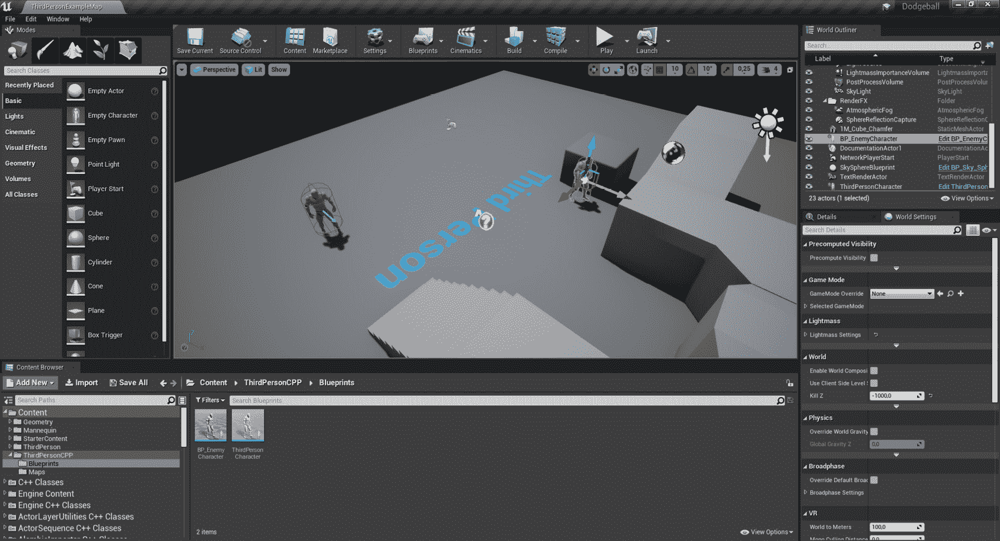

图 5.5：将 BP_EnemyCharacter 类拖入关卡

1.  现在我们终于可以玩游戏，验证我们的敌人在视线范围内时确实看向我们的玩家角色：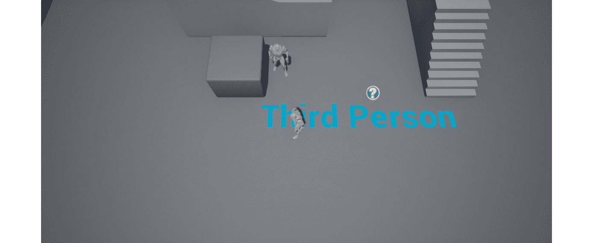

图 5.6：敌人角色使用线扫描清晰看到玩家

1.  我们还可以看到，敌人在视线范围之外时停止看到玩家，如*图 5.7*所示：

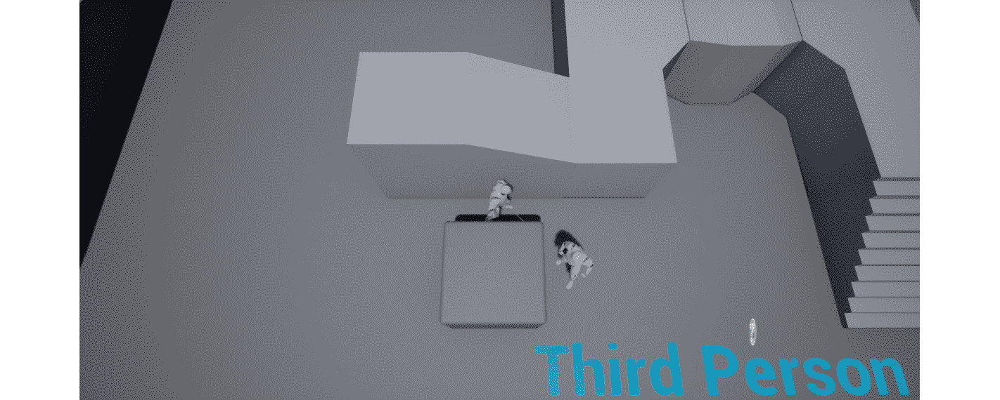

图 5.7：敌人失去对玩家的视线

这就结束了我们的`EnemyCharacter`的逻辑。在下一节中，我们将看一下扫描轨迹。

# 扫描轨迹

在继续我们的项目之前，了解一种线扫描的变体——**扫描轨迹**是很重要的。虽然我们不会在项目中使用它们，但了解它们以及如何使用它们是很重要的。

虽然线扫描基本上是在两点之间“发射一条射线”，但扫描轨迹将模拟在直线上两点之间“抛出一个物体”。被“抛出”的物体是模拟的（实际上并不存在于游戏中），可以有各种形状。在扫描轨迹中，“击中”位置将是虚拟物体（我们将其称为**形状**）从起点到终点抛出时首次击中另一个物体的位置。扫描轨迹的形状可以是盒形、球形或胶囊形。

这是从点`A`到点`B`的扫描轨迹的表示，我们假设由于其跟踪通道属性，物体`1`被忽略，使用盒形：

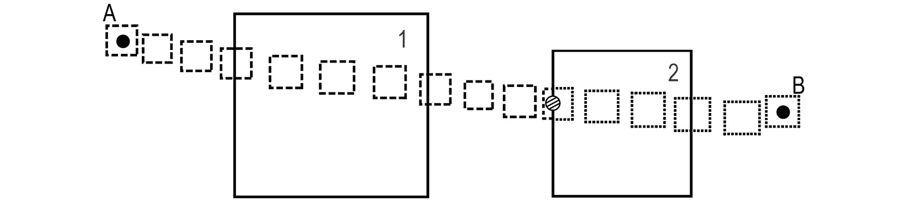

图 5.8：扫描轨迹的表示

从*图 5.8*中，我们注意到以下内容：

+   使用盒形的扫描轨迹，从点 A 到点 B 执行。

+   虚线框表示扫描轨迹在击中物体之前。

+   虚线框表示扫描轨迹击中物体后的情况。

+   条纹圆圈表示扫描轨迹与物体`2`的碰撞点，即扫描轨迹盒形的表面与物体`2`的表面相互碰撞的点。

+   大方块代表了两个物体在线扫描轨迹（物体`1`和`2`）的路径上。

+   由于其跟踪通道属性的假设，物体`1`在扫描轨迹中被忽略。

在一些情况下，扫描跟踪比普通的线性跟踪更有用。让我们以我们的敌人角色为例，它可以投掷躲避球。如果我们想要为玩家添加一种方式，让玩家不断地可视化敌人投掷的下一个躲避球将会着陆的位置，那么最好的方法是使用扫描跟踪：我们可以用我们躲避球的形状（一个球体）对玩家进行扫描跟踪，检查碰撞点，并在碰撞点显示一个球体，这样玩家就可以看到。如果扫描跟踪击中了墙壁或某个角落，玩家就会知道，如果敌人此时投掷躲避球，它会首先击中那里。你可以使用简单的线性跟踪来达到同样的目的，但是为了达到相同的结果质量，设置会变得相当复杂，这就是为什么在这种情况下扫描跟踪是更好的解决方案。

现在，让我们快速看一下如何在代码中进行扫描跟踪。

## 练习 5.04：执行扫描跟踪

在这个练习中，我们将在代码中实现扫描跟踪。虽然我们不会在项目中使用它，但通过进行这个练习，你将熟悉这样的操作。

进入前几节创建的`CanSeeActor`函数的末尾，然后按照以下步骤进行：

1.  负责扫描跟踪的函数是`SweepSingleByChannel`，它在 UE4 中可用，并需要以下参数作为输入：

一个`FHitResult`类型，用于存储扫描的结果（我们已经有了一个，所以不需要再创建另一个这种类型的变量）：

```cpp
// Store the results of the Line Trace
FHitResult Hit;
```

扫描的“起点”和“终点”（我们已经有了这两个，所以不需要再创建另一个这种类型的变量）：

```cpp
// Where the Sweep Trace starts and ends
FVector Start = GetActorLocation();
FVector End = TargetActor->GetActorLocation();
```

1.  使用形状的预期旋转，它是一个`FQuat`类型（表示四元数）。在这种情况下，它被设置为在所有轴上的旋转为`0`，通过访问`FQuat`的`Identity`属性来实现： 

```cpp
// Rotation of the shape used in the Sweep Trace
FQuat Rotation = FQuat::Identity; 
```

1.  现在，使用预期的跟踪通道进行比较（我们已经有了一个这样的变量，所以不需要再创建另一个这种类型的变量）：

```cpp
// The trace channel we want to compare against
ECollisionChannel Channel = ECollisionChannel::ECC_Visibility;
```

1.  最后，通过调用`FcollisionShape`的`MakeBox`函数并提供盒形形状在三个轴上的半径来使用盒形的形状进行扫描跟踪。这在下面的代码片段中显示：

```cpp
// Shape of the object used in the Sweep Trace
FCollisionShape Shape = FCollisionShape::MakeBox(FVector(20.f,   20.f, 20.f));
```

1.  接下来，调用`SweepSingleByChannel`函数：

```cpp
GetWorld()->SweepSingleByChannel(Hit,
                                 Start,
                                 End,
                                 Rotation,
                                 Channel,
                                 Shape);
```

完成了这些步骤后，我们完成了有关扫描跟踪的练习。鉴于我们不会在项目中使用扫描跟踪，你应该注释掉`SweepSingleByChannel`函数，这样我们的`Hit`变量就不会被修改，也不会丢失我们线性跟踪的结果。

现在我们已经完成了有关扫描跟踪的部分，让我们回到我们的“躲避球”项目，并学习如何更改对象对跟踪通道的响应。

## 更改可见性跟踪响应

在我们当前的设置中，每个可见的对象都会阻挡“可见性”跟踪通道；但是，如果我们想要改变一个对象是否完全阻挡该通道，该怎么办呢？为了做到这一点，我们必须改变一个组件对该通道的响应。看下面的例子：

1.  我们选择我们在关卡中用来阻挡敌人视线的立方体，如*图 5.9*所示：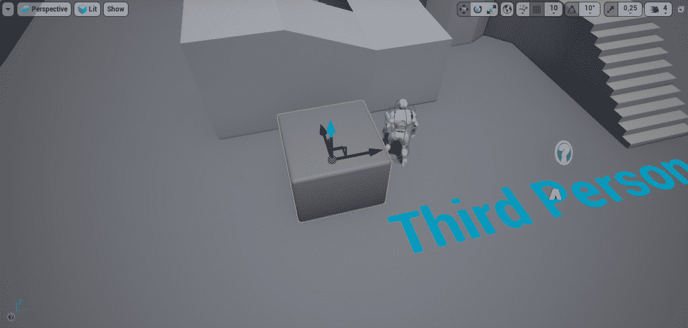

图 5.9：角色的默认生成点

1.  然后，转到对象“详细面板”中的“碰撞”部分（它在“编辑器”界面中的默认位置）：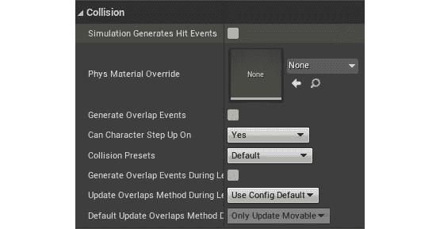

图 5.10：虚幻引擎中详细面板中的碰撞选项卡

1.  在这里，你会发现几个与碰撞相关的选项。我们现在要注意的是“碰撞预设”选项。它当前的值是“默认”，但是，我们想根据自己的喜好进行更改，所以我们将点击下拉框并将其值更改为“自定义”。

1.  一旦这样做，您会注意到一整组新选项弹出：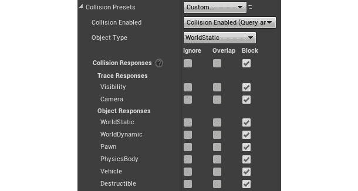

图 5.11：碰撞预设设置为自定义

这组选项允许您指定此对象对线追踪和对象碰撞的响应方式，以及它是何种类型的碰撞对象。

您应该注意的选项是“可见性”。您会注意到它设置为“阻挡”，但您也可以将其设置为“重叠”和“忽略”。

现在，立方体正在阻挡“可见性”追踪通道，这就是为什么我们的敌人在立方体后面时看不到角色。但是，如果我们将对象对“可见性”追踪通道的响应更改为“重叠”或“忽略”，则该对象将不再阻止检查可见性的线追踪（这是您刚刚在 C++中编写的线追踪的情况）。

1.  让我们将立方体对“可见性”通道的响应更改为“忽略”，然后玩游戏。您会注意到即使敌人在立方体后面时，它仍然朝向玩家角色：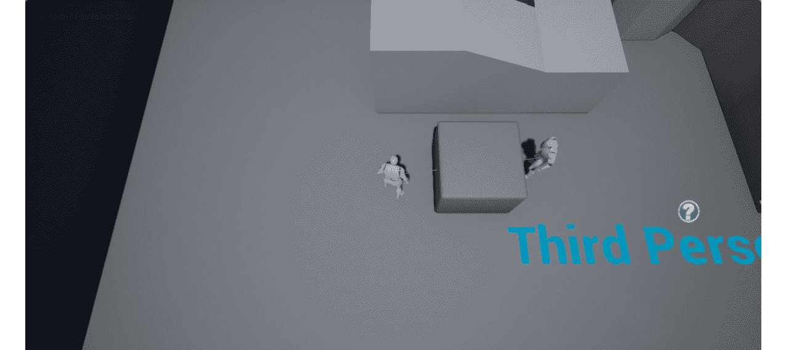

图 5.12：敌人角色透过物体看玩家

这是因为立方体不再阻挡“可见性”追踪通道，因此敌人执行的线追踪在试图接触玩家角色时不再击中任何东西。

现在我们已经看到如何更改对象对特定追踪通道的响应方式，让我们将立方体对“可见性”通道的响应更改回“阻挡”。

但是，值得一提的是：如果我们将立方体对“可见性”通道的响应设置为“重叠”，而不是“忽略”，结果将是相同的。但是为什么呢，这两种响应的目的是什么？为了解释这一点，我们将看看多线追踪。

## 多线追踪

在*练习 5.02*中使用`CanSeeActor`函数时，您可能会对我们使用的线追踪函数`LineTraceSingleByChannel`的名称，特别是为什么使用了“单”这个词，感到困惑。原因是因为您也可以执行`LineTraceMultiByChannel`。

但是这两种线追踪有何不同？

单线追踪在击中物体后将停止检查阻挡物体，并告诉我们击中的物体是什么，而多线追踪可以检查同一线追踪击中的任何物体。

单线追踪将：

+   忽略那些在线追踪中使用的追踪通道上设置为“忽略”或“重叠”的对象

+   找到其响应设置为“阻挡”的对象时停止

然而，多线追踪不会忽略那些在追踪通道上设置为“重叠”的对象，而是将它们添加为在线追踪期间找到的对象，并且只有在找到阻挡所需追踪通道的对象时（*或者到达终点时*）才会停止。在下一个图中，您将找到执行多线追踪的示例：

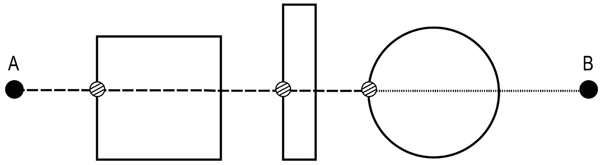

图 5.13：从点 A 到点 B 执行的多线追踪

在*图 5.13*中，我们注意到以下内容：

+   虚线代表线追踪在击中阻挡物体之前。

+   点线代表线追踪击中阻挡物体后。

+   条纹圆圈代表线追踪的影响点，其中只有最后一个在这种情况下是阻挡击中。

`LineTraceSingleByChannel`和`LineTraceMultiByChannel`函数之间唯一的区别在于它们的输入，后者必须接收`TArray<FHitResult>`输入，而不是单个`FHitResult`。所有其他输入都是相同的。

多线跟踪在模拟具有强穿透力的子弹行为时非常有用，可以穿过多个对象后完全停止。请记住，您还可以通过调用`SweepMultiByChannel`函数进行多扫描跟踪。

注意

关于`LineTraceSingleByChannel`函数的另一件事，你可能会想知道的是`ByChannel`部分。这个区别与使用跟踪通道有关，而不是另一种选择，即对象类型。您可以通过调用`LineTraceSingleByObjectType`函数来执行使用对象类型而不是跟踪通道的线跟踪，该函数也可以从 World 对象中获得。对象类型与我们将在下一章中涵盖的主题相关，因此我们暂时不会详细介绍这个函数。

## 摄像机跟踪通道

当将我们的立方体的响应更改为`Visibility`跟踪通道时，您可能已经注意到了另一个内置的跟踪通道：`Camera`。

该通道用于指定对象是否阻挡了摄像机弹簧臂和其关联的角色之间的视线。为了看到这一点，我们可以将一个对象拖到我们的级别中，并将其放置在这样一种方式，即它将保持在摄像机和我们的玩家角色之间。

看一下以下示例；我们首先复制`floor`对象。

注意

您可以通过按住*Alt*键并沿任何方向拖动*移动工具*的箭头来轻松复制级别中的对象。

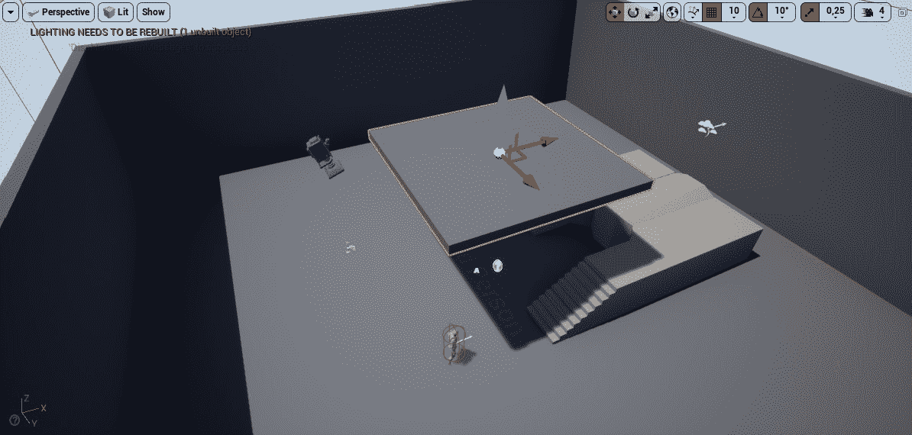

图 5.14：选择地板对象

1.  接下来，我们更改其`Transform`值，如下图所示：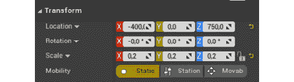

图 5.15：更新变换值

1.  现在当您玩游戏时，您会注意到当角色走到我们复制的地板下方时，您不会失去对玩家角色的视线，而是弹簧臂会使摄像机向下移动，直到您能看到角色：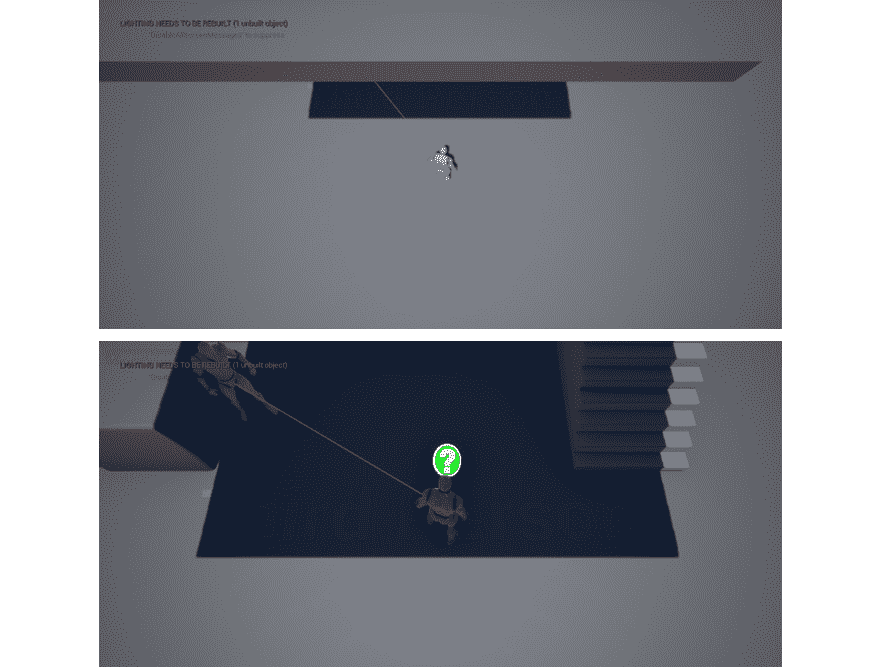

图 5.16：摄像机角度的变化

1.  为了看到当对象不阻挡`Camera`跟踪通道时弹簧臂的行为如何不同，将我们复制的地板对`Camera`通道的响应更改为`Ignore`，然后再次播放级别。结果将是，当我们的角色走到复制的地板下方时，我们将失去对角色的视线。

完成这些步骤后，您会发现“摄像机”通道用于指定对象是否会导致弹簧臂将摄像机靠近玩家当它与该对象相交时。

现在我们知道如何使用现有的跟踪通道，那么如果我们想创建自己的跟踪通道呢？

## 练习 5.05：创建自定义 EnemySight 跟踪通道

正如我们之前讨论过的，UE4 自带两个跟踪通道：`Visibility`和`Camera`。第一个是一个通用通道，我们可以用它来指定哪些对象阻挡了对象的视线，而第二个允许我们指定对象是否阻挡了摄像机弹簧臂和其关联的角色之间的视线。

但是我们如何创建自己的跟踪通道呢？这就是我们将在本练习中探讨的内容。我们将创建一个新的`EnemySight`跟踪通道，并使用它来检查敌人是否能看到玩家角色，而不是使用内置的`Visibility`通道：

1.  通过按编辑器左上角的“编辑”按钮打开“项目设置”，然后转到“碰撞”部分。在那里，您会找到“跟踪通道”部分。它目前为空，因为我们还没有创建自己的跟踪通道。

1.  选择`New Trace Channel`选项。一个窗口应该弹出，让您可以命名您的新通道，并根据您项目中的对象设置其默认响应。将我们的新 Trace 通道命名为`EnemySight`，并将其默认响应设置为`Block`，因为我们希望大多数对象都这样做。

1.  创建新的 Trace 通道后，我们必须回到我们的`EnemyCharacter` C++类中，并更改我们在 Line Trace 中比较的 Trace：

```cpp
// The trace channel we want to compare against
ECollisionChannel Channel = ECollisionChannel::ECC_Visibility;
```

鉴于我们不再使用`Visibility`通道，我们必须引用我们的新通道，但我们该如何做呢？

在项目目录中，您会找到`Config`文件夹。该文件夹包含与您的项目相关的几个`ini`文件，如`DefaultGame.ini`，`DefaultEditor.ini`，`DefaultEngine.ini`等。每个文件都包含在加载项目时将被初始化的几个属性。这些属性以名称-值对(`property=value`)的形式设置，您可以根据需要更改它们的值。

1.  当我们创建了我们的`EnemySight`通道时，项目的`DefaultEngine.ini`文件将被更新为我们的新 Trace 通道。在那个文件的某个地方，您会找到这一行：

```cpp
+DefaultChannelResponses=(Channel=ECC_GameTraceChannel1,  DefaultResponse=ECR_Block,bTraceType=True,bStaticObject=False,  Name="EnemySight")
// The trace channel we want to compare against
ECollisionChannel Channel =   ECollisionChannel::ECC_GameTraceChannel1;
```

1.  验证我们的敌人在我们所做的所有更改之后行为是否保持不变。这意味着只要玩家角色在敌人的视野范围内，敌人就必须面对玩家角色。

通过完成这个练习，我们现在知道如何为任何所需的目的创建我们自己的 Trace 通道。

回到我们的敌人角色，还有一些方法可以改进它的逻辑。现在，当我们获取我们敌人的位置作为 Line Trace 的起点时，那个点大约在敌人的臀部附近，因为那是 Actor 的原点。然而，那通常不是人们的眼睛所在的地方，让一个类人角色从它的臀部而不是头部看会没有多大意义。

所以，让我们改变一下，让我们的敌人角色从它的眼睛开始检查是否看到玩家角色，而不是从它的臀部开始。

## 活动 5.01：创建 SightSource 属性

在这个活动中，我们将改进我们敌人的逻辑，以确定它是否应该看着玩家。目前，用于确定这一点的 Line Trace 是从我们角色的臀部附近(`0,0,0`)在我们的`BP_EnemyCharacter`蓝图中进行的，我们希望这更有意义一些，所以我们将使 Line Trace 的起点接近我们敌人的眼睛。那么，让我们开始吧。

以下步骤将帮助您完成这个活动：

1.  在我们的`EnemyCharacter` C++类中声明一个名为`SightSource`的新`SceneComponent`。确保将其声明为`UPROPERTY`，并使用`VisibleAnywhere`，`BlueprintReadOnly`，`Category = LookAt`和`meta = (AllowPrivateAccess = "true")`标签。

1.  通过使用`CreateDefaultSubobject`函数在`EnemyCharacter`构造函数中创建这个组件，并将其附加到`RootComponent`。

1.  将 Line Trace 的起始位置更改为`CanSeeActor`函数中的`SightSource`组件的位置，而不是 Actor 的位置。

1.  打开`BP_EnemyCharacter`蓝图类，并将`SightSource`组件的位置更改为敌人头部的位置`(10, 0, 80)`，就像在*创建 EnemyCharacter 蓝图类*部分中对`BP_EnemyCharacter`的`SkeletalMeshComponent`属性所做的那样。

`Editor Panel`中的`Transform`选项卡，如*图 5.17*所示。

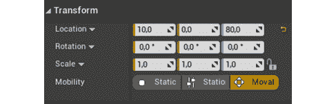

图 5.17：更新 SightSource 组件的值

预期输出：

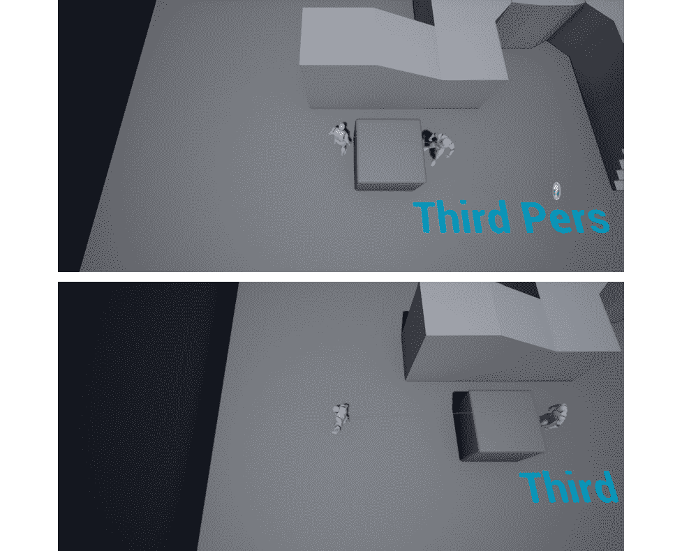

图 5.18：预期输出显示从臀部到眼睛的更新的 Line Trace

注意

这个活动的解决方案可以在这里找到：[`packt.live/338jEBx`](https://packt.live/338jEBx)。

通过完成这个活动，我们已经更新了我们的`EnemyCharacter`的`SightSource`属性。

# 总结

通过完成这一章，你已经为自己的工具箱增添了一个新工具：线性跟踪。你现在知道如何执行线性跟踪和扫描跟踪，包括单一和多重；如何改变对象对特定跟踪通道的响应；以及如何创建自己的跟踪通道。

在接下来的章节中，你将很快意识到这些是游戏开发中必不可少的技能，并且你将在未来的项目中充分利用它们。

现在我们知道如何使用线性跟踪，我们已经准备好迈出下一步，即对象碰撞。在下一章中，你将学习如何设置对象之间的碰撞，以及如何使用碰撞事件来创建自己的游戏逻辑。你将创建躲避球角色，它将受到实时物理模拟的影响；墙角色，它将阻挡角色的移动和躲避球的移动；以及负责在玩家接触到它时结束游戏的角色。
