# 第六章：碰撞对象

概述

在本章中，我们将继续在上一章介绍的基于碰撞的游戏中添加更多的机制和对象。最初，我们将继续介绍对象碰撞。您将学习如何使用碰撞框、碰撞触发器、重叠事件、击中事件和物理模拟。您还将学习如何使用定时器、投射物移动组件和物理材料。

# 介绍

在上一章中，我们了解了一些碰撞的基本概念，即线追踪和扫描追踪。我们学习了如何执行不同类型的线追踪，如何创建自定义的追踪通道，以及如何更改对象对特定通道的响应方式。在本章中，我们将使用上一章学到的许多内容，学习关于对象碰撞。

在本章中，我们将继续通过添加围绕对象碰撞的游戏机制来构建我们的顶部“躲避球”游戏。我们将创建**躲避球角色**，它将作为一个从地板和墙壁上弹开的躲避球；一个**墙壁角色**，它将阻挡所有对象；一个**幽灵墙角色**，它只会阻挡玩家，而不会阻挡敌人的视线或躲避球；以及一个**胜利箱角色**，当玩家进入胜利箱时游戏结束，代表关卡的结束。

在我们开始创建我们的“躲避球”类之前，我们将在下一节中介绍对象碰撞的基本概念。

# UE4 中的对象碰撞

每个游戏开发工具都必须有一个模拟多个对象之间碰撞的物理引擎，如前一章所述。碰撞是当今大多数游戏的基础，无论是 2D 还是 3D。在许多游戏中，这是玩家对环境进行操作的主要方式，无论是奔跑、跳跃还是射击，环境都会相应地使玩家着陆、受到打击等。毫不夸张地说，如果没有模拟碰撞，许多游戏根本无法制作。

因此，让我们了解 UE4 中对象碰撞的工作原理以及我们可以使用的方式，从碰撞组件开始。

# 碰撞组件

在 UE4 中，有两种类型的组件可以影响并受到碰撞的影响；它们如下：

+   网格

+   形状对象

**网格**可以简单到一个立方体，也可以复杂到有数万个顶点的高分辨率角色。网格的碰撞可以通过与网格一起导入 UE4 的自定义文件指定（这超出了本书的范围），也可以由 UE4 自动计算并由您自定义。

通常最好将碰撞网格保持尽可能简单（少三角形），以便物理引擎可以在运行时高效地计算碰撞。可以具有碰撞的网格类型如下：

+   静态网格

+   骨骼网格

+   程序化网格

+   以及其他

**形状对象**是简单的网格，在线框模式下表示，通过引起和接收碰撞事件来充当碰撞对象。

注意

线框模式是游戏开发中常用的可视化模式，通常用于调试目的，允许您看到没有任何面或纹理的网格 - 它们只能通过它们的边缘连接的顶点来看到。当我们向角色添加形状组件时，您将看到线框模式是什么。

请注意，形状对象本质上是不可见的网格，它们的三种类型如下：

+   盒形碰撞（C++中的盒形组件）

+   球形碰撞（C++中的球形组件）

+   胶囊碰撞器（C++中的胶囊组件）

注意

有一个类，所有提供几何和碰撞的组件都继承自它，那就是`Primitive`组件。这个组件是包含任何类型几何的所有组件的基础，这适用于网格组件和形状组件。

那么，这些组件如何发生碰撞，以及它们碰撞时会发生什么？我们将在下一节中看看这个，即碰撞事件。

# 碰撞事件

假设有两个对象相互碰撞。可能发生两种情况：

+   它们会互相重叠，好像另一个对象不存在，这种情况下会调用`Overlap`事件。

+   它们会发生碰撞并阻止对方继续前进，这种情况下会调用`Block`事件。

在前一章中，我们学习了如何将对象对特定的`Trace`通道的响应进行更改。在这个过程中，我们了解到对象的响应可以是`Block`、`Overlap`或`Ignore`。

现在，让我们看看在碰撞中每种响应发生了什么。

`Block`：

+   两个对象都会调用它们的`OnHit`事件。这个事件在两个对象在碰撞时阻止对方路径时被调用。如果其中一个对象正在模拟物理，那么该对象必须将其`SimulationGeneratesHitEvents`属性设置为`true`。

+   两个对象将互相阻止对方继续前进。

看一下下面的图，它展示了两个对象被扔出并互相弹开的例子：


图 6.1：对象 A 和对象 B 互相阻止对方

**Overlap**：如果两个对象不会互相阻止对方，并且它们中没有一个忽略另一个，那么它们会互相重叠：

+   如果两个对象的`GenerateOverlapEvents`属性都设置为`true`，它们将调用它们的`OnBeginOverlap`和`OnEndOverlap`事件。这些重叠事件分别在一个对象开始和停止与另一个对象重叠时调用。如果它们中至少有一个没有将此属性设置为`true`，则它们都不会调用这些事件。

+   对象会表现得好像另一个对象不存在，并且会互相重叠。

举个例子，假设玩家角色走进一个只对玩家角色做出反应的关卡结束触发器。

看一下下面的图，它展示了两个对象互相重叠的例子：

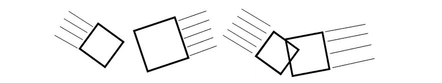

图 6.2：对象 A 和对象 B 互相重叠

**Ignore**：如果两个对象中至少有一个忽略另一个，它们会互相忽略：

+   任何一个对象都不会调用事件。

+   与`Overlap`响应类似，对象会表现得好像另一个对象不存在，并且会互相重叠。

两个对象互相忽略的一个例子是，当除了玩家角色以外的对象进入一个只对玩家角色做出反应的关卡结束触发器时。

注意

你可以看一下之前的图，两个对象互相重叠，以理解**Ignore**。

以下是一个表格，帮助你理解两个对象必须具有的必要响应，以触发先前描述的情况：

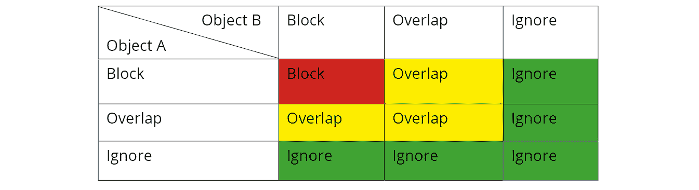

图 6.3：基于 Block、Overlap 和 Ignore 的对象的响应结果

根据这个表格，考虑你有两个对象 - 对象 A 和对象 B：

+   如果对象 A 将其响应设置为对象 B 的`Block`，而对象 B 将其响应设置为对象 A 的`Block`，它们将会互相阻止对方。

+   如果对象 A 将其响应设置为对象 B 的`Block`，而对象 B 将其响应设置为对象 A 的`Overlap`，它们将会互相重叠。

+   如果物体 A 将其对物体 B 的响应设置为“忽略”，而物体 B 将其对物体 A 的响应设置为“重叠”，它们将互相“忽略”。

注意

您可以在这里找到 UE4 碰撞交互的完整参考：[`docs.unrealengine.com/en-US/Engine/Physics/Collision/Overview`](https://docs.unrealengine.com/en-US/Engine/Physics/Collision/Overview)。

物体之间的碰撞有两个方面：

物理学：所有与物理模拟相关的碰撞，比如球受重力影响并从地板和墙壁上弹开。

游戏中的碰撞的物理模拟响应，可以是：

+   两个物体继续它们的轨迹，就好像另一个物体不存在一样（没有物理碰撞）。

+   两个物体相撞并改变它们的轨迹，通常至少有一个物体继续其运动，即阻挡彼此的路径。

**查询**：查询可以分为碰撞的两个方面，如下所示：

+   与游戏中的物体碰撞相关的事件，您可以使用这些事件创建额外的逻辑。这些事件与我们之前提到的是相同的：

+   “命中”事件

+   “开始重叠”事件

+   “结束重叠”事件

+   游戏中的碰撞的物理响应，可以是：

+   两个物体继续它们的运动，就好像另一个物体不存在一样（没有物理碰撞）。

+   两个物体相撞并阻挡彼此的路径

物理方面的物理响应可能听起来与查询方面的物理响应相似；然而，尽管它们都是物理响应，但它们会导致对象的行为不同。

物理方面的物理响应（物理模拟）仅适用于物体在模拟物理时（例如受重力影响、从墙壁和地面弹开等）。当这样的物体撞到墙壁时，会弹回并继续朝另一个方向移动。

另一方面，查询方面的物理响应适用于所有不模拟物理的物体。当一个物体不模拟物理时，可以通过代码控制移动（例如使用`SetActorLocation`函数或使用角色移动组件）。在这种情况下，根据您用于移动物体的方法和其属性，当物体撞到墙壁时，它将简单地停止移动而不是弹回。这是因为您只是告诉物体朝某个方向移动，而有东西挡住了它的路径，所以物理引擎不允许该物体继续移动。

在下一节中，我们将看看碰撞通道。

# 碰撞通道

在上一章中，我们看了现有的跟踪通道（*可见性*和*相机*）并学习了如何创建自定义通道。现在您已经了解了跟踪通道，是时候谈谈对象通道，也称为对象类型了。

虽然跟踪通道仅用于线跟踪，但对象通道用于对象碰撞。您可以为每个“对象”通道指定一个“目的”，就像跟踪通道一样，比如角色、静态对象、物理对象、抛射物等等。然后，您可以指定您希望每种对象类型如何响应所有其他对象类型，即通过阻挡、重叠或忽略该类型的对象。

# 碰撞属性

现在我们已经了解了碰撞的工作原理，让我们回到上一章中选择的立方体的碰撞设置，我们在那里将其响应更改为可见性通道。

在下面的截图中可以看到立方体：

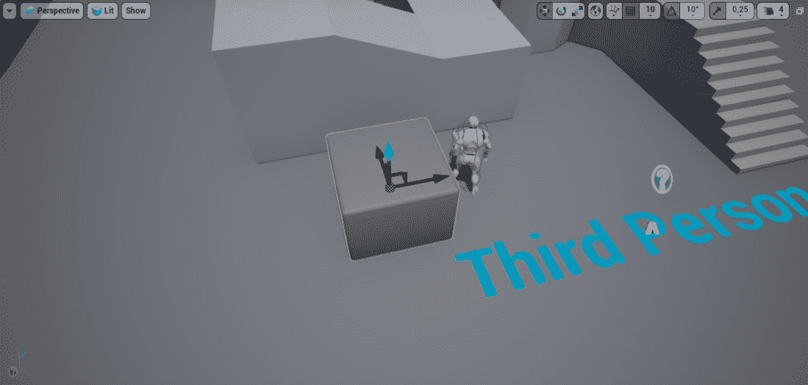

图 6.4：立方体阻挡敌人的视觉源

在编辑器中打开关卡，选择立方体并转到其详细面板的“碰撞”部分：

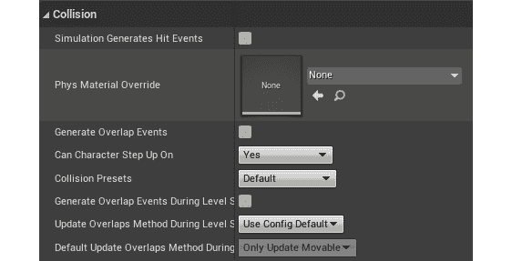

图 6.5：级别编辑器中的变化

在这里，我们可以看到一些对我们很重要的选项：

+   `SimulationGeneratesHitEvents`，当物体模拟物理时允许调用`OnHit`事件（我们将在本章后面讨论这个）。

+   `GenerateOverlapEvents`，允许调用`OnBeginOverlap`和`OnEndOverlap`事件。

+   `CanCharacterStepUpOn`，允许角色轻松站在这个物体上。

+   `CollisionPresets`，允许我们指定此对象如何响应每个碰撞通道。

让我们将`CollisionPresets`的值从`默认`更改为`自定义`，并查看出现的新选项：

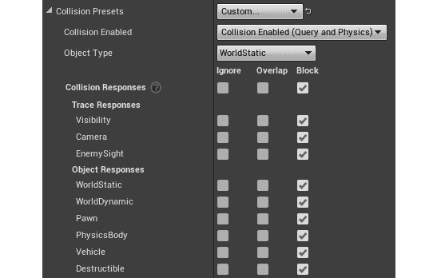

图 6.6：碰撞预设的变化

这些选项中的第一个是`CollisionEnabled`属性。它允许您指定要考虑此对象的碰撞的哪些方面：查询、物理、两者或无。再次，物理碰撞与物理模拟相关（此物体是否会被模拟物理的其他物体考虑），而查询碰撞与碰撞事件相关，以及物体是否会阻挡彼此的移动：

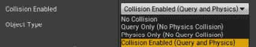

图 6.7：查询和物理的碰撞启用

第二个选项是`ObjectType`属性。这与跟踪通道概念非常相似，但专门用于对象碰撞，并且最重要的是决定了这是什么类型的碰撞对象。UE4 提供的对象类型值如下：

+   `WorldStatic`：不移动的物体（结构、建筑等）

+   `WorldDynamic`：可能移动的物体（由代码触发移动的物体，玩家可以拾取和移动的物体等）

+   `Pawn`：用于可以在级别中控制和移动的 Pawns

+   `PhysicsBody`：用于模拟物理的物体

+   `Vehicle`：用于车辆物体

+   `可破坏`：用于可破坏的网格

如前所述，您还可以创建自己的自定义对象类型（稍后在本章中提到），类似于您可以创建自己的跟踪通道（*在上一章中介绍过*）。

我们拥有的最后一个选项与`碰撞响应`有关。鉴于这个`Cube`对象具有默认的碰撞选项，所有响应都设置为`阻挡`，这意味着该对象将阻挡所有线跟踪和所有阻挡`WorldStatic`对象的对象，鉴于这是该对象的类型。

由于碰撞属性有很多不同的组合，UE4 允许您以碰撞预设的形式对碰撞属性值进行分组。

让我们回到`CollisionPresets`属性，它当前设置为`自定义`，并*点击*以查看所有可能的选项。一些现有的`碰撞预设`如下：

**无碰撞**：用于根本不受碰撞影响的物体：

+   `碰撞启用`：`无碰撞`

+   `物体类型`：`WorldStatic`

+   响应：无关

+   示例：纯粹是视觉和遥远的物体，如玩家永远不会接触的物体

**全部阻挡**：用于静态物体并阻挡所有其他物体：

+   `碰撞启用`：`查询`和`物理`

+   `物体类型`：`WorldStatic`

+   响应：`阻挡`所有通道

+   示例：靠近玩家角色并阻挡其移动的物体，如地板和墙壁，将始终保持静止

**重叠所有**：用于静态物体并与所有其他物体重叠：

+   `碰撞启用`：仅`查询`

+   `物体类型`：`WorldStatic`

+   响应：`重叠`所有通道

+   示例：放置在级别中的触发框，将始终保持静止

`全部阻挡`预设，但用于可能在游戏过程中改变其变换的动态物体（`物体类型`：`WorldDynamic`）

`Overlap All`预设，但对于可能在游戏过程中改变其变换的动态对象（`对象类型`：`WorldDynamic`）

**Pawn**：用于 pawns 和 characters：

+   `碰撞使能`：`Query`和`Physics`

+   `对象类型`：`Pawn`

+   响应：`Block`所有通道，`Ignore`可见性通道

+   示例：玩家角色和非玩家角色

物理演员：用于模拟物理的对象：

+   `碰撞使能`：`Query`和`Physics`

+   `对象类型`：`PhysicsBody`

+   响应：`Block`所有通道

+   示例：受物理影响的对象，比如从地板和墙壁上弹开的球

就像其他碰撞属性一样，你也可以创建自己的碰撞预设。

注意

你可以在这里找到 UE4 碰撞响应的完整参考：[`docs.unrealengine.com/en-US/Engine/Physics/Collision/Reference`](https://docs.unrealengine.com/en-US/Engine/Physics/Collision/Reference)。

现在我们了解了碰撞的基本概念，让我们继续开始创建`Dodgeball`类。下一个练习将指导你完成这个任务。

## 练习 6.01：创建 Dodgeball 类

在这个练习中，我们将创建我们的`Dodgeball`类，这个类将被敌人投掷，并且会像真正的躲避球一样从地板和墙壁上弹开。

在我们真正开始创建`Dodgeball` C++类和它的逻辑之前，我们应该为它设置所有必要的碰撞设置。

以下步骤将帮助你完成这个练习：

1.  打开我们的`Project Settings`并转到`Engine`部分中的`Collision`子部分。当前没有对象通道，所以你需要创建一个新的。

1.  点击`New Object Channel`按钮，命名为`Dodgeball`，并将其`默认响应`设置为`Block`。

1.  完成后，展开`Preset`部分。在这里，你会找到 UE4 中所有默认的预设。如果你选择其中一个并按下`Edit`选项，你可以更改该`Preset`碰撞的设置。

1.  通过按下`New`选项创建自己的`Preset`。我们希望我们的`Dodgeball` `Preset`设置如下：

+   `名称`：`Dodgeball`

+   `CollisionEnabled`：`Collision Enabled (Query and Physics)`（我们希望这也被考虑为物理模拟以及碰撞事件）

+   `对象类型`：`Dodgeball`

+   `碰撞响应`：对大多数选项选择*Block*，但对于相机和`EnemySight`选择*Ignore*（我们不希望躲避球阻挡相机或敌人的视线）

1.  一旦你选择了正确的选项，点击`Accept`。

现在`Dodgeball`类的碰撞设置已经设置好了，让我们创建`Dodgeball` C++类。

1.  在`Content Browser`中，*右键单击*并选择`New C++ Class`。

1.  选择`Actor`作为父类。

1.  选择`DodgeballProjectile`作为类的名称（我们的项目已经命名为`Dodgeball`，所以我们不能再将这个新类命名为`Dodgeball`）。

1.  在 Visual Studio 中打开`DodgeballProjectile`类文件。我们首先要做的是添加躲避球的碰撞组件，所以我们将在我们的类头文件中添加一个`SphereComponent`（*actor 组件属性通常是私有的*）：

```cpp
UPROPERTY(VisibleAnywhere, BlueprintReadOnly, Category =   Dodgeball, meta = (AllowPrivateAccess = "true"))
class USphereComponent* SphereComponent;
```

1.  接下来，在我们的源文件顶部包含`SphereComponent`类：

```cpp
#include "Components/SphereComponent.h"
```

注意

请记住，所有头文件包含都必须在`.generated.h`之前。

现在，前往`DodgeballProjectile`类的构造函数，在其源文件中执行以下步骤。

1.  创建`SphereComponent`对象：

```cpp
SphereComponent = CreateDefaultSubobject<USphereComponent>(TEXT("Sphere   Collision"));
```

1.  将其`半径`设置为`35`个单位：

```cpp
SphereComponent->SetSphereRadius(35.f);
```

1.  将其`碰撞预设`设置为我们创建的`Dodgeball`预设：

```cpp
SphereComponent->SetCollisionProfileName(FName("Dodgeball"));
```

1.  我们希望`Dodgeball`模拟物理，因此通知组件进行如下所示的设置：

```cpp
SphereComponent->SetSimulatePhysics(true);
```

1.  我们希望`Dodgeball`在模拟物理时调用`OnHit`事件，因此调用`SetNotifyRigidBodyCollision`函数以将其设置为`true`（这与我们在对象属性的`Collision`部分看到的`SimulationGeneratesHitEvents`属性相同）：

```cpp
//Simulation generates Hit events
SphereComponent->SetNotifyRigidBodyCollision(true);
```

我们还希望监听`SphereComponent`的`OnHit`事件。

1.  在`DodgeballProjectile`类的头文件中为将在`OnHit`事件触发时调用的函数创建声明。此函数应该被命名为`OnHit`。它应该是`public`，不返回任何内容（`void`），具有`UFUNCTION`宏，并按照以下顺序接收一些参数：

+   `UPrimitiveComponent* HitComp`：被击中并属于此演员的组件。原始组件是具有`Transform`属性和某种几何形状（例如`Mesh`或`Shape`组件）的演员组件。

+   `AActor* OtherActor`：碰撞中涉及的另一个演员。

+   `UPrimitiveComponent* OtherComp`：被击中并属于其他演员的组件。

+   `FVector NormalImpulse`：对象被击中后将移动的方向，以及以多大的力（通过检查向量的大小）。此参数仅对模拟物理的对象是非零的。

+   `FHitResult& Hit`：碰撞结果的数据，包括此对象与其他对象之间的碰撞。正如我们在上一章中看到的，它包含诸如`Hit`位置、法线、击中的组件和演员等属性。大部分相关信息已经通过其他参数可用，但如果需要更详细的信息，可以访问此参数：

```cpp
UFUNCTION()
void OnHit(UPrimitiveComponent* HitComp, AActor* OtherActor,   UPrimitiveComponent* OtherComp, FVector NormalImpulse, const   FHitResult& Hit);
```

将`OnHit`函数的实现添加到类的源文件中，并在该函数中，至少暂时，当它击中玩家时销毁躲避球。

1.  将`OtherActor`参数转换为我们的`DodgeballCharacter`类，并检查该值是否不是`nullptr`。如果不是，则表示我们击中的其他演员是`DodgeballCharacter`，我们将销毁此`DodgeballProjectile`演员：

```cpp
void ADodgeballProjectile::OnHit(UPrimitiveComponent *   HitComp, AActor * OtherActor, UPrimitiveComponent *   OtherComp, FVector NormalImpulse, const FHitResult & Hit)
{
  if (Cast<ADodgeballCharacter>(OtherActor) != nullptr)
  {
    Destroy();
  }
}
```

鉴于我们正在引用`DodgebalCharacter`类，我们需要在此类的源文件顶部包含它：

```cpp
#include "DodgeballCharacter.h"
```

注意

在下一章中，我们将更改此函数，使得躲避球在销毁自身之前对玩家造成伤害。我们将在讨论 Actor 组件时进行此操作。

1.  返回`DodgeballProjectile`类的构造函数，并在末尾添加以下行，以便监听`SphereComponent`的`OnHit`事件：

```cpp
// Listen to the OnComponentHit event by binding it to our   function
SphereComponent->OnComponentHit.AddDynamic(this,   &ADodgeballProjectile::OnHit);
```

这将绑定我们创建的`OnHit`函数到这个`SphereComponent`的`OnHit`事件（因为这是一个演员组件，此事件称为`OnComponentHit`），这意味着我们的函数将与该事件一起被调用。

1.  最后，将`SphereComponent`设置为该演员的`RootComponent`，如下面的代码片段所示：

```cpp
// Set this Sphere Component as the root component,
// otherwise collision won't behave properly
RootComponent = SphereComponent;
```

注意

为了使移动的演员在碰撞时正确行为，无论是否模拟物理，通常需要将演员的主要碰撞组件设置为其`RootComponent`。

例如，`Character`类的`RootComponent`是 Capsule Collider 组件，因为该演员将在周围移动，该组件是角色与环境碰撞的主要方式。

现在我们已经添加了`DodgeballProjectile`C++类的逻辑，让我们继续创建我们的蓝图类。

1.  编译更改并打开编辑器。

1.  转到内容浏览器中的`Content` > `ThirdPersonCPP` > `Blueprints`目录，右键单击，创建一个新的蓝图类。

1.  展开“所有类”部分，搜索`DodgeballProjectile`类，然后将其设置为父类。

1.  将新的蓝图类命名为`BP_DodgeballProjectile`。

1.  打开这个新的蓝图类。

1.  注意演员视口窗口中`SphereCollision`组件的线框表示（默认情况下在游戏过程中隐藏，但可以通过更改此组件的`Rendering`部分中的`HiddenInGame`属性来更改该属性）：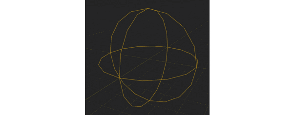

图 6.8：SphereCollision 组件的视觉线框表示

1.  现在，添加一个新的`球体`网格作为现有的`球体碰撞`组件的子级：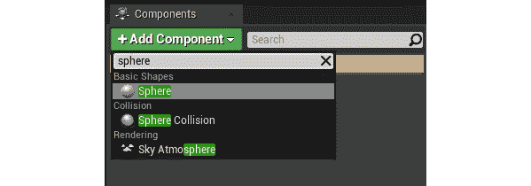

图 6.9：添加一个球体网格

1.  将其比例更改为`0.65`，如下图所示：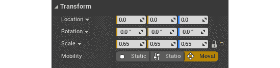

图 6.10：更新比例

1.  将其`碰撞预设`设置为`无碰撞`：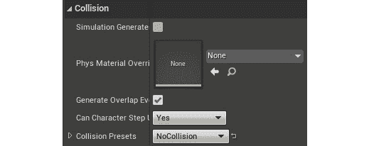

图 6.11：更新碰撞预设为无碰撞

1.  最后，打开我们的关卡，并在玩家附近放置一个`BP_DodgeballProjectile`类的实例（这个实例放置在 600 单位的高度）：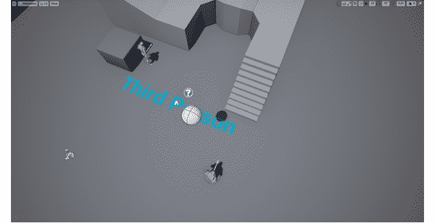

图 6.12：躲避球在地面上弹跳

完成这些操作后，玩这个关卡。你会注意到躲避球会受到重力的影响，在触地几次后停止下来。

通过完成这个练习，你已经创建了一个行为像物理对象的对象。

现在你知道如何创建自己的碰撞对象类型，使用`OnHit`事件，并更改对象的碰撞属性。

注意

在上一章中，我们简要提到了`LineTraceSingleByObjectType`。现在我们知道对象碰撞是如何工作的，我们可以简要提到它的用法：当执行检查追踪通道的线追踪时，应该使用`LineTraceSingleByChannel`函数；当执行检查`对象`通道（对象类型）的线追踪时，应该使用`LineTraceSingleByObjectType`函数。应该明确指出，与`LineTraceSingleByChannel`函数不同，这个函数不会检查阻挡特定对象类型的对象，而是检查特定对象类型的对象。这两个函数具有完全相同的参数，追踪通道和对象通道都可以通过`ECollisionChannel`枚举来使用。

但是，如果你想让球在地板上弹跳更多次呢？如果你想让它更有弹性呢？那么物理材料就派上用场了。

# 物理材料

在 UE4 中，你可以通过物理材料来自定义对象在模拟物理时的行为方式。为了进入这种新类型的资产，让我们创建我们自己的：

1.  在`内容`文件夹内创建一个名为`物理`的新文件夹。

1.  *在*该文件夹内的`内容浏览器`上右键单击，并在`创建高级资产`部分下，转到`物理`子部分并选择`物理材料`。

1.  将这个新的物理材料命名为`PM_Dodgeball`。

1.  打开资产并查看可用选项。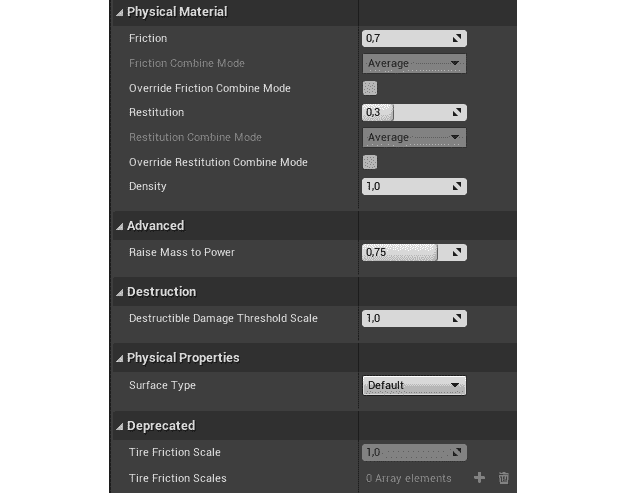

图 6.13：资产选项

我们应该注意的主要选项如下：

+   `摩擦`：此属性从`0`到`1`，指定摩擦对这个对象的影响程度（`0`表示此对象会像在冰上一样滑动，而`1`表示此对象会像一块口香糖一样粘住）。

+   `弹性`（也称为*弹性*）：此属性从`0`到`1`，指定与另一个对象碰撞后保留多少速度（`0`表示此对象永远不会从地面上弹跳，而`1`表示此对象将长时间弹跳）。

+   `密度`：此属性指定这个对象有多密集（即相对于其网格有多重）。两个对象可以是相同大小的，但如果一个比另一个密度高两倍，那就意味着它会重两倍。

为了让我们的`DodgeballProjectile`对象更接近实际的躲避球，它将不得不承受相当大的摩擦（默认值为`0.7`，足够高），并且非常有弹性。让我们将这个物理材料的`弹性`属性增加到`0.95`。

完成这些操作后，打开`BP_DodgeballProjectile`蓝图类，并在其`碰撞`部分内更改球体碰撞组件的物理材料为我们刚刚创建的`PM_Dodgeball`：

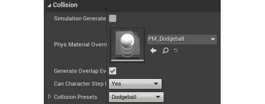

图 6.14：更新 BP_DodgeballProjectile 蓝图类

注意

确保您在级别中添加的躲避球角色实例也具有这种物理材料。

如果您再次玩我们在*练习 6.01*中创建的级别，*创建躲避球类*，您会注意到我们的`BP_DodgeballProjectile`现在会在停止之前在地面上反弹几次，行为更像一个真正的躲避球。

做完所有这些之后，我们只缺少一个东西，让我们的`Dodgeball`角色行为像一个真正的躲避球。现在，我们没有办法投掷它。所以，让我们通过创建一个投射物移动组件来解决这个问题，这就是我们下一个练习要做的事情。

在之前的章节中，当我们复制第三人称模板项目时，我们了解到 UE4 自带的`Character`类具有`CharacterMovementComponent`。这个角色组件是允许角色以各种方式在级别中移动的，它有许多属性，允许您根据自己的喜好进行自定义。然而，还有另一个经常使用的移动组件：`ProjectileMovementComponent`。

`ProjectileMovementComponent`角色组件用于将投射物的行为赋予角色。它允许您设置初始速度、重力力量，甚至一些物理模拟参数，如“弹性”和“摩擦力”。然而，鉴于我们的`Dodgeball Projectile`已经在模拟物理，我们将使用的唯一属性是`InitialSpeed`。

## 练习 6.02：向 DodgeballProjectile 添加一个投射物移动组件

在这个练习中，我们将向我们的`DodgeballProjectile`添加一个`ProjectileMovementComponent`，以便它具有初始的水平速度。我们这样做是为了让我们的敌人可以投掷它，而不仅仅是垂直下落。

以下步骤将帮助您完成这个练习：

1.  在`DodgeballProjectile`类的头文件中添加一个`ProjectileMovementComponent`属性：

```cpp
UPROPERTY(VisibleAnywhere, BlueprintReadOnly, Category =   Dodgeball, meta = (AllowPrivateAccess = "true"))
class UProjectileMovementComponent* ProjectileMovement;
```

1.  在类的源文件顶部包含`ProjectileMovementComponent`类：

```cpp
#include "GameFramework/ProjectileMovementComponent.h"
```

1.  在类的构造函数末尾，创建`ProjectileMovementComponent`对象：

```cpp
ProjectileMovement = CreateDefaultSubobject<UProjectileMovementComponent>(TEXT("Pro   jectile Movement"));
```

1.  然后，将其`InitialSpeed`设置为`1500`单位：

```cpp
ProjectileMovement->InitialSpeed = 1500.f;
```

完成此操作后，编译您的项目并打开编辑器。为了演示躲避球的初始速度，将其在*Z*轴上降低，并将其放在玩家后面（*这个放置在高度为 200 单位的位置*）：

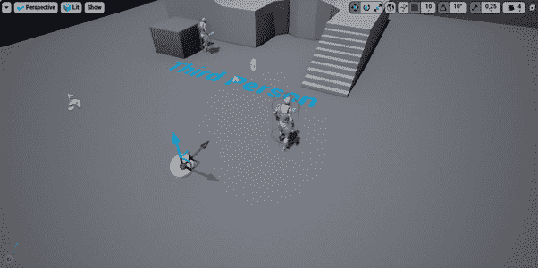

图 6.15：躲避球沿 X 轴移动

当您玩这个级别时，您会注意到躲避球开始朝着它的*X*轴移动（*红色箭头*）：

有了这个，我们可以结束我们的练习了。我们的`DodgeballProjectile`现在的行为就像一个真正的躲避球。它下落，弹跳，被投掷。

我们项目的下一步是为我们的`EnemyCharacter`添加逻辑，使其向玩家投掷这些躲避球，但在解决这个问题之前，我们必须先解决计时器的概念。

# 计时器

鉴于视频游戏的性质以及它们是强烈基于事件的，每个游戏开发工具都必须有一种方法让您在发生某事之前引起延迟或等待时间。例如，当您玩在线死亡竞赛游戏时，您的角色可以死亡然后重生，通常情况下，重生事件不会在您的角色死亡后立即发生，而是几秒钟后。有很多情况下，您希望某事发生，但只能在一定时间后发生。这将是我们的`EnemyCharacter`的情况，它将每隔几秒钟投掷一次躲避球。这种延迟或等待时间可以通过计时器实现。

**定时器**允许您在一定时间后调用一个函数。您可以选择以一定的时间间隔循环调用该函数，并在循环开始之前设置延迟。如果要停止定时器，也可以这样做。

我们将使用定时器，这样我们的敌人就可以每隔`X`时间投掷一个躲避球，只要它能看到玩家角色，并且当敌人不能再看到其目标时停止定时器。

在我们开始为`EnemyCharacter`类添加逻辑，使其向玩家投掷躲避球之前，我们应该看一下另一个主题，即如何生成演员。

# 生成演员

在*第一章*，*虚幻引擎介绍*中，您学会了如何通过编辑器在级别中放置您创建的演员，但是如果您想在游戏进行时将该演员放置在级别中呢？这就是我们现在要看的。

UE4，就像大多数其他游戏开发工具一样，允许您在游戏运行时放置一个演员。这个过程称为`SpawnActor`函数，可从`World`对象（我们可以使用之前提到的`GetWorld`函数访问）中获得。但是，`SpawnActor`函数有一些需要传递的参数，如下所示：

+   一个`UClass*`属性，让函数知道将要生成的对象的类。这个属性可以是一个 C++类，通过`NameOfC++Class::StaticClass()`函数可用，也可以是一个蓝图类，通过`TSubclassOf`属性可用。通常最好不要直接从 C++类生成演员，而是创建一个蓝图类并生成该类的实例。

+   `TSubclassOf`属性是您在 C++中引用蓝图类的一种方式。它用于在 C++代码中引用一个类，该类可能是蓝图类。您使用模板参数声明`TSubclassOf`属性，该参数是该类必须继承的 C++类。我们将在下一个练习中看一下如何在实践中使用这个属性。

+   无论是`FTransform`属性还是`FVector`和`FRotator`属性，都将指示我们想要生成的对象的位置、旋转和比例。

+   一个可选的`FActorSpawnParameters`属性，允许您指定与生成过程相关的更多属性，例如谁导致演员生成（即`Instigator`），如何处理对象生成，如果生成位置被其他对象占用，可能会导致重叠或阻塞事件等。

`SpawnActor`函数将返回从此函数生成的演员的实例。鉴于它也是一个模板函数，您可以以这样的方式调用它，以便使用模板参数直接接收到您生成的演员类型的引用：

```cpp
GetWorld()->SpawnActor<NameOfC++Class>(ClassReference,   SpawnLocation, SpawnRotation);
```

在这种情况下，正在调用`SpawnActor`函数，我们正在生成`NameOfC++Class`类的一个实例。在这里，我们使用`ClassReference`属性提供对类的引用，并使用`SpawnLocation`和`SpawnRotation`属性分别提供要生成的演员的位置和旋转。

您将在*练习 6.03*，*向 EnemyCharacter 添加投掷项目逻辑*中学习如何应用这些属性。

在继续练习之前，我想简要提一下`SpawnActor`函数的一个变体，这也可能会派上用场：`SpawnActorDeferred`函数。`SpawnActor`函数将创建您指定的对象的实例，然后将其放置在世界中，而这个新的`SpawnActorDeferred`函数将创建您想要的对象的实例，并且只有在调用演员的`FinishSpawning`函数时才将其放置在世界中。

例如，假设我们想在生成 Dodgeball 时更改其`InitialSpeed`。如果我们使用`SpawnActor`函数，Dodgeball 有可能在我们设置其`InitialSpeed`属性之前开始移动。然而，通过使用`SpawnActorDeferred`函数，我们可以创建一个 dodge ball 的实例，然后将其`InitialSpeed`设置为我们想要的任何值，然后通过调用新创建的 dodgeball 的`FinishSpawning`函数将其放置在世界中，该函数的实例由`SpawnActorDeferred`函数返回给我们。

现在我们知道如何在世界中生成一个 actor，也知道定时器的概念，我们可以在下一个练习中向我们的`EnemyCharacter`类添加负责投掷 dodge 球的逻辑。

## 练习 6.03：向 EnemyCharacter 添加投掷投射物的逻辑

在这个练习中，我们将向我们刚刚创建的`EnemyCharacter`类添加负责投掷 Dodgeball actor 的逻辑。

在 Visual Studio 中打开类的文件以开始。我们将首先修改我们的`LookAtActor`函数，以便我们可以保存告诉我们是否能看到玩家的值，并用它来管理我们的定时器。

按照以下步骤完成这个练习：

1.  在`EnemyCharacter`类的头文件中，将`LookAtActor`函数的返回类型从`void`更改为`bool`：

```cpp
// Change the rotation of the character to face the given   actor
// Returns whether the given actor can be seen
bool LookAtActor(AActor* TargetActor);
```

1.  在函数的实现中做同样的事情，在类的源文件中，同时在我们调用`CanSeeActor`函数的`if`语句结束时返回`true`。还在我们检查`TargetActor`是否为`nullptr`的第一个`if`语句中返回`false`，并在函数的结尾返回`false`：

```cpp
bool AEnemyCharacter::LookAtActor(AActor * TargetActor)
{
  if (TargetActor == nullptr) return false;
  if (CanSeeActor(TargetActor))
  {
    FVector Start = GetActorLocation();
    FVector End = TargetActor->GetActorLocation();
    // Calculate the necessary rotation for the Start point to   face the End point
    FRotator LookAtRotation = UKismetMathLibrary::FindLookAtRotation(Start, End);
    //Set the enemy's rotation to that rotation
    SetActorRotation(LookAtRotation);
    return true;
  }
  return false;
}
```

1.  接下来，在你的类头文件中添加两个`bool`属性，`bCanSeePlayer`和`bPreviousCanSeePlayer`，设置为`protected`，它们将表示敌人角色在这一帧中是否能看到玩家，以及上一帧中玩家是否能被看到：

```cpp
//Whether the enemy can see the player this frame
bool bCanSeePlayer = false;
//Whether the enemy could see the player last frame
bool bPreviousCanSeePlayer = false;
```

1.  然后，转到你的类的`Tick`函数实现，并将`bCanSeePlayer`的值设置为`LookAtActor`函数的返回值。这将替换对`LookAtActor`函数的先前调用：

```cpp
// Look at the player character every frame
bCanSeePlayer = LookAtActor(PlayerCharacter);
```

1.  然后，将`bPreviousCanSeePlayer`的值设置为`bCanSeePlayer`的值：

```cpp
bPreviousCanSeePlayer = bCanSeePlayer;
```

1.  在前两行之间添加一个`if`语句，检查`bCanSeePlayer`和`bPreviousCanSeePlayer`的值是否不同。这意味着我们上一帧看不到玩家，现在可以看到，或者我们上一帧看到玩家，现在看不到：

```cpp
bCanSeePlayer = LookAtActor(PlayerCharacter);
if (bCanSeePlayer != bPreviousCanSeePlayer)
{
}
bPreviousCanSeePlayer = bCanSeePlayer;
```

1.  在这个`if`语句中，如果我们能看到玩家，我们希望启动一个定时器，如果我们不能再看到玩家，就停止定时器：

```cpp
if (bCanSeePlayer != bPreviousCanSeePlayer)
{
  if (bCanSeePlayer)
  {
    //Start throwing dodgeballs
  }
  else
  {
    //Stop throwing dodgeballs
  }
}
```

1.  为了启动一个定时器，我们需要在类的头文件中添加以下属性，它们都可以是`protected`：

+   一个`FTimerHandle`属性，负责标识我们要启动的定时器。它基本上作为特定定时器的标识符：

```cpp
FTimerHandle ThrowTimerHandle;
```

+   一个`float`属性，表示投掷 dodgeball 之间等待的时间（间隔），以便我们可以循环定时器。我们给它一个默认值`2`秒：

```cpp
float ThrowingInterval = 2.f;
```

+   另一个`float`属性，表示定时器开始循环之前的初始延迟。让我们给它一个默认值`0.5`秒：

```cpp
float ThrowingDelay = 0.5f;
```

+   一个在定时器结束时调用的函数，我们将创建并命名为`ThrowDodgeball`。这个函数不返回任何值，也不接收任何参数：

```cpp
void ThrowDodgeball();
```

在我们的源文件中，为了调用适当的函数启动定时器，我们需要添加一个`#include`到负责这个的对象`FTimerManager`。

每个`World`都有一个定时器管理器，它可以启动和停止定时器，并访问与它们相关的相关函数，比如它们是否仍然活动，它们运行了多长时间等等：

```cpp
#include "TimerManager.h"
```

1.  现在，使用`GetWorldTimerManager`函数访问当前世界的定时器管理器：

```cpp
GetWorldTimerManager()
```

1.  接下来，如果我们能看到玩家角色，就调用定时器管理器的`SetTimer`函数，以启动负责投掷躲避球的计时器。`SetTimer`函数接收以下参数：

+   代表所需计时器的`FTimerHandle`：`ThrowTimerHandle`。

+   要调用的函数所属的对象：`this`。

+   要调用的函数，必须通过在其名称前加上`&ClassName::`来指定，得到`&AEnemyCharacter::ThrowDodgeball`。

+   计时器的速率或间隔：`ThrowingInterval`。

+   这个计时器是否会循环：`true`。

+   这个计时器开始循环之前的延迟：`ThrowingDelay`。

以下代码片段包括这些参数：

```cpp
if (bCanSeePlayer)
{
  //Start throwing dodgeballs
  GetWorldTimerManager().SetTimer(ThrowTimerHandle,this,  &AEnemyCharacter::ThrowDodgeball,ThrowingInterval,true,  ThrowingDelay);
}
```

1.  如果我们看不到玩家并且想要停止计时器，可以使用`ClearTimer`函数来实现。这个函数只需要接收一个`FTimerHandle`属性作为参数：

```cpp
else
{
  //Stop throwing dodgeballs
  GetWorldTimerManager().ClearTimer(ThrowTimerHandle);
}
```

现在唯一剩下的就是实现`ThrowDodgeball`函数。这个函数将负责生成一个新的`DodgeballProjectile`角色。为了做到这一点，我们需要一个引用要生成的类，它必须继承自`DodgeballProjectile`，所以下一步我们需要使用`TSubclassOf`对象创建适当的属性。

1.  在`EnemyCharacter`头文件中创建`TSubclassOf`属性，可以是`public`：

```cpp
//The class used to spawn a dodgeball object
UPROPERTY(EditDefaultsOnly, BlueprintReadOnly, Category =   Dodgeball)
TSubclassOf<class ADodgeballProjectile> DodgeballClass;
```

1.  因为我们将使用`DodgeballProjectile`类，所以我们还需要在`EnemyCharacter`源文件中包含它：

```cpp
#include "DodgeballProjectile.h"
```

1.  然后，在源文件中`ThrowDodgeball`函数的实现中，首先检查这个属性是否为`nullptr`。如果是，我们立即`return`：

```cpp
void AEnemyCharacter::ThrowDodgeball()
{
  if (DodgeballClass == nullptr)
  {
    return;
  }
}
```

1.  接下来，我们将从该类中生成一个新的角色。它的位置将在敌人前方`40`个单位，旋转角度与敌人相同。为了在敌人前方生成躲避球，我们需要访问敌人的`ForwardVector`属性，这是一个单位`FVector`（*意味着它的长度为 1*），表示角色面对的方向，并将其乘以我们想要生成躲避球的距离，即`40`个单位：

```cpp
FVector ForwardVector = GetActorForwardVector();
float SpawnDistance = 40.f;
FVector SpawnLocation = GetActorLocation() + (ForwardVector *   SpawnDistance);
//Spawn new dodgeball
GetWorld()->SpawnActor<ADodgeballProjectile>(DodgeballClass,   SpawnLocation, GetActorRotation());
```

这完成了我们需要对`EnemyCharacter`类进行的修改。在完成设置此逻辑的蓝图之前，让我们快速修改一下我们的`DodgeballProjectile`类。

1.  在 Visual Studio 中打开`DodgeballProjectile`类的源文件。

1.  在其`BeginPlay`事件中，将其`LifeSpan`设置为`5`秒。这个属性属于所有角色，规定了它们在游戏中还会存在多久才会被销毁。通过在`BeginPlay`事件中将我们的躲避球的`LifeSpan`设置为`5`秒，我们告诉 UE4 在它生成后 5 秒后销毁该对象（*或者，如果它已经放置在关卡中，在游戏开始后 5 秒*）。我们这样做是为了避免在一定时间后地板上充满了躲避球，这会让游戏对玩家来说变得意外困难：

```cpp
void ADodgeballProjectile::BeginPlay()
{
  Super::BeginPlay();

  SetLifeSpan(5.f);
}
```

现在我们已经完成了与`EnemyCharacter`类的躲避球投掷逻辑相关的 C++逻辑，让我们编译我们的更改，打开编辑器，然后打开我们的`BP_EnemyCharacter`蓝图。在那里，转到`Class Defaults`面板，并将`DodgeballClass`属性的值更改为`BP_DodgeballProjectile`：

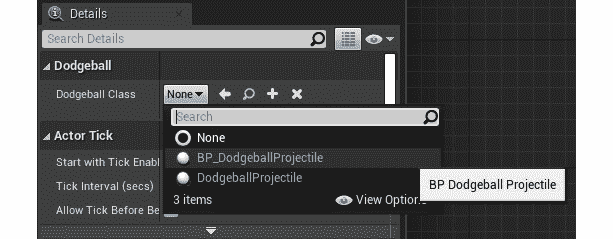

图 6.16：更新躲避球类

完成后，如果还在的话，可以移除我们在关卡中放置的`BP_DodgeballProjectile`类的现有实例。

现在，我们可以玩我们的关卡。你会注意到敌人几乎立即开始向玩家投掷躲避球，并且只要玩家角色在视线中，它就会继续这样做：

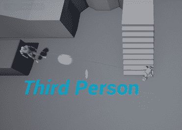

图 6.17：敌人角色在玩家视线中投掷躲避球

有了这个，我们已经完成了`EnemyCharacter`的躲避球投掷逻辑。您现在知道如何使用定时器，这是任何游戏程序员的必备工具。

# 墙

我们项目的下一步将是创建`Wall`类。我们将有两种类型的墙：

+   一个普通的墙，它将阻挡敌人的视线，玩家角色和躲避球。

+   一个幽灵墙，它只会阻挡玩家角色，而不会阻挡敌人的视线和躲避球。您可能会在特定类型的益智游戏中找到这种类型的碰撞设置。

我们将在下一个练习中创建这两个 Wall 类。

## 练习 6.04：创建 Wall 类

在这个练习中，我们将创建代表普通`Wall`和`GhostWall`的`Wall`类，后者只会阻挡玩家角色的移动，而不会阻挡敌人的视线或他们投掷的躲避球。

让我们从普通的`Wall`类开始。这个 C++类基本上是空的，因为它唯一需要的是一个网格，以便反射抛射物并阻挡敌人的视线，这将通过其蓝图类添加。

以下步骤将帮助您完成此练习：

1.  打开编辑器。

1.  在内容浏览器的左上角，按绿色的`添加新`按钮。

1.  在顶部选择第一个选项；`添加功能或内容包`。

1.  将会出现一个新窗口。选择`内容包`选项卡，然后选择`Starter Content`包，然后按`添加到项目`按钮。这将向项目中添加一些基本资产，我们将在本章和一些后续章节中使用。

1.  创建一个名为`Wall`的新的 C++类，其父类为`Actor`类。

1.  接下来，在 Visual Studio 中打开类的文件，并将`SceneComponent`添加为我们的 Wall 的`RootComponent`：

+   `Header`文件将如下所示：

```cpp
private:
UPROPERTY(VisibleAnywhere, BlueprintReadOnly, Category = Wall,   meta = (AllowPrivateAccess = "true"))
class USceneComponent* RootScene;
```

+   `Source`文件将如下所示：

```cpp
AWall::AWall()
{
  // Set this actor to call Tick() every frame.  You can turn   this off to improve performance if you don't need it.
  PrimaryActorTick.bCanEverTick = true;
  RootScene = CreateDefaultSubobject<USceneComponent>(TEXT("Root"));
  RootComponent = RootScene;
}
```

1.  编译您的代码并打开编辑器。

1.  接下来，转到内容浏览器中的`Content` > `ThirdPersonCPP` >:`Blueprints`目录，创建一个新的蓝图类，该类继承自`Wall`类，命名为`BP_Wall`，然后打开该资产。

1.  添加一个静态网格组件，并将其`StaticMesh`属性设置为`Wall_400x300`。

1.  将其`Material`属性设置为`M_Metal_Steel`。

1.  将静态网格组件的位置设置在*X*轴上为`-200`单位（*以便网格相对于我们的角色原点居中*）：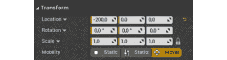

图 6.18：更新静态网格组件的位置

这是您的蓝图类的视口应该看起来的样子：

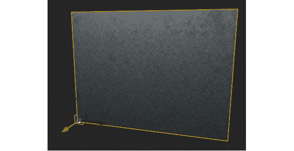

图 6.19：蓝图类的视口墙

注意

通常最好将`SceneComponent`添加为对象的`RootComponent`，当不需要碰撞组件时，以便允许更多的灵活性与其子组件。

演员的`RootComponent`不能修改其位置或旋转，这就是为什么在我们的情况下，如果我们在 Wall C++类中创建了一个静态网格组件，并将其设置为其 Root Component，而不是使用场景组件，我们将很难对其进行偏移。

现在我们已经设置了常规的`Wall`类，让我们创建我们的`GhostWall`类。因为这些类没有设置任何逻辑，我们只是将`GhostWall`类创建为`BP_Wall`蓝图类的子类，而不是我们的 C++类。

1.  *右键单击*`BP_Wall`资产，然后选择`创建子蓝图类`。

1.  将新的蓝图命名为`BP_GhostWall`。

1.  打开它。

1.  更改静态网格组件的碰撞属性：

+   将其`CollisionPreset`设置为`Custom`。

+   将其响应更改为`EnemySight`和`Dodgeball`通道都为`Overlap`。

1.  将静态网格组件的`Material`属性更改为`M_Metal_Copper`。

您的`BP_GhostWall`的视口现在应该是这样的：

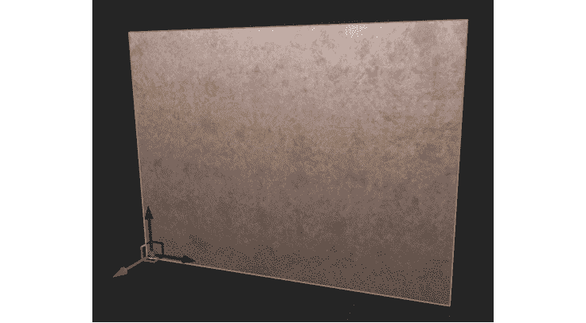

图 6.20：创建 Ghost Wall

现在你已经创建了这两个 Wall 角色，将它们放在关卡中进行测试。将它们的变换设置为以下变换值：

+   Wall：`位置`：`(-710, 120, 130)`

+   Ghost Wall：`位置`：`(-910, -100, 130)`；`旋转`：`(0, 0, 90)`：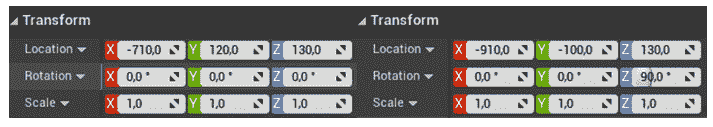

图 6.21：更新 Ghost Wall 的位置和旋转

最终结果应该是这样的：

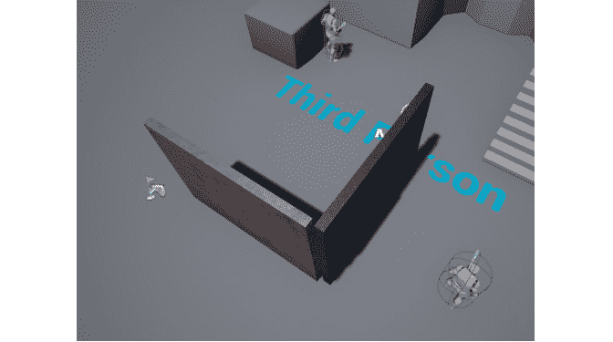

图 6.22：带有 Ghost Wall 和 Wall 的最终结果

当你把你的角色藏在普通的`Wall`（右边的那个）后面时，敌人不会向玩家扔躲避球；然而，当你试图把你的角色藏在`GhostWall`（左边的那个）后面时，即使敌人无法穿过它，敌人也会向角色扔躲避球，它们会穿过墙壁，就好像它不存在一样！

这就结束了我们的练习。我们已经制作了我们的`Wall`角色，它们将正常运作或者忽略敌人的视线和躲避球！

# 胜利宝盒

我们项目的下一步将是创建`VictoryBox`角色。这个角色将负责在玩家角色进入时结束游戏，前提是玩家已经通过了关卡。为了做到这一点，我们将使用`Overlap`事件。接下来的练习将帮助我们理解 Victory Box。

## 练习 6.05：创建 VictoryBox 类

在这个练习中，我们将创建`VictoryBox`类，当玩家角色进入时，游戏将结束。

以下步骤将帮助你完成这个练习：

1.  创建一个继承自角色的新的 C++类，并将其命名为`VictoryBox`。

1.  在 Visual Studio 中打开该类的文件。

1.  创建一个新的`SceneComponent`属性，它将被用作`RootComponent`，就像我们的`Wall`C++类一样：

+   `Header`文件：

```cpp
private:
UPROPERTY(VisibleAnywhere, BlueprintReadOnly, Category =   VictoryBox, meta = (AllowPrivateAccess = "true"))
class USceneComponent* RootScene;
```

+   `源`文件：

```cpp
AVictoryBox::AVictoryBox()
{
  // Set this actor to call Tick() every frame.  You can turn   this off to improve performance if you don't need it.
  PrimaryActorTick.bCanEverTick = true;
  RootScene =   CreateDefaultSubobject<USceneComponent>(TEXT("Root"));
  RootComponent = RootScene;
}
```

1.  在头文件中声明一个`BoxComponent`，它将检查与玩家角色的重叠事件，也应该是`private`：

```cpp
UPROPERTY(VisibleAnywhere, BlueprintReadOnly, Category =   VictoryBox, meta = (AllowPrivateAccess = "true"))
class UBoxComponent* CollisionBox;
```

1.  在类的源文件中包含`BoxComponent`文件：

```cpp
#include "Components/BoxComponent.h"
```

1.  创建`RootScene`组件后，创建`BoxComponent`，它也应该是`private`：

```cpp
RootScene = CreateDefaultSubobject<USceneComponent>(TEXT("Root"));
RootComponent = RootScene;
CollisionBox =   CreateDefaultSubobject<UBoxComponent>(TEXT("Collision Box"));
```

1.  使用`SetupAttachment`函数将其附加到`RootComponent`：

```cpp
CollisionBox->SetupAttachment(RootComponent);
```

1.  将其`BoxExtent`属性设置为所有轴上的`60`单位。这将使`BoxComponent`的大小加倍为`(120 x 120 x 120)`：

```cpp
CollisionBox->SetBoxExtent(FVector(60.0f, 60.0f, 60.0f));
```

1.  使用`SetRelativeLocation`函数将其相对位置在*Z*轴上偏移`120`单位：

```cpp
CollisionBox->SetRelativeLocation(FVector(0.0f, 0.0f,   120.0f));
```

1.  现在，你需要一个函数来监听`BoxComponent`的`OnBeginOverlap`事件。每当一个对象进入`BoxComponent`时，这个事件将被调用。这个函数必须在`UFUNCTION`宏之前，是`public`的，不返回任何内容，并具有以下参数：

```cpp
UFUNCTION()
void OnBeginOverlap(UPrimitiveComponent* OverlappedComp,   AActor* OtherActor, UPrimitiveComponent* OtherComp, int32   OtherBodyIndex, bool bFromSweep, const FHitResult&   SweepResult);
```

参数如下：

+   `UPrimitiveComponent* OverlappedComp`：被重叠并属于该角色的组件。

+   `AActor* OtherActor`：参与重叠的其他角色。

+   `UPrimitiveComponent* OtherComp`：被重叠并属于其他角色的组件。

+   `int32 OtherBodyIndex`：被击中的原始中的项目索引（通常对于实例化静态网格组件很有用）。

+   `bool bFromSweep`：重叠是否起源于扫描跟踪。

+   `FHitResult& SweepResult`：由该对象与其他对象之间的碰撞产生的扫描跟踪的数据。

注意

虽然我们在这个项目中不会使用`OnEndOverlap`事件，但你很可能以后会需要使用它，所以这是该事件的必需函数签名，它看起来与我们刚刚学到的那个函数非常相似：

`UFUNCTION()`

`void OnEndOverlap(UPrimitiveComponent* OverlappedComp, AActor* OtherActor, UPrimitiveComponent* OtherComp, int32 OtherBodyIndex);`

1.  接下来，我们需要将这个函数绑定到`BoxComponent`的`OnComponentBeginOverlap`事件上：

```cpp
CollisionBox->OnComponentBeginOverlap.AddDynamic(this,   &AVictoryBox::OnBeginOverlap);
```

1.  在我们的`OnBeginOverlap`函数实现中，我们将检查我们重叠的角色是否是`DodgeballCharacter`。因为我们将引用这个类，所以我们也需要包括它：

```cpp
#include "DodgeballCharacter.h" 
void AVictoryBox::OnBeginOverlap(UPrimitiveComponent *   OverlappedComp, AActor * OtherActor, UPrimitiveComponent *   OtherComp, int32 OtherBodyIndex, bool bFromSweep, const   FHitResult & SweepResult)
{
  if (Cast<ADodgeballCharacter>(OtherActor))
  {
  }
}
```

如果我们重叠的角色是`DodgeballCharacter`，我们想要退出游戏。

1.  我们将使用`KismetSystemLibrary`来实现这个目的。`KismetSystemLibrary`类包含了在项目中通用使用的有用函数：

```cpp
#include "Kismet/KismetSystemLibrary.h"
```

1.  为了退出游戏，我们将调用`KismetSystemLibrary`的`QuitGame`函数。这个函数接收以下内容：

```cpp
UKismetSystemLibrary::QuitGame(GetWorld(),
  nullptr,
  EQuitPreference::Quit,
  true);
```

前面代码片段中的重要参数解释如下：

+   一个`World`对象，我们可以用`GetWorld`函数访问。

+   一个`PlayerController`对象，我们将设置为`nullptr`。我们这样做是因为这个函数会自动这样找到一个。

+   一个`EQuitPreference`对象，表示我们想要结束游戏的方式，是退出还是只将其作为后台进程。我们希望实际退出游戏，而不只是将其作为后台进程。

+   一个`bool`，表示我们是否想要忽略平台的限制来退出游戏，我们将设置为`true`。

接下来，我们将创建我们的蓝图类。

1.  编译你的更改，打开编辑器，转到“内容”→`ThirdPersonCPP`→“蓝图”目录，在“内容浏览器”中创建一个继承自`VictoryBox`的新蓝图类，并命名为`BP_VictoryBox`。打开该资产并进行以下修改：

+   添加一个新的静态网格组件。

+   将其`StaticMesh`属性设置为`Floor_400x400`。

+   将其“材质”属性设置为`M_Metal_Gold`。

+   将其比例设置为所有三个轴上的`0.75`单位。

+   将其位置设置为“（-150，-150，20）”，分别在*X*、*Y*和*Z*轴上。

在你做出这些改变之后，你的蓝图的视口选项卡应该看起来像这样：

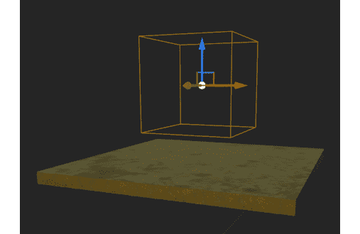

图 6.23：胜利盒放置在蓝图的视口选项卡中

将蓝图放在你的关卡中以测试其功能：

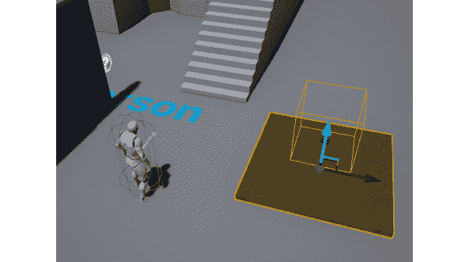

图 6.24：用于测试的胜利盒蓝图在关卡中

如果你玩这个关卡并踏上金色的板子（并重叠碰撞箱），你会注意到游戏突然结束，这是预期的。

有了这个，我们结束了`VictoryBox`类！你现在知道如何在你自己的项目中使用重叠事件。使用这些事件，你可以创建多种游戏机制，恭喜你完成了这个练习。

我们现在非常接近完成本章的结尾，我们将完成一个新的活动，但首先，我们需要对我们的`DodgeballProjectile`类进行一些修改，即在下一个练习中添加一个 getter 函数到它的`ProjectileMovementComponent`。

一个 getter 函数是一个只返回特定属性并且不做其他事情的函数。这些函数通常被标记为内联，这意味着当代码编译时，对该函数的调用将简单地被替换为它的内容。它们通常也被标记为`const`，因为它们不修改类的任何属性。

## 练习 6.06：在 DodgeballProjectile 中添加 ProjectileMovementComponent Getter 函数

在这个练习中，我们将向`DodgeballProjectile`类的`ProjectileMovement`属性添加一个 getter 函数，以便其他类可以访问它并修改它的属性。我们将在本章的活动中做同样的事情。

为了做到这一点，你需要按照以下步骤进行：

1.  在 Visual Studio 中打开`DodgeballProjectile`类的头文件。

1.  添加一个名为`GetProjectileMovementComponent`的新`public`函数。这个函数将是一个内联函数，在 UE4 的 C++版本中用`FORCEINLINE`宏替换。该函数还应返回一个`UProjectileMovementComponent*`并且是一个`const`函数：

```cpp
FORCEINLINE class UProjectileMovementComponent*   GetProjectileMovementComponent() const
{
  return ProjectileMovement;
}
```

注意

在特定函数使用`FORCEINLINE`宏时，不能将该函数的声明添加到头文件中，然后将其实现添加到源文件中。两者必须同时在头文件中完成，如前所示。

通过这样做，我们完成了这个快速练习。在这里，我们为`DodgeballProjectile`类添加了一个简单的`getter`函数，我们将在本章的活动中使用它，在这里，我们将在`EnemyCharacter`类中用`SpawnActorDeferred`函数替换`SpawnActor`函数。这将允许我们在生成实例之前安全地编辑`DodgeballProjectile`类的属性。

## 活动 6.01：在 EnemyCharacter 中用 SpawnActorDeferred 替换 SpawnActor 函数

在这个活动中，您将更改 EnemyCharacter 的`ThrowDodgeball`函数，以便使用`SpawnActorDeferred`函数而不是`SpawnActor`函数，以便在生成之前更改`DodgeballProjectile`的`InitialSpeed`。

以下步骤将帮助您完成此活动：

1.  在 Visual Studio 中打开`EnemyCharacter`类的源文件。

1.  转到`ThrowDodgeball`函数的实现。

1.  因为`SpawnActorDeferred`函数不能只接收生成位置和旋转属性，而必须接收一个`FTransform`属性，所以我们需要在调用该函数之前创建一个。让我们称之为`SpawnTransform`，并按顺序发送生成旋转和位置作为其构造函数的输入，这将是这个敌人的旋转和`SpawnLocation`属性，分别。

1.  然后，将`SpawnActor`函数调用更新为`SpawnActorDeferred`函数调用。将生成位置和生成旋转作为其第二个和第三个参数发送，将这些替换为我们刚刚创建的`SpawnTransform`属性作为第二个参数。

1.  确保将此函数调用的返回值保存在名为`Projectile`的`ADodgeballProjectile*`属性中。

完成此操作后，您将成功创建一个新的`DodgeballProjectile`对象。但是，我们仍然需要更改其`InitialSpeed`属性并实际生成它。

1.  调用`SpawnActorDeferred`函数后，调用`Projectile`属性的`GetProjectileMovementComponent`函数，该函数返回其 Projectile Movement Component，并将其`InitialSpeed`属性更改为`2200`单位。

1.  因为我们将在`EnemyCharacter`类中访问属于 Projectile Movement Component 的属性，所以我们需要像在*Exercise 6.02*，*Adding a Projectile Movement Component to DodgeballProjectile*中那样包含该组件。

1.  在更改`InitialSpeed`属性的值后，唯一剩下的事情就是调用`Projectile`属性的`FinishSpawning`函数，该函数将接收我们创建的`SpawnTransform`属性作为参数。

1.  完成此操作后，编译更改并打开编辑器。

预期输出：

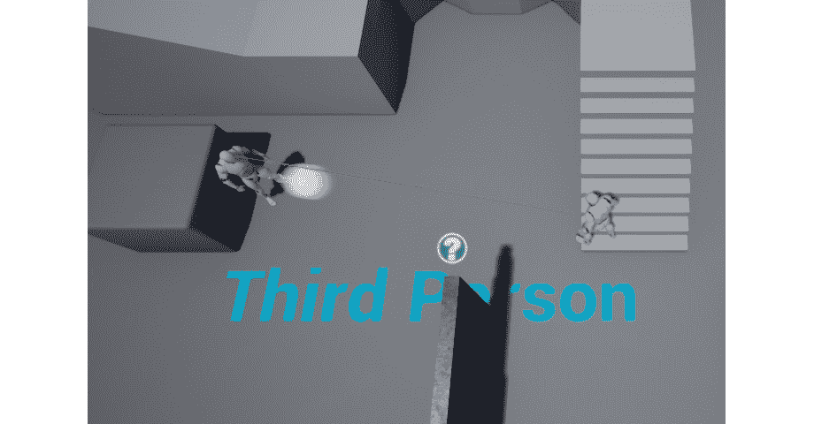

图 6.25：向玩家投掷躲避球

注意

此活动的解决方案可在以下网址找到：[`packt.live/338jEBx`](https://packt.live/338jEBx)。

通过完成此活动，您已巩固了`SpawnActorDeferred`函数的使用，并知道如何在将来的项目中使用它。

# 总结

在本章中，您已经学会了如何使用物理模拟影响对象，创建自己的对象类型和碰撞预设，使用`OnHit`，`OnBeginOverlap`和`OnEndOverlap`事件，更新对象的物理材料以及使用定时器。

现在你已经学会了碰撞主题的这些基本概念，你将能够想出新的创造性方式来运用它们，从而创建你自己的项目。

在下一章中，我们将看一下角色组件、接口和蓝图函数库，这些对于保持项目的复杂性可控和高度模块化非常有用，因此可以轻松地将一个项目的部分添加到另一个项目中。
