# 8. 用户界面

概述

在本章中，我们将继续我们在过去几章中一直在进行的基于躲避球的游戏的工作。我们将通过学习游戏 UI（用户界面）及其形式之一，即菜单和 HUD，来继续这个项目。到本章结束时，您将能够使用 UE4 的游戏 UI 系统 UMG 来制作一个带有可交互按钮的菜单，以及通过进度条显示玩家角色当前生命值的 HUD。

# 介绍

在上一章中，我们学习了通用工具，这些工具允许您通过使用蓝图函数库、角色组件和接口来正确结构化和组织项目中的代码和资产。

在本章中，我们将深入探讨游戏 UI 的主题，这是几乎每个视频游戏中都存在的东西。游戏 UI 是向玩家展示信息的主要方式之一，例如他们还剩下多少条命，他们的武器里有多少子弹，他们携带的武器是什么等等，并且允许玩家通过选择是否继续游戏、创建新游戏、选择要在哪个级别中玩等方式与游戏进行交互。这通常以图像和文本的形式展示给玩家。

**用户界面**或**UI**通常添加在游戏的渲染之上，这意味着它们位于游戏中您看到的所有其他内容的前面，并且行为类似于图层（您可以像在 Photoshop 中一样将它们叠加在彼此之上）。但是，也有一个例外：*直接 UI*。这种类型的 UI 不是分层到游戏的屏幕上，而是存在于游戏本身之内。一个很好的例子可以在游戏*死亡空间*中找到，在这个游戏中，您以第三人称视角控制一个角色，并且可以通过观察连接到他们背部的装置来看到他们的生命值，这是在游戏世界内部。

# 游戏 UI

通常有两种不同类型的游戏 UI：**菜单**和**HUD**。

菜单是允许玩家与之交互的 UI 面板，可以通过按下输入设备上的按钮或键来实现。

这可以通过许多不同的菜单形式来实现，包括以下内容：

+   主菜单，玩家可以选择是否继续游戏、创建新游戏、退出游戏等等

+   级别选择菜单，玩家可以选择要玩的级别

+   以及其他许多选项

HUD 是游戏过程中存在的 UI 面板，向玩家提供他们应该始终知道的信息，例如他们还剩下多少条命，他们可以使用哪些特殊能力等等。

在本章中，我们将涵盖游戏 UI，并为我们的游戏制作菜单和 HUD。

注意

我们不会在这里涵盖直接 UI，因为它超出了本书的范围。

那么我们如何在 UE4 中创建游戏 UI 呢？这样做的主要方式是使用**虚幻运动图形**（**UMG**），这是一种工具，允许您制作游戏 UI（在 UE4 术语中也称为小部件），包括菜单和 HUD，并将它们添加到屏幕上。

让我们在下一节中深入探讨这个主题。

# UMG 基础知识

在 UE4 中，创建游戏 UI 的主要方式是使用 UMG 工具。这个工具将允许您以`设计师`选项卡的形式制作游戏 UI，同时还可以通过 UMG 的`图表`选项卡为您的游戏 UI 添加功能。

小部件是 UE4 允许您表示游戏 UI 的方式。小部件可以是基本的 UI 元素，如`按钮`、`文本`元素和`图像`，但它们也可以组合在一起创建更复杂和完整的小部件，如菜单和 HUD，这正是我们将在本章中要做的。

让我们在下一个练习中使用 UMG 工具在 UE4 中创建我们的第一个小部件。

## 练习 8.01：创建小部件蓝图

在这个练习中，我们将创建我们的第一个小部件蓝图，并学习 UMG 的基本元素以及如何使用它们来创建游戏 UI。

以下步骤将帮助您完成这个练习：

1.  为了创建我们的第一个小部件，打开编辑器，转到`Content Browser`中的`ThirdPersonCPP -> Blueprints`文件夹，然后*右键单击*。

1.  转到最后一节，`用户界面`，然后选择`小部件蓝图`。

选择此选项将创建一个新的`小部件蓝图`，这是 UE4 中小部件资产的名称。

1.  将此小部件命名为`TestWidget`并打开它。您将看到用于编辑小部件蓝图的界面，在那里您将创建自己的小部件和 UI。以下是此窗口中所有选项卡的详细信息：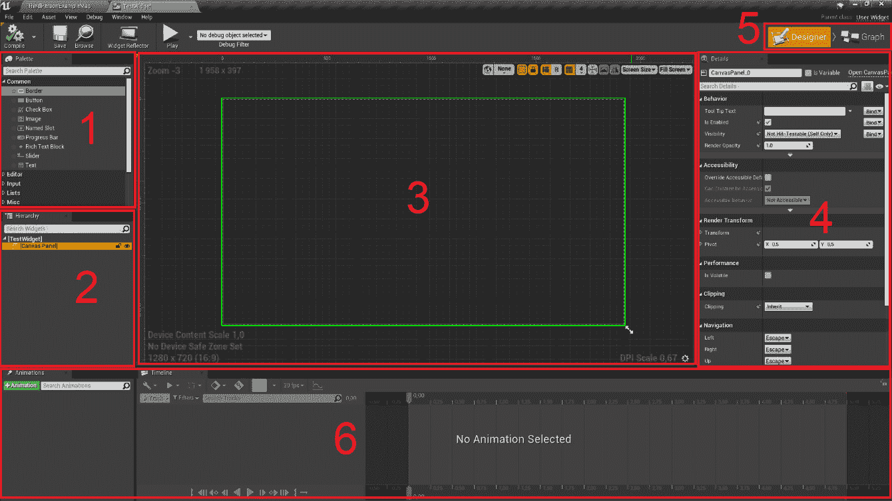

图 8.1：小部件蓝图编辑器分解为六个窗口

前面图中选项卡的详细信息如下：

+   `调色板` - 此选项卡显示您可以添加到小部件的所有单独的 UI 元素。这包括`按钮`，`文本框`，`图像`，`滑块`，`复选框`等等。

+   `层次结构` - 此选项卡显示当前在您的小部件中存在的所有 UI 元素。正如您所看到的，目前我们的层次结构中只有一个`画布面板`元素。

+   `设计师` - 此选项卡显示您的小部件在视觉上的外观，根据层次结构中存在的元素以及它们的布局方式。因为我们当前小部件中唯一的元素没有视觉表示，所以此选项卡目前为空。

+   `详细信息` - 此选项卡显示当前所选 UI 元素的属性。如果选择现有的`画布面板`元素，则应出现前面截图中的所有选项。

+   因为此资产是`小部件蓝图`，这两个按钮允许您在`设计师视图`和`图形视图`之间切换，后者看起来与普通蓝图类的窗口完全相同。

+   `动画` - 这两个选项卡都与小部件动画相关。小部件蓝图允许您随时间动画 UI 元素的属性，包括它们的`位置`，`比例`，`颜色`等等。左侧选项卡允许您创建和选择要在右侧选项卡中编辑的动画，您将能够编辑它们随时间影响的属性。

1.  现在让我们看一下我们的`小部件`中一些可用的 UI 元素，首先是现有的`画布面板`。

`画布面板`通常添加到小部件蓝图的根部，因为它们允许您将 UI 元素拖动到`设计师`选项卡中的任何位置。这样，您可以按照自己的意愿布置这些元素：在屏幕中心，左上角，屏幕底部中心等等。现在让我们将另一个非常重要的 UI 元素拖到我们的小部件中：一个`按钮`。

1.  在`调色板`选项卡中，找到`按钮`元素并将其拖到我们的`设计师`选项卡中（按住鼠标左键拖动）：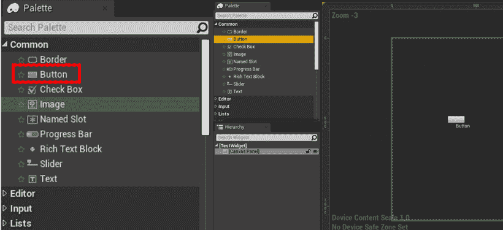

图 8.2：从调色板窗口将按钮元素拖到设计师窗口中

一旦您这样做，您就可以通过拖动周围的小白点调整按钮的大小（请记住，您只能对位于画布面板内的元素执行此操作）：


图 8.3：使用周围的白点调整 UI 元素大小的结果

在`小部件`中将元素拖入彼此的另一种方法是将它们拖入`层次结构`选项卡，而不是`设计师`选项卡。

1.  现在将`文本`元素拖到我们的`按钮`中，但这次使用`层次结构`选项卡：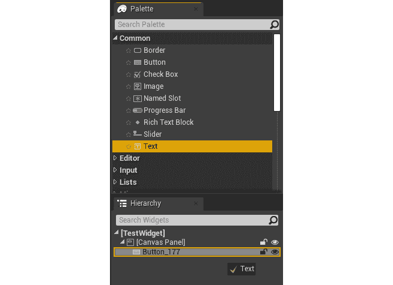

图 8.4：将文本元素从调色板窗口拖到层次结构窗口中

“文本”元素可以包含您指定的文本，具有您可以在“详细信息”面板中修改的特定大小和字体。在使用“层次结构”选项卡将“文本”元素拖动到“按钮”内之后，设计师选项卡应该如下所示：


图 8.5：在设计师选项卡中的按钮元素，在我们添加文本元素作为其子级后

让我们更改此“文本”块的一些属性。

1.  在“层次结构”选项卡或“设计师”选项卡中选择它，并查看“详细信息”面板：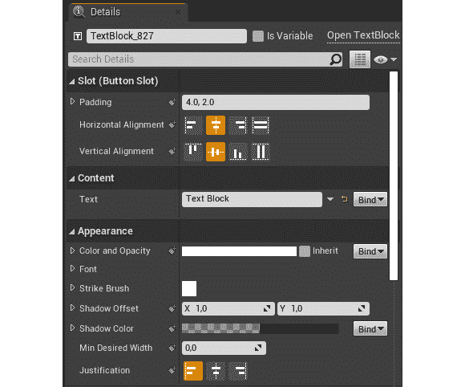

图 8.6：显示我们添加的文本元素的属性的详细信息面板

在这里，您会发现一些属性，您可以根据自己的喜好进行编辑。现在，我们只想专注于其中的两个：文本的“内容”和其“颜色和不透明度”。

1.  将“文本”元素的“内容”从“文本块”更新为“按钮 1”：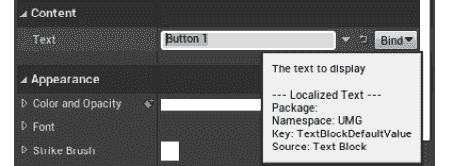

图 8.7：将文本元素的文本属性更改为按钮 1

接下来，让我们将其“颜色和不透明度”从“白色”更改为“黑色”。

1.  点击“颜色和不透明度”属性，看看弹出的窗口，“颜色选择器”。每当您在 UE4 中编辑“颜色”属性时，此窗口都会弹出。它允许您以许多不同的方式输入颜色，包括颜色轮、饱和度和值条、RGB 和 HSV 值滑块，以及其他几个选项。

1.  现在，通过将“值”条（从上到下从白色到黑色的条）拖动到底部，然后按“确定”，将颜色从白色更改为黑色：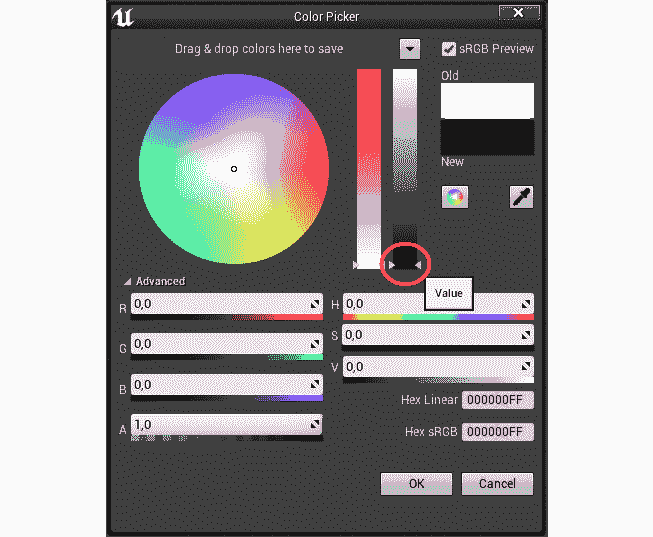

图 8.8：在颜色选择器窗口中选择黑色

1.  在进行这些更改后，按钮应该看起来像这样：

图 8.9：更改文本元素的文本属性和颜色后的按钮元素

有了这个，我们结束了本章的第一个练习。您现在已经了解了 UMG 的一些基本知识，比如如何向您的小部件添加“按钮”和“文本”元素。

在我们进行下一个练习之前，让我们先了解一下锚点。

# 锚点

您可能已经意识到，视频游戏在许多不同的屏幕尺寸和许多不同的分辨率上进行播放。因此，确保您创建的菜单可以有效地适应所有这些不同的分辨率非常重要。这就是**锚点**的主要目的。

锚点允许您指定 UI 元素的大小在屏幕分辨率更改时如何适应，通过指定您希望其占据屏幕比例。使用锚点，您可以始终将 UI 元素放在屏幕的左上角，或始终占据屏幕的一半，无论屏幕的大小和分辨率如何。

当屏幕大小或分辨率发生变化时，您的小部件将相对于其锚点进行缩放和移动。只有直接作为“画布面板”的子级的元素才能有锚点，您可以通过“锚点奖章”来可视化它，当您选择所述元素时，在“设计师”选项卡中会显示一个白色的花瓣形状：

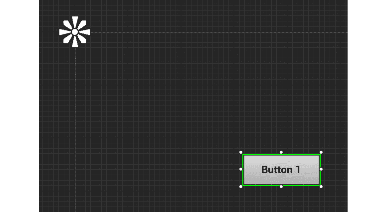

图 8.10：在设计师窗口中显示的轮廓的左上方的锚点奖章

默认情况下，锚点折叠到左上角，这意味着您无法控制按钮在分辨率更改时的缩放程度，因此让我们在下一个练习中更改它。

## 练习 8.02：编辑 UMG 锚点

在这个练习中，我们将改变小部件中的锚点，以便我们的按钮大小和形状能够适应各种屏幕分辨率和尺寸。

以下步骤将帮助您完成此练习：

1.  选择我们在上一个练习中创建的按钮，然后转到`Details`面板，点击您看到的第一个属性，即`Anchors`属性。在这里，您将能够看到`Anchor`预设，这将根据所示的枢轴对齐 UI 元素。

我们希望将按钮居中显示在屏幕上。

1.  点击屏幕中心的中心枢轴：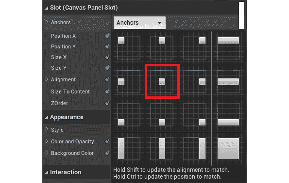

图 8.11：按钮的锚点属性，中心锚点用方框标出

您会看到我们的`Anchor Medallion`现在已经改变了位置：

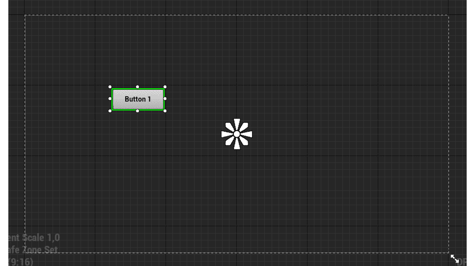

图 8.12：将按钮的锚点更改为中心后的锚点奖章

现在`Anchor Medallion`位于屏幕中心，我们仍然无法控制按钮在不同分辨率下的缩放，但至少我们知道它会相对于屏幕中心进行缩放。

为了使我们的按钮居中显示在屏幕上，我们还需要将按钮的位置更改为屏幕中心。

1.  重复选择中心锚点的上一步，但这次，在选择它之前，按住*Ctrl*键以将按钮的位置捕捉到此锚点。点击后释放*Ctrl*键。这应该是结果：

图 8.13：按钮元素被移动到其选定的中心锚点附近

从前面的截图中可以看到，我们的按钮位置已经改变，但它还没有正确居中在屏幕上。这是因为它的`Alignment`。

`Alignment`属性是`Vector2D`类型（具有两个`float`属性的元组：`X`和`Y`），它决定了 UI 元素相对于其总大小的中心。默认情况下设置为`(0,0)`，意味着元素的中心是其左上角，这解释了前面截图中的结果。它可以一直到`(1,1)`，即右下角。在这种情况下，考虑到我们希望对齐按钮，我们希望它是`(0.5, 0.5)`。

1.  在选择`Anchor`点时更新 UI 元素的对齐方式，您必须按住*Shift*键并重复上一步。或者，为了同时更新按钮的位置和对齐方式，选择中心`Anchor`点时同时按住*Ctrl*和*Shift*键将完成任务。然后应该是这个结果：

图 8.14：按钮元素相对于其选定的锚点在中心位置

在这一点上，当改变屏幕的分辨率时，我们知道这个按钮将始终保持在屏幕中心。然而，为了保持按钮相对于分辨率的大小，我们需要进行一些修改。

1.  将`Anchor Medallion`的右下角*花瓣*拖动到按钮的右下角：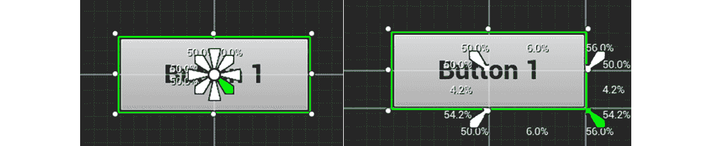

图 8.15：拖动锚点奖章的右下角花瓣以更新按钮元素的锚点

1.  将`Anchor Medallion`的左上角*花瓣*拖动到按钮的左上角：

图 8.16：拖动锚点奖章的左上角花瓣以更新按钮元素的锚点

注意

当更改“锚点”时，您在按钮周围看到的百分比是元素在屏幕上所占空间的百分比。例如，看最后一个截图，我们可以看到按钮在*X*坐标上占小部件空间的`11.9%`，在*Y*坐标上占小部件空间的`8.4%`。

通过按住*Ctrl*键移动“锚点勋章”的*花瓣*，可以将 UI 元素的大小设置为其锚点的大小。

现在，由于这些对锚点的更改，我们的按钮最终将适应不同的屏幕尺寸和分辨率。

您还可以使用“详细”面板手动编辑我们刚刚使用“锚点勋章”和移动按钮编辑的所有属性：

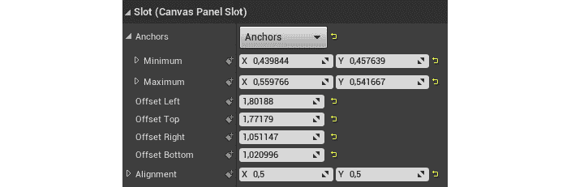

图 8.17：我们使用锚点勋章更改的属性，显示在详细窗口中

最后，我们需要知道如何在“设计师”选项卡中使用不同的分辨率来可视化我们的小部件。

1.  拖动设计师选项卡内部轮廓框的右下方的双箭头：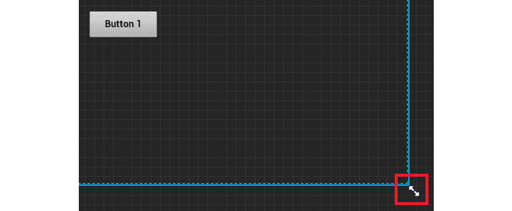

图 8.18：在设计师选项卡内部轮廓框的右下方有双箭头

通过拖动双箭头，您可以将“画布”调整到任何屏幕分辨率。在下面的截图中，您将看到各种设备的最常用分辨率，并且您可以在每个分辨率下预览您的小部件：

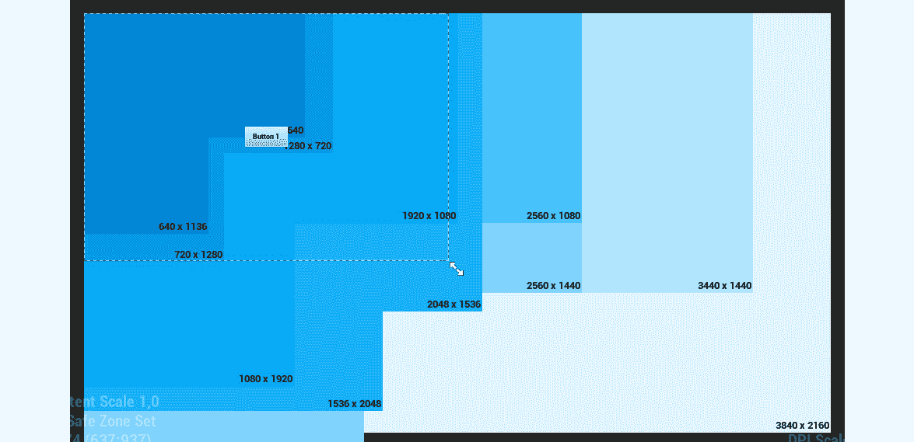

图 8.19：我们可以选择在设计师窗口中预览的分辨率

注意

您可以在[`docs.unrealengine.com/en-US/Engine/UMG/UserGuide/Anchors`](https://docs.unrealengine.com/en-US/Engine/UMG/UserGuide/Anchors)找到 UMG 锚点的完整参考。

这就结束了我们的练习。您已经了解了锚点和如何使您的小部件适应不同的屏幕尺寸和分辨率。

现在我们已经了解了一些 UMG 的基础知识，让我们看看如何为这个小部件蓝图创建一个小部件 C++类，这是我们将在下一个练习中要做的事情。

## 练习 8.03：创建 RestartWidget C++类

在这个练习中，我们将学习如何创建一个小部件 C++类，从中我们创建的小部件蓝图将继承。在我们的“躲避球”游戏中，当玩家死亡时，它将被添加到屏幕上，以便玩家可以选择重新开始级别。这个小部件将有一个按钮，当玩家点击它时，将重新开始级别。

这个练习的第一步将是向我们的项目添加与 UMG 相关的模块。虚幻引擎包括几个不同的模块，在每个项目中，您都必须指定您要使用哪些模块。当源代码文件生成时，我们的项目已经带有一些通用模块，但我们需要添加一些更多的模块。

以下步骤将帮助您完成这个练习：

1.  打开位于项目`Source`文件夹内的 C#文件而不是 C++文件的`Dodgeball.build.cs`文件。

1.  打开文件，您会发现从`PublicDependencyModuleNames`属性调用的`AddRange`函数。这个函数告诉引擎这个项目打算使用哪些模块。作为参数，发送了一个字符串数组，其中包含项目的所有预期模块的名称。鉴于我们打算使用 UMG，我们需要添加与 UMG 相关的模块：`UMG`，`Slate`和`SlateCore`：

```cpp
PublicDependencyModuleNames.AddRange(new string[] { "Core",   "CoreUObject", "Engine", "InputCore", "HeadMountedDisplay",   "UMG", "Slate", "SlateCore" });
```

现在我们已经通知引擎我们将使用 UMG 模块，让我们创建我们的小部件 C++类：

1.  打开虚幻编辑器。

1.  右键单击内容浏览器，然后选择“新的 C++类”。

1.  将“显示所有类”复选框设置为`true`。

1.  搜索`UserWidget`类，并将其选择为新类的父类。

1.  将新的 C++类命名为`RestartWidget`。

在文件在 Visual Studio 中打开后，按照以下步骤对我们的 Widget C++类进行修改：

1.  我们将要添加到这个类的第一件事是一个名为`RestartButton`的`public` `class UButton*`属性，它代表玩家将按下以重新启动级别的按钮。您将希望它通过使用`UPROPERTY`宏和`BindWidget`元标记绑定到从该类继承的蓝图类中的按钮。这将强制 Widget 蓝图具有一个名为`RestartButton`的`Button`，我们可以通过此属性在 C++中访问它，然后自由编辑其属性，例如在蓝图中的大小和位置：

```cpp
UPROPERTY(meta = (BindWidget))
class UButton* RestartButton;
```

注意

使用`BindWidget`元标记将导致编译错误，如果从该 C++类继承的 Widget 蓝图没有具有相同类型和名称的元素。如果您不希望发生这种情况，您将不得不将`UPROPERTY`标记为可选的`BindWidget`，如下所示：`UPROPERTY(meta = (BindWidget, OptionalWidget = true))`这将使绑定此属性变为可选，并且在编译 Widget 蓝图时不会导致编译错误。

接下来，我们将添加一个函数，当玩家点击`RestartButton`时将被调用，这将重新启动级别。我们将使用`GameplayStatics`对象的`OpenLevel`函数来实现这一点，然后发送当前级别的名称。

1.  在 Widget 类的头文件中，添加一个名为`OnRestartClicked`的`protected`函数的声明，它不返回任何内容并且不接收任何参数。此函数必须标记为`UFUNCTION`：

```cpp
protected:
UFUNCTION()
void OnRestartClicked();
```

1.  在类的源文件中，添加一个`GameplayStatics`对象的`include`：

```cpp
#include "Kismet/GameplayStatics.h"
```

1.  然后，为我们的`OnRestartClicked`函数添加一个实现：

```cpp
void URestartWidget::OnRestartClicked()
{
}
```

1.  在其实现中，调用`GameplayStatics`对象的`OpenLevel`函数。此函数接收世界上下文对象作为参数，这将是`this`指针，并且级别的名称，我们将不得不使用`GameplayStatics`对象的`GetCurrentLevelName`函数来获取。这个最后的函数也必须接收一个世界上下文对象，这也将是`this`指针：

```cpp
UGameplayStatics::OpenLevel(this,   FName(*UGameplayStatics::GetCurrentLevelName(this)));
```

注意

对`GameplayStatics`对象的`GetCurrentLevelName`函数的调用必须在前面加上`*`，因为它返回一个`FString`，UE4 的字符串类型，并且必须被解引用才能传递给`FName`构造函数。

下一步将是以一种方式绑定此函数，以便在玩家按下`RestartButton`时调用它：

1.  为了做到这一点，我们将不得不重写属于`UserWidget`类的一个函数，名为`NativeOnInitialized`。这个函数只被调用一次，类似于 Actor 的`BeginPlay`函数，这使得它适合进行我们的设置。在我们的 Widget 类的头文件中，使用`virtual`和`override`关键字添加一个`public` `NativeOnInitialized`函数的声明：

```cpp
virtual void NativeOnInitialized() override;
```

1.  接下来，在类的源文件中，添加此函数的实现。在其中，调用其`Super`函数并添加一个`if`语句，检查我们的`RestartButton`是否与`nullptr`不同：

```cpp
void URestartWidget::NativeOnInitialized()
{
  Super::NativeOnInitialized();
  if (RestartButton != nullptr)
  {
  }
}
```

1.  如果`if`语句为真，我们将希望将我们的`OnRestartClicked`函数绑定到按钮的`OnClicked`事件。我们可以通过访问按钮的`OnClicked`属性并调用其`AddDynamic`函数来实现这一点，将我们想要调用该函数的对象（即`this`指针）和要调用的函数的指针（即`OnRestartClicked`函数）作为参数发送：

```cpp
if (RestartButton != nullptr)
{
  RestartButton->OnClicked.AddDynamic(this,   &URestartWidget::OnRestartClicked);
}
```

1.  因为我们正在访问与`Button`类相关的函数，所以我们还必须包含它：

```cpp
#include "Components/Button.h"
```

注意

当玩家按下并释放按钮时，按钮的`OnClicked`事件将被调用。还有其他与按钮相关的事件，包括`OnPressed`事件（当玩家按下按钮时），`OnReleased`事件（当玩家释放按钮时），以及`OnHover`和`OnUnhover`事件（当玩家分别开始和停止悬停在按钮上时）。

`AddDynamic`函数必须接收一个标记有`UFUNCTION`宏的函数的指针作为参数。如果没有，当调用该函数时会出现错误。这就是为什么我们用`UFUNCTION`宏标记了`OnRestartClicked`函数的原因。

完成这些步骤后，编译您的更改并打开编辑器。

1.  打开您之前创建的`TestWidget` Widget Blueprint。我们希望将这个 Widget Blueprint 与我们刚刚创建的`RestartWidget`类关联起来，所以我们需要重新设置其父类。

1.  从 Widget Blueprint 的`File`选项卡中，选择`Reparent Blueprint`选项，并选择`RestartWidget` C++类作为其新的父类：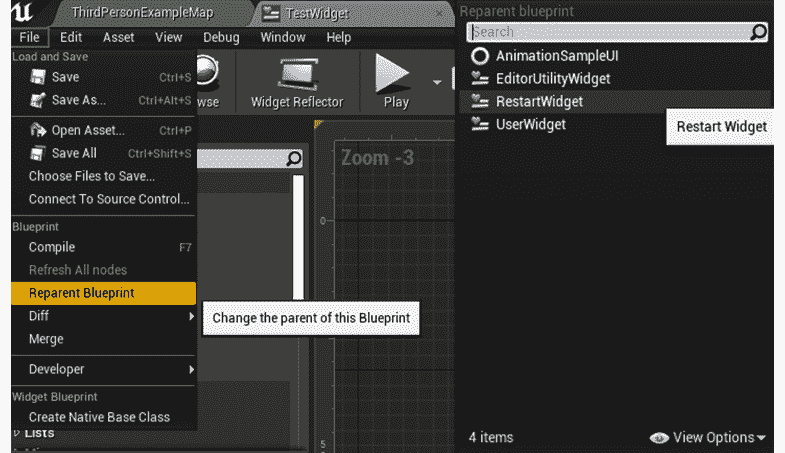

图 8.20：将 TestWidget 的类重新设置为 RestartWidget

您会注意到 Widget Blueprint 现在有一个与我们在 C++类中创建的`BindWidget`元标记相关的编译错误：

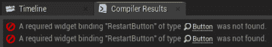

图 8.21：设置父类为 RestartWidget 类后的编译错误

这是由于 C++类找不到名为`RestartButton`的`Button`属性造成的。

为了解决这个问题，我们需要将 Widget Blueprint 中的`Button`元素重命名为`RestartButton`：

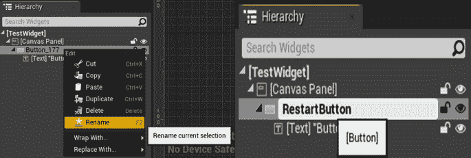

图 8.22：将按钮元素重命名为 RestartButton

完成这些步骤后，关闭 Widget Blueprint，并将其名称从`TestWidget`更改为`BP_RestartWidget`，就像你在上一步中所做的那样。

这就完成了我们的 Widget 类的创建。您现在知道如何将 Widget C++类连接到 Widget Blueprint，这是处理 UE4 中游戏 UI 的一个非常重要的步骤。

接下来我们需要做的是创建我们的`Player Controller` C++类，它将负责实例化我们的`RestartWidget`并将其添加到屏幕上。我们将在接下来的练习中完成这个任务。

## 练习 8.04：创建将 RestartWidget 添加到屏幕的逻辑

在这个练习中，我们将创建负责将我们新创建的`RestartWidget`添加到屏幕上的逻辑。当玩家死亡时，它将出现在屏幕上，以便他们有重新开始关卡的选项。

为了做到这一点，我们需要创建一个新的`Player Controller` C++类，您可以按照以下步骤进行：

1.  打开虚幻编辑器。

1.  在`Content Browser`上*右键单击*，选择`New C++ Class`。

1.  搜索`Player Controller`类并选择它作为新类的父类。

1.  将新的 C++类命名为`DodgeballPlayerController`。

1.  在 Visual Studio 中打开类的文件。

当我们的玩家耗尽生命值时，`DodgeballCharacter`类将访问这个`Player Controller`类，并调用一个函数，该函数将在屏幕上添加`RestartWidget`。请按照以下步骤继续进行。

为了知道要添加到屏幕上的 Widget 的类（它将是一个 Widget Blueprint 而不是 Widget C++类），我们需要使用`TSubclassOf`类型。

1.  在类的头文件中，添加一个名为`BP_RestartWidget`的`public` `TSubclassOf<class URestartWidget>`属性。确保将其设置为`UPROPERTY`，并使用`EditDefaultsOnly`标记，以便我们可以在蓝图类中编辑它：

```cpp
public:
UPROPERTY(EditDefaultsOnly)
TSubclassOf<class URestartWidget> BP_RestartWidget;
```

为了实例化这个 Widget 并将其添加到屏幕上，我们需要保存一个对它的引用。

1.  添加一个`private`类型为`class URestartWidget*`的新变量，并将其命名为`RestartWidget`。确保将其设置为没有标签的`UPROPERTY`函数：

```cpp
private:
UPROPERTY()
class URestartWidget* RestartWidget;
```

注意

尽管这个属性不应该在蓝图类中可编辑，但我们必须将这个引用设置为`UPROPERTY`，否则垃圾收集器将销毁这个变量的内容。

我们需要的下一步是一个负责将我们的小部件添加到屏幕上的函数。

1.  添加一个声明为返回无内容并且不接收参数的`public`函数，名为`ShowRestartWidget`：

```cpp
void ShowRestartWidget();
```

1.  现在，转到我们类的源文件。首先，添加一个包含到`RestartWidget`类的包含：

```cpp
#include "RestartWidget.h"
```

1.  然后，添加我们的`ShowRestartWidget`函数的实现，我们将首先检查我们的`BP_RestartWidget`变量是否不是`nullptr`：

```cpp
void ADodgeballPlayerController::ShowRestartWidget()
{
  if (BP_RestartWidget != nullptr)
  {
  }
}
```

1.  如果该变量有效（不同于`nullptr`），我们希望使用`Player Controller`的`SetPause`函数暂停游戏。这将确保游戏停止，直到玩家决定做些什么（在我们的情况下，将按下重新开始关卡的按钮）：

```cpp
SetPause(true);
```

接下来要做的是改变输入模式。在 UE4 中，有三种输入模式：`仅游戏`，`游戏和 UI`和`仅 UI`。如果您的`输入`模式包括`游戏`，这意味着玩家角色和玩家控制器将通过`输入操作`接收输入。如果您的`输入`模式包括`UI`，这意味着屏幕上的小部件将接收玩家的输入。当我们在屏幕上显示此小部件时，我们不希望玩家角色接收任何输入。

1.  因此，更新为`仅 UI` `输入`模式。您可以通过调用`Player Controller`的`SetInputMode`函数，并将`FInputModeUIOnly`类型作为参数传递来实现这一点：

```cpp
SetInputMode(FInputModeUIOnly());
```

之后，我们希望显示鼠标光标，以便玩家可以看到他们悬停在哪个按钮上。

1.  我们将通过将`Player Controller`的`bShowMouseCursor`属性设置为`true`来实现这一点：

```cpp
bShowMouseCursor = true;
```

1.  现在，我们可以实例化我们的小部件，使用`Player Controller`的`CreateWidget`函数，将 C++小部件类作为模板参数传递，这在我们的情况下是`RestartWidget`，然后作为正常参数传递`Owning Player`，这是拥有此小部件的`Player Controller`，我们将使用`this`指针发送，以及小部件类，这将是我们的`BP_RestartWidget`属性：

```cpp
RestartWidget = CreateWidget<URestartWidget>(this,   BP_RestartWidget);
```

1.  在我们实例化小部件之后，我们将使用小部件的`AddToViewport`函数将其添加到屏幕上：

```cpp
RestartWidget->AddToViewport();
```

1.  这就完成了我们的`ShowRestartWidget`函数。但是，我们还需要创建一个函数，用于从屏幕上移除`RestartWidget`。在类的头文件中，添加一个声明为与`ShowRestartWidget`函数类似的函数，但这次名为`HideRestartWidget`：

```cpp
void HideRestartWidget();
```

1.  在类的源文件中，添加`HideRestartWidget`函数的实现：

```cpp
void ADodgeballPlayerController::HideRestartWidget()
{
}
```

1.  在这个函数中，我们应该首先通过调用其`RemoveFromParent`函数将小部件从屏幕上移除，并使用`Destruct`函数将其销毁：

```cpp
RestartWidget->RemoveFromParent();
RestartWidget->Destruct();
```

1.  然后，我们希望使用前一个函数中使用的`SetPause`函数取消暂停游戏：

```cpp
SetPause(false);
```

1.  最后，将`输入`模式设置为`仅游戏`，并以与前一个函数相同的方式隐藏鼠标光标（这次我们传递`FInputModeGameOnly`类型）：

```cpp
SetInputMode(FInputModeGameOnly());
bShowMouseCursor = false;
```

这就完成了我们的`Player Controller` C++类的逻辑。我们接下来应该调用一个函数，将我们的小部件添加到屏幕上。

1.  转到`DodgeballCharacter`类的源文件，并向我们新创建的`DodgeballPlayerController`添加`include`关键字：

```cpp
#include "DodgeballPlayerController.h"
```

1.  在`DodgeballCharacter`类的`OnDeath_Implementation`函数的实现中，用以下内容替换对`QuitGame`函数的调用：

+   使用`GetController`函数获取角色的玩家控制器。您将希望将结果保存在名为`PlayerController`的`DodgeballPlayerController*`类型的变量中。因为该函数将返回一个`Controller`类型的变量，您还需要将其转换为我们的`PlayerController`类：

```cpp
ADodgeballPlayerController* PlayerController = Cast<ADodgeballPlayerController>(GetController());
```

+   检查`PlayerController`变量是否有效。如果是，调用其`ShowRestartWidget`函数：

```cpp
if (PlayerController != nullptr)
{
  PlayerController->ShowRestartWidget();
}
```

在进行了这些修改之后，我们唯一剩下的事情就是调用将我们的小部件从屏幕上隐藏的函数。打开`RestartWidget`类的源文件并实现以下修改。

1.  向`DodgeballPlayerController`添加一个`include`，其中包含我们将要调用的函数：

```cpp
#include "DodgeballPlayerController.h"
```

1.  在`OnRestartClicked`函数实现中，在调用`OpenLevel`函数之前，我们必须使用`GetOwningPlayer`函数获取小部件的`OwningPlayer`，它是`PlayerController`类型的，并将其转换为`DodgeballPlayerController`类：

```cpp
ADodgeballPlayerController* PlayerController =   Cast<ADodgeballPlayerController>(GetOwningPlayer());
```

1.  然后，如果`PlayerController`变量有效，我们调用其`HideRestartWidget`函数：

```cpp
if (PlayerController != nullptr)
{
  PlayerController->HideRestartWidget();
}
```

在您完成所有这些步骤之后，关闭编辑器，编译您的更改并打开编辑器。

您现在已经完成了这个练习。我们已经添加了所有必要的逻辑，将我们的`RestartWidget`添加到屏幕上，我们唯一剩下的事情就是创建我们新创建的`DodgeballPlayerController`的蓝图类，这将在下一个练习中完成。

## 练习 8.05：设置 DodgeballPlayerController 蓝图类

在这个练习中，我们将创建我们的`DodgeballPlayerController`的蓝图类，以指定我们要添加到屏幕上的小部件，并告诉 UE4 在游戏开始时使用这个蓝图类。

为了做到这一点，请按照以下步骤进行：

1.  转到`Content Browser`中的`ThirdPersonCPP` -> `Blueprints`目录，在其中右键单击，并创建一个新的蓝图类。

1.  搜索`DodgeballPlayerController`类并将其选择为父类。

1.  将此蓝图类重命名为`BP_DodgeballPlayerController`。之后，打开此蓝图资源。

1.  转到其`Class Defaults`选项卡，并将类的`BP_RestartWidget`属性设置为我们创建的`BP_RestartWidget`小部件蓝图。

现在，我们唯一剩下的事情就是确保这个`Player Controller`蓝图类在游戏中被使用。

为了做到这一点，我们还需要遵循一些步骤。

1.  转到`Content Browser`中的`ThirdPersonCPP` -> `Blueprints`目录，在其中*右键单击*，创建一个新的蓝图类。搜索`DodgeballGameMode`类并将其选择为父类，然后将此`Blueprint`类重命名为`BP_DodgeballGameMode`。

这个类负责告诉游戏使用哪些类来处理游戏的每个元素，比如使用哪个`Player Controller`类等。

1.  打开资源，转到其`Class Defaults`选项卡，并将类的`PlayerControllerClass`属性设置为我们创建的`BP_DodgeballPlayerController`类：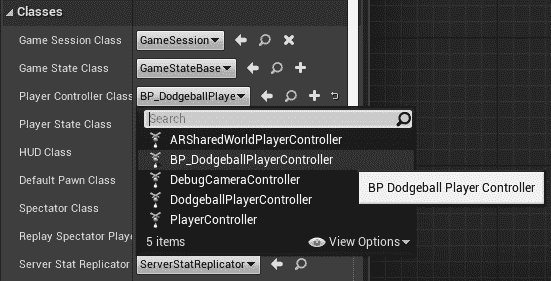

图 8.23：将 PlayerControllerClass 属性设置为 BP_DodgeballPlayerController

1.  关闭资源并在位于`Level Viewport`窗口顶部的编辑器工具栏内选择`Blueprints`下拉选项。从那里，选择`Game Mode`（当前应设置为`DodgeballGameMode`）`-> 选择 GameModeBase Class -> BP_DodgeballGameMode`。这将告诉编辑器在所有关卡中使用这个新的`Game Mode`。

现在，玩游戏，让您的角色被 Dodgeball 击中`3`次。第三次之后，您应该看到游戏被暂停，并显示`BP_RestartWidget`：

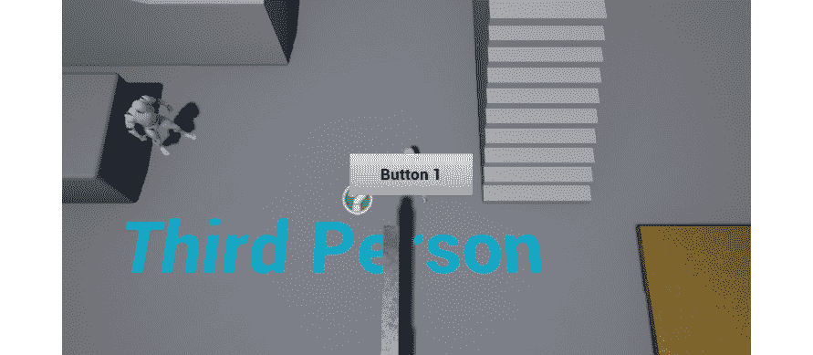

图 8.24：在玩家耗尽生命值后将我们的 BP_RestartWidget 添加到屏幕上

当您使用鼠标点击“按钮 1”时，您应该看到关卡重置为初始状态：

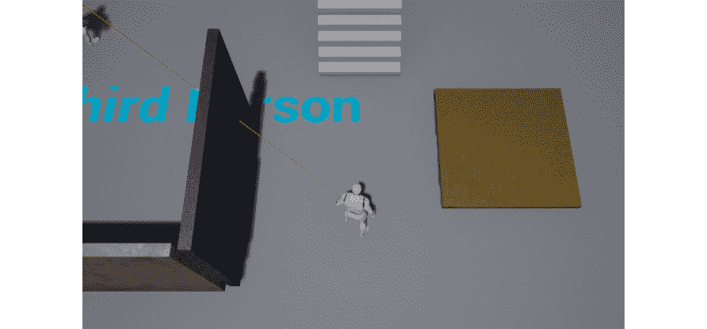

图 8.25：玩家按下前一个截图中显示的按钮后，关卡重新开始

这就结束了我们的练习。您现在知道如何创建小部件并在游戏中显示它们。这是成为一名熟练游戏开发者的旅程中的又一个关键步骤。

在我们继续下一个练习之前，让我们在下一节中看一下进度条。

# 进度条

视频游戏表示角色状态（如生命值、耐力等）的一种方式是通过**进度条**，这是我们将用来向玩家传达他们的角色有多少生命值的方式。进度条本质上是一个形状，通常是矩形，可以填充和清空，以显示玩家特定状态的进展。如果您想向玩家显示他们的角色生命值只有最大值的一半，您可以通过显示进度条为一半来实现。这正是我们将在本节中要做的。这个进度条将是我们躲避球游戏 HUD 中唯一的元素。

为了创建这个“生命值条”，我们首先需要创建我们的 HUD 小部件。打开编辑器，转到内容浏览器内的`ThirdPersonCPP` -> “蓝图”目录，右键单击并创建一个新的“小部件蓝图”类别的“用户界面”类别。将这个新的小部件蓝图命名为`BP_HUDWidget`。然后打开这个新的小部件蓝图。

UE4 中的进度条只是另一个 UI 元素，就像`按钮`和`文本`元素一样，这意味着我们可以将它从`调色板`选项卡拖到我们的`设计师`选项卡中。看下面的例子：

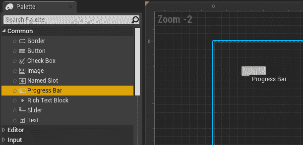

图 8.26：将进度条元素拖入设计师窗口

起初，这个进度条可能看起来类似于一个按钮；然而，它包含两个对于进度条很重要的特定属性：

+   `百分比` - 允许您指定此进度条的进度，从`0`到`1`

+   `填充类型` - 允许您指定您希望此进度条如何填充（从左到右，从上到下等）：

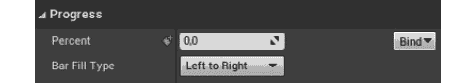

图 8.27：进度条的百分比和填充类型属性

如果将“百分比”属性设置为`0.5`，则应该看到进度条相应地更新以填充其长度的一半：

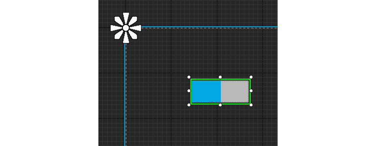

图 8.28：进度条向右填充一半

在继续之前，将“百分比”属性设置为`1`。

现在让我们将进度条的颜色从蓝色（默认颜色）改为红色。为了做到这一点，转到“详细信息”选项卡，在“外观”类别内，将“填充颜色和不透明度”属性设置为红色（`RGB(1,0,0)`）：

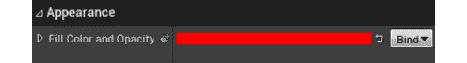

图 8.29：进度条的颜色被更改为红色

完成这些操作后，您的进度条现在应该使用红色作为填充颜色。

为了完成我们的进度条设置，让我们更新它的位置、大小和锚点。按照以下步骤来实现这一点：

1.  在`槽（Canvas Panel Slot）`类别中，展开`锚点`属性并将其属性设置为以下值：

+   `最小值`：`X`轴上的`0.052`和`Y`轴上的`0.083`

+   `最大值`：`X`轴上的`0.208`和`Y`轴上的`0.116`

1.  将“左偏移”、“顶部偏移”、“右偏移”和“底部偏移”属性设置为`0`。

您的进度条现在应该是这样的：

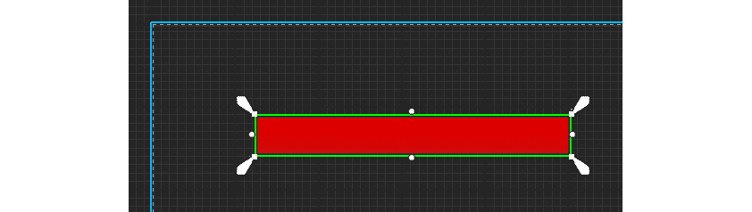

图 8.30：在本节完成所有修改后的进度条

有了这个，我们就可以结束进度条的话题了。我们的下一步是添加所有必要的逻辑，以将这个进度条作为健康条使用，通过更新玩家角色的健康状况来更新其`Percent`属性。我们将在下一个练习中做到这一点。

## 练习 8.06：创建健康条 C++逻辑

在这个练习中，我们将添加所有必要的 C++逻辑，以更新 HUD 中的进度条，因为玩家角色的健康状况会发生变化。

为了做到这一点，请按照以下步骤进行操作：

1.  打开编辑器，并创建一个新的 C++类，该类继承自`UserWidget`，类似于我们在*练习 8.03*中所做的*创建 RestartWidget C++类*，但这次将其命名为`HUDWidget`。这将是我们的 HUD Widget 所使用的 C++类。

1.  在`HUDWidget`类的头文件中，添加一个新的`public`属性，类型为`class UProgressBar*`，名为`HealthBar`。这种类型用于在 C++中表示进度条，就像我们在上一节中创建的那样。确保将此属性声明为带有`BindWidget`标记的`UPROPERTY`函数：

```cpp
UPROPERTY(meta = (BindWidget))
class UProgressBar* HealthBar;
```

1.  添加一个名为`UpdateHealthPercent`的`public`函数声明，它不返回任何内容，并接收一个`float HealthPercent`属性作为参数。这个函数将被调用以更新我们的进度条的`Percent`属性：

```cpp
void UpdateHealthPercent(float HealthPercent);
```

1.  在`HUDWidget`类的源文件中，添加`UpdateHealthPercent`函数的实现，该函数将调用`HealthBar`属性的`SetPercent`函数，并将`HealthPercent`属性作为参数传递：

```cpp
void UHUDWidget::UpdateHealthPercent(float HealthPercent)
{
  HealthBar->SetPercent(HealthPercent);
}
```

1.  因为我们将使用`ProgressBar` C++类，所以我们需要在类的源文件顶部添加一个`include`：

```cpp
#include "Components/ProgressBar.h"
```

下一步将是为我们的`Player Controller`添加负责将`HUDWidget`添加到屏幕的所有必要逻辑。按照以下步骤实现这一点：

1.  在`DodgeballPlayerController`类的头文件中，添加一个`public`属性，类型为`TSubclassOf<class UHUDWidget>`，名为`BP_HUDWidget`。确保将其标记为`UPROPERTY`函数，并使用`EditDefaultsOnly`标记。

这个属性将允许我们在`DodgeballPlayerController`蓝图类中指定我们想要用作 HUD 的 Widget：

```cpp
UPROPERTY(EditDefaultsOnly)
TSubclassOf<class UHUDWidget> BP_HUDWidget;
```

1.  添加另一个属性，这次是`private`类型为`class UHUDWidget*`，名为`HUDWidget`。将其标记为`UPROPERTY`，但不带任何标记：

```cpp
UPROPERTY()
class UHUDWidget* HUDWidget;
```

1.  添加一个`protected`声明，名为`BeginPlay`函数，并将其标记为`virtual`和`override`：

```cpp
virtual void BeginPlay() override;
```

1.  添加一个新的`public`函数声明，名为`UpdateHealthPercent`，它不返回任何内容，并接收一个`float HealthPercent`作为参数。

这个函数将被我们的玩家角色类调用，以更新 HUD 中的健康条：

```cpp
void UpdateHealthPercent(float HealthPercent);
```

1.  现在转到`DodgeballPlayerController`类的源文件。首先添加一个`include`到我们的`HUDWidget`类：

```cpp
#include "HUDWidget.h"
```

1.  然后，添加`BeginPlay`函数的实现，我们将首先调用`Super`对象的`BeginPlay`函数：

```cpp
void ADodgeballPlayerController::BeginPlay()
{
  Super::BeginPlay();
}
```

1.  在调用该函数后，检查`BP_HUDWidget`属性是否有效。如果有效，调用`CreateWidget`函数，使用`UHUDWidget`模板参数，并将`Owning Player`、`this`和 Widget 类`BP_HUDWidget`作为参数传递。确保将`HUDWidget`属性设置为此函数调用的返回值：

```cpp
if (BP_HUDWidget != nullptr)
{
  HUDWidget = CreateWidget<UHUDWidget>(this, BP_HUDWidget);
}
```

1.  设置完`HUDWidget`属性后，调用其`AddToViewport`函数：

```cpp
HUDWidget->AddToViewport();
```

1.  最后，添加`UpdateHealthPercent`函数的实现，在这里我们将检查`HUDWidget`属性是否有效，如果有效，调用其`UpdateHealthPercent`函数，并将`HealthPercent`属性作为参数传递：

```cpp
void ADodgeballPlayerController::UpdateHealthPercent(float   HealthPercent)
{
  if (HUDWidget != nullptr)
  {
    HUDWidget->UpdateHealthPercent(HealthPercent);
  }
}
```

现在我们已经添加了负责将 HUD 添加到屏幕并允许其更新的逻辑，我们需要对其他类进行一些修改。按照以下步骤进行修改。

目前，我们在上一章创建的`Health`接口只有`OnDeath`事件，当一个对象耗尽生命值时会调用该事件。为了在玩家受到伤害时每次更新我们的生命条，我们需要允许我们的`HealthInterface`类在发生这种情况时通知一个对象。

1.  打开`HealthInterface`类的头文件，并添加一个类似于我们在*练习 7.04*中为`OnDeath`事件所做的声明的声明，但这次是为`OnTakeDamage`事件。每当一个对象受到伤害时，将调用此事件：

```cpp
UFUNCTION(BlueprintNativeEvent, Category = Health)
void OnTakeDamage();
virtual void OnTakeDamage_Implementation() = 0;
```

1.  现在我们已经在我们的`Interface`类中添加了这个事件，让我们添加调用该事件的逻辑：打开`HealthComponent`类的源文件，在`LoseHealth`函数的实现中，在从`Health`属性中减去`Amount`属性之后，检查`Owner`是否实现了`Health`接口，如果是，调用它的`OnTakeDamage`事件。这与我们在同一函数中为我们的`OnDeath`事件所做的方式相同，但这次只需将事件的名称更改为`OnTakeDamage`：

```cpp
if (GetOwner()->Implements<UHealthInterface>())
{
  IHealthInterface::Execute_OnTakeDamage(GetOwner());
}
```

因为我们的生命条需要玩家角色的生命值作为百分比，我们需要做以下事情：

1.  在我们的`HealthComponent`中添加一个`public`函数，该函数返回`HealthComponent`类的头文件中的声明，添加一个`FORCEINLINE`函数的声明，该函数返回一个`float`。这个函数应该被称为`GetHealthPercent`，并且是一个`const`函数。它的实现将简单地返回`Health`属性除以`100`，我们将假设这是游戏中一个对象可以拥有的最大生命值的百分比：

```cpp
FORCEINLINE float GetHealthPercent() const { return Health /   100.f; }
```

1.  现在转到`DodgeballCharacter`类的头文件，并添加一个名为`OnTakeDamage_Implementation`的`public` `virtual`函数的声明，该函数不返回任何内容，也不接收任何参数。将其标记为`virtual`和`override`：

```cpp
virtual void OnTakeDamage_Implementation() override;
```

1.  在`DodgeballCharacter`类的源文件中，添加我们刚刚声明的`OnTakeDamage_Implementation`函数的实现。将`OnDeath_Implementation`函数的内容复制到这个新函数的实现中，但做出这个改变：不要调用`PlayerController`的`ShowRestartWidget`函数，而是调用它的`UpdateHealthPercent`函数，并将`HealthComponent`属性的`GetHealthPercent`函数的返回值作为参数传递：

```cpp
void ADodgeballCharacter::OnTakeDamage_Implementation()
{
  ADodgeballPlayerController* PlayerController =   Cast<ADodgeballPlayerController>(GetController());
  if (PlayerController != nullptr)
  {
    PlayerController->UpdateHealthPercent(HealthComponent-  >GetHealthPercent());
  }
}
```

这结束了这个练习的代码设置。在你做完这些改变之后，编译你的代码，打开编辑器，然后做以下操作：

1.  打开`BP_HUDWidget`小部件蓝图，并将其重新设置为`HUDWidget`类，就像你在*练习 8.03*中所做的那样，创建`RestartWidget C++ Class`。

1.  这应该会导致编译错误，你可以通过将我们的进度条元素重命名为`HealthBar`来修复它。

1.  关闭这个小部件蓝图，打开`BP_DodgeballPlayerController`蓝图类，并将其`BP_HUDWidget`属性设置为`BP_HUDWidget`小部件蓝图：

图 8.31：将 BP_HUDWidget 属性设置为 BP_HUDWidget

在你做完这些改变之后，播放关卡。你应该注意到屏幕左上角的`生命条`：

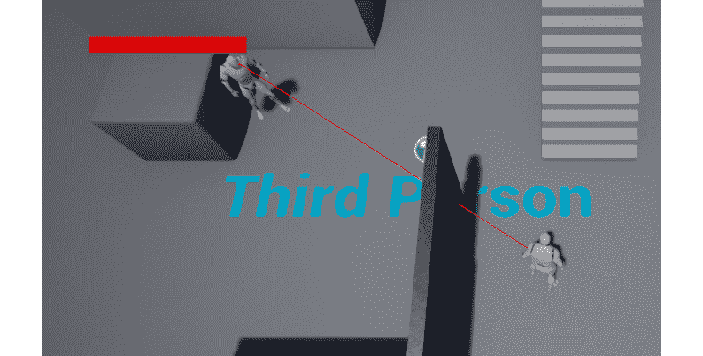

图 8.32：在屏幕左上角显示的进度条

当玩家角色被躲避球击中时，你应该注意到`生命条`被清空：

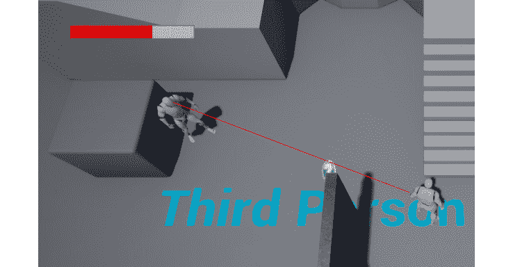

图 8.33：随着玩家角色失去生命值，进度条被清空

有了这些，我们结束了这个练习，你已经学会了在屏幕上添加 HUD 并在游戏过程中更新它的所有必要步骤。

## 活动 8.01：改进 RestartWidget

在本次活动中，我们将向我们的`RestartWidget`添加一个`Text`元素，显示`Game Over`，以便玩家知道他们刚刚输掉了游戏；添加一个`Exit`按钮，允许玩家退出游戏；还更新现有按钮的文本为`Restart`，以便玩家知道点击该按钮时会发生什么。

以下步骤将帮助您完成此活动：

1.  打开`BP_RestartWidget` Widget 蓝图。

1.  将一个新的`Text`元素拖放到现有的`Canvas Panel`元素中。

1.  修改`Text`元素的属性：

+   展开`Anchors`属性，并在`X`轴上将其`Minimum`设置为`0.291`，在`Y`轴上设置为`0.115`，将其`Maximum`设置为`0.708`，在`X`轴上设置为`0.255`，在`Y`轴上设置为`0.708`。

+   将`Offset Left`，`Offset Top`，`Offset Right`和`Offset Bottom`属性设置为`0`。

+   将`Text`属性设置为`GAME OVER`。

+   将`Color and Opacity`属性设置为红色：`RGBA(1.0, 0.082, 0.082, 1.0)`。

+   展开`Font`属性并将其`Size`设置为`100`。

+   将`Justification`属性设置为`Align Text Center`。

1.  选择`RestartButton`属性内的另一个`Text`元素，并将其`Text`属性更改为`Restart`。

1.  复制`RestartButton`属性并将副本的名称更改为`ExitButton`。

1.  将`ExitButton`属性中`Text`元素的`Text`属性更改为`Exit`。

1.  展开`ExitButton`属性的`Anchor`属性，并将其`Minimum`设置为`X`轴上的`0.44`，`Y`轴上的`0.615`，将其`Maximum`设置为`X`轴上的`0.558`，`Y`轴上的`0.692`。

1.  将`ExitButton`属性的`Offset Left`，`Offset Top`，`Offset Right`和`Offset Bottom`设置为`0`。

完成这些更改后，我们需要添加处理`ExitButton`属性点击的逻辑，这将退出游戏：

1.  保存对`BP_RestartWidget` Widget 蓝图所做的更改，并在 Visual Studio 中打开`RestartWidget`类的头文件。在该文件中，添加一个名为`OnExitClicked`的`protected`函数的声明，返回`void`，不接收任何参数。确保将其标记为`UFUNCTION`。

1.  复制现有的`RestartButton`属性，但将其命名为`ExitButton`。

1.  在`RestartWidget`类的源文件中，为`OnExitClicked`函数添加一个实现。将`VictoryBox`类的源文件中`OnBeginOverlap`函数的内容复制到`OnExitClicked`函数中，但删除对`DodgeballCharacter`类的转换。

1.  在`NativeOnInitialized`函数的实现中，将我们创建的`OnExitClicked`函数绑定到`ExitButton`属性的`OnClicked`事件，就像我们在*Exercise 8.03*，*Creating the RestartWidget C++ Class*中为`RestartButton`属性所做的那样。

这就结束了本次活动的代码设置。编译您的更改，打开编辑器，然后打开`BP_RestartWidget`并编译它，以确保由于`BindWidget`标签而没有编译错误。

完成后，再次玩游戏，让玩家角色被三个 Dodgeball 击中，并注意`Restart` Widget 出现了我们的新修改：

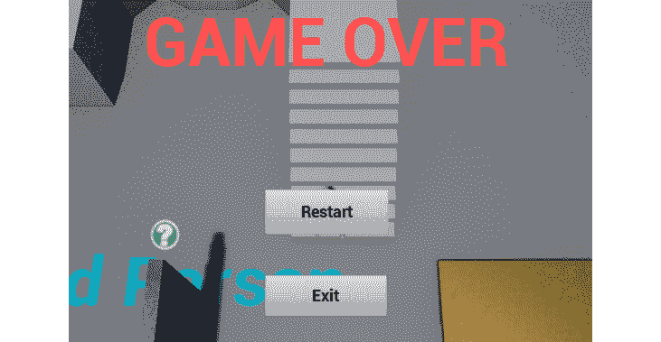

图 8.34：玩家耗尽生命值后显示的更新后的 BP_RestartWidget

如果按下`Restart`按钮，您应该能够重新开始游戏，如果按下`Exit`按钮，游戏应该结束。

这就结束了我们的活动。您已经巩固了使用`Widget`蓝图和更改其元素属性的基础知识，现在可以开始制作自己的菜单了。

注意

此活动的解决方案可在以下网址找到：[`packt.live/338jEBx`](https://packt.live/338jEBx)。

# 总结

通过本章的学习，您已经学会了如何在 UE4 中制作游戏 UI，了解了诸如菜单和 HUD 等内容。您已经了解了如何操作 Widget Blueprint 的 UI 元素，包括“按钮”、“文本”元素和“进度条”；有效地使用锚点，这对于使游戏 UI 优雅地适应多个屏幕至关重要；在 C++中监听鼠标事件，如`OnClick`事件，并利用它来创建自己的游戏逻辑；以及如何将您创建的小部件添加到屏幕上，无论是在特定事件发生时还是始终存在。

在下一章中，我们将通过添加声音和粒子效果来完善我们的躲避球游戏，同时制作一个新的关卡。
