# 第八章：9.音频-视觉元素

概述

在本章中，我们将完成我们在过去四章中一直在努力的基于躲避球的游戏。我们将通过添加音效、粒子效果，并创建另一个关卡来结束本章，这次关卡中玩家必须遵循实际路径才能完成。到本章结束时，您将能够向您的 UE4 项目添加 2D 和 3D 音效，以及粒子效果。

# 介绍

在上一章中，我们学习了游戏 UI 以及如何创建和添加用户界面（也称为小部件）到屏幕上。

在本章中，我们将学习如何向我们的游戏添加音频和粒子效果。这两个方面都将提高我们游戏的质量，并为玩家提供更加沉浸式的体验。

在视频游戏中，声音可以以声音效果（也称为 SFX）或音乐的形式出现。声音效果使您周围的世界更加真实和生动，而音乐则有助于为您的游戏设定基调。这两个方面对于您的游戏都非常重要。

在竞技游戏中，如《反恐精英：全球攻势》（CS:GO）中，声音也非常重要，因为玩家需要听到他们周围的声音，如枪声和脚步声，以及它们来自哪个方向，以尽可能多地了解他们周围的情况。

粒子效果和音效之所以重要，是因为它们使您的游戏世界更加真实和沉浸。

让我们通过学习 UE4 中的音频工作来开始本章。

# UE4 中的音频

任何游戏的基本组成部分之一是声音。声音使您的游戏更加真实和沉浸，这将为您的玩家提供更好的体验。视频游戏通常有两种类型的声音：

+   2D 声音

+   3D 声音

2D 声音不考虑听者的距离和方向，而 3D 声音可以根据玩家的位置在音量上升或下降，并在右侧或左侧移动。2D 声音通常用于音乐，而 3D 声音通常用于音效。主要的声音文件类型是.wav 和.mp3。

以下是 UE4 中与音频相关的一些资产和类：

+   “声音基础”：代表包含音频的资产。这个类主要用于 C++和蓝图，用于引用可以播放的音频文件。

+   声波：代表已导入到 UE4 中的音频文件。继承自“声音基础”。

+   “声音提示”：一个音频资产，可以包含与衰减（随着听者距离变化而音量如何变化）、循环、声音混合和其他与音频相关的功能相关的逻辑。它继承自“声音基础”。

+   “声音类”：允许您将音频文件分组并管理其中一些设置，如音量和音调。一个例子是将所有与音效相关的声音分组到`SFX`声音类中，将所有角色对话分组到“对话”声音类中，等等。

+   “声音衰减”：允许您指定 3D 声音的行为的资产；例如，它将从哪个距离开始降低音量，它将在哪个距离变得听不见（无法听到），如果音量会随着距离的增加而线性或指数变化等等。

+   音频组件：允许您管理音频文件及其属性的演员组件。用于设置连续播放声音，如背景音乐。

在 UE4 中，我们可以像导入其他资产一样导入现有的声音：通过将文件从 Windows 文件资源管理器拖放到“内容浏览器”中，或者通过在“内容浏览器”中点击“导入”按钮。我们将在下一个练习中进行这个操作。

## 练习 9.01：导入音频文件

在这个练习中，您将从计算机中导入一个现有的声音文件到 UE4 中。当躲避球从表面弹起时，将播放此音频文件。

注意

如果您没有音频文件（.mp3 或.wav 文件）可用来完成此练习，您可以在此链接下载.mp3 或.wav 文件：[`www.freesoundeffects.com/free-track/bounce-1-468901/`](https://www.freesoundeffects.com/free-track/bounce-1-468901/)。

将此文件保存为`BOUNCE.wav`。

一旦您有音频文件，请按照以下步骤操作：

1.  打开编辑器。

1.  转到“内容浏览器”界面内的“内容”文件夹，并创建一个名为“音频”的新文件夹：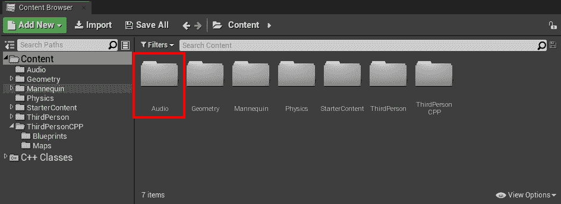

图 9.1：内容浏览器中的音频文件夹

1.  转到您刚刚创建的“音频”文件夹。

1.  将您的音频文件导入此文件夹。您可以通过*将*音频文件从“Windows 文件资源管理器”拖放到“内容浏览器”中来执行此操作。

1.  完成此操作后，应该会出现一个名为您音频文件的新资产，您可以在单击它时听到它：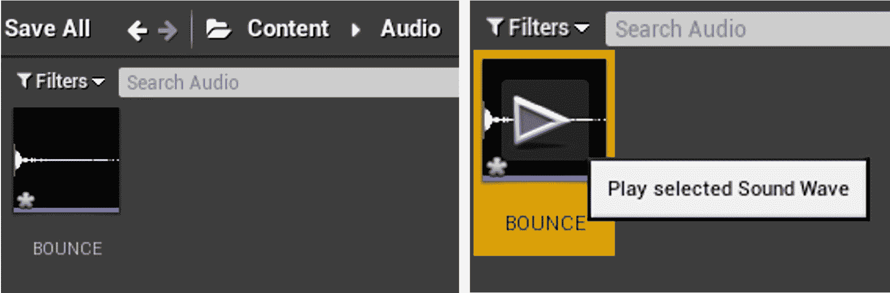

图 9.2：导入的音频文件

1.  打开此资产。您应该看到许多可供编辑的属性。但是，我们将仅专注于“声音”类别内的一些属性：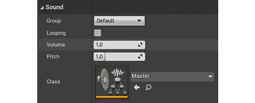

图 9.3：声音资产的设置

以下属性可在“声音”类别中使用：

+   “循环”：此声音在播放时是否循环。

+   “音量”：此声音的音量。

+   “音调”：此声音的音调。音调越高，频率越高，音调越高。

+   “类”：此声音的“声音类”。

我们将更改的唯一属性是“类”属性。我们可以使用 UE4 提供的现有“声音”类之一，但让我们为躲避球创建自己的“声音类”，以便为我们的游戏创建一组新的声音。

1.  转到“内容浏览器”界面内的“音频”文件夹。

1.  *右键单击*，转到“声音”类别（倒数第二个类别），然后转到“类别”类别，选择“声音类”。这将创建一个新的“声音类”资产。将此资产重命名为“躲避球”。

1.  打开您导入的声音资产，并将其“类”属性设置为“躲避球”：

图 9.4：将类属性更改为躲避球声音类

现在，这个导入的声音资产属于特定的类，您可以将与躲避球相关的其他声音效果分组到同一个“声音类”中，并通过该“声音类”编辑它们的属性，包括“音量”、“音调”和许多其他属性。

有了这个，我们就可以结束我们的练习了。您已经学会了如何将声音导入到您的项目中，以及如何更改它们的基本属性。现在，让我们继续进行下一个练习，在这个练习中，我们将在我们的游戏中每当躲避球从表面弹开时播放声音。

## 练习 9.02：当躲避球从表面弹开时播放声音

在这个练习中，我们将为我们的`DodgeballProjectile`类添加必要的功能，以便当躲避球从表面弹开时播放声音。

要做到这一点，请按照以下步骤操作：

1.  关闭编辑器并打开 Visual Studio。

1.  在`DodgeballProjectile`类的头文件中，添加一个受保护的`class USoundBase*`属性，名为`BounceSound`。此属性应该是一个`UPROPERTY`，并具有`EditDefaultsOnly`标记，以便可以在蓝图中进行编辑：

```cpp
// The sound the dodgeball will make when it bounces off of a   surface
UPROPERTY(EditAnywhere, Category = Sound)
class USoundBase* BounceSound;
```

1.  完成此操作后，转到`DodgeballProjectile`类的源文件，并添加一个包含`GameplayStatics`对象的包含：

```cpp
#include "Kismet/GameplayStatics.h"
```

1.  然后，在类的`OnHit`函数的实现开始之前，在对`DodgeballCharacter`类的转换之前，检查我们的`BounceSound`是否是有效属性（与`nullptr`不同），以及`NormalImpulse`属性的大小是否大于`600`单位（我们可以通过调用其`Size`函数来访问大小）。

正如我们在*第八章*，*用户界面*中看到的，`NormalImpulse`属性表示在被击中后改变躲避球轨迹的方向和大小的力量。我们要检查它的大小是否大于一定数量的原因是，当躲避球开始失去动量并且每秒在地板上反弹多次时，我们不希望每秒播放`BounceSound`多次；否则，会产生很多噪音。因此，我们将检查躲避球所受的冲量是否大于该数量，以确保这种情况不会发生。如果这两个条件都成立，我们将调用`GameplayStatics`对象的`PlaySoundAtLocation`。这个函数负责播放 3D 声音。它接收五个参数：

+   一个世界上下文对象，我们将作为`this`指针传递。

+   一个`SoundBase`属性，将是我们的`HitSound`属性。

+   声音的来源，我们将使用`GetActorLocation`函数传递。

+   `VolumeMultiplier`，我们将传递一个值为`1`。这个值表示播放此声音时音量会高低多少。例如，值为`2`表示音量会是原来的两倍。

+   `PitchMultiplier`，表示播放此声音时音调会高低多少。我们将使用`FMath`对象的`RandRange`函数传递这个值，该函数接收两个数字作为参数，并返回这两个数字之间的随机数。为了在`0.7`和`1.3`之间随机生成一个数字，我们将使用这些值作为参数调用这个函数。

看一下以下代码片段：

```cpp
if (BounceSound != nullptr && NormalImpulse.Size() > 600.0f)
{
  UGameplayStatics::PlaySoundAtLocation(this, BounceSound,   GetActorLocation(), 1.0f, FMath::RandRange(0.7f, 1.3f));
}
```

注意

负责播放 2D 声音的函数也可以从`GameplayStatics`对象中获得，它被称为`PlaySound2D`。这个函数将接收与`PlaySoundAtLocation`函数相同的参数，除了第三个参数，即声音的来源。

1.  编译这些更改，然后打开虚幻编辑器。

1.  打开`BP_DodgeballProjectile`蓝图，转到其`Class Defaults`选项卡，并将`BounceSound`属性设置为你导入的声音资产：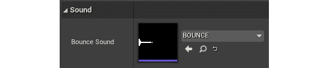

图 9.5：将 BounceSound 属性设置为我们导入的声音

1.  再次玩这个关卡，进入敌人角色的视线。你应该注意到每当敌人角色投掷的躲避球击中墙壁或地板（而不是玩家角色）时，会播放不同音调的声音：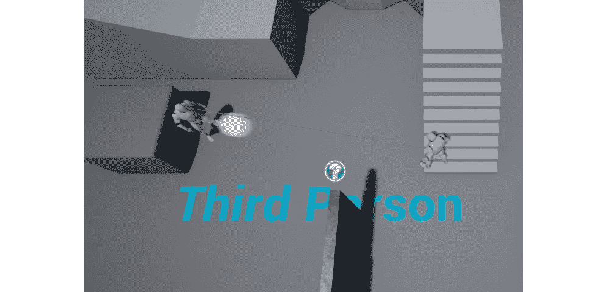

图 9.6：玩家角色导致敌人角色投掷躲避球

如果这样做成功了，恭喜你——你已经成功使用 UE4 播放了声音！如果你听不到声音，确保它是可听到的（它有一个你可以听到的音量级别）。

然而，你可能会注意到的另一件事是，无论角色与反弹的躲避球的距离如何，声音总是以相同的音量播放：声音不是以 3D 方式播放，而是以 2D 方式播放。要在 UE4 中以 3D 方式播放声音，我们必须学习关于声音衰减资产的知识。

# 声音衰减

要在 UE4 中以 3D 方式播放声音，你必须创建一个声音衰减资产，就像我们在本章的第一节中提到的那样。声音衰减资产将让你指定当声音与听者的距离增加时，你希望特定声音如何改变音量。看一下以下示例。

打开虚幻编辑器，转到`内容浏览器`界面内的`Audio`文件夹，*右键单击*，转到`声音`类别，并选择`声音衰减`。将这个新资产命名为`BounceAttenuation`：

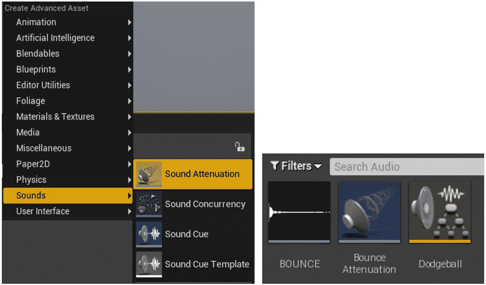

图 9.7：创建声音衰减资产

打开这个`BounceAttenuation`资产。

声音衰减资产有许多设置；然而，我们主要关注`衰减距离`部分的一些设置：

+   `内半径`：这个`float`属性允许我们指定声音开始降低音量的距离。如果声音在小于这个值的距离播放，音量不会受到影响。将此属性设置为`200`单位。

+   `衰减距离`：这个浮点属性允许我们指定声音变得听不见的距离。如果声音在大于这个值的距离播放，我们将听不到它。声音的音量将根据其与听者的距离以及它是更接近`内半径`还是`衰减距离`而变化。将此属性设置为`1500`单位：

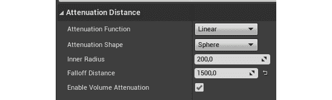

图 9.8：声音衰减资产设置

将其视为玩家周围的两个圆，较小的圆是内圆（半径值为`内半径`），较大的圆是衰减圆（半径值为`衰减距离`）。如果声音起源于内圆内部，则以全音量播放，而起源于衰减圆外部的声音则不会播放。

注意

您可以在这里找到有关声音衰减资产的更多信息：

[`docs.unrealengine.com/en-US/Engine/Audio/DistanceModelAttenuation`](https://docs.unrealengine.com/en-US/Engine/Audio/DistanceModelAttenuation)。

现在您已经了解了声音衰减资产，让我们继续下一个练习，我们将把躲避球弹起时播放的声音变成 3D 声音。

## 练习 9.03：将弹跳声音变成 3D 声音

在这个练习中，我们将把上一个练习中添加的躲避球弹起时播放的声音变成 3D 声音。这意味着当躲避球从地面弹起时播放的声音将根据其与玩家的距离而音量有所变化。我们这样做是为了当躲避球远离时，声音音量会很低，而当它靠近时，音量会很高。

要使用我们在上一节中创建的`BounceAttenuation`资产，请按照以下步骤进行：

1.  转到`DodgeballProjectile`的头文件，并添加一个名为`BounceSoundAttenuation`的`protected` `class USoundAttenuation*`属性。这个属性应该是一个`UPROPERTY`，并且有`EditDefaultsOnly`标记，以便可以在蓝图中进行编辑：

```cpp
// The sound attenuation of the previous sound
UPROPERTY(EditAnywhere, Category = Sound)
class USoundAttenuation* BounceSoundAttenuation;
```

1.  转到`DodgeballProjectile`类的源文件中的`OnHit`函数的实现，并向`PlaySoundAtLocation`函数的调用添加以下参数：

+   `StartTime`，我们将传递一个值为`0`。这个值表示声音开始播放的时间。如果声音持续 2 秒，我们可以通过传递值`1`使这个声音从其 1 秒标记开始。我们传递一个值`0`，以便从头开始播放声音。

+   `SoundAttenuation`，我们将传递我们的`BounceSoundAttenuation`属性：

```cpp
UGameplayStatics::PlaySoundAtLocation(this, BounceSound,   GetActorLocation(), 1.0f, 1.0f, 0.0f,   BounceSoundAttenuation);
```

注意

尽管我们只想传递额外的`SoundAttenuation`参数，但我们也必须传递所有其他在它之前的参数。

1.  编译这些更改，然后打开编辑器。

1.  打开`BP_DodgeballProjectile`蓝图，转到其`类默认`选项卡，并将`BounceSoundAttenuation`属性设置为我们的`BounceAttenuation`资产：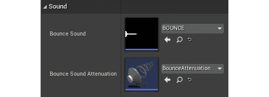

图 9.9：将 BoundSoundAttenuation 属性设置为 BounceAttenuation 资产

1.  再次播放关卡并进入敌人角色的视线范围。您现在应该注意到，每当敌人角色投掷的躲避球击中墙壁或地板时播放的声音会根据距离的不同以不同的音量播放，并且如果躲避球远了，您将听不到它：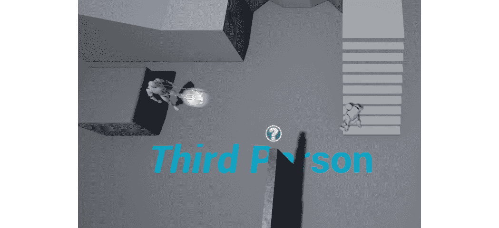

图 9.10：玩家角色使敌人角色投掷躲避球

有了这个，我们可以结束这个练习。您现在知道如何使用 UE4 播放 3D 声音。我们将在下一个练习中为我们的游戏添加背景音乐。

## 练习 9.04：为我们的游戏添加背景音乐

在这个练习中，我们将为我们的游戏添加背景音乐。我们将通过创建一个带有音频组件的新 Actor 来实现这一点，正如我们之前提到的，这是适合播放背景音乐的。要实现这一点，请按照以下步骤进行：

1.  下载位于[`packt.live/3pg21sQ`](https://packt.live/3pg21sQ)的音频文件，并将其导入到`Content Browser`界面的“音频”文件夹中，就像我们在“练习 9.01”、“导入音频文件”中所做的那样。

1.  *右键单击*`Content Browser`界面内部，并使用`Actor`类作为其父类创建一个新的 C++类。将这个新类命名为`MusicManager`。

1.  当为这个类生成文件并且 Visual Studio 自动打开时，关闭编辑器。

1.  在`MusicManager`类的头文件中，添加一个名为`AudioComponent`的新的受保护属性，类型为`class UAudioComponent*`。将其设置为`UPROPERTY`，并添加`VisibleAnywhere`和`BlueprintReadOnly`标签：

```cpp
UPROPERTY(VisibleAnywhere, BlueprintReadOnly)
class UAudioComponent* AudioComponent;
```

1.  在`MusicManager`类的源文件中，添加`AudioComponent`类的包含：

```cpp
#include "Components/AudioComponent.h"
```

1.  在这个类的构造函数中，将`bCanEverTick`属性更改为`false`：

```cpp
PrimaryActorTick.bCanEverTick = false;
```

1.  在这一行之后，添加一个新的行，通过调用`CreateDefaultSubobject`函数并将`UAudioComponent`类作为模板参数和`"Music Component"`作为普通参数传递来创建`AudioComponent`类：

```cpp
AudioComponent =   CreateDefaultSubobject<UAudioComponent>(TEXT("Music   Component"));
```

1.  进行这些更改后，编译您的代码并打开编辑器。

1.  转到`Content Browser`界面中的`ThirdPersonCPP` -> `Blueprints`文件夹，并创建一个从`MusicManager`类继承的新蓝图类。将其命名为`BP_MusicManager`。

1.  打开这个资产，选择它的“音频”组件，并将该组件的“声音”属性设置为您导入的声音：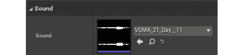

图 9.11：更新声音属性

1.  将`BP_MusicManager`类的实例拖入关卡中。

1.  播放关卡。您应该注意到游戏开始时音乐开始播放，并且当它到达结尾时也应该自动循环播放（这是通过音频组件实现的）。

注意

音频组件将自动循环播放它们正在播放的任何声音，因此不需要更改该声音资产的“循环”属性。

完成所有这些步骤后，我们已经完成了这个练习。您现在知道如何为您的游戏添加简单的背景音乐了。

现在，让我们进入下一个话题，即粒子系统。

# 粒子系统

让我们谈谈许多视频游戏中非常重要的另一个元素：粒子系统。

在视频游戏术语中，粒子实质上是 3D 空间中可以用图像表示的位置。粒子系统是许多粒子的集合，可能具有不同的图像、形状、颜色和大小。在下图中，您将找到在 UE4 中制作的两个粒子系统的示例：

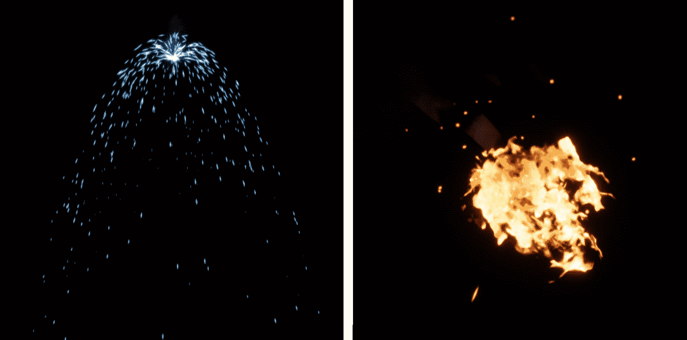

图 9.12：UE4 中的两个不同的粒子系统

左侧的粒子系统应该是电火花，可能来自被切割并且现在处于短路状态的电缆，而右侧的粒子系统应该是火。虽然左侧的粒子系统相对简单，但您可以看出右侧的粒子系统内有多种类型的粒子，这些粒子可以组合在同一个系统中。

注意

UE4 有两种不同的工具用于创建粒子系统：`Cascade`和`Niagara`。Cascade 是自 UE4 开始就存在的工具，而 Niagara 是一个更近期和复杂的系统，自 2020 年 5 月以来才成熟可用，截至虚幻引擎版本 4.25。

在 UE4 中创建粒子系统超出了本书的范围，但建议您使用 Niagara 而不是 Cascade，因为它是引擎的最新添加。

在本章中，我们将只使用已经包含在 UE4 中的粒子系统，但如果您想创建自己的粒子系统，这些链接将为您提供有关 Cascade 和 Niagara 的更多信息：

Cascade：[`docs.unrealengine.com/en-US/Engine/Rendering/ParticleSystems/Cascade`](https://docs.unrealengine.com/en-US/Engine/Rendering/ParticleSystems/Cascade)

[`www.youtube.com/playlist?list=PLZlv_N0_O1gYDLyB3LVfjYIcbBe8NqR8t`](https://www.youtube.com/playlist?list=PLZlv_N0_O1gYDLyB3LVfjYIcbBe8NqR8t)

Niagara：[`docs.unrealengine.com/en-US/Engine/Niagara/EmitterEditorReference/index.html`](https://docs.unrealengine.com/en-US/Engine/Niagara/EmitterEditorReference/index.html)

[`docs.unrealengine.com/en-US/Engine/Niagara/QuickStart`](https://docs.unrealengine.com/en-US/Engine/Niagara/QuickStart)

我们将在下一个练习中学习如何将粒子系统添加到我们的游戏中。在本章中，我们将简单地使用已经由 UE4 团队制作的现有粒子系统。

## 练习 9.05：当躲避球击中玩家时生成一个粒子系统

在这个练习中，我们将了解如何在 UE4 中生成一个粒子系统。在这种情况下，当敌人投掷的躲避球击中玩家时，我们将生成一个`explosion`粒子系统。

为了实现这一点，请按照以下步骤：

1.  关闭编辑器，打开 Visual Studio。

1.  在`DodgeballProjectile`类的头文件中，添加一个受保护的`class UParticleSystem*`属性，名为`HitParticles`。

`UParticleSystem`类型是 UE4 中的粒子系统的指定。确保将其设置为`UPROPERTY`并给予`EditDefaultsOnly`标签，以便可以在蓝图类中进行编辑：

```cpp
// The particle system the dodgeball will spawn when it hits   the player
UPROPERTY(EditAnywhere, Category = Particles)
class UParticleSystem* HitParticles;
```

1.  在`DodgeballProjectile`类的源文件中，在其`OnHit`函数的实现中。在调用`Destroy`函数之前，检查我们的`HitParticles`属性是否有效。如果有效，调用`GameplayStatics`对象的`SpawnEmitterAtLocation`函数。

此函数将生成一个将播放我们传递的粒子系统的角色。它接收以下参数：

+   一个`World`对象，我们将使用`GetWorld`函数传递。

+   一个`UParticleSystem*`属性，它将是我们的`HitParticles`属性。

+   将播放粒子系统的角色的`FTransform`，我们将使用`GetActorTransform`函数传递：

```cpp
if (HitParticles != nullptr)
{
  UGameplayStatics::SpawnEmitterAtLocation(GetWorld(),   HitParticles, GetActorTransform());
}
```

注意

虽然我们在这个项目中不会使用它，但与生成粒子系统相关的另一个函数来自`GameplayStatics`对象，即`SpawnEmitterAttached`函数。此函数将生成一个粒子系统并将其附加到一个角色，如果您想要，例如，使一个移动的物体着火，以便粒子系统始终保持附加到该物体，这可能会有用。

1.  编译这些更改，然后打开编辑器。

1.  打开`BP_DodgeballProjectile`蓝图，转到其`Class Defaults`选项卡，并将`HitParticles`属性设置为`P_Explosion`粒子系统资产：

图 9.13：将 HitParticles 属性设置为 P_Explosion

1.  现在，播放关卡，让您的玩家角色被躲避球击中。现在您应该看到爆炸粒子系统正在播放：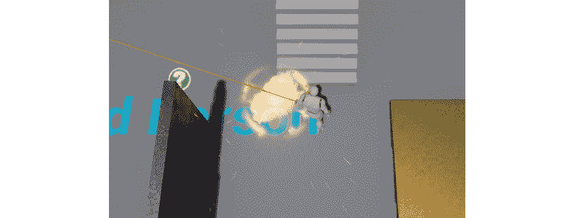

图 9.14：当躲避球击中玩家时播放的爆炸粒子系统

这就结束了这个练习。现在你知道如何在 UE4 中播放粒子系统。粒子系统将为您的游戏增添视觉效果，使其在视觉上更具吸引力。

在下一个活动中，我们将通过在躲避球击中玩家时播放声音来巩固我们在 UE4 中播放音频的知识。

## 活动 9.01：当躲避球击中玩家时播放声音

在这个活动中，我们将创建逻辑，负责在玩家角色被躲避球击中时每次播放声音。在视频游戏中，以多种方式向玩家传递关键信息非常重要，因此除了改变玩家角色的生命值条外，当玩家被击中时我们还将播放声音，以便玩家知道角色正在受到伤害。

要做到这一点，请按照以下步骤进行：

1.  将一个声音文件导入到`内容浏览器`界面内的`Audio`文件夹中，该声音文件将在玩家角色被击中时播放。

注意

如果您没有声音文件，您可以使用[`www.freesoundeffects.com/free-track/punch-426855/`](https://www.freesoundeffects.com/free-track/punch-426855/)上提供的声音文件。

1.  打开`DodgeballProjectile`类的头文件。添加一个`SoundBase*`属性，就像我们在*练习 9.02*中所做的那样，*当躲避球从表面弹开时播放声音*，但这次称其为`DamageSound`。

1.  打开`DodgeballProjectile`类的源文件。在`OnHit`函数的实现中，在你伤害了玩家角色并在调用`Destroy`函数之前，检查`DamageSound`属性是否有效。如果有效，调用`GameplayStatics`对象的`PlaySound2D`函数（在*练习 9.02*中提到，*当躲避球从表面弹开时播放声音*），将`this`和`DamageSound`作为该函数调用的参数。

1.  编译您的更改并打开编辑器。

1.  打开`BP_DodgeballProjectile`蓝图，并将其`DamageSound`属性设置为您在本活动开始时导入的声音文件。

当您播放关卡时，您应该注意到每当玩家被躲避球击中时，您将听到您导入的声音被播放：

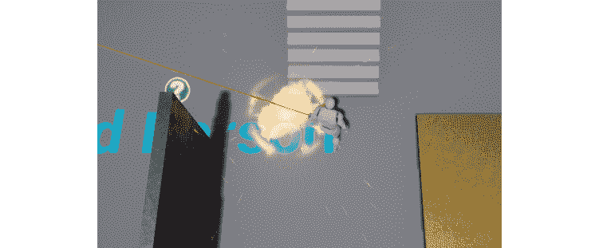

图 9.15：当玩家角色被击中时应该播放声音

完成了这些步骤后，您已经完成了这个活动，并巩固了在 UE4 中播放 2D 和 3D 声音的使用。

注意

此活动的解决方案可以在以下网址找到：[`packt.live/338jEBx`](https://packt.live/338jEBx)。

现在，让我们通过学习一些关于关卡设计概念来结束本章。

# 关卡设计

自*第五章*，*线性跟踪*，与我们的躲避球游戏相关，我们已经添加了相当多的游戏机制和游戏机会，以及一些视听元素，所有这些都在本章中处理。现在我们有了所有这些游戏元素，我们必须将它们汇集到一个可以由玩家从头到尾玩的关卡中。为此，让我们学习一些关于关卡设计和关卡布局的知识。

关卡设计是一种特定的游戏设计学科，专注于在游戏中构建关卡。关卡设计师的目标是制作一个有趣的关卡，通过使用为该游戏构建的游戏机制向玩家介绍新的游戏玩法概念，包含良好的节奏（充满动作和轻松的游戏序列的良好平衡），以及更多内容。

为了测试关卡的结构，关卡设计师将首先构建所谓的**关卡布局**。这是关卡的一个非常简单和简化版本，使用了最终关卡将包含的大部分元素，但只使用简单的形状和几何图形制作。这样做的原因是为了在需要修改关卡的部分时更容易和节省时间：

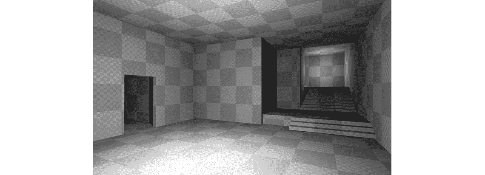

图 9.16：使用 BSP Brushes 在 UE4 中制作的关卡布局示例

注意

应该注意的是，关卡设计是一种特定的游戏开发技能，值得有一本专门的书来介绍，而实际上也有很多这样的书，但是深入讨论这个话题超出了本书的范围。

在下一个练习中，我们将使用我们在最近几章中构建的机制来构建一个简单的关卡布局。

## 练习 9.06：构建关卡布局

在这个练习中，我们将创建一个新的关卡布局，其中包含一些结构，玩家将从关卡的某个地方开始，并通过一系列障碍物到达关卡的结尾。我们将使用我们在最近几章中构建的所有机制和对象来制作一个玩家能够完成的关卡。

尽管在这个练习中我们将为您提供一个解决方案，但鼓励您发挥创造力，提出自己的解决方案，因为在这种情况下没有对错之分。

要开始这个练习，请按照以下步骤操作：

1.  打开编辑器。

1.  转到`ThirdPersonCPP`->“内容浏览器”中的“地图”文件夹，复制`ThirdPersonExampleMap`资产，并将其命名为`Level1`。您可以通过选择资产并按下*Ctrl* + *W*或右键单击资产并选择“复制”（第三个选项）来执行此操作。

1.  打开新创建的`Level1`地图。

1.  删除地图中具有网格的所有对象，除了以下对象：

+   玩家角色

+   敌人角色（注意两个角色看起来是一样的）

+   地板对象

+   我们创建的墙对象

+   胜利箱对象

请记住，与照明和声音相关的资产应保持不变。

1.  通过按下“构建”按钮为`Level1`建立照明。该按钮位于编辑器窗口顶部的“工具栏”中，“播放”按钮的左侧。

1.  在您按照这些步骤操作后，您应该有一个空的地板，只有您在这个关卡中需要的对象（在*步骤 4*中提到的对象）。以下是在您分别按照*步骤 4 和 5*之后的`Level1`地图之前和之后的情况：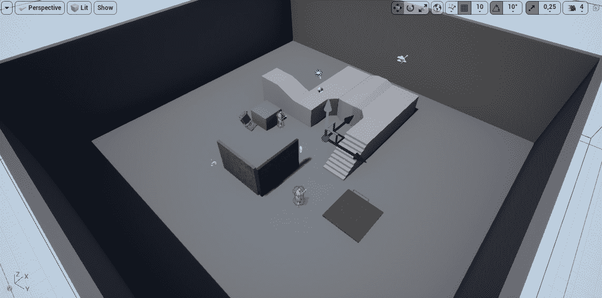

图 9.17：删除所需对象之前

一旦你删除了对象，你的地板应该如下所示：

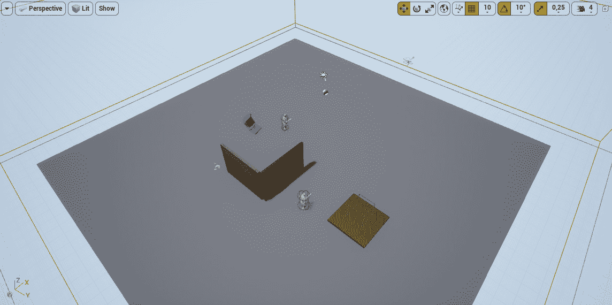

图 9.18：删除所需对象后

因为建立一个关卡，即使是一个简单的关卡，也需要很多步骤和指示，所以我们将简单地展示一些可能的关卡截图，并鼓励您自己想出解决方案。

1.  在这种情况下，我们只是简单地使用了现有的`EnemyCharacter`、`Wall`和`GhostWall`对象，并将它们多次复制，以创建玩家可以从头到尾穿越的简单布局。我们还移动了`VictoryBox`对象，使其与新关卡的结束位置匹配：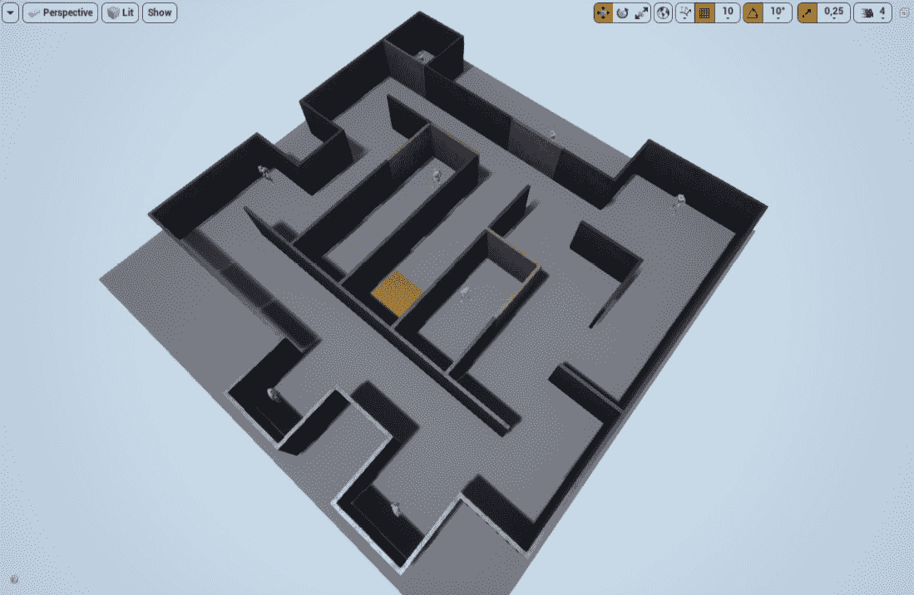

图 9.19：创建的关卡-等距视图

关卡可以从俯视图中看到如下：

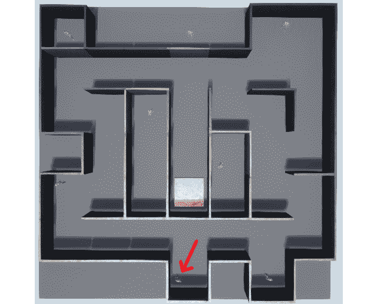

图 9.20：创建的关卡-俯视图，玩家角色用箭头标记

一旦你对结果满意，这意味着你已经完成了你的躲避球游戏，现在可以邀请你的朋友和家人来玩，并看看他们的想法。干得好 - 你离掌握游戏开发的艺术又近了一步！

# 额外功能

在我们结束本章之前，这里有一些建议，关于接下来在这个躲避球项目中你可以做些什么：

+   使之前创建的普通“墙”类不会阻挡敌人的视线。这样，敌人将始终向玩家投掷躲避球，但仍然会被这堵墙挡住。

+   添加一个新功能，允许玩家通过“扫描轨迹”概念来可视化敌人角色投掷的躲避球首先会影响到哪里。

+   添加一种新类型的墙，可以阻挡玩家角色、敌人角色和躲避球，但也会受到躲避球的伤害，并在耗尽生命值时被摧毁。

这个项目的扩展空间是无限的。我们鼓励你运用所学的技能，并进行进一步的研究，为你的游戏添加新功能并增加更多的复杂性。

# 总结

你现在已经完成了躲避球游戏项目。在本章中，你学会了如何通过播放音频和使用粒子系统来为你的游戏增添亮点。你现在知道如何为你的游戏添加 2D 和 3D 声音，以及一些相关的工具。现在，你可以尝试为你的游戏添加更多的声音效果，比如当敌人角色第一次看到你时的特殊声音效果（比如《合金装备》中的情况）、脚步声音效果或者胜利声音效果。

你还使用了在前几章中制作的所有工具来构建一个关卡，从而汇总了我们在这个项目中构建的所有逻辑。

在下一章中，我们将开始一个新项目：《超级横向卷轴》游戏。在那个项目中，你将接触到诸如增益、可收集物品、敌人人工智能（AI）、角色动画等主题。你将创建一个横向卷轴平台游戏，控制一个角色完成关卡，收集宝石，并使用增益来避开敌人。你将学习的两个最重要的主题是 UE4 的行为树和黑板，它们支持 AI 系统，以及动画蓝图，它允许你管理角色的动画。
