# 10. 创建一个 SuperSideScroller 游戏

概述

在本章中，我们将为新的`SuperSideScroller`游戏设置项目。您将了解横向滚动游戏的不同方面，包括强化道具、可收集物品和敌人人工智能，我们将在项目中使用所有这些。您还将了解游戏开发中的角色动画流程，并了解如何操纵我们游戏角色的移动。

在本章结束时，您将能够创建一个横向滚动项目，操纵我们角色的默认模特骨骼，导入角色和动画，并创建角色和动画蓝图。

# 介绍

到目前为止，我们已经学到了很多关于虚幻引擎、C++编程和一般游戏开发技术和策略的知识。在之前的章节中，我们涵盖了诸如碰撞、追踪、如何在虚幻引擎 4 中使用 C++，甚至蓝图可视化脚本系统等主题。除此之外，我们还获得了关于骨骼、动画和动画蓝图的关键知识，我们将在即将到来的项目中利用这些知识。

对于我们的最新项目`SuperSideScroller`，我们将使用许多在之前章节中使用过的概念和工具来开发我们的游戏特性和系统。碰撞、输入和 HUD 等概念将是我们项目的重点；然而，我们还将深入研究涉及动画的新概念，以重新创建流行横向滚动游戏的机制。最终项目将是我们迄今为止在本书中学到的一切的结晶。

有无数的横向滚动游戏示例可供参考。最近一些流行的横向滚动游戏包括*Celeste*、*Hollow Knight*和*Shovel Knight*，但是横向滚动/平台游戏背后也有悠久而丰富的历史，我们将在本章中讨论。

# 项目分解

让我们考虑一下著名的*超级马里奥兄弟*的例子，该游戏于 1985 年在**任天堂娱乐系统**（**NES**）主机上发布。这款游戏是由任天堂制作，由宫本茂设计。对于不熟悉这个系列的人来说，一般的想法是：玩家控制马里奥，他必须穿越蘑菇王国的许多危险障碍和生物，希望从邪恶的酷霸王鲍斯那里救出桃花公主。

注意

为了更好地理解游戏的运作方式，请随时在[`supermariobros.io/`](https://supermariobros.io/)免费在线玩游戏。整个*超级马里奥兄弟*系列的更深入的维基可以在这里找到：[`www.mariowiki.com/Super_Mario_Bros`](https://www.mariowiki.com/Super_Mario_Bros)。

以下是这种类型游戏的核心特点和机制：

1.  `SuperSideScroller`游戏将是 3D 而不是纯 2D，我们角色的移动将与马里奥的移动方式完全相同，只支持垂直和水平移动：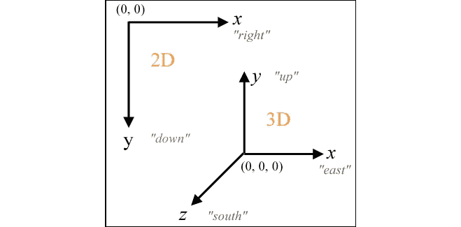

图 10.1：2D 和 3D 坐标向量的比较

1.  `SuperSideScroller`游戏也不例外。有许多不同的游戏，如*Celeste*、*Hollow Knight*和*Super Meat Boy*，如前所述，都使用了跳跃功能-所有这些都是 2D 的。

1.  **角色强化道具**：没有角色强化道具，许多横向滚动游戏会失去混乱感和可重复性。例如，在游戏*奥里和失落的森林*中，开发者引入了不同的角色能力，改变了游戏的玩法。像三段跳或空中冲刺这样的能力打开了各种可能性，使玩家能够根据其移动能力创建有趣的布局。

1.  **敌方 AI**：引入具有各种能力和行为的敌人，以增加玩家的挑战层次，除了通过可用的移动机制单独导航关卡的挑战之外。

注意

游戏中的 AI 可以以哪些方式与玩家互动？例如，在《上古卷轴 V：天际》中，各个城镇和村庄中的 AI 角色可以与玩家进行对话，以阐述世界构建元素，如历史，向玩家出售物品，甚至向玩家提供任务。

1.  `SuperSideScroller`游戏将允许玩家收集硬币。

现在我们已经评估了我们想要支持的游戏机制，我们可以分解每个机制的功能，以及它如何与我们的`SuperSideScroller`相关，以及我们需要做些什么来实现这些功能。

# 玩家角色

当使用虚幻引擎 4 的`侧向滚动`游戏项目模板时，几乎所有我们想要的角色功能都已经默认给我们了。

注意

在撰写本文时，我们使用的是虚幻引擎版本 4.24.2；使用引擎的其他版本可能会导致编辑器、工具以及后续逻辑的一些差异，因此请记住这一点。

现在，让我们在下一个练习中开始创建我们的项目。

## 练习 10.01：创建侧向滚动项目并使用角色移动组件

在本练习中，您将使用`侧向滚动`模板设置虚幻引擎 4。这个练习将帮助您开始我们的游戏。

以下步骤将帮助您完成练习：

1.  首先，打开 Epic Games Launcher，导航到左侧选项底部的`Unreal Engine`选项卡，并在顶部选择`Library`选项。

1.  接下来，您将收到一个窗口提示您要么打开现有项目，要么创建特定类别的新项目。其中包括`游戏`类别；选择此选项以进行我们的项目。选择了项目类别后，您现在需要选择项目的模板。

1.  接下来，点击`侧向滚动`选项，因为我们希望我们的游戏使用 3D 骨骼网格和动画，而不仅仅是 2D 纹理、翻页书和 Paper2D 工具集的其他功能。

注意

请务必选择正确的`侧向滚动`选项，因为虚幻引擎 4 有两种类型的侧向滚动项目：`侧向滚动`和`2D 侧向滚动`。

我们将在本练习之后讨论这两种项目模板之间的主要区别。

最后，我们需要设置我们的项目设置。

1.  选择基于`C++`的项目，而不是`蓝图`，以包括`入门内容`，并将我们的平台选择为`桌面/控制台`。其余的项目设置可以保留为默认设置。选择位置并命名项目为`SuperSideScroller`，并将项目保存在您选择的适当目录中。

1.  应用这些设置后，选择`创建项目`。当编译引擎完成后，虚幻编辑器和 Visual Studio 都将打开，我们就可以开始了。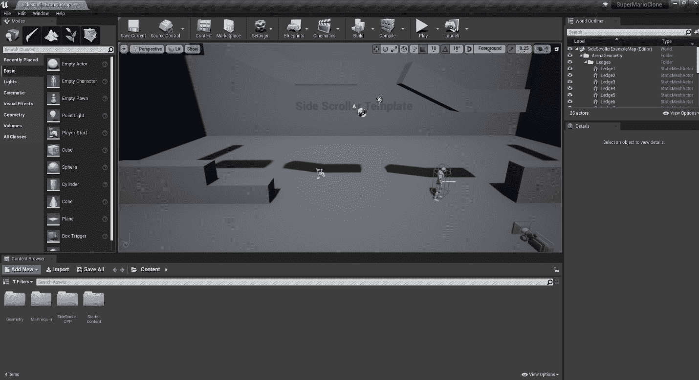

图 10.2：虚幻引擎编辑器现在应该已经打开

接下来，我们继续操作默认的`SideScroller`角色内存在的角色移动组件，并查看这如何影响角色。`Character Movement`组件只能在`Character`类中实现，并允许双足化身通过*行走*、*跳跃*、*飞行*和*游泳*移动。这个组件还具有内置的网络复制功能，这对于多人游戏是必要的。

1.  在`Content Browser`中，导航到`/SideScrollerCPP/Blueprints/`目录，并找到`SideScrollerCharacter`蓝图：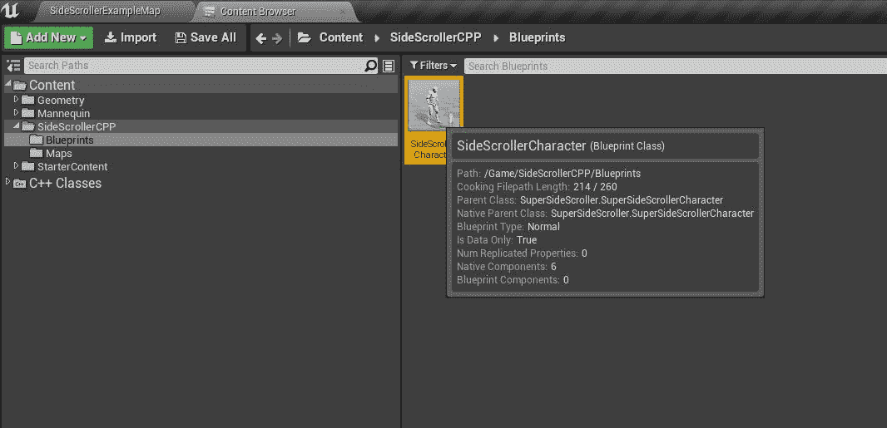

图 10.3：在内容浏览器中选择默认的 SideScrollerCharacter 蓝图

1.  双击*蓝图*资产以打开*蓝图*。有时，如果*蓝图*没有任何图形逻辑，您将看到*图 10.4*中显示的内容。如果您看到这个，请只需*左键单击*“打开完整蓝图编辑器”：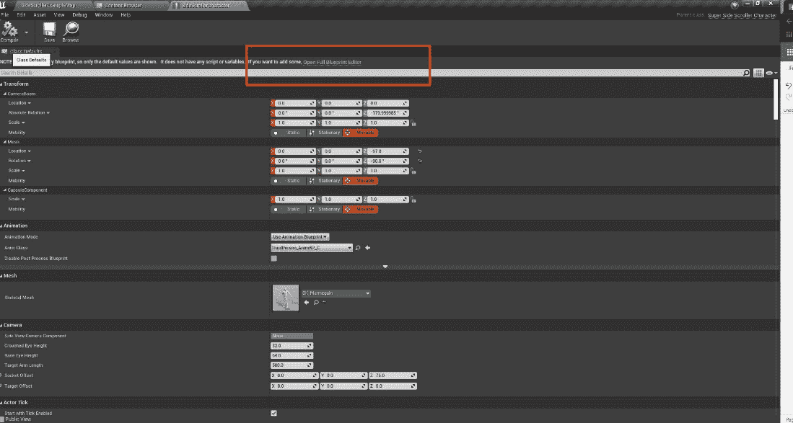

图 10.4：当蓝图没有图形逻辑时

1.  打开角色“蓝图”，我们可以*左键单击*“组件”选项卡中的“CharacterMovement（继承）”组件，以查看此组件的参数。

1.  现在，在“详细信息”面板下，我们可以访问数十个影响角色移动的参数。在`Character Movement: Walking`类别中，我们有`Max Walk Speed`参数。将此值从`600.0f`更改为`2000.0f`。

1.  最后，编译并保存我们的角色*蓝图*。现在，如果我们在编辑器中播放，我们可以观察到我们的玩家角色移动得有多快：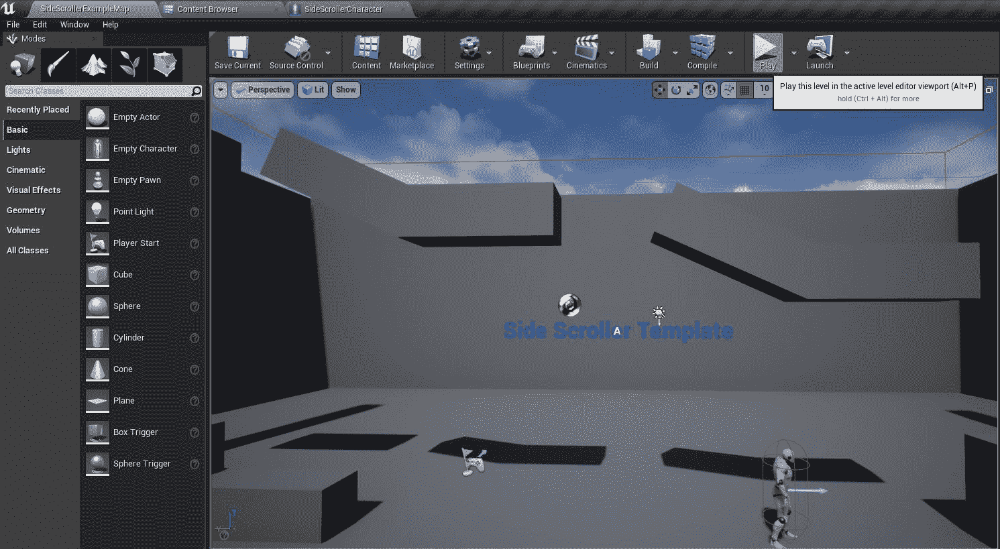

图 10.5：如果我们在编辑器中播放，我们可以看到我们的角色移动得更快

现在您已经完成了这项练习，亲身体验了对玩家角色移动方式的控制！尝试更改“最大行走速度”的值，并观察这些更改如何影响角色。

## 侧向滚动与 2D 侧向滚动

让我们在这里花点时间了解“2D 侧向滚动”项目模板和“侧向滚动”模板之间的主要区别。 “2D 侧向滚动”模板使用了基于纸张 2D 系统构建的虚幻引擎 4，利用了基于纹理的动画，通过纹理、精灵和纸张翻书。

注意

有关 Paper2D 的更多详细信息，请参阅以下文档：[`docs.unrealengine.com/en-US/Engine/Paper2D/index.html`](https://docs.unrealengine.com/en-US/Engine/Paper2D/index.html)。

有关 Paper2D 的材料足够多，值得有一本专门的教材，因此我们不会再涉及太多这个主题。然而，“侧向滚动”模板几乎与 2D 版本相同，只是我们使用 3D 动画骨骼而不是 2D 动画。

现在，让我们继续并看看执行我们的第一个活动来操纵玩家角色的跳跃动作。

## 活动 10.01：使我们的角色跳得更高

在这项活动中，我们将操纵默认的“侧向滚动”角色蓝图中`CharacterMovement`组件中存在的一个新参数（跳跃），以观察这些属性如何影响我们的角色移动。

我们将实施从*练习 10.01*中学到的内容，*创建侧向滚动项目并使用角色移动组件*，并将其应用于如何创建我们的角色强化道具以及角色的一般移动感觉。

以下步骤将帮助您完成这项活动：

1.  转到`SideScrollerCharacter`蓝图，并在`CharacterMovement`组件中找到`Jump Z Velocity`参数。

1.  将此参数从默认的`1000.0`f 更改为`2000.0`f。

1.  编译并保存`SideScrollerCharacter`蓝图，并在编辑器中播放。观察我们的角色使用键盘上的空格键可以跳多高。

1.  停止在编辑器中播放，返回到`SideScrollerCharacter`蓝图，并将`Jump Z Velocity`从`2000.0`f 的值更新为`200.0`f。

1.  再次编译并保存蓝图，然后在编辑器中播放，观察角色的跳跃。

**预期输出**：

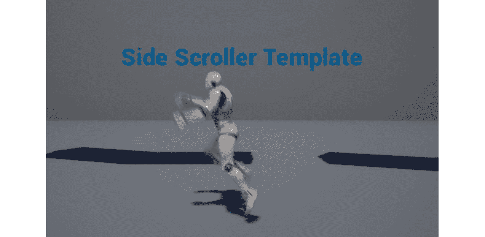

图 10.6：跳跃角色的预期输出

注意

此活动的解决方案可在此处找到：[`packt.live/338jEBx`](https://packt.live/338jEBx)。

现在我们已经完成了这个活动，对于`CharacterMovement`组件参数的一些更改如何影响我们的玩家角色有了更好的理解。当我们需要给我们的角色基本的移动行为，比如`行走速度`和`跳跃 Z 速度`时，我们可以在以后使用这些知识来实现我们想要的角色感觉。在继续之前，将跳跃 Z 速度参数恢复到默认值 1000.0f。

在我们项目的后期，当我们开发我们的玩家角色增强道具时，我们也会记住这些参数。

# 我们横向卷轴游戏的特点

现在让我们花点时间来详细说明我们将要设计的游戏。这些特性中的许多将在后面的章节中实现，但现在是一个好时机来规划项目的愿景。

## 敌人角色

在玩`SuperSideScroller`项目时，你应该已经注意到默认情况下没有提供敌人 AI。因此，让我们讨论我们希望支持的敌人类型以及它们的工作方式。我们的`SuperSideScroller`项目将支持一种敌人类型。

敌人将有一个基本的来回移动模式，并不支持任何攻击；只有与玩家角色碰撞，他们才能造成伤害。然而，我们需要设置敌人 AI 要移动的两个位置，接下来，我们需要决定 AI 是否应该改变位置。他们应该不断在位置之间移动，还是在选择新位置移动之前应该暂停一下？

最后，我们决定我们的 AI 是否应该始终知道玩家的位置。如果玩家进入敌人的一定范围，敌人是否应该知道这一点，并积极地朝着玩家最后所在的位置移动？

在*第十三章* *敌人人工智能*中，我们将使用虚幻引擎 4 中可用的工具来开发这种 AI 逻辑。

## 增强道具

`SuperSideScroller`游戏项目将支持一种类型的增强道具，即玩家可以从环境中拾取的药水。这种药水增强道具将增加玩家的移动速度和最大跳跃高度。这些效果只会持续很短的时间，然后就会消失。

记住你在*练习 10.01* *创建横向卷轴项目并使用角色移动组件*和*活动 10.01* *使我们的角色跳得更高*中实现的内容，关于`CharacterMovement`组件，你可以开发一个改变角色重力影响的增强道具，这将允许以新的有趣方式穿越关卡和与敌人战斗。

## 可收集物品

视频游戏中的可收集物品有不同的用途。在某些情况下，可收集物品被用作一种货币，用于购买升级、物品和其他商品。在其他情况下，可收集物品用来提高你的得分或在收集足够的可收集物品时奖励你。对于`SuperSideScroller`游戏项目，硬币将只有一个目的：给玩家一个目标，尽可能多地收集硬币，而不被敌人摧毁。

让我们分解一下我们可收集物品的主要方面：

+   可收集物品需要与我们的玩家进行交互；这意味着我们需要使用碰撞检测让玩家收集它，并且为我们的 UI 添加信息。

+   可收集物品需要一个视觉静态网格表示，以便玩家可以在关卡中识别它。

我们`SuperSideScroller`项目的最后一个元素是砖块。砖块将为`SuperSideScroller`游戏提供以下用途：

+   砖块被用作关卡设计的一个元素。砖块可以用来进入其他无法到达的区域；敌人可以放置在不同高度的砖块上，以提供游戏玩法的变化。

+   砖块中可以包含可收集的硬币。这给玩家一个动力去尝试并查看哪些方块包含可收集物品，哪些不包含。

## HUD（头顶显示）

HUD UI 可以用于根据游戏类型和您支持的机制向玩家显示重要和相关的信息。对于`SuperSideScroller`项目，将有一个 HUD 元素，它将向玩家显示他们收集了多少个硬币。每当玩家收集一个硬币时，此 UI 将更新，并且当玩家被销毁时将重置为`0`。

现在我们已经列出了这个项目的一些具体内容，我们将继续进行动画流程。

# 动画步骤

需要明确的是，本书不会涵盖动画制作。我们不会讨论和学习如何使用 3D 软件工具（如 3D Studio Max、Maya 或 Blender）制作动画。然而，我们将学习如何将这些资产导入虚幻引擎，使用引擎内的动画资产，并使用可用的动画工具集来赋予角色生命。

# 角色动画流程

对于本书的目的，我们只关注 3D 动画以及动画在虚幻引擎 4 中的工作方式；然而，简要讨论许多行业中用于创建角色及其动画的流程是很重要的。

## 概念阶段

第一阶段是开发我们想要创建并稍后进行动画的角色的概念。这几乎总是以 2D 形式完成，可以手工完成，也可以通过使用诸如 Photoshop 之类的计算机程序完成。对于 3D 建模师来说，有几个关于角色外观和相对大小的参考图，可以使建模过程更加容易。下面，我们看到一个棍人角色在不同姿势下的基本示例。注意角色以不同的方式摆姿势：

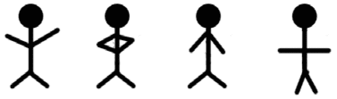

图 10.7：一个 2D 角色概念的非常简单的例子

## 3D 建模阶段

一旦角色概念完成，流程就可以转移到下一个阶段：制作角色的 3D 模型。模型通常是在 3D Studio Max 或 Maya 等程序中制作的，但这些软件相对昂贵，除非您有学生许可证，并且更常用于专业环境中。

不需要详细讨论 3D 建模的复杂性，我们只需要知道 3D 艺术家使用计算机软件来操纵 3D 空间中的点（称为顶点）来创建物体。然后将这些物体雕刻成我们的角色或环境部件的形状。

## 绑定阶段

一旦最终的角色模型完成，就可以开始绑定过程。通常用于建模角色的软件通常也用于绑定角色。绑定意味着构建一系列形成角色骨架的骨骼。

在人形角色的情况下，我们通常会看到头部、脊柱、臀部、腿部等骨骼；但是骨架的形状可能会因您制作的角色类型而有所不同。大象的骨骼结构与人类完全不同。同一个骨骼结构也可以应用于不同的角色。

## 动画

一旦我们的角色绑定完成并且有了骨骼层次结构，就该是动画师拿起这个网格并用动画赋予它生命的时候了。

3D 动画，基本上是对骨骼在时间上的操纵。记录骨骼位置、旋转和缩放随时间的变化过程就是动画的结果。动画完成后，我们可以从 3D 软件中导出资产，并将其导入引擎。

## 资产导出和导入

当我们有了我们的 3D 角色网格，它的骨骼系统和动画，就是时候将这些资产从 3D 软件导出并导入到虚幻引擎 4 中了。重要的是要注意，负责角色、骨骼和动画的艺术家们将不断地将正在进行中的工作资产导入引擎，以更好地了解最终在游戏中的效果。我们将在本章的*Activity 10.03*、*导入更多自定义动画以预览角色奔跑*及其相关练习中实施这一点。

## 练习 10.02：探索 Persona 编辑器并操纵默认人体骨骼权重

现在我们对动画流程有了更好的理解，让我们深入了解一下在`Side Scroller`模板项目中给我们的默认人体骨骼网格。

我们的目标是更多地了解默认骨骼网格和 Persona 编辑器中给我们的工具，以便更好地了解骨骼、骨骼权重和骨骼在虚幻引擎 4 中的工作方式。

以下步骤将帮助您完成练习：

1.  打开虚幻引擎编辑器，导航到`内容浏览器`。

1.  导航到`/Mannequin/Character/Mesh/`文件夹并打开`UE4_Mannequin_Skeleton`资产：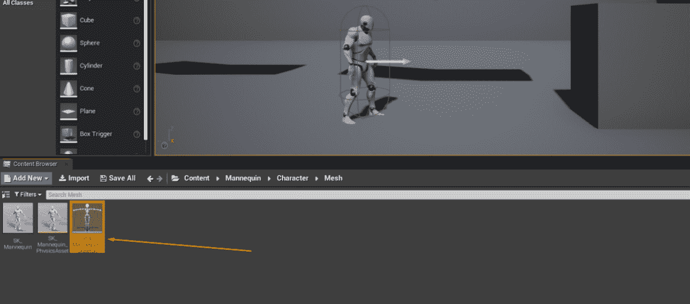

图 10.8：UE4_Mannequin_Skeleton 资产在此处被突出显示并可见

打开骨骼资产后，我们看到了`Persona 编辑器`：

图 10.9：Persona 编辑器

](img/B16183_10_09.jpg)

图 10.9：Persona 编辑器

让我们简要地解释一下 Persona 的骨骼编辑器：

+   在左侧（*标有 1*）我们看到了骨骼层次结构。这是在角色的绑定过程中制作的骨骼。`root`骨骼，顾名思义，是骨骼层次结构的根。这意味着对这个骨骼的变换将影响层次结构中的所有骨骼。从这里，我们可以选择一个骨骼或一组骨骼，并查看它们在角色网格上的位置。

+   接下来，我们看到了骨骼网格预览窗口（*标有 2*）。它显示了我们的角色网格，并且有一些额外的选项，我们可以切换这些选项，以便预览我们的骨骼和权重绘制。

+   在右侧（*标有 3*）我们有基本的变换选项，可以修改单个骨骼或骨骼组。还有其他可用的设置，我们将在下一个练习中加以利用。现在我们更了解它是什么以及我们在看什么，让我们看看我们的人体骨骼网格上的实际骨架是什么样子。

1.  导航到`Character`，如*图 10.10*所示：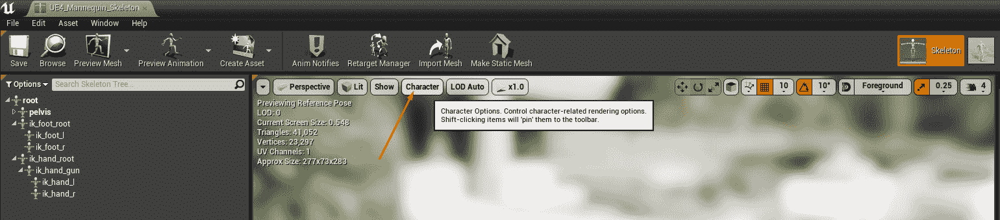

图 10.10：角色选项菜单让您能够在网格上显示人体骨骼的能力

1.  从下拉菜单中选择`Bones`选项。然后确保选择了`All Hierarchy`选项。选择此选项后，您将看到人体骨骼网格上方的轮廓骨架渲染在人体模型上方：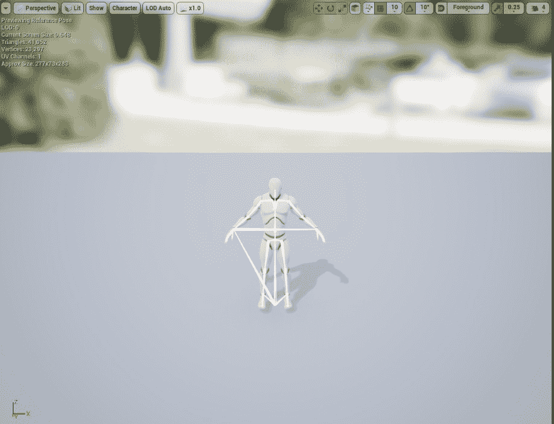

图 10.11：骨架叠加在人体骨骼网格上

1.  现在，隐藏网格，只是预览骨骼层次结构，我们可以禁用`Mesh`属性：

+   导航到`Character`，从下拉菜单中选择`Mesh`选项。

+   取消`Mesh`选项，结果应该如下所示：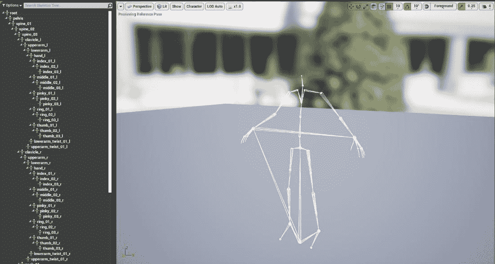

图 10.12：默认角色的骨骼层次结构

为了本练习的目的，让我们切换`Mesh`可见性，这样我们就可以看到网格和骨骼层次结构。

最后，一起看一下我们默认角色的权重缩放。

1.  要预览此内容，请转到`Character`，然后从下拉菜单中选择`Mesh`选项。然后，在标有`Mesh Overlay Drawing`的部分底部选择`Selected Bone Weight`选项：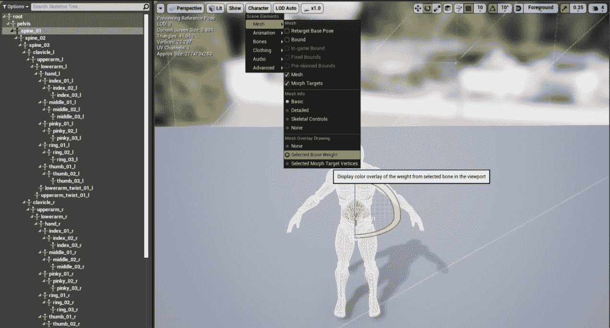

图 10.13：下拉选项显示人体模型骨骼的选定骨骼权重

1.  现在，如果我们从层次结构中选择一个骨骼或一组骨骼，我们可以看到每个骨骼如何影响网格的某个区域：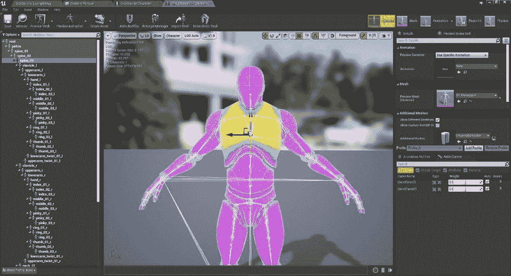

图 10.14：这是 spine_03 骨的权重缩放

您会注意到，当我们预览特定骨骼的权重缩放时，骨骼网格的不同部分会显示一系列颜色。这是权重缩放的视觉显示，而不是数值上的。诸如`红色`、`橙色`和`黄色`的颜色表示骨骼的权重较大，这意味着这些颜色的高亮区域将受到更大影响。在`蓝色`、`绿色`和`青色`的区域，它们仍会受到影响，但影响不那么显著。最后，没有高亮叠加的区域将不受选定骨骼的操作影响。请记住骨骼的层次结构，因为即使左臂没有叠加颜色，当您旋转、缩放和移动`spine_03`骨时，它仍会受到影响，因为手臂是`spine_03`骨的子级。请参考下面的图像，看看手臂是如何连接到脊柱的：

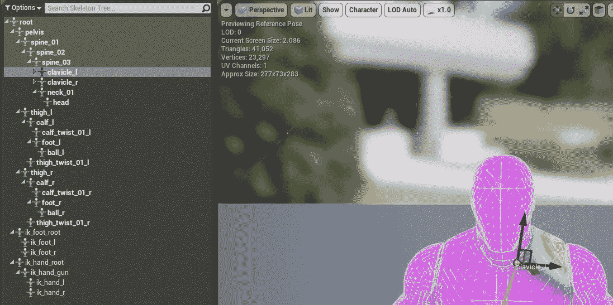

图 10.15：clavicle_l 和 clavicle_r 骨是 spine_03 骨的子级

让我们继续操作人体模型骨骼网格中的一个骨骼，并看看这些变化如何影响其动画。

1.  在 Persona 编辑器中，*左键单击*骨骼层次结构中的`thigh_l`骨：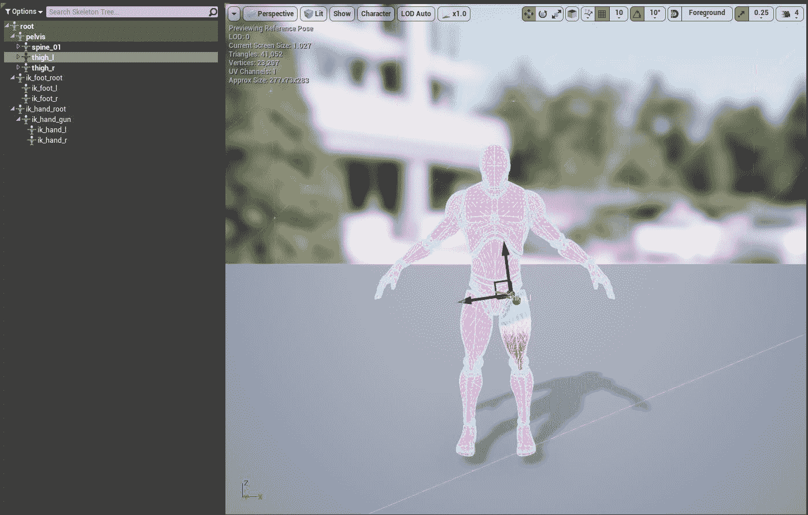

图 10.16：这里选择了 thigh_l 骨

选择`thigh_l`骨后，我们清楚地知道权重缩放将如何影响网格的其他部分。此外，由于骨骼的结构，对该骨骼的任何修改都不会影响网格的上半身：

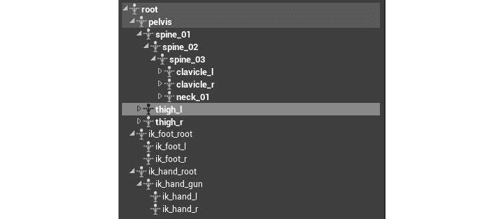

图 10.17：您可以看到，在骨骼层次结构中，大腿骨是骨盆骨的子级

1.  使用前几章的知识，更改`thigh_l`骨的本地位置、本地旋转和比例值，以偏移骨骼的变换。下面的图像显示了要使用的值示例。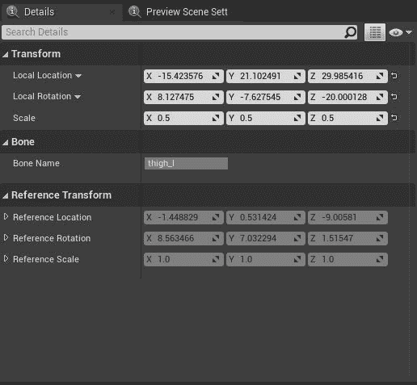

图 10.18：大腿 _l 值已更新

对骨骼变换进行更改后，您会看到人体模型的左腿完全改变，看起来很荒谬：

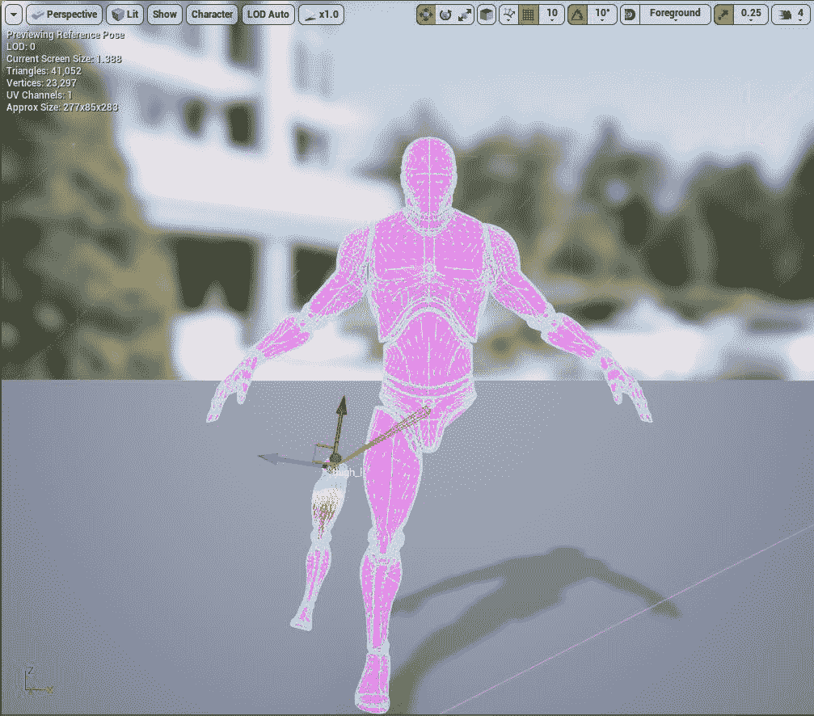

图 10.19：人体模型角色的左腿完全改变

1.  接下来，在`Details`面板中，转到标有`Preview Scene Settings`的选项卡。*左键单击*此选项卡，您将看到新选项，显示一些默认参数和一个`Animation`部分。

1.  使用`动画`部分预览动画以及它们如何受到对骨骼所做更改的影响。对于`预览控制器`参数，将其更改为`使用特定动画`选项。通过这样做，将出现一个名为`动画`的新选项。`动画`参数允许我们选择与角色骨骼关联的动画来预览。

1.  接下来，*左键单击*下拉菜单，选择`ThirdPersonWalk`动画。

1.  最后，现在你可以看到模特角色正在播放行走动画，但他们的左腿完全错位和错缩：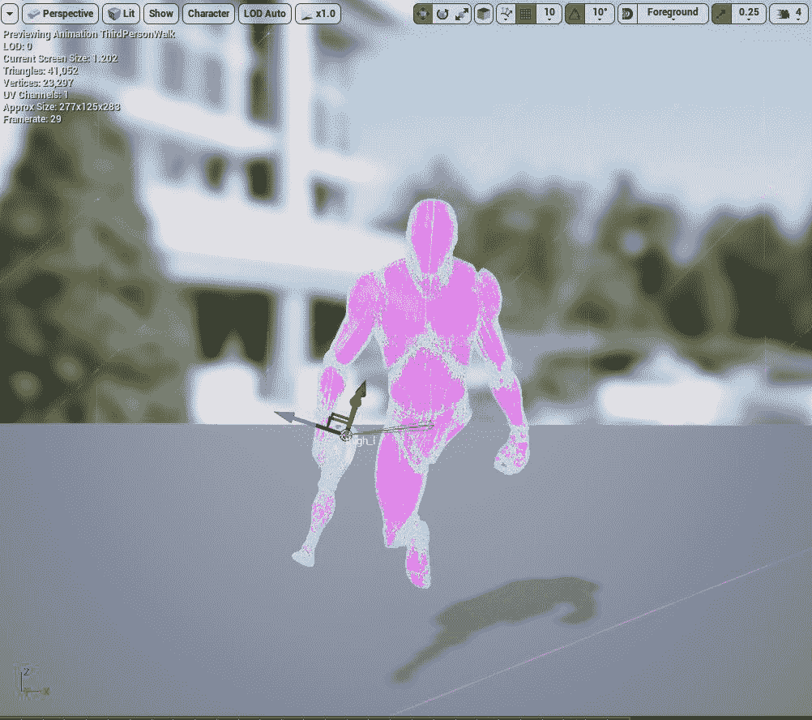

图 10.20：模特角色更新动画的预览

在继续之前，请确保将`thigh_l`骨骼恢复到其原始本地位置、本地旋转和比例；否则，向前进行的动画将不会看起来正确。

现在，您已经完成了我们第二项练习的最后部分，亲身体验了骨骼对角色和动画的影响。

现在，让我们继续进行第二项活动，操作模特角色的不同骨骼并观察应用不同动画的结果。

## 活动 10.02：骨骼操作和动画

对于这项活动，我们将实践我们对默认模特角色上的骨骼操作如何影响骨骼上的动画的知识。

以下步骤将帮助您完成此活动：

1.  选择将影响整个骨骼的骨骼。

1.  更改此骨骼的比例，使角色的尺寸减半。使用这些值将`Scale`更改为（`X=0.500000，Y=0.500000，Z=0.500000`）。

1.  将奔跑动画应用于`预览场景设置`选项卡中的这个骨骼网格，并观察半尺寸角色的动画：

以下是预期输出：

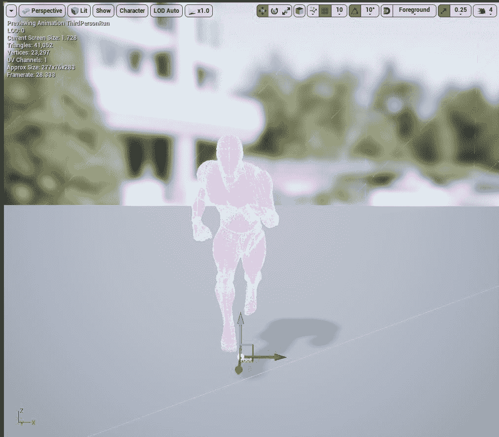

图 10.21：尺寸减半的角色执行奔跑动画

注意

此活动的解决方案可在以下网址找到：[`packt.live/338jEBx`](https://packt.live/338jEBx)。

完成此活动后，您现在已经实际了解了骨骼和骨骼网格的骨骼操作如何影响动画的应用。您还亲身见证了对骨骼的权重缩放对骨骼的影响。

# 虚幻引擎 4 中的动画

让我们分解动画在虚幻引擎内部的主要方面。关于本节中的主题的更深入信息可以在 Epic Games 的文档中直接找到：[`docs.unrealengine.com/en-US/Engine/Animation`](https://docs.unrealengine.com/en-US/Engine/Animation)。

## 骨骼

骨骼是虚幻引擎对外部 3D 软件中制作的角色骨骼的表示；我们在*活动 10.02*，*骨骼操作和动画*中看到了这一点。关于骨骼，我们已经讨论过的内容并不多，但主要的要点是一旦骨骼在引擎中，我们可以查看骨骼层次结构，操作每个单独的骨骼，并添加称为插座的对象。插座允许我们将对象附加到角色的骨骼上，并且我们可以使用这些插座来附加对象，如网格，并且在不破坏骨骼变换的情况下操纵插座的变换。在第一人称射击游戏中，通常会制作武器插座并将其附加到适当的手部。

## 骨骼网格

骨骼网格是一种特定类型的网格，它结合了 3D 角色模型和构成其骨架的骨骼层次结构。静态网格和骨骼网格的主要区别在于，骨骼网格用于使用动画的对象，而静态网格由于缺乏骨架而无法使用动画。我们将在下一章更深入地研究我们的主角骨骼网格，但我们将在本章后面的*Activity 10.03*中导入我们的主角骨骼网格，*导入更多自定义动画以预览角色奔跑*。

## 动画序列

最后，动画序列是一种可以在特定骨骼网格上播放的单独动画；它适用于的网格是在将动画导入到引擎时选择的骨架确定的。我们将在*Activity 10.03*中导入我们自己的角色骨骼网格和一个单独的动画资产，*导入更多自定义动画以预览角色奔跑*。

我们的动画序列中包含一个时间轴，允许我们逐帧预览动画，并附加了其他控件以暂停、循环、倒带等：

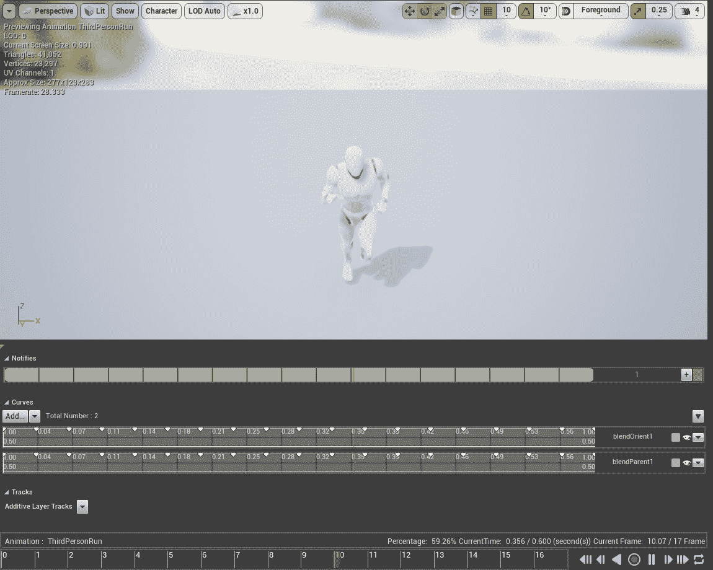

图 10.22：动画序列时间轴和预览窗口

在接下来的练习中，您将导入一个自定义角色和一个动画。自定义角色将包括一个骨骼网格和一个骨架，动画将被导入为动画序列。

## 练习 10.03：导入和设置角色和动画

对于我们的最后一个练习，我们将导入我们自定义的角色和一个我们将用于`SuperSideScroller`游戏主角的动画，以及创建必要的角色蓝图和动画蓝图。

注意

本章附带了一个名为`Assets`的文件夹中的一组文件，我们将导入这些文件到引擎中。这些资产来自 Mixamo：[`www.mixamo.com/`](https://www.mixamo.com/)；请随意创建一个账户并查看那里提供的免费 3D 角色和动画内容。

`Assets`内容可以在我们的 GitHub 上找到：[`packt.live/2IcXIOo`](https://packt.live/2IcXIOo)。

以下步骤将帮助您完成练习：

1.  前往虚幻编辑器。

1.  在“内容浏览器”中，创建一个名为`MainCharacter`的新文件夹。在这个文件夹中，创建两个名为`Animation`和`Mesh`的新文件夹。我们的“内容浏览器”选项卡现在应该看起来像下面的图片：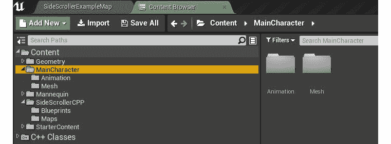

图 10.23：在内容浏览器中的 MainCharacter 目录中添加的文件夹

1.  接下来，导入我们的角色模型。在我们创建的`Mesh`文件夹内，*右键单击*并选择“导入”选项，这将打开文件资源管理器菜单。导航到您保存了本章附带的`Assets`文件夹的目录，并找到`Character Mesh`文件夹内的`MainCharacter.fbx`资产，例如`\Assets\Character Mesh\MainCharacter.fbx`，然后打开该文件。

1.  在选择此资产时，将出现 FBX 导入选项窗口。确保在各自的复选框中将“骨骼网格”和“导入网格”的选项设置为“检查”，并将其他选项保持为默认设置。

1.  最后，我们可以选择“导入”选项，这样我们的 FBX 资产将被导入到引擎中。这将包括在 FBX 中创建的必要材质；一个物理资产，它将自动为我们创建并分配给“骨骼网格”；和“骨架资产”。

注意

忽略导入`FBX`文件时可能出现的任何警告；它们不重要，不会影响我们未来的项目。

现在我们有了角色，让我们导入一个动画。

1.  在`MainCharacter`文件夹目录中的`Animation`文件夹内，再次*右键单击*并选择“导入”选项。

1.  导航到保存了本章配套`Assets`文件夹的目录，并在`Animations/Idle`文件夹中找到`Idle.fbx`资产，例如`\Assets\Animations\Idle\Idle.fbx`，然后打开该文件。

选择此资产时，将会出现一个几乎相同的窗口，就像我们导入角色骨骼网格时一样。由于这个资产只是一个动画，而不是骨骼网格/骨架，我们没有之前的选项，但有一个关键的参数需要正确设置：`骨架`。

在我们的`FBX`导入选项的`网格`类别下的`骨架`参数告诉动画应用于哪个骨架。如果不设置这个参数，我们无法导入我们的动画，将动画应用于错误的骨架可能会产生灾难性的结果，或者导致动画根本无法导入。幸运的是，我们的项目很简单，我们已经导入了角色骨骼网格和骨架。

1.  选择`MainCharacter_Skeleton`并选择底部的`导入`选项；将所有其他参数保持为默认设置。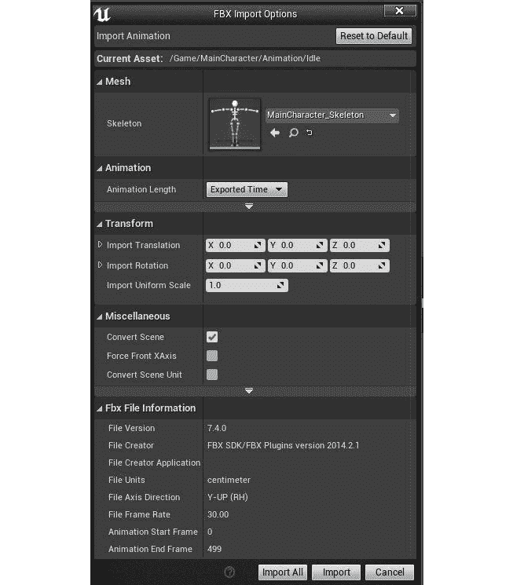

图 10.24：导入 Idle.fbx 动画时的设置

现在我们知道要导入自定义角色网格和动画。了解这两种类型资产的导入过程至关重要，在下一个活动中，您将被挑战导入剩余的动画。让我们继续通过为`SuperSideScroller`游戏的主角色创建角色蓝图和动画蓝图来进行这个练习。

现在，虽然侧向滚动模板项目确实包括了我们角色的蓝图和其他资产，比如动画蓝图，但为了组织和良好的开发实践，我们将要创建我们自己版本的这些资产。

1.  在`内容浏览器`的`MainCharacter`目录下创建一个名为`蓝图`的新文件夹。在该目录中，基于`所有类`下的`SideScrollerCharacter`类创建一个新的蓝图。将这个新蓝图命名为`BP_SuperSideScroller_MainCharacter`：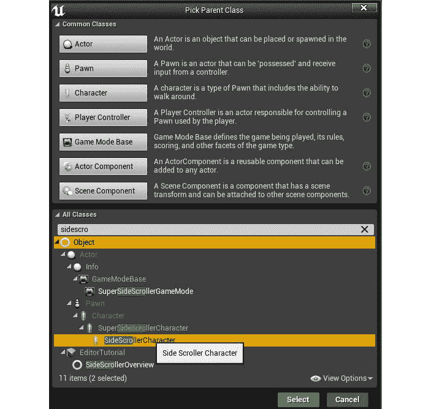

图 10.25：要用作角色蓝图父类的 SideScrollerCharacter 类

1.  在我们的`蓝图`目录中，在`内容浏览器`的空白区域*右键单击*，悬停在`动画`选项上，然后选择`动画蓝图`：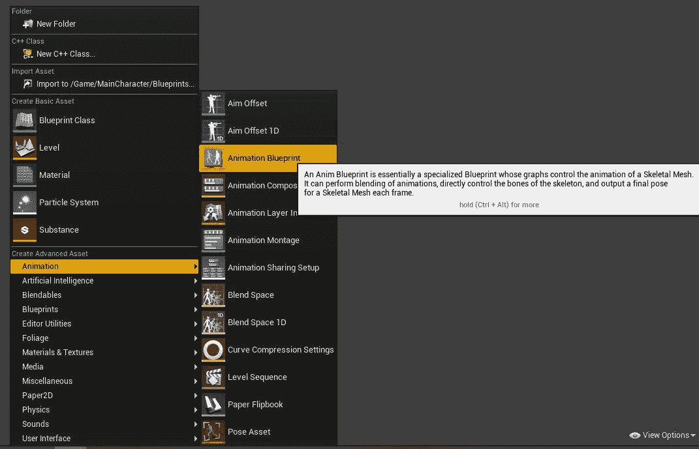

图 10.26：动画类别下的动画蓝图选项

1.  选择此选项后，将会出现一个新窗口。这个新窗口要求我们为我们的动画蓝图应用一个父类和一个骨架。在我们的情况下，使用`MainCharacter_Skeleton`，选择确定，并将动画蓝图资产命名为`AnimBP_SuperSideScroller_MainCharacter`：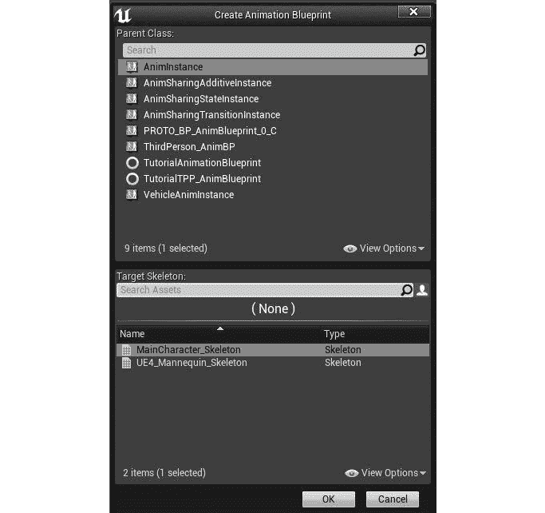

图 10.27：创建动画蓝图时需要的设置

1.  当我们打开我们的角色蓝图`BP_SuperSideScroller_MainCharacter`并选择`网格`组件时，我们会发现一些可以更改的参数：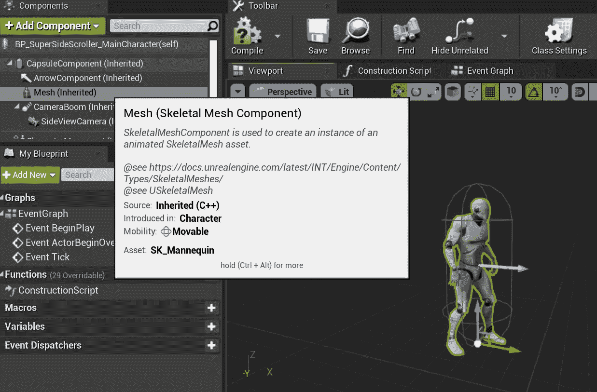

图 10.28：使用人体模型骨骼网格的 SuperSideScroller 角色蓝图

1.  在`网格`类别下，我们有更新`骨骼网格`的选项。找到我们的`MainCharacter`骨骼网格并将其分配给这个参数：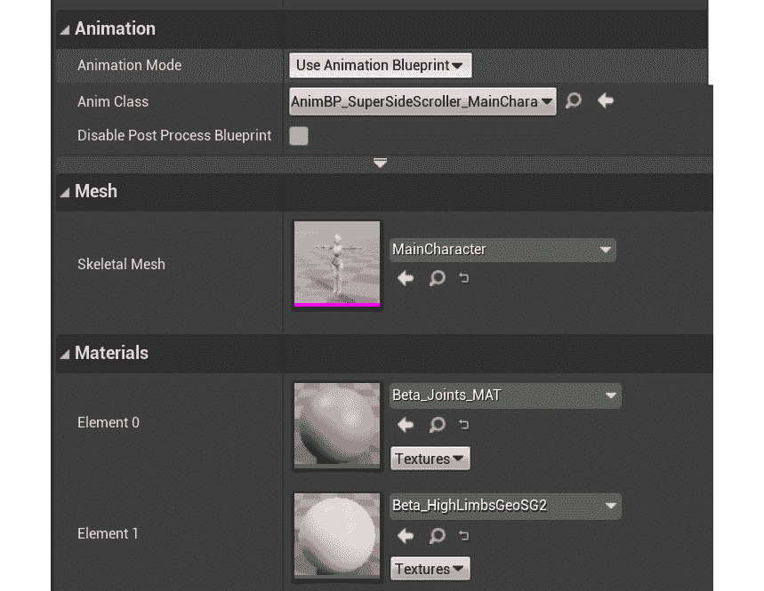

图 10.29：我们的网格组件需要的设置，以正确使用我们的新骨骼网格和动画蓝图

在我们的角色蓝图中，选择`Mesh`组件后，我们可以在`Mesh`类别的正上方找到`Animation`类别。幸运的是，默认情况下，`Animation Mode`参数已经设置为`Use Animation Blueprint`，这是我们需要的设置。

1.  现在将`Anim`类参数分配给我们的新动画蓝图，`AnimBP_SuperSideScroller_MainCharacter`。最后，返回到默认的`SideScrollerExampleMap`关卡，并用我们的新角色蓝图替换默认角色。

1.  接下来，请确保我们在`Content Browser`中选择了`BP_SuperSideScroller_MainCharacter`，然后*右键单击*关卡中的默认角色，并选择用我们的新角色替换它：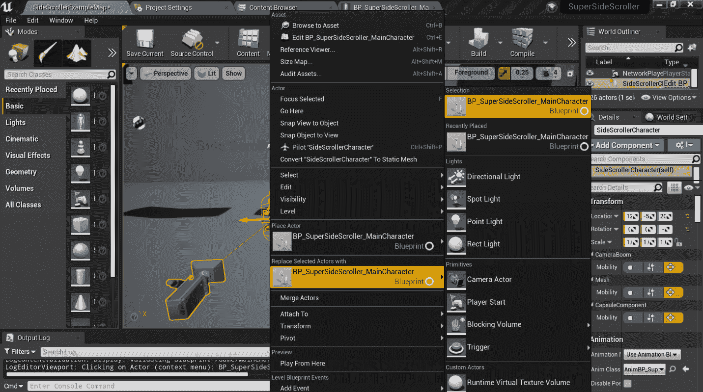

图 10.30：在内容浏览器中选择角色蓝图后，我们可以简单地右键单击关卡中的默认角色，并用新角色替换它

1.  在关卡中放置了我们的新角色后，我们现在可以在编辑器中进行游戏并在关卡中移动。结果应该看起来像下面的图片；我们的角色处于默认 T 形姿势并在关卡环境中移动：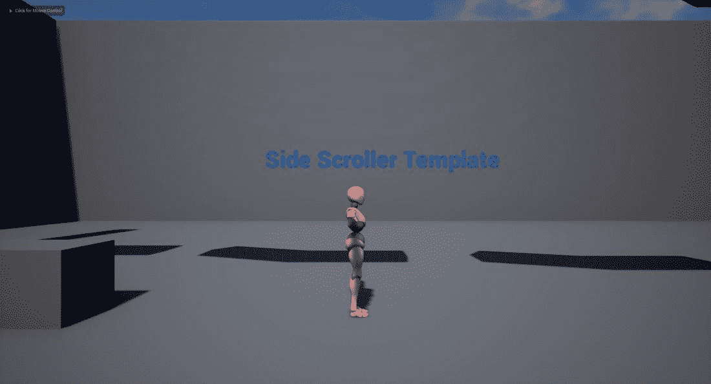

图 10.31：您现在有自定义角色在关卡中奔跑

完成我们的最后一个练习后，您现在完全了解了如何导入自定义骨骼网格和动画。此外，您还学会了如何从头开始创建角色蓝图和动画蓝图，以及如何使用这些资产来创建`SuperSideScroller`角色的基础。

让我们继续进行本章的最后一个活动，在这个活动中，您将被挑战导入角色的剩余动画，并在 Persona 编辑器中预览奔跑动画。

## 活动 10.03：导入更多自定义动画以预览角色奔跑

这个活动旨在导入剩余的动画，比如玩家角色的奔跑动画，并在角色骨架上预览奔跑动画，以确保它看起来正确。

在活动结束时，所有玩家角色动画将被导入项目中，您将准备好在下一章中使用这些动画来赋予玩家角色生命。

以下步骤将帮助您完成该活动：

1.  作为提醒，我们需要导入的所有动画资产都存在于`\Assets\Animations`目录中，无论您将原始`zip`文件夹保存在何处。导入`MainCharacter/Animation`文件夹中的所有剩余动画。导入剩余的动画资产将与*练习 10.03*中的*导入和设置角色和动画*相同，当您导入`Idle`动画时。

1.  导航到`MainCharacter`骨架，并应用您在上一步中导入的`Running`动画。

1.  最后，应用`Running`动画后，在 Persona 编辑器中预览角色动画。

以下是预期输出：

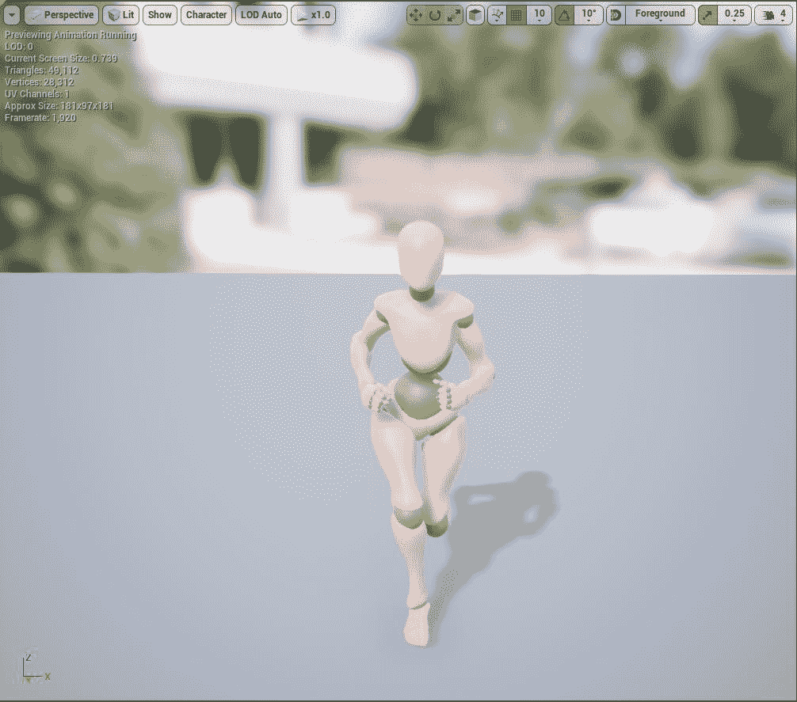

图 10.32：带有额外自定义导入资产的角色的预期输出

注意

此活动的解决方案可在以下网址找到：[`packt.live/338jEBx`](https://packt.live/338jEBx)。

完成这个最后的活动后，您现在已经第一手体验了将自定义骨骼和动画资产导入虚幻引擎 4 的过程。无论您导入的资产类型如何，导入过程在游戏行业中很常见，您对此应该感到舒适。

# 总结

有了玩家角色的骨骼、骨骼网格和动画导入到引擎中，我们可以继续进行下一章，在那里您将准备角色移动和 UpdateAnimation 蓝图，以便角色在关卡中移动时能够进行动画。

通过本章的练习和活动，您了解了骨骼和骨骼如何用于给角色添加动画和操纵。通过第一手经验将动画导入并应用到虚幻引擎 4 中，您现在对动画流程有了深刻的理解，从角色概念到最终导入项目的资产。

此外，您还学习了我们将在下一章中使用的主题，比如用于角色移动动画混合的混合空间。有了创建的`SuperSideScroller`项目模板和玩家角色准备就绪，在下一章中，让我们开始使用动画蓝图为角色添加动画。
