# 11.混合空间 1D、键绑定和状态机

概述

本章首先创建所需的混合空间资产，以允许从空闲到行走，最终到奔跑的移动动画混合，根据玩家角色的速度。然后，我们将实现新的键映射，并在 C++中使用这些映射来为玩家角色编写游戏功能，如冲刺。最后，我们将在角色动画蓝图中创建一个新的动画状态机，以便玩家动画可以在移动和跳跃之间平滑过渡。

到本章结束时，当`SuperSideScroller`玩家角色在环境中移动时，将正确地进行动画处理，并以最适合游戏的方式移动。这意味着玩家将支持空闲、行走和冲刺动画，同时还支持跳跃所需的动画。

# 介绍

在上一章中，我们对动画和`SuperSideScroller`项目的游戏设计开发进行了高层次的审视。您只是在项目开发的最初阶段。您还准备了玩家角色的动画蓝图、角色蓝图，并导入了所有必需的骨骼和动画资产。

此时，角色可以在关卡中移动，但却被困在 T 形姿势中，根本没有动画。通过为玩家角色创建一个新的混合空间，可以解决这个问题，这将在本章的第一个练习中完成。完成混合空间后，您将在角色动画蓝图中实现这一点，以便角色在移动时进行动画处理。

在本章中，您将使用许多新的函数、资产类型和变量，以实现玩家角色的期望移动。其中一些包括“动画蓝图”中的“尝试获取所有者”函数、“1D 混合空间资产”类型和项目配置文件中的“输入绑定”。

让我们首先通过学习混合空间，然后创建您需要的混合空间资产，以便在移动时使玩家角色进行动画处理。

# 混合空间

如其名称所示，混合空间允许您根据一个或多个条件在多个动画之间进行混合。混合空间在不同类型的视频游戏中使用，但通常在玩家可以看到整个角色的游戏中使用。在虚幻引擎 4 提供的第一人称模板项目中，通常不使用混合空间，因为玩家只能看到角色的手臂，如下所示：

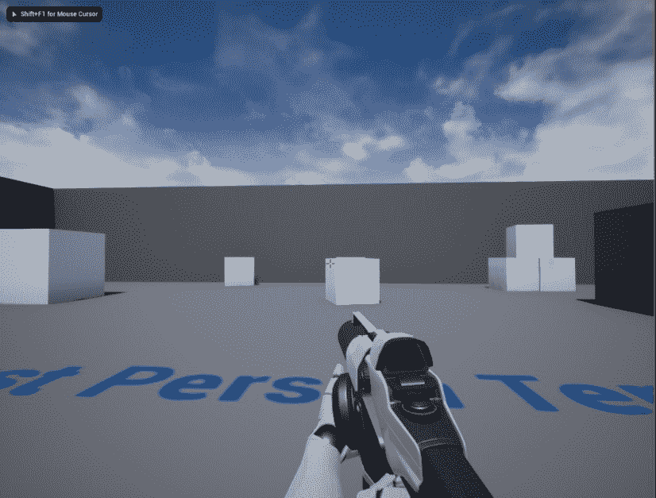

图 11.1：虚幻引擎 4 中第一人称项目模板中默认角色的第一人称视角。

在需要平滑混合角色基于移动的动画的第三人称游戏中，混合空间更常见。一个很好的例子是虚幻引擎 4 提供的第三人称模板项目，如下所示：

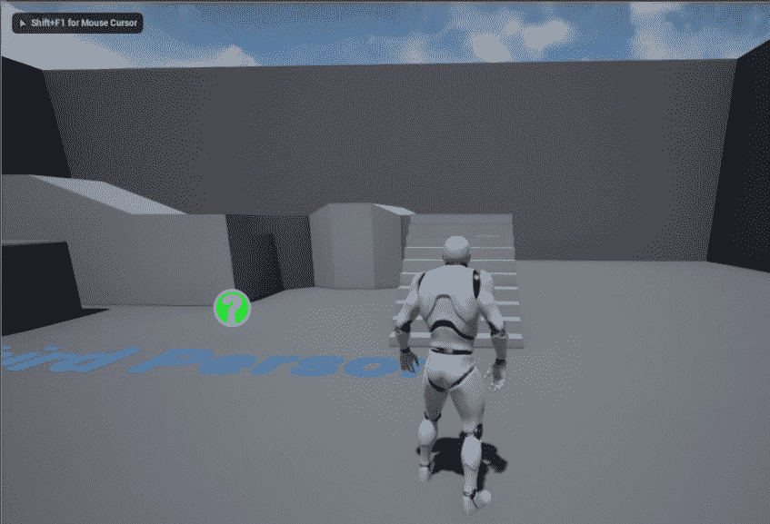

图 11.2：虚幻引擎 4 中第一人称项目模板中默认角色的第三人称视角

混合空间允许玩家角色根据变量或一组变量在动画之间进行混合。例如，在《最后生还者》中的乔尔，他的移动动画是基于他的移动速度的，这个速度是由玩家通过控制器摇杆（或摇杆）提供的。随着速度的增加，他的动画从行走更新到奔跑，然后到冲刺。这就是我们在本章中要实现的目标。

让我们看看 Unreal Engine 提供的混合空间资产，在创建`侧向滚动`项目模板时，通过打开`/Mannequin/Animations/ThirdPerson_IdleRun_2D`。这是为`侧向滚动`人体模型骨骼网格创建的 1D 混合空间资产，以便玩家角色可以根据角色的速度在空闲、行走和奔跑动画之间平滑过渡。

如果你在`Persona`中检查，在左侧的`资产详情`面板中，你会看到`轴设置`类别，其中有`水平轴`参数，我们可以在我们的动画蓝图中引用的变量。请参考下面的图像查看`Persona`中的`轴设置`。

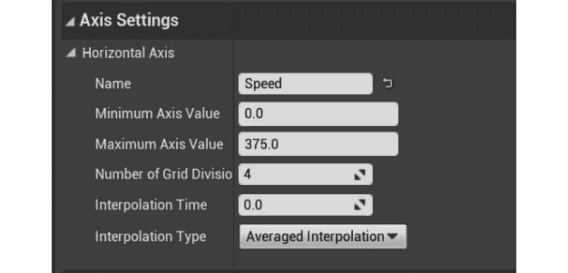

图 11.3：这里显示了 1D 混合空间的轴设置

在预览窗口下方，我们还会看到一个小图表，沿着从左到右的线有点；其中一个点将被突出显示为`绿色`，而其他点为`白色`。我们可以*左键单击*并沿着水平轴拖动这个`绿色`点，以预览基于其值的混合动画。在速度为`0`时，我们的角色处于`空闲`状态，当我们沿着轴移动我们的预览时，动画将开始混合行走，然后是`奔跑`。请参考下面的图像查看单轴图表。

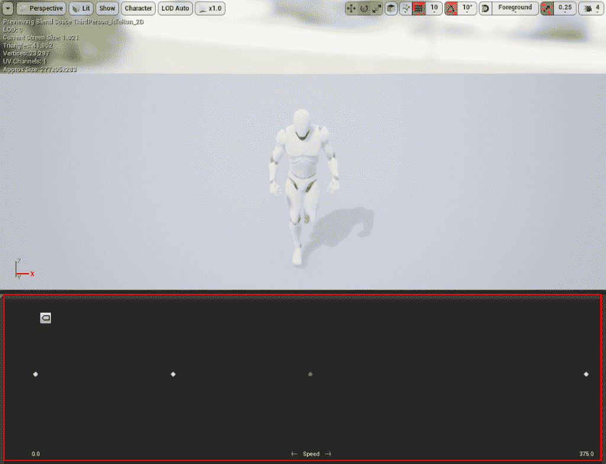

图 11.4：这里突出显示了 1D 混合空间的关键帧时间轴

在下一节中，我们将研究 1D 混合空间与普通混合空间的区别。

## 1D 混合空间与普通混合空间

在继续使用 Unreal Engine 4 中的 1D 混合空间之前，让我们花点时间区分混合空间和 1D 混合空间之间的主要区别。

+   Unreal 中的混合空间资产由两个变量控制，由混合空间图的*X*和*Y*轴表示。

+   另一方面，1D 混合空间只支持一个轴。

试着把这个想象成一个 2D 图表。你知道每个轴都有自己的方向，你可以更好地想象出为什么以及何时需要使用这个混合空间，而不是只支持单一轴的 1D 混合空间。

比如，假设你想让玩家角色在左右移动的同时也支持前后移动。如果你要在图表上映射这种移动，它会看起来像下面的图：

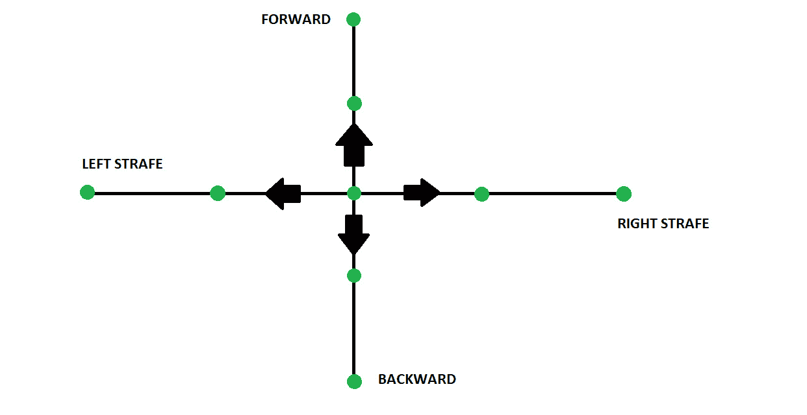

图 11.5：这是一个简单图表上混合空间运动的样子

现在，想象一下玩家角色的移动，记住游戏是一个`侧向滚动`。角色不会支持左右平移或前后移动。玩家角色只需要在一个方向上进行动画，因为`侧向滚动`角色默认会朝着移动方向旋转。只需要支持一个方向是你使用 1D 混合空间而不是普通混合空间的原因。

我们需要为我们的主角设置这种类型的混合空间资产，并将其用于相同的目的，即基于移动的动画混合。在下一个练习中，让我们一起使用我们的自定义动画资产创建混合空间资产。

## 练习 11.01：创建角色移动 1D 混合空间

为了让玩家角色在移动时进行动画，你需要首先创建一个如前所述的混合空间。

在这个练习中，你将创建混合空间资产，添加空闲动画，并更新`CharacterMovement`组件，以便分配与混合空间相对应的适当行走速度值。

以下步骤将帮助你完成练习：

1.  在`Content Browser`中导航到`/MainCharacter/Animation`文件夹，其中包含您在上一章中导入的所有新动画。

1.  现在，在`Content Browser`的主区域中*右键单击*，从下拉菜单中悬停在`Animation`选项上，然后从其附加的下拉菜单中*左键单击*选择`Blend Space 1D`。

1.  确保选择`MainCharacter_Skeleton`，而不是`UE4_Mannequin_Skeleton`，作为混合空间的骨骼。

注意

如果应用了不正确的骨骼，那么在为需要骨骼的资产（如混合空间或动画蓝图）选择骨骼时，混合空间对于玩家角色和其自定义骨骼网格将无法正常工作。在这里，您正在告诉这个资产它与哪个骨骼兼容。通过这样做，在混合空间的情况下，您可以使用为该骨骼制作的动画，并确保一切与其他一切兼容。

1.  将此混合空间资产命名为`SideScroller_IdleRun_1D`。

1.  接下来，打开`SideScroller_IdleRun_1D`混合空间资产。您可以在预览窗口下方看到单轴图表：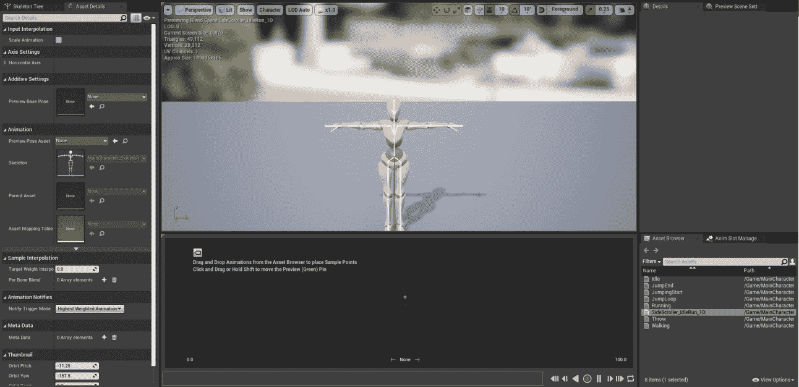

图 11.6：Unreal Engine 4 中用于创建混合空间的编辑工具

在编辑器的左侧，您有包含`Axis Settings`类别的`Asset Details`面板。在这里，您将标记轴并提供最小和最大浮点值，这些值稍后将在玩家角色的`Animation Blueprint`中对您有用。请参考下面的图表，查看为`Horizontal Axis`设置的默认值。

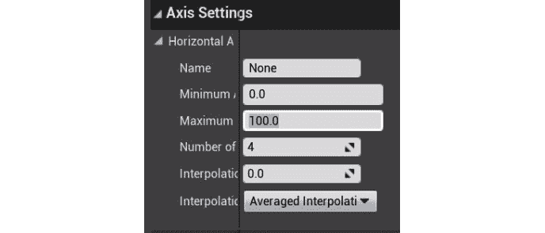

图 11.7：影响混合空间轴的轴设置

1.  现在，将`Horizontal Axis`重命名为`Speed`：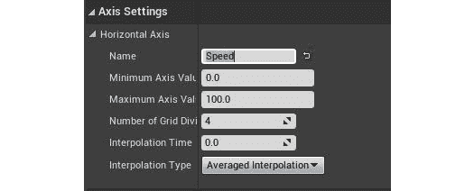

图 11.8：水平轴现在命名为 Speed

1.  下一步是建立`Minimum Axis Value`和`Maximum Axis Value`。您希望最小值默认为`0.0f`，因为玩家角色在完全不移动时将处于`Idle`状态。

但`Maximum Axis Value`呢？这个有点棘手，因为您需要记住以下几点：

+   您将支持角色的冲刺行为，允许玩家在按住*左 Shift*键盘按钮时移动得更快。释放时，玩家将返回默认行走速度。

+   行走速度要匹配`CharacterMovementComponent`的角色`Max Walk Speed`参数。

在设置`Maximum Axis Value`之前，您需要将角色的`Max Walk Speed`设置为适合`SuperSideScroller`游戏的值。

1.  为此，导航到`/Game/MainCharacter/Blueprints/`并打开`BP_SuperSideScroller_MainCharacter`蓝图：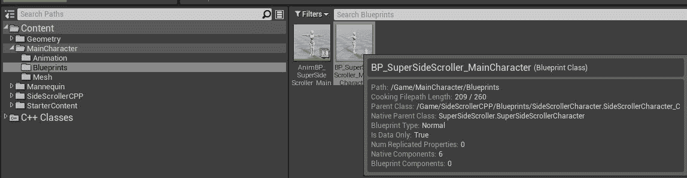

图 11.9：SuperSideScroller 主角蓝图的目录

1.  选择`Character Movement`组件，在`Details`面板中，在`Character Movement: Walking`类别下，找到`Max Walk Speed`参数，并将该值设置为`300.0f`。

将`Max Walk Speed`参数设置后，返回到`SideScroller_IdleRun_1D`混合空间，并设置`Maximum Axis Value`参数。如果行走速度为`300.0f`，最大值应该是多少？请记住，您将支持玩家角色的冲刺，因此这个最大值需要大于行走速度。

1.  将`Maximum Axis Value`参数更新为`500.0f`。

1.  最后，将`Number of Grid Divisions`参数设置为`5`。这样做的原因是，在处理分区时，每个网格点之间的`100`单位间距使得更容易处理，因为`Maximum Axis Value`是`500.0f`。在应用动画沿网格时，这对于网格点捕捉非常有用。

1.  将剩余的属性设置为默认值：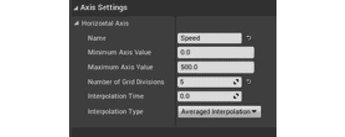

图 11.10：混合空间的最终轴设置

通过这些设置，您告诉混合空间使用`0.0f`到`500.0f`之间的传入浮点值来在下一步和活动中混合动画。通过将网格分成`5`个部分，您可以轻松地在轴图表上的正确浮点值处添加所需的动画。

让我们继续创建混合空间，通过将第一个动画添加到轴图表中，即`Idle`动画。

1.  在网格的右侧，有`Asset Browser`选项卡。请注意，资产列表包括您在*第十二章* *动画混合和蒙太奇*中导入的玩家角色的所有动画。这是因为您在创建混合空间时选择了`MainCharacter_Skeleton`资产。

1.  接下来，*左键单击*并将`Idle`动画拖动到我们的网格位置`0.0`：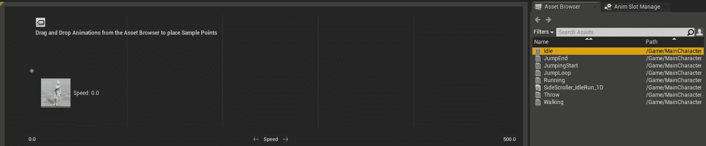

图 11.11：将 Idle 动画拖动到网格位置 0.0

注意，将此动画拖动到网格时，它将捕捉到网格点。一旦动画添加到混合空间中，玩家角色就会从其默认 T 形状改变，并开始播放`Idle`动画：

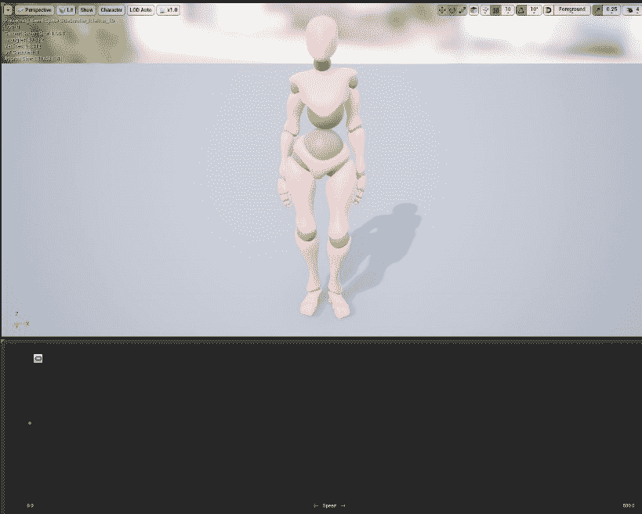

图 11.12：将 Idle 动画添加到 1D 混合空间，玩家角色开始动画

完成这个练习后，您现在了解了如何创建 1D 混合空间，更重要的是，您知道了 1D 混合空间和普通混合空间之间的区别。此外，您知道了在玩家角色移动组件和混合空间之间对齐值的重要性，以及为什么需要确保行走速度与混合空间中的值适当地相关。

现在让我们继续进行本章的第一个活动，在这个活动中，您将像添加`Idle`动画一样，将剩余的`Walking`和`Running`动画应用到混合空间中。

## 活动 11.01：将 Walking 和 Running 动画添加到混合空间

到目前为止，1D 运动混合空间进展顺利，但您缺少行走和奔跑动画。在本活动中，您将通过将这些动画添加到适合主角的水平轴值的混合空间来完成混合空间。

使用从*练习 11.01* *创建 CharacterMovement 1D 混合空间*中获得的知识，执行以下步骤来完成角色移动混合空间：

1.  继续进行*练习 11.01* *创建 CharacterMovement 1D 混合空间*，返回`Asset Browser`。 

1.  现在，将`Walking`动画添加到水平网格位置`300.0f`。

1.  最后，将`Running`动画添加到水平网格位置`500.0f`。

注意

请记住，您可以*左键单击*并沿着网格轴拖动绿色预览网格点，以查看动画根据轴值如何混合在一起，因此请注意角色动画预览窗口，以确保它看起来正确。

预期输出如下：

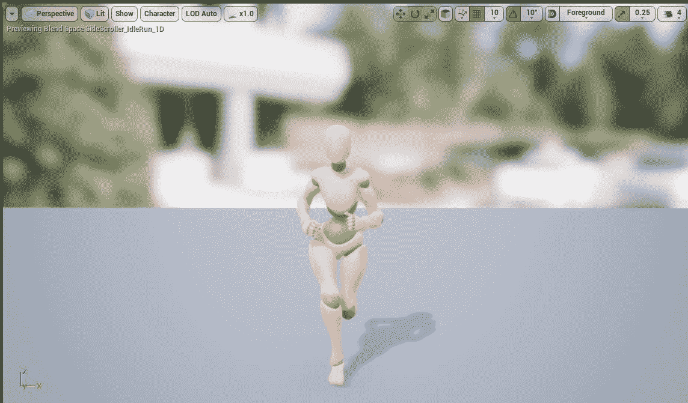

图 11.13：混合空间中的 Running 动画

当这个活动完成时，你将拥有一个功能性的混合空间，根据代表玩家角色速度的水平轴的值，将角色的移动动画从`Idle`混合到`Walking`再到`Running`。

注意

这个活动的解决方案可以在以下网址找到：[`packt.live/338jEBx`](https://packt.live/338jEBx)。

# 主角动画蓝图

将动画添加到混合空间后，你应该能够四处走动并看到这些动画在起作用，对吗？嗯，不是的。如果选择在编辑器中播放，你会注意到主角仍然以 T 形姿势移动。原因是因为你还没有告诉动画蓝图使用我们的混合空间资产，这将在本章后面进行。

## 动画蓝图

在跳入上一章创建的动画蓝图之前，让我们简要讨论一下这种类型的蓝图是什么，以及它的主要功能是什么。动画蓝图是一种蓝图，允许你控制骨骼和骨骼网格的动画，此处指的是上一章导入的玩家角色骨骼和网格。

动画蓝图分为两个主要图表：

+   事件图

+   动画图

事件图的工作方式与普通蓝图相同，你可以使用事件、函数和变量来编写游戏逻辑。另一方面，动画图是动画蓝图独有的，这是你在其中使用逻辑来确定骨骼和骨骼网格在任何给定帧的最终姿势。在这里，你可以使用状态机、动画插槽、混合空间和其他与动画相关的节点，然后输出给角色的最终动画。

看一下以下示例（你可以跟着做）。

在`MainCharacter/Blueprints`目录中打开`AnimBP_SuperSideScroller_MainCharacter`动画蓝图。

默认情况下，`AnimGraph`应该打开，你可以在其中看到角色预览、我们的`Asset Browser`选项卡和主图表。就是在这个`AnimGraph`中，你将实现刚刚创建的混合空间，以便在关卡中移动时玩家角色能够正确地进行动画。

让我们开始下一个练习，我们将在这个练习中做这个，并学习更多关于动画蓝图的知识。

## 练习 11.02：将混合空间添加到角色动画蓝图

在这个练习中，你将把混合空间添加到动画蓝图，并准备必要的变量来控制这个混合空间，根据玩家角色的移动速度。让我们从将混合空间添加到`AnimGraph`开始。

以下步骤将帮助你完成这个练习：

1.  通过在右侧找到`Asset Browser`，*左键单击*并将`SideScroller_IdleRun_1D`混合空间资产拖入`AnimGraph`中，将混合空间添加到`AnimGraph`。

请注意，这个混合空间节点的变量输入标签为`Speed`，就像混合空间内部的水平轴一样。请参考*图 11.14*，看看`Asset Browser`中的混合空间。

注意

如果你给`Horizontal Axis`取了不同的名字，新名字会显示为混合空间的输入参数。

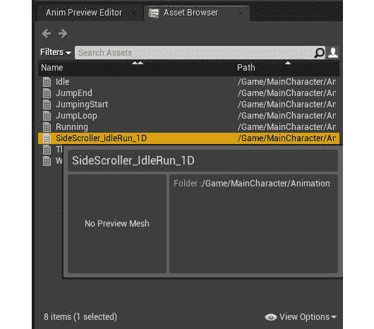

图 11.14：Asset Browser 让你访问与 MainCharacter_Skeleton 相关的所有动画资产

1.  接下来，将混合空间节点的`Output Pose`资产连接到`Output Pose`节点的`Result`引脚。现在，在预览中的动画姿势显示为角色的`Idle`动画姿势：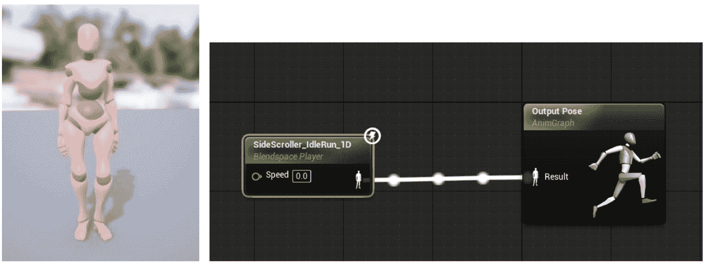

图 11.15：你现在对混合空间有了有限的控制，并可以手动输入值到 Speed 参数中来更新角色的移动动画

1.  如果你使用`PIE`，(`Idle`动画而不是保持 T-Pose: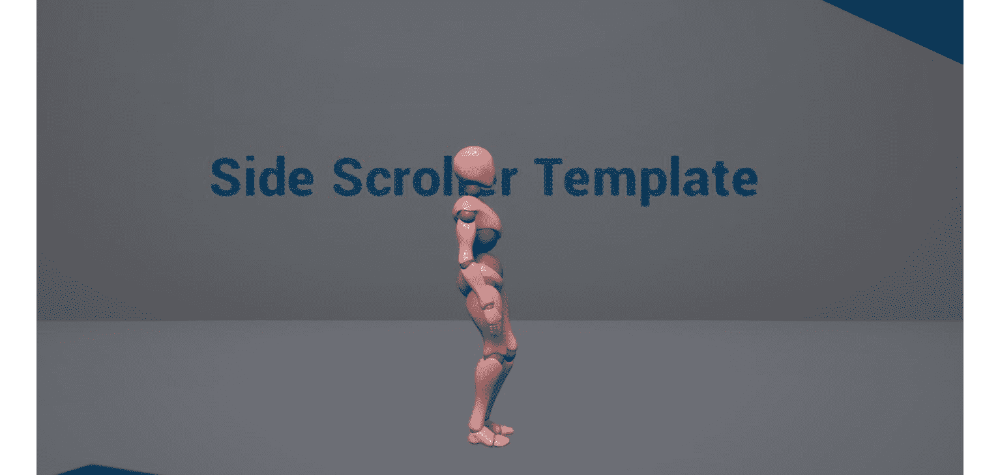

图 11.16：玩家角色现在在游戏中播放 Idle 动画

现在，你可以使用`Speed`输入变量来控制我们的混合空间。有了使用混合空间的能力，你需要一种方法来存储角色的移动速度，并将该值传递给混合空间的`Speed`输入参数。这就是你需要做的：

1.  导航到我们的动画蓝图的`事件图`。默认情况下，会有`事件蓝图更新动画`事件和一个纯`Try Get Pawn Owner`函数。请参考*图 11.17*，查看`事件图`的默认设置。该事件在每帧动画更新时更新，并在尝试获取更多信息之前返回`SuperSideScroller`玩家角色蓝图类。

图 11.17：动画蓝图包括此事件和函数对，默认情况下在你的事件图中使用

注意

在虚幻引擎 4 中，`Pure`函数和`Impure`函数的主要区别在于，`Pure`函数意味着它包含的逻辑不会修改它所使用的类的变量或成员。在`Try Get Pawn Owner`的情况下，它只是返回动画蓝图的`Pawn`所有者的引用。`Impure`函数没有这个含义，并且可以自由修改任何它想要修改的变量或成员。

1.  从`Try Get Pawn Owner`函数获取`Return Value`，然后从出现的`上下文敏感`菜单中搜索转换为`SuperSideScrollerCharacter`：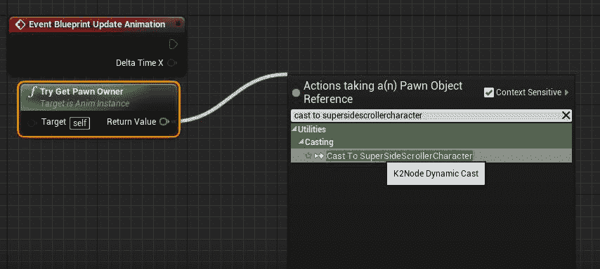

图 11.18：上下文敏感菜单可以找到相关的函数或变量，基于这些可以对所检查的对象采取行动

1.  将`事件蓝图更新动画`的执行输出引脚连接到转换的执行输入引脚：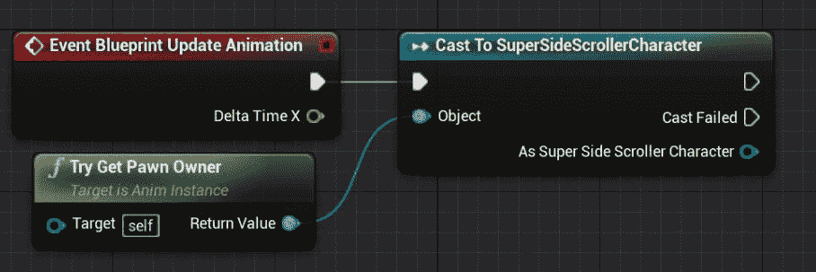

图 11.19：在事件图中，使用 Try Get Pawn Owner 函数将返回的 Pawn 对象转换为 SuperSideScrollerCharacter 类

你创建的角色蓝图继承自`SuperSideScrollerCharacter`类。由于这个动画蓝图的拥有者是你的`BP_SuperSideScroller_MainCharacter`角色蓝图，并且这个蓝图继承自`SuperSideScrollerCharacter`类，所以转换函数将成功执行。

1.  接下来，将转换后的返回值存储到自己的变量中；这样，我们在动画蓝图中需要再次使用它时就有一个引用。参考*图 11.20*，确保将这个新变量命名为`MainCharacter`。

注意

在上下文敏感的下拉菜单中有`提升为变量`的选项，它允许你将任何有效值类型存储到自己的变量中。

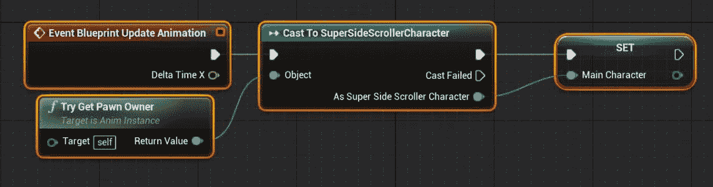

图 11.20：只要转换成功，你就会想要跟踪所拥有的角色

1.  现在，要跟踪角色的速度，使用`MainCharacter`变量中的`Get Velocity`函数。`Actor`类的每个对象都可以访问这个函数，它返回对象移动的大小和方向向量：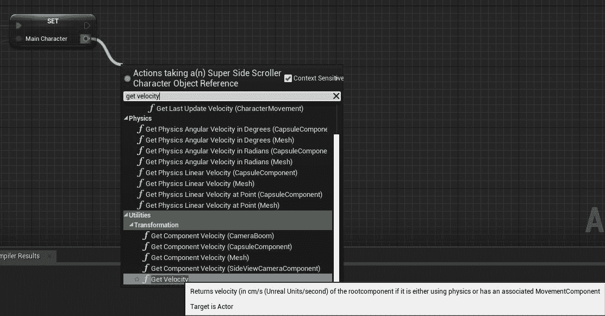

图 11.21：GetVelocity 函数可以在 Utilities/Transformation 下找到

1.  从“获取速度”中，您可以使用`VectorLength`函数来获取实际速度：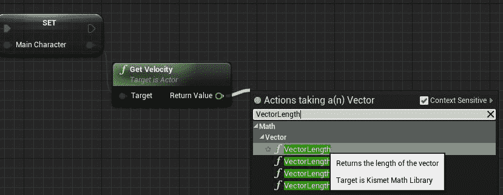

图 11.22：VectorLength 函数返回矢量的大小，但不返回方向

1.  从`VectorLength`函数的`Return Value`然后可以提升为自己的变量命名为`Speed`：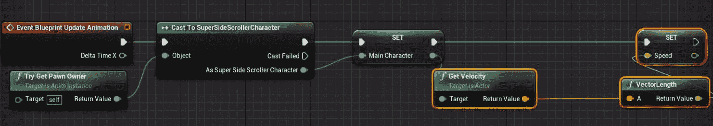

图 11.23：每个角色都有 Get Velocity 函数，返回角色移动的大小和方向

在这个练习中，您可以使用`GetVelocity`函数获得玩家角色的速度。从`GetVelocity`函数返回的矢量给出了矢量的长度以确定实际速度。通过将这个值存储在`Speed`变量中，您现在可以在动画蓝图的`AnimGraph`中引用这个值来更新您的混合空间，在下一个练习中将会这样做。

# 速度矢量

在进行下一步之前，让我们解释一下当您获取角色的速度并将该矢量的矢量长度提升为`Speed`变量时，您正在做什么。

什么是速度？速度是一个具有给定`GetVelocity`函数和返回速度矢量上的`VectorLength`函数的矢量；您正在获取我们角色的`Speed`变量的值。这就是为什么您将该值存储在变量中并将其用于控制混合空间的原因，如下图所示，这是矢量的一个示例。其中一个具有正（右）方向，大小为`100`，另一个具有负（左）方向，大小为`35`。


图 11.24：显示两个不同的矢量的图

## 练习 11.03：将混合空间添加到角色动画蓝图

现在您对“矢量”以及如何存储玩家角色的`Speed`变量有了更好的理解，您可以按照以下步骤将速度应用于本章前面创建的 1D 混合空间。

以下步骤将帮助您完成练习：

1.  导航到您的`AnimBP_SuperSideScroller_MainCharacter`动画蓝图中的`AnimGraph`。

1.  使用`Speed`变量通过*左键单击*并将其拖动到`AnimGraph`中实时更新混合空间，并将变量连接到`Blendspace Player`函数的输入：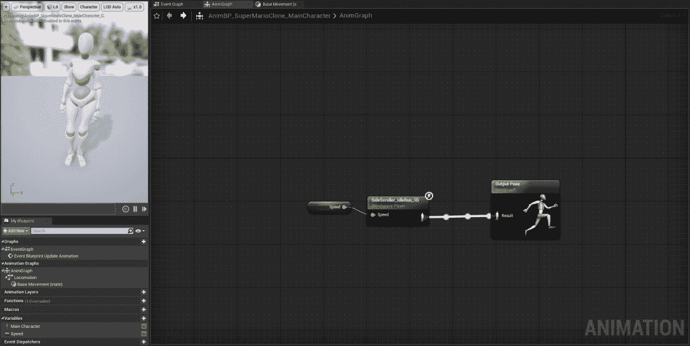

图 11.25：现在您可以在每帧更新动画时使用 Speed 变量来更新混合空间

1.  接下来，编译动画蓝图。

现在您可以根据玩家角色的速度更新混合空间。当您使用`PIE`时，您可以看到角色在移动时处于`Idle`和`Walking`动画中：

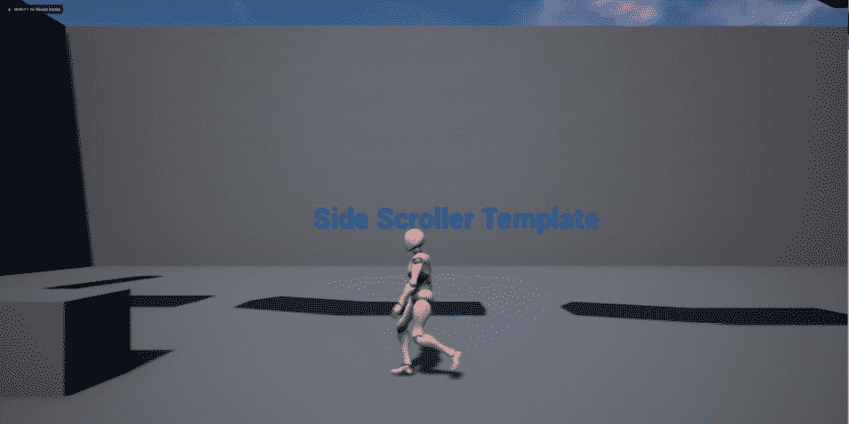

图 11.26：玩家角色最终能够在关卡中四处走动

最后，主角正在使用基于移动速度的移动动画。在下一个活动中，您将更新角色移动组件，以便可以从混合空间预览角色奔跑动画。

## 活动 11.02：在游戏中预览奔跑动画

通过更新动画蓝图并获取玩家角色的速度，您现在可以在游戏中预览`Idle`和`Walking`动画。

在这个活动中，您将更新玩家角色蓝图的`CharacterMovement`组件，以便您还可以在游戏中预览`Running`动画。

执行以下步骤来实现这一点：

1.  导航到并打开`BP_SuperSideScroller_MainCharacter`玩家角色蓝图。

1.  访问`CharacterMovement`组件。

1.  将“最大行走速度”参数修改为`500.0`，以便您的角色可以快速移动，从“空闲”到“行走”，最终到“奔跑”时混合其动画。

在本活动结束时，您将允许玩家角色达到一定速度，以便在游戏中预览“奔跑”动画。

预期输出如下：

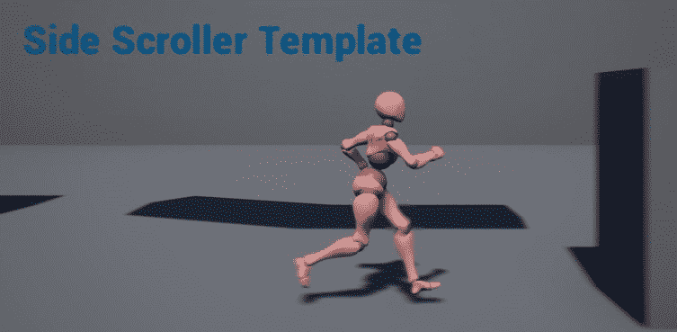

图 11.27：玩家角色奔跑

注意

可以在以下网址找到此活动的解决方案：[`packt.live/338jEBx`](https://packt.live/338jEBx)。

现在您已经处理了玩家角色从“空闲”到“行走”，最终到“奔跑”的混合移动，让我们继续下一步，添加功能以允许玩家角色通过奔跑移动得更快。

# 输入绑定

每个游戏都需要玩家的输入，无论是键盘上的按键，如*W*、*A*、*S*和*D*，用于移动玩家角色，还是控制器上的摇杆；这就是使视频游戏成为互动体验的原因。虚幻引擎 4 允许我们将键盘、鼠标、游戏手柄和其他类型的控件映射到标记的动作或轴上，然后您可以在蓝图或 C++中引用这些动作或轴，以允许角色或游戏功能发生。重要的是要指出，每个独特的动作或轴映射可以有一个或多个按键绑定，并且同一个按键绑定可以用于多个映射。输入绑定保存在名为`DefaultInput.ini`的初始化文件中，并且可以在项目目录的`Config`文件夹中找到。

注意

输入绑定可以直接从`DefaultInput.ini`文件或通过编辑器中的“项目设置”进行编辑；后者在编辑时更容易访问，且更少出错。

让我们为玩家角色的“奔跑”功能添加一个新的输入绑定。

## 练习 11.04：添加奔跑和投掷输入

随着玩家角色在关卡中移动，您现在将为玩家角色实现一个独特的角色类，该类源自基本的`SuperSideScrollerCharacter`C++类。这样做的原因是，您可以轻松区分玩家角色和敌人的类，而不仅仅依赖于独特的蓝图类。

在创建独特的 C++角色类时，您将实现“奔跑”行为，以允许玩家角色根据需要“行走”和“奔跑”。

让我们首先通过添加“奔跑”的输入绑定来实现“奔跑”机制：

1.  在编辑器顶部的工具栏上导航到“编辑”选项，然后从下拉列表中选择“项目设置”。

1.  在“项目设置”中，导航到左侧“引擎”类别下的“输入”选项。默认情况下，虚幻引擎提供的`Side Scroller`模板项目为“跳跃”提供了动作映射，键为*W*、*上箭头键*、*空格键*和*游戏手柄底部按钮*。

1.  通过*左键单击*“动作映射”旁边的`+`按钮添加新的“动作映射”。将此映射标记为“奔跑”，并为其控件添加两个键；“左 Shift”和“游戏手柄右肩”。请参考下面的图示以获取更新后的绑定。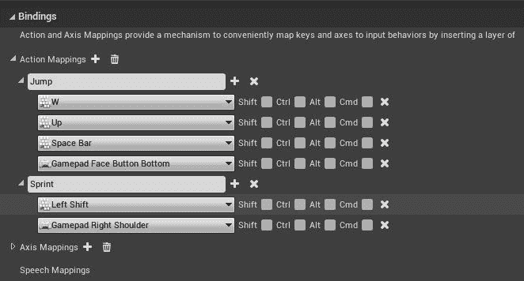

图 11.28：应用于按键绑定的跳跃和奔跑动作映射

有了“奔跑”输入绑定后，您需要为基于`SuperSideScroller`角色类的玩家角色创建一个新的 C++类。

1.  返回编辑器，导航到“文件”，然后从下拉列表中选择“新建 C++类”选项。

1.  新的玩家角色类将继承自 SuperSideScrollerCharacter 父类，因为这个基类具有玩家角色所需的大部分功能。选择父类后，*左键单击*“下一步”。请参考以下图片，看看如何找到 SuperSideScrollerCharacter 类。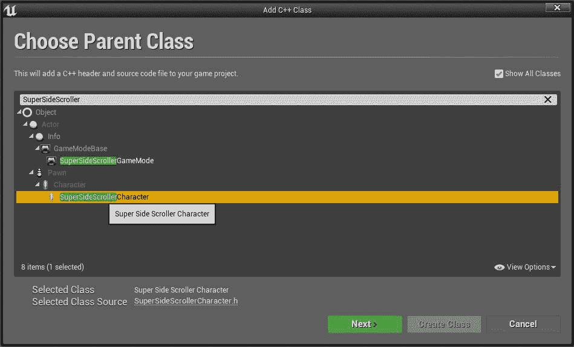

图 11.29：选择 SuperSideScrollerCharacter 父类

1.  将这个新类命名为`SuperSideScroller_Player`。除非您有必要调整这个新类的文件目录，否则将路径保留为 Unreal Engine 为您提供的默认路径。在命名新类并选择要保存类的目录之后，*左键单击*“创建类”。

选择“创建类”后，Unreal Engine 将为您生成源文件和头文件，并且 Visual Studio 将自动打开这些文件。您会注意到头文件和源文件几乎是空的。这没关系，因为您是从 SuperSideScrollerCharacter 类继承的，您想要的大部分逻辑都在那个类中完成了。

1.  在 SuperSideScroller_Player 中，您只会添加您需要的功能。您可以在 SuperSideScroller_Player.h 文件中查看继承正在发生的地方：

```cpp
class SUPERSIDESCROLLER_API ASuperSideScroller_Player : public ASuperSideScrollerCharacter
```

这个类声明表示新的 ASuperSideScroller_Player 类继承自 ASuperSideScrollerCharacter 类。

通过完成这个练习，您可以为“冲刺”机制添加必要的“输入绑定”，然后可以在 C++中引用并用于允许玩家进行冲刺。现在您还创建了玩家角色的 C++类，您可以更新代码以添加“冲刺”功能，但首先您需要更新“蓝图”角色和动画蓝图以引用这个新类。让我们在下一个练习中完成这个任务。

当您将蓝图重新设置为新类时会发生什么？每个蓝图都继承自一个父类。在大多数情况下，这是`Actor`，但在您的角色蓝图的情况下，它的父类是`SuperSideScrollerCharacter`。从父类继承允许蓝图继承该类的功能和变量，以便逻辑可以在蓝图级别上重用。

例如，当从 SuperSideScrollerCharacter 类继承时，蓝图会继承诸如 CharacterMovement 组件和 Mesh 骨骼网格组件之类的组件，然后可以在蓝图中进行修改。

## 练习 11.05：重新设置角色蓝图的父类

现在您已经为玩家角色创建了一个新的角色类，您需要更新`BP_SuperSideScroller_MainCharacter`蓝图，以使用`SuperSideScroller_Player`类作为其父类。如果不这样做，那么您添加到新类的任何逻辑都不会影响蓝图中创建的角色。

按照以下步骤将蓝图重新设置为新的角色类：

1.  导航到`/Game/MainCharacter/Blueprints/`，并打开`BP_SuperSideScroller_MainCharacter`蓝图。

1.  在工具栏上选择“文件”选项，然后从下拉菜单中选择“重新设置父蓝图”选项。

1.  选择“重新设置父蓝图”选项时，Unreal 会要求您为蓝图重新设置父类。搜索`SuperSideScroller_Player`，然后通过*左键单击*从下拉菜单中选择该选项。

一旦您为蓝图选择了新的父类，Unreal 将重新加载蓝图并重新编译它，这两个过程都将自动进行。

注意

在将蓝图重新父类化为新的父类时要小心，因为这可能导致编译错误或设置被擦除或恢复为类默认值。虚幻引擎将在将蓝图重新父类化为新类后显示任何可能发生的警告或错误。这些警告和错误通常发生在蓝图逻辑引用不再存在于新父类中的变量或其他类成员的情况下。即使没有编译错误，最好确认在重新父类化之后您对蓝图所做的任何逻辑或设置仍然存在，然后再继续工作。

现在您的角色蓝图已正确重新父类化为新的`SuperSideScroller_Player`类，您还需要更新`AnimBP_SuperSideScroller_MainCharacter`动画蓝图，以确保在使用`尝试获取所有者`函数时转换为正确的类。

1.  接下来，导航到`/MainCharacter/Blueprints/`目录，并打开`AnimBP_SuperSideScroller_MainCharacter`动画蓝图。

1.  打开`事件图`。从`尝试获取所有者`函数的`返回值`中，搜索`转换`为`SuperSideScroller_Player`：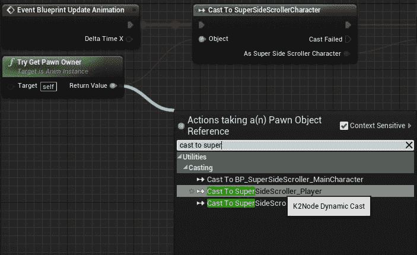

图 11.30：与转换为基本 SuperSideScrollerCharacter 类不同，您可以转换为新的 SuperSideScroller_Player 类

1.  然后，将输出连接为`SuperSideScroller_Player`转换为`MainCharacter`变量。这是因为`MainCharacter`变量是`SuperSideScrollerCharacter`类型，而新的`SuperSideScroller_Player`类继承自该类：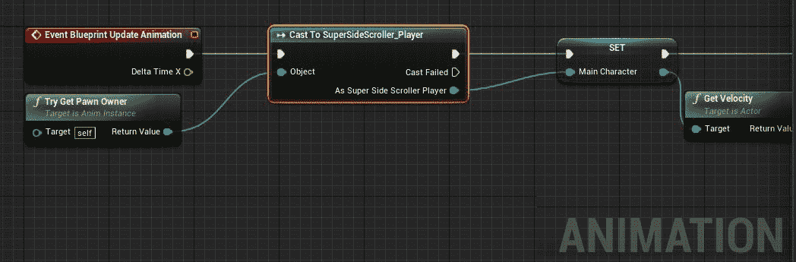

图 11.31：您仍然可以使用 MainCharacter 变量，因为 SuperSideScroller_Player 基于 SuperSideScrollerCharacter 进行继承

现在，`BP_SuperSideScroller_MainCharacter`角色蓝图和`AnimBP_SuperSideScroller_MainCharacter`动画蓝图都引用了您的新`SuperSideScroller_Player`类，现在可以安全地进入 C++并编写角色冲刺功能。

## 练习 11.06：编写角色冲刺功能

在上一次练习中正确实现了新的`SuperSideScroller_Player`类引用后，现在是时候开始编写功能，允许玩家角色进行冲刺了。

执行以下步骤将`冲刺`机制添加到角色中：

1.  首先要处理的是`SuperSideScroller_Player`类的构造函数。返回 Visual Studio 并打开`SuperSideScroller_Player.h`头文件。

1.  您将在本练习的后面使用`构造函数`来为变量设置初始化值。现在，它将是一个空的构造函数。确保声明是在`public`访问修饰符标题下进行的，就像下面的代码中所示：

```cpp
//Constructor
ASuperSideScroller_Player();
```

1.  构造函数声明后，在`SuperSideScroller_Player.cpp`源文件中创建构造函数定义：

```cpp
ASuperSideScroller_Player::ASuperSideScroller_Player()
{
}
```

构造函数就位后，现在可以创建`SetupPlayerInputComponent`函数，以便您可以使用之前创建的按键绑定来调用`SuperSideScroller_Player`类中的函数。

`SetupPlayerInputComponent`函数是角色类默认内置的函数，因此您需要将其声明为带有`override`修饰符的`虚拟`函数。这告诉虚幻引擎您正在使用此函数，并打算在这个新类中重新定义其功能。确保声明是在`Protected`访问修饰符标题下进行的。

1.  `SetupPlayerInputComponent`函数需要将`UInputComponent`类的对象传递到函数中，如下所示：

```cpp
protected:
//Override base character class function to setup our player   input component
virtual void SetupPlayerInputComponent(class UInputComponent*   PlayerInputComponent) override;
```

`UInputComponent* PlayerInputComponent`变量是从我们的`ASuperSideScroller_Player()`类继承的`UCharacter`基类中继承的，因此必须用作`SetupPlayerInputComponent()`函数的输入参数。使用其他任何名称都将导致编译错误。

1.  现在，在源文件中创建`SetupPlayerInputComponent`函数的定义。在函数的主体中，我们将使用`Super`关键字来调用它：

```cpp
//Not always necessary, but good practice to call the function in   the base class with Super.
Super::SetupPlayerInputComponent(PlayerInputComponent);
```

`Super`关键字使我们能够调用`SetupPlayerInputComponent`父方法。有了`SetupPlayerInputComponent`函数准备好了，您需要包含以下头文件，以便在继续进行此练习时不会出现任何编译错误：

+   `#include "Components/InputComponent.h"`

+   `#include "GameFramework/CharacterMovementComponent.h"`

您需要包含输入组件的头文件，以便将键映射绑定到接下来将创建的冲刺功能上。`Character Movement`组件的头文件将对冲刺功能是必需的，因为您将根据玩家是否正在冲刺来更新`Max Walk Speed`参数。以下是所有需要包含的玩家角色的头文件：

```cpp
#include "SuperSideScroller_Player.h"
#include "Components/InputComponent"
#include "GameFramework/CharacterMovementComponent.h"
```

在`SuperSideScroller_Player`类的源文件中包含了必要的头文件后，您现在可以创建用于使玩家角色移动更快的冲刺功能。让我们首先声明所需的变量和函数。

1.  在`SuperSideScroller_Player`类的头文件中的`Private`访问修饰符下，声明一个名为`bIsSprinting`的新布尔变量。这个变量将被用作一个保险措施，以确切地知道玩家角色在进行任何移动速度更改之前是否正在冲刺：

```cpp
private:
//Bool to control if we are sprinting. Failsafe.
bool bIsSprinting;
```

1.  接下来，声明两个新函数，`Sprint();`和`StopSprinting();`。这两个函数不需要任何参数，也不返回任何内容。在`Protected`访问修饰符下声明这些函数：

```cpp
//Sprinting
void Sprint();
//StopSprinting
void StopSprinting();
```

当玩家*按住/释放*与绑定的`Sprint`键映射相对应的键时，将调用`Sprint();`函数，并且当玩家*释放*与绑定的键相对应的键时，将调用`StopSprinting()`函数。

1.  从`Sprint();`函数的定义开始。在`SuperSideScroller_Player`类的源文件中，创建此函数的定义，如下所示：

```cpp
void ASuperSideScroller_Player::Sprint()
{
}
```

1.  在函数内部，您首先要检查`bIsSprinting`变量的值。如果玩家`bIsSprinting`为`False`，则继续执行函数的其余部分。

1.  在`If`语句内，将`bIsSprinting`变量设置为`True`。然后，您可以访问`GetCharacterMovement()`函数并修改`MaxWalkSpeed`参数。将`MaxWalkSpeed`设置为`500.0f`。请记住，移动混合空间的`Maximum Axis Value`参数为`500.0f`。这意味着玩家角色将达到使用`Running`动画所需的速度：

```cpp
void ASuperSideScroller_Player::Sprint()
{
    if (!bIsSprinting)
      {
        bIsSprinting = true;
        GetCharacterMovement()->MaxWalkSpeed = 500.0f;
      }
}
```

`StopSprinting()`函数几乎与您刚刚编写的`Sprint()`函数相同，但它的工作方式相反。您首先要检查玩家是否正在冲刺，也就是`bIsSprinting`为`True`。如果是，就继续执行函数的其余部分。

1.  在`If`语句内，将`bIsSprinting`设置为`False`。然后，访问`GetCharacterMovement()`函数来修改`MaxWalkSpeed`。将`MaxWalkSpeed`设置回`300.0f`，这是玩家角色行走的默认速度。这意味着玩家角色只会达到`Walking`动画所需的速度：

```cpp
void ASuperSideScroller_Player::StopSprinting()
{
   if (bIsSprinting)
    {
     bIsSprinting = false;
      GetCharacterMovement()->MaxWalkSpeed = 300.0f;
    }
}
```

现在您已经拥有了需要进行冲刺的功能，是时候将这些功能绑定到您之前创建的动作映射上了。为了做到这一点，在`SetupPlayerInputComponent`函数中执行以下步骤。

1.  让我们开始绑定`Sprint()`函数。在`SetupPlayerInputComponent`函数内部，使用传递给函数的`PlayerInputComponent`变量来调用`BindAction`函数。

我们需要`BindAction`的参数如下：

+   在`Project Settings`中写入的动作映射的名称，这是您在此练习中之前设置的，这种情况下是`Sprint`。

+   `EInputEvent`类型的枚举值，您想要用于此绑定；在这种情况下，您将使用`IE_Pressed`，因为这个绑定将是当按下`Sprint`键时。

```cpp
//Bind pressed action Sprint to your Sprint function
PlayerInputComponent->BindAction"Sprint", IE_Pressed, this,   &ASuperSideScroller_Player::Sprint);
```

1.  您将对`StopSprinting()`函数做同样的事情，但这次您需要使用`IE_Released`枚举值，并引用`StopSprinting`函数：

```cpp
//Bind released action Sprint to your StopSprinting function
PlayerInputComponent->BindAction("Sprint", IE_Released, this,   &ASuperSideScroller_Player::StopSprinting);
```

通过将`Action Mappings`绑定到奔跑功能，您需要做的最后一件事是设置`bIsSprinting`变量和`Character Movement`组件的`MaxWalkSpeed`参数的默认初始化值。

1.  在您的`SuperSideScroller_Player`类的源文件中的`constructor`函数中，添加`bIsSprinting = false`行。这个变量被构造为 false，因为玩家角色默认情况下不应该在奔跑。

1.  最后，通过添加一行`GetCharacterMovement()->MaxWalkSpeed = 300.0f`，将角色移动组件的`MaxWalkSpeed`参数设置为`300.0f`。请查看以下代码：

```cpp
ASuperSideScroller_Player::ASuperSideScroller_Player()
{
  //Set sprinting to false by default.
   bIsSprinting = false;
  //Set our max Walk Speed to 300.0f
   GetCharacterMovement()->MaxWalkSpeed = 300.0f;
}
```

通过在构造函数中初始化变量，`SuperSideScroller_Player`类现在已经完成。返回到虚幻引擎，*左键单击*工具栏上的`Compile`按钮。这将重新编译代码并执行编辑器的热重载。

重新编译和热重载编辑器后，您可以在编辑器中进行播放，并看到您努力的成果。基本移动行为与以前相同，但现在如果您按住*左 Shift*或*游戏手柄右肩*，玩家角色将奔跑并开始播放`Running`动画。

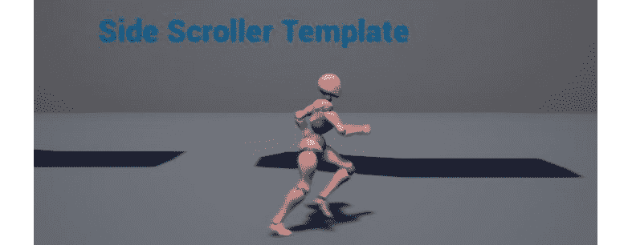

图 11.32：玩家角色现在可以奔跑

玩家角色能够奔跑后，让我们继续下一个活动，在这个活动中，您将以非常相似的方式实现基本的`Throw`功能。

## 活动 11.03：实现投掷输入

这个游戏包含的一个功能是玩家能够向敌人投掷抛射物。在本章中，您不会创建抛射物或实现动画，但您将设置按键绑定和 C++实现，以便在下一章中使用。

在这个活动中，您需要为`Throw`投射功能设置按键绑定，并在 C++中实现调试日志，当玩家按下与`Throw`映射的按键时，执行以下操作。

1.  在输入绑定中的`Project Settings`中添加一个新的`Throw`输入。将此绑定命名为`ThrowProjectile`，并将其绑定到*左鼠标按钮*和*游戏手柄右扳机*。

1.  在 Visual Studio 中，向`SuperSideScroller_Player`的头文件中添加一个新的函数。将这个函数命名为`ThrowProjectile()`。这将是一个没有参数的 void 函数。

1.  在`SuperSideScroller_Player`类的源文件中创建定义。在这个函数的定义中，使用`UE_LOG`打印一条消息，让您知道函数被成功调用。

注意

您可以在这里了解更多关于`UE_LOG`的信息：[`www.ue4community.wiki/Legacy/Logs,_Printing_Messages_To_Yourself_During_Runtime`](https://www.ue4community.wiki/Legacy/Logs,_Printing_Messages_To_Yourself_During_Runtime)。

这个活动结束时的预期结果是，当您使用*左鼠标按钮*或*游戏手柄右扳机*时，`输出日志`中将出现一条日志，让您知道`ThrowProjectile`函数被成功调用。稍后您将使用这个函数来生成您的抛射物。

预期的输出如下：

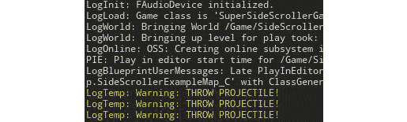

图 11.33：预期的输出日志

注意

这个活动的解决方案可以在这里找到：[`packt.live/338jEBx`](https://packt.live/338jEBx)。

完成这个活动后，您现在已经在*第十三章* *敌人人工智能*中创建了玩家投射物的功能。您现在也已经掌握了向游戏添加新的键映射的知识和经验，并且实现了利用这些映射来启用游戏功能的 C++功能。现在，您将继续更新玩家角色移动，以允许玩家跳跃时正确播放跳跃动画。

# 动画状态机

现在，让我们了解一下在虚幻引擎 4 和动画中状态机的概念。状态机是将动画或一组动画分类到它们自己的状态中的一种方式。状态可以被认为是玩家角色在特定时间内的条件。玩家当前是在走路吗？玩家在跳跃吗？在许多第三人称游戏中，比如*最后的生还者*，这是将移动、跳跃、蹲下和攀爬动画分离到它们自己的状态中。每个状态在游戏进行时都是可访问的。条件可以包括玩家是否在跳跃、玩家角色的速度以及玩家是否处于蹲下状态。状态机的工作是使用称为**转换规则**的逻辑决策在各个状态之间进行转换。当您创建多个状态和相互交织的多个转换规则时，状态机开始看起来像一个网络。

请参考以下图片，查看`ThirdPerson_AnimBP`动画蓝图的状态机外观。

注意

可以在这里找到状态机的一般概述：[`docs.unrealengine.com/en-US/Engine/Animation/StateMachines/Overview/index.html`](https://docs.unrealengine.com/en-US/Engine/Animation/StateMachines/Overview/index.html)

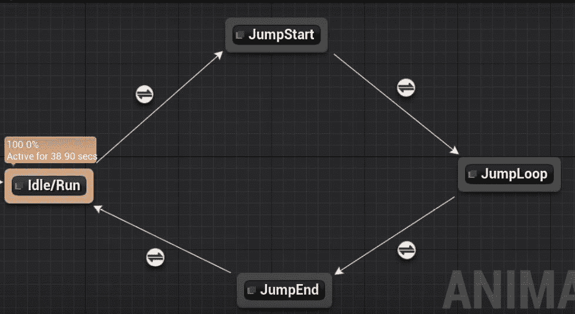

图 11.34：ThirdPerson_AnimBP 的状态机，包含在 SideScroller 项目模板中

对于玩家角色的状态机，这个状态机将处理默认玩家移动和跳跃的状态。目前，玩家角色通过使用由角色速度控制的混合空间来简单地进行动画。在下一个练习中，您将创建一个新的状态机，并将移动混合空间逻辑移动到该状态机内的自己状态。让我们开始创建新的状态机。

## 练习 11.07：玩家角色移动和跳跃状态机

在这个练习中，您将实现一个新的动画状态机，并将现有的移动混合空间集成到状态机中。此外，您将设置玩家跳跃开始时的状态，以及玩家在跳跃期间的状态。

让我们从添加这个新状态机开始：

1.  导航到`/MainCharacter/Blueprints/`目录，并打开`AnimBP_SuperSideScroller_MainCharacter`动画蓝图。

1.  在`AnimGraph`中，在图表的空白处*右键单击*，并在上下文敏感搜索中搜索`state machine`，以找到`Add New State Machine`选项。将这个新状态机命名为`Movement`。

1.  现在，我们可以连接新状态机`Movement`的输出姿势到动画的输出姿势，而不是连接`SideScroller_IdleRun`混合空间的输出姿势：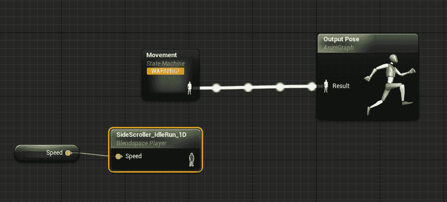

图 11.35：新的 Movement 状态机替换了旧的混合空间

将空状态机连接到动画蓝图的`Output Pose`将导致显示下面的警告。这意味着在该状态机中没有任何操作，结果将无效到`Output Pose`。不要担心；您将在下一步中解决这个问题。

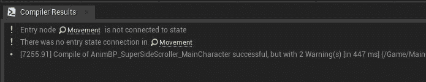

图 11.36：空状态机导致编译警告

1.  *双击*`Movement`状态机以打开状态机本身。下面的图像显示了这是什么样子。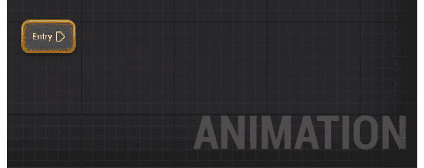

图 11.37：这是创建的空状态机

您将首先添加一个新状态，该状态将处理角色之前的操作；`空闲`，`行走`和`奔跑`。

1.  从`Entry`点，*左键单击*并拖动以打开上下文敏感搜索。您会注意到只有两个选项-`添加导管`和`添加状态`。现在，您将添加一个新状态并将此状态命名为`Movement`。请参考以下图像，查看已创建的`Movement`状态。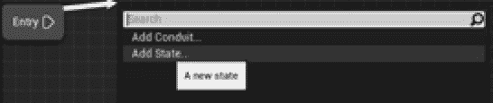

图 11.38：在状态机内部，您需要添加一个新状态，该状态将处理您之前创建的移动混合空间


图 11.39：新的移动状态

1.  复制并粘贴您在上一步中连接`Speed`变量到`SideScroller_IdleRun`混合空间的逻辑到新创建的`Movement`状态。将其连接到此状态的`Output Animation Pose`节点的`Result`引脚：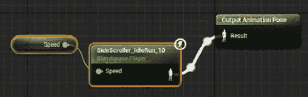

图 11.40：将混合空间的输出姿势连接到此状态的输出姿势

现在，如果重新编译动画蓝图，您会注意到首先看到的警告现在已经消失。这是因为您添加了一个新状态，该状态将动画输出到`Output Animation Pose`，而不是拥有一个空状态机。

通过完成这个练习，您已经构建了您的第一个状态机。虽然这是一个非常简单的状态机，但现在您正在告诉角色默认进入并使用`Movement`状态。如果您现在 PIE，您会看到玩家角色现在像之前制作状态机之前一样移动。这意味着您的状态机正在运行，并且您可以继续下一步，即添加跳跃所需的初始状态。让我们从创建`JumpStart`状态开始。

## 转换规则

导管是告诉每个状态可以在何种条件下从一个状态转换到另一个状态的一种方式。在这种情况下，转换规则被创建为`Movement`和`JumpStart`状态之间的连接。这由连接状态之间的方向箭头指示。工具提示提到术语*转换规则*，这意味着您需要定义这些状态之间的转换如何发生，使用布尔值来实现。

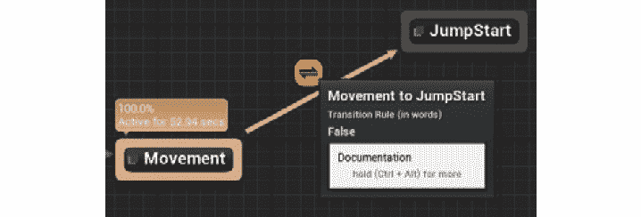

图 11.41：需要有一个转换规则从移动到角色跳跃的开始

## 练习 11.08：向状态机添加状态和转换规则

在从玩家角色的默认移动混合空间过渡到跳跃动画的情况下，您需要知道玩家何时决定跳跃。这可以使用玩家角色的`Character Movement`组件中的一个有用函数`IsFalling`来完成。您将希望跟踪玩家当前是否正在下落，以便在跳跃中进行过渡。这样做的最佳方式是将`IsFalling`函数的结果存储在自己的变量中，就像您在跟踪玩家速度时所做的那样。

以下步骤将帮助您完成此练习：

1.  回到状态机的概述，*左键单击*并从`Movement`状态的边缘拖动以再次打开上下文敏感菜单。

1.  选择`Add State`选项并将此状态命名为`JumpStart`。当您这样做时，虚幻将自动连接这些状态并为您实现一个空的`Transition Rule`：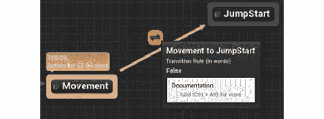

图 11.42：虚幻自动为您连接两个状态时创建的 Transition Rule

1.  返回到动画蓝图中的`Event Graph`，在那里您使用了事件蓝图更新动画事件来存储玩家角色的`Speed`。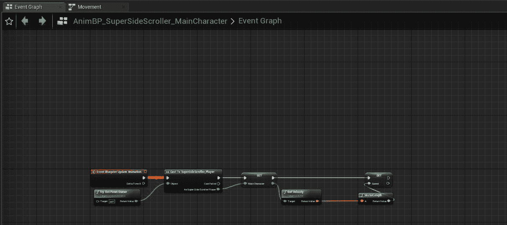

图 11.43：SuperSideScroller 玩家动画蓝图的 EventGraph

1.  为`MainCharacter`创建一个 getter 变量并访问`Character Movement`组件。从`Character Movement`组件，*左键单击*并拖动以访问上下文敏感菜单。搜索`IsFalling`：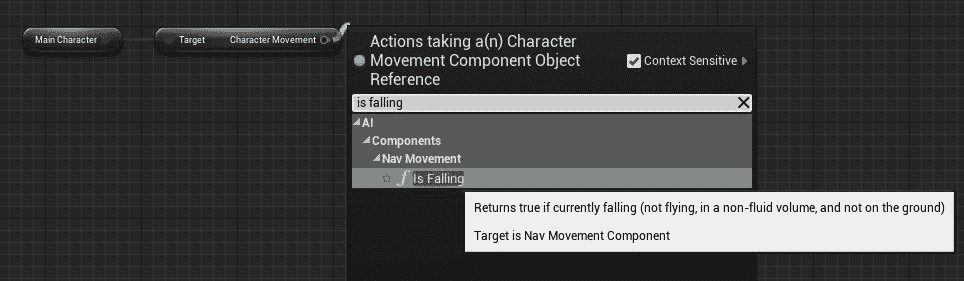

图 11.44：如何找到 IsFalling 函数

1.  角色移动组件可以通过`IsFalling`函数告诉您玩家角色当前是否在空中：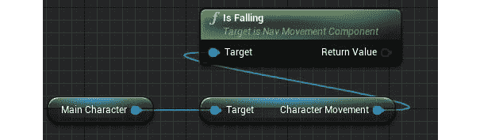

图 11.45：角色移动组件显示玩家角色的状态

1.  从`IsFalling`函数的`Return Value`布尔值，*左键单击*并拖动以搜索上下文敏感菜单中的`Promote to Variable`选项。将此变量命名为`bIsInAir`。在提升为变量时，返回值输出针应自动连接到新提升的变量的输入针。如果没有，请记得连接它们。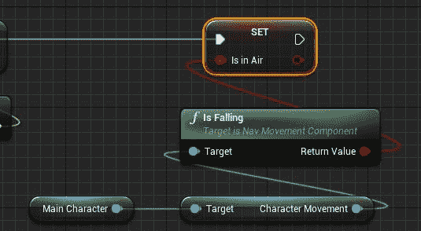

图 11.46：包含 IsFalling 函数值的新变量 bIsInAir

现在你正在存储玩家的状态以及他们是否正在下落，这是`Movement`和`JumpStart`状态之间的过渡规则的完美候选者。

1.  在`Movement State`机器中，*双击*`Transition Rule`进入其图表。您将只找到一个输出节点`Result`，带有参数`Can Enter Transition`。在这里，您只需要使用`bIsInAir`变量并将其连接到该输出。现在，`Transition Rule`表示如果玩家在空中，则可以发生`Movement`状态和`JumpStart`状态之间的过渡。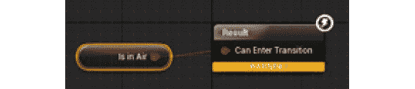

图 11.47：当在空中时，玩家将过渡到跳跃动画的开始

在`Movement`和`JumpStart`状态之间放置了`Transition Rule`后，剩下的就是告诉`JumpStart`状态使用哪个动画。

1.  从状态机图中，*双击*`JumpStart`状态以进入其图表。从“资产浏览器”中，*左键单击*并将`JumpingStart`动画拖到图表中：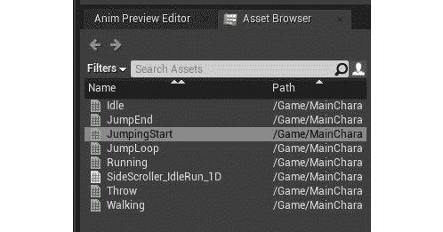

图 11.48：在左键单击并将其拖入状态之前，确保在资产浏览器中选择了 JumpingStart 动画

1.  将`Play JumpingStart`节点的输出连接到`Output Animation Pose`节点的`Result`引脚：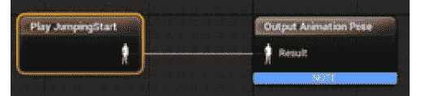

图 11.49：将 JumpingStart 动画连接到 JumpStart 状态的输出动画姿势

在进行下一个状态之前，需要更改`JumpingStart`动画节点上的设置。

1.  *左键单击*`Play JumpingStart`动画节点，并更新“详细信息”面板以具有以下设置：

+   “循环动画=假”

+   “播放速率=2.0”

请参考以下图表，查看`Play JumpingStart`动画节点的最终设置。

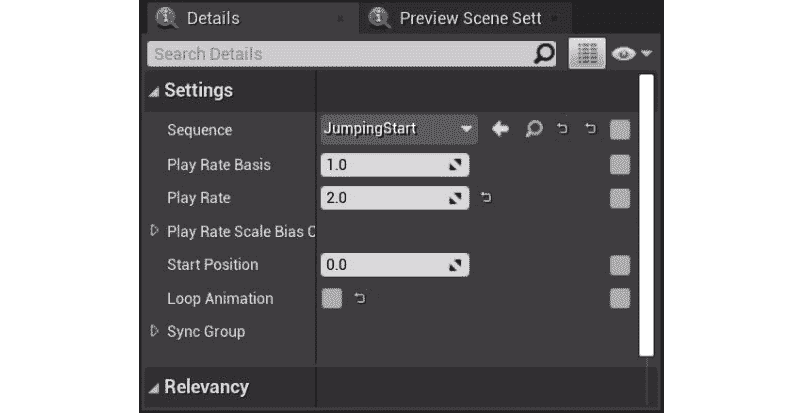

图 11.50：由于 JumpStart 动画的缓慢，增加播放速率将导致整体跳跃动画更加流畅

您将将“循环动画”参数设置为`False`，因为没有理由让这个动画循环；无论如何它都应该只播放一次。这个动画循环的唯一方式是玩家角色在这个状态下被卡住，但由于您将创建的下一个状态，这永远不会发生。将“播放速率”设置为`3.0`的原因是因为动画本身，`JumpingStart`，对于您正在制作的游戏来说太长了。动画让角色急剧弯曲膝盖，并在一秒多的时间内向上跳跃。对于`JumpStart`状态，您希望角色更快地播放这个动画，以使其更流畅，并提供更平滑的过渡到下一个状态；`JumpLoop`。

一旦玩家角色开始`JumpStart`动画，动画中会有一个时间点，此时玩家在空中，并应该过渡到一个新状态。这个新状态将循环，直到玩家不再在空中，并可以过渡到结束跳跃的最终状态。接下来，让我们创建这个新状态，它将从`JumpStart`状态过渡。

1.  从状态机图中，*左键单击*并从`JumpStart`状态拖动并选择“添加状态”选项。将此新状态命名为`JumpLoop`。与以前一样，虚幻将自动为您提供这些状态之间的“转换规则”，您将在下一个练习中添加。最后，重新编译动画蓝图，并忽略编译器结果下可能出现的任何警告。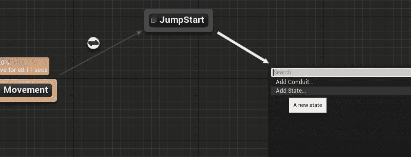

图 11.51：创建另一个状态，将处理角色在初始跳跃后空中的动画

通过完成这个练习，您已经为`JumpStart`和`JumpLoop`添加并连接了自己的状态。这些状态通过“转换规则”连接，现在您对状态机中的状态如何通过每个转换规则中建立的规则从一个状态过渡到另一个状态有了更好的理解。

在下一个练习中，您将更深入地了解如何通过函数“剩余时间比例”从`JumpStart`状态过渡到`JumpLoop`状态。

## 练习 11.09：剩余时间比例函数

为了使“跳跃开始”状态顺利过渡到“跳跃循环”状态，您需要花一点时间思考确切地想要这个过渡如何工作。基于“跳跃开始”和“跳跃循环”动画的工作方式，最好在“跳跃开始”动画播放一定时间后过渡到“跳跃循环”动画。这样，“跳跃循环”状态就会在“跳跃开始”动画播放`X`秒后平稳播放。

执行以下步骤来实现这一点：

1.  *双击*“跳跃开始”和“跳跃循环”之间的“过渡规则”以打开其图表。您将应用的“过渡规则”是检查“跳跃开始”动画剩余多少时间。这是因为“跳跃开始”动画还剩下一定比例的时间，您可以安全地假设玩家在空中并准备过渡到“跳跃循环”动画状态。

1.  要做到这一点，首先确保在“资源浏览器”中选择了“跳跃开始”动画，然后在“过渡规则”的“事件图”中*右键单击*并找到“时间剩余比率”函数。

让我们花点时间来谈谈“时间剩余比率”函数及其作用。该函数返回一个在`0.0f`和`1.0f`之间的浮点数，告诉您指定动画剩余多少时间。值`0.0f`和`1.0f`可以直接转换为百分比值，以便更容易考虑。在“跳跃开始”动画的情况下，您希望知道动画剩余的百分比是否小于 60%，以成功过渡到“跳跃循环”状态。这就是您现在要做的。

1.  从“时间剩余比率”函数的“返回值”浮点输出参数中，从上下文敏感搜索菜单中搜索“小于比较操作”节点。由于您正在处理一个在`0.0f`和`1.0f`之间的返回值，为了知道动画剩余的百分比是否小于 60%，您需要将这个返回值与`0.6f`进行比较。最终结果如下：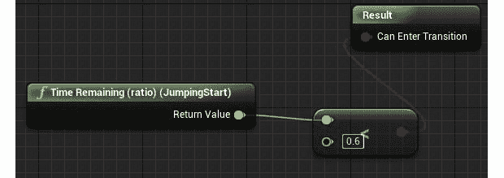

图 11.52：在过渡到跳跃循环动画之前，您需要知道跳跃开始动画剩余多少时间

有了这个“过渡规则”，剩下的就是将“跳跃循环”动画添加到“跳跃循环”状态中。

1.  在“移动”状态机中，*双击*“跳跃循环”状态以进入其图表。在“资源浏览器”中选择“跳跃循环”动画资产，*单击*并将其拖放到图表中。将其输出连接到“输出动画姿势”的“结果”输入，如下所示。默认设置的“播放跳跃循环”节点将保持不变。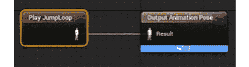

图 11.53：跳跃循环动画连接到新状态的输出动画姿势

将“跳跃循环”动画放置在“跳跃循环”状态中后，您现在可以编译动画蓝图并进行 PIE。您会注意到移动和奔跑动画仍然存在，但当您尝试跳跃时会发生什么？玩家角色开始“跳跃开始”状态，并在空中播放“跳跃循环”动画。这很棒，状态机正在工作，但当玩家角色到达地面并不再在空中时会发生什么？玩家角色不会过渡回“移动”状态，这是有道理的，因为您还没有添加“跳跃结束”状态或“跳跃循环”和“跳跃结束”之间的过渡，以及从“跳跃结束”回到“移动”状态。您将在下一个活动中完成这些。请参见下面的示例，其中玩家角色被困在“跳跃循环”状态中：

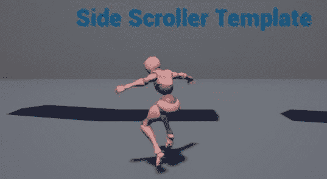

图 11.54：玩家角色现在可以播放跳跃开始动画和跳跃循环动画，但无法过渡回默认移动状态

通过完成这个练习，您已成功使用`Time Remaining Ratio`函数从`JumpStart`状态过渡到`JumpLoop`状态。这个函数允许您知道动画播放到哪个阶段，有了这个信息，状态机就可以过渡到`JumpLoop`状态。玩家现在可以成功地从默认的`Movement`状态过渡到`JumpStart`状态，然后到`JumpLoop`状态，导致一个有趣的问题。玩家现在被困在`JumpLoop`状态，因为状态机没有包含回到`Movement`状态的过渡。让我们在下一个活动中解决这个问题。

## 活动 11.04：完成移动和跳跃状态机

完成了一半的状态机，现在是时候添加跳跃结束的状态，以及允许您从`JumpLoop`状态过渡到这个新状态的过渡规则，以及从这个新状态过渡回`Movement`状态的过渡规则。

完成`Movement`状态机的以下操作：

1.  添加一个新的`Jump End`状态，从`JumpLoop`过渡。将此状态命名为`JumpEnd`。

1.  将`JumpEnd`动画添加到新的`JumpEnd`状态。

1.  根据`JumpEnd`动画以及我们希望在`JumpLoop`、`JumpEnd`和`Movement`状态之间快速过渡的方式，考虑修改动画的参数，就像你为`JumpStart`动画所做的那样。`循环动画`参数需要设置为`False`，`播放速率`参数需要设置为`3.0`。

1.  在`JumpLoop`状态到`JumpEnd`状态添加一个`过渡规则`，基于`bIsInAir`变量。

1.  根据`JumpEnd`动画的`Time Remaining Ratio`函数，从`JumpEnd`状态到`Movement`状态添加一个`过渡规则`。（查看`JumpStart`到`JumpLoop`的过渡规则）。

通过本次活动，您将拥有一个完全运作的移动状态机，允许玩家角色空闲、行走、冲刺，以及能够跳跃并在跳跃开始时正确地进行动画，以及在空中和着陆时进行动画。

预期输出如下：

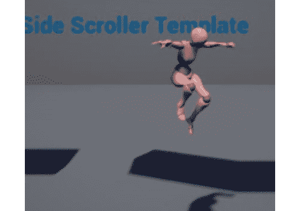

图 11.55：玩家角色的空闲、行走、冲刺和跳跃动画

注意

可以在以下链接找到此活动的解决方案：[`packt.live/338jEBx`](https://packt.live/338jEBx)。

通过完成这个活动，您现在已经完成了玩家角色的移动状态机。通过添加剩余的`JumpEnd`状态和从`JumpLoop`状态过渡到该状态的`过渡规则`，以及从`JumpEnd`状态回到`Movement`状态的`过渡规则`，您成功地创建了您的第一个动画状态机。现在，您可以在地图上奔跑并跳上高处的平台，同时正确地进行动画并在移动和跳跃状态之间过渡。

# 总结

玩家移动混合空间已创建，玩家角色动画蓝图使用状态机从移动到跳跃的过渡，您已准备好进入下一章，在那里您将准备所需的动画插槽、动画剪辑，并更新动画蓝图，以使用角色的上半身进行投掷动画。

通过本章的练习和活动，您学会了如何创建一个 1D 混合空间，允许平滑地混合基于移动的动画，如空闲、行走和奔跑，使用玩家角色的速度来控制动画的混合。

另外，您还学会了如何将新的按键绑定集成到项目设置中，并在 C++中绑定这些按键，以启用角色的游戏机制，如冲刺和投掷。

最后，您学会了如何在角色动画蓝图中实现自己的动画状态机，以便玩家能够在移动动画之间进行过渡，跳跃的各种状态，然后再回到移动状态。有了所有这些逻辑，让我们在下一章继续创建资产和逻辑，允许玩家角色播放投掷动画，并设置敌人的基础类。
