# 12\. 动画混合和蒙太奇

概述

通过本章结束时，你将能够使用`动画蒙太奇`工具来创建一个独特的投掷动画，使用你在*第十章*中导入的`投掷`动画序列。通过这个蒙太奇，你将创建并使用动画插槽，允许你在玩家角色的动画蓝图中混合动画。你还将了解如何使用混合节点有效地混合角色的移动和投掷动画。

在完成玩家角色动画后，你将为敌人 AI 创建所需的类和资产，并学习更多关于材质和`材质实例`，这将使这个敌人在游戏中具有独特的视觉颜色，以便可以进行区分。最后，敌人将准备好进入*第十三章*，*敌人人工智能*，在那里你将开始创建 AI 行为逻辑。

# 介绍

在上一章中，你通过在`混合空间`中实现移动动画，并在动画蓝图中使用该`混合空间`来根据玩家速度驱动动画，使玩家角色栩栩如生。然后，你能够基于玩家输入在 C++中实现功能，允许角色奔跑。最后，你利用动画蓝图内置的动画状态机来驱动角色的移动状态和跳跃状态，以实现在行走和跳跃之间流畅过渡。

随着玩家角色动画蓝图和状态机的工作，现在是时候通过实现角色的“投掷”动画来介绍动画蒙太奇和动画插槽了。在本章中，你将学习更多关于动画混合的知识，看看虚幻引擎如何通过创建`动画蒙太奇`来处理多个动画的混合，并使用新的`保存缓存姿势`和`骨骼层叠混合`，以便玩家可以正确地将你在上一章中处理的移动动画与你将在本章实现的新投掷动画进行混合。

让我们首先学习一下什么是动画蒙太奇和动画插槽，以及它们如何用于角色动画。

# 动画混合、动画插槽和动画蒙太奇

动画混合是在骨骼网格上尽可能无缝地过渡多个动画之间的过程。你已经熟悉了动画混合的技术，因为你在*第十一章*中为玩家角色创建了一个`混合空间`资产，其中角色在“空闲”、“行走”和“奔跑”动画之间平滑过渡。现在，你将通过探索和实现新的叠加技术来扩展这些知识，以将角色的移动动画与投掷动画结合起来。通过使用`动画插槽`，你将把投掷动画发送到一组上半身骨骼和其子骨骼，以便允许移动和投掷动画同时应用而不会对其他动画产生负面影响。但首先，让我们更多地谈谈动画蒙太奇。

动画蒙太奇是一个非常强大的资产，它允许你将多个动画组合在一起，并将这些组合动画分割成所谓的**部分**。部分可以单独播放，按特定顺序播放，甚至循环播放。

动画蒙太奇也很有用，因为你可以通过蓝图或 C++来控制动画蒙太奇中的动画；这意味着你可以根据正在播放的动画部分或蒙太奇中调用的任何“通知”来调用逻辑、更新变量、复制数据等。在 C++中，有一个`UAnimInstance`对象，你可以使用它来调用诸如`UAnimInstance::Montage_Play`之类的函数，这允许你从 C++中访问和播放蒙太奇。

注意

这种方法将在*第十四章*“生成玩家投射物”中使用，当您开始为游戏添加细节时。关于动画和`Notifies`在 Unreal Engine 4 中如何通过 C++处理的更多信息可以在[`docs.unrealengine.com/en-US/API/Runtime/Engine/Animation/AnimNotifies/UAnimNotifyState/index.html`](https://docs.unrealengine.com/en-US/API/Runtime/Engine/Animation/AnimNotifies/UAnimNotifyState/index.html)找到。

您将在本章的第一个练习中了解更多关于`Notifies`的内容，并且您将在*第十四章*“生成玩家投射物”中编写自己的通知状态。

下面的图片显示了动画蒙太奇的`Persona`编辑器。然而，这将在*练习 12.01*“设置动画蒙太奇”中进一步拆分：

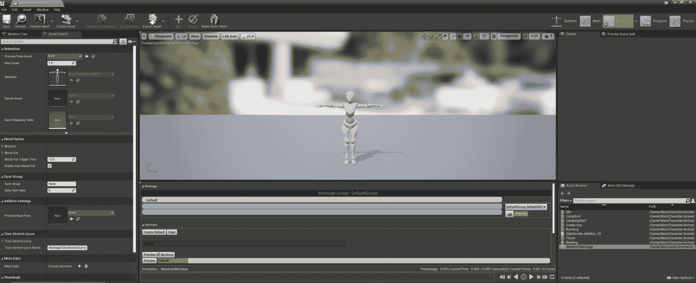

图 12.1：Persona 编辑器，在编辑动画蒙太奇时打开

就像在动画序列中一样，动画蒙太奇允许在动画的时间轴上触发`Notifies`，这样可以触发声音、粒子效果和事件。`Event` `Notifies`将允许我们从蓝图或 C++中调用逻辑。Epic Games 在他们的文档中提供了一个武器重新加载`Animation Montage`的示例，该示例分为`reload start`、`reload loop`和`reload complete`的动画。通过拆分这些动画并应用`Notifies`来触发`sounds`和`events`，开发人员可以完全控制`reload loop`根据内部变量播放多长时间，以及在动画过程中播放任何额外的声音或效果。

最后，动画蒙太奇支持所谓的**Anim Slots**。Anim Slots 允许您对动画或一组动画进行分类，稍后可以在 Animation Blueprint 中引用，以允许基于插槽的独特混合行为。这意味着您可以定义一个 Anim Slot，稍后可以在 Animation Blueprint 中使用，以允许使用此插槽的动画以任何您想要的方式在基本移动动画的基础上混合；在我们的情况下，只影响玩家角色的上半身而不影响下半身。

让我们开始为玩家角色的`Throw`动画创建`Animation Montage`，这是第一个练习。

## 练习 12.01：设置动画蒙太奇

玩家角色的最后一件事是设置 Anim Slot，这将单独将此动画分类为上半身动画。您将在 Animation Blueprint 中使用此 Anim Slot，结合混合函数，允许玩家角色投掷投射物，同时在移动和跳跃时正确地对下半身进行动画处理。

通过这个练习结束时，玩家角色将能够仅使用上半身播放`Throw`动画，而下半身仍将使用您在上一章中定义的`movement animation`。

让我们开始为角色创建`Animation Montage`，投掷并设置那里的 Anim Slot：

1.  首先，导航到`/MainCharacter/Animation`目录，这是所有动画资产的位置。

1.  现在，在内容浏览器中*右键单击*，悬停在可用下拉菜单中的`Animation`选项上。

1.  然后，*左键单击*以选择从出现的附加下拉菜单中的`Animation Montage`选项。

1.  就像创建其他基于动画的资产一样，比如`Blend Spaces`或`Animation Blueprints`，Unreal Engine 会要求您为这个`Animation Montage`分配一个`Skeleton`对象。在这种情况下，选择`MainCharacter_Skeleton`。

1.  将新的`Animation Montage`命名为`AM_Throw`。现在，*双击*打开蒙太奇：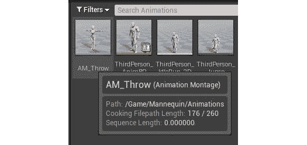

图 12.2：您已成功创建了一个动画蒙太奇资产

打开“动画剪辑”资产时，您会看到类似的编辑器布局，就像打开“动画序列”时一样。有一个“预览”窗口，显示默认的 T 形主角骨架，但一旦您向这个剪辑添加动画，骨架将更新以反映这些变化。

通过完成这个练习，您已成功为“超级横向卷轴”项目创建了一个“动画剪辑”资产。现在是时候了解更多关于动画剪辑以及如何添加您需要的“投掷”动画和动画插槽，以便将“投掷”动画与现有角色移动动画混合。

# 动画剪辑

看一下下面的图：

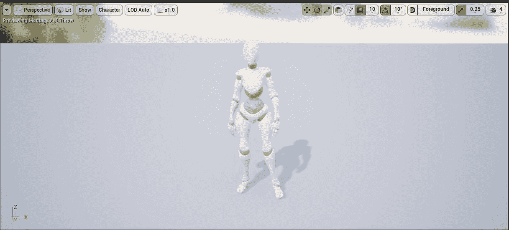

图 12.3：动画剪辑 Persona 编辑器中的动画预览窗口

在“预览”窗口下方，您有主要剪辑时间轴，以及其他部分；让我们从上到下评估这些部分：

+   “剪辑”部分是可以添加一个或多个动画的动画集合。您还可以*右键单击*时间轴上的任何点以创建“部分”区域。

+   **部分**：如前所述，部分允许您设置单个动画序列的播放顺序以及部分是否应该循环。

为了投掷剪辑的目的，您不需要使用此功能，因为您只会在此剪辑中使用一个动画：

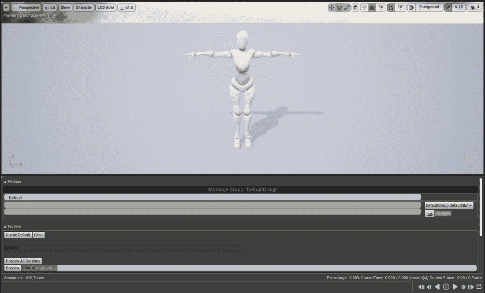

图 12.4：预览窗口和剪辑和部分区域

+   “元素定时”部分为您提供了剪辑的预览以及剪辑各个方面的顺序。通知的播放顺序，“剪辑”部分和其他元素将在这里进行可视化显示，以便您快速预览剪辑的工作方式。

+   “通知”使您能够在动画时间轴上添加点，然后通知其他系统执行操作或从蓝图和 C++中调用逻辑。通知选项，如“播放声音”或“播放粒子效果”，允许您在动画的特定时间播放声音或粒子。一个例子是在武器重新装填的动画中；您可以在动画的时间轴上添加通知，以在重新装填的精确时刻播放重新装填声音。在实现投掷投射物时，您将在项目的后续阶段使用这些“通知”：

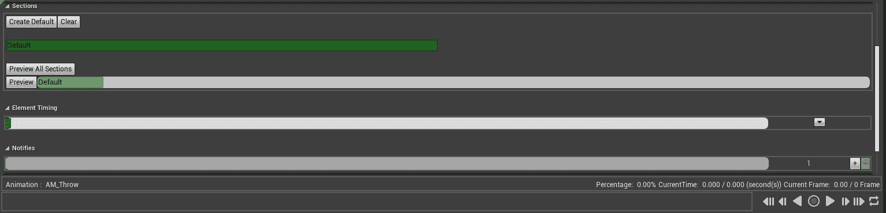

图 12.5：元素定时和通知区域

现在您已经熟悉了动画剪辑的界面，您可以按照下一个练习将“投掷”动画添加到剪辑中。

## 练习 12.02：将投掷动画添加到剪辑中

现在您对动画剪辑是什么以及这些资产如何工作有了更好的理解，是时候将“投掷”动画添加到您在*练习 12.01*中创建的剪辑中了，*设置动画剪辑*。尽管您只会向此剪辑添加一个动画，但重要的是要强调您可以向剪辑添加多个独特的动画，然后播放。现在，让我们开始通过添加您在*第十章*中导入项目的“投掷”动画来开始：

在“资产浏览器”中找到“投掷”动画资产。然后，*左键单击*并将其拖放到“剪辑”部分下的时间轴上：

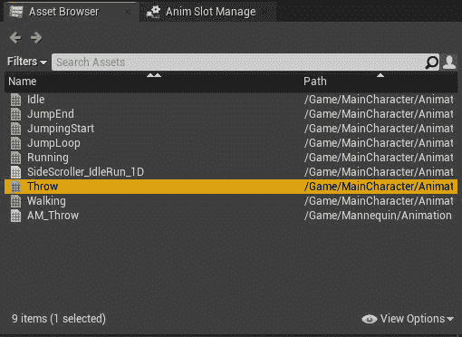

图 12.6：带有基于动画的资产的资产浏览器窗口

一旦将动画添加到动画剪辑中，预览窗口中的角色骨架将更新以反映此更改并开始播放动画：

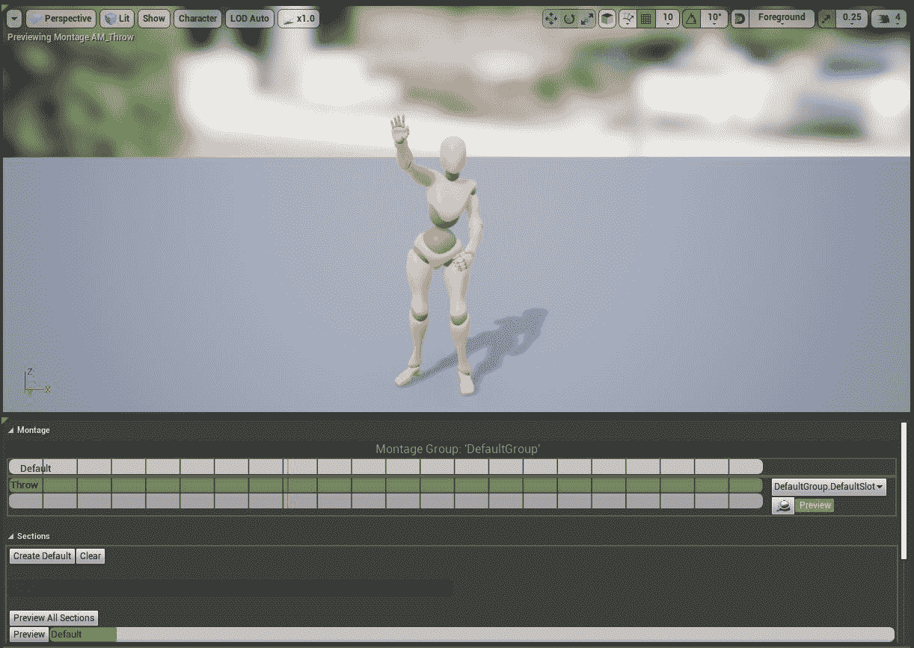

图 12.7：玩家角色开始动画

现在`投掷`动画已经添加到动画蒙太奇中，您可以继续创建`动画槽`。

`动画槽管理器`选项卡应该停靠在右侧的`资产浏览器`选项卡旁边。如果您看不到`动画槽管理器`选项卡，可以通过导航到顶部`动画蒙太奇`编辑器窗口的工具栏中的`窗口`选项卡来访问它。在那里，*左键单击*选择`动画槽管理器`选项，窗口将出现。

完成此练习后，您已经将`投掷`动画添加到了新的动画蒙太奇中，并且可以回放动画，以预览它在`Persona`编辑器中的外观。

现在，您可以继续学习有关动画槽和`动画槽管理器`的知识，然后在本章后面的部分中添加自己独特的动画槽，以便用于动画混合。

# 动画槽管理器

`动画槽管理器`是您管理`动画槽`的地方，正如其名称所示。从该选项卡中，您可以通过*左键单击*`添加组`选项创建新的`组`，并将其标记为`Face`，以向其他人说明该组中的槽影响角色的面部。默认情况下，虚幻引擎为您提供了一个名为`DefaultGroup`的`组`和一个名为`DefaultSlot`的`动画槽`，该槽位于该组中。

让我们创建一个新的动画槽。

## 练习 12.03：添加新的动画槽

现在您对动画槽和`动画槽管理器`有了更好的理解，您可以按照以下步骤创建一个名为`上半身`的新动画槽。创建了这个新槽后，它可以在动画蓝图中使用和引用，以处理动画混合，这将在以后的练习中进行。

让我们通过以下步骤创建动画槽：

1.  在`动画槽管理器`中，*左键单击*`添加槽`选项。

1.  在添加新槽时，虚幻将要求您给这个`动画槽`命名。将此槽命名为`上半身`。动画槽的命名很重要，就像命名其他任何资产和参数一样，因为您稍后将在动画蓝图中引用此槽。

创建了动画槽后，现在可以更新用于`投掷`蒙太奇的槽。

1.  在`Montage`部分，有一个下拉菜单显示应用的`动画槽`；默认情况下，它设置为`DefaultGroup.DefaultSlot`。*左键单击*，然后从下拉菜单中选择`DefaultGroup.Upper Body`：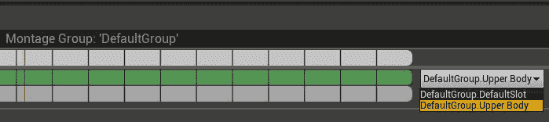

图 12.8：新的动画槽将出现在下拉列表中

注意

更改`动画槽`后，您可能会注意到玩家角色停止动画并返回到 T 形状。不用担心-如果发生这种情况，只需关闭`动画蒙太奇`，然后重新打开它。重新打开后，角色将再次播放`投掷`动画。

创建了您的`动画槽`并放置在`投掷`蒙太奇中后，现在是时候更新动画蓝图，以便玩家角色意识到这个槽，并根据它正确地进行动画。

1.  导航到`/MainCharacter/Blueprints/`目录中的`AnimBP_SuperSideScroller_MainCharacter`资产。

1.  通过*双击*打开此资产并打开`动画图`。

完成此练习后，您已经使用`动画槽管理器`在动画蒙太奇中创建了您的第一个动画槽。有了这个槽，现在可以在玩家角色动画蓝图中使用和引用它，以处理在上一章中实现的`投掷`动画和移动动画之间所需的动画混合。在执行此操作之前，您需要了解有关动画蓝图中`保存缓存姿势`节点的更多信息。

# 保存缓存姿势

在处理复杂动画和角色时，有时需要在多个地方引用状态机输出的姿势。如果你还没有注意到，你的`Movement`状态机的输出姿势不能连接到多个其他节点。这就是`Save Cached Pose`节点派上用场的地方；它允许你缓存或存储一个姿势，然后可以在多个地方引用。你需要使用它来设置上半身动画的新 Anim Slot。

让我们开始吧。

## 练习 12.04：保存 Movement 状态机的缓存姿势

为了有效地混合使用上一练习中创建的`Upper Body Anim Slot`和已经存在的玩家角色的移动动画的`Throw`动画，你需要能够在动画蓝图中引用`Movement`状态机。为了实现这一点，按照以下步骤在动画蓝图中实现`Save Cached Pose`节点：

1.  在`Anim Graph`中，*右键单击*并搜索`New Save Cached Pose`。将其命名为`Movement Cache`：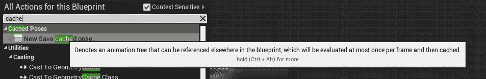

图 12.9：姿势将在每帧评估一次，然后被缓存

1.  现在，不要直接将你的`Movement`状态机连接到输出姿势，而是连接到缓存节点：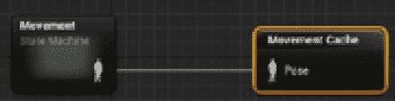

图 12.10：Movement 状态机正在被缓存

1.  使用缓存的`Movement`状态机姿势，现在你只需要引用它。这可以通过搜索“使用缓存的姿势”节点来实现。

注意

所有缓存的姿势都会显示在上下文敏感菜单中。只需确保选择你在*步骤 1*中给它的名字的缓存姿势。

1.  有了缓存姿势节点后，将其连接到`AnimGraph`的`Output Pose`：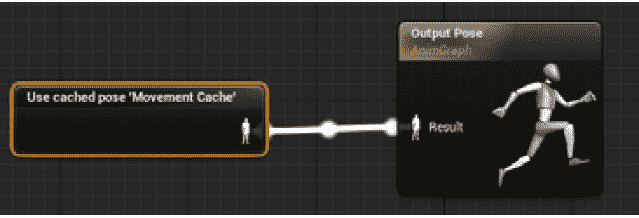

图 12.11：这与将 Movement 状态机直接连接到输出姿势相同

在*步骤 4*之后，你会注意到主角在最后一章之后会正确地进行动画并移动。这证明了`Movement`状态机的缓存正在工作。下面的图片显示了玩家角色在动画蓝图的预览窗口中回到了`Idle`动画。

现在，`Movement`状态机的缓存工作正常，你将使用这个缓存来通过骨骼上的`Anim Slot`混合动画：

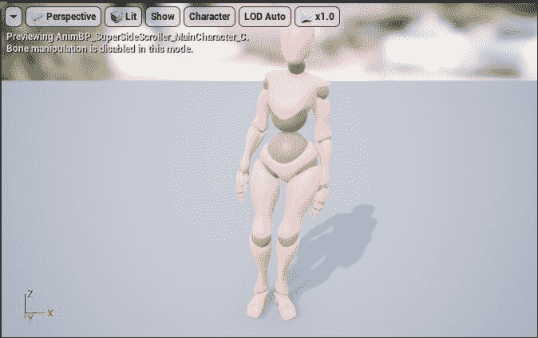

图 12.12：主角正在按预期进行动画

完成这个练习后，你现在可以在动画蓝图中任何你想要的地方引用缓存的`Movement`状态机姿势。有了这个便利，你现在可以使用缓存的姿势开始在缓存的移动姿势和`Upper Body` Anim Slot 之间进行混合，使用一个叫做`Layered blend per bone`的函数。

# Layered blend per bone

你将在这里使用的节点是`Layered blend per bone`。这个节点可以屏蔽角色骨骼上的一组骨骼，使动画忽略这些骨骼。

对于我们的玩家角色和`Throw`动画，你将屏蔽下半身，以便只有上半身进行动画。目标是能够同时执行投掷和移动动画，并使这些动画混合在一起；否则，当你执行投掷时，移动动画会完全中断。

## 练习 12.05：使用上半身 Anim Slot 混合动画

“每个骨骼的分层混合”功能允许我们将“投掷”动画与您在上一章中实现的移动动画混合，并控制“投掷”动画对玩家角色骨骼的影响程度。

在这个练习中，您将使用“每个骨骼的分层混合”功能完全屏蔽角色的下半身，当播放“投掷”动画时，以便它不会影响角色下半身的移动动画。

让我们从添加“每个骨骼的分层混合”节点开始，并讨论其输入参数和设置：

1.  在动画蓝图中，*右键单击*并在“上下文敏感”搜索中搜索“每个骨骼的分层混合”。

*图 12.13*显示了“每个骨骼的分层混合”节点及其参数。

+   第一个参数“基础姿势”是角色的基础姿势；在这种情况下，“移动”状态机的缓存姿势将是基础姿势。

+   第二个参数是您想要在“基础姿势”上叠加的“混合姿势 0”节点；请记住，选择“添加引脚”将创建额外的“混合姿势”和“混合权重”参数。现在，您只会使用一个“混合姿势”节点。

+   最后一个参数是“混合权重”，它是“混合姿势”对“基础姿势”的影响程度，范围从`0.0`到`1.0`作为 alpha 值：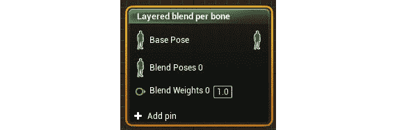

图 12.13：每个骨骼的分层混合节点

在连接任何内容到此节点之前，您需要向其属性中添加一个层。

1.  *左键单击*选择节点并导航到“详细信息”。您需要*左键单击*“层设置”旁边的箭头，以找到此设置的第一个索引`0`。*左键单击*“分支过滤器”旁边的`+`以创建新的过滤器。

这里再次有两个参数，即以下参数：

+   “骨骼名称”：指定混合将发生的骨骼，并确定被屏蔽的骨骼的子层次结构。在本项目的主角骨架中，将“骨骼名称”设置为“脊柱”。*图 12.14*显示了“脊柱”骨及其子骨与主角的下半身不相关联。这可以在“骨架”资产`MainCharacter_Skeleton`中看到：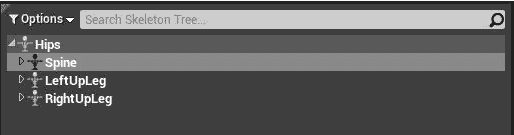

图 12.14：脊柱骨及其子骨与主角的上半身相关联

+   “混合深度”：骨骼及其子骨受动画影响的深度。值为`0`将不会影响所选骨骼的根子骨。

+   “网格空间旋转混合”：确定是否在“网格空间”或“本地空间”中混合骨骼旋转。“网格空间”旋转是指骨架网格的边界框作为其基本旋转，而“本地空间”旋转是指所讨论的骨骼名称的局部旋转。在这种情况下，我们希望旋转混合发生在网格空间中，因此我们将将此参数设置为 true。

混合传播到骨骼的所有子骨，以停止在特定骨骼上的混合，将它们添加到数组中，并将它们的混合深度值设为`0`。最终结果如下：

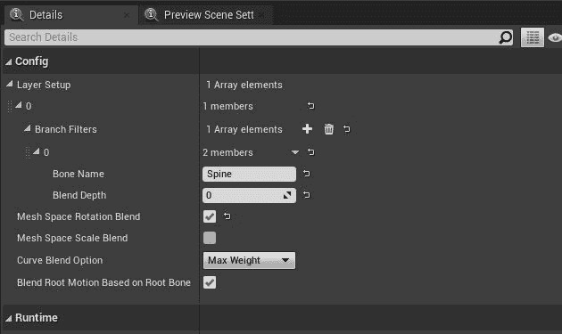

图 12.15：您可以使用一个混合节点设置多个层

1.  在“每个骨骼的分层混合”节点上设置好参数后，您可以将“移动缓存”缓存姿势连接到分层混合的“基础姿势”节点。确保将“每个骨骼的分层混合”节点的输出连接到动画蓝图的“输出姿势”：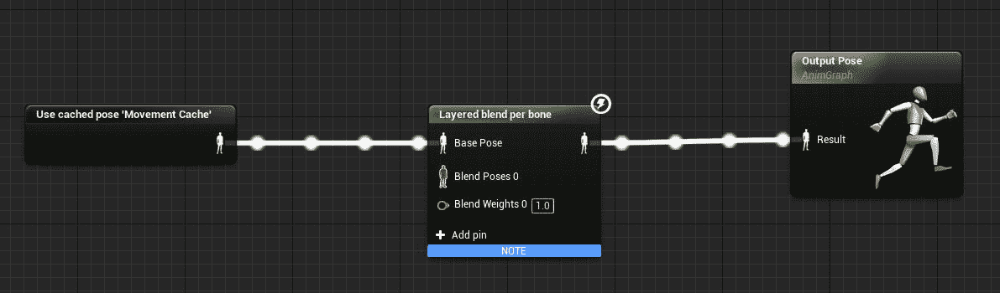

图 12.16：将移动状态机的缓存姿势添加到每个骨骼的分层混合节点

现在是时候使用您之前创建的 Anim Slot，通过`Layered blend per bone`节点仅过滤使用此插槽的动画了。

1.  在`AnimGraph`中*右键单击*，搜索`DefaultSlot`。*左键单击*选择`Slot`节点并导航到`Details`。在那里，您会找到`Slot Name`属性。*左键单击*此下拉菜单，找到并选择`DefaultGroup.Upper Body`插槽。

在更改`Slot Name`属性时，`Slot`节点将更新以表示这个新名称。`Slot`节点需要一个源姿势，这将再次是对`Movement`状态机的引用。这意味着您需要为`Movement Cache`姿势创建另一个`Use Cached Pose`节点。

1.  将缓存的姿势连接到`Slot`节点的源：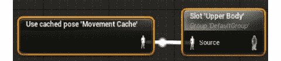

图 12.17：通过 Anim Slot 过滤缓存的 Movement 姿势

1.  现在剩下的就是将`Upper Body`插槽节点连接到`Blend Pose 0`输入。然后，将`Layered blend per bone`的最终姿势连接到`Output Pose`动画蓝图的结果：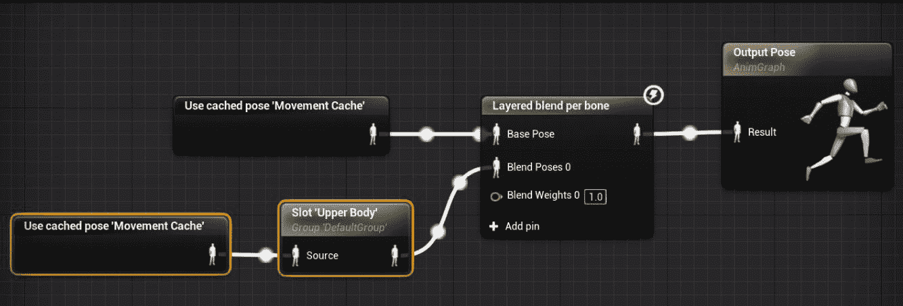

图 12.18：主角动画蓝图的最终设置

在主角动画蓝图中放置了 Anim Slot 和`Layered blend per bone`节点后，您终于完成了主角的动画部分。

接下来，让我们简要讨论一下“投掷”动画的动画混合的重要性以及“投掷”动画将用于什么，然后再继续*练习 12.06*，在那里您将在游戏中预览“投掷”动画。

# 投掷动画

到目前为止，您已经投入了大量的工作，以确保“投掷”动画与之前章节中在动画蓝图中设置的“移动”动画正确融合。这一努力的主要原因是确保角色在执行多个动画时的视觉保真度。在接下来的练习和活动中，您将亲身体会到错误设置动画混合的视觉后果。

回到“投掷”动画，每款现代视频游戏都以某种形式实现动画混合，只要美术指导和游戏机制需要这样的功能。一个极好地运用动画的现代游戏系列的例子是由*Naughty Dog*开发的*Uncharted*系列。

如果您对这个系列不熟悉，您可以在这里观看最新版本的完整游戏玩法：[`www.youtube.com/watch?v=5evF_funE8A`](https://www.youtube.com/watch?v=5evF_funE8A)。

*Uncharted*系列非常擅长使用成千上万的动画和混合技术，为玩家角色带来令人难以置信的*真实感*、*重量感*和*动感*，让您在玩游戏时感觉非常良好。虽然*Super SideScroller*项目不会像这样精致，但您正在学习制作视频游戏中不可思议动画所需的基础知识：

## 练习 12.06：预览投掷动画

在上一个练习中，您做了很多工作，通过使用`Save Cached Pose`和`Layered blend per bone`节点，允许玩家角色的`Movement`动画和`Throw`动画之间进行动画混合。执行以下步骤，在游戏中预览`Throw`动画，并看到您劳动的成果：

1.  导航到`/MainCharacter/Blueprints/`目录，并打开角色的`BP_SuperSideScroller_MainCharacter`蓝图。

1.  如果您还记得，在上一章中，您为投掷创建了名为`ThrowProjectile`的`Input Action`。

1.  在角色蓝图的“事件图”中，*右键单击*并在“上下文敏感”下拉搜索中搜索`ThrowProjectile`。用*左键单击*选择它，在图表中创建事件节点。

有了这个事件，您需要一个函数，允许您在玩家使用*左鼠标按钮*投掷时播放“动画蒙太奇”。

1.  *右键单击*在“事件图”中搜索`Play Montage`。确保不要将其与类似的函数`Play Anim Montage`混淆。

`Play Montage`函数需要两个重要的输入：

+   `Montage to Play`

+   “在骨骼网格组件”

让我们首先处理“骨骼网格组件”。

1.  玩家角色有一个“骨骼网格组件”，可以在标记为“网格”的组件选项卡中找到。左键单击并拖动一个`Get`引用到这个变量，并将其连接到此函数的`In Skeletal Mesh Component`输入：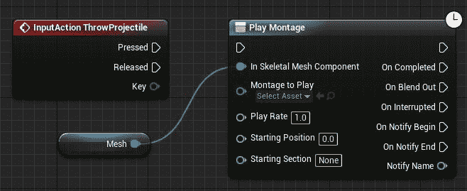

图 12.19：玩家角色的网格连接到 In Skeletal Mesh Component 输入

现在要做的最后一件事是告诉这个函数播放哪个蒙太奇。幸运的是，这个项目中只有一个蒙太奇存在：`AM_Throw`。

1.  在`Montage to Play`输入下的下拉菜单上*左键单击*，然后*左键单击*选择`AM_Throw`。

1.  最后，将`ThrowProjectile`事件的`Pressed`执行输出连接到`Play Montage`函数的执行输入引脚：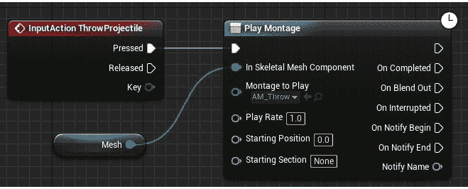

图 12.20：当玩家按下 ThrowProjectile 输入动作时，将播放 AM_Throw 蒙太奇

1.  现在，当您点击*左鼠标按钮*时，玩家角色将播放投掷“动画蒙太奇”。

现在注意一下，您可以同时行走和奔跑，同时投掷，每个动画都会混合在一起，不会相互干扰：

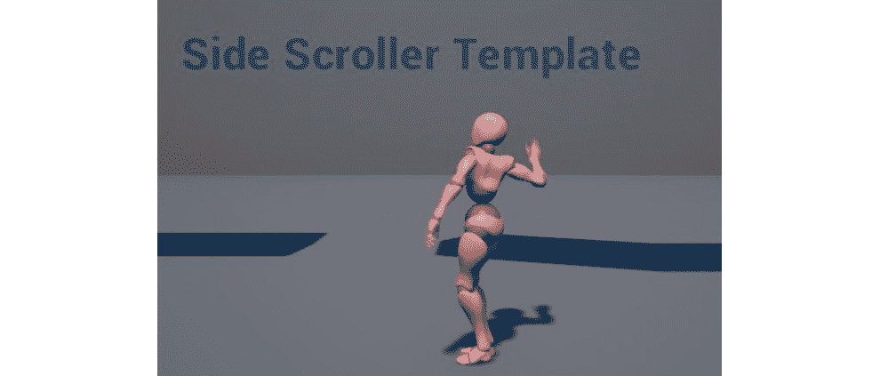

图 12.21：玩家角色现在可以移动和投掷

不要担心重复使用*左鼠标按钮*动作播放`Throw`蒙太奇时可能出现的任何错误；在后面的章节中，当您实现将要投掷的抛射物时，这些问题将得到解决。现在，您只想知道在`Anim Slot`和`Animation Blueprint`上所做的工作是否能够实现所需的动画混合结果。

让我们继续通过现在创建 C++类、蓝图和材质来设置敌人，以便在下一章中使用。

# 超级横向卷轴游戏敌人

当玩家角色在移动和执行`Throw`动画时正确播放动画时，现在是时候谈论`SuperSideScroller`游戏将呈现的敌人类型了。我们将有一个简单类型的敌人。

这个敌人将有一个基本的来回移动模式，不支持任何攻击；只有与玩家角色碰撞时才能造成伤害。

在下一个练习中，您将为第一种敌人类型设置基础敌人类的 C++，并配置敌人的蓝图和动画蓝图，为*第十三章*“敌人人工智能”做准备，在那里您将实现这个敌人的人工智能。为了效率和时间考虑，您将使用 Unreal Engine 4 在`SideScroller`模板中已经提供的资产用于敌人。这意味着您将使用默认人偶资产的骨架、骨骼网格、动画和动画蓝图。让我们开始创建第一个敌人类。

## 练习 12.07：创建敌人基础 C++类

本练习的目标是从头开始创建一个新的敌人类，并在 *第十三章* *敌人人工智能* 中准备好使用敌人。首先，按照以下步骤在 C++ 中创建一个新的敌人类：

1.  在编辑器中，导航到 `文件` 并选择 `新建 C++ 类` 来开始创建新的敌人类。

1.  接下来，请确保在尝试搜索类之前，检查 `选择父类` 窗口提示的顶部的 `显示所有类` 复选框。然后，搜索 `SuperSideScrollerCharacter` 并 *左键单击* 选择它作为父类。

1.  最后，您需要给这个类起一个名字并选择一个目录。将这个类命名为 `EnemyBase`，并不要更改目录路径。准备好后，*左键单击* `Create Class` 按钮，让虚幻引擎为您创建新的类。

当您创建一个新类时，虚幻引擎会自动为您打开 Visual Studio，并准备好 `.cpp` 和 `.h` 文件。目前，您不会对代码进行任何更改，因此关闭 Visual Studio。

让我们为敌人资产在内容浏览器中创建文件夹结构。接下来。

1.  回到虚幻引擎 4 编辑器，导航到内容浏览器，并创建一个名为 `Enemy` 的新文件夹：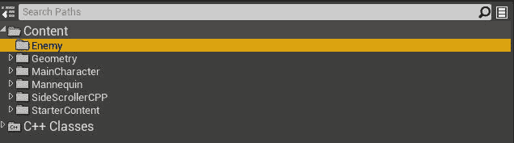

图 12.22：通过右键单击现有文件夹并选择新文件夹来创建新文件夹

1.  在 `Enemy` 文件夹中，创建另一个名为 `Blueprints` 的文件夹，您将在其中创建并保存敌人的蓝图资产。

1.  在 `/Enemy/Blueprints` 目录中，*右键单击* 并选择 `蓝图类`。从 `选择父类` 中搜索您刚刚创建的新 C++ 类 `EnemyBase`，如图所示：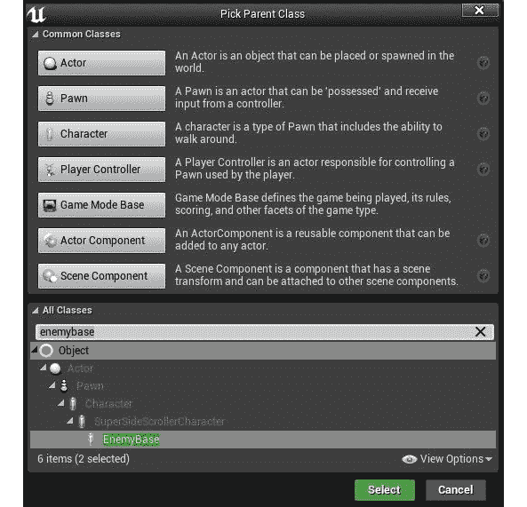

图 12.23：现在，新的 EnemyBase 类可供您创建蓝图

1.  将其命名为 `BP_Enemy`。

现在，您已经使用 `EnemyBase` 类作为父类为第一个敌人创建了 `蓝图`，是时候处理 `动画蓝图` 了。您将使用虚幻引擎在 `SideScroller` 模板项目中提供给您的默认 `动画蓝图`。按照下一个练习中的步骤创建现有 `动画蓝图` 的副本并将其移动到 `/Enemy/Blueprints` 目录。

## 练习 12.08：创建和应用敌人动画蓝图

在上一个练习中，您创建了使用 `EnemyBase` 类作为父类的第一个敌人的 `蓝图`。在这个练习中，您将处理动画蓝图。

以下步骤将帮助您完成此练习：

1.  导航到 `/Mannequin/Animations` 目录，并找到 `ThirdPerson_AnimBP` 资产。

1.  现在，复制 `ThirdPerson_AnimBP` 资产。有两种方法可以复制资产：

+   在内容浏览器中选择所需的资产，然后按 *CTRL* + *W*。

+   在内容浏览器中 *右键单击* 所需的资产，然后从下拉菜单中选择 `复制`。

1.  现在，*左键单击* 并拖动此重复的资产到 `/Enemy/Blueprints` 目录，并在释放 *左键单击* 鼠标按钮时选择移动选项。

1.  将此重复的资产命名为 `AnimBP_Enemy`。最好创建一个资产的副本，以便稍后根据需要进行修改，而不会影响原始资产的功能：

敌人 `蓝图` 和 `动画蓝图` 创建完成后，现在是时候更新敌人蓝图，以使用默认的 `骨骼网格` 人体模型和新的 `动画蓝图` 副本了。

1.  导航到 `/Enemy/Blueprints` 并打开 `BP_Enemy`。

1.  接下来，导航到 `Mesh` 组件并选择它以访问其 `详细信息` 面板。首先，将 `SK_Mannequin` 分配给 `骨骼网格` 参数，如图所示：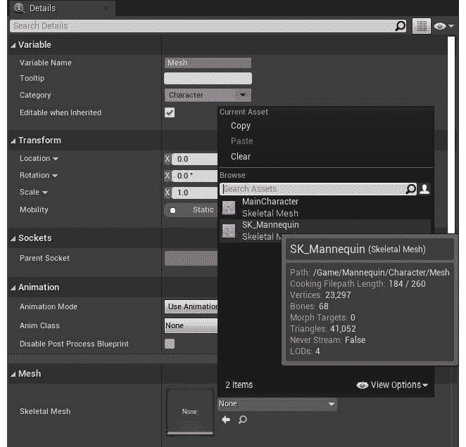

图 12.24：您将使用默认的 SK_Mannequin 骨骼网格作为新敌人的角色

1.  现在，您需要将“AnimBP_Enemy 动画蓝图”应用到`Mesh`组件上。导航到`Mesh`组件的“详细信息”面板的“动画”类别，在“动画类”下，分配`AnimBP_Enemy`：

图 12.25：将新的 AnimBP_Enemy 动画蓝图分配为敌人角色的动画类

1.  最后，当在“预览”窗口中预览角色时，您会注意到角色网格的位置和旋转不正确。通过将`Mesh`组件的“变换”属性设置为以下内容来修复这个问题：

+   “位置”：（`X`=`0.000000`，`Y`=`0.000000`，`Z`=`-90.000000`）

+   “旋转”：（Roll=`0.000000`，Pitch=`0`，Yaw=`-90.000000`）

+   “缩放”：（`X`=`1.000000`，`one`=`1.000000`，`Z`=`1.000000`）

“变换”设置将如下所示：

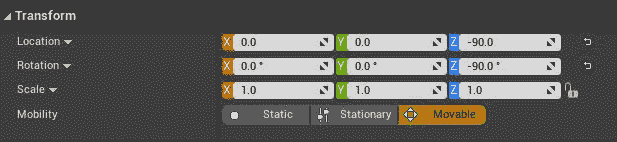

图 12.26：这些是变换设置，以便您的角色被正确定位和旋转

以下图显示了迄今为止`Mesh`组件的设置。请确保您的设置与此处显示的相匹配：

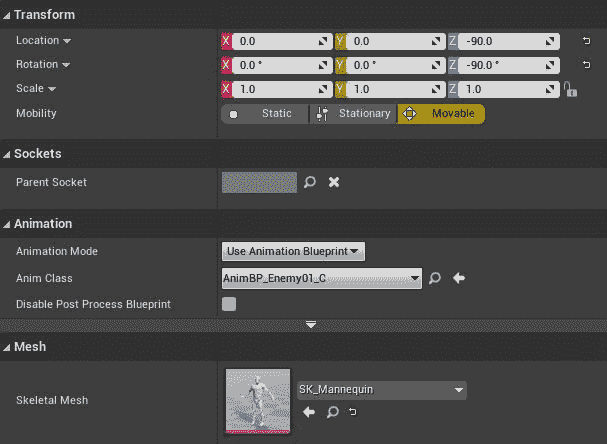

图 12.27：敌人角色的 Mesh 组件设置

这里要做的最后一件事是创建人体模型主要材质的“材质实例”，以便这个敌人可以拥有一个独特的颜色，有助于将其与其他敌人类型区分开来。

让我们首先了解更多关于材质和“材质实例”的知识。

# 材质和材质实例

在继续下一个练习之前，我们需要先简要讨论一下材质和“材质实例”是什么，然后您才能使用这些资产并将它们应用到新的敌人角色上。尽管本书更加关注使用虚幻引擎 4 进行游戏开发的技术方面，但您仍然需要知道材质和“材质实例”是什么以及它们在视频游戏中的使用方式。

注意

有关材质的更多信息，请参考以下 Epic Games 文档：[`docs.unrealengine.com/en-US/Engine/Rendering/Materials/index.html`](https://docs.unrealengine.com/en-US/Engine/Rendering/Materials/index.html)。

材质是一种可以应用于网格的资产类型，然后控制网格在游戏中的外观的资产。 “材质”编辑器让您控制最终视觉结果的许多部分，包括对“纹理”、“自发光”和“高光”等参数的控制。以下图显示了应用了`M_UE4Man_Body`材质的默认人体模型骨骼网格：

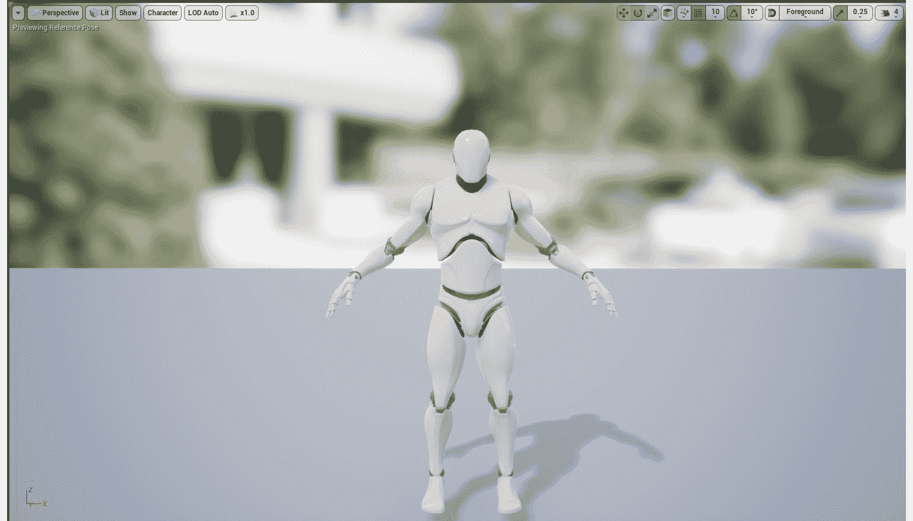

图 12.28：默认的人体模型骨骼网格应用了基本材质

“材质实例”是“材质”的扩展，您无法访问或控制“材质实例”派生的基本“材质”，但您可以控制“材质”创建者向您公开的参数。许多参数可以从“材质实例”内部向您公开以供使用。

Unreal Engine 在“侧向滚动”模板项目中为我们提供了一个`Material Instance`的示例，名为`M_UE4Man_ChestLogo`，位于`/Mannequin/Character/Materials/`目录中。以下图片显示了基于父材质`M_UE4Man_Body`给`Material Instance`提供的一组暴露参数。要重点关注的最重要的参数是名为`BodyColor`的`Vector`参数。您将在下一个练习中使用这个参数来为敌人角色提供独特的颜色：

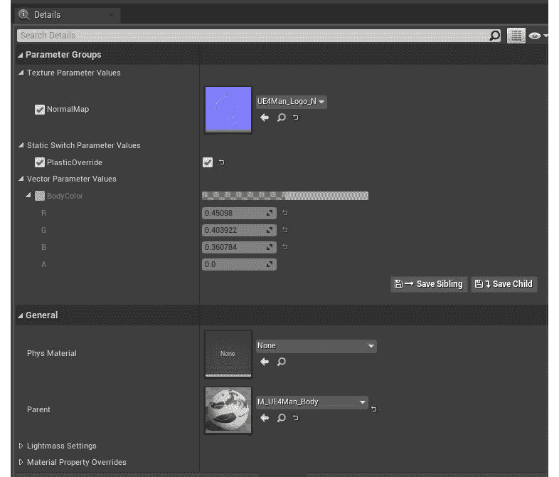

图 12.29：M_UE4Man_ChestLogo Material Instance 资产的参数列表

## 练习 12.09：创建并应用敌人材质实例

现在您已经基本了解了材质和材质实例是什么，是时候从`M_UE4ManBody`资产创建您自己的`Material Instance`了。通过这个`Material Instance`，您将调整`BodyColor`参数，为敌人角色提供独特的视觉表现。让我们从创建新的`Material Instance`开始。

以下步骤将帮助您完成此练习：

1.  导航到`/Mannequin/Character/Materials`目录，找到默认人体模型角色`M_UE4ManBody`使用的“材质”。

1.  可以通过*右键单击*“材质”资产`M_UE4Man_Body`，然后*左键单击*“创建材质实例”选项来创建`Material Instance`。将此资产命名为`MI_Enemy01`。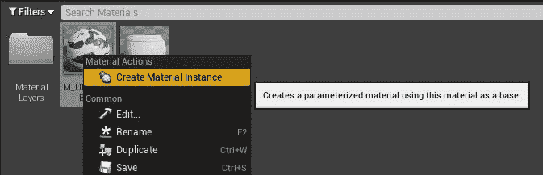

图 12.30：任何材质都可以用来创建材质实例

在`Enemy`文件夹中创建一个名为`Materials`的新文件夹。*左键单击*并将`Material Instance`拖放到`/Enemy/Materials`目录中，将资产移动到这个新文件夹中：

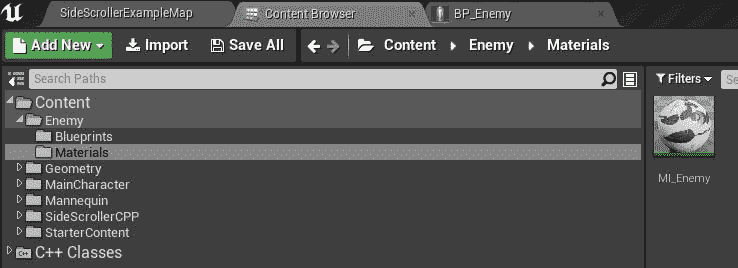

图 12.31：重命名 Material Instance MI_Enemy

1.  双击`Material Instance`，在左侧找到`Details`面板。在那里，您会找到一个名为`BodyColor`的`Vector Parameter`属性。确保复选框被选中以启用此参数，然后将其值更改为红色。现在，`Material Instance`应该呈现红色，如图所示：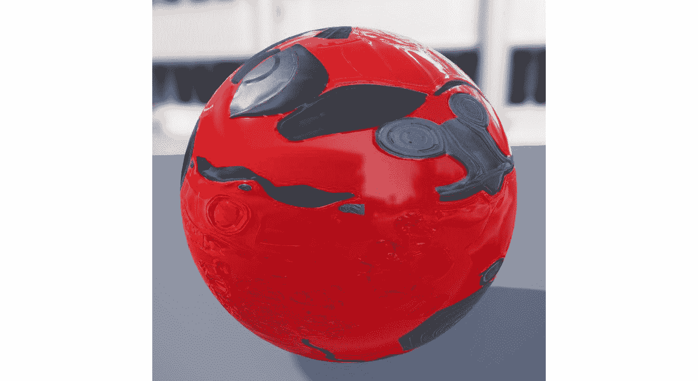

图 12.32：现在，敌人的材质是红色

1.  保存`Material Instance`资产，并导航回`BP_Enemy01`蓝图。选择`Mesh`组件，并更新“元素 0”材料参数为`MI_Enemy`：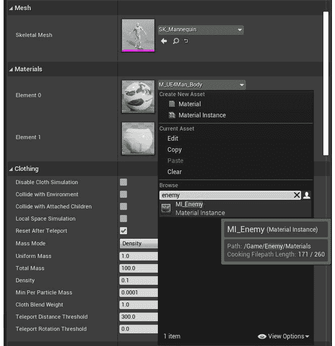

图 12.33：将新的 Material Instance 资产 MI_Enemy 分配给 Mesh 组件的材料的元素 0

1.  现在，第一种敌人类型在视觉上已经准备就绪，并且已经准备好适用于下一章的 AI 的适当的`Blueprint`和动画蓝图资产：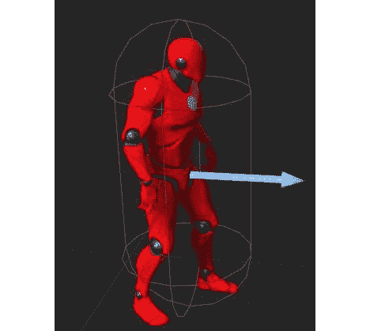

图 12.34：最终敌人角色设置

完成此练习后，您现在已经创建了一个`Material Instance`并将其应用于敌人角色，使其具有独特的视觉表现。

让我们通过进行一个简短的活动来结束本章，这将帮助您更好地理解使用`Layered blend per bone`节点来混合动画，这是在之前的练习中使用的。

## 活动 12.01：更新混合权重

在“练习 12.06”结束时，“预览投掷动画”，您能够混合移动动画和“投掷”动画，以便它们可以同时播放而不会对彼此产生负面影响。结果是玩家角色在行走或奔跑时能够正确执行动画，同时在上半身执行“投掷”动画。

在这个活动中，您将尝试使用`Layered blend per bone`节点的混合偏差值和参数，以更好地理解动画混合的工作原理。

以下步骤将帮助您完成此活动：

1.  更新`Layered blend per bone`节点的`Blend Weights`输入参数，以确保`Throw`动画的附加姿势与基础移动姿势完全不混合。尝试在这里使用值，如`0.0f`和`0.5f`，以比较动画中的差异。

注意

确保在完成后将此值返回为`1.0f`，以免影响您在上一个练习中设置的混合。

1.  更新`Layered blend per bone`节点的设置，以更改受混合影响的骨骼，以便整个角色的身体都受到混合的影响。从`MainCharacter_Skeleton`资产的骨骼层次结构中的根骨骼开始是个好主意。

1.  保持上一步的设置不变，向分支过滤器添加一个新的数组元素，并在这个新的数组元素中，添加骨骼名称和混合深度值“-1.0f”，这样只有角色的左腿在混合 Throw 动画时才能继续正确地播放移动动画。

注意

完成此活动后，请确保将`Layered blend per bone`节点的设置返回到第一个练习结束时设置的值，以确保角色动画不会丢失任何进展。

预期输出如下：

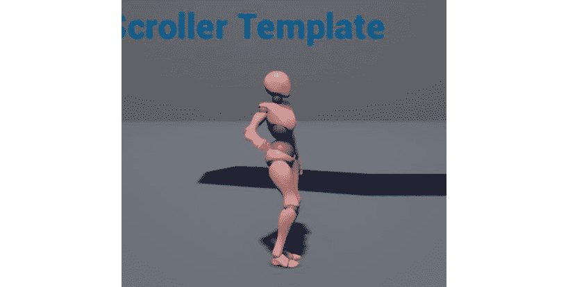

图 12.35：显示整个角色身体受影响的输出

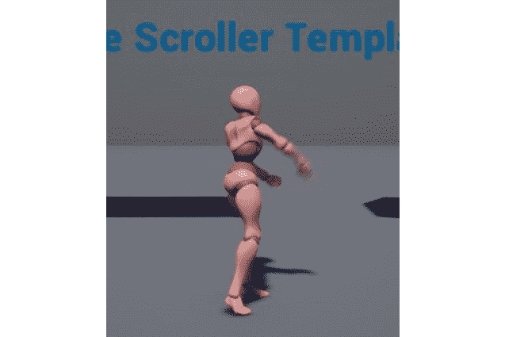

图 12.36：当混合 Throw 动画时，左腿继续正确地播放移动动画

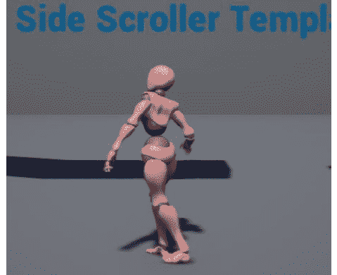

图 12.37：角色的右腿在移动时播放 Throw 动画的结尾

注意

此活动的解决方案可在以下链接找到：[`packt.live/338jEBx`](https://packt.live/338jEBx)。

在结束本活动之前，请将`Layered blend per bone`设置返回到*练习 12.05*“使用上半身动画插槽混合动画”的最后设置的值。如果您不将这些值恢复到原始设置，那么下一章节中即将进行的练习和活动中的动画结果将不同。您可以手动设置回原始值，或者参考以下链接中具有这些设置的文件：[`packt.live/2GKGMxM`](https://packt.live/2GKGMxM)。

完成此活动后，您现在对动画混合的工作原理和混合权重如何影响`Layered blend per bone`节点上的附加姿势对基础姿势的影响有了更深入的理解。

注意

在这个项目中，您还没有使用许多动画混合技术，强烈建议您研究这些技术，首先查看[`docs.unrealengine.com/en-US/Engine/Animation/AnimationBlending/index.html`](https://docs.unrealengine.com/en-US/Engine/Animation/AnimationBlending/index.html)上的文档。

# 总结

通过使用 C++类、蓝图和材质设置敌人，您已经准备好进入下一章节，在那里您将利用虚幻引擎 4 中的行为树等系统为这个敌人创建 AI。

从本章的练习和活动中，您学会了如何创建一个“动画蒙太奇”，允许播放动画。您还学会了如何在这个蒙太奇中设置一个动画插槽，以便为玩家角色的上半身进行分类。

接下来，您将学习如何使用“使用缓存姿势”节点来缓存状态机的输出姿势，以便在更复杂的动画蓝图中可以引用这个姿势的多个实例。然后，通过学习“每骨层混合”功能，您可以使用动画插槽将基本移动姿势与“投掷”动画的附加层进行混合。

最后，您将通过创建 C++类、蓝图和其他资产来组建敌人的基础，以便为下一章做好准备。敌人准备就绪后，让我们继续创建敌人的人工智能，以便它可以与玩家进行互动。
