# 13. 敌人人工智能

概述

本章以简要回顾《超级横向卷轴》游戏中敌人人工智能的行为方式开始。然后，你将学习虚幻引擎 4 中的控制器，并学习如何创建一个 AI 控制器。接着，你将学习如何通过在游戏的主要关卡中添加导航网格来更多地了解虚幻引擎 4 中的 AI 导航。

通过本章的学习，你将能够创建一个敌人可以移动的可导航空间。你还将能够创建一个敌人 AI 角色，并使用黑板和行为树在不同位置之间导航。最后，你将学会如何创建和实现一个玩家投射物类，并为其添加视觉元素。

# 介绍

在上一章中，你使用了动画混合、动画插槽、动画蓝图和混合函数（如每骨层混合）为玩家角色添加了分层动画。

在本章中，你将学习如何使用导航网格在游戏世界内创建一个可导航的空间，使敌人可以在其中移动。定义关卡的可导航空间对于允许人工智能访问和移动到关卡的特定区域至关重要。

接下来，你将创建一个敌人 AI 角色，使用虚幻引擎 4 中的*黑板*和*行为树*等 AI 工具在游戏世界内的巡逻点位置之间导航。

你还将学习如何使用导航网格在游戏世界内创建一个可导航的空间，使敌人可以在其中移动。定义关卡的可导航空间对于允许 AI 访问和移动到关卡的特定区域至关重要。

最后，你将学习如何在 C++中创建一个玩家投射物类，以及如何实现`OnHit()`碰撞事件函数来识别并记录投射物击中游戏世界中的物体。除了创建类之外，你还将创建这个玩家投射物类的蓝图，并为玩家投射物添加视觉元素，如静态网格。

《超级横向卷轴》游戏终于要完成了，通过本章的学习，你将在很好的位置上，可以继续学习*第十四章*《生成玩家投射物》，在那里你将处理游戏的一些细节，如音效和视觉效果。

本章的主要重点是使用人工智能使你在*第十二章*《动画混合和蒙太奇》中创建的 C++敌人类活灵活现。虚幻引擎 4 使用许多不同的工具来实现人工智能，如 AI 控制器、黑板和行为树，你将在本章中学习并使用这些工具。在你深入了解这些系统之前，让我们花一点时间了解近年来游戏中人工智能的使用方式。自从《超级马里奥兄弟》以来，人工智能显然已经发展了许多。

# 敌人人工智能

什么是人工智能？这个术语可以有很多不同的含义，取决于它所用于的领域和背景，因此让我们以一种对视频游戏主题有意义的方式来定义它。

**AI**是一个意识到自己环境并做出选择以最优化地实现其预期目的的实体。AI 使用所谓的**有限状态机**根据其从用户或环境接收到的输入切换多个状态之间。例如，视频游戏中的 AI 可以根据其当前的健康状态在攻击状态和防御状态之间切换。

在《你好邻居》和《异形：孤立》等游戏中，AI 的目标是尽可能高效地找到玩家，同时也遵循开发者定义的一些预定模式，以确保玩家可以智胜。《你好邻居》通过让 AI 从玩家过去的行为中学习并试图根据所学知识智胜玩家，为其 AI 添加了一个非常有创意的元素。

您可以在游戏发布商*TinyBuild Games*的视频中找到有关 AI 如何工作的信息：[`www.youtube.com/watch?v=Hu7Z52RaBGk`](https://www.youtube.com/watch?v=Hu7Z52RaBGk)。

有趣和有趣的 AI 对于任何游戏都至关重要，取决于您正在制作的游戏，这可能意味着非常复杂或非常简单的 AI。您将为`SuperSideScroller`游戏创建的 AI 不会像之前提到的那些那样复杂，但它将满足我们希望创建的游戏的需求。

让我们来分析一下敌人的行为方式：

+   敌人将是一个非常简单的敌人，具有基本的来回移动模式，不会支持任何攻击；只有与玩家角色碰撞，它们才能造成伤害。

+   然而，我们需要设置敌人 AI 要移动的位置。

+   接下来，我们决定 AI 是否应该改变位置，是否应该在不同位置之间不断移动，或者在选择新位置移动之间是否应该有暂停？

幸运的是，对于我们来说，虚幻引擎 4 为我们提供了一系列工具，我们可以使用这些工具来开发复杂的 AI。然而，在我们的项目中，我们将使用这些工具来创建一个简单的敌人类型。让我们首先讨论一下虚幻引擎 4 中的 AI 控制器是什么。

# AI 控制器

让我们讨论**玩家控制器**和**AI 控制器**之间的主要区别是什么。这两个角色都是从基本的**Controller 类**派生出来的，控制器用于控制一个**Pawn**或**Character**的行动。

玩家控制器依赖于实际玩家的输入，而 AI 控制器则将 AI 应用于他们所拥有的角色，并根据 AI 设置的规则对环境做出响应。通过这样做，AI 可以根据玩家和其他外部因素做出智能决策，而无需实际玩家明确告诉它这样做。多个相同的 AI pawn 实例可以共享相同的 AI 控制器，并且相同的 AI 控制器可以用于不同的 AI pawn 类。像虚幻引擎 4 中的所有角色一样，AI 是通过`UWorld`类生成的。

注意

您将在*第十四章*“生成玩家投射物”中了解更多关于`UWorld`类的信息，但作为参考，请在这里阅读更多：[`docs.unrealengine.com/en-US/API/Runtime/Engine/Engine/UWorld/index.html`](https://docs.unrealengine.com/en-US/API/Runtime/Engine/Engine/UWorld/index.html)。

玩家控制器和 AI 控制器的最重要的方面是它们将控制的 pawns。让我们更多地了解 AI 控制器如何处理这一点。

## 自动拥有 AI

像所有控制器一样，AI 控制器必须拥有一个*pawn*。在 C++中，您可以使用以下函数来拥有一个 pawn：

```cpp
void AController::Possess(APawn* InPawn)
```

您还可以使用以下功能取消拥有一个 pawn：

```cpp
void AController::UnPossess()
```

还有`void AController::OnPossess(APawn* InPawn)`和`void AController::OnUnPossess()`函数，分别在调用`Possess()`和`UnPossess()`函数时调用。

在 AI 方面，特别是在虚幻引擎 4 的背景下，AI Pawns 或 Characters 可以被 AI Controller 占有的方法有两种。让我们看看这些选项：

+   “放置在世界中”：这是您将在此项目中处理 AI 的第一种方法；一旦游戏开始，您将手动将这些敌人角色放置到游戏世界中，AI 将在游戏开始后处理其余部分。

+   “生成”：这是第二种方法，稍微复杂一些，因为它需要一个显式的函数调用，无论是在 C++还是 Blueprint 中，都需要“生成”指定类的实例。`Spawn Actor`方法需要一些参数，包括`World`对象和`Transform`参数，如`Location`和`Rotation`，以确保正确生成实例。

+   `放置在世界中或生成`：如果您不确定要使用哪种方法，一个安全的选项是`放置在世界中或生成`；这样两种方法都受支持。

为了`SuperSideScroller`游戏，您将使用`Placed In World`选项，因为您将手动放置游戏级别中的 AI。

## 练习 13.01：实现 AI 控制器

在敌人 pawn 可以执行任何操作之前，它需要被 AI 控制器占有。这也需要在 AI 执行任何逻辑之前发生。这个练习将在虚幻引擎 4 编辑器中进行。完成这个练习后，您将创建一个 AI 控制器并将其应用于您在上一章中创建的敌人。让我们开始创建 AI 控制器角色。

以下步骤将帮助您完成这个练习：

1.  转到`内容浏览器`界面，导航到`内容/Enemy`目录。

1.  *右键单击*`Enemy`文件夹，选择`新建文件夹`选项。将这个新文件夹命名为`AI`。在新的`AI`文件夹目录中，*右键单击*并选择`蓝图类`选项。

1.  从`选择父类`对话框中，展开`所有类`并手动搜索`AIController`类。

1.  *左键单击*此类选项，然后*左键单击*底部的绿色`选择`选项以从此类创建一个新的`蓝图`。请参考以下截图以了解在哪里找到`AIController`类。还要注意悬停在类选项上时出现的工具提示；它包含有关开发人员的有用信息：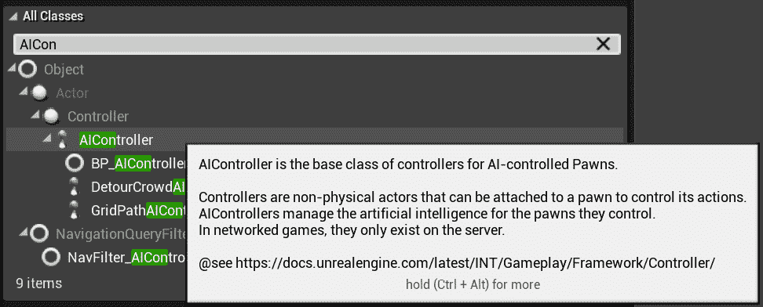

图 13.1：在选择父类对话框中找到的 AIController 资产类

1.  创建了这个新的`AIController 蓝图`后，将此资产命名为`BP_AIControllerEnemy`。

AI 控制器已创建并命名，现在是将此资产分配给您在上一章中创建的第一个敌人蓝图的时候了。

1.  直接导航到`/Enemy/Blueprints`，找到`BP_Enemy`。*双击*打开此蓝图。

1.  在第一个敌人`蓝图`的`详细信息`面板中，有一个标有`Pawn`的部分。这是您可以设置关于`Pawn`或`Character`的 AI 功能的不同参数的地方。

1.  `AI 控制器类`参数确定了要为此敌人使用哪个 AI 控制器，*左键单击*下拉菜单以查找并选择您之前创建的 AI 控制器；即`BP_AIController_Enemy`。

完成这个练习后，敌人 AI 现在知道要使用哪个 AI 控制器。这是至关重要的，因为在 AI 控制器中，AI 将使用并执行您将在本章后面创建的行为树。

AI 控制器现在已分配给敌人，这意味着您几乎可以开始为这个 AI 开发实际的智能了。在这样做之前，还有一个重要的话题需要讨论，那就是导航网格。

# 导航网格

任何 AI 的最关键方面之一，尤其是在视频游戏中，就是以复杂的方式导航环境。在虚幻引擎 4 中，引擎有一种方法告诉 AI 哪些环境部分是可导航的，哪些部分不是。这是通过**导航网格**或**Nav Mesh**来实现的。

这里的 Mesh 一词有误导性，因为它是通过编辑器中的一个体积来实现的。我们需要在我们的级别中有一个导航网格，这样我们的 AI 才能有效地导航游戏世界的可玩范围。我们将在下面的练习中一起添加一个。

虚幻引擎 4 还支持`动态导航网格`，允许导航网格在动态对象在环境中移动时实时更新。这导致 AI 能够识别环境中的这些变化，并相应地更新它们的路径/导航。本书不会涵盖这一点，但您可以通过`项目设置 -> 导航网格 -> 运行时生成`访问配置选项。

## 练习 13.02：为 AI 敌人实现导航网格体积

在这个练习中，您将向`SideScrollerExampleMap`添加一个导航网格，并探索在虚幻引擎 4 中导航网格的工作原理。您还将学习如何为游戏的需求参数化这个体积。这个练习将在虚幻引擎 4 编辑器中进行。

通过本练习，您将更加了解导航网格。您还将能够在接下来的活动中在自己的关卡中实现这个体积。让我们开始向关卡添加导航网格体积。

以下步骤将帮助您完成这个练习：

1.  如果您尚未打开地图，请通过导航到`文件`并*左键单击*`打开级别`选项来打开`SideScrollerExampleMap`。从`打开级别`对话框，导航到`/SideScrollerCPP/Maps`找到`SideScrollerExampleMap`。用*左键单击*选择此地图，然后在底部*左键单击*`打开`以打开地图。

1.  打开地图后，导航到右侧找到`模式`面板。`模式`面板是一组易于访问的角色类型，如`体积`、`灯光`、`几何`等。在`体积`类别下，您会找到`Nav Mesh Bounds Volume`选项。

1.  *左键单击*并将此体积拖入地图/场景中。默认情况下，您将在编辑器中看到体积的轮廓。按`P`键可可视化体积所包含的`导航`区域，但请确保体积与地面几何相交，以便看到绿色可视化，如下面的屏幕截图所示：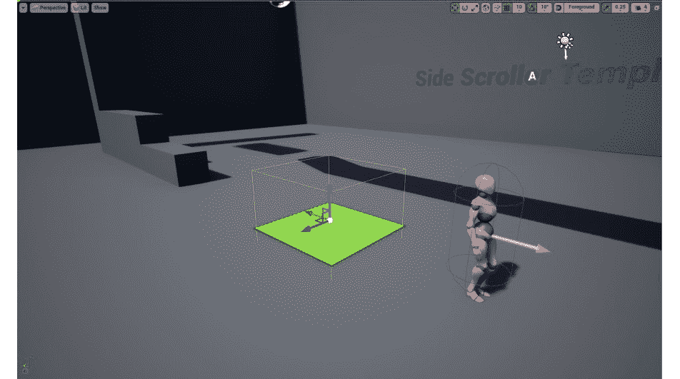

图 13.2：引擎和 AI 感知为可导航的区域轮廓

有了`Nav Mesh`体积后，让我们调整它的形状，使体积延伸到整个关卡区域。之后，您将学习如何调整`Nav Mesh`体积的参数以适应游戏的目的。

1.  *左键单击*选择`NavMeshBoundsVolume`并导航到其`详细信息`面板。有一个标有`刷设置`的部分，允许您调整体积的形状和大小。找到最适合您的值。一些建议的设置是`刷类型：添加`，`刷形状：盒子`，`X：3000.0`，`Y：3000.0`和`Z：3000.0`。

注意，当`NavMeshBoundsVolume`的形状和尺寸发生变化时，`Nav Mesh`将调整并重新计算可导航区域。这可以在下面的屏幕截图中看到。您还会注意到上层平台是不可导航的；您稍后会修复这个问题。

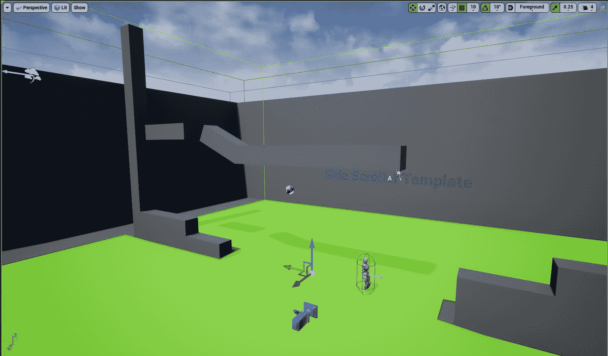

图 13.3：现在，NavMeshBoundsVolume 延伸到整个可播放区域的示例地图

通过完成这个练习，您已经将第一个`NavMeshBoundsVolume`角色放入了游戏世界，并使用调试键`'P'`可视化了默认地图中的可导航区域。接下来，您将学习更多关于`RecastNavMesh`角色的知识，当将`NavMeshBoundsVolume`放入关卡时，也会创建这个角色。

# 重塑导航网格

当您添加`NavMeshBoundsVolume`时，您可能已经注意到另一个角色被自动创建：一个名为`RecastNavMesh-Default`的`RecastNavMesh`角色。这个`RecastNavMesh`充当了导航网格的“大脑”，因为它包含了调整导航网格所需的参数，直接影响 AI 在给定区域的导航。

以下截图显示了此资产，从 `World Outliner` 选项卡中看到：

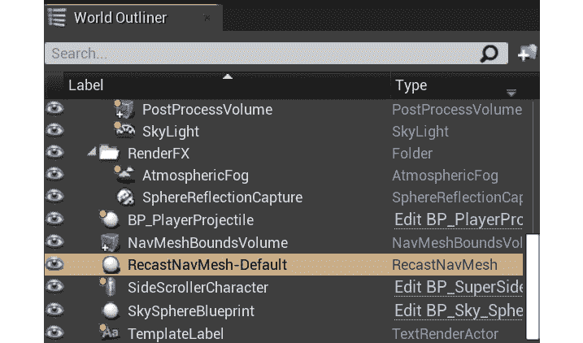

图 13.4：从世界大纲器选项卡中看到的 RecastNavMesh actor

注意

`RecastNavMesh` 中存在许多参数，我们只会在本书中涵盖重要的参数。有关更多信息，请查看 [`docs.unrealengine.com/en-US/API/Runtime/NavigationSystem/NavMesh/ARecastNavMesh/index.html`](https://docs.unrealengine.com/en-US/API/Runtime/NavigationSystem/NavMesh/ARecastNavMesh/index.html)。

现在只有两个对您重要的主要部分：

1.  `Display`：`Display` 部分，顾名思义，只包含影响 `NavMeshBoundsVolume` 生成的可导航区域的可视化调试显示的参数。建议您尝试切换此类别下的每个参数，以查看它如何影响生成的 Nav Mesh 的显示。

1.  `Generation`：`Generation` 类别包含一组值，作为 Nav Mesh 生成和确定哪些几何区域是可导航的，哪些不可导航的规则集。这里有很多选项，这可能使概念非常令人生畏，但让我们只讨论这个类别下的一些参数：

+   `Cell Size` 指的是 Nav Mesh 在区域内生成可导航空间的精度。您将在本练习的下一步中更新此值，因此您将看到这如何实时影响可导航区域。

+   `Agent Radius` 指的是将要在该区域导航的角色的半径。在您的游戏中，这里设置的半径是具有最大半径的角色的碰撞组件的半径。

+   `Agent Height` 指的是将要在该区域导航的角色的高度。在您的游戏中，这里设置的高度是具有最大 Half Height 的角色的碰撞组件的一半高度。您可以将其乘以 `2.0f` 来获得完整的高度。

+   `Agent Max Slope` 指的是游戏世界中可以存在的斜坡的坡度角度。默认情况下，该值为 `44` 度，这是一个参数，除非您的游戏需要更改，否则您将不会更改。

+   `Agent Max Step Height` 指的是 AI 可以导航的台阶的高度，关于楼梯台阶。与 `Agent Max Slope` 类似，这是一个参数，除非您的游戏明确需要更改此值，否则您很可能不会更改。

现在您已经了解了 Recast Nav Mesh 参数，让我们将这些知识付诸实践，进行下一个练习，其中将指导您更改其中一些参数。

## 练习 13.03：重新设置 Nav Mesh 体积参数

现在您在关卡中有了 `Nav Mesh` 体积，是时候改变 `Recast Nav Mesh` actor 的参数，以便 Nav Mesh 允许敌人 AI 在比其他平台更薄的平台上导航。这个练习将在虚幻引擎 4 编辑器中进行。

以下步骤将帮助您完成这个练习：

1.  您将更新 `Cell Size` 和 `Agent Height`，使其适应您的角色的需求和 Nav Mesh 所需的精度：

```cpp
Cell Size: 5.0f
Agent Height: 192.0f
```

以下截图显示了由于我们对 `Cell Size` 进行的更改，上层平台现在是可导航的：

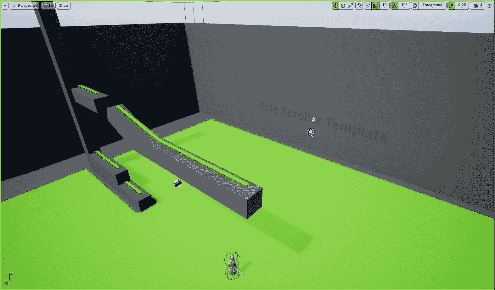

图 13.5：将 Cell Size 从 19.0f 更改为 5.0f，使狭窄的上层平台可导航

通过为 `SuperSideScrollerExampleMap` 设置自己的 `Nav Mesh`，您现在可以继续并为敌人创建 AI 逻辑。在这样做之前，完成以下活动，创建您自己的关卡，具有独特的布局和 `NavMeshBoundsVolume` actor，您可以在本项目的其余部分中使用。

## 活动 13.01：创建新级别

现在你已经在示例地图中添加了`NavMeshBoundsVolume`，是时候为`Super SideScroller`游戏的其余部分创建你自己的地图了。通过创建自己的地图，你将更好地理解`NavMeshBoundsVolume`和`RecastNavMesh`的属性如何影响它们所放置的环境。

注意

在继续解决这个活动之前，如果你需要一个可以用于`SuperSideScroller`游戏剩余章节的示例级别，那就不用担心了——本章附带了`SuperSideScroller.umap`资源，以及一个名为`SuperSideScroller_NoNavMesh`的地图，不包含`NavMeshBoundsVolume`。你可以使用`SuperSideScroller.umap`作为创建自己级别的参考，或者获取如何改进自己级别的想法。你可以在这里下载地图：[`packt.live/3lo7v2f`](https://packt.live/3lo7v2f)。

执行以下步骤创建一个简单的地图：

1.  创建一个`新级别`。

1.  将这个级别命名为`SuperSideScroller`。

1.  使用该项目的`内容浏览器`界面中默认提供的静态网格资源，创建一个有不同高度的有趣空间以导航。将你的玩家角色`Blueprint`添加到级别中，并确保它由`Player Controller 0`控制。

1.  将`NavMeshBoundsVolume` actor 添加到你的级别中，并调整其尺寸，使其适应你创建的空间。在为这个活动提供的示例地图中，设置的尺寸应分别为`1000.0`、`5000.0`和`2000.0`，分别对应*X*、*Y*和*Z*轴。

1.  确保通过按下`P`键启用`NavMeshBoundsVolume`的调试可视化。

1.  调整`RecastNavMesh` actor 的参数，使`NavMeshBoundsVolume`在你的级别中运行良好。在提供的示例地图中，`Cell Size`参数设置为`5.0f`，`Agent Radius`设置为`42.0f`，`Agent Height`设置为`192.0f`。使用这些值作为参考。

预期输出：

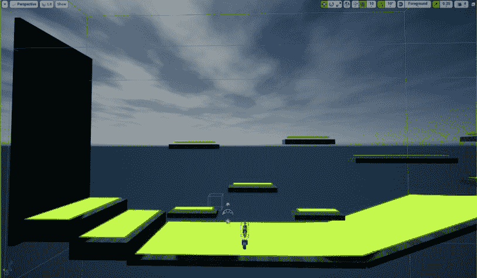

图 13.6：SuperSideScroller 地图

通过这个活动的结束，你将拥有一个包含所需的`NavMeshBoundsVolume`和`RecastNavMesh` actor 设置的级别。这将允许我们在接下来的练习中开发的 AI 能够正确运行。再次强调，如果你不确定级别应该是什么样子，请参考提供的示例地图`SuperSideScroller.umap`。现在，是时候开始开发`SuperSideScroller`游戏的 AI 了。

注意

这个活动的解决方案可以在以下网址找到：[`packt.live/338jEBx`](https://packt.live/338jEBx)。

# 行为树和黑板

行为树和黑板共同工作，允许我们的 AI 遵循不同的逻辑路径，并根据各种条件和变量做出决策。

**行为树**（**BT**）是一种可视化脚本工具，允许你根据特定因素和参数告诉一个角色该做什么。例如，一个行为树可以告诉一个 AI 根据 AI 是否能看到玩家而移动到某个位置。

为了举例说明行为树和黑板在游戏中的使用，让我们看看使用虚幻引擎 4 开发的游戏*战争机器 5*。战争机器 5 中的 AI，以及整个战争机器系列，总是试图包抄玩家，或者迫使玩家离开掩体。为了做到这一点，AI 逻辑的一个关键组成部分是知道玩家是谁，以及玩家在哪里。在黑板中存在一个对玩家的引用变量，以及一个用于存储玩家位置的位置向量。确定这些变量如何使用以及 AI 将如何使用这些信息的逻辑是在行为树中执行的。

黑板是你定义的一组变量，这些变量是行为树执行动作和使用这些值进行决策所需的。

行为树是您创建希望 AI 执行的任务的地方，例如移动到某个位置，或执行您创建的自定义任务。与 Unreal Engine 4 中的许多编辑工具一样，行为树在很大程度上是一种非常视觉化的脚本体验。

**黑板**是您定义变量的地方，也称为**键**，然后行为树将引用这些变量。您在这里创建的键可以在**任务**、**服务**和**装饰器**中使用，以根据您希望 AI 如何运行来实现不同的目的。以下截图显示了一个示例变量键集，可以被其关联的行为树引用。

没有黑板，行为树将无法在不同的任务、服务或装饰器之间传递和存储信息，因此变得无用。

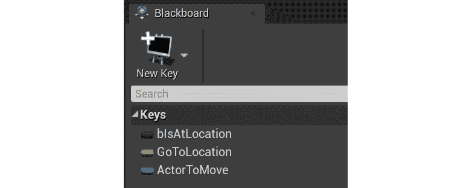

图 13.7：黑板中的一组变量示例，可以在行为树中访问

**行为树**由一组**对象**组成 - 即**复合体**、**任务**、**装饰器**和**服务** - 它们共同定义了 AI 根据您设置的条件和逻辑流动来行为和响应的方式。所有行为树都始于所谓的根，逻辑流从这里开始；这不能被修改，只有一个执行分支。让我们更详细地看看这些对象：

## 复合体

复合节点的功能是告诉行为树如何执行任务和其他操作。以下截图显示了 Unreal Engine 默认提供的所有复合节点的完整列表：选择器、序列和简单并行。

复合节点也可以附加装饰器和服务，以便在执行行为树分支之前应用可选条件：

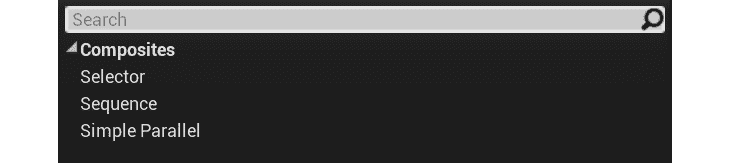

图 13.8：复合节点的完整列表 - 选择器、序列和简单并行

+   `选择器`：选择器复合节点从左到右执行其子节点，并且当其中一个子任务成功时将停止执行。使用以下截图中显示的示例，如果`FinishWithResult`任务成功，父选择器成功，这将导致根再次执行，并且`FinishWithResult`再次执行。这种模式将持续到`FinishWithResult`失败。然后选择器将执行`MakeNoise`。如果`MakeNoise`失败，`选择器`失败，根将再次执行。如果`MakeNoise`任务成功，那么选择器将成功，根将再次执行。根据行为树的流程，如果选择器失败或成功，下一个复合分支将开始执行。在以下截图中，没有其他复合节点，因此如果选择器失败或成功，根节点将再次执行。但是，如果有一个序列复合节点，并且其下有多个选择器节点，每个选择器将尝试按顺序执行其子节点。无论成功与否，每个选择器都将依次执行：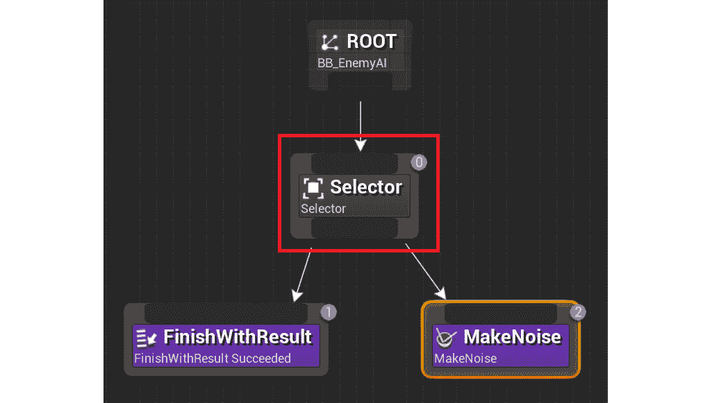

图 13.9：选择器复合节点在行为树中的使用示例

请注意，当添加任务和`复合`节点时，您会注意到每个节点的右上角有数字值。这些数字表示这些节点将被执行的顺序。模式遵循*从上到下*，*从左到右*的范式，这些值可以帮助您跟踪顺序。任何未连接的任务或`复合`节点将被赋予值`-1`，以表示未使用。

+   `序列`：`序列`组合节点从左到右执行其子节点，并且当其中一个子任务失败时将停止执行。使用下面截图中显示的示例，如果`移动到`任务成功，那么父`序列`节点将执行`等待`任务。如果`等待`任务成功，那么序列成功，`根`将再次执行。然而，如果`移动到`任务失败，序列将失败，`根`将再次执行，导致`等待`任务永远不会执行：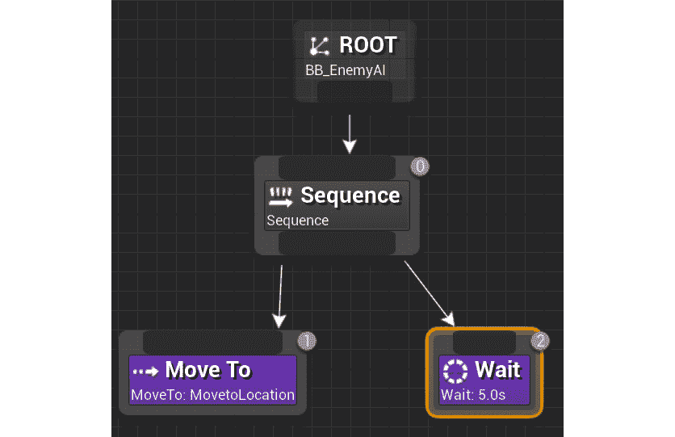

图 13.10：序列组合节点在行为树中的使用示例

+   `简单并行`：`简单并行`组合节点允许您同时执行`任务`和一个新的独立逻辑分支。下面的截图显示了这将是什么样子的一个非常基本的示例。在这个示例中，用于等待`5`秒的任务与执行一系列新任务的`序列`同时执行：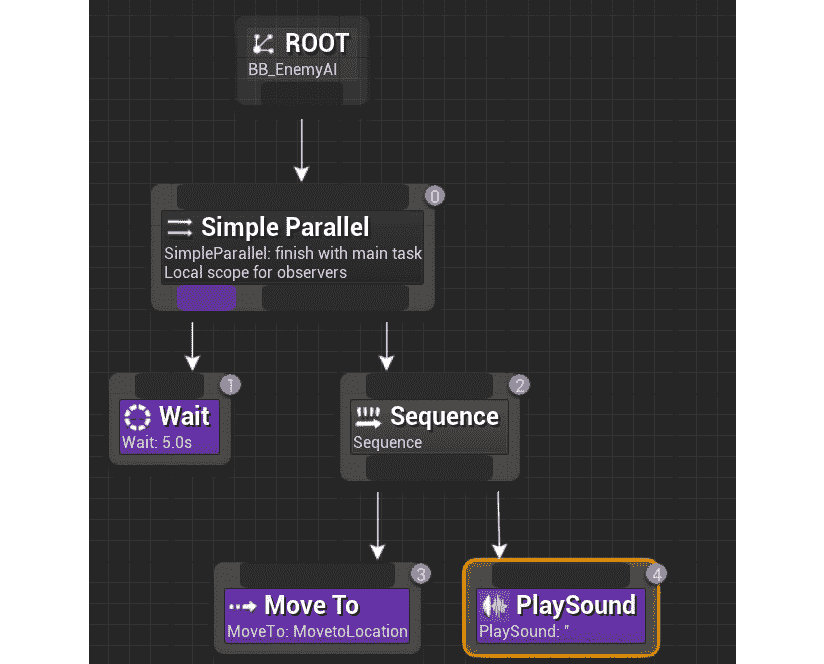

图 13.11：选择器组合节点在行为树中的使用示例

`简单并行`组合节点也是唯一在其`详细信息`面板中具有参数的`组合`节点，即`完成模式`。有两个选项：

+   `立即`：当设置为`立即`时，简单并行将在主任务完成后立即成功完成。在这种情况下，`等待`任务完成后，后台树序列将中止，整个`简单并行`将再次执行。

+   `延迟`：当设置为`延迟`时，简单并行将在后台树完成执行并且任务完成后立即成功完成。在这种情况下，`等待`任务将在`5`秒后完成，但整个`简单并行`将等待`移动到`和`播放声音`任务执行后再重新开始。

## 任务

这些是我们的 AI 可以执行的任务。虚幻引擎默认提供了内置任务供我们使用，但我们也可以在蓝图和 C++中创建自己的任务。这包括任务，如告诉我们的 AI`移动到`特定位置，`旋转到一个方向`，甚至告诉 AI 开火。还要知道，您可以使用蓝图创建自定义任务。让我们简要讨论一下您将用来开发敌人角色 AI 的两个任务：`

+   `移动到任务`：这是行为树中常用的任务之一，在本章的后续练习中将使用此任务。`移动到任务`使用导航系统告诉 AI 如何移动以及移动的位置。您将使用此任务告诉 AI 敌人要去哪里。

+   `等待任务`：这是行为树中另一个常用的任务，因为它允许在任务执行之间延迟。这可以用于允许 AI 在移动到新位置之前等待几秒钟。

## 装饰器

`装饰器`是可以添加到任务或`组合`节点（如`序列`或`选择器`）的条件，允许分支逻辑发生。例如，我们可以有一个`装饰器`来检查敌人是否知道玩家的位置。如果是，我们可以告诉敌人朝着上次已知的位置移动。如果不是，我们可以告诉我们的 AI 生成一个新位置并移动到那里。还要知道，您可以使用蓝图创建自定义装饰器。

让我们简要讨论一下您将用来开发敌人角色 AI 的装饰器——`在位置`装饰器。这确定了受控棋子是否在装饰器本身指定的位置。这对您很有用，可以确保行为树在您知道 AI 已到达给定位置之前不执行。

## 服务

`Services`与`Decorators`非常相似，因为它们可以与`Tasks`和`Composite`节点链接。主要区别在于`Service`允许我们根据服务中定义的间隔执行一系列节点。还要知道，您可以使用蓝图创建自定义服务。

## 练习 13.04：创建 AI 行为树和黑板

现在您已经对行为树和黑板有了概述，这个练习将指导您创建这些资产，告诉 AI 控制器使用您创建的行为树，并将黑板分配给行为树。您在这里创建的黑板和行为树资产将用于`SuperSideScroller`游戏。此练习将在虚幻引擎 4 编辑器中执行。

以下步骤将帮助您完成此练习：

1.  在`Content Browser`界面中，导航到`/Enemy/AI`目录。这是您创建 AI 控制器的相同目录。

1.  在此目录中，在`Content Browser`界面的空白区域*右键单击*，导航到`Artificial Intelligence`选项，并选择`Behavior Tree`以创建`Behavior Tree`资产。将此资产命名为`BT_EnemyAI`。

1.  在上一步的相同目录中，在`Content Browser`界面的空白区域再次*右键单击*，导航到`Artificial Intelligence`选项，并选择`Blackboard`以创建`Blackboard`资产。将此资产命名为`BB_EnemyAI`。

在继续告诉 AI 控制器运行这个新行为树之前，让我们首先将黑板分配给这个行为树，以便它们正确连接。

1.  通过*双击*`Content Browser`界面中的资产打开`BT_EnemyAI`。一旦打开，导航到右侧的`Details`面板，并找到`Blackboard Asset`参数。

1.  单击此参数上的下拉菜单，并找到您之前创建的`BB_EnemyAI` `Blackboard`资产。在关闭之前编译和保存行为树。

1.  接下来，通过*双击*`Content Browser`界面内的 AI 控制器`BP_AIController_Enemy`资产来打开它。在控制器内，*右键单击*并搜索`Run Behavior Tree`函数。

`Run Behavior Tree`函数非常简单：您将行为树分配给控制器，函数返回行为树是否成功开始执行。

1.  最后，将`Event BeginPlay`事件节点连接到`Run Behavior Tree`函数的执行引脚，并分配`Behavior Tree`资产`BT_EnemyAI`，这是您在此练习中创建的：

。

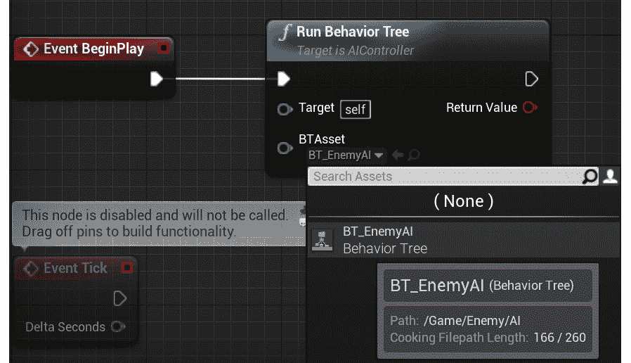

图 13.12：分配 BT_EnemyAI 行为树

完成此练习后，敌人 AI 控制器现在知道运行`BT_EnemyAI`行为树，并且此行为树知道使用名为`BB_EnemyAI`的黑板资产。有了这一点，您可以开始使用行为树逻辑来开发 AI，以便敌人角色可以在级别中移动。

## 练习 13.05：创建新的行为树任务

此练习的目标是为敌人 AI 开发一个 AI 任务，使角色能够在您级别的`Nav Mesh`体积范围内找到一个随机点进行移动。

尽管`SuperSideScroller`游戏只允许二维移动，让我们让 AI 在您在*Activity 13.01*中创建的级别的三维空间中移动，然后努力将敌人限制在二维空间内。

按照以下步骤为敌人创建新的任务：

1.  首先，打开您在上一个练习中创建的黑板资产`BB_EnemyAI`。

1.  在`Blackboard`的左上方*左键单击*`New Key`选项，并选择`Vector`选项。将此向量命名为`MoveToLocation`。您将使用此`vector`变量来跟踪 AI 的下一个移动位置。

为了这个敌方 AI 的目的，你需要创建一个新的“任务”，因为目前在虚幻中可用的任务不符合敌方行为的需求。

1.  导航到并打开你在上一个练习中创建的“行为树”资产，`BT_EnemyAI`。随机点选择的

1.  在顶部工具栏上*左键单击*“新建任务”选项。创建新的“任务”时，它会自动为你打开任务资产。但是，如果你已经创建了一个任务，在选择“新建任务”选项时会出现一个下拉选项列表。在处理这个“任务”的逻辑之前，你需要重命名资产。

1.  关闭“任务”资产窗口，导航到`/Enemy/AI/`，这是“任务”保存的位置。默认情况下，提供的名称是`BTTask_BlueprintBase_New`。将此资产重命名为`BTTask_FindLocation`。

1.  重命名新的“任务”资产后，*双击*打开“任务编辑器”。新的任务将使它们的蓝图图完全为空，并且不会为你提供任何默认事件来在图中使用。

1.  *右键单击*图中，在上下文敏感搜索中找到“事件接收执行 AI”选项。

1.  *左键单击*“事件接收执行 AI”选项，在“任务”图中创建事件节点，如下截图所示：

图 13.13：事件接收执行 AI 返回所有者控制器和受控角色

注意

“事件接收执行 AI”事件将让你可以访问**所有者控制器**和**受控角色**。在接下来的步骤中，你将使用受控角色来完成这个任务。

1.  每个“任务”都需要调用“完成执行”函数，以便“行为树”资产知道何时可以继续下一个“任务”或从树上分支出去。在图中*右键单击*，通过上下文敏感搜索搜索“完成执行”。

1.  *左键单击*上下文敏感搜索中的“完成执行”选项，在你的“任务”蓝图图中创建节点，如下截图所示：

图 13.14：完成执行函数，其中包含一个布尔参数，用于确定任务是否成功

你需要的下一个函数叫做“在可导航半径内获取随机位置”。这个函数，顾名思义，返回可导航区域内定义半径内的随机向量位置。这将允许敌方角色找到随机位置并移动到这些位置。

1.  *右键单击*图中，在上下文敏感搜索中搜索“在可导航半径内获取随机位置”。*左键单击*“在可导航半径内获取随机位置”选项，将此函数放置在图中。

有了这两个函数，并且准备好了“事件接收执行 AI”，现在是时候为敌方 AI 获取随机位置了。

1.  从“事件接收执行 AI”的“受控角色”输出中，通过上下文敏感搜索找到“获取角色位置”函数：

图 13.15：敌方角色的位置将作为随机点选择的原点

1.  将“获取角色位置”的向量返回值连接到“获取可导航半径内随机位置”的“原点”向量输入参数，如下截图所示。现在，这个函数将使用敌方 AI 角色的位置作为确定下一个随机点的原点：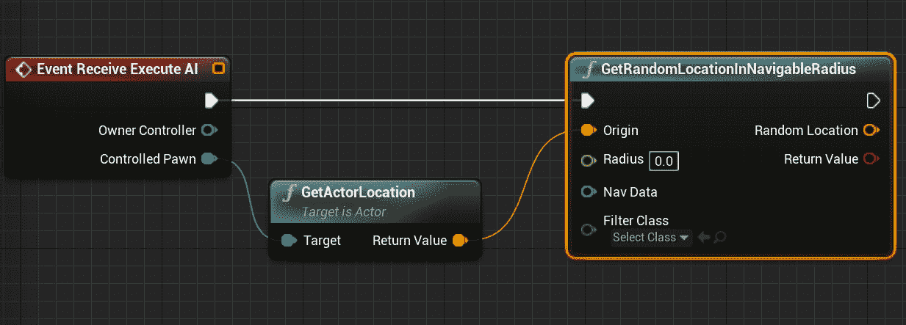

图 13.16：现在，敌方角色的位置将被用作随机点向量搜索的原点

1.  接下来，您需要告诉`GetRandomLocationInNavigableRadius`函数要检查级别可导航区域中的随机点的“半径”。将此值设置为`1000.0f`。

剩下的参数，`Nav Data`和`Filter Class`，可以保持不变。现在，您正在从`GetRandomLocationInNavigableRadius`获取随机位置，您需要能够将此值存储在您在本练习中创建的`Blackboard`向量中。

1.  要获得对`Blackboard`向量变量的引用，您需要在此`Task`内创建一个`Blackboard Key Selector`类型的新变量。创建此新变量并命名为`NewLocation`。

1.  现在，您需要将此变量设置为`Public`变量，以便在行为树中公开。*左键单击* “眼睛”图标，使眼睛可见。

1.  有了`Blackboard Key Selector`变量准备好后，*左键单击* 并拖动此变量的`Getter`。然后，从此变量中拉出并搜索`Set Blackboard Value as Vector`，如下屏幕截图所示：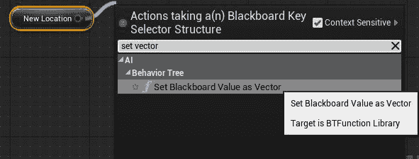

图 13.17：Set Blackboard Value 有各种不同类型，支持 Blackboard 中可能存在的不同变量

1.  将`GetRandomLocationInNavigableRadius`的`RandomLocation`输出向量连接到`Set Blackboard Value as Vector`的`Value`向量输入参数。然后，连接这两个函数节点的执行引脚。结果将如下所示：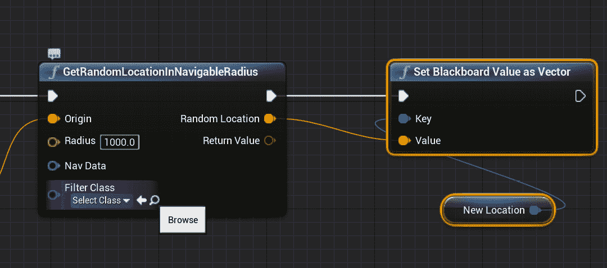

图 13.18：现在，Blackboard 向量值被分配了这个新的随机位置

最后，您将使用`GetRandomLocationInNavigableRadius`函数的`Return Value`布尔输出参数来确定`Task`是否成功执行。

1.  将布尔输出参数连接到`Finish Execute`函数的`Success`输入参数，并连接`Set Blackboard Value as Vector`和`Finish Execute`函数节点的执行引脚。以下屏幕截图显示了`Task`逻辑的最终结果：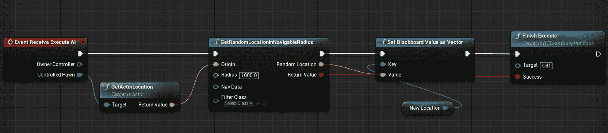

图 13.19：任务的最终设置

注

您可以在以下链接找到前面的屏幕截图的完整分辨率，以便更好地查看：[`packt.live/3lmLyk5`](https://packt.live/3lmLyk5)。

通过完成此练习，您已经使用虚幻引擎 4 中的蓝图创建了您的第一个自定义`Task`。现在，您有一个任务，可以在级别的`Nav Mesh Volume`的可导航边界内找到一个随机位置，使用敌人的 pawn 作为此搜索的起点。在下一个练习中，您将在行为树中实现这个新的`Task`，并看到敌人 AI 在您的级别周围移动。

## 练习 13.06：创建行为树逻辑

本练习的目标是在行为树中实现您在上一个练习中创建的新`Task`，以便使敌人 AI 在级别的可导航空间内找到一个随机位置，然后移动到该位置。您将使用`Composite`、`Task`和`Services`节点的组合来实现此行为。本练习将在虚幻引擎 4 编辑器中进行。

以下步骤将帮助您完成此练习：

1.  首先，打开您在“Exercise 13.04”中创建的行为树，“Creating the AI Behavior Tree and Blackboard”，即`BT_EnemyAI`。

1.  在此“行为树”中，*左键单击* 并从`Root`节点底部拖动，并从上下文敏感搜索中选择`Sequence`节点。结果将是将`Root`连接到`Sequence`复合节点。

1.  接下来，从`Sequence`节点*左键单击*并拖动以打开上下文敏感菜单。在此菜单中，搜索您在上一个任务中创建的“任务”，即`BTTask_FindLocation`。

1.  默认情况下，`BTTask_FindLocation`任务应自动将`New Location`键选择器变量分配给`Blackboard`的`MovetoLocation`向量变量。如果没有发生这种情况，您可以在任务的“详细信息”面板中手动分配此选择器。

现在，`BTTask_FindLocation`将把`NewLocation`选择器分配给`Blackboard`的`MovetoLocation`向量变量。这意味着从任务返回的随机位置将被分配给`Blackboard`变量，并且您可以在其他任务中引用此变量。

现在，您正在查找有效的随机位置并将此位置分配给`Blackboard`变量，即`MovetoLocation`，您可以使用`Move To`任务告诉 AI 移动到此位置。

1.  *左键单击*并从`Sequence`复合节点中拖动。然后，在上下文敏感搜索中找到`Move To`任务。您的“行为树”现在将如下所示：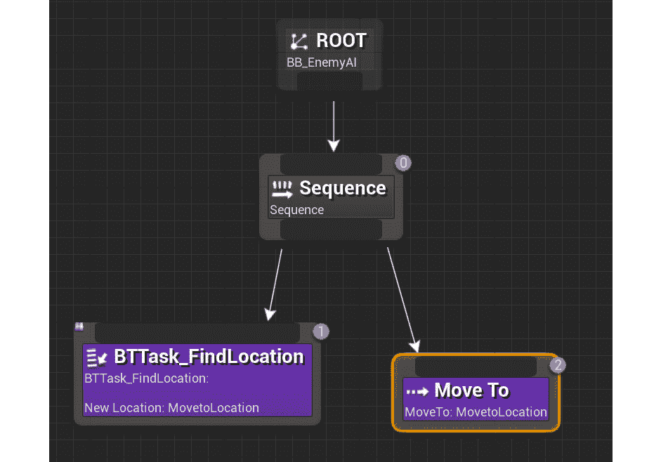

图 13.20：选择随机位置后，移动任务将让 AI 移动到这个新位置

1.  默认情况下，`Move To`任务应将`MoveToLocation`分配为其`Blackboard Key`值。如果没有，请选择任务。在其“详细信息”面板中，您将找到`Blackboard Key`参数，您可以在其中分配变量。在“详细信息”面板中，还将“可接受半径”设置为`50.0f`。

现在，行为树使用`BTTask_FindLocation`自定义任务找到随机位置，并使用`MoveTo`任务告诉 AI 移动到该位置。这两个任务通过引用名为`MovetoLocation`的`Blackboard`向量变量相互通信位置。

这里要做的最后一件事是向`Sequence`复合节点添加一个`Decorator`，以确保敌人角色在再次执行树以查找并移动到新位置之前不处于随机位置。

1.  *右键单击*`Sequence`的顶部区域，然后选择“添加装饰者”。从下拉菜单中*左键单击*并选择“在位置”。

1.  由于您已经在`Blackboard`中有一个向量参数，`Decorator`应自动将`MovetoLocation`分配为`Blackboard Key`。通过选择`Decorator`并确保`Blackboard Key`分配给`MovetoLocation`来验证这一点。

1.  有了装饰者，您已经完成了行为树。最终结果将如下所示：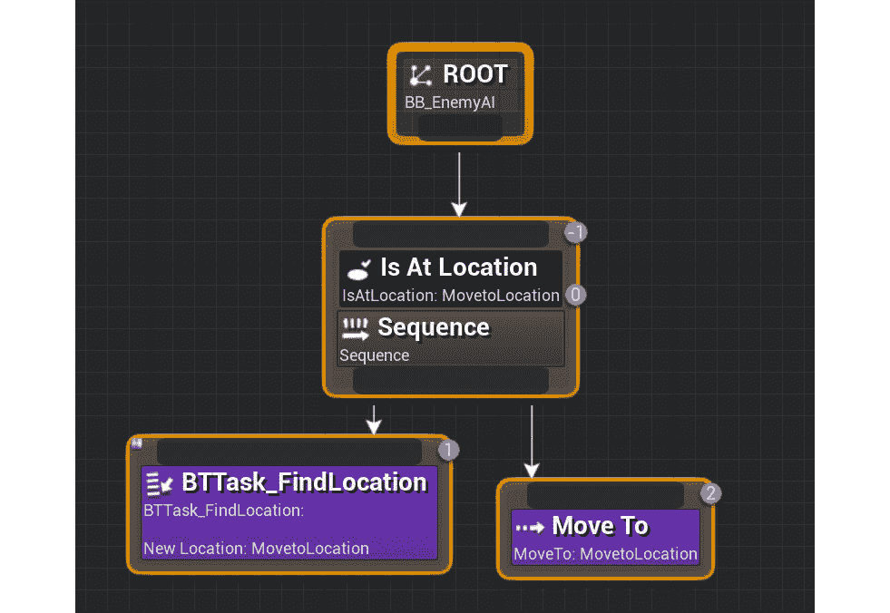

图 13.21：AI 敌人行为树的最终设置

这个行为树告诉 AI 使用`BTTask_FindLocation`找到一个随机位置，并将此位置分配给名为`MovetoLocation`的 Blackboard 值。当此任务成功时，行为树将执行`MoveTo`任务，该任务将告诉 AI 移动到这个新的随机位置。序列包含一个`Decorator`，它确保敌方 AI 在再次执行之前处于`MovetoLocation`，就像 AI 的安全网一样。

1.  在测试新的 AI 行为之前，确保将`BP_Enemy AI`放入您的级别中，如果之前的练习和活动中没有的话。

1.  现在，如果您使用`PIE`或“模拟”，您将看到敌方 AI 在`Nav Mesh Volume`内围绕地图奔跑并移动到随机位置：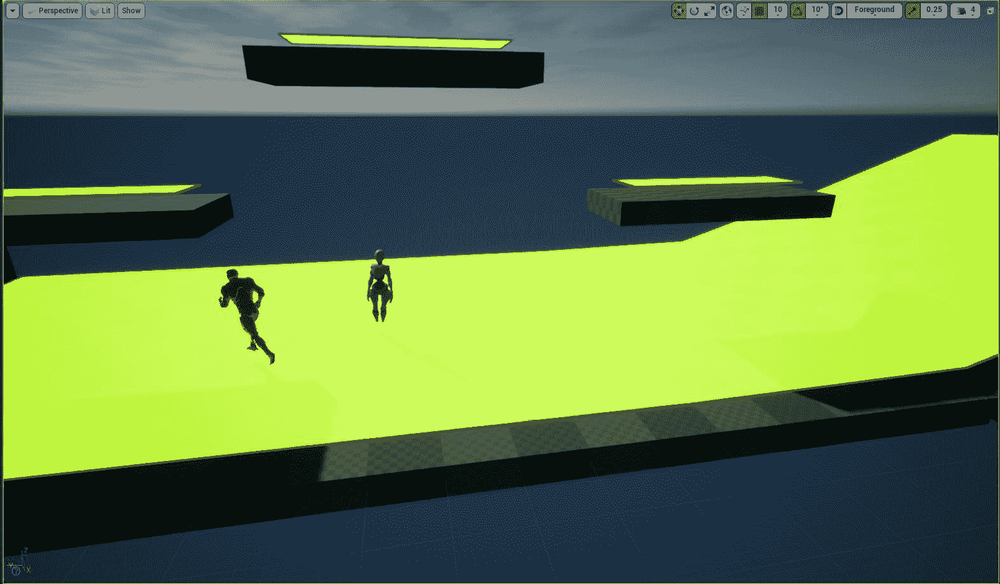

图 13.22：敌方 AI 现在将从一个位置移动到另一个位置

注意

有些情况下，敌人 AI 不会移动。这可能是由于“在可导航半径内获取随机位置”函数未返回`True`引起的。这是一个已知问题，如果发生，请重新启动编辑器并重试。

通过完成这个练习，您已经创建了一个完全功能的行为树，允许敌人 AI 在您的级别的可导航范围内找到并移动到一个随机位置。您在上一个练习中创建的任务允许您找到这个随机点，而“移动到”任务允许 AI 角色朝着这个新位置移动。

由于“序列”组合节点的工作方式，每个任务必须在继续下一个任务之前成功完成，所以首先，敌人成功找到一个随机位置，然后朝着这个位置移动。只有当“移动到”任务完成时，整个行为树才会重新开始并选择一个新的随机位置。

现在，您可以继续进行下一个活动，在这个活动中，您将添加到这个行为树，以便让 AI 在选择新的随机点之间等待，这样敌人就不会不断移动。

## 活动 13.02：AI 移动到玩家位置

在上一个练习中，您能够让 AI 敌人角色通过使用自定义“任务”和“移动到”任务一起移动到“导航网格体”范围内的随机位置。

在这个活动中，您将继续上一个练习并更新行为树。您将利用“等待”任务使用一个“装饰器”，并创建自己的新自定义任务，让 AI 跟随玩家角色并每隔几秒更新其位置。

以下步骤将帮助您完成这个活动：

1.  在您之前创建的`BT_EnemyAI`行为树中，您将继续从上次离开的地方创建一个新任务。通过从工具栏中选择“新任务”并选择`BTTask_BlueprintBase`来完成这个任务。将这个新任务命名为`BTTask_FindPlayer`。

1.  在`BTTask_FindPlayer`任务中，创建一个名为`Event Receive Execute AI`的新事件。

1.  找到“获取玩家角色”函数，以获取对玩家的引用；确保使用`Player Index 0`。

1.  从玩家角色中调用“获取角色位置”函数，以找到玩家当前的位置。

1.  在这个任务中创建一个新的黑板键“选择器”变量。将此变量命名为`NewLocation`。

1.  *左键单击*并将`NewLocation`变量拖入图表中。从该变量中，搜索“设置黑板数值”函数为“向量”。

1.  将“设置黑板数值”作为“向量”函数连接到事件“接收执行 AI”节点的执行引脚。

1.  添加“完成执行”函数，确保布尔值“成功”参数为`True`。

1.  最后，将“设置黑板数值”作为“向量”函数连接到“完成执行”函数。

1.  保存并编译任务“蓝图”，返回到`BT_EnemyAI`行为树。

1.  用新的`BTTask_FindPlayer`任务替换`BTTask_FindLocation`任务，使得这个新任务现在是“序列”组合节点下的第一个任务。

1.  通过以下自定义`BTTask_FindLocation`和`Move To`任务，在“序列”组合节点下方添加一个新的“播放声音”任务作为第三个任务。

1.  在“播放声音”参数中，添加`Explosion_Cue SoundCue`资产。

1.  在“播放声音”任务中添加一个“是否在位置”装饰器，并确保将“移动到位置”键分配给该装饰器。

1.  在“序列”组合节点下方添加一个新的“等待”任务作为第四个任务，跟随“播放声音”任务。

1.  将“等待”任务设置为等待`2.0f`秒后成功完成。

预期输出如下：

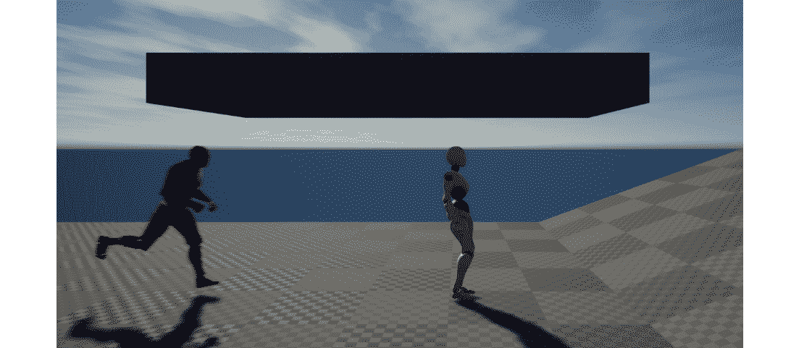

图 13.23：敌人 AI 跟随玩家并每 2 秒更新一次玩家位置

敌方 AI 角色将移动到关卡中可导航空间内玩家的最后已知位置，并在每个玩家位置之间暂停`2.0f`秒。

注意

此活动的解决方案可在以下网址找到：[`packt.live/338jEBx`](https://packt.live/338jEBx)。

完成此活动后，您已经学会了创建一个新的任务，使 AI 能够找到玩家位置并移动到玩家的最后已知位置。在进行下一组练习之前，删除`PlaySound`任务，并用您在*Exercise 13.05*中创建的`BTTask_FindLocation`任务替换`BTTask_FindPlayer`任务。请参考*Exercise 13.05*，*Creating a New Behavior Tree Task*和*Exercise 13.06*，*Creating the Behavior Tree Logic*，以确保行为树正确返回。您将在即将进行的练习中使用`BTTask_FindLocation`任务。

在下一个练习中，您将通过开发一个新的`Blueprint`角色来解决这个问题，这将允许您设置 AI 可以朝向的特定位置。

## 练习 13.07：创建敌方巡逻位置

目前 AI 敌人角色的问题在于它们可以在 3D 可导航空间中自由移动，因为行为树允许它们在该空间内找到一个随机位置。相反，AI 需要被给予您可以在编辑器中指定和更改的巡逻点。然后它将随机选择其中一个巡逻点进行移动。这就是您将为`SuperSideScroller`游戏做的事情：创建敌方 AI 可以移动到的巡逻点。本练习将向您展示如何使用简单的*Blueprint*角色创建这些巡逻点。本练习将在 Unreal Engine 4 编辑器中执行。

以下步骤将帮助您完成此练习：

1.  首先，导航到`/Enemy/Blueprints/`目录。这是您将创建用于 AI 巡逻点的新`Blueprint`角色的位置。

1.  在此目录中，*右键单击*并选择`Blueprint Class`选项，然后从菜单中*左键单击*此选项。

1.  从`Pick Parent Class`菜单提示中，*左键单击*`Actor`选项，创建一个基于`Actor`类的新`Blueprint`：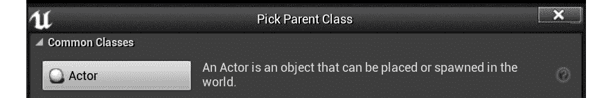

图 13.24：Actor 类是可以放置或生成在游戏世界中的所有对象的基类

1.  将此新资产命名为`BP_AIPoints`，并通过在`Content Browser`界面中*双击*资产来打开此`Blueprint`。

注意

`Blueprints`的界面与其他系统（如`Animation Blueprints`和`Tasks`）共享许多相同的功能和布局，因此这些都应该对您来说很熟悉。

1.  在蓝图 UI 左侧的`Variables`选项卡中导航，*左键单击*`+Variable`按钮。将此变量命名为`Points`。

1.  从`Variable Type`下拉菜单中，*左键单击*并选择`Vector`选项。

1.  接下来，您需要将这个向量变量设置为`Array`，以便可以存储多个巡逻位置。*左键单击*`Vector`旁边的黄色图标，然后*左键单击*选择`Array`选项。

1.  设置`Points`向量变量的最后一步是启用`Instance Editable`和`Show 3D Widget`：

+   `Instance Editable`参数允许此向量变量在放置在级别中的角色上公开可见，使得每个此角色的实例都可以编辑此变量。

+   `Show 3D Widget`允许您使用编辑器视口中可见的 3D 变换小部件来定位向量值。您将在本练习的后续步骤中看到这意味着什么。还需要注意的是，`Show 3D Widget`选项仅适用于涉及演员变换的变量，例如`Vectors`和`Transforms`。

简单的角色设置完成后，现在是将角色放置到关卡中并开始设置*巡逻点*位置的时候了。

1.  将`BP_AIPoints` actor 蓝图添加到您的级别中，如下所示：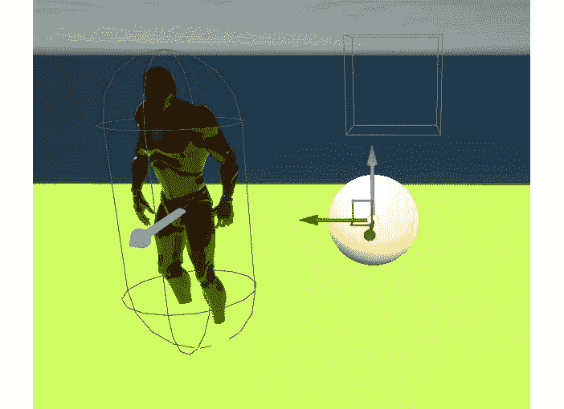

图 13.25：BP_AIPoints actor 现在在级别中

1.  选择`BP_AIPoints` actor，导航到其`Details`面板，并找到`Points`变量。

1.  接下来，您可以通过*左键单击*`+`符号向向量数组添加新元素，如下所示：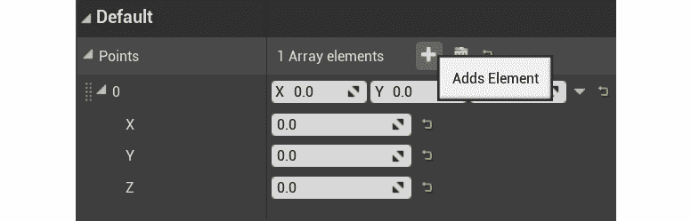

图 13.26：数组中可以有许多元素，但数组越大，分配的内存就越多

1.  当您向向量数组添加新元素时，将会出现一个 3D 小部件，您可以*左键单击*以选择并在级别中移动，如下所示：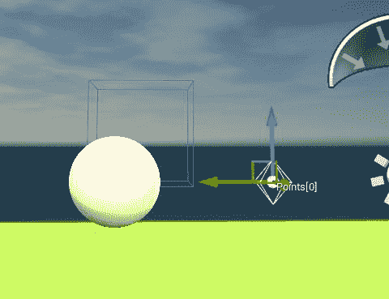

图 13.27：第一个巡逻点向量位置

注意

当您更新代表向量数组元素的 3D 小部件的位置时，`Details`面板中的 3D 坐标将更新为`Points`变量。

1.  最后，将尽可能多的元素添加到向量数组中，以适应您级别的上下文。请记住，这些巡逻点的位置应该对齐，使它们沿水平轴成一条直线，与角色移动的方向平行。以下屏幕截图显示了本练习中包含的示例`SideScroller.umap`级别中的设置：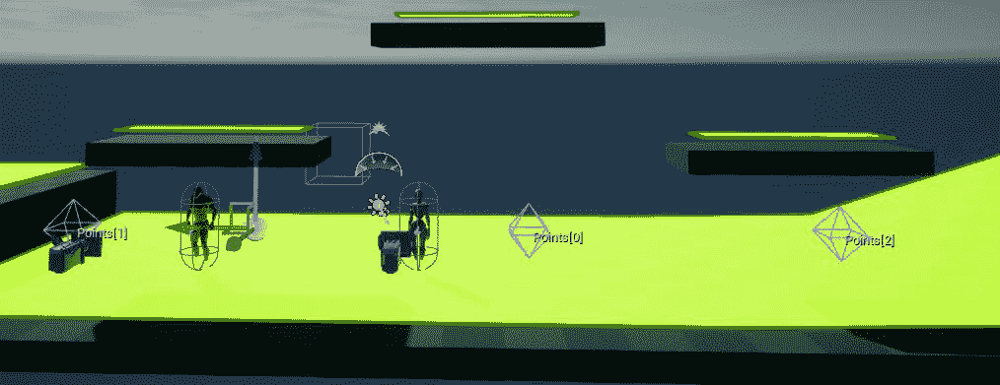

图 13.28：示例巡逻点路径，如在 SideScroller.umap 示例级别中所见

1.  继续重复最后一步，创建多个巡逻点并根据需要放置 3D 小部件。您可以使用提供的`SideScroller.umap`示例级别作为设置这些`巡逻点`的参考。

通过完成这个练习，您已经创建了一个包含`Vector`位置数组的新`Actor`蓝图，现在可以使用编辑器中的 3D 小部件手动设置这些位置。通过手动设置*巡逻点*位置的能力，您可以完全控制 AI 可以移动到的位置，但是有一个问题。目前还没有功能来从这个数组中选择一个点并将其传递给行为树，以便 AI 可以在这些*巡逻点*之间移动。在设置这个功能之前，让我们先了解更多关于向量和向量变换的知识，因为这些知识将在下一个练习中证明有用。

# 向量变换

在进行下一个练习之前，重要的是您了解一下向量变换，更重要的是了解`Transform Location`函数的作用。当涉及到角色的位置时，有两种思考其位置的方式：世界空间和本地空间。角色在世界空间中的位置是相对于世界本身的位置；更简单地说，这是您将实际角色放置到级别中的位置。角色的本地位置是相对于自身或父级角色的位置。

让我们以`BP_AIPoints` actor 作为世界空间和本地空间的示例。`Points`数组的每个位置都是本地空间向量，因为它们是相对于`BP_AIPoints` actor 本身的世界空间位置的位置。以下屏幕截图显示了`Points`数组中的向量列表，如前面的练习所示。这些值是相对于您级别中`BP_AIPoints` actor 的位置的位置：

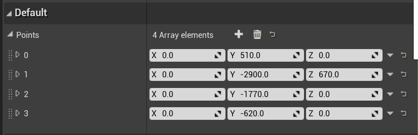

图 13.29：相对于 BP_AIPoints actor 的世界空间位置，Points 数组的本地空间位置向量

为了使敌人 AI 移动到这些`Points`的正确世界空间位置，您需要使用一个名为`Transform Location`的函数。这个函数接受两个参数：

+   `T`：这是您用来将向量位置参数从局部空间转换为世界空间值的提供的`Transform`。

+   `位置`：这是要从局部空间转换为世界空间的`位置`。

然后将向量转换的结果作为函数的返回值。您将在下一个练习中使用此函数，从`Points`数组中返回一个随机选择的向量点，并将该值从局部空间向量转换为世界空间向量。然后，将使用这个新的世界空间向量来告诉敌人 AI 在世界中如何移动。让我们现在实现这个。

## 练习 13.08：在数组中选择一个随机点

现在您对向量和向量转换有了更多的了解，您可以继续进行这个练习，在这个练习中，您将创建一个简单的`蓝图`函数，选择一个*巡逻点*向量位置中的一个，并使用名为`Transform Location`的内置函数将其向量从局部空间值转换为世界空间值。通过返回向量位置的世界空间值，然后将这个值传递给*行为树*，使得 AI 将移动到正确的位置。这个练习将在虚幻引擎 4 编辑器中进行。

以下步骤将帮助您完成这个练习。让我们从创建新函数开始：

1.  导航回`BP_AIPoints`蓝图，并通过*左键单击*蓝图编辑器左侧的`函数`类别旁边的`+`按钮来创建一个新函数。将此函数命名为`GetNextPoint`。

1.  在为这个函数添加逻辑之前，通过*左键单击*`函数`类别下的函数来选择此函数，以访问其`详细信息`面板。

1.  在“详细信息”面板中，启用`Pure`参数，以便将此函数标记为“纯函数”。在*第十一章*中，*混合空间 1D，键绑定和状态机*中，当在玩家角色的动画蓝图中工作时，您了解了“纯函数”；在这里也是一样的。

1.  接下来，`GetNextPoint`函数需要返回一个向量，行为树可以用来告诉敌人 AI 要移动到哪里。通过*左键单击*`详细信息`函数类别下的`+`符号来添加这个新的输出。将变量类型设置为`Vector`，并将其命名为`NextPoint`，如下面的屏幕截图所示：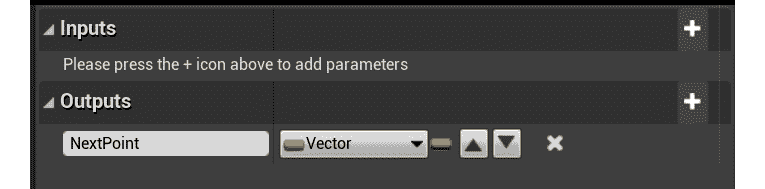

图 13.30：函数可以返回不同类型的多个变量，根据您的逻辑需求

1.  在添加`输出`变量时，函数将自动生成一个`Return`节点并将其放入函数图中，如下面的屏幕截图所示。您将使用这个输出来返回敌人 AI 移动到的新向量巡逻点：

图 13.31：函数的自动生成返回节点，包括 NewPoint 向量输出变量

现在函数的基础工作已经完成，让我们开始添加逻辑。

1.  为了选择一个随机位置，首先需要找到`Points`数组的长度。创建`Points`向量的`Getter`，从这个向量变量中*左键单击*并拖动以搜索`Length`函数，如下面的屏幕截图所示：

图 13.32：Length 函数是一个纯函数，返回数组的长度

1.  使用`Length`函数的整数输出，*左键单击*并拖动以使用上下文敏感搜索找到`Random Integer`函数，如下截图所示。`Random Integer`函数返回一个在`0`和`最大值`之间的随机整数；在这种情况下，这是`Points`向量数组的`Length`：

图 13.33：使用随机整数将允许函数从`Points`向量数组中返回一个随机向量

到目前为止，你正在生成一个在`Points`向量数组的长度之间的随机整数。接下来，你需要找到返回的`Random Integer`的索引位置处`Points`向量数组的元素。

1.  通过创建一个新的`Points`向量数组的`Getter`。然后，*左键单击*并拖动以搜索`Get (a copy)`函数。

1.  接下来，将`Random Integer`函数的返回值连接到`Get (a copy)`函数的输入。这将告诉函数选择一个随机整数，并使用该整数作为要从`Points`向量数组返回的索引。

现在你从`Points`向量数组中获取了一个随机向量，你需要使用`Transform Location`函数将位置从局部空间转换为世界空间向量。

正如你已经学到的那样，`Points`数组中的向量是相对于关卡中`BP_AIPoints`角色位置的局部空间位置。因此，你需要使用`Transform Location`函数将随机选择的局部空间向量转换为世界空间向量，以便 AI 敌人移动到正确的位置。

1.  *左键单击*并从`Get (a copy)`函数的向量输出处拖动，并通过上下文敏感搜索，找到`Transform Location`函数。

1.  将`Get (a copy)`函数的向量输出连接到`Transform Location`函数的`Location`输入。

1.  最后一步是使用蓝图角色本身的变换作为`Transform Location`函数的`T`参数。通过*右键单击*图表并通过上下文敏感搜索，找到`GetActorTransform`函数并将其连接到`Transform Location`参数`T`。

1.  最后，将`Transform Location`函数的`Return Value`向量连接到函数的`NewPoint`向量输出：

图 13.34：`GetNextPoint`函数的最终逻辑设置

注意

你可以在以下链接找到前面的截图的全分辨率以便更好地查看：[`packt.live/35jlilb`](https://packt.live/35jlilb)。

通过完成这个练习，你在`BP_AIPoints`角色内创建了一个新的蓝图函数，该函数从`Points`数组变量中获取一个随机索引，使用`Transform Location`函数将其转换为世界空间向量值，并返回这个新的向量值。你将在 AI 行为树中的`BTTask_FindLocation`任务中使用这个函数，以便敌人移动到你设置的其中一个点。在你这样做之前，敌人 AI 需要一个对`BP_AIPoints`角色的引用，以便它知道可以从哪些点中选择并移动。我们将在下一个练习中完成这个任务。

## 练习 13.09：引用巡逻点角色

现在`BP_AIPoints`角色有一个从其向量巡逻点数组中返回随机转换位置的函数，你需要让敌人 AI 在关卡中引用这个角色，以便它知道要引用哪些巡逻点。为此，你将在敌人角色蓝图中添加一个新的`Object Reference`变量，并分配之前放置在关卡中的`BP_AIPoints`角色。这个练习将在虚幻引擎 4 编辑器中进行。让我们开始添加*Object Reference*。

注意

`对象引用变量`存储对特定类对象或演员的引用。有了这个引用变量，您可以访问此类可用的公开变量、事件和函数。

以下步骤将帮助您完成此练习：

1.  导航到`/Enemy/Blueprints/`目录，并通过*双击*`内容浏览器`界面中的资产打开敌人角色蓝图`BP_Enemy`。

1.  创建一个`BP_AIPoints`类型的新变量，并确保变量类型为`对象引用`。

1.  为了引用级别中现有的`BP_AIPoints`演员，您需要通过启用`实例可编辑`参数使上一步的变量成为`公共变量`。将此变量命名为`巡逻点`。

1.  现在您已经设置了对象引用，导航到您的级别并选择您的敌人 AI。下面的截图显示了放置在提供的示例级别中的敌人 AI；即`SuperSideScroller.umap`。如果您的级别中没有放置敌人，请立即这样做：

注意

将敌人放置到级别中与 Unreal Engine 4 中的任何其他演员一样。*左键单击*并从内容浏览器界面将敌人 AI 蓝图拖放到级别中。

图 13.35：敌人 AI 放置在示例级别 SuperSideScroller.umap 中

](img/B16183_13_35.jpg)

图 13.35：敌人 AI 放置在示例级别 SuperSideScroller.umap 中

1.  从其`详细信息`面板中，在`默认`类别下找到`巡逻点`变量。这里要做的最后一件事是通过*左键单击*`巡逻点`变量的下拉菜单，并从列表中找到在*练习 13.07*中已经放置在级别中的`BP_AIPoints`演员。 

完成此练习后，您的级别中的敌人 AI 现在引用了级别中的`BP_AIPoints`演员。有了有效的引用，敌人 AI 可以使用这个演员来确定在`BTTask_FindLocation`任务中移动的点集。现在要做的就是更新`BTTask_FindLocation`任务，使其使用这些点而不是找到一个随机位置。

## 练习 13.10：更新 BTTask_FindLocation

完成敌人 AI 巡逻行为的最后一步是替换`BTTask_FindLocation`中的逻辑，使其使用`BP_AIPoints`演员的`GetNextPoint`函数，而不是在级别的可导航空间内查找随机位置。这个练习将在 Unreal Engine 4 编辑器中执行。

作为提醒，在开始之前，回顾一下*练习 13.05*结束时`BTTask_FindLocation`任务的外观。

以下步骤将帮助您完成此练习：

1.  首先要做的是从`Event Receive Execute AI`中获取返回的`Controlled Pawn`引用，并将其转换为`BP_Enemy`，如下截图所示。这样，您就可以访问上一个练习中的`巡逻点`对象引用变量：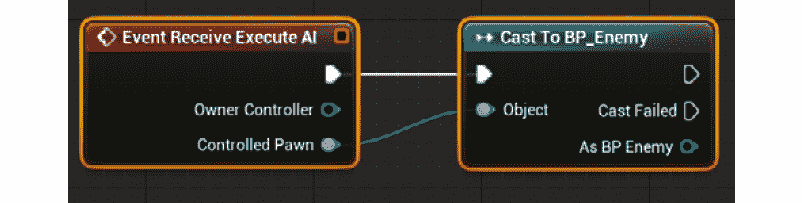

图 13.36：转换还确保返回的 Controlled Pawn 是 BP_Enemy 类类型

1.  接下来，您可以通过*左键单击*并从`转换为 BP_Enemy`下的`As BP Enemy`引脚中拖动，并通过上下文敏感搜索找到`巡逻点`对象引用变量。

1.  从`巡逻点`引用中，您可以*左键单击*并拖动以搜索您在*练习 13.08*中创建的`GetNextPoint`函数，*选择数组中的随机点*。

1.  现在，您可以将`GetNextPoint`函数的`NextPoint`向量输出参数连接到`Set Blackboard Value as Vector`函数，并将执行引脚从转换连接到`Set Blackboard Value as Vector`函数。现在，每次执行`BTTask_FindLocation`任务时，都会设置一个新的随机巡逻点。

1.  最后，将`Set Blackboard Value as Vector`函数连接到`Finish Execute`函数，并手动将`Success`参数设置为`True`，以便如果转换成功，此任务将始终成功。

1.  作为备用方案，创建`Finish Execute`的副本并连接到`Cast`函数的`Cast Failed`执行引脚。然后，将`Success`参数设置为`False`。这将作为备用方案，以便如果由于任何原因`Controlled Pawn`不是`BP_Enemy`类，任务将失败。这是一个很好的调试实践，以确保任务对其预期的 AI 类的功能性：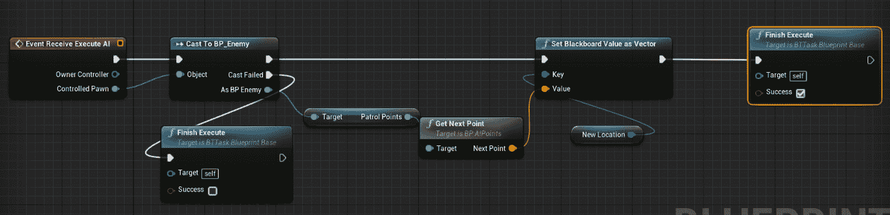

图 13.37：在逻辑中考虑任何转换失败总是一个很好的实践

注意

您可以在以下链接找到前面的截图的全分辨率版本以便更好地查看：[`packt.live/3n58THA`](https://packt.live/3n58THA)。

随着`BTTask_FindLocation`任务更新为使用敌人中`BP_AIPoints`角色引用的随机巡逻点，敌人 AI 现在将在巡逻点之间随机移动。

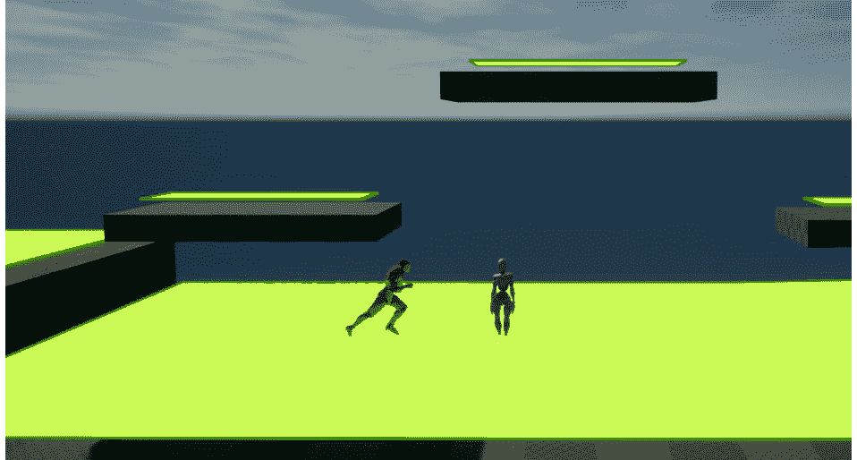

图 13.38：敌人 AI 现在在关卡中的巡逻点位置之间移动

完成这个练习后，敌人 AI 现在使用对关卡中`BP_AIPoints`角色的引用，以找到并移动到关卡中的巡逻点。关卡中的每个敌人角色实例都可以引用另一个唯一实例的`BP_AIPoints`角色，也可以共享相同的实例引用。由您决定每个敌人 AI 如何在关卡中移动。

# 玩家抛射物

在本章的最后一部分，您将专注于创建玩家抛射物的基础，该基础可用于摧毁敌人。目标是创建适当的角色类，引入所需的碰撞和抛射物移动组件到类中，并设置抛射物运动行为的必要参数。

为了简单起见，玩家的抛射物将不使用重力，将在一次命中时摧毁敌人，并且抛射物本身将在撞击任何表面时被摧毁；例如，它不会从墙上弹开。玩家抛射物的主要目标是让玩家可以生成并用来摧毁整个关卡中的敌人的抛射物。在本章中，您将设置基本的框架功能，而在*第十四章*中，*生成玩家抛射物*，您将添加声音和视觉效果。让我们开始创建玩家抛射物类。

## 练习 13.11：创建玩家抛射物

到目前为止，我们一直在虚幻引擎 4 编辑器中工作，创建我们的敌人 AI。对于玩家抛射物，我们将使用 C++和 Visual Studio 来创建这个新类。玩家抛射物将允许玩家摧毁放置在关卡中的敌人。这个抛射物将有一个短暂的寿命，以高速行进，并且将与敌人和环境发生碰撞。

这个练习的目标是为玩家的抛射物设置基础角色类，并开始在抛射物的头文件中概述所需的函数和组件。

以下步骤将帮助您完成这个练习：

1.  首先，您需要使用`Actor`类作为玩家抛射物的父类来创建一个新的 C++类。接下来，将这个新的 actor 类命名为`PlayerProjectile`，并*左键单击*菜单提示的底部右侧的`Create Class`选项。

创建新类后，Visual Studio 将为该类生成所需的源文件和头文件，并为您打开这些文件。actor 基类包含了一些默认函数，对于玩家抛射物来说是不需要的。

1.  在`PlayerProjectile.h`文件中找到以下代码行并删除它们：

```cpp
    protected:
      // Called when the game starts or when spawned
      virtual void BeginPlay() override;
    public:
      // Called every frame
      virtual void Tick(float DeltaTime) override;
    ```

这些代码行代表了默认情况下包含在每个基于 Actor 的类中的`Tick()`和`BeginPlay()`函数的声明。`Tick()`函数在每一帧都会被调用，允许您在每一帧上执行逻辑，这可能会变得昂贵，取决于您要做什么。`BeginPlay()`函数在此 actor 被初始化并开始播放时被调用。这可以用来在 actor 进入世界时立即执行逻辑。这些函数被删除是因为它们对于`Player Projectile`不是必需的，只会使代码混乱。

1.  在`PlayerProjectile.h`头文件中删除这些行后，您还可以从`PlayerProjectile.cpp`源文件中删除以下行：

```cpp
    // Called when the game starts or when spawned
    void APlayerProjectile::BeginPlay()
    {
      Super::BeginPlay();
    }
    // Called every frame
    void APlayerProjectile::Tick(float DeltaTime)
    {
      Super::Tick(DeltaTime);
    }
    ```

这些代码行代表了您在上一步中删除的两个函数的函数实现；也就是说，`Tick()`和`BeginPlay()`。同样，这些被删除是因为它们对于`Player Projectile`没有任何作用，只会给代码增加混乱。此外，如果没有在`PlayerProjectile.h`头文件中声明，您将无法编译这些代码。唯一剩下的函数将是抛射物类的构造函数，您将在下一个练习中用它来初始化抛射物的组件。现在您已经从`PlayerProjectile`类中删除了不必要的代码，让我们添加抛射物所需的函数和组件。

1.  在`PlayerProjectile.h`头文件中，添加以下组件。让我们详细讨论这些组件：

```cpp
    public:
      //Sphere collision component
      UPROPERTY(VisibleDefaultsOnly, Category = Projectile)
      class USphereComponent* CollisionComp;

    private:
      //Projectile movement component
      UPROPERTY(VisibleAnywhere, BlueprintReadOnly, Category = Movement, meta =   (AllowPrivateAccess = "true"))
      class UProjectileMovementComponent* ProjectileMovement;
      //Static mesh component
      UPROPERTY(VisibleDefaultsOnly, Category = Projectile)
      class UStaticMeshComponent* MeshComp;
    ```

在这里，您正在添加三个不同的组件。首先是碰撞组件，您将用它来使抛射物识别与敌人和环境资产的碰撞。接下来的组件是抛射物移动组件，您应该从上一个项目中熟悉它。这将允许抛射物表现得像一个抛射物。最后一个组件是静态网格组件。您将使用它来为这个抛射物提供一个视觉表示，以便在游戏中看到它。

1.  接下来，将以下函数签名代码添加到`PlayerProjectile.h`头文件中，在`public`访问修饰符下：

```cpp
    UFUNCTION()
    void OnHit(UPrimitiveComponent* HitComp, AActor* OtherActor,   UPrimitiveComponent* OtherComp, FVector NormalImpulse, const FHitResult&   Hit);
    ```

这个最终的事件声明将允许玩家抛射物响应您在上一步中创建的`CollisionComp`组件的`OnHit`事件。

1.  现在，为了使这段代码编译，您需要在`PlayerProjectile.cpp`源文件中实现上一步的函数。添加以下代码：

```cpp
    void APlayerProjectile::OnHit(UPrimitiveComponent* HitComp, AActor*   OtherActor, UPrimitiveComponent* OtherComp, FVector NormalImpulse, const   FHitResult& Hit)
    {
    }
    ```

`OnHit`事件为您提供了关于发生的碰撞的大量信息。您将在下一个练习中使用的最重要的参数是`OtherActor`参数。`OtherActor`参数将告诉您此`OnHit`事件响应的 actor。这将允许您知道这个其他 actor 是否是敌人。当抛射物击中它们时，您将使用这些信息来摧毁敌人。

1.  最后，返回虚幻引擎编辑器，*左键单击*`Compile`选项来编译新代码。

完成此练习后，您现在已经为`Player Projectile`类准备好了框架。该类具有`Projectile Movement`、`Collision`和`Static Mesh`所需的组件，以及为`OnHit`碰撞准备的事件签名，以便弹丸可以识别与其他角色的碰撞。

在下一个练习中，您将继续自定义并启用`Player Projectile`的参数，以使其在`SuperSideScroller`项目中按您的需求运行。

## 练习 13.12：初始化玩家投射物设置

现在`PlayerProjectile`类的框架已经就位，是时候更新该类的构造函数，以便为弹丸设置所需的默认设置，使其移动和行为符合您的要求。为此，您需要初始化`Projectile Movement`、`Collision`和`Static Mesh`组件。

以下步骤将帮助您完成此练习：

1.  打开 Visual Studio 并导航到`PlayerProjectile.cpp`源文件。

1.  在构造函数中添加任何代码之前，在`PlayerProjectile.cpp`源文件中包括以下文件：

```cpp
    #include "GameFramework/ProjectileMovementComponent.h"
    #include "Components/SphereComponent.h"
    #include "Components/StaticMeshComponent.h"
    ```

这些头文件将允许您初始化和更新弹丸移动组件、球体碰撞组件和静态网格组件的参数。如果不包括这些文件，`PlayerProjectile`类将不知道如何处理这些组件以及如何访问它们的函数和参数。

1.  默认情况下，`APlayerProjectile::APlayerProjectile()`构造函数包括以下行：

```cpp
    PrimaryActorTick.bCanEverTick = true;
    ```

这行代码可以完全删除，因为在玩家投射物中不需要。

1.  在`PlayerProjectile.cpp`源文件中，将以下行添加到`APlayerProjectile::APlayerProjectile()`构造函数中：

```cpp
    CollisionComp = CreateDefaultSubobject   <USphereComponent>(TEXT("SphereComp"));
    CollisionComp->InitSphereRadius(15.0f);
    CollisionComp->BodyInstance.SetCollisionProfileName("BlockAll");
    CollisionComp->OnComponentHit.AddDynamic(this, &APlayerProjectile::OnHit);
    ```

第一行初始化了球体碰撞组件，并将其分配给您在上一个练习中创建的`CollisionComp`变量。`Sphere Collision Component`有一个名为`InitSphereRadius`的参数。这将确定碰撞角色的大小或半径，默认情况下，值为`15.0f`效果很好。接下来，将碰撞组件的`Collision Profile Name`设置为`BlockAll`，以便将碰撞配置文件设置为`BlockAll`，这意味着当它与其他对象发生碰撞时，此碰撞组件将响应`OnHit`。最后，您添加的最后一行允许`OnComponentHit`事件使用您在上一个练习中创建的函数进行响应：

```cpp
    void APlayerProjectile::OnHit(UPrimitiveComponent* HitComp, AActor*   OtherActor, UPrimitiveComponent* OtherComp, FVector NormalImpulse, const   FHitResult& Hit)
    {
    }
    ```

这意味着当碰撞组件接收到来自碰撞事件的`OnComponentHit`事件时，它将使用该函数进行响应；但是，此函数目前为空。您将在本章后面的部分向此函数添加代码。

1.  `Collision Component`的最后一件事是将该组件设置为玩家投射物角色的`root`组件。在构造函数中，在*Step 4*的行之后添加以下代码行：

```cpp
    // Set as root component
    RootComponent = CollisionComp;
    ```

1.  碰撞组件设置好并准备好后，让我们继续进行`Projectile Movement`组件。将以下行添加到构造函数中：

```cpp
    // Use a ProjectileMovementComponent to govern this projectile's movement
    ProjectileMovement =   CreateDefaultSubobject<UProjectileMovementComponent>
    (TEXT("ProjectileComp"))  ;
    ProjectileMovement->UpdatedComponent = CollisionComp;
    ProjectileMovement->ProjectileGravityScale = 0.0f;
    ProjectileMovement->InitialSpeed = 800.0f;
    ProjectileMovement->MaxSpeed = 800.0f;
    ```

第一行初始化了`Projectile Movement Component`并将其分配给你在上一个练习中创建的`ProjectileMovement`变量。接下来，我们将`CollisionComp`设置为投射物移动组件的更新组件。我们这样做的原因是因为`Projectile Movement`组件将使用角色的`root`组件作为移动的组件。然后，你将投射物的重力比例设置为`0.0f`，因为玩家投射物不应受重力影响；其行为应该允许投射物以相同的速度、相同的高度移动，并且不受重力影响。最后，你将`InitialSpeed`和`MaxSpeed`参数都设置为`500.0f`。这将使投射物立即以这个速度开始移动，并在其寿命期间保持这个速度。玩家投射物不支持任何形式的加速运动。

1.  初始化并设置了投射物移动组件后，现在是为`Static Mesh Component`做同样的操作的时候了。在上一步的代码行之后添加以下代码：

```cpp
    MeshComp = CreateDefaultSubobject<UStaticMeshComponent>(TEXT("MeshComp"));
    MeshComp->AttachToComponent(RootComponent,   FAttachmentTransformRules::KeepWorldTransform);
    ```

第一行初始化了`Static Mesh Component`并将其分配给你在上一个练习中创建的`MeshComp`变量。然后，使用名为`FAttachmentTransformRules`的结构将这个静态网格组件附加到`RootComponent`，以确保`Static Mesh Component`在附加时保持其世界变换，这是这个练习的*步骤 5*中的`CollisionComp`。

注意

你可以在这里找到有关`FAttachmentTransformRules`结构的更多信息：[`docs.unrealengine.com/en-US/API/Runtime/Engine/Engine/FAttachmentTransformRules/index.html`](https://docs.unrealengine.com/en-US/API/Runtime/Engine/Engine/FAttachmentTransformRules/index.html)。

1.  最后，让我们给`Player Projectile`一个初始寿命为`3`秒，这样如果投射物在这段时间内没有与任何物体碰撞，它将自动销毁。在构造函数的末尾添加以下代码：

```cpp
    InitialLifeSpan = 3.0f;
    ```

1.  最后，返回虚幻引擎编辑器，*左键单击*`Compile`选项来编译新代码。

通过完成这个练习，你已经为`Player Projectile`设置了基础工作，以便它可以在编辑器中作为*Blueprint* actor 创建。所有三个必需的组件都已初始化，并包含了你想要的这个投射物的默认参数。现在我们只需要从这个类创建*Blueprint*来在关卡中看到它。

## 活动 13.03：创建玩家投射物蓝图

为了完成本章，你将从新的`PlayerProjectile`类创建`Blueprint` actor，并自定义这个 actor，使其使用一个用于调试目的的`Static Mesh Component`的占位形状。这样可以在游戏世界中查看投射物。然后，你将在`PlayerProjectile.cpp`源文件中的`APlayerProjectile::OnHit`函数中添加一个`UE_LOG()`函数，以确保当投射物与关卡中的物体接触时调用这个函数。你需要执行以下步骤：

1.  在`Content Browser`界面中，在`/MainCharacter`目录中创建一个名为`Projectile`的新文件夹。

1.  在这个目录中，从你在*练习 13.11*中创建的`PlayerProjectile`类创建一个新的蓝图，命名为`BP_PlayerProjectile`。

1.  打开`BP_PlayerProjectile`并导航到它的组件。选择`MeshComp`组件以访问其设置。

1.  将`Shape_Sphere`网格添加到`MeshComp`组件的静态网格参数中。

1.  更新`MeshComp`的变换，使其适应`CollisionComp`组件的比例和位置。使用以下值：

```cpp
    Location:(X=0.000000,Y=0.000000,Z=-10.000000)
    Scale: (X=0.200000,Y=0.200000,Z=0.200000)
    ```

1.  编译并保存`BP_PlayerProjectile`蓝图。

1.  在 Visual Studio 中导航到`PlayerProjectile.cpp`源文件，并找到`APlayerProjectile::OnHit`函数。

1.  在函数内部，实现`UE_LOG`调用，以便记录的行是`LogTemp`，`Warning log level`，并显示文本`HIT`。`UE_LOG`在*第十一章*，*Blend Spaces 1D，Key Bindings 和 State Machines*中有所涉及。

1.  编译您的代码更改并导航到您在上一个练习中放置`BP_PlayerProjectile`角色的级别。如果您还没有将此角色添加到级别中，请立即添加。

1.  在测试之前，请确保在`Window`选项中打开`Output Log`。从`Window`下拉菜单中，悬停在`Developers Tools`选项上，*左键单击*以选择`Output Log`。

1.  使用`PIE`并在抛射物与某物发生碰撞时注意`Output Log`中的日志警告。

预期输出如下：

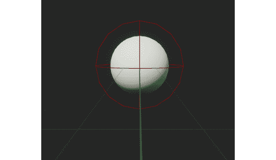

图 13.39：MeshComp 的比例更适合 Collision Comp 的大小

日志警告应如下所示：


图 13.40：当抛射物击中物体时，在输出日志中显示文本 HIT

完成这最后一个活动后，`Player Projectile`已准备好进入下一章，在这一章中，当玩家使用`Throw`动作时，您将生成此抛射物。您将更新`APlayerProjectile::OnHit`函数，以便它销毁与之发生碰撞的敌人，并成为玩家用来对抗敌人的有效进攻工具。

注意

此活动的解决方案可在以下网址找到：[`packt.live/338jEBx`](https://packt.live/338jEBx)。

# 总结

在本章中，您学习了如何使用 Unreal Engine 4 提供的 AI 工具的不同方面，包括黑板、行为树和 AI 控制器。通过自定义创建的任务和 Unreal Engine 4 提供的默认任务的组合，并使用装饰器，您能够使敌人 AI 在您自己级别中添加的 Nav Mesh 的范围内导航。

除此之外，您还创建了一个新的蓝图角色，允许您使用`Vector`数组变量添加巡逻点。然后，您为此角色添加了一个新函数，该函数随机选择其中一个点，将其位置从局部空间转换为世界空间，然后返回此新值供敌人角色使用。

通过能够随机选择巡逻点，您更新了自定义的`BTTask_FindLocation`任务，以查找并移动到所选的巡逻点，使敌人能够从每个巡逻点随机移动。这将使敌人 AI 角色与玩家和环境的互动达到一个全新的水平。

最后，您创建了玩家抛射物，玩家将能够使用它来摧毁环境中的敌人。您利用了`Projectile Movement Component`和`Sphere Component`，以允许抛射物移动并识别和响应环境中的碰撞。

随着玩家抛射物处于功能状态，现在是时候进入下一章了，在这一章中，您将使用`Anim Notifies`在玩家使用`Throw`动作时生成抛射物。
