# 14. 生成玩家投射物

概述

在本章中，你将学习`Anim Notifies`和`Anim States`，这些可以在动画蒙太奇中找到。你将使用 C++编写自己的`Anim Notify`，并在`Throw`动画蒙太奇中实现此通知。最后，你将学习视觉和音频效果，以及这些效果在游戏中的使用。

在本章结束时，你将能够在蓝图和 C++中播放动画蒙太奇，并知道如何使用 C++和`UWorld`类将对象生成到游戏世界中。这些游戏元素将被赋予音频和视觉组件作为额外的精细层，并且你的`SuperSideScroller`玩家角色将能够投掷摧毁敌人的投射物。

# 介绍

在上一章中，通过创建一个行为树，使敌人可以从你创建的`BP_AIPoints`角色中随机选择点，你在敌人角色的 AI 方面取得了很大的进展。这使得`SuperSideScroller`游戏更加生动，因为现在你可以在游戏世界中有多个敌人移动。此外，你还学会了虚幻引擎 4 中一些可用于制作各种复杂程度的人工智能的不同工具。这些工具包括`导航网格`、行为树和黑板。

现在你的游戏中有敌人在四处奔跑，你需要允许玩家用上一章末开始创建的玩家投射物来击败这些敌人。

在本章中，你将学习如何使用`UAnimNotify`类在`Throw`动画蒙太奇的特定帧生成玩家投射物。你还将学习如何将这个新的通知添加到蒙太奇本身，以及如何向主角骨骼添加一个新的`Socket`，从中投射物将生成。最后，你将学习如何使用`粒子系统`和`声音提示`为游戏添加视觉和音频层。

让我们通过学习`Anim Notifies`和`Anim Notify States`开始本章。之后，你将通过创建自己的`UAnimNotify`类来实践，以便在`Throw`动画蒙太奇期间生成玩家投射物。

# Anim Notifies 和 Anim Notify States

在创建精致和复杂的动画时，需要一种方式让动画师和程序员在动画中添加自定义事件，以允许发生额外的效果、层和功能。虚幻引擎 4 中的解决方案是使用`Anim Notifies`和`Anim Notify States`。

`Anim Notify`和`Anim Notify State`之间的主要区别在于`Anim Notify State`具有三个`Anim Notify`没有的独特事件。这些事件分别是`Notify Begin`，`Notify End`和`Notify Tick`，所有这些事件都可以在蓝图或 C++中使用。当涉及到这些事件时，虚幻引擎 4 确保以下行为：

+   `Notify State`始终以`Notify Begin Event`开始。

+   `Notify State`将始终以`Notify End Event`结束。

+   `Notify Tick Event`将始终发生在`Notify Begin`和`Notify End`事件之间。

然而，`Anim Notify`是一个更简化的版本，它只使用一个函数`Notify()`，允许程序员为通知本身添加功能。它的工作方式是“发射并忘记”，这意味着你不需要担心`Notify()`事件的开始、结束或中间发生了什么。正是由于`Anim Notify`的简单性，以及我们不需要`Anim Notify State`中包含的事件，我们将使用`Anim Notify`来为 Super Side-Scroller 游戏生成玩家投射物。

在进行下一个练习之前，你将在 C++中创建自己的自定义`Anim Notify`，让我们简要讨论一些虚幻引擎 4 默认提供的`Anim Notifies`的示例。默认`Anim Notifies`状态的完整列表可以在以下截图中看到：

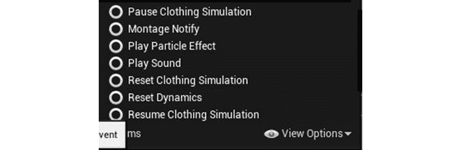

图 14.1：Unreal Engine 4 中提供的默认 Anim 通知的完整列表

在本章后面，您将使用两个`Anim 通知`：`播放粒子效果`和`播放声音`。让我们更详细地讨论这两个，以便在使用它们时您对它们更加熟悉：

+   `播放粒子效果`：`播放粒子效果`通知允许您在动画的某一帧生成和播放粒子系统，正如其名称所示。如下面的屏幕截图所示，您可以更改正在使用的 VFX，例如更新粒子的`位置`、`旋转`和`缩放`设置。您甚至可以将粒子附加到指定的`Socket 名称`，如果您愿意的话：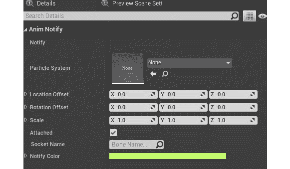

图 14.2：播放粒子效果通知的详细面板，允许您自定义粒子

注意

视觉效果，简称 VFX，对于任何游戏来说都是至关重要的元素。在 Unreal Engine 4 中，使用一个名为*Cascade*的工具在编辑器内创建视觉效果。自 Unreal Engine 版本 4.20 以来，引入了一个名为*Niagara*的新工具作为免费插件，以改进 VFX 的质量和流程。您可以在这里了解更多关于*Niagara*的信息：[`docs.unrealengine.com/en-US/Engine/Niagara/Overview/index.html`](https://docs.unrealengine.com/en-US/Engine/Niagara/Overview/index.html)。

游戏中常见的一个例子是使用这种类型的通知在玩家行走或奔跑时在玩家脚下生成泥土或其他效果。能够指定在动画的哪一帧生成这些效果非常强大，可以让您为角色创建令人信服的效果。

+   `播放声音`：`播放声音`通知允许您在动画的某一帧播放`Soundcue`或`Soundwave`。如下面的屏幕截图所示，您可以更改正在使用的声音，更新其`音量`和`音调`值，甚至通过将其附加到指定的`Socket 名称`使声音跟随声音的所有者：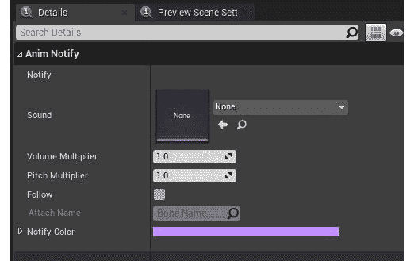

图 14.3：播放声音通知的详细面板，允许您自定义声音

与`播放粒子效果`通知所示的例子类似，`播放声音`通知也可以常用于在角色移动时播放脚步声。通过精确控制在动画时间轴的哪个位置播放声音，可以创建逼真的声音效果。

虽然您将不会使用`Anim 通知状态`，但至少了解默认情况下可用的选项仍然很重要，如下面的屏幕截图所示：

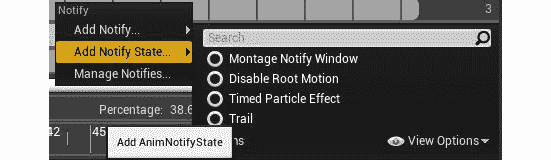

图 14.4：Unreal Engine 4 中提供给您的默认 Anim 通知状态的完整列表

注意

在动画序列中不可用的两个“通知”状态是*Montage 通知窗口*和*禁用根动作*状态，如前面的屏幕截图所示。有关通知的更多信息，请参阅以下文档：[docs.unrealengine.com/en-US/Engine/Animation/Sequences/Notifies/index.html](http://docs.unrealengine.com/en-US/Engine/Animation/Sequences/Notifies/index.html)。

现在您对`Anim 通知`和`Anim 通知状态`更加熟悉，让我们继续进行下一个练习，您将在 C++中创建自定义的`Anim 通知`，用于生成玩家的投射物。

## 练习 14.01：创建一个 UAnim 通知类

玩家角色在`SuperSideScroller`游戏中的主要进攻能力是玩家可以向敌人投掷的投射物。在上一章中，您设置了投射物的框架和基本功能，但现在，玩家无法使用它。为了使生成或投掷投射物对眼睛有说服力，您需要创建一个自定义的`Anim Notify`，然后将其添加到`Throw`动画蒙太奇中。这个`Anim Notify`将让玩家知道是时候生成投射物了。

执行以下操作创建新的`UAnimNotify`类：

1.  在虚幻引擎 4 中，导航到`文件`选项，*左键单击*选择`新的 C++类`选项。

1.  从“选择父类”对话框窗口中，搜索`AnimNotify`并*左键单击*`AnimNotify`选项。然后，*左键单击*“下一步”选项来命名新类。

1.  将此新类命名为`Anim_ProjectileNotify`。命名后，*左键单击*选择`创建类`选项，以便虚幻引擎 4 重新编译并在 Visual Studio 中热重载新类。一旦 Visual Studio 打开，您将可以使用头文件`Anim_ProjectileNotify.h`和源文件`Anim_ProjectileNotify.cpp`。

1.  `UAnimNotify`基类有一个函数需要在您的类中实现：

```cpp
    virtual void Notify(USkeletalMeshComponent* MeshComp,   UAnimSequenceBase* Animation); 
    ```

当时间轴上的通知被击中时，此函数将自动调用。通过覆盖此函数，您将能够向通知添加自己的逻辑。此函数还使您能够访问拥有通知的`骨骼网格`组件以及当前正在播放的动画序列。

1.  接下来，让我们在头文件中添加此函数的覆盖声明。在头文件`Anim_ProjectileNotify.h`中，在`GENERATED_BODY()`下面添加以下代码：

```cpp
    public:  virtual void Notify(USkeletalMeshComponent*   MeshComp,UAnimSequenceBase* Animation) override;
    ```

现在您已经将函数添加到头文件中，是时候在`Anim_ProjectileNotify`源文件中定义该函数了。

1.  在`Anim_ProjectileNotify.cpp`源文件中，定义该函数并添加一个`UE_LOG()`调用，打印文本`"Throw Notify"`，如下所示：

```cpp
    void UAnim_ProjectileNotify::Notify(USkeletalMeshComponent*   MeshComp, UAnimSequenceBase* Animation)
    {
      UE_LOG(LogTemp, Warning, TEXT("Throw Notify"));
    }
    ```

目前，您将仅使用此`UE_LOG()`调试工具，以便知道在下一个练习中将此通知添加到`Throw`动画蒙太奇时，该函数是否被正确调用。

在本练习中，您通过添加以下函数创建了实现自己的`AnimNotify`类所需的基础工作：

```cpp
Notify(USkeletalMeshComponent* MeshComp, UAnimSequenceBase* Animation)
```

在此函数中，您使用`UE_LOG()`在输出日志中打印自定义文本`"Throw Notify"`，以便您知道此通知是否正常工作。

在本章后面，您将更新此函数，以便调用将生成玩家投射物的逻辑，但首先，让我们将新通知添加到`Throw`动画蒙太奇中。

## 练习 14.02：将通知添加到投掷蒙太奇

现在您有了`Anim_ProjectileNotify`通知，是时候将此通知添加到`Throw`动画蒙太奇中，以便实际为您所用。

在本练习中，您将在`Throw`蒙太奇的时间轴上的确切帧上添加`Anim_ProjectileNotify`，以便您期望投射物生成。

完成以下步骤以实现此目标：

1.  回到虚幻引擎，在`内容浏览器`界面中，转到`/MainCharacter/Animation/`目录。在此目录中，*双击*`AM_Throw`资产以打开`动画蒙太奇`编辑器。

在`动画蒙太奇`编辑器的底部，您将找到动画的时间轴。默认情况下，您会观察到*红色的条*会随着动画的播放而沿着时间轴移动。

1.  *左键单击*这个`红色`条，并手动将其移动到第 22 个`帧`，尽可能靠近，如下面的截图所示：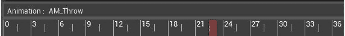

图 14.5：红色条允许您在时间轴上手动定位通知

`Throw`动画的第 22 帧是您期望玩家生成并投掷抛射物的确切时刻。以下截图显示了抛掷动画的帧，如在`Persona`编辑器中所见：

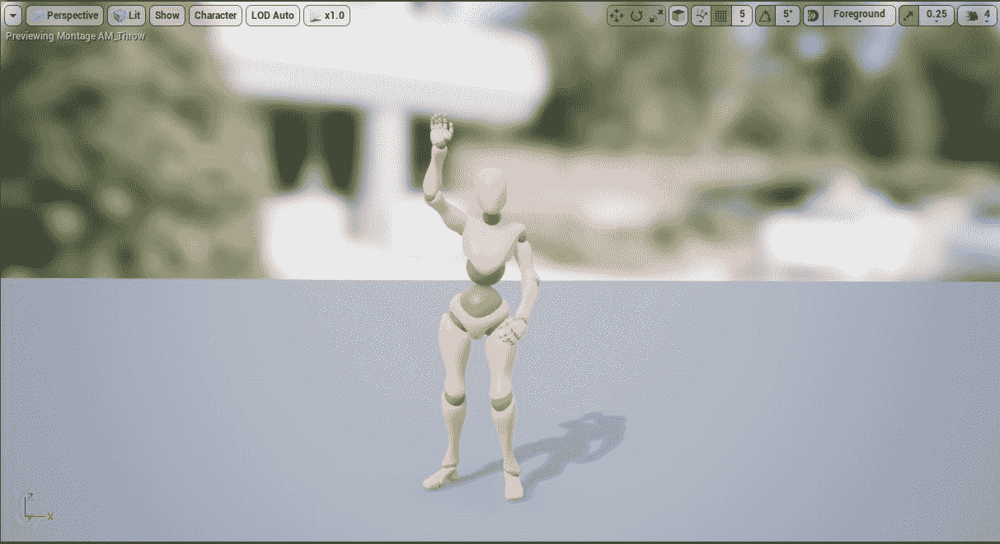

图 14.6：玩家抛射物应该生成的确切时刻

1.  现在您已经知道通知应该播放的时间轴位置，您现在可以在`Notifies`时间轴上*右键单击*细长的`红色`线。

这将显示一个弹出窗口，您可以在其中添加`Notify`或`Notify State`。在某些情况下，`Notifies`时间轴可能会被折叠并且难以找到；只需左键单击`Notifies`一词，即可在折叠和展开之间切换。

1.  选择`Add Notify`，然后从提供的选项中找到并选择`Anim Projectile Notify`。

1.  在将`Anim Projectile Notify`添加到通知时间轴后，您将看到以下内容：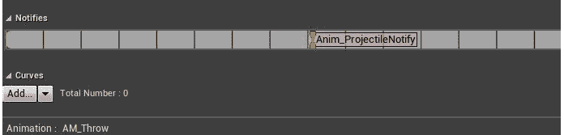

图 14.7：Anim_ProjectileNotify 成功添加到 Throw 动画蒙太奇

1.  在`Throw`动画蒙太奇时间轴上放置`Anim_ProjectileNotify`通知后，保存蒙太奇。

1.  如果`Output Log`窗口不可见，请通过导航到`Window`选项并悬停在`Developer Tools`上来重新启用窗口。找到`Output Log`选项，*左键单击*以启用它。

1.  现在，使用`PIE`，一旦进入游戏，使用*左鼠标按钮*开始播放`Throw`蒙太奇。

在您添加通知的动画位置，您现在将在输出日志中看到调试日志文本`Throw Notify`出现。

正如您可能还记得的*第十二章*，*动画混合和蒙太奇*中，您已将`Play Montage`函数添加到了玩家角色蓝图`BP_SuperSideScroller_MainCharacter`。为了在 Unreal Engine 4 的上下文中学习 C++，您将在即将进行的练习中将此逻辑从蓝图移至 C++。这样我们就不会过分依赖蓝图脚本来实现玩家角色的基本行为。

完成此练习后，您已成功将自定义的`Anim Notify`类`Anim_ProjectileNotify`添加到`Throw`动画蒙太奇中。此通知已添加到您期望从玩家手中投掷抛射物的确切帧。由于您在*第十二章*，*动画混合和蒙太奇*中为玩家角色添加了蓝图逻辑，因此当使用*左鼠标按钮*调用`InputAction`事件`ThrowProjectile`时，您可以播放此`Throw`动画蒙太奇。在从蓝图中播放 Throw 动画蒙太奇转换为从 C++中播放蒙太奇之前，让我们再讨论一下播放动画蒙太奇。

# 播放动画蒙太奇

正如您在*第十二章*，*动画混合和蒙太奇*中所学到的，这些项目对于允许动画师将单独的动画序列组合成一个完整的蒙太奇非常有用。通过将蒙太奇分割为自己独特的部分并为粒子和声音添加通知，动画师和动画程序员可以制作处理动画的所有不同方面的复杂蒙太奇集。

但是一旦动画蒙太奇准备就绪，我们如何在角色上播放这个蒙太奇？您已经熟悉第一种方法，即通过蓝图。

## 在蓝图中播放动画蒙太奇

在蓝图中，`Play Montage`函数可供您使用，如下截图所示：

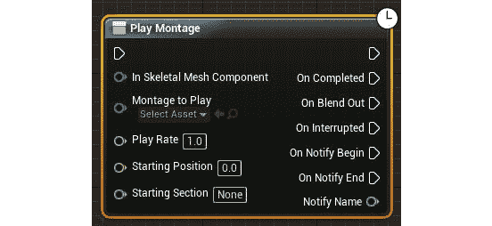

图 14.8：蓝图中的播放蒙太奇功能

您已经使用了播放`AM_Throw`动画 Montage 的函数。此函数需要 Montage 必须在其上播放的“骨骼网格”组件，并且需要播放的动画 Montage。

其余的参数是可选的，具体取决于 Montage 的工作方式。让我们快速看看这些参数：

+   “播放速率”： “播放速率”参数允许您增加或减少动画 Montage 的播放速度。要加快播放速度，您将增加此值；否则，您将减少值以减慢播放速度。

+   “起始位置”： “起始位置”参数允许您设置 Montage 时间轴上的起始位置（以秒为单位），从该位置开始播放 Montage。例如，在一个持续 3 秒的动画 Montage 中，您可以选择让 Montage 从`1.0f`位置开始，而不是从`0.0f`开始。

+   “起始部分”： “起始部分”参数允许您告诉动画 Montage 从特定部分开始。根据 Montage 的设置方式，您可以为 Montage 的不同部分创建多个部分。例如，霰弹枪武器重新装填动画 Montage 将包括一个用于重新装填的初始移动部分，一个用于实际子弹重新装填的循环部分，以及一个用于重新装备武器的最终部分，以便它准备好再次开火。

当涉及到`Play Montage`函数的输出时，您有几种不同的选择：

+   “完成时”： “完成时”输出在动画 Montage 完成播放并完全混合结束时调用。

+   “混合结束时”： “混合结束时”输出在动画 Montage 开始混合结束时调用。这可能发生在“混合触发时间”期间，或者如果 Montage 过早结束。

+   “中断时”： “中断时”输出在由于另一个试图在相同骨架上播放的 Montage 中断此 Montage 而开始混合结束时调用。

+   “通知开始”和“通知结束”：如果您正在使用动画 Montage 中“通知”类别下的“Montage 通知”选项，则“通知开始”和“通知结束”输出都会被调用。通过“通知名称”参数返回给 Montage 通知的名称。

## 在 C++中播放动画 Montage

在 C++方面，您只需要了解一个事情，那就是`UAnimInstance::Montage_Play()`函数。此函数需要要播放的动画 Montage，以及播放 Montage 的播放速率，EMontagePlayReturnType 类型的值，用于确定播放 Montage 的起始位置的 float 值，以及用于确定是否停止或中断所有 Montage 的布尔值。

尽管您不会更改`EMontagePlayReturnType`的默认参数，即`EMontagePlayReturnType::MontageLength`，但仍然重要知道此枚举器存在的两个值：

+   “Montage 长度”： “Montage 长度”值返回 Montage 本身的长度，以秒为单位。

+   “持续时间”： “持续时间”值返回 Montage 的播放持续时间，等于 Montage 的长度除以播放速率。

注意

有关`UAnimMontage`类的更多详细信息，请参阅以下文档：https://docs.unrealengine.com/en-US/API/Runtime/Engine/Animation/UAnimMontage/index.html。

您将在下一个练习中了解有关播放动画 Montage 的 C++实现的更多信息。

## 练习 14.03：在 C++中播放投掷动画

现在你对在虚幻引擎 4 中通过蓝图和 C++播放动画蒙太奇有了更好的理解，是时候将播放“投掷”动画蒙太奇的逻辑从蓝图迁移到 C++了。这个改变的原因是因为蓝图逻辑是作为一个占位方法放置的，这样你就可以预览“投掷”蒙太奇。这本书更加专注于 C++游戏开发，因此，学习如何在代码中实现这个逻辑是很重要的。

让我们首先从蓝图中移除逻辑，然后继续在玩家角色类中用 C++重新创建这个逻辑。

以下步骤将帮助你完成这个练习：

1.  导航到玩家角色蓝图，`BP_SuperSideScroller_MainCharacter`，可以在以下目录中找到：`/MainCharacter/Blueprints/`。*双击*这个资源来打开它。

1.  在这个蓝图中，你会找到`InputAction ThrowProjectile`事件和你创建的`Play Montage`函数，用于预览`Throw`动画蒙太奇，如下截图所示。删除这个逻辑，然后重新编译并保存玩家角色蓝图：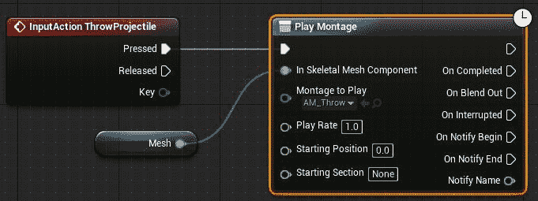

图 14.9：你不再需要在玩家角色蓝图中使用这个占位逻辑

1.  现在，使用`PIE`并尝试用*左鼠标按钮*让玩家角色投掷。你会发现玩家角色不再播放`Throw`动画蒙太奇。让我们通过在 C++中添加所需的逻辑来修复这个问题。

1.  在 Visual Studio 中打开玩家角色的头文件，`SuperSideScroller_Player.h`。

1.  你需要做的第一件事是创建一个新的变量，用于玩家角色的`Throw`动画。在`Private`访问修饰符下添加以下代码：

```cpp
    UPROPERTY(EditAnywhere)
    class UAnimMontage* ThrowMontage;
    ```

现在你有一个变量，它将代表“投掷”动画蒙太奇，是时候在`SuperSideScroller_Player.cpp`文件中添加播放蒙太奇的逻辑了。

1.  在你调用`UAnimInstance::Montage_Play()`之前，你需要在源文件顶部的现有列表中添加以下`include`目录，以便访问这个函数：

```cpp
    #include "Animation/AnimInstance.h"
    ```

正如我们从*第九章*，*音频-视觉元素*中知道的，玩家角色已经有一个名为`ThrowProjectile`的函数，每当按下*左鼠标按钮*时就会调用。作为提醒，在 C++中绑定发生在这里：

```cpp
    //Bind pressed action ThrowProjectile to your ThrowProjectile   function
    PlayerInputComponent->BindAction("ThrowProjectile", IE_Pressed,   this, &ASuperSideScroller_Player::ThrowProjectile);
    ```

1.  更新`ThrowProjectile`，使其播放你在这个练习中设置的`ThrowMontage`。将以下代码添加到`ThrowProjectile()`函数中。然后，我们可以讨论这里发生了什么：

```cpp
    void ASuperSideScroller_Player::ThrowProjectile()
    {
      if (ThrowMontage)
      {
        bool bIsMontagePlaying = GetMesh()->GetAnimInstance()->      Montage_IsPlaying(ThrowMontage);
        if (!bIsMontagePlaying)
        {
          GetMesh()->GetAnimInstance()->Montage_Play(ThrowMontage,         2.0f);
        }
        }    }
    ```

第一行是检查`ThrowMontage`是否有效；如果我们没有分配有效的动画蒙太奇，继续逻辑就没有意义，而且在后续函数调用中使用 NULL 对象可能会导致崩溃，这也是很危险的。接下来，我们声明一个新的布尔变量，称为`bIsMontagePlaying`，用于确定`ThrowMontage`是否已经在玩家角色的骨骼网格上播放。这个检查是因为`Throw`动画蒙太奇在已经播放时不应该再次播放；如果玩家反复按下*左鼠标按钮*，这将导致动画中断。

接下来，有一个`If`语句，检查`ThrowMontage`是否有效，以及蒙太奇是否正在播放。只要满足这些条件，就可以安全地继续播放动画蒙太奇。

1.  在`If`语句内部，您正在告诉玩家的骨骼网格以`1.0f`的播放速率播放`ThrowMontage`动画蒙太奇。使用`1.0f`值是为了使动画蒙太奇以预期速度播放。大于`1.0f`的值将使蒙太奇以更快的速度播放，而小于`1.0f`的值将使蒙太奇以更慢的速度播放。您学到的其他参数，如起始位置或`EMontagePlayReturnType`参数，可以保持其默认值。回到虚幻引擎 4 编辑器内，进行代码重新编译，就像您以前做过的那样。

1.  代码成功重新编译后，导航回玩家角色蓝图`BP_SuperSideScroller_MainCharacter`，该蓝图可以在以下目录中找到：`/MainCharacter/Blueprints/`。*双击*此资源以打开它。

1.  在玩家角色的“详细信息”面板中，您现在将看到您添加的“投掷动画”参数。

1.  *左键单击*“投掷动画”参数的下拉菜单，找到`AM_Throw`动画。再次*左键单击*`AM_Throw`选项以选择它作为此参数。请参考以下截图，查看变量应如何设置：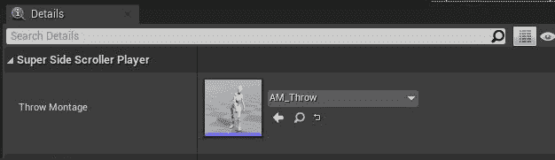

图 14.10：现在，投掷动画被分配为 AM_Throw 动画

1.  重新编译并保存玩家角色蓝图。然后，使用`PIE`生成玩家角色，并使用*鼠标左键*播放“投掷动画”。以下截图显示了这一过程：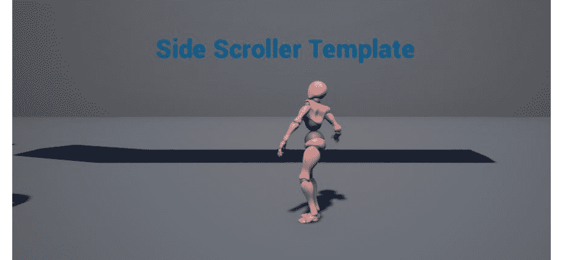

图 14.11：玩家角色现在能够再次执行投掷动画

通过完成这个练习，您已经学会了如何向玩家角色添加“动画蒙太奇”参数，以及如何在 C++中播放蒙太奇。除了在 C++中播放“投掷”动画蒙太奇之外，您还通过添加检查蒙太奇是否已经在播放来控制“投掷”动画可以播放的频率。通过这样做，您可以防止玩家不断按下“投掷”输入，导致动画中断或完全不播放。

注意

尝试将“动画蒙太奇”的播放速率从`1.0f`设置为`2.0f`，然后重新编译代码。观察增加动画播放速率如何影响玩家对动画的外观和感觉。

# 游戏世界和生成对象

当涉及将对象生成到游戏世界中时，实际上是代表您的关卡的`World`对象处理了这些对象的创建。您可以将`UWorld`类对象视为代表您的关卡的单个顶层对象。

`UWorld`类可以做很多事情，比如从世界中生成和移除对象，检测何时正在更改或流入/流出级别，甚至执行线性跟踪以帮助进行对象检测。在本章中，我们将专注于生成对象。

`UWorld`类有多种`SpawnActor()`函数的变体，取决于您希望如何生成对象，或者您在生成此对象的上下文中可以访问哪些参数。要考虑的三个一致参数是：

+   `UClass`：`UClass`参数只是您想要生成的对象的类。

+   `FActorSpawnParameters`：这是一个包含变量的结构，为生成的对象提供更多上下文和引用。有关此结构中包含的所有变量的列表，请参考虚幻引擎 4 社区维基上的这篇文章：https://www.ue4community.wiki/Actor#Spawn

让我们简要讨论`FActorSpawnParameters`中包含的一个更关键的变量：`Owner` actor。`Owner`是生成此对象的 actor，在玩家角色和投射物的情况下，您需要明确引用玩家作为投射物的所有者。尤其是在这个游戏的背景下，这是很重要的，因为您不希望投射物与其`Owner`发生碰撞；您希望这个投射物完全忽略所有者，只与敌人或关卡环境发生碰撞。

+   `Transform`：当将对象生成到世界中时，世界需要知道此 actor 的`位置`、`旋转`和`缩放`属性，然后才能生成它。在`SpawnActor()`函数的某些模板中，需要传递完整的`Transform`，而在其他模板中，需要单独传递`Location`和`Rotation`。

在继续生成玩家投射物之前，让我们设置玩家角色“骨架”中的`Socket`位置，以便在“投掷”动画期间可以从*玩家手*生成投射物。

## 练习 14.04：创建投射物生成 Socket

为了生成玩家投射物，您需要确定投射物将生成的`Transform`，主要关注`位置`和`旋转`，而不是`缩放`。

在这个练习中，您将在玩家角色的“骨架”上创建一个新的`Socket`，然后可以在代码中引用它，以便获取生成投射物的位置。

让我们开始吧：

1.  在虚幻引擎 4 中，导航到“内容浏览器”界面，找到`/MainCharacter/Mesh/`目录。

1.  在此目录中，找到“骨架”资产；即`MainCharacter_Skeleton.uasset`。*双击*打开此“骨架”。

为了确定投射物应该生成的最佳位置，我们需要将“投掷”动画剪辑添加为骨架的预览动画。

1.  在`Details`面板中，在`Animation`类别下，找到`Preview Controller`参数，并选择`Use Specific Animation`选项。

1.  接下来，*左键单击*下拉菜单，找到并选择可用动画列表中的`AM_Throw`动画剪辑。

现在，玩家角色的“骨架”将开始预览“投掷”动画剪辑，如下面的屏幕截图所示：

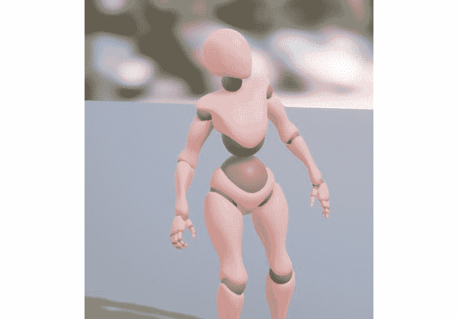

图 14.12：玩家角色预览投掷动画剪辑

如果您还记得*练习 14.02*，*添加到投掷剪辑的通知*，您在“投掷”动画的第 22 帧添加了`Anim_ProjectileNotify`。

1.  使用“骨架”编辑器底部的时间轴，将“红色”条移动到尽可能接近第 22 帧。请参考以下屏幕截图：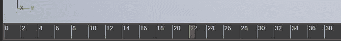

图 14.13：在之前的练习中添加了 Anim_ProjectileNotify 的第 22 帧相同的帧

在“投掷”动画的第 22 帧，玩家角色应该如下所示：

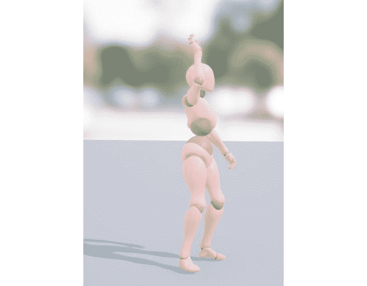

图 14.14：在投掷动画剪辑的第 22 帧，角色的手位于释放投射物的位置

正如您所看到的，玩家角色将从他们的右手投掷投射物，因此新的`Socket`应该连接到*右手*。让我们看一下玩家角色的骨骼层次结构，如下面的屏幕截图所示：

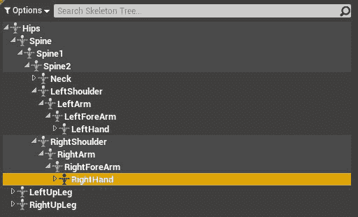

图 14.15：在玩家角色骨架的层次结构中找到的 RightHand 骨骼

1.  从骨骼层次结构中找到`RightHand`骨骼。这可以在`RightShoulder`骨骼层次结构下找到。

1.  *右键单击*`RightHand`骨骼，然后*左键单击*出现的选项列表中的`Add Socket`选项。将此插座命名为`ProjectileSocket`。

此外，当添加一个新的`Socket`时，整个`RightHand`的层次结构将扩展，新的插座将出现在底部。

1.  选择`ProjectileSocket`，使用`Transform`小部件小部件将此`Socket`定位到以下位置：

```cpp
    Location = (X=12.961717,Y=25.448450,Z=-7.120584)
    ```

最终结果应该如下所示：

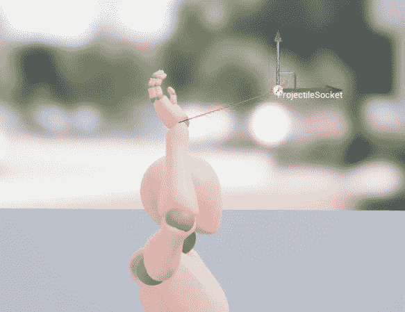

图 14.16：抛射物插座在世界空间中抛出动画的第 22 帧的最终位置。

如果你的小部件看起来有点不同，那是因为上面的图像显示了世界空间中的插座位置，而不是本地空间。

1.  现在`ProjectileSocket`的位置已经就位，保存`MainCharacter_Skeleton`资产。

通过完成这个练习，你现在知道玩家抛射物将从哪个位置生成。由于你在预览中使用了`Throw`动画蒙太奇，并使用了相同的动画的第 22 帧，所以你知道这个位置将根据`Anim_ProjectileNotify`的触发时间是正确的。

现在，让我们继续在 C++中生成玩家抛射物。

## 练习 14.05：准备`SpawnProjectile()`函数

现在`ProjectileSocket`已经就位，并且现在有一个位置可以生成玩家抛射物了，让我们添加生成玩家抛射物所需的代码。

通过这个练习结束时，你将有一个准备好生成抛射物的函数，并且它将准备好从`Anim_ProjectileNotify`类中调用。

执行以下步骤：

1.  从 Visual Studio 中，导航到`SuperSideScroller_Player.h`头文件。

1.  你需要一个指向`PlayerProjectile`类的类引用变量。你可以使用名为`TSubclassOf`的变量模板类类型来实现这一点。在`Private`访问修饰符下，将以下代码添加到头文件中：

```cpp
    UPROPERTY(EditAnywhere)
    TSubclassOf<class APlayerProjectile> PlayerProjectile;
    ```

现在你已经准备好变量，是时候声明你将用来生成抛射物的函数了。

1.  在`ThrowProjectile()`函数的声明和`Public`访问修饰符下添加以下函数声明：

```cpp
    void SpawnProjectile();
    ```

1.  在准备`SpawnProjectile()`函数的定义之前，将以下`include`目录添加到`SuperSideScroller_Player.cpp`源文件的包含列表中：

```cpp
    #include "PlayerProjectile.h"
    #include "Engine/World.h"
    #include "Components/SphereComponent.h"
    ```

你需要包含`PlayerProjectile.h`，因为这是为了引用抛射物类的碰撞组件而必需的。接下来，使用`Engine/World.h`的包含是为了使用`SpawnActor()`函数和访问`FActorSpawnParameters`结构。最后，你需要使用`Components/SphereComponent.h`的包含，以便更新玩家抛射物的碰撞组件，使其忽略玩家。

1.  接下来，在`SuperSideScroller_Player.cpp`源文件的底部创建`SpawnProjectile()`函数的定义，如下所示：

```cpp
    void ASuperSideScroller_Player::SpawnProjectile()
    {
    }
    ```

这个函数需要做的第一件事是检查`PlayerProjectile`类变量是否有效。如果这个对象无效，继续尝试生成它就没有意义了。

1.  更新`SpawnProjectile()`函数如下：

```cpp
    void ASuperSideScroller_Player::SpawnProjectile()
    {
      if(PlayerProjectile)
        {
        }
    }
    ```

现在，如果`PlayerProjectile`对象有效，你将想要获取玩家当前存在的`UWorld`对象，并确保这个世界在继续之前是有效的。

1.  更新`SpawnProjectile()`函数如下：

```cpp
    void ASuperSideScroller_Player::SpawnProjectile()
    {
      if(PlayerProjectile)
        {
          UWorld* World = GetWorld();
          if (World)
            {
            }
        }
    }
    ```

此时，你已经进行了安全检查，以确保`PlayerProjectile`和`UWorld`都是有效的，所以现在可以安全地尝试生成抛射物了。首先要做的是声明一个新的`FactorSpawnParameters`类型的变量，并将玩家指定为所有者。

1.  在最近的`if`语句中添加以下代码，使`SpawnProjectile()`函数看起来像这样：

```cpp
    void ASuperSideScroller_Player::SpawnProjectile()
    {
      if(PlayerProjectile)
        {
          UWorld* World = GetWorld();
          if (World)
            {
              FActorSpawnParameters SpawnParams;
              SpawnParams.Owner = this; 
            }
        }
    }
    ```

正如你之前学到的，`UWorld`对象的`SpawnActor()`函数调用将需要`FActorSpawnParameters`结构作为生成对象的初始化的一部分。对于玩家投射物，你可以使用`this`关键字作为玩家角色类的引用，作为投射物的所有者。这在以后在这个函数中更新投射物的碰撞时会派上用场。

1.  接下来，你需要处理`SpawnActor()`函数的`Location`和`Rotation`参数。在最新的一行下面添加以下行：

```cpp
    FVector SpawnLocation = this->GetMesh()-  >GetSocketLocation(FName("ProjectileSocket"));
    FRotator Rotation = GetActorForwardVector().Rotation();
    ```

在第一行中，声明一个名为`SpawnLocation`的新`FVector`变量。这个向量使用你在上一个练习中创建的`ProjectileSocket`插座的`Socket`位置。从`GetMesh()`函数返回的`Skeletal Mesh`组件包含一个名为`GetSocketLocation()`的函数，它将返回传入的`FName`的插座位置；在这种情况下，是名为`ProjectileSocket`。

在第二行，声明一个名为`Rotation`的新`FRotator`变量。这个值设置为玩家的前向向量，转换为`Rotator`容器。这将确保玩家投射物生成的旋转，或者换句话说，方向，将在玩家的前方，并且它将远离玩家。

现在，生成项目所需的所有参数都已准备好。

1.  在上一步的代码下面添加以下行：

```cpp
    APlayerProjectile* Projectile = World-  >SpawnActor<APlayerProjectile>(PlayerProjectile, SpawnLocation,   Rotation, SpawnParams);
    ```

`World->SpawnActor()`函数将返回你尝试生成的类的对象；在这种情况下是`APlayerProjectile`。这就是为什么在实际生成之前要添加`APlayerProjectile* Projectile`。然后，你要传入`SpawnLocation`、`Rotation`和`SpawnParams`参数，以确保项目生成在你想要的位置和方式。

1.  最后，你可以通过添加以下代码行将玩家角色添加到要忽略的演员数组中：

```cpp
    if (Projectile)
    {
      Projectile->CollisionComp->    MoveIgnoreActors.Add(SpawnParams.Owner);
    }
    ```

现在你有了投射物的引用，这一行正在更新`CollisionComp`组件，以便将玩家或`SpawnParams.Owner`添加到`MoveIgnoreActors`数组中。这个演员数组将被投射物的碰撞忽略，因为这个投射物不应该与投掷它的玩家发生碰撞。

1.  返回编辑器重新编译新添加的代码。代码成功编译后，这个练习就完成了。

完成这个练习后，你现在有一个函数，可以生成分配给玩家角色内的玩家投射物类。通过为投射物和世界的有效性添加安全检查，你确保如果生成了一个对象，它是一个有效的对象在一个有效的世界内。

接下来，为`UWorld SpawnActor()`函数设置适当的`location`、`rotation`和`FActorSpawnParameters`参数，以确保玩家投射物在正确的位置生成，基于上一个练习中的插座位置，以适当的方向远离玩家，并以玩家角色作为其`Owner`。

现在是时候更新`Anim_ProjectileNotify`源文件，以便生成投射物。

## 练习 14.06：更新 Anim_ProjectileNotify 类

你已经准备好允许玩家投射物生成的函数，但是你还没有在任何地方调用这个函数。回到*练习 14.01*，*创建 UAnim Notify 类*，你创建了`Anim_ProjectileNotify`类，而在*练习 14.02*，*将通知添加到投掷动画*，你将这个通知添加到`Throw`动画蒙太奇中。

现在是时候更新`Uanim` `Notify`类，以便调用`SpawnProjectile()`函数。

要实现这一点，请执行以下操作：

1.  在 Visual Studio 中，打开`Anim_ProjectileNotify.cpp`源文件。

在源文件中，您有以下代码：

```cpp
    #include "Anim_ProjectileNotify.h"
    void UAnim_ProjectileNotify::Notify(USkeletalMeshComponent*   MeshComp, UAnimSequenceBase* Animation)
    {
      UE_LOG(LogTemp, Warning, TEXT("Throw Notify"));
    }
    ```

1.  从`Notify()`函数中删除`UE_LOG()`行。

1.  接下来，在`Anim_ProjectileNotify.h`下面添加以下`include`行：

```cpp
    #include "Components/SkeletalMeshComponent.h"
    #include "SuperSideScroller/SuperSideScroller_Player.h"
    ```

您需要包含`SuperSideScroller_Player.h`头文件，因为这是在调用您在上一个练习中创建的`SpawnProjectile()`函数时所需的。我们还包括了`SkeletalMeshComponent.h`，因为我们将在`Notify()`函数中引用此组件，所以最好也在这里包含它。

`Notify()`函数传入拥有的`Skeletal Mesh`的引用，标记为`MeshComp`。您可以使用骨骼网格来通过使用`GetOwner()`函数并将返回的角色转换为您的`SuperSideScroller_Player`类来获取对玩家角色的引用。我们将在下一步中执行此操作。

1.  在`Notify()`函数中，添加以下代码行：

```cpp
    ASuperSideScroller_Player* Player =   Cast<ASuperSideScroller_Player>(MeshComp->GetOwner());
    ```

1.  现在您已经有了对玩家的引用，您需要在调用`SpawnProjectile()`函数之前对`Player`变量进行有效性检查。在上一步的行之后添加以下代码行：

```cpp
    if (Player)
    {
      Player->SpawnProjectile();
    }
    ```

1.  现在`SpawnProjectile()`函数从`Notify()`函数中被调用，返回编辑器重新编译和热重载您所做的代码更改。

在您能够使用`PIE`四处奔跑并投掷玩家投射物之前，您需要从上一个练习中分配`Player Projectile`变量。

1.  在`Content Browser`界面中，导航到`/MainCharacter/Blueprints`目录，找到`BP_SuperSideScroller_MainCharacter`蓝图。 *双击*打开蓝图。

1.  在`Details`面板中，在`Throw Montage`参数下，您将找到`Player Projectile`参数。 *左键单击*此参数的下拉选项，并找到`BP_PlayerProjectile`。 *左键单击*此选项以将其分配给`Player Projectile`变量。

1.  重新编译并保存`BP_SuperSideScroller_MainCharacter`蓝图。

1.  现在，使用`PIE`并使用*鼠标左键*。玩家角色将播放`Throw`动画，玩家投射物将生成。

注意，投射物是从您创建的`ProjectileSocket`函数中生成的，并且它远离玩家。以下截图显示了这一点：

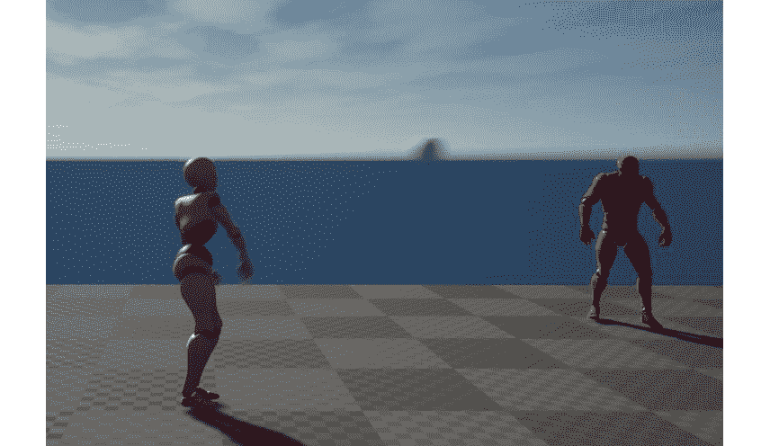

图 14.17：玩家现在可以投掷玩家投射物

完成此练习后，玩家现在可以投掷玩家投射物。当前状态下的玩家投射物对敌人无效，只是在空中飞行。在`Throw`动画 Montage、`Anim_ProjectileNotify`类和玩家角色之间需要很多移动部件才能让玩家投掷投射物。

在即将进行的练习中，您将更新玩家投射物，以便销毁敌人并播放额外的效果，如粒子和声音。

# 销毁角色

到目前为止，在本章中，我们已经非常关注在游戏世界中生成或创建角色；玩家角色使用`UWorld`类来生成投射物。Unreal Engine 4 及其基本的`Actor`类带有一个默认函数，您可以使用它来销毁或移除游戏世界中的角色：

```cpp
bool AActor::Destroy( bool bNetForce, bool bShouldModifyLevel )
```

您可以在 Visual Studio 中找到此函数的完整实现，方法是在`/Source/Runtime/Engine/Actor.cpp`目录中找到`Actor.cpp`源文件。此函数存在于所有扩展自`Actor`类的类中，在 Unreal Engine 4 的情况下，它存在于所有可以在游戏世界中生成或放置的类中。更明确地说，`EnemyBase`和`PlayerProjectile`类都是`Actor`类的*子类*，因此可以被销毁。

进一步查看`AActor::Destroy()`函数，您将找到以下行：

```cpp
World->DestroyActor( this, bNetForce, bShouldModifyLevel );
```

我们不会详细讨论`UWorld`类到底如何销毁角色，但重要的是要强调`UWorld`类负责在世界中创建和销毁角色。随时深入挖掘源引擎代码，找到更多关于`UWorld`类如何处理角色的销毁和生成的信息。

现在你对 Unreal Engine 4 如何处理游戏世界中的角色的销毁和移除有了更多的上下文，我们将为敌人角色实现这一功能。

## 练习 14.07：创建 DestroyEnemy()函数

`Super SideScroller`游戏的主要玩法是玩家在关卡中移动并使用投射物来摧毁敌人。在项目的这一阶段，你已经处理了玩家移动和生成玩家投射物。然而，投射物还不能摧毁敌人。

为了实现这个功能，我们将首先向`EnemyBase`类添加一些逻辑，以便它知道如何处理自己的销毁，并在与玩家投射物碰撞时从游戏中移除它。

完成以下步骤来实现这一点：

1.  首先，转到 Visual Studio 并打开`EnemyBase.h`头文件。

1.  在头文件中，在`Public`访问修饰符下创建一个名为`DestroyEnemy()`的新函数声明，如下所示：

```cpp
    public:
      void DestroyEnemy();
    ```

确保这个函数定义写在`GENERATED_BODY()`下面，在类定义内部。

1.  保存这些更改到头文件，并打开`EnemyBase.cpp`源文件，以添加这个函数的实现。

1.  在`#include`行下面，添加以下函数定义：

```cpp
    void AEnemyBase::DestroyEnemy()
    {
    }
    ```

目前，这个函数将非常简单。你只需要调用基类`Actor`的继承`Destroy()`函数。

1.  更新`DestroyEnemy()`函数，使其看起来像这样：

```cpp
    void AEnemyBase::DestroyEnemy()
    {
      Destroy();
    }
    ```

1.  完成这个函数后，保存源文件并返回编辑器，这样你就可以重新编译和热重载代码了。

完成这个练习后，敌人角色现在有一个函数，可以轻松处理角色的销毁。`DestroyEnemy()`函数是公开可访问的，因此其他类可以调用它，在处理玩家投射物的销毁时会很方便。

你创建自己独特的销毁敌人角色的函数的原因是因为你将在本章后面使用这个函数来为敌人被玩家投射物销毁时添加 VFX 和 SFX。

在进行敌人销毁的润色元素之前，让我们在玩家投射物类中实现一个类似的函数，以便它也可以被销毁。

## 练习 14.08：销毁投射物

现在敌人角色可以通过你在上一个练习中实现的新的`DestroyEnemy()`函数处理被销毁了，现在是时候为玩家投射物做同样的事情了。

通过这个练习结束时，玩家投射物将有自己独特的函数来处理自己的销毁和从游戏世界中移除。

让我们开始吧：

1.  在 Visual Studio 中，打开玩家投射物的头文件；也就是`PlayerProjectile.h`。

1.  在`Public`访问修饰符下，添加以下函数声明：

```cpp
    void ExplodeProjectile();
    ```

1.  接下来，打开玩家投射物的源文件；也就是`PlayerProjectile.cpp`。

1.  在`APlayerProjectile::OnHit`函数下面，添加`ExplodeProjectile()`函数的定义：

```cpp
    void APlayerProjectile::ExplodeProjectile()
    {
    }
    ```

目前，这个函数将与上一个练习中的`DestroyEnemy()`函数完全相同。

1.  将继承的`Destroy()`函数添加到新的`ExplodeProjectile()`函数中，如下所示：

```cpp
    void APlayerProjectile::ExplodeProjectile()
    {
      Destroy();
    }
    ```

1.  完成这个函数后，保存源文件并返回编辑器，这样你就可以重新编译和热重载代码了。

完成此练习后，玩家抛射物现在具有一个可以轻松处理角色摧毁的功能。您需要创建自己独特的函数来处理摧毁玩家抛射物角色的原因与创建`DestroyEnemy()`函数的原因相同-您将在本章后面使用此函数为玩家抛射物与其他角色碰撞时添加 VFX 和 SFX。

现在您已经有了在玩家抛射物和敌人角色内部实现`Destroy()`函数的经验，是时候将这两个元素结合起来了。

在下一个活动中，您将使玩家抛射物能够在碰撞时摧毁敌人角色。

## 活动 14.01：抛射物摧毁敌人

现在玩家抛射物和敌人角色都可以处理被摧毁的情况，是时候迈出额外的一步，允许玩家抛射物在碰撞时摧毁敌人角色了。

执行以下步骤来实现这一点：

1.  在`PlayerProjectile.cpp`源文件的顶部添加`#include`语句，引用`EnemyBase.h`头文件。

1.  在`APlayerProjectile::OnHit()`函数中，创建一个`AEnemyBase*`类型的新变量，并将此变量命名为`Enemy`。

1.  将`APlayerProjectile::OnHit()`函数的`OtherActor`参数转换为`AEnemyBase*`类，并将`Enemy`变量设置为此转换的结果。

1.  使用`if()`语句检查`Enemy`变量的有效性。

1.  如果`Enemy`有效，则从此`Enemy`调用`DestroyEnemy()`函数。

1.  在`if()`块之后，调用`ExplodeProjectile()`函数。

1.  保存源文件的更改并返回到虚幻引擎 4 编辑器。

1.  使用`PIE`，然后使用玩家抛射物对抗敌人以观察结果。

预期输出如下：

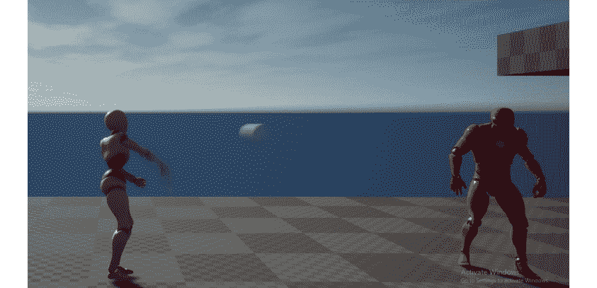

图 14.18：玩家投掷抛射物

当抛射物击中敌人时，敌人角色被摧毁，如下所示：

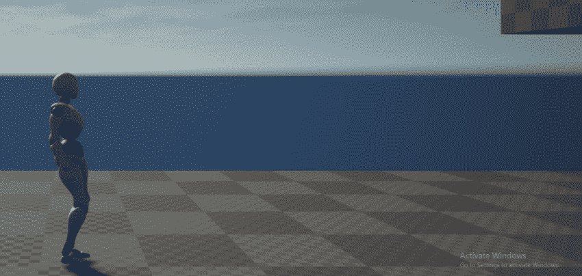

图 14.19：抛射物和敌人被摧毁

完成此活动后，玩家抛射物和敌人角色在碰撞时可以被摧毁。此外，每当另一个角色触发其`APlayerProjectile::OnHit()`函数时，玩家抛射物也将被摧毁。

通过这样，`Super SideScroller`游戏的一个重要元素已经完成：玩家抛射物的生成以及敌人与抛射物碰撞时的摧毁。您可以观察到摧毁这些角色非常简单，对玩家来说并不是很有趣。

因此，在本章的即将进行的练习中，您将更多地了解有关视觉和音频效果，即 VFX 和 SFX。您还将针对敌人角色和玩家抛射物实现这些元素。

现在敌人角色和玩家抛射物都可以被摧毁，让我们简要讨论一下 VFX 和 SFX 是什么，以及它们将如何影响项目。

注意

此活动的解决方案可在以下链接找到：[`packt.live/338jEBx`](https://packt.live/338jEBx)。

# 视觉和音频效果

视觉效果，如粒子系统和声音效果，如声音提示，在视频游戏中扮演着重要角色。它们在系统、游戏机制甚至基本操作之上增添了一层光泽，使这些元素更有趣或更令人愉悦。

让我们先了解视觉效果，然后是音频效果。

**视觉效果（VFX）**

在虚幻引擎 4 的上下文中，视觉效果由所谓的**粒子系统**组成。粒子系统由发射器组成，发射器由模块组成。在这些模块中，您可以使用材料、网格和数学模块来控制发射器的外观和行为。最终结果可以是从火炬、雪花、雨、灰尘等各种效果。

注意

您可以在这里了解更多信息：[`docs.unrealengine.com/en-US/Resources/Showcases/Effects/index.html`](https://docs.unrealengine.com/en-US/Resources/Showcases/Effects/index.html)。

**音频效果（SFX）**

在虚幻引擎 4 的上下文中，音频效果由声波和声音提示的组合组成：

+   声波是可以导入到虚幻引擎 4 中的`.wav`音频格式文件。

+   声音提示将声波音频文件与其他节点（如振荡器、调制器和连接器）组合在一起，为您的游戏创建独特和复杂的声音。

注意

您可以在这里了解更多信息：[`docs.unrealengine.com/en-US/Engine/Audio/SoundCues/NodeReference/index.html`](https://docs.unrealengine.com/en-US/Engine/Audio/SoundCues/NodeReference/index.html)。

让我们以 Valve 开发的游戏*Portal 2*为例。

在*Portal 2*中，玩家使用传送枪发射两个传送门：一个*橙色*和一个*蓝色*。这些传送门允许玩家穿越间隙，将物体从一个位置移动到另一个位置，并利用其他简单的机制，这些机制叠加在一起，形成复杂的谜题。使用这些传送门，传送门发射的声音效果以及这些传送门的视觉 VFX 使游戏更加有趣。如果您对这款游戏不熟悉，请观看完整的攻略视频：[`www.youtube.com/watch?v=ZFqk8aj4-PA`](https://www.youtube.com/watch?v=ZFqk8aj4-PA)。

注意

有关声音和声音设计重要性的进一步阅读，请参阅以下 Gamasutra 文章：[`www.gamasutra.com/view/news/318157/7_games_worth_studying_for_their_excellent_sound_design.php`](https://www.gamasutra.com/view/news/318157/7_games_worth_studying_for_their_excellent_sound_design.php)。

在虚幻引擎 4 的上下文中，VFX 最初是使用称为`材质`、`静态网格`和`数学`的工具创建的，以为游戏世界创建有趣和令人信服的效果。本书不会深入介绍这个工具的工作原理，但您可以在这里找到有关 Cascade 的信息：[`www.ue4community.wiki/Legacy/Introduction_to_Particles_in_UE4_-_2_-_Cascade_at_a_Glance`](https://www.ue4community.wiki/Legacy/Introduction_to_Particles_in_UE4_-_2_-_Cascade_at_a_Glance)。

在引擎的更新版本中，从 4.20 版本开始，有一个名为`Niagara`的插件，与 Cascade 不同，它使用类似蓝图的系统，您可以在其中直观地编写效果的行为，而不是使用预定义行为的模块。您可以在这里找到有关 Niagara 的更多信息：[`docs.unrealengine.com/en-US/Engine/Niagara/Overview/index.html`](https://docs.unrealengine.com/en-US/Engine/Niagara/Overview/index.html)。

在*第九章*，*音频-视觉元素*中，您了解了更多关于音频以及音频在虚幻引擎 4 中的处理。现在需要知道的是，虚幻引擎 4 使用`.wav`文件格式将音频导入到引擎中。从那里，您可以直接使用`.wav`文件，在编辑器中称为声波，或者您可以将这些资产转换为声音提示，这样可以在声波上添加音频效果。

最后，有一个重要的类需要了解，您将在即将进行的练习中引用这个类，这个类叫做`UGameplayStatics`。这是虚幻引擎中的一个静态类，可以从 C++和蓝图中使用，它提供了各种有用的与游戏相关的功能。您将在即将进行的练习中使用的两个函数如下：

```cpp
UGameplayStatics::SpawnEmitterAtLocation
UGameplayStatics:SpawnSoundAtLocation
```

这两个函数的工作方式非常相似；它们都需要一个`World`上下文对象来生成效果，要生成的粒子系统或音频，以及要生成效果的位置。您将使用这些函数来生成敌人的销毁效果。

## 练习 14.09：在敌人被摧毁时添加效果

在本练习中，您将向项目中添加本章和练习包含的新内容。这包括粒子 VFX 和声音 SFX，以及它们所需的所有资产。然后，您将更新`EnemyBase`类，以便它可以使用音频和粒子系统参数，在玩家投射物销毁敌人时添加所需的光泽层。

通过本练习结束时，您将拥有一个敌人，当它与玩家投射物碰撞时，会在视觉和听觉上被摧毁。

让我们开始：

1.  首先，我们需要从`Action RPG`项目中迁移特定资产，这些资产可以在“虚幻引擎启动器”的“学习”选项卡中找到。

1.  从`Epic Games Launcher`导航到“学习”选项卡，在“游戏”类别下，您将找到`Action RPG`：

注意

在本章后续练习中，您将从动作 RPG 项目中获取其他资产，因此应保持此项目打开，以避免重复打开项目。

1.  左键单击`Action RPG`游戏项目，然后左键单击“创建项目”选项。

1.  从这里，选择引擎版本 4.24，并选择要下载项目的目录。然后，*左键单击*“创建”按钮开始安装项目。

1.  `Action RPG`项目下载完成后，导航到`Epic Games Launcher`的“库”选项卡，找到`My Projects`部分下的`ActionRPG`。

1.  *双击*`ActionRPG`项目，以在 Unreal Engine 编辑器中打开它。

1.  在编辑器中，在“内容浏览器”界面中找到`A_Guardian_Death_Cue`音频资产。*右键单击*此资产，然后选择“资产操作”，然后选择“迁移”。

1.  选择“迁移”后，您将看到所有在`A_Guardian_Death_Cue`中引用的资产。这包括所有音频类和声波文件。从“资产报告”对话框中选择“确定”。

1.  接下来，您需要导航到`Super SideScroller`项目的“内容”文件夹，*左键单击*“选择文件夹”。

1.  迁移过程完成后，您将在编辑器中收到通知，通知您迁移已成功完成。

1.  对`P_Goblin_Death` VFX 资产执行相同的迁移步骤。您要添加到项目中的两个主要资产如下：

```cpp
    A_Guardian_Death_Cue
    P_Goblin_Death
    ```

`P_Goblin_Death`粒子系统资产引用了`Effects`目录中包含的材质和纹理等其他资产，而`A_Guardian_Death_Cue`引用了`Assets`目录中包含的其他声音波资产。

1.  将这些文件夹迁移到`SuperSideScroller`项目的“内容”目录后，打开 Unreal Engine 4 编辑器，以在项目的“内容浏览器”中找到包含在项目中的新文件夹。

您将用于敌人角色销毁的粒子称为`P_Goblin_Death`，可以在`/Effects/FX_Particle/`目录中找到。您将用于敌人角色销毁的声音称为`A_Guardian_Death_Cue`，可以在`/Assets/Sounds/Creatures/Guardian/`目录中找到。现在您需要的资产已导入到编辑器中，让我们继续进行编码。

1.  打开 Visual Studio 并导航到敌人基类的头文件；也就是`EnemyBase.h`。

1.  添加以下`UPROPERTY()`变量。这将代表敌人被销毁时的粒子系统。确保这是在`Public`访问修饰符下声明的：

```cpp
    UPROPERTY(EditAnywhere, BlueprintReadOnly)
    class UParticleSystem* DeathEffect;
    ```

1.  添加以下`UPROPERTY()`变量。这将代表敌人被销毁时的声音。确保这是在`Public`访问修饰符下声明的：

```cpp
    UPROPERTY(EditAnywhere, BlueprintReadOnly)
    class USoundBase* DeathSound;
    ```

有了这两个属性的定义，让我们继续添加所需的逻辑，以便在敌人被摧毁时生成和使用这些效果。

1.  在敌人基类的源文件`EnemyBase.cpp`中，添加以下包含`UGameplayStatics`和`UWorld`类：

```cpp
    #include "Kismet/GameplayStatics.h"
    #include "Engine/World.h"
    ```

当敌人被摧毁时，您将使用`UGameplayStatics`和`UWorld`类将声音和粒子系统生成到世界中。

1.  在`AEnemyBase::DestroyEnemy()`函数中，您有一行代码：

```cpp
    Destroy();
    ```

1.  在`Destroy()`函数调用之前添加以下代码行：

```cpp
    UWorld* World = GetWorld();
    ```

在尝试生成粒子系统或声音之前，有必要定义`UWorld`对象，因为需要一个`World`上下文对象。

1.  接下来，使用`if()`语句检查您刚刚定义的`World`对象的有效性：

```cpp
    if(World)
    {
    }
    ```

1.  在`if()`块内，添加以下代码来检查`DeathEffect`属性的有效性，然后使用`UGameplayStatics`的`SpawnEmitterAtLocation`函数生成这个效果：

```cpp
    if(DeathEffect)
    {
        UGameplayStatics::SpawnEmitterAtLocation(World,       DeathEffect, GetActorTransform());
    }
    ```

无法再次强调，在尝试生成或操作对象之前，您应该确保对象是有效的。这样做可以避免引擎崩溃。

1.  在`if(DeathEffect)`块之后，执行`DeathSound`属性的相同有效性检查，然后使用`UGameplayStatics::SpawnSoundAtLocation`函数生成声音：

```cpp
    if(DeathSound)
    {
        UGameplayStatics::SpawnSoundAtLocation(World,       DeathSound, GetActorLocation());
    }
    ```

在调用`Destroy()`函数之前，您需要检查`DeathEffect`和`DeathSound`属性是否都有效，如果是，则使用适当的`UGameplayStatics`函数生成这些效果。这样无论这两个属性是否有效，敌人角色都将被摧毁。

1.  现在`AEnemyBase::DestroyEnemy()`函数已经更新以生成这些效果，返回到虚幻引擎 4 编辑器中编译和热重载这些代码更改。

1.  在`Content Browser`界面中，导航到`/Enemy/Blueprints/`目录。*双击*`BP_Enemy`资源以打开它。

1.  在敌人蓝图的`Details`面板中，您将找到`Death Effect`和`Death Sound`属性。*左键单击*`Death Effect`属性的下拉列表，并找到`P_Goblin_Death`粒子系统。

1.  接下来，在`Death Effect`参数下方，*左键单击*`Death Sound`属性的下拉列表，并找到`A_Guardian_Death_Cue`声音提示。

1.  现在这些参数已经更新并分配了正确的效果，编译并保存敌人蓝图。

1.  使用`PIE`，生成玩家角色并向敌人投掷玩家投射物。如果你的关卡中没有敌人，请添加一个。当玩家投射物与敌人碰撞时，你添加的 VFX 和 SFX 将播放，如下截图所示：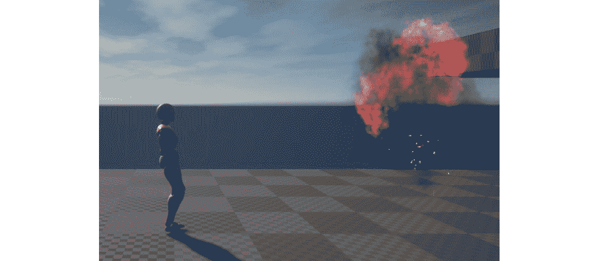

图 14.20：现在，敌人爆炸并在火光中被摧毁

完成此练习后，敌人角色现在在被玩家投射物摧毁时播放粒子系统和声音提示。这为游戏增添了一层精致，使得摧毁敌人更加令人满意。

在下一个练习中，您将为玩家投射物添加新的粒子系统和音频组件，使其在飞行时看起来更有趣并且听起来更有趣。

## 练习 14.10：向玩家投射物添加效果

在当前状态下，玩家投射物的功能是按预期的方式运行的；它在空中飞行，与游戏世界中的物体碰撞，并被摧毁。然而，从视觉上看，玩家投射物只是一个带有纯白色纹理的球。

在这个练习中，您将通过添加粒子系统和音频组件为玩家投射物增添一层精致，使得投射物更加愉快使用。

完成以下步骤以实现这一点：

1.  与之前的练习一样，我们需要从“动作 RPG”项目迁移资产到我们的`Super SideScroller`项目。请参考*练习 14.09*，“在敌人被销毁时添加效果”，了解如何安装和迁移来自“动作 RPG”项目的资产。

您要添加到项目中的两个主要资产如下：

```cpp
    P_Env_Fire_Grate_01
    A_Ambient_Fire01_Cue
    ```

`P_Env_Fire_Grate_01`粒子系统资产引用了其他资产，例如包含在`Effects`目录中的材质和纹理，而`A_Ambient_Fire01_Cue`引用了包含在`Assets`目录中的其他声音波和声音衰减资产。

您将用于玩家投射物的粒子是名为`P_Env_Fire_Grate_01`，可以在`/Effects/FX_Particle/`目录中找到。这是与之前练习中使用的`P_Goblin_Death` VFX 相同的目录。您将用于玩家投射物的声音是名为`A_Ambient_Fire01_Cue`，可以在`/Assets/Sounds/Ambient/`目录中找到。

1.  *右键单击*“动作 RPG”项目的“内容浏览器”界面中的每个资产，然后选择“资产操作”，然后选择“迁移”。

1.  在确认迁移之前，请确保选择`Super SideScroller`项目的“内容”文件夹目录。

现在，必需的资产已迁移到我们的项目中，让我们继续创建玩家投射物类。

1.  打开 Visual Studio，并导航到玩家投射物类的头文件；即`PlayerProjectile.h`。

1.  在`Private`访问修饰符下，在`UStaticMeshComponent* MeshComp`类组件声明下面，添加以下代码以声明玩家投射物的新音频组件：

```cpp
    UPROPERTY(VisibleDefaultsOnly, Category = Sound)
    class UAudioComponent* ProjectileMovementSound;
    ```

1.  接下来，在音频组件声明下面添加以下代码，以声明一个新的粒子系统组件：

```cpp
    UPROPERTY(VisibleDefaultsOnly, Category = Projectile)
    class UParticleSystemComponent* ProjectileEffect;
    ```

与在蓝图中可以定义的属性不同，例如在敌人角色类中，这些效果将成为玩家投射物的组件。这是因为这些效果应该附加到投射物的碰撞组件上，以便它们随着投射物在关卡中移动时移动。

1.  在头文件中声明这两个组件后，打开玩家投射物的源文件，并将以下包含添加到文件顶部的`include`行列表中：

```cpp
    #include "Components/AudioComponent.h"
    #include "Engine/Classes/Particles/ParticleSystemComponent.h"
    ```

您需要引用音频组件和粒子系统类，以便使用`CreateDefaultSubobject`函数创建这些子对象，并将这些组件附加到`RootComponent`。

1.  添加以下行以创建`ProjectileMovementSound`组件的默认子对象，并将此组件附加到`RootComponent`：

```cpp
    ProjectileMovementSound = CreateDefaultSubobject<UAudioComponent>  (TEXT("ProjectileMovementSound"));
      ProjectileMovementSound->AttachToComponent(RootComponent,   FAttachmentTransformRules::KeepWorldTransform);
    ```

1.  接下来，添加以下行以创建`ProjectileEffect`组件的默认子对象，并将此组件附加到`RootComponent`：

```cpp
    ProjectileEffect = CreateDefaultSubobject<UParticleSystemComponent>(TEXT("Projectile   Effect"));
    ProjectileEffect->AttachToComponent(RootComponent,   FAttachmentTransformRules::KeepWorldTransform);
    ```

1.  现在，您已经创建、初始化并将这两个组件附加到`RootComponent`，返回到 Unreal Engine 4 编辑器中重新编译并热重载这些代码更改。

1.  从“内容浏览器”界面，导航到`/MainCharacter/Projectile/`目录。找到`BP_PlayerProjectile`资产，*双击*打开蓝图。

在“组件”选项卡中，您将找到使用前面的代码添加的两个新组件。请注意，这些组件附加到`CollisionComp`组件，也称为`RootComponent`。

1.  *左键单击*选择`ProjectileEffect`组件，并在“详细信息”面板中将`P_Env_Fire_Grate_01` VFX 资产分配给此参数，如下截图所示：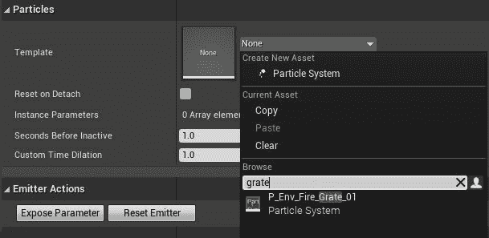

图 14.21：现在，您可以将 P_Env_fire_Grate_01 VFX 资产应用到您之前添加的粒子系统组件

1.  在分配音频组件之前，让我们调整`ProjectileEffect` VFX 资产的`Transform`。更新 VFX 的`Transform`的`Rotation`和`Scale`参数，使其与以下截图中显示的内容匹配：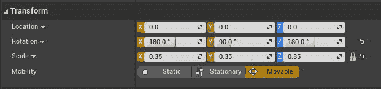

图 14.22：粒子系统组件的更新变换，以便更好地适应抛射物

1.  导航到蓝图中的`Viewport`选项卡，查看`Transform`的这些更改。`ProjectileEffect`应该如下所示：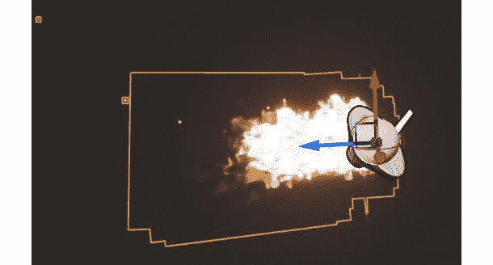

图 14.23：现在，火焰 VFX 已经被适当地缩放和旋转

1.  现在 VFX 已经设置好了，*左键单击*`ProjectileMovementSound`组件，并将`A_Ambient_Fire01_Cue`分配给该组件。

1.  保存并重新编译`BP_PlayerProjectile`蓝图。使用`PIE`并观察当你投掷抛射物时，它现在显示了 VFX 资产并播放了分配的声音：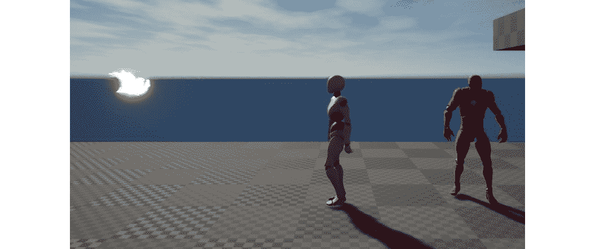

图 14.24：玩家抛射物现在在飞行时有了 VFX 和 SFX

完成这个练习后，玩家的抛射物现在有了一个 VFX 和一个 SFX，它们在飞行时一起播放。这些元素使抛射物栩栩如生，并使其更有趣。

由于 VFX 和 SFX 是作为抛射物的组件创建的，它们在抛射物被销毁时也会被销毁。

在下一个练习中，你将向`Throw`动画蒙太奇添加一个粒子通知和一个声音通知，以便在玩家投掷抛射物时提供更多的影响。

## 练习 14.11：添加 VFX 和 SFX 通知

到目前为止，你一直在通过 C++实现游戏的抛光元素，这是一种有效的实现手段。为了增加变化，并扩展你对虚幻引擎 4 工具集的了解，这个练习将教你如何在动画蒙太奇中使用通知来添加粒子系统和音频。让我们开始吧！

和之前的练习一样，我们需要从`Action RPG`项目迁移资产到我们的`Super SideScroller`项目。请参考*练习 14.09*，*当敌人被销毁时添加特效*，学习如何从`Action RPG`项目安装和迁移资产。执行以下步骤：

1.  打开`ActionRPG`项目，并导航到`Content Browser`界面。

你添加到项目中的两个主要资产如下：

```cpp
    P_Skill_001
    A_Ability_FireballCast_Cue
    ```

`P_Skill_001`粒子系统资产引用了`Effects`目录中包含的*材质*和*纹理*等其他资产，而`A_Ability_FireballCast_Cue`引用了`Assets`目录中包含的其他*声音波*资产。

当抛射物被投掷时，玩家将使用的粒子是`P_Skill_001`，可以在`/Effects/FX_Particle/`目录中找到。这是之前练习中使用的`P_Goblin_Death`和`P_Env_Fire_Grate_01` VFX 资产所使用的相同目录。你将用于敌人角色销毁的声音称为`A_Ambient_Fire01_Cue`，可以在`/Assets/Sounds/Ambient/`目录中找到。

1.  *右键单击*`Action RPG`项目的`Content Browser`界面中的每个资产，然后选择`Asset Actions`，然后选择`Migrate`。

1.  在确认迁移之前，请确保选择`Super SideScroller`项目的`Content`文件夹的目录。

现在你需要的资产已经迁移到你的项目中，让我们继续添加所需的通知到`AM_Throw`资产。在继续进行这个练习之前，请确保返回到你的`Super SideScroller`项目。

1.  从`内容浏览器`界面，导航到`/MainCharacter/Animation/`目录。找到`AM_Throw`资产并*双击*打开它。

1.  在`动画蒙太奇`编辑器中央的预览窗口下方，找到`通知`部分。这是您在本章早些时候添加`Anim_ProjectileNotify`的相同部分。

1.  在`通知`轨道的右侧，您会找到一个`+`号，允许您使用额外的通知轨道。*左键单击*添加一个新轨道，如下图所示：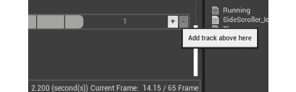

图 14.25：在时间轴上添加多个轨道以在添加多个通知时保持组织

1.  在与`Anim_ProjectileNotify`相同的帧中，在上一步创建的新轨道内*右键单击*。从`添加通知`列表中*左键单击*选择`播放粒子效果`。

1.  创建后，*左键单击*选择新通知并访问其`详细信息`面板。在`详细信息`中，将`P_Skill_001` VFX 资产添加到`粒子系统`参数中。

添加了这个新的 VFX 之后，您会注意到 VFX 几乎放在了玩家角色的脚下，但不完全是您想要的位置。这个 VFX 应该直接放在地板上，或者放在角色的底部。以下屏幕截图展示了这个位置：

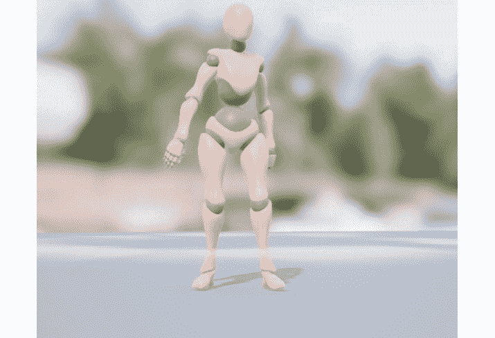

图 14.26：粒子通知的位置不在地面上

为了解决这个问题，您需要向玩家角色骨架添加一个新的`插座`。

1.  导航到`/MainCharacter/Mesh/`目录。*双击*`MainCharacter_Skeleton`资产以打开它。

1.  在左侧的`骨骼`骨骼层次结构上，*右键单击*`Hips`骨骼，*左键单击*选择`添加插座`选项。将此新插座命名为`EffectSocket`。

1.  *左键单击*从骨骼层次结构中选择此插座，以查看其当前位置。默认情况下，其位置设置为与`Hips`骨骼相同的位置。以下屏幕截图显示了此位置：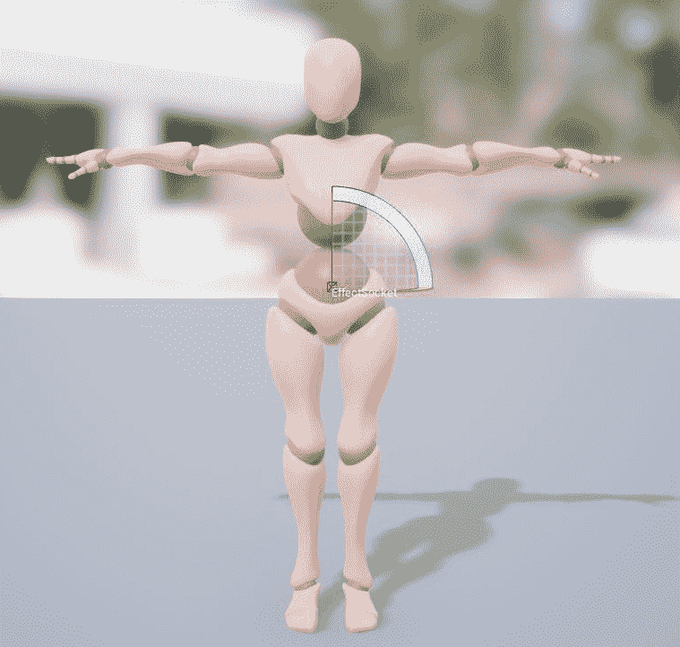

```cpp
    (X=0.000000,Y=100.000000,Z=0.000000)
    ```

这个位置将更靠近地面和玩家角色的脚。最终位置如下图所示：

图 14.28：将插座位置移动到玩家骨架的底部

](img/B16183_14_28.jpg)

图 14.28：将插座位置移动到玩家骨架的底部

1.  现在您已经有了粒子通知的位置，请返回到`AM_Throw`动画蒙太奇。

1.  在`播放粒子效果`通知的`详细信息`面板中，有`插座名称`参数。使用`EffectSocket`作为名称。

注意

如果`EffectSocket`没有出现在自动完成中，请关闭并重新打开动画蒙太奇。重新打开后，`EffectSocket`选项应该会出现。

1.  最后，粒子效果的比例有点太大，因此调整投影物的比例，使其值如下：

```cpp
    (X=0.500000,Y=0.500000,Z=0.500000)
    ```

现在，当通过此通知播放粒子效果时，其位置和比例将是正确的，如下所示：

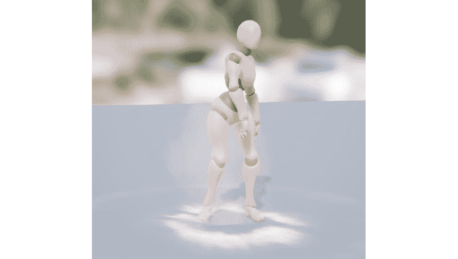

图 14.29：粒子现在在玩家角色骨架的底部播放

1.  要添加`播放声音`通知，请在`通知`时间轴部分添加一个新轨道；现在总共应该有三个。

1.  在这个新轨道上，并且与`播放粒子效果`和`Anim_ProjectileNotify`通知的帧位置相同，*右键单击*并从`添加通知`选择中选择`播放声音`通知。以下屏幕截图显示了如何找到此通知：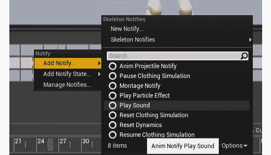

图 14.30：您在本章早些时候了解到的 Play Sound 通知

1.  接下来，*左键单击*选择`Play Sound`通知并访问其`Details`面板。

1.  从`Details`面板中找到`Sound`参数，并分配`A_Ability_FireballCast_Cue`。

分配了声音后，当播放`Throw`动画时，您将看到 VFX 播放并听到声音。`Notifies`轨道应如下所示：

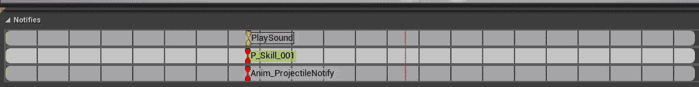

图 14.31：投掷动画蒙太奇时间轴上的最终通知设置

1.  保存`AM_Throw`资产并使用`PIE`来投掷玩家投射物。

1.  现在，当您投掷投射物时，您将看到粒子通知播放`P_Skill_001` VFX，并听到`A_Ability_FireballCast_Cue` SFX。结果将如下所示：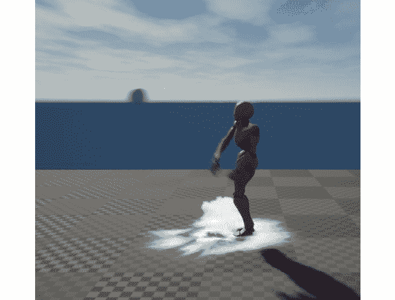

图 14.32：现在，当玩家投掷投射物时，会播放强大的 VFX 和 SFX

完成这个最后的练习后，玩家现在在投掷玩家投射物时会播放强大的 VFX 和 SFX。这使得投掷动画更有力量，感觉就像玩家角色在用很多能量来投掷投射物。

在接下来的最后一个活动中，您将利用您从最近几个练习中获得的知识，为玩家投射物在被销毁时添加 VFX 和 SFX。

## 活动 14.02：为投射物销毁时添加效果

在这个最后的活动中，您将利用您从为玩家投射物和敌人角色添加 VFX 和 SFX 元素中获得的知识，为投射物与物体碰撞时创建爆炸效果。我们添加这个额外的爆炸效果的原因是为了在销毁投射物与环境物体碰撞时增加一定的光泽度。如果玩家投射物撞击物体并在没有任何音频或视觉反馈的情况下消失，那将显得尴尬和不合时宜。

您将为玩家投射物添加粒子系统和声音提示参数，并在投射物与物体碰撞时生成这些元素。

执行以下步骤以实现预期输出：

1.  在`PlayerProjectile.h`头文件中，添加一个新的粒子系统变量和一个新的声音基础变量。

1.  将粒子系统变量命名为`DestroyEffect`，将声音基础变量命名为`DestroySound`。

1.  在`PlayerProjectile.cpp`源文件中，将`UGameplayStatics`的包含添加到包含列表中。

1.  更新`APlayerProjectile::ExplodeProjectile()`函数，使其现在生成`DestroyEffect`和`DestroySound`对象。返回虚幻引擎 4 编辑器并重新编译新的 C++代码。在`BP_PlayerProjectile`蓝图中，将默认包含在您的项目中的`P_Explosion` VFX 分配给投射物的`Destroy Effect`参数。

1.  将`Explosion_Cue` SFX 分配给投射物的`Destroy Sound`参数，该 SFX 已默认包含在您的项目中。

1.  保存并编译玩家投射蓝图。

1.  使用`PIE`观察新的玩家投射物销毁 VFX 和 SFX。

预期输出如下：

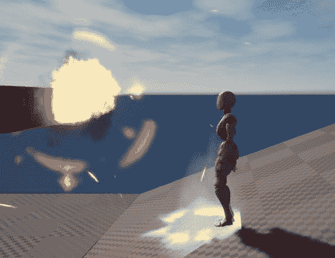

图 14.33：投射物 VFX 和 SFX

完成这个活动后，您现在已经有了为游戏添加光泽元素的经验。您不仅通过 C++代码添加了这些元素，还通过虚幻引擎 4 的其他工具添加了这些元素。在这一点上，您已经有足够的经验来为您的游戏添加粒子系统和音频，而不必担心如何实现这些功能。

注意

此活动的解决方案可在以下网址找到：[`packt.live/338jEBx`](https://packt.live/338jEBx)。

# 总结

在本章中，您学到了在游戏开发世界中视觉和音频效果的重要性。通过使用 C++代码和通知的组合，您能够为玩家的抛射物和敌人角色的碰撞带来游戏功能，以及通过添加 VFX 和 SFX 来提升这些功能。除此之外，您还了解了在虚幻引擎 4 中如何生成和销毁对象。

此外，您还了解了动画蒙太奇如何在蓝图和 C++中播放。通过将从蓝图播放“投掷”动画蒙太奇的逻辑迁移到 C++，您学会了两种方法的工作原理，以及如何为游戏使用这两种实现。

通过使用 C++添加新的动画通知，您能够将此通知添加到“投掷”动画蒙太奇中，从而允许玩家生成上一章中创建的玩家抛射物。通过使用`UWorld->SpawnActor()`函数，并向玩家骨骼添加新的插座，您能够在“投掷”动画的确切帧和您想要的确切位置生成玩家抛射物。

最后，您学会了如何在“投掷”动画蒙太奇中使用“播放粒子效果”和“播放声音”通知，为玩家抛射物的投掷添加 VFX 和 SFX。本章让您有机会了解虚幻引擎 4 中在游戏中使用 VFX 和 SFX 时存在的不同方法。

现在，玩家的抛射物可以被投掷并摧毁敌人角色，是时候实现游戏的最后一组机制了。在下一章中，您将创建玩家可以收集的可收集物品，并为玩家创建一个可以在短时间内改善玩家移动机制的增益道具。
