# 15. 收藏品、强化道具和拾取物品

概述

在本章中，我们将为玩家创建可收藏的硬币和药水强化道具。此外，我们将使用虚幻运动图形 UI 设计师（UMG）为可收藏的硬币设计 UI。最后，我们将创建砖块，这些砖块将隐藏着这些收藏品。通过本章的学习，你将能够在关卡环境中为玩家角色实现收藏品和强化道具。

# 介绍

在上一章中，你创建了玩家投射物，并使用`Anim Notifies`在“投掷”动画期间生成玩家投射物。玩家投射物将作为玩家对抗整个关卡中的敌人的主要进攻游戏机制。由于虚幻引擎 4 提供的默认`Anim Notifies`和你自己的自定义`Anim_ProjectileNotify`类的组合，玩家投射物机制看起来感觉很棒。

我们需要开发的最后一组机制是硬币收藏品和药水强化道具。让我们简要地分析一下收藏品和强化道具是如何影响其他游戏的，以及它们将为我们的“超级横向卷轴”游戏带来什么成就。

**硬币收藏品**

收藏品给玩家一个动力去彻底探索关卡。在许多游戏中，比如《虚空骑士》，收藏品也可以作为一种货币，用来购买角色升级和物品。在其他更经典的平台游戏中，比如超级马里奥或索尼克，收藏品可以提高玩家在关卡中的得分。

在当今的游戏环境中，游戏包含成就是一种预期。收藏品是将成就融入游戏的好方法；例如，在某个关卡或整个游戏中收集所有的硬币的成就。对于“超级横向卷轴”游戏来说，硬币收藏品将成为玩家探索游戏关卡的满意手段，尽可能多地找到硬币。

**药水强化道具**

强化道具给玩家永久或临时的优势，可以对抗敌人或者玩家必须穿越的环境。有许多游戏示例使用了强化道具，其中最著名的之一就是《银河战士》系列。《银河战士》使用强化道具让玩家探索新区域并对抗更强大的敌人。

强化道具也是将成就融入游戏的另一种方式。例如，你可以设定一个成就，使用特定的强化道具摧毁一定数量的敌人。对于“超级横向卷轴”游戏来说，药水强化道具将提高玩家在关卡环境中的能力，增加他们的移动速度和跳跃高度。

在本章中，你将学习如何使用 C++创建硬币收藏品和药水强化道具，为“超级横向卷轴”游戏增加更多的游戏层次。这些游戏元素将源自你将创建的相同基础`actor`类。你还将为收藏品和强化道具添加视觉和音频元素，使它们更加精致。

为了使硬币收藏品和药水强化道具对玩家更具视觉吸引力，我们将为这些角色添加一个旋转组件，以吸引玩家的注意。这就是`URotatingMovementComponent`非常有用的地方；它允许我们以一种非常优化和直接的方式为角色添加旋转，而不是编写自己的逻辑来处理角色的不断旋转。让我们开始学习更多关于这个组件的知识。

# URotatingMovementComponent

`URotatingMovementComponent`是 Unreal Engine 4 中存在的几个移动组件之一。在`SuperSideScroller`游戏项目中，您已经熟悉了`CharacterMovementComponent`和`ProjectileMovementComponent`，而`RotatingMovementComponent`只是另一个移动组件。作为一个复习，移动组件允许不同类型的移动发生在它们所属的 actor 或角色上。

注意

`CharacterMovementComponent`允许您控制角色的移动参数，如其移动速度和跳跃高度，在*第十章*“创建 SuperSideScroller 游戏”中，当您创建`SuperSideScroller`玩家角色时进行了介绍。`ProjectileMovementComponent`允许您向 actor 添加基于抛射物的移动功能，如速度和重力，在*第十四章*“生成玩家抛射物”中，当您开发玩家抛射物时进行了介绍。

与`CharacterMovementComponent`相比，`RotatingMovementComponent`是一个非常简单的移动组件，因为它只涉及旋转`RotatingMovementComponent`所属的 actor；没有其他操作。`RotatingMovementComponent`根据定义的`Rotation Rate`、枢轴平移以及使用本地空间或世界空间中的旋转选项执行组件的连续旋转。

此外，`RotatingMovementComponent`与通过蓝图中的`Event Tick`或`Timelines`等其他旋转 actor 的方法相比要高效得多。

注意

关于移动组件的更多信息可以在这里找到：[`docs.unrealengine.com/en-US/Engine/Components/Movement/index.html#rotatingmovementcomponent`](https://docs.unrealengine.com/en-US/Engine/Components/Movement/index.html#rotatingmovementcomponent)。

我们将使用`RotatingMovementComponent`来允许硬币可收集和药水增强沿 Yaw 轴在原地旋转。这种旋转将吸引玩家的注意力，并给他们一个视觉提示，表明这个可收集物品是重要的。

现在您对`RotatingMovementComponent`有了更好的理解，让我们继续创建`PickableActor_Base`类，这是硬币可收集和药水增强将从中派生的类。

## 练习 15.01：创建 PickableActor_Base 类并添加 URotatingMovementComponent

在这个练习中，您将创建`PickableActor_Base`actor 类，这将作为可收集的硬币和药水增强的基类。您还将从这个 C++基类创建一个蓝图类，以预览`URotatingMovementComponent`的工作原理。按照以下步骤完成这个练习：

注意

在`SuperSideScroller`游戏项目中，您已经多次执行了以下许多步骤，因此将有限的图像来帮助您进行指导。只有在引入新概念时才会有相应的图像。

1.  在 Unreal Engine 4 编辑器中，*左键单击*编辑器左上角的“文件”选项，然后*左键单击*“新建 C++类”选项。

1.  从“选择父类”窗口中，选择`Actor`选项，然后*左键单击*此窗口底部的“下一步”按钮。

1.  将此类命名为`PickableActor_Base`，并将默认的“路径”目录保持不变。然后，选择此窗口底部的“创建类”按钮。

1.  选择“创建类”按钮后，Unreal Engine 4 将重新编译项目代码，并自动打开 Visual Studio，其中包含`PickableActor_Base`类的头文件和源文件。

1.  默认情况下，`Actor`类在头文件中提供了`virtual void Tick(float DeltaTime) override;`函数声明。对于`PickableActor_Base`类，我们不需要`Tick`函数，因此从`PickableActor_Base.h`头文件中删除此函数声明。

1.  接下来，您还需要从`PickableActor_Base.cpp`文件中删除该函数；否则，您将收到编译错误。在此源文件中，查找并删除以下代码：

```cpp
    void PickableActor_Base::Tick(float DeltaTime)
    {
      Super::Tick(DeltaTime);
    }
    ```

注意

在许多情况下，使用`Tick()`函数进行移动更新可能会导致性能问题，因为`Tick()`函数在每一帧都会被调用。相反，尝试使用`Gameplay Timer`函数在指定的时间间隔执行某些更新，而不是在每一帧上执行。您可以在这里了解更多关于`Gameplay Timers`的信息：[`docs.unrealengine.com/en-US/Programming/UnrealArchitecture/Timers/index.html`](https://docs.unrealengine.com/en-US/Programming/UnrealArchitecture/Timers/index.html)。

1.  现在，是时候添加`PickableActor_Base`类所需的组件了。让我们从`USphereComponent`开始，您将使用它来检测与玩家的重叠碰撞。在`PickableActor_Base.h`头文件中的`Protected`访问修饰符内添加以下代码：

```cpp
    UPROPERTY(VisibleDefaultsOnly, Category = PickableItem)
    class USphereComponent* CollisionComp;
    ```

`USphereComponent`的声明现在应该对您非常熟悉；我们在以前的章节中已经做过这个，比如*第十六章*，*多人游戏基础*，当我们创建`PlayerProjectile`类时。

1.  接下来，在声明`USphereComponent`下面添加以下代码来创建一个新的`UStaticMeshComponent`。这将用于视觉上代表硬币可收集或药水提升：

```cpp
    UPROPERTY(VisibleDefaultsOnly, Category = PickableItem)
    class UStaticMeshComponent* MeshComp;
    ```

1.  最后，在声明`UStaticMeshComponent`下面添加以下代码来创建一个新的`URotatingMovementComponent`。这将用于给可收集的硬币和药水提供简单的旋转运动：

```cpp
    UPROPERTY(VisibleDefaultsOnly, Category = PickableItem)
    class URotatingMovementComponent* RotationComp;
    ```

1.  现在，您已经在`PickableActor_Base.h`头文件中声明了组件，转到`PickableActor_Base.cpp`源文件，以便为这些添加的组件添加所需的`#includes`。在源文件的顶部，在第一个`#include "PickableActor_Base.h"`之后添加以下行：

```cpp
    #include "Components/SphereComponent.h"
    #include "Components/StaticMeshComponent.h"
    #include "GameFramework/RotatingMovementComponent.h"
    ```

1.  现在，您已经为组件准备好了必要的`include`文件，可以在`APickableActor_Base::APickableActor_Base()`构造函数中添加必要的代码来初始化这些组件：

```cpp
    APickableActor_Base::APickableActor_Base()
    {
    }
    ```

1.  首先，通过在`APickableActor_Base::APickableActor_Base()`中添加以下代码来初始化`USphereComponent`组件变量`CollisionComp`：

```cpp
    CollisionComp = CreateDefaultSubobject   <USphereComponent>(TEXT("SphereComp"));
    ```

1.  接下来，通过在上一步提供的代码下面添加以下代码，使用默认的球体半径`30.0f`来初始化`USphereComponent`：

```cpp
    CollisionComp->InitSphereRadius(30.0f);
    ```

1.  由于玩家角色需要与此组件重叠，因此您需要添加以下代码，以便默认情况下，`USphereComponent`具有`Overlap All Dynamic`的碰撞设置：

```cpp
    CollisionComp->BodyInstance.SetCollisionProfileName("OverlapAllDynamic");
    ```

1.  最后，`CollisionComp USphereComponent`应该是这个角色的根组件。添加以下代码来分配这个：

```cpp
    RootComponent = CollisionComp;
    ```

1.  现在，`CollisionComp USphereComponent`已经初始化，让我们为`MeshComp UStaticMeshComponent`做同样的事情。添加以下代码。之后，我们将讨论代码为我们做了什么：

```cpp
    MeshComp = CreateDefaultSubobject<UStaticMeshComponent>(TEXT("MeshComp"));
    MeshComp->AttachToComponent(RootComponent,   FAttachmentTransformRules::KeepWorldTransform);
    MeshComp->SetCollisionEnabled(ECollisionEnabled::NoCollision);
    ```

第一行使用`CreateDefaultSubobject()`模板函数初始化了`MeshComp UStaticMeshComponent`。接下来，您使用`AttachTo()`函数将`MeshComp`附加到您为`CollisionComp`创建的根组件。最后，`MeshComp UStaticMeshComponent`默认不应具有任何碰撞，因此您使用`SetCollisionEnabled()`函数并传入`ECollisionEnable::NoCollision`枚举值。

1.  最后，我们可以通过添加以下代码来初始化`URotatingMovementComponent RotationComp`：

```cpp
    RotationComp =   CreateDefaultSubobject<URotatingMovementComponent>(TEXT("RotationComp"));
    ```

1.  所有组件初始化后，编译 C++代码并返回到 Unreal Engine 4 编辑器。编译成功后，您将继续为`PickableActor_Base`创建蓝图类。

1.  在`Content Browser`窗口中，通过*右键单击*`Content`文件夹并选择`New Folder`选项来创建一个名为`PickableItems`的新文件夹。

1.  在`PickableItems`文件夹中，*右键单击*并选择“蓝图类”。从“选择父类”窗口中，搜索`PickableActor_Base`类并*左键单击*“选择”以创建新的蓝图。

1.  将此蓝图命名为`BP_PickableActor_Base`并*双击*打开蓝图。

1.  在“组件”选项卡中，选择`MeshComp Static Mesh Component`并将`Shape_Cone`静态网格分配给“详细”面板中的“静态网格”参数。请参考以下截图：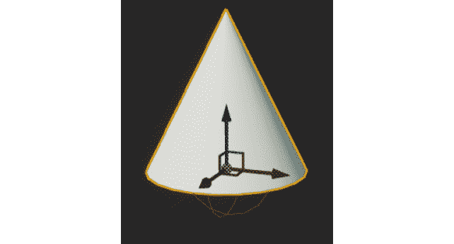

图 15.1：分配给 BP_Pickable_Base actor 类的 MeshComp UStaticMeshComponent 的 Shape_Cone 网格

1.  接下来，选择`RotationComp` `URotatingMovementComponent`并在`详细`面板的`旋转组件`类别下找到`旋转速率`参数。

1.  将“旋转速率”设置为以下值：

```cpp
    (X=100.000000,Y=100.000000,Z=100.000000)
    ```

这些值确定了 actor 每秒沿每个轴旋转的速度。这意味着锥形 actor 将沿每个轴以每秒 100 度的速度旋转。

1.  编译`PickableActor_Base`蓝图并将此 actor 添加到您的级别中。

1.  现在，如果您使用 PIE 并查看级别中的`PickableActor_Base` actor，您将看到它正在旋转。请参考以下截图：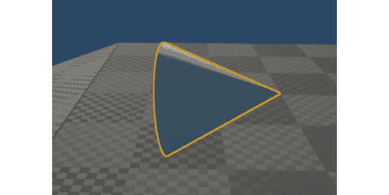

图 15.2：现在，锥形网格沿所有轴旋转，根据我们添加到 URotatingMovementComponent 的旋转速率窗口的值

注意

您可以在此处找到此练习的资产和代码：[`packt.live/3njhwyt`](https://packt.live/3njhwyt)。

通过完成此练习，您已经创建了`PickableActor_Base`类所需的基本组件，并学会了如何实现和使用`URotatingMovementComponent`。有了准备好的`PickableActor_Base`类，并且在蓝图 actor 上实现了`URotatingMovementComponent`，我们可以通过添加重叠检测功能，销毁可收集的 actor，并在玩家拾取 actor 时产生音频效果来完成该类。在接下来的活动中，您将添加`PickableActor_Base`类所需的其余功能。

## 活动 15.01：在 PickableActor_Base 中进行玩家重叠检测和产生效果

现在`PickableActor_Base`类具有所有必需的组件，并且其构造函数初始化了这些组件，是时候添加其功能的其余部分了。这些功能将在本章后面的硬币可收集物和药水增益中继承。这些额外的功能包括玩家重叠检测，销毁可收集的 actor，并产生音频效果以向玩家提供反馈，表明它已被成功拾取。执行以下步骤以添加功能，允许`USoundBase`类对象在可收集物与玩家重叠时播放：

1.  在`PickableActor_Base`类中创建一个接受玩家引用作为输入参数的新函数。将此函数命名为`PlayerPickedUp`。

1.  创建一个名为`BeginOverlap()`的新`UFUNCTION`。在继续之前，请确保包括此函数的所有必需输入参数。请参考*第六章*，*碰撞对象*，在那里您在`VictoryBox`类内使用了此函数。

1.  为`USoundBase`类添加一个新的`UPROPERTY()`，并将其命名为`PickupSound`。

1.  在`PickableActor_Base.cpp`源文件中，为`BeginOverlap()`和`PlayerPickedUp()`函数创建定义。

1.  现在，在源文件的顶部为`SuperSideScroller_Player`类和`GameplayStatics`类添加所需的`#include`文件。

1.  在`BeginOverlap()`函数中，使用函数的`OtherActor`输入参数创建对玩家的引用。

1.  在`PlayerPickedUp()`函数中，为`GetWorld()`函数返回的`UWorld*`对象创建一个变量。

1.  使用`UGameplayStatics`库在`PickableActor_Base` actor 的位置生成`PickUpSound`。

1.  然后，调用`Destroy()`函数，以便角色被销毁并从世界中移除。

1.  最后，在`APickableActor_Base::APickableActor_Base()`构造函数中，将`CollisionComp`的`OnComponentBeginOverlap`事件绑定到`BeginOverlap()`函数。

1.  从`Epic Games Launcher`的`Learn`选项卡中下载并安装`Unreal Match 3`项目。使用您在*第十四章*中获得的知识，将`Match_Combo`声波资产从该项目迁移到您的`SuperSideScroller`项目中。

1.  将此声音应用到`BP_PickableActor_Base`蓝图的`PickupSound`参数上。

1.  编译蓝图，如果您的关卡中不存在蓝图，则现在将`BP_PickableActor_Base` actor 添加到您的关卡中。

1.  在`PIE`中，使您的角色与`BP_PickableActor_Base` actor 重叠。

预期输出：

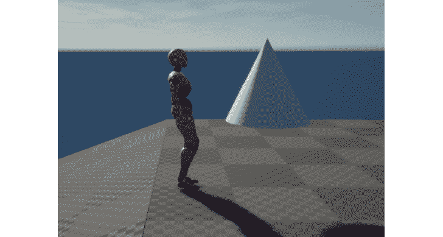

图 15.3：BP_PickableActor_Base 对象可以被玩家重叠和拾取

注意

此活动的解决方案可在以下网址找到：[`packt.live/338jEBx`](https://packt.live/338jEBx)。

完成这个活动后，您已经证明了您如何向您的角色类添加`OnBeginOverlap()`功能，并且如何使用这个功能来执行您的角色的逻辑的知识。在`PickableActor_Base`的情况下，我们添加了一个逻辑，将生成一个自定义声音并销毁该角色。

现在`PickableActor_Base`类已经设置好了，是时候开发从中派生的可收集硬币和增益药水类了。硬币可收集类将继承您刚刚创建的`PickableActor_Base`类。它将覆盖关键功能，如`PlayerPickedUp()`函数，以便我们可以在玩家拾取时实现独特的逻辑。除了从继承的父`PickableActor_Base`类中覆盖功能之外，硬币可收集类还将具有其自己独特的属性集，如当前硬币价值和独特的拾取声音。我们将在下一个练习中一起创建硬币可收集类。

## 练习 15.02：创建 PickableActor_Collectable 类

在这个练习中，您将创建`PickableActor_Collectable`类，该类将从您在*练习 15.01*中创建的`PickableActor_Base`类派生，并在*活动 15.01*中完成，*创建 PickableActor_Base 类并添加 URotatingMovement 组件*。这个类将被用作玩家可以在关卡中收集的主要可收集硬币。按照以下步骤完成这个练习：

1.  在虚幻引擎 4 编辑器中，*左键单击*编辑器左上角的`文件`选项，然后*左键单击*`新建 C++类`选项。

1.  从`Choose Parent Class`窗口中选择`PickableActor_Base`选项，然后在此窗口底部*左键单击*`Next`按钮。

1.  将此类命名为`PickableActor_Collectable`，并将默认的`Path`目录保持不变。然后，在此窗口底部选择`Create Class`按钮。

1.  选择`Create Class`按钮后，虚幻引擎 4 将重新编译项目代码，并将自动打开 Visual Studio，显示`PickableActor_Collectable`类的头文件和源文件。

1.  默认情况下，`PickableActor_Collectable.h`头文件在其类声明中没有声明的函数或变量。您需要在新的`Protected Access Modifier`下添加`BeginPlay()`函数的覆盖。添加以下代码：

```cpp
    protected:
      virtual void BeginPlay() override;
    ```

我们覆盖“BeginPlay()`函数的原因是，`URotatingMovementComponent`需要角色初始化并使用“BeginPlay()`来正确旋转角色。因此，我们需要创建这个函数的覆盖声明，并在源文件中创建一个基本的定义。然而，首先，我们需要覆盖另一个重要的函数，来自`PickableActor_Base`父类。

1.  通过在“Protected Access Modifier”下添加以下代码，覆盖`PickableActor_Base`父类中的`PlayerPickedUp()`函数：

```cpp
    virtual void PlayerPickedUp(class ASuperSideScroller_Player* Player)   override;
    ```

通过这样做，我们表明我们将使用并覆盖“PlayerPickedUp()`函数的功能。

1.  最后，创建一个名为`UPROPERTY()`的新整数，它将保存硬币可收集的价值；在这种情况下，它的价值将是`1`。添加以下代码来实现这一点：

```cpp
    public:
      UPROPERTY(EditAnywhere, Category = Collectable)
      int32 CollectableValue = 1;
    ```

在这里，我们正在创建一个整数变量，该变量将在蓝图中可访问，并具有默认值为`1`。如果您愿意，可以使用“EditAnywhere UPROPERTY()`关键字来更改硬币可收集物品的价值。

1.  现在，我们可以继续在`PickableActor_Collectable.cpp`源文件中创建覆盖的“PlayerPickedUp()`函数的定义。在源文件中添加以下代码：

```cpp
    void APickableActor_Collectable::PlayerPickedUp(class   ASuperSideScroller_Player* Player)
    {
    }
    ```

1.  现在，我们需要使用`Super`关键字调用“PlayerPickedUp()`父函数。将以下代码添加到“PlayerPicked()`函数中：

```cpp
    Super::PlayerPickedUp(Player);
    ```

使用`Super::PlayerPickedUp(Player)`调用父函数，将确保您在`PickableActor_Base`类中创建的功能被调用。您可能还记得，父类中的“PlayerPickedUp()`函数调用生成`PickupSound`声音对象并销毁角色。

1.  接下来，在源文件中创建`BeginPlay()`函数的定义，添加以下代码：

```cpp
    void APickableActor_Collectable::BeginPlay()
    {
    }
    ```

1.  在 C++中，最后要做的一件事是再次使用`Super`关键字调用“BeginPlay()`父函数。将以下代码添加到`PickableActor_Collectable`类中的“BeginPlay()`函数中：

```cpp
    Super::BeginPlay();
    ```

1.  编译 C++代码并返回编辑器。

注意

您可以在以下链接找到此练习的资产和代码：[`packt.live/35fRN3E`](https://packt.live/35fRN3E)。

现在您已成功编译了`PickableActor_Collectable`类，已经为硬币可收集物品创建了所需的框架。在接下来的活动中，您将从这个类创建一个蓝图，并完成硬币可收集物品角色。

## 活动 15.02：完成 PickableActor_Collectable 角色

现在，`PickableActor_Collectable`类已经具有了所有必要的继承功能和独特属性，是时候从这个类创建蓝图，并添加一个`Static Mesh`，更新其`URotatingMovementComponent`，并将声音应用到`PickUpSound`属性。执行以下步骤来完成`PickableActor_Collectable`角色：

1.  从`Epic Games Launcher`中，在`Learn`选项卡下的`Engine Feature Samples`类别下找到`Content Examples`项目。

1.  从`Content Examples`项目中创建并安装一个新项目。

1.  将`SM_Pickup_Coin`资产及其所有引用的资产从`Content Examples`项目迁移到您的`SuperSideScroller`项目。

1.  在`Content Browser`窗口中的`Content/PickableItems`目录中创建一个名为`Collectable`的新文件夹。

1.  在这个新的`Collectable`文件夹中，从您在*练习 15.02*中创建的`PickableActor_Collectable`类创建一个新的蓝图。将这个新的蓝图命名为`BP_Collectable`。

1.  在这个蓝图中，将`MeshComp`组件的`Static Mesh`参数设置为您在本次活动中导入的`SM_Pickup_Coin`网格。

1.  接下来，将`Match_Combo`声音资源添加到可收集物品的`PickupSound`参数中。

1.  最后，更新`RotationComp`组件，使演员沿 Z 轴以每秒 90 度旋转。

1.  编译蓝图，在您的级别中放置`BP_Collectable`，并使用 PIE。

1.  将玩家角色与`BP_Collectable`演员重叠，并观察结果。

预期输出：

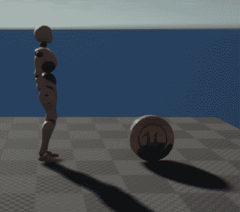

图 15.4：可旋转的硬币可被玩家重叠

注意

此活动的解决方案可在以下位置找到：[`packt.live/338jEBx`](https://packt.live/338jEBx)。

完成此活动后，您已经证明了您知道如何将资产迁移到您的虚幻项目中，以及如何使用和更新`URotatingMovementComponent`以满足硬币收藏的需求。现在硬币收藏演员已经完成，是时候为玩家添加功能，以便玩家可以跟踪他们收集了多少硬币。

首先，我们将创建使用`UE_LOG`计算硬币数量的逻辑，然后在游戏的 UI 上使用 UMG 实现硬币计数器。

# 使用 UE_LOG 记录变量

在*第十一章*，*混合空间 1D，键绑定和状态机*中，我们使用并了解了`UE_LOG`函数，以便在玩家应该投掷抛射物时记录。然后我们在*第十三章*，*敌人人工智能*中使用`UE_LOG`函数，记录玩家抛射物击中物体的情况。`UE_LOG`是一个强大的日志记录工具，我们可以使用它将重要信息从我们的 C++函数输出到编辑器中的`输出日志`窗口中。到目前为止，我们只记录了`FStrings`，以在`输出日志`窗口中显示一般文本，以了解我们的函数是否被调用。现在是时候学习如何记录变量以调试玩家收集了多少硬币。

注意

在 Unreal Engine 4 中还有另一个有用的调试函数，称为`AddOnScreenDebugMessage`。您可以在这里了解更多关于此功能的信息：[`docs.unrealengine.com/en-US/API/Runtime/Engine/Engine/UEngine/AddOnScreenDebugMessage/1/index.html`](https://docs.unrealengine.com/en-US/API/Runtime/Engine/Engine/UEngine/AddOnScreenDebugMessage/1/index.html)。

在创建`TEXT()`宏使用的`FString`语法时，我们可以添加格式说明符以记录不同类型的变量。我们只讨论如何为整数变量添加格式说明符。

注意

您可以通过阅读以下文档找到有关如何指定其他变量类型的更多信息：[`www.ue4community.wiki/Logging#Logging_an_FString`](https://www.ue4community.wiki/Logging#Logging_an_FString)。

这是在传递`FString "Example Text"`时`UE_LOG()`的样子：

```cpp
UE_LOG(LogTemp, Warning, TEXT("Example Text"));
```

在这里，您有`Log Category`，`Log Verbose Level`和实际的`FString`，`"Example Text"`，显示在日志中。要记录整数变量，您需要在`TEXT()`宏中添加`％d`，然后在`TEXT()`宏之外添加整数变量名称，用逗号分隔。这是一个例子：

```cpp
UE_LOG(LogTemp, Warning, TEXT("My integer variable %d), MyInteger);
```

格式说明符由`％`符号标识，每种变量类型都有一个对应的字母。在整数的情况下，使用字母`d`。您将使用此方法记录整数变量，以记录玩家在下一个练习中拥有的硬币收藏数量。

## 练习 15.03：跟踪玩家的硬币数量

在这个练习中，您将创建必要的属性和函数，以便跟踪玩家在整个级别中收集的硬币数量。您将在本章后面使用此跟踪来向玩家展示。按照以下步骤完成此练习：

1.  在 Visual Studio 中，找到并打开`SuperSideScroller_Player.h`头文件。

1.  在`Private Access Modifier`下，创建一个名为`NumberofCollectables`的新`int`变量，如下所示：

```cpp
    int32 NumberofCollectables;
    ```

这将是一个私有属性，用于跟踪玩家已收集的硬币的当前数量。您将创建一个公共函数，用于返回这个整数值。出于安全原因，我们这样做是为了确保没有其他类可以修改这个值。

1.  在现有的`public`访问修饰符下，使用`BlueprintPure`关键字创建一个新的`UFUNCTION()`，名为`GetCurrentNumberOfCollectables()`。这个函数将返回一个`int`。以下代码将其添加为内联函数：

```cpp
    UFUNCTION(BlueprintPure)
    int32 GetCurrentNumberofCollectables() { return NumberofCollectables; };
    ```

我们使用`UFUNCTION()`和`BlueprintPure`关键字将这个函数暴露给蓝图，以便我们以后在 UMG 中使用它。

1.  声明一个新的`void`函数，在`public`访问修饰符下，名为`IncrementNumberofCollectables()`，接受一个名为`Value`的整数参数：

```cpp
    void IncrementNumberofCollectables(int32  Value);
    ```

这是您将用来跟踪玩家收集了多少硬币的主要函数。我们还将添加一些安全措施，以确保这个值永远不会是负数。

1.  声明了`IncrementNumberofCollectables()`函数，让我们在`SuperSideScroller_Player.cpp`源文件中创建这个函数的定义。

1.  编写以下代码来创建`IncrementNumberofCollectables`函数的定义：

```cpp
    void ASuperSideScroller_Player::IncrementNumberofCollectables(int32 Value)
    {
    }
    ```

1.  这里需要处理的主要情况是，传递给这个函数的整数值是否小于或等于`0`。在这种情况下，我们不希望麻烦增加`NumberofCollectables`变量。在`IncrementNumberofCollectables()`函数中添加以下代码：

```cpp
    if(Value== 0)
    {
      return;
    }
    ```

这个`if()`语句表示如果`value`输入参数小于或等于`0`，函数将结束。由于`IncrementNumberofCollectables()`函数返回`void`，在这种情况下使用`return`关键字是完全可以的。

我们添加了这个检查，确保传递给`IncrementNumberofCollectables()`函数的`value`参数既不是 0 也不是负数，因为建立良好的编码习惯非常重要；这保证了处理了所有可能的结果。在实际的开发环境中，可能会有设计师或其他程序员尝试使用`IncrementNumberofCollectables()`函数并尝试传递一个负值或等于 0 的值。如果函数没有考虑到这些可能性，后续开发中可能会出现 bug。

1.  现在我们已经处理了`value`小于或等于`0`的边缘情况，让我们继续使用`else()`语句来增加`NumberofCollectables`。在上一步的`if()`语句下面添加以下代码：

```cpp
    else
    {
      NumberofCollectables += Value;
    }
    ```

1.  接下来，让我们使用`UE_LOG`和我们学到的关于记录变量的知识来记录`NumberofCollectables`。在`else()`语句之后添加以下代码来正确记录`NumberofCollectables`：

```cpp
    UE_LOG(LogTemp, Warning, TEXT("Number of Coins: %d"), NumberofCollectables);
    ```

通过`UE_LOG()`，我们正在创建一个更健壮的日志来跟踪硬币的数量。这为 UI 的工作奠定了基础。这是因为我们实质上是通过 UMG 在本章后期向玩家记录相同的信息。

添加了`UE_LOG()`后，我们只需要在`PickableActor_Collectable`类中调用`IncrementNumberofCollectables()`函数。

1.  在`PickableActor_Collectable.cpp`源文件中，添加以下头文件：

```cpp
    #include "SuperSideScroller_Player.h"
    ```

1.  接下来，在`PlayerPickedUp()`函数内，在`Super::PlayerPickedUp(Player)`行之前添加以下函数调用：

```cpp
    Player->IncrementNumberofCollectables(CollectableValue);
    ```

1.  现在，我们的`PickableActor_Collectable`类正在调用我们玩家的`IncrementNumberofCollectables`函数，重新编译 C++代码并返回到 Unreal Engine 4 编辑器。

1.  在 UE4 编辑器中，通过*左键单击*`Window`，然后悬停在`Developer Tools`选项上，打开`Output Log`窗口。从这个额外的下拉菜单中选择`Output Log`。

1.  现在，在你的关卡中添加多个`BP_Collectable`角色，然后使用 PIE。

1.  当您重叠每个可收集的硬币时，请观察“输出日志”窗口，以找出每次收集硬币时，“输出日志”窗口将向您显示您已收集了多少枚硬币。

注意

您可以在此处找到此练习的资产和代码：[`packt.live/36t6xM5`](https://packt.live/36t6xM5)。

通过完成此练习，您现在已经完成了开发跟踪玩家收集的硬币数量的 UI 元素所需工作的一半。下半部分将使用在此活动中开发的功能在 UMG 内向玩家在屏幕上显示这些信息。为此，我们需要在虚幻引擎 4 内学习更多关于 UMG 的知识。

# UMG

UMG，或虚幻动态图形用户界面设计师，是虚幻引擎 4 用于创建菜单、游戏内 HUD 元素（如生命条）和其他用户界面的主要工具。

在`SuperSideScroller`游戏中，我们将仅使用“文本”小部件来构建我们的*练习 15.04*中的“硬币收集 UI”，*创建硬币计数器 UI HUD 元素*。我们将在下一节中更多地了解“文本”小部件。

# 文本小部件

“文本”小部件是存在的较简单的小部件之一。这是因为它只允许您向用户显示文本信息并自定义这些文本的视觉效果。几乎每个游戏都以某种方式使用文本向玩家显示信息。例如，《守望先锋》使用基于文本的用户界面向玩家显示关键的比赛数据。如果不使用文本，向玩家传达关键的统计数据，如总伤害、游戏时间总计等，可能会非常困难，甚至不可能。

“文本”小部件出现在 UMG 的“调色板”选项卡中。当您将“文本”小部件添加到“画布”面板时，它将默认显示“文本块”。您可以通过将文本添加到小部件的“文本”参数中来自定义此文本。或者，您可以使用“功能绑定”来显示更强大的文本，可以引用内部或外部变量。“功能绑定”应该在需要显示可能会改变的信息时使用；这可能是代表玩家得分、玩家拥有的金钱数量，或者在我们的情况下，玩家收集的硬币数量。

您将使用“文本”小部件的“功能绑定”功能来显示玩家使用您在*练习 15.03*中创建的“GetCurrentNumberofCollectables（）”函数收集的硬币数量，*跟踪玩家的硬币数量*。

现在我们在“画布”面板中有了“文本”小部件，是时候将这个小部件定位到我们需要的位置了。为此，我们将利用锚点。

## 锚点

锚点用于定义小部件在“画布”面板上的期望位置。一旦定义，锚点将确保小部件在不同平台设备（如手机、平板电脑和计算机）的不同屏幕尺寸上保持这个位置。没有锚点，小部件的位置可能会在不同的屏幕分辨率之间变化，这是不希望发生的。

注意

有关锚点的更多信息，请参阅以下文档：[`docs.unrealengine.com/en-US/Engine/UMG/UserGuide/Anchors/index.html`](https://docs.unrealengine.com/en-US/Engine/UMG/UserGuide/Anchors/index.html)。

为了我们的“硬币收集 UI”和您将使用的“文本”小部件，锚点将位于屏幕的左上角。您还将从此“锚点”位置添加位置偏移，以便文本对玩家更加可见和可读。在继续创建我们的“硬币收集 UI”之前，让我们了解一下“文本格式”，您将使用它来向玩家显示当前收集的硬币数量。

## 文本格式

与 C++中可用的`UE_LOG()`宏类似，蓝图提供了类似的解决方案，用于显示文本并格式化文本以允许添加自定义变量。`格式文本`函数接受一个标记为`Format`的单个文本输入，并返回`Result`文本。然后可以用于显示信息：


图 15.5：格式文本函数允许我们使用格式化参数自定义文本

`格式文本`函数不像`UE_LOG()`那样使用`%`符号，而是使用`{}`符号来表示可以传递到字符串中的参数。在`{}`符号之间，您需要添加一个参数名称；这可以是任何你想要的东西，但它应该代表参数是什么。请参考以下截图中显示的示例：

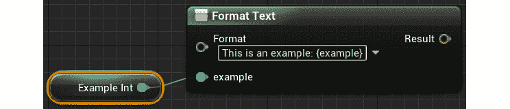

图 15.6：在这里，我们将一个示例整数传递到格式化文本中

`格式文本`函数仅支持`Byte`、`Integer`、`Float`、`Text`或`EText Gender`变量类型，因此，如果您尝试将任何其他类型的变量作为参数传递到函数中，您必须将其转换为受支持的类型之一。

注意

`格式文本`功能还用于`文本本地化`，您可以为游戏支持多种语言。有关如何在 C++和蓝图中执行此操作的更多信息，请访问：[`docs.unrealengine.com/en-US/Gameplay/Localization/Formatting/index.html`](https://docs.unrealengine.com/en-US/Gameplay/Localization/Formatting/index.html)。

在下一个练习中，您将在 UMG 中的`Text`小部件中与`格式文本`函数一起使用，我们将创建`Coin Counter UI`小部件，以显示玩家收集的硬币数量。您还将使用`Anchors`将`Text`小部件定位在屏幕的左上角。

## 练习 15.04：创建硬币计数器 UI HUD 元素

在这个练习中，您将创建 UMG UI 资产，用于显示和更新玩家收集的硬币数量。您将使用在*练习 15.02*中创建的`GetCurrentNumberofCollectables()`内联函数，在屏幕上使用简单的`Text`小部件显示此值。按照以下步骤完成此操作：

1.  让我们首先在`Content Browser`窗口内创建一个名为`UI`的新文件夹。在编辑器中的浏览器目录顶部的`Content`文件夹上*右键单击*，然后选择`New Folder`。

1.  在新的`/Content/UI`目录内，*右键单击*，而不是选择`Blueprint Class`，悬停在列表底部的`User Interface`选项上，然后*左键单击*`Widget Blueprint`选项。

1.  将这个新的`Widget Blueprint`命名为`BP_UI_CoinCollection`，然后*双击*该资产以打开 UMG 编辑器。

1.  默认情况下，`Widget`面板是空的，您会在左侧找到一个空的层次结构，如下截图所示：

图 15.7：Widget 面板层次结构概述了 UI 的不同元素如何相互叠加

1.  在`Hierarchy`选项卡上方是`Palette`选项卡，列出了您可以在 UI 内使用的所有可用小部件。我们只关注`Text`小部件，它列在`Common`类别下。不要将此选项与 Rich Text Block 小部件混淆。

注意

有关 UMG 中所有可用`Widgets`的更详细参考，请阅读 Epic Games 的以下文档：[`docs.unrealengine.com/en-US/Engine/UMG/UserGuide/WidgetTypeReference/index.html`](https://docs.unrealengine.com/en-US/Engine/UMG/UserGuide/WidgetTypeReference/index.html)。

1.  通过*左键单击*并将`Text`小部件从`Palette`选项卡拖动到`Canvas`面板根下的`Hierarchy`选项卡，或者通过*左键单击*并将`Text`小部件直接拖放到 UMG 编辑器中间的`Canvas`面板本身中，将`Text`小部件添加到`UI`面板。

在更改此小部件的文本之前，我们需要更新其锚点、位置和字体大小，以满足我们在向玩家显示信息方面的需求。

1.  选择`Text`小部件后，您会在其`Details`面板下看到许多选项来自定义此文本。这里要做的第一件事是将`Text`小部件锚定到`Canvas`面板的左上角。*左键单击*`Anchors`下拉菜单，并选择左上角的锚定选项，如下截图所示：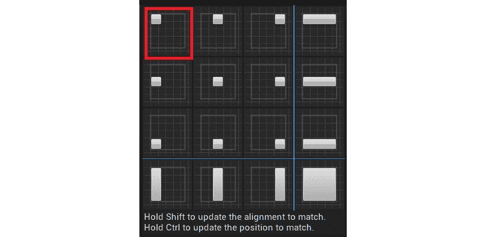

图 15.8：默认情况下，有选项可以锚定小部件在屏幕的不同位置

锚定允许小部件在`Canvas`面板内保持所需的位置，而不受不同屏幕尺寸的影响。

现在`Text`小部件已经锚定在左上角，我们需要设置它相对于此锚点的位置，以便为文本提供更好的定位和可读性的偏移量。

1.  在`Anchors`选项下的`Details`面板中，有`Position X`和`Position Y`的参数。将这两个参数都设置为`100.0f`。

1.  接下来，启用`Size To Content`参数，以便`Text`小部件的大小将根据其显示的文本大小自动调整大小，如下截图所示：

图 15.9：`Size To Content`参数将确保`Text`小部件将显示其完整内容，不会被切断

1.  这里需要做的最后一件事是更新`Text`小部件使用的字体大小。在`Text`小部件的`Details`面板的`Appearance`选项卡下，您会找到`Size`参数。将此值设置为`48`。

1.  最终的`Text`小部件将如下所示：

图 15.10：现在`Text`小部件已经锚定在画布面板的左上角，具有较小的相对偏移和更大的字体，以便玩家更容易阅读

现在`Text`小部件已经定位和调整大小，让我们为文本添加一个新的绑定，以便它将自动更新并匹配玩家拥有的可收集物品的数量的值。

1.  选择`Text`小部件后，在其`Details`面板的`Content`类别下找到`Text`参数。在那里，您会找到`Bind`选项。

1.  *左键单击*`Bind`选项，然后选择`Create Binding`。这样做时，新的`Function Binding`将自动创建，并被命名为`GetText_0`。请参考以下截图：

图 15.11：重命名绑定函数非常重要，因为它们的默认名称太通用了

1.  将此函数重命名为`获取可收集物品的数量`。

1.  在继续使用此函数之前，创建一个名为`Player`的新对象引用变量，其类型为`SuperSideScroller_Player`。通过启用变量的`Instance Editable`和`Expose on Spawn`参数，使此变量成为`Public`并在生成时可公开，如下面的截图所示：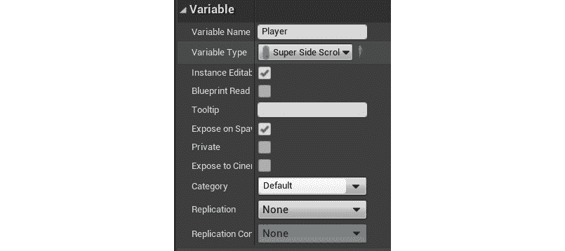

图 15.12：现在，Player 变量应该具有 Instance Editable 和 Expose on Spawn 参数

通过将`Player`变量设置为`Public`并在生成时公开，您将能够在创建小部件并将其添加到屏幕时分配此变量。我们将在*练习 15.05*中执行此操作，*将硬币计数器 UI 添加到玩家屏幕*。

现在我们有一个对`SuperSideScroller_Player`的引用变量，让我们继续使用`Get Number of Collectables`绑定函数。

1.  将`Player`变量的`Getter`添加到`Get Number of Collectables`函数中。

1.  从此变量中，*左键单击* 并从上下文敏感的下拉菜单中拖动，并找到并选择`Get Current Number of Collectables`函数。请参阅下面的截图：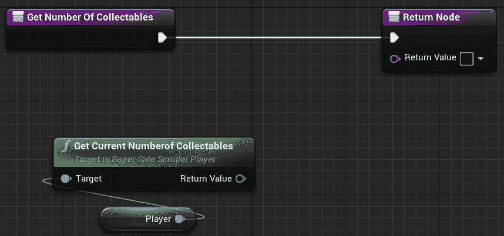

图 15.13：您在练习 15.03 中创建的 Get Current Numberof Collectables C++函数

1.  接下来，*左键单击* 并拖动 `Get Number of Collectables` 的 `Return Value` 文本参数到 `Return Node`。从上下文敏感的下拉菜单中，搜索并选择 `Format Text` 选项，如下面的截图所示：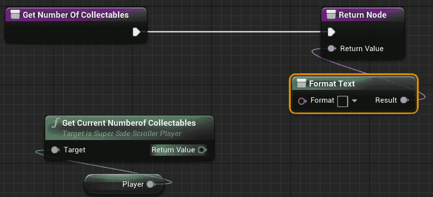

图 15.14：现在，我们可以创建自定义和格式化的文本以满足文本的需求

1.  在`Format Text`函数中添加以下文本：

```cpp
    Coins: {coins}
    ```

请参阅下面的截图：

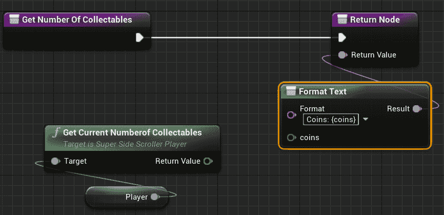

图 15.15：现在，格式化的文本有一个新的输入参数，我们可以使用它来显示自定义信息

请记住，使用`{}`符号表示允许您将变量传递到文本中的文本参数。

1.  最后，将`GetCurrentNumberofCollectables()`函数的整数`Return Value`连接到`Format Text`函数的通配符`coins`输入引脚，如下所示：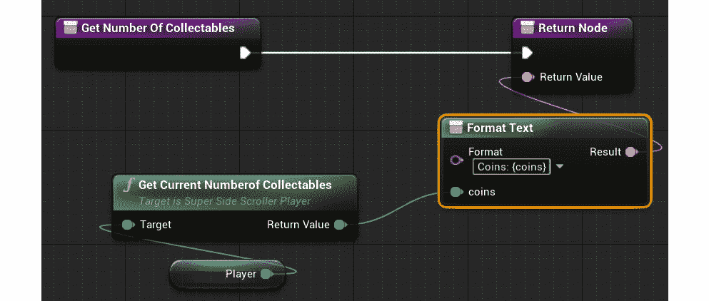

图 15.16：现在，文本小部件将根据从 Get Current Numberof Collectables 函数返回的更新值自动更新

1.  编译并保存`BP_UI_CoinCollection`小部件蓝图。

注意

您可以在此处找到此练习的资产和代码：[`packt.live/3eQJjTU`](https://packt.live/3eQJjTU)。

完成此练习后，您已经创建了显示玩家收集的硬币当前数量所需的`UI UMG`小部件。通过使用`GetCurrentNumberofCollectables()` C++函数和`Text`小部件的绑定功能，UI 将根据收集的硬币数量始终更新其值。在下一个练习中，我们将将此 UI 添加到玩家的屏幕上，但首先，我们将简要了解如何向玩家屏幕添加和删除 UMG。

# 添加和创建 UMG 用户小部件

现在我们已经在 UMG 中创建了 Coin Collection UI，是时候学习如何将 UI 添加到玩家屏幕上并从中移除了。通过将 Coin Collection UI 添加到玩家屏幕上，UI 将对玩家可见，并且可以在玩家收集硬币时进行更新。

在蓝图中，有一个名为`Create Widget`的函数，如下面的屏幕截图所示。如果没有分配类，它将被标记为`Construct None`，但不要让这使你困惑：

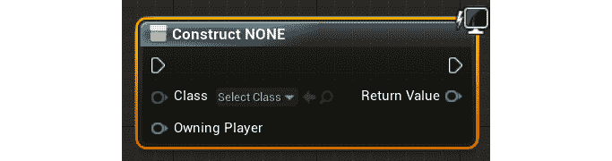

图 15.17：默认情况下的 Create 小部件，没有应用类

此函数要求创建`User`小部件的类，并需要一个`Player Controller`作为此 UI 的拥有玩家的引用。然后，此函数将生成的用户小部件作为其`Return Value`返回，然后您可以使用`Add to Viewport`函数将其添加到玩家的视口。 `Create Widget`函数只实例化小部件对象；它不会将此小部件添加到玩家的屏幕上。正是`Add to Viewport`函数使此小部件在玩家的屏幕上可见。

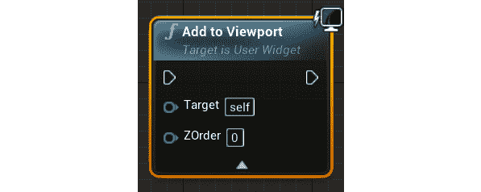

图 15.18：带有 ZOrder 的 Add to Viewport 函数

视口是游戏屏幕，覆盖了你对游戏世界的视图，并且它使用所谓的`ZOrder`来确定覆盖深度，在多个 UI 元素需要在彼此上方或下方重叠的情况下。默认情况下，`Add to Viewport`函数将把`User`小部件添加到屏幕上，并使其填满整个屏幕；也就是说，除非调用`Set Desired Size In Viewport`函数来手动设置它应该填充的大小：

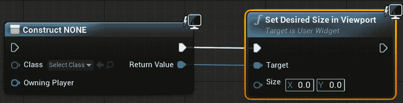

图 15.19：Size 参数确定传入的 User 小部件的期望大小

在 C++中，您还有一个名为“CreateWidget（）”的函数：

```cpp
template<typename WidgetT, typename OwnerT>
WidgetT * CreateWidget
(
  OwnerT * OwningObject,
  TSubclassOf < UUserWidget > UserWidgetClass,
  FName WidgetName
)
```

“CreateWidget（）”函数可通过`UserWidget`类使用，在`/Engine/Source/Runtime/UMG/Public/Blueprint/UserWidget.h`中可以找到。

可以在*第八章*“用户界面”中找到一个例子，您可以使用“CreateWidget（）”函数创建`BP_HUDWidget`：

```cpp
HUDWidget = CreateWidget<UHUDWidget>(this, BP_HUDWidget);
```

有关 C++中“CreateWidget（）”函数的更多信息，请参阅*第八章*“用户界面”和*Exercise 8.06*“创建健康条 C++逻辑”。

这个函数几乎与其蓝图对应函数的工作方式相同，因为它接受`Owning Object`参数，就像蓝图函数的`Owning Player`参数一样，并且需要创建`User Widget`类。C++的“CreateWidget（）”函数还接受一个`FName`参数来表示小部件的名称。

现在我们已经了解了用于向玩家屏幕添加 UI 的方法，让我们将这些知识付诸实践。在以下练习中，您将实现`Create Widget`和`Add to Viewport`蓝图函数，以便我们可以将我们在*Exercise 15.04*中创建的硬币收集 UI 添加到玩家屏幕上。

## 练习 15.05：将硬币计数器 UI 添加到玩家屏幕

在这个练习中，您将创建一个新的`Player Controller`类，以便您可以使用玩家控制器将`BP_UI_CoinCollection`小部件蓝图添加到玩家的屏幕上。然后，您还将创建一个新的`Game Mode`类，并将此游戏模式应用于`SuperSideScroller`项目。执行以下步骤完成此练习：

1.  在虚幻引擎 4 编辑器中，导航到“文件”，然后选择“新建 C++类”。

1.  从“选择父类”对话框中，找到并选择`Player Controller`选项。

1.  将新的`Player Controller`类命名为`SuperSideScroller_Controller`，然后*左键单击*“创建类”按钮。Visual Studio 将自动生成并打开`SuperSideScroller_Controller`类的源文件和头文件，但现在我们将留在虚幻引擎 4 编辑器内。

1.  在“内容浏览器”窗口中，在`MainCharacter`文件夹目录下，创建一个名为`PlayerController`的新文件夹。

1.  在`PlayerController`文件夹中，*右键*并使用新的`SuperSideScroller_Controller`类创建一个新的`Blueprint Class`。请参考以下截图：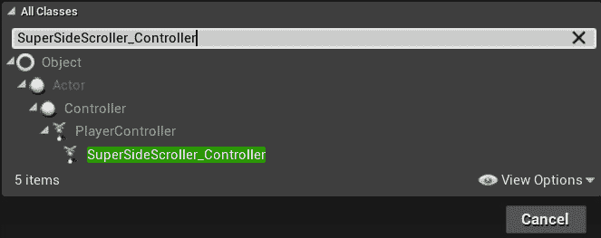

图 15.20：找到新的 SuperSideScroller_Controller 类以创建一个新的蓝图

1.  将这个新的蓝图命名为`BP_SuperSideScroller_PC`，然后*双击*该资产以打开它。

要将`BP_UI_CoinCollection` widget 添加到屏幕上，我们需要使用`Add to Viewport`函数和`Create Widget`函数。我们希望在玩家角色被玩家控制器`Possess`之后，将 UI 添加到玩家的屏幕上。

1.  *右键*在蓝图图表中，并从上下文敏感菜单中找到`Event On Possess`选项，*左键*将其添加到图表中。请参考以下截图：

图 15.21：每次这个控制器类拥有一个新的 pawn 时，将调用 Event On Possess 选项

`Event On Possess`事件节点返回`Possessed Pawn`。我们将使用这个 pawn 传递给我们的`BP_UI_CoinCollection UI Widget`，但首先，我们需要`Cast To` `SuperSideScroller_Player`类。

1.  *左键*并从`Event On Possess`节点的`Possessed Pawn`参数输出中拖动。然后，搜索并找到`Cast to SuperSideScroller_Player`节点。请参考以下截图：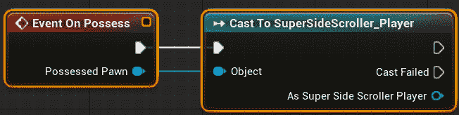

图 15.22：我们需要转换为 SuperSideScroller_Player 以确保我们转换到正确的玩家角色类

1.  现在，*右键*并搜索`Create Widget`函数将其添加到蓝图图表中。

1.  从下拉类参数中，找到并分配在*Exercise 15.04*中创建的`BP_UI_CoinCollection`资产，*Creating the Coin Counter UI HUD Element*。请参考以下截图：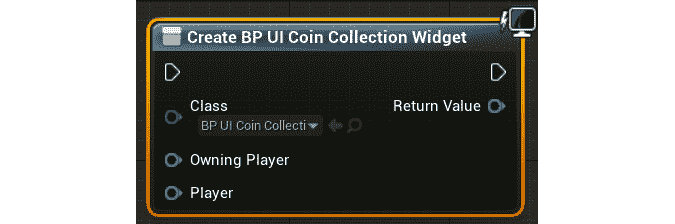

图 15.23：Create Widget 函数将使用传递给它的 UMG 类创建一个新的 UI 对象

将`Class`参数更新为`BP_UI_CoinCollection`类后，您会注意到`Create Widget`函数将更新以显示您创建的`Player`变量，设置为`Exposed on Spawn`。

1.  *右键*在蓝图图表中搜索并找到`Self`引用变量。将`Self`对象变量连接到`Create Widget`函数的`Owning Player`参数，如下图所示：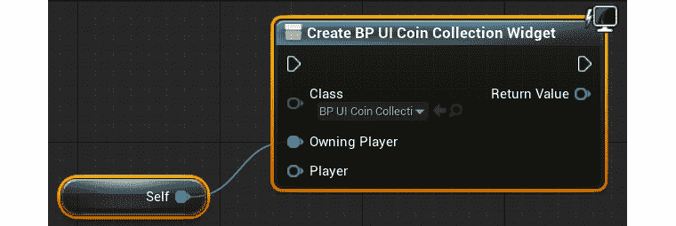

图 15.24：Owning Player 输入参数是 Player Controller 类型

`拥有玩家`参数是指将显示和拥有此 UI 对象的`Player Controller`类型。由于我们将此 UI 添加到`SuperSideScroller_Controller`蓝图中，我们可以直接使用`Self`引用变量传递给函数。

1.  接下来，将返回的`SuperSideScroller_Player`变量从`Cast`节点传递到`Create Widget`函数的`Player`输入节点。然后，连接`Cast`节点和`Create Widget`函数的执行引脚，如下图所示：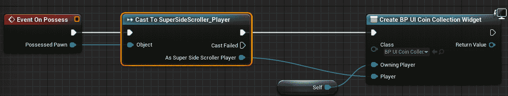

图 15.25：如果 Cast To SuperSideScroller_Player 有效，我们可以创建 BP_UI_CoinCollection widget 并传递被占有的玩家

注意

您可以在以下链接找到前面截图的全分辨率以获得更好的查看体验：[`packt.live/3f89m99`](https://packt.live/3f89m99)。

1.  *右键单击*蓝图图表内部再次搜索并找到`Add to Viewport`函数，以便将其放置在图表中。

1.  将`Create Widget`函数的输出`Return Value`参数连接到`Add to Viewport`函数的`Target`输入参数；不要更改`ZOrder`参数。

1.  最后，连接`Create Widget`和`Add to Viewport`函数的执行引脚，如下所示：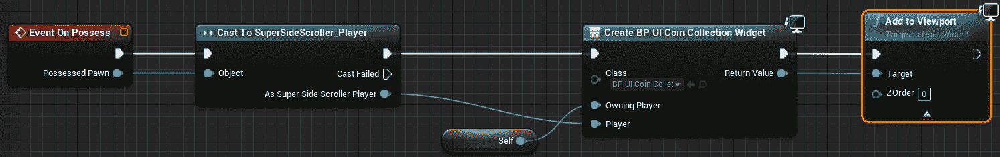

图 15.26：创建完 BP_UI_CoinCollection 小部件后，我们可以将其添加到玩家视口

注意

您可以在以下链接找到前面截图的全分辨率以获得更好的查看体验：[`packt.live/2UwufBd`](https://packt.live/2UwufBd)。

现在，玩家控制器将`BP_UI_CoinCollection`小部件添加到玩家视口，我们需要创建一个`GameMode`蓝图，并将`BP_SuperSideScroller_MainCharacter`和`BP_SuperSideScroller_PC`类应用到这个游戏模式中。

1.  在`Content Browser`窗口中，通过*右键单击*`Content`文件夹并选择`New Folder`来创建一个新文件夹。将此文件夹命名为`GameMode`。

1.  接下来，*右键单击*并选择`Blueprint Class`开始创建游戏模式蓝图。从`Pick Parent Class`对话框中搜索并找到`SuperSideScrollerGameMode`，位于`All Classes`下。

1.  将这个新的`GameMode`蓝图命名为`BP_SuperSideScroller_GameMode`。*双击*此资产以打开它。

`GameMode`蓝图包含一个类列表，您可以使用自己的类进行自定义。目前，我们只需要担心`Player Controller Class`和`Default Pawn Class`。

1.  *左键单击*`Player Controller Class`下拉菜单，找到并选择之前在此练习中创建的`BP_SuperSideScroller_PC`蓝图。

1.  然后，*左键单击*`Default Pawn Class`下拉菜单，找到并选择`BP_SuperSideScroller_MainCharacter`蓝图。

现在我们有了一个自定义的`GameMode`，它利用我们自定义的`Player Controller`和`Player Character`类，让我们将这个游戏模式添加到`Project Settings`窗口，这样在使用 PIE 和构建项目时，默认情况下会使用游戏模式。

1.  从 Unreal Engine 4 编辑器中，导航到屏幕顶部的`Edit`选项。*左键单击*此选项，并从下拉菜单中找到并选择`Project Settings`选项。

1.  在`Project Settings`窗口的左侧，您将看到一个分成几个部分的类别列表。在`Project`部分下，*左键单击*`Maps & Modes`类别。

1.  在`Maps & Modes`部分，您有一些与项目默认地图和游戏模式相关的参数。在此部分的顶部，您有`Default GameMode`选项。*左键单击*此下拉菜单，找到并选择之前在此练习中创建的`SuperSideScroller_GameMode`蓝图。

注意

对`Maps & Modes`部分的更改会自动保存并写入`DefaultEngine.ini`文件，该文件位于项目的`Config`文件夹中。可以通过更新`GameMode Override`参数来覆盖每个级别的`Default GameMode`，该参数位于级别的`World Settings`窗口中。

1.  关闭`Project Settings`窗口并返回到您的级别。使用 PIE 并开始收集硬币。观察到每次收集硬币时，`BP_UI_CoinCollection`小部件都会显示并更新，如下图所示：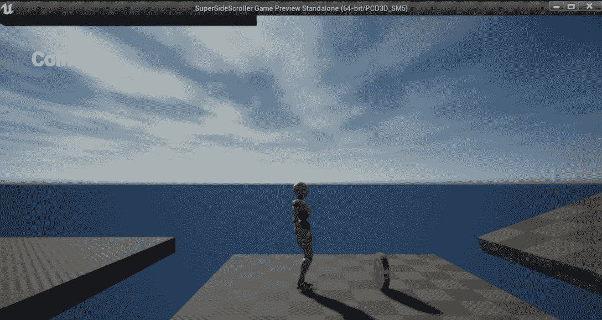

图 15.27：现在，您收集的每个硬币都将显示在玩家 UI 上

注意

您可以在此处找到此练习的资产和代码：[`packt.live/2JRfSFz`](https://packt.live/2JRfSFz)。

完成此练习后，您已经创建了`UI UMG`小部件，该小部件用于显示玩家收集的当前硬币数量。通过使用`GetCurrentNumberofCollectables()`C++函数和`Text`小部件的绑定功能，UI 将根据收集的硬币数量始终更新其值。

到目前为止，我们已经专注于可收集的硬币，并允许玩家收集这些硬币并将总硬币数添加到玩家的 UI 中。现在，我们将专注于药水增益，并为玩家在短时间内提供移动速度和跳跃高度增加。为了实现这个功能，我们首先需要研究计时器。

# 计时器

虚幻引擎 4 中的计时器允许您在延迟后执行操作，或者每隔 X 秒执行一次。在`SuperSideScroller`药水增益的情况下，将使用计时器在 8 秒后将玩家的移动和跳跃恢复到默认状态。

注意

在蓝图中，您可以使用延迟节点以及计时器句柄来实现相同的结果。但是，在 C++中，计时器是实现延迟和重复逻辑的最佳手段。

计时器由“计时器管理器”或`FTimerManager`管理，它存在于`UWorld`对象中。您将从`FTimerManager`类中使用的两个主要函数称为`SetTimer()`和`ClearTimer()`：

```cpp
void SetTimer
(
    FTimerHandle & InOutHandle,
    TFunction < void )> && Callback,
    float InRate,
    bool InbLoop,
    float InFirstDelay
)
void ClearTimer(FTimerHandle& InHandle)
```

您可能已经注意到，在两个函数中都需要`FTimerHandle`。此句柄用于控制您设置的计时器。使用此句柄，您可以暂停、恢复、清除甚至延长计时器。

`SetTimer()`函数还有其他参数可帮助您在最初设置计时器时自定义此“计时器”。回调函数将在“计时器”完成后调用，如果`InbLoop`参数为`True`，则它将继续无限期调用回调函数，直到计时器停止。 `InRate`参数是计时器本身的持续时间，而`InFirstDelay`是在计时器开始计时之前应用于计时器的初始延迟。

`FTimerManager`类的头文件可以在此处找到：/Engine/Source/Runtime/Engine/Public/TimerManager.h。

注意

您可以通过阅读此处的文档了解有关计时器和`FTimerHandle`的更多信息：[`docs.unrealengine.com/en-US/Programming/UnrealArchitecture/Timers/index.html`](https://docs.unrealengine.com/en-US/Programming/UnrealArchitecture/Timers/index.html)。

在接下来的练习中，您将在`SuperSideScroller_Player`类中创建自己的`FTimerHandle`，并使用它来控制药水增益对玩家的持续时间。

## 练习 15.06：将药水增益行为添加到玩家

在此练习中，您将创建药水增益背后的逻辑，以及它将如何影响玩家角色。您将利用计时器和计时器句柄，以确保增益效果只持续很短的时间。按照以下步骤完成此操作：

1.  在 Visual Studio 中，导航到并打开`SuperSideScroller_Player.h`头文件。

1.  在“我们的私有访问修饰符”下，添加一个名为`PowerupHandle`的`FTimerHandle`类型的新变量：

```cpp
    FTimerHandle PowerupHandle;
    ```

此计时器句柄将负责跟踪自启动以来经过的时间。这将允许我们控制药水增益效果持续多长时间。

1.  接下来，在我们的“私有访问修饰符”下添加一个名为`bHasPowerupActive`的布尔变量：

```cpp
    bool bHasPowerupActive;
    ```

在更新`Sprint()`和`StopSprinting()`函数时，我们将使用此布尔变量来确保根据增益是否激活来适当更新玩家的冲刺移动速度。

1.  接下来，在我们的“公共访问修饰符”下声明一个名为`IncreaseMovementPowerup()`的新 void 函数：

```cpp
    void IncreaseMovementPowerup();
    ```

这是将从药水增益类调用的函数，以启用玩家的增益效果。

1.  最后，您需要创建一个处理电源增强效果结束时的函数。在`Protected Access Modifier`下创建一个名为`EndPowerup()`的函数：

```cpp
    void EndPowerup();
    ```

有了所有必要的变量和声明的函数，现在是时候开始定义这些新函数并处理玩家的电源增强效果了。

1.  导航到`SuperSideScroller_Player.cpp`源文件。

1.  首先，在源文件的顶部添加头文件`#include "TimerManager.h"`；我们将需要这个类来使用`Timers`。

1.  通过在源文件中添加以下代码来定义`IncreaseMovementPowerup()`函数：

```cpp
    void ASuperSideScroller_Player::IncreaseMovementPowerup()
    {
    }
    ```

1.  当调用此函数时，我们需要做的第一件事是将`bHasPowerupActive`变量设置为`true`。将以下代码添加到`IncreaseMovementPowerup()`函数中：

```cpp
    bHasPowerupActive = true;
    ```

1.  接下来，添加以下代码来增加玩家角色移动组件的`MaxWalkSpeed`和`JumpZVelocity`组件：

```cpp
    GetCharacterMovement()->MaxWalkSpeed = 500.0f;
    GetCharacterMovement()->JumpZVelocity = 1500.0f;
    ```

在这里，我们将`MaxWalkSpeed`从默认值`300.0f`更改为`500.0f`。您可能还记得，默认的冲刺速度也是`500.0f`。我们将在本活动的后续部分中解决这个问题，以在电源增强状态下增加冲刺速度。

1.  利用计时器，我们需要获得对`UWorld`对象的引用。添加以下代码：

```cpp
    UWorld* World = GetWorld();
    if (World)
    {
    }
    ```

与项目中以前做过的许多次一样，我们使用`GetWorld()`函数来获取对`UWorld`对象的引用，并将此引用保存在其变量中。

1.  现在我们已经有了对`World`对象的引用，并且已经执行了有效性检查，可以安全地使用`TimerManager`来设置电源增强计时器。在上一步中显示的`if()`语句中添加以下代码：

```cpp
    World->GetTimerManager().SetTimer(PowerupHandle, this,   &ASuperSideScroller_Player::EndPowerup, 8.0f, false);
    ```

在这里，您正在使用`TimerManager`类来设置计时器。`SetTimer()`函数接受要使用的`FTimerHandle`组件；在这种情况下，是您创建的`PowerupHandle`变量。接下来，我们需要通过使用`this`关键字传递对玩家类的引用。然后，我们需要提供在计时器结束后调用的回调函数，这种情况下是`&ASuperSideScroller_Player::EndPowerup`函数。`8.0f`表示计时器的持续时间；随时根据需要进行调整，但目前 8 秒是可以的。最后，还有一个参数，用于确定此计时器是否应该循环；在这种情况下，不应该循环。

1.  创建`EndPowerup()`函数的函数定义：

```cpp
    void ASuperSideScroller_Player::EndPowerup()
    {
    }
    ```

1.  当调用`EndPowerup()`函数时，首先要做的是将`bHasPowerupActive`变量设置为`false`。在`EndPowerup()`函数中添加以下代码：

```cpp
    bHasPowerupActive = false;
    ```

1.  接下来，将角色移动组件的`MaxWalkSpeed`和`JumpZVelocity`参数更改回它们的默认值。添加以下代码：

```cpp
    GetCharacterMovement()->MaxWalkSpeed = 300.0f;
    GetCharacterMovement()->JumpZVelocity = 1000.0f;
    ```

在这里，我们正在将角色移动组件的`MaxWalkSpeed`和`JumpZVelocity`参数都更改为它们的默认值。

1.  再次利用计时器并清除`PowerupHandle`的计时器处理，我们需要获得对`UWorld`对象的引用。添加以下代码：

```cpp
    UWorld* World = GetWorld();
    if (World)
    {
    }
    ```

1.  最后，我们可以添加代码来清除计时器句柄的`PowerupHandle`：

```cpp
    World->GetTimerManager().ClearTimer(PowerupHandle);
    ```

通过使用`ClearTimer()`函数并传入`PowerupHandle`，我们确保此计时器不再有效，并且不再影响玩家。

现在我们已经创建了处理电源增强效果和与效果相关的计时器的函数，我们需要更新`Sprint()`和`StopSprinting()`函数，以便它们在玩家处于电源增强状态时也考虑到速度。

1.  将`Sprint()`函数更新为以下内容：

```cpp
    void ASuperSideScroller_Player::Sprint()
    {
      if (!bIsSprinting)
      {
        bIsSprinting = true;
        if (bHasPowerupActive)
        {
          GetCharacterMovement()->MaxWalkSpeed = 900.0f;
        }
        else
        {
          GetCharacterMovement()->MaxWalkSpeed = 500.0f;
        }
      }
    }
    ```

在这里，我们正在更新`Sprint()`函数以考虑`bHasPowerupActive`是否为 true。如果此变量为 true，则我们在冲刺时将`MaxWalkSpeed`从`500.0f`增加到`900.0f`，如下所示：

```cpp
    if (bHasPowerupActive)
    {
      GetCharacterMovement()->MaxWalkSpeed = 900.0f;
    }
    ```

如果`bHasPowerupActive`为 false，则我们将`MaxWalkSpeed`增加到`500.0f`，就像默认情况下一样。

1.  将`StopSprinting()`函数更新为以下内容：

```cpp
    void ASuperSideScroller_Player::StopSprinting()
    {
      if (bIsSprinting)
      {
        bIsSprinting = false;
        if (bHasPowerupActive)
        {
          GetCharacterMovement()->MaxWalkSpeed = 500.0f;
        }
        else
        {
          GetCharacterMovement()->MaxWalkSpeed = 300.0f;
        }
      }
    }
    ```

在这里，我们更新`StopSprinting()`函数，以考虑`bHasPowerupActive`是否为真。如果这个变量为真，则将`MaxWalkSpeed`值设置为`500.0f`，而不是`300.0f`，如下所示：

```cpp
    if (bHasPowerupActive)
    {
      GetCharacterMovement()->MaxWalkSpeed = 500.0f;
    }
    ```

如果`bHasPowerupActive`为假，则将`MaxWalkSpeed`设置为`300.0f`，就像默认情况下一样。

1.  最后，我们只需要重新编译 C++代码。

注意

您可以在这里找到这个练习的资产和代码：[`packt.live/3eP39yL`](https://packt.live/3eP39yL)。

完成这个练习后，您已经在玩家角色中创建了药水增益效果。增益效果增加了玩家的默认移动速度，并增加了他们的跳跃高度。此外，增益效果还增加了奔跑速度。通过使用计时器句柄，您能够控制增益效果持续的时间。

现在，是时候创建药水增益角色了，这样我们就可以在游戏中有一个这个增益的表示了。

## 活动 15.03：创建药水增益角色

现在`SuperSideScroller_Player`类处理了药水增益的效果，是时候创建药水增益类和蓝图了。这个活动的目的是创建药水增益类，继承自`PickableActor_Base`类，实现重叠功能以授予您在*练习 15.06*中实现的移动效果，*将药水增益行为添加到玩家*，并创建药水蓝图角色。执行这些步骤来创建药水增益类和创建药水蓝图角色：

1.  创建一个新的 C++类，继承自`PickableActor_Base`类，并将这个新类命名为`PickableActor_Powerup`。

1.  添加`BeginPlay()`和`PlayerPickedUp()`函数的重写函数声明。

1.  为`BeginPlay()`函数创建函数定义。在`BeginPlay()`函数中，添加对父类函数的调用。

1.  为`PlayerPickedUp()`函数创建函数定义。在`PlayerPickedUp()`函数中，添加对`PlayerPickedUp()`父类函数的调用。

1.  接下来，添加`#include`文件，引用`SuperSideScroller_Player`类，以便我们可以引用玩家类及其函数。

1.  在`PlayerPickedUp()`函数中，使用函数本身的`Player`输入参数来调用`IncreaseMovementPowerup()`函数。

1.  从`Epic Games Launcher`中，在`Learn`选项卡的`Games`类别下找到`Action RPG`项目。使用这个来创建并安装一个新项目。

1.  将`A_Character_Heal_Mana_Cue`和`SM_PotionBottle`资产以及它们所有引用的资产从`Action RPG`项目迁移到您的`SuperSideScroller`项目。

1.  在`PickableItems`目录中的`Content Browser`窗口中创建一个名为`Powerup`的新文件夹。在该目录中基于`PickableActor_Powerup`类创建一个新的蓝图，并将此资产命名为`BP_Powerup`。

1.  在`BP_Powerup`中，更新`MeshComp`组件以使用`SM_PotionBottle`静态网格。

1.  接下来，添加`A_Character_Heal_Mana_Cue`，将其导入为`Pickup Sound`参数。

1.  最后，更新`RotationComp`组件，使得角色每秒绕`Pitch`轴旋转 60 度，绕`Yaw`轴旋转 180 度。

1.  将`BP_Powerup`添加到您的级别中，并使用 PIE 观察与增益重叠时的结果。

预期输出：

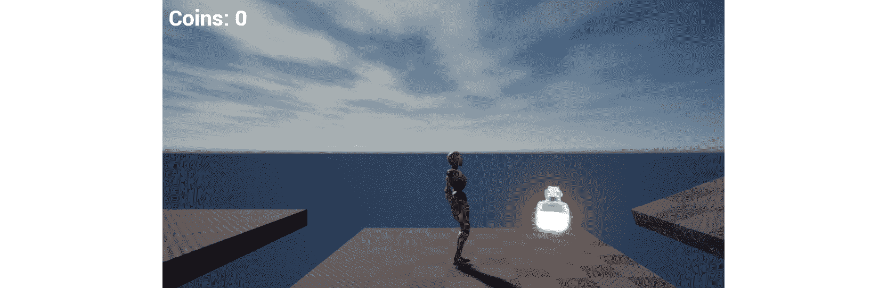

图 15.28：药水增益现在有了一个很好的视觉表示，玩家可以重叠以启用其增益效果

注意

这个活动的解决方案可以在这里找到：[`packt.live/338jEBx`](https://packt.live/338jEBx)。

通过完成这个活动，您能够在创建一个新的 C++类方面进行知识测试，该类继承自`PickableActor_Base`类，并覆盖`PlayerPickedUp()`函数以添加自定义逻辑。通过从玩家类中添加对`IncreaseMovementPowerup()`函数的调用，您能够在与该角色重叠时为玩家添加移动增益效果。然后，通过使用自定义网格、材质和音频资产，您能够从`PickableActor_Powerup`类中为蓝图角色赋予生命。

现在我们已经创建了硬币可收集物品和药水增益，我们需要将一个新的游戏功能实现到项目中：`Brick`类。在超级马里奥等游戏中，砖块中包含玩家可以找到的隐藏硬币和增益物品。这些砖块还可以用作到达高架平台和关卡内区域的手段。在我们的`SuperSideScroller`项目中，`Brick`类将用于包含玩家的隐藏硬币可收集物品，并作为允许玩家通过使用砖块作为路径来访问难以到达位置的手段。因此，在下一节中，我们将创建需要被打破以找到隐藏硬币的`Brick`类。

## 练习 15.07：创建 Brick 类

现在我们已经创建了硬币可收集物品和药水增益，是时候创建`Brick`类了，这将为玩家包含隐藏的硬币。砖块是`SuperSideScroller`项目的最终游戏元素。在这个练习中，您将创建`Brick`类，这将作为`SuperSideScroller`游戏项目的平台机制的一部分使用，同时也作为一个容纳玩家可收集物品的手段。按照以下步骤创建`Brick`类及其蓝图：

1.  在虚幻引擎 4 编辑器中，导航到`文件`，然后选择`新建 C++类`。

1.  从`选择父类`对话框中，找到并选择`Actor`类。

1.  将此类命名为`SuperSideScroller_Brick`并*左键单击*`Create Class`。Visual Studio 和虚幻引擎将重新编译代码并为您打开此类。

默认情况下，`SuperSideScroller_Brick`类带有`Tick()`函数，但我们不需要这个函数用于`Brick`类。在继续之前，从`SuperSideScroller_Brick.h`头文件中删除`Tick()`函数声明，并从`SuperSideScroller_Brick.cpp`源文件中删除函数定义。

1.  在`SuperSideScroller_Brick.h`文件的`Private Access Modifier`下，添加以下代码来声明一个新的`UStaticMeshComponent* UPROPERTY()`函数，以表示游戏世界中的砖块：

```cpp
    UPROPERTY(VisibleDefaultsOnly, Category = Brick)
    class UStaticMeshComponent* BrickMesh;
    ```

1.  接下来，我们需要创建一个`UBoxComponent UPROPERTY()`，用于处理与玩家角色的碰撞。在我们的`Private Access Modifier`下添加以下代码来添加这个组件：

```cpp
    UPROPERTY(VisibleDefaultsOnly, Category = Brick)
    class UBoxComponent* BrickCollision;
    ```

1.  在我们的`Private Access Modifier`下创建`UFUNCTION()`声明`OnHit()`函数。这将用于确定`UBoxComponent`何时被玩家击中：

```cpp
    UFUNCTION()
    void OnHit(UPrimitiveComponent* HitComp, AActor* OtherActor,   UprimitiveComponent* OtherComp, FVector NormalImpulse,   const FHitResult& Hit);
    ```

注意

在本项目中开发`PlayerProjectile`类时，您在*第十三章* *敌人人工智能*中使用了`OnHit()`函数。请查看该章节以获取有关`OnHit()`函数的更多信息。

1.  接下来，在我们的`Private Access Modifier`下创建一个新的布尔`UPROPERTY()`，使用`EditAnywhere`关键字，命名为`bHasCollectable`：

```cpp
    UPROPERTY(EditAnywhere)
    bool bHasCollectable;
    ```

这个布尔值将确定砖块是否包含玩家的硬币可收集物品。

1.  现在，我们需要一个变量来保存此砖块中有多少硬币可收集物品供玩家使用。我们将通过创建一个名为`Collectable Value`的整数变量来实现这一点。将其放在`private access modifier`下，使用`EditAnywhere`关键字，并将其默认值设置为`1`，如下所示：

```cpp
    UPROPERTY(EditAnywhere)
    int32 CollectableValue = 1;
    ```

砖块将需要包含一个独特的声音和粒子系统，以便在玩家摧毁砖块时具有良好的光泽层。我们将在下面添加这些属性。

1.  在`SuperSideScroller_Brick.h`头文件中创建一个新的`Public Access Modifier`。

1.  接下来，使用`EditAnywhere`和`BlueprintReadOnly`关键字为`USoundBase`类的变量创建一个新的`UPROPERTY()`。将此变量命名为`HitSound`，如下所示：

```cpp
    UPROPERTY(EditAnywhere, BlueprintReadOnly)
    class USoundBase* HitSound;
    ```

1.  然后，使用`EditAnywhere`和`BlueprintReadOnly`关键字为`UParticleSystem`类的变量创建一个新的`UPROPERTY()`。确保将其放在`public access modifier`下，并将此变量命名为`Explosion`，如下所示：

```cpp
    UPROPERTY(EditAnywhere, BlueprintReadOnly, Category = Brick)
    class UParticleSystem* Explosion;
    ```

现在，我们已经为`Brick`类准备好了所有必要的属性，让我们继续进行`SuperSideScroller_Brick.cpp`源文件，在那里我们将初始化组件。

1.  让我们首先添加以下用于`StaticMeshComponent`和`BoxComponent`的`#include`目录。将以下代码添加到源文件的`#include`列表中：

```cpp
    #include "Components/StaticMeshComponent.h"
    #include "Components/BoxComponent.h"
    ```

1.  首先，通过将以下代码添加到`ASuperSideScroller_Brick::ASuperSideScroller_Brick()`构造函数来初始化`BrickMesh`组件：

```cpp
    BrickMesh = CreateDefaultSubobject<UStaticMeshComponent>(TEXT("BrickMesh"));
    ```

1.  接下来，`BrickMesh`组件应该具有碰撞，以便玩家可以在其上行走，用于平台游戏目的。为了确保这种情况默认发生，添加以下代码将碰撞设置为`"BlockAll"`：

```cpp
    BrickMesh->SetCollisionProfileName("BlockAll");
    ```

1.  最后，`BrickMesh`组件将作为`Brick`角色的根组件。添加以下代码来实现这一点：

```cpp
    RootComponent = BrickMesh;
    ```

1.  现在，通过将以下代码添加到构造函数中来初始化我们的`BrickCollision UBoxComponent`：

```cpp
    BrickCollision = CreateDefaultSubobject<UBoxComponent>  (TEXT("BrickCollision"));
    ```

1.  就像`BrickMesh`组件一样，`BrickCollision`组件也需要将其碰撞设置为`"BlockAll"`，以便在本练习的后续步骤中添加`OnHit()`回调事件。添加以下代码：

```cpp
    BrickCollision->SetCollisionProfileName("BlockAll");
    ```

1.  接下来，需要将`BrickCollision`组件附加到`BrickMesh`组件上。我们可以通过添加以下代码来实现这一点：

```cpp
    BrickCollision->AttachToComponent(RootComponent,   FAttachmentTransformRules::KeepWorldTransform);
    ```

1.  在完成`BrickCollision`组件的初始化之前，我们需要为`OnHit()`函数添加函数定义。将以下定义添加到源文件中：

```cpp
    void ASuperSideScroller_Brick::OnHit(UPrimitiveComponent* HitComp, AActor*   OtherActor, UPrimitiveComponent* OtherComp, FVector NormalImpulse, const   FHitResult& Hit)
    {
    }
    ```

1.  现在我们已经定义了`OnHit()`函数，我们可以将`OnComponentHit`回调分配给`BrickCollision`组件。将以下代码添加到构造函数中：

```cpp
    BrickCollision->OnComponentHit.AddDynamic(this,   &ASuperSideScroller_Brick::OnHit);
    ```

1.  编译`SuperSideScroller_Brick`类的 C++代码，并返回到 Unreal Engine 4 编辑器。

1.  在“内容浏览器”窗口中，*右键单击*“内容”文件夹，然后选择“新建文件夹”选项。将此文件夹命名为“砖块”。

1.  在`Brick`文件夹内*右键单击*，然后选择“蓝图类”。在“选择父类”对话框窗口的“所有类”搜索栏中，搜索并选择`SuperSideScroller_Brick`类。

1.  将这个新的蓝图命名为`BP_Brick`，然后*双击*该资源以打开它。

1.  从“组件”选项卡中选择`BrickMesh`组件，并将其`Static Mesh`参数设置为`Shape_Cube`网格。

1.  仍然选择`BrickMesh`组件，将`Element 0`材质参数设置为`M_Brick_Clay_Beveled`。在创建新项目时，Epic Games 默认提供了`M_Brick_Clay_Beveled`材质。它可以在“内容浏览器”窗口的`StarterContent`目录中找到。

与玩家角色的需求以及`SuperSideScroller`游戏项目的平台机制相适应，我们需要调整`BrickMesh`组件的比例。

1.  选择`BrickMesh`组件后，对其`Scale`参数进行以下更改：

```cpp
    (X=0.750000,Y=0.750000,Z=0.750000)
    ```

现在，`BrickMesh`组件的大小为其正常大小的`75%`，当我们将角色放入游戏世界时，以及在我们在关卡中开发有趣的平台部分时，`Brick`角色将变得更易于我们作为设计者管理。

最后一步是更新`BrickCollision`组件的位置，使其只有一部分碰撞从`BrickMesh`组件的底部伸出。

1.  从`Components`选项卡中选择`BrickCollision`组件，并将其`Location`参数更新为以下值：

```cpp
    (X=0.000000,Y=0.000000,Z=30.000000)
    ```

`BrickCollision`组件现在应该定位如下：

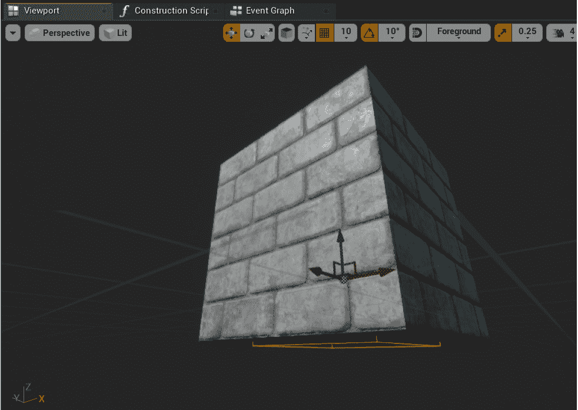

图 15.29：现在，BrickCollision 组件刚好在 BrickMesh 组件之外

我们调整`BrickCollision`组件的位置，以便玩家只能在砖块下跳时击中`UBoxComponent`。通过使其略微超出`BrickMesh`组件，我们可以更好地控制这一点，并确保玩家无法以其他方式击中该组件。

注意

您可以在此处找到此练习的资产和代码：[`packt.live/3kr7rh6`](https://packt.live/3kr7rh6)。

完成这个练习后，您已经能够为`SuperSideScroller_Brick`类创建基本框架，并组合蓝图角色以在游戏世界中表示砖块。通过添加立方体网格和砖块材质，您为砖块添加了良好的视觉效果。在接下来的练习中，您将为砖块添加剩余的 C++逻辑。这将允许玩家摧毁砖块并获得可收集物品。

## 练习 15.08：添加 Brick 类 C++逻辑

在上一个练习中，通过添加必要的组件并创建`BP_Brick`蓝图角色，您为`SuperSideScroller_Brick`类创建了基本框架。在这个练习中，您将在*练习 15.07*，*创建 Brick 类*的 C++代码的基础上添加逻辑，以赋予`Brick`类逻辑。这将允许砖块给玩家金币收藏品。执行以下步骤来完成这个过程：

1.  首先，我们需要创建一个函数，将可收集物品添加到玩家。在我们的`Private Access Modifier`下，在`SuperSideScroller_Brick.h`头文件中添加以下函数声明：

```cpp
    void AddCollectable(class ASuperSideScroller_Player* Player);
    ```

我们希望传递对`SuperSideScroller_Player`类的引用，以便我们可以从该类调用`IncrementNumberofCollectables()`函数。

1.  接下来，在我们的`Private Access Modifier`下创建一个名为`PlayHitSound()`的 void 函数声明：

```cpp
    void PlayHitSound();
    ```

`PlayHitSound()`函数将负责生成您在*练习 15.07*，*创建 Brick 类*中创建的`HitSound`属性。

1.  最后，在我们的`Private Access Modifier`下创建另一个名为`PlayHitExplosion()`的 void 函数声明：

```cpp
    void PlayHitExplosion();
    ```

`PlayHitExplosion()`函数将负责生成您在*练习 15.07*中创建的`Explosion`属性。

在头文件中声明了`SuperSideScroller_Brick`类所需的其余函数后，让我们继续在源文件中定义这些函数。

1.  在`SuperSideScroller_Brick.cpp`源文件的顶部，将以下`#includes`添加到已存在的`include`目录列表中：

```cpp
    #include "Engine/World.h"
    #include "Kismet/GameplayStatics.h"
    #include "SuperSideScroller_Player.h"
    ```

`World`和`GameplayStatics`类的包含是必要的，以生成砖块的`HitSound`和`Explosion`效果。包括`SuperSideScroller_Player`类是为了调用`IncrementNumberofCollectables()`类函数。

1.  让我们从`AddCollectable()`函数的函数定义开始。添加以下代码：

```cpp
    void ASuperSideScroller_Brick::AddCollectable(class   ASuperSideScroller_Player* Player)
    {
    }
    ```

1.  现在，通过使用`Player`函数输入参数调用`IncrementNumberofCollectables()`函数：

```cpp
    Player->IncrementNumberofCollectables(CollectableValue);
    ```

1.  对于`PlayHitSound()`函数，您需要获取对`UWorld*`对象的引用，并在从`UGameplayStatics`类调用`SpawnSoundAtLocation`函数之前验证`HitSound`属性是否有效。这是您已经做过许多次的过程，所以这是整个函数代码：

```cpp
    void ASuperSideScroller_Brick::PlayHitSound()
    {
      UWorld* World = GetWorld();
      if (World)
      {
        if (HitSound)
        {
          UGameplayStatics::SpawnSoundAtLocation(World, HitSound,         GetActorLocation());
        }
      }
    }
    ```

1.  就像`PlayHitSound()`函数一样，`PlayHitExplosion()`函数将以几乎相似的方式工作，这是您在此项目中已经做过许多次的过程。添加以下代码以创建函数定义：

```cpp
    void ASuperSideScroller_Brick::PlayHitExplosion()
    {
      UWorld* World = GetWorld();
      if (World)
      {
        if (Explosion)
        {
          UGameplayStatics::SpawnEmitterAtLocation(World, Explosion,         GetActorTransform());
        }
      }
    }
    ```

有了这些函数的定义，让我们更新`OnHit()`函数，以便如果玩家确实击中了`BrickCollision`组件，我们可以生成`HitSound`和`Explosion`，并将一个硬币可收集物品添加到玩家的收集物品中。

1.  首先，在`OnHit()`函数中，创建一个名为`Player`的新变量，类型为`ASuperSideScroller_Player`，其值等于函数的`OtherActor`输入参数的`Cast`，如下所示：

```cpp
    ASuperSideScroller_Player* Player =   Cast<ASuperSideScroller_Player>(OtherActor);
    ```

1.  接下来，我们只想在`Player`有效且`bHasCollectable`为`True`时继续执行此函数。添加以下`if()`语句：

```cpp
    if (Player && bHasCollectable)
    {
    }
    ```

1.  如果`if()`语句中的条件满足，那么我们需要调用`AddCollectable()`、`PlayHitSound()`和`PlayHitExplosion()`函数。确保在`AddCollectable()`函数中也传入`Player`变量：

```cpp
    AddCollectable(Player);
    PlayHitSound();
    PlayHitExplosion();
    ```

1.  最后，在`if()`语句内添加销毁砖块的函数调用：

```cpp
    Destroy();
    ```

1.  当我们需要的`OnHit()`函数定义好了，重新编译 C++代码，但暂时不要返回到虚幻引擎 4 编辑器。

1.  对于砖块爆炸的 VFX 和 SFX，我们需要从`Epic Games Launcher`提供给我们的两个不同项目中迁移资源：`Blueprints`项目和`Content Examples`项目。

1.  利用您之前练习中的知识，使用引擎版本 4.24 下载并安装这些项目。这两个项目都可以在`Learn`选项卡的`Engine Feature Samples`类别下找到。

1.  安装完成后，打开`Content Examples`项目，并在`Content Browser`窗口中找到`P_Pixel_Explosion`资源。

1.  *右键单击*此资源，然后选择`资源操作`，然后选择`迁移`。将此资源及其所有引用的资源迁移到您的`SuperSideScroller`项目中。

1.  一旦成功迁移了此资源，关闭`Content Examples`项目，然后打开`Blueprints`项目。

1.  从`Blueprints`项目的`Content Browser`窗口中找到`Blueprints_TextPop01`资源。

1.  *右键单击*此资源，然后选择`资源操作`，然后选择`迁移`。将此资源及其所有引用的资源迁移到您的`SuperSideScroller`项目中。

将这些资源迁移到您的项目后，返回到您的`SuperSideScroller`项目的虚幻引擎 4 编辑器中。

1.  在`Content Browser`窗口中导航到`Brick`文件夹，*双击*`BP_Brick`资源以打开它。

1.  在角色的`Details`面板中，找到`Super Side Scroller Brick`部分，并将`HitSound`参数设置为您导入的`Blueprints_TextPop01`声波。

1.  接下来，将您导入的`P_Pixel_Explosion`粒子添加到`Explosion`参数中。

1.  重新编译`BP_Brick`蓝图并将两个这样的角色添加到您的关卡中。

1.  将其中一个砖块的`bHasCollectable`参数设置为`True`；将另一个设置为`False`。请参考以下截图：

图 15.30：此砖块角色设置为生成可收集物品

1.  使用 PIE，观察当您尝试用角色的头部跳跃击中砖块底部时，两个砖块角色之间行为的差异，如下截图所示：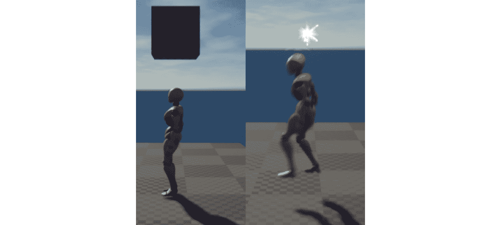

图 15.31：现在，玩家可以击中砖块并将其摧毁

当`bHasCollectable`为`True`时，`SuperSideScroller_Brick`将播放我们的`HitSound`，生成`Explosion`粒子系统，向玩家添加一个硬币可收集物品，并被摧毁。

注意

您可以在此处找到此练习的资产和代码：[`packt.live/3pjhoAv`](https://packt.live/3pjhoAv)。

通过完成这个练习，你现在已经完成了`SuperSideScroller`游戏项目的游戏机制开发。现在，`SuperSideScroller_Brick`类可以用于平台游戏玩法和我们想要的游戏中的金币收集机制。

现在砖块可以被摧毁，隐藏的金币可以被收集，我们为`SuperSideScroller`游戏项目设定的所有游戏元素都已经完成。

# 总结

在这一章中，你将你的知识付诸实践，为`SuperSideScroller`游戏项目创建了剩余的游戏机制。通过结合 C++和蓝图，你开发了玩家可以在关卡中收集的药水能力提升和金币。此外，通过使用你在第十四章“生成玩家投射物”中学到的知识，你为这些可收集物品添加了独特的音频和视觉资产，为游戏增添了一层精美的润色。

你学习并利用了虚幻引擎 4 中的`UMG UI`系统，创建了一个简单而有效的 UI 反馈系统，用于显示玩家已经收集的金币数量。通过使用`Text`小部件的绑定功能，你能够保持 UI 与玩家当前已经收集的金币数量保持更新。最后，你使用了从`SuperSideScroller`项目中学到的知识创建了一个`Brick`类，用于为玩家隐藏金币，让他们可以收集和找到它们。

`SuperSideScroller`项目是一个庞大的项目，涵盖了虚幻引擎 4 中许多可用的工具和实践。在第十章“创建 SuperSideScroller 游戏”中，我们导入了自定义的骨骼和动画资产，用于开发玩家角色的动画蓝图。在第十一章“Blend Spaces 1D, Key Bindings, and State Machines”中，我们使用了`Blend spaces`允许玩家角色在空闲、行走和奔跑动画之间进行混合，同时使用`Animation State Machine`来处理玩家角色的跳跃和移动状态。然后，我们学习了如何使用角色移动组件来控制玩家的移动和跳跃高度。

在第十二章“Animation Blending and Montages”中，我们通过使用`Layered Blend per Bone`功能和`Saved Cached Poses`更多地了解了动画蓝图中的动画混合。通过为玩家角色的投掷动画添加一个新的`AnimSlot`，我们能够使玩家的移动动画和投掷动画平滑地混合在一起。在第十三章“Enemy Artificial Intelligence”中，我们使用了行为树和黑板的强大系统来为敌人开发 AI 行为。我们创建了自己的`Task`，使敌人 AI 能够在我们还开发的自定义蓝图中的巡逻点之间移动。

在第十四章“生成玩家投射物”中，我们学习了如何创建`Anim Notify`，以及如何在玩家角色的投掷动画中实现这个通知来生成玩家投射物。然后，我们学习了如何创建投射物，以及如何使用`Projectile Movement Component`让玩家投射物在游戏世界中移动。

最后，在这一章中，我们学习了如何使用`UMG`工具集为可收集的金币创建 UI，以及如何操纵我们的`Character Movement Component`为玩家创建药水能力提升。最后，你创建了一个`Brick`类，可以用来为玩家隐藏金币，让他们找到并收集。

这个总结只是对我们在`SuperSideScroller`项目中学到和完成的内容进行了初步的介绍。在你继续之前，这里有一些挑战供你测试知识并扩展项目：

1.  添加一个新的能力提升，降低应用于玩家角色的重力。导入自定义网格和音频资产，使这个能力提升与你制作的药水能力提升有独特的外观。

1.  当玩家角色收集到 10 个硬币时，给予玩家一个力量增强道具。

1.  实现当玩家与 AI 重叠时允许玩家被摧毁的功能。包括当发生这种情况时，能够让玩家重新生成。

1.  添加另一个能让玩家免疫的力量增强道具，这样当他们与敌人重叠时就不会被摧毁。（事实上，拥有这个力量增强道具时，与敌人重叠时可能会摧毁敌人。）

1.  利用您为`SuperSideScroller`项目开发的所有游戏元素，创建一个新的关卡，利用这些元素打造一个有趣的平台竞技场。

1.  添加多个具有有趣巡逻点的敌人，挑战玩家在导航区域时。

1.  将力量增强道具放置在难以到达的地方，以便玩家需要提高他们的平台技能来获取它们。

1.  为玩家创建危险的陷阱，使他们需要跨越，并添加功能，当玩家从地图上掉下去时会摧毁玩家。

在下一章中，您将学习关于多人游戏的基础知识，服务器-客户端架构，以及在虚幻引擎 4 中用于多人游戏的游戏框架类。您将利用这些知识来扩展虚幻引擎 4 中的多人射击游戏项目。
