# 第十五章：多人游戏基础知识

概述

在本章中，您将了解一些重要的多人游戏概念，以便使用虚幻引擎 4 的网络框架为您的游戏添加多人游戏支持。

在本章结束时，您将了解基本的多人游戏概念，如服务器-客户端架构、连接和角色所有权，以及角色和变量复制。您将能够实现这些概念，创建自己的多人游戏。您还将能够制作 2D 混合空间，这允许您在 2D 网格中的动画之间进行混合。最后，您将学习如何使用`Transform (Modify) Bone`节点在运行时控制骨骼网格骨骼。

# 介绍

在上一章中，我们完成了`SuperSideScroller`游戏，并使用了 1D 混合空间、动画蓝图和动画蒙太奇。在本章中，我们将在此基础上构建，并学习如何使用虚幻引擎为游戏添加多人游戏功能。

多人游戏在过去十年里发展迅速。像 Fortnite、PUBG、英雄联盟、火箭联盟、守望先锋和 CS:GO 等游戏在游戏社区中获得了很大的流行，并取得了巨大的成功。如今，几乎所有的游戏都需要具有某种多人游戏体验，以使其更具相关性和成功。

这样做的原因是它在现有的游戏玩法之上增加了新的可能性，比如能够在合作模式（*也称为合作模式*）中与朋友一起玩，或者与来自世界各地的人对战，这大大增加了游戏的长期性和价值。

在下一个主题中，我们将讨论多人游戏的基础知识。

# 多人游戏基础知识

在游戏中，你可能经常听到多人游戏这个术语，但对于游戏开发者来说，它意味着什么呢？实际上，多人游戏只是通过网络（*互联网或局域网*）在服务器和其连接的客户端之间发送的一组指令，以给玩家产生共享世界的错觉。

为了使其工作，服务器需要能够与客户端进行通信，但客户端也需要与服务器进行通信（客户端到服务器）。这是因为客户端通常是影响游戏世界的一方，因此他们需要一种方式来告知服务器他们在玩游戏时的意图。

这种服务器和客户端之间的来回通信的一个例子是当玩家在游戏中尝试开火时。看一下下面的图，它展示了客户端和服务器的交互：

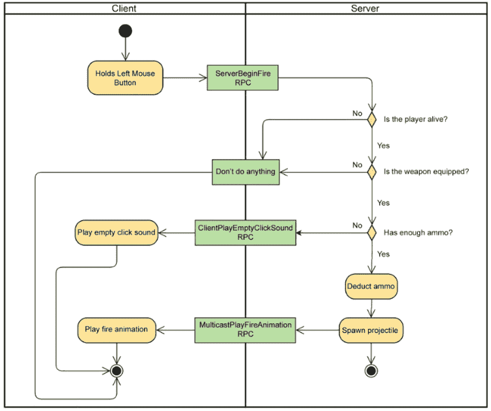

图 16.1：多人游戏中玩家想要开火时的客户端-服务器交互

让我们来看看*图 16.1*中显示的内容：

1.  玩家按住*鼠标左键*，并且该玩家的客户端告诉服务器它想要开火。

1.  服务器通过检查以下内容来验证玩家是否可以开火：

+   如果玩家还活着

+   如果玩家装备了武器

+   如果玩家有足够的弹药

1.  如果所有验证都有效，则服务器将执行以下操作：

+   运行逻辑以扣除弹药

+   在服务器上生成抛射物角色，自动发送到所有客户端

+   在所有客户端的角色实例上播放开火动画，以确保它们之间的某种同步性，这有助于传达它们是同一个世界的想法，尽管实际上并非如此

1.  如果任何验证失败，服务器会告诉特定的客户端该做什么：

+   玩家已经死亡-不做任何事情

+   玩家没有装备武器-不做任何事情

+   玩家没有足够的弹药-播放空击声音

请记住，如果您希望游戏支持多人游戏，则强烈建议您在开发周期的尽早阶段就这样做。如果您尝试运行启用了多人游戏的单人项目，您会注意到一些功能可能*正常工作*，但可能大多数功能都无法正常工作或达到预期效果。

这是因为当您在单人游戏中执行游戏时，代码在本地立即运行，但是当您将多人游戏加入到方程式中时，您正在添加外部因素，例如与具有延迟的网络上的客户端进行通信的权威服务器，就像您在*图 16.1*中看到的那样。

为了使一切正常运行，您需要将现有代码分解为以下部分：

+   仅在服务器上运行的代码

+   仅在客户端上运行的代码

+   在两者上运行的代码，这可能需要很长时间，具体取决于您的单人游戏的复杂性

为了为游戏添加多人游戏支持，虚幻引擎 4 已经内置了一个非常强大和带宽高效的网络框架，使用权威服务器-客户端架构。

以下是其工作原理的图表：

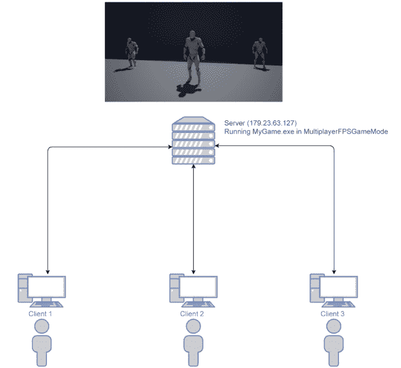

图 16.2：虚幻引擎 4 中的服务器-客户端架构

在*图 16.2*中，您可以看到服务器-客户端架构在虚幻引擎 4 中是如何工作的。每个玩家控制一个客户端，使用**双向连接**与服务器通信。服务器在特定级别上运行游戏模式（*仅存在于服务器中*）并控制信息流，以便客户端可以在游戏世界中看到并相互交互。

注意

多人游戏可能是一个非常复杂的话题，因此接下来的几章将作为介绍，帮助您了解基本知识，但不会深入研究。因此，出于简单起见，一些概念可能被省略。

在下一节中，我们将看看服务器。

# 服务器

服务器是架构中最关键的部分，因为它负责处理大部分工作并做出重要决策。

以下是服务器的主要责任概述：

1.  **创建和管理共享世界实例**：服务器在特定级别和游戏模式中运行其自己的游戏实例（*这将在接下来的章节中介绍*），这将成为所有连接的客户端之间的共享世界。使用的级别可以随时更改，并且如果适用，服务器可以自动带上所有连接的客户端。

1.  游戏模式中的`PostLogin`函数被调用。从那时起，客户端将进入游戏，并成为共享世界的一部分，玩家将能够看到并与其他客户端进行交互。如果客户端在任何时候断开连接，那么所有其他客户端都将收到通知，并且游戏模式中的`Logout`函数将被调用。

1.  **生成所有客户端需要了解的角色**：如果要生成所有客户端中存在的角色，则需要在服务器上执行此操作。原因是服务器具有权限，并且是唯一可以告诉每个客户端创建其自己的该角色实例的人。

这是在多人游戏中生成角色的最常见方式，因为大多数角色需要存在于所有客户端中。一个例子是能量增强，所有客户端都可以看到并与之交互。

1.  **运行关键的游戏逻辑**：为了确保游戏对所有客户端都是公平的，关键的游戏逻辑需要仅在服务器上执行。如果客户端负责处理健康扣除，那将是非常容易被利用的，因为玩家可以使用工具在内存中更改健康当前值为 100%，所以玩家在游戏中永远不会死亡。

1.  **处理变量复制**：如果您有一个复制的变量（*在本章中介绍*），那么它的值应该只在服务器上更改。这将确保所有客户端的值会自动更新。您仍然可以在客户端上更改值，但它将始终被服务器的最新值替换，以防止作弊并确保所有客户端同步。

1.  **处理来自客户端的 RPC**：服务器需要处理来自客户端发送的远程过程调用（*第十七章*，*远程过程调用*）。

现在您知道服务器的功能，我们可以讨论在虚幻引擎 4 中创建服务器的两种不同方式。

## 专用服务器

专用服务器仅运行服务器逻辑，因此您不会看到典型的游戏运行窗口，您可以在其中控制本地玩家角色。此外，如果使用`-log`命令提示符运行专用服务器，您将看到一个控制台窗口，记录有关服务器上发生的事件的相关信息，例如客户端是否已连接或断开连接等。作为开发人员，您还可以使用`UE_LOG`宏记录自己的信息。

使用专用服务器是创建多人游戏服务器的一种非常常见的方式，因为它比监听服务器更轻量级，您可以将其托管在服务器堆栈上并让其保持运行。

要在虚幻引擎 4 中启动专用服务器，可以使用以下命令参数：

+   通过快捷方式或命令提示符在编辑器中启动专用服务器，请运行以下命令：

```cpp
<UE4 Install Folder>\Engine\Binaries\Win64\UE4Editor.exe   <UProject Location> <Map Name> -server -game -log
```

以下是一个示例：

```cpp
C:\Program Files\Epic   Games\UE_4.24\Engine\Binaries\Win64\UE4Editor.exe   D:\TestProject\TestProject.uproject TestMap -server -game -log
```

+   打包项目需要专门构建的项目的特殊构建，用作专用服务器。

注意

您可以通过访问[`allarsblog.com/2015/11/06/support-dedicated-servers/`](https://allarsblog.com/2015/11/06/support-dedicated-servers/)和[`www.ue4community.wiki/Dedicated_Server_Guide_(Windows)`](https://www.ue4community.wiki/Dedicated_Server_Guide_(Windows))了解有关设置打包专用服务器的更多信息。

## 监听服务器

监听服务器同时充当服务器和客户端，因此您还将拥有一个窗口，可以以此服务器类型的客户端玩游戏。它还具有是最快启动服务器的优势，但它不像专用服务器那样轻量级，因此可以连接的客户端数量将受到限制。

要启动监听服务器，可以使用以下命令参数：

+   通过快捷方式或命令提示符在编辑器中启动专用服务器，请运行以下命令：

```cpp
<UE4 Install Folder>\Engine\Binaries\Win64\UE4Editor.exe   <UProject Location> <Map Name>?Listen -game
```

以下是一个示例：

```cpp
C:\Program Files\Epic   Games\UE_4.24\Engine\Binaries\Win64\UE4Editor.exe   D:\TestProject\TestProject.uproject TestMap?Listen -game
```

+   打包项目（仅限开发构建）需要专门构建的项目的特殊构建，用作专用服务器：

```cpp
<Project Name>.exe <Map Name>?Listen -game
```

以下是一个示例：

```cpp
D:\Packaged\TestProject\TestProject.exe TestMap?Listen –game
```

在下一节中，我们将讨论客户端。

# 客户端

客户端是架构中最简单的部分，因为大多数参与者将在服务器上拥有权限，所以在这些情况下，工作将在服务器上完成，客户端只需服从其命令。

以下是客户端的主要职责概述：

1.  **从服务器强制执行变量复制**：服务器通常对客户端知道的所有参与者具有权限，因此当复制变量的值在服务器上更改时，客户端需要强制执行该值。

1.  **处理来自服务器的 RPC**：客户端需要处理来自服务器发送的远程过程调用（在*第十七章*，*远程过程调用*中介绍）。

1.  **模拟时预测移动**：当客户端模拟参与者（*本章后面介绍*）时，它需要根据参与者的速度本地预测其位置。

1.  **生成只有客户端需要知道的参与者**：如果要生成只存在于客户端的参与者，则需要在特定客户端上执行该操作。

这是生成角色的最不常见的方法，因为很少有情况下您希望一个角色只存在于一个客户端。一个例子是多人生存游戏中的放置预览角色，玩家控制一个半透明版本的墙，其他玩家直到实际放置之前都看不到。

客户端可以以不同的方式加入服务器。以下是最常见的方法列表：

+   使用虚幻引擎 4 控制台（默认为*`*键）打开它并输入：

```cpp
Open <Server IP Address>
```

例如：

```cpp
Open 194.56.23.4
```

+   使用`Execute Console Command`蓝图节点。一个例子如下：

图 16.3：使用 Execute Console Command 节点加入具有示例 IP 的服务器

+   使用`APlayerController`中的`ConsoleCommand`函数如下：

```cpp
PlayerController->ConsoleCommand("Open <Server IP Address>");
```

这是一个例子：

```cpp
PlayerController->ConsoleCommand("Open 194.56.23.4");
```

+   通过快捷方式或命令提示符使用编辑器可执行文件：

```cpp
<UE4 Install Folder>\Engine\Binaries\Win64\UE4Editor.exe   <UProject Location> <Server IP Address> -game
```

这是一个例子：

`C:\Program Files\Epic Games\UE_4.24\Engine\Binaries\Win64\UE4Editor.exe D:\TestProject\TestProject.uproject 194.56.23.4 -game`

+   通过快捷方式或命令提示符使用打包的开发版本：

```cpp
<Project Name>.exe  <Server IP Address>
```

这是一个例子：

`D:\Packaged\TestProject\TestProject.exe 194.56.23.4`

在下一个练习中，我们将在多人游戏中测试虚幻引擎 4 附带的第三人称模板。

## 练习 16.01：在多人游戏中测试第三人称模板

在这个练习中，我们将创建一个第三人称模板项目，并在多人游戏中进行游玩。

以下步骤将帮助您完成练习。

1.  使用蓝图创建一个名为`TestMultiplayer`的新`Third Person`模板项目，并将其保存到您选择的位置。

项目创建后，应该打开编辑器。现在我们将在多人游戏中测试项目的行为：

1.  在编辑器中，`播放`按钮右侧有一个带有向下箭头的选项。单击它，您应该看到一个选项列表。在`多人游戏选项`部分下，您可以配置要使用多少个客户端以及是否需要专用服务器。

1.  取消`运行专用服务器`的选中，将`玩家数量`更改为`3`，然后单击`新编辑器窗口（PIE）`。

1.  您应该看到三个窗口相互堆叠，代表三个客户端：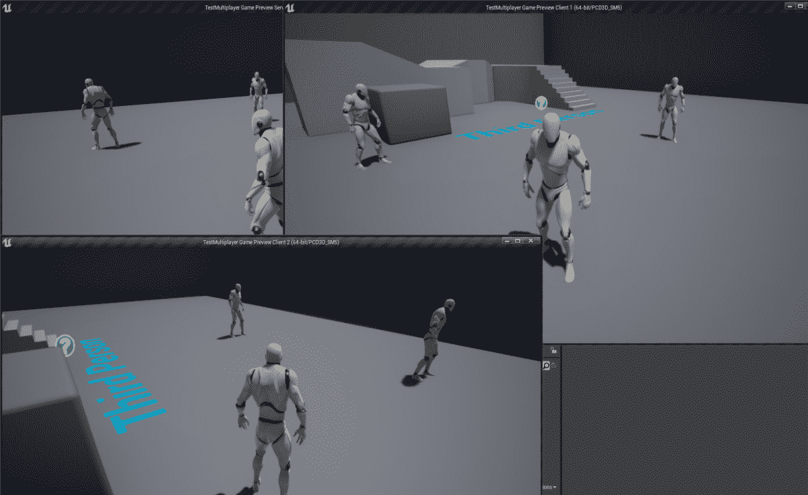

图 16.4：启动三个带有监听服务器的客户端窗口

如您所见，这有点凌乱，所以让我们改变窗口的大小。在键盘上按*Esc*停止播放。

1.  再次单击`播放`按钮旁边的向下箭头，并选择最后一个选项`高级设置`。

1.  搜索`游戏视口设置`部分。将`新视口分辨率`更改为`640x480`，然后关闭`编辑器首选项`选项卡。

1.  再次播放游戏，您应该看到以下内容：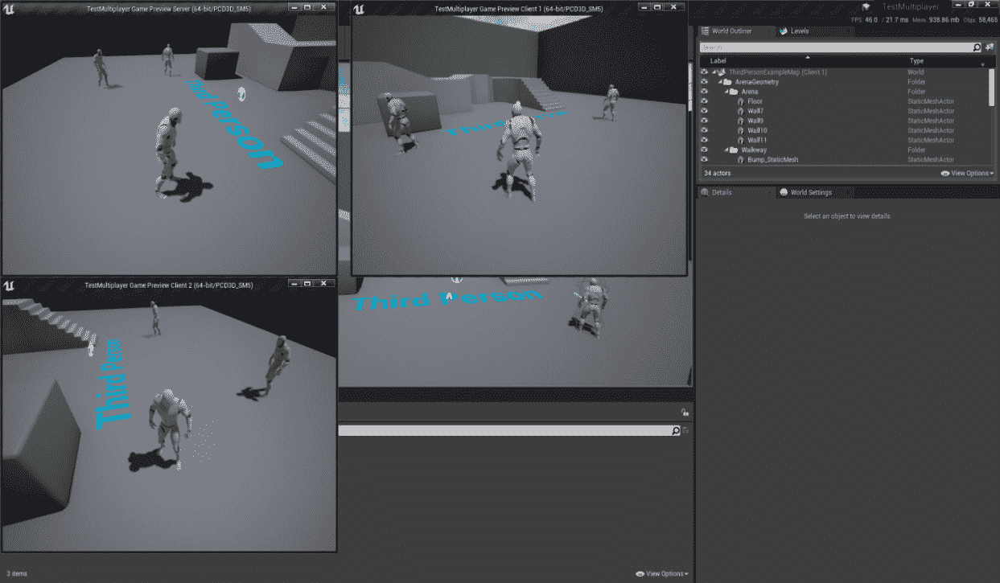

图 16.5：使用 640x480 分辨率启动三个客户端窗口与监听服务器

一旦开始游戏，您会注意到窗口的标题栏显示`服务器`，`客户端 1`和`客户端 2`。由于您可以在`服务器`窗口中控制一个角色，这意味着我们正在运行`服务器+客户端 0`而不仅仅是`服务器`，以避免混淆。

通过完成这个练习，您现在有了一个设置，其中您将有一个服务器和三个客户端运行（`客户端 0`，`客户端 1`和`客户端 2`）。

注意

当您同时运行多个窗口时，您会注意到一次只能在一个窗口上进行输入焦点。要将焦点转移到另一个窗口，只需按下*Shift* + *F1*以失去当前的输入焦点，然后单击要关注的新窗口。

如果您在其中一个窗口中玩游戏，您会注意到您可以四处移动和跳跃，其他客户端也能看到。

一切正常运行的原因是角色移动组件自动复制位置、旋转和下落状态（用于显示您是否在跳跃）给您。如果要添加自定义行为，如攻击动画，您不能只是告诉客户端在按键时本地播放动画，因为这在其他客户端上不起作用。这就是为什么需要服务器，作为中介，告诉所有客户端在一个客户端按下按键时播放动画。

# 打包版本

项目完成后，最好将其打包（*如前几章所述*），这样我们就会得到一个纯粹的独立版本，不需要使用虚幻引擎编辑器，运行速度更快，更轻量。

以下步骤将帮助您创建*Exercise 16.01*，*在多人游戏文件中测试第三人称模板*的打包版本：

1.  转到`文件` -> `打包项目` -> `Windows` -> `Windows（64 位）`。

1.  选择一个文件夹放置打包版本，并等待完成。

1.  转到所选文件夹，并打开其中的`WindowsNoEditor`文件夹。

1.  *右键单击*`TestMultiplayer.exe`，选择“创建快捷方式”。

1.  将新的快捷方式重命名为`运行服务器`。

1.  *右键单击*它，选择“属性”。

1.  在目标上附加`ThirdPersonExampleMap?Listen -server`，这将使用`ThirdPersonExampleMap`创建一个监听服务器。您应该得到这个：

```cpp
"<Path>\WindowsNoEditor\TestMultiplayer.exe"   ThirdPersonExampleMap?Listen -server
```

1.  点击“确定”并运行快捷方式。

1.  您应该会收到 Windows 防火墙提示，所以允许它。

1.  保持服务器运行，并返回文件夹，从`TestMultiplayer.exe`创建另一个快捷方式。

1.  将其重命名为`运行客户端`。

1.  *右键单击*它，选择“属性”。

1.  在目标上附加`127.0.0.1`，这是您本地服务器的 IP。您应该得到`"<Path>\WindowsNoEditor\TestMultiplayer.exe" 127.0.0.1`。

1.  点击“确定”并运行快捷方式。

1.  现在你已经连接到监听服务器，所以你可以看到彼此的角色。

1.  每次单击“运行客户端”快捷方式，您都会向服务器添加一个新的客户端，因此您可以在同一台机器上运行几个客户端。

在接下来的部分，我们将看看连接和所有权。

# 连接和所有权

在使用虚幻引擎进行多人游戏时，一个重要的概念是连接。当客户端加入服务器时，它将获得一个新的**玩家控制器**，并与之关联一个连接。

如果一个角色与服务器没有有效的连接，那么该角色将无法进行复制操作，如变量复制（*本章后面介绍*）或调用 RPC（在*第十七章*，*远程过程调用*中介绍）。

如果玩家控制器是唯一持有连接的角色，那么这是否意味着它是唯一可以进行复制操作的地方？不是，这就是`GetNetConnection`函数发挥作用的地方，该函数在`AActor`中定义。

在对角色进行复制操作（如变量复制或调用 RPC）时，虚幻框架将通过调用`GetNetConnection()`函数来获取角色的连接。如果连接有效，则复制操作将被处理，如果无效，则不会发生任何事情。`GetNetConnection()`的最常见实现来自`APawn`和`AActor`。

让我们看看`APawn`类如何实现`GetNetConnection()`函数，这通常用于角色：

```cpp
class UNetConnection* APawn::GetNetConnection() const
{
  // if have a controller, it has the net connection
  if ( Controller )
  {
    return Controller->GetNetConnection();
  }
  return Super::GetNetConnection();
}
```

前面的实现是虚幻引擎 4 源代码的一部分，它首先检查 pawn 是否有有效的控制器。如果控制器有效，则使用其连接。如果控制器无效，则使用`GetNetConnection()`函数的父实现，即`AActor`上的实现：

```cpp
UNetConnection* AActor::GetNetConnection() const
{
  return Owner ? Owner->GetNetConnection() : nullptr;
}
```

前面的实现也是虚幻引擎 4 源代码的一部分，它将检查角色是否有有效的所有者。如果有，它将使用所有者的连接；如果没有，它将返回一个无效的连接。那么这个`Owner`变量是什么？每个角色都有一个名为`Owner`的变量（可以通过调用`SetOwner`函数来设置其值），显示哪个角色*拥有*它，因此你可以将其视为父角色。

在这个`GetNetConnection()`的实现中使用所有者的连接将像一个层次结构一样工作。如果在所有者的层次结构中找到一个是玩家控制器或者被玩家控制器控制的所有者，那么它将有一个有效的连接，并且能够处理复制操作。看下面的例子。

注意

在监听服务器中，由其客户端控制的角色的连接将始终无效，因为该客户端已经是服务器的一部分，因此不需要连接。

想象一个武器角色被放置在世界中，它就在那里。在这种情况下，武器将没有所有者，因此如果武器尝试执行任何复制操作，如变量复制或调用 RPC，将不会发生任何事情。

然而，如果客户端拾取武器并在服务器上调用`SetOwner`并将值设置为角色，那么武器现在将有一个有效的连接。原因是武器是一个角色，因此为了获取其连接，它将使用`AActor`的`GetNetConnection()`实现，该实现返回其所有者的连接。由于所有者是客户端的角色，它将使用`APawn`的`GetNetConnection()`的实现。角色有一个有效的玩家控制器，因此这是函数返回的连接。

这里有一个图表来帮助你理解这个逻辑：

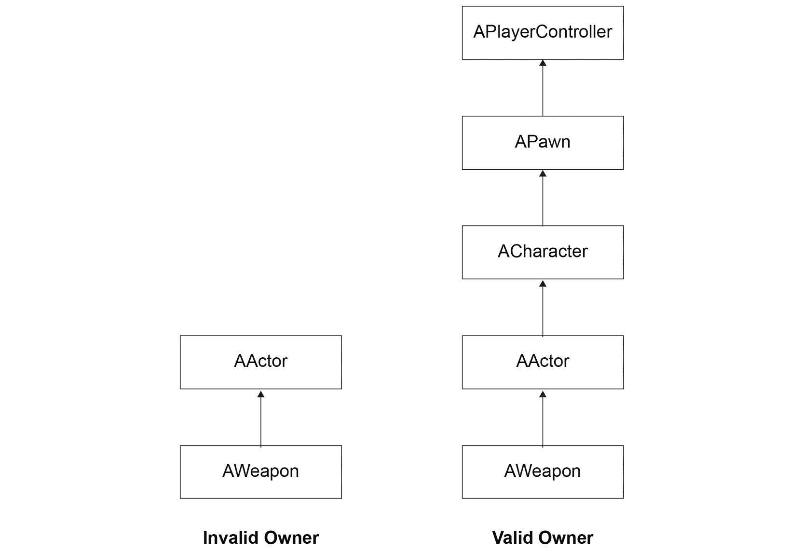

图 16.6：武器角色的连接和所有权示例

让我们了解无效所有者的元素：

+   `AWeapon`没有覆盖`GetNetConnection`函数，因此要获取武器的连接，它将调用找到的第一个实现，即`AActor::GetNetConnection`。

+   `AActor::GetNetConnection`的实现调用其所有者的`GetNetConnection`。由于没有所有者，连接是无效的。

有效的所有者将包括以下元素：

+   `AWeapon`没有覆盖`GetNetConnection`函数，因此要获取其连接，它将调用找到的第一个实现，即`AActor::GetNetConnection`。

+   `AActor::GetNetConnection`的实现调用其所有者的`GetNetConnection`。由于所有者是拾取武器的角色，它将在其上调用`GetNetConnection`。

+   `ACharacter`没有覆盖`GetNetConnection`函数，因此要获取其连接，它将调用找到的第一个实现，即`APawn::GetNetConnection`。

+   `APawn::GetNetConnection`的实现使用拥有的玩家控制器的连接。由于拥有的玩家控制器是有效的，因此它将使用该连接来处理武器。

注意

为了使`SetOwner`按预期工作，它需要在大多数情况下在服务器上执行，这意味着需要在权限上执行。如果你只在客户端执行`SetOwner`，它仍然无法执行复制操作。

# 角色

当你在服务器上生成一个角色时，将在服务器上创建一个角色的版本，并在每个客户端上创建一个版本。由于在游戏的不同实例（`服务器`，`客户端 1`，`客户端 2`等）上有相同角色的不同版本，因此知道哪个版本的角色是哪个是很重要的。这将使我们知道可以在这些实例中执行什么逻辑。

为了帮助解决这种情况，每个角色都有以下两个变量：

+   `GetLocalRole()`函数。

+   `GetRemoteRole()`函数。

`GetLocalRole()`和`GetRemoteRole()`函数的返回类型是`ENetRole`，它是一个枚举，可以具有以下可能的值：

+   `ROLE_None`：该角色没有角色，因为它没有被复制。

+   `ROLE_SimulatedProxy`：当前游戏实例对该角色没有权限，并且也没有通过玩家控制器来控制它。这意味着它的移动将通过使用角色速度的最后一个值来进行模拟/预测。

+   `ROLE_AutonomousProxy`：当前游戏实例对该角色没有权限，但它由玩家控制。这意味着我们可以根据玩家的输入向服务器发送更准确的移动信息，而不仅仅使用角色速度的最后一个值。

+   `ROLE_Authority`：当前游戏实例对该角色具有完全权限。这意味着如果该角色在服务器上，对该角色的复制变量所做的更改将被视为每个客户端需要通过变量复制强制执行的值。

让我们看一下以下示例代码片段：

```cpp
ENetRole MyLocalRole = GetLocalRole();
ENetRole MyRemoteRole = GetRemoteRole();
FString String;
if(MyLocalRole == ROLE_Authority)
{
  if(MyRemoteRole == ROLE_AutonomousProxy)
  {
    String = «This version of the actor is the authority and
    it›s being controlled by a player on its client»;
  }
  else if(MyRemoteRole == ROLE_SimulatedProxy)
  {
    String = «This version of the actor is the authority but 
    it›s not being controlled by a player on its client»;
  }
}
else String = "This version of the actor isn't the authority";
GEngine->AddOnScreenDebugMessage(-1, 0.0f, FColor::Red, String);
```

上述代码片段将将本地角色和远程角色的值分别存储到`MyLocalRole`和`MyRemoteRole`中。之后，它将根据该角色的版本是权限还是在其客户端上由玩家控制而在屏幕上打印不同的消息。

注意

重要的是要理解，如果一个角色具有`ROLE_Authority`的本地角色，这并不意味着它在服务器上；这意味着它在最初生成角色的游戏实例上，并因此对其具有权限。

如果客户端生成一个角色，即使服务器和其他客户端不知道它，它的本地角色仍将是`ROLE_Authority`。大多数多人游戏中的角色都将由服务器生成；这就是为什么很容易误解权限总是指服务器。

以下是一个表格，帮助您理解角色在不同情况下将具有的角色：

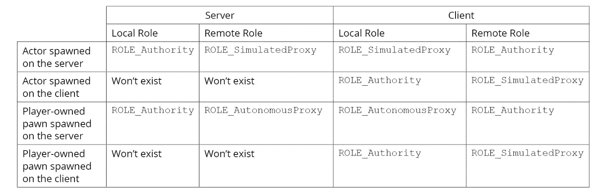

图 16.7：角色在不同场景中可以拥有的角色

在上表中，您可以看到角色在不同情况下将具有的角色。

让我们分析每种情况，并解释为什么角色具有该角色：

**在服务器上生成的角色**

该角色在服务器上生成，因此服务器版本的该角色将具有`ROLE_Authority`的本地角色和`ROLE_SimulatedProxy`的远程角色，这是客户端版本的该角色的本地角色。对于该角色的客户端版本，其本地角色将是`ROLE_SimulatedProxy`，远程角色将是`ROLE_Authority`，这是服务器角色版本的本地角色。

**在客户端上生成的角色**

角色在客户端上生成，因此该角色的客户端版本将具有`ROLE_Authority`的本地角色和`ROLE_SimulatedProxy`的远程角色。由于该角色未在服务器上生成，因此它只会存在于生成它的客户端上，因此在服务器和其他客户端上不会有该角色的版本。

**在服务器上生成的玩家拥有的角色**

该角色在服务器上生成，因此服务器版本的该角色将具有`ROLE_Authority`的本地角色和`ROLE_AutonomousProxy`的远程角色，这是客户端版本的该角色的本地角色。对于该角色的客户端版本，其本地角色将是`ROLE_AutonomousProxy`，因为它由`PlayerController`控制，并且远程角色将是`ROLE_Authority`，这是服务器角色版本的本地角色。

**在客户端上生成的玩家拥有的角色**

该 pawn 在客户端上生成，因此该 pawn 的客户端版本将具有`ROLE_Authority`的本地角色和`ROLE_SimulatedProxy`的远程角色。由于 pawn 没有在服务器上生成，因此它只会存在于生成它的客户端上，因此在服务器和其他客户端上不会有这个 pawn 的版本。

## 练习 16.02：实现所有权和角色

在这个练习中，我们将创建一个使用 Third Person 模板作为基础的 C++项目。

创建一个名为`OwnershipTestActor`的新 actor，它具有静态网格组件作为根组件，并且在每次 tick 时，它将执行以下操作：

+   在权限方面，它将检查在一定半径内（由名为`OwnershipRadius`的`EditAnywhere`变量配置）哪个角色离它最近，并将该角色设置为其所有者。当半径内没有角色时，所有者将为`nullptr`。

+   显示其本地角色、远程角色、所有者和连接。

+   编辑`OwnershipRolesCharacter`并覆盖`Tick`函数，以便显示其本地角色、远程角色、所有者和连接。

+   创建一个名为`OwnershipRoles.h`的新头文件，其中包含`ROLE_TO_String`宏，将`ENetRole`转换为`Fstring`变量。

以下步骤将帮助您完成练习：

1.  使用`C++`创建一个名为`OwnershipRoles`的新`Third Person`模板项目，并将其保存到您选择的位置。

1.  项目创建完成后，应该打开编辑器以及 Visual Studio 解决方案。

1.  使用编辑器，创建一个名为`OwnershipTestActor`的新 C++类，该类派生自`Actor`。

1.  编译完成后，Visual Studio 应该弹出新创建的`.h`和`.cpp`文件。

1.  关闭编辑器，返回 Visual Studio。

1.  在 Visual Studio 中，打开`OwnershipRoles.h`文件并添加以下宏：

```cpp
#define ROLE_TO_STRING(Value) FindObject<UEnum>(ANY_PACKAGE,   TEXT("ENetRole"), true)->GetNameStringByIndex((int32)Value)
```

这个宏将把我们从`GetLocalRole()`函数和`GetRemoteRole()`获得的`ENetRole`枚举转换为`FString`。它的工作方式是通过在虚幻引擎的反射系统中找到`ENetRole`枚举类型，并从中将`Value`参数转换为`FString`变量，以便在屏幕上打印出来。

1.  现在，打开`OwnershipTestActor.h`文件。

1.  根据以下代码片段中所示，声明静态网格组件和所有权半径的受保护变量：

```cpp
UPROPERTY(VisibleAnywhere, BlueprintReadOnly, Category =   "Ownership Test Actor")
UStaticMeshComponent* Mesh;
UPROPERTY(EditAnywhere, BlueprintReadOnly, Category = "Ownership   Test Actor")
float OwnershipRadius = 400.0f;
```

在上面的代码片段中，我们声明了静态网格组件和`OwnershipRadius`变量，它允许您配置所有权的半径。

1.  接下来，删除`BeginPlay`的声明，并将构造函数和`Tick`函数的声明移到受保护的区域。

1.  现在，打开`OwnershipTestActor.cpp`文件，并根据以下代码片段中提到的添加所需的头文件：

```cpp
#include "DrawDebugHelpers.h"
#include "OwnershipRoles.h"
#include "OwnershipRolesCharacter.h"
#include "Components/StaticMeshComponent.h"
#include "Kismet/GameplayStatics.h"
```

在上面的代码片段中，我们包括了`DrawDebugHelpers.h`，因为我们将调用`DrawDebugSphere`和`DrawDebugString`函数。我们包括`OwnershipRoles.h`，`OwnershipRolesCharacter.h`和`StaticMeshComponent.h`，以便`.cpp`文件知道这些类。最后，我们包括`GameplayStatics.h`，因为我们将调用`GetAllActorsOfClass`函数。

1.  在构造函数定义中，创建静态网格组件并将其设置为根组件：

```cpp
Mesh = CreateDefaultSubobject<UStaticMeshComponent>("Mesh");
RootComponent = Mesh;
```

1.  在构造函数中，将`bReplicates`设置为`true`，告诉虚幻引擎该 actor 会复制，并且也应该存在于所有客户端中：

```cpp
bReplicates = true;
```

1.  删除`BeginPlay`函数定义。

1.  在`Tick`函数中，绘制一个调试球来帮助可视化所有权半径，如下面的代码片段所示：

```cpp
DrawDebugSphere(GetWorld(), GetActorLocation(), OwnershipRadius,   32, FColor::Yellow);
```

1.  仍然在`Tick`函数中，创建特定于权限的逻辑，该逻辑将获取所有权半径内最接近的`AOwnershipRolesCharacter`，如果与当前角色不同，则将其设置为所有者：

```cpp
if (HasAuthority())
{
  AActor* NextOwner = nullptr;
  float MinDistance = OwnershipRadius;
  TArray<AActor*> Actors;
  UGameplayStatics::GetAllActorsOfClass(this,    AOwnershipRolesCharacter::StaticClass(), Actors);
  for (AActor* Actor : Actors)
  {
const float Distance = GetDistanceTo(Actor);
    if (Distance <= MinDistance)
    {
      MinDistance = Distance;
      NextOwner = Actor;
    }
  }
  if (GetOwner() != NextOwner)
  {
    SetOwner(NextOwner);
  }
}
```

1.  仍然在`Tick`函数中，将本地/远程角色的值（使用我们之前创建的`ROLE_TO_STRING`宏），当前所有者和连接转换为字符串：

```cpp
const FString LocalRoleString = ROLE_TO_STRING(GetLocalRole());
const FString RemoteRoleString = ROLE_TO_STRING(GetRemoteRole());
const FString OwnerString = GetOwner() != nullptr ? GetOwner()-  >GetName() : TEXT("No Owner");
const FString ConnectionString = GetNetConnection() != nullptr ?   TEXT("Valid Connection") : TEXT("Invalid Connection");
```

1.  最后，使用`DrawDebugString`在屏幕上显示我们在上一步中转换的字符串：

```cpp
const FString Values = FString::Printf(TEXT("LocalRole =   %s\nRemoteRole = %s\nOwner = %s\nConnection = %s"),   *LocalRoleString, *RemoteRoleString, *OwnerString,   *ConnectionString);
DrawDebugString(GetWorld(), GetActorLocation(), Values, nullptr,   FColor::White, 0.0f, true);
```

注意

不要不断使用`GetLocalRole() == ROLE_Authority`来检查角色是否具有权限，可以使用`AActor`中定义的`HasAuthority()`辅助函数。

1.  接下来，打开`OwnershipRolesCharacter.h`并将`Tick`函数声明为受保护的：

```cpp
virtual void Tick(float DeltaTime) override;
```

1.  现在，打开`OwnershipRolesCharacter.cpp`并按照以下代码片段中所示包含头文件：

```cpp
#include "DrawDebugHelpers.h"
#include "OwnershipRoles.h"
```

1.  实现`Tick`函数：

```cpp
void AOwnershipRolesCharacter::Tick(float DeltaTime)
{
  Super::Tick(DeltaTime);
}
```

1.  将本地/远程角色的值（使用我们之前创建的`ROLE_TO_STRING`宏），当前所有者和连接转换为字符串：

```cpp
const FString LocalRoleString = ROLE_TO_STRING(GetLocalRole());
const FString RemoteRoleString = ROLE_TO_STRING(GetRemoteRole());
const FString OwnerString = GetOwner() != nullptr ? GetOwner()-  >GetName() : TEXT("No Owner");
const FString ConnectionString = GetNetConnection() != nullptr ?   TEXT("Valid Connection") : TEXT("Invalid Connection");
```

1.  使用`DrawDebugString`在屏幕上显示我们在上一步中转换的字符串：

```cpp
const FString Values = FString::Printf(TEXT("LocalRole =   %s\nRemoteRole = %s\nOwner = %s\nConnection = %s"), *LocalRoleString, *RemoteRoleString, *OwnerString,   *ConnectionString);
DrawDebugString(GetWorld(), GetActorLocation(), Values, nullptr,   FColor::White, 0.0f, true);
```

最后，我们可以测试项目。

1.  运行代码并等待编辑器完全加载。

1.  在`Content`文件夹中创建一个名为`OwnershipTestActor_BP`的新蓝图，它派生自`OwnershipTestActor`。将`Mesh`设置为使用立方体网格，并在世界中放置一个实例。

1.  转到`多人游戏选项`并将客户端数量设置为`2`。

1.  将窗口大小设置为`800x600`。

1.  使用`New Editor Window (PIE)`进行游戏。

你应该得到以下输出：

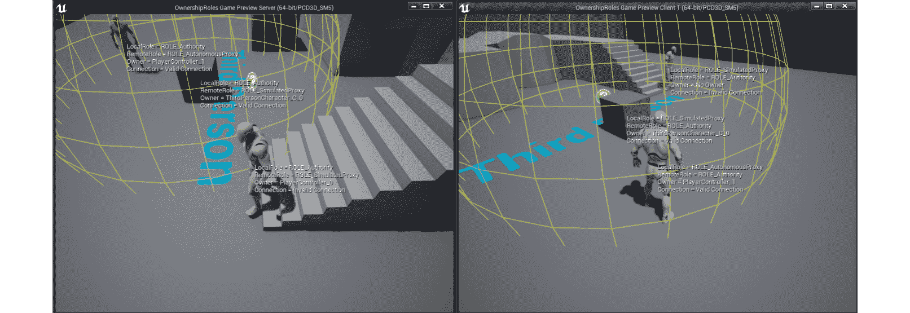

图 16.8：服务器和 Client 1 窗口上的预期结果

通过完成这个练习，你将更好地理解连接和所有权是如何工作的。这些是重要的概念，因为与复制相关的一切都依赖于它们。

下次当你看到一个角色没有进行复制操作时，你会知道需要首先检查它是否有**有效的连接**和**所有者**。

现在，让我们分析服务器和客户端窗口中显示的值。

## 服务器窗口

看一下上一个练习中`Server`窗口的以下输出截图：

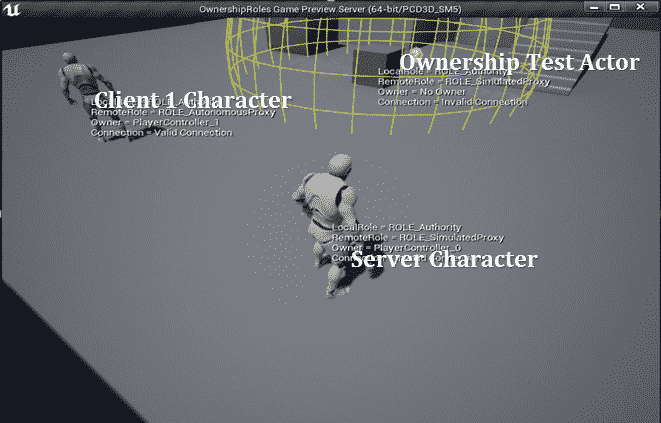

图 16.9：服务器窗口

注意

显示`Server Character`，`Client 1 Character`和`Ownership Test Actor`的文本不是原始截图的一部分，是为了帮助你理解哪个角色和角色是哪个而添加的。

在上面的截图中，你可以看到`Server Character`，`Client 1 Character`和`Ownership Test`立方体角色。

首先分析`Server Character`的值。

## 服务器角色

这是监听服务器正在控制的角色。与这个角色相关的值如下：

+   `LocalRole = ROLE_Authority`：因为这个角色是在服务器上生成的，这是当前的游戏实例。

+   `RemoteRole = ROLE_SimulatedProxy`：因为这个角色是在服务器上生成的，所以其他客户端只能模拟它。

+   `Owner = PlayerController_0`：因为这个角色由监听服务器的客户端控制，使用了名为`PlayerController_0`的第一个`PlayerController`实例。

+   `Connection = Invalid Connection`：因为我们是监听服务器的客户端，所以不需要连接。

接下来，我们将在同一个窗口中查看`Client 1 Character`。

## Client 1 Character

这是`Client 1`正在控制的角色。与这个角色相关的值如下：

+   `LocalRole = ROLE_Authority`：因为这个角色是在服务器上生成的，这是当前的游戏实例。

+   `RemoteRole = ROLE_AutonomousProxy`：因为这个角色是在服务器上生成的，但是由另一个客户端控制。

+   `Owner = PlayerController_1`：因为这个角色是由另一个客户端控制的，使用了名为`PlayerController_1`的第二个`PlayerController`实例。

+   `Connection = Valid Connection`：因为这个角色由另一个客户端控制，所以需要与服务器建立连接。

接下来，我们将在同一个窗口中查看`OwnershipTest`角色。

## OwnershipTest Actor

这是将其所有者设置为一定所有权半径内最近的角色的立方体演员。与该演员相关的值如下：

+   `LocalRole = ROLE_Authority`：因为这个演员被放置在级别中，并在服务器上生成，这是当前游戏实例。

+   `RemoteRole = ROLE_SimulatedProxy`：因为这个演员是在服务器中生成的，但没有被任何客户端控制。

+   `Owner`和`Connection`的值将基于最近的角色。如果在所有权半径内没有角色，则它们将具有`无所有者`和`无效连接`的值。

现在，让我们看一下`Client 1`窗口：

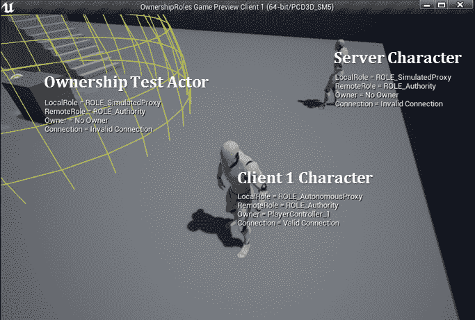

图 16.10：客户端 1 窗口

## 客户端 1 窗口

`Client 1`窗口的值将与`Server`窗口的值完全相同，只是`LocalRole`和`RemoteRole`的值将被颠倒，因为它们始终相对于您所在的游戏实例。

另一个例外是服务器角色没有所有者，其他连接的客户端将没有有效连接。原因是客户端不存储其他客户端的玩家控制器和连接，只有服务器才会存储，但这将在*第十八章*中更深入地介绍*多人游戏中的游戏框架类*。

在下一节中，我们将看一下变量复制。

# 变量复制

服务器可以使客户端保持同步的一种方式是使用变量复制。其工作方式是，每秒特定次数（在`AActor::NetUpdateFrequency`变量中为每个演员定义，也暴露给蓝图）服务器中的变量复制系统将检查是否有任何需要使用最新值更新的客户端中的复制变量（*在下一节中解释*）。

如果变量满足所有复制条件，那么服务器将向客户端发送更新并强制执行新值。

例如，如果您有一个复制的`Health`变量，并且客户端使用黑客工具将变量的值从`10`设置为`100`，那么复制系统将强制从服务器获取真实值并将其更改回`10`，从而使黑客无效。

只有在以下情况下才会将变量发送到客户端进行更新：

+   变量被设置为复制。

+   值已在服务器上更改。

+   客户端上的值与服务器上的值不同。

+   演员已启用复制。

+   演员是相关的，并满足所有复制条件。

需要考虑的一个重要事项是，确定变量是否应该复制的逻辑仅在每秒执行`AActor::NetUpdateFrequency`次。换句话说，服务器在更改服务器上的变量值后不会立即向客户端发送更新请求。只有在变量复制系统执行时（每秒`AActor::NetUpdateFrequency`次），并且确定客户端的值与服务器的值不同时，才会发送该请求。

例如，如果您有一个整数复制一个名为`Test`的变量，其默认值为`5`。如果您在服务器上调用一个将`Test`设置为`3`的函数，并在下一行将其更改为`8`，那么只有后者的更改会发送更新请求到客户端。原因是这两个更改是在`NetUpdateFrequency`间隔之间进行的，因此当变量复制系统执行时，当前值为`8`，因为它与客户端的值不同（仍为`5`），它将更新它们。如果您将其设置回`5`，则不会向客户端发送任何更改。

## 复制变量

在虚幻引擎中，任何可以使用`UPROPERTY`宏的变量都可以设置为复制，并且可以使用两个限定词来执行此操作。

**复制**

如果你只想说一个变量被复制，那么你使用`Replicated`修饰符。

看下面的例子：

```cpp
UPROPERTY(Replicated) 
float Health = 100.0f; 
```

在上述代码片段中，我们声明了一个名为`Health`的浮点变量，就像我们通常做的那样。不同之处在于，我们添加了`UPROPERTY(Replicated)`，告诉虚幻引擎`Health`变量将被复制。

**RepNotify**

如果你想说一个变量被复制并且每次更新时都调用一个函数，那么你使用`ReplicatedUsing=<Function Name>`修饰符。看下面的例子：

```cpp
UPROPERTY(ReplicatedUsing=OnRep_Health) 
float Health = 100.0f;
UFUNCTION() 
void OnRep_Health()
{
  UpdateHUD(); 
}
```

在上述代码片段中，我们声明了一个名为`Health`的浮点变量。不同之处在于，我们添加了`UPROPERTY(ReplicatedUsing=OnRep_Health)`，告诉虚幻引擎这个变量将被复制，并且每次更新时都会调用`OnRep_Health`函数，在这种特定情况下，它将调用一个函数来更新`HUD`。

通常，回调函数的命名方案是`OnRepNotify_<Variable Name>`或`OnRep_<Variable Name>`。

注意

在`ReplicatingUsing`修饰符中使用的函数需要标记为`UFUNCTION()`。

**GetLifetimeReplicatedProps**

除了将变量标记为复制外，您还需要在角色的`cpp`文件中实现`GetLifetimeReplicatedProps`函数。需要考虑的一件事是，一旦您至少有一个复制的变量，此函数将在内部声明，因此您不应该在角色的头文件中声明它。这个函数的目的是告诉您每个复制的变量应该如何复制。您可以通过在您想要复制的每个变量上使用`DOREPLIFETIME`宏及其变体来实现这一点。

**DOREPLIFETIME**

这个宏告诉复制系统，复制的变量（作为参数输入）将在没有复制条件的情况下复制到所有客户端。

以下是它的语法：

```cpp
DOREPLIFETIME(<Class Name>, <Replicated Variable Name>); 
```

看下面的例子：

```cpp
void AVariableReplicationActor::GetLifetimeReplicatedProps(TArray<   FLifetimeProperty >& OutLifetimeProps) const
{
  Super::GetLifetimeReplicatedProps(OutLifetimeProps);
  DOREPLIFETIME(AVariableReplicationActor, Health);
}
```

在上述代码片段中，我们使用`DOREPLIFETIME`宏告诉复制系统，`AVariableReplicationActor`类中的`Health`变量将在没有额外条件的情况下复制。

**DOREPLIFETIME_CONDITION**

这个宏告诉复制系统，复制的变量（作为参数输入）只会根据满足的条件（作为参数输入）复制给客户端。

以下是语法：

```cpp
DOREPLIFETIME_CONDITION(<Class Name>, <Replicated Variable Name>,   <Condition>); 
```

条件参数可以是以下值之一：

+   `COND_InitialOnly`：变量只会复制一次，进行初始复制。

+   `COND_OwnerOnly`：变量只会复制给角色的所有者。

+   `COND_SkipOwner`：变量不会复制给角色的所有者。

+   `COND_SimulatedOnly`：变量只会复制到正在模拟的角色。

+   `COND_AutonomousOnly`：变量只会复制给自主角色。

+   `COND_SimulatedOrPhysics`：变量只会复制到正在模拟的角色或`bRepPhysics`设置为 true 的角色。

+   `COND_InitialOrOwner`：变量只会进行初始复制，或者只会复制给角色的所有者。

+   `COND_Custom`：变量只有在其`SetCustomIsActiveOverride`布尔条件（在`AActor::PreReplication`函数中使用）为 true 时才会复制。

看下面的例子：

```cpp
void AVariableReplicationActor::GetLifetimeReplicatedProps(TArray<   FLifetimeProperty >& OutLifetimeProps) const
{
  Super::GetLifetimeReplicatedProps(OutLifetimeProps);
  DOREPLIFETIME_CONDITION(AVariableReplicationActor, Health,     COND_OwnerOnly);
}
```

在上述代码片段中，我们使用`DOREPLIFETIME_CONDITION`宏告诉复制系统，`AVariableReplicationActor`类中的`Health`变量只会为该角色的所有者复制。

注意

还有更多的`DOREPLIFETIME`宏可用，但本书不会涵盖它们。要查看所有变体，请检查虚幻引擎 4 源代码中的`UnrealNetwork.h`文件。请参阅以下说明：[`docs.unrealengine.com/en-US/GettingStarted/DownloadingUnrealEngine/index.html`](https://docs.unrealengine.com/en-US/GettingStarted/DownloadingUnrealEngine/index.html)。

## 练习 16.03：使用 Replicated、RepNotify、DOREPLIFETIME 和 DOREPLIFETIME_CONDITION 复制变量

在这个练习中，我们将创建一个 C++项目，该项目以第三人称模板为基础，并向角色添加两个以以下方式复制的变量：

+   变量`A`是一个浮点数，将使用`Replicated UPROPERTY`说明符和`DOREPLIFETIME`宏。

+   变量`B`是一个整数，将使用`ReplicatedUsing UPROPERTY`说明符和`DOREPLIFETIME_CONDITION`宏。

以下步骤将帮助您完成练习：

1.  使用 C++创建一个名为`VariableReplication`的`Third Person`模板项目，并将其保存到您选择的位置。

1.  项目创建后，应打开编辑器以及 Visual Studio 解决方案。

1.  关闭编辑器，返回 Visual Studio。

1.  打开`VariableReplicationCharacter.h`文件。

1.  然后，在`VariableReplicationCharacter.generated.h`之前包含`UnrealNetwork.h`头文件，其中包含我们将使用的`DOREPLIFETIME`宏的定义：

```cpp
#include "Net/UnrealNetwork.h"
```

1.  使用各自的复制说明符将受保护的变量`A`和`B`声明为`UPROPERTY`：

```cpp
UPROPERTY(Replicated) 
float A = 100.0f; 
UPROPERTY(ReplicatedUsing = OnRepNotify_B) 
int32 B; 
```

1.  将`Tick`函数声明为受保护：

```cpp
virtual void Tick(float DeltaTime) override;
```

1.  由于我们将变量`B`声明为`ReplicatedUsing = OnRepNotify_B`，因此我们还需要将受保护的`OnRepNotify_B`回调函数声明为`UFUNCTION`：

```cpp
UFUNCTION() 
void OnRepNotify_B(); 
```

1.  现在，打开`VariableReplicationCharacter.cpp`文件，并包括`Engine.h`头文件，这样我们就可以使用`AddOnScreenDebugMessage`函数，以及`DrawDebugHelpers.h`头文件，这样我们就可以使用`DrawDebugString`函数：

```cpp
#include "Engine/Engine.h"
#include "DrawDebugHelpers.h"
```

1.  实现`GetLifetimeReplicatedProps`函数：

```cpp
void AVariableReplicationCharacter::GetLifetimeReplicatedProps(TArray<   FLifetimeProperty >& OutLifetimeProps) const 
{
  Super::GetLifetimeReplicatedProps(OutLifetimeProps);
}
```

1.  将其设置为`A`变量，它将在没有任何额外条件的情况下复制：

```cpp
DOREPLIFETIME(AVariableReplicationCharacter, A);
```

1.  将其设置为`B`变量，这将仅复制到此角色的所有者：

```cpp
DOREPLIFETIME_CONDITION(AVariableReplicationCharacter, B,   COND_OwnerOnly);
```

1.  实现`Tick`函数：

```cpp
void AVariableReplicationCharacter::Tick(float DeltaTime) 
{
  Super::Tick(DeltaTime);
}
```

1.  接下来，运行特定权限的逻辑，将`1`添加到`A`和`B`：

```cpp
if (HasAuthority()) 
{ 
  A++; 
  B++; 
} 
```

由于此角色将在服务器上生成，因此只有服务器将执行此逻辑。

1.  在角色的位置上显示`A`和`B`的值：

```cpp
const FString Values = FString::Printf(TEXT("A = %.2f    B =   %d"), A, B); 
DrawDebugString(GetWorld(), GetActorLocation(), Values, nullptr,   FColor::White, 0.0f, true);
```

1.  实现变量`B`的`RepNotify`函数，该函数在屏幕上显示一条消息，说明`B`变量已更改为新值：

```cpp
void AVariableReplicationCharacter::OnRepNotify_B() 
{
  const FString String = FString::Printf(TEXT("B was changed by     the server and is now %d!"), B); 
  GEngine->AddOnScreenDebugMessage(-1, 0.0f, FColor::Red,String); 
}
```

最后，您可以测试项目：

1.  运行代码，等待编辑器完全加载。

1.  转到“多人游戏选项”，并将客户端数量设置为`2`。

1.  将窗口大小设置为`800x600`。

1.  使用“新编辑器窗口（PIE）”进行游戏。

完成此练习后，您将能够在每个客户端上进行游戏，并且您会注意到角色显示其各自的`A`和`B`的值。

现在，让我们分析“服务器”和“客户端 1”窗口中显示的值。

## 服务器窗口

在“服务器”窗口中，您可以看到“服务器角色”的值，这是由服务器控制的角色，在后台，您可以看到“客户端 1 角色”的值：

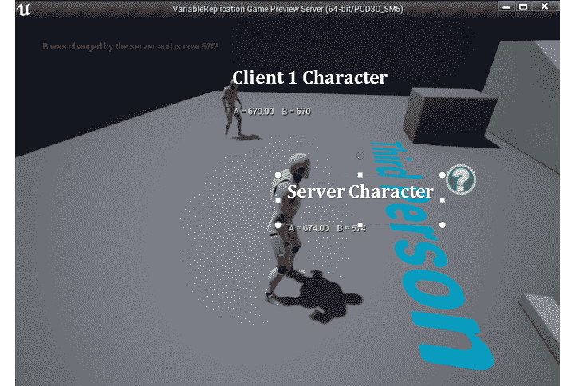

图 16.11：服务器窗口

可以观察到的输出如下：

+   “服务器”“角色” - `A = 674.00 B = 574`

+   “客户端 1”“角色” - `A = 670.00 B = 570`

在特定时间点，“服务器”“角色”的`A`值为`674`，`B`值为`574`。之所以`A`和`B`有不同的值，是因为`A`从`100`开始，`B`从`0`开始，这是`574`次`A++`和`B++`后的正确值。

至于为什么“客户端 1”“角色”的值与服务器角色不同，那是因为“客户端 1”稍后创建，所以在这种情况下，`A++`和`B++`的计数将偏移 4 个滴答声。

接下来，我们将查看“客户端 1”窗口。

## 客户端 1 窗口

在“客户端 1”窗口中，您可以看到“客户端 1 角色”的值，这是由“客户端 1”控制的角色，在后台，您可以看到“服务器角色”的值：

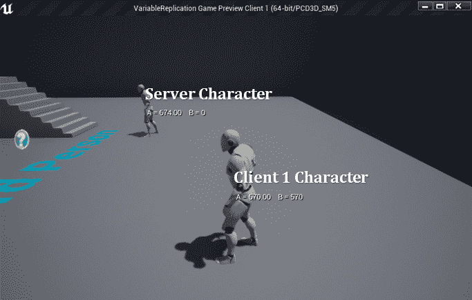

图 16.12：客户端 1 窗口

可以观察到的输出如下：

+   `Server` `Character` – `A = 674.00 B = 0`

+   `Client 1` `Character` – `A = 670.00 B = 570`

`Client 1 Character`从服务器那里得到了正确的值，因此变量复制正常工作。如果您查看`Server Character`，`A`是`674`，这是正确的，但`B`是`0`。原因是`A`使用了`DOREPLIFETIME`，它不会添加任何额外的复制条件，因此它将复制变量并在服务器上的变量更改时每次使客户端保持最新状态。

另一方面，变量`B`使用`DOREPLIFETIME_CONDITION`和`COND_OwnerOnly`，由于`Client 1`不是拥有`Server Character`的客户端（*监听服务器的客户端是*），因此该值不会被复制，并且保持不变为`0`的默认值。

如果您返回代码并将`B`的复制条件更改为使用`COND_SimulatedOnly`而不是`COND_OwnerOnly`，您会注意到结果将在`Client 1`窗口中被颠倒。`B`的值将被复制到`Server Character`，但不会复制到自己的角色。

注意

`RepNotify`消息显示在`Server`窗口而不是客户端窗口的原因是，当在编辑器中播放时，两个窗口共享同一个进程，因此在屏幕上打印文本不准确。要获得正确的行为，您需要运行游戏的打包版本。

# 2D 混合空间

在*第二章*，*使用虚幻引擎*中，我们创建了一个 1D 混合空间，根据`Speed`轴的值来混合角色的移动状态（*空闲、行走和奔跑*）。对于这个特定的示例，它工作得相当好，因为您只需要一个轴，但是如果我们希望角色也能够斜行，那么我们实际上无法做到。

为了探索这种情况，虚幻引擎允许您创建 2D 混合空间。概念几乎完全相同；唯一的区别是您有一个额外的轴用于动画，因此您不仅可以在水平方向上混合它们，还可以在垂直方向上混合它们。

## 练习 16.04：创建移动 2D 混合空间

在这个练习中，我们将创建一个使用两个轴而不是一个轴的混合空间。垂直轴将是`Speed`，取值范围为`0`到`800`。水平轴将是`Direction`，表示角色速度和旋转/前向矢量之间的相对角度（`-180 到 180`）。

以下图将帮助您计算本练习中的方向：

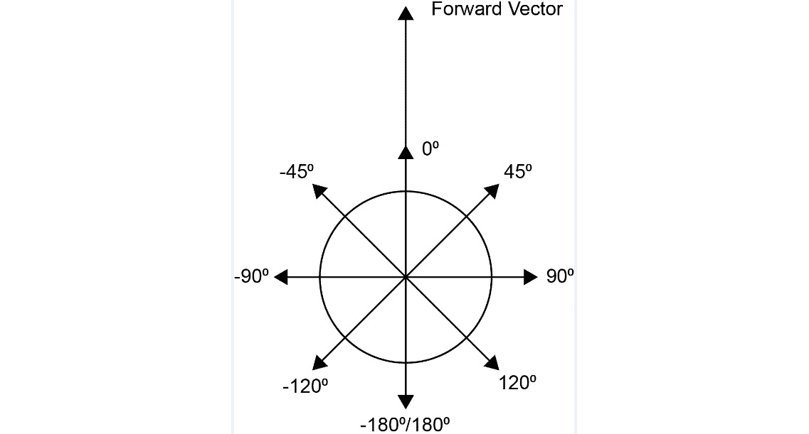

图 16.13：基于前向矢量和速度之间角度的方向值

在前面的图中，您可以看到方向是如何计算的。前向矢量表示角色当前面对的方向，数字表示如果前向矢量指向该方向，则前向矢量将与速度矢量形成的角度。如果角色朝向某个方向，然后按键移动角色向右，那么速度矢量将与前向矢量垂直。这意味着角度将是 90º，这将是我们的方向。

如果我们根据这个逻辑设置我们的 2D 混合空间，我们可以根据角色的移动角度使用正确的动画。

以下步骤将帮助您完成练习：

1.  使用`Blueprints`创建一个名为`Blendspace2D`的新`Third Person`模板项目，并将其保存到您选择的位置。

1.  项目创建后，应该打开编辑器。

1.  接下来，您将导入移动动画。在编辑器中，转到`Content\Mannequin\Animations`文件夹。

1.  点击`导入`按钮。

1.  进入`Chapter16\Exercise16.04\Assets`文件夹，选择所有`fbx`文件，然后点击`打开`按钮。

1.  在导入对话框中，确保选择角色的骨架并点击`Import All`按钮。

1.  保存所有新文件到`Assets`文件夹中。

1.  点击`Add New`按钮并选择`Animation -> Blend Space`。

1.  接下来，选择角色的骨架。

1.  重命名混合空间为`BS_Movement`并打开它。

1.  创建水平`Direction`轴（-180 至 180）和垂直`Speed`轴（0 至 800），如下图所示：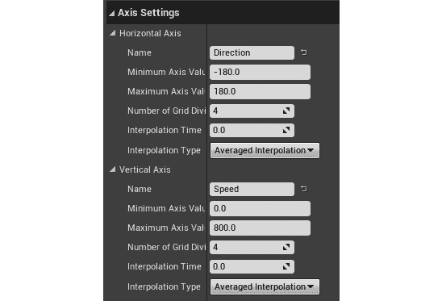

图 16.14：2D 混合空间轴设置

1.  将`Idle_Rifle_Ironsights`动画拖到`Speed`为`0`的 5 个网格条目上。

1.  将`Walk_Fwd_Rifle_Ironsights`动画拖到`Speed`为`800`，`Direction`为`0`的位置。

1.  将`Walk_Lt_Rifle_Ironsights`动画拖到`Speed`为`800`，`Direction`为`-90`的位置。

1.  将`Walk_Rt_Rifle_Ironsights`动画拖到`Speed`为`800`，`Direction`为`90`的位置。

您应该最终得到一个可以通过按住*Shift*并移动鼠标来预览的混合空间。

1.  现在，在`Asset Details`面板上，将`Target Weight Interpolation Speed Per Sec`变量设置为`5`，以使插值更加平滑。

1.  保存并关闭混合空间。

1.  现在，更新动画蓝图以使用新的混合空间。

1.  转到`Content\Mannequin\Animations`并打开随 Third Person 模板一起提供的文件–`ThirdPerson_AnimBP`。

1.  接下来，转到事件图并创建一个名为`Direction`的新浮点变量。

1.  使用`Calculate Direction`函数的结果设置`Direction`的值，该函数计算角度（-180º至 180º）在角色的`速度`和`旋转`之间：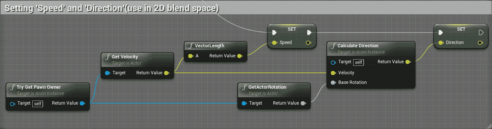

图 16.15：计算用于 2D 混合空间的速度和方向

注意

您可以在以下链接找到前面的截图的全分辨率版本以便更好地查看：[`packt.live/3pAbbAl`](https://packt.live/3pAbbAl)。

1.  在`AnimGraph`中，转到正在使用旧的 1D 混合空间的`Idle/Run`状态，如下截图所示：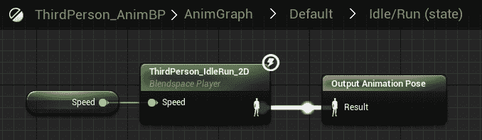

图 16.16：AnimGraph 中的空闲/奔跑状态

1.  用`BS_Movement`替换该混合空间，并像这样使用`Direction`变量：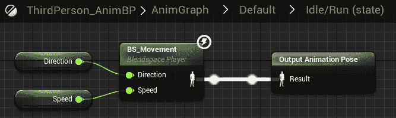

图 16.17：1D 混合空间已被新的 2D 混合空间替换

1.  保存并关闭动画蓝图。现在您需要更新角色。

1.  转到`Content\ThirdPersonBP\Blueprints`文件夹并打开`ThirdPersonCharacter`。

1.  在角色的`Details`面板上，将`Use Controller Rotation Yaw`设置为`true`，这将使角色的`Yaw`旋转始终面向控制旋转的 Yaw。

1.  转到角色移动组件并将`Max Walk Speed`设置为`800`。

1.  将`Orient Rotation to Movement`设置为`false`，这将防止角色朝向移动方向旋转。

1.  保存并关闭角色蓝图。

如果现在使用两个客户端玩游戏并移动角色，它将向前和向后走，但也会侧移，如下面的截图所示：

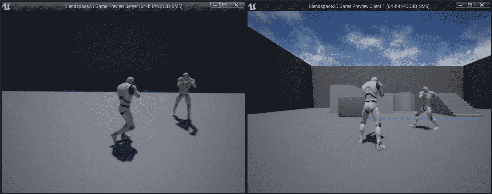

图 16.18：服务器和客户端 1 窗口上的预期输出

通过完成这个练习，您将提高对如何创建 2D 混合空间、它们的工作原理以及它们相对于仅使用常规 1D 混合空间的优势的理解。

在下一节中，我们将看一下如何转换角色的骨骼，以便根据摄像机的俯仰旋转玩家的躯干上下。

# 转换（修改）骨骼

在我们继续之前，有一个非常有用的节点，您可以在 AnimGraph 中使用，称为`Transform (Modify) Bone`节点，它允许您在*运行时*转换骨骼的平移、旋转和缩放。

您可以通过*右键单击*空白处，在`AnimGraph`中添加它，输入`transform modify`，然后从列表中选择节点。如果单击`Transform (Modify) Bone`节点，您将在`Details`面板上有相当多的选项。

以下是每个选项的解释。

+   `Bone to Modify`选项将告诉节点将要变换的骨骼是哪个。

在该选项之后，您有三个部分，分别代表每个变换操作（`Translation`，`Rotation`和`Scale`）。在每个部分中，您可以执行以下操作：

+   `Translation，Rotation，Scale`：此选项将告诉节点您要应用多少特定变换操作。最终结果将取决于您选择的模式（*在下一节中介绍*）。

有两种方法可以设置此值：

+   设置一个常量值，比如（`X=0.0,Y=0.0,Z=0.0`）

+   使用一个变量，这样它可以在运行时更改。为了实现这一点，您需要采取以下步骤（此示例是为了`Rotation`，但相同的概念也适用于`Translation`和`Scale`）：

1.  单击常量值旁边的复选框，并确保它被选中。一旦您这样做了，常量值的文本框将消失。

图 16.19：勾选复选框

`Transform (Modify) Bone`将添加一个输入，这样您就可以插入您的变量：

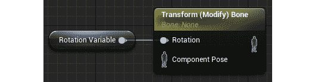

图 16.20：变量用作变换（修改）骨骼节点的输入

**设置模式**

这将告诉节点如何处理该值。您可以从以下三个选项中选择一个：

+   `Ignore`：不对提供的值进行任何操作。

+   `Add to Existing`：获取骨骼的当前值，并将提供的值添加到其中。

+   `Replace Existing`：用提供的值替换骨骼的当前值。

**设置空间**

这将定义节点应该应用变换的空间。您可以从以下四个选项中选择一个：

+   `World Space`：变换将发生在世界空间中。

+   `Component Space`：变换将发生在骨骼网格组件空间中。

+   `Parent Bone Space`：变换将发生在所选骨骼的父骨骼空间中。

+   `Bone Space`：变换将发生在所选骨骼的空间中。

最后但同样重要的是`Alpha`，它是一个值，允许您控制要应用的变换量。例如，如果`Alpha`值为浮点数，则不同值将产生以下行为：

+   如果`Alpha`为 0.0，则不会应用任何变换。

+   如果`Alpha`为 0.5，则只会应用一半的变换。

+   如果`Alpha`为 1.0，则会应用整个变换。

在下一个练习中，我们将使用`Transform (Modify) Bone`节点来使角色能够根据摄像机的旋转从*练习 16.04*，*创建一个 2D 混合运动空间*中上下观察。

## 练习 16.05：创建一个能够上下观察的角色

在这个练习中，我们将复制*练习 16.04*中的项目，*创建一个 2D 混合运动空间*，并使角色能够根据摄像机的旋转上下观察。为了实现这一点，我们将使用`Transform (Modify) Bone`节点来根据摄像机的俯仰在组件空间中旋转`spine_03`骨骼。

以下步骤将帮助您完成练习：

1.  首先，您需要复制并重命名*练习 16.04*中的项目，*创建一个 2D 混合运动空间*。

1.  从*练习 16.04*中复制`Blendspace2D`项目文件夹，*创建一个 2D 混合运动空间*，粘贴到一个新文件夹中，并将其重命名为`TransformModifyBone`。

1.  打开新的项目文件夹，将`Blendspace2D.uproject`文件重命名为`TransformModifyBone.uproject`，然后打开它。

接下来，您将更新动画蓝图。

1.  转到`Content\Mannequin\Animations`，并打开`ThirdPerson_AnimBP`。

1.  转到“事件图”，创建一个名为“俯仰”的浮点变量，并将其设置为 pawn 旋转和基本瞄准旋转之间的减法（或 delta）的俯仰，如下图所示：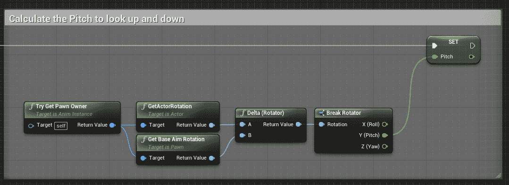

图 16.21：计算俯仰

作为使用“分解旋转器”节点的替代方法，您可以*右键单击*“返回值”，然后选择“拆分结构引脚”。

注意

“分解旋转器”节点允许您将“旋转器”变量分解为代表“俯仰”、“偏航”和“翻滚”的三个浮点变量。当您想要访问每个单独组件的值或者只想使用一个或两个组件而不是整个旋转时，这将非常有用。

请注意，“拆分结构引脚”选项只会在“返回值”未连接到任何东西时出现。一旦您进行拆分，它将创建三根分开的电线，分别代表“翻滚”、“俯仰”和“偏航”，就像一个分解但没有额外的节点。

你应该得到以下结果：

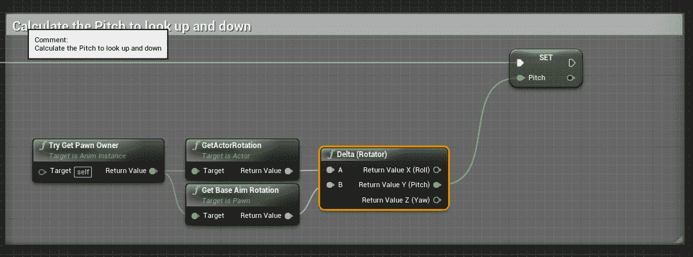

图 16.22：使用拆分结构引脚选项计算俯仰

这个逻辑使用了 pawn 的旋转并将其减去摄像机的旋转，以获得“俯仰”的差异，如下图所示：

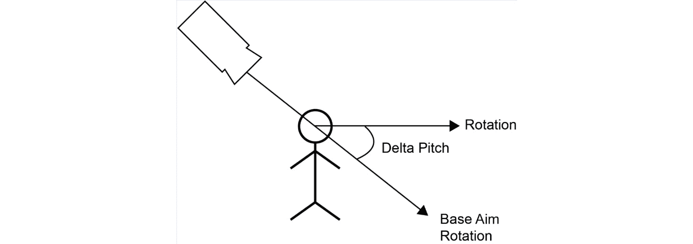

图 16.23：如何计算 Delta Pitch

1.  接下来，转到`AnimGraph`并添加一个带有以下设置的“变换（修改）骨骼”节点：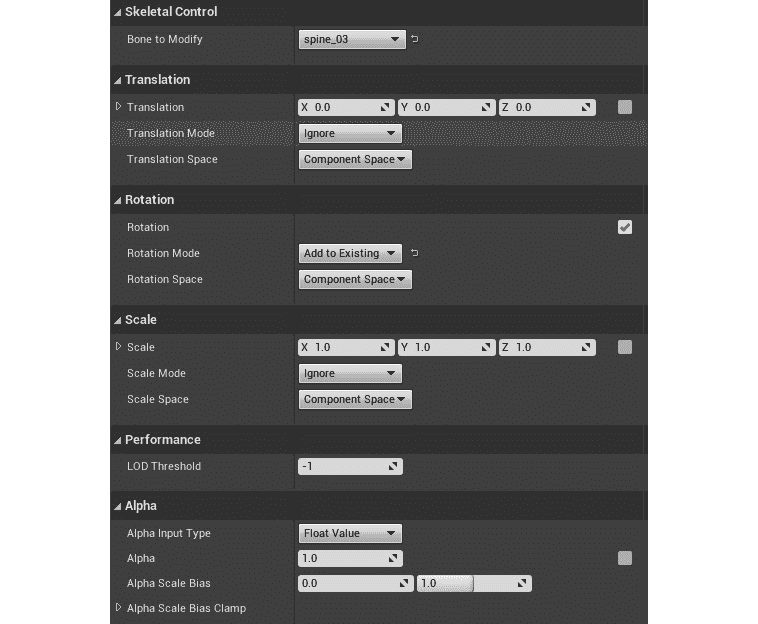

图 16.24：变换（修改）骨骼节点的设置

在前面的截图中，我们将“要修改的骨骼”设置为`spine_03`，因为这是我们想要旋转的骨骼。我们还将“旋转模式”设置为“添加到现有”，因为我们希望保留动画中的原始旋转并添加偏移量。其余选项需要保持默认值。

1.  将“变换（修改）骨骼”节点连接到“状态机”和“输出姿势”，如下截图所示：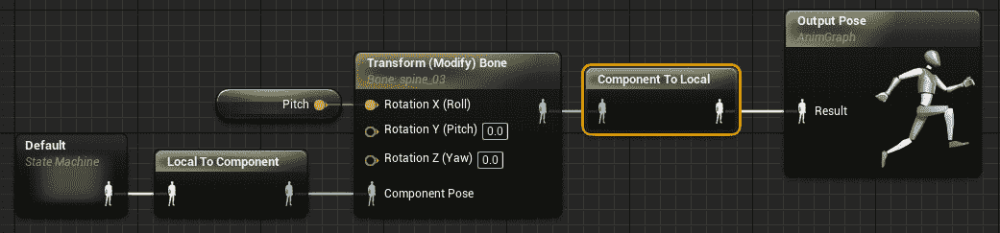

图 16.25：变换（修改）骨骼连接到输出姿势

在前面的图中，您可以看到完整的`AnimGraph`，它将允许角色通过旋转`spine_03`骨骼来上下查看，基于摄像机的俯仰。 “状态机”将是起点，从那里，它将需要转换为组件空间，以便能够使用“变换（修改）骨骼”节点，然后连接到“输出姿势”节点，再转换回本地空间。

注意

我们将“俯仰”变量连接到“翻滚”的原因是骨骼在骨架内部是以这种方式旋转的。您也可以在输入参数上使用“拆分结构引脚”，这样您就不必添加“制作旋转器”节点。

如果您使用两个客户端测试项目，并在其中一个角色上*向上*和*向下*移动鼠标，您会注意到它会上下俯仰，如下截图所示：

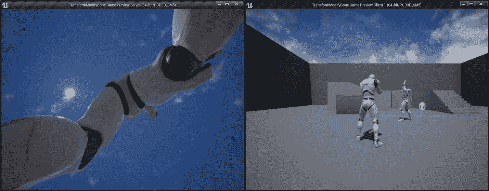

图 16.26：根据摄像机旋转使角色网格上下俯仰

通过完成这个最终练习，您将了解如何在动画蓝图中使用“变换（修改）骨骼”节点在运行时修改骨骼。这个节点可以在各种场景中使用，所以对您可能非常有用。

在下一个活动中，您将通过创建我们将在多人 FPS 项目中使用的角色来将您学到的一切付诸实践。

## 活动 16.01：为多人 FPS 项目创建角色

在此活动中，您将为我们在接下来的几章中构建的多人 FPS 项目创建角色。 角色将具有一些不同的机制，但是对于此活动，您只需要创建一个可以行走，跳跃，上下查看并具有两个复制的统计数据：生命值和护甲的角色。

以下步骤将帮助您完成此活动：

1.  创建一个名为`MultiplayerFPS`的`Blank C++`项目，不包含起始内容。

1.  从`Activity16.01\Assets`文件夹导入骨骼网格和动画，并将它们分别放置在`Content\Player\Mesh`和`Content\Player\Animations`文件夹中。

1.  从`Activity16.01\Assets`文件夹导入以下声音到`Content\Player\Sounds`：

+   `Jump.wav`：在`Jump_From_Stand_Ironsights`动画上使用`Play Sound`动画通知播放此声音。

+   `Footstep.wav`：通过使用`Play Sound`动画通知，在每次行走动画中脚踩在地板上时播放此声音。

+   `Spawn.wav`：在角色的`SpawnSound`变量上使用此音频。

1.  通过重新定位其骨骼并创建一个名为`Camera`的插座来设置骨骼网格，该插座是头骨的子级，并具有相对位置（*X=7.88, Y=4.73, Z=-10.00*）。

1.  在`Content\Player\Animations`中创建一个名为`BS_Movement`的 2D 混合空间，该空间使用导入的移动动画和`Target Weight Interpolation Speed Per Sec`为`5`。

1.  在`Project Settings`中创建输入映射，使用*第四章*中获得的知识，*Player Input*：

+   跳跃（动作映射）- *空格键*

+   向前移动（轴映射）- *W*（比例`1.0`）和*S*（比例`-1.0`）

+   向右移动（轴映射）- *A*（比例`-1.0`）和*D*（比例`1.0`）

+   转向（轴映射）- 鼠标*X*（比例`1.0`）

+   向上查看（轴映射）- 鼠标*Y*（比例`-1.0`）

1.  创建一个名为`FPSCharacter`的 C++类，执行以下操作：

+   派生自`Character`类。

+   在`Camera`插座上附加到骨骼网格上的摄像头组件，并将`pawn control rotation`设置为`true`。

+   具有仅复制到所有者的`health`和`armor`变量。

+   具有最大`health`和`armor`的变量，以及护甲吸收多少伤害的百分比。

+   具有初始化摄像头，禁用打勾，并将`Max Walk Speed`设置为`800`和`Jump Z Velocity`设置为`600`的构造函数。

+   在`BeginPlay`中，播放生成声音并在具有权限时初始化`health`为`max health`。

+   创建并绑定处理输入动作和轴的功能。

+   具有添加/删除/设置生命值的功能。 还确保角色死亡的情况。

+   具有添加/设置/吸收护甲的功能。护甲吸收根据`ArmorAbsorption`变量减少护甲，并根据以下公式更改伤害值：

*Damage = (Damage * (1 - ArmorAbsorption)) - FMath::Min(RemainingArmor, 0);*

1.  在`Content\Player\Animations`中创建名为`ABP_Player`的动画蓝图，其中包含以下状态的`State Machine`：

+   `Idle/Run`：使用具有`Speed`和`Direction`变量的`BS_Movement`

+   `Jump`：当`Is Jumping`变量为`true`时，播放跳跃动画并从`Idle/Run`状态转换

它还使用`Transform (Modify) Bone`根据相机的 Pitch 使角色上下俯仰。

1.  在`Content\UI`中创建一个名为`UI_HUD`的`UMG`小部件，以`Health: 100`和`Armor: 100`的格式显示角色的`Health`和`Armor`，使用*第十五章*中获得的知识，*Collectibles, Power-ups, and Pickups*。

1.  在`Content\Player`中创建一个名为`BP_Player`的蓝图，该蓝图派生自`FPSCharacter`，并设置网格组件具有以下值：

+   使用`SK_Mannequin`骨骼网格

+   使用`ABP_Player`动画蓝图

+   将`Location`设置为(*X=0.0, Y=0.0, Z=-88.0*)

+   将`Rotation`设置为(*X=0.0, Y=0.0, Z=-90.0*)

此外，在`Begin Play`事件中，需要创建`UI_HUD`的小部件实例并将其添加到视口中。

1.  在`Content\Blueprints`中创建一个名为`BP_GameMode`的蓝图，它派生自`MultiplayerFPSGameModeBase`，并将`BP_Player`作为`DefaultPawn`类使用。

1.  在`Content\Maps`中创建一个名为`DM-Test`的测试地图，并将其设置为`Project Settings`中的默认地图。

预期输出：

结果应该是一个项目，每个客户端都有一个第一人称角色，可以移动、跳跃和四处张望。这些动作也将被复制，因此每个客户端都能看到其他客户端角色正在做什么。

每个客户端还将拥有一个显示健康和护甲值的 HUD。

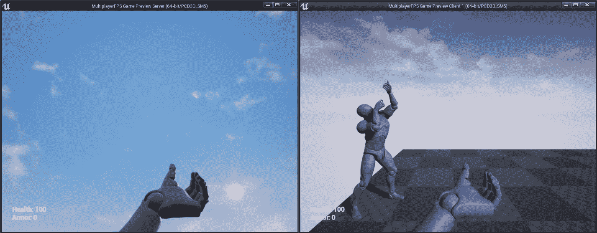

图 16.27：预期输出

注意

此活动的解决方案可在以下链接找到：[`packt.live/338jEBx`](https://packt.live/338jEBx)。

最终结果应该是两个角色可以看到彼此移动、跳跃和四处张望。每个客户端还会显示其角色的健康和护甲值。

通过完成此活动，您应该对服务器-客户端架构、变量复制、角色、2D 混合空间和“变换（修改）骨骼”节点的工作原理有一个很好的了解。

# 总结

在本章中，我们学习了一些关键的多人游戏概念，比如服务器-客户端架构的工作原理，服务器和客户端的责任，监听服务器设置比专用服务器快但不够轻量级，所有权和连接，角色和变量复制。

我们还学习了一些有用的动画技巧，比如如何使用 2D 混合空间，这允许您在两轴网格之间混合动画，以及变换（修改）骨骼节点，它具有在运行时修改骨骼的能力。最后，我们创建了一个第一人称多人游戏项目，其中您可以让角色行走、观看和跳跃，这将是我们在接下来的几章中将要开发的多人第一人称射击项目的基础。

在下一章中，我们将学习如何使用 RPCs，这允许客户端和服务器在彼此上执行函数。我们还将介绍如何在编辑器中使用枚举以及如何使用双向循环数组索引，这允许您在数组中向前和向后循环，并在超出限制时循环回来。
